cola Report for GDS968
==================

**Date**: 2019-12-25 22:22:16 CET, **cola version**: 1.3.2

----------------------------------------------------------------

<style type='text/css'>

body, td, th {
   font-family: Arial,Helvetica,sans-serif;
   background-color: white;
   font-size: 13px;
  max-width: 800px;
  margin: auto;
  margin-left:210px;
  padding: 0px 10px 0px 10px;
  border-left: 1px solid #EEEEEE;
  line-height: 150%;
}

tt, code, pre {
   font-family: 'DejaVu Sans Mono', 'Droid Sans Mono', 'Lucida Console', Consolas, Monaco, 

monospace;
}

h1 {
   font-size:2.2em;
}

h2 {
   font-size:1.8em;
}

h3 {
   font-size:1.4em;
}

h4 {
   font-size:1.0em;
}

h5 {
   font-size:0.9em;
}

h6 {
   font-size:0.8em;
}

a {
  text-decoration: none;
  color: #0366d6;
}

a:hover {
  text-decoration: underline;
}

a:visited {
   color: #0366d6;
}

pre, img {
  max-width: 100%;
}
pre {
  overflow-x: auto;
}
pre code {
   display: block; padding: 0.5em;
}

code {
  font-size: 92%;
  border: 1px solid #ccc;
}

code[class] {
  background-color: #F8F8F8;
}

table, td, th {
  border: 1px solid #ccc;
}

blockquote {
   color:#666666;
   margin:0;
   padding-left: 1em;
   border-left: 0.5em #EEE solid;
}

hr {
   height: 0px;
   border-bottom: none;
   border-top-width: thin;
   border-top-style: dotted;
   border-top-color: #999999;
}

@media print {
   * {
      background: transparent !important;
      color: black !important;
      filter:none !important;
      -ms-filter: none !important;
   }

   body {
      font-size:12pt;
      max-width:100%;
   }

   a, a:visited {
      text-decoration: underline;
   }

   hr {
      visibility: hidden;
      page-break-before: always;
   }

   pre, blockquote {
      padding-right: 1em;
      page-break-inside: avoid;
   }

   tr, img {
      page-break-inside: avoid;
   }

   img {
      max-width: 100% !important;
   }

   @page :left {
      margin: 15mm 20mm 15mm 10mm;
   }

   @page :right {
      margin: 15mm 10mm 15mm 20mm;
   }

   p, h2, h3 {
      orphans: 3; widows: 3;
   }

   h2, h3 {
      page-break-after: avoid;
   }
}
</style>


## Summary


All available functions which can be applied to this `res_list` object:


```r
res_list
```

```
#> A 'ConsensusPartitionList' object with 24 methods.
#>   On a matrix with 8411 rows and 171 columns.
#>   Top rows are extracted by 'SD, CV, MAD, ATC' methods.
#>   Subgroups are detected by 'hclust, kmeans, skmeans, pam, mclust, NMF' method.
#>   Number of partitions are tried for k = 2, 3, 4, 5, 6.
#>   Performed in total 30000 partitions by row resampling.
#> 
#> Following methods can be applied to this 'ConsensusPartitionList' object:
#>  [1] "cola_report"           "collect_classes"       "collect_plots"         "collect_stats"        
#>  [5] "colnames"              "functional_enrichment" "get_anno_col"          "get_anno"             
#>  [9] "get_classes"           "get_matrix"            "get_membership"        "get_stats"            
#> [13] "is_best_k"             "is_stable_k"           "ncol"                  "nrow"                 
#> [17] "rownames"              "show"                  "suggest_best_k"        "test_to_known_factors"
#> [21] "top_rows_heatmap"      "top_rows_overlap"     
#> 
#> You can get result for a single method by, e.g. object["SD", "hclust"] or object["SD:hclust"]
#> or a subset of methods by object[c("SD", "CV")], c("hclust", "kmeans")]
```

The call of `run_all_consensus_partition_methods()` was:


```
#> run_all_consensus_partition_methods(data = mat, mc.cores = 4, anno = anno)
```

Dimension of the input matrix:


```r
mat = get_matrix(res_list)
dim(mat)
```

```
#> [1] 8411  171
```

### Density distribution

The density distribution for each sample is visualized as in one column in the
following heatmap. The clustering is based on the distance which is the
Kolmogorov-Smirnov statistic between two distributions.


```r
library(ComplexHeatmap)
densityHeatmap(mat, top_annotation = HeatmapAnnotation(df = get_anno(res_list), 
    col = get_anno_col(res_list)), ylab = "value", cluster_columns = TRUE, show_column_names = FALSE,
    mc.cores = 4)
```

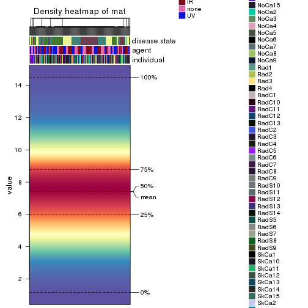


### Suggest the best k


Folowing table shows the best `k` (number of partitions) for each combination
of top-value methods and partition methods. Clicking on the method name in
the table goes to the section for a single combination of methods.

[The cola vignette](http://bioconductor.org/packages/devel/bioc/vignettes/cola/inst/doc/cola.html#toc_13)
explains the definition of the metrics used for determining the best
number of partitions.


```r
suggest_best_k(res_list)
```


|                            | The best k| 1-PAC| Mean silhouette| Concordance|   |
|:---------------------------|----------:|-----:|---------------:|-----------:|:--|
|[ATC:skmeans](#ATC-skmeans) |          3| 1.000|           0.975|       0.990|** |
|[ATC:kmeans](#ATC-kmeans)   |          3| 1.000|           0.972|       0.986|** |
|[ATC:pam](#ATC-pam)         |          3| 0.863|           0.899|       0.957|   |
|[ATC:NMF](#ATC-NMF)         |          2| 0.835|           0.899|       0.956|   |
|[CV:skmeans](#CV-skmeans)   |          2| 0.748|           0.898|       0.951|   |
|[SD:skmeans](#SD-skmeans)   |          2| 0.699|           0.863|       0.935|   |
|[CV:kmeans](#CV-kmeans)     |          2| 0.696|           0.899|       0.934|   |
|[MAD:skmeans](#MAD-skmeans) |          2| 0.667|           0.827|       0.918|   |
|[SD:kmeans](#SD-kmeans)     |          2| 0.662|           0.866|       0.917|   |
|[ATC:mclust](#ATC-mclust)   |          2| 0.662|           0.933|       0.958|   |
|[CV:NMF](#CV-NMF)           |          2| 0.658|           0.837|       0.929|   |
|[CV:mclust](#CV-mclust)     |          2| 0.642|           0.884|       0.928|   |
|[MAD:NMF](#MAD-NMF)         |          2| 0.600|           0.823|       0.922|   |
|[SD:NMF](#SD-NMF)           |          2| 0.598|           0.831|       0.923|   |
|[MAD:mclust](#MAD-mclust)   |          5| 0.578|           0.642|       0.768|   |
|[MAD:pam](#MAD-pam)         |          2| 0.457|           0.756|       0.894|   |
|[MAD:kmeans](#MAD-kmeans)   |          2| 0.413|           0.827|       0.881|   |
|[SD:pam](#SD-pam)           |          2| 0.377|           0.742|       0.876|   |
|[CV:pam](#CV-pam)           |          2| 0.339|           0.749|       0.871|   |
|[ATC:hclust](#ATC-hclust)   |          3| 0.320|           0.607|       0.813|   |
|[SD:mclust](#SD-mclust)     |          3| 0.266|           0.628|       0.754|   |
|[SD:hclust](#SD-hclust)     |          3| 0.203|           0.618|       0.773|   |
|[MAD:hclust](#MAD-hclust)   |          3| 0.190|           0.656|       0.789|   |
|[CV:hclust](#CV-hclust)     |          3| 0.159|           0.439|       0.731|   |

\*\*: 1-PAC > 0.95, \*: 1-PAC > 0.9


### CDF of consensus matrices

Cumulative distribution function curves of consensus matrix for all methods.


```r
collect_plots(res_list, fun = plot_ecdf)
```

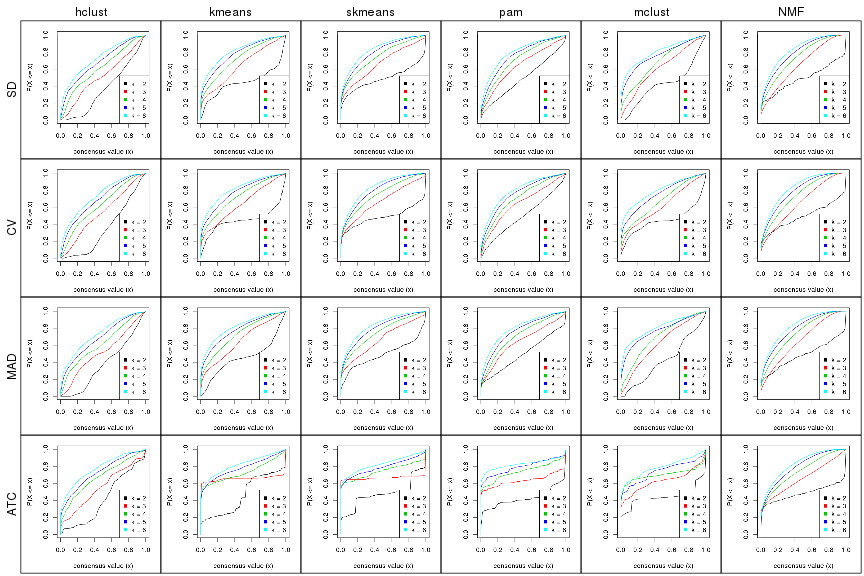


### Consensus heatmap

Consensus heatmaps for all methods. ([What is a consensus heatmap?](http://bioconductor.org/packages/devel/bioc/vignettes/cola/inst/doc/cola.html#toc_9))


<style type='text/css'>


.ui-helper-hidden {
	display: none;
}
.ui-helper-hidden-accessible {
	border: 0;
	clip: rect(0 0 0 0);
	height: 1px;
	margin: -1px;
	overflow: hidden;
	padding: 0;
	position: absolute;
	width: 1px;
}
.ui-helper-reset {
	margin: 0;
	padding: 0;
	border: 0;
	outline: 0;
	line-height: 1.3;
	text-decoration: none;
	font-size: 100%;
	list-style: none;
}
.ui-helper-clearfix:before,
.ui-helper-clearfix:after {
	content: "";
	display: table;
	border-collapse: collapse;
}
.ui-helper-clearfix:after {
	clear: both;
}
.ui-helper-zfix {
	width: 100%;
	height: 100%;
	top: 0;
	left: 0;
	position: absolute;
	opacity: 0;
	filter:Alpha(Opacity=0); 
}

.ui-front {
	z-index: 100;
}


.ui-state-disabled {
	cursor: default !important;
	pointer-events: none;
}


.ui-icon {
	display: inline-block;
	vertical-align: middle;
	margin-top: -.25em;
	position: relative;
	text-indent: -99999px;
	overflow: hidden;
	background-repeat: no-repeat;
}

.ui-widget-icon-block {
	left: 50%;
	margin-left: -8px;
	display: block;
}


.ui-widget-overlay {
	position: fixed;
	top: 0;
	left: 0;
	width: 100%;
	height: 100%;
}
.ui-accordion .ui-accordion-header {
	display: block;
	cursor: pointer;
	position: relative;
	margin: 2px 0 0 0;
	padding: .5em .5em .5em .7em;
	font-size: 100%;
}
.ui-accordion .ui-accordion-content {
	padding: 1em 2.2em;
	border-top: 0;
	overflow: auto;
}
.ui-autocomplete {
	position: absolute;
	top: 0;
	left: 0;
	cursor: default;
}
.ui-menu {
	list-style: none;
	padding: 0;
	margin: 0;
	display: block;
	outline: 0;
}
.ui-menu .ui-menu {
	position: absolute;
}
.ui-menu .ui-menu-item {
	margin: 0;
	cursor: pointer;
	
	list-style-image: url("data:image/gif;base64,R0lGODlhAQABAIAAAAAAAP///yH5BAEAAAAALAAAAAABAAEAAAIBRAA7");
}
.ui-menu .ui-menu-item-wrapper {
	position: relative;
	padding: 3px 1em 3px .4em;
}
.ui-menu .ui-menu-divider {
	margin: 5px 0;
	height: 0;
	font-size: 0;
	line-height: 0;
	border-width: 1px 0 0 0;
}
.ui-menu .ui-state-focus,
.ui-menu .ui-state-active {
	margin: -1px;
}


.ui-menu-icons {
	position: relative;
}
.ui-menu-icons .ui-menu-item-wrapper {
	padding-left: 2em;
}


.ui-menu .ui-icon {
	position: absolute;
	top: 0;
	bottom: 0;
	left: .2em;
	margin: auto 0;
}


.ui-menu .ui-menu-icon {
	left: auto;
	right: 0;
}
.ui-button {
	padding: .4em 1em;
	display: inline-block;
	position: relative;
	line-height: normal;
	margin-right: .1em;
	cursor: pointer;
	vertical-align: middle;
	text-align: center;
	-webkit-user-select: none;
	-moz-user-select: none;
	-ms-user-select: none;
	user-select: none;

	
	overflow: visible;
}

.ui-button,
.ui-button:link,
.ui-button:visited,
.ui-button:hover,
.ui-button:active {
	text-decoration: none;
}


.ui-button-icon-only {
	width: 2em;
	box-sizing: border-box;
	text-indent: -9999px;
	white-space: nowrap;
}


input.ui-button.ui-button-icon-only {
	text-indent: 0;
}


.ui-button-icon-only .ui-icon {
	position: absolute;
	top: 50%;
	left: 50%;
	margin-top: -8px;
	margin-left: -8px;
}

.ui-button.ui-icon-notext .ui-icon {
	padding: 0;
	width: 2.1em;
	height: 2.1em;
	text-indent: -9999px;
	white-space: nowrap;

}

input.ui-button.ui-icon-notext .ui-icon {
	width: auto;
	height: auto;
	text-indent: 0;
	white-space: normal;
	padding: .4em 1em;
}


input.ui-button::-moz-focus-inner,
button.ui-button::-moz-focus-inner {
	border: 0;
	padding: 0;
}
.ui-controlgroup {
	vertical-align: middle;
	display: inline-block;
}
.ui-controlgroup > .ui-controlgroup-item {
	float: left;
	margin-left: 0;
	margin-right: 0;
}
.ui-controlgroup > .ui-controlgroup-item:focus,
.ui-controlgroup > .ui-controlgroup-item.ui-visual-focus {
	z-index: 9999;
}
.ui-controlgroup-vertical > .ui-controlgroup-item {
	display: block;
	float: none;
	width: 100%;
	margin-top: 0;
	margin-bottom: 0;
	text-align: left;
}
.ui-controlgroup-vertical .ui-controlgroup-item {
	box-sizing: border-box;
}
.ui-controlgroup .ui-controlgroup-label {
	padding: .4em 1em;
}
.ui-controlgroup .ui-controlgroup-label span {
	font-size: 80%;
}
.ui-controlgroup-horizontal .ui-controlgroup-label + .ui-controlgroup-item {
	border-left: none;
}
.ui-controlgroup-vertical .ui-controlgroup-label + .ui-controlgroup-item {
	border-top: none;
}
.ui-controlgroup-horizontal .ui-controlgroup-label.ui-widget-content {
	border-right: none;
}
.ui-controlgroup-vertical .ui-controlgroup-label.ui-widget-content {
	border-bottom: none;
}


.ui-controlgroup-vertical .ui-spinner-input {

	
	width: 75%;
	width: calc( 100% - 2.4em );
}
.ui-controlgroup-vertical .ui-spinner .ui-spinner-up {
	border-top-style: solid;
}

.ui-checkboxradio-label .ui-icon-background {
	box-shadow: inset 1px 1px 1px #ccc;
	border-radius: .12em;
	border: none;
}
.ui-checkboxradio-radio-label .ui-icon-background {
	width: 16px;
	height: 16px;
	border-radius: 1em;
	overflow: visible;
	border: none;
}
.ui-checkboxradio-radio-label.ui-checkboxradio-checked .ui-icon,
.ui-checkboxradio-radio-label.ui-checkboxradio-checked:hover .ui-icon {
	background-image: none;
	width: 8px;
	height: 8px;
	border-width: 4px;
	border-style: solid;
}
.ui-checkboxradio-disabled {
	pointer-events: none;
}
.ui-datepicker {
	width: 17em;
	padding: .2em .2em 0;
	display: none;
}
.ui-datepicker .ui-datepicker-header {
	position: relative;
	padding: .2em 0;
}
.ui-datepicker .ui-datepicker-prev,
.ui-datepicker .ui-datepicker-next {
	position: absolute;
	top: 2px;
	width: 1.8em;
	height: 1.8em;
}
.ui-datepicker .ui-datepicker-prev-hover,
.ui-datepicker .ui-datepicker-next-hover {
	top: 1px;
}
.ui-datepicker .ui-datepicker-prev {
	left: 2px;
}
.ui-datepicker .ui-datepicker-next {
	right: 2px;
}
.ui-datepicker .ui-datepicker-prev-hover {
	left: 1px;
}
.ui-datepicker .ui-datepicker-next-hover {
	right: 1px;
}
.ui-datepicker .ui-datepicker-prev span,
.ui-datepicker .ui-datepicker-next span {
	display: block;
	position: absolute;
	left: 50%;
	margin-left: -8px;
	top: 50%;
	margin-top: -8px;
}
.ui-datepicker .ui-datepicker-title {
	margin: 0 2.3em;
	line-height: 1.8em;
	text-align: center;
}
.ui-datepicker .ui-datepicker-title select {
	font-size: 1em;
	margin: 1px 0;
}
.ui-datepicker select.ui-datepicker-month,
.ui-datepicker select.ui-datepicker-year {
	width: 45%;
}
.ui-datepicker table {
	width: 100%;
	font-size: .9em;
	border-collapse: collapse;
	margin: 0 0 .4em;
}
.ui-datepicker th {
	padding: .7em .3em;
	text-align: center;
	font-weight: bold;
	border: 0;
}
.ui-datepicker td {
	border: 0;
	padding: 1px;
}
.ui-datepicker td span,
.ui-datepicker td a {
	display: block;
	padding: .2em;
	text-align: right;
	text-decoration: none;
}
.ui-datepicker .ui-datepicker-buttonpane {
	background-image: none;
	margin: .7em 0 0 0;
	padding: 0 .2em;
	border-left: 0;
	border-right: 0;
	border-bottom: 0;
}
.ui-datepicker .ui-datepicker-buttonpane button {
	float: right;
	margin: .5em .2em .4em;
	cursor: pointer;
	padding: .2em .6em .3em .6em;
	width: auto;
	overflow: visible;
}
.ui-datepicker .ui-datepicker-buttonpane button.ui-datepicker-current {
	float: left;
}


.ui-datepicker.ui-datepicker-multi {
	width: auto;
}
.ui-datepicker-multi .ui-datepicker-group {
	float: left;
}
.ui-datepicker-multi .ui-datepicker-group table {
	width: 95%;
	margin: 0 auto .4em;
}
.ui-datepicker-multi-2 .ui-datepicker-group {
	width: 50%;
}
.ui-datepicker-multi-3 .ui-datepicker-group {
	width: 33.3%;
}
.ui-datepicker-multi-4 .ui-datepicker-group {
	width: 25%;
}
.ui-datepicker-multi .ui-datepicker-group-last .ui-datepicker-header,
.ui-datepicker-multi .ui-datepicker-group-middle .ui-datepicker-header {
	border-left-width: 0;
}
.ui-datepicker-multi .ui-datepicker-buttonpane {
	clear: left;
}
.ui-datepicker-row-break {
	clear: both;
	width: 100%;
	font-size: 0;
}


.ui-datepicker-rtl {
	direction: rtl;
}
.ui-datepicker-rtl .ui-datepicker-prev {
	right: 2px;
	left: auto;
}
.ui-datepicker-rtl .ui-datepicker-next {
	left: 2px;
	right: auto;
}
.ui-datepicker-rtl .ui-datepicker-prev:hover {
	right: 1px;
	left: auto;
}
.ui-datepicker-rtl .ui-datepicker-next:hover {
	left: 1px;
	right: auto;
}
.ui-datepicker-rtl .ui-datepicker-buttonpane {
	clear: right;
}
.ui-datepicker-rtl .ui-datepicker-buttonpane button {
	float: left;
}
.ui-datepicker-rtl .ui-datepicker-buttonpane button.ui-datepicker-current,
.ui-datepicker-rtl .ui-datepicker-group {
	float: right;
}
.ui-datepicker-rtl .ui-datepicker-group-last .ui-datepicker-header,
.ui-datepicker-rtl .ui-datepicker-group-middle .ui-datepicker-header {
	border-right-width: 0;
	border-left-width: 1px;
}


.ui-datepicker .ui-icon {
	display: block;
	text-indent: -99999px;
	overflow: hidden;
	background-repeat: no-repeat;
	left: .5em;
	top: .3em;
}
.ui-dialog {
	position: absolute;
	top: 0;
	left: 0;
	padding: .2em;
	outline: 0;
}
.ui-dialog .ui-dialog-titlebar {
	padding: .4em 1em;
	position: relative;
}
.ui-dialog .ui-dialog-title {
	float: left;
	margin: .1em 0;
	white-space: nowrap;
	width: 90%;
	overflow: hidden;
	text-overflow: ellipsis;
}
.ui-dialog .ui-dialog-titlebar-close {
	position: absolute;
	right: .3em;
	top: 50%;
	width: 20px;
	margin: -10px 0 0 0;
	padding: 1px;
	height: 20px;
}
.ui-dialog .ui-dialog-content {
	position: relative;
	border: 0;
	padding: .5em 1em;
	background: none;
	overflow: auto;
}
.ui-dialog .ui-dialog-buttonpane {
	text-align: left;
	border-width: 1px 0 0 0;
	background-image: none;
	margin-top: .5em;
	padding: .3em 1em .5em .4em;
}
.ui-dialog .ui-dialog-buttonpane .ui-dialog-buttonset {
	float: right;
}
.ui-dialog .ui-dialog-buttonpane button {
	margin: .5em .4em .5em 0;
	cursor: pointer;
}
.ui-dialog .ui-resizable-n {
	height: 2px;
	top: 0;
}
.ui-dialog .ui-resizable-e {
	width: 2px;
	right: 0;
}
.ui-dialog .ui-resizable-s {
	height: 2px;
	bottom: 0;
}
.ui-dialog .ui-resizable-w {
	width: 2px;
	left: 0;
}
.ui-dialog .ui-resizable-se,
.ui-dialog .ui-resizable-sw,
.ui-dialog .ui-resizable-ne,
.ui-dialog .ui-resizable-nw {
	width: 7px;
	height: 7px;
}
.ui-dialog .ui-resizable-se {
	right: 0;
	bottom: 0;
}
.ui-dialog .ui-resizable-sw {
	left: 0;
	bottom: 0;
}
.ui-dialog .ui-resizable-ne {
	right: 0;
	top: 0;
}
.ui-dialog .ui-resizable-nw {
	left: 0;
	top: 0;
}
.ui-draggable .ui-dialog-titlebar {
	cursor: move;
}
.ui-draggable-handle {
	-ms-touch-action: none;
	touch-action: none;
}
.ui-resizable {
	position: relative;
}
.ui-resizable-handle {
	position: absolute;
	font-size: 0.1px;
	display: block;
	-ms-touch-action: none;
	touch-action: none;
}
.ui-resizable-disabled .ui-resizable-handle,
.ui-resizable-autohide .ui-resizable-handle {
	display: none;
}
.ui-resizable-n {
	cursor: n-resize;
	height: 7px;
	width: 100%;
	top: -5px;
	left: 0;
}
.ui-resizable-s {
	cursor: s-resize;
	height: 7px;
	width: 100%;
	bottom: -5px;
	left: 0;
}
.ui-resizable-e {
	cursor: e-resize;
	width: 7px;
	right: -5px;
	top: 0;
	height: 100%;
}
.ui-resizable-w {
	cursor: w-resize;
	width: 7px;
	left: -5px;
	top: 0;
	height: 100%;
}
.ui-resizable-se {
	cursor: se-resize;
	width: 12px;
	height: 12px;
	right: 1px;
	bottom: 1px;
}
.ui-resizable-sw {
	cursor: sw-resize;
	width: 9px;
	height: 9px;
	left: -5px;
	bottom: -5px;
}
.ui-resizable-nw {
	cursor: nw-resize;
	width: 9px;
	height: 9px;
	left: -5px;
	top: -5px;
}
.ui-resizable-ne {
	cursor: ne-resize;
	width: 9px;
	height: 9px;
	right: -5px;
	top: -5px;
}
.ui-progressbar {
	height: 2em;
	text-align: left;
	overflow: hidden;
}
.ui-progressbar .ui-progressbar-value {
	margin: -1px;
	height: 100%;
}
.ui-progressbar .ui-progressbar-overlay {
	background: url("");
	height: 100%;
	filter: alpha(opacity=25); 
	opacity: 0.25;
}
.ui-progressbar-indeterminate .ui-progressbar-value {
	background-image: none;
}
.ui-selectable {
	-ms-touch-action: none;
	touch-action: none;
}
.ui-selectable-helper {
	position: absolute;
	z-index: 100;
	border: 1px dotted black;
}
.ui-selectmenu-menu {
	padding: 0;
	margin: 0;
	position: absolute;
	top: 0;
	left: 0;
	display: none;
}
.ui-selectmenu-menu .ui-menu {
	overflow: auto;
	overflow-x: hidden;
	padding-bottom: 1px;
}
.ui-selectmenu-menu .ui-menu .ui-selectmenu-optgroup {
	font-size: 1em;
	font-weight: bold;
	line-height: 1.5;
	padding: 2px 0.4em;
	margin: 0.5em 0 0 0;
	height: auto;
	border: 0;
}
.ui-selectmenu-open {
	display: block;
}
.ui-selectmenu-text {
	display: block;
	margin-right: 20px;
	overflow: hidden;
	text-overflow: ellipsis;
}
.ui-selectmenu-button.ui-button {
	text-align: left;
	white-space: nowrap;
	width: 14em;
}
.ui-selectmenu-icon.ui-icon {
	float: right;
	margin-top: 0;
}
.ui-slider {
	position: relative;
	text-align: left;
}
.ui-slider .ui-slider-handle {
	position: absolute;
	z-index: 2;
	width: 1.2em;
	height: 1.2em;
	cursor: default;
	-ms-touch-action: none;
	touch-action: none;
}
.ui-slider .ui-slider-range {
	position: absolute;
	z-index: 1;
	font-size: .7em;
	display: block;
	border: 0;
	background-position: 0 0;
}


.ui-slider.ui-state-disabled .ui-slider-handle,
.ui-slider.ui-state-disabled .ui-slider-range {
	filter: inherit;
}

.ui-slider-horizontal {
	height: .8em;
}
.ui-slider-horizontal .ui-slider-handle {
	top: -.3em;
	margin-left: -.6em;
}
.ui-slider-horizontal .ui-slider-range {
	top: 0;
	height: 100%;
}
.ui-slider-horizontal .ui-slider-range-min {
	left: 0;
}
.ui-slider-horizontal .ui-slider-range-max {
	right: 0;
}

.ui-slider-vertical {
	width: .8em;
	height: 100px;
}
.ui-slider-vertical .ui-slider-handle {
	left: -.3em;
	margin-left: 0;
	margin-bottom: -.6em;
}
.ui-slider-vertical .ui-slider-range {
	left: 0;
	width: 100%;
}
.ui-slider-vertical .ui-slider-range-min {
	bottom: 0;
}
.ui-slider-vertical .ui-slider-range-max {
	top: 0;
}
.ui-sortable-handle {
	-ms-touch-action: none;
	touch-action: none;
}
.ui-spinner {
	position: relative;
	display: inline-block;
	overflow: hidden;
	padding: 0;
	vertical-align: middle;
}
.ui-spinner-input {
	border: none;
	background: none;
	color: inherit;
	padding: .222em 0;
	margin: .2em 0;
	vertical-align: middle;
	margin-left: .4em;
	margin-right: 2em;
}
.ui-spinner-button {
	width: 1.6em;
	height: 50%;
	font-size: .5em;
	padding: 0;
	margin: 0;
	text-align: center;
	position: absolute;
	cursor: default;
	display: block;
	overflow: hidden;
	right: 0;
}

.ui-spinner a.ui-spinner-button {
	border-top-style: none;
	border-bottom-style: none;
	border-right-style: none;
}
.ui-spinner-up {
	top: 0;
}
.ui-spinner-down {
	bottom: 0;
}
.ui-tabs {
	position: relative;
	padding: .2em;
}
.ui-tabs .ui-tabs-nav {
	margin: 0;
	padding: .2em .2em 0;
}
.ui-tabs .ui-tabs-nav li {
	list-style: none;
	float: left;
	position: relative;
	top: 0;
	margin: 1px .2em 0 0;
	border-bottom-width: 0;
	padding: 0;
	white-space: nowrap;
}
.ui-tabs .ui-tabs-nav .ui-tabs-anchor {
	float: left;
	padding: .5em 1em;
	text-decoration: none;
}
.ui-tabs .ui-tabs-nav li.ui-tabs-active {
	margin-bottom: -1px;
	padding-bottom: 1px;
}
.ui-tabs .ui-tabs-nav li.ui-tabs-active .ui-tabs-anchor,
.ui-tabs .ui-tabs-nav li.ui-state-disabled .ui-tabs-anchor,
.ui-tabs .ui-tabs-nav li.ui-tabs-loading .ui-tabs-anchor {
	cursor: text;
}
.ui-tabs-collapsible .ui-tabs-nav li.ui-tabs-active .ui-tabs-anchor {
	cursor: pointer;
}
.ui-tabs .ui-tabs-panel {
	display: block;
	border-width: 0;
	padding: 1em 1.4em;
	background: none;
}
.ui-tooltip {
	padding: 8px;
	position: absolute;
	z-index: 9999;
	max-width: 300px;
}
body .ui-tooltip {
	border-width: 2px;
}

.ui-widget {
	font-family: Arial,Helvetica,sans-serif;
	font-size: 1em;
}
.ui-widget .ui-widget {
	font-size: 1em;
}
.ui-widget input,
.ui-widget select,
.ui-widget textarea,
.ui-widget button {
	font-family: Arial,Helvetica,sans-serif;
	font-size: 1em;
}
.ui-widget.ui-widget-content {
	border: 1px solid #c5c5c5;
}
.ui-widget-content {
	border: 1px solid #dddddd;
	background: #ffffff;
	color: #333333;
}
.ui-widget-content a {
	color: #333333;
}
.ui-widget-header {
	border: 1px solid #dddddd;
	background: #e9e9e9;
	color: #333333;
	font-weight: bold;
}
.ui-widget-header a {
	color: #333333;
}


.ui-state-default,
.ui-widget-content .ui-state-default,
.ui-widget-header .ui-state-default,
.ui-button,


html .ui-button.ui-state-disabled:hover,
html .ui-button.ui-state-disabled:active {
	border: 1px solid #c5c5c5;
	background: #f6f6f6;
	font-weight: normal;
	color: #454545;
}
.ui-state-default a,
.ui-state-default a:link,
.ui-state-default a:visited,
a.ui-button,
a:link.ui-button,
a:visited.ui-button,
.ui-button {
	color: #454545;
	text-decoration: none;
}
.ui-state-hover,
.ui-widget-content .ui-state-hover,
.ui-widget-header .ui-state-hover,
.ui-state-focus,
.ui-widget-content .ui-state-focus,
.ui-widget-header .ui-state-focus,
.ui-button:hover,
.ui-button:focus {
	border: 1px solid #cccccc;
	background: #ededed;
	font-weight: normal;
	color: #2b2b2b;
}
.ui-state-hover a,
.ui-state-hover a:hover,
.ui-state-hover a:link,
.ui-state-hover a:visited,
.ui-state-focus a,
.ui-state-focus a:hover,
.ui-state-focus a:link,
.ui-state-focus a:visited,
a.ui-button:hover,
a.ui-button:focus {
	color: #2b2b2b;
	text-decoration: none;
}

.ui-visual-focus {
	box-shadow: 0 0 3px 1px rgb(94, 158, 214);
}
.ui-state-active,
.ui-widget-content .ui-state-active,
.ui-widget-header .ui-state-active,
a.ui-button:active,
.ui-button:active,
.ui-button.ui-state-active:hover {
	border: 1px solid #003eff;
	background: #007fff;
	font-weight: normal;
	color: #ffffff;
}
.ui-icon-background,
.ui-state-active .ui-icon-background {
	border: #003eff;
	background-color: #ffffff;
}
.ui-state-active a,
.ui-state-active a:link,
.ui-state-active a:visited {
	color: #ffffff;
	text-decoration: none;
}


.ui-state-highlight,
.ui-widget-content .ui-state-highlight,
.ui-widget-header .ui-state-highlight {
	border: 1px solid #dad55e;
	background: #fffa90;
	color: #777620;
}
.ui-state-checked {
	border: 1px solid #dad55e;
	background: #fffa90;
}
.ui-state-highlight a,
.ui-widget-content .ui-state-highlight a,
.ui-widget-header .ui-state-highlight a {
	color: #777620;
}
.ui-state-error,
.ui-widget-content .ui-state-error,
.ui-widget-header .ui-state-error {
	border: 1px solid #f1a899;
	background: #fddfdf;
	color: #5f3f3f;
}
.ui-state-error a,
.ui-widget-content .ui-state-error a,
.ui-widget-header .ui-state-error a {
	color: #5f3f3f;
}
.ui-state-error-text,
.ui-widget-content .ui-state-error-text,
.ui-widget-header .ui-state-error-text {
	color: #5f3f3f;
}
.ui-priority-primary,
.ui-widget-content .ui-priority-primary,
.ui-widget-header .ui-priority-primary {
	font-weight: bold;
}
.ui-priority-secondary,
.ui-widget-content .ui-priority-secondary,
.ui-widget-header .ui-priority-secondary {
	opacity: .7;
	filter:Alpha(Opacity=70); 
	font-weight: normal;
}
.ui-state-disabled,
.ui-widget-content .ui-state-disabled,
.ui-widget-header .ui-state-disabled {
	opacity: .35;
	filter:Alpha(Opacity=35); 
	background-image: none;
}
.ui-state-disabled .ui-icon {
	filter:Alpha(Opacity=35); 
}


.ui-icon {
	width: 16px;
	height: 16px;
}
.ui-icon,
.ui-widget-content .ui-icon {
	background-image: url("images/ui-icons_444444_256x240.png");
}
.ui-widget-header .ui-icon {
	background-image: url("images/ui-icons_444444_256x240.png");
}
.ui-state-hover .ui-icon,
.ui-state-focus .ui-icon,
.ui-button:hover .ui-icon,
.ui-button:focus .ui-icon {
	background-image: url("images/ui-icons_555555_256x240.png");
}
.ui-state-active .ui-icon,
.ui-button:active .ui-icon {
	background-image: url("images/ui-icons_ffffff_256x240.png");
}
.ui-state-highlight .ui-icon,
.ui-button .ui-state-highlight.ui-icon {
	background-image: url("images/ui-icons_777620_256x240.png");
}
.ui-state-error .ui-icon,
.ui-state-error-text .ui-icon {
	background-image: url("images/ui-icons_cc0000_256x240.png");
}
.ui-button .ui-icon {
	background-image: url("images/ui-icons_777777_256x240.png");
}


.ui-icon-blank { background-position: 16px 16px; }
.ui-icon-caret-1-n { background-position: 0 0; }
.ui-icon-caret-1-ne { background-position: -16px 0; }
.ui-icon-caret-1-e { background-position: -32px 0; }
.ui-icon-caret-1-se { background-position: -48px 0; }
.ui-icon-caret-1-s { background-position: -65px 0; }
.ui-icon-caret-1-sw { background-position: -80px 0; }
.ui-icon-caret-1-w { background-position: -96px 0; }
.ui-icon-caret-1-nw { background-position: -112px 0; }
.ui-icon-caret-2-n-s { background-position: -128px 0; }
.ui-icon-caret-2-e-w { background-position: -144px 0; }
.ui-icon-triangle-1-n { background-position: 0 -16px; }
.ui-icon-triangle-1-ne { background-position: -16px -16px; }
.ui-icon-triangle-1-e { background-position: -32px -16px; }
.ui-icon-triangle-1-se { background-position: -48px -16px; }
.ui-icon-triangle-1-s { background-position: -65px -16px; }
.ui-icon-triangle-1-sw { background-position: -80px -16px; }
.ui-icon-triangle-1-w { background-position: -96px -16px; }
.ui-icon-triangle-1-nw { background-position: -112px -16px; }
.ui-icon-triangle-2-n-s { background-position: -128px -16px; }
.ui-icon-triangle-2-e-w { background-position: -144px -16px; }
.ui-icon-arrow-1-n { background-position: 0 -32px; }
.ui-icon-arrow-1-ne { background-position: -16px -32px; }
.ui-icon-arrow-1-e { background-position: -32px -32px; }
.ui-icon-arrow-1-se { background-position: -48px -32px; }
.ui-icon-arrow-1-s { background-position: -65px -32px; }
.ui-icon-arrow-1-sw { background-position: -80px -32px; }
.ui-icon-arrow-1-w { background-position: -96px -32px; }
.ui-icon-arrow-1-nw { background-position: -112px -32px; }
.ui-icon-arrow-2-n-s { background-position: -128px -32px; }
.ui-icon-arrow-2-ne-sw { background-position: -144px -32px; }
.ui-icon-arrow-2-e-w { background-position: -160px -32px; }
.ui-icon-arrow-2-se-nw { background-position: -176px -32px; }
.ui-icon-arrowstop-1-n { background-position: -192px -32px; }
.ui-icon-arrowstop-1-e { background-position: -208px -32px; }
.ui-icon-arrowstop-1-s { background-position: -224px -32px; }
.ui-icon-arrowstop-1-w { background-position: -240px -32px; }
.ui-icon-arrowthick-1-n { background-position: 1px -48px; }
.ui-icon-arrowthick-1-ne { background-position: -16px -48px; }
.ui-icon-arrowthick-1-e { background-position: -32px -48px; }
.ui-icon-arrowthick-1-se { background-position: -48px -48px; }
.ui-icon-arrowthick-1-s { background-position: -64px -48px; }
.ui-icon-arrowthick-1-sw { background-position: -80px -48px; }
.ui-icon-arrowthick-1-w { background-position: -96px -48px; }
.ui-icon-arrowthick-1-nw { background-position: -112px -48px; }
.ui-icon-arrowthick-2-n-s { background-position: -128px -48px; }
.ui-icon-arrowthick-2-ne-sw { background-position: -144px -48px; }
.ui-icon-arrowthick-2-e-w { background-position: -160px -48px; }
.ui-icon-arrowthick-2-se-nw { background-position: -176px -48px; }
.ui-icon-arrowthickstop-1-n { background-position: -192px -48px; }
.ui-icon-arrowthickstop-1-e { background-position: -208px -48px; }
.ui-icon-arrowthickstop-1-s { background-position: -224px -48px; }
.ui-icon-arrowthickstop-1-w { background-position: -240px -48px; }
.ui-icon-arrowreturnthick-1-w { background-position: 0 -64px; }
.ui-icon-arrowreturnthick-1-n { background-position: -16px -64px; }
.ui-icon-arrowreturnthick-1-e { background-position: -32px -64px; }
.ui-icon-arrowreturnthick-1-s { background-position: -48px -64px; }
.ui-icon-arrowreturn-1-w { background-position: -64px -64px; }
.ui-icon-arrowreturn-1-n { background-position: -80px -64px; }
.ui-icon-arrowreturn-1-e { background-position: -96px -64px; }
.ui-icon-arrowreturn-1-s { background-position: -112px -64px; }
.ui-icon-arrowrefresh-1-w { background-position: -128px -64px; }
.ui-icon-arrowrefresh-1-n { background-position: -144px -64px; }
.ui-icon-arrowrefresh-1-e { background-position: -160px -64px; }
.ui-icon-arrowrefresh-1-s { background-position: -176px -64px; }
.ui-icon-arrow-4 { background-position: 0 -80px; }
.ui-icon-arrow-4-diag { background-position: -16px -80px; }
.ui-icon-extlink { background-position: -32px -80px; }
.ui-icon-newwin { background-position: -48px -80px; }
.ui-icon-refresh { background-position: -64px -80px; }
.ui-icon-shuffle { background-position: -80px -80px; }
.ui-icon-transfer-e-w { background-position: -96px -80px; }
.ui-icon-transferthick-e-w { background-position: -112px -80px; }
.ui-icon-folder-collapsed { background-position: 0 -96px; }
.ui-icon-folder-open { background-position: -16px -96px; }
.ui-icon-document { background-position: -32px -96px; }
.ui-icon-document-b { background-position: -48px -96px; }
.ui-icon-note { background-position: -64px -96px; }
.ui-icon-mail-closed { background-position: -80px -96px; }
.ui-icon-mail-open { background-position: -96px -96px; }
.ui-icon-suitcase { background-position: -112px -96px; }
.ui-icon-comment { background-position: -128px -96px; }
.ui-icon-person { background-position: -144px -96px; }
.ui-icon-print { background-position: -160px -96px; }
.ui-icon-trash { background-position: -176px -96px; }
.ui-icon-locked { background-position: -192px -96px; }
.ui-icon-unlocked { background-position: -208px -96px; }
.ui-icon-bookmark { background-position: -224px -96px; }
.ui-icon-tag { background-position: -240px -96px; }
.ui-icon-home { background-position: 0 -112px; }
.ui-icon-flag { background-position: -16px -112px; }
.ui-icon-calendar { background-position: -32px -112px; }
.ui-icon-cart { background-position: -48px -112px; }
.ui-icon-pencil { background-position: -64px -112px; }
.ui-icon-clock { background-position: -80px -112px; }
.ui-icon-disk { background-position: -96px -112px; }
.ui-icon-calculator { background-position: -112px -112px; }
.ui-icon-zoomin { background-position: -128px -112px; }
.ui-icon-zoomout { background-position: -144px -112px; }
.ui-icon-search { background-position: -160px -112px; }
.ui-icon-wrench { background-position: -176px -112px; }
.ui-icon-gear { background-position: -192px -112px; }
.ui-icon-heart { background-position: -208px -112px; }
.ui-icon-star { background-position: -224px -112px; }
.ui-icon-link { background-position: -240px -112px; }
.ui-icon-cancel { background-position: 0 -128px; }
.ui-icon-plus { background-position: -16px -128px; }
.ui-icon-plusthick { background-position: -32px -128px; }
.ui-icon-minus { background-position: -48px -128px; }
.ui-icon-minusthick { background-position: -64px -128px; }
.ui-icon-close { background-position: -80px -128px; }
.ui-icon-closethick { background-position: -96px -128px; }
.ui-icon-key { background-position: -112px -128px; }
.ui-icon-lightbulb { background-position: -128px -128px; }
.ui-icon-scissors { background-position: -144px -128px; }
.ui-icon-clipboard { background-position: -160px -128px; }
.ui-icon-copy { background-position: -176px -128px; }
.ui-icon-contact { background-position: -192px -128px; }
.ui-icon-image { background-position: -208px -128px; }
.ui-icon-video { background-position: -224px -128px; }
.ui-icon-script { background-position: -240px -128px; }
.ui-icon-alert { background-position: 0 -144px; }
.ui-icon-info { background-position: -16px -144px; }
.ui-icon-notice { background-position: -32px -144px; }
.ui-icon-help { background-position: -48px -144px; }
.ui-icon-check { background-position: -64px -144px; }
.ui-icon-bullet { background-position: -80px -144px; }
.ui-icon-radio-on { background-position: -96px -144px; }
.ui-icon-radio-off { background-position: -112px -144px; }
.ui-icon-pin-w { background-position: -128px -144px; }
.ui-icon-pin-s { background-position: -144px -144px; }
.ui-icon-play { background-position: 0 -160px; }
.ui-icon-pause { background-position: -16px -160px; }
.ui-icon-seek-next { background-position: -32px -160px; }
.ui-icon-seek-prev { background-position: -48px -160px; }
.ui-icon-seek-end { background-position: -64px -160px; }
.ui-icon-seek-start { background-position: -80px -160px; }

.ui-icon-seek-first { background-position: -80px -160px; }
.ui-icon-stop { background-position: -96px -160px; }
.ui-icon-eject { background-position: -112px -160px; }
.ui-icon-volume-off { background-position: -128px -160px; }
.ui-icon-volume-on { background-position: -144px -160px; }
.ui-icon-power { background-position: 0 -176px; }
.ui-icon-signal-diag { background-position: -16px -176px; }
.ui-icon-signal { background-position: -32px -176px; }
.ui-icon-battery-0 { background-position: -48px -176px; }
.ui-icon-battery-1 { background-position: -64px -176px; }
.ui-icon-battery-2 { background-position: -80px -176px; }
.ui-icon-battery-3 { background-position: -96px -176px; }
.ui-icon-circle-plus { background-position: 0 -192px; }
.ui-icon-circle-minus { background-position: -16px -192px; }
.ui-icon-circle-close { background-position: -32px -192px; }
.ui-icon-circle-triangle-e { background-position: -48px -192px; }
.ui-icon-circle-triangle-s { background-position: -64px -192px; }
.ui-icon-circle-triangle-w { background-position: -80px -192px; }
.ui-icon-circle-triangle-n { background-position: -96px -192px; }
.ui-icon-circle-arrow-e { background-position: -112px -192px; }
.ui-icon-circle-arrow-s { background-position: -128px -192px; }
.ui-icon-circle-arrow-w { background-position: -144px -192px; }
.ui-icon-circle-arrow-n { background-position: -160px -192px; }
.ui-icon-circle-zoomin { background-position: -176px -192px; }
.ui-icon-circle-zoomout { background-position: -192px -192px; }
.ui-icon-circle-check { background-position: -208px -192px; }
.ui-icon-circlesmall-plus { background-position: 0 -208px; }
.ui-icon-circlesmall-minus { background-position: -16px -208px; }
.ui-icon-circlesmall-close { background-position: -32px -208px; }
.ui-icon-squaresmall-plus { background-position: -48px -208px; }
.ui-icon-squaresmall-minus { background-position: -64px -208px; }
.ui-icon-squaresmall-close { background-position: -80px -208px; }
.ui-icon-grip-dotted-vertical { background-position: 0 -224px; }
.ui-icon-grip-dotted-horizontal { background-position: -16px -224px; }
.ui-icon-grip-solid-vertical { background-position: -32px -224px; }
.ui-icon-grip-solid-horizontal { background-position: -48px -224px; }
.ui-icon-gripsmall-diagonal-se { background-position: -64px -224px; }
.ui-icon-grip-diagonal-se { background-position: -80px -224px; }


.ui-corner-all,
.ui-corner-top,
.ui-corner-left,
.ui-corner-tl {
	border-top-left-radius: 3px;
}
.ui-corner-all,
.ui-corner-top,
.ui-corner-right,
.ui-corner-tr {
	border-top-right-radius: 3px;
}
.ui-corner-all,
.ui-corner-bottom,
.ui-corner-left,
.ui-corner-bl {
	border-bottom-left-radius: 3px;
}
.ui-corner-all,
.ui-corner-bottom,
.ui-corner-right,
.ui-corner-br {
	border-bottom-right-radius: 3px;
}


.ui-widget-overlay {
	background: #aaaaaa;
	opacity: .3;
	filter: Alpha(Opacity=30); 
}
.ui-widget-shadow {
	-webkit-box-shadow: 0px 0px 5px #666666;
	box-shadow: 0px 0px 5px #666666;
} 
</style>
<script src='js/jquery-1.12.4.js'></script>
<script src='js/jquery-ui.js'></script>

<script>
$( function() {
	$( '#tabs-collect-consensus-heatmap' ).tabs();
} );
</script>
<div id='tabs-collect-consensus-heatmap'>
<ul>
<li><a href='#tab-collect-consensus-heatmap-1'>k = 2</a></li>
<li><a href='#tab-collect-consensus-heatmap-2'>k = 3</a></li>
<li><a href='#tab-collect-consensus-heatmap-3'>k = 4</a></li>
<li><a href='#tab-collect-consensus-heatmap-4'>k = 5</a></li>
<li><a href='#tab-collect-consensus-heatmap-5'>k = 6</a></li>
</ul>
<div id='tab-collect-consensus-heatmap-1'>
<pre><code class="r">collect_plots(res_list, k = 2, fun = consensus_heatmap, mc.cores = 4)
</code></pre>

<p>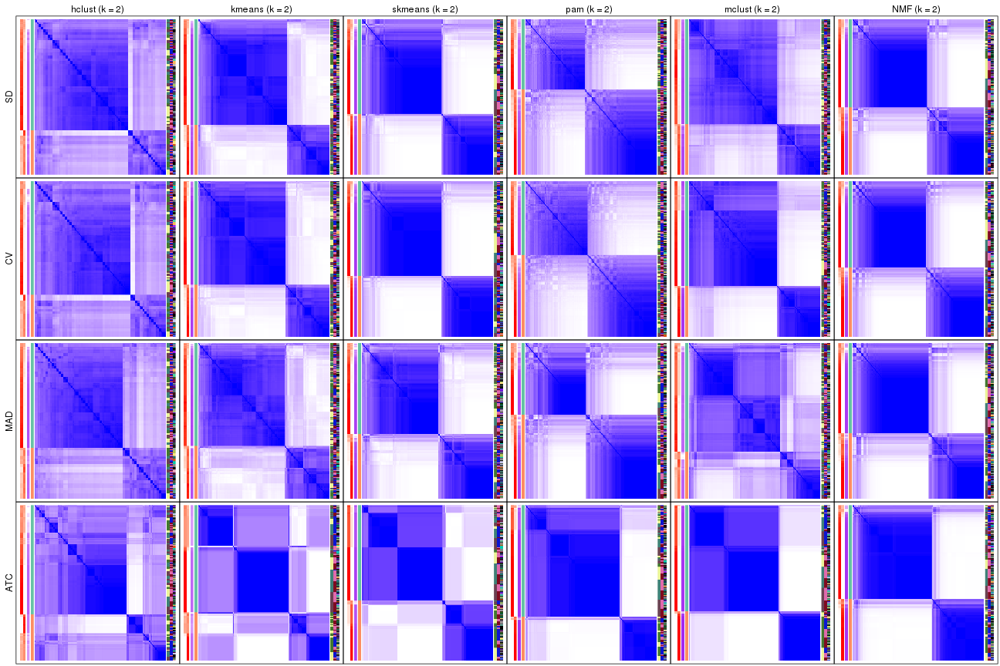</p>

</div>
<div id='tab-collect-consensus-heatmap-2'>
<pre><code class="r">collect_plots(res_list, k = 3, fun = consensus_heatmap, mc.cores = 4)
</code></pre>

<p>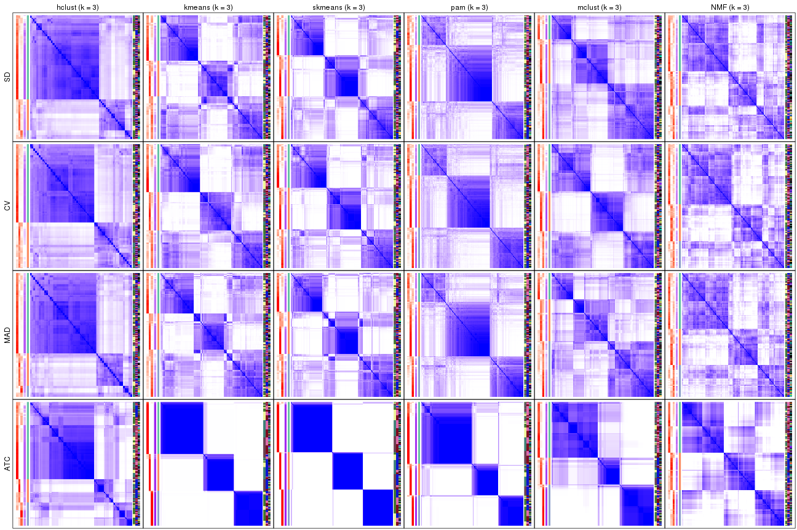</p>

</div>
<div id='tab-collect-consensus-heatmap-3'>
<pre><code class="r">collect_plots(res_list, k = 4, fun = consensus_heatmap, mc.cores = 4)
</code></pre>

<p>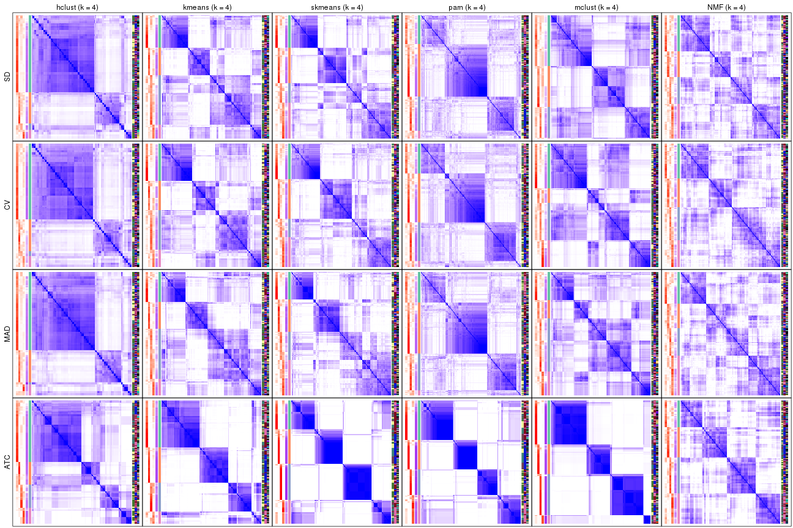</p>

</div>
<div id='tab-collect-consensus-heatmap-4'>
<pre><code class="r">collect_plots(res_list, k = 5, fun = consensus_heatmap, mc.cores = 4)
</code></pre>

<p>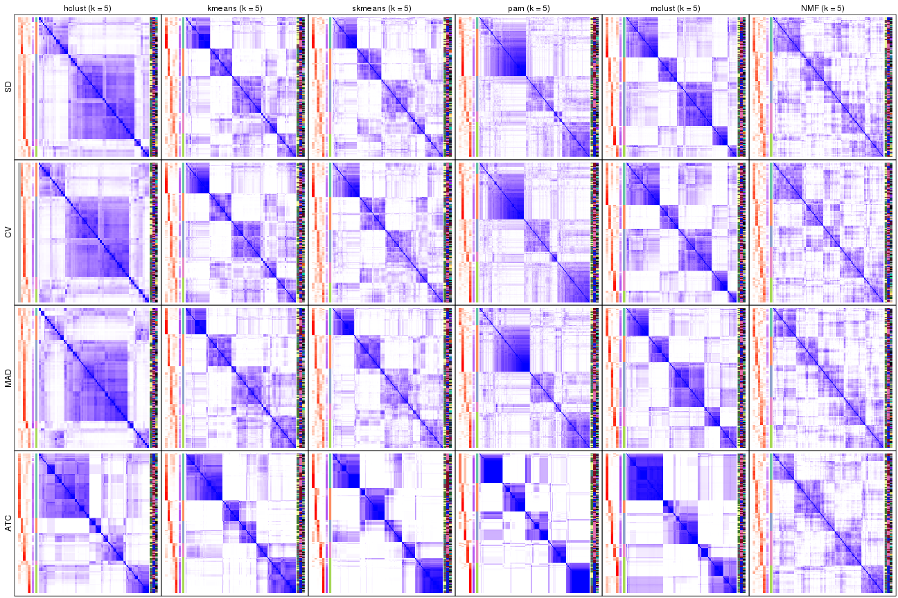</p>

</div>
<div id='tab-collect-consensus-heatmap-5'>
<pre><code class="r">collect_plots(res_list, k = 6, fun = consensus_heatmap, mc.cores = 4)
</code></pre>

<p>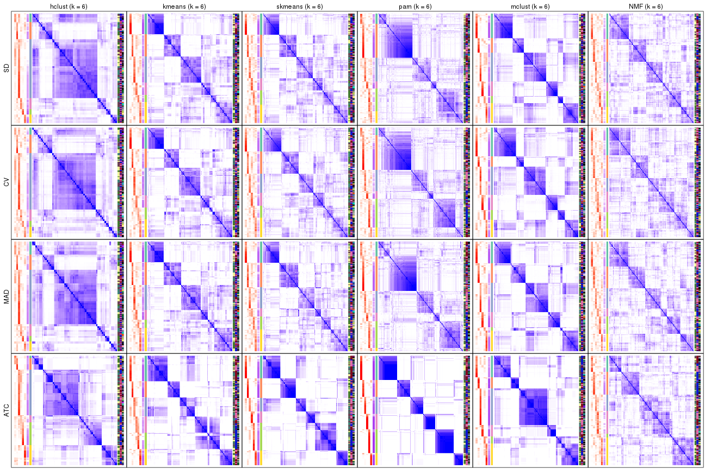</p>

</div>
</div>


### Membership heatmap

Membership heatmaps for all methods. ([What is a membership heatmap?](http://bioconductor.org/packages/devel/bioc/vignettes/cola/inst/doc/cola.html#toc_12))


<script>
$( function() {
	$( '#tabs-collect-membership-heatmap' ).tabs();
} );
</script>
<div id='tabs-collect-membership-heatmap'>
<ul>
<li><a href='#tab-collect-membership-heatmap-1'>k = 2</a></li>
<li><a href='#tab-collect-membership-heatmap-2'>k = 3</a></li>
<li><a href='#tab-collect-membership-heatmap-3'>k = 4</a></li>
<li><a href='#tab-collect-membership-heatmap-4'>k = 5</a></li>
<li><a href='#tab-collect-membership-heatmap-5'>k = 6</a></li>
</ul>
<div id='tab-collect-membership-heatmap-1'>
<pre><code class="r">collect_plots(res_list, k = 2, fun = membership_heatmap, mc.cores = 4)
</code></pre>

<p>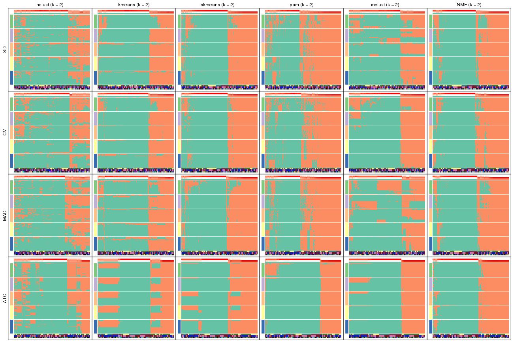</p>

</div>
<div id='tab-collect-membership-heatmap-2'>
<pre><code class="r">collect_plots(res_list, k = 3, fun = membership_heatmap, mc.cores = 4)
</code></pre>

<p>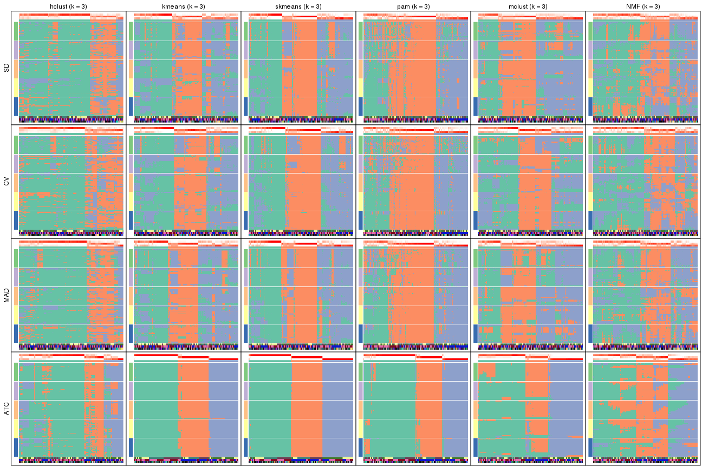</p>

</div>
<div id='tab-collect-membership-heatmap-3'>
<pre><code class="r">collect_plots(res_list, k = 4, fun = membership_heatmap, mc.cores = 4)
</code></pre>

<p>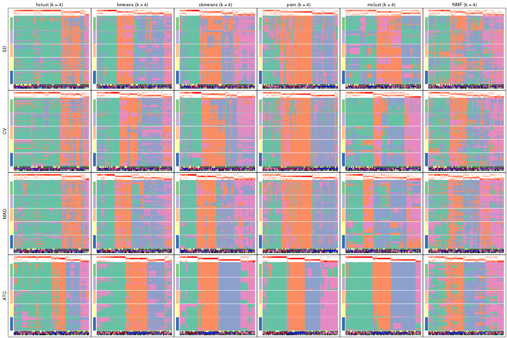</p>

</div>
<div id='tab-collect-membership-heatmap-4'>
<pre><code class="r">collect_plots(res_list, k = 5, fun = membership_heatmap, mc.cores = 4)
</code></pre>

<p>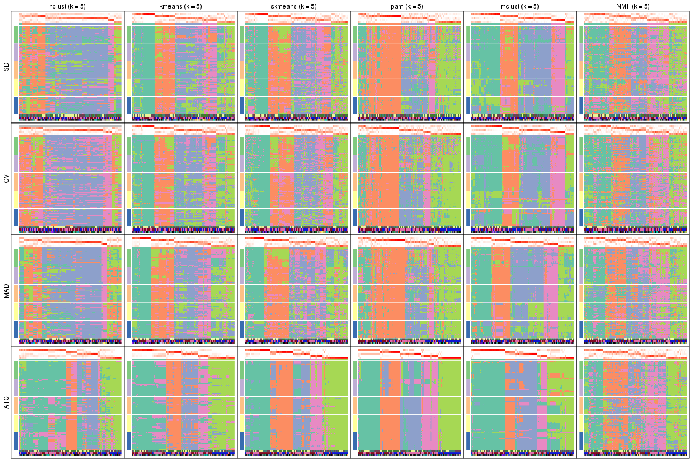</p>

</div>
<div id='tab-collect-membership-heatmap-5'>
<pre><code class="r">collect_plots(res_list, k = 6, fun = membership_heatmap, mc.cores = 4)
</code></pre>

<p>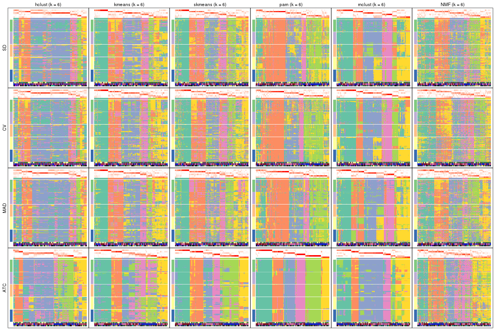</p>

</div>
</div>


### Signature heatmap

Signature heatmaps for all methods. ([What is a signature heatmap?](http://bioconductor.org/packages/devel/bioc/vignettes/cola/inst/doc/cola.html#toc_22))


Note in following heatmaps, rows are scaled.


<script>
$( function() {
	$( '#tabs-collect-get-signatures' ).tabs();
} );
</script>
<div id='tabs-collect-get-signatures'>
<ul>
<li><a href='#tab-collect-get-signatures-1'>k = 2</a></li>
<li><a href='#tab-collect-get-signatures-2'>k = 3</a></li>
<li><a href='#tab-collect-get-signatures-3'>k = 4</a></li>
<li><a href='#tab-collect-get-signatures-4'>k = 5</a></li>
<li><a href='#tab-collect-get-signatures-5'>k = 6</a></li>
</ul>
<div id='tab-collect-get-signatures-1'>
<pre><code class="r">collect_plots(res_list, k = 2, fun = get_signatures, mc.cores = 4)
</code></pre>

<p>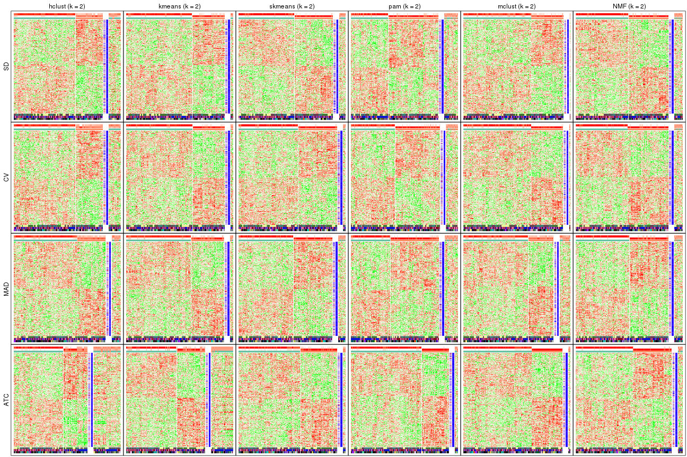</p>

</div>
<div id='tab-collect-get-signatures-2'>
<pre><code class="r">collect_plots(res_list, k = 3, fun = get_signatures, mc.cores = 4)
</code></pre>

<p>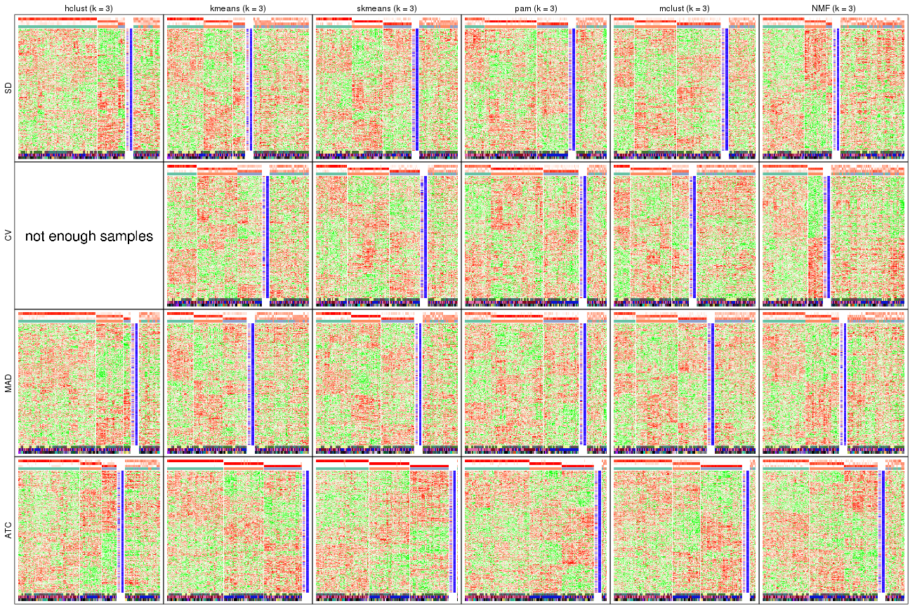</p>

</div>
<div id='tab-collect-get-signatures-3'>
<pre><code class="r">collect_plots(res_list, k = 4, fun = get_signatures, mc.cores = 4)
</code></pre>

<p>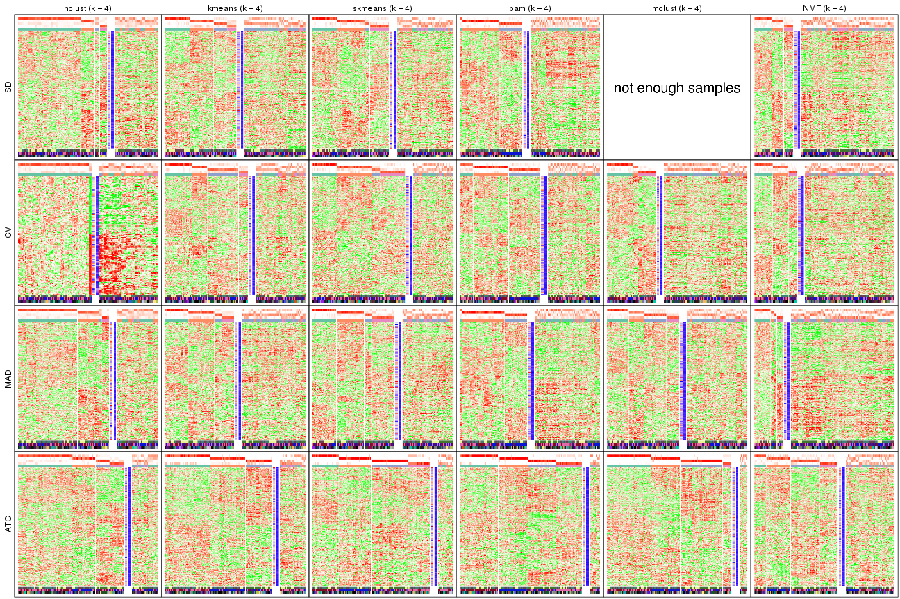</p>

</div>
<div id='tab-collect-get-signatures-4'>
<pre><code class="r">collect_plots(res_list, k = 5, fun = get_signatures, mc.cores = 4)
</code></pre>

<p>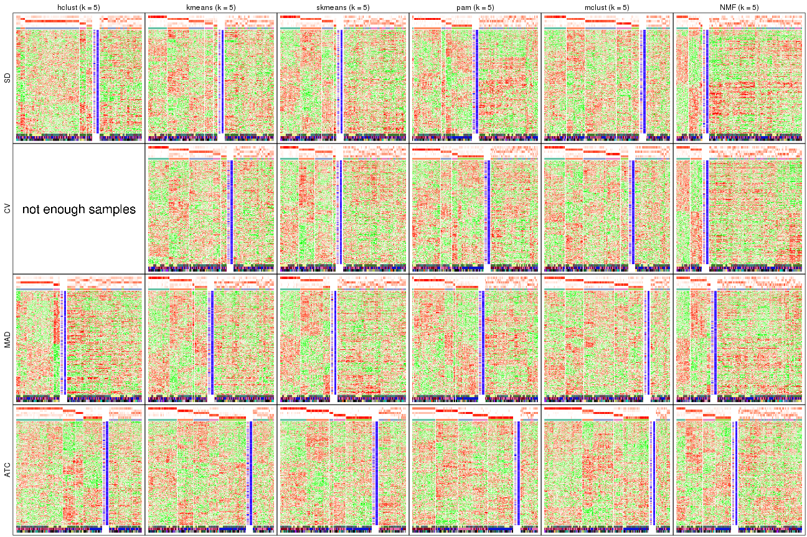</p>

</div>
<div id='tab-collect-get-signatures-5'>
<pre><code class="r">collect_plots(res_list, k = 6, fun = get_signatures, mc.cores = 4)
</code></pre>

<p>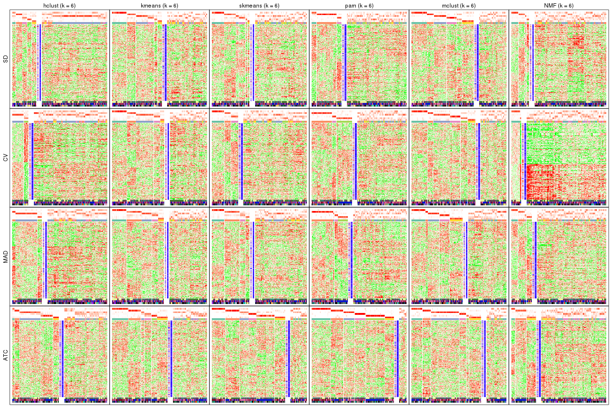</p>

</div>
</div>


### Statistics table

The statistics used for measuring the stability of consensus partitioning.
([How are they
defined?](http://bioconductor.org/packages/devel/bioc/vignettes/cola/inst/doc/cola.html#toc_13))


<script>
$( function() {
	$( '#tabs-get-stats-from-consensus-partition-list' ).tabs();
} );
</script>
<div id='tabs-get-stats-from-consensus-partition-list'>
<ul>
<li><a href='#tab-get-stats-from-consensus-partition-list-1'>k = 2</a></li>
<li><a href='#tab-get-stats-from-consensus-partition-list-2'>k = 3</a></li>
<li><a href='#tab-get-stats-from-consensus-partition-list-3'>k = 4</a></li>
<li><a href='#tab-get-stats-from-consensus-partition-list-4'>k = 5</a></li>
<li><a href='#tab-get-stats-from-consensus-partition-list-5'>k = 6</a></li>
</ul>
<div id='tab-get-stats-from-consensus-partition-list-1'>
<pre><code class="r">get_stats(res_list, k = 2)
</code></pre>

<pre><code>#&gt;             k 1-PAC mean_silhouette concordance area_increased  Rand Jaccard
#&gt; SD:NMF      2 0.598           0.831       0.923          0.490 0.506   0.506
#&gt; CV:NMF      2 0.658           0.837       0.929          0.493 0.503   0.503
#&gt; MAD:NMF     2 0.600           0.823       0.922          0.484 0.510   0.510
#&gt; ATC:NMF     2 0.835           0.899       0.956          0.484 0.518   0.518
#&gt; SD:skmeans  2 0.699           0.863       0.935          0.489 0.521   0.521
#&gt; CV:skmeans  2 0.748           0.898       0.951          0.487 0.521   0.521
#&gt; MAD:skmeans 2 0.667           0.827       0.918          0.493 0.512   0.512
#&gt; ATC:skmeans 2 0.522           0.860       0.922          0.479 0.523   0.523
#&gt; SD:mclust   2 0.259           0.838       0.856          0.423 0.557   0.557
#&gt; CV:mclust   2 0.642           0.884       0.928          0.450 0.557   0.557
#&gt; MAD:mclust  2 0.292           0.670       0.790          0.422 0.574   0.574
#&gt; ATC:mclust  2 0.662           0.933       0.958          0.440 0.565   0.565
#&gt; SD:kmeans   2 0.662           0.866       0.917          0.447 0.561   0.561
#&gt; CV:kmeans   2 0.696           0.899       0.934          0.450 0.553   0.553
#&gt; MAD:kmeans  2 0.413           0.827       0.881          0.453 0.549   0.549
#&gt; ATC:kmeans  2 0.454           0.635       0.815          0.462 0.570   0.570
#&gt; SD:pam      2 0.377           0.742       0.876          0.491 0.502   0.502
#&gt; CV:pam      2 0.339           0.749       0.871          0.496 0.498   0.498
#&gt; MAD:pam     2 0.457           0.756       0.894          0.496 0.500   0.500
#&gt; ATC:pam     2 0.773           0.912       0.954          0.423 0.594   0.594
#&gt; SD:hclust   2 0.220           0.690       0.819          0.369 0.589   0.589
#&gt; CV:hclust   2 0.179           0.638       0.797          0.350 0.604   0.604
#&gt; MAD:hclust  2 0.184           0.740       0.825          0.379 0.557   0.557
#&gt; ATC:hclust  2 0.243           0.569       0.812          0.418 0.579   0.579
</code></pre>

</div>
<div id='tab-get-stats-from-consensus-partition-list-2'>
<pre><code class="r">get_stats(res_list, k = 3)
</code></pre>

<pre><code>#&gt;             k 1-PAC mean_silhouette concordance area_increased  Rand Jaccard
#&gt; SD:NMF      3 0.269           0.444       0.671          0.341 0.762   0.565
#&gt; CV:NMF      3 0.282           0.406       0.649          0.334 0.818   0.655
#&gt; MAD:NMF     3 0.272           0.468       0.686          0.361 0.762   0.566
#&gt; ATC:NMF     3 0.495           0.598       0.767          0.365 0.697   0.478
#&gt; SD:skmeans  3 0.469           0.589       0.803          0.368 0.725   0.511
#&gt; CV:skmeans  3 0.466           0.620       0.816          0.374 0.747   0.542
#&gt; MAD:skmeans 3 0.461           0.582       0.806          0.356 0.683   0.453
#&gt; ATC:skmeans 3 1.000           0.975       0.990          0.386 0.717   0.504
#&gt; SD:mclust   3 0.266           0.628       0.754          0.461 0.768   0.597
#&gt; CV:mclust   3 0.412           0.498       0.678          0.380 0.769   0.588
#&gt; MAD:mclust  3 0.246           0.532       0.740          0.486 0.741   0.566
#&gt; ATC:mclust  3 0.667           0.842       0.893          0.433 0.769   0.600
#&gt; SD:kmeans   3 0.367           0.467       0.727          0.440 0.680   0.473
#&gt; CV:kmeans   3 0.394           0.555       0.728          0.425 0.754   0.566
#&gt; MAD:kmeans  3 0.386           0.506       0.743          0.439 0.721   0.519
#&gt; ATC:kmeans  3 1.000           0.972       0.986          0.421 0.729   0.542
#&gt; SD:pam      3 0.346           0.604       0.780          0.304 0.785   0.599
#&gt; CV:pam      3 0.356           0.678       0.790          0.295 0.771   0.573
#&gt; MAD:pam     3 0.402           0.667       0.812          0.292 0.784   0.595
#&gt; ATC:pam     3 0.863           0.899       0.957          0.500 0.735   0.568
#&gt; SD:hclust   3 0.203           0.618       0.773          0.408 0.917   0.861
#&gt; CV:hclust   3 0.159           0.439       0.731          0.536 0.818   0.723
#&gt; MAD:hclust  3 0.190           0.656       0.789          0.386 0.927   0.871
#&gt; ATC:hclust  3 0.320           0.607       0.813          0.335 0.842   0.736
</code></pre>

</div>
<div id='tab-get-stats-from-consensus-partition-list-3'>
<pre><code class="r">get_stats(res_list, k = 4)
</code></pre>

<pre><code>#&gt;             k 1-PAC mean_silhouette concordance area_increased  Rand Jaccard
#&gt; SD:NMF      4 0.366           0.353       0.547         0.1312 0.751   0.414
#&gt; CV:NMF      4 0.365           0.357       0.563         0.1307 0.741   0.408
#&gt; MAD:NMF     4 0.362           0.334       0.601         0.1309 0.678   0.306
#&gt; ATC:NMF     4 0.466           0.510       0.716         0.1299 0.860   0.615
#&gt; SD:skmeans  4 0.498           0.485       0.710         0.1210 0.844   0.581
#&gt; CV:skmeans  4 0.480           0.541       0.710         0.1195 0.886   0.678
#&gt; MAD:skmeans 4 0.503           0.531       0.720         0.1238 0.794   0.475
#&gt; ATC:skmeans 4 0.796           0.747       0.877         0.1187 0.880   0.662
#&gt; SD:mclust   4 0.331           0.207       0.561         0.1152 0.768   0.503
#&gt; CV:mclust   4 0.388           0.402       0.654         0.0949 0.885   0.684
#&gt; MAD:mclust  4 0.288           0.435       0.643         0.1125 0.909   0.755
#&gt; ATC:mclust  4 0.827           0.867       0.929         0.1138 0.919   0.780
#&gt; SD:kmeans   4 0.429           0.470       0.683         0.1326 0.787   0.491
#&gt; CV:kmeans   4 0.441           0.500       0.666         0.1356 0.819   0.537
#&gt; MAD:kmeans  4 0.432           0.479       0.684         0.1218 0.792   0.496
#&gt; ATC:kmeans  4 0.674           0.652       0.803         0.1094 0.934   0.810
#&gt; SD:pam      4 0.379           0.430       0.684         0.1110 0.907   0.754
#&gt; CV:pam      4 0.369           0.500       0.719         0.1018 0.967   0.904
#&gt; MAD:pam     4 0.384           0.455       0.708         0.1084 0.951   0.862
#&gt; ATC:pam     4 0.735           0.804       0.899         0.1684 0.839   0.590
#&gt; SD:hclust   4 0.286           0.520       0.703         0.1950 0.915   0.841
#&gt; CV:hclust   4 0.229           0.476       0.674         0.1706 0.916   0.842
#&gt; MAD:hclust  4 0.324           0.522       0.708         0.1862 0.978   0.955
#&gt; ATC:hclust  4 0.397           0.613       0.768         0.2132 0.841   0.664
</code></pre>

</div>
<div id='tab-get-stats-from-consensus-partition-list-4'>
<pre><code class="r">get_stats(res_list, k = 5)
</code></pre>

<pre><code>#&gt;             k 1-PAC mean_silhouette concordance area_increased  Rand Jaccard
#&gt; SD:NMF      5 0.453           0.319       0.553         0.0687 0.844   0.488
#&gt; CV:NMF      5 0.438           0.326       0.563         0.0676 0.807   0.400
#&gt; MAD:NMF     5 0.464           0.336       0.585         0.0680 0.752   0.290
#&gt; ATC:NMF     5 0.490           0.399       0.621         0.0664 0.857   0.521
#&gt; SD:skmeans  5 0.525           0.433       0.643         0.0664 0.857   0.524
#&gt; CV:skmeans  5 0.504           0.413       0.616         0.0661 0.899   0.645
#&gt; MAD:skmeans 5 0.539           0.451       0.624         0.0661 0.905   0.654
#&gt; ATC:skmeans 5 0.748           0.680       0.847         0.0613 0.894   0.628
#&gt; SD:mclust   5 0.541           0.618       0.746         0.1141 0.801   0.484
#&gt; CV:mclust   5 0.505           0.559       0.701         0.1150 0.867   0.589
#&gt; MAD:mclust  5 0.578           0.642       0.768         0.1092 0.862   0.574
#&gt; ATC:mclust  5 0.684           0.729       0.831         0.0552 0.906   0.703
#&gt; SD:kmeans   5 0.512           0.482       0.658         0.0754 0.860   0.557
#&gt; CV:kmeans   5 0.509           0.497       0.661         0.0711 0.872   0.570
#&gt; MAD:kmeans  5 0.525           0.492       0.658         0.0716 0.823   0.479
#&gt; ATC:kmeans  5 0.669           0.671       0.800         0.0722 0.896   0.665
#&gt; SD:pam      5 0.438           0.475       0.674         0.0672 0.889   0.670
#&gt; CV:pam      5 0.434           0.517       0.706         0.0688 0.927   0.771
#&gt; MAD:pam     5 0.452           0.483       0.696         0.0719 0.884   0.657
#&gt; ATC:pam     5 0.799           0.714       0.842         0.0699 0.859   0.523
#&gt; SD:hclust   5 0.374           0.473       0.646         0.1124 0.962   0.919
#&gt; CV:hclust   5 0.350           0.470       0.630         0.1019 0.924   0.838
#&gt; MAD:hclust  5 0.366           0.368       0.626         0.1108 0.886   0.766
#&gt; ATC:hclust  5 0.465           0.531       0.699         0.0839 0.950   0.855
</code></pre>

</div>
<div id='tab-get-stats-from-consensus-partition-list-5'>
<pre><code class="r">get_stats(res_list, k = 6)
</code></pre>

<pre><code>#&gt;             k 1-PAC mean_silhouette concordance area_increased  Rand Jaccard
#&gt; SD:NMF      6 0.513           0.331       0.555         0.0424 0.928   0.681
#&gt; CV:NMF      6 0.489           0.285       0.491         0.0430 0.887   0.544
#&gt; MAD:NMF     6 0.511           0.334       0.540         0.0420 0.856   0.444
#&gt; ATC:NMF     6 0.541           0.335       0.576         0.0396 0.899   0.594
#&gt; SD:skmeans  6 0.577           0.434       0.619         0.0417 0.908   0.600
#&gt; CV:skmeans  6 0.554           0.393       0.596         0.0421 0.900   0.582
#&gt; MAD:skmeans 6 0.580           0.434       0.602         0.0413 0.950   0.772
#&gt; ATC:skmeans 6 0.733           0.650       0.802         0.0470 0.920   0.657
#&gt; SD:mclust   6 0.612           0.546       0.729         0.0470 0.870   0.528
#&gt; CV:mclust   6 0.613           0.553       0.733         0.0524 0.857   0.498
#&gt; MAD:mclust  6 0.640           0.494       0.725         0.0463 0.934   0.723
#&gt; ATC:mclust  6 0.693           0.657       0.798         0.0660 0.953   0.812
#&gt; SD:kmeans   6 0.586           0.505       0.639         0.0433 0.926   0.680
#&gt; CV:kmeans   6 0.582           0.458       0.648         0.0492 0.909   0.615
#&gt; MAD:kmeans  6 0.601           0.523       0.662         0.0460 0.946   0.763
#&gt; ATC:kmeans  6 0.679           0.531       0.677         0.0503 0.884   0.550
#&gt; SD:pam      6 0.502           0.407       0.647         0.0477 0.911   0.673
#&gt; CV:pam      6 0.496           0.447       0.673         0.0445 0.947   0.797
#&gt; MAD:pam     6 0.529           0.411       0.659         0.0484 0.954   0.820
#&gt; ATC:pam     6 0.870           0.823       0.914         0.0413 0.938   0.710
#&gt; SD:hclust   6 0.429           0.320       0.612         0.0658 0.885   0.738
#&gt; CV:hclust   6 0.426           0.302       0.560         0.0654 0.901   0.758
#&gt; MAD:hclust  6 0.425           0.376       0.624         0.0637 0.866   0.672
#&gt; ATC:hclust  6 0.530           0.450       0.652         0.0640 0.944   0.819
</code></pre>

</div>
</div>

Following heatmap plots the partition for each combination of methods and the
lightness correspond to the silhouette scores for samples in each method. On
top the consensus subgroup is inferred from all methods by taking the mean
silhouette scores as weight.


<script>
$( function() {
	$( '#tabs-collect-stats-from-consensus-partition-list' ).tabs();
} );
</script>
<div id='tabs-collect-stats-from-consensus-partition-list'>
<ul>
<li><a href='#tab-collect-stats-from-consensus-partition-list-1'>k = 2</a></li>
<li><a href='#tab-collect-stats-from-consensus-partition-list-2'>k = 3</a></li>
<li><a href='#tab-collect-stats-from-consensus-partition-list-3'>k = 4</a></li>
<li><a href='#tab-collect-stats-from-consensus-partition-list-4'>k = 5</a></li>
<li><a href='#tab-collect-stats-from-consensus-partition-list-5'>k = 6</a></li>
</ul>
<div id='tab-collect-stats-from-consensus-partition-list-1'>
<pre><code class="r">collect_stats(res_list, k = 2)
</code></pre>

<p>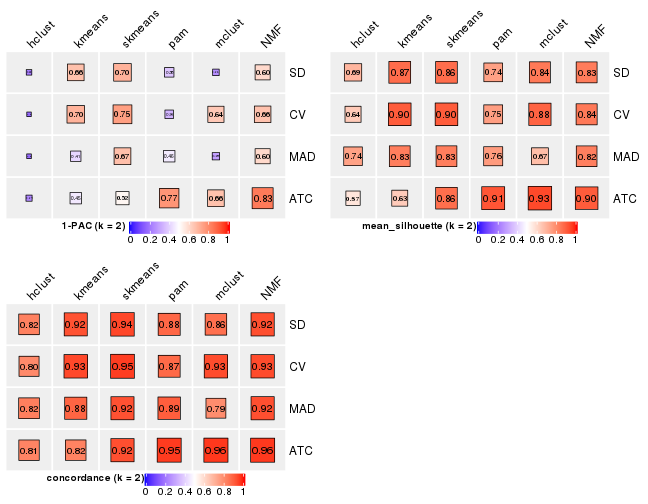</p>

</div>
<div id='tab-collect-stats-from-consensus-partition-list-2'>
<pre><code class="r">collect_stats(res_list, k = 3)
</code></pre>

<p>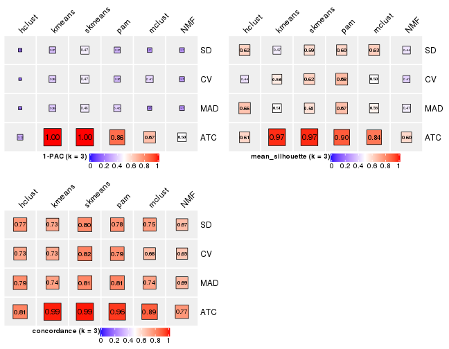</p>

</div>
<div id='tab-collect-stats-from-consensus-partition-list-3'>
<pre><code class="r">collect_stats(res_list, k = 4)
</code></pre>

<p>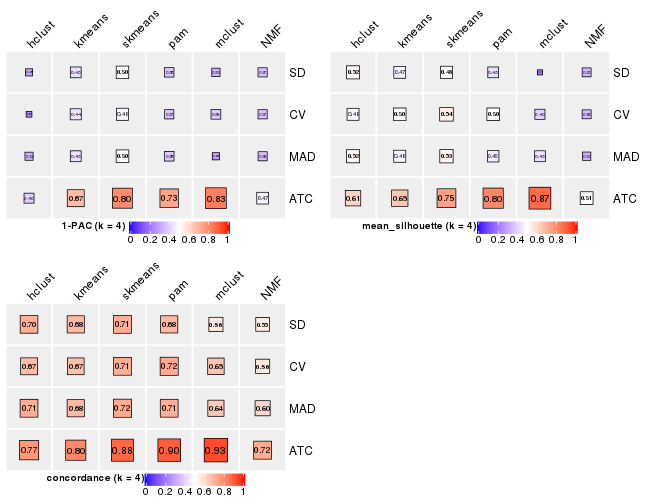</p>

</div>
<div id='tab-collect-stats-from-consensus-partition-list-4'>
<pre><code class="r">collect_stats(res_list, k = 5)
</code></pre>

<p>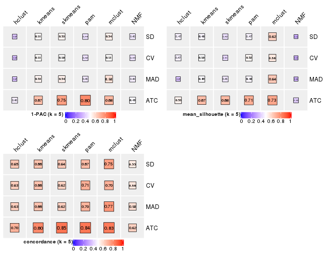</p>

</div>
<div id='tab-collect-stats-from-consensus-partition-list-5'>
<pre><code class="r">collect_stats(res_list, k = 6)
</code></pre>

<p>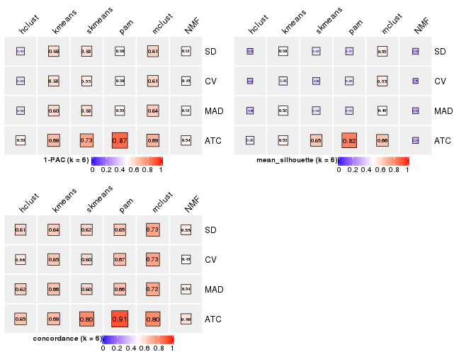</p>

</div>
</div>

### Partition from all methods


Collect partitions from all methods:


<script>
$( function() {
	$( '#tabs-collect-classes-from-consensus-partition-list' ).tabs();
} );
</script>
<div id='tabs-collect-classes-from-consensus-partition-list'>
<ul>
<li><a href='#tab-collect-classes-from-consensus-partition-list-1'>k = 2</a></li>
<li><a href='#tab-collect-classes-from-consensus-partition-list-2'>k = 3</a></li>
<li><a href='#tab-collect-classes-from-consensus-partition-list-3'>k = 4</a></li>
<li><a href='#tab-collect-classes-from-consensus-partition-list-4'>k = 5</a></li>
<li><a href='#tab-collect-classes-from-consensus-partition-list-5'>k = 6</a></li>
</ul>
<div id='tab-collect-classes-from-consensus-partition-list-1'>
<pre><code class="r">collect_classes(res_list, k = 2)
</code></pre>

<p>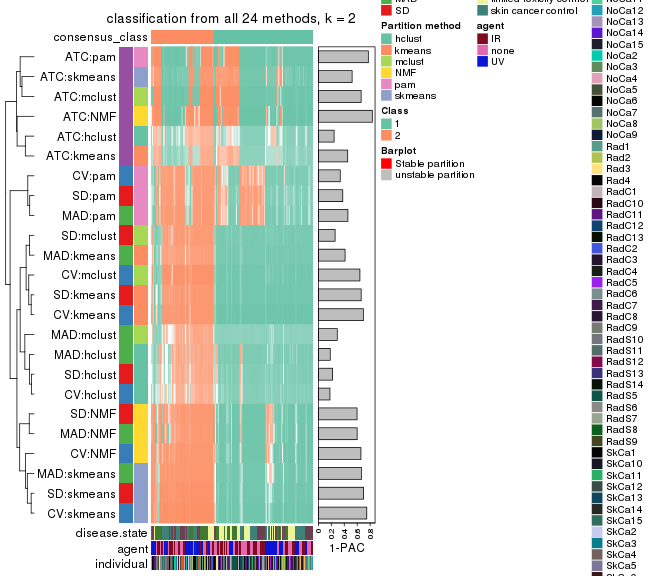</p>

</div>
<div id='tab-collect-classes-from-consensus-partition-list-2'>
<pre><code class="r">collect_classes(res_list, k = 3)
</code></pre>

<p>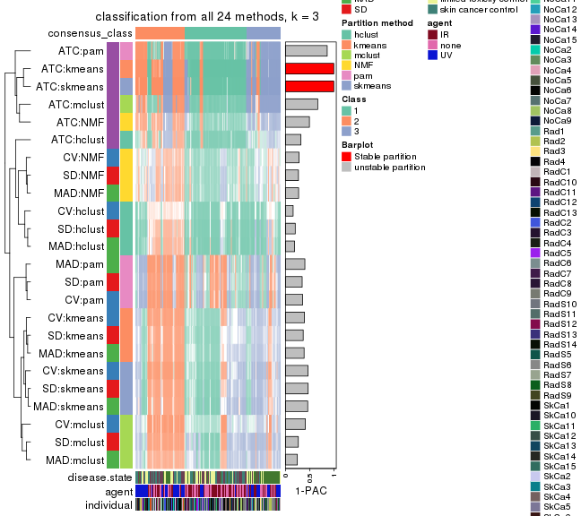</p>

</div>
<div id='tab-collect-classes-from-consensus-partition-list-3'>
<pre><code class="r">collect_classes(res_list, k = 4)
</code></pre>

<p>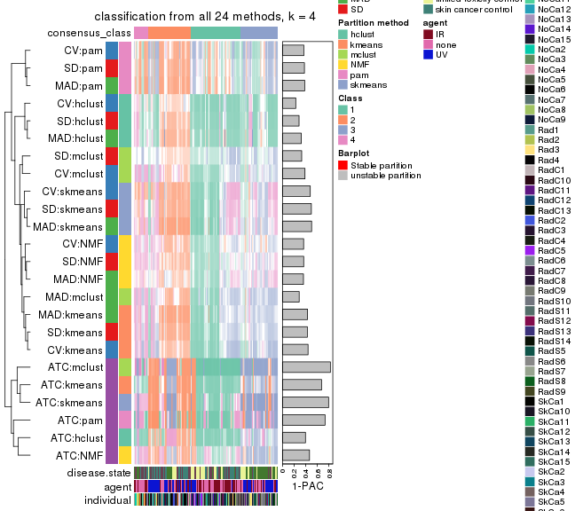</p>

</div>
<div id='tab-collect-classes-from-consensus-partition-list-4'>
<pre><code class="r">collect_classes(res_list, k = 5)
</code></pre>

<p>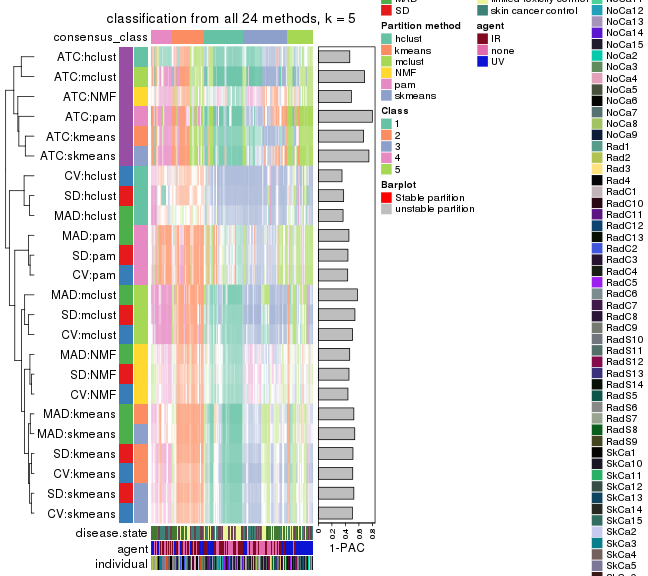</p>

</div>
<div id='tab-collect-classes-from-consensus-partition-list-5'>
<pre><code class="r">collect_classes(res_list, k = 6)
</code></pre>

<p>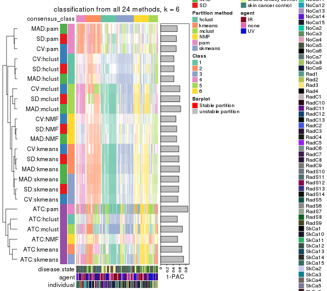</p>

</div>
</div>


### Top rows overlap


Overlap of top rows from different top-row methods:


<script>
$( function() {
	$( '#tabs-top-rows-overlap-by-euler' ).tabs();
} );
</script>
<div id='tabs-top-rows-overlap-by-euler'>
<ul>
<li><a href='#tab-top-rows-overlap-by-euler-1'>top_n = 841</a></li>
<li><a href='#tab-top-rows-overlap-by-euler-2'>top_n = 1682</a></li>
<li><a href='#tab-top-rows-overlap-by-euler-3'>top_n = 2524</a></li>
<li><a href='#tab-top-rows-overlap-by-euler-4'>top_n = 3365</a></li>
<li><a href='#tab-top-rows-overlap-by-euler-5'>top_n = 4206</a></li>
</ul>
<div id='tab-top-rows-overlap-by-euler-1'>
<pre><code class="r">top_rows_overlap(res_list, top_n = 841, method = &quot;euler&quot;)
</code></pre>

<p>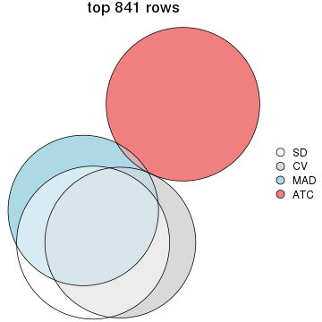</p>

</div>
<div id='tab-top-rows-overlap-by-euler-2'>
<pre><code class="r">top_rows_overlap(res_list, top_n = 1682, method = &quot;euler&quot;)
</code></pre>

<p>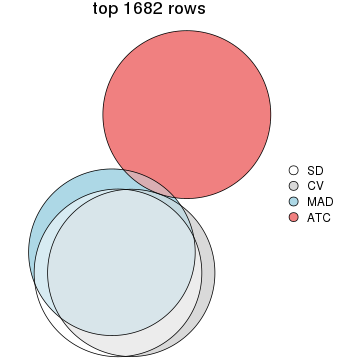</p>

</div>
<div id='tab-top-rows-overlap-by-euler-3'>
<pre><code class="r">top_rows_overlap(res_list, top_n = 2524, method = &quot;euler&quot;)
</code></pre>

<p>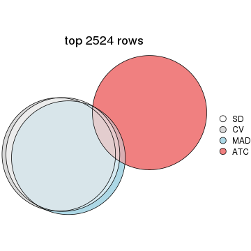</p>

</div>
<div id='tab-top-rows-overlap-by-euler-4'>
<pre><code class="r">top_rows_overlap(res_list, top_n = 3365, method = &quot;euler&quot;)
</code></pre>

<p>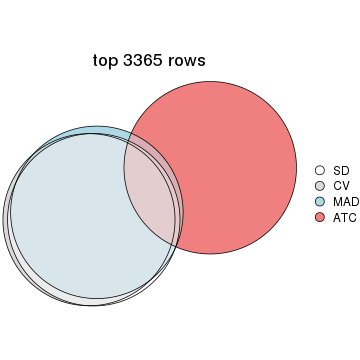</p>

</div>
<div id='tab-top-rows-overlap-by-euler-5'>
<pre><code class="r">top_rows_overlap(res_list, top_n = 4206, method = &quot;euler&quot;)
</code></pre>

<p>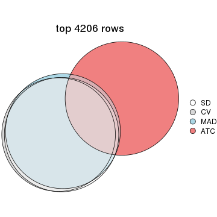</p>

</div>
</div>

Also visualize the correspondance of rankings between different top-row methods:


<script>
$( function() {
	$( '#tabs-top-rows-overlap-by-correspondance' ).tabs();
} );
</script>
<div id='tabs-top-rows-overlap-by-correspondance'>
<ul>
<li><a href='#tab-top-rows-overlap-by-correspondance-1'>top_n = 841</a></li>
<li><a href='#tab-top-rows-overlap-by-correspondance-2'>top_n = 1682</a></li>
<li><a href='#tab-top-rows-overlap-by-correspondance-3'>top_n = 2524</a></li>
<li><a href='#tab-top-rows-overlap-by-correspondance-4'>top_n = 3365</a></li>
<li><a href='#tab-top-rows-overlap-by-correspondance-5'>top_n = 4206</a></li>
</ul>
<div id='tab-top-rows-overlap-by-correspondance-1'>
<pre><code class="r">top_rows_overlap(res_list, top_n = 841, method = &quot;correspondance&quot;)
</code></pre>

<p>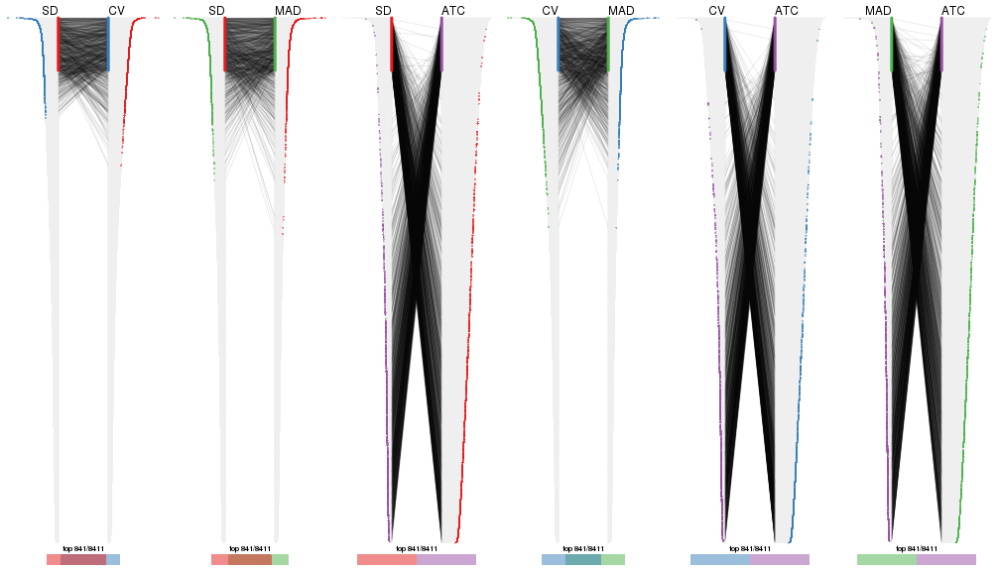</p>

</div>
<div id='tab-top-rows-overlap-by-correspondance-2'>
<pre><code class="r">top_rows_overlap(res_list, top_n = 1682, method = &quot;correspondance&quot;)
</code></pre>

<p>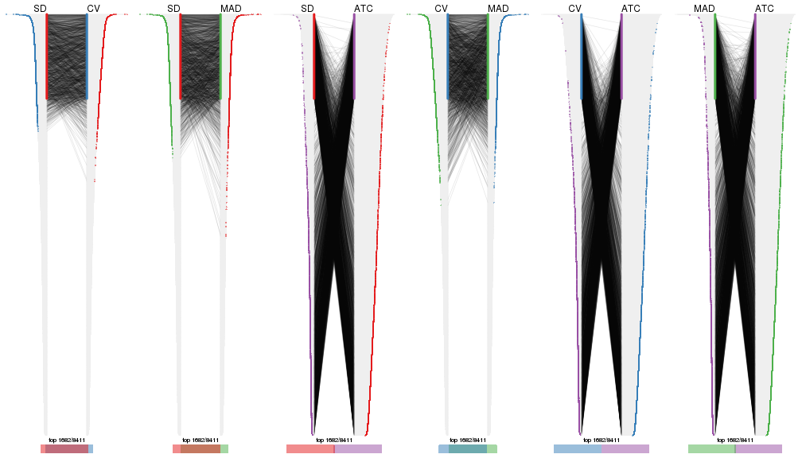</p>

</div>
<div id='tab-top-rows-overlap-by-correspondance-3'>
<pre><code class="r">top_rows_overlap(res_list, top_n = 2524, method = &quot;correspondance&quot;)
</code></pre>

<p>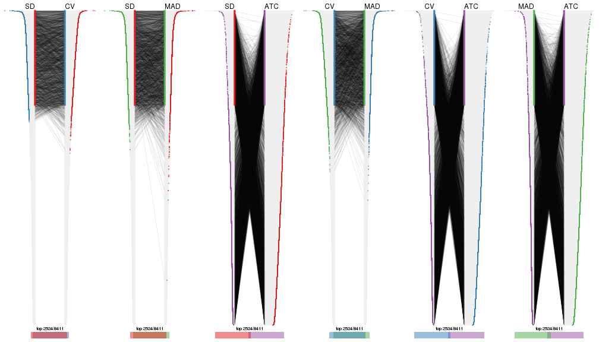</p>

</div>
<div id='tab-top-rows-overlap-by-correspondance-4'>
<pre><code class="r">top_rows_overlap(res_list, top_n = 3365, method = &quot;correspondance&quot;)
</code></pre>

<p>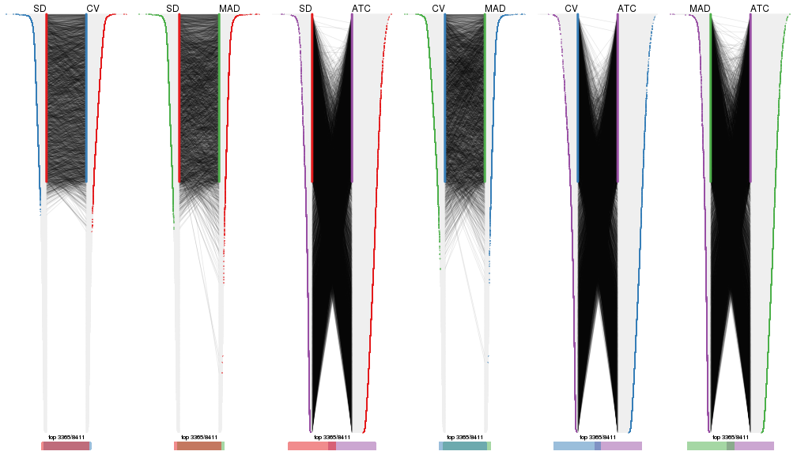</p>

</div>
<div id='tab-top-rows-overlap-by-correspondance-5'>
<pre><code class="r">top_rows_overlap(res_list, top_n = 4206, method = &quot;correspondance&quot;)
</code></pre>

<p>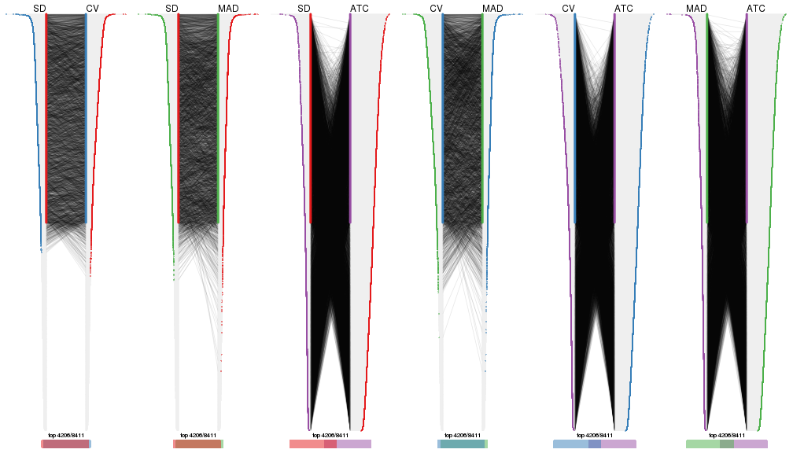</p>

</div>
</div>


Heatmaps of the top rows:


<script>
$( function() {
	$( '#tabs-top-rows-heatmap' ).tabs();
} );
</script>
<div id='tabs-top-rows-heatmap'>
<ul>
<li><a href='#tab-top-rows-heatmap-1'>top_n = 841</a></li>
<li><a href='#tab-top-rows-heatmap-2'>top_n = 1682</a></li>
<li><a href='#tab-top-rows-heatmap-3'>top_n = 2524</a></li>
<li><a href='#tab-top-rows-heatmap-4'>top_n = 3365</a></li>
<li><a href='#tab-top-rows-heatmap-5'>top_n = 4206</a></li>
</ul>
<div id='tab-top-rows-heatmap-1'>
<pre><code class="r">top_rows_heatmap(res_list, top_n = 841)
</code></pre>

<p>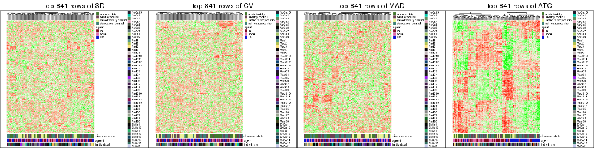</p>

</div>
<div id='tab-top-rows-heatmap-2'>
<pre><code class="r">top_rows_heatmap(res_list, top_n = 1682)
</code></pre>

<p>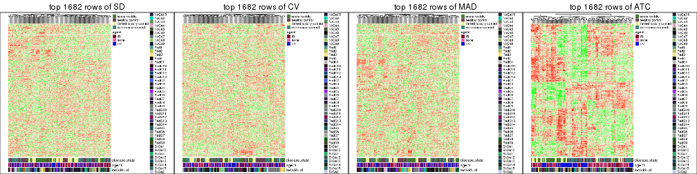</p>

</div>
<div id='tab-top-rows-heatmap-3'>
<pre><code class="r">top_rows_heatmap(res_list, top_n = 2524)
</code></pre>

<p>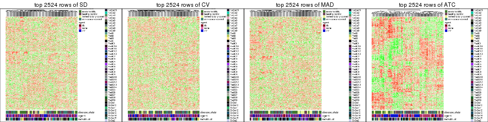</p>

</div>
<div id='tab-top-rows-heatmap-4'>
<pre><code class="r">top_rows_heatmap(res_list, top_n = 3365)
</code></pre>

<p>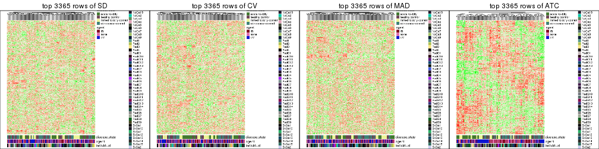</p>

</div>
<div id='tab-top-rows-heatmap-5'>
<pre><code class="r">top_rows_heatmap(res_list, top_n = 4206)
</code></pre>

<p>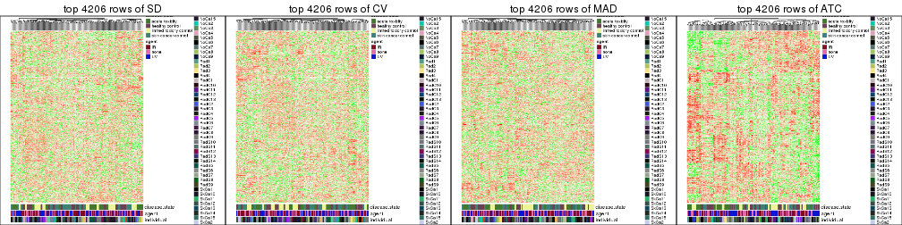</p>

</div>
</div>


### Test to known annotations


Test correlation between subgroups and known annotations. If the known
annotation is numeric, one-way ANOVA test is applied, and if the known
annotation is discrete, chi-squared contingency table test is applied.


<script>
$( function() {
	$( '#tabs-test-to-known-factors-from-consensus-partition-list' ).tabs();
} );
</script>
<div id='tabs-test-to-known-factors-from-consensus-partition-list'>
<ul>
<li><a href='#tab-test-to-known-factors-from-consensus-partition-list-1'>k = 2</a></li>
<li><a href='#tab-test-to-known-factors-from-consensus-partition-list-2'>k = 3</a></li>
<li><a href='#tab-test-to-known-factors-from-consensus-partition-list-3'>k = 4</a></li>
<li><a href='#tab-test-to-known-factors-from-consensus-partition-list-4'>k = 5</a></li>
<li><a href='#tab-test-to-known-factors-from-consensus-partition-list-5'>k = 6</a></li>
</ul>
<div id='tab-test-to-known-factors-from-consensus-partition-list-1'>
<pre><code class="r">test_to_known_factors(res_list, k = 2)
</code></pre>

<pre><code>#&gt;               n disease.state(p) agent(p) individual(p) k
#&gt; SD:NMF      157         5.45e-02 1.50e-03      5.05e-07 2
#&gt; CV:NMF      157         7.45e-03 9.48e-03      3.67e-08 2
#&gt; MAD:NMF     157         1.91e-01 1.03e-04      4.49e-06 2
#&gt; ATC:NMF     163         1.06e-11 2.39e-05      2.29e-04 2
#&gt; SD:skmeans  160         1.45e-02 3.18e-01      7.38e-11 2
#&gt; CV:skmeans  167         1.57e-02 4.97e-01      2.38e-11 2
#&gt; MAD:skmeans 159         3.96e-02 6.12e-02      1.75e-09 2
#&gt; ATC:skmeans 167         2.16e-20 1.83e-01      3.58e-08 2
#&gt; SD:mclust   170         4.67e-02 6.73e-01      1.24e-11 2
#&gt; CV:mclust   169         4.31e-02 6.21e-01      1.38e-11 2
#&gt; MAD:mclust  153         1.93e-01 2.50e-01      2.37e-10 2
#&gt; ATC:mclust  168         5.13e-21 8.23e-01      3.09e-09 2
#&gt; SD:kmeans   167         3.60e-02 6.71e-01      9.25e-12 2
#&gt; CV:kmeans   167         3.05e-02 7.38e-01      4.43e-12 2
#&gt; MAD:kmeans  166         2.09e-02 6.44e-01      2.05e-11 2
#&gt; ATC:kmeans  134         5.72e-17 8.90e-04      8.40e-06 2
#&gt; SD:pam      148         1.55e-01 1.27e-07      5.76e-04 2
#&gt; CV:pam      151         7.81e-02 1.75e-05      1.84e-04 2
#&gt; MAD:pam     149         2.03e-01 2.36e-08      3.75e-03 2
#&gt; ATC:pam     166         5.92e-16 8.18e-02      2.58e-07 2
#&gt; SD:hclust   151         1.26e-01 9.41e-01      4.48e-12 2
#&gt; CV:hclust   151         8.27e-02 9.41e-01      4.48e-12 2
#&gt; MAD:hclust  156         7.23e-02 9.33e-01      4.42e-12 2
#&gt; ATC:hclust  125         2.03e-04 4.99e-10      2.01e-03 2
</code></pre>

</div>
<div id='tab-test-to-known-factors-from-consensus-partition-list-2'>
<pre><code class="r">test_to_known_factors(res_list, k = 3)
</code></pre>

<pre><code>#&gt;               n disease.state(p) agent(p) individual(p) k
#&gt; SD:NMF       89         1.55e-03 7.96e-03      3.22e-07 3
#&gt; CV:NMF       77         4.33e-02 4.19e-02      1.79e-04 3
#&gt; MAD:NMF      98         1.73e-03 4.00e-03      4.05e-08 3
#&gt; ATC:NMF     147         2.06e-17 5.05e-12      1.49e-04 3
#&gt; SD:skmeans  122         1.76e-05 7.11e-01      7.07e-15 3
#&gt; CV:skmeans  133         2.13e-05 6.63e-01      1.64e-14 3
#&gt; MAD:skmeans 126         6.06e-06 6.58e-01      1.87e-15 3
#&gt; ATC:skmeans 170         3.77e-18 1.05e-14      7.39e-05 3
#&gt; SD:mclust   137         5.56e-05 3.65e-01      3.32e-14 3
#&gt; CV:mclust    96         8.45e-05 6.02e-02      2.27e-09 3
#&gt; MAD:mclust  119         6.75e-05 6.66e-01      8.89e-14 3
#&gt; ATC:mclust  164         5.83e-20 3.31e-17      7.79e-04 3
#&gt; SD:kmeans   100         1.41e-04 5.83e-01      2.96e-12 3
#&gt; CV:kmeans   121         2.55e-05 5.70e-01      7.15e-14 3
#&gt; MAD:kmeans  102         5.18e-05 7.15e-01      5.98e-12 3
#&gt; ATC:kmeans  171         5.97e-17 1.28e-15      8.51e-05 3
#&gt; SD:pam      132         1.28e-01 1.64e-14      3.00e-03 3
#&gt; CV:pam      146         2.90e-01 3.56e-14      4.27e-03 3
#&gt; MAD:pam     146         1.52e-01 6.36e-18      3.28e-02 3
#&gt; ATC:pam     165         5.07e-15 2.04e-23      7.98e-03 3
#&gt; SD:hclust   137         8.74e-05 1.00e+00      1.81e-20 3
#&gt; CV:hclust    93               NA       NA            NA 3
#&gt; MAD:hclust  144         2.43e-05 9.99e-01      4.59e-21 3
#&gt; ATC:hclust  126         4.14e-09 8.92e-10      1.62e-07 3
</code></pre>

</div>
<div id='tab-test-to-known-factors-from-consensus-partition-list-3'>
<pre><code class="r">test_to_known_factors(res_list, k = 4)
</code></pre>

<pre><code>#&gt;               n disease.state(p) agent(p) individual(p) k
#&gt; SD:NMF       51         5.98e-03 8.15e-02      1.61e-05 4
#&gt; CV:NMF       55         1.23e-04 2.93e-01      1.06e-05 4
#&gt; MAD:NMF      37         7.10e-03 1.80e-01      6.92e-05 4
#&gt; ATC:NMF     108         1.46e-14 4.45e-13      1.02e-02 4
#&gt; SD:skmeans   99         3.80e-10 8.68e-01      1.27e-17 4
#&gt; CV:skmeans  120         3.84e-07 8.96e-01      2.08e-19 4
#&gt; MAD:skmeans 106         1.95e-09 8.80e-01      1.41e-18 4
#&gt; ATC:skmeans 152         1.14e-15 9.25e-22      3.92e-02 4
#&gt; SD:mclust    27               NA       NA            NA 4
#&gt; CV:mclust    63         1.32e-05 5.15e-01      2.93e-06 4
#&gt; MAD:mclust   93         2.99e-04 4.16e-01      1.37e-12 4
#&gt; ATC:mclust  161         3.19e-20 1.71e-15      3.89e-06 4
#&gt; SD:kmeans    92         1.63e-06 9.72e-01      9.74e-17 4
#&gt; CV:kmeans   107         1.06e-06 9.47e-01      1.23e-18 4
#&gt; MAD:kmeans   89         1.04e-05 8.35e-01      3.18e-15 4
#&gt; ATC:kmeans  138         8.72e-14 9.87e-15      3.22e-04 4
#&gt; SD:pam       81         7.73e-02 2.32e-10      1.13e-01 4
#&gt; CV:pam      104         2.81e-02 6.92e-10      7.81e-03 4
#&gt; MAD:pam      87         1.00e-01 2.88e-10      1.05e-01 4
#&gt; ATC:pam     158         9.10e-12 9.76e-30      7.06e-02 4
#&gt; SD:hclust   115         1.21e-05 1.00e+00      2.43e-24 4
#&gt; CV:hclust    95         2.72e-02 1.00e+00      2.05e-08 4
#&gt; MAD:hclust  118         4.83e-06 1.00e+00      3.16e-24 4
#&gt; ATC:hclust  137         1.44e-13 3.01e-09      3.76e-13 4
</code></pre>

</div>
<div id='tab-test-to-known-factors-from-consensus-partition-list-4'>
<pre><code class="r">test_to_known_factors(res_list, k = 5)
</code></pre>

<pre><code>#&gt;               n disease.state(p) agent(p) individual(p) k
#&gt; SD:NMF       37         1.11e-02 3.76e-02      1.81e-04 5
#&gt; CV:NMF       37         7.70e-02 3.56e-02      7.93e-03 5
#&gt; MAD:NMF      49         2.07e-02 8.37e-02      1.26e-05 5
#&gt; ATC:NMF      79         6.99e-10 3.17e-11      1.15e-02 5
#&gt; SD:skmeans   81         1.09e-07 8.14e-01      4.12e-14 5
#&gt; CV:skmeans   80         2.20e-07 7.14e-01      1.43e-12 5
#&gt; MAD:skmeans  72         1.41e-06 9.60e-01      5.00e-09 5
#&gt; ATC:skmeans 132         1.69e-12 5.39e-16      4.70e-04 5
#&gt; SD:mclust   137         8.71e-06 6.25e-01      9.79e-25 5
#&gt; CV:mclust   121         1.10e-04 2.93e-01      1.27e-18 5
#&gt; MAD:mclust  143         6.66e-05 4.61e-01      1.45e-26 5
#&gt; ATC:mclust  151         9.77e-15 5.87e-15      1.04e-12 5
#&gt; SD:kmeans   100         1.80e-06 9.17e-01      9.65e-22 5
#&gt; CV:kmeans   113         1.08e-08 9.92e-01      2.10e-27 5
#&gt; MAD:kmeans   86         7.57e-07 9.00e-01      2.78e-19 5
#&gt; ATC:kmeans  141         3.50e-13 7.10e-15      2.32e-07 5
#&gt; SD:pam       86         2.00e-04 7.15e-10      1.54e-02 5
#&gt; CV:pam      103         1.33e-05 4.51e-09      1.33e-04 5
#&gt; MAD:pam      95         5.05e-02 1.58e-11      1.75e-02 5
#&gt; ATC:pam     146         3.30e-12 2.51e-28      6.48e-03 5
#&gt; SD:hclust   110         2.95e-08 1.00e+00      9.45e-31 5
#&gt; CV:hclust    80               NA       NA            NA 5
#&gt; MAD:hclust   63         4.06e-05 9.99e-01      7.74e-10 5
#&gt; ATC:hclust  124         3.30e-13 2.34e-10      2.41e-12 5
</code></pre>

</div>
<div id='tab-test-to-known-factors-from-consensus-partition-list-5'>
<pre><code class="r">test_to_known_factors(res_list, k = 6)
</code></pre>

<pre><code>#&gt;               n disease.state(p) agent(p) individual(p) k
#&gt; SD:NMF       34         9.66e-05 1.08e-01      1.36e-03 6
#&gt; CV:NMF       19         3.36e-03 1.51e-02      6.11e-02 6
#&gt; MAD:NMF      39         8.21e-06 2.14e-02      4.05e-03 6
#&gt; ATC:NMF      47         4.12e-06 1.37e-07      1.47e-01 6
#&gt; SD:skmeans   72         1.35e-09 5.85e-01      1.95e-17 6
#&gt; CV:skmeans   51         2.89e-03 3.21e-01      8.87e-08 6
#&gt; MAD:skmeans  73         2.80e-08 8.72e-01      3.68e-17 6
#&gt; ATC:skmeans 140         4.26e-13 2.50e-18      1.38e-07 6
#&gt; SD:mclust   119         5.69e-09 6.87e-02      4.96e-19 6
#&gt; CV:mclust   122         1.07e-08 6.34e-01      1.89e-22 6
#&gt; MAD:mclust   98         4.12e-05 8.90e-02      4.99e-15 6
#&gt; ATC:mclust  133         1.08e-13 3.26e-09      1.89e-11 6
#&gt; SD:kmeans    95         1.16e-13 8.69e-01      2.03e-24 6
#&gt; CV:kmeans   100         7.19e-06 9.98e-01      1.09e-22 6
#&gt; MAD:kmeans   99         2.63e-08 8.79e-01      7.99e-23 6
#&gt; ATC:kmeans  106         4.61e-09 4.28e-08      2.80e-10 6
#&gt; SD:pam       57         2.20e-09 9.33e-02      1.60e-04 6
#&gt; CV:pam       77         8.54e-07 4.76e-07      1.58e-03 6
#&gt; MAD:pam      69         3.43e-05 8.29e-08      3.24e-03 6
#&gt; ATC:pam     157         2.19e-15 2.38e-26      5.77e-05 6
#&gt; SD:hclust    46         2.66e-10 8.90e-01      1.26e-12 6
#&gt; CV:hclust    31         4.36e-05 9.87e-01      5.87e-04 6
#&gt; MAD:hclust   57         1.33e-10 1.00e+00      1.60e-09 6
#&gt; ATC:hclust   89         6.50e-08 5.13e-09      1.14e-07 6
</code></pre>

</div>
</div>


 
## Results for each method


---------------------------------------------------


### SD:hclust


The object with results only for a single top-value method and a single partition method 
can be extracted as:

```r
res = res_list["SD", "hclust"]
# you can also extract it by
# res = res_list["SD:hclust"]
```

A summary of `res` and all the functions that can be applied to it:

```r
res
```

```
#> A 'ConsensusPartition' object with k = 2, 3, 4, 5, 6.
#>   On a matrix with 8411 rows and 171 columns.
#>   Top rows (841, 1682, 2524, 3365, 4206) are extracted by 'SD' method.
#>   Subgroups are detected by 'hclust' method.
#>   Performed in total 1250 partitions by row resampling.
#>   Best k for subgroups seems to be 3.
#> 
#> Following methods can be applied to this 'ConsensusPartition' object:
#>  [1] "cola_report"             "collect_classes"         "collect_plots"          
#>  [4] "collect_stats"           "colnames"                "compare_signatures"     
#>  [7] "consensus_heatmap"       "dimension_reduction"     "functional_enrichment"  
#> [10] "get_anno_col"            "get_anno"                "get_classes"            
#> [13] "get_consensus"           "get_matrix"              "get_membership"         
#> [16] "get_param"               "get_signatures"          "get_stats"              
#> [19] "is_best_k"               "is_stable_k"             "membership_heatmap"     
#> [22] "ncol"                    "nrow"                    "plot_ecdf"              
#> [25] "rownames"                "select_partition_number" "show"                   
#> [28] "suggest_best_k"          "test_to_known_factors"
```

`collect_plots()` function collects all the plots made from `res` for all `k` (number of partitions)
into one single page to provide an easy and fast comparison between different `k`.

```r
collect_plots(res)
```

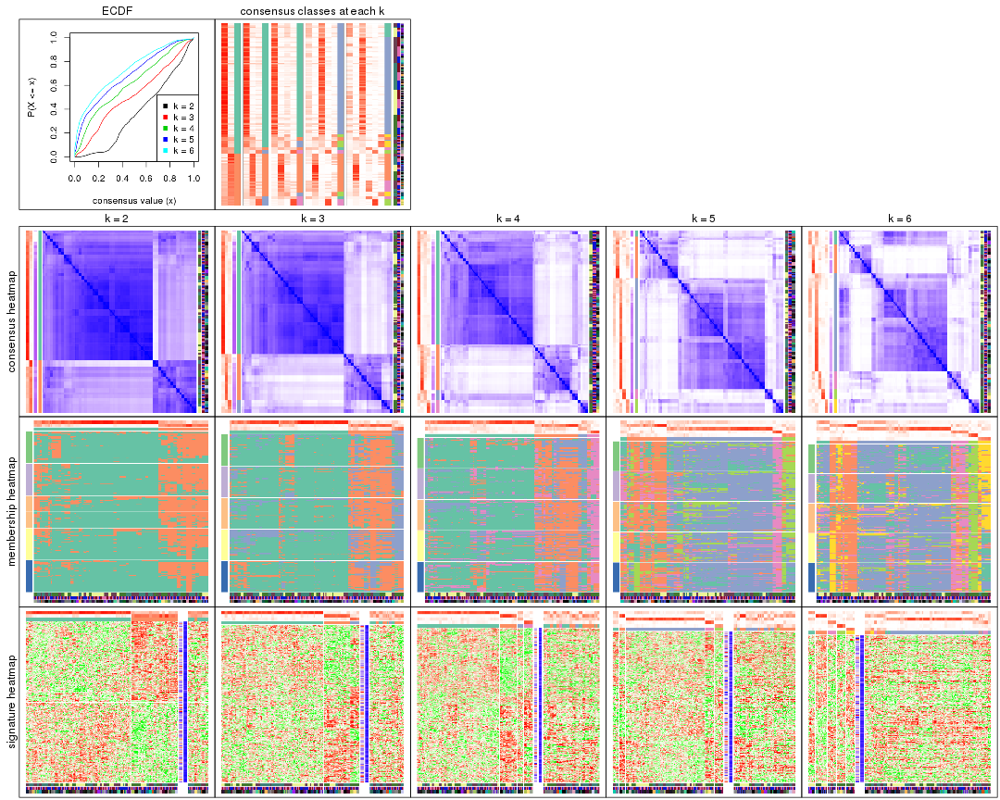

The plots are:

- The first row: a plot of the ECDF (empirical cumulative distribution
  function) curves of the consensus matrix for each `k` and the heatmap of
  predicted classes for each `k`.
- The second row: heatmaps of the consensus matrix for each `k`.
- The third row: heatmaps of the membership matrix for each `k`.
- The fouth row: heatmaps of the signatures for each `k`.

All the plots in panels can be made by individual functions and they are
plotted later in this section.

`select_partition_number()` produces several plots showing different
statistics for choosing "optimized" `k`. There are following statistics:

- ECDF curves of the consensus matrix for each `k`;
- 1-PAC. [The PAC
  score](https://en.wikipedia.org/wiki/Consensus_clustering#Over-interpretation_potential_of_consensus_clustering)
  measures the proportion of the ambiguous subgrouping.
- Mean silhouette score.
- Concordance. The mean probability of fiting the consensus class ids in all
  partitions.
- Area increased. Denote $A_k$ as the area under the ECDF curve for current
  `k`, the area increased is defined as $A_k - A_{k-1}$.
- Rand index. The percent of pairs of samples that are both in a same cluster
  or both are not in a same cluster in the partition of k and k-1.
- Jaccard index. The ratio of pairs of samples are both in a same cluster in
  the partition of k and k-1 and the pairs of samples are both in a same
  cluster in the partition k or k-1.

The detailed explanations of these statistics can be found in [the _cola_
vignette](http://bioconductor.org/packages/devel/bioc/vignettes/cola/inst/doc/cola.html#toc_13).

Generally speaking, lower PAC score, higher mean silhouette score or higher
concordance corresponds to better partition. Rand index and Jaccard index
measure how similar the current partition is compared to partition with `k-1`.
If they are too similar, we won't accept `k` is better than `k-1`.

```r
select_partition_number(res)
```

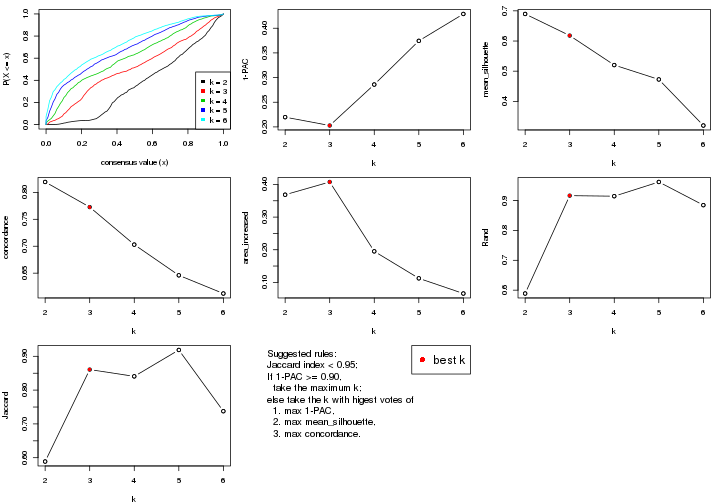

The numeric values for all these statistics can be obtained by `get_stats()`.

```r
get_stats(res)
```

```
#>   k 1-PAC mean_silhouette concordance area_increased  Rand Jaccard
#> 2 2 0.220           0.690       0.819         0.3686 0.589   0.589
#> 3 3 0.203           0.618       0.773         0.4077 0.917   0.861
#> 4 4 0.286           0.520       0.703         0.1950 0.915   0.841
#> 5 5 0.374           0.473       0.646         0.1124 0.962   0.919
#> 6 6 0.429           0.320       0.612         0.0658 0.885   0.738
```

`suggest_best_k()` suggests the best $k$ based on these statistics. The rules are as follows:

- All $k$ with Jaccard index larger than 0.95 are removed because increasing
  $k$ does not provide enough extra information. If all $k$ are removed, it is
  marked as no subgroup is detected.
- For all $k$ with 1-PAC score larger than 0.9, the maximal $k$ is taken as
  the best $k$, and other $k$ are marked as optional $k$.
- If it does not fit the second rule. The $k$ with the maximal vote of the
  highest 1-PAC score, highest mean silhouette, and highest concordance is
  taken as the best $k$.

```r
suggest_best_k(res)
```

```
#> [1] 3
```


Following shows the table of the partitions (You need to click the **show/hide
code output** link to see it). The membership matrix (columns with name `p*`)
is inferred by
[`clue::cl_consensus()`](https://www.rdocumentation.org/link/cl_consensus?package=clue)
function with the `SE` method. Basically the value in the membership matrix
represents the probability to belong to a certain group. The finall class
label for an item is determined with the group with highest probability it
belongs to.

In `get_classes()` function, the entropy is calculated from the membership
matrix and the silhouette score is calculated from the consensus matrix.


<script>
$( function() {
	$( '#tabs-SD-hclust-get-classes' ).tabs();
} );
</script>
<div id='tabs-SD-hclust-get-classes'>
<ul>
<li><a href='#tab-SD-hclust-get-classes-1'>k = 2</a></li>
<li><a href='#tab-SD-hclust-get-classes-2'>k = 3</a></li>
<li><a href='#tab-SD-hclust-get-classes-3'>k = 4</a></li>
<li><a href='#tab-SD-hclust-get-classes-4'>k = 5</a></li>
<li><a href='#tab-SD-hclust-get-classes-5'>k = 6</a></li>
</ul>

<div id='tab-SD-hclust-get-classes-1'>
<p><a id='tab-SD-hclust-get-classes-1-a' style='color:#0366d6' href='#'>show/hide code output</a></p>
<pre><code class="r">cbind(get_classes(res, k = 2), get_membership(res, k = 2))
</code></pre>

<pre><code>#&gt;          class entropy silhouette    p1    p2
#&gt; GSM29783     1  0.9988    -0.3613 0.520 0.480
#&gt; GSM29786     2  0.9970     0.5139 0.468 0.532
#&gt; GSM29789     2  0.8763     0.7722 0.296 0.704
#&gt; GSM29792     2  0.4298     0.6631 0.088 0.912
#&gt; GSM29795     2  0.9427     0.7029 0.360 0.640
#&gt; GSM29798     1  0.8861     0.4293 0.696 0.304
#&gt; GSM29801     1  0.3879     0.8242 0.924 0.076
#&gt; GSM29804     1  0.2948     0.8278 0.948 0.052
#&gt; GSM29807     1  0.8267     0.5109 0.740 0.260
#&gt; GSM29816     1  0.2043     0.8293 0.968 0.032
#&gt; GSM29821     1  0.6048     0.7839 0.852 0.148
#&gt; GSM29824     1  0.2603     0.8319 0.956 0.044
#&gt; GSM29827     1  0.1414     0.8209 0.980 0.020
#&gt; GSM29830     1  0.1414     0.8209 0.980 0.020
#&gt; GSM29833     1  0.1843     0.8244 0.972 0.028
#&gt; GSM29784     2  0.9460     0.7393 0.364 0.636
#&gt; GSM29787     2  0.9970     0.5139 0.468 0.532
#&gt; GSM29790     2  0.8763     0.7722 0.296 0.704
#&gt; GSM29793     2  0.4298     0.6631 0.088 0.912
#&gt; GSM29796     2  0.9427     0.7029 0.360 0.640
#&gt; GSM29799     1  0.8861     0.4293 0.696 0.304
#&gt; GSM29802     1  0.4161     0.8209 0.916 0.084
#&gt; GSM29805     1  0.2948     0.8278 0.948 0.052
#&gt; GSM29814     1  0.8267     0.5109 0.740 0.260
#&gt; GSM29817     1  0.2236     0.8295 0.964 0.036
#&gt; GSM29822     1  0.6048     0.7839 0.852 0.148
#&gt; GSM29825     1  0.2603     0.8319 0.956 0.044
#&gt; GSM29828     1  0.1414     0.8209 0.980 0.020
#&gt; GSM29831     1  0.1414     0.8209 0.980 0.020
#&gt; GSM29834     1  0.1843     0.8244 0.972 0.028
#&gt; GSM29785     2  0.9460     0.7393 0.364 0.636
#&gt; GSM29788     2  0.9970     0.5139 0.468 0.532
#&gt; GSM29791     2  0.8763     0.7722 0.296 0.704
#&gt; GSM29794     2  0.4298     0.6631 0.088 0.912
#&gt; GSM29797     2  0.9427     0.7029 0.360 0.640
#&gt; GSM29800     1  0.8861     0.4293 0.696 0.304
#&gt; GSM29803     1  0.4022     0.8219 0.920 0.080
#&gt; GSM29806     1  0.2948     0.8278 0.948 0.052
#&gt; GSM29815     1  0.8267     0.5109 0.740 0.260
#&gt; GSM29819     1  0.3114     0.8275 0.944 0.056
#&gt; GSM29823     1  0.6048     0.7839 0.852 0.148
#&gt; GSM29826     1  0.2603     0.8319 0.956 0.044
#&gt; GSM29829     1  0.3114     0.8210 0.944 0.056
#&gt; GSM29832     1  0.3114     0.8167 0.944 0.056
#&gt; GSM29835     1  0.6887     0.6999 0.816 0.184
#&gt; GSM29836     2  0.3431     0.6479 0.064 0.936
#&gt; GSM29839     2  0.9522     0.7115 0.372 0.628
#&gt; GSM29842     1  0.9732     0.0210 0.596 0.404
#&gt; GSM29845     1  0.7376     0.6625 0.792 0.208
#&gt; GSM29848     1  0.9998    -0.4035 0.508 0.492
#&gt; GSM29851     1  0.4161     0.8204 0.916 0.084
#&gt; GSM29854     1  0.4562     0.8148 0.904 0.096
#&gt; GSM29857     1  0.3114     0.8282 0.944 0.056
#&gt; GSM29860     2  0.9358     0.7211 0.352 0.648
#&gt; GSM29863     1  0.3733     0.8247 0.928 0.072
#&gt; GSM29866     1  0.1843     0.8295 0.972 0.028
#&gt; GSM29869     1  0.1633     0.8284 0.976 0.024
#&gt; GSM29872     2  0.9358     0.6504 0.352 0.648
#&gt; GSM29875     1  0.2423     0.8290 0.960 0.040
#&gt; GSM29878     1  0.9754    -0.0405 0.592 0.408
#&gt; GSM29837     2  0.3431     0.6479 0.064 0.936
#&gt; GSM29840     2  0.9522     0.7115 0.372 0.628
#&gt; GSM29843     2  0.8813     0.7798 0.300 0.700
#&gt; GSM29846     1  0.7376     0.6625 0.792 0.208
#&gt; GSM29849     1  0.9998    -0.4035 0.508 0.492
#&gt; GSM29852     1  0.4161     0.8204 0.916 0.084
#&gt; GSM29855     1  0.4562     0.8148 0.904 0.096
#&gt; GSM29858     1  0.3114     0.8282 0.944 0.056
#&gt; GSM29861     2  0.9358     0.7211 0.352 0.648
#&gt; GSM29864     1  0.3733     0.8247 0.928 0.072
#&gt; GSM29867     1  0.1843     0.8295 0.972 0.028
#&gt; GSM29870     1  0.1633     0.8284 0.976 0.024
#&gt; GSM29873     2  0.9358     0.6504 0.352 0.648
#&gt; GSM29876     1  0.2423     0.8290 0.960 0.040
#&gt; GSM29879     1  0.9754    -0.0405 0.592 0.408
#&gt; GSM29838     2  0.3431     0.6479 0.064 0.936
#&gt; GSM29841     2  0.9522     0.7115 0.372 0.628
#&gt; GSM29844     2  0.8813     0.7798 0.300 0.700
#&gt; GSM29847     1  0.7376     0.6625 0.792 0.208
#&gt; GSM29850     1  0.9998    -0.4035 0.508 0.492
#&gt; GSM29853     1  0.4161     0.8204 0.916 0.084
#&gt; GSM29856     1  0.5059     0.8040 0.888 0.112
#&gt; GSM29859     1  0.3114     0.8282 0.944 0.056
#&gt; GSM29862     2  0.9358     0.7211 0.352 0.648
#&gt; GSM29865     1  0.3733     0.8247 0.928 0.072
#&gt; GSM29868     1  0.6343     0.7379 0.840 0.160
#&gt; GSM29871     1  0.1633     0.8284 0.976 0.024
#&gt; GSM29874     2  0.9358     0.6504 0.352 0.648
#&gt; GSM29877     1  0.2423     0.8290 0.960 0.040
#&gt; GSM29880     1  0.9286     0.3468 0.656 0.344
#&gt; GSM29881     1  0.4298     0.8223 0.912 0.088
#&gt; GSM29884     2  0.8861     0.7770 0.304 0.696
#&gt; GSM29887     2  0.8861     0.7770 0.304 0.696
#&gt; GSM29890     1  0.1184     0.8188 0.984 0.016
#&gt; GSM29893     1  0.5519     0.7821 0.872 0.128
#&gt; GSM29896     1  0.0938     0.8208 0.988 0.012
#&gt; GSM29899     1  0.0938     0.8228 0.988 0.012
#&gt; GSM29902     1  0.2423     0.8295 0.960 0.040
#&gt; GSM29905     1  0.7056     0.6717 0.808 0.192
#&gt; GSM29908     1  0.2423     0.8240 0.960 0.040
#&gt; GSM29955     1  0.2778     0.8219 0.952 0.048
#&gt; GSM29958     1  0.1843     0.8244 0.972 0.028
#&gt; GSM29961     1  0.2603     0.8247 0.956 0.044
#&gt; GSM29882     1  0.4298     0.8223 0.912 0.088
#&gt; GSM29885     2  0.8861     0.7770 0.304 0.696
#&gt; GSM29888     2  0.8909     0.7767 0.308 0.692
#&gt; GSM29891     1  0.1184     0.8188 0.984 0.016
#&gt; GSM29894     1  0.5519     0.7821 0.872 0.128
#&gt; GSM29897     1  0.1184     0.8205 0.984 0.016
#&gt; GSM29900     1  0.0672     0.8207 0.992 0.008
#&gt; GSM29903     1  0.1414     0.8191 0.980 0.020
#&gt; GSM29906     1  0.7056     0.6717 0.808 0.192
#&gt; GSM29909     1  0.1843     0.8231 0.972 0.028
#&gt; GSM29956     1  0.2778     0.8217 0.952 0.048
#&gt; GSM29959     1  0.1843     0.8244 0.972 0.028
#&gt; GSM29962     1  0.2603     0.8247 0.956 0.044
#&gt; GSM29883     1  0.4298     0.8223 0.912 0.088
#&gt; GSM29886     2  0.8813     0.7794 0.300 0.700
#&gt; GSM29889     2  0.8861     0.7789 0.304 0.696
#&gt; GSM29892     1  0.1414     0.8191 0.980 0.020
#&gt; GSM29895     1  0.5629     0.7779 0.868 0.132
#&gt; GSM29898     1  0.4022     0.8126 0.920 0.080
#&gt; GSM29901     1  0.0938     0.8264 0.988 0.012
#&gt; GSM29904     1  0.2778     0.8266 0.952 0.048
#&gt; GSM29907     1  0.6973     0.6699 0.812 0.188
#&gt; GSM29910     1  0.6801     0.7061 0.820 0.180
#&gt; GSM29957     1  0.3114     0.8204 0.944 0.056
#&gt; GSM29960     1  0.4939     0.7915 0.892 0.108
#&gt; GSM29963     1  0.6801     0.7061 0.820 0.180
#&gt; GSM29964     2  0.8386     0.7753 0.268 0.732
#&gt; GSM29967     2  0.9732     0.6477 0.404 0.596
#&gt; GSM29970     2  0.9983     0.4997 0.476 0.524
#&gt; GSM29973     2  0.8327     0.7674 0.264 0.736
#&gt; GSM29976     1  0.3584     0.8285 0.932 0.068
#&gt; GSM29979     2  0.9552     0.6982 0.376 0.624
#&gt; GSM29982     1  0.9850    -0.1172 0.572 0.428
#&gt; GSM29985     1  0.3584     0.8273 0.932 0.068
#&gt; GSM29988     1  0.7528     0.6167 0.784 0.216
#&gt; GSM29991     1  0.8327     0.4977 0.736 0.264
#&gt; GSM29994     1  0.3114     0.8306 0.944 0.056
#&gt; GSM29997     1  0.6148     0.7023 0.848 0.152
#&gt; GSM30000     1  0.5178     0.7730 0.884 0.116
#&gt; GSM30003     1  0.2236     0.8295 0.964 0.036
#&gt; GSM29965     2  0.8386     0.7753 0.268 0.732
#&gt; GSM29968     2  0.9732     0.6477 0.404 0.596
#&gt; GSM29971     2  0.9983     0.4997 0.476 0.524
#&gt; GSM29974     2  0.8327     0.7674 0.264 0.736
#&gt; GSM29977     1  0.3584     0.8285 0.932 0.068
#&gt; GSM29980     2  0.9552     0.6982 0.376 0.624
#&gt; GSM29983     1  0.9850    -0.1172 0.572 0.428
#&gt; GSM29986     1  0.3584     0.8273 0.932 0.068
#&gt; GSM29989     1  0.7528     0.6167 0.784 0.216
#&gt; GSM29992     1  0.8327     0.4977 0.736 0.264
#&gt; GSM29995     1  0.2236     0.8258 0.964 0.036
#&gt; GSM29998     1  0.6148     0.7023 0.848 0.152
#&gt; GSM30001     1  0.5178     0.7730 0.884 0.116
#&gt; GSM30004     1  0.2236     0.8295 0.964 0.036
#&gt; GSM29966     2  0.8386     0.7753 0.268 0.732
#&gt; GSM29969     2  0.9732     0.6477 0.404 0.596
#&gt; GSM29972     2  0.9983     0.4997 0.476 0.524
#&gt; GSM29975     2  0.8327     0.7674 0.264 0.736
#&gt; GSM29978     1  0.3584     0.8285 0.932 0.068
#&gt; GSM29981     2  0.9248     0.6798 0.340 0.660
#&gt; GSM29984     1  0.9850    -0.1172 0.572 0.428
#&gt; GSM29987     1  0.3584     0.8273 0.932 0.068
#&gt; GSM29990     1  0.7528     0.6167 0.784 0.216
#&gt; GSM29993     1  0.8327     0.4977 0.736 0.264
#&gt; GSM29996     1  0.2948     0.8272 0.948 0.052
#&gt; GSM29999     1  0.6343     0.6900 0.840 0.160
#&gt; GSM30002     1  0.5178     0.7730 0.884 0.116
#&gt; GSM30005     1  0.2236     0.8295 0.964 0.036
</code></pre>

<script>
$('#tab-SD-hclust-get-classes-1-a').parent().next().next().hide();
$('#tab-SD-hclust-get-classes-1-a').click(function(){
  $('#tab-SD-hclust-get-classes-1-a').parent().next().next().toggle();
  return(false);
});
</script>
</div>

<div id='tab-SD-hclust-get-classes-2'>
<p><a id='tab-SD-hclust-get-classes-2-a' style='color:#0366d6' href='#'>show/hide code output</a></p>
<pre><code class="r">cbind(get_classes(res, k = 3), get_membership(res, k = 3))
</code></pre>

<pre><code>#&gt;          class entropy silhouette    p1    p2    p3
#&gt; GSM29783     1   0.997     -0.419 0.364 0.340 0.296
#&gt; GSM29786     3   0.983      0.354 0.260 0.324 0.416
#&gt; GSM29789     2   0.606      0.583 0.132 0.784 0.084
#&gt; GSM29792     2   0.492      0.521 0.020 0.816 0.164
#&gt; GSM29795     2   0.895      0.155 0.148 0.532 0.320
#&gt; GSM29798     1   0.891      0.244 0.564 0.176 0.260
#&gt; GSM29801     1   0.409      0.797 0.876 0.036 0.088
#&gt; GSM29804     1   0.314      0.806 0.912 0.020 0.068
#&gt; GSM29807     1   0.804      0.400 0.600 0.312 0.088
#&gt; GSM29816     1   0.140      0.812 0.968 0.004 0.028
#&gt; GSM29821     1   0.646      0.704 0.756 0.080 0.164
#&gt; GSM29824     1   0.210      0.815 0.944 0.004 0.052
#&gt; GSM29827     1   0.188      0.808 0.956 0.012 0.032
#&gt; GSM29830     1   0.188      0.808 0.956 0.012 0.032
#&gt; GSM29833     1   0.232      0.811 0.944 0.028 0.028
#&gt; GSM29784     2   0.894      0.226 0.164 0.552 0.284
#&gt; GSM29787     3   0.983      0.354 0.260 0.324 0.416
#&gt; GSM29790     2   0.606      0.583 0.132 0.784 0.084
#&gt; GSM29793     2   0.492      0.521 0.020 0.816 0.164
#&gt; GSM29796     2   0.895      0.155 0.148 0.532 0.320
#&gt; GSM29799     1   0.891      0.244 0.564 0.176 0.260
#&gt; GSM29802     1   0.393      0.798 0.880 0.028 0.092
#&gt; GSM29805     1   0.314      0.806 0.912 0.020 0.068
#&gt; GSM29814     1   0.804      0.400 0.600 0.312 0.088
#&gt; GSM29817     1   0.171      0.812 0.960 0.008 0.032
#&gt; GSM29822     1   0.646      0.704 0.756 0.080 0.164
#&gt; GSM29825     1   0.210      0.815 0.944 0.004 0.052
#&gt; GSM29828     1   0.188      0.808 0.956 0.012 0.032
#&gt; GSM29831     1   0.188      0.808 0.956 0.012 0.032
#&gt; GSM29834     1   0.219      0.810 0.948 0.024 0.028
#&gt; GSM29785     2   0.894      0.226 0.164 0.552 0.284
#&gt; GSM29788     3   0.983      0.354 0.260 0.324 0.416
#&gt; GSM29791     2   0.606      0.583 0.132 0.784 0.084
#&gt; GSM29794     2   0.492      0.521 0.020 0.816 0.164
#&gt; GSM29797     2   0.895      0.155 0.148 0.532 0.320
#&gt; GSM29800     1   0.891      0.244 0.564 0.176 0.260
#&gt; GSM29803     1   0.393      0.797 0.880 0.028 0.092
#&gt; GSM29806     1   0.314      0.806 0.912 0.020 0.068
#&gt; GSM29815     1   0.804      0.400 0.600 0.312 0.088
#&gt; GSM29819     1   0.280      0.805 0.924 0.016 0.060
#&gt; GSM29823     1   0.646      0.704 0.756 0.080 0.164
#&gt; GSM29826     1   0.210      0.815 0.944 0.004 0.052
#&gt; GSM29829     1   0.336      0.807 0.908 0.056 0.036
#&gt; GSM29832     1   0.326      0.805 0.912 0.048 0.040
#&gt; GSM29835     1   0.578      0.682 0.768 0.200 0.032
#&gt; GSM29836     2   0.481      0.507 0.008 0.804 0.188
#&gt; GSM29839     2   0.771      0.450 0.196 0.676 0.128
#&gt; GSM29842     1   0.968     -0.118 0.456 0.300 0.244
#&gt; GSM29845     1   0.736      0.601 0.700 0.112 0.188
#&gt; GSM29848     2   0.984     -0.106 0.296 0.424 0.280
#&gt; GSM29851     1   0.406      0.792 0.876 0.032 0.092
#&gt; GSM29854     1   0.479      0.787 0.844 0.044 0.112
#&gt; GSM29857     1   0.298      0.807 0.920 0.024 0.056
#&gt; GSM29860     2   0.681      0.519 0.212 0.720 0.068
#&gt; GSM29863     1   0.401      0.795 0.876 0.028 0.096
#&gt; GSM29866     1   0.140      0.814 0.968 0.004 0.028
#&gt; GSM29869     1   0.117      0.812 0.976 0.008 0.016
#&gt; GSM29872     2   0.822      0.415 0.248 0.624 0.128
#&gt; GSM29875     1   0.158      0.812 0.964 0.008 0.028
#&gt; GSM29878     1   0.784     -0.119 0.476 0.472 0.052
#&gt; GSM29837     2   0.481      0.507 0.008 0.804 0.188
#&gt; GSM29840     2   0.771      0.450 0.196 0.676 0.128
#&gt; GSM29843     2   0.706      0.557 0.112 0.724 0.164
#&gt; GSM29846     1   0.736      0.601 0.700 0.112 0.188
#&gt; GSM29849     2   0.984     -0.106 0.296 0.424 0.280
#&gt; GSM29852     1   0.406      0.792 0.876 0.032 0.092
#&gt; GSM29855     1   0.479      0.787 0.844 0.044 0.112
#&gt; GSM29858     1   0.298      0.807 0.920 0.024 0.056
#&gt; GSM29861     2   0.681      0.519 0.212 0.720 0.068
#&gt; GSM29864     1   0.401      0.795 0.876 0.028 0.096
#&gt; GSM29867     1   0.140      0.814 0.968 0.004 0.028
#&gt; GSM29870     1   0.117      0.812 0.976 0.008 0.016
#&gt; GSM29873     2   0.822      0.415 0.248 0.624 0.128
#&gt; GSM29876     1   0.158      0.812 0.964 0.008 0.028
#&gt; GSM29879     1   0.784     -0.119 0.476 0.472 0.052
#&gt; GSM29838     2   0.481      0.507 0.008 0.804 0.188
#&gt; GSM29841     2   0.771      0.450 0.196 0.676 0.128
#&gt; GSM29844     2   0.706      0.557 0.112 0.724 0.164
#&gt; GSM29847     1   0.736      0.601 0.700 0.112 0.188
#&gt; GSM29850     2   0.984     -0.106 0.296 0.424 0.280
#&gt; GSM29853     1   0.406      0.792 0.876 0.032 0.092
#&gt; GSM29856     1   0.500      0.780 0.832 0.044 0.124
#&gt; GSM29859     1   0.298      0.807 0.920 0.024 0.056
#&gt; GSM29862     2   0.681      0.519 0.212 0.720 0.068
#&gt; GSM29865     1   0.401      0.795 0.876 0.028 0.096
#&gt; GSM29868     1   0.597      0.723 0.784 0.148 0.068
#&gt; GSM29871     1   0.117      0.812 0.976 0.008 0.016
#&gt; GSM29874     2   0.822      0.415 0.248 0.624 0.128
#&gt; GSM29877     1   0.158      0.812 0.964 0.008 0.028
#&gt; GSM29880     1   0.776      0.340 0.580 0.360 0.060
#&gt; GSM29881     1   0.441      0.779 0.844 0.016 0.140
#&gt; GSM29884     2   0.631      0.602 0.100 0.772 0.128
#&gt; GSM29887     2   0.631      0.602 0.100 0.772 0.128
#&gt; GSM29890     1   0.175      0.807 0.960 0.012 0.028
#&gt; GSM29893     1   0.602      0.745 0.788 0.092 0.120
#&gt; GSM29896     1   0.153      0.807 0.964 0.004 0.032
#&gt; GSM29899     1   0.164      0.808 0.956 0.000 0.044
#&gt; GSM29902     1   0.301      0.815 0.920 0.028 0.052
#&gt; GSM29905     1   0.730      0.588 0.704 0.108 0.188
#&gt; GSM29908     1   0.269      0.810 0.932 0.036 0.032
#&gt; GSM29955     1   0.311      0.805 0.916 0.056 0.028
#&gt; GSM29958     1   0.219      0.810 0.948 0.024 0.028
#&gt; GSM29961     1   0.293      0.810 0.924 0.040 0.036
#&gt; GSM29882     1   0.441      0.779 0.844 0.016 0.140
#&gt; GSM29885     2   0.631      0.602 0.100 0.772 0.128
#&gt; GSM29888     2   0.638      0.601 0.104 0.768 0.128
#&gt; GSM29891     1   0.175      0.807 0.960 0.012 0.028
#&gt; GSM29894     1   0.602      0.745 0.788 0.092 0.120
#&gt; GSM29897     1   0.171      0.808 0.960 0.008 0.032
#&gt; GSM29900     1   0.153      0.808 0.960 0.000 0.040
#&gt; GSM29903     1   0.218      0.809 0.948 0.020 0.032
#&gt; GSM29906     1   0.730      0.588 0.704 0.108 0.188
#&gt; GSM29909     1   0.231      0.811 0.944 0.024 0.032
#&gt; GSM29956     1   0.315      0.805 0.916 0.048 0.036
#&gt; GSM29959     1   0.219      0.810 0.948 0.024 0.028
#&gt; GSM29962     1   0.293      0.810 0.924 0.040 0.036
#&gt; GSM29883     1   0.441      0.779 0.844 0.016 0.140
#&gt; GSM29886     2   0.631      0.603 0.100 0.772 0.128
#&gt; GSM29889     2   0.638      0.602 0.104 0.768 0.128
#&gt; GSM29892     1   0.219      0.811 0.948 0.024 0.028
#&gt; GSM29895     1   0.610      0.741 0.784 0.096 0.120
#&gt; GSM29898     1   0.461      0.791 0.856 0.092 0.052
#&gt; GSM29901     1   0.234      0.816 0.940 0.012 0.048
#&gt; GSM29904     1   0.378      0.808 0.892 0.064 0.044
#&gt; GSM29907     1   0.732      0.585 0.704 0.112 0.184
#&gt; GSM29910     1   0.657      0.684 0.748 0.172 0.080
#&gt; GSM29957     1   0.331      0.803 0.908 0.064 0.028
#&gt; GSM29960     1   0.502      0.772 0.836 0.108 0.056
#&gt; GSM29963     1   0.657      0.684 0.748 0.172 0.080
#&gt; GSM29964     2   0.517      0.594 0.056 0.828 0.116
#&gt; GSM29967     3   0.589      0.569 0.036 0.200 0.764
#&gt; GSM29970     3   0.690      0.637 0.100 0.168 0.732
#&gt; GSM29973     2   0.589      0.610 0.096 0.796 0.108
#&gt; GSM29976     1   0.346      0.805 0.900 0.024 0.076
#&gt; GSM29979     2   0.861      0.472 0.204 0.604 0.192
#&gt; GSM29982     3   0.814      0.570 0.276 0.108 0.616
#&gt; GSM29985     1   0.375      0.798 0.884 0.020 0.096
#&gt; GSM29988     1   0.760      0.512 0.660 0.252 0.088
#&gt; GSM29991     1   0.899      0.167 0.552 0.176 0.272
#&gt; GSM29994     1   0.359      0.814 0.900 0.048 0.052
#&gt; GSM29997     1   0.652      0.639 0.752 0.168 0.080
#&gt; GSM30000     1   0.670      0.658 0.748 0.108 0.144
#&gt; GSM30003     1   0.158      0.812 0.964 0.008 0.028
#&gt; GSM29965     2   0.517      0.594 0.056 0.828 0.116
#&gt; GSM29968     3   0.589      0.569 0.036 0.200 0.764
#&gt; GSM29971     3   0.690      0.637 0.100 0.168 0.732
#&gt; GSM29974     2   0.589      0.610 0.096 0.796 0.108
#&gt; GSM29977     1   0.346      0.805 0.900 0.024 0.076
#&gt; GSM29980     2   0.861      0.472 0.204 0.604 0.192
#&gt; GSM29983     3   0.814      0.570 0.276 0.108 0.616
#&gt; GSM29986     1   0.375      0.798 0.884 0.020 0.096
#&gt; GSM29989     1   0.760      0.512 0.660 0.252 0.088
#&gt; GSM29992     1   0.899      0.167 0.552 0.176 0.272
#&gt; GSM29995     1   0.244      0.811 0.940 0.028 0.032
#&gt; GSM29998     1   0.652      0.639 0.752 0.168 0.080
#&gt; GSM30001     1   0.670      0.658 0.748 0.108 0.144
#&gt; GSM30004     1   0.158      0.812 0.964 0.008 0.028
#&gt; GSM29966     2   0.517      0.594 0.056 0.828 0.116
#&gt; GSM29969     3   0.589      0.569 0.036 0.200 0.764
#&gt; GSM29972     3   0.690      0.637 0.100 0.168 0.732
#&gt; GSM29975     2   0.589      0.610 0.096 0.796 0.108
#&gt; GSM29978     1   0.346      0.805 0.900 0.024 0.076
#&gt; GSM29981     2   0.891      0.392 0.212 0.572 0.216
#&gt; GSM29984     3   0.814      0.570 0.276 0.108 0.616
#&gt; GSM29987     1   0.375      0.798 0.884 0.020 0.096
#&gt; GSM29990     1   0.760      0.512 0.660 0.252 0.088
#&gt; GSM29993     1   0.899      0.167 0.552 0.176 0.272
#&gt; GSM29996     1   0.343      0.810 0.904 0.064 0.032
#&gt; GSM29999     1   0.670      0.622 0.736 0.188 0.076
#&gt; GSM30002     1   0.670      0.658 0.748 0.108 0.144
#&gt; GSM30005     1   0.158      0.812 0.964 0.008 0.028
</code></pre>

<script>
$('#tab-SD-hclust-get-classes-2-a').parent().next().next().hide();
$('#tab-SD-hclust-get-classes-2-a').click(function(){
  $('#tab-SD-hclust-get-classes-2-a').parent().next().next().toggle();
  return(false);
});
</script>
</div>

<div id='tab-SD-hclust-get-classes-3'>
<p><a id='tab-SD-hclust-get-classes-3-a' style='color:#0366d6' href='#'>show/hide code output</a></p>
<pre><code class="r">cbind(get_classes(res, k = 4), get_membership(res, k = 4))
</code></pre>

<pre><code>#&gt;          class entropy silhouette    p1    p2    p3    p4
#&gt; GSM29783     2   0.948    -0.1246 0.312 0.356 0.120 0.212
#&gt; GSM29786     4   0.974     0.2017 0.164 0.304 0.208 0.324
#&gt; GSM29789     2   0.638     0.5695 0.044 0.684 0.220 0.052
#&gt; GSM29792     2   0.604     0.4947 0.008 0.676 0.244 0.072
#&gt; GSM29795     2   0.897     0.2037 0.072 0.428 0.224 0.276
#&gt; GSM29798     1   0.908     0.1874 0.484 0.184 0.156 0.176
#&gt; GSM29801     1   0.458     0.7057 0.828 0.028 0.072 0.072
#&gt; GSM29804     1   0.369     0.7135 0.876 0.040 0.040 0.044
#&gt; GSM29807     3   0.832     0.6778 0.352 0.200 0.420 0.028
#&gt; GSM29816     1   0.230     0.7269 0.932 0.012 0.024 0.032
#&gt; GSM29821     1   0.715     0.5722 0.660 0.060 0.120 0.160
#&gt; GSM29824     1   0.265     0.7285 0.912 0.004 0.028 0.056
#&gt; GSM29827     1   0.374     0.7001 0.848 0.016 0.124 0.012
#&gt; GSM29830     1   0.379     0.7035 0.844 0.016 0.128 0.012
#&gt; GSM29833     1   0.409     0.6972 0.828 0.028 0.136 0.008
#&gt; GSM29784     2   0.804     0.2950 0.092 0.580 0.116 0.212
#&gt; GSM29787     4   0.974     0.2017 0.164 0.304 0.208 0.324
#&gt; GSM29790     2   0.638     0.5695 0.044 0.684 0.220 0.052
#&gt; GSM29793     2   0.604     0.4947 0.008 0.676 0.244 0.072
#&gt; GSM29796     2   0.897     0.2037 0.072 0.428 0.224 0.276
#&gt; GSM29799     1   0.908     0.1874 0.484 0.184 0.156 0.176
#&gt; GSM29802     1   0.457     0.7079 0.832 0.040 0.060 0.068
#&gt; GSM29805     1   0.369     0.7135 0.876 0.040 0.040 0.044
#&gt; GSM29814     3   0.832     0.6778 0.352 0.200 0.420 0.028
#&gt; GSM29817     1   0.259     0.7237 0.920 0.012 0.036 0.032
#&gt; GSM29822     1   0.715     0.5722 0.660 0.060 0.120 0.160
#&gt; GSM29825     1   0.265     0.7285 0.912 0.004 0.028 0.056
#&gt; GSM29828     1   0.374     0.7001 0.848 0.016 0.124 0.012
#&gt; GSM29831     1   0.374     0.7001 0.848 0.016 0.124 0.012
#&gt; GSM29834     1   0.393     0.7002 0.836 0.024 0.132 0.008
#&gt; GSM29785     2   0.804     0.2950 0.092 0.580 0.116 0.212
#&gt; GSM29788     4   0.974     0.2017 0.164 0.304 0.208 0.324
#&gt; GSM29791     2   0.638     0.5695 0.044 0.684 0.220 0.052
#&gt; GSM29794     2   0.604     0.4947 0.008 0.676 0.244 0.072
#&gt; GSM29797     2   0.897     0.2037 0.072 0.428 0.224 0.276
#&gt; GSM29800     1   0.908     0.1874 0.484 0.184 0.156 0.176
#&gt; GSM29803     1   0.455     0.7077 0.832 0.036 0.068 0.064
#&gt; GSM29806     1   0.360     0.7138 0.880 0.040 0.040 0.040
#&gt; GSM29815     3   0.832     0.6778 0.352 0.200 0.420 0.028
#&gt; GSM29819     1   0.342     0.7177 0.888 0.040 0.036 0.036
#&gt; GSM29823     1   0.715     0.5722 0.660 0.060 0.120 0.160
#&gt; GSM29826     1   0.265     0.7285 0.912 0.004 0.028 0.056
#&gt; GSM29829     1   0.495     0.6829 0.780 0.048 0.160 0.012
#&gt; GSM29832     1   0.487     0.6814 0.776 0.036 0.176 0.012
#&gt; GSM29835     1   0.733     0.4340 0.612 0.160 0.200 0.028
#&gt; GSM29836     2   0.616     0.4868 0.000 0.656 0.240 0.104
#&gt; GSM29839     2   0.785     0.4580 0.092 0.568 0.264 0.076
#&gt; GSM29842     1   0.915    -0.0731 0.408 0.324 0.120 0.148
#&gt; GSM29845     1   0.744     0.4984 0.648 0.108 0.100 0.144
#&gt; GSM29848     2   0.971     0.0212 0.168 0.368 0.232 0.232
#&gt; GSM29851     1   0.466     0.6973 0.824 0.032 0.060 0.084
#&gt; GSM29854     1   0.613     0.6642 0.740 0.056 0.104 0.100
#&gt; GSM29857     1   0.341     0.7153 0.888 0.040 0.040 0.032
#&gt; GSM29860     2   0.730     0.2556 0.088 0.588 0.284 0.040
#&gt; GSM29863     1   0.464     0.7000 0.828 0.044 0.052 0.076
#&gt; GSM29866     1   0.272     0.7333 0.912 0.012 0.056 0.020
#&gt; GSM29869     1   0.285     0.7240 0.900 0.008 0.076 0.016
#&gt; GSM29872     3   0.778     0.0286 0.076 0.396 0.472 0.056
#&gt; GSM29875     1   0.250     0.7223 0.920 0.004 0.044 0.032
#&gt; GSM29878     2   0.829    -0.2490 0.344 0.432 0.196 0.028
#&gt; GSM29837     2   0.616     0.4868 0.000 0.656 0.240 0.104
#&gt; GSM29840     2   0.785     0.4580 0.092 0.568 0.264 0.076
#&gt; GSM29843     2   0.574     0.5678 0.048 0.764 0.100 0.088
#&gt; GSM29846     1   0.744     0.4984 0.648 0.108 0.100 0.144
#&gt; GSM29849     2   0.971     0.0212 0.168 0.368 0.232 0.232
#&gt; GSM29852     1   0.466     0.6973 0.824 0.032 0.060 0.084
#&gt; GSM29855     1   0.619     0.6632 0.736 0.056 0.104 0.104
#&gt; GSM29858     1   0.341     0.7153 0.888 0.040 0.040 0.032
#&gt; GSM29861     2   0.730     0.2556 0.088 0.588 0.284 0.040
#&gt; GSM29864     1   0.464     0.7000 0.828 0.044 0.052 0.076
#&gt; GSM29867     1   0.272     0.7333 0.912 0.012 0.056 0.020
#&gt; GSM29870     1   0.285     0.7240 0.900 0.008 0.076 0.016
#&gt; GSM29873     3   0.778     0.0286 0.076 0.396 0.472 0.056
#&gt; GSM29876     1   0.250     0.7223 0.920 0.004 0.044 0.032
#&gt; GSM29879     2   0.829    -0.2490 0.344 0.432 0.196 0.028
#&gt; GSM29838     2   0.616     0.4868 0.000 0.656 0.240 0.104
#&gt; GSM29841     2   0.785     0.4580 0.092 0.568 0.264 0.076
#&gt; GSM29844     2   0.574     0.5678 0.048 0.764 0.100 0.088
#&gt; GSM29847     1   0.744     0.4984 0.648 0.108 0.100 0.144
#&gt; GSM29850     2   0.971     0.0212 0.168 0.368 0.232 0.232
#&gt; GSM29853     1   0.466     0.6973 0.824 0.032 0.060 0.084
#&gt; GSM29856     1   0.633     0.6492 0.724 0.052 0.112 0.112
#&gt; GSM29859     1   0.341     0.7153 0.888 0.040 0.040 0.032
#&gt; GSM29862     2   0.730     0.2556 0.088 0.588 0.284 0.040
#&gt; GSM29865     1   0.457     0.7013 0.832 0.044 0.052 0.072
#&gt; GSM29868     1   0.740     0.4550 0.600 0.096 0.256 0.048
#&gt; GSM29871     1   0.285     0.7240 0.900 0.008 0.076 0.016
#&gt; GSM29874     3   0.778     0.0286 0.076 0.396 0.472 0.056
#&gt; GSM29877     1   0.250     0.7223 0.920 0.004 0.044 0.032
#&gt; GSM29880     1   0.887    -0.2683 0.400 0.264 0.284 0.052
#&gt; GSM29881     1   0.470     0.6922 0.816 0.028 0.048 0.108
#&gt; GSM29884     2   0.274     0.5873 0.052 0.912 0.024 0.012
#&gt; GSM29887     2   0.274     0.5873 0.052 0.912 0.024 0.012
#&gt; GSM29890     1   0.307     0.6963 0.868 0.004 0.124 0.004
#&gt; GSM29893     1   0.732     0.5494 0.624 0.040 0.204 0.132
#&gt; GSM29896     1   0.292     0.7106 0.876 0.000 0.116 0.008
#&gt; GSM29899     1   0.344     0.7073 0.856 0.000 0.120 0.024
#&gt; GSM29902     1   0.441     0.6863 0.804 0.024 0.160 0.012
#&gt; GSM29905     1   0.800     0.3881 0.584 0.136 0.200 0.080
#&gt; GSM29908     1   0.437     0.6902 0.808 0.040 0.148 0.004
#&gt; GSM29955     1   0.492     0.6785 0.776 0.040 0.172 0.012
#&gt; GSM29958     1   0.399     0.6981 0.832 0.024 0.136 0.008
#&gt; GSM29961     1   0.456     0.6887 0.800 0.040 0.152 0.008
#&gt; GSM29882     1   0.470     0.6922 0.816 0.028 0.048 0.108
#&gt; GSM29885     2   0.274     0.5873 0.052 0.912 0.024 0.012
#&gt; GSM29888     2   0.285     0.5877 0.052 0.908 0.028 0.012
#&gt; GSM29891     1   0.307     0.6963 0.868 0.004 0.124 0.004
#&gt; GSM29894     1   0.732     0.5494 0.624 0.040 0.204 0.132
#&gt; GSM29897     1   0.316     0.7108 0.868 0.004 0.120 0.008
#&gt; GSM29900     1   0.339     0.7072 0.856 0.000 0.124 0.020
#&gt; GSM29903     1   0.322     0.7026 0.864 0.008 0.124 0.004
#&gt; GSM29906     1   0.800     0.3881 0.584 0.136 0.200 0.080
#&gt; GSM29909     1   0.317     0.7137 0.868 0.016 0.116 0.000
#&gt; GSM29956     1   0.474     0.6843 0.788 0.036 0.164 0.012
#&gt; GSM29959     1   0.399     0.6981 0.832 0.024 0.136 0.008
#&gt; GSM29962     1   0.456     0.6887 0.800 0.040 0.152 0.008
#&gt; GSM29883     1   0.470     0.6922 0.816 0.028 0.048 0.108
#&gt; GSM29886     2   0.256     0.5930 0.048 0.920 0.016 0.016
#&gt; GSM29889     2   0.267     0.5932 0.048 0.916 0.020 0.016
#&gt; GSM29892     1   0.333     0.6985 0.856 0.008 0.132 0.004
#&gt; GSM29895     1   0.743     0.5426 0.616 0.044 0.208 0.132
#&gt; GSM29898     1   0.634     0.6259 0.696 0.064 0.200 0.040
#&gt; GSM29901     1   0.382     0.7200 0.852 0.012 0.108 0.028
#&gt; GSM29904     1   0.533     0.6458 0.744 0.048 0.196 0.012
#&gt; GSM29907     1   0.801     0.3847 0.584 0.140 0.196 0.080
#&gt; GSM29910     1   0.774     0.3705 0.564 0.096 0.280 0.060
#&gt; GSM29957     1   0.508     0.6738 0.768 0.048 0.172 0.012
#&gt; GSM29960     1   0.642     0.6126 0.688 0.060 0.208 0.044
#&gt; GSM29963     1   0.774     0.3705 0.564 0.096 0.280 0.060
#&gt; GSM29964     2   0.261     0.5834 0.024 0.916 0.052 0.008
#&gt; GSM29967     4   0.349     0.6396 0.020 0.108 0.008 0.864
#&gt; GSM29970     4   0.439     0.6754 0.064 0.088 0.016 0.832
#&gt; GSM29973     2   0.443     0.5462 0.032 0.824 0.120 0.024
#&gt; GSM29976     1   0.367     0.7197 0.876 0.032 0.040 0.052
#&gt; GSM29979     2   0.833     0.3151 0.120 0.556 0.212 0.112
#&gt; GSM29982     4   0.557     0.6052 0.164 0.012 0.080 0.744
#&gt; GSM29985     1   0.400     0.7157 0.860 0.036 0.040 0.064
#&gt; GSM29988     3   0.792     0.6168 0.412 0.144 0.420 0.024
#&gt; GSM29991     1   0.918     0.0656 0.436 0.256 0.200 0.108
#&gt; GSM29994     1   0.469     0.6916 0.788 0.032 0.168 0.012
#&gt; GSM29997     1   0.689    -0.3755 0.488 0.072 0.428 0.012
#&gt; GSM30000     1   0.730     0.4658 0.636 0.156 0.164 0.044
#&gt; GSM30003     1   0.259     0.7260 0.920 0.012 0.036 0.032
#&gt; GSM29965     2   0.261     0.5834 0.024 0.916 0.052 0.008
#&gt; GSM29968     4   0.349     0.6396 0.020 0.108 0.008 0.864
#&gt; GSM29971     4   0.439     0.6754 0.064 0.088 0.016 0.832
#&gt; GSM29974     2   0.443     0.5462 0.032 0.824 0.120 0.024
#&gt; GSM29977     1   0.367     0.7197 0.876 0.032 0.040 0.052
#&gt; GSM29980     2   0.833     0.3151 0.120 0.556 0.212 0.112
#&gt; GSM29983     4   0.557     0.6052 0.164 0.012 0.080 0.744
#&gt; GSM29986     1   0.400     0.7157 0.860 0.036 0.040 0.064
#&gt; GSM29989     3   0.792     0.6168 0.412 0.144 0.420 0.024
#&gt; GSM29992     1   0.918     0.0656 0.436 0.256 0.200 0.108
#&gt; GSM29995     1   0.375     0.7037 0.836 0.012 0.144 0.008
#&gt; GSM29998     1   0.689    -0.3755 0.488 0.072 0.428 0.012
#&gt; GSM30001     1   0.730     0.4658 0.636 0.156 0.164 0.044
#&gt; GSM30004     1   0.259     0.7260 0.920 0.012 0.036 0.032
#&gt; GSM29966     2   0.261     0.5834 0.024 0.916 0.052 0.008
#&gt; GSM29969     4   0.349     0.6396 0.020 0.108 0.008 0.864
#&gt; GSM29972     4   0.439     0.6754 0.064 0.088 0.016 0.832
#&gt; GSM29975     2   0.443     0.5462 0.032 0.824 0.120 0.024
#&gt; GSM29978     1   0.367     0.7197 0.876 0.032 0.040 0.052
#&gt; GSM29981     2   0.867     0.1117 0.064 0.416 0.360 0.160
#&gt; GSM29984     4   0.557     0.6052 0.164 0.012 0.080 0.744
#&gt; GSM29987     1   0.400     0.7157 0.860 0.036 0.040 0.064
#&gt; GSM29990     3   0.792     0.6168 0.412 0.144 0.420 0.024
#&gt; GSM29993     1   0.918     0.0656 0.436 0.256 0.200 0.108
#&gt; GSM29996     1   0.491     0.6872 0.780 0.044 0.164 0.012
#&gt; GSM29999     1   0.714    -0.4001 0.484 0.084 0.416 0.016
#&gt; GSM30002     1   0.730     0.4658 0.636 0.156 0.164 0.044
#&gt; GSM30005     1   0.259     0.7260 0.920 0.012 0.036 0.032
</code></pre>

<script>
$('#tab-SD-hclust-get-classes-3-a').parent().next().next().hide();
$('#tab-SD-hclust-get-classes-3-a').click(function(){
  $('#tab-SD-hclust-get-classes-3-a').parent().next().next().toggle();
  return(false);
});
</script>
</div>

<div id='tab-SD-hclust-get-classes-4'>
<p><a id='tab-SD-hclust-get-classes-4-a' style='color:#0366d6' href='#'>show/hide code output</a></p>
<pre><code class="r">cbind(get_classes(res, k = 5), get_membership(res, k = 5))
</code></pre>

<pre><code>#&gt;          class entropy silhouette    p1    p2    p3    p4    p5
#&gt; GSM29783     2   0.923    -0.3876 0.180 0.308 0.280 0.184 0.048
#&gt; GSM29786     1   0.902     0.7172 0.364 0.196 0.092 0.276 0.072
#&gt; GSM29789     2   0.714     0.2999 0.256 0.556 0.016 0.052 0.120
#&gt; GSM29792     2   0.671     0.4278 0.136 0.544 0.000 0.036 0.284
#&gt; GSM29795     2   0.871    -0.3932 0.300 0.328 0.036 0.252 0.084
#&gt; GSM29798     3   0.851    -0.1030 0.236 0.152 0.444 0.136 0.032
#&gt; GSM29801     3   0.467     0.6481 0.128 0.016 0.780 0.064 0.012
#&gt; GSM29804     3   0.346     0.6660 0.040 0.032 0.872 0.036 0.020
#&gt; GSM29807     5   0.695     0.6647 0.044 0.156 0.220 0.008 0.572
#&gt; GSM29816     3   0.226     0.6780 0.060 0.008 0.916 0.012 0.004
#&gt; GSM29821     3   0.696     0.5110 0.168 0.044 0.612 0.148 0.028
#&gt; GSM29824     3   0.285     0.6815 0.068 0.000 0.884 0.040 0.008
#&gt; GSM29827     3   0.393     0.6336 0.276 0.000 0.716 0.000 0.008
#&gt; GSM29830     3   0.389     0.6384 0.268 0.000 0.724 0.000 0.008
#&gt; GSM29833     3   0.448     0.6316 0.272 0.008 0.700 0.000 0.020
#&gt; GSM29784     2   0.776    -0.2248 0.224 0.508 0.048 0.188 0.032
#&gt; GSM29787     1   0.902     0.7172 0.364 0.196 0.092 0.276 0.072
#&gt; GSM29790     2   0.714     0.2999 0.256 0.556 0.016 0.052 0.120
#&gt; GSM29793     2   0.671     0.4278 0.136 0.544 0.000 0.036 0.284
#&gt; GSM29796     2   0.871    -0.3932 0.300 0.328 0.036 0.252 0.084
#&gt; GSM29799     3   0.851    -0.1030 0.236 0.152 0.444 0.136 0.032
#&gt; GSM29802     3   0.451     0.6478 0.100 0.028 0.804 0.052 0.016
#&gt; GSM29805     3   0.346     0.6660 0.040 0.032 0.872 0.036 0.020
#&gt; GSM29814     5   0.695     0.6647 0.044 0.156 0.220 0.008 0.572
#&gt; GSM29817     3   0.268     0.6731 0.096 0.004 0.884 0.012 0.004
#&gt; GSM29822     3   0.696     0.5110 0.168 0.044 0.612 0.148 0.028
#&gt; GSM29825     3   0.285     0.6815 0.068 0.000 0.884 0.040 0.008
#&gt; GSM29828     3   0.393     0.6336 0.276 0.000 0.716 0.000 0.008
#&gt; GSM29831     3   0.393     0.6336 0.276 0.000 0.716 0.000 0.008
#&gt; GSM29834     3   0.441     0.6374 0.280 0.004 0.696 0.000 0.020
#&gt; GSM29785     2   0.776    -0.2248 0.224 0.508 0.048 0.188 0.032
#&gt; GSM29788     1   0.902     0.7172 0.364 0.196 0.092 0.276 0.072
#&gt; GSM29791     2   0.714     0.2999 0.256 0.556 0.016 0.052 0.120
#&gt; GSM29794     2   0.671     0.4278 0.136 0.544 0.000 0.036 0.284
#&gt; GSM29797     2   0.871    -0.3932 0.300 0.328 0.036 0.252 0.084
#&gt; GSM29800     3   0.851    -0.1030 0.236 0.152 0.444 0.136 0.032
#&gt; GSM29803     3   0.437     0.6489 0.108 0.020 0.808 0.048 0.016
#&gt; GSM29806     3   0.338     0.6663 0.040 0.032 0.876 0.032 0.020
#&gt; GSM29815     5   0.695     0.6647 0.044 0.156 0.220 0.008 0.572
#&gt; GSM29819     3   0.336     0.6701 0.044 0.036 0.876 0.024 0.020
#&gt; GSM29823     3   0.696     0.5110 0.168 0.044 0.612 0.148 0.028
#&gt; GSM29826     3   0.285     0.6815 0.068 0.000 0.884 0.040 0.008
#&gt; GSM29829     3   0.531     0.6086 0.300 0.020 0.640 0.000 0.040
#&gt; GSM29832     3   0.501     0.5976 0.324 0.004 0.632 0.000 0.040
#&gt; GSM29835     3   0.766     0.3538 0.260 0.108 0.492 0.004 0.136
#&gt; GSM29836     2   0.714     0.4151 0.132 0.516 0.000 0.068 0.284
#&gt; GSM29839     2   0.787    -0.0976 0.348 0.444 0.044 0.056 0.108
#&gt; GSM29842     3   0.895    -0.2575 0.164 0.276 0.380 0.124 0.056
#&gt; GSM29845     3   0.704     0.4345 0.164 0.072 0.620 0.116 0.028
#&gt; GSM29848     1   0.911     0.7021 0.328 0.288 0.112 0.212 0.060
#&gt; GSM29851     3   0.449     0.6369 0.100 0.020 0.800 0.068 0.012
#&gt; GSM29854     3   0.632     0.6154 0.156 0.040 0.680 0.084 0.040
#&gt; GSM29857     3   0.321     0.6665 0.036 0.036 0.884 0.024 0.020
#&gt; GSM29860     2   0.621     0.1951 0.028 0.528 0.040 0.016 0.388
#&gt; GSM29863     3   0.463     0.6481 0.092 0.028 0.800 0.060 0.020
#&gt; GSM29866     3   0.285     0.6891 0.108 0.008 0.872 0.008 0.004
#&gt; GSM29869     3   0.286     0.6788 0.112 0.000 0.868 0.008 0.012
#&gt; GSM29872     5   0.649     0.1679 0.048 0.292 0.040 0.028 0.592
#&gt; GSM29875     3   0.253     0.6681 0.080 0.000 0.896 0.012 0.012
#&gt; GSM29878     2   0.817    -0.2070 0.076 0.388 0.292 0.012 0.232
#&gt; GSM29837     2   0.714     0.4151 0.132 0.516 0.000 0.068 0.284
#&gt; GSM29840     2   0.787    -0.0976 0.348 0.444 0.044 0.056 0.108
#&gt; GSM29843     2   0.582     0.3513 0.156 0.708 0.020 0.076 0.040
#&gt; GSM29846     3   0.704     0.4345 0.164 0.072 0.620 0.116 0.028
#&gt; GSM29849     1   0.911     0.7021 0.328 0.288 0.112 0.212 0.060
#&gt; GSM29852     3   0.449     0.6369 0.100 0.020 0.800 0.068 0.012
#&gt; GSM29855     3   0.637     0.6143 0.156 0.040 0.676 0.088 0.040
#&gt; GSM29858     3   0.321     0.6665 0.036 0.036 0.884 0.024 0.020
#&gt; GSM29861     2   0.621     0.1951 0.028 0.528 0.040 0.016 0.388
#&gt; GSM29864     3   0.463     0.6481 0.092 0.028 0.800 0.060 0.020
#&gt; GSM29867     3   0.290     0.6889 0.112 0.008 0.868 0.008 0.004
#&gt; GSM29870     3   0.286     0.6788 0.112 0.000 0.868 0.008 0.012
#&gt; GSM29873     5   0.649     0.1679 0.048 0.292 0.040 0.028 0.592
#&gt; GSM29876     3   0.253     0.6681 0.080 0.000 0.896 0.012 0.012
#&gt; GSM29879     2   0.817    -0.2070 0.076 0.388 0.292 0.012 0.232
#&gt; GSM29838     2   0.714     0.4151 0.132 0.516 0.000 0.068 0.284
#&gt; GSM29841     2   0.787    -0.0976 0.348 0.444 0.044 0.056 0.108
#&gt; GSM29844     2   0.582     0.3513 0.156 0.708 0.020 0.076 0.040
#&gt; GSM29847     3   0.704     0.4345 0.164 0.072 0.620 0.116 0.028
#&gt; GSM29850     1   0.911     0.7021 0.328 0.288 0.112 0.212 0.060
#&gt; GSM29853     3   0.449     0.6369 0.100 0.020 0.800 0.068 0.012
#&gt; GSM29856     3   0.655     0.6009 0.160 0.040 0.664 0.088 0.048
#&gt; GSM29859     3   0.321     0.6665 0.036 0.036 0.884 0.024 0.020
#&gt; GSM29862     2   0.621     0.1951 0.028 0.528 0.040 0.016 0.388
#&gt; GSM29865     3   0.456     0.6495 0.092 0.028 0.804 0.056 0.020
#&gt; GSM29868     3   0.777     0.4033 0.232 0.068 0.504 0.020 0.176
#&gt; GSM29871     3   0.286     0.6788 0.112 0.000 0.868 0.008 0.012
#&gt; GSM29874     5   0.649     0.1679 0.048 0.292 0.040 0.028 0.592
#&gt; GSM29877     3   0.253     0.6681 0.080 0.000 0.896 0.012 0.012
#&gt; GSM29880     3   0.877    -0.2273 0.196 0.196 0.324 0.012 0.272
#&gt; GSM29881     3   0.446     0.6361 0.072 0.012 0.800 0.100 0.016
#&gt; GSM29884     2   0.168     0.4936 0.020 0.948 0.016 0.004 0.012
#&gt; GSM29887     2   0.168     0.4936 0.020 0.948 0.016 0.004 0.012
#&gt; GSM29890     3   0.402     0.6385 0.200 0.000 0.764 0.000 0.036
#&gt; GSM29893     3   0.694     0.4266 0.388 0.004 0.468 0.068 0.072
#&gt; GSM29896     3   0.379     0.6591 0.224 0.000 0.760 0.000 0.016
#&gt; GSM29899     3   0.434     0.6568 0.212 0.000 0.748 0.012 0.028
#&gt; GSM29902     3   0.548     0.6064 0.216 0.024 0.688 0.004 0.068
#&gt; GSM29905     3   0.867     0.2065 0.236 0.136 0.448 0.060 0.120
#&gt; GSM29908     3   0.447     0.6267 0.292 0.004 0.684 0.000 0.020
#&gt; GSM29955     3   0.525     0.5921 0.308 0.008 0.632 0.000 0.052
#&gt; GSM29958     3   0.414     0.6341 0.276 0.000 0.708 0.000 0.016
#&gt; GSM29961     3   0.453     0.6213 0.304 0.004 0.672 0.000 0.020
#&gt; GSM29882     3   0.446     0.6361 0.072 0.012 0.800 0.100 0.016
#&gt; GSM29885     2   0.168     0.4936 0.020 0.948 0.016 0.004 0.012
#&gt; GSM29888     2   0.177     0.4919 0.024 0.944 0.016 0.004 0.012
#&gt; GSM29891     3   0.402     0.6385 0.200 0.000 0.764 0.000 0.036
#&gt; GSM29894     3   0.694     0.4266 0.388 0.004 0.468 0.068 0.072
#&gt; GSM29897     3   0.385     0.6580 0.232 0.000 0.752 0.000 0.016
#&gt; GSM29900     3   0.429     0.6570 0.216 0.000 0.748 0.012 0.024
#&gt; GSM29903     3   0.420     0.6353 0.212 0.004 0.752 0.000 0.032
#&gt; GSM29906     3   0.867     0.2065 0.236 0.136 0.448 0.060 0.120
#&gt; GSM29909     3   0.424     0.6434 0.228 0.004 0.740 0.000 0.028
#&gt; GSM29956     3   0.490     0.6009 0.316 0.004 0.644 0.000 0.036
#&gt; GSM29959     3   0.414     0.6341 0.276 0.000 0.708 0.000 0.016
#&gt; GSM29962     3   0.453     0.6213 0.304 0.004 0.672 0.000 0.020
#&gt; GSM29883     3   0.446     0.6361 0.072 0.012 0.800 0.100 0.016
#&gt; GSM29886     2   0.188     0.4935 0.028 0.940 0.012 0.008 0.012
#&gt; GSM29889     2   0.197     0.4921 0.032 0.936 0.012 0.008 0.012
#&gt; GSM29892     3   0.438     0.6319 0.216 0.004 0.740 0.000 0.040
#&gt; GSM29895     3   0.705     0.4185 0.392 0.008 0.460 0.068 0.072
#&gt; GSM29898     3   0.694     0.5518 0.264 0.044 0.572 0.020 0.100
#&gt; GSM29901     3   0.470     0.6648 0.208 0.008 0.740 0.020 0.024
#&gt; GSM29904     3   0.614     0.5713 0.224 0.036 0.640 0.004 0.096
#&gt; GSM29907     3   0.868     0.2029 0.232 0.140 0.448 0.060 0.120
#&gt; GSM29910     3   0.803     0.2907 0.316 0.068 0.424 0.020 0.172
#&gt; GSM29957     3   0.535     0.5830 0.316 0.008 0.620 0.000 0.056
#&gt; GSM29960     3   0.621     0.5088 0.376 0.016 0.528 0.008 0.072
#&gt; GSM29963     3   0.803     0.2907 0.316 0.068 0.424 0.020 0.172
#&gt; GSM29964     2   0.181     0.5087 0.012 0.940 0.008 0.004 0.036
#&gt; GSM29967     4   0.328     0.7489 0.020 0.084 0.012 0.868 0.016
#&gt; GSM29970     4   0.363     0.7918 0.008 0.072 0.052 0.852 0.016
#&gt; GSM29973     2   0.368     0.5034 0.024 0.820 0.008 0.004 0.144
#&gt; GSM29976     3   0.365     0.6755 0.060 0.016 0.856 0.052 0.016
#&gt; GSM29979     2   0.773     0.2655 0.044 0.520 0.068 0.100 0.268
#&gt; GSM29982     4   0.507     0.6492 0.152 0.000 0.120 0.720 0.008
#&gt; GSM29985     3   0.417     0.6658 0.068 0.020 0.828 0.064 0.020
#&gt; GSM29988     5   0.723     0.6849 0.068 0.120 0.268 0.008 0.536
#&gt; GSM29991     3   0.936    -0.2117 0.228 0.260 0.312 0.080 0.120
#&gt; GSM29994     3   0.550     0.6143 0.252 0.028 0.668 0.004 0.048
#&gt; GSM29997     5   0.693     0.5655 0.096 0.052 0.352 0.004 0.496
#&gt; GSM30000     3   0.823     0.3283 0.216 0.160 0.488 0.036 0.100
#&gt; GSM30003     3   0.226     0.6774 0.060 0.004 0.916 0.012 0.008
#&gt; GSM29965     2   0.181     0.5087 0.012 0.940 0.008 0.004 0.036
#&gt; GSM29968     4   0.328     0.7489 0.020 0.084 0.012 0.868 0.016
#&gt; GSM29971     4   0.363     0.7918 0.008 0.072 0.052 0.852 0.016
#&gt; GSM29974     2   0.368     0.5034 0.024 0.820 0.008 0.004 0.144
#&gt; GSM29977     3   0.365     0.6755 0.060 0.016 0.856 0.052 0.016
#&gt; GSM29980     2   0.773     0.2655 0.044 0.520 0.068 0.100 0.268
#&gt; GSM29983     4   0.507     0.6492 0.152 0.000 0.120 0.720 0.008
#&gt; GSM29986     3   0.417     0.6658 0.068 0.020 0.828 0.064 0.020
#&gt; GSM29989     5   0.723     0.6849 0.068 0.120 0.268 0.008 0.536
#&gt; GSM29992     3   0.936    -0.2117 0.228 0.260 0.312 0.080 0.120
#&gt; GSM29995     3   0.427     0.6450 0.232 0.004 0.736 0.000 0.028
#&gt; GSM29998     5   0.693     0.5655 0.096 0.052 0.352 0.004 0.496
#&gt; GSM30001     3   0.823     0.3283 0.216 0.160 0.488 0.036 0.100
#&gt; GSM30004     3   0.226     0.6774 0.060 0.004 0.916 0.012 0.008
#&gt; GSM29966     2   0.181     0.5087 0.012 0.940 0.008 0.004 0.036
#&gt; GSM29969     4   0.328     0.7489 0.020 0.084 0.012 0.868 0.016
#&gt; GSM29972     4   0.363     0.7918 0.008 0.072 0.052 0.852 0.016
#&gt; GSM29975     2   0.368     0.5034 0.024 0.820 0.008 0.004 0.144
#&gt; GSM29978     3   0.365     0.6755 0.060 0.016 0.856 0.052 0.016
#&gt; GSM29981     5   0.796    -0.0520 0.056 0.340 0.032 0.144 0.428
#&gt; GSM29984     4   0.507     0.6492 0.152 0.000 0.120 0.720 0.008
#&gt; GSM29987     3   0.417     0.6658 0.068 0.020 0.828 0.064 0.020
#&gt; GSM29990     5   0.723     0.6849 0.068 0.120 0.268 0.008 0.536
#&gt; GSM29993     3   0.936    -0.2117 0.228 0.260 0.312 0.080 0.120
#&gt; GSM29996     3   0.525     0.6204 0.260 0.024 0.672 0.000 0.044
#&gt; GSM29999     5   0.717     0.6071 0.092 0.068 0.332 0.008 0.500
#&gt; GSM30002     3   0.823     0.3283 0.216 0.160 0.488 0.036 0.100
#&gt; GSM30005     3   0.226     0.6774 0.060 0.004 0.916 0.012 0.008
</code></pre>

<script>
$('#tab-SD-hclust-get-classes-4-a').parent().next().next().hide();
$('#tab-SD-hclust-get-classes-4-a').click(function(){
  $('#tab-SD-hclust-get-classes-4-a').parent().next().next().toggle();
  return(false);
});
</script>
</div>

<div id='tab-SD-hclust-get-classes-5'>
<p><a id='tab-SD-hclust-get-classes-5-a' style='color:#0366d6' href='#'>show/hide code output</a></p>
<pre><code class="r">cbind(get_classes(res, k = 6), get_membership(res, k = 6))
</code></pre>

<pre><code>#&gt;          class entropy silhouette    p1    p2    p3    p4    p5    p6
#&gt; GSM29783     3   0.840   -0.30962 0.036 0.244 0.312 0.284 0.100 0.024
#&gt; GSM29786     4   0.657    0.44453 0.056 0.068 0.064 0.640 0.148 0.024
#&gt; GSM29789     4   0.545    0.29892 0.032 0.384 0.000 0.528 0.000 0.056
#&gt; GSM29792     2   0.751    0.38312 0.132 0.484 0.000 0.164 0.036 0.184
#&gt; GSM29795     4   0.673    0.58743 0.048 0.172 0.020 0.592 0.144 0.024
#&gt; GSM29798     3   0.773    0.10584 0.056 0.092 0.464 0.280 0.088 0.020
#&gt; GSM29801     3   0.445    0.44062 0.092 0.012 0.792 0.040 0.048 0.016
#&gt; GSM29804     3   0.314    0.47383 0.044 0.028 0.876 0.012 0.024 0.016
#&gt; GSM29807     6   0.514    0.65842 0.036 0.120 0.140 0.000 0.004 0.700
#&gt; GSM29816     3   0.290    0.46519 0.080 0.000 0.872 0.020 0.016 0.012
#&gt; GSM29821     3   0.674    0.26358 0.116 0.032 0.624 0.088 0.116 0.024
#&gt; GSM29824     3   0.313    0.44404 0.104 0.000 0.848 0.004 0.032 0.012
#&gt; GSM29827     3   0.385   -0.22231 0.460 0.000 0.540 0.000 0.000 0.000
#&gt; GSM29830     3   0.384   -0.21385 0.452 0.000 0.548 0.000 0.000 0.000
#&gt; GSM29833     3   0.449   -0.26265 0.460 0.012 0.516 0.000 0.000 0.012
#&gt; GSM29784     4   0.672    0.34885 0.020 0.372 0.040 0.464 0.092 0.012
#&gt; GSM29787     4   0.657    0.44453 0.056 0.068 0.064 0.640 0.148 0.024
#&gt; GSM29790     4   0.545    0.29892 0.032 0.384 0.000 0.528 0.000 0.056
#&gt; GSM29793     2   0.751    0.38312 0.132 0.484 0.000 0.164 0.036 0.184
#&gt; GSM29796     4   0.673    0.58743 0.048 0.172 0.020 0.592 0.144 0.024
#&gt; GSM29799     3   0.773    0.10584 0.056 0.092 0.464 0.280 0.088 0.020
#&gt; GSM29802     3   0.402    0.46290 0.060 0.024 0.828 0.024 0.044 0.020
#&gt; GSM29805     3   0.314    0.47383 0.044 0.028 0.876 0.012 0.024 0.016
#&gt; GSM29814     6   0.514    0.65842 0.036 0.120 0.140 0.000 0.004 0.700
#&gt; GSM29817     3   0.300    0.46606 0.096 0.000 0.860 0.020 0.016 0.008
#&gt; GSM29822     3   0.674    0.26358 0.116 0.032 0.624 0.088 0.116 0.024
#&gt; GSM29825     3   0.313    0.44404 0.104 0.000 0.848 0.004 0.032 0.012
#&gt; GSM29828     3   0.385   -0.22231 0.460 0.000 0.540 0.000 0.000 0.000
#&gt; GSM29831     3   0.385   -0.22231 0.460 0.000 0.540 0.000 0.000 0.000
#&gt; GSM29834     3   0.452   -0.24583 0.448 0.008 0.528 0.004 0.000 0.012
#&gt; GSM29785     4   0.672    0.34885 0.020 0.372 0.040 0.464 0.092 0.012
#&gt; GSM29788     4   0.657    0.44453 0.056 0.068 0.064 0.640 0.148 0.024
#&gt; GSM29791     4   0.545    0.29892 0.032 0.384 0.000 0.528 0.000 0.056
#&gt; GSM29794     2   0.751    0.38312 0.132 0.484 0.000 0.164 0.036 0.184
#&gt; GSM29797     4   0.673    0.58743 0.048 0.172 0.020 0.592 0.144 0.024
#&gt; GSM29800     3   0.773    0.10584 0.056 0.092 0.464 0.280 0.088 0.020
#&gt; GSM29803     3   0.394    0.46109 0.060 0.016 0.832 0.032 0.040 0.020
#&gt; GSM29806     3   0.306    0.47293 0.044 0.028 0.880 0.012 0.020 0.016
#&gt; GSM29815     6   0.514    0.65842 0.036 0.120 0.140 0.000 0.004 0.700
#&gt; GSM29819     3   0.311    0.47481 0.032 0.028 0.880 0.020 0.020 0.020
#&gt; GSM29823     3   0.674    0.26358 0.116 0.032 0.624 0.088 0.116 0.024
#&gt; GSM29826     3   0.313    0.44404 0.104 0.000 0.848 0.004 0.032 0.012
#&gt; GSM29829     1   0.517    0.45658 0.500 0.016 0.448 0.012 0.004 0.020
#&gt; GSM29832     1   0.463    0.48163 0.528 0.000 0.440 0.012 0.000 0.020
#&gt; GSM29835     1   0.764    0.49356 0.400 0.100 0.340 0.044 0.004 0.112
#&gt; GSM29836     2   0.778    0.37874 0.132 0.452 0.000 0.168 0.048 0.200
#&gt; GSM29839     4   0.556    0.54342 0.056 0.240 0.024 0.648 0.004 0.028
#&gt; GSM29842     3   0.808   -0.02235 0.036 0.228 0.416 0.220 0.068 0.032
#&gt; GSM29845     3   0.618    0.30281 0.048 0.040 0.648 0.180 0.072 0.012
#&gt; GSM29848     4   0.713    0.50843 0.064 0.120 0.096 0.580 0.132 0.008
#&gt; GSM29851     3   0.410    0.44737 0.056 0.012 0.820 0.044 0.052 0.016
#&gt; GSM29854     3   0.617    0.28276 0.168 0.032 0.660 0.040 0.068 0.032
#&gt; GSM29857     3   0.327    0.47222 0.052 0.028 0.868 0.012 0.020 0.020
#&gt; GSM29860     2   0.623    0.21873 0.060 0.504 0.004 0.048 0.016 0.368
#&gt; GSM29863     3   0.395    0.45628 0.060 0.016 0.828 0.032 0.052 0.012
#&gt; GSM29866     3   0.359    0.35443 0.188 0.004 0.784 0.008 0.008 0.008
#&gt; GSM29869     3   0.364    0.37805 0.200 0.000 0.772 0.008 0.008 0.012
#&gt; GSM29872     6   0.691    0.20316 0.116 0.240 0.016 0.068 0.016 0.544
#&gt; GSM29875     3   0.268    0.46370 0.100 0.000 0.872 0.008 0.012 0.008
#&gt; GSM29878     2   0.843   -0.11208 0.116 0.352 0.204 0.068 0.008 0.252
#&gt; GSM29837     2   0.778    0.37874 0.132 0.452 0.000 0.168 0.048 0.200
#&gt; GSM29840     4   0.556    0.54342 0.056 0.240 0.024 0.648 0.004 0.028
#&gt; GSM29843     2   0.582    0.08668 0.028 0.580 0.012 0.320 0.024 0.036
#&gt; GSM29846     3   0.618    0.30281 0.048 0.040 0.648 0.180 0.072 0.012
#&gt; GSM29849     4   0.713    0.50843 0.064 0.120 0.096 0.580 0.132 0.008
#&gt; GSM29852     3   0.410    0.44737 0.056 0.012 0.820 0.044 0.052 0.016
#&gt; GSM29855     3   0.624    0.27741 0.168 0.032 0.656 0.040 0.068 0.036
#&gt; GSM29858     3   0.327    0.47222 0.052 0.028 0.868 0.012 0.020 0.020
#&gt; GSM29861     2   0.623    0.21873 0.060 0.504 0.004 0.048 0.016 0.368
#&gt; GSM29864     3   0.395    0.45628 0.060 0.016 0.828 0.032 0.052 0.012
#&gt; GSM29867     3   0.351    0.35325 0.192 0.004 0.784 0.004 0.008 0.008
#&gt; GSM29870     3   0.364    0.37805 0.200 0.000 0.772 0.008 0.008 0.012
#&gt; GSM29873     6   0.691    0.20316 0.116 0.240 0.016 0.068 0.016 0.544
#&gt; GSM29876     3   0.268    0.46370 0.100 0.000 0.872 0.008 0.012 0.008
#&gt; GSM29879     2   0.843   -0.11208 0.116 0.352 0.204 0.068 0.008 0.252
#&gt; GSM29838     2   0.778    0.37874 0.132 0.452 0.000 0.168 0.048 0.200
#&gt; GSM29841     4   0.556    0.54342 0.056 0.240 0.024 0.648 0.004 0.028
#&gt; GSM29844     2   0.582    0.08668 0.028 0.580 0.012 0.320 0.024 0.036
#&gt; GSM29847     3   0.618    0.30281 0.048 0.040 0.648 0.180 0.072 0.012
#&gt; GSM29850     4   0.713    0.50843 0.064 0.120 0.096 0.580 0.132 0.008
#&gt; GSM29853     3   0.416    0.44717 0.060 0.012 0.816 0.044 0.052 0.016
#&gt; GSM29856     3   0.645    0.24065 0.180 0.032 0.636 0.048 0.068 0.036
#&gt; GSM29859     3   0.327    0.47222 0.052 0.028 0.868 0.012 0.020 0.020
#&gt; GSM29862     2   0.623    0.21873 0.060 0.504 0.004 0.048 0.016 0.368
#&gt; GSM29865     3   0.389    0.45657 0.060 0.016 0.832 0.032 0.048 0.012
#&gt; GSM29868     3   0.749   -0.45166 0.356 0.060 0.396 0.048 0.004 0.136
#&gt; GSM29871     3   0.364    0.37805 0.200 0.000 0.772 0.008 0.008 0.012
#&gt; GSM29874     6   0.691    0.20316 0.116 0.240 0.016 0.068 0.016 0.544
#&gt; GSM29877     3   0.268    0.46370 0.100 0.000 0.872 0.008 0.012 0.008
#&gt; GSM29880     1   0.849    0.09371 0.300 0.176 0.216 0.052 0.004 0.252
#&gt; GSM29881     3   0.327    0.45877 0.040 0.012 0.856 0.012 0.076 0.004
#&gt; GSM29884     2   0.215    0.53201 0.016 0.912 0.004 0.060 0.004 0.004
#&gt; GSM29887     2   0.215    0.53201 0.016 0.912 0.004 0.060 0.004 0.004
#&gt; GSM29890     3   0.459    0.14701 0.312 0.000 0.640 0.012 0.000 0.036
#&gt; GSM29893     1   0.602    0.59087 0.572 0.000 0.300 0.060 0.032 0.036
#&gt; GSM29896     3   0.423    0.02503 0.364 0.000 0.616 0.012 0.008 0.000
#&gt; GSM29899     3   0.486    0.10036 0.312 0.000 0.632 0.020 0.008 0.028
#&gt; GSM29902     3   0.593    0.01573 0.312 0.016 0.568 0.028 0.004 0.072
#&gt; GSM29905     3   0.882    0.01400 0.200 0.108 0.384 0.168 0.032 0.108
#&gt; GSM29908     3   0.463   -0.31014 0.456 0.008 0.516 0.012 0.000 0.008
#&gt; GSM29955     1   0.513    0.48147 0.488 0.004 0.456 0.020 0.000 0.032
#&gt; GSM29958     3   0.421   -0.23987 0.460 0.004 0.528 0.000 0.000 0.008
#&gt; GSM29961     3   0.463   -0.33653 0.460 0.008 0.512 0.012 0.000 0.008
#&gt; GSM29882     3   0.327    0.45877 0.040 0.012 0.856 0.012 0.076 0.004
#&gt; GSM29885     2   0.215    0.53201 0.016 0.912 0.004 0.060 0.004 0.004
#&gt; GSM29888     2   0.224    0.52939 0.020 0.908 0.004 0.060 0.004 0.004
#&gt; GSM29891     3   0.459    0.14701 0.312 0.000 0.640 0.012 0.000 0.036
#&gt; GSM29894     1   0.602    0.59087 0.572 0.000 0.300 0.060 0.032 0.036
#&gt; GSM29897     3   0.416   -0.01195 0.376 0.000 0.608 0.012 0.004 0.000
#&gt; GSM29900     3   0.479    0.10546 0.304 0.000 0.640 0.020 0.004 0.032
#&gt; GSM29903     3   0.470    0.07736 0.332 0.004 0.620 0.008 0.000 0.036
#&gt; GSM29906     3   0.882    0.01400 0.200 0.108 0.384 0.168 0.032 0.108
#&gt; GSM29909     3   0.462   -0.00641 0.348 0.008 0.612 0.004 0.000 0.028
#&gt; GSM29956     1   0.473    0.45238 0.500 0.000 0.464 0.020 0.000 0.016
#&gt; GSM29959     3   0.421   -0.23987 0.460 0.004 0.528 0.000 0.000 0.008
#&gt; GSM29962     3   0.463   -0.33653 0.460 0.008 0.512 0.012 0.000 0.008
#&gt; GSM29883     3   0.327    0.45877 0.040 0.012 0.856 0.012 0.076 0.004
#&gt; GSM29886     2   0.247    0.52123 0.020 0.892 0.004 0.076 0.004 0.004
#&gt; GSM29889     2   0.252    0.51752 0.020 0.888 0.004 0.080 0.004 0.004
#&gt; GSM29892     3   0.496    0.10989 0.320 0.000 0.616 0.016 0.004 0.044
#&gt; GSM29895     1   0.605    0.58665 0.576 0.000 0.292 0.060 0.032 0.040
#&gt; GSM29898     3   0.677   -0.39651 0.400 0.032 0.440 0.036 0.012 0.080
#&gt; GSM29901     3   0.489    0.14023 0.300 0.000 0.640 0.012 0.016 0.032
#&gt; GSM29904     3   0.612   -0.23229 0.380 0.024 0.492 0.008 0.008 0.088
#&gt; GSM29907     3   0.883    0.01431 0.196 0.112 0.384 0.168 0.032 0.108
#&gt; GSM29910     1   0.731    0.56307 0.492 0.052 0.248 0.052 0.004 0.152
#&gt; GSM29957     1   0.519    0.50084 0.496 0.004 0.444 0.024 0.000 0.032
#&gt; GSM29960     1   0.518    0.60612 0.588 0.000 0.340 0.044 0.004 0.024
#&gt; GSM29963     1   0.731    0.56307 0.492 0.052 0.248 0.052 0.004 0.152
#&gt; GSM29964     2   0.186    0.55378 0.004 0.928 0.000 0.036 0.004 0.028
#&gt; GSM29967     5   0.354    0.76308 0.012 0.060 0.008 0.080 0.836 0.004
#&gt; GSM29970     5   0.261    0.79998 0.008 0.052 0.040 0.004 0.892 0.004
#&gt; GSM29973     2   0.333    0.55911 0.036 0.840 0.000 0.020 0.004 0.100
#&gt; GSM29976     3   0.344    0.46018 0.084 0.016 0.844 0.008 0.044 0.004
#&gt; GSM29979     2   0.760    0.31311 0.072 0.516 0.052 0.032 0.100 0.228
#&gt; GSM29982     5   0.569    0.66616 0.128 0.000 0.140 0.048 0.668 0.016
#&gt; GSM29985     3   0.306    0.47224 0.040 0.020 0.872 0.008 0.056 0.004
#&gt; GSM29988     6   0.566    0.68017 0.060 0.092 0.184 0.008 0.000 0.656
#&gt; GSM29991     3   0.941   -0.10966 0.176 0.220 0.248 0.204 0.044 0.108
#&gt; GSM29994     3   0.599   -0.03501 0.320 0.016 0.560 0.036 0.004 0.064
#&gt; GSM29997     6   0.569    0.57581 0.108 0.016 0.248 0.016 0.000 0.612
#&gt; GSM30000     3   0.837   -0.00654 0.236 0.144 0.420 0.076 0.024 0.100
#&gt; GSM30003     3   0.282    0.46149 0.088 0.000 0.872 0.016 0.012 0.012
#&gt; GSM29965     2   0.186    0.55378 0.004 0.928 0.000 0.036 0.004 0.028
#&gt; GSM29968     5   0.354    0.76308 0.012 0.060 0.008 0.080 0.836 0.004
#&gt; GSM29971     5   0.261    0.79998 0.008 0.052 0.040 0.004 0.892 0.004
#&gt; GSM29974     2   0.333    0.55911 0.036 0.840 0.000 0.020 0.004 0.100
#&gt; GSM29977     3   0.344    0.46018 0.084 0.016 0.844 0.008 0.044 0.004
#&gt; GSM29980     2   0.760    0.31311 0.072 0.516 0.052 0.032 0.100 0.228
#&gt; GSM29983     5   0.569    0.66616 0.128 0.000 0.140 0.048 0.668 0.016
#&gt; GSM29986     3   0.306    0.47224 0.040 0.020 0.872 0.008 0.056 0.004
#&gt; GSM29989     6   0.566    0.68017 0.060 0.092 0.184 0.008 0.000 0.656
#&gt; GSM29992     3   0.941   -0.10966 0.176 0.220 0.248 0.204 0.044 0.108
#&gt; GSM29995     3   0.462    0.02735 0.340 0.000 0.616 0.012 0.000 0.032
#&gt; GSM29998     6   0.569    0.57581 0.108 0.016 0.248 0.016 0.000 0.612
#&gt; GSM30001     3   0.837   -0.00654 0.236 0.144 0.420 0.076 0.024 0.100
#&gt; GSM30004     3   0.282    0.46149 0.088 0.000 0.872 0.016 0.012 0.012
#&gt; GSM29966     2   0.186    0.55378 0.004 0.928 0.000 0.036 0.004 0.028
#&gt; GSM29969     5   0.354    0.76308 0.012 0.060 0.008 0.080 0.836 0.004
#&gt; GSM29972     5   0.261    0.79998 0.008 0.052 0.040 0.004 0.892 0.004
#&gt; GSM29975     2   0.333    0.55911 0.036 0.840 0.000 0.020 0.004 0.100
#&gt; GSM29978     3   0.344    0.46018 0.084 0.016 0.844 0.008 0.044 0.004
#&gt; GSM29981     6   0.834   -0.05534 0.112 0.296 0.020 0.064 0.132 0.376
#&gt; GSM29984     5   0.569    0.66616 0.128 0.000 0.140 0.048 0.668 0.016
#&gt; GSM29987     3   0.306    0.47224 0.040 0.020 0.872 0.008 0.056 0.004
#&gt; GSM29990     6   0.566    0.68017 0.060 0.092 0.184 0.008 0.000 0.656
#&gt; GSM29993     3   0.941   -0.10966 0.176 0.220 0.248 0.204 0.044 0.108
#&gt; GSM29996     3   0.565   -0.18368 0.384 0.016 0.532 0.016 0.008 0.044
#&gt; GSM29999     6   0.592    0.60971 0.096 0.028 0.232 0.020 0.004 0.620
#&gt; GSM30002     3   0.837   -0.00654 0.236 0.144 0.420 0.076 0.024 0.100
#&gt; GSM30005     3   0.282    0.46149 0.088 0.000 0.872 0.016 0.012 0.012
</code></pre>

<script>
$('#tab-SD-hclust-get-classes-5-a').parent().next().next().hide();
$('#tab-SD-hclust-get-classes-5-a').click(function(){
  $('#tab-SD-hclust-get-classes-5-a').parent().next().next().toggle();
  return(false);
});
</script>
</div>
</div>

Heatmaps for the consensus matrix. It visualizes the probability of two
samples to be in a same group.


<script>
$( function() {
	$( '#tabs-SD-hclust-consensus-heatmap' ).tabs();
} );
</script>
<div id='tabs-SD-hclust-consensus-heatmap'>
<ul>
<li><a href='#tab-SD-hclust-consensus-heatmap-1'>k = 2</a></li>
<li><a href='#tab-SD-hclust-consensus-heatmap-2'>k = 3</a></li>
<li><a href='#tab-SD-hclust-consensus-heatmap-3'>k = 4</a></li>
<li><a href='#tab-SD-hclust-consensus-heatmap-4'>k = 5</a></li>
<li><a href='#tab-SD-hclust-consensus-heatmap-5'>k = 6</a></li>
</ul>
<div id='tab-SD-hclust-consensus-heatmap-1'>
<pre><code class="r">consensus_heatmap(res, k = 2)
</code></pre>

<p>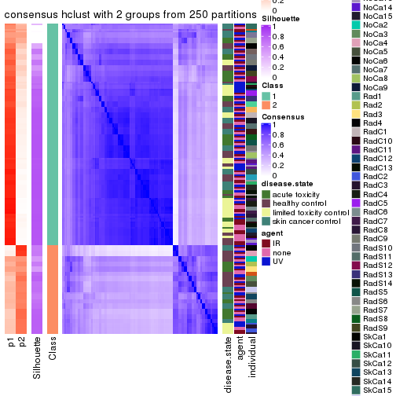</p>

</div>
<div id='tab-SD-hclust-consensus-heatmap-2'>
<pre><code class="r">consensus_heatmap(res, k = 3)
</code></pre>

<p>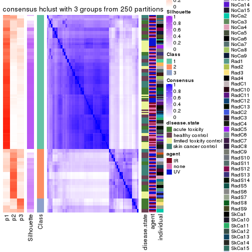</p>

</div>
<div id='tab-SD-hclust-consensus-heatmap-3'>
<pre><code class="r">consensus_heatmap(res, k = 4)
</code></pre>

<p>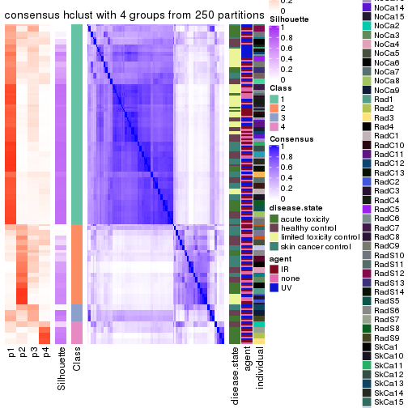</p>

</div>
<div id='tab-SD-hclust-consensus-heatmap-4'>
<pre><code class="r">consensus_heatmap(res, k = 5)
</code></pre>

<p>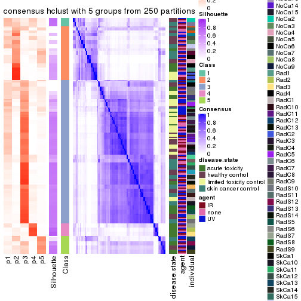</p>

</div>
<div id='tab-SD-hclust-consensus-heatmap-5'>
<pre><code class="r">consensus_heatmap(res, k = 6)
</code></pre>

<p>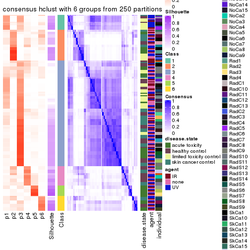</p>

</div>
</div>

Heatmaps for the membership of samples in all partitions to see how consistent they are:


<script>
$( function() {
	$( '#tabs-SD-hclust-membership-heatmap' ).tabs();
} );
</script>
<div id='tabs-SD-hclust-membership-heatmap'>
<ul>
<li><a href='#tab-SD-hclust-membership-heatmap-1'>k = 2</a></li>
<li><a href='#tab-SD-hclust-membership-heatmap-2'>k = 3</a></li>
<li><a href='#tab-SD-hclust-membership-heatmap-3'>k = 4</a></li>
<li><a href='#tab-SD-hclust-membership-heatmap-4'>k = 5</a></li>
<li><a href='#tab-SD-hclust-membership-heatmap-5'>k = 6</a></li>
</ul>
<div id='tab-SD-hclust-membership-heatmap-1'>
<pre><code class="r">membership_heatmap(res, k = 2)
</code></pre>

<p>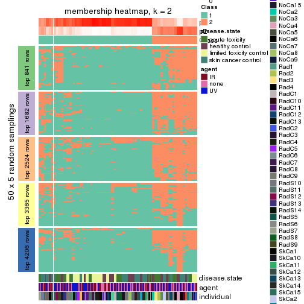</p>

</div>
<div id='tab-SD-hclust-membership-heatmap-2'>
<pre><code class="r">membership_heatmap(res, k = 3)
</code></pre>

<p>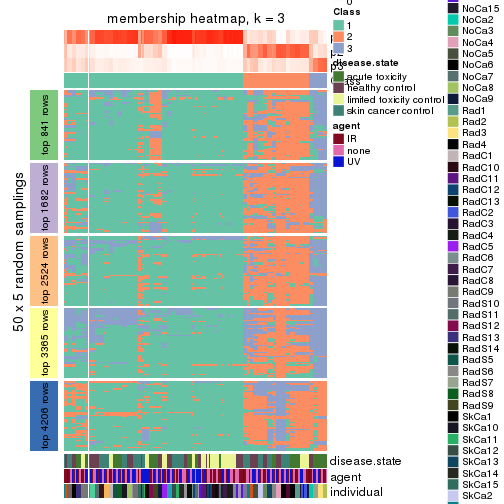</p>

</div>
<div id='tab-SD-hclust-membership-heatmap-3'>
<pre><code class="r">membership_heatmap(res, k = 4)
</code></pre>

<p>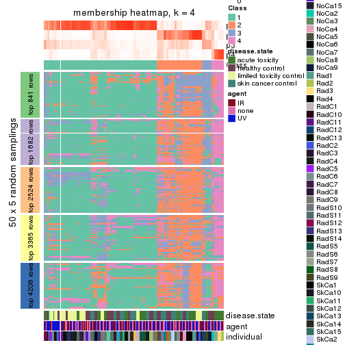</p>

</div>
<div id='tab-SD-hclust-membership-heatmap-4'>
<pre><code class="r">membership_heatmap(res, k = 5)
</code></pre>

<p>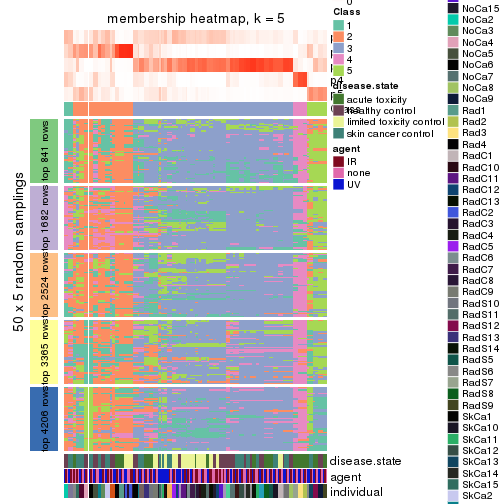</p>

</div>
<div id='tab-SD-hclust-membership-heatmap-5'>
<pre><code class="r">membership_heatmap(res, k = 6)
</code></pre>

<p>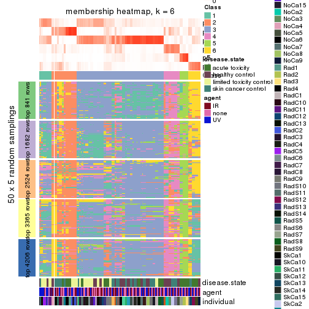</p>

</div>
</div>

As soon as we have had the classes for columns, we can look for signatures
which are significantly different between classes which can be candidate marks
for certain classes. Following are the heatmaps for signatures.


Signature heatmaps where rows are scaled:


<script>
$( function() {
	$( '#tabs-SD-hclust-get-signatures' ).tabs();
} );
</script>
<div id='tabs-SD-hclust-get-signatures'>
<ul>
<li><a href='#tab-SD-hclust-get-signatures-1'>k = 2</a></li>
<li><a href='#tab-SD-hclust-get-signatures-2'>k = 3</a></li>
<li><a href='#tab-SD-hclust-get-signatures-3'>k = 4</a></li>
<li><a href='#tab-SD-hclust-get-signatures-4'>k = 5</a></li>
<li><a href='#tab-SD-hclust-get-signatures-5'>k = 6</a></li>
</ul>
<div id='tab-SD-hclust-get-signatures-1'>
<pre><code class="r">get_signatures(res, k = 2)
</code></pre>

<p>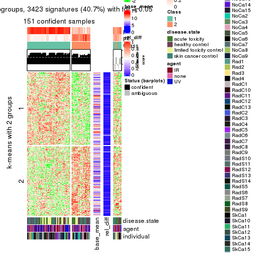</p>

</div>
<div id='tab-SD-hclust-get-signatures-2'>
<pre><code class="r">get_signatures(res, k = 3)
</code></pre>

<p>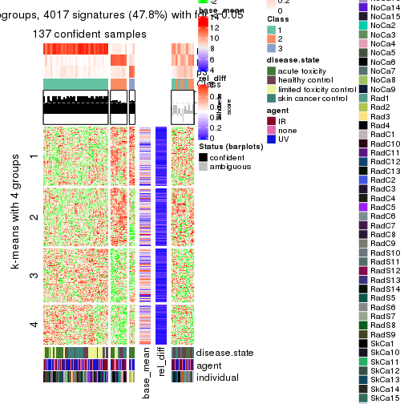</p>

</div>
<div id='tab-SD-hclust-get-signatures-3'>
<pre><code class="r">get_signatures(res, k = 4)
</code></pre>

<p>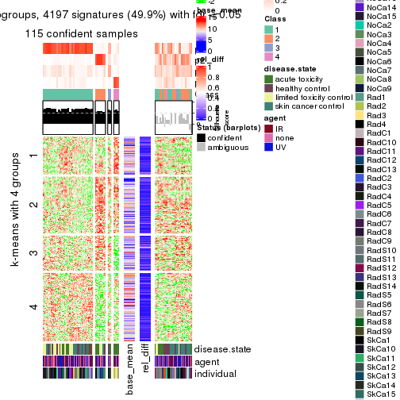</p>

</div>
<div id='tab-SD-hclust-get-signatures-4'>
<pre><code class="r">get_signatures(res, k = 5)
</code></pre>

<p>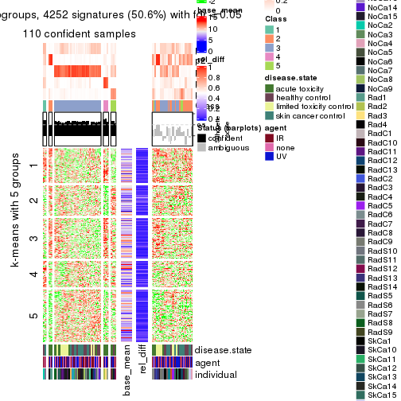</p>

</div>
<div id='tab-SD-hclust-get-signatures-5'>
<pre><code class="r">get_signatures(res, k = 6)
</code></pre>

<p>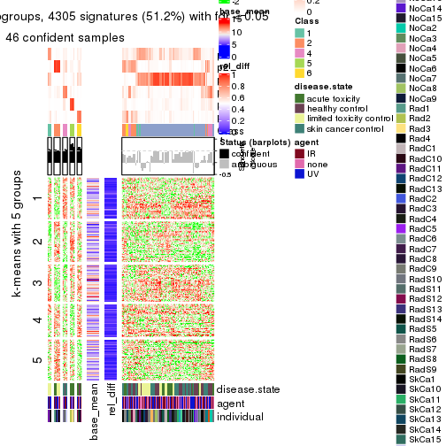</p>

</div>
</div>


Signature heatmaps where rows are not scaled:


<script>
$( function() {
	$( '#tabs-SD-hclust-get-signatures-no-scale' ).tabs();
} );
</script>
<div id='tabs-SD-hclust-get-signatures-no-scale'>
<ul>
<li><a href='#tab-SD-hclust-get-signatures-no-scale-1'>k = 2</a></li>
<li><a href='#tab-SD-hclust-get-signatures-no-scale-2'>k = 3</a></li>
<li><a href='#tab-SD-hclust-get-signatures-no-scale-3'>k = 4</a></li>
<li><a href='#tab-SD-hclust-get-signatures-no-scale-4'>k = 5</a></li>
<li><a href='#tab-SD-hclust-get-signatures-no-scale-5'>k = 6</a></li>
</ul>
<div id='tab-SD-hclust-get-signatures-no-scale-1'>
<pre><code class="r">get_signatures(res, k = 2, scale_rows = FALSE)
</code></pre>

<p>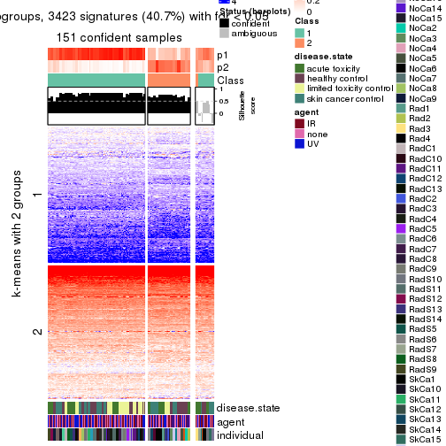</p>

</div>
<div id='tab-SD-hclust-get-signatures-no-scale-2'>
<pre><code class="r">get_signatures(res, k = 3, scale_rows = FALSE)
</code></pre>

<p>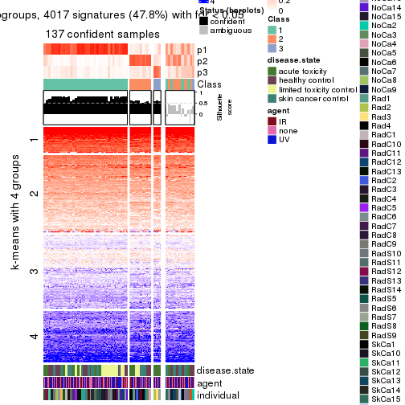</p>

</div>
<div id='tab-SD-hclust-get-signatures-no-scale-3'>
<pre><code class="r">get_signatures(res, k = 4, scale_rows = FALSE)
</code></pre>

<p>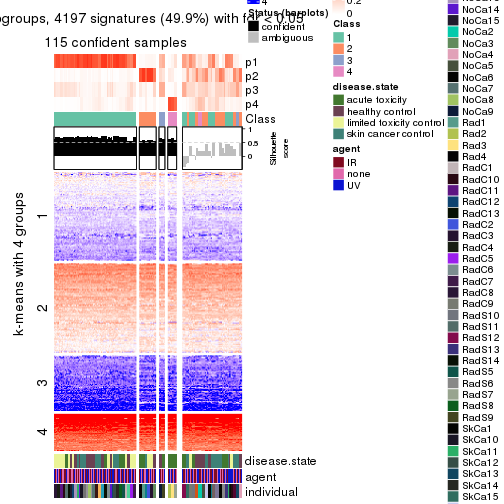</p>

</div>
<div id='tab-SD-hclust-get-signatures-no-scale-4'>
<pre><code class="r">get_signatures(res, k = 5, scale_rows = FALSE)
</code></pre>

<p>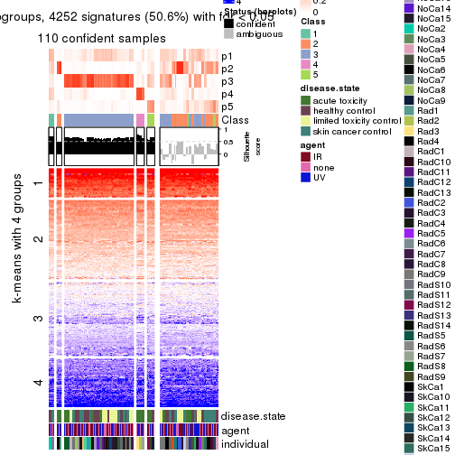</p>

</div>
<div id='tab-SD-hclust-get-signatures-no-scale-5'>
<pre><code class="r">get_signatures(res, k = 6, scale_rows = FALSE)
</code></pre>

<p>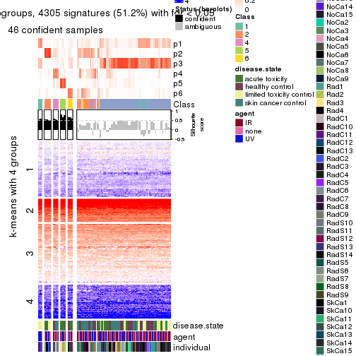</p>

</div>
</div>


Compare the overlap of signatures from different k:

```r
compare_signatures(res)
```

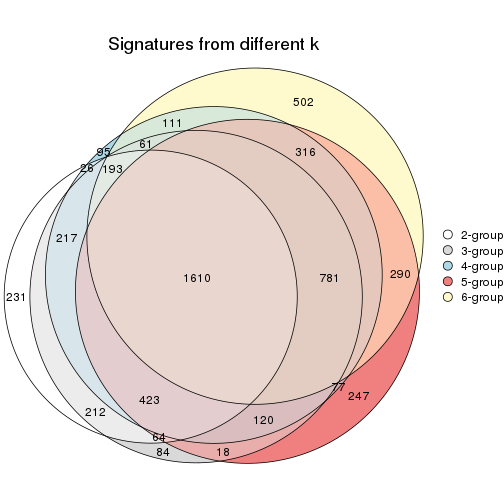

`get_signature()` returns a data frame invisibly. TO get the list of signatures, the function
call should be assigned to a variable explicitly. In following code, if `plot` argument is set
to `FALSE`, no heatmap is plotted while only the differential analysis is performed.

```r
# code only for demonstration
tb = get_signature(res, k = ..., plot = FALSE)
```

An example of the output of `tb` is:

```
#>   which_row         fdr    mean_1    mean_2 scaled_mean_1 scaled_mean_2 km
#> 1        38 0.042760348  8.373488  9.131774    -0.5533452     0.5164555  1
#> 2        40 0.018707592  7.106213  8.469186    -0.6173731     0.5762149  1
#> 3        55 0.019134737 10.221463 11.207825    -0.6159697     0.5749050  1
#> 4        59 0.006059896  5.921854  7.869574    -0.6899429     0.6439467  1
#> 5        60 0.018055526  8.928898 10.211722    -0.6204761     0.5791110  1
#> 6        98 0.009384629 15.714769 14.887706     0.6635654    -0.6193277  2
...
```

The columns in `tb` are:

1. `which_row`: row indices corresponding to the input matrix.
2. `fdr`: FDR for the differential test. 
3. `mean_x`: The mean value in group x.
4. `scaled_mean_x`: The mean value in group x after rows are scaled.
5. `km`: Row groups if k-means clustering is applied to rows.


UMAP plot which shows how samples are separated.


<script>
$( function() {
	$( '#tabs-SD-hclust-dimension-reduction' ).tabs();
} );
</script>
<div id='tabs-SD-hclust-dimension-reduction'>
<ul>
<li><a href='#tab-SD-hclust-dimension-reduction-1'>k = 2</a></li>
<li><a href='#tab-SD-hclust-dimension-reduction-2'>k = 3</a></li>
<li><a href='#tab-SD-hclust-dimension-reduction-3'>k = 4</a></li>
<li><a href='#tab-SD-hclust-dimension-reduction-4'>k = 5</a></li>
<li><a href='#tab-SD-hclust-dimension-reduction-5'>k = 6</a></li>
</ul>
<div id='tab-SD-hclust-dimension-reduction-1'>
<pre><code class="r">dimension_reduction(res, k = 2, method = &quot;UMAP&quot;)
</code></pre>

<p>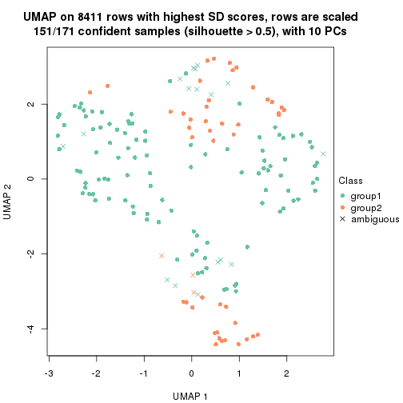</p>

</div>
<div id='tab-SD-hclust-dimension-reduction-2'>
<pre><code class="r">dimension_reduction(res, k = 3, method = &quot;UMAP&quot;)
</code></pre>

<p>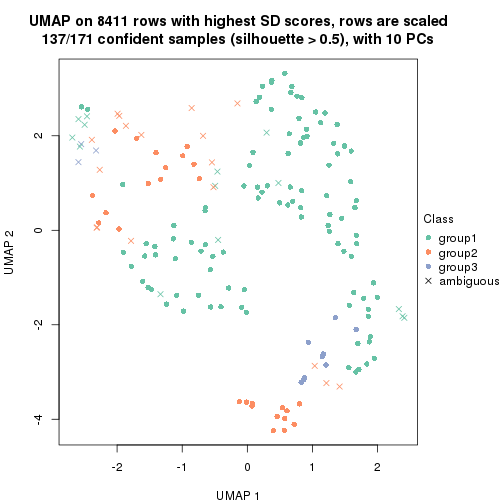</p>

</div>
<div id='tab-SD-hclust-dimension-reduction-3'>
<pre><code class="r">dimension_reduction(res, k = 4, method = &quot;UMAP&quot;)
</code></pre>

<p>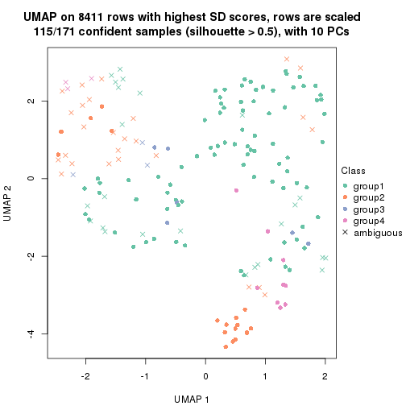</p>

</div>
<div id='tab-SD-hclust-dimension-reduction-4'>
<pre><code class="r">dimension_reduction(res, k = 5, method = &quot;UMAP&quot;)
</code></pre>

<p>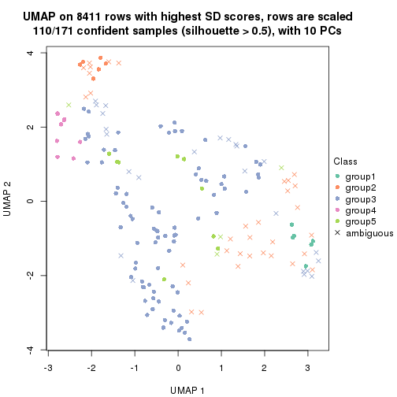</p>

</div>
<div id='tab-SD-hclust-dimension-reduction-5'>
<pre><code class="r">dimension_reduction(res, k = 6, method = &quot;UMAP&quot;)
</code></pre>

<p>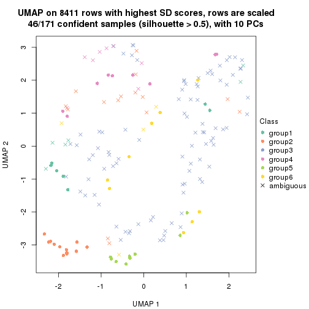</p>

</div>
</div>


Following heatmap shows how subgroups are split when increasing `k`:

```r
collect_classes(res)
```

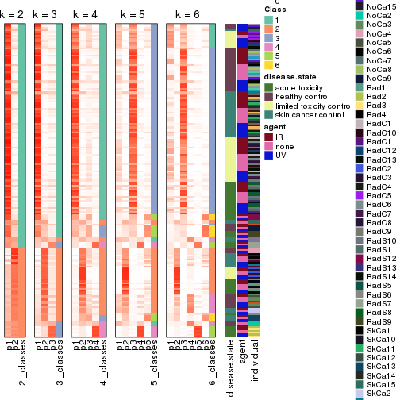


Test correlation between subgroups and known annotations. If the known
annotation is numeric, one-way ANOVA test is applied, and if the known
annotation is discrete, chi-squared contingency table test is applied.

```r
test_to_known_factors(res)
```

```
#>             n disease.state(p) agent(p) individual(p) k
#> SD:hclust 151         1.26e-01    0.941      4.48e-12 2
#> SD:hclust 137         8.74e-05    1.000      1.81e-20 3
#> SD:hclust 115         1.21e-05    1.000      2.43e-24 4
#> SD:hclust 110         2.95e-08    1.000      9.45e-31 5
#> SD:hclust  46         2.66e-10    0.890      1.26e-12 6
```


If matrix rows can be associated to genes, consider to use `functional_enrichment(res,
...)` to perform function enrichment for the signature genes. See [this vignette](http://bioconductor.org/packages/devel/bioc/vignettes/cola/inst/doc/functional_enrichment.html) for more detailed explanations.


 

---------------------------------------------------


### SD:kmeans


The object with results only for a single top-value method and a single partition method 
can be extracted as:

```r
res = res_list["SD", "kmeans"]
# you can also extract it by
# res = res_list["SD:kmeans"]
```

A summary of `res` and all the functions that can be applied to it:

```r
res
```

```
#> A 'ConsensusPartition' object with k = 2, 3, 4, 5, 6.
#>   On a matrix with 8411 rows and 171 columns.
#>   Top rows (841, 1682, 2524, 3365, 4206) are extracted by 'SD' method.
#>   Subgroups are detected by 'kmeans' method.
#>   Performed in total 1250 partitions by row resampling.
#>   Best k for subgroups seems to be 2.
#> 
#> Following methods can be applied to this 'ConsensusPartition' object:
#>  [1] "cola_report"             "collect_classes"         "collect_plots"          
#>  [4] "collect_stats"           "colnames"                "compare_signatures"     
#>  [7] "consensus_heatmap"       "dimension_reduction"     "functional_enrichment"  
#> [10] "get_anno_col"            "get_anno"                "get_classes"            
#> [13] "get_consensus"           "get_matrix"              "get_membership"         
#> [16] "get_param"               "get_signatures"          "get_stats"              
#> [19] "is_best_k"               "is_stable_k"             "membership_heatmap"     
#> [22] "ncol"                    "nrow"                    "plot_ecdf"              
#> [25] "rownames"                "select_partition_number" "show"                   
#> [28] "suggest_best_k"          "test_to_known_factors"
```

`collect_plots()` function collects all the plots made from `res` for all `k` (number of partitions)
into one single page to provide an easy and fast comparison between different `k`.

```r
collect_plots(res)
```

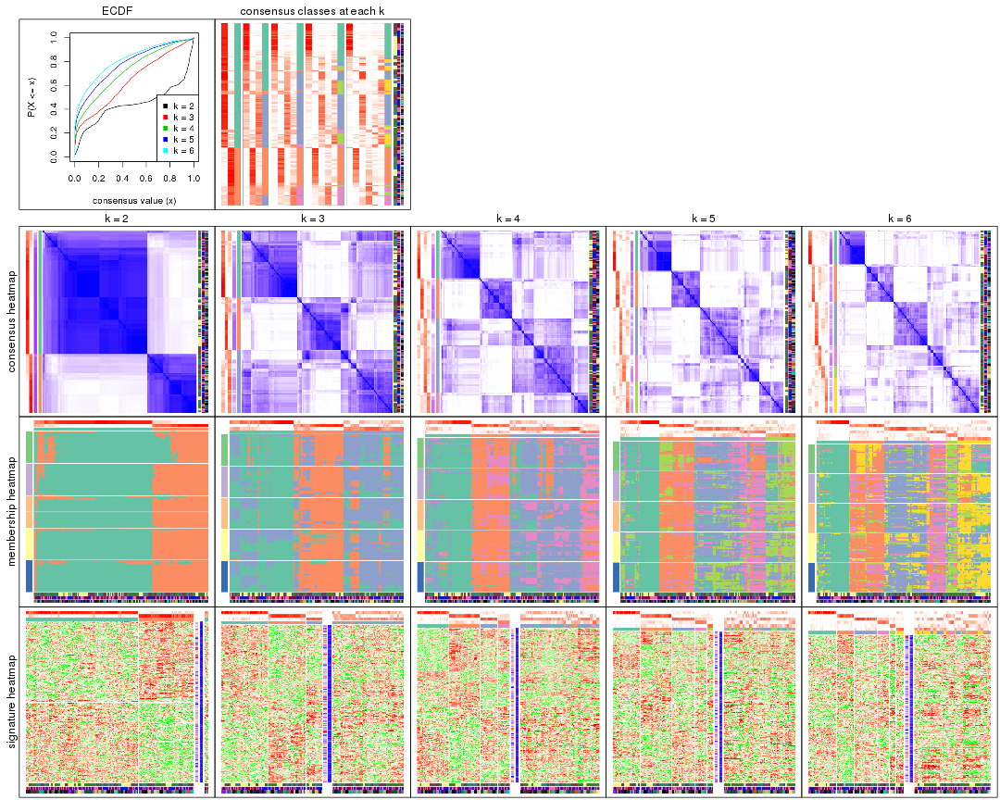

The plots are:

- The first row: a plot of the ECDF (empirical cumulative distribution
  function) curves of the consensus matrix for each `k` and the heatmap of
  predicted classes for each `k`.
- The second row: heatmaps of the consensus matrix for each `k`.
- The third row: heatmaps of the membership matrix for each `k`.
- The fouth row: heatmaps of the signatures for each `k`.

All the plots in panels can be made by individual functions and they are
plotted later in this section.

`select_partition_number()` produces several plots showing different
statistics for choosing "optimized" `k`. There are following statistics:

- ECDF curves of the consensus matrix for each `k`;
- 1-PAC. [The PAC
  score](https://en.wikipedia.org/wiki/Consensus_clustering#Over-interpretation_potential_of_consensus_clustering)
  measures the proportion of the ambiguous subgrouping.
- Mean silhouette score.
- Concordance. The mean probability of fiting the consensus class ids in all
  partitions.
- Area increased. Denote $A_k$ as the area under the ECDF curve for current
  `k`, the area increased is defined as $A_k - A_{k-1}$.
- Rand index. The percent of pairs of samples that are both in a same cluster
  or both are not in a same cluster in the partition of k and k-1.
- Jaccard index. The ratio of pairs of samples are both in a same cluster in
  the partition of k and k-1 and the pairs of samples are both in a same
  cluster in the partition k or k-1.

The detailed explanations of these statistics can be found in [the _cola_
vignette](http://bioconductor.org/packages/devel/bioc/vignettes/cola/inst/doc/cola.html#toc_13).

Generally speaking, lower PAC score, higher mean silhouette score or higher
concordance corresponds to better partition. Rand index and Jaccard index
measure how similar the current partition is compared to partition with `k-1`.
If they are too similar, we won't accept `k` is better than `k-1`.

```r
select_partition_number(res)
```

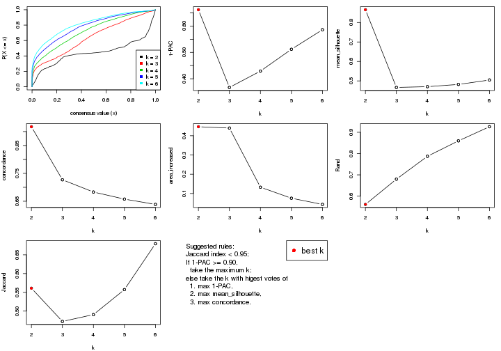

The numeric values for all these statistics can be obtained by `get_stats()`.

```r
get_stats(res)
```

```
#>   k 1-PAC mean_silhouette concordance area_increased  Rand Jaccard
#> 2 2 0.662           0.866       0.917         0.4466 0.561   0.561
#> 3 3 0.367           0.467       0.727         0.4397 0.680   0.473
#> 4 4 0.429           0.470       0.683         0.1326 0.787   0.491
#> 5 5 0.512           0.482       0.658         0.0754 0.860   0.557
#> 6 6 0.586           0.505       0.639         0.0433 0.926   0.680
```

`suggest_best_k()` suggests the best $k$ based on these statistics. The rules are as follows:

- All $k$ with Jaccard index larger than 0.95 are removed because increasing
  $k$ does not provide enough extra information. If all $k$ are removed, it is
  marked as no subgroup is detected.
- For all $k$ with 1-PAC score larger than 0.9, the maximal $k$ is taken as
  the best $k$, and other $k$ are marked as optional $k$.
- If it does not fit the second rule. The $k$ with the maximal vote of the
  highest 1-PAC score, highest mean silhouette, and highest concordance is
  taken as the best $k$.

```r
suggest_best_k(res)
```

```
#> [1] 2
```


Following shows the table of the partitions (You need to click the **show/hide
code output** link to see it). The membership matrix (columns with name `p*`)
is inferred by
[`clue::cl_consensus()`](https://www.rdocumentation.org/link/cl_consensus?package=clue)
function with the `SE` method. Basically the value in the membership matrix
represents the probability to belong to a certain group. The finall class
label for an item is determined with the group with highest probability it
belongs to.

In `get_classes()` function, the entropy is calculated from the membership
matrix and the silhouette score is calculated from the consensus matrix.


<script>
$( function() {
	$( '#tabs-SD-kmeans-get-classes' ).tabs();
} );
</script>
<div id='tabs-SD-kmeans-get-classes'>
<ul>
<li><a href='#tab-SD-kmeans-get-classes-1'>k = 2</a></li>
<li><a href='#tab-SD-kmeans-get-classes-2'>k = 3</a></li>
<li><a href='#tab-SD-kmeans-get-classes-3'>k = 4</a></li>
<li><a href='#tab-SD-kmeans-get-classes-4'>k = 5</a></li>
<li><a href='#tab-SD-kmeans-get-classes-5'>k = 6</a></li>
</ul>

<div id='tab-SD-kmeans-get-classes-1'>
<p><a id='tab-SD-kmeans-get-classes-1-a' style='color:#0366d6' href='#'>show/hide code output</a></p>
<pre><code class="r">cbind(get_classes(res, k = 2), get_membership(res, k = 2))
</code></pre>

<pre><code>#&gt;          class entropy silhouette    p1    p2
#&gt; GSM29783     2  0.7139     0.8311 0.196 0.804
#&gt; GSM29786     2  0.7602     0.8112 0.220 0.780
#&gt; GSM29789     2  0.2236     0.8930 0.036 0.964
#&gt; GSM29792     2  0.2236     0.8930 0.036 0.964
#&gt; GSM29795     2  0.8386     0.7607 0.268 0.732
#&gt; GSM29798     2  0.8016     0.7931 0.244 0.756
#&gt; GSM29801     1  0.0938     0.9216 0.988 0.012
#&gt; GSM29804     1  0.2236     0.9206 0.964 0.036
#&gt; GSM29807     1  0.9393     0.5748 0.644 0.356
#&gt; GSM29816     1  0.1184     0.9241 0.984 0.016
#&gt; GSM29821     1  0.0938     0.9216 0.988 0.012
#&gt; GSM29824     1  0.0000     0.9239 1.000 0.000
#&gt; GSM29827     1  0.2236     0.9204 0.964 0.036
#&gt; GSM29830     1  0.2043     0.9213 0.968 0.032
#&gt; GSM29833     1  0.2236     0.9204 0.964 0.036
#&gt; GSM29784     2  0.3733     0.8929 0.072 0.928
#&gt; GSM29787     2  0.7674     0.8116 0.224 0.776
#&gt; GSM29790     2  0.1633     0.8962 0.024 0.976
#&gt; GSM29793     2  0.2236     0.8930 0.036 0.964
#&gt; GSM29796     2  0.7453     0.8232 0.212 0.788
#&gt; GSM29799     2  0.7950     0.7931 0.240 0.760
#&gt; GSM29802     1  0.1633     0.9230 0.976 0.024
#&gt; GSM29805     1  0.1633     0.9230 0.976 0.024
#&gt; GSM29814     1  0.9393     0.5748 0.644 0.356
#&gt; GSM29817     1  0.0672     0.9226 0.992 0.008
#&gt; GSM29822     1  0.0000     0.9239 1.000 0.000
#&gt; GSM29825     1  0.0000     0.9239 1.000 0.000
#&gt; GSM29828     1  0.2236     0.9204 0.964 0.036
#&gt; GSM29831     1  0.1633     0.9230 0.976 0.024
#&gt; GSM29834     1  0.2236     0.9204 0.964 0.036
#&gt; GSM29785     2  0.1633     0.8993 0.024 0.976
#&gt; GSM29788     2  0.7453     0.8170 0.212 0.788
#&gt; GSM29791     2  0.2236     0.8930 0.036 0.964
#&gt; GSM29794     2  0.2043     0.8939 0.032 0.968
#&gt; GSM29797     2  0.5059     0.8812 0.112 0.888
#&gt; GSM29800     2  0.7528     0.8153 0.216 0.784
#&gt; GSM29803     1  0.2236     0.9206 0.964 0.036
#&gt; GSM29806     1  0.2236     0.9206 0.964 0.036
#&gt; GSM29815     1  0.9909     0.3669 0.556 0.444
#&gt; GSM29819     1  0.2236     0.9206 0.964 0.036
#&gt; GSM29823     1  0.0938     0.9216 0.988 0.012
#&gt; GSM29826     1  0.1843     0.9227 0.972 0.028
#&gt; GSM29829     1  0.2236     0.9204 0.964 0.036
#&gt; GSM29832     1  0.2236     0.9204 0.964 0.036
#&gt; GSM29835     1  0.2236     0.9204 0.964 0.036
#&gt; GSM29836     2  0.1184     0.8955 0.016 0.984
#&gt; GSM29839     2  0.7376     0.8241 0.208 0.792
#&gt; GSM29842     2  0.1184     0.8970 0.016 0.984
#&gt; GSM29845     2  0.7528     0.8187 0.216 0.784
#&gt; GSM29848     2  0.8081     0.8052 0.248 0.752
#&gt; GSM29851     1  0.0000     0.9239 1.000 0.000
#&gt; GSM29854     1  0.2236     0.9206 0.964 0.036
#&gt; GSM29857     1  0.2236     0.9206 0.964 0.036
#&gt; GSM29860     2  0.2043     0.8939 0.032 0.968
#&gt; GSM29863     1  0.0376     0.9244 0.996 0.004
#&gt; GSM29866     1  0.1843     0.9225 0.972 0.028
#&gt; GSM29869     1  0.2423     0.9194 0.960 0.040
#&gt; GSM29872     1  0.7674     0.7454 0.776 0.224
#&gt; GSM29875     1  0.0000     0.9239 1.000 0.000
#&gt; GSM29878     1  0.9393     0.5141 0.644 0.356
#&gt; GSM29837     2  0.0938     0.8962 0.012 0.988
#&gt; GSM29840     2  0.6048     0.8645 0.148 0.852
#&gt; GSM29843     2  0.1843     0.8955 0.028 0.972
#&gt; GSM29846     2  0.7299     0.8288 0.204 0.796
#&gt; GSM29849     2  0.8081     0.8052 0.248 0.752
#&gt; GSM29852     1  0.0000     0.9239 1.000 0.000
#&gt; GSM29855     1  0.2236     0.9206 0.964 0.036
#&gt; GSM29858     1  0.2236     0.9206 0.964 0.036
#&gt; GSM29861     2  0.2043     0.8939 0.032 0.968
#&gt; GSM29864     1  0.0672     0.9246 0.992 0.008
#&gt; GSM29867     1  0.0000     0.9239 1.000 0.000
#&gt; GSM29870     1  0.0672     0.9226 0.992 0.008
#&gt; GSM29873     1  0.7674     0.7467 0.776 0.224
#&gt; GSM29876     1  0.0938     0.9244 0.988 0.012
#&gt; GSM29879     1  0.6048     0.8356 0.852 0.148
#&gt; GSM29838     2  0.0672     0.8963 0.008 0.992
#&gt; GSM29841     2  0.3584     0.8931 0.068 0.932
#&gt; GSM29844     2  0.2236     0.8930 0.036 0.964
#&gt; GSM29847     2  0.7139     0.8331 0.196 0.804
#&gt; GSM29850     2  0.7950     0.8093 0.240 0.760
#&gt; GSM29853     1  0.0376     0.9235 0.996 0.004
#&gt; GSM29856     1  0.2423     0.9212 0.960 0.040
#&gt; GSM29859     1  0.4298     0.8957 0.912 0.088
#&gt; GSM29862     2  0.2043     0.8939 0.032 0.968
#&gt; GSM29865     1  0.2236     0.9206 0.964 0.036
#&gt; GSM29868     1  0.2236     0.9223 0.964 0.036
#&gt; GSM29871     1  0.5408     0.8710 0.876 0.124
#&gt; GSM29874     1  0.9286     0.5629 0.656 0.344
#&gt; GSM29877     1  0.0000     0.9239 1.000 0.000
#&gt; GSM29880     2  0.2043     0.8939 0.032 0.968
#&gt; GSM29881     1  0.2236     0.9206 0.964 0.036
#&gt; GSM29884     2  0.0938     0.8962 0.012 0.988
#&gt; GSM29887     2  0.0000     0.8964 0.000 1.000
#&gt; GSM29890     1  0.1184     0.9235 0.984 0.016
#&gt; GSM29893     1  0.2043     0.9213 0.968 0.032
#&gt; GSM29896     1  0.0672     0.9226 0.992 0.008
#&gt; GSM29899     1  0.0000     0.9239 1.000 0.000
#&gt; GSM29902     1  0.3274     0.9200 0.940 0.060
#&gt; GSM29905     1  0.2778     0.9235 0.952 0.048
#&gt; GSM29908     1  0.2236     0.9204 0.964 0.036
#&gt; GSM29955     1  0.2236     0.9204 0.964 0.036
#&gt; GSM29958     1  0.2236     0.9204 0.964 0.036
#&gt; GSM29961     1  0.2236     0.9204 0.964 0.036
#&gt; GSM29882     1  0.1184     0.9241 0.984 0.016
#&gt; GSM29885     2  0.0938     0.8962 0.012 0.988
#&gt; GSM29888     2  0.0938     0.8962 0.012 0.988
#&gt; GSM29891     1  0.1414     0.9237 0.980 0.020
#&gt; GSM29894     1  0.1184     0.9221 0.984 0.016
#&gt; GSM29897     1  0.0938     0.9216 0.988 0.012
#&gt; GSM29900     1  0.1184     0.9241 0.984 0.016
#&gt; GSM29903     1  0.2603     0.9249 0.956 0.044
#&gt; GSM29906     1  0.2778     0.9235 0.952 0.048
#&gt; GSM29909     1  0.2603     0.9243 0.956 0.044
#&gt; GSM29956     1  0.2236     0.9204 0.964 0.036
#&gt; GSM29959     1  0.2236     0.9204 0.964 0.036
#&gt; GSM29962     1  0.2236     0.9204 0.964 0.036
#&gt; GSM29883     1  0.2236     0.9206 0.964 0.036
#&gt; GSM29886     2  0.0000     0.8964 0.000 1.000
#&gt; GSM29889     2  0.0000     0.8964 0.000 1.000
#&gt; GSM29892     1  0.2423     0.9242 0.960 0.040
#&gt; GSM29895     1  0.2236     0.9204 0.964 0.036
#&gt; GSM29898     1  0.2236     0.9206 0.964 0.036
#&gt; GSM29901     1  0.2236     0.9206 0.964 0.036
#&gt; GSM29904     1  0.2778     0.9240 0.952 0.048
#&gt; GSM29907     1  0.3114     0.9209 0.944 0.056
#&gt; GSM29910     1  0.2423     0.9209 0.960 0.040
#&gt; GSM29957     1  0.3733     0.9086 0.928 0.072
#&gt; GSM29960     1  0.2236     0.9204 0.964 0.036
#&gt; GSM29963     1  0.3274     0.9230 0.940 0.060
#&gt; GSM29964     2  0.0938     0.8962 0.012 0.988
#&gt; GSM29967     2  0.4690     0.8829 0.100 0.900
#&gt; GSM29970     1  0.2236     0.9206 0.964 0.036
#&gt; GSM29973     2  0.0938     0.8962 0.012 0.988
#&gt; GSM29976     1  0.2236     0.9206 0.964 0.036
#&gt; GSM29979     1  0.9552     0.5359 0.624 0.376
#&gt; GSM29982     1  0.8813     0.4978 0.700 0.300
#&gt; GSM29985     1  0.2236     0.9206 0.964 0.036
#&gt; GSM29988     1  0.8016     0.7456 0.756 0.244
#&gt; GSM29991     1  0.9988    -0.0868 0.520 0.480
#&gt; GSM29994     1  0.3274     0.9200 0.940 0.060
#&gt; GSM29997     1  0.3733     0.9032 0.928 0.072
#&gt; GSM30000     1  0.3879     0.9138 0.924 0.076
#&gt; GSM30003     1  0.2043     0.9210 0.968 0.032
#&gt; GSM29965     2  0.0938     0.8962 0.012 0.988
#&gt; GSM29968     2  0.4562     0.8841 0.096 0.904
#&gt; GSM29971     1  0.2236     0.9206 0.964 0.036
#&gt; GSM29974     2  0.0938     0.8962 0.012 0.988
#&gt; GSM29977     1  0.2236     0.9206 0.964 0.036
#&gt; GSM29980     1  0.8763     0.6768 0.704 0.296
#&gt; GSM29983     1  0.0938     0.9228 0.988 0.012
#&gt; GSM29986     1  0.2236     0.9206 0.964 0.036
#&gt; GSM29989     1  0.7950     0.7506 0.760 0.240
#&gt; GSM29992     1  0.9909     0.0598 0.556 0.444
#&gt; GSM29995     1  0.2236     0.9204 0.964 0.036
#&gt; GSM29998     1  0.5519     0.8671 0.872 0.128
#&gt; GSM30001     1  0.3114     0.9186 0.944 0.056
#&gt; GSM30004     1  0.1414     0.9237 0.980 0.020
#&gt; GSM29966     2  0.0376     0.8964 0.004 0.996
#&gt; GSM29969     2  0.4562     0.8841 0.096 0.904
#&gt; GSM29972     1  0.2236     0.9206 0.964 0.036
#&gt; GSM29975     2  0.0938     0.8962 0.012 0.988
#&gt; GSM29978     1  0.2236     0.9206 0.964 0.036
#&gt; GSM29981     2  0.1414     0.8959 0.020 0.980
#&gt; GSM29984     2  0.8861     0.6900 0.304 0.696
#&gt; GSM29987     1  0.2236     0.9206 0.964 0.036
#&gt; GSM29990     1  0.8016     0.7456 0.756 0.244
#&gt; GSM29993     2  0.9087     0.6551 0.324 0.676
#&gt; GSM29996     1  0.2236     0.9238 0.964 0.036
#&gt; GSM29999     1  0.7815     0.7607 0.768 0.232
#&gt; GSM30002     1  0.5059     0.8863 0.888 0.112
#&gt; GSM30005     1  0.2236     0.9206 0.964 0.036
</code></pre>

<script>
$('#tab-SD-kmeans-get-classes-1-a').parent().next().next().hide();
$('#tab-SD-kmeans-get-classes-1-a').click(function(){
  $('#tab-SD-kmeans-get-classes-1-a').parent().next().next().toggle();
  return(false);
});
</script>
</div>

<div id='tab-SD-kmeans-get-classes-2'>
<p><a id='tab-SD-kmeans-get-classes-2-a' style='color:#0366d6' href='#'>show/hide code output</a></p>
<pre><code class="r">cbind(get_classes(res, k = 3), get_membership(res, k = 3))
</code></pre>

<pre><code>#&gt;          class entropy silhouette    p1    p2    p3
#&gt; GSM29783     2  0.7842    0.46539 0.072 0.600 0.328
#&gt; GSM29786     3  0.6521   -0.31226 0.004 0.496 0.500
#&gt; GSM29789     2  0.2187    0.77388 0.028 0.948 0.024
#&gt; GSM29792     2  0.2569    0.77026 0.032 0.936 0.032
#&gt; GSM29795     2  0.9862    0.26790 0.316 0.412 0.272
#&gt; GSM29798     3  0.6521   -0.30581 0.004 0.492 0.504
#&gt; GSM29801     1  0.6180   -0.03892 0.584 0.000 0.416
#&gt; GSM29804     3  0.6500    0.22180 0.464 0.004 0.532
#&gt; GSM29807     2  0.9070   -0.12682 0.136 0.436 0.428
#&gt; GSM29816     3  0.6274    0.29789 0.456 0.000 0.544
#&gt; GSM29821     1  0.6126   -0.00301 0.600 0.000 0.400
#&gt; GSM29824     1  0.2959    0.68960 0.900 0.000 0.100
#&gt; GSM29827     1  0.0000    0.71229 1.000 0.000 0.000
#&gt; GSM29830     1  0.0237    0.71177 0.996 0.000 0.004
#&gt; GSM29833     1  0.0424    0.70998 0.992 0.000 0.008
#&gt; GSM29784     2  0.4931    0.69098 0.004 0.784 0.212
#&gt; GSM29787     2  0.6521    0.28860 0.004 0.500 0.496
#&gt; GSM29790     2  0.1289    0.77892 0.000 0.968 0.032
#&gt; GSM29793     2  0.1711    0.77828 0.008 0.960 0.032
#&gt; GSM29796     2  0.6999    0.62898 0.052 0.680 0.268
#&gt; GSM29799     3  0.6442   -0.16423 0.004 0.432 0.564
#&gt; GSM29802     3  0.5835    0.46081 0.340 0.000 0.660
#&gt; GSM29805     3  0.6286    0.26854 0.464 0.000 0.536
#&gt; GSM29814     3  0.9266    0.13827 0.156 0.420 0.424
#&gt; GSM29817     1  0.6309   -0.21547 0.500 0.000 0.500
#&gt; GSM29822     1  0.6309   -0.19506 0.504 0.000 0.496
#&gt; GSM29825     1  0.5529    0.34788 0.704 0.000 0.296
#&gt; GSM29828     1  0.0000    0.71229 1.000 0.000 0.000
#&gt; GSM29831     1  0.0000    0.71229 1.000 0.000 0.000
#&gt; GSM29834     1  0.0592    0.71002 0.988 0.000 0.012
#&gt; GSM29785     2  0.3686    0.74562 0.000 0.860 0.140
#&gt; GSM29788     2  0.6518    0.30802 0.004 0.512 0.484
#&gt; GSM29791     2  0.2569    0.77119 0.032 0.936 0.032
#&gt; GSM29794     2  0.2689    0.76994 0.032 0.932 0.036
#&gt; GSM29797     2  0.6402    0.67816 0.040 0.724 0.236
#&gt; GSM29800     2  0.6521    0.29028 0.004 0.500 0.496
#&gt; GSM29803     3  0.4834    0.54169 0.204 0.004 0.792
#&gt; GSM29806     3  0.6387    0.46966 0.300 0.020 0.680
#&gt; GSM29815     2  0.8141    0.00212 0.068 0.472 0.460
#&gt; GSM29819     3  0.5480    0.51125 0.264 0.004 0.732
#&gt; GSM29823     3  0.6825    0.15685 0.488 0.012 0.500
#&gt; GSM29826     3  0.6148    0.42043 0.356 0.004 0.640
#&gt; GSM29829     1  0.1964    0.70065 0.944 0.000 0.056
#&gt; GSM29832     1  0.1989    0.69241 0.948 0.004 0.048
#&gt; GSM29835     1  0.3234    0.66819 0.908 0.020 0.072
#&gt; GSM29836     2  0.2496    0.77091 0.004 0.928 0.068
#&gt; GSM29839     2  0.6398    0.69101 0.060 0.748 0.192
#&gt; GSM29842     2  0.2448    0.76982 0.000 0.924 0.076
#&gt; GSM29845     3  0.6460   -0.17641 0.004 0.440 0.556
#&gt; GSM29848     2  0.6521    0.28691 0.004 0.500 0.496
#&gt; GSM29851     1  0.6291   -0.14469 0.532 0.000 0.468
#&gt; GSM29854     3  0.5815    0.50015 0.304 0.004 0.692
#&gt; GSM29857     3  0.6434    0.38080 0.380 0.008 0.612
#&gt; GSM29860     2  0.3530    0.76057 0.032 0.900 0.068
#&gt; GSM29863     3  0.6204    0.34293 0.424 0.000 0.576
#&gt; GSM29866     1  0.0237    0.71177 0.996 0.000 0.004
#&gt; GSM29869     1  0.2772    0.69169 0.916 0.004 0.080
#&gt; GSM29872     1  0.9510    0.20265 0.492 0.244 0.264
#&gt; GSM29875     1  0.6286   -0.12663 0.536 0.000 0.464
#&gt; GSM29878     1  0.7824    0.19248 0.564 0.376 0.060
#&gt; GSM29837     2  0.2448    0.76966 0.000 0.924 0.076
#&gt; GSM29840     2  0.5905    0.70772 0.044 0.772 0.184
#&gt; GSM29843     2  0.2448    0.77012 0.000 0.924 0.076
#&gt; GSM29846     3  0.6451   -0.17386 0.004 0.436 0.560
#&gt; GSM29849     3  0.6520   -0.28760 0.004 0.488 0.508
#&gt; GSM29852     1  0.6309   -0.19707 0.504 0.000 0.496
#&gt; GSM29855     3  0.5016    0.53369 0.240 0.000 0.760
#&gt; GSM29858     3  0.6095    0.36915 0.392 0.000 0.608
#&gt; GSM29861     2  0.3499    0.76146 0.028 0.900 0.072
#&gt; GSM29864     3  0.6225    0.32207 0.432 0.000 0.568
#&gt; GSM29867     1  0.3412    0.65649 0.876 0.000 0.124
#&gt; GSM29870     1  0.4121    0.61516 0.832 0.000 0.168
#&gt; GSM29873     1  0.9811    0.06505 0.404 0.244 0.352
#&gt; GSM29876     3  0.6302    0.22638 0.480 0.000 0.520
#&gt; GSM29879     1  0.7047    0.46493 0.712 0.204 0.084
#&gt; GSM29838     2  0.2448    0.77097 0.000 0.924 0.076
#&gt; GSM29841     2  0.5355    0.72811 0.032 0.800 0.168
#&gt; GSM29844     2  0.2486    0.77637 0.008 0.932 0.060
#&gt; GSM29847     3  0.6521   -0.30805 0.004 0.496 0.500
#&gt; GSM29850     3  0.6521   -0.32173 0.004 0.496 0.500
#&gt; GSM29853     3  0.5926    0.41643 0.356 0.000 0.644
#&gt; GSM29856     3  0.5020    0.53763 0.192 0.012 0.796
#&gt; GSM29859     3  0.7496    0.47060 0.240 0.088 0.672
#&gt; GSM29862     2  0.4137    0.74880 0.032 0.872 0.096
#&gt; GSM29865     3  0.4733    0.54459 0.196 0.004 0.800
#&gt; GSM29868     1  0.4473    0.64486 0.828 0.008 0.164
#&gt; GSM29871     3  0.8955    0.26387 0.332 0.144 0.524
#&gt; GSM29874     2  0.9588    0.23093 0.284 0.476 0.240
#&gt; GSM29877     1  0.6308   -0.18780 0.508 0.000 0.492
#&gt; GSM29880     2  0.4489    0.73662 0.036 0.856 0.108
#&gt; GSM29881     3  0.5247    0.54084 0.224 0.008 0.768
#&gt; GSM29884     2  0.1964    0.77579 0.000 0.944 0.056
#&gt; GSM29887     2  0.1529    0.77771 0.000 0.960 0.040
#&gt; GSM29890     1  0.1964    0.70101 0.944 0.000 0.056
#&gt; GSM29893     1  0.0237    0.71177 0.996 0.000 0.004
#&gt; GSM29896     1  0.0237    0.71177 0.996 0.000 0.004
#&gt; GSM29899     1  0.1411    0.70680 0.964 0.000 0.036
#&gt; GSM29902     1  0.5659    0.54925 0.740 0.012 0.248
#&gt; GSM29905     1  0.5420    0.55964 0.752 0.008 0.240
#&gt; GSM29908     1  0.0000    0.71229 1.000 0.000 0.000
#&gt; GSM29955     1  0.0661    0.71070 0.988 0.004 0.008
#&gt; GSM29958     1  0.0237    0.71177 0.996 0.000 0.004
#&gt; GSM29961     1  0.0000    0.71229 1.000 0.000 0.000
#&gt; GSM29882     3  0.5363    0.51372 0.276 0.000 0.724
#&gt; GSM29885     2  0.2165    0.77436 0.000 0.936 0.064
#&gt; GSM29888     2  0.1529    0.77774 0.000 0.960 0.040
#&gt; GSM29891     1  0.5138    0.54869 0.748 0.000 0.252
#&gt; GSM29894     1  0.0592    0.70984 0.988 0.000 0.012
#&gt; GSM29897     1  0.0237    0.71177 0.996 0.000 0.004
#&gt; GSM29900     1  0.5926    0.22671 0.644 0.000 0.356
#&gt; GSM29903     1  0.4912    0.60768 0.796 0.008 0.196
#&gt; GSM29906     1  0.5420    0.56326 0.752 0.008 0.240
#&gt; GSM29909     1  0.3295    0.68458 0.896 0.008 0.096
#&gt; GSM29956     1  0.0000    0.71229 1.000 0.000 0.000
#&gt; GSM29959     1  0.0237    0.71177 0.996 0.000 0.004
#&gt; GSM29962     1  0.0000    0.71229 1.000 0.000 0.000
#&gt; GSM29883     3  0.5012    0.54311 0.204 0.008 0.788
#&gt; GSM29886     2  0.1860    0.77793 0.000 0.948 0.052
#&gt; GSM29889     2  0.0892    0.77887 0.000 0.980 0.020
#&gt; GSM29892     1  0.5692    0.54537 0.724 0.008 0.268
#&gt; GSM29895     1  0.4345    0.62762 0.848 0.016 0.136
#&gt; GSM29898     1  0.5690    0.51833 0.708 0.004 0.288
#&gt; GSM29901     3  0.6345    0.35109 0.400 0.004 0.596
#&gt; GSM29904     1  0.5728    0.54543 0.720 0.008 0.272
#&gt; GSM29907     1  0.5928    0.51005 0.696 0.008 0.296
#&gt; GSM29910     1  0.3832    0.66740 0.880 0.020 0.100
#&gt; GSM29957     1  0.5826    0.59629 0.764 0.032 0.204
#&gt; GSM29960     1  0.2703    0.67737 0.928 0.016 0.056
#&gt; GSM29963     1  0.5406    0.59007 0.764 0.012 0.224
#&gt; GSM29964     2  0.2165    0.77184 0.000 0.936 0.064
#&gt; GSM29967     2  0.6398    0.48519 0.004 0.580 0.416
#&gt; GSM29970     3  0.5072    0.54158 0.196 0.012 0.792
#&gt; GSM29973     2  0.2448    0.76942 0.000 0.924 0.076
#&gt; GSM29976     3  0.6228    0.41068 0.372 0.004 0.624
#&gt; GSM29979     2  0.8045    0.17316 0.064 0.504 0.432
#&gt; GSM29982     3  0.8113    0.33451 0.312 0.092 0.596
#&gt; GSM29985     3  0.5378    0.53743 0.236 0.008 0.756
#&gt; GSM29988     3  0.9820    0.12406 0.296 0.276 0.428
#&gt; GSM29991     3  0.8525    0.39994 0.188 0.200 0.612
#&gt; GSM29994     1  0.5775    0.53395 0.728 0.012 0.260
#&gt; GSM29997     1  0.6659    0.47896 0.668 0.028 0.304
#&gt; GSM30000     1  0.5843    0.54690 0.732 0.016 0.252
#&gt; GSM30003     3  0.6168    0.36238 0.412 0.000 0.588
#&gt; GSM29965     2  0.2356    0.77147 0.000 0.928 0.072
#&gt; GSM29968     2  0.6386    0.48535 0.004 0.584 0.412
#&gt; GSM29971     3  0.4963    0.54310 0.200 0.008 0.792
#&gt; GSM29974     2  0.2537    0.76876 0.000 0.920 0.080
#&gt; GSM29977     3  0.6026    0.40990 0.376 0.000 0.624
#&gt; GSM29980     3  0.8649    0.20722 0.112 0.360 0.528
#&gt; GSM29983     3  0.6849    0.30757 0.380 0.020 0.600
#&gt; GSM29986     3  0.4504    0.54335 0.196 0.000 0.804
#&gt; GSM29989     3  0.9764    0.12288 0.312 0.252 0.436
#&gt; GSM29992     3  0.7595    0.46353 0.176 0.136 0.688
#&gt; GSM29995     1  0.0983    0.70902 0.980 0.004 0.016
#&gt; GSM29998     1  0.7491    0.41632 0.620 0.056 0.324
#&gt; GSM30001     3  0.6950    0.09588 0.476 0.016 0.508
#&gt; GSM30004     3  0.6252    0.31745 0.444 0.000 0.556
#&gt; GSM29966     2  0.2066    0.77236 0.000 0.940 0.060
#&gt; GSM29969     2  0.6330    0.51115 0.004 0.600 0.396
#&gt; GSM29972     3  0.4840    0.53114 0.168 0.016 0.816
#&gt; GSM29975     2  0.2537    0.76876 0.000 0.920 0.080
#&gt; GSM29978     3  0.6129    0.44935 0.324 0.008 0.668
#&gt; GSM29981     2  0.6698    0.55606 0.036 0.684 0.280
#&gt; GSM29984     3  0.7411    0.21068 0.076 0.256 0.668
#&gt; GSM29987     3  0.4291    0.54410 0.152 0.008 0.840
#&gt; GSM29990     3  0.9760    0.11957 0.276 0.280 0.444
#&gt; GSM29993     3  0.7489    0.29509 0.080 0.256 0.664
#&gt; GSM29996     1  0.4978    0.60724 0.780 0.004 0.216
#&gt; GSM29999     3  0.9559    0.13614 0.308 0.220 0.472
#&gt; GSM30002     3  0.7905    0.25814 0.376 0.064 0.560
#&gt; GSM30005     3  0.5517    0.51144 0.268 0.004 0.728
</code></pre>

<script>
$('#tab-SD-kmeans-get-classes-2-a').parent().next().next().hide();
$('#tab-SD-kmeans-get-classes-2-a').click(function(){
  $('#tab-SD-kmeans-get-classes-2-a').parent().next().next().toggle();
  return(false);
});
</script>
</div>

<div id='tab-SD-kmeans-get-classes-3'>
<p><a id='tab-SD-kmeans-get-classes-3-a' style='color:#0366d6' href='#'>show/hide code output</a></p>
<pre><code class="r">cbind(get_classes(res, k = 4), get_membership(res, k = 4))
</code></pre>

<pre><code>#&gt;          class entropy silhouette    p1    p2    p3    p4
#&gt; GSM29783     4  0.7685    0.22463 0.016 0.360 0.144 0.480
#&gt; GSM29786     4  0.6446    0.68569 0.008 0.204 0.124 0.664
#&gt; GSM29789     2  0.2976    0.70931 0.008 0.872 0.000 0.120
#&gt; GSM29792     2  0.2805    0.71182 0.012 0.888 0.000 0.100
#&gt; GSM29795     1  0.8087   -0.20422 0.412 0.224 0.012 0.352
#&gt; GSM29798     4  0.6515    0.71444 0.008 0.172 0.156 0.664
#&gt; GSM29801     3  0.7665    0.31482 0.360 0.000 0.424 0.216
#&gt; GSM29804     3  0.6010    0.51985 0.220 0.000 0.676 0.104
#&gt; GSM29807     3  0.6781    0.22383 0.024 0.404 0.524 0.048
#&gt; GSM29816     3  0.6033    0.51353 0.204 0.000 0.680 0.116
#&gt; GSM29821     1  0.7888   -0.27226 0.400 0.004 0.368 0.228
#&gt; GSM29824     1  0.4937    0.61788 0.764 0.000 0.172 0.064
#&gt; GSM29827     1  0.0524    0.74184 0.988 0.000 0.008 0.004
#&gt; GSM29830     1  0.0707    0.74039 0.980 0.000 0.020 0.000
#&gt; GSM29833     1  0.0469    0.74038 0.988 0.000 0.012 0.000
#&gt; GSM29784     2  0.6143    0.22737 0.000 0.496 0.048 0.456
#&gt; GSM29787     4  0.6446    0.68569 0.008 0.204 0.124 0.664
#&gt; GSM29790     2  0.3907    0.68125 0.000 0.768 0.000 0.232
#&gt; GSM29793     2  0.2675    0.71591 0.008 0.892 0.000 0.100
#&gt; GSM29796     2  0.6432    0.27930 0.044 0.532 0.012 0.412
#&gt; GSM29799     4  0.6670    0.69238 0.008 0.132 0.220 0.640
#&gt; GSM29802     3  0.6429    0.46239 0.144 0.000 0.644 0.212
#&gt; GSM29805     3  0.5609    0.53250 0.200 0.000 0.712 0.088
#&gt; GSM29814     3  0.6725    0.22780 0.028 0.404 0.528 0.040
#&gt; GSM29817     3  0.7540    0.35380 0.304 0.000 0.480 0.216
#&gt; GSM29822     3  0.7517    0.36156 0.304 0.000 0.484 0.212
#&gt; GSM29825     1  0.7020   -0.03598 0.500 0.000 0.376 0.124
#&gt; GSM29828     1  0.0592    0.74128 0.984 0.000 0.016 0.000
#&gt; GSM29831     1  0.0707    0.74059 0.980 0.000 0.020 0.000
#&gt; GSM29834     1  0.0817    0.73954 0.976 0.000 0.024 0.000
#&gt; GSM29785     2  0.5483    0.35361 0.000 0.536 0.016 0.448
#&gt; GSM29788     4  0.6528    0.66170 0.008 0.220 0.120 0.652
#&gt; GSM29791     2  0.3324    0.70576 0.012 0.852 0.000 0.136
#&gt; GSM29794     2  0.3047    0.70757 0.012 0.872 0.000 0.116
#&gt; GSM29797     2  0.5919    0.37171 0.020 0.564 0.012 0.404
#&gt; GSM29800     4  0.6536    0.70487 0.008 0.188 0.144 0.660
#&gt; GSM29803     3  0.5810    0.44502 0.064 0.000 0.660 0.276
#&gt; GSM29806     3  0.4710    0.54494 0.088 0.000 0.792 0.120
#&gt; GSM29815     3  0.6569    0.19585 0.004 0.408 0.520 0.068
#&gt; GSM29819     3  0.4586    0.53477 0.068 0.000 0.796 0.136
#&gt; GSM29823     3  0.8821    0.21289 0.312 0.044 0.372 0.272
#&gt; GSM29826     3  0.5208    0.54115 0.080 0.000 0.748 0.172
#&gt; GSM29829     1  0.3385    0.70572 0.880 0.008 0.072 0.040
#&gt; GSM29832     1  0.3213    0.71447 0.896 0.024 0.040 0.040
#&gt; GSM29835     1  0.4389    0.68357 0.840 0.076 0.040 0.044
#&gt; GSM29836     2  0.2053    0.70669 0.000 0.924 0.004 0.072
#&gt; GSM29839     2  0.6148    0.52966 0.028 0.680 0.048 0.244
#&gt; GSM29842     2  0.5233    0.58854 0.000 0.648 0.020 0.332
#&gt; GSM29845     4  0.6574    0.69793 0.008 0.132 0.208 0.652
#&gt; GSM29848     4  0.6771    0.69911 0.008 0.216 0.144 0.632
#&gt; GSM29851     3  0.7490    0.35411 0.328 0.000 0.476 0.196
#&gt; GSM29854     3  0.5911    0.53223 0.112 0.000 0.692 0.196
#&gt; GSM29857     3  0.3587    0.55415 0.104 0.000 0.856 0.040
#&gt; GSM29860     2  0.2221    0.67759 0.020 0.936 0.024 0.020
#&gt; GSM29863     3  0.7508    0.35078 0.232 0.000 0.496 0.272
#&gt; GSM29866     1  0.0707    0.74162 0.980 0.000 0.020 0.000
#&gt; GSM29869     1  0.5302    0.39221 0.628 0.004 0.356 0.012
#&gt; GSM29872     3  0.8681    0.18713 0.224 0.324 0.408 0.044
#&gt; GSM29875     3  0.7573    0.34557 0.332 0.000 0.460 0.208
#&gt; GSM29878     2  0.6102   -0.00308 0.472 0.492 0.024 0.012
#&gt; GSM29837     2  0.3877    0.67422 0.004 0.840 0.032 0.124
#&gt; GSM29840     2  0.5990    0.54653 0.028 0.688 0.040 0.244
#&gt; GSM29843     2  0.4844    0.61140 0.000 0.688 0.012 0.300
#&gt; GSM29846     4  0.6574    0.69793 0.008 0.132 0.208 0.652
#&gt; GSM29849     4  0.6675    0.70289 0.008 0.204 0.144 0.644
#&gt; GSM29852     3  0.7517    0.35849 0.304 0.000 0.484 0.212
#&gt; GSM29855     3  0.6229    0.45718 0.088 0.000 0.628 0.284
#&gt; GSM29858     3  0.3372    0.55265 0.096 0.000 0.868 0.036
#&gt; GSM29861     2  0.2221    0.67759 0.020 0.936 0.024 0.020
#&gt; GSM29864     3  0.7643    0.33509 0.256 0.000 0.468 0.276
#&gt; GSM29867     1  0.5475    0.36058 0.656 0.000 0.308 0.036
#&gt; GSM29870     1  0.5775    0.20165 0.560 0.000 0.408 0.032
#&gt; GSM29873     3  0.8076    0.28851 0.152 0.320 0.492 0.036
#&gt; GSM29876     3  0.7417    0.38037 0.284 0.000 0.508 0.208
#&gt; GSM29879     1  0.7552    0.35004 0.556 0.248 0.180 0.016
#&gt; GSM29838     2  0.2542    0.69753 0.000 0.904 0.012 0.084
#&gt; GSM29841     2  0.5856    0.55782 0.020 0.680 0.036 0.264
#&gt; GSM29844     2  0.3710    0.67795 0.004 0.804 0.000 0.192
#&gt; GSM29847     4  0.6468    0.71475 0.008 0.176 0.148 0.668
#&gt; GSM29850     4  0.6856    0.65122 0.008 0.268 0.120 0.604
#&gt; GSM29853     3  0.6833    0.41309 0.144 0.000 0.584 0.272
#&gt; GSM29856     3  0.5784    0.36547 0.032 0.000 0.556 0.412
#&gt; GSM29859     3  0.3189    0.54267 0.048 0.020 0.896 0.036
#&gt; GSM29862     2  0.2797    0.65965 0.016 0.912 0.028 0.044
#&gt; GSM29865     3  0.5966    0.40683 0.060 0.000 0.624 0.316
#&gt; GSM29868     1  0.6450    0.57511 0.680 0.044 0.220 0.056
#&gt; GSM29871     3  0.4821    0.51089 0.076 0.088 0.812 0.024
#&gt; GSM29874     2  0.7663    0.36768 0.120 0.624 0.168 0.088
#&gt; GSM29877     3  0.7493    0.36525 0.304 0.000 0.488 0.208
#&gt; GSM29880     2  0.3146    0.66375 0.016 0.896 0.032 0.056
#&gt; GSM29881     3  0.5836    0.43081 0.056 0.000 0.640 0.304
#&gt; GSM29884     2  0.4973    0.64954 0.004 0.692 0.012 0.292
#&gt; GSM29887     2  0.4661    0.67327 0.004 0.724 0.008 0.264
#&gt; GSM29890     1  0.4690    0.55781 0.724 0.000 0.260 0.016
#&gt; GSM29893     1  0.1059    0.74085 0.972 0.000 0.016 0.012
#&gt; GSM29896     1  0.1042    0.74188 0.972 0.000 0.020 0.008
#&gt; GSM29899     1  0.3862    0.66364 0.824 0.000 0.152 0.024
#&gt; GSM29902     1  0.5575    0.14505 0.504 0.004 0.480 0.012
#&gt; GSM29905     1  0.5273    0.22107 0.536 0.000 0.456 0.008
#&gt; GSM29908     1  0.0524    0.74166 0.988 0.000 0.004 0.008
#&gt; GSM29955     1  0.0927    0.74032 0.976 0.000 0.016 0.008
#&gt; GSM29958     1  0.0804    0.74118 0.980 0.000 0.012 0.008
#&gt; GSM29961     1  0.0524    0.74166 0.988 0.000 0.004 0.008
#&gt; GSM29882     3  0.6634    0.41491 0.116 0.000 0.592 0.292
#&gt; GSM29885     2  0.5045    0.63835 0.004 0.680 0.012 0.304
#&gt; GSM29888     2  0.4725    0.67722 0.004 0.728 0.012 0.256
#&gt; GSM29891     3  0.5600   -0.08023 0.468 0.000 0.512 0.020
#&gt; GSM29894     1  0.0921    0.73867 0.972 0.000 0.028 0.000
#&gt; GSM29897     1  0.1151    0.74105 0.968 0.000 0.024 0.008
#&gt; GSM29900     3  0.6707    0.16280 0.444 0.000 0.468 0.088
#&gt; GSM29903     1  0.5398    0.31158 0.580 0.000 0.404 0.016
#&gt; GSM29906     1  0.5277    0.21764 0.532 0.000 0.460 0.008
#&gt; GSM29909     1  0.3681    0.64524 0.816 0.000 0.176 0.008
#&gt; GSM29956     1  0.0469    0.74129 0.988 0.000 0.012 0.000
#&gt; GSM29959     1  0.0707    0.74059 0.980 0.000 0.020 0.000
#&gt; GSM29962     1  0.0469    0.74129 0.988 0.000 0.012 0.000
#&gt; GSM29883     3  0.5639    0.42198 0.040 0.000 0.636 0.324
#&gt; GSM29886     2  0.4134    0.66645 0.000 0.740 0.000 0.260
#&gt; GSM29889     2  0.3801    0.69548 0.000 0.780 0.000 0.220
#&gt; GSM29892     3  0.6503   -0.17035 0.460 0.004 0.476 0.060
#&gt; GSM29895     1  0.4743    0.67653 0.824 0.052 0.068 0.056
#&gt; GSM29898     3  0.6449   -0.15575 0.452 0.000 0.480 0.068
#&gt; GSM29901     3  0.5594    0.49769 0.180 0.000 0.720 0.100
#&gt; GSM29904     3  0.6744   -0.18224 0.460 0.008 0.464 0.068
#&gt; GSM29907     3  0.6369   -0.12050 0.444 0.004 0.500 0.052
#&gt; GSM29910     1  0.5128    0.65344 0.800 0.052 0.096 0.052
#&gt; GSM29957     1  0.6123    0.56351 0.708 0.040 0.200 0.052
#&gt; GSM29960     1  0.3470    0.70388 0.884 0.052 0.024 0.040
#&gt; GSM29963     1  0.6441    0.52835 0.680 0.040 0.220 0.060
#&gt; GSM29964     2  0.3736    0.68587 0.004 0.844 0.024 0.128
#&gt; GSM29967     4  0.4919    0.49243 0.000 0.200 0.048 0.752
#&gt; GSM29970     3  0.5789    0.39781 0.024 0.008 0.600 0.368
#&gt; GSM29973     2  0.3890    0.68074 0.004 0.836 0.028 0.132
#&gt; GSM29976     3  0.3616    0.54708 0.112 0.000 0.852 0.036
#&gt; GSM29979     3  0.8166    0.13781 0.036 0.380 0.436 0.148
#&gt; GSM29982     4  0.7633    0.20180 0.128 0.048 0.232 0.592
#&gt; GSM29985     3  0.5546    0.48283 0.052 0.000 0.680 0.268
#&gt; GSM29988     3  0.7383    0.37023 0.072 0.288 0.584 0.056
#&gt; GSM29991     3  0.8042   -0.07424 0.100 0.056 0.468 0.376
#&gt; GSM29994     3  0.5669   -0.09370 0.464 0.004 0.516 0.016
#&gt; GSM29997     3  0.7698    0.16881 0.304 0.112 0.544 0.040
#&gt; GSM30000     1  0.5838    0.22260 0.528 0.004 0.444 0.024
#&gt; GSM30003     3  0.5678    0.53558 0.172 0.000 0.716 0.112
#&gt; GSM29965     2  0.3790    0.68119 0.004 0.840 0.024 0.132
#&gt; GSM29968     4  0.4919    0.49243 0.000 0.200 0.048 0.752
#&gt; GSM29971     3  0.5427    0.35053 0.016 0.000 0.568 0.416
#&gt; GSM29974     2  0.3836    0.67737 0.004 0.840 0.028 0.128
#&gt; GSM29977     3  0.3821    0.54460 0.120 0.000 0.840 0.040
#&gt; GSM29980     3  0.7775    0.28015 0.024 0.324 0.508 0.144
#&gt; GSM29983     4  0.7350    0.03586 0.160 0.008 0.284 0.548
#&gt; GSM29986     3  0.5736    0.40437 0.044 0.000 0.628 0.328
#&gt; GSM29989     3  0.7138    0.37796 0.068 0.280 0.604 0.048
#&gt; GSM29992     3  0.7558   -0.01540 0.076 0.048 0.524 0.352
#&gt; GSM29995     1  0.1902    0.72980 0.932 0.000 0.064 0.004
#&gt; GSM29998     3  0.7615    0.21128 0.268 0.120 0.572 0.040
#&gt; GSM30001     3  0.5292    0.38660 0.252 0.004 0.708 0.036
#&gt; GSM30004     3  0.5947    0.51356 0.200 0.000 0.688 0.112
#&gt; GSM29966     2  0.3280    0.69226 0.000 0.860 0.016 0.124
#&gt; GSM29969     4  0.4957    0.48374 0.000 0.204 0.048 0.748
#&gt; GSM29972     3  0.5756    0.34764 0.012 0.012 0.552 0.424
#&gt; GSM29975     2  0.3707    0.68219 0.000 0.840 0.028 0.132
#&gt; GSM29978     3  0.3383    0.55145 0.076 0.000 0.872 0.052
#&gt; GSM29981     2  0.7262    0.32028 0.004 0.560 0.188 0.248
#&gt; GSM29984     4  0.5925    0.31025 0.016 0.052 0.244 0.688
#&gt; GSM29987     3  0.5300    0.42457 0.028 0.000 0.664 0.308
#&gt; GSM29990     3  0.7703    0.33095 0.052 0.312 0.544 0.092
#&gt; GSM29993     3  0.7306   -0.14919 0.044 0.056 0.496 0.404
#&gt; GSM29996     1  0.6380    0.28930 0.536 0.008 0.408 0.048
#&gt; GSM29999     3  0.7005    0.39105 0.060 0.236 0.640 0.064
#&gt; GSM30002     3  0.7611    0.35672 0.204 0.100 0.616 0.080
#&gt; GSM30005     3  0.4804    0.53106 0.072 0.000 0.780 0.148
</code></pre>

<script>
$('#tab-SD-kmeans-get-classes-3-a').parent().next().next().hide();
$('#tab-SD-kmeans-get-classes-3-a').click(function(){
  $('#tab-SD-kmeans-get-classes-3-a').parent().next().next().toggle();
  return(false);
});
</script>
</div>

<div id='tab-SD-kmeans-get-classes-4'>
<p><a id='tab-SD-kmeans-get-classes-4-a' style='color:#0366d6' href='#'>show/hide code output</a></p>
<pre><code class="r">cbind(get_classes(res, k = 5), get_membership(res, k = 5))
</code></pre>

<pre><code>#&gt;          class entropy silhouette    p1    p2    p3    p4    p5
#&gt; GSM29783     4  0.6466   0.372507 0.000 0.256 0.148 0.572 0.024
#&gt; GSM29786     4  0.4994   0.613627 0.000 0.096 0.208 0.696 0.000
#&gt; GSM29789     2  0.1701   0.739228 0.000 0.936 0.000 0.048 0.016
#&gt; GSM29792     2  0.1386   0.743460 0.000 0.952 0.000 0.032 0.016
#&gt; GSM29795     1  0.6918   0.179580 0.516 0.116 0.020 0.328 0.020
#&gt; GSM29798     4  0.4995   0.609319 0.000 0.068 0.264 0.668 0.000
#&gt; GSM29801     3  0.5617   0.519986 0.244 0.004 0.656 0.084 0.012
#&gt; GSM29804     3  0.6363   0.446230 0.164 0.000 0.588 0.020 0.228
#&gt; GSM29807     5  0.5786   0.495294 0.000 0.204 0.148 0.008 0.640
#&gt; GSM29816     3  0.4490   0.553062 0.088 0.000 0.776 0.012 0.124
#&gt; GSM29821     3  0.6093   0.475627 0.284 0.008 0.600 0.096 0.012
#&gt; GSM29824     1  0.4771   0.616089 0.772 0.000 0.116 0.040 0.072
#&gt; GSM29827     1  0.0000   0.765763 1.000 0.000 0.000 0.000 0.000
#&gt; GSM29830     1  0.0290   0.765859 0.992 0.000 0.008 0.000 0.000
#&gt; GSM29833     1  0.0290   0.765859 0.992 0.000 0.008 0.000 0.000
#&gt; GSM29784     4  0.5420   0.008457 0.000 0.396 0.052 0.548 0.004
#&gt; GSM29787     4  0.5024   0.618045 0.000 0.096 0.212 0.692 0.000
#&gt; GSM29790     2  0.2909   0.728242 0.000 0.848 0.000 0.140 0.012
#&gt; GSM29793     2  0.1386   0.743460 0.000 0.952 0.000 0.032 0.016
#&gt; GSM29796     2  0.5525   0.384809 0.012 0.560 0.016 0.392 0.020
#&gt; GSM29799     4  0.4938   0.574758 0.000 0.040 0.308 0.648 0.004
#&gt; GSM29802     3  0.3968   0.586608 0.088 0.000 0.820 0.076 0.016
#&gt; GSM29805     3  0.4816   0.546552 0.112 0.000 0.744 0.008 0.136
#&gt; GSM29814     5  0.6370   0.470497 0.004 0.204 0.204 0.008 0.580
#&gt; GSM29817     3  0.5028   0.555135 0.172 0.000 0.724 0.092 0.012
#&gt; GSM29822     3  0.5140   0.556422 0.168 0.000 0.720 0.096 0.016
#&gt; GSM29825     3  0.6208   0.202614 0.440 0.000 0.468 0.052 0.040
#&gt; GSM29828     1  0.0290   0.765859 0.992 0.000 0.008 0.000 0.000
#&gt; GSM29831     1  0.0290   0.765859 0.992 0.000 0.008 0.000 0.000
#&gt; GSM29834     1  0.0290   0.765859 0.992 0.000 0.008 0.000 0.000
#&gt; GSM29785     4  0.4887  -0.172160 0.000 0.444 0.012 0.536 0.008
#&gt; GSM29788     4  0.5212   0.602155 0.000 0.112 0.192 0.692 0.004
#&gt; GSM29791     2  0.2124   0.735015 0.000 0.916 0.000 0.056 0.028
#&gt; GSM29794     2  0.1830   0.739418 0.000 0.932 0.000 0.040 0.028
#&gt; GSM29797     2  0.5521   0.476949 0.004 0.608 0.020 0.332 0.036
#&gt; GSM29800     4  0.4930   0.616610 0.000 0.072 0.244 0.684 0.000
#&gt; GSM29803     3  0.5145   0.542195 0.032 0.000 0.740 0.116 0.112
#&gt; GSM29806     3  0.5606   0.415031 0.036 0.004 0.632 0.032 0.296
#&gt; GSM29815     5  0.5553   0.494536 0.000 0.204 0.124 0.008 0.664
#&gt; GSM29819     3  0.5138   0.448277 0.020 0.000 0.672 0.040 0.268
#&gt; GSM29823     3  0.7313   0.435140 0.192 0.024 0.584 0.120 0.080
#&gt; GSM29826     3  0.6634   0.360315 0.056 0.000 0.556 0.092 0.296
#&gt; GSM29829     1  0.3288   0.702082 0.864 0.000 0.040 0.020 0.076
#&gt; GSM29832     1  0.3255   0.707775 0.872 0.008 0.032 0.016 0.072
#&gt; GSM29835     1  0.4154   0.689350 0.832 0.052 0.024 0.024 0.068
#&gt; GSM29836     2  0.2932   0.731102 0.000 0.864 0.000 0.032 0.104
#&gt; GSM29839     2  0.4010   0.653772 0.000 0.784 0.032 0.176 0.008
#&gt; GSM29842     2  0.4718   0.569651 0.000 0.636 0.008 0.340 0.016
#&gt; GSM29845     4  0.5053   0.573940 0.000 0.048 0.304 0.644 0.004
#&gt; GSM29848     4  0.5809   0.591049 0.000 0.116 0.280 0.600 0.004
#&gt; GSM29851     3  0.5241   0.546072 0.204 0.000 0.696 0.088 0.012
#&gt; GSM29854     3  0.6288   0.467317 0.048 0.000 0.628 0.112 0.212
#&gt; GSM29857     3  0.5026   0.350434 0.028 0.000 0.632 0.012 0.328
#&gt; GSM29860     2  0.2929   0.698150 0.000 0.820 0.000 0.000 0.180
#&gt; GSM29863     3  0.6104   0.537486 0.144 0.000 0.672 0.108 0.076
#&gt; GSM29866     1  0.0290   0.764821 0.992 0.000 0.000 0.000 0.008
#&gt; GSM29869     1  0.7273  -0.138915 0.360 0.008 0.332 0.008 0.292
#&gt; GSM29872     5  0.6083   0.522726 0.100 0.164 0.068 0.000 0.668
#&gt; GSM29875     3  0.5458   0.542329 0.208 0.000 0.684 0.088 0.020
#&gt; GSM29878     2  0.5247   0.458934 0.272 0.652 0.004 0.000 0.072
#&gt; GSM29837     2  0.5863   0.611503 0.000 0.604 0.008 0.112 0.276
#&gt; GSM29840     2  0.3767   0.663661 0.000 0.800 0.024 0.168 0.008
#&gt; GSM29843     2  0.3661   0.629808 0.000 0.724 0.000 0.276 0.000
#&gt; GSM29846     4  0.5053   0.573940 0.000 0.048 0.304 0.644 0.004
#&gt; GSM29849     4  0.5828   0.587370 0.000 0.116 0.284 0.596 0.004
#&gt; GSM29852     3  0.4833   0.556030 0.168 0.000 0.736 0.088 0.008
#&gt; GSM29855     3  0.4814   0.583425 0.052 0.000 0.756 0.156 0.036
#&gt; GSM29858     3  0.4691   0.392488 0.028 0.000 0.684 0.008 0.280
#&gt; GSM29861     2  0.2929   0.698150 0.000 0.820 0.000 0.000 0.180
#&gt; GSM29864     3  0.5707   0.540895 0.156 0.000 0.692 0.112 0.040
#&gt; GSM29867     1  0.5230  -0.093850 0.504 0.000 0.452 0.000 0.044
#&gt; GSM29870     3  0.6849   0.235253 0.332 0.000 0.452 0.012 0.204
#&gt; GSM29873     5  0.5995   0.517369 0.036 0.168 0.136 0.000 0.660
#&gt; GSM29876     3  0.5093   0.562177 0.164 0.000 0.728 0.088 0.020
#&gt; GSM29879     1  0.8415   0.000529 0.348 0.288 0.224 0.004 0.136
#&gt; GSM29838     2  0.4199   0.703468 0.000 0.764 0.000 0.056 0.180
#&gt; GSM29841     2  0.3977   0.667946 0.000 0.792 0.024 0.168 0.016
#&gt; GSM29844     2  0.2864   0.703127 0.000 0.852 0.000 0.136 0.012
#&gt; GSM29847     4  0.5010   0.615990 0.000 0.076 0.248 0.676 0.000
#&gt; GSM29850     4  0.6183   0.586682 0.000 0.160 0.252 0.580 0.008
#&gt; GSM29853     3  0.5627   0.543650 0.076 0.000 0.716 0.108 0.100
#&gt; GSM29856     3  0.7071   0.285034 0.016 0.004 0.472 0.240 0.268
#&gt; GSM29859     3  0.5112   0.218808 0.016 0.000 0.560 0.016 0.408
#&gt; GSM29862     2  0.3530   0.685372 0.000 0.784 0.000 0.012 0.204
#&gt; GSM29865     3  0.5462   0.513410 0.028 0.000 0.708 0.128 0.136
#&gt; GSM29868     1  0.7134   0.266385 0.512 0.012 0.180 0.024 0.272
#&gt; GSM29871     5  0.5148   0.088638 0.012 0.012 0.464 0.004 0.508
#&gt; GSM29874     5  0.5992  -0.077826 0.020 0.424 0.028 0.020 0.508
#&gt; GSM29877     3  0.5166   0.559416 0.172 0.000 0.720 0.088 0.020
#&gt; GSM29880     2  0.3151   0.701383 0.000 0.836 0.000 0.020 0.144
#&gt; GSM29881     3  0.5583   0.526595 0.024 0.000 0.680 0.200 0.096
#&gt; GSM29884     2  0.4576   0.659832 0.000 0.692 0.000 0.268 0.040
#&gt; GSM29887     2  0.4150   0.700554 0.000 0.748 0.000 0.216 0.036
#&gt; GSM29890     1  0.6994  -0.030308 0.448 0.000 0.228 0.016 0.308
#&gt; GSM29893     1  0.0162   0.764729 0.996 0.000 0.004 0.000 0.000
#&gt; GSM29896     1  0.0162   0.764597 0.996 0.000 0.004 0.000 0.000
#&gt; GSM29899     1  0.4508   0.603040 0.780 0.000 0.100 0.016 0.104
#&gt; GSM29902     5  0.6967   0.385524 0.328 0.000 0.196 0.020 0.456
#&gt; GSM29905     5  0.7026   0.308769 0.372 0.000 0.196 0.020 0.412
#&gt; GSM29908     1  0.0000   0.765763 1.000 0.000 0.000 0.000 0.000
#&gt; GSM29955     1  0.0451   0.762616 0.988 0.000 0.008 0.000 0.004
#&gt; GSM29958     1  0.0000   0.765763 1.000 0.000 0.000 0.000 0.000
#&gt; GSM29961     1  0.0000   0.765763 1.000 0.000 0.000 0.000 0.000
#&gt; GSM29882     3  0.5155   0.540645 0.060 0.000 0.720 0.188 0.032
#&gt; GSM29885     2  0.4644   0.650341 0.000 0.680 0.000 0.280 0.040
#&gt; GSM29888     2  0.4342   0.687299 0.000 0.728 0.000 0.232 0.040
#&gt; GSM29891     3  0.7134  -0.100989 0.228 0.000 0.408 0.020 0.344
#&gt; GSM29894     1  0.0771   0.760399 0.976 0.000 0.020 0.000 0.004
#&gt; GSM29897     1  0.0290   0.765859 0.992 0.000 0.008 0.000 0.000
#&gt; GSM29900     3  0.6343   0.313022 0.340 0.000 0.536 0.024 0.100
#&gt; GSM29903     1  0.7241  -0.263207 0.360 0.000 0.264 0.020 0.356
#&gt; GSM29906     5  0.7130   0.306980 0.356 0.000 0.224 0.020 0.400
#&gt; GSM29909     1  0.4268   0.593474 0.772 0.000 0.144 0.000 0.084
#&gt; GSM29956     1  0.0290   0.765859 0.992 0.000 0.008 0.000 0.000
#&gt; GSM29959     1  0.0290   0.765859 0.992 0.000 0.008 0.000 0.000
#&gt; GSM29962     1  0.0290   0.765859 0.992 0.000 0.008 0.000 0.000
#&gt; GSM29883     3  0.5951   0.504924 0.020 0.000 0.640 0.208 0.132
#&gt; GSM29886     2  0.3852   0.692212 0.000 0.760 0.000 0.220 0.020
#&gt; GSM29889     2  0.3224   0.730083 0.000 0.824 0.000 0.160 0.016
#&gt; GSM29892     5  0.6804   0.411249 0.268 0.000 0.156 0.036 0.540
#&gt; GSM29895     1  0.4325   0.670483 0.816 0.020 0.044 0.024 0.096
#&gt; GSM29898     5  0.7119   0.344166 0.316 0.000 0.168 0.040 0.476
#&gt; GSM29901     3  0.7466   0.069442 0.132 0.000 0.420 0.080 0.368
#&gt; GSM29904     5  0.6414   0.371951 0.304 0.000 0.104 0.032 0.560
#&gt; GSM29907     5  0.6741   0.423623 0.272 0.000 0.164 0.028 0.536
#&gt; GSM29910     1  0.4860   0.618270 0.764 0.016 0.048 0.020 0.152
#&gt; GSM29957     1  0.6268   0.458212 0.644 0.020 0.088 0.028 0.220
#&gt; GSM29960     1  0.3481   0.702416 0.864 0.016 0.028 0.020 0.072
#&gt; GSM29963     1  0.6026   0.425187 0.636 0.008 0.084 0.024 0.248
#&gt; GSM29964     2  0.5136   0.682089 0.000 0.688 0.000 0.116 0.196
#&gt; GSM29967     4  0.5378   0.437584 0.000 0.088 0.076 0.736 0.100
#&gt; GSM29970     4  0.7194  -0.149522 0.004 0.008 0.320 0.336 0.332
#&gt; GSM29973     2  0.5516   0.649648 0.000 0.640 0.000 0.128 0.232
#&gt; GSM29976     3  0.5879   0.138835 0.048 0.000 0.540 0.028 0.384
#&gt; GSM29979     5  0.6670   0.429660 0.000 0.152 0.092 0.136 0.620
#&gt; GSM29982     4  0.7418   0.161182 0.060 0.016 0.296 0.508 0.120
#&gt; GSM29985     3  0.6468   0.440353 0.024 0.000 0.580 0.232 0.164
#&gt; GSM29988     5  0.4982   0.523096 0.012 0.064 0.168 0.012 0.744
#&gt; GSM29991     4  0.7846   0.020520 0.044 0.016 0.212 0.408 0.320
#&gt; GSM29994     5  0.6891   0.420610 0.272 0.000 0.212 0.020 0.496
#&gt; GSM29997     5  0.5731   0.478744 0.108 0.004 0.204 0.016 0.668
#&gt; GSM30000     1  0.7236  -0.218306 0.432 0.004 0.124 0.052 0.388
#&gt; GSM30003     3  0.4768   0.536594 0.064 0.000 0.760 0.028 0.148
#&gt; GSM29965     2  0.5589   0.644242 0.000 0.628 0.000 0.128 0.244
#&gt; GSM29968     4  0.5430   0.434904 0.000 0.092 0.076 0.732 0.100
#&gt; GSM29971     3  0.7036   0.103454 0.004 0.008 0.396 0.364 0.228
#&gt; GSM29974     2  0.5599   0.629310 0.000 0.620 0.000 0.120 0.260
#&gt; GSM29977     3  0.5772   0.226090 0.048 0.000 0.580 0.028 0.344
#&gt; GSM29980     5  0.6984   0.436653 0.000 0.132 0.144 0.132 0.592
#&gt; GSM29983     4  0.7613   0.121493 0.076 0.016 0.320 0.476 0.112
#&gt; GSM29986     3  0.4693   0.543001 0.024 0.000 0.752 0.176 0.048
#&gt; GSM29989     5  0.5149   0.509536 0.008 0.064 0.200 0.012 0.716
#&gt; GSM29992     4  0.7350   0.036571 0.016 0.008 0.252 0.404 0.320
#&gt; GSM29995     1  0.4069   0.625072 0.792 0.000 0.096 0.000 0.112
#&gt; GSM29998     5  0.5503   0.478124 0.080 0.004 0.220 0.016 0.680
#&gt; GSM30001     5  0.7395   0.270998 0.132 0.004 0.320 0.068 0.476
#&gt; GSM30004     3  0.4752   0.534240 0.084 0.000 0.756 0.016 0.144
#&gt; GSM29966     2  0.4768   0.699483 0.000 0.724 0.000 0.096 0.180
#&gt; GSM29969     4  0.5424   0.428447 0.000 0.096 0.072 0.732 0.100
#&gt; GSM29972     5  0.7147  -0.019637 0.004 0.008 0.272 0.352 0.364
#&gt; GSM29975     2  0.5516   0.649648 0.000 0.640 0.000 0.128 0.232
#&gt; GSM29978     5  0.5576  -0.086613 0.024 0.000 0.472 0.028 0.476
#&gt; GSM29981     5  0.7112   0.210713 0.000 0.212 0.060 0.188 0.540
#&gt; GSM29984     4  0.6736   0.173695 0.000 0.020 0.296 0.512 0.172
#&gt; GSM29987     3  0.5939   0.492501 0.008 0.000 0.624 0.180 0.188
#&gt; GSM29990     5  0.4634   0.533810 0.016 0.096 0.088 0.012 0.788
#&gt; GSM29993     4  0.7476   0.101813 0.016 0.020 0.216 0.428 0.320
#&gt; GSM29996     5  0.6615   0.296125 0.348 0.000 0.136 0.020 0.496
#&gt; GSM29999     5  0.4256   0.515448 0.004 0.028 0.172 0.016 0.780
#&gt; GSM30002     5  0.7582   0.375032 0.128 0.020 0.248 0.076 0.528
#&gt; GSM30005     3  0.5229   0.468153 0.028 0.000 0.684 0.044 0.244
</code></pre>

<script>
$('#tab-SD-kmeans-get-classes-4-a').parent().next().next().hide();
$('#tab-SD-kmeans-get-classes-4-a').click(function(){
  $('#tab-SD-kmeans-get-classes-4-a').parent().next().next().toggle();
  return(false);
});
</script>
</div>

<div id='tab-SD-kmeans-get-classes-5'>
<p><a id='tab-SD-kmeans-get-classes-5-a' style='color:#0366d6' href='#'>show/hide code output</a></p>
<pre><code class="r">cbind(get_classes(res, k = 6), get_membership(res, k = 6))
</code></pre>

<pre><code>#&gt;          class entropy silhouette    p1    p2    p3    p4    p5    p6
#&gt; GSM29783     4  0.3973    0.48275 0.000 0.144 0.084 0.768 0.004 0.000
#&gt; GSM29786     4  0.3932    0.64693 0.000 0.008 0.184 0.760 0.048 0.000
#&gt; GSM29789     2  0.2500    0.60268 0.000 0.868 0.012 0.116 0.004 0.000
#&gt; GSM29792     2  0.1719    0.61986 0.000 0.924 0.000 0.060 0.016 0.000
#&gt; GSM29795     1  0.6922    0.21202 0.512 0.076 0.008 0.224 0.176 0.004
#&gt; GSM29798     4  0.3941    0.65096 0.000 0.008 0.244 0.724 0.024 0.000
#&gt; GSM29801     3  0.3020    0.62156 0.092 0.000 0.860 0.028 0.008 0.012
#&gt; GSM29804     3  0.6437    0.53799 0.116 0.000 0.592 0.028 0.060 0.204
#&gt; GSM29807     6  0.7466    0.33272 0.008 0.228 0.056 0.080 0.120 0.508
#&gt; GSM29816     3  0.4583    0.58207 0.028 0.000 0.720 0.024 0.016 0.212
#&gt; GSM29821     3  0.4123    0.56927 0.148 0.000 0.780 0.024 0.036 0.012
#&gt; GSM29824     1  0.5608    0.52773 0.672 0.000 0.108 0.008 0.148 0.064
#&gt; GSM29827     1  0.0291    0.83707 0.992 0.000 0.000 0.000 0.004 0.004
#&gt; GSM29830     1  0.0000    0.83779 1.000 0.000 0.000 0.000 0.000 0.000
#&gt; GSM29833     1  0.0000    0.83779 1.000 0.000 0.000 0.000 0.000 0.000
#&gt; GSM29784     4  0.3376    0.35234 0.000 0.220 0.016 0.764 0.000 0.000
#&gt; GSM29787     4  0.4407    0.64374 0.000 0.020 0.188 0.732 0.060 0.000
#&gt; GSM29790     2  0.3394    0.55759 0.000 0.752 0.000 0.236 0.012 0.000
#&gt; GSM29793     2  0.1867    0.62109 0.000 0.916 0.000 0.064 0.020 0.000
#&gt; GSM29796     2  0.6397    0.29589 0.020 0.508 0.008 0.284 0.176 0.004
#&gt; GSM29799     4  0.3955    0.61001 0.000 0.004 0.316 0.668 0.012 0.000
#&gt; GSM29802     3  0.2139    0.63729 0.024 0.000 0.920 0.028 0.008 0.020
#&gt; GSM29805     3  0.5217    0.60738 0.052 0.000 0.712 0.028 0.048 0.160
#&gt; GSM29814     6  0.7692    0.31566 0.000 0.228 0.100 0.080 0.120 0.472
#&gt; GSM29817     3  0.2862    0.62541 0.056 0.000 0.880 0.036 0.016 0.012
#&gt; GSM29822     3  0.2645    0.62460 0.056 0.000 0.892 0.020 0.016 0.016
#&gt; GSM29825     3  0.6622    0.42209 0.260 0.000 0.528 0.016 0.144 0.052
#&gt; GSM29828     1  0.0551    0.83671 0.984 0.000 0.008 0.000 0.004 0.004
#&gt; GSM29831     1  0.0551    0.83671 0.984 0.000 0.008 0.000 0.004 0.004
#&gt; GSM29834     1  0.0363    0.83585 0.988 0.000 0.012 0.000 0.000 0.000
#&gt; GSM29785     4  0.3215    0.31814 0.000 0.240 0.004 0.756 0.000 0.000
#&gt; GSM29788     4  0.4392    0.64156 0.000 0.024 0.176 0.740 0.060 0.000
#&gt; GSM29791     2  0.2952    0.59708 0.000 0.848 0.012 0.124 0.008 0.008
#&gt; GSM29794     2  0.2267    0.61565 0.000 0.904 0.004 0.064 0.020 0.008
#&gt; GSM29797     2  0.6286    0.34429 0.004 0.532 0.008 0.244 0.196 0.016
#&gt; GSM29800     4  0.3698    0.65592 0.000 0.004 0.212 0.756 0.028 0.000
#&gt; GSM29803     3  0.4254    0.58176 0.000 0.000 0.776 0.044 0.068 0.112
#&gt; GSM29806     3  0.6170    0.48418 0.012 0.000 0.572 0.044 0.112 0.260
#&gt; GSM29815     6  0.7283    0.31645 0.000 0.224 0.044 0.084 0.144 0.504
#&gt; GSM29819     3  0.5440    0.53849 0.000 0.000 0.628 0.040 0.084 0.248
#&gt; GSM29823     3  0.5778    0.47828 0.080 0.024 0.708 0.028 0.100 0.060
#&gt; GSM29826     3  0.6659    0.41821 0.016 0.000 0.492 0.028 0.232 0.232
#&gt; GSM29829     1  0.4316    0.74143 0.792 0.004 0.020 0.020 0.080 0.084
#&gt; GSM29832     1  0.3965    0.76019 0.820 0.008 0.016 0.020 0.076 0.060
#&gt; GSM29835     1  0.4813    0.73754 0.776 0.052 0.016 0.028 0.084 0.044
#&gt; GSM29836     2  0.3812    0.60924 0.000 0.816 0.004 0.068 0.080 0.032
#&gt; GSM29839     2  0.4452    0.48471 0.000 0.696 0.032 0.248 0.024 0.000
#&gt; GSM29842     4  0.4580   -0.15818 0.000 0.384 0.008 0.584 0.020 0.004
#&gt; GSM29845     4  0.4526    0.60500 0.000 0.004 0.284 0.664 0.044 0.004
#&gt; GSM29848     4  0.5694    0.53966 0.000 0.060 0.316 0.572 0.048 0.004
#&gt; GSM29851     3  0.2309    0.62683 0.084 0.000 0.888 0.028 0.000 0.000
#&gt; GSM29854     3  0.6736    0.48048 0.040 0.000 0.540 0.032 0.208 0.180
#&gt; GSM29857     3  0.5617    0.43401 0.028 0.000 0.572 0.032 0.032 0.336
#&gt; GSM29860     2  0.3550    0.59292 0.000 0.836 0.004 0.044 0.044 0.072
#&gt; GSM29863     3  0.5607    0.55521 0.072 0.000 0.696 0.036 0.132 0.064
#&gt; GSM29866     1  0.0436    0.83691 0.988 0.000 0.004 0.000 0.004 0.004
#&gt; GSM29869     3  0.6848   -0.02538 0.172 0.004 0.396 0.024 0.020 0.384
#&gt; GSM29872     6  0.7485    0.37712 0.048 0.184 0.036 0.072 0.112 0.548
#&gt; GSM29875     3  0.2756    0.62423 0.076 0.000 0.880 0.016 0.016 0.012
#&gt; GSM29878     2  0.5498    0.49455 0.156 0.696 0.012 0.040 0.012 0.084
#&gt; GSM29837     2  0.7281    0.46840 0.000 0.468 0.012 0.220 0.180 0.120
#&gt; GSM29840     2  0.4358    0.49785 0.000 0.704 0.028 0.244 0.024 0.000
#&gt; GSM29843     2  0.4024    0.37080 0.000 0.592 0.004 0.400 0.004 0.000
#&gt; GSM29846     4  0.4526    0.60500 0.000 0.004 0.284 0.664 0.044 0.004
#&gt; GSM29849     4  0.5827    0.53446 0.004 0.060 0.316 0.568 0.048 0.004
#&gt; GSM29852     3  0.2164    0.62973 0.056 0.000 0.908 0.028 0.000 0.008
#&gt; GSM29855     3  0.5153    0.56855 0.028 0.000 0.696 0.020 0.192 0.064
#&gt; GSM29858     3  0.5090    0.48009 0.020 0.000 0.640 0.028 0.024 0.288
#&gt; GSM29861     2  0.3615    0.59302 0.000 0.832 0.004 0.044 0.048 0.072
#&gt; GSM29864     3  0.4902    0.57838 0.068 0.000 0.752 0.048 0.104 0.028
#&gt; GSM29867     3  0.5213    0.41220 0.324 0.000 0.588 0.008 0.004 0.076
#&gt; GSM29870     3  0.6126    0.27421 0.152 0.004 0.528 0.012 0.008 0.296
#&gt; GSM29873     6  0.7460    0.38906 0.024 0.184 0.068 0.068 0.108 0.548
#&gt; GSM29876     3  0.2688    0.62945 0.048 0.000 0.892 0.016 0.020 0.024
#&gt; GSM29879     2  0.8634   -0.07071 0.176 0.336 0.228 0.040 0.024 0.196
#&gt; GSM29838     2  0.6030    0.55115 0.000 0.620 0.004 0.156 0.148 0.072
#&gt; GSM29841     2  0.4428    0.50379 0.000 0.708 0.020 0.240 0.024 0.008
#&gt; GSM29844     2  0.3383    0.55082 0.000 0.776 0.004 0.208 0.008 0.004
#&gt; GSM29847     4  0.4395    0.63928 0.000 0.008 0.212 0.720 0.056 0.004
#&gt; GSM29850     4  0.5938    0.54243 0.000 0.088 0.280 0.576 0.052 0.004
#&gt; GSM29853     3  0.3478    0.60457 0.012 0.000 0.844 0.044 0.028 0.072
#&gt; GSM29856     5  0.6408    0.07416 0.004 0.000 0.332 0.044 0.484 0.136
#&gt; GSM29859     3  0.5704    0.36758 0.000 0.000 0.524 0.036 0.076 0.364
#&gt; GSM29862     2  0.3894    0.58549 0.000 0.816 0.008 0.044 0.052 0.080
#&gt; GSM29865     3  0.5256    0.52919 0.000 0.000 0.684 0.048 0.152 0.116
#&gt; GSM29868     1  0.7709    0.33326 0.480 0.008 0.116 0.040 0.156 0.200
#&gt; GSM29871     6  0.5740    0.05238 0.012 0.004 0.428 0.032 0.040 0.484
#&gt; GSM29874     2  0.7612    0.06720 0.004 0.396 0.028 0.084 0.172 0.316
#&gt; GSM29877     3  0.2558    0.62672 0.056 0.000 0.896 0.016 0.016 0.016
#&gt; GSM29880     2  0.3752    0.59111 0.000 0.828 0.012 0.052 0.036 0.072
#&gt; GSM29881     3  0.5669    0.38722 0.016 0.000 0.584 0.016 0.300 0.084
#&gt; GSM29884     2  0.5672    0.44977 0.000 0.504 0.000 0.384 0.088 0.024
#&gt; GSM29887     2  0.5516    0.47884 0.000 0.536 0.000 0.360 0.084 0.020
#&gt; GSM29890     6  0.5949    0.40600 0.292 0.000 0.176 0.008 0.004 0.520
#&gt; GSM29893     1  0.0767    0.82942 0.976 0.000 0.004 0.000 0.012 0.008
#&gt; GSM29896     1  0.0146    0.83733 0.996 0.000 0.000 0.000 0.000 0.004
#&gt; GSM29899     1  0.5263    0.51729 0.676 0.000 0.116 0.000 0.040 0.168
#&gt; GSM29902     6  0.4934    0.53302 0.240 0.000 0.068 0.008 0.012 0.672
#&gt; GSM29905     6  0.5326    0.51851 0.264 0.000 0.076 0.008 0.020 0.632
#&gt; GSM29908     1  0.0146    0.83739 0.996 0.000 0.000 0.000 0.000 0.004
#&gt; GSM29955     1  0.0260    0.83730 0.992 0.000 0.000 0.000 0.000 0.008
#&gt; GSM29958     1  0.0000    0.83779 1.000 0.000 0.000 0.000 0.000 0.000
#&gt; GSM29961     1  0.0000    0.83779 1.000 0.000 0.000 0.000 0.000 0.000
#&gt; GSM29882     3  0.4702    0.42857 0.016 0.000 0.684 0.024 0.256 0.020
#&gt; GSM29885     2  0.5678    0.44402 0.000 0.500 0.000 0.388 0.088 0.024
#&gt; GSM29888     2  0.5659    0.45980 0.000 0.512 0.000 0.376 0.088 0.024
#&gt; GSM29891     6  0.5515    0.28330 0.108 0.000 0.316 0.008 0.004 0.564
#&gt; GSM29894     1  0.1353    0.82080 0.952 0.000 0.024 0.000 0.012 0.012
#&gt; GSM29897     1  0.0405    0.83706 0.988 0.000 0.008 0.000 0.000 0.004
#&gt; GSM29900     3  0.6638    0.31648 0.228 0.000 0.496 0.008 0.040 0.228
#&gt; GSM29903     6  0.5620    0.46214 0.244 0.000 0.156 0.008 0.004 0.588
#&gt; GSM29906     6  0.5624    0.50914 0.256 0.000 0.100 0.008 0.024 0.612
#&gt; GSM29909     1  0.4373    0.58634 0.740 0.000 0.100 0.004 0.004 0.152
#&gt; GSM29956     1  0.0260    0.83739 0.992 0.000 0.008 0.000 0.000 0.000
#&gt; GSM29959     1  0.0260    0.83739 0.992 0.000 0.008 0.000 0.000 0.000
#&gt; GSM29962     1  0.0260    0.83739 0.992 0.000 0.008 0.000 0.000 0.000
#&gt; GSM29883     3  0.5306    0.33666 0.000 0.000 0.596 0.020 0.304 0.080
#&gt; GSM29886     2  0.5183    0.49167 0.000 0.568 0.004 0.348 0.076 0.004
#&gt; GSM29889     2  0.4637    0.53435 0.000 0.628 0.000 0.308 0.064 0.000
#&gt; GSM29892     6  0.5708    0.51675 0.156 0.004 0.056 0.028 0.072 0.684
#&gt; GSM29895     1  0.5169    0.71613 0.744 0.016 0.028 0.032 0.108 0.072
#&gt; GSM29898     6  0.6958    0.42194 0.224 0.004 0.052 0.032 0.156 0.532
#&gt; GSM29901     6  0.7705   -0.00225 0.096 0.000 0.312 0.028 0.204 0.360
#&gt; GSM29904     6  0.6225    0.49284 0.176 0.004 0.044 0.036 0.108 0.632
#&gt; GSM29907     6  0.6539    0.48993 0.188 0.004 0.060 0.032 0.116 0.600
#&gt; GSM29910     1  0.5479    0.67145 0.712 0.016 0.020 0.032 0.104 0.116
#&gt; GSM29957     1  0.6100    0.58841 0.644 0.012 0.020 0.040 0.116 0.168
#&gt; GSM29960     1  0.4168    0.75382 0.812 0.016 0.016 0.024 0.080 0.052
#&gt; GSM29963     1  0.6330    0.53002 0.612 0.008 0.028 0.032 0.144 0.176
#&gt; GSM29964     2  0.6432    0.51318 0.000 0.540 0.000 0.248 0.120 0.092
#&gt; GSM29967     5  0.4742    0.40857 0.000 0.012 0.020 0.340 0.616 0.012
#&gt; GSM29970     5  0.5340    0.57051 0.004 0.000 0.128 0.020 0.656 0.192
#&gt; GSM29973     2  0.6817    0.48734 0.000 0.492 0.000 0.248 0.152 0.108
#&gt; GSM29976     6  0.4877    0.17726 0.028 0.000 0.376 0.004 0.016 0.576
#&gt; GSM29979     6  0.7726    0.11738 0.004 0.168 0.032 0.092 0.324 0.380
#&gt; GSM29982     5  0.5723    0.59527 0.032 0.000 0.216 0.100 0.636 0.016
#&gt; GSM29985     3  0.6387    0.21320 0.012 0.000 0.448 0.012 0.344 0.184
#&gt; GSM29988     6  0.5150    0.48623 0.008 0.076 0.052 0.044 0.068 0.752
#&gt; GSM29991     4  0.6703    0.08992 0.048 0.004 0.056 0.452 0.048 0.392
#&gt; GSM29994     6  0.4730    0.54223 0.200 0.000 0.072 0.008 0.012 0.708
#&gt; GSM29997     6  0.4881    0.53062 0.052 0.028 0.088 0.020 0.040 0.772
#&gt; GSM30000     6  0.6364    0.30201 0.376 0.000 0.032 0.024 0.092 0.476
#&gt; GSM30003     3  0.4713    0.57401 0.036 0.000 0.704 0.024 0.012 0.224
#&gt; GSM29965     2  0.6688    0.49156 0.000 0.504 0.000 0.260 0.132 0.104
#&gt; GSM29968     5  0.4742    0.40857 0.000 0.012 0.020 0.340 0.616 0.012
#&gt; GSM29971     5  0.5231    0.56007 0.000 0.000 0.196 0.020 0.656 0.128
#&gt; GSM29974     2  0.7037    0.48103 0.000 0.484 0.004 0.232 0.156 0.124
#&gt; GSM29977     6  0.4896    0.10121 0.020 0.000 0.420 0.004 0.020 0.536
#&gt; GSM29980     6  0.7666    0.12687 0.000 0.172 0.036 0.092 0.316 0.384
#&gt; GSM29983     5  0.5801    0.56739 0.024 0.000 0.248 0.104 0.608 0.016
#&gt; GSM29986     3  0.4957    0.43971 0.008 0.000 0.648 0.016 0.280 0.048
#&gt; GSM29989     6  0.5335    0.48295 0.000 0.076 0.080 0.044 0.072 0.728
#&gt; GSM29992     4  0.6564    0.10793 0.020 0.000 0.096 0.448 0.048 0.388
#&gt; GSM29995     1  0.4597    0.49500 0.688 0.000 0.056 0.008 0.004 0.244
#&gt; GSM29998     6  0.4878    0.52887 0.040 0.028 0.104 0.020 0.040 0.768
#&gt; GSM30001     6  0.7155    0.46038 0.112 0.004 0.156 0.048 0.120 0.560
#&gt; GSM30004     3  0.4649    0.55634 0.032 0.000 0.696 0.024 0.008 0.240
#&gt; GSM29966     2  0.6314    0.52390 0.000 0.556 0.000 0.240 0.120 0.084
#&gt; GSM29969     5  0.4742    0.40857 0.000 0.012 0.020 0.340 0.616 0.012
#&gt; GSM29972     5  0.4593    0.57885 0.000 0.000 0.084 0.020 0.724 0.172
#&gt; GSM29975     2  0.6817    0.48734 0.000 0.492 0.000 0.248 0.152 0.108
#&gt; GSM29978     6  0.5235    0.23516 0.008 0.000 0.328 0.008 0.068 0.588
#&gt; GSM29981     5  0.7118    0.07013 0.000 0.172 0.012 0.088 0.468 0.260
#&gt; GSM29984     5  0.5214    0.60978 0.000 0.000 0.200 0.108 0.664 0.028
#&gt; GSM29987     3  0.6102    0.33952 0.000 0.000 0.516 0.032 0.308 0.144
#&gt; GSM29990     6  0.6337    0.39235 0.000 0.124 0.036 0.072 0.140 0.628
#&gt; GSM29993     4  0.6454    0.20459 0.012 0.004 0.076 0.492 0.060 0.356
#&gt; GSM29996     6  0.6763    0.43483 0.232 0.004 0.048 0.028 0.140 0.548
#&gt; GSM29999     6  0.4109    0.51002 0.000 0.044 0.052 0.028 0.064 0.812
#&gt; GSM30002     6  0.7079    0.43346 0.084 0.012 0.080 0.064 0.184 0.576
#&gt; GSM30005     3  0.5541    0.53156 0.000 0.000 0.616 0.044 0.084 0.256
</code></pre>

<script>
$('#tab-SD-kmeans-get-classes-5-a').parent().next().next().hide();
$('#tab-SD-kmeans-get-classes-5-a').click(function(){
  $('#tab-SD-kmeans-get-classes-5-a').parent().next().next().toggle();
  return(false);
});
</script>
</div>
</div>

Heatmaps for the consensus matrix. It visualizes the probability of two
samples to be in a same group.


<script>
$( function() {
	$( '#tabs-SD-kmeans-consensus-heatmap' ).tabs();
} );
</script>
<div id='tabs-SD-kmeans-consensus-heatmap'>
<ul>
<li><a href='#tab-SD-kmeans-consensus-heatmap-1'>k = 2</a></li>
<li><a href='#tab-SD-kmeans-consensus-heatmap-2'>k = 3</a></li>
<li><a href='#tab-SD-kmeans-consensus-heatmap-3'>k = 4</a></li>
<li><a href='#tab-SD-kmeans-consensus-heatmap-4'>k = 5</a></li>
<li><a href='#tab-SD-kmeans-consensus-heatmap-5'>k = 6</a></li>
</ul>
<div id='tab-SD-kmeans-consensus-heatmap-1'>
<pre><code class="r">consensus_heatmap(res, k = 2)
</code></pre>

<p>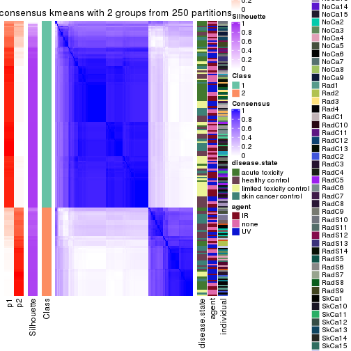</p>

</div>
<div id='tab-SD-kmeans-consensus-heatmap-2'>
<pre><code class="r">consensus_heatmap(res, k = 3)
</code></pre>

<p>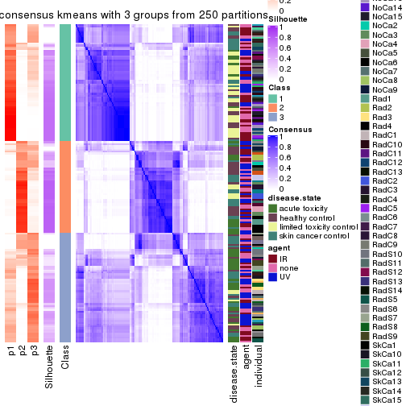</p>

</div>
<div id='tab-SD-kmeans-consensus-heatmap-3'>
<pre><code class="r">consensus_heatmap(res, k = 4)
</code></pre>

<p>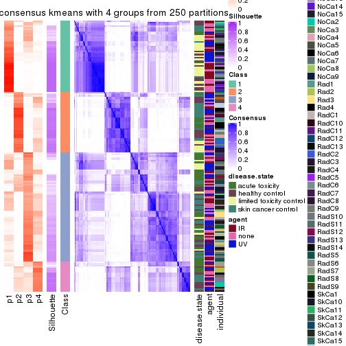</p>

</div>
<div id='tab-SD-kmeans-consensus-heatmap-4'>
<pre><code class="r">consensus_heatmap(res, k = 5)
</code></pre>

<p>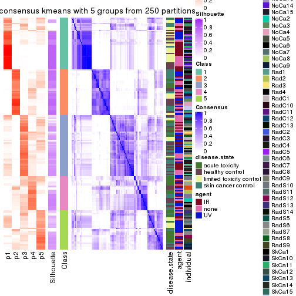</p>

</div>
<div id='tab-SD-kmeans-consensus-heatmap-5'>
<pre><code class="r">consensus_heatmap(res, k = 6)
</code></pre>

<p>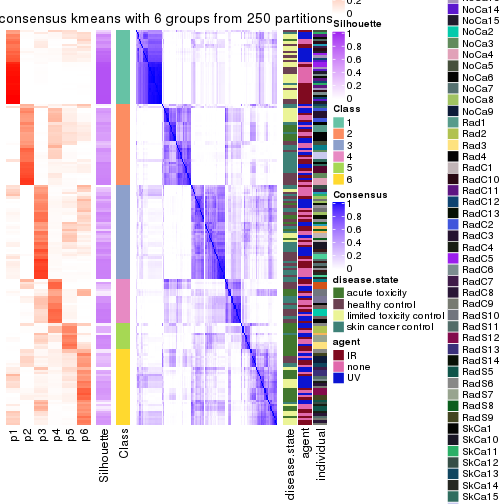</p>

</div>
</div>

Heatmaps for the membership of samples in all partitions to see how consistent they are:


<script>
$( function() {
	$( '#tabs-SD-kmeans-membership-heatmap' ).tabs();
} );
</script>
<div id='tabs-SD-kmeans-membership-heatmap'>
<ul>
<li><a href='#tab-SD-kmeans-membership-heatmap-1'>k = 2</a></li>
<li><a href='#tab-SD-kmeans-membership-heatmap-2'>k = 3</a></li>
<li><a href='#tab-SD-kmeans-membership-heatmap-3'>k = 4</a></li>
<li><a href='#tab-SD-kmeans-membership-heatmap-4'>k = 5</a></li>
<li><a href='#tab-SD-kmeans-membership-heatmap-5'>k = 6</a></li>
</ul>
<div id='tab-SD-kmeans-membership-heatmap-1'>
<pre><code class="r">membership_heatmap(res, k = 2)
</code></pre>

<p>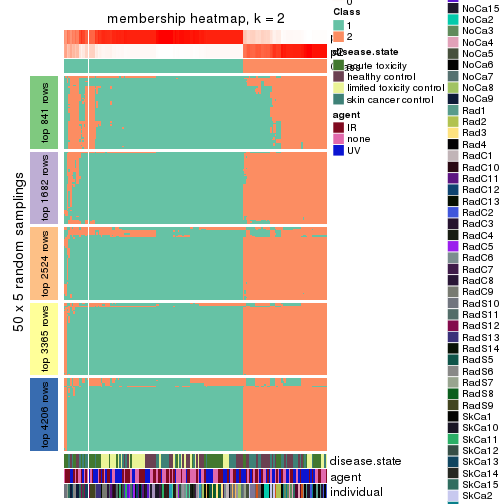</p>

</div>
<div id='tab-SD-kmeans-membership-heatmap-2'>
<pre><code class="r">membership_heatmap(res, k = 3)
</code></pre>

<p>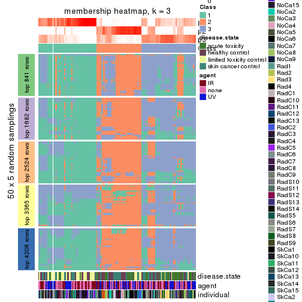</p>

</div>
<div id='tab-SD-kmeans-membership-heatmap-3'>
<pre><code class="r">membership_heatmap(res, k = 4)
</code></pre>

<p>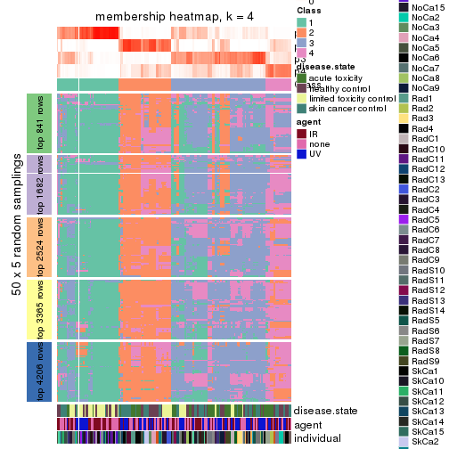</p>

</div>
<div id='tab-SD-kmeans-membership-heatmap-4'>
<pre><code class="r">membership_heatmap(res, k = 5)
</code></pre>

<p>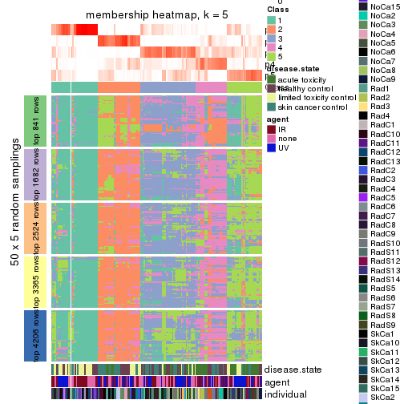</p>

</div>
<div id='tab-SD-kmeans-membership-heatmap-5'>
<pre><code class="r">membership_heatmap(res, k = 6)
</code></pre>

<p>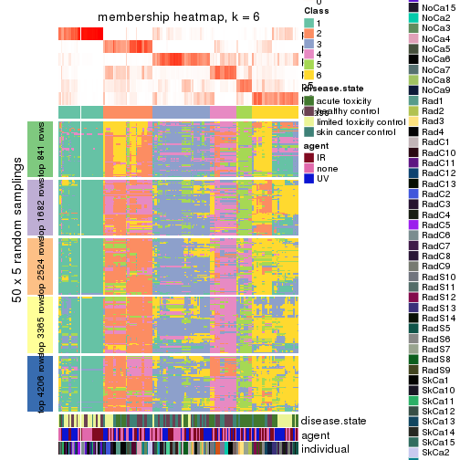</p>

</div>
</div>

As soon as we have had the classes for columns, we can look for signatures
which are significantly different between classes which can be candidate marks
for certain classes. Following are the heatmaps for signatures.


Signature heatmaps where rows are scaled:


<script>
$( function() {
	$( '#tabs-SD-kmeans-get-signatures' ).tabs();
} );
</script>
<div id='tabs-SD-kmeans-get-signatures'>
<ul>
<li><a href='#tab-SD-kmeans-get-signatures-1'>k = 2</a></li>
<li><a href='#tab-SD-kmeans-get-signatures-2'>k = 3</a></li>
<li><a href='#tab-SD-kmeans-get-signatures-3'>k = 4</a></li>
<li><a href='#tab-SD-kmeans-get-signatures-4'>k = 5</a></li>
<li><a href='#tab-SD-kmeans-get-signatures-5'>k = 6</a></li>
</ul>
<div id='tab-SD-kmeans-get-signatures-1'>
<pre><code class="r">get_signatures(res, k = 2)
</code></pre>

<p>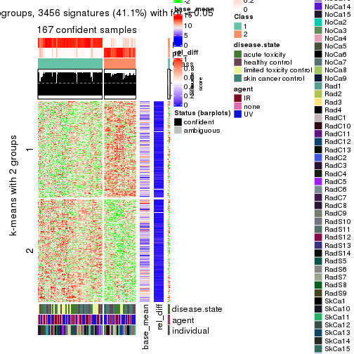</p>

</div>
<div id='tab-SD-kmeans-get-signatures-2'>
<pre><code class="r">get_signatures(res, k = 3)
</code></pre>

<p>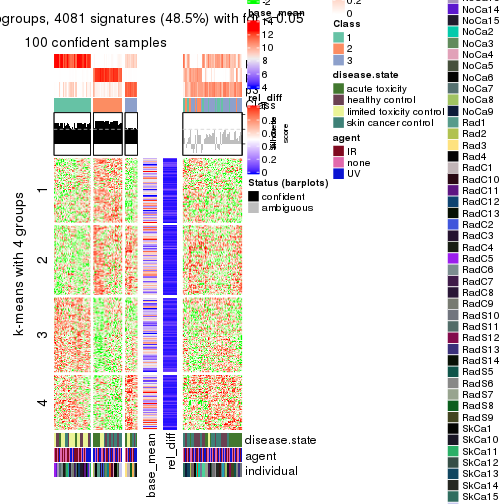</p>

</div>
<div id='tab-SD-kmeans-get-signatures-3'>
<pre><code class="r">get_signatures(res, k = 4)
</code></pre>

<p>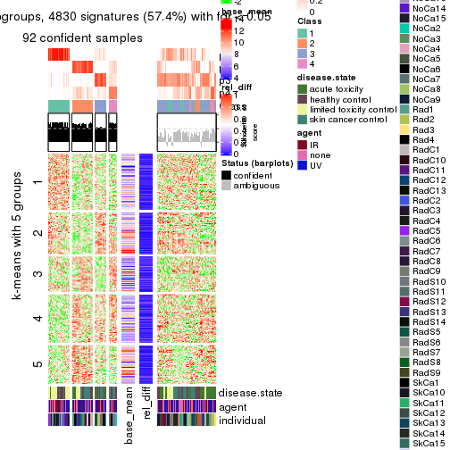</p>

</div>
<div id='tab-SD-kmeans-get-signatures-4'>
<pre><code class="r">get_signatures(res, k = 5)
</code></pre>

<p>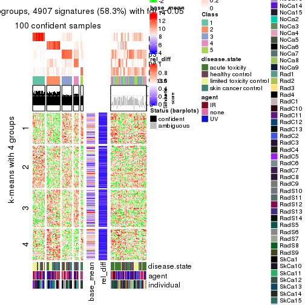</p>

</div>
<div id='tab-SD-kmeans-get-signatures-5'>
<pre><code class="r">get_signatures(res, k = 6)
</code></pre>

<p>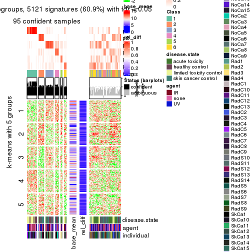</p>

</div>
</div>


Signature heatmaps where rows are not scaled:


<script>
$( function() {
	$( '#tabs-SD-kmeans-get-signatures-no-scale' ).tabs();
} );
</script>
<div id='tabs-SD-kmeans-get-signatures-no-scale'>
<ul>
<li><a href='#tab-SD-kmeans-get-signatures-no-scale-1'>k = 2</a></li>
<li><a href='#tab-SD-kmeans-get-signatures-no-scale-2'>k = 3</a></li>
<li><a href='#tab-SD-kmeans-get-signatures-no-scale-3'>k = 4</a></li>
<li><a href='#tab-SD-kmeans-get-signatures-no-scale-4'>k = 5</a></li>
<li><a href='#tab-SD-kmeans-get-signatures-no-scale-5'>k = 6</a></li>
</ul>
<div id='tab-SD-kmeans-get-signatures-no-scale-1'>
<pre><code class="r">get_signatures(res, k = 2, scale_rows = FALSE)
</code></pre>

<p>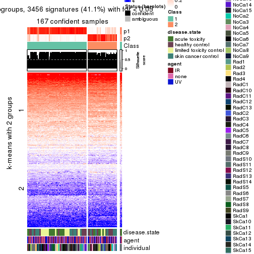</p>

</div>
<div id='tab-SD-kmeans-get-signatures-no-scale-2'>
<pre><code class="r">get_signatures(res, k = 3, scale_rows = FALSE)
</code></pre>

<p>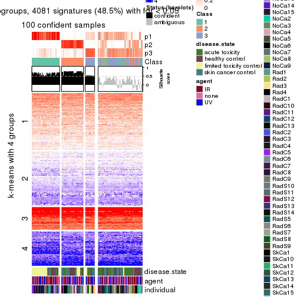</p>

</div>
<div id='tab-SD-kmeans-get-signatures-no-scale-3'>
<pre><code class="r">get_signatures(res, k = 4, scale_rows = FALSE)
</code></pre>

<p>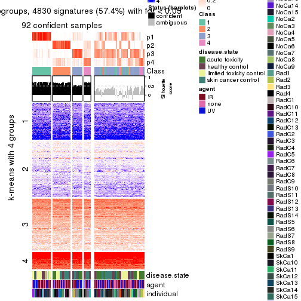</p>

</div>
<div id='tab-SD-kmeans-get-signatures-no-scale-4'>
<pre><code class="r">get_signatures(res, k = 5, scale_rows = FALSE)
</code></pre>

<p>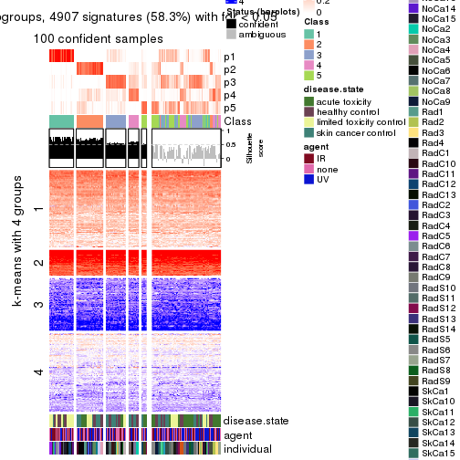</p>

</div>
<div id='tab-SD-kmeans-get-signatures-no-scale-5'>
<pre><code class="r">get_signatures(res, k = 6, scale_rows = FALSE)
</code></pre>

<p>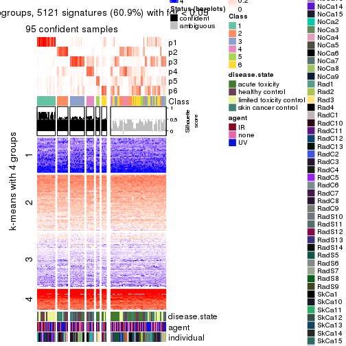</p>

</div>
</div>


Compare the overlap of signatures from different k:

```r
compare_signatures(res)
```

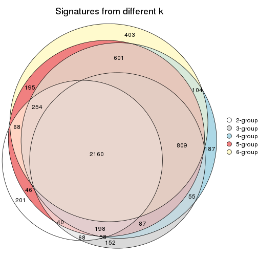

`get_signature()` returns a data frame invisibly. TO get the list of signatures, the function
call should be assigned to a variable explicitly. In following code, if `plot` argument is set
to `FALSE`, no heatmap is plotted while only the differential analysis is performed.

```r
# code only for demonstration
tb = get_signature(res, k = ..., plot = FALSE)
```

An example of the output of `tb` is:

```
#>   which_row         fdr    mean_1    mean_2 scaled_mean_1 scaled_mean_2 km
#> 1        38 0.042760348  8.373488  9.131774    -0.5533452     0.5164555  1
#> 2        40 0.018707592  7.106213  8.469186    -0.6173731     0.5762149  1
#> 3        55 0.019134737 10.221463 11.207825    -0.6159697     0.5749050  1
#> 4        59 0.006059896  5.921854  7.869574    -0.6899429     0.6439467  1
#> 5        60 0.018055526  8.928898 10.211722    -0.6204761     0.5791110  1
#> 6        98 0.009384629 15.714769 14.887706     0.6635654    -0.6193277  2
...
```

The columns in `tb` are:

1. `which_row`: row indices corresponding to the input matrix.
2. `fdr`: FDR for the differential test. 
3. `mean_x`: The mean value in group x.
4. `scaled_mean_x`: The mean value in group x after rows are scaled.
5. `km`: Row groups if k-means clustering is applied to rows.


UMAP plot which shows how samples are separated.


<script>
$( function() {
	$( '#tabs-SD-kmeans-dimension-reduction' ).tabs();
} );
</script>
<div id='tabs-SD-kmeans-dimension-reduction'>
<ul>
<li><a href='#tab-SD-kmeans-dimension-reduction-1'>k = 2</a></li>
<li><a href='#tab-SD-kmeans-dimension-reduction-2'>k = 3</a></li>
<li><a href='#tab-SD-kmeans-dimension-reduction-3'>k = 4</a></li>
<li><a href='#tab-SD-kmeans-dimension-reduction-4'>k = 5</a></li>
<li><a href='#tab-SD-kmeans-dimension-reduction-5'>k = 6</a></li>
</ul>
<div id='tab-SD-kmeans-dimension-reduction-1'>
<pre><code class="r">dimension_reduction(res, k = 2, method = &quot;UMAP&quot;)
</code></pre>

<p>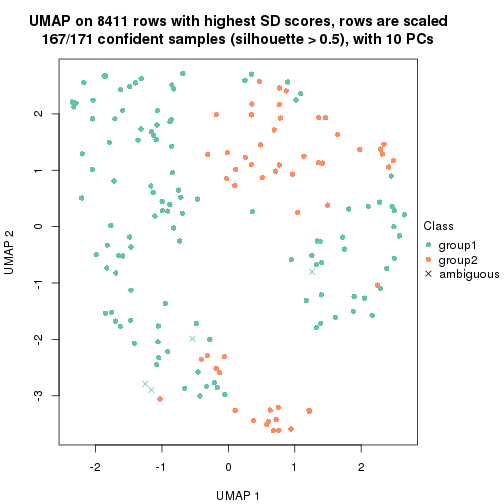</p>

</div>
<div id='tab-SD-kmeans-dimension-reduction-2'>
<pre><code class="r">dimension_reduction(res, k = 3, method = &quot;UMAP&quot;)
</code></pre>

<p>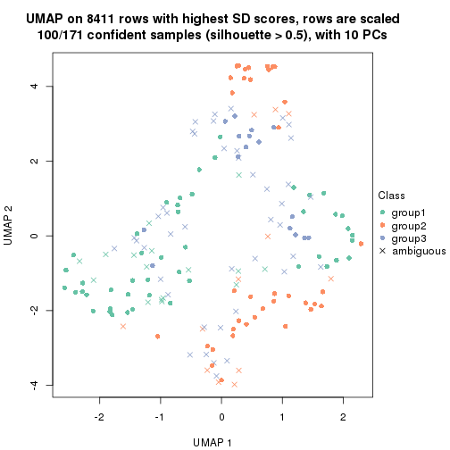</p>

</div>
<div id='tab-SD-kmeans-dimension-reduction-3'>
<pre><code class="r">dimension_reduction(res, k = 4, method = &quot;UMAP&quot;)
</code></pre>

<p>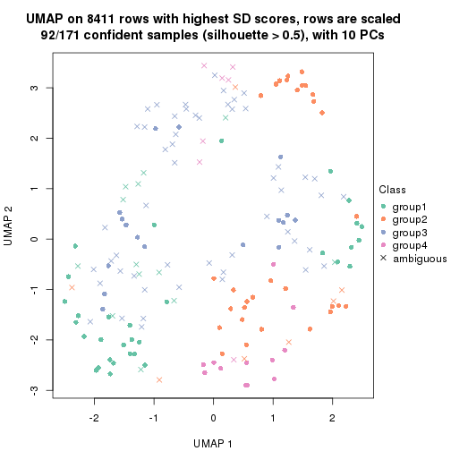</p>

</div>
<div id='tab-SD-kmeans-dimension-reduction-4'>
<pre><code class="r">dimension_reduction(res, k = 5, method = &quot;UMAP&quot;)
</code></pre>

<p>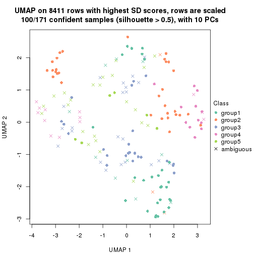</p>

</div>
<div id='tab-SD-kmeans-dimension-reduction-5'>
<pre><code class="r">dimension_reduction(res, k = 6, method = &quot;UMAP&quot;)
</code></pre>

<p>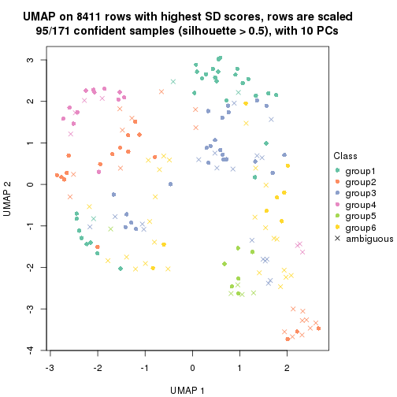</p>

</div>
</div>


Following heatmap shows how subgroups are split when increasing `k`:

```r
collect_classes(res)
```

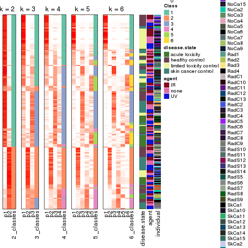


Test correlation between subgroups and known annotations. If the known
annotation is numeric, one-way ANOVA test is applied, and if the known
annotation is discrete, chi-squared contingency table test is applied.

```r
test_to_known_factors(res)
```

```
#>             n disease.state(p) agent(p) individual(p) k
#> SD:kmeans 167         3.60e-02    0.671      9.25e-12 2
#> SD:kmeans 100         1.41e-04    0.583      2.96e-12 3
#> SD:kmeans  92         1.63e-06    0.972      9.74e-17 4
#> SD:kmeans 100         1.80e-06    0.917      9.65e-22 5
#> SD:kmeans  95         1.16e-13    0.869      2.03e-24 6
```


If matrix rows can be associated to genes, consider to use `functional_enrichment(res,
...)` to perform function enrichment for the signature genes. See [this vignette](http://bioconductor.org/packages/devel/bioc/vignettes/cola/inst/doc/functional_enrichment.html) for more detailed explanations.


 

---------------------------------------------------


### SD:skmeans


The object with results only for a single top-value method and a single partition method 
can be extracted as:

```r
res = res_list["SD", "skmeans"]
# you can also extract it by
# res = res_list["SD:skmeans"]
```

A summary of `res` and all the functions that can be applied to it:

```r
res
```

```
#> A 'ConsensusPartition' object with k = 2, 3, 4, 5, 6.
#>   On a matrix with 8411 rows and 171 columns.
#>   Top rows (841, 1682, 2524, 3365, 4206) are extracted by 'SD' method.
#>   Subgroups are detected by 'skmeans' method.
#>   Performed in total 1250 partitions by row resampling.
#>   Best k for subgroups seems to be 2.
#> 
#> Following methods can be applied to this 'ConsensusPartition' object:
#>  [1] "cola_report"             "collect_classes"         "collect_plots"          
#>  [4] "collect_stats"           "colnames"                "compare_signatures"     
#>  [7] "consensus_heatmap"       "dimension_reduction"     "functional_enrichment"  
#> [10] "get_anno_col"            "get_anno"                "get_classes"            
#> [13] "get_consensus"           "get_matrix"              "get_membership"         
#> [16] "get_param"               "get_signatures"          "get_stats"              
#> [19] "is_best_k"               "is_stable_k"             "membership_heatmap"     
#> [22] "ncol"                    "nrow"                    "plot_ecdf"              
#> [25] "rownames"                "select_partition_number" "show"                   
#> [28] "suggest_best_k"          "test_to_known_factors"
```

`collect_plots()` function collects all the plots made from `res` for all `k` (number of partitions)
into one single page to provide an easy and fast comparison between different `k`.

```r
collect_plots(res)
```

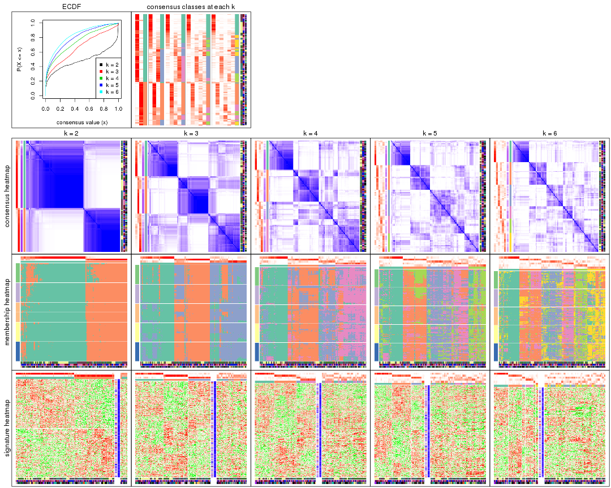

The plots are:

- The first row: a plot of the ECDF (empirical cumulative distribution
  function) curves of the consensus matrix for each `k` and the heatmap of
  predicted classes for each `k`.
- The second row: heatmaps of the consensus matrix for each `k`.
- The third row: heatmaps of the membership matrix for each `k`.
- The fouth row: heatmaps of the signatures for each `k`.

All the plots in panels can be made by individual functions and they are
plotted later in this section.

`select_partition_number()` produces several plots showing different
statistics for choosing "optimized" `k`. There are following statistics:

- ECDF curves of the consensus matrix for each `k`;
- 1-PAC. [The PAC
  score](https://en.wikipedia.org/wiki/Consensus_clustering#Over-interpretation_potential_of_consensus_clustering)
  measures the proportion of the ambiguous subgrouping.
- Mean silhouette score.
- Concordance. The mean probability of fiting the consensus class ids in all
  partitions.
- Area increased. Denote $A_k$ as the area under the ECDF curve for current
  `k`, the area increased is defined as $A_k - A_{k-1}$.
- Rand index. The percent of pairs of samples that are both in a same cluster
  or both are not in a same cluster in the partition of k and k-1.
- Jaccard index. The ratio of pairs of samples are both in a same cluster in
  the partition of k and k-1 and the pairs of samples are both in a same
  cluster in the partition k or k-1.

The detailed explanations of these statistics can be found in [the _cola_
vignette](http://bioconductor.org/packages/devel/bioc/vignettes/cola/inst/doc/cola.html#toc_13).

Generally speaking, lower PAC score, higher mean silhouette score or higher
concordance corresponds to better partition. Rand index and Jaccard index
measure how similar the current partition is compared to partition with `k-1`.
If they are too similar, we won't accept `k` is better than `k-1`.

```r
select_partition_number(res)
```

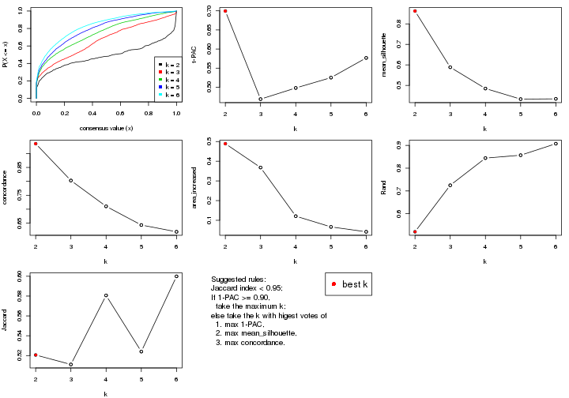

The numeric values for all these statistics can be obtained by `get_stats()`.

```r
get_stats(res)
```

```
#>   k 1-PAC mean_silhouette concordance area_increased  Rand Jaccard
#> 2 2 0.699           0.863       0.935         0.4891 0.521   0.521
#> 3 3 0.469           0.589       0.803         0.3681 0.725   0.511
#> 4 4 0.498           0.485       0.710         0.1210 0.844   0.581
#> 5 5 0.525           0.433       0.643         0.0664 0.857   0.524
#> 6 6 0.577           0.434       0.619         0.0417 0.908   0.600
```

`suggest_best_k()` suggests the best $k$ based on these statistics. The rules are as follows:

- All $k$ with Jaccard index larger than 0.95 are removed because increasing
  $k$ does not provide enough extra information. If all $k$ are removed, it is
  marked as no subgroup is detected.
- For all $k$ with 1-PAC score larger than 0.9, the maximal $k$ is taken as
  the best $k$, and other $k$ are marked as optional $k$.
- If it does not fit the second rule. The $k$ with the maximal vote of the
  highest 1-PAC score, highest mean silhouette, and highest concordance is
  taken as the best $k$.

```r
suggest_best_k(res)
```

```
#> [1] 2
```


Following shows the table of the partitions (You need to click the **show/hide
code output** link to see it). The membership matrix (columns with name `p*`)
is inferred by
[`clue::cl_consensus()`](https://www.rdocumentation.org/link/cl_consensus?package=clue)
function with the `SE` method. Basically the value in the membership matrix
represents the probability to belong to a certain group. The finall class
label for an item is determined with the group with highest probability it
belongs to.

In `get_classes()` function, the entropy is calculated from the membership
matrix and the silhouette score is calculated from the consensus matrix.


<script>
$( function() {
	$( '#tabs-SD-skmeans-get-classes' ).tabs();
} );
</script>
<div id='tabs-SD-skmeans-get-classes'>
<ul>
<li><a href='#tab-SD-skmeans-get-classes-1'>k = 2</a></li>
<li><a href='#tab-SD-skmeans-get-classes-2'>k = 3</a></li>
<li><a href='#tab-SD-skmeans-get-classes-3'>k = 4</a></li>
<li><a href='#tab-SD-skmeans-get-classes-4'>k = 5</a></li>
<li><a href='#tab-SD-skmeans-get-classes-5'>k = 6</a></li>
</ul>

<div id='tab-SD-skmeans-get-classes-1'>
<p><a id='tab-SD-skmeans-get-classes-1-a' style='color:#0366d6' href='#'>show/hide code output</a></p>
<pre><code class="r">cbind(get_classes(res, k = 2), get_membership(res, k = 2))
</code></pre>

<pre><code>#&gt;          class entropy silhouette    p1    p2
#&gt; GSM29783     2  0.0672     0.9436 0.008 0.992
#&gt; GSM29786     2  0.5294     0.8704 0.120 0.880
#&gt; GSM29789     2  0.0000     0.9451 0.000 1.000
#&gt; GSM29792     2  0.0000     0.9451 0.000 1.000
#&gt; GSM29795     2  0.6712     0.8068 0.176 0.824
#&gt; GSM29798     2  0.7056     0.7858 0.192 0.808
#&gt; GSM29801     1  0.0000     0.9211 1.000 0.000
#&gt; GSM29804     1  0.0000     0.9211 1.000 0.000
#&gt; GSM29807     2  0.9833     0.1663 0.424 0.576
#&gt; GSM29816     1  0.0000     0.9211 1.000 0.000
#&gt; GSM29821     1  0.0672     0.9184 0.992 0.008
#&gt; GSM29824     1  0.0000     0.9211 1.000 0.000
#&gt; GSM29827     1  0.0376     0.9200 0.996 0.004
#&gt; GSM29830     1  0.0000     0.9211 1.000 0.000
#&gt; GSM29833     1  0.0672     0.9183 0.992 0.008
#&gt; GSM29784     2  0.0000     0.9451 0.000 1.000
#&gt; GSM29787     2  0.5737     0.8536 0.136 0.864
#&gt; GSM29790     2  0.0000     0.9451 0.000 1.000
#&gt; GSM29793     2  0.0000     0.9451 0.000 1.000
#&gt; GSM29796     2  0.3431     0.9170 0.064 0.936
#&gt; GSM29799     2  0.7219     0.7748 0.200 0.800
#&gt; GSM29802     1  0.0000     0.9211 1.000 0.000
#&gt; GSM29805     1  0.0000     0.9211 1.000 0.000
#&gt; GSM29814     2  0.9909     0.0920 0.444 0.556
#&gt; GSM29817     1  0.0000     0.9211 1.000 0.000
#&gt; GSM29822     1  0.0000     0.9211 1.000 0.000
#&gt; GSM29825     1  0.0000     0.9211 1.000 0.000
#&gt; GSM29828     1  0.0000     0.9211 1.000 0.000
#&gt; GSM29831     1  0.0000     0.9211 1.000 0.000
#&gt; GSM29834     1  0.0000     0.9211 1.000 0.000
#&gt; GSM29785     2  0.0000     0.9451 0.000 1.000
#&gt; GSM29788     2  0.2948     0.9241 0.052 0.948
#&gt; GSM29791     2  0.0000     0.9451 0.000 1.000
#&gt; GSM29794     2  0.0000     0.9451 0.000 1.000
#&gt; GSM29797     2  0.1184     0.9410 0.016 0.984
#&gt; GSM29800     2  0.3274     0.9193 0.060 0.940
#&gt; GSM29803     1  0.6247     0.7924 0.844 0.156
#&gt; GSM29806     1  0.6623     0.8016 0.828 0.172
#&gt; GSM29815     2  0.2778     0.9152 0.048 0.952
#&gt; GSM29819     1  0.0376     0.9199 0.996 0.004
#&gt; GSM29823     1  0.8016     0.6693 0.756 0.244
#&gt; GSM29826     1  0.0000     0.9211 1.000 0.000
#&gt; GSM29829     1  0.0672     0.9187 0.992 0.008
#&gt; GSM29832     1  0.0376     0.9199 0.996 0.004
#&gt; GSM29835     1  0.9977     0.1035 0.528 0.472
#&gt; GSM29836     2  0.0000     0.9451 0.000 1.000
#&gt; GSM29839     2  0.3114     0.9224 0.056 0.944
#&gt; GSM29842     2  0.0000     0.9451 0.000 1.000
#&gt; GSM29845     2  0.2236     0.9331 0.036 0.964
#&gt; GSM29848     2  0.5178     0.8747 0.116 0.884
#&gt; GSM29851     1  0.0000     0.9211 1.000 0.000
#&gt; GSM29854     1  0.0000     0.9211 1.000 0.000
#&gt; GSM29857     1  0.0672     0.9186 0.992 0.008
#&gt; GSM29860     2  0.0000     0.9451 0.000 1.000
#&gt; GSM29863     1  0.0000     0.9211 1.000 0.000
#&gt; GSM29866     1  0.0000     0.9211 1.000 0.000
#&gt; GSM29869     1  0.2778     0.8993 0.952 0.048
#&gt; GSM29872     1  0.9580     0.4769 0.620 0.380
#&gt; GSM29875     1  0.0000     0.9211 1.000 0.000
#&gt; GSM29878     2  0.1633     0.9366 0.024 0.976
#&gt; GSM29837     2  0.0000     0.9451 0.000 1.000
#&gt; GSM29840     2  0.2236     0.9328 0.036 0.964
#&gt; GSM29843     2  0.0000     0.9451 0.000 1.000
#&gt; GSM29846     2  0.0938     0.9422 0.012 0.988
#&gt; GSM29849     2  0.5178     0.8747 0.116 0.884
#&gt; GSM29852     1  0.0000     0.9211 1.000 0.000
#&gt; GSM29855     1  0.0000     0.9211 1.000 0.000
#&gt; GSM29858     1  0.0672     0.9186 0.992 0.008
#&gt; GSM29861     2  0.0000     0.9451 0.000 1.000
#&gt; GSM29864     1  0.0000     0.9211 1.000 0.000
#&gt; GSM29867     1  0.0000     0.9211 1.000 0.000
#&gt; GSM29870     1  0.0000     0.9211 1.000 0.000
#&gt; GSM29873     1  0.9358     0.5377 0.648 0.352
#&gt; GSM29876     1  0.0000     0.9211 1.000 0.000
#&gt; GSM29879     1  0.9963     0.2231 0.536 0.464
#&gt; GSM29838     2  0.0000     0.9451 0.000 1.000
#&gt; GSM29841     2  0.0376     0.9443 0.004 0.996
#&gt; GSM29844     2  0.0000     0.9451 0.000 1.000
#&gt; GSM29847     2  0.0938     0.9422 0.012 0.988
#&gt; GSM29850     2  0.2778     0.9262 0.048 0.952
#&gt; GSM29853     1  0.0000     0.9211 1.000 0.000
#&gt; GSM29856     1  0.8267     0.6535 0.740 0.260
#&gt; GSM29859     1  0.9552     0.4855 0.624 0.376
#&gt; GSM29862     2  0.0000     0.9451 0.000 1.000
#&gt; GSM29865     1  0.9983     0.0687 0.524 0.476
#&gt; GSM29868     1  0.3584     0.8813 0.932 0.068
#&gt; GSM29871     1  0.7950     0.7225 0.760 0.240
#&gt; GSM29874     2  0.0000     0.9451 0.000 1.000
#&gt; GSM29877     1  0.0000     0.9211 1.000 0.000
#&gt; GSM29880     2  0.0000     0.9451 0.000 1.000
#&gt; GSM29881     1  0.0672     0.9184 0.992 0.008
#&gt; GSM29884     2  0.0000     0.9451 0.000 1.000
#&gt; GSM29887     2  0.0000     0.9451 0.000 1.000
#&gt; GSM29890     1  0.0000     0.9211 1.000 0.000
#&gt; GSM29893     1  0.0000     0.9211 1.000 0.000
#&gt; GSM29896     1  0.0000     0.9211 1.000 0.000
#&gt; GSM29899     1  0.0000     0.9211 1.000 0.000
#&gt; GSM29902     1  0.0938     0.9171 0.988 0.012
#&gt; GSM29905     1  0.0938     0.9171 0.988 0.012
#&gt; GSM29908     1  0.0000     0.9211 1.000 0.000
#&gt; GSM29955     1  0.0938     0.9171 0.988 0.012
#&gt; GSM29958     1  0.0000     0.9211 1.000 0.000
#&gt; GSM29961     1  0.0000     0.9211 1.000 0.000
#&gt; GSM29882     1  0.0000     0.9211 1.000 0.000
#&gt; GSM29885     2  0.0000     0.9451 0.000 1.000
#&gt; GSM29888     2  0.0000     0.9451 0.000 1.000
#&gt; GSM29891     1  0.0000     0.9211 1.000 0.000
#&gt; GSM29894     1  0.0000     0.9211 1.000 0.000
#&gt; GSM29897     1  0.0000     0.9211 1.000 0.000
#&gt; GSM29900     1  0.0000     0.9211 1.000 0.000
#&gt; GSM29903     1  0.0938     0.9171 0.988 0.012
#&gt; GSM29906     1  0.0938     0.9171 0.988 0.012
#&gt; GSM29909     1  0.1184     0.9155 0.984 0.016
#&gt; GSM29956     1  0.0000     0.9211 1.000 0.000
#&gt; GSM29959     1  0.0000     0.9211 1.000 0.000
#&gt; GSM29962     1  0.0000     0.9211 1.000 0.000
#&gt; GSM29883     1  0.0376     0.9199 0.996 0.004
#&gt; GSM29886     2  0.0000     0.9451 0.000 1.000
#&gt; GSM29889     2  0.0000     0.9451 0.000 1.000
#&gt; GSM29892     1  0.1633     0.9119 0.976 0.024
#&gt; GSM29895     1  0.9580     0.4289 0.620 0.380
#&gt; GSM29898     1  0.0000     0.9211 1.000 0.000
#&gt; GSM29901     1  0.0000     0.9211 1.000 0.000
#&gt; GSM29904     1  0.3733     0.8827 0.928 0.072
#&gt; GSM29907     1  0.0938     0.9171 0.988 0.012
#&gt; GSM29910     1  0.6973     0.7911 0.812 0.188
#&gt; GSM29957     2  0.5842     0.8207 0.140 0.860
#&gt; GSM29960     1  0.3431     0.8812 0.936 0.064
#&gt; GSM29963     1  0.7950     0.7296 0.760 0.240
#&gt; GSM29964     2  0.0000     0.9451 0.000 1.000
#&gt; GSM29967     2  0.0938     0.9422 0.012 0.988
#&gt; GSM29970     1  0.4562     0.8652 0.904 0.096
#&gt; GSM29973     2  0.0000     0.9451 0.000 1.000
#&gt; GSM29976     1  0.0000     0.9211 1.000 0.000
#&gt; GSM29979     2  0.0000     0.9451 0.000 1.000
#&gt; GSM29982     2  0.3584     0.9138 0.068 0.932
#&gt; GSM29985     1  0.0000     0.9211 1.000 0.000
#&gt; GSM29988     1  0.9087     0.5916 0.676 0.324
#&gt; GSM29991     2  0.6343     0.8264 0.160 0.840
#&gt; GSM29994     1  0.2043     0.9073 0.968 0.032
#&gt; GSM29997     1  0.4562     0.8657 0.904 0.096
#&gt; GSM30000     1  0.7815     0.7339 0.768 0.232
#&gt; GSM30003     1  0.0000     0.9211 1.000 0.000
#&gt; GSM29965     2  0.0000     0.9451 0.000 1.000
#&gt; GSM29968     2  0.0938     0.9422 0.012 0.988
#&gt; GSM29971     1  0.3733     0.8829 0.928 0.072
#&gt; GSM29974     2  0.0000     0.9451 0.000 1.000
#&gt; GSM29977     1  0.0000     0.9211 1.000 0.000
#&gt; GSM29980     2  0.0938     0.9404 0.012 0.988
#&gt; GSM29983     1  0.9323     0.4882 0.652 0.348
#&gt; GSM29986     1  0.0000     0.9211 1.000 0.000
#&gt; GSM29989     1  0.7950     0.7227 0.760 0.240
#&gt; GSM29992     2  0.8499     0.6574 0.276 0.724
#&gt; GSM29995     1  0.1633     0.9117 0.976 0.024
#&gt; GSM29998     1  0.4431     0.8683 0.908 0.092
#&gt; GSM30001     1  0.6887     0.7869 0.816 0.184
#&gt; GSM30004     1  0.0000     0.9211 1.000 0.000
#&gt; GSM29966     2  0.0000     0.9451 0.000 1.000
#&gt; GSM29969     2  0.0938     0.9422 0.012 0.988
#&gt; GSM29972     1  0.9635     0.4532 0.612 0.388
#&gt; GSM29975     2  0.0000     0.9451 0.000 1.000
#&gt; GSM29978     1  0.0000     0.9211 1.000 0.000
#&gt; GSM29981     2  0.0000     0.9451 0.000 1.000
#&gt; GSM29984     2  0.4022     0.9053 0.080 0.920
#&gt; GSM29987     1  0.5629     0.8171 0.868 0.132
#&gt; GSM29990     1  0.9522     0.4999 0.628 0.372
#&gt; GSM29993     2  0.4939     0.8798 0.108 0.892
#&gt; GSM29996     1  0.2423     0.9025 0.960 0.040
#&gt; GSM29999     1  0.7745     0.7375 0.772 0.228
#&gt; GSM30002     2  0.2043     0.9289 0.032 0.968
#&gt; GSM30005     1  0.1184     0.9142 0.984 0.016
</code></pre>

<script>
$('#tab-SD-skmeans-get-classes-1-a').parent().next().next().hide();
$('#tab-SD-skmeans-get-classes-1-a').click(function(){
  $('#tab-SD-skmeans-get-classes-1-a').parent().next().next().toggle();
  return(false);
});
</script>
</div>

<div id='tab-SD-skmeans-get-classes-2'>
<p><a id='tab-SD-skmeans-get-classes-2-a' style='color:#0366d6' href='#'>show/hide code output</a></p>
<pre><code class="r">cbind(get_classes(res, k = 3), get_membership(res, k = 3))
</code></pre>

<pre><code>#&gt;          class entropy silhouette    p1    p2    p3
#&gt; GSM29783     2  0.3009     0.7617 0.028 0.920 0.052
#&gt; GSM29786     2  0.6154     0.4298 0.000 0.592 0.408
#&gt; GSM29789     2  0.0237     0.7915 0.004 0.996 0.000
#&gt; GSM29792     2  0.0237     0.7915 0.004 0.996 0.000
#&gt; GSM29795     2  0.8409     0.4181 0.308 0.580 0.112
#&gt; GSM29798     2  0.6192     0.4097 0.000 0.580 0.420
#&gt; GSM29801     3  0.6274     0.3178 0.456 0.000 0.544
#&gt; GSM29804     3  0.5363     0.4908 0.276 0.000 0.724
#&gt; GSM29807     3  0.7466     0.2320 0.036 0.444 0.520
#&gt; GSM29816     3  0.4750     0.6246 0.216 0.000 0.784
#&gt; GSM29821     1  0.6307    -0.2101 0.512 0.000 0.488
#&gt; GSM29824     1  0.2261     0.7684 0.932 0.000 0.068
#&gt; GSM29827     1  0.0000     0.7771 1.000 0.000 0.000
#&gt; GSM29830     1  0.0237     0.7761 0.996 0.000 0.004
#&gt; GSM29833     1  0.0000     0.7771 1.000 0.000 0.000
#&gt; GSM29784     2  0.1031     0.7856 0.000 0.976 0.024
#&gt; GSM29787     2  0.6126     0.4416 0.000 0.600 0.400
#&gt; GSM29790     2  0.0000     0.7929 0.000 1.000 0.000
#&gt; GSM29793     2  0.0000     0.7929 0.000 1.000 0.000
#&gt; GSM29796     2  0.5519     0.6949 0.068 0.812 0.120
#&gt; GSM29799     2  0.6308     0.2509 0.000 0.508 0.492
#&gt; GSM29802     3  0.3340     0.6681 0.120 0.000 0.880
#&gt; GSM29805     3  0.5016     0.6019 0.240 0.000 0.760
#&gt; GSM29814     3  0.7534     0.2827 0.040 0.428 0.532
#&gt; GSM29817     3  0.5882     0.4891 0.348 0.000 0.652
#&gt; GSM29822     3  0.5621     0.5342 0.308 0.000 0.692
#&gt; GSM29825     1  0.6180     0.0840 0.584 0.000 0.416
#&gt; GSM29828     1  0.0000     0.7771 1.000 0.000 0.000
#&gt; GSM29831     1  0.0237     0.7761 0.996 0.000 0.004
#&gt; GSM29834     1  0.0000     0.7771 1.000 0.000 0.000
#&gt; GSM29785     2  0.0000     0.7929 0.000 1.000 0.000
#&gt; GSM29788     2  0.6095     0.4532 0.000 0.608 0.392
#&gt; GSM29791     2  0.0237     0.7915 0.004 0.996 0.000
#&gt; GSM29794     2  0.0237     0.7915 0.004 0.996 0.000
#&gt; GSM29797     2  0.3886     0.7411 0.024 0.880 0.096
#&gt; GSM29800     2  0.6192     0.4097 0.000 0.580 0.420
#&gt; GSM29803     3  0.0848     0.6743 0.008 0.008 0.984
#&gt; GSM29806     3  0.3851     0.6240 0.004 0.136 0.860
#&gt; GSM29815     3  0.6291     0.1933 0.000 0.468 0.532
#&gt; GSM29819     3  0.0237     0.6734 0.004 0.000 0.996
#&gt; GSM29823     3  0.6410     0.3078 0.420 0.004 0.576
#&gt; GSM29826     3  0.2537     0.6607 0.080 0.000 0.920
#&gt; GSM29829     1  0.2711     0.7538 0.912 0.000 0.088
#&gt; GSM29832     1  0.2356     0.7592 0.928 0.000 0.072
#&gt; GSM29835     1  0.2496     0.7590 0.928 0.004 0.068
#&gt; GSM29836     2  0.0000     0.7929 0.000 1.000 0.000
#&gt; GSM29839     2  0.3678     0.7506 0.028 0.892 0.080
#&gt; GSM29842     2  0.0000     0.7929 0.000 1.000 0.000
#&gt; GSM29845     2  0.6252     0.3634 0.000 0.556 0.444
#&gt; GSM29848     2  0.6204     0.4025 0.000 0.576 0.424
#&gt; GSM29851     3  0.5988     0.4743 0.368 0.000 0.632
#&gt; GSM29854     3  0.2261     0.6806 0.068 0.000 0.932
#&gt; GSM29857     3  0.3983     0.6433 0.144 0.004 0.852
#&gt; GSM29860     2  0.0237     0.7915 0.004 0.996 0.000
#&gt; GSM29863     3  0.5465     0.5172 0.288 0.000 0.712
#&gt; GSM29866     1  0.0000     0.7771 1.000 0.000 0.000
#&gt; GSM29869     1  0.4526     0.6989 0.856 0.104 0.040
#&gt; GSM29872     1  0.9527     0.2580 0.464 0.332 0.204
#&gt; GSM29875     3  0.6180     0.4044 0.416 0.000 0.584
#&gt; GSM29878     1  0.6267     0.2213 0.548 0.452 0.000
#&gt; GSM29837     2  0.0000     0.7929 0.000 1.000 0.000
#&gt; GSM29840     2  0.1647     0.7817 0.004 0.960 0.036
#&gt; GSM29843     2  0.0000     0.7929 0.000 1.000 0.000
#&gt; GSM29846     2  0.6305     0.2720 0.000 0.516 0.484
#&gt; GSM29849     2  0.6225     0.3872 0.000 0.568 0.432
#&gt; GSM29852     3  0.5706     0.5270 0.320 0.000 0.680
#&gt; GSM29855     3  0.2796     0.6766 0.092 0.000 0.908
#&gt; GSM29858     3  0.3752     0.6458 0.144 0.000 0.856
#&gt; GSM29861     2  0.0237     0.7915 0.004 0.996 0.000
#&gt; GSM29864     3  0.5882     0.4843 0.348 0.000 0.652
#&gt; GSM29867     1  0.4178     0.6535 0.828 0.000 0.172
#&gt; GSM29870     1  0.5618     0.5277 0.732 0.008 0.260
#&gt; GSM29873     2  0.9985    -0.2152 0.324 0.360 0.316
#&gt; GSM29876     3  0.5254     0.5789 0.264 0.000 0.736
#&gt; GSM29879     1  0.7475     0.3248 0.580 0.376 0.044
#&gt; GSM29838     2  0.0000     0.7929 0.000 1.000 0.000
#&gt; GSM29841     2  0.1399     0.7850 0.004 0.968 0.028
#&gt; GSM29844     2  0.0000     0.7929 0.000 1.000 0.000
#&gt; GSM29847     2  0.6140     0.4350 0.000 0.596 0.404
#&gt; GSM29850     2  0.6111     0.4482 0.000 0.604 0.396
#&gt; GSM29853     3  0.4931     0.5703 0.232 0.000 0.768
#&gt; GSM29856     3  0.1878     0.6721 0.044 0.004 0.952
#&gt; GSM29859     3  0.5098     0.5304 0.000 0.248 0.752
#&gt; GSM29862     2  0.2173     0.7570 0.008 0.944 0.048
#&gt; GSM29865     3  0.2926     0.6683 0.036 0.040 0.924
#&gt; GSM29868     1  0.4531     0.7197 0.824 0.008 0.168
#&gt; GSM29871     3  0.7379     0.3466 0.040 0.376 0.584
#&gt; GSM29874     2  0.8470     0.1487 0.344 0.552 0.104
#&gt; GSM29877     3  0.5760     0.5189 0.328 0.000 0.672
#&gt; GSM29880     2  0.1999     0.7642 0.012 0.952 0.036
#&gt; GSM29881     3  0.2448     0.6781 0.076 0.000 0.924
#&gt; GSM29884     2  0.0000     0.7929 0.000 1.000 0.000
#&gt; GSM29887     2  0.0000     0.7929 0.000 1.000 0.000
#&gt; GSM29890     1  0.1964     0.7652 0.944 0.000 0.056
#&gt; GSM29893     1  0.0000     0.7771 1.000 0.000 0.000
#&gt; GSM29896     1  0.0000     0.7771 1.000 0.000 0.000
#&gt; GSM29899     1  0.1753     0.7724 0.952 0.000 0.048
#&gt; GSM29902     1  0.5650     0.5642 0.688 0.000 0.312
#&gt; GSM29905     1  0.5497     0.5886 0.708 0.000 0.292
#&gt; GSM29908     1  0.0000     0.7771 1.000 0.000 0.000
#&gt; GSM29955     1  0.0424     0.7773 0.992 0.000 0.008
#&gt; GSM29958     1  0.0000     0.7771 1.000 0.000 0.000
#&gt; GSM29961     1  0.0000     0.7771 1.000 0.000 0.000
#&gt; GSM29882     3  0.4178     0.6429 0.172 0.000 0.828
#&gt; GSM29885     2  0.0000     0.7929 0.000 1.000 0.000
#&gt; GSM29888     2  0.0000     0.7929 0.000 1.000 0.000
#&gt; GSM29891     1  0.6180     0.3268 0.584 0.000 0.416
#&gt; GSM29894     1  0.1163     0.7675 0.972 0.000 0.028
#&gt; GSM29897     1  0.0000     0.7771 1.000 0.000 0.000
#&gt; GSM29900     1  0.6308    -0.0699 0.508 0.000 0.492
#&gt; GSM29903     1  0.4842     0.6459 0.776 0.000 0.224
#&gt; GSM29906     1  0.5497     0.5814 0.708 0.000 0.292
#&gt; GSM29909     1  0.3116     0.7396 0.892 0.000 0.108
#&gt; GSM29956     1  0.0000     0.7771 1.000 0.000 0.000
#&gt; GSM29959     1  0.0000     0.7771 1.000 0.000 0.000
#&gt; GSM29962     1  0.0000     0.7771 1.000 0.000 0.000
#&gt; GSM29883     3  0.0424     0.6755 0.008 0.000 0.992
#&gt; GSM29886     2  0.0000     0.7929 0.000 1.000 0.000
#&gt; GSM29889     2  0.0000     0.7929 0.000 1.000 0.000
#&gt; GSM29892     1  0.5497     0.6246 0.708 0.000 0.292
#&gt; GSM29895     1  0.3896     0.7335 0.864 0.008 0.128
#&gt; GSM29898     1  0.5905     0.5522 0.648 0.000 0.352
#&gt; GSM29901     3  0.4555     0.5335 0.200 0.000 0.800
#&gt; GSM29904     1  0.5706     0.5895 0.680 0.000 0.320
#&gt; GSM29907     1  0.5948     0.5414 0.640 0.000 0.360
#&gt; GSM29910     1  0.3112     0.7500 0.900 0.004 0.096
#&gt; GSM29957     1  0.6001     0.6945 0.784 0.072 0.144
#&gt; GSM29960     1  0.1860     0.7635 0.948 0.000 0.052
#&gt; GSM29963     1  0.5366     0.6905 0.776 0.016 0.208
#&gt; GSM29964     2  0.0000     0.7929 0.000 1.000 0.000
#&gt; GSM29967     2  0.5363     0.5960 0.000 0.724 0.276
#&gt; GSM29970     3  0.2446     0.6807 0.052 0.012 0.936
#&gt; GSM29973     2  0.0000     0.7929 0.000 1.000 0.000
#&gt; GSM29976     3  0.3192     0.6731 0.112 0.000 0.888
#&gt; GSM29979     2  0.6632     0.4029 0.036 0.692 0.272
#&gt; GSM29982     3  0.9395    -0.0412 0.172 0.396 0.432
#&gt; GSM29985     3  0.2356     0.6792 0.072 0.000 0.928
#&gt; GSM29988     3  0.9305     0.2585 0.164 0.380 0.456
#&gt; GSM29991     3  0.9666     0.1725 0.216 0.356 0.428
#&gt; GSM29994     1  0.5882     0.5143 0.652 0.000 0.348
#&gt; GSM29997     1  0.7901     0.4888 0.608 0.080 0.312
#&gt; GSM30000     1  0.6781     0.6282 0.704 0.052 0.244
#&gt; GSM30003     3  0.4121     0.6516 0.168 0.000 0.832
#&gt; GSM29965     2  0.0000     0.7929 0.000 1.000 0.000
#&gt; GSM29968     2  0.5397     0.5914 0.000 0.720 0.280
#&gt; GSM29971     3  0.2496     0.6820 0.068 0.004 0.928
#&gt; GSM29974     2  0.0000     0.7929 0.000 1.000 0.000
#&gt; GSM29977     3  0.3192     0.6724 0.112 0.000 0.888
#&gt; GSM29980     3  0.6825     0.1334 0.012 0.492 0.496
#&gt; GSM29983     3  0.7245     0.4442 0.368 0.036 0.596
#&gt; GSM29986     3  0.2625     0.6770 0.084 0.000 0.916
#&gt; GSM29989     3  0.8586     0.3413 0.104 0.376 0.520
#&gt; GSM29992     3  0.8263     0.4230 0.120 0.268 0.612
#&gt; GSM29995     1  0.0237     0.7761 0.996 0.000 0.004
#&gt; GSM29998     1  0.8739     0.2799 0.496 0.112 0.392
#&gt; GSM30001     3  0.8591     0.2043 0.300 0.128 0.572
#&gt; GSM30004     3  0.4235     0.6503 0.176 0.000 0.824
#&gt; GSM29966     2  0.0000     0.7929 0.000 1.000 0.000
#&gt; GSM29969     2  0.5178     0.6164 0.000 0.744 0.256
#&gt; GSM29972     3  0.2434     0.6702 0.036 0.024 0.940
#&gt; GSM29975     2  0.0000     0.7929 0.000 1.000 0.000
#&gt; GSM29978     3  0.1289     0.6726 0.032 0.000 0.968
#&gt; GSM29981     2  0.3755     0.6844 0.008 0.872 0.120
#&gt; GSM29984     2  0.6302     0.3084 0.000 0.520 0.480
#&gt; GSM29987     3  0.0000     0.6729 0.000 0.000 1.000
#&gt; GSM29990     3  0.9260     0.2306 0.160 0.376 0.464
#&gt; GSM29993     3  0.7777     0.0373 0.052 0.416 0.532
#&gt; GSM29996     1  0.4605     0.7002 0.796 0.000 0.204
#&gt; GSM29999     3  0.8486     0.3391 0.104 0.348 0.548
#&gt; GSM30002     3  0.9105     0.1862 0.140 0.412 0.448
#&gt; GSM30005     3  0.0424     0.6738 0.008 0.000 0.992
</code></pre>

<script>
$('#tab-SD-skmeans-get-classes-2-a').parent().next().next().hide();
$('#tab-SD-skmeans-get-classes-2-a').click(function(){
  $('#tab-SD-skmeans-get-classes-2-a').parent().next().next().toggle();
  return(false);
});
</script>
</div>

<div id='tab-SD-skmeans-get-classes-3'>
<p><a id='tab-SD-skmeans-get-classes-3-a' style='color:#0366d6' href='#'>show/hide code output</a></p>
<pre><code class="r">cbind(get_classes(res, k = 4), get_membership(res, k = 4))
</code></pre>

<pre><code>#&gt;          class entropy silhouette    p1    p2    p3    p4
#&gt; GSM29783     2  0.5559    0.57803 0.004 0.740 0.120 0.136
#&gt; GSM29786     2  0.6840    0.21959 0.000 0.520 0.108 0.372
#&gt; GSM29789     2  0.2310    0.69503 0.004 0.920 0.068 0.008
#&gt; GSM29792     2  0.2602    0.69183 0.008 0.908 0.076 0.008
#&gt; GSM29795     2  0.8231    0.23856 0.336 0.472 0.148 0.044
#&gt; GSM29798     4  0.6653   -0.00333 0.000 0.436 0.084 0.480
#&gt; GSM29801     4  0.5099    0.58169 0.200 0.004 0.048 0.748
#&gt; GSM29804     4  0.7277    0.39017 0.204 0.000 0.260 0.536
#&gt; GSM29807     3  0.4814    0.45419 0.000 0.316 0.676 0.008
#&gt; GSM29816     4  0.5662    0.53641 0.072 0.000 0.236 0.692
#&gt; GSM29821     4  0.5980    0.49695 0.300 0.008 0.048 0.644
#&gt; GSM29824     1  0.4669    0.65443 0.796 0.000 0.104 0.100
#&gt; GSM29827     1  0.0188    0.76497 0.996 0.000 0.004 0.000
#&gt; GSM29830     1  0.0188    0.76493 0.996 0.000 0.000 0.004
#&gt; GSM29833     1  0.0188    0.76493 0.996 0.000 0.000 0.004
#&gt; GSM29784     2  0.3900    0.64440 0.000 0.844 0.084 0.072
#&gt; GSM29787     2  0.6867    0.19265 0.000 0.508 0.108 0.384
#&gt; GSM29790     2  0.1211    0.70106 0.000 0.960 0.040 0.000
#&gt; GSM29793     2  0.2197    0.69211 0.004 0.916 0.080 0.000
#&gt; GSM29796     2  0.5765    0.58715 0.036 0.748 0.152 0.064
#&gt; GSM29799     4  0.6259    0.36484 0.000 0.300 0.084 0.616
#&gt; GSM29802     4  0.3525    0.62309 0.040 0.000 0.100 0.860
#&gt; GSM29805     4  0.6134    0.51525 0.104 0.000 0.236 0.660
#&gt; GSM29814     3  0.5668    0.47391 0.000 0.300 0.652 0.048
#&gt; GSM29817     4  0.4233    0.62095 0.120 0.008 0.044 0.828
#&gt; GSM29822     4  0.4144    0.62438 0.104 0.000 0.068 0.828
#&gt; GSM29825     1  0.7362   -0.11652 0.444 0.000 0.160 0.396
#&gt; GSM29828     1  0.0188    0.76493 0.996 0.000 0.000 0.004
#&gt; GSM29831     1  0.0188    0.76493 0.996 0.000 0.000 0.004
#&gt; GSM29834     1  0.0657    0.76177 0.984 0.000 0.004 0.012
#&gt; GSM29785     2  0.3037    0.66526 0.000 0.888 0.076 0.036
#&gt; GSM29788     2  0.6682    0.33761 0.000 0.576 0.112 0.312
#&gt; GSM29791     2  0.2781    0.69132 0.008 0.904 0.072 0.016
#&gt; GSM29794     2  0.3255    0.68346 0.012 0.880 0.092 0.016
#&gt; GSM29797     2  0.5321    0.60686 0.012 0.760 0.160 0.068
#&gt; GSM29800     2  0.6708    0.05591 0.000 0.464 0.088 0.448
#&gt; GSM29803     4  0.2164    0.62128 0.004 0.004 0.068 0.924
#&gt; GSM29806     4  0.5952    0.35959 0.008 0.032 0.364 0.596
#&gt; GSM29815     3  0.5538    0.44142 0.000 0.320 0.644 0.036
#&gt; GSM29819     4  0.4621    0.49975 0.008 0.000 0.284 0.708
#&gt; GSM29823     4  0.5801    0.52911 0.196 0.024 0.056 0.724
#&gt; GSM29826     4  0.6042    0.39568 0.048 0.000 0.392 0.560
#&gt; GSM29829     1  0.2408    0.74410 0.920 0.000 0.044 0.036
#&gt; GSM29832     1  0.2494    0.74179 0.916 0.000 0.036 0.048
#&gt; GSM29835     1  0.2864    0.73836 0.908 0.024 0.016 0.052
#&gt; GSM29836     2  0.3479    0.66491 0.000 0.840 0.148 0.012
#&gt; GSM29839     2  0.3911    0.65295 0.028 0.856 0.024 0.092
#&gt; GSM29842     2  0.1820    0.69438 0.000 0.944 0.036 0.020
#&gt; GSM29845     4  0.6725    0.22091 0.000 0.348 0.104 0.548
#&gt; GSM29848     4  0.6495    0.00973 0.000 0.436 0.072 0.492
#&gt; GSM29851     4  0.4150    0.61850 0.120 0.000 0.056 0.824
#&gt; GSM29854     4  0.5453    0.52124 0.032 0.000 0.320 0.648
#&gt; GSM29857     4  0.5526    0.35770 0.020 0.000 0.416 0.564
#&gt; GSM29860     2  0.4946    0.57775 0.016 0.736 0.236 0.012
#&gt; GSM29863     4  0.4030    0.62532 0.092 0.000 0.072 0.836
#&gt; GSM29866     1  0.0188    0.76493 0.996 0.000 0.000 0.004
#&gt; GSM29869     1  0.7803    0.31468 0.560 0.056 0.276 0.108
#&gt; GSM29872     3  0.7833    0.36674 0.248 0.260 0.484 0.008
#&gt; GSM29875     4  0.4839    0.58064 0.200 0.000 0.044 0.756
#&gt; GSM29878     2  0.7584    0.03378 0.420 0.432 0.136 0.012
#&gt; GSM29837     2  0.4072    0.58133 0.000 0.748 0.252 0.000
#&gt; GSM29840     2  0.3536    0.66783 0.020 0.876 0.028 0.076
#&gt; GSM29843     2  0.1510    0.69177 0.000 0.956 0.028 0.016
#&gt; GSM29846     4  0.6570    0.29956 0.000 0.320 0.100 0.580
#&gt; GSM29849     4  0.6435    0.12752 0.000 0.396 0.072 0.532
#&gt; GSM29852     4  0.3948    0.62061 0.096 0.000 0.064 0.840
#&gt; GSM29855     4  0.4149    0.62198 0.028 0.000 0.168 0.804
#&gt; GSM29858     4  0.5582    0.36085 0.024 0.000 0.400 0.576
#&gt; GSM29861     2  0.4798    0.58606 0.012 0.744 0.232 0.012
#&gt; GSM29864     4  0.3577    0.62626 0.072 0.004 0.056 0.868
#&gt; GSM29867     1  0.6597    0.15145 0.540 0.000 0.088 0.372
#&gt; GSM29870     1  0.7825   -0.07751 0.404 0.004 0.212 0.380
#&gt; GSM29873     3  0.6920    0.47832 0.132 0.256 0.604 0.008
#&gt; GSM29876     4  0.3810    0.62176 0.092 0.000 0.060 0.848
#&gt; GSM29879     1  0.9084   -0.13189 0.388 0.328 0.204 0.080
#&gt; GSM29838     2  0.3681    0.64687 0.000 0.816 0.176 0.008
#&gt; GSM29841     2  0.2901    0.69194 0.016 0.908 0.036 0.040
#&gt; GSM29844     2  0.1863    0.69603 0.004 0.944 0.040 0.012
#&gt; GSM29847     2  0.6862    0.13878 0.000 0.488 0.104 0.408
#&gt; GSM29850     2  0.6658    0.09402 0.000 0.472 0.084 0.444
#&gt; GSM29853     4  0.2197    0.62688 0.024 0.000 0.048 0.928
#&gt; GSM29856     4  0.5499    0.53042 0.024 0.012 0.284 0.680
#&gt; GSM29859     3  0.5671    0.09480 0.000 0.028 0.572 0.400
#&gt; GSM29862     2  0.5487    0.54627 0.016 0.712 0.240 0.032
#&gt; GSM29865     4  0.3216    0.60695 0.004 0.008 0.124 0.864
#&gt; GSM29868     1  0.5922    0.63087 0.724 0.012 0.140 0.124
#&gt; GSM29871     3  0.6437    0.48979 0.012 0.128 0.676 0.184
#&gt; GSM29874     2  0.8286    0.12094 0.160 0.476 0.320 0.044
#&gt; GSM29877     4  0.3486    0.62776 0.092 0.000 0.044 0.864
#&gt; GSM29880     2  0.5394    0.57118 0.020 0.732 0.216 0.032
#&gt; GSM29881     4  0.4252    0.57991 0.004 0.000 0.252 0.744
#&gt; GSM29884     2  0.0921    0.70011 0.000 0.972 0.028 0.000
#&gt; GSM29887     2  0.1211    0.69990 0.000 0.960 0.040 0.000
#&gt; GSM29890     1  0.5420    0.52430 0.684 0.000 0.272 0.044
#&gt; GSM29893     1  0.0657    0.76384 0.984 0.000 0.012 0.004
#&gt; GSM29896     1  0.0336    0.76482 0.992 0.000 0.008 0.000
#&gt; GSM29899     1  0.4872    0.64567 0.776 0.000 0.148 0.076
#&gt; GSM29902     3  0.5409   -0.15419 0.492 0.000 0.496 0.012
#&gt; GSM29905     1  0.5383    0.22426 0.536 0.000 0.452 0.012
#&gt; GSM29908     1  0.0188    0.76497 0.996 0.000 0.004 0.000
#&gt; GSM29955     1  0.0707    0.76304 0.980 0.000 0.020 0.000
#&gt; GSM29958     1  0.0188    0.76497 0.996 0.000 0.004 0.000
#&gt; GSM29961     1  0.0376    0.76460 0.992 0.000 0.004 0.004
#&gt; GSM29882     4  0.3907    0.62323 0.032 0.000 0.140 0.828
#&gt; GSM29885     2  0.1118    0.69903 0.000 0.964 0.036 0.000
#&gt; GSM29888     2  0.1637    0.69831 0.000 0.940 0.060 0.000
#&gt; GSM29891     3  0.7762    0.16470 0.316 0.000 0.428 0.256
#&gt; GSM29894     1  0.1610    0.75335 0.952 0.000 0.016 0.032
#&gt; GSM29897     1  0.0336    0.76414 0.992 0.000 0.000 0.008
#&gt; GSM29900     4  0.7752    0.14675 0.360 0.000 0.236 0.404
#&gt; GSM29903     1  0.6270    0.24269 0.536 0.000 0.404 0.060
#&gt; GSM29906     1  0.5657    0.22614 0.540 0.000 0.436 0.024
#&gt; GSM29909     1  0.3464    0.71007 0.860 0.000 0.108 0.032
#&gt; GSM29956     1  0.0188    0.76493 0.996 0.000 0.000 0.004
#&gt; GSM29959     1  0.0336    0.76414 0.992 0.000 0.000 0.008
#&gt; GSM29962     1  0.0376    0.76501 0.992 0.000 0.004 0.004
#&gt; GSM29883     4  0.3583    0.60169 0.004 0.000 0.180 0.816
#&gt; GSM29886     2  0.0336    0.69912 0.000 0.992 0.008 0.000
#&gt; GSM29889     2  0.1211    0.70000 0.000 0.960 0.040 0.000
#&gt; GSM29892     1  0.6064    0.24894 0.512 0.000 0.444 0.044
#&gt; GSM29895     1  0.3802    0.71964 0.860 0.008 0.068 0.064
#&gt; GSM29898     1  0.6702    0.15870 0.476 0.000 0.436 0.088
#&gt; GSM29901     4  0.7425    0.03056 0.168 0.000 0.412 0.420
#&gt; GSM29904     1  0.6008    0.21544 0.496 0.000 0.464 0.040
#&gt; GSM29907     3  0.6137   -0.10856 0.448 0.000 0.504 0.048
#&gt; GSM29910     1  0.3732    0.71009 0.852 0.000 0.092 0.056
#&gt; GSM29957     1  0.5005    0.67820 0.800 0.036 0.116 0.048
#&gt; GSM29960     1  0.2111    0.74707 0.932 0.000 0.024 0.044
#&gt; GSM29963     1  0.4701    0.66187 0.780 0.000 0.164 0.056
#&gt; GSM29964     2  0.3528    0.63551 0.000 0.808 0.192 0.000
#&gt; GSM29967     2  0.6790    0.45739 0.000 0.608 0.196 0.196
#&gt; GSM29970     3  0.5050   -0.11554 0.004 0.000 0.588 0.408
#&gt; GSM29973     2  0.3801    0.61499 0.000 0.780 0.220 0.000
#&gt; GSM29976     3  0.5846   -0.19964 0.032 0.000 0.516 0.452
#&gt; GSM29979     3  0.5860    0.23706 0.000 0.380 0.580 0.040
#&gt; GSM29982     4  0.9024    0.29810 0.104 0.240 0.192 0.464
#&gt; GSM29985     4  0.5161    0.42613 0.008 0.000 0.400 0.592
#&gt; GSM29988     3  0.4301    0.58236 0.008 0.192 0.788 0.012
#&gt; GSM29991     3  0.7926    0.28969 0.072 0.280 0.552 0.096
#&gt; GSM29994     3  0.5912   -0.02712 0.440 0.000 0.524 0.036
#&gt; GSM29997     3  0.6722    0.49893 0.196 0.080 0.676 0.048
#&gt; GSM30000     1  0.6273    0.37927 0.588 0.024 0.360 0.028
#&gt; GSM30003     4  0.5774    0.47999 0.040 0.004 0.316 0.640
#&gt; GSM29965     2  0.3837    0.61204 0.000 0.776 0.224 0.000
#&gt; GSM29968     2  0.6756    0.45535 0.000 0.612 0.188 0.200
#&gt; GSM29971     4  0.5137    0.33318 0.004 0.000 0.452 0.544
#&gt; GSM29974     2  0.4164    0.56588 0.000 0.736 0.264 0.000
#&gt; GSM29977     4  0.5987    0.27973 0.040 0.000 0.440 0.520
#&gt; GSM29980     3  0.5599    0.45797 0.000 0.288 0.664 0.048
#&gt; GSM29983     4  0.7533    0.49183 0.140 0.052 0.192 0.616
#&gt; GSM29986     4  0.3105    0.62279 0.004 0.000 0.140 0.856
#&gt; GSM29989     3  0.5037    0.58321 0.012 0.168 0.772 0.048
#&gt; GSM29992     3  0.8009    0.18672 0.028 0.248 0.520 0.204
#&gt; GSM29995     1  0.2489    0.73742 0.912 0.000 0.068 0.020
#&gt; GSM29998     3  0.6556    0.54424 0.128 0.084 0.712 0.076
#&gt; GSM30001     3  0.7553    0.48802 0.136 0.076 0.632 0.156
#&gt; GSM30004     4  0.5979    0.49272 0.076 0.000 0.272 0.652
#&gt; GSM29966     2  0.3486    0.63811 0.000 0.812 0.188 0.000
#&gt; GSM29969     2  0.6475    0.49631 0.000 0.644 0.184 0.172
#&gt; GSM29972     3  0.5269    0.02831 0.000 0.016 0.620 0.364
#&gt; GSM29975     2  0.3907    0.60426 0.000 0.768 0.232 0.000
#&gt; GSM29978     4  0.5296    0.17228 0.008 0.000 0.496 0.496
#&gt; GSM29981     2  0.6659    0.17876 0.004 0.492 0.432 0.072
#&gt; GSM29984     4  0.7692    0.35006 0.016 0.236 0.208 0.540
#&gt; GSM29987     4  0.4222    0.56046 0.000 0.000 0.272 0.728
#&gt; GSM29990     3  0.5140    0.56577 0.016 0.200 0.752 0.032
#&gt; GSM29993     3  0.7589    0.18933 0.012 0.324 0.508 0.156
#&gt; GSM29996     1  0.6028    0.40488 0.584 0.000 0.364 0.052
#&gt; GSM29999     3  0.4864    0.57601 0.008 0.144 0.788 0.060
#&gt; GSM30002     3  0.6813    0.55171 0.064 0.152 0.688 0.096
#&gt; GSM30005     4  0.4769    0.47649 0.000 0.008 0.308 0.684
</code></pre>

<script>
$('#tab-SD-skmeans-get-classes-3-a').parent().next().next().hide();
$('#tab-SD-skmeans-get-classes-3-a').click(function(){
  $('#tab-SD-skmeans-get-classes-3-a').parent().next().next().toggle();
  return(false);
});
</script>
</div>

<div id='tab-SD-skmeans-get-classes-4'>
<p><a id='tab-SD-skmeans-get-classes-4-a' style='color:#0366d6' href='#'>show/hide code output</a></p>
<pre><code class="r">cbind(get_classes(res, k = 5), get_membership(res, k = 5))
</code></pre>

<pre><code>#&gt;          class entropy silhouette    p1    p2    p3    p4    p5
#&gt; GSM29783     2  0.6103     0.0970 0.004 0.556 0.088 0.340 0.012
#&gt; GSM29786     4  0.6436     0.4198 0.000 0.332 0.140 0.516 0.012
#&gt; GSM29789     2  0.3120     0.6925 0.000 0.864 0.004 0.048 0.084
#&gt; GSM29792     2  0.3715     0.6895 0.000 0.824 0.004 0.064 0.108
#&gt; GSM29795     1  0.7301    -0.0821 0.388 0.224 0.016 0.364 0.008
#&gt; GSM29798     4  0.6927     0.4817 0.000 0.280 0.252 0.456 0.012
#&gt; GSM29801     3  0.6716     0.4719 0.220 0.040 0.612 0.108 0.020
#&gt; GSM29804     3  0.6637     0.4735 0.164 0.000 0.604 0.056 0.176
#&gt; GSM29807     5  0.5498     0.4370 0.000 0.216 0.080 0.024 0.680
#&gt; GSM29816     3  0.4088     0.5753 0.032 0.000 0.812 0.040 0.116
#&gt; GSM29821     3  0.6989     0.3638 0.280 0.012 0.472 0.232 0.004
#&gt; GSM29824     1  0.5561     0.5311 0.688 0.000 0.064 0.204 0.044
#&gt; GSM29827     1  0.0451     0.7480 0.988 0.000 0.008 0.004 0.000
#&gt; GSM29830     1  0.0324     0.7473 0.992 0.000 0.004 0.004 0.000
#&gt; GSM29833     1  0.0451     0.7480 0.988 0.000 0.008 0.004 0.000
#&gt; GSM29784     2  0.5170     0.2991 0.000 0.648 0.044 0.296 0.012
#&gt; GSM29787     4  0.6321     0.4369 0.000 0.332 0.152 0.512 0.004
#&gt; GSM29790     2  0.3291     0.6504 0.000 0.840 0.000 0.120 0.040
#&gt; GSM29793     2  0.3051     0.6974 0.000 0.852 0.000 0.028 0.120
#&gt; GSM29796     2  0.5582     0.0972 0.044 0.492 0.012 0.452 0.000
#&gt; GSM29799     4  0.6852     0.3702 0.000 0.192 0.384 0.412 0.012
#&gt; GSM29802     3  0.2472     0.5762 0.012 0.000 0.908 0.044 0.036
#&gt; GSM29805     3  0.4323     0.5794 0.028 0.000 0.788 0.040 0.144
#&gt; GSM29814     5  0.5653     0.4444 0.000 0.208 0.112 0.016 0.664
#&gt; GSM29817     3  0.4610     0.5461 0.092 0.008 0.760 0.140 0.000
#&gt; GSM29822     3  0.4387     0.5732 0.076 0.004 0.796 0.108 0.016
#&gt; GSM29825     1  0.7363    -0.2042 0.380 0.000 0.328 0.264 0.028
#&gt; GSM29828     1  0.0290     0.7477 0.992 0.000 0.008 0.000 0.000
#&gt; GSM29831     1  0.0290     0.7477 0.992 0.000 0.008 0.000 0.000
#&gt; GSM29834     1  0.0566     0.7462 0.984 0.000 0.012 0.004 0.000
#&gt; GSM29785     2  0.4524     0.4069 0.000 0.692 0.020 0.280 0.008
#&gt; GSM29788     4  0.6142     0.3646 0.000 0.368 0.120 0.508 0.004
#&gt; GSM29791     2  0.4381     0.6649 0.004 0.784 0.004 0.112 0.096
#&gt; GSM29794     2  0.4320     0.6774 0.000 0.780 0.004 0.096 0.120
#&gt; GSM29797     2  0.5250     0.2892 0.008 0.564 0.008 0.400 0.020
#&gt; GSM29800     4  0.6678     0.4454 0.000 0.316 0.180 0.492 0.012
#&gt; GSM29803     3  0.4999     0.5014 0.000 0.012 0.732 0.148 0.108
#&gt; GSM29806     3  0.6221     0.4236 0.004 0.016 0.584 0.108 0.288
#&gt; GSM29815     5  0.5677     0.4195 0.000 0.224 0.072 0.036 0.668
#&gt; GSM29819     3  0.5115     0.5244 0.000 0.012 0.720 0.108 0.160
#&gt; GSM29823     3  0.8434     0.1731 0.180 0.060 0.376 0.336 0.048
#&gt; GSM29826     4  0.7213    -0.2788 0.024 0.000 0.352 0.396 0.228
#&gt; GSM29829     1  0.4235     0.6715 0.812 0.008 0.016 0.068 0.096
#&gt; GSM29832     1  0.4016     0.6766 0.828 0.016 0.008 0.072 0.076
#&gt; GSM29835     1  0.5985     0.5974 0.696 0.068 0.016 0.160 0.060
#&gt; GSM29836     2  0.4269     0.6834 0.000 0.780 0.004 0.076 0.140
#&gt; GSM29839     2  0.4370     0.5535 0.036 0.784 0.032 0.148 0.000
#&gt; GSM29842     2  0.4307     0.5483 0.000 0.768 0.024 0.184 0.024
#&gt; GSM29845     4  0.6863     0.4395 0.000 0.212 0.320 0.456 0.012
#&gt; GSM29848     4  0.6668     0.4742 0.000 0.296 0.264 0.440 0.000
#&gt; GSM29851     3  0.4367     0.5484 0.128 0.000 0.784 0.076 0.012
#&gt; GSM29854     3  0.6484     0.3459 0.012 0.000 0.484 0.368 0.136
#&gt; GSM29857     3  0.4525     0.5200 0.000 0.000 0.724 0.056 0.220
#&gt; GSM29860     2  0.4726     0.5951 0.000 0.696 0.004 0.044 0.256
#&gt; GSM29863     3  0.6736     0.3957 0.100 0.008 0.524 0.336 0.032
#&gt; GSM29866     1  0.0566     0.7462 0.984 0.000 0.012 0.000 0.004
#&gt; GSM29869     1  0.7652    -0.1150 0.380 0.028 0.244 0.012 0.336
#&gt; GSM29872     5  0.6738     0.4488 0.140 0.176 0.024 0.036 0.624
#&gt; GSM29875     3  0.4982     0.5457 0.176 0.000 0.732 0.072 0.020
#&gt; GSM29878     2  0.6930     0.2840 0.296 0.520 0.004 0.032 0.148
#&gt; GSM29837     2  0.5272     0.5666 0.000 0.624 0.004 0.060 0.312
#&gt; GSM29840     2  0.4523     0.5454 0.016 0.760 0.036 0.184 0.004
#&gt; GSM29843     2  0.3128     0.5731 0.000 0.824 0.004 0.168 0.004
#&gt; GSM29846     4  0.6844     0.4145 0.000 0.200 0.340 0.448 0.012
#&gt; GSM29849     4  0.6624     0.4831 0.000 0.280 0.264 0.456 0.000
#&gt; GSM29852     3  0.3572     0.5654 0.068 0.000 0.844 0.076 0.012
#&gt; GSM29855     3  0.5303     0.4051 0.004 0.000 0.576 0.372 0.048
#&gt; GSM29858     3  0.4210     0.5073 0.000 0.000 0.740 0.036 0.224
#&gt; GSM29861     2  0.4870     0.5845 0.000 0.680 0.008 0.040 0.272
#&gt; GSM29864     3  0.6040     0.4189 0.084 0.008 0.592 0.304 0.012
#&gt; GSM29867     3  0.5527     0.1095 0.468 0.000 0.480 0.012 0.040
#&gt; GSM29870     3  0.7437     0.2360 0.284 0.012 0.472 0.032 0.200
#&gt; GSM29873     5  0.6138     0.4976 0.072 0.164 0.064 0.016 0.684
#&gt; GSM29876     3  0.3581     0.5777 0.060 0.000 0.848 0.072 0.020
#&gt; GSM29879     2  0.8878    -0.1284 0.244 0.340 0.180 0.020 0.216
#&gt; GSM29838     2  0.4497     0.6667 0.000 0.732 0.000 0.060 0.208
#&gt; GSM29841     2  0.4316     0.5922 0.016 0.796 0.024 0.144 0.020
#&gt; GSM29844     2  0.3250     0.6405 0.000 0.844 0.008 0.128 0.020
#&gt; GSM29847     4  0.6462     0.4693 0.000 0.292 0.160 0.536 0.012
#&gt; GSM29850     4  0.6569     0.4199 0.000 0.336 0.216 0.448 0.000
#&gt; GSM29853     3  0.5162     0.4919 0.008 0.020 0.732 0.172 0.068
#&gt; GSM29856     4  0.6405     0.0397 0.012 0.024 0.220 0.620 0.124
#&gt; GSM29859     5  0.6094    -0.0826 0.000 0.024 0.436 0.064 0.476
#&gt; GSM29862     2  0.5339     0.5620 0.000 0.652 0.004 0.084 0.260
#&gt; GSM29865     3  0.6177     0.3180 0.000 0.008 0.496 0.388 0.108
#&gt; GSM29868     1  0.8491     0.2859 0.460 0.052 0.088 0.180 0.220
#&gt; GSM29871     5  0.5553     0.3779 0.000 0.064 0.292 0.016 0.628
#&gt; GSM29874     5  0.7073     0.1033 0.072 0.336 0.004 0.088 0.500
#&gt; GSM29877     3  0.4355     0.5715 0.072 0.000 0.796 0.108 0.024
#&gt; GSM29880     2  0.5637     0.5419 0.004 0.636 0.004 0.096 0.260
#&gt; GSM29881     3  0.5766     0.3472 0.000 0.000 0.516 0.392 0.092
#&gt; GSM29884     2  0.3242     0.6349 0.000 0.844 0.000 0.116 0.040
#&gt; GSM29887     2  0.3281     0.6672 0.000 0.848 0.000 0.092 0.060
#&gt; GSM29890     1  0.6686     0.1014 0.484 0.000 0.204 0.008 0.304
#&gt; GSM29893     1  0.1124     0.7428 0.960 0.000 0.000 0.036 0.004
#&gt; GSM29896     1  0.0771     0.7432 0.976 0.000 0.000 0.004 0.020
#&gt; GSM29899     1  0.5368     0.6008 0.736 0.000 0.108 0.076 0.080
#&gt; GSM29902     5  0.6366     0.1369 0.400 0.000 0.128 0.008 0.464
#&gt; GSM29905     1  0.6411    -0.0830 0.444 0.000 0.120 0.012 0.424
#&gt; GSM29908     1  0.0162     0.7468 0.996 0.000 0.000 0.004 0.000
#&gt; GSM29955     1  0.0968     0.7438 0.972 0.000 0.004 0.012 0.012
#&gt; GSM29958     1  0.0451     0.7480 0.988 0.000 0.008 0.004 0.000
#&gt; GSM29961     1  0.0451     0.7471 0.988 0.000 0.000 0.008 0.004
#&gt; GSM29882     3  0.5574     0.4410 0.016 0.000 0.592 0.340 0.052
#&gt; GSM29885     2  0.3445     0.6192 0.000 0.824 0.000 0.140 0.036
#&gt; GSM29888     2  0.3639     0.6613 0.000 0.824 0.000 0.100 0.076
#&gt; GSM29891     3  0.6815    -0.0218 0.208 0.000 0.424 0.008 0.360
#&gt; GSM29894     1  0.2853     0.6989 0.876 0.000 0.052 0.072 0.000
#&gt; GSM29897     1  0.0451     0.7481 0.988 0.000 0.008 0.004 0.000
#&gt; GSM29900     3  0.7841     0.3016 0.288 0.000 0.440 0.144 0.128
#&gt; GSM29903     5  0.6781     0.1019 0.392 0.000 0.196 0.008 0.404
#&gt; GSM29906     1  0.6536    -0.1205 0.420 0.000 0.168 0.004 0.408
#&gt; GSM29909     1  0.4462     0.6113 0.788 0.004 0.096 0.012 0.100
#&gt; GSM29956     1  0.0162     0.7476 0.996 0.000 0.004 0.000 0.000
#&gt; GSM29959     1  0.0290     0.7477 0.992 0.000 0.008 0.000 0.000
#&gt; GSM29962     1  0.0290     0.7476 0.992 0.000 0.008 0.000 0.000
#&gt; GSM29883     3  0.5895     0.3134 0.000 0.000 0.460 0.440 0.100
#&gt; GSM29886     2  0.2416     0.6447 0.000 0.888 0.000 0.100 0.012
#&gt; GSM29889     2  0.2922     0.6786 0.000 0.872 0.000 0.072 0.056
#&gt; GSM29892     5  0.7163     0.2267 0.308 0.012 0.116 0.048 0.516
#&gt; GSM29895     1  0.6046     0.5633 0.660 0.036 0.008 0.208 0.088
#&gt; GSM29898     5  0.7259     0.0741 0.356 0.008 0.044 0.132 0.460
#&gt; GSM29901     4  0.8392    -0.2168 0.116 0.004 0.284 0.308 0.288
#&gt; GSM29904     5  0.6452     0.2368 0.312 0.032 0.020 0.060 0.576
#&gt; GSM29907     5  0.6616     0.2310 0.312 0.000 0.064 0.076 0.548
#&gt; GSM29910     1  0.5660     0.5907 0.712 0.032 0.012 0.092 0.152
#&gt; GSM29957     1  0.6596     0.5357 0.652 0.064 0.020 0.104 0.160
#&gt; GSM29960     1  0.4126     0.6749 0.820 0.024 0.004 0.088 0.064
#&gt; GSM29963     1  0.6550     0.4799 0.604 0.020 0.012 0.164 0.200
#&gt; GSM29964     2  0.4547     0.6444 0.000 0.704 0.000 0.044 0.252
#&gt; GSM29967     4  0.4202     0.4172 0.000 0.228 0.016 0.744 0.012
#&gt; GSM29970     4  0.6188     0.0318 0.000 0.000 0.176 0.540 0.284
#&gt; GSM29973     2  0.4863     0.6146 0.000 0.672 0.000 0.056 0.272
#&gt; GSM29976     3  0.6277     0.2309 0.036 0.000 0.520 0.068 0.376
#&gt; GSM29979     5  0.6941     0.1864 0.000 0.300 0.020 0.204 0.476
#&gt; GSM29982     4  0.5339     0.2956 0.072 0.060 0.112 0.748 0.008
#&gt; GSM29985     3  0.6312     0.3089 0.000 0.000 0.452 0.392 0.156
#&gt; GSM29988     5  0.4193     0.5446 0.016 0.060 0.080 0.020 0.824
#&gt; GSM29991     4  0.9202     0.2259 0.048 0.188 0.168 0.304 0.292
#&gt; GSM29994     5  0.6169     0.2925 0.324 0.000 0.136 0.004 0.536
#&gt; GSM29997     5  0.5185     0.4891 0.144 0.000 0.128 0.012 0.716
#&gt; GSM30000     1  0.7112     0.1142 0.492 0.036 0.028 0.084 0.360
#&gt; GSM30003     3  0.3653     0.5631 0.012 0.000 0.828 0.036 0.124
#&gt; GSM29965     2  0.4883     0.5976 0.000 0.652 0.000 0.048 0.300
#&gt; GSM29968     4  0.4065     0.4363 0.000 0.212 0.020 0.760 0.008
#&gt; GSM29971     4  0.6287    -0.0233 0.004 0.000 0.260 0.552 0.184
#&gt; GSM29974     2  0.5069     0.5476 0.000 0.620 0.000 0.052 0.328
#&gt; GSM29977     3  0.5547     0.3280 0.028 0.000 0.600 0.036 0.336
#&gt; GSM29980     5  0.7064     0.2876 0.000 0.240 0.048 0.184 0.528
#&gt; GSM29983     4  0.5610     0.1748 0.128 0.008 0.172 0.684 0.008
#&gt; GSM29986     3  0.5202     0.4317 0.000 0.000 0.596 0.348 0.056
#&gt; GSM29989     5  0.4147     0.5277 0.004 0.052 0.128 0.012 0.804
#&gt; GSM29992     4  0.8910     0.2359 0.020 0.160 0.260 0.292 0.268
#&gt; GSM29995     1  0.4058     0.6113 0.796 0.000 0.052 0.008 0.144
#&gt; GSM29998     5  0.4681     0.4897 0.076 0.000 0.148 0.016 0.760
#&gt; GSM30001     5  0.7905     0.3605 0.076 0.052 0.180 0.148 0.544
#&gt; GSM30004     3  0.4292     0.5608 0.048 0.000 0.788 0.020 0.144
#&gt; GSM29966     2  0.4163     0.6591 0.000 0.740 0.000 0.032 0.228
#&gt; GSM29969     4  0.3910     0.3928 0.000 0.248 0.008 0.740 0.004
#&gt; GSM29972     4  0.5699     0.1340 0.000 0.008 0.092 0.612 0.288
#&gt; GSM29975     2  0.4969     0.5919 0.000 0.652 0.000 0.056 0.292
#&gt; GSM29978     5  0.5943    -0.1961 0.008 0.000 0.444 0.080 0.468
#&gt; GSM29981     5  0.6926     0.0940 0.000 0.296 0.004 0.320 0.380
#&gt; GSM29984     4  0.4268     0.3517 0.000 0.064 0.104 0.804 0.028
#&gt; GSM29987     3  0.6415     0.2803 0.000 0.004 0.424 0.424 0.148
#&gt; GSM29990     5  0.3912     0.5384 0.000 0.092 0.028 0.052 0.828
#&gt; GSM29993     4  0.8620     0.3435 0.008 0.228 0.160 0.340 0.264
#&gt; GSM29996     5  0.6727     0.0979 0.380 0.008 0.048 0.068 0.496
#&gt; GSM29999     5  0.2692     0.5256 0.000 0.016 0.092 0.008 0.884
#&gt; GSM30002     5  0.7676     0.4006 0.052 0.116 0.072 0.196 0.564
#&gt; GSM30005     3  0.5421     0.5090 0.000 0.016 0.696 0.120 0.168
</code></pre>

<script>
$('#tab-SD-skmeans-get-classes-4-a').parent().next().next().hide();
$('#tab-SD-skmeans-get-classes-4-a').click(function(){
  $('#tab-SD-skmeans-get-classes-4-a').parent().next().next().toggle();
  return(false);
});
</script>
</div>

<div id='tab-SD-skmeans-get-classes-5'>
<p><a id='tab-SD-skmeans-get-classes-5-a' style='color:#0366d6' href='#'>show/hide code output</a></p>
<pre><code class="r">cbind(get_classes(res, k = 6), get_membership(res, k = 6))
</code></pre>

<pre><code>#&gt;          class entropy silhouette    p1    p2    p3    p4    p5    p6
#&gt; GSM29783     4  0.3777    0.54580 0.000 0.124 0.040 0.808 0.020 0.008
#&gt; GSM29786     4  0.3383    0.66106 0.000 0.032 0.076 0.840 0.052 0.000
#&gt; GSM29789     2  0.3709    0.61719 0.004 0.804 0.012 0.148 0.020 0.012
#&gt; GSM29792     2  0.2563    0.63783 0.004 0.872 0.000 0.108 0.008 0.008
#&gt; GSM29795     1  0.7798   -0.13301 0.308 0.216 0.000 0.232 0.240 0.004
#&gt; GSM29798     4  0.3317    0.65153 0.000 0.012 0.168 0.804 0.016 0.000
#&gt; GSM29801     3  0.6017    0.46462 0.200 0.012 0.640 0.088 0.044 0.016
#&gt; GSM29804     3  0.7751    0.35548 0.172 0.008 0.500 0.072 0.152 0.096
#&gt; GSM29807     6  0.5997    0.34335 0.000 0.352 0.052 0.008 0.064 0.524
#&gt; GSM29816     3  0.5628    0.45305 0.024 0.000 0.660 0.028 0.100 0.188
#&gt; GSM29821     3  0.7528    0.27571 0.232 0.020 0.464 0.084 0.188 0.012
#&gt; GSM29824     1  0.5759    0.38570 0.576 0.000 0.060 0.012 0.312 0.040
#&gt; GSM29827     1  0.0603    0.77609 0.980 0.000 0.000 0.000 0.004 0.016
#&gt; GSM29830     1  0.0146    0.77753 0.996 0.000 0.000 0.004 0.000 0.000
#&gt; GSM29833     1  0.0146    0.77703 0.996 0.000 0.004 0.000 0.000 0.000
#&gt; GSM29784     4  0.3632    0.37921 0.000 0.228 0.008 0.752 0.008 0.004
#&gt; GSM29787     4  0.4587    0.63550 0.000 0.068 0.084 0.756 0.092 0.000
#&gt; GSM29790     2  0.4075    0.53491 0.000 0.668 0.004 0.312 0.012 0.004
#&gt; GSM29793     2  0.2821    0.63782 0.000 0.832 0.000 0.152 0.000 0.016
#&gt; GSM29796     2  0.7046    0.05211 0.052 0.392 0.008 0.316 0.232 0.000
#&gt; GSM29799     4  0.3421    0.55557 0.000 0.000 0.256 0.736 0.008 0.000
#&gt; GSM29802     3  0.3141    0.51058 0.000 0.000 0.852 0.084 0.040 0.024
#&gt; GSM29805     3  0.5461    0.47870 0.036 0.004 0.720 0.056 0.096 0.088
#&gt; GSM29814     6  0.6295    0.37540 0.000 0.336 0.096 0.008 0.052 0.508
#&gt; GSM29817     3  0.4821    0.48982 0.072 0.000 0.744 0.100 0.080 0.004
#&gt; GSM29822     3  0.4604    0.49715 0.056 0.000 0.772 0.084 0.072 0.016
#&gt; GSM29825     3  0.6829    0.08815 0.312 0.000 0.356 0.004 0.296 0.032
#&gt; GSM29828     1  0.0725    0.77632 0.976 0.000 0.012 0.000 0.000 0.012
#&gt; GSM29831     1  0.0909    0.77446 0.968 0.000 0.020 0.000 0.000 0.012
#&gt; GSM29834     1  0.1049    0.76688 0.960 0.000 0.032 0.000 0.008 0.000
#&gt; GSM29785     4  0.4124    0.20564 0.000 0.324 0.004 0.656 0.012 0.004
#&gt; GSM29788     4  0.4087    0.63771 0.000 0.080 0.044 0.792 0.084 0.000
#&gt; GSM29791     2  0.4271    0.59838 0.004 0.764 0.004 0.152 0.064 0.012
#&gt; GSM29794     2  0.3401    0.62605 0.000 0.832 0.004 0.104 0.048 0.012
#&gt; GSM29797     2  0.6465    0.24508 0.012 0.468 0.004 0.212 0.296 0.008
#&gt; GSM29800     4  0.2793    0.66171 0.000 0.004 0.112 0.856 0.028 0.000
#&gt; GSM29803     3  0.5998    0.39843 0.000 0.000 0.608 0.184 0.136 0.072
#&gt; GSM29806     3  0.7331    0.28921 0.000 0.024 0.488 0.116 0.168 0.204
#&gt; GSM29815     6  0.6369    0.35367 0.000 0.312 0.060 0.008 0.100 0.520
#&gt; GSM29819     3  0.6555    0.34936 0.000 0.000 0.552 0.124 0.180 0.144
#&gt; GSM29823     3  0.8610    0.08912 0.160 0.080 0.344 0.124 0.276 0.016
#&gt; GSM29826     5  0.7153    0.17517 0.044 0.004 0.268 0.032 0.476 0.176
#&gt; GSM29829     1  0.4353    0.69572 0.788 0.004 0.024 0.016 0.072 0.096
#&gt; GSM29832     1  0.3737    0.72393 0.832 0.016 0.008 0.012 0.068 0.064
#&gt; GSM29835     1  0.6100    0.60426 0.656 0.120 0.024 0.024 0.148 0.028
#&gt; GSM29836     2  0.3327    0.64355 0.000 0.844 0.000 0.076 0.044 0.036
#&gt; GSM29839     2  0.4835    0.39604 0.012 0.584 0.020 0.372 0.012 0.000
#&gt; GSM29842     4  0.4705   -0.12134 0.000 0.388 0.008 0.576 0.012 0.016
#&gt; GSM29845     4  0.3660    0.62611 0.000 0.004 0.188 0.772 0.036 0.000
#&gt; GSM29848     4  0.5850    0.55828 0.000 0.084 0.204 0.620 0.092 0.000
#&gt; GSM29851     3  0.4797    0.51319 0.088 0.000 0.736 0.136 0.032 0.008
#&gt; GSM29854     5  0.6224    0.10025 0.012 0.000 0.380 0.052 0.484 0.072
#&gt; GSM29857     3  0.6274    0.40643 0.000 0.000 0.564 0.096 0.104 0.236
#&gt; GSM29860     2  0.2110    0.61379 0.000 0.900 0.000 0.004 0.012 0.084
#&gt; GSM29863     3  0.7251    0.17762 0.080 0.000 0.408 0.152 0.340 0.020
#&gt; GSM29866     1  0.1465    0.77127 0.948 0.000 0.024 0.004 0.004 0.020
#&gt; GSM29869     6  0.8065    0.24029 0.244 0.116 0.268 0.012 0.020 0.340
#&gt; GSM29872     6  0.6903    0.34855 0.088 0.328 0.020 0.012 0.064 0.488
#&gt; GSM29875     3  0.4865    0.50121 0.132 0.000 0.740 0.068 0.048 0.012
#&gt; GSM29878     2  0.5895    0.47330 0.188 0.664 0.024 0.020 0.036 0.068
#&gt; GSM29837     2  0.5900    0.47851 0.000 0.632 0.004 0.116 0.072 0.176
#&gt; GSM29840     2  0.5065    0.42988 0.004 0.612 0.032 0.320 0.032 0.000
#&gt; GSM29843     2  0.4521    0.32755 0.000 0.532 0.008 0.444 0.012 0.004
#&gt; GSM29846     4  0.3891    0.60439 0.000 0.004 0.200 0.756 0.036 0.004
#&gt; GSM29849     4  0.6026    0.52066 0.000 0.080 0.228 0.592 0.100 0.000
#&gt; GSM29852     3  0.4218    0.51485 0.044 0.000 0.792 0.112 0.032 0.020
#&gt; GSM29855     5  0.5170    0.06050 0.000 0.000 0.468 0.044 0.468 0.020
#&gt; GSM29858     3  0.5544    0.40456 0.000 0.000 0.620 0.052 0.076 0.252
#&gt; GSM29861     2  0.2313    0.60447 0.000 0.884 0.000 0.004 0.012 0.100
#&gt; GSM29864     3  0.6925    0.35433 0.084 0.000 0.528 0.152 0.216 0.020
#&gt; GSM29867     3  0.5430    0.20077 0.412 0.000 0.500 0.000 0.020 0.068
#&gt; GSM29870     3  0.6475    0.21579 0.180 0.012 0.532 0.008 0.020 0.248
#&gt; GSM29873     6  0.6643    0.41224 0.048 0.292 0.052 0.008 0.056 0.544
#&gt; GSM29876     3  0.4149    0.50486 0.032 0.000 0.808 0.072 0.056 0.032
#&gt; GSM29879     2  0.8274   -0.08168 0.172 0.364 0.268 0.016 0.032 0.148
#&gt; GSM29838     2  0.4163    0.62739 0.000 0.788 0.000 0.088 0.056 0.068
#&gt; GSM29841     2  0.5055    0.51036 0.004 0.652 0.008 0.264 0.064 0.008
#&gt; GSM29844     2  0.4491    0.52665 0.000 0.680 0.004 0.268 0.040 0.008
#&gt; GSM29847     4  0.3940    0.64899 0.000 0.020 0.096 0.800 0.080 0.004
#&gt; GSM29850     4  0.6023    0.54403 0.000 0.136 0.156 0.616 0.092 0.000
#&gt; GSM29853     3  0.6204    0.43133 0.012 0.008 0.616 0.192 0.124 0.048
#&gt; GSM29856     5  0.5395    0.41759 0.012 0.020 0.160 0.040 0.708 0.060
#&gt; GSM29859     3  0.7811    0.10090 0.000 0.072 0.356 0.076 0.144 0.352
#&gt; GSM29862     2  0.3320    0.58852 0.000 0.844 0.004 0.016 0.056 0.080
#&gt; GSM29865     3  0.6902    0.12960 0.000 0.000 0.408 0.180 0.336 0.076
#&gt; GSM29868     1  0.8720    0.19441 0.376 0.072 0.080 0.048 0.204 0.220
#&gt; GSM29871     6  0.6910    0.33893 0.000 0.148 0.292 0.012 0.072 0.476
#&gt; GSM29874     2  0.6748    0.11017 0.044 0.524 0.008 0.016 0.140 0.268
#&gt; GSM29877     3  0.4674    0.48931 0.040 0.000 0.764 0.072 0.104 0.020
#&gt; GSM29880     2  0.4550    0.59585 0.012 0.784 0.012 0.044 0.056 0.092
#&gt; GSM29881     5  0.5791    0.33016 0.000 0.000 0.308 0.064 0.564 0.064
#&gt; GSM29884     2  0.4747    0.46941 0.000 0.548 0.000 0.412 0.024 0.016
#&gt; GSM29887     2  0.4620    0.50842 0.000 0.580 0.000 0.384 0.016 0.020
#&gt; GSM29890     6  0.6220    0.35574 0.272 0.000 0.204 0.000 0.024 0.500
#&gt; GSM29893     1  0.1862    0.76869 0.928 0.000 0.004 0.008 0.044 0.016
#&gt; GSM29896     1  0.1121    0.77645 0.964 0.000 0.008 0.004 0.008 0.016
#&gt; GSM29899     1  0.6612    0.38561 0.564 0.000 0.104 0.008 0.144 0.180
#&gt; GSM29902     6  0.5394    0.46827 0.256 0.000 0.088 0.004 0.024 0.628
#&gt; GSM29905     6  0.5537    0.44209 0.264 0.000 0.088 0.008 0.024 0.616
#&gt; GSM29908     1  0.0551    0.77686 0.984 0.000 0.000 0.004 0.004 0.008
#&gt; GSM29955     1  0.1313    0.77191 0.952 0.000 0.000 0.004 0.016 0.028
#&gt; GSM29958     1  0.0291    0.77743 0.992 0.000 0.004 0.000 0.000 0.004
#&gt; GSM29961     1  0.0260    0.77792 0.992 0.000 0.000 0.008 0.000 0.000
#&gt; GSM29882     3  0.5622   -0.02266 0.016 0.000 0.500 0.036 0.416 0.032
#&gt; GSM29885     2  0.4861    0.43161 0.000 0.512 0.000 0.444 0.024 0.020
#&gt; GSM29888     2  0.4922    0.49940 0.000 0.556 0.000 0.392 0.020 0.032
#&gt; GSM29891     6  0.5872    0.29731 0.124 0.000 0.304 0.000 0.028 0.544
#&gt; GSM29894     1  0.2978    0.72142 0.856 0.000 0.084 0.008 0.052 0.000
#&gt; GSM29897     1  0.0458    0.77659 0.984 0.000 0.016 0.000 0.000 0.000
#&gt; GSM29900     3  0.7584    0.14813 0.264 0.000 0.388 0.008 0.156 0.184
#&gt; GSM29903     6  0.6236    0.36956 0.240 0.000 0.220 0.004 0.020 0.516
#&gt; GSM29906     6  0.6038    0.42538 0.268 0.000 0.132 0.008 0.028 0.564
#&gt; GSM29909     1  0.5574    0.43281 0.644 0.012 0.128 0.008 0.008 0.200
#&gt; GSM29956     1  0.0291    0.77762 0.992 0.000 0.004 0.000 0.004 0.000
#&gt; GSM29959     1  0.0260    0.77677 0.992 0.000 0.008 0.000 0.000 0.000
#&gt; GSM29962     1  0.0458    0.77570 0.984 0.000 0.016 0.000 0.000 0.000
#&gt; GSM29883     5  0.5478    0.32385 0.000 0.000 0.312 0.028 0.580 0.080
#&gt; GSM29886     2  0.4667    0.54445 0.000 0.624 0.000 0.328 0.032 0.016
#&gt; GSM29889     2  0.4172    0.57477 0.000 0.672 0.000 0.300 0.016 0.012
#&gt; GSM29892     6  0.5978    0.46485 0.168 0.008 0.068 0.008 0.100 0.648
#&gt; GSM29895     1  0.6464    0.54013 0.580 0.056 0.012 0.024 0.256 0.072
#&gt; GSM29898     6  0.7336    0.24372 0.216 0.008 0.044 0.024 0.276 0.432
#&gt; GSM29901     5  0.7511    0.18134 0.092 0.000 0.160 0.036 0.444 0.268
#&gt; GSM29904     6  0.5989    0.43839 0.220 0.024 0.028 0.008 0.092 0.628
#&gt; GSM29907     6  0.5806    0.45650 0.148 0.000 0.076 0.020 0.088 0.668
#&gt; GSM29910     1  0.6121    0.59399 0.660 0.060 0.016 0.020 0.100 0.144
#&gt; GSM29957     1  0.7552    0.43305 0.524 0.088 0.024 0.036 0.148 0.180
#&gt; GSM29960     1  0.4201    0.70704 0.804 0.044 0.008 0.012 0.092 0.040
#&gt; GSM29963     1  0.7529    0.35852 0.476 0.040 0.036 0.024 0.212 0.212
#&gt; GSM29964     2  0.4607    0.59787 0.000 0.724 0.000 0.180 0.028 0.068
#&gt; GSM29967     5  0.4770    0.25823 0.000 0.040 0.000 0.380 0.572 0.008
#&gt; GSM29970     5  0.5254    0.50277 0.000 0.008 0.072 0.056 0.696 0.168
#&gt; GSM29973     2  0.5639    0.55363 0.000 0.648 0.000 0.160 0.060 0.132
#&gt; GSM29976     6  0.6013    0.15705 0.012 0.000 0.340 0.016 0.116 0.516
#&gt; GSM29979     5  0.7030   -0.06726 0.000 0.312 0.000 0.060 0.320 0.308
#&gt; GSM29982     5  0.5552    0.49558 0.012 0.064 0.076 0.144 0.696 0.008
#&gt; GSM29985     5  0.5651    0.36391 0.004 0.000 0.228 0.016 0.604 0.148
#&gt; GSM29988     6  0.5119    0.50343 0.008 0.176 0.044 0.004 0.060 0.708
#&gt; GSM29991     4  0.6910    0.17839 0.016 0.008 0.088 0.464 0.076 0.348
#&gt; GSM29994     6  0.4816    0.49739 0.160 0.000 0.100 0.004 0.020 0.716
#&gt; GSM29997     6  0.5442    0.53842 0.060 0.112 0.068 0.004 0.036 0.720
#&gt; GSM30000     1  0.8036   -0.00588 0.412 0.052 0.028 0.056 0.172 0.280
#&gt; GSM30003     3  0.5846    0.45882 0.004 0.000 0.624 0.092 0.068 0.212
#&gt; GSM29965     2  0.5565    0.53388 0.000 0.640 0.000 0.184 0.040 0.136
#&gt; GSM29968     5  0.5250    0.25394 0.000 0.072 0.008 0.352 0.564 0.004
#&gt; GSM29971     5  0.5218    0.49480 0.000 0.004 0.116 0.056 0.704 0.120
#&gt; GSM29974     2  0.5660    0.51824 0.000 0.648 0.000 0.132 0.064 0.156
#&gt; GSM29977     3  0.5643    0.01986 0.012 0.000 0.484 0.012 0.072 0.420
#&gt; GSM29980     5  0.7592   -0.07828 0.000 0.284 0.028 0.064 0.312 0.312
#&gt; GSM29983     5  0.5660    0.46208 0.028 0.020 0.140 0.136 0.672 0.004
#&gt; GSM29986     5  0.5354    0.11334 0.000 0.000 0.456 0.048 0.468 0.028
#&gt; GSM29989     6  0.5134    0.49933 0.000 0.192 0.072 0.000 0.052 0.684
#&gt; GSM29992     4  0.6632    0.24897 0.004 0.008 0.100 0.492 0.068 0.328
#&gt; GSM29995     1  0.5084    0.42762 0.644 0.000 0.116 0.000 0.008 0.232
#&gt; GSM29998     6  0.5126    0.51986 0.036 0.092 0.096 0.000 0.040 0.736
#&gt; GSM30001     6  0.8870    0.19329 0.072 0.092 0.116 0.104 0.212 0.404
#&gt; GSM30004     3  0.5355    0.35129 0.024 0.000 0.628 0.032 0.032 0.284
#&gt; GSM29966     2  0.4277    0.61399 0.000 0.764 0.000 0.128 0.024 0.084
#&gt; GSM29969     5  0.5258    0.20780 0.000 0.092 0.000 0.364 0.540 0.004
#&gt; GSM29972     5  0.4715    0.51264 0.000 0.008 0.048 0.056 0.744 0.144
#&gt; GSM29975     2  0.5647    0.54939 0.000 0.648 0.000 0.144 0.060 0.148
#&gt; GSM29978     6  0.6074    0.17230 0.004 0.000 0.272 0.020 0.168 0.536
#&gt; GSM29981     5  0.6635    0.03819 0.000 0.356 0.008 0.032 0.424 0.180
#&gt; GSM29984     5  0.4835    0.50642 0.004 0.040 0.056 0.156 0.736 0.008
#&gt; GSM29987     5  0.6245    0.25072 0.000 0.000 0.288 0.100 0.536 0.076
#&gt; GSM29990     6  0.5855    0.42131 0.000 0.232 0.028 0.012 0.120 0.608
#&gt; GSM29993     4  0.6253    0.36659 0.000 0.016 0.072 0.568 0.072 0.272
#&gt; GSM29996     6  0.7184    0.36768 0.240 0.040 0.060 0.016 0.112 0.532
#&gt; GSM29999     6  0.4299    0.50525 0.000 0.148 0.032 0.000 0.060 0.760
#&gt; GSM30002     6  0.8548    0.12226 0.016 0.148 0.072 0.136 0.272 0.356
#&gt; GSM30005     3  0.6858    0.34273 0.000 0.000 0.512 0.168 0.164 0.156
</code></pre>

<script>
$('#tab-SD-skmeans-get-classes-5-a').parent().next().next().hide();
$('#tab-SD-skmeans-get-classes-5-a').click(function(){
  $('#tab-SD-skmeans-get-classes-5-a').parent().next().next().toggle();
  return(false);
});
</script>
</div>
</div>

Heatmaps for the consensus matrix. It visualizes the probability of two
samples to be in a same group.


<script>
$( function() {
	$( '#tabs-SD-skmeans-consensus-heatmap' ).tabs();
} );
</script>
<div id='tabs-SD-skmeans-consensus-heatmap'>
<ul>
<li><a href='#tab-SD-skmeans-consensus-heatmap-1'>k = 2</a></li>
<li><a href='#tab-SD-skmeans-consensus-heatmap-2'>k = 3</a></li>
<li><a href='#tab-SD-skmeans-consensus-heatmap-3'>k = 4</a></li>
<li><a href='#tab-SD-skmeans-consensus-heatmap-4'>k = 5</a></li>
<li><a href='#tab-SD-skmeans-consensus-heatmap-5'>k = 6</a></li>
</ul>
<div id='tab-SD-skmeans-consensus-heatmap-1'>
<pre><code class="r">consensus_heatmap(res, k = 2)
</code></pre>

<p>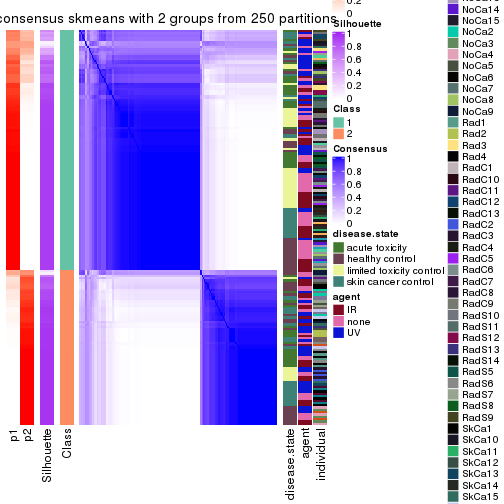</p>

</div>
<div id='tab-SD-skmeans-consensus-heatmap-2'>
<pre><code class="r">consensus_heatmap(res, k = 3)
</code></pre>

<p>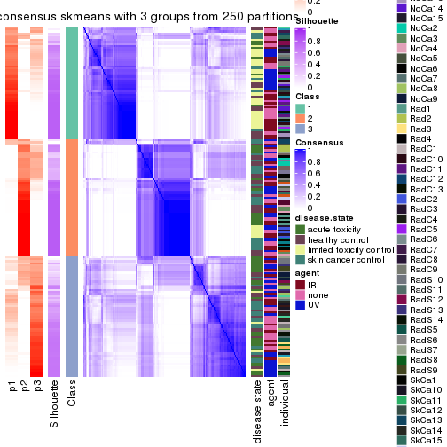</p>

</div>
<div id='tab-SD-skmeans-consensus-heatmap-3'>
<pre><code class="r">consensus_heatmap(res, k = 4)
</code></pre>

<p>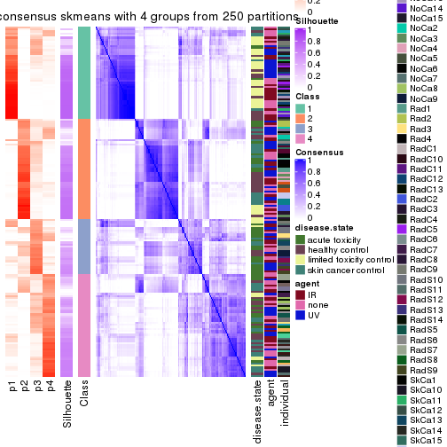</p>

</div>
<div id='tab-SD-skmeans-consensus-heatmap-4'>
<pre><code class="r">consensus_heatmap(res, k = 5)
</code></pre>

<p>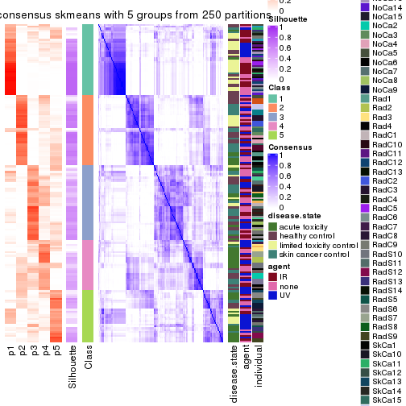</p>

</div>
<div id='tab-SD-skmeans-consensus-heatmap-5'>
<pre><code class="r">consensus_heatmap(res, k = 6)
</code></pre>

<p>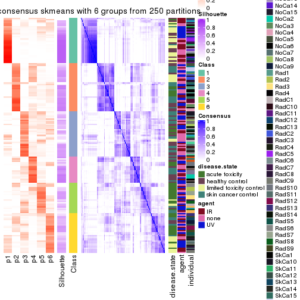</p>

</div>
</div>

Heatmaps for the membership of samples in all partitions to see how consistent they are:


<script>
$( function() {
	$( '#tabs-SD-skmeans-membership-heatmap' ).tabs();
} );
</script>
<div id='tabs-SD-skmeans-membership-heatmap'>
<ul>
<li><a href='#tab-SD-skmeans-membership-heatmap-1'>k = 2</a></li>
<li><a href='#tab-SD-skmeans-membership-heatmap-2'>k = 3</a></li>
<li><a href='#tab-SD-skmeans-membership-heatmap-3'>k = 4</a></li>
<li><a href='#tab-SD-skmeans-membership-heatmap-4'>k = 5</a></li>
<li><a href='#tab-SD-skmeans-membership-heatmap-5'>k = 6</a></li>
</ul>
<div id='tab-SD-skmeans-membership-heatmap-1'>
<pre><code class="r">membership_heatmap(res, k = 2)
</code></pre>

<p>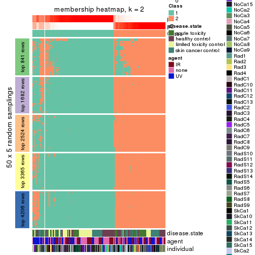</p>

</div>
<div id='tab-SD-skmeans-membership-heatmap-2'>
<pre><code class="r">membership_heatmap(res, k = 3)
</code></pre>

<p>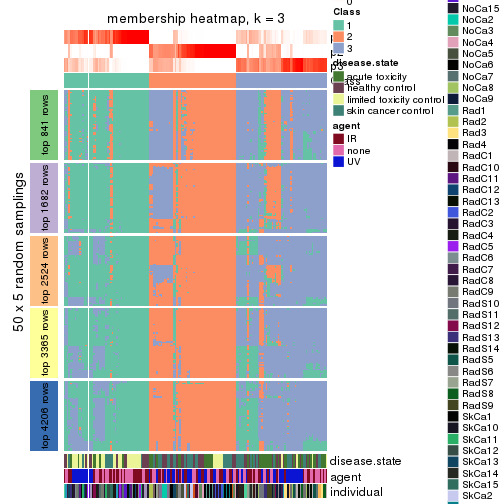</p>

</div>
<div id='tab-SD-skmeans-membership-heatmap-3'>
<pre><code class="r">membership_heatmap(res, k = 4)
</code></pre>

<p>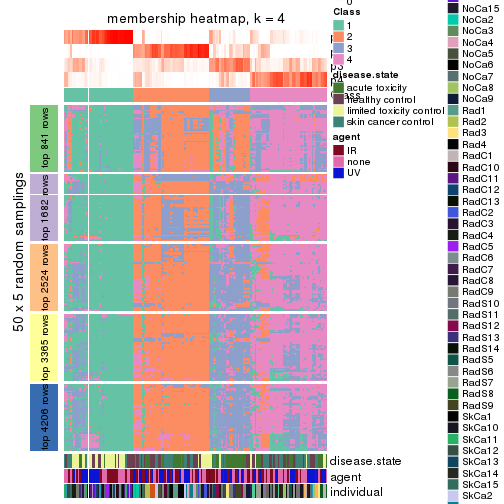</p>

</div>
<div id='tab-SD-skmeans-membership-heatmap-4'>
<pre><code class="r">membership_heatmap(res, k = 5)
</code></pre>

<p>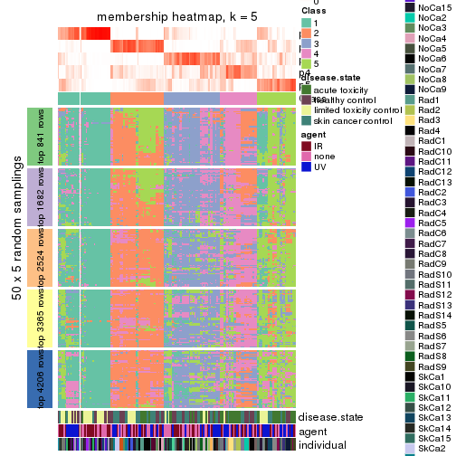</p>

</div>
<div id='tab-SD-skmeans-membership-heatmap-5'>
<pre><code class="r">membership_heatmap(res, k = 6)
</code></pre>

<p>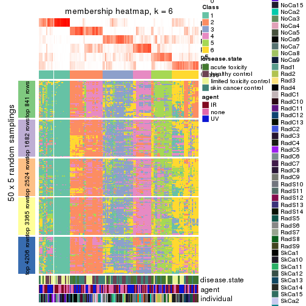</p>

</div>
</div>

As soon as we have had the classes for columns, we can look for signatures
which are significantly different between classes which can be candidate marks
for certain classes. Following are the heatmaps for signatures.


Signature heatmaps where rows are scaled:


<script>
$( function() {
	$( '#tabs-SD-skmeans-get-signatures' ).tabs();
} );
</script>
<div id='tabs-SD-skmeans-get-signatures'>
<ul>
<li><a href='#tab-SD-skmeans-get-signatures-1'>k = 2</a></li>
<li><a href='#tab-SD-skmeans-get-signatures-2'>k = 3</a></li>
<li><a href='#tab-SD-skmeans-get-signatures-3'>k = 4</a></li>
<li><a href='#tab-SD-skmeans-get-signatures-4'>k = 5</a></li>
<li><a href='#tab-SD-skmeans-get-signatures-5'>k = 6</a></li>
</ul>
<div id='tab-SD-skmeans-get-signatures-1'>
<pre><code class="r">get_signatures(res, k = 2)
</code></pre>

<p>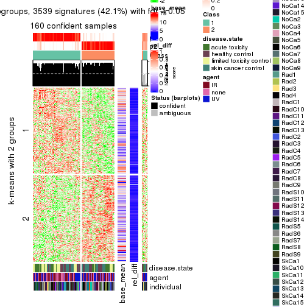</p>

</div>
<div id='tab-SD-skmeans-get-signatures-2'>
<pre><code class="r">get_signatures(res, k = 3)
</code></pre>

<p>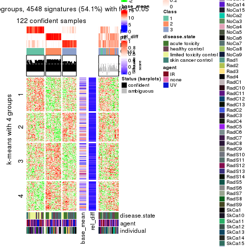</p>

</div>
<div id='tab-SD-skmeans-get-signatures-3'>
<pre><code class="r">get_signatures(res, k = 4)
</code></pre>

<p>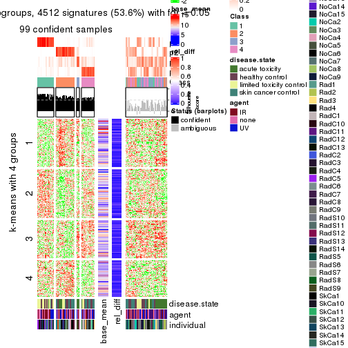</p>

</div>
<div id='tab-SD-skmeans-get-signatures-4'>
<pre><code class="r">get_signatures(res, k = 5)
</code></pre>

<p>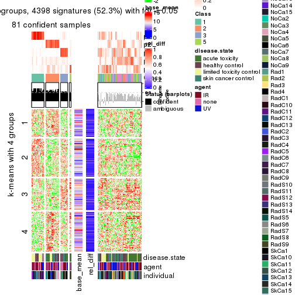</p>

</div>
<div id='tab-SD-skmeans-get-signatures-5'>
<pre><code class="r">get_signatures(res, k = 6)
</code></pre>

<p>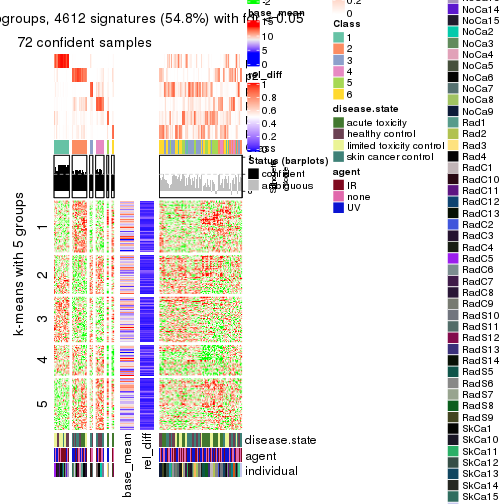</p>

</div>
</div>


Signature heatmaps where rows are not scaled:


<script>
$( function() {
	$( '#tabs-SD-skmeans-get-signatures-no-scale' ).tabs();
} );
</script>
<div id='tabs-SD-skmeans-get-signatures-no-scale'>
<ul>
<li><a href='#tab-SD-skmeans-get-signatures-no-scale-1'>k = 2</a></li>
<li><a href='#tab-SD-skmeans-get-signatures-no-scale-2'>k = 3</a></li>
<li><a href='#tab-SD-skmeans-get-signatures-no-scale-3'>k = 4</a></li>
<li><a href='#tab-SD-skmeans-get-signatures-no-scale-4'>k = 5</a></li>
<li><a href='#tab-SD-skmeans-get-signatures-no-scale-5'>k = 6</a></li>
</ul>
<div id='tab-SD-skmeans-get-signatures-no-scale-1'>
<pre><code class="r">get_signatures(res, k = 2, scale_rows = FALSE)
</code></pre>

<p>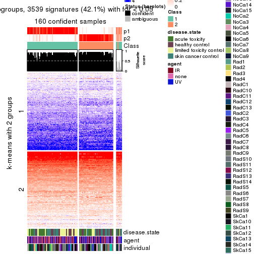</p>

</div>
<div id='tab-SD-skmeans-get-signatures-no-scale-2'>
<pre><code class="r">get_signatures(res, k = 3, scale_rows = FALSE)
</code></pre>

<p>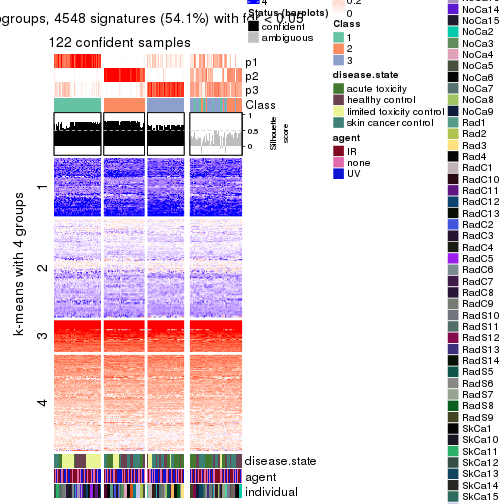</p>

</div>
<div id='tab-SD-skmeans-get-signatures-no-scale-3'>
<pre><code class="r">get_signatures(res, k = 4, scale_rows = FALSE)
</code></pre>

<p>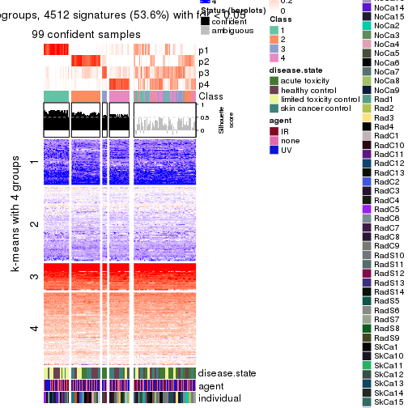</p>

</div>
<div id='tab-SD-skmeans-get-signatures-no-scale-4'>
<pre><code class="r">get_signatures(res, k = 5, scale_rows = FALSE)
</code></pre>

<p>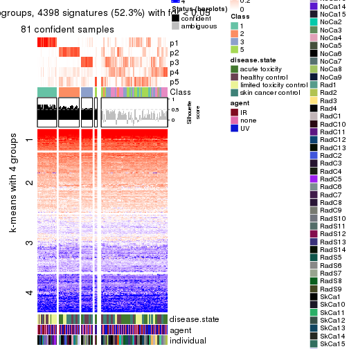</p>

</div>
<div id='tab-SD-skmeans-get-signatures-no-scale-5'>
<pre><code class="r">get_signatures(res, k = 6, scale_rows = FALSE)
</code></pre>

<p>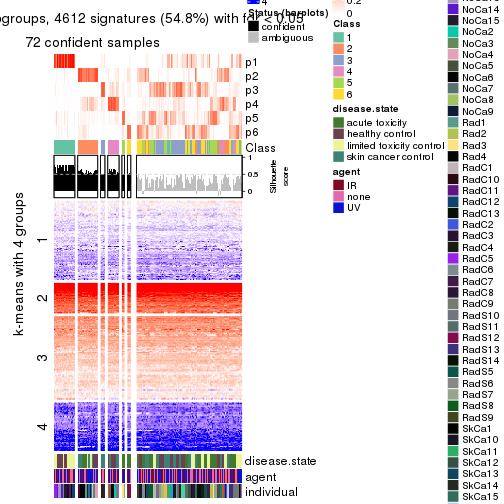</p>

</div>
</div>


Compare the overlap of signatures from different k:

```r
compare_signatures(res)
```

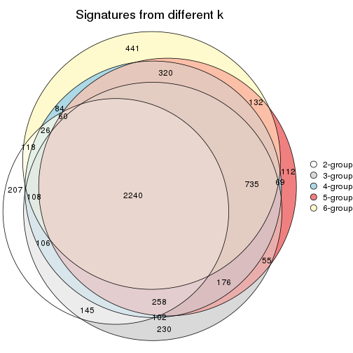

`get_signature()` returns a data frame invisibly. TO get the list of signatures, the function
call should be assigned to a variable explicitly. In following code, if `plot` argument is set
to `FALSE`, no heatmap is plotted while only the differential analysis is performed.

```r
# code only for demonstration
tb = get_signature(res, k = ..., plot = FALSE)
```

An example of the output of `tb` is:

```
#>   which_row         fdr    mean_1    mean_2 scaled_mean_1 scaled_mean_2 km
#> 1        38 0.042760348  8.373488  9.131774    -0.5533452     0.5164555  1
#> 2        40 0.018707592  7.106213  8.469186    -0.6173731     0.5762149  1
#> 3        55 0.019134737 10.221463 11.207825    -0.6159697     0.5749050  1
#> 4        59 0.006059896  5.921854  7.869574    -0.6899429     0.6439467  1
#> 5        60 0.018055526  8.928898 10.211722    -0.6204761     0.5791110  1
#> 6        98 0.009384629 15.714769 14.887706     0.6635654    -0.6193277  2
...
```

The columns in `tb` are:

1. `which_row`: row indices corresponding to the input matrix.
2. `fdr`: FDR for the differential test. 
3. `mean_x`: The mean value in group x.
4. `scaled_mean_x`: The mean value in group x after rows are scaled.
5. `km`: Row groups if k-means clustering is applied to rows.


UMAP plot which shows how samples are separated.


<script>
$( function() {
	$( '#tabs-SD-skmeans-dimension-reduction' ).tabs();
} );
</script>
<div id='tabs-SD-skmeans-dimension-reduction'>
<ul>
<li><a href='#tab-SD-skmeans-dimension-reduction-1'>k = 2</a></li>
<li><a href='#tab-SD-skmeans-dimension-reduction-2'>k = 3</a></li>
<li><a href='#tab-SD-skmeans-dimension-reduction-3'>k = 4</a></li>
<li><a href='#tab-SD-skmeans-dimension-reduction-4'>k = 5</a></li>
<li><a href='#tab-SD-skmeans-dimension-reduction-5'>k = 6</a></li>
</ul>
<div id='tab-SD-skmeans-dimension-reduction-1'>
<pre><code class="r">dimension_reduction(res, k = 2, method = &quot;UMAP&quot;)
</code></pre>

<p>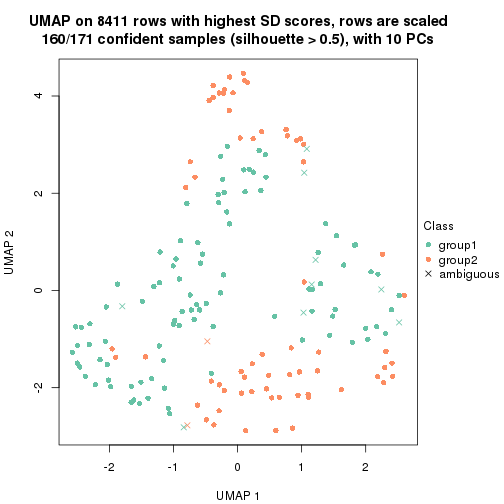</p>

</div>
<div id='tab-SD-skmeans-dimension-reduction-2'>
<pre><code class="r">dimension_reduction(res, k = 3, method = &quot;UMAP&quot;)
</code></pre>

<p>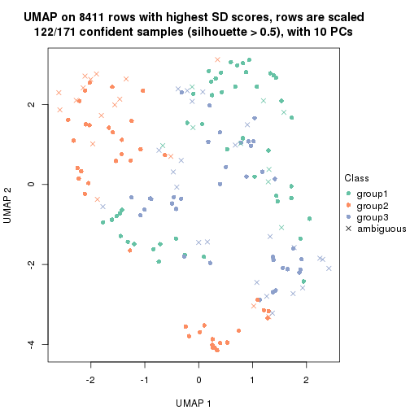</p>

</div>
<div id='tab-SD-skmeans-dimension-reduction-3'>
<pre><code class="r">dimension_reduction(res, k = 4, method = &quot;UMAP&quot;)
</code></pre>

<p>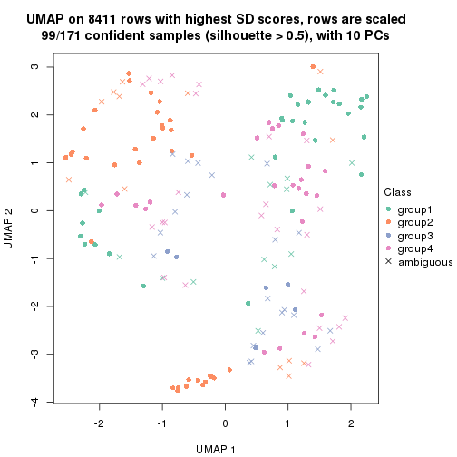</p>

</div>
<div id='tab-SD-skmeans-dimension-reduction-4'>
<pre><code class="r">dimension_reduction(res, k = 5, method = &quot;UMAP&quot;)
</code></pre>

<p>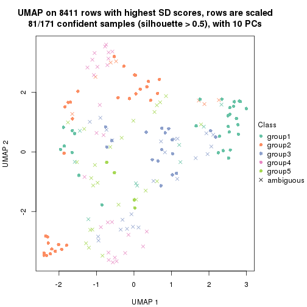</p>

</div>
<div id='tab-SD-skmeans-dimension-reduction-5'>
<pre><code class="r">dimension_reduction(res, k = 6, method = &quot;UMAP&quot;)
</code></pre>

<p>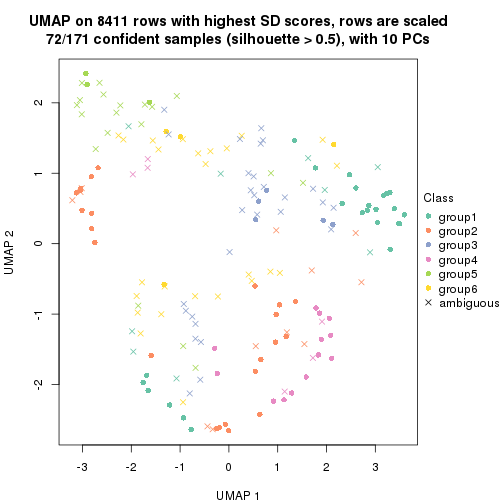</p>

</div>
</div>


Following heatmap shows how subgroups are split when increasing `k`:

```r
collect_classes(res)
```

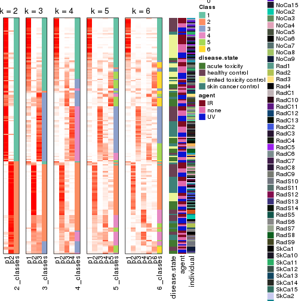


Test correlation between subgroups and known annotations. If the known
annotation is numeric, one-way ANOVA test is applied, and if the known
annotation is discrete, chi-squared contingency table test is applied.

```r
test_to_known_factors(res)
```

```
#>              n disease.state(p) agent(p) individual(p) k
#> SD:skmeans 160         1.45e-02    0.318      7.38e-11 2
#> SD:skmeans 122         1.76e-05    0.711      7.07e-15 3
#> SD:skmeans  99         3.80e-10    0.868      1.27e-17 4
#> SD:skmeans  81         1.09e-07    0.814      4.12e-14 5
#> SD:skmeans  72         1.35e-09    0.585      1.95e-17 6
```


If matrix rows can be associated to genes, consider to use `functional_enrichment(res,
...)` to perform function enrichment for the signature genes. See [this vignette](http://bioconductor.org/packages/devel/bioc/vignettes/cola/inst/doc/functional_enrichment.html) for more detailed explanations.


 

---------------------------------------------------


### SD:pam


The object with results only for a single top-value method and a single partition method 
can be extracted as:

```r
res = res_list["SD", "pam"]
# you can also extract it by
# res = res_list["SD:pam"]
```

A summary of `res` and all the functions that can be applied to it:

```r
res
```

```
#> A 'ConsensusPartition' object with k = 2, 3, 4, 5, 6.
#>   On a matrix with 8411 rows and 171 columns.
#>   Top rows (841, 1682, 2524, 3365, 4206) are extracted by 'SD' method.
#>   Subgroups are detected by 'pam' method.
#>   Performed in total 1250 partitions by row resampling.
#>   Best k for subgroups seems to be 2.
#> 
#> Following methods can be applied to this 'ConsensusPartition' object:
#>  [1] "cola_report"             "collect_classes"         "collect_plots"          
#>  [4] "collect_stats"           "colnames"                "compare_signatures"     
#>  [7] "consensus_heatmap"       "dimension_reduction"     "functional_enrichment"  
#> [10] "get_anno_col"            "get_anno"                "get_classes"            
#> [13] "get_consensus"           "get_matrix"              "get_membership"         
#> [16] "get_param"               "get_signatures"          "get_stats"              
#> [19] "is_best_k"               "is_stable_k"             "membership_heatmap"     
#> [22] "ncol"                    "nrow"                    "plot_ecdf"              
#> [25] "rownames"                "select_partition_number" "show"                   
#> [28] "suggest_best_k"          "test_to_known_factors"
```

`collect_plots()` function collects all the plots made from `res` for all `k` (number of partitions)
into one single page to provide an easy and fast comparison between different `k`.

```r
collect_plots(res)
```

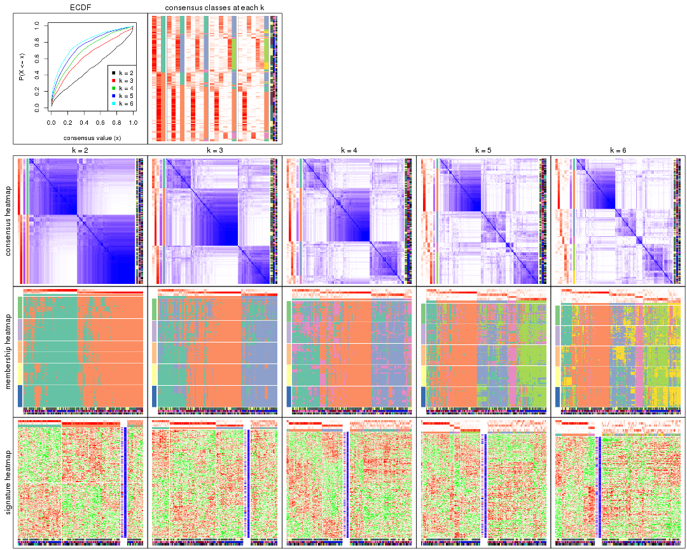

The plots are:

- The first row: a plot of the ECDF (empirical cumulative distribution
  function) curves of the consensus matrix for each `k` and the heatmap of
  predicted classes for each `k`.
- The second row: heatmaps of the consensus matrix for each `k`.
- The third row: heatmaps of the membership matrix for each `k`.
- The fouth row: heatmaps of the signatures for each `k`.

All the plots in panels can be made by individual functions and they are
plotted later in this section.

`select_partition_number()` produces several plots showing different
statistics for choosing "optimized" `k`. There are following statistics:

- ECDF curves of the consensus matrix for each `k`;
- 1-PAC. [The PAC
  score](https://en.wikipedia.org/wiki/Consensus_clustering#Over-interpretation_potential_of_consensus_clustering)
  measures the proportion of the ambiguous subgrouping.
- Mean silhouette score.
- Concordance. The mean probability of fiting the consensus class ids in all
  partitions.
- Area increased. Denote $A_k$ as the area under the ECDF curve for current
  `k`, the area increased is defined as $A_k - A_{k-1}$.
- Rand index. The percent of pairs of samples that are both in a same cluster
  or both are not in a same cluster in the partition of k and k-1.
- Jaccard index. The ratio of pairs of samples are both in a same cluster in
  the partition of k and k-1 and the pairs of samples are both in a same
  cluster in the partition k or k-1.

The detailed explanations of these statistics can be found in [the _cola_
vignette](http://bioconductor.org/packages/devel/bioc/vignettes/cola/inst/doc/cola.html#toc_13).

Generally speaking, lower PAC score, higher mean silhouette score or higher
concordance corresponds to better partition. Rand index and Jaccard index
measure how similar the current partition is compared to partition with `k-1`.
If they are too similar, we won't accept `k` is better than `k-1`.

```r
select_partition_number(res)
```

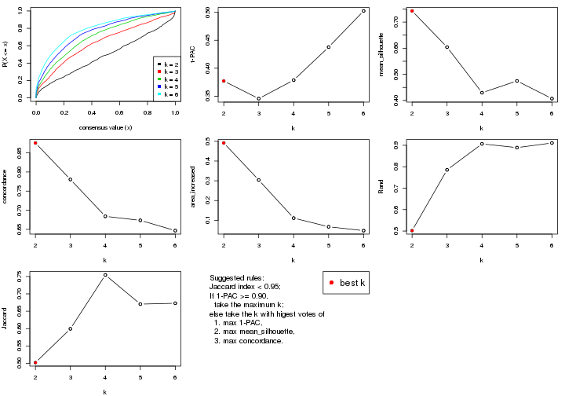

The numeric values for all these statistics can be obtained by `get_stats()`.

```r
get_stats(res)
```

```
#>   k 1-PAC mean_silhouette concordance area_increased  Rand Jaccard
#> 2 2 0.377           0.742       0.876         0.4915 0.502   0.502
#> 3 3 0.346           0.604       0.780         0.3039 0.785   0.599
#> 4 4 0.379           0.430       0.684         0.1110 0.907   0.754
#> 5 5 0.438           0.475       0.674         0.0672 0.889   0.670
#> 6 6 0.502           0.407       0.647         0.0477 0.911   0.673
```

`suggest_best_k()` suggests the best $k$ based on these statistics. The rules are as follows:

- All $k$ with Jaccard index larger than 0.95 are removed because increasing
  $k$ does not provide enough extra information. If all $k$ are removed, it is
  marked as no subgroup is detected.
- For all $k$ with 1-PAC score larger than 0.9, the maximal $k$ is taken as
  the best $k$, and other $k$ are marked as optional $k$.
- If it does not fit the second rule. The $k$ with the maximal vote of the
  highest 1-PAC score, highest mean silhouette, and highest concordance is
  taken as the best $k$.

```r
suggest_best_k(res)
```

```
#> [1] 2
```


Following shows the table of the partitions (You need to click the **show/hide
code output** link to see it). The membership matrix (columns with name `p*`)
is inferred by
[`clue::cl_consensus()`](https://www.rdocumentation.org/link/cl_consensus?package=clue)
function with the `SE` method. Basically the value in the membership matrix
represents the probability to belong to a certain group. The finall class
label for an item is determined with the group with highest probability it
belongs to.

In `get_classes()` function, the entropy is calculated from the membership
matrix and the silhouette score is calculated from the consensus matrix.


<script>
$( function() {
	$( '#tabs-SD-pam-get-classes' ).tabs();
} );
</script>
<div id='tabs-SD-pam-get-classes'>
<ul>
<li><a href='#tab-SD-pam-get-classes-1'>k = 2</a></li>
<li><a href='#tab-SD-pam-get-classes-2'>k = 3</a></li>
<li><a href='#tab-SD-pam-get-classes-3'>k = 4</a></li>
<li><a href='#tab-SD-pam-get-classes-4'>k = 5</a></li>
<li><a href='#tab-SD-pam-get-classes-5'>k = 6</a></li>
</ul>

<div id='tab-SD-pam-get-classes-1'>
<p><a id='tab-SD-pam-get-classes-1-a' style='color:#0366d6' href='#'>show/hide code output</a></p>
<pre><code class="r">cbind(get_classes(res, k = 2), get_membership(res, k = 2))
</code></pre>

<pre><code>#&gt;          class entropy silhouette    p1    p2
#&gt; GSM29783     2  0.0000     0.8735 0.000 1.000
#&gt; GSM29786     2  0.9087     0.4765 0.324 0.676
#&gt; GSM29789     2  0.0000     0.8735 0.000 1.000
#&gt; GSM29792     2  0.0000     0.8735 0.000 1.000
#&gt; GSM29795     2  0.2236     0.8633 0.036 0.964
#&gt; GSM29798     2  0.4161     0.8453 0.084 0.916
#&gt; GSM29801     2  0.5178     0.8260 0.116 0.884
#&gt; GSM29804     2  0.9795     0.2470 0.416 0.584
#&gt; GSM29807     2  0.8443     0.5617 0.272 0.728
#&gt; GSM29816     1  0.2423     0.8273 0.960 0.040
#&gt; GSM29821     2  0.9580     0.4150 0.380 0.620
#&gt; GSM29824     1  0.6438     0.7610 0.836 0.164
#&gt; GSM29827     2  0.5178     0.8147 0.116 0.884
#&gt; GSM29830     2  0.5294     0.8206 0.120 0.880
#&gt; GSM29833     2  0.0000     0.8735 0.000 1.000
#&gt; GSM29784     2  0.0376     0.8736 0.004 0.996
#&gt; GSM29787     2  0.8267     0.6676 0.260 0.740
#&gt; GSM29790     2  0.0000     0.8735 0.000 1.000
#&gt; GSM29793     2  0.0000     0.8735 0.000 1.000
#&gt; GSM29796     2  0.0000     0.8735 0.000 1.000
#&gt; GSM29799     2  0.0000     0.8735 0.000 1.000
#&gt; GSM29802     1  0.9170     0.5705 0.668 0.332
#&gt; GSM29805     1  0.9661     0.4156 0.608 0.392
#&gt; GSM29814     2  0.8661     0.5318 0.288 0.712
#&gt; GSM29817     1  0.9922     0.2655 0.552 0.448
#&gt; GSM29822     1  0.7139     0.7455 0.804 0.196
#&gt; GSM29825     1  0.4562     0.8136 0.904 0.096
#&gt; GSM29828     2  0.7883     0.6857 0.236 0.764
#&gt; GSM29831     2  0.7528     0.6959 0.216 0.784
#&gt; GSM29834     2  0.0000     0.8735 0.000 1.000
#&gt; GSM29785     2  0.3733     0.8512 0.072 0.928
#&gt; GSM29788     1  0.9129     0.5387 0.672 0.328
#&gt; GSM29791     2  0.0000     0.8735 0.000 1.000
#&gt; GSM29794     2  0.0376     0.8735 0.004 0.996
#&gt; GSM29797     2  0.4431     0.8435 0.092 0.908
#&gt; GSM29800     1  0.9608     0.4542 0.616 0.384
#&gt; GSM29803     1  0.0938     0.8292 0.988 0.012
#&gt; GSM29806     1  0.1414     0.8304 0.980 0.020
#&gt; GSM29815     1  0.9710     0.4560 0.600 0.400
#&gt; GSM29819     1  0.0672     0.8278 0.992 0.008
#&gt; GSM29823     1  0.0938     0.8288 0.988 0.012
#&gt; GSM29826     1  0.0376     0.8272 0.996 0.004
#&gt; GSM29829     1  0.2423     0.8280 0.960 0.040
#&gt; GSM29832     1  0.3584     0.8244 0.932 0.068
#&gt; GSM29835     1  0.8443     0.6179 0.728 0.272
#&gt; GSM29836     2  0.0672     0.8733 0.008 0.992
#&gt; GSM29839     2  0.0000     0.8735 0.000 1.000
#&gt; GSM29842     2  0.0000     0.8735 0.000 1.000
#&gt; GSM29845     2  0.0000     0.8735 0.000 1.000
#&gt; GSM29848     2  0.4431     0.8356 0.092 0.908
#&gt; GSM29851     2  0.3879     0.8511 0.076 0.924
#&gt; GSM29854     1  0.1843     0.8308 0.972 0.028
#&gt; GSM29857     1  0.6887     0.7725 0.816 0.184
#&gt; GSM29860     2  0.0376     0.8735 0.004 0.996
#&gt; GSM29863     1  0.0376     0.8272 0.996 0.004
#&gt; GSM29866     2  0.0000     0.8735 0.000 1.000
#&gt; GSM29869     2  0.0376     0.8730 0.004 0.996
#&gt; GSM29872     2  0.0376     0.8732 0.004 0.996
#&gt; GSM29875     2  0.7299     0.7486 0.204 0.796
#&gt; GSM29878     2  0.0000     0.8735 0.000 1.000
#&gt; GSM29837     2  0.0000     0.8735 0.000 1.000
#&gt; GSM29840     2  0.0000     0.8735 0.000 1.000
#&gt; GSM29843     2  0.0000     0.8735 0.000 1.000
#&gt; GSM29846     2  0.0000     0.8735 0.000 1.000
#&gt; GSM29849     2  0.4161     0.8405 0.084 0.916
#&gt; GSM29852     1  0.9580     0.4571 0.620 0.380
#&gt; GSM29855     1  0.0000     0.8255 1.000 0.000
#&gt; GSM29858     1  0.8327     0.6915 0.736 0.264
#&gt; GSM29861     2  0.1414     0.8721 0.020 0.980
#&gt; GSM29864     1  0.2423     0.8256 0.960 0.040
#&gt; GSM29867     2  0.7376     0.6914 0.208 0.792
#&gt; GSM29870     2  0.1414     0.8713 0.020 0.980
#&gt; GSM29873     2  0.2948     0.8580 0.052 0.948
#&gt; GSM29876     2  0.7602     0.7200 0.220 0.780
#&gt; GSM29879     2  0.0376     0.8730 0.004 0.996
#&gt; GSM29838     2  0.4690     0.8304 0.100 0.900
#&gt; GSM29841     1  0.9922     0.3153 0.552 0.448
#&gt; GSM29844     2  0.0000     0.8735 0.000 1.000
#&gt; GSM29847     2  0.2603     0.8658 0.044 0.956
#&gt; GSM29850     2  0.4431     0.8361 0.092 0.908
#&gt; GSM29853     1  0.1633     0.8296 0.976 0.024
#&gt; GSM29856     1  0.0376     0.8272 0.996 0.004
#&gt; GSM29859     1  0.2948     0.8235 0.948 0.052
#&gt; GSM29862     1  0.9922     0.2709 0.552 0.448
#&gt; GSM29865     1  0.0000     0.8255 1.000 0.000
#&gt; GSM29868     1  0.2043     0.8293 0.968 0.032
#&gt; GSM29871     1  0.5178     0.8068 0.884 0.116
#&gt; GSM29874     1  0.9970     0.2365 0.532 0.468
#&gt; GSM29877     1  0.8327     0.6812 0.736 0.264
#&gt; GSM29880     2  0.6343     0.7846 0.160 0.840
#&gt; GSM29881     2  0.6623     0.7828 0.172 0.828
#&gt; GSM29884     2  0.0000     0.8735 0.000 1.000
#&gt; GSM29887     2  0.0000     0.8735 0.000 1.000
#&gt; GSM29890     1  0.9580     0.4223 0.620 0.380
#&gt; GSM29893     1  0.8144     0.6852 0.748 0.252
#&gt; GSM29896     2  0.5178     0.8274 0.116 0.884
#&gt; GSM29899     1  0.8016     0.7021 0.756 0.244
#&gt; GSM29902     2  0.8499     0.6020 0.276 0.724
#&gt; GSM29905     2  0.9710     0.2175 0.400 0.600
#&gt; GSM29908     2  0.0376     0.8735 0.004 0.996
#&gt; GSM29955     2  0.3431     0.8553 0.064 0.936
#&gt; GSM29958     2  0.1633     0.8679 0.024 0.976
#&gt; GSM29961     2  0.5946     0.8047 0.144 0.856
#&gt; GSM29882     1  0.7299     0.7287 0.796 0.204
#&gt; GSM29885     2  0.0000     0.8735 0.000 1.000
#&gt; GSM29888     2  0.0000     0.8735 0.000 1.000
#&gt; GSM29891     1  0.5737     0.7984 0.864 0.136
#&gt; GSM29894     1  0.0000     0.8255 1.000 0.000
#&gt; GSM29897     1  0.9044     0.5898 0.680 0.320
#&gt; GSM29900     1  0.5629     0.7929 0.868 0.132
#&gt; GSM29903     2  0.8813     0.5883 0.300 0.700
#&gt; GSM29906     2  0.9286     0.4215 0.344 0.656
#&gt; GSM29909     2  0.5294     0.7992 0.120 0.880
#&gt; GSM29956     2  0.8081     0.6568 0.248 0.752
#&gt; GSM29959     2  0.3584     0.8564 0.068 0.932
#&gt; GSM29962     2  0.1843     0.8663 0.028 0.972
#&gt; GSM29883     1  0.1184     0.8291 0.984 0.016
#&gt; GSM29886     2  0.0672     0.8735 0.008 0.992
#&gt; GSM29889     2  0.0000     0.8735 0.000 1.000
#&gt; GSM29892     1  0.5629     0.7980 0.868 0.132
#&gt; GSM29895     1  0.0376     0.8263 0.996 0.004
#&gt; GSM29898     1  0.0376     0.8272 0.996 0.004
#&gt; GSM29901     1  0.1184     0.8296 0.984 0.016
#&gt; GSM29904     1  0.1414     0.8303 0.980 0.020
#&gt; GSM29907     1  0.2236     0.8308 0.964 0.036
#&gt; GSM29910     1  0.0672     0.8282 0.992 0.008
#&gt; GSM29957     1  0.7299     0.7541 0.796 0.204
#&gt; GSM29960     1  0.1184     0.8302 0.984 0.016
#&gt; GSM29963     1  0.1414     0.8302 0.980 0.020
#&gt; GSM29964     2  0.0000     0.8735 0.000 1.000
#&gt; GSM29967     2  0.3114     0.8564 0.056 0.944
#&gt; GSM29970     1  0.9044     0.5951 0.680 0.320
#&gt; GSM29973     2  0.0000     0.8735 0.000 1.000
#&gt; GSM29976     1  0.9491     0.4672 0.632 0.368
#&gt; GSM29979     2  0.5408     0.8193 0.124 0.876
#&gt; GSM29982     1  0.9896     0.2621 0.560 0.440
#&gt; GSM29985     1  0.0000     0.8255 1.000 0.000
#&gt; GSM29988     2  0.1633     0.8714 0.024 0.976
#&gt; GSM29991     2  0.7299     0.7092 0.204 0.796
#&gt; GSM29994     2  0.9635     0.2709 0.388 0.612
#&gt; GSM29997     1  0.8861     0.6523 0.696 0.304
#&gt; GSM30000     2  0.1843     0.8678 0.028 0.972
#&gt; GSM30003     1  0.9815     0.3945 0.580 0.420
#&gt; GSM29965     2  0.0376     0.8730 0.004 0.996
#&gt; GSM29968     2  0.4431     0.8434 0.092 0.908
#&gt; GSM29971     1  0.0672     0.8282 0.992 0.008
#&gt; GSM29974     2  0.0672     0.8732 0.008 0.992
#&gt; GSM29977     1  0.0938     0.8291 0.988 0.012
#&gt; GSM29980     2  0.9970    -0.0485 0.468 0.532
#&gt; GSM29983     1  0.6343     0.7642 0.840 0.160
#&gt; GSM29986     1  0.3431     0.8194 0.936 0.064
#&gt; GSM29989     2  0.7950     0.6571 0.240 0.760
#&gt; GSM29992     2  0.0000     0.8735 0.000 1.000
#&gt; GSM29995     2  0.5946     0.7987 0.144 0.856
#&gt; GSM29998     1  0.9944     0.3051 0.544 0.456
#&gt; GSM30001     2  0.9580     0.3081 0.380 0.620
#&gt; GSM30004     1  0.7453     0.7384 0.788 0.212
#&gt; GSM29966     2  0.0376     0.8730 0.004 0.996
#&gt; GSM29969     1  0.9970     0.1253 0.532 0.468
#&gt; GSM29972     1  0.0000     0.8255 1.000 0.000
#&gt; GSM29975     2  0.7674     0.6542 0.224 0.776
#&gt; GSM29978     1  0.0000     0.8255 1.000 0.000
#&gt; GSM29981     1  0.2603     0.8286 0.956 0.044
#&gt; GSM29984     1  0.0000     0.8255 1.000 0.000
#&gt; GSM29987     1  0.0000     0.8255 1.000 0.000
#&gt; GSM29990     1  0.4022     0.8221 0.920 0.080
#&gt; GSM29993     2  0.9795     0.1679 0.416 0.584
#&gt; GSM29996     1  0.0938     0.8292 0.988 0.012
#&gt; GSM29999     1  0.3584     0.8240 0.932 0.068
#&gt; GSM30002     1  0.4298     0.8147 0.912 0.088
#&gt; GSM30005     1  0.2423     0.8285 0.960 0.040
</code></pre>

<script>
$('#tab-SD-pam-get-classes-1-a').parent().next().next().hide();
$('#tab-SD-pam-get-classes-1-a').click(function(){
  $('#tab-SD-pam-get-classes-1-a').parent().next().next().toggle();
  return(false);
});
</script>
</div>

<div id='tab-SD-pam-get-classes-2'>
<p><a id='tab-SD-pam-get-classes-2-a' style='color:#0366d6' href='#'>show/hide code output</a></p>
<pre><code class="r">cbind(get_classes(res, k = 3), get_membership(res, k = 3))
</code></pre>

<pre><code>#&gt;          class entropy silhouette    p1    p2    p3
#&gt; GSM29783     2  0.0000     0.8302 0.000 1.000 0.000
#&gt; GSM29786     2  0.5845     0.5148 0.004 0.688 0.308
#&gt; GSM29789     2  0.0000     0.8302 0.000 1.000 0.000
#&gt; GSM29792     2  0.0237     0.8303 0.004 0.996 0.000
#&gt; GSM29795     2  0.2680     0.8028 0.068 0.924 0.008
#&gt; GSM29798     2  0.3425     0.7871 0.004 0.884 0.112
#&gt; GSM29801     2  0.6546     0.6770 0.096 0.756 0.148
#&gt; GSM29804     1  0.9868     0.3173 0.384 0.360 0.256
#&gt; GSM29807     1  0.9229     0.5122 0.496 0.336 0.168
#&gt; GSM29816     1  0.5619     0.5463 0.744 0.012 0.244
#&gt; GSM29821     2  0.8322     0.4588 0.120 0.604 0.276
#&gt; GSM29824     3  0.8101     0.5534 0.228 0.132 0.640
#&gt; GSM29827     2  0.7126     0.6258 0.164 0.720 0.116
#&gt; GSM29830     2  0.7944     0.5592 0.196 0.660 0.144
#&gt; GSM29833     2  0.1529     0.8198 0.040 0.960 0.000
#&gt; GSM29784     2  0.0237     0.8303 0.000 0.996 0.004
#&gt; GSM29787     2  0.6875     0.6427 0.080 0.724 0.196
#&gt; GSM29790     2  0.0424     0.8297 0.008 0.992 0.000
#&gt; GSM29793     2  0.0000     0.8302 0.000 1.000 0.000
#&gt; GSM29796     2  0.0000     0.8302 0.000 1.000 0.000
#&gt; GSM29799     2  0.0000     0.8302 0.000 1.000 0.000
#&gt; GSM29802     1  0.8921     0.5473 0.516 0.136 0.348
#&gt; GSM29805     1  0.9017     0.4392 0.516 0.148 0.336
#&gt; GSM29814     1  0.8334     0.5923 0.616 0.248 0.136
#&gt; GSM29817     1  0.9319     0.5347 0.484 0.176 0.340
#&gt; GSM29822     1  0.6825     0.2839 0.500 0.012 0.488
#&gt; GSM29825     1  0.6168     0.5309 0.740 0.036 0.224
#&gt; GSM29828     2  0.9059    -0.1334 0.408 0.456 0.136
#&gt; GSM29831     1  0.7339     0.4348 0.572 0.392 0.036
#&gt; GSM29834     2  0.2165     0.8140 0.064 0.936 0.000
#&gt; GSM29785     2  0.2165     0.8135 0.000 0.936 0.064
#&gt; GSM29788     3  0.4784     0.5625 0.004 0.200 0.796
#&gt; GSM29791     2  0.0000     0.8302 0.000 1.000 0.000
#&gt; GSM29794     2  0.0983     0.8297 0.016 0.980 0.004
#&gt; GSM29797     2  0.4165     0.7875 0.076 0.876 0.048
#&gt; GSM29800     3  0.5335     0.5354 0.008 0.232 0.760
#&gt; GSM29803     3  0.1289     0.7094 0.032 0.000 0.968
#&gt; GSM29806     3  0.1751     0.7265 0.028 0.012 0.960
#&gt; GSM29815     3  0.9822    -0.1563 0.280 0.292 0.428
#&gt; GSM29819     3  0.0983     0.7199 0.016 0.004 0.980
#&gt; GSM29823     3  0.1525     0.7098 0.032 0.004 0.964
#&gt; GSM29826     3  0.3784     0.7198 0.132 0.004 0.864
#&gt; GSM29829     3  0.1399     0.7177 0.028 0.004 0.968
#&gt; GSM29832     3  0.3134     0.7267 0.052 0.032 0.916
#&gt; GSM29835     3  0.8271     0.3876 0.156 0.212 0.632
#&gt; GSM29836     2  0.0475     0.8304 0.004 0.992 0.004
#&gt; GSM29839     2  0.0000     0.8302 0.000 1.000 0.000
#&gt; GSM29842     2  0.0000     0.8302 0.000 1.000 0.000
#&gt; GSM29845     2  0.0000     0.8302 0.000 1.000 0.000
#&gt; GSM29848     2  0.4618     0.7469 0.024 0.840 0.136
#&gt; GSM29851     2  0.3886     0.7891 0.024 0.880 0.096
#&gt; GSM29854     3  0.3769     0.7212 0.104 0.016 0.880
#&gt; GSM29857     1  0.8635     0.5258 0.532 0.112 0.356
#&gt; GSM29860     2  0.0848     0.8298 0.008 0.984 0.008
#&gt; GSM29863     3  0.3454     0.7223 0.104 0.008 0.888
#&gt; GSM29866     2  0.0237     0.8301 0.004 0.996 0.000
#&gt; GSM29869     2  0.2796     0.7881 0.092 0.908 0.000
#&gt; GSM29872     2  0.1163     0.8269 0.028 0.972 0.000
#&gt; GSM29875     2  0.9355     0.0512 0.340 0.480 0.180
#&gt; GSM29878     2  0.0424     0.8297 0.008 0.992 0.000
#&gt; GSM29837     2  0.0000     0.8302 0.000 1.000 0.000
#&gt; GSM29840     2  0.0000     0.8302 0.000 1.000 0.000
#&gt; GSM29843     2  0.0000     0.8302 0.000 1.000 0.000
#&gt; GSM29846     2  0.0000     0.8302 0.000 1.000 0.000
#&gt; GSM29849     2  0.4662     0.7501 0.032 0.844 0.124
#&gt; GSM29852     1  0.8708     0.4548 0.488 0.108 0.404
#&gt; GSM29855     1  0.6045     0.4442 0.620 0.000 0.380
#&gt; GSM29858     1  0.8280     0.5488 0.564 0.092 0.344
#&gt; GSM29861     2  0.6096     0.5549 0.280 0.704 0.016
#&gt; GSM29864     3  0.6280    -0.2639 0.460 0.000 0.540
#&gt; GSM29867     1  0.8277     0.3584 0.464 0.460 0.076
#&gt; GSM29870     1  0.6420     0.6009 0.688 0.288 0.024
#&gt; GSM29873     1  0.6944     0.3151 0.516 0.468 0.016
#&gt; GSM29876     1  0.6778     0.6126 0.732 0.080 0.188
#&gt; GSM29879     2  0.1411     0.8238 0.036 0.964 0.000
#&gt; GSM29838     2  0.4411     0.7361 0.016 0.844 0.140
#&gt; GSM29841     3  0.5835     0.4187 0.000 0.340 0.660
#&gt; GSM29844     2  0.0000     0.8302 0.000 1.000 0.000
#&gt; GSM29847     2  0.1529     0.8247 0.000 0.960 0.040
#&gt; GSM29850     2  0.4799     0.7444 0.032 0.836 0.132
#&gt; GSM29853     3  0.0983     0.7128 0.016 0.004 0.980
#&gt; GSM29856     3  0.2959     0.7215 0.100 0.000 0.900
#&gt; GSM29859     1  0.6489     0.4129 0.540 0.004 0.456
#&gt; GSM29862     3  0.7961     0.2545 0.076 0.336 0.588
#&gt; GSM29865     3  0.0592     0.7122 0.012 0.000 0.988
#&gt; GSM29868     3  0.2550     0.7085 0.056 0.012 0.932
#&gt; GSM29871     1  0.7464     0.4825 0.560 0.040 0.400
#&gt; GSM29874     3  0.8714     0.1455 0.108 0.408 0.484
#&gt; GSM29877     1  0.8891     0.3420 0.448 0.120 0.432
#&gt; GSM29880     2  0.6731     0.6533 0.088 0.740 0.172
#&gt; GSM29881     2  0.6184     0.7105 0.108 0.780 0.112
#&gt; GSM29884     2  0.0000     0.8302 0.000 1.000 0.000
#&gt; GSM29887     2  0.0000     0.8302 0.000 1.000 0.000
#&gt; GSM29890     1  0.4915     0.5627 0.804 0.012 0.184
#&gt; GSM29893     3  0.7319     0.6293 0.164 0.128 0.708
#&gt; GSM29896     2  0.8310     0.3961 0.312 0.584 0.104
#&gt; GSM29899     3  0.8101     0.5510 0.228 0.132 0.640
#&gt; GSM29902     2  0.9502     0.1164 0.308 0.480 0.212
#&gt; GSM29905     2  0.9944    -0.3805 0.344 0.372 0.284
#&gt; GSM29908     2  0.4399     0.7355 0.188 0.812 0.000
#&gt; GSM29955     2  0.5848     0.6519 0.268 0.720 0.012
#&gt; GSM29958     2  0.3272     0.7939 0.104 0.892 0.004
#&gt; GSM29961     2  0.7287     0.6236 0.212 0.696 0.092
#&gt; GSM29882     1  0.5012     0.5969 0.788 0.008 0.204
#&gt; GSM29885     2  0.0000     0.8302 0.000 1.000 0.000
#&gt; GSM29888     2  0.0000     0.8302 0.000 1.000 0.000
#&gt; GSM29891     1  0.8082     0.5335 0.608 0.096 0.296
#&gt; GSM29894     3  0.5905     0.5579 0.352 0.000 0.648
#&gt; GSM29897     1  0.8243     0.1322 0.548 0.084 0.368
#&gt; GSM29900     1  0.3637     0.6164 0.892 0.024 0.084
#&gt; GSM29903     1  0.2383     0.6192 0.940 0.044 0.016
#&gt; GSM29906     1  0.6644     0.6305 0.748 0.160 0.092
#&gt; GSM29909     1  0.5058     0.6128 0.756 0.244 0.000
#&gt; GSM29956     1  0.3670     0.6110 0.888 0.092 0.020
#&gt; GSM29959     1  0.6955    -0.1524 0.496 0.488 0.016
#&gt; GSM29962     2  0.4233     0.7621 0.160 0.836 0.004
#&gt; GSM29883     3  0.2301     0.7088 0.060 0.004 0.936
#&gt; GSM29886     2  0.0237     0.8303 0.000 0.996 0.004
#&gt; GSM29889     2  0.0000     0.8302 0.000 1.000 0.000
#&gt; GSM29892     3  0.8561     0.3465 0.368 0.104 0.528
#&gt; GSM29895     3  0.3340     0.7229 0.120 0.000 0.880
#&gt; GSM29898     3  0.4178     0.7103 0.172 0.000 0.828
#&gt; GSM29901     3  0.3295     0.7251 0.096 0.008 0.896
#&gt; GSM29904     3  0.5698     0.6624 0.252 0.012 0.736
#&gt; GSM29907     3  0.2947     0.7288 0.060 0.020 0.920
#&gt; GSM29910     3  0.2448     0.7247 0.076 0.000 0.924
#&gt; GSM29957     3  0.5635     0.6283 0.036 0.180 0.784
#&gt; GSM29960     3  0.6252     0.5853 0.344 0.008 0.648
#&gt; GSM29963     3  0.3213     0.7245 0.092 0.008 0.900
#&gt; GSM29964     2  0.0000     0.8302 0.000 1.000 0.000
#&gt; GSM29967     2  0.3752     0.7823 0.096 0.884 0.020
#&gt; GSM29970     3  0.9019     0.4517 0.224 0.216 0.560
#&gt; GSM29973     2  0.0424     0.8303 0.008 0.992 0.000
#&gt; GSM29976     1  0.5708     0.5530 0.768 0.028 0.204
#&gt; GSM29979     2  0.5276     0.7465 0.128 0.820 0.052
#&gt; GSM29982     3  0.9657     0.2717 0.240 0.300 0.460
#&gt; GSM29985     3  0.6192     0.3004 0.420 0.000 0.580
#&gt; GSM29988     2  0.6548     0.4061 0.372 0.616 0.012
#&gt; GSM29991     2  0.8408     0.3474 0.272 0.600 0.128
#&gt; GSM29994     1  0.7213     0.6172 0.700 0.212 0.088
#&gt; GSM29997     1  0.9485     0.3781 0.484 0.212 0.304
#&gt; GSM30000     2  0.2176     0.8193 0.032 0.948 0.020
#&gt; GSM30003     3  0.6229     0.4240 0.008 0.340 0.652
#&gt; GSM29965     2  0.0424     0.8294 0.008 0.992 0.000
#&gt; GSM29968     2  0.4636     0.7671 0.104 0.852 0.044
#&gt; GSM29971     1  0.3918     0.5927 0.856 0.004 0.140
#&gt; GSM29974     2  0.0475     0.8299 0.004 0.992 0.004
#&gt; GSM29977     1  0.4178     0.5985 0.828 0.000 0.172
#&gt; GSM29980     2  0.9908    -0.4879 0.360 0.372 0.268
#&gt; GSM29983     3  0.6918     0.6065 0.128 0.136 0.736
#&gt; GSM29986     1  0.7069     0.3981 0.568 0.024 0.408
#&gt; GSM29989     1  0.5689     0.6303 0.780 0.184 0.036
#&gt; GSM29992     2  0.1411     0.8185 0.036 0.964 0.000
#&gt; GSM29995     1  0.3528     0.6272 0.892 0.092 0.016
#&gt; GSM29998     1  0.4062     0.6268 0.836 0.164 0.000
#&gt; GSM30001     1  0.9547     0.4749 0.416 0.392 0.192
#&gt; GSM30004     3  0.7569     0.5126 0.248 0.088 0.664
#&gt; GSM29966     2  0.1643     0.8189 0.044 0.956 0.000
#&gt; GSM29969     2  0.8676     0.2580 0.116 0.532 0.352
#&gt; GSM29972     3  0.4733     0.6943 0.196 0.004 0.800
#&gt; GSM29975     2  0.5473     0.6823 0.052 0.808 0.140
#&gt; GSM29978     3  0.4291     0.6057 0.180 0.000 0.820
#&gt; GSM29981     3  0.4540     0.7229 0.124 0.028 0.848
#&gt; GSM29984     3  0.2711     0.7238 0.088 0.000 0.912
#&gt; GSM29987     3  0.0747     0.7139 0.016 0.000 0.984
#&gt; GSM29990     3  0.4920     0.6899 0.108 0.052 0.840
#&gt; GSM29993     2  0.6680    -0.0989 0.008 0.508 0.484
#&gt; GSM29996     3  0.4834     0.6815 0.204 0.004 0.792
#&gt; GSM29999     3  0.7001     0.3170 0.340 0.032 0.628
#&gt; GSM30002     3  0.4868     0.7131 0.100 0.056 0.844
#&gt; GSM30005     3  0.0592     0.7161 0.000 0.012 0.988
</code></pre>

<script>
$('#tab-SD-pam-get-classes-2-a').parent().next().next().hide();
$('#tab-SD-pam-get-classes-2-a').click(function(){
  $('#tab-SD-pam-get-classes-2-a').parent().next().next().toggle();
  return(false);
});
</script>
</div>

<div id='tab-SD-pam-get-classes-3'>
<p><a id='tab-SD-pam-get-classes-3-a' style='color:#0366d6' href='#'>show/hide code output</a></p>
<pre><code class="r">cbind(get_classes(res, k = 4), get_membership(res, k = 4))
</code></pre>

<pre><code>#&gt;          class entropy silhouette    p1    p2    p3    p4
#&gt; GSM29783     2  0.0000     0.7218 0.000 1.000 0.000 0.000
#&gt; GSM29786     2  0.4677     0.3497 0.004 0.680 0.316 0.000
#&gt; GSM29789     2  0.0000     0.7218 0.000 1.000 0.000 0.000
#&gt; GSM29792     2  0.1059     0.7239 0.012 0.972 0.000 0.016
#&gt; GSM29795     2  0.1930     0.7058 0.004 0.936 0.004 0.056
#&gt; GSM29798     2  0.2737     0.6867 0.008 0.888 0.104 0.000
#&gt; GSM29801     2  0.7969     0.3194 0.116 0.604 0.136 0.144
#&gt; GSM29804     2  0.9983    -0.4050 0.244 0.276 0.252 0.228
#&gt; GSM29807     1  0.8663     0.2243 0.476 0.288 0.160 0.076
#&gt; GSM29816     1  0.5727     0.4917 0.688 0.000 0.236 0.076
#&gt; GSM29821     2  0.8439     0.0955 0.080 0.528 0.236 0.156
#&gt; GSM29824     3  0.7885     0.2457 0.072 0.068 0.476 0.384
#&gt; GSM29827     2  0.7824    -0.2316 0.088 0.440 0.048 0.424
#&gt; GSM29830     2  0.8368    -0.0121 0.080 0.508 0.120 0.292
#&gt; GSM29833     2  0.3726     0.5722 0.000 0.788 0.000 0.212
#&gt; GSM29784     2  0.0188     0.7221 0.000 0.996 0.004 0.000
#&gt; GSM29787     2  0.6800     0.4560 0.056 0.684 0.164 0.096
#&gt; GSM29790     2  0.0469     0.7232 0.012 0.988 0.000 0.000
#&gt; GSM29793     2  0.0469     0.7225 0.012 0.988 0.000 0.000
#&gt; GSM29796     2  0.0000     0.7218 0.000 1.000 0.000 0.000
#&gt; GSM29799     2  0.0000     0.7218 0.000 1.000 0.000 0.000
#&gt; GSM29802     1  0.8402     0.4335 0.520 0.100 0.272 0.108
#&gt; GSM29805     1  0.9464     0.2383 0.356 0.116 0.312 0.216
#&gt; GSM29814     1  0.7151     0.4405 0.672 0.096 0.124 0.108
#&gt; GSM29817     1  0.8775     0.3978 0.504 0.132 0.236 0.128
#&gt; GSM29822     1  0.6846     0.2516 0.476 0.008 0.440 0.076
#&gt; GSM29825     1  0.7100     0.4545 0.632 0.024 0.184 0.160
#&gt; GSM29828     2  0.9333    -0.3112 0.316 0.360 0.096 0.228
#&gt; GSM29831     1  0.8339     0.1773 0.472 0.244 0.032 0.252
#&gt; GSM29834     2  0.4546     0.5147 0.012 0.732 0.000 0.256
#&gt; GSM29785     2  0.2412     0.6948 0.000 0.908 0.084 0.008
#&gt; GSM29788     3  0.5049     0.5298 0.012 0.112 0.788 0.088
#&gt; GSM29791     2  0.0779     0.7237 0.016 0.980 0.000 0.004
#&gt; GSM29794     2  0.1509     0.7237 0.012 0.960 0.008 0.020
#&gt; GSM29797     2  0.3533     0.6749 0.008 0.864 0.024 0.104
#&gt; GSM29800     3  0.5389     0.4328 0.016 0.208 0.736 0.040
#&gt; GSM29803     3  0.3081     0.6425 0.048 0.000 0.888 0.064
#&gt; GSM29806     3  0.3043     0.6431 0.008 0.004 0.876 0.112
#&gt; GSM29815     3  0.9858    -0.0984 0.252 0.208 0.332 0.208
#&gt; GSM29819     3  0.2773     0.6503 0.028 0.000 0.900 0.072
#&gt; GSM29823     3  0.3851     0.6138 0.056 0.004 0.852 0.088
#&gt; GSM29826     3  0.4864     0.6277 0.060 0.000 0.768 0.172
#&gt; GSM29829     3  0.2773     0.6289 0.004 0.000 0.880 0.116
#&gt; GSM29832     3  0.3268     0.6540 0.028 0.024 0.892 0.056
#&gt; GSM29835     4  0.8648     0.0110 0.080 0.128 0.396 0.396
#&gt; GSM29836     2  0.1732     0.7217 0.004 0.948 0.008 0.040
#&gt; GSM29839     2  0.0000     0.7218 0.000 1.000 0.000 0.000
#&gt; GSM29842     2  0.0000     0.7218 0.000 1.000 0.000 0.000
#&gt; GSM29845     2  0.0000     0.7218 0.000 1.000 0.000 0.000
#&gt; GSM29848     2  0.4090     0.6372 0.044 0.832 0.120 0.004
#&gt; GSM29851     2  0.5694     0.5776 0.040 0.764 0.092 0.104
#&gt; GSM29854     3  0.4773     0.6015 0.016 0.012 0.756 0.216
#&gt; GSM29857     1  0.8264     0.4295 0.508 0.096 0.308 0.088
#&gt; GSM29860     2  0.2555     0.7153 0.032 0.920 0.008 0.040
#&gt; GSM29863     3  0.4464     0.6112 0.024 0.000 0.768 0.208
#&gt; GSM29866     2  0.1305     0.7187 0.004 0.960 0.000 0.036
#&gt; GSM29869     2  0.3542     0.6608 0.120 0.852 0.000 0.028
#&gt; GSM29872     2  0.2908     0.7047 0.040 0.896 0.000 0.064
#&gt; GSM29875     2  0.9348    -0.2527 0.340 0.368 0.136 0.156
#&gt; GSM29878     2  0.1520     0.7219 0.020 0.956 0.000 0.024
#&gt; GSM29837     2  0.1256     0.7205 0.028 0.964 0.000 0.008
#&gt; GSM29840     2  0.0592     0.7226 0.000 0.984 0.000 0.016
#&gt; GSM29843     2  0.0000     0.7218 0.000 1.000 0.000 0.000
#&gt; GSM29846     2  0.0000     0.7218 0.000 1.000 0.000 0.000
#&gt; GSM29849     2  0.5049     0.6127 0.064 0.800 0.104 0.032
#&gt; GSM29852     1  0.8306     0.3050 0.424 0.064 0.400 0.112
#&gt; GSM29855     1  0.7433     0.3973 0.504 0.000 0.288 0.208
#&gt; GSM29858     1  0.6940     0.4750 0.616 0.048 0.280 0.056
#&gt; GSM29861     2  0.6175     0.3784 0.324 0.616 0.008 0.052
#&gt; GSM29864     3  0.7421    -0.2124 0.400 0.000 0.432 0.168
#&gt; GSM29867     2  0.7782    -0.2423 0.424 0.440 0.040 0.096
#&gt; GSM29870     1  0.5518     0.3808 0.708 0.244 0.016 0.032
#&gt; GSM29873     1  0.6756     0.1367 0.536 0.392 0.024 0.048
#&gt; GSM29876     1  0.5202     0.4991 0.788 0.048 0.124 0.040
#&gt; GSM29879     2  0.1398     0.7210 0.040 0.956 0.000 0.004
#&gt; GSM29838     2  0.6767     0.4675 0.052 0.656 0.060 0.232
#&gt; GSM29841     3  0.6190     0.3393 0.004 0.268 0.648 0.080
#&gt; GSM29844     2  0.0000     0.7218 0.000 1.000 0.000 0.000
#&gt; GSM29847     2  0.1389     0.7182 0.000 0.952 0.048 0.000
#&gt; GSM29850     2  0.6577     0.4970 0.060 0.708 0.128 0.104
#&gt; GSM29853     3  0.3344     0.6141 0.020 0.004 0.868 0.108
#&gt; GSM29856     3  0.4781     0.6045 0.036 0.000 0.752 0.212
#&gt; GSM29859     1  0.6734     0.3887 0.532 0.004 0.380 0.084
#&gt; GSM29862     3  0.9277    -0.0982 0.096 0.232 0.396 0.276
#&gt; GSM29865     3  0.1545     0.6487 0.008 0.000 0.952 0.040
#&gt; GSM29868     3  0.4129     0.6210 0.036 0.012 0.836 0.116
#&gt; GSM29871     1  0.7048     0.4544 0.584 0.032 0.312 0.072
#&gt; GSM29874     4  0.9830     0.1292 0.172 0.240 0.268 0.320
#&gt; GSM29877     1  0.8697     0.2766 0.452 0.088 0.328 0.132
#&gt; GSM29880     2  0.6513     0.4911 0.120 0.700 0.144 0.036
#&gt; GSM29881     2  0.6618     0.4822 0.060 0.704 0.100 0.136
#&gt; GSM29884     2  0.1792     0.7081 0.000 0.932 0.000 0.068
#&gt; GSM29887     2  0.0000     0.7218 0.000 1.000 0.000 0.000
#&gt; GSM29890     1  0.5947     0.4055 0.688 0.000 0.112 0.200
#&gt; GSM29893     3  0.7279     0.3628 0.032 0.100 0.588 0.280
#&gt; GSM29896     4  0.8336     0.3404 0.156 0.304 0.052 0.488
#&gt; GSM29899     3  0.7944     0.2248 0.104 0.052 0.504 0.340
#&gt; GSM29902     2  0.9634    -0.3461 0.196 0.384 0.172 0.248
#&gt; GSM29905     1  0.9881    -0.0637 0.300 0.272 0.248 0.180
#&gt; GSM29908     2  0.6499     0.0263 0.076 0.524 0.000 0.400
#&gt; GSM29955     4  0.6919     0.1401 0.092 0.440 0.004 0.464
#&gt; GSM29958     2  0.4428     0.4939 0.004 0.720 0.000 0.276
#&gt; GSM29961     4  0.7134     0.1596 0.036 0.440 0.052 0.472
#&gt; GSM29882     1  0.5055     0.5026 0.768 0.004 0.160 0.068
#&gt; GSM29885     2  0.0000     0.7218 0.000 1.000 0.000 0.000
#&gt; GSM29888     2  0.0000     0.7218 0.000 1.000 0.000 0.000
#&gt; GSM29891     1  0.6193     0.4734 0.644 0.044 0.292 0.020
#&gt; GSM29894     3  0.7456     0.3384 0.236 0.000 0.508 0.256
#&gt; GSM29897     4  0.8067     0.0291 0.248 0.020 0.244 0.488
#&gt; GSM29900     1  0.4675     0.5120 0.816 0.016 0.080 0.088
#&gt; GSM29903     1  0.3200     0.4878 0.880 0.012 0.012 0.096
#&gt; GSM29906     1  0.5732     0.4872 0.768 0.088 0.064 0.080
#&gt; GSM29909     1  0.5647     0.4236 0.720 0.164 0.000 0.116
#&gt; GSM29956     4  0.6240    -0.1219 0.380 0.044 0.008 0.568
#&gt; GSM29959     4  0.7812     0.2820 0.236 0.304 0.004 0.456
#&gt; GSM29962     2  0.5249     0.4828 0.044 0.708 0.000 0.248
#&gt; GSM29883     3  0.4717     0.5993 0.084 0.004 0.800 0.112
#&gt; GSM29886     2  0.4114     0.6053 0.004 0.788 0.008 0.200
#&gt; GSM29889     2  0.2530     0.6818 0.000 0.888 0.000 0.112
#&gt; GSM29892     1  0.8488    -0.0538 0.416 0.056 0.380 0.148
#&gt; GSM29895     3  0.4776     0.5800 0.016 0.000 0.712 0.272
#&gt; GSM29898     3  0.5174     0.6144 0.124 0.000 0.760 0.116
#&gt; GSM29901     3  0.4038     0.6402 0.032 0.004 0.828 0.136
#&gt; GSM29904     3  0.6444     0.5471 0.188 0.004 0.660 0.148
#&gt; GSM29907     3  0.3339     0.6522 0.052 0.016 0.888 0.044
#&gt; GSM29910     3  0.3243     0.6556 0.036 0.000 0.876 0.088
#&gt; GSM29957     3  0.5352     0.5445 0.008 0.156 0.756 0.080
#&gt; GSM29960     4  0.6859    -0.1032 0.108 0.000 0.380 0.512
#&gt; GSM29963     3  0.3271     0.6432 0.012 0.000 0.856 0.132
#&gt; GSM29964     2  0.2737     0.6884 0.008 0.888 0.000 0.104
#&gt; GSM29967     2  0.6612     0.3330 0.056 0.568 0.016 0.360
#&gt; GSM29970     3  0.9288     0.0805 0.132 0.188 0.436 0.244
#&gt; GSM29973     2  0.4956     0.5612 0.036 0.732 0.000 0.232
#&gt; GSM29976     1  0.6631     0.3987 0.648 0.012 0.116 0.224
#&gt; GSM29979     2  0.6300     0.4538 0.032 0.660 0.044 0.264
#&gt; GSM29982     4  0.9408     0.1268 0.124 0.184 0.332 0.360
#&gt; GSM29985     1  0.7587     0.0298 0.412 0.000 0.392 0.196
#&gt; GSM29988     1  0.8190    -0.1287 0.412 0.284 0.012 0.292
#&gt; GSM29991     2  0.8899    -0.1838 0.300 0.448 0.092 0.160
#&gt; GSM29994     1  0.7537     0.4067 0.632 0.144 0.072 0.152
#&gt; GSM29997     1  0.9380     0.2040 0.400 0.116 0.268 0.216
#&gt; GSM30000     2  0.3745     0.6600 0.024 0.864 0.024 0.088
#&gt; GSM30003     3  0.5074     0.2565 0.004 0.332 0.656 0.008
#&gt; GSM29965     2  0.1545     0.7197 0.040 0.952 0.000 0.008
#&gt; GSM29968     2  0.6739     0.3621 0.048 0.588 0.032 0.332
#&gt; GSM29971     1  0.5454     0.4720 0.732 0.000 0.096 0.172
#&gt; GSM29974     2  0.4979     0.5648 0.032 0.740 0.004 0.224
#&gt; GSM29977     1  0.3570     0.5131 0.860 0.000 0.092 0.048
#&gt; GSM29980     2  0.9612    -0.3964 0.300 0.324 0.252 0.124
#&gt; GSM29983     3  0.8118     0.3193 0.112 0.072 0.536 0.280
#&gt; GSM29986     1  0.6907     0.3831 0.572 0.008 0.316 0.104
#&gt; GSM29989     1  0.5242     0.4720 0.788 0.096 0.028 0.088
#&gt; GSM29992     2  0.1302     0.7151 0.044 0.956 0.000 0.000
#&gt; GSM29995     1  0.4718     0.3959 0.708 0.012 0.000 0.280
#&gt; GSM29998     1  0.4532     0.4445 0.792 0.052 0.000 0.156
#&gt; GSM30001     1  0.9274     0.1850 0.376 0.332 0.184 0.108
#&gt; GSM30004     3  0.6251     0.4673 0.260 0.064 0.660 0.016
#&gt; GSM29966     2  0.6019     0.5052 0.100 0.672 0.000 0.228
#&gt; GSM29969     4  0.8846     0.1973 0.064 0.252 0.240 0.444
#&gt; GSM29972     3  0.6216     0.5568 0.120 0.000 0.660 0.220
#&gt; GSM29975     2  0.8563     0.1492 0.108 0.496 0.108 0.288
#&gt; GSM29978     3  0.4542     0.5209 0.228 0.000 0.752 0.020
#&gt; GSM29981     3  0.6979     0.3888 0.116 0.008 0.576 0.300
#&gt; GSM29984     3  0.3850     0.6422 0.044 0.000 0.840 0.116
#&gt; GSM29987     3  0.2751     0.6512 0.040 0.000 0.904 0.056
#&gt; GSM29990     3  0.6172     0.5810 0.136 0.032 0.724 0.108
#&gt; GSM29993     3  0.6483    -0.0575 0.012 0.456 0.488 0.044
#&gt; GSM29996     3  0.6522     0.4700 0.152 0.004 0.652 0.192
#&gt; GSM29999     3  0.6774     0.2296 0.388 0.008 0.528 0.076
#&gt; GSM30002     3  0.5449     0.6247 0.076 0.024 0.768 0.132
#&gt; GSM30005     3  0.0804     0.6523 0.000 0.008 0.980 0.012
</code></pre>

<script>
$('#tab-SD-pam-get-classes-3-a').parent().next().next().hide();
$('#tab-SD-pam-get-classes-3-a').click(function(){
  $('#tab-SD-pam-get-classes-3-a').parent().next().next().toggle();
  return(false);
});
</script>
</div>

<div id='tab-SD-pam-get-classes-4'>
<p><a id='tab-SD-pam-get-classes-4-a' style='color:#0366d6' href='#'>show/hide code output</a></p>
<pre><code class="r">cbind(get_classes(res, k = 5), get_membership(res, k = 5))
</code></pre>

<pre><code>#&gt;          class entropy silhouette    p1    p2    p3    p4    p5
#&gt; GSM29783     2  0.0000   0.758464 0.000 1.000 0.000 0.000 0.000
#&gt; GSM29786     2  0.4147   0.395604 0.000 0.676 0.008 0.000 0.316
#&gt; GSM29789     2  0.0000   0.758464 0.000 1.000 0.000 0.000 0.000
#&gt; GSM29792     2  0.1697   0.750860 0.008 0.932 0.000 0.060 0.000
#&gt; GSM29795     2  0.2171   0.740617 0.016 0.924 0.028 0.032 0.000
#&gt; GSM29798     2  0.2416   0.726452 0.000 0.888 0.012 0.000 0.100
#&gt; GSM29801     2  0.7989   0.233679 0.180 0.528 0.120 0.032 0.140
#&gt; GSM29804     3  0.9560   0.164626 0.116 0.244 0.276 0.108 0.256
#&gt; GSM29807     3  0.8478   0.331674 0.048 0.240 0.456 0.096 0.160
#&gt; GSM29816     3  0.5027   0.518789 0.060 0.000 0.724 0.024 0.192
#&gt; GSM29821     2  0.8220   0.113371 0.132 0.496 0.104 0.044 0.224
#&gt; GSM29824     5  0.8623   0.191456 0.324 0.048 0.100 0.144 0.384
#&gt; GSM29827     1  0.4926   0.520474 0.696 0.256 0.028 0.012 0.008
#&gt; GSM29830     1  0.6300   0.369477 0.512 0.392 0.024 0.008 0.064
#&gt; GSM29833     2  0.4249   0.104847 0.432 0.568 0.000 0.000 0.000
#&gt; GSM29784     2  0.0324   0.759384 0.000 0.992 0.000 0.004 0.004
#&gt; GSM29787     2  0.6624   0.479485 0.040 0.660 0.092 0.052 0.156
#&gt; GSM29790     2  0.0671   0.760124 0.000 0.980 0.016 0.004 0.000
#&gt; GSM29793     2  0.0609   0.758303 0.000 0.980 0.000 0.020 0.000
#&gt; GSM29796     2  0.0162   0.759364 0.004 0.996 0.000 0.000 0.000
#&gt; GSM29799     2  0.0162   0.758918 0.000 0.996 0.004 0.000 0.000
#&gt; GSM29802     3  0.7489   0.485435 0.056 0.076 0.556 0.064 0.248
#&gt; GSM29805     3  0.8899   0.270906 0.108 0.100 0.396 0.104 0.292
#&gt; GSM29814     3  0.6333   0.480067 0.032 0.024 0.664 0.160 0.120
#&gt; GSM29817     3  0.7734   0.442300 0.132 0.112 0.528 0.016 0.212
#&gt; GSM29822     3  0.6545   0.208852 0.100 0.004 0.452 0.020 0.424
#&gt; GSM29825     3  0.6275   0.475788 0.088 0.008 0.664 0.068 0.172
#&gt; GSM29828     1  0.7773   0.290517 0.368 0.308 0.264 0.000 0.060
#&gt; GSM29831     3  0.7046   0.148200 0.372 0.144 0.452 0.008 0.024
#&gt; GSM29834     2  0.4294   0.015840 0.468 0.532 0.000 0.000 0.000
#&gt; GSM29785     2  0.2414   0.732888 0.000 0.900 0.008 0.012 0.080
#&gt; GSM29788     5  0.4836   0.590624 0.104 0.088 0.016 0.016 0.776
#&gt; GSM29791     2  0.0740   0.760713 0.008 0.980 0.008 0.004 0.000
#&gt; GSM29794     2  0.1564   0.758423 0.024 0.948 0.004 0.024 0.000
#&gt; GSM29797     2  0.3756   0.699044 0.084 0.848 0.020 0.028 0.020
#&gt; GSM29800     5  0.5253   0.481379 0.020 0.220 0.028 0.024 0.708
#&gt; GSM29803     5  0.2878   0.656496 0.048 0.000 0.048 0.016 0.888
#&gt; GSM29806     5  0.3536   0.650808 0.048 0.004 0.032 0.056 0.860
#&gt; GSM29815     4  0.8914   0.010120 0.040 0.120 0.204 0.340 0.296
#&gt; GSM29819     5  0.2930   0.661423 0.032 0.000 0.048 0.032 0.888
#&gt; GSM29823     5  0.4330   0.619930 0.116 0.000 0.064 0.024 0.796
#&gt; GSM29826     5  0.5615   0.633511 0.084 0.000 0.080 0.120 0.716
#&gt; GSM29829     5  0.3293   0.650676 0.160 0.000 0.008 0.008 0.824
#&gt; GSM29832     5  0.3000   0.680749 0.072 0.020 0.012 0.012 0.884
#&gt; GSM29835     1  0.7213   0.323549 0.576 0.092 0.056 0.036 0.240
#&gt; GSM29836     2  0.2352   0.730072 0.004 0.896 0.000 0.092 0.008
#&gt; GSM29839     2  0.0000   0.758464 0.000 1.000 0.000 0.000 0.000
#&gt; GSM29842     2  0.0000   0.758464 0.000 1.000 0.000 0.000 0.000
#&gt; GSM29845     2  0.0000   0.758464 0.000 1.000 0.000 0.000 0.000
#&gt; GSM29848     2  0.3701   0.673375 0.000 0.824 0.060 0.004 0.112
#&gt; GSM29851     2  0.5998   0.517095 0.156 0.692 0.052 0.012 0.088
#&gt; GSM29854     5  0.5966   0.604620 0.108 0.016 0.060 0.108 0.708
#&gt; GSM29857     3  0.7202   0.456543 0.032 0.084 0.548 0.052 0.284
#&gt; GSM29860     2  0.3196   0.721395 0.016 0.864 0.012 0.100 0.008
#&gt; GSM29863     5  0.5549   0.616972 0.112 0.000 0.064 0.104 0.720
#&gt; GSM29866     2  0.1518   0.752992 0.048 0.944 0.004 0.004 0.000
#&gt; GSM29869     2  0.3876   0.676301 0.028 0.828 0.112 0.028 0.004
#&gt; GSM29872     2  0.3744   0.711535 0.048 0.844 0.024 0.080 0.004
#&gt; GSM29875     3  0.9030  -0.035511 0.168 0.312 0.344 0.068 0.108
#&gt; GSM29878     2  0.1525   0.756839 0.036 0.948 0.012 0.004 0.000
#&gt; GSM29837     2  0.1892   0.739103 0.000 0.916 0.000 0.080 0.004
#&gt; GSM29840     2  0.0609   0.758242 0.020 0.980 0.000 0.000 0.000
#&gt; GSM29843     2  0.0000   0.758464 0.000 1.000 0.000 0.000 0.000
#&gt; GSM29846     2  0.0162   0.758735 0.000 0.996 0.000 0.000 0.004
#&gt; GSM29849     2  0.5285   0.620295 0.048 0.764 0.076 0.024 0.088
#&gt; GSM29852     3  0.7540   0.268594 0.156 0.044 0.412 0.012 0.376
#&gt; GSM29855     3  0.7100   0.417385 0.088 0.000 0.556 0.132 0.224
#&gt; GSM29858     3  0.6049   0.509122 0.024 0.044 0.648 0.036 0.248
#&gt; GSM29861     2  0.6717   0.207729 0.016 0.516 0.272 0.196 0.000
#&gt; GSM29864     3  0.7233   0.192843 0.084 0.000 0.416 0.096 0.404
#&gt; GSM29867     3  0.7237   0.210745 0.116 0.400 0.432 0.016 0.036
#&gt; GSM29870     3  0.5421   0.436470 0.060 0.204 0.704 0.016 0.016
#&gt; GSM29873     3  0.7010   0.258359 0.028 0.308 0.528 0.116 0.020
#&gt; GSM29876     3  0.4924   0.504544 0.044 0.040 0.784 0.028 0.104
#&gt; GSM29879     2  0.1518   0.756266 0.004 0.944 0.048 0.004 0.000
#&gt; GSM29838     4  0.4604   0.623751 0.000 0.292 0.016 0.680 0.012
#&gt; GSM29841     5  0.5969   0.459023 0.108 0.236 0.008 0.012 0.636
#&gt; GSM29844     2  0.0000   0.758464 0.000 1.000 0.000 0.000 0.000
#&gt; GSM29847     2  0.1197   0.756539 0.000 0.952 0.000 0.000 0.048
#&gt; GSM29850     2  0.6582   0.460845 0.140 0.652 0.064 0.016 0.128
#&gt; GSM29853     5  0.3983   0.612610 0.160 0.000 0.028 0.016 0.796
#&gt; GSM29856     5  0.5897   0.603529 0.104 0.000 0.076 0.128 0.692
#&gt; GSM29859     3  0.5777   0.420062 0.020 0.000 0.580 0.060 0.340
#&gt; GSM29862     5  0.9349  -0.044949 0.156 0.120 0.104 0.292 0.328
#&gt; GSM29865     5  0.1442   0.666768 0.032 0.000 0.012 0.004 0.952
#&gt; GSM29868     5  0.4388   0.631048 0.152 0.004 0.040 0.020 0.784
#&gt; GSM29871     3  0.6159   0.468125 0.032 0.024 0.608 0.040 0.296
#&gt; GSM29874     4  0.8957   0.317293 0.136 0.152 0.120 0.456 0.136
#&gt; GSM29877     3  0.8346   0.262585 0.184 0.076 0.412 0.032 0.296
#&gt; GSM29880     2  0.6417   0.496555 0.024 0.668 0.112 0.048 0.148
#&gt; GSM29881     2  0.6900   0.458928 0.076 0.660 0.084 0.100 0.080
#&gt; GSM29884     2  0.2329   0.684576 0.000 0.876 0.000 0.124 0.000
#&gt; GSM29887     2  0.0162   0.758327 0.000 0.996 0.000 0.004 0.000
#&gt; GSM29890     3  0.6692   0.303557 0.312 0.000 0.540 0.056 0.092
#&gt; GSM29893     5  0.7358   0.373862 0.288 0.076 0.036 0.064 0.536
#&gt; GSM29896     1  0.5098   0.481541 0.744 0.164 0.056 0.012 0.024
#&gt; GSM29899     1  0.7364  -0.151404 0.432 0.036 0.060 0.060 0.412
#&gt; GSM29902     2  0.9219  -0.365370 0.292 0.340 0.152 0.076 0.140
#&gt; GSM29905     2  0.9311  -0.411352 0.268 0.268 0.216 0.044 0.204
#&gt; GSM29908     1  0.4165   0.494115 0.672 0.320 0.008 0.000 0.000
#&gt; GSM29955     1  0.6462   0.445151 0.548 0.328 0.060 0.064 0.000
#&gt; GSM29958     2  0.4437   0.002994 0.464 0.532 0.004 0.000 0.000
#&gt; GSM29961     1  0.5628   0.508746 0.640 0.284 0.020 0.008 0.048
#&gt; GSM29882     3  0.5148   0.504902 0.044 0.004 0.752 0.076 0.124
#&gt; GSM29885     2  0.0162   0.758327 0.000 0.996 0.000 0.004 0.000
#&gt; GSM29888     2  0.0162   0.758327 0.000 0.996 0.000 0.004 0.000
#&gt; GSM29891     3  0.6066   0.454832 0.040 0.044 0.616 0.012 0.288
#&gt; GSM29894     5  0.7919   0.313101 0.252 0.004 0.224 0.084 0.436
#&gt; GSM29897     1  0.5313   0.348635 0.716 0.008 0.136 0.008 0.132
#&gt; GSM29900     3  0.3892   0.512486 0.048 0.008 0.844 0.044 0.056
#&gt; GSM29903     3  0.3707   0.476346 0.116 0.000 0.828 0.044 0.012
#&gt; GSM29906     3  0.5764   0.484058 0.088 0.080 0.736 0.032 0.064
#&gt; GSM29909     3  0.6029   0.405258 0.152 0.172 0.648 0.028 0.000
#&gt; GSM29956     1  0.2877   0.356729 0.848 0.004 0.144 0.004 0.000
#&gt; GSM29959     1  0.5657   0.495926 0.660 0.192 0.140 0.004 0.004
#&gt; GSM29962     2  0.4497   0.317947 0.352 0.632 0.016 0.000 0.000
#&gt; GSM29883     5  0.5048   0.609912 0.112 0.000 0.080 0.052 0.756
#&gt; GSM29886     4  0.4562   0.299362 0.000 0.496 0.000 0.496 0.008
#&gt; GSM29889     2  0.3661   0.401978 0.000 0.724 0.000 0.276 0.000
#&gt; GSM29892     3  0.8600   0.050783 0.212 0.060 0.352 0.052 0.324
#&gt; GSM29895     5  0.5186   0.588058 0.260 0.000 0.028 0.036 0.676
#&gt; GSM29898     5  0.5079   0.650594 0.068 0.000 0.124 0.056 0.752
#&gt; GSM29901     5  0.4716   0.651553 0.052 0.004 0.064 0.092 0.788
#&gt; GSM29904     5  0.6362   0.576867 0.120 0.000 0.152 0.080 0.648
#&gt; GSM29907     5  0.2784   0.675002 0.036 0.008 0.040 0.016 0.900
#&gt; GSM29910     5  0.2949   0.679468 0.076 0.000 0.016 0.028 0.880
#&gt; GSM29957     5  0.4931   0.618645 0.112 0.112 0.008 0.012 0.756
#&gt; GSM29960     1  0.4644   0.343792 0.716 0.000 0.040 0.008 0.236
#&gt; GSM29963     5  0.3768   0.664096 0.048 0.004 0.044 0.056 0.848
#&gt; GSM29964     2  0.3707   0.456733 0.000 0.716 0.000 0.284 0.000
#&gt; GSM29967     4  0.4238   0.602238 0.012 0.164 0.036 0.784 0.004
#&gt; GSM29970     5  0.9530   0.140312 0.208 0.144 0.132 0.160 0.356
#&gt; GSM29973     4  0.3774   0.619851 0.000 0.296 0.000 0.704 0.000
#&gt; GSM29976     3  0.7203   0.323246 0.272 0.012 0.544 0.076 0.096
#&gt; GSM29979     2  0.7255   0.232247 0.100 0.560 0.052 0.256 0.032
#&gt; GSM29982     1  0.9712   0.039146 0.284 0.140 0.144 0.168 0.264
#&gt; GSM29985     3  0.8087   0.145885 0.220 0.000 0.376 0.108 0.296
#&gt; GSM29988     4  0.8581   0.000463 0.260 0.136 0.284 0.312 0.008
#&gt; GSM29991     2  0.8898  -0.222832 0.200 0.396 0.248 0.084 0.072
#&gt; GSM29994     3  0.7819   0.333452 0.244 0.140 0.516 0.040 0.060
#&gt; GSM29997     3  0.9076   0.202149 0.308 0.108 0.320 0.060 0.204
#&gt; GSM30000     2  0.4168   0.622342 0.148 0.800 0.012 0.020 0.020
#&gt; GSM30003     5  0.4967   0.383149 0.028 0.304 0.004 0.008 0.656
#&gt; GSM29965     2  0.2305   0.729526 0.000 0.896 0.012 0.092 0.000
#&gt; GSM29968     4  0.5207   0.566701 0.012 0.180 0.072 0.724 0.012
#&gt; GSM29971     3  0.5972   0.449134 0.112 0.000 0.676 0.156 0.056
#&gt; GSM29974     4  0.3928   0.620133 0.000 0.296 0.004 0.700 0.000
#&gt; GSM29977     3  0.4284   0.501682 0.084 0.000 0.808 0.036 0.072
#&gt; GSM29980     3  0.9017   0.213252 0.048 0.280 0.304 0.104 0.264
#&gt; GSM29983     5  0.8460   0.316553 0.276 0.040 0.140 0.108 0.436
#&gt; GSM29986     3  0.6430   0.374777 0.040 0.004 0.592 0.092 0.272
#&gt; GSM29989     3  0.6429   0.428946 0.168 0.072 0.668 0.064 0.028
#&gt; GSM29992     2  0.1282   0.747624 0.000 0.952 0.044 0.004 0.000
#&gt; GSM29995     3  0.5562   0.289550 0.384 0.004 0.548 0.064 0.000
#&gt; GSM29998     3  0.5688   0.392525 0.232 0.028 0.660 0.080 0.000
#&gt; GSM30001     3  0.8459   0.303771 0.032 0.304 0.396 0.088 0.180
#&gt; GSM30004     5  0.5700   0.499825 0.036 0.044 0.252 0.008 0.660
#&gt; GSM29966     4  0.4584   0.631092 0.000 0.228 0.056 0.716 0.000
#&gt; GSM29969     4  0.4233   0.519717 0.020 0.068 0.052 0.828 0.032
#&gt; GSM29972     5  0.6991   0.561816 0.124 0.000 0.120 0.168 0.588
#&gt; GSM29975     4  0.5000   0.625044 0.012 0.184 0.056 0.736 0.012
#&gt; GSM29978     5  0.4536   0.526705 0.020 0.000 0.212 0.028 0.740
#&gt; GSM29981     4  0.4975   0.411136 0.016 0.000 0.060 0.716 0.208
#&gt; GSM29984     5  0.4897   0.648090 0.040 0.000 0.060 0.144 0.756
#&gt; GSM29987     5  0.3383   0.666972 0.012 0.000 0.060 0.072 0.856
#&gt; GSM29990     5  0.6172   0.581967 0.056 0.024 0.108 0.116 0.696
#&gt; GSM29993     5  0.6732   0.095366 0.012 0.388 0.008 0.132 0.460
#&gt; GSM29996     5  0.6674   0.460862 0.232 0.000 0.104 0.072 0.592
#&gt; GSM29999     5  0.7076   0.221485 0.060 0.012 0.332 0.084 0.512
#&gt; GSM30002     5  0.5509   0.632891 0.052 0.016 0.072 0.120 0.740
#&gt; GSM30005     5  0.1441   0.673638 0.024 0.008 0.004 0.008 0.956
</code></pre>

<script>
$('#tab-SD-pam-get-classes-4-a').parent().next().next().hide();
$('#tab-SD-pam-get-classes-4-a').click(function(){
  $('#tab-SD-pam-get-classes-4-a').parent().next().next().toggle();
  return(false);
});
</script>
</div>

<div id='tab-SD-pam-get-classes-5'>
<p><a id='tab-SD-pam-get-classes-5-a' style='color:#0366d6' href='#'>show/hide code output</a></p>
<pre><code class="r">cbind(get_classes(res, k = 6), get_membership(res, k = 6))
</code></pre>

<pre><code>#&gt;          class entropy silhouette    p1    p2    p3    p4    p5    p6
#&gt; GSM29783     2  0.0000    0.78904 0.000 1.000 0.000 0.000 0.000 0.000
#&gt; GSM29786     2  0.3905    0.44958 0.000 0.668 0.000 0.000 0.316 0.016
#&gt; GSM29789     2  0.0000    0.78904 0.000 1.000 0.000 0.000 0.000 0.000
#&gt; GSM29792     2  0.1970    0.77437 0.008 0.900 0.000 0.092 0.000 0.000
#&gt; GSM29795     2  0.1387    0.77561 0.000 0.932 0.000 0.000 0.000 0.068
#&gt; GSM29798     2  0.1957    0.75830 0.000 0.888 0.000 0.000 0.112 0.000
#&gt; GSM29801     2  0.7499    0.12933 0.080 0.432 0.084 0.004 0.332 0.068
#&gt; GSM29804     6  0.6636    0.31506 0.016 0.188 0.164 0.004 0.060 0.568
#&gt; GSM29807     3  0.8219    0.07100 0.028 0.212 0.384 0.100 0.028 0.248
#&gt; GSM29816     3  0.5788    0.32826 0.040 0.000 0.636 0.008 0.144 0.172
#&gt; GSM29821     2  0.7443    0.08626 0.104 0.436 0.044 0.000 0.312 0.104
#&gt; GSM29824     6  0.6532    0.26649 0.156 0.044 0.052 0.008 0.120 0.620
#&gt; GSM29827     1  0.4639    0.52907 0.756 0.108 0.056 0.000 0.004 0.076
#&gt; GSM29830     1  0.4773    0.62539 0.724 0.188 0.020 0.000 0.028 0.040
#&gt; GSM29833     1  0.3727    0.45573 0.612 0.388 0.000 0.000 0.000 0.000
#&gt; GSM29784     2  0.0436    0.79093 0.000 0.988 0.004 0.004 0.004 0.000
#&gt; GSM29787     2  0.5640    0.49963 0.000 0.628 0.044 0.000 0.208 0.120
#&gt; GSM29790     2  0.0520    0.79123 0.000 0.984 0.008 0.008 0.000 0.000
#&gt; GSM29793     2  0.0865    0.78988 0.000 0.964 0.000 0.036 0.000 0.000
#&gt; GSM29796     2  0.0146    0.78978 0.004 0.996 0.000 0.000 0.000 0.000
#&gt; GSM29799     2  0.0146    0.79004 0.000 0.996 0.000 0.000 0.000 0.004
#&gt; GSM29802     3  0.7003    0.16540 0.024 0.048 0.484 0.000 0.224 0.220
#&gt; GSM29805     6  0.6107    0.29002 0.012 0.072 0.268 0.000 0.068 0.580
#&gt; GSM29814     3  0.6278    0.23508 0.012 0.012 0.560 0.144 0.016 0.256
#&gt; GSM29817     3  0.7216    0.31364 0.120 0.096 0.508 0.000 0.236 0.040
#&gt; GSM29822     5  0.6459   -0.05382 0.116 0.004 0.376 0.004 0.456 0.044
#&gt; GSM29825     3  0.7460    0.27703 0.104 0.016 0.484 0.016 0.140 0.240
#&gt; GSM29828     1  0.6999    0.29569 0.452 0.236 0.252 0.000 0.040 0.020
#&gt; GSM29831     3  0.6235    0.18411 0.376 0.108 0.476 0.000 0.016 0.024
#&gt; GSM29834     1  0.3499    0.54919 0.680 0.320 0.000 0.000 0.000 0.000
#&gt; GSM29785     2  0.2322    0.76413 0.000 0.896 0.000 0.004 0.064 0.036
#&gt; GSM29788     5  0.2050    0.45577 0.004 0.036 0.008 0.000 0.920 0.032
#&gt; GSM29791     2  0.0881    0.79117 0.000 0.972 0.000 0.012 0.008 0.008
#&gt; GSM29794     2  0.1921    0.78512 0.032 0.928 0.004 0.024 0.000 0.012
#&gt; GSM29797     2  0.3469    0.73224 0.068 0.844 0.004 0.008 0.016 0.060
#&gt; GSM29800     5  0.4118    0.34551 0.008 0.208 0.020 0.008 0.748 0.008
#&gt; GSM29803     5  0.4178    0.32382 0.008 0.000 0.036 0.000 0.708 0.248
#&gt; GSM29806     5  0.4483    0.13037 0.016 0.004 0.000 0.004 0.548 0.428
#&gt; GSM29815     6  0.8099    0.23217 0.012 0.084 0.100 0.308 0.100 0.396
#&gt; GSM29819     5  0.4490    0.25071 0.004 0.000 0.032 0.000 0.604 0.360
#&gt; GSM29823     5  0.2076    0.43261 0.016 0.000 0.040 0.004 0.920 0.020
#&gt; GSM29826     6  0.4787    0.01022 0.012 0.000 0.028 0.000 0.472 0.488
#&gt; GSM29829     5  0.2882    0.45596 0.060 0.000 0.004 0.000 0.860 0.076
#&gt; GSM29832     5  0.4171    0.42987 0.036 0.016 0.008 0.000 0.756 0.184
#&gt; GSM29835     1  0.5885    0.48559 0.624 0.048 0.012 0.000 0.216 0.100
#&gt; GSM29836     2  0.2256    0.77209 0.004 0.892 0.000 0.092 0.008 0.004
#&gt; GSM29839     2  0.0000    0.78904 0.000 1.000 0.000 0.000 0.000 0.000
#&gt; GSM29842     2  0.0000    0.78904 0.000 1.000 0.000 0.000 0.000 0.000
#&gt; GSM29845     2  0.0146    0.79004 0.000 0.996 0.000 0.000 0.000 0.004
#&gt; GSM29848     2  0.3621    0.69881 0.000 0.812 0.048 0.004 0.124 0.012
#&gt; GSM29851     2  0.5826    0.43725 0.068 0.608 0.040 0.000 0.264 0.020
#&gt; GSM29854     6  0.4150    0.12195 0.012 0.000 0.004 0.000 0.372 0.612
#&gt; GSM29857     3  0.6830    0.15785 0.012 0.064 0.520 0.008 0.128 0.268
#&gt; GSM29860     2  0.3229    0.74464 0.020 0.836 0.000 0.124 0.008 0.012
#&gt; GSM29863     6  0.4293    0.08825 0.016 0.000 0.004 0.000 0.396 0.584
#&gt; GSM29866     2  0.2053    0.74515 0.108 0.888 0.004 0.000 0.000 0.000
#&gt; GSM29869     2  0.4226    0.69084 0.040 0.804 0.076 0.044 0.000 0.036
#&gt; GSM29872     2  0.4526    0.69010 0.040 0.772 0.016 0.108 0.000 0.064
#&gt; GSM29875     3  0.9130    0.10748 0.212 0.224 0.264 0.016 0.148 0.136
#&gt; GSM29878     2  0.1841    0.77233 0.064 0.920 0.008 0.008 0.000 0.000
#&gt; GSM29837     2  0.2092    0.75595 0.000 0.876 0.000 0.124 0.000 0.000
#&gt; GSM29840     2  0.0551    0.79034 0.008 0.984 0.000 0.000 0.004 0.004
#&gt; GSM29843     2  0.0000    0.78904 0.000 1.000 0.000 0.000 0.000 0.000
#&gt; GSM29846     2  0.0146    0.79004 0.000 0.996 0.000 0.000 0.000 0.004
#&gt; GSM29849     2  0.5430    0.61286 0.056 0.720 0.064 0.000 0.100 0.060
#&gt; GSM29852     5  0.6456   -0.11869 0.088 0.036 0.380 0.000 0.468 0.028
#&gt; GSM29855     6  0.5300   -0.07550 0.008 0.000 0.448 0.000 0.076 0.468
#&gt; GSM29858     3  0.5527    0.29212 0.004 0.024 0.660 0.008 0.120 0.184
#&gt; GSM29861     2  0.6663    0.22465 0.012 0.488 0.192 0.272 0.000 0.036
#&gt; GSM29864     6  0.6393    0.26427 0.024 0.000 0.244 0.004 0.236 0.492
#&gt; GSM29867     3  0.6902    0.22814 0.172 0.360 0.404 0.000 0.008 0.056
#&gt; GSM29870     3  0.6518    0.39255 0.080 0.200 0.616 0.032 0.024 0.048
#&gt; GSM29873     3  0.7631    0.30259 0.080 0.220 0.476 0.172 0.008 0.044
#&gt; GSM29876     3  0.5341    0.42254 0.064 0.020 0.728 0.012 0.116 0.060
#&gt; GSM29879     2  0.1282    0.78941 0.004 0.956 0.024 0.012 0.000 0.004
#&gt; GSM29838     4  0.3133    0.70644 0.000 0.212 0.008 0.780 0.000 0.000
#&gt; GSM29841     5  0.3371    0.35622 0.008 0.192 0.004 0.000 0.788 0.008
#&gt; GSM29844     2  0.0000    0.78904 0.000 1.000 0.000 0.000 0.000 0.000
#&gt; GSM29847     2  0.1453    0.78745 0.000 0.944 0.000 0.008 0.040 0.008
#&gt; GSM29850     2  0.5865    0.39625 0.032 0.576 0.036 0.008 0.320 0.028
#&gt; GSM29853     5  0.2136    0.42852 0.064 0.000 0.016 0.000 0.908 0.012
#&gt; GSM29856     6  0.4355    0.14671 0.004 0.000 0.008 0.008 0.396 0.584
#&gt; GSM29859     3  0.5871    0.15580 0.004 0.000 0.548 0.008 0.188 0.252
#&gt; GSM29862     5  0.8163   -0.09890 0.024 0.072 0.052 0.252 0.408 0.192
#&gt; GSM29865     5  0.3243    0.39690 0.008 0.000 0.004 0.000 0.780 0.208
#&gt; GSM29868     5  0.3126    0.42039 0.072 0.004 0.028 0.004 0.864 0.028
#&gt; GSM29871     3  0.6540    0.22100 0.004 0.016 0.548 0.032 0.200 0.200
#&gt; GSM29874     4  0.8046    0.27227 0.032 0.080 0.060 0.472 0.216 0.140
#&gt; GSM29877     5  0.7817   -0.08857 0.096 0.060 0.308 0.028 0.440 0.068
#&gt; GSM29880     2  0.6818    0.47178 0.012 0.612 0.068 0.064 0.144 0.100
#&gt; GSM29881     2  0.5967    0.44617 0.032 0.608 0.020 0.008 0.072 0.260
#&gt; GSM29884     2  0.2092    0.73293 0.000 0.876 0.000 0.124 0.000 0.000
#&gt; GSM29887     2  0.0260    0.78967 0.000 0.992 0.000 0.008 0.000 0.000
#&gt; GSM29890     3  0.7034    0.34701 0.220 0.000 0.516 0.032 0.064 0.168
#&gt; GSM29893     5  0.7053    0.09986 0.284 0.032 0.012 0.004 0.396 0.272
#&gt; GSM29896     1  0.7344    0.42361 0.532 0.132 0.064 0.000 0.108 0.164
#&gt; GSM29899     1  0.8169   -0.13803 0.324 0.028 0.128 0.008 0.240 0.272
#&gt; GSM29902     2  0.8948   -0.38012 0.176 0.248 0.224 0.008 0.104 0.240
#&gt; GSM29905     3  0.9217    0.14513 0.184 0.192 0.264 0.016 0.168 0.176
#&gt; GSM29908     1  0.3228    0.63241 0.804 0.176 0.012 0.000 0.004 0.004
#&gt; GSM29955     1  0.7175    0.38910 0.432 0.240 0.092 0.004 0.000 0.232
#&gt; GSM29958     1  0.3592    0.52991 0.656 0.344 0.000 0.000 0.000 0.000
#&gt; GSM29961     1  0.4747    0.62565 0.716 0.176 0.012 0.000 0.008 0.088
#&gt; GSM29882     3  0.5408    0.41221 0.032 0.000 0.696 0.024 0.116 0.132
#&gt; GSM29885     2  0.0260    0.78967 0.000 0.992 0.000 0.008 0.000 0.000
#&gt; GSM29888     2  0.0260    0.78967 0.000 0.992 0.000 0.008 0.000 0.000
#&gt; GSM29891     3  0.4965    0.33555 0.004 0.024 0.660 0.004 0.268 0.040
#&gt; GSM29894     5  0.7678    0.00891 0.264 0.000 0.128 0.008 0.304 0.296
#&gt; GSM29897     1  0.4275    0.49010 0.728 0.000 0.076 0.000 0.192 0.004
#&gt; GSM29900     3  0.4410    0.44130 0.016 0.012 0.768 0.012 0.040 0.152
#&gt; GSM29903     3  0.2945    0.47532 0.028 0.000 0.872 0.032 0.004 0.064
#&gt; GSM29906     3  0.3606    0.47154 0.024 0.016 0.848 0.012 0.060 0.040
#&gt; GSM29909     3  0.5110    0.46493 0.056 0.136 0.724 0.016 0.000 0.068
#&gt; GSM29956     1  0.2000    0.53353 0.916 0.000 0.048 0.000 0.032 0.004
#&gt; GSM29959     1  0.3508    0.56442 0.812 0.080 0.104 0.000 0.000 0.004
#&gt; GSM29962     2  0.4487    0.08410 0.420 0.552 0.024 0.000 0.000 0.004
#&gt; GSM29883     5  0.3027    0.41660 0.012 0.000 0.044 0.012 0.868 0.064
#&gt; GSM29886     4  0.4083    0.29891 0.000 0.460 0.000 0.532 0.008 0.000
#&gt; GSM29889     2  0.3428    0.42689 0.000 0.696 0.000 0.304 0.000 0.000
#&gt; GSM29892     3  0.8828    0.17116 0.124 0.052 0.336 0.044 0.196 0.248
#&gt; GSM29895     5  0.5655    0.24732 0.228 0.000 0.004 0.004 0.576 0.188
#&gt; GSM29898     5  0.5905    0.34384 0.032 0.000 0.076 0.024 0.596 0.272
#&gt; GSM29901     6  0.4456   -0.11677 0.008 0.000 0.008 0.004 0.484 0.496
#&gt; GSM29904     5  0.6881    0.05531 0.032 0.000 0.144 0.032 0.400 0.392
#&gt; GSM29907     5  0.4639    0.40111 0.008 0.008 0.064 0.000 0.704 0.216
#&gt; GSM29910     5  0.4398    0.40203 0.024 0.000 0.028 0.004 0.716 0.228
#&gt; GSM29957     5  0.6564    0.28671 0.100 0.100 0.008 0.000 0.544 0.248
#&gt; GSM29960     1  0.4205    0.50178 0.708 0.000 0.012 0.000 0.248 0.032
#&gt; GSM29963     5  0.3915    0.21579 0.004 0.000 0.000 0.000 0.584 0.412
#&gt; GSM29964     2  0.3531    0.43975 0.000 0.672 0.000 0.328 0.000 0.000
#&gt; GSM29967     4  0.3426    0.71277 0.000 0.064 0.004 0.816 0.000 0.116
#&gt; GSM29970     6  0.8061    0.14732 0.092 0.104 0.060 0.072 0.156 0.516
#&gt; GSM29973     4  0.2527    0.73178 0.000 0.168 0.000 0.832 0.000 0.000
#&gt; GSM29976     3  0.7034    0.36276 0.156 0.008 0.500 0.016 0.060 0.260
#&gt; GSM29979     2  0.6659    0.22546 0.028 0.516 0.020 0.168 0.004 0.264
#&gt; GSM29982     6  0.8778    0.05059 0.232 0.076 0.040 0.080 0.236 0.336
#&gt; GSM29985     3  0.7796    0.17346 0.120 0.000 0.360 0.024 0.208 0.288
#&gt; GSM29988     3  0.8338    0.15228 0.164 0.072 0.336 0.276 0.000 0.152
#&gt; GSM29991     3  0.8459    0.10373 0.104 0.316 0.352 0.036 0.052 0.140
#&gt; GSM29994     3  0.7160    0.39369 0.172 0.076 0.560 0.008 0.052 0.132
#&gt; GSM29997     3  0.8981    0.23263 0.256 0.068 0.304 0.036 0.144 0.192
#&gt; GSM30000     2  0.4795    0.58283 0.112 0.748 0.020 0.016 0.004 0.100
#&gt; GSM30003     5  0.5497    0.30890 0.052 0.236 0.004 0.000 0.640 0.068
#&gt; GSM29965     2  0.2378    0.74035 0.000 0.848 0.000 0.152 0.000 0.000
#&gt; GSM29968     4  0.5143    0.60780 0.008 0.068 0.016 0.680 0.008 0.220
#&gt; GSM29971     3  0.5934    0.31326 0.024 0.000 0.540 0.076 0.020 0.340
#&gt; GSM29974     4  0.2454    0.73529 0.000 0.160 0.000 0.840 0.000 0.000
#&gt; GSM29977     3  0.2831    0.47322 0.012 0.000 0.876 0.008 0.032 0.072
#&gt; GSM29980     6  0.8135    0.16587 0.008 0.232 0.236 0.076 0.064 0.384
#&gt; GSM29983     5  0.7866    0.08738 0.120 0.028 0.076 0.060 0.484 0.232
#&gt; GSM29986     3  0.6266    0.22914 0.000 0.004 0.508 0.020 0.216 0.252
#&gt; GSM29989     3  0.6501    0.46360 0.064 0.052 0.644 0.064 0.024 0.152
#&gt; GSM29992     2  0.0937    0.78541 0.000 0.960 0.040 0.000 0.000 0.000
#&gt; GSM29995     3  0.6720    0.33519 0.276 0.000 0.492 0.056 0.008 0.168
#&gt; GSM29998     3  0.5953    0.42728 0.160 0.004 0.636 0.048 0.008 0.144
#&gt; GSM30001     6  0.7301   -0.02978 0.004 0.272 0.324 0.024 0.032 0.344
#&gt; GSM30004     5  0.5930    0.36579 0.052 0.032 0.196 0.000 0.644 0.076
#&gt; GSM29966     4  0.2942    0.73486 0.000 0.132 0.032 0.836 0.000 0.000
#&gt; GSM29969     4  0.3096    0.62944 0.000 0.008 0.004 0.812 0.004 0.172
#&gt; GSM29972     6  0.6326   -0.07724 0.020 0.000 0.032 0.092 0.408 0.448
#&gt; GSM29975     4  0.2306    0.73060 0.004 0.092 0.016 0.888 0.000 0.000
#&gt; GSM29978     5  0.5421    0.31101 0.008 0.000 0.224 0.004 0.620 0.144
#&gt; GSM29981     4  0.3690    0.58798 0.000 0.000 0.012 0.804 0.116 0.068
#&gt; GSM29984     5  0.5474    0.35309 0.008 0.000 0.020 0.084 0.612 0.276
#&gt; GSM29987     5  0.4429    0.36426 0.004 0.000 0.024 0.012 0.668 0.292
#&gt; GSM29990     6  0.7060    0.02437 0.024 0.020 0.052 0.088 0.380 0.436
#&gt; GSM29993     5  0.6838    0.09501 0.004 0.368 0.012 0.124 0.436 0.056
#&gt; GSM29996     5  0.7229    0.13193 0.116 0.000 0.176 0.012 0.476 0.220
#&gt; GSM29999     6  0.7266    0.09047 0.000 0.008 0.320 0.064 0.284 0.324
#&gt; GSM30002     5  0.5942    0.03447 0.020 0.004 0.028 0.048 0.460 0.440
#&gt; GSM30005     5  0.3916    0.43035 0.048 0.000 0.004 0.000 0.752 0.196
</code></pre>

<script>
$('#tab-SD-pam-get-classes-5-a').parent().next().next().hide();
$('#tab-SD-pam-get-classes-5-a').click(function(){
  $('#tab-SD-pam-get-classes-5-a').parent().next().next().toggle();
  return(false);
});
</script>
</div>
</div>

Heatmaps for the consensus matrix. It visualizes the probability of two
samples to be in a same group.


<script>
$( function() {
	$( '#tabs-SD-pam-consensus-heatmap' ).tabs();
} );
</script>
<div id='tabs-SD-pam-consensus-heatmap'>
<ul>
<li><a href='#tab-SD-pam-consensus-heatmap-1'>k = 2</a></li>
<li><a href='#tab-SD-pam-consensus-heatmap-2'>k = 3</a></li>
<li><a href='#tab-SD-pam-consensus-heatmap-3'>k = 4</a></li>
<li><a href='#tab-SD-pam-consensus-heatmap-4'>k = 5</a></li>
<li><a href='#tab-SD-pam-consensus-heatmap-5'>k = 6</a></li>
</ul>
<div id='tab-SD-pam-consensus-heatmap-1'>
<pre><code class="r">consensus_heatmap(res, k = 2)
</code></pre>

<p>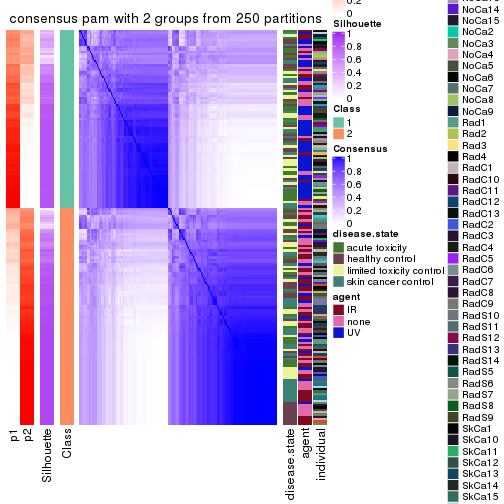</p>

</div>
<div id='tab-SD-pam-consensus-heatmap-2'>
<pre><code class="r">consensus_heatmap(res, k = 3)
</code></pre>

<p>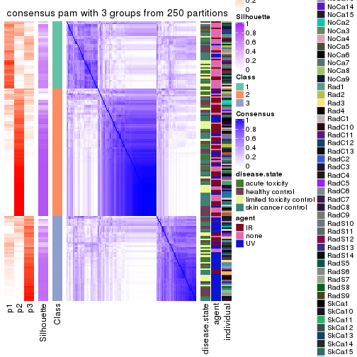</p>

</div>
<div id='tab-SD-pam-consensus-heatmap-3'>
<pre><code class="r">consensus_heatmap(res, k = 4)
</code></pre>

<p>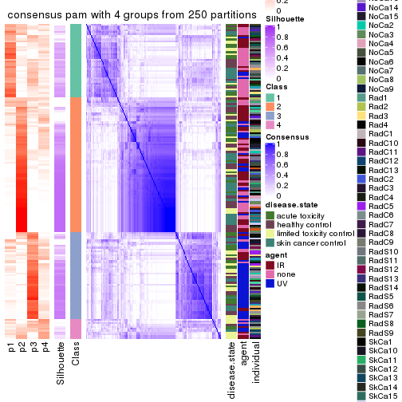</p>

</div>
<div id='tab-SD-pam-consensus-heatmap-4'>
<pre><code class="r">consensus_heatmap(res, k = 5)
</code></pre>

<p>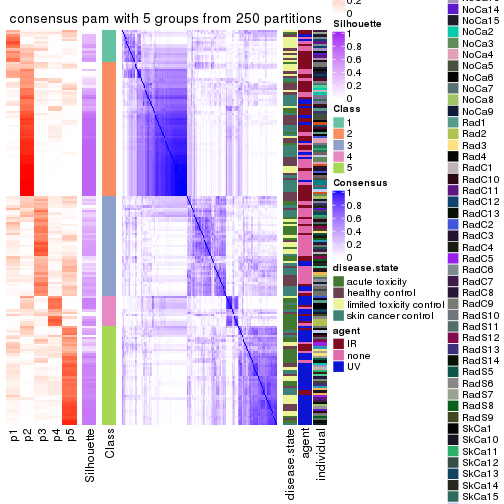</p>

</div>
<div id='tab-SD-pam-consensus-heatmap-5'>
<pre><code class="r">consensus_heatmap(res, k = 6)
</code></pre>

<p>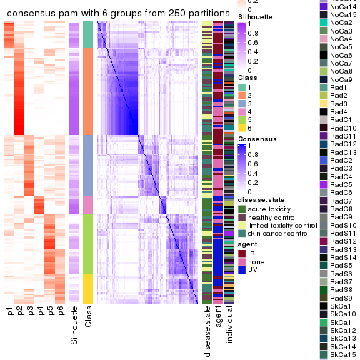</p>

</div>
</div>

Heatmaps for the membership of samples in all partitions to see how consistent they are:


<script>
$( function() {
	$( '#tabs-SD-pam-membership-heatmap' ).tabs();
} );
</script>
<div id='tabs-SD-pam-membership-heatmap'>
<ul>
<li><a href='#tab-SD-pam-membership-heatmap-1'>k = 2</a></li>
<li><a href='#tab-SD-pam-membership-heatmap-2'>k = 3</a></li>
<li><a href='#tab-SD-pam-membership-heatmap-3'>k = 4</a></li>
<li><a href='#tab-SD-pam-membership-heatmap-4'>k = 5</a></li>
<li><a href='#tab-SD-pam-membership-heatmap-5'>k = 6</a></li>
</ul>
<div id='tab-SD-pam-membership-heatmap-1'>
<pre><code class="r">membership_heatmap(res, k = 2)
</code></pre>

<p>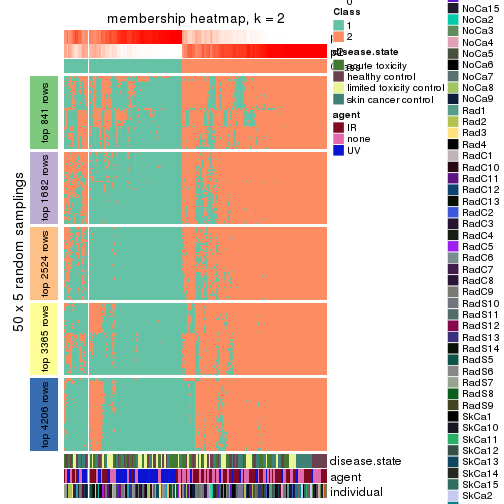</p>

</div>
<div id='tab-SD-pam-membership-heatmap-2'>
<pre><code class="r">membership_heatmap(res, k = 3)
</code></pre>

<p>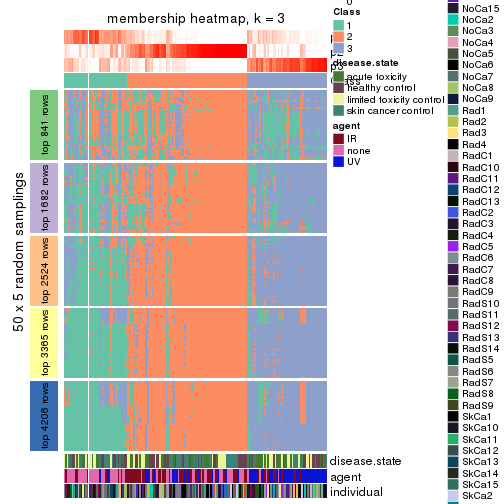</p>

</div>
<div id='tab-SD-pam-membership-heatmap-3'>
<pre><code class="r">membership_heatmap(res, k = 4)
</code></pre>

<p>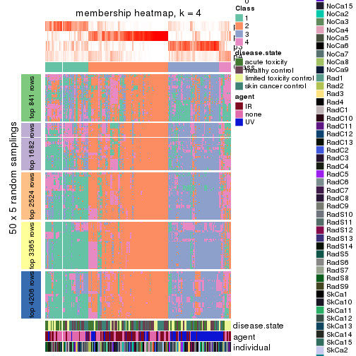</p>

</div>
<div id='tab-SD-pam-membership-heatmap-4'>
<pre><code class="r">membership_heatmap(res, k = 5)
</code></pre>

<p>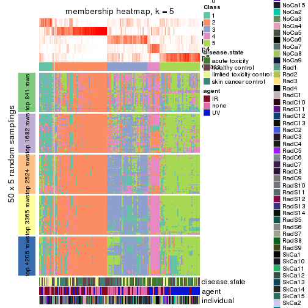</p>

</div>
<div id='tab-SD-pam-membership-heatmap-5'>
<pre><code class="r">membership_heatmap(res, k = 6)
</code></pre>

<p>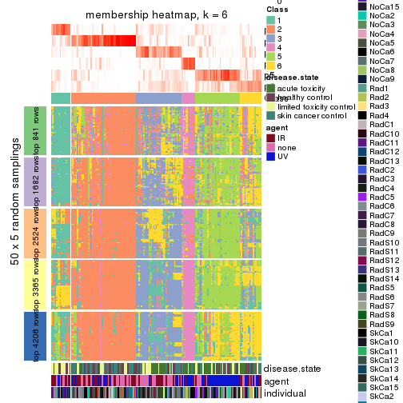</p>

</div>
</div>

As soon as we have had the classes for columns, we can look for signatures
which are significantly different between classes which can be candidate marks
for certain classes. Following are the heatmaps for signatures.


Signature heatmaps where rows are scaled:


<script>
$( function() {
	$( '#tabs-SD-pam-get-signatures' ).tabs();
} );
</script>
<div id='tabs-SD-pam-get-signatures'>
<ul>
<li><a href='#tab-SD-pam-get-signatures-1'>k = 2</a></li>
<li><a href='#tab-SD-pam-get-signatures-2'>k = 3</a></li>
<li><a href='#tab-SD-pam-get-signatures-3'>k = 4</a></li>
<li><a href='#tab-SD-pam-get-signatures-4'>k = 5</a></li>
<li><a href='#tab-SD-pam-get-signatures-5'>k = 6</a></li>
</ul>
<div id='tab-SD-pam-get-signatures-1'>
<pre><code class="r">get_signatures(res, k = 2)
</code></pre>

<p>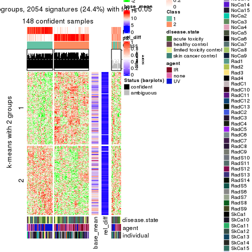</p>

</div>
<div id='tab-SD-pam-get-signatures-2'>
<pre><code class="r">get_signatures(res, k = 3)
</code></pre>

<p>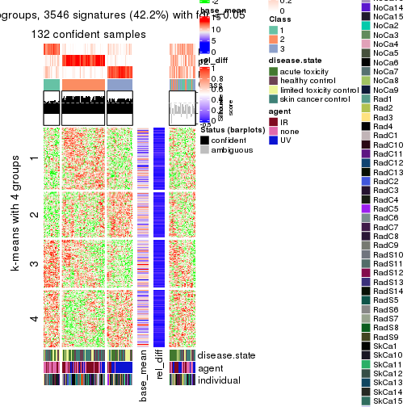</p>

</div>
<div id='tab-SD-pam-get-signatures-3'>
<pre><code class="r">get_signatures(res, k = 4)
</code></pre>

<p>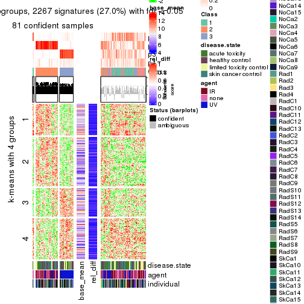</p>

</div>
<div id='tab-SD-pam-get-signatures-4'>
<pre><code class="r">get_signatures(res, k = 5)
</code></pre>

<p>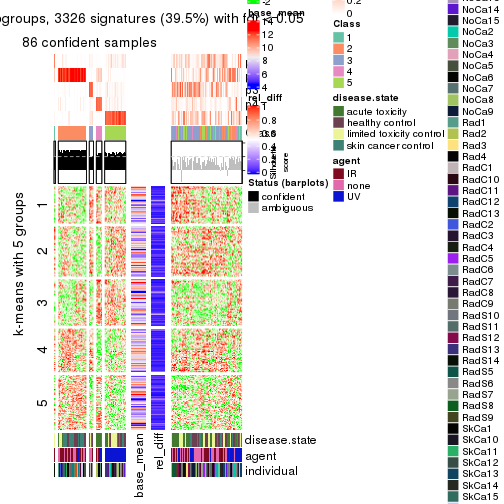</p>

</div>
<div id='tab-SD-pam-get-signatures-5'>
<pre><code class="r">get_signatures(res, k = 6)
</code></pre>

<p>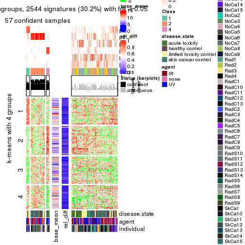</p>

</div>
</div>


Signature heatmaps where rows are not scaled:


<script>
$( function() {
	$( '#tabs-SD-pam-get-signatures-no-scale' ).tabs();
} );
</script>
<div id='tabs-SD-pam-get-signatures-no-scale'>
<ul>
<li><a href='#tab-SD-pam-get-signatures-no-scale-1'>k = 2</a></li>
<li><a href='#tab-SD-pam-get-signatures-no-scale-2'>k = 3</a></li>
<li><a href='#tab-SD-pam-get-signatures-no-scale-3'>k = 4</a></li>
<li><a href='#tab-SD-pam-get-signatures-no-scale-4'>k = 5</a></li>
<li><a href='#tab-SD-pam-get-signatures-no-scale-5'>k = 6</a></li>
</ul>
<div id='tab-SD-pam-get-signatures-no-scale-1'>
<pre><code class="r">get_signatures(res, k = 2, scale_rows = FALSE)
</code></pre>

<p>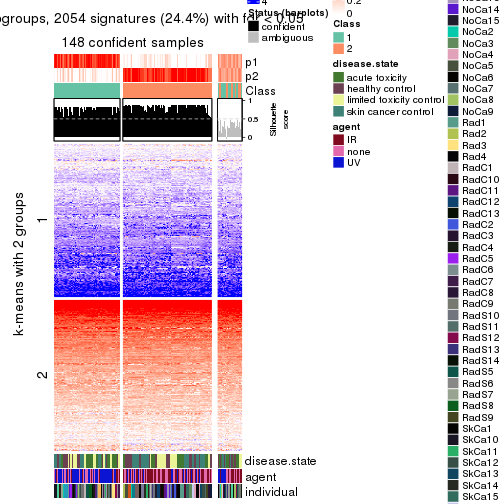</p>

</div>
<div id='tab-SD-pam-get-signatures-no-scale-2'>
<pre><code class="r">get_signatures(res, k = 3, scale_rows = FALSE)
</code></pre>

<p>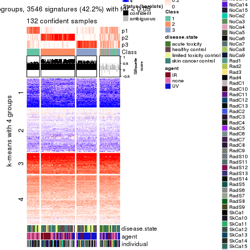</p>

</div>
<div id='tab-SD-pam-get-signatures-no-scale-3'>
<pre><code class="r">get_signatures(res, k = 4, scale_rows = FALSE)
</code></pre>

<p>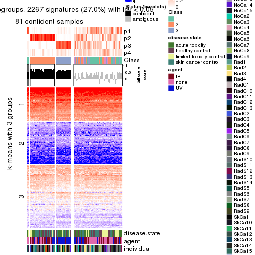</p>

</div>
<div id='tab-SD-pam-get-signatures-no-scale-4'>
<pre><code class="r">get_signatures(res, k = 5, scale_rows = FALSE)
</code></pre>

<p>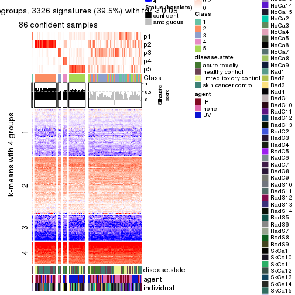</p>

</div>
<div id='tab-SD-pam-get-signatures-no-scale-5'>
<pre><code class="r">get_signatures(res, k = 6, scale_rows = FALSE)
</code></pre>

<p>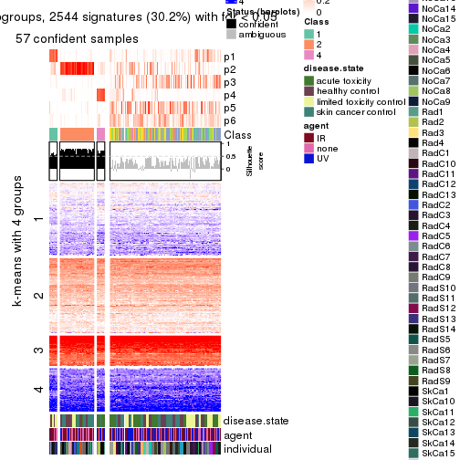</p>

</div>
</div>


Compare the overlap of signatures from different k:

```r
compare_signatures(res)
```

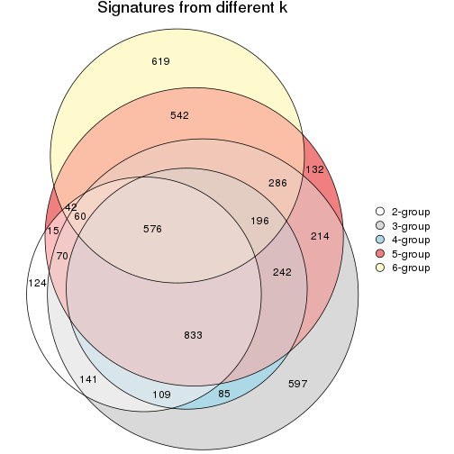

`get_signature()` returns a data frame invisibly. TO get the list of signatures, the function
call should be assigned to a variable explicitly. In following code, if `plot` argument is set
to `FALSE`, no heatmap is plotted while only the differential analysis is performed.

```r
# code only for demonstration
tb = get_signature(res, k = ..., plot = FALSE)
```

An example of the output of `tb` is:

```
#>   which_row         fdr    mean_1    mean_2 scaled_mean_1 scaled_mean_2 km
#> 1        38 0.042760348  8.373488  9.131774    -0.5533452     0.5164555  1
#> 2        40 0.018707592  7.106213  8.469186    -0.6173731     0.5762149  1
#> 3        55 0.019134737 10.221463 11.207825    -0.6159697     0.5749050  1
#> 4        59 0.006059896  5.921854  7.869574    -0.6899429     0.6439467  1
#> 5        60 0.018055526  8.928898 10.211722    -0.6204761     0.5791110  1
#> 6        98 0.009384629 15.714769 14.887706     0.6635654    -0.6193277  2
...
```

The columns in `tb` are:

1. `which_row`: row indices corresponding to the input matrix.
2. `fdr`: FDR for the differential test. 
3. `mean_x`: The mean value in group x.
4. `scaled_mean_x`: The mean value in group x after rows are scaled.
5. `km`: Row groups if k-means clustering is applied to rows.


UMAP plot which shows how samples are separated.


<script>
$( function() {
	$( '#tabs-SD-pam-dimension-reduction' ).tabs();
} );
</script>
<div id='tabs-SD-pam-dimension-reduction'>
<ul>
<li><a href='#tab-SD-pam-dimension-reduction-1'>k = 2</a></li>
<li><a href='#tab-SD-pam-dimension-reduction-2'>k = 3</a></li>
<li><a href='#tab-SD-pam-dimension-reduction-3'>k = 4</a></li>
<li><a href='#tab-SD-pam-dimension-reduction-4'>k = 5</a></li>
<li><a href='#tab-SD-pam-dimension-reduction-5'>k = 6</a></li>
</ul>
<div id='tab-SD-pam-dimension-reduction-1'>
<pre><code class="r">dimension_reduction(res, k = 2, method = &quot;UMAP&quot;)
</code></pre>

<p>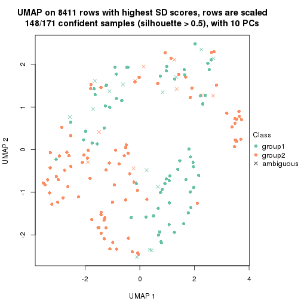</p>

</div>
<div id='tab-SD-pam-dimension-reduction-2'>
<pre><code class="r">dimension_reduction(res, k = 3, method = &quot;UMAP&quot;)
</code></pre>

<p>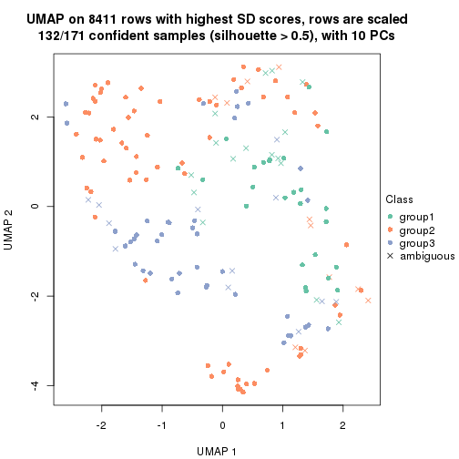</p>

</div>
<div id='tab-SD-pam-dimension-reduction-3'>
<pre><code class="r">dimension_reduction(res, k = 4, method = &quot;UMAP&quot;)
</code></pre>

<p>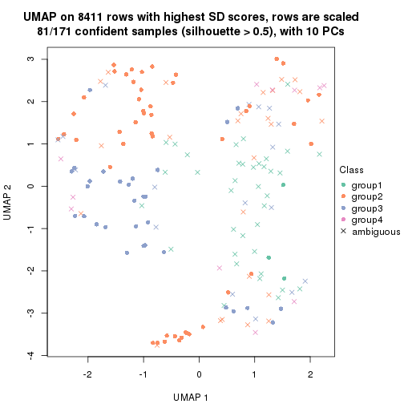</p>

</div>
<div id='tab-SD-pam-dimension-reduction-4'>
<pre><code class="r">dimension_reduction(res, k = 5, method = &quot;UMAP&quot;)
</code></pre>

<p>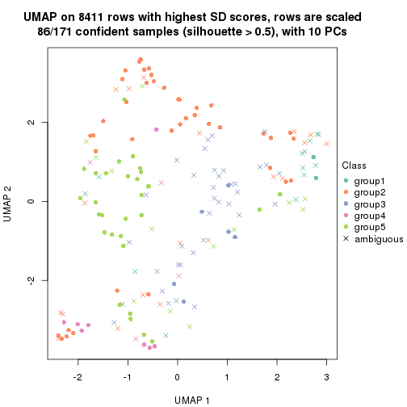</p>

</div>
<div id='tab-SD-pam-dimension-reduction-5'>
<pre><code class="r">dimension_reduction(res, k = 6, method = &quot;UMAP&quot;)
</code></pre>

<p>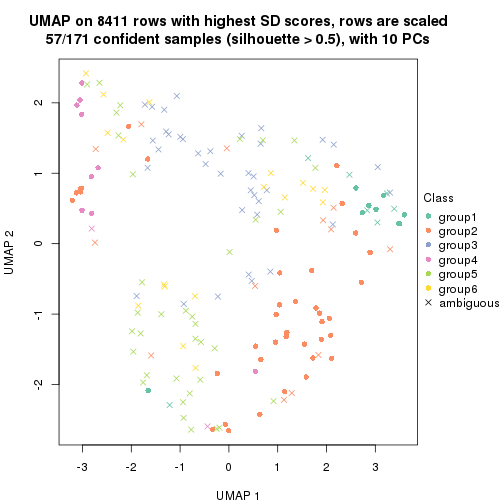</p>

</div>
</div>


Following heatmap shows how subgroups are split when increasing `k`:

```r
collect_classes(res)
```

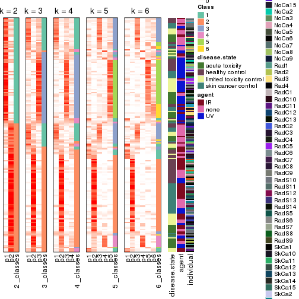


Test correlation between subgroups and known annotations. If the known
annotation is numeric, one-way ANOVA test is applied, and if the known
annotation is discrete, chi-squared contingency table test is applied.

```r
test_to_known_factors(res)
```

```
#>          n disease.state(p) agent(p) individual(p) k
#> SD:pam 148         1.55e-01 1.27e-07      0.000576 2
#> SD:pam 132         1.28e-01 1.64e-14      0.003000 3
#> SD:pam  81         7.73e-02 2.32e-10      0.112851 4
#> SD:pam  86         2.00e-04 7.15e-10      0.015422 5
#> SD:pam  57         2.20e-09 9.33e-02      0.000160 6
```


If matrix rows can be associated to genes, consider to use `functional_enrichment(res,
...)` to perform function enrichment for the signature genes. See [this vignette](http://bioconductor.org/packages/devel/bioc/vignettes/cola/inst/doc/functional_enrichment.html) for more detailed explanations.


 

---------------------------------------------------


### SD:mclust


The object with results only for a single top-value method and a single partition method 
can be extracted as:

```r
res = res_list["SD", "mclust"]
# you can also extract it by
# res = res_list["SD:mclust"]
```

A summary of `res` and all the functions that can be applied to it:

```r
res
```

```
#> A 'ConsensusPartition' object with k = 2, 3, 4, 5, 6.
#>   On a matrix with 8411 rows and 171 columns.
#>   Top rows (841, 1682, 2524, 3365, 4206) are extracted by 'SD' method.
#>   Subgroups are detected by 'mclust' method.
#>   Performed in total 1250 partitions by row resampling.
#>   Best k for subgroups seems to be 3.
#> 
#> Following methods can be applied to this 'ConsensusPartition' object:
#>  [1] "cola_report"             "collect_classes"         "collect_plots"          
#>  [4] "collect_stats"           "colnames"                "compare_signatures"     
#>  [7] "consensus_heatmap"       "dimension_reduction"     "functional_enrichment"  
#> [10] "get_anno_col"            "get_anno"                "get_classes"            
#> [13] "get_consensus"           "get_matrix"              "get_membership"         
#> [16] "get_param"               "get_signatures"          "get_stats"              
#> [19] "is_best_k"               "is_stable_k"             "membership_heatmap"     
#> [22] "ncol"                    "nrow"                    "plot_ecdf"              
#> [25] "rownames"                "select_partition_number" "show"                   
#> [28] "suggest_best_k"          "test_to_known_factors"
```

`collect_plots()` function collects all the plots made from `res` for all `k` (number of partitions)
into one single page to provide an easy and fast comparison between different `k`.

```r
collect_plots(res)
```

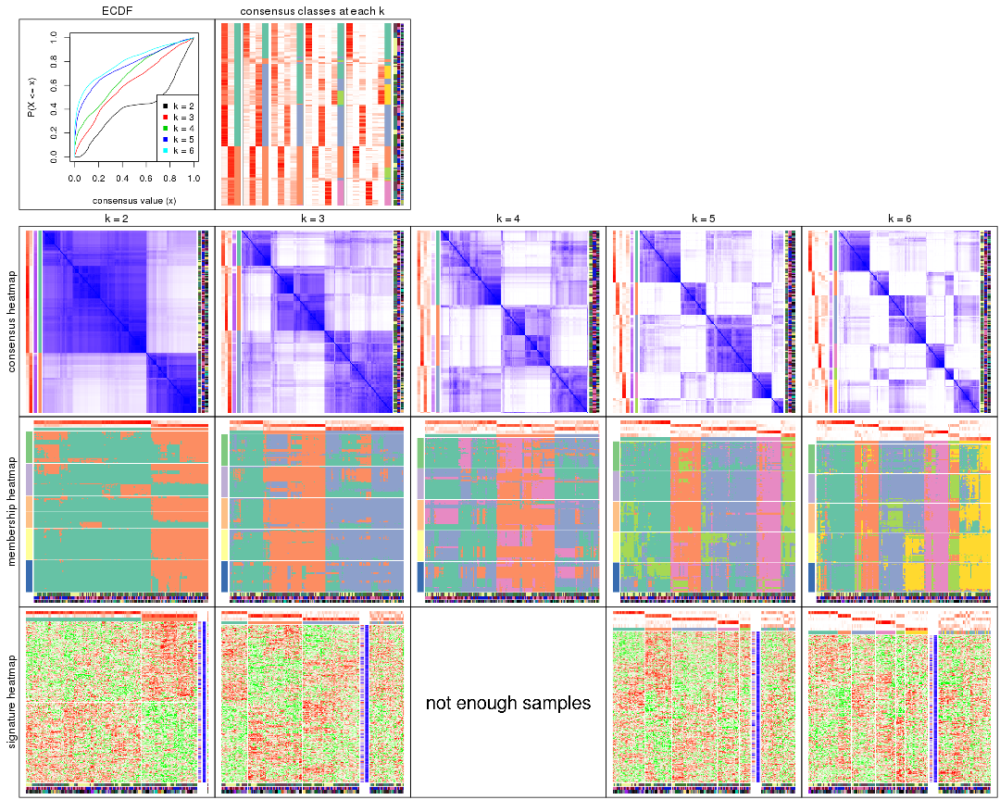

The plots are:

- The first row: a plot of the ECDF (empirical cumulative distribution
  function) curves of the consensus matrix for each `k` and the heatmap of
  predicted classes for each `k`.
- The second row: heatmaps of the consensus matrix for each `k`.
- The third row: heatmaps of the membership matrix for each `k`.
- The fouth row: heatmaps of the signatures for each `k`.

All the plots in panels can be made by individual functions and they are
plotted later in this section.

`select_partition_number()` produces several plots showing different
statistics for choosing "optimized" `k`. There are following statistics:

- ECDF curves of the consensus matrix for each `k`;
- 1-PAC. [The PAC
  score](https://en.wikipedia.org/wiki/Consensus_clustering#Over-interpretation_potential_of_consensus_clustering)
  measures the proportion of the ambiguous subgrouping.
- Mean silhouette score.
- Concordance. The mean probability of fiting the consensus class ids in all
  partitions.
- Area increased. Denote $A_k$ as the area under the ECDF curve for current
  `k`, the area increased is defined as $A_k - A_{k-1}$.
- Rand index. The percent of pairs of samples that are both in a same cluster
  or both are not in a same cluster in the partition of k and k-1.
- Jaccard index. The ratio of pairs of samples are both in a same cluster in
  the partition of k and k-1 and the pairs of samples are both in a same
  cluster in the partition k or k-1.

The detailed explanations of these statistics can be found in [the _cola_
vignette](http://bioconductor.org/packages/devel/bioc/vignettes/cola/inst/doc/cola.html#toc_13).

Generally speaking, lower PAC score, higher mean silhouette score or higher
concordance corresponds to better partition. Rand index and Jaccard index
measure how similar the current partition is compared to partition with `k-1`.
If they are too similar, we won't accept `k` is better than `k-1`.

```r
select_partition_number(res)
```

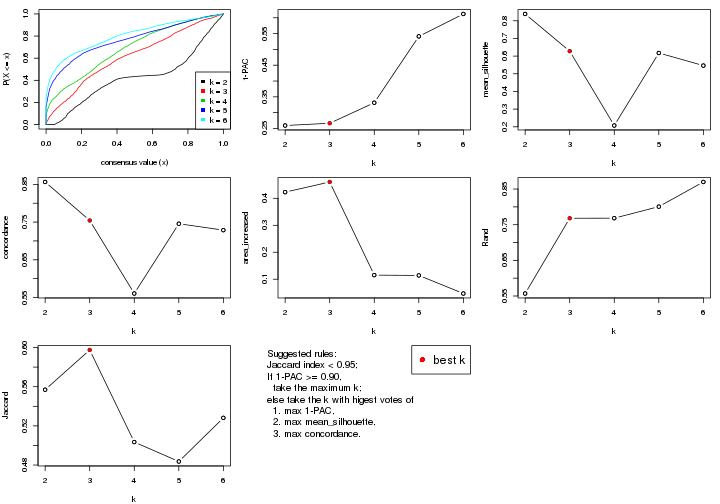

The numeric values for all these statistics can be obtained by `get_stats()`.

```r
get_stats(res)
```

```
#>   k 1-PAC mean_silhouette concordance area_increased  Rand Jaccard
#> 2 2 0.259           0.838       0.856          0.423 0.557   0.557
#> 3 3 0.266           0.628       0.754          0.461 0.768   0.597
#> 4 4 0.331           0.207       0.561          0.115 0.768   0.503
#> 5 5 0.541           0.618       0.746          0.114 0.801   0.484
#> 6 6 0.612           0.546       0.729          0.047 0.870   0.528
```

`suggest_best_k()` suggests the best $k$ based on these statistics. The rules are as follows:

- All $k$ with Jaccard index larger than 0.95 are removed because increasing
  $k$ does not provide enough extra information. If all $k$ are removed, it is
  marked as no subgroup is detected.
- For all $k$ with 1-PAC score larger than 0.9, the maximal $k$ is taken as
  the best $k$, and other $k$ are marked as optional $k$.
- If it does not fit the second rule. The $k$ with the maximal vote of the
  highest 1-PAC score, highest mean silhouette, and highest concordance is
  taken as the best $k$.

```r
suggest_best_k(res)
```

```
#> [1] 3
```


Following shows the table of the partitions (You need to click the **show/hide
code output** link to see it). The membership matrix (columns with name `p*`)
is inferred by
[`clue::cl_consensus()`](https://www.rdocumentation.org/link/cl_consensus?package=clue)
function with the `SE` method. Basically the value in the membership matrix
represents the probability to belong to a certain group. The finall class
label for an item is determined with the group with highest probability it
belongs to.

In `get_classes()` function, the entropy is calculated from the membership
matrix and the silhouette score is calculated from the consensus matrix.


<script>
$( function() {
	$( '#tabs-SD-mclust-get-classes' ).tabs();
} );
</script>
<div id='tabs-SD-mclust-get-classes'>
<ul>
<li><a href='#tab-SD-mclust-get-classes-1'>k = 2</a></li>
<li><a href='#tab-SD-mclust-get-classes-2'>k = 3</a></li>
<li><a href='#tab-SD-mclust-get-classes-3'>k = 4</a></li>
<li><a href='#tab-SD-mclust-get-classes-4'>k = 5</a></li>
<li><a href='#tab-SD-mclust-get-classes-5'>k = 6</a></li>
</ul>

<div id='tab-SD-mclust-get-classes-1'>
<p><a id='tab-SD-mclust-get-classes-1-a' style='color:#0366d6' href='#'>show/hide code output</a></p>
<pre><code class="r">cbind(get_classes(res, k = 2), get_membership(res, k = 2))
</code></pre>

<pre><code>#&gt;          class entropy silhouette    p1    p2
#&gt; GSM29783     2  0.8081      0.807 0.248 0.752
#&gt; GSM29786     2  0.7602      0.836 0.220 0.780
#&gt; GSM29789     2  0.2603      0.879 0.044 0.956
#&gt; GSM29792     2  0.2603      0.879 0.044 0.956
#&gt; GSM29795     2  0.9983      0.176 0.476 0.524
#&gt; GSM29798     2  0.8386      0.792 0.268 0.732
#&gt; GSM29801     1  0.4431      0.885 0.908 0.092
#&gt; GSM29804     1  0.2778      0.884 0.952 0.048
#&gt; GSM29807     1  0.9170      0.708 0.668 0.332
#&gt; GSM29816     1  0.0376      0.864 0.996 0.004
#&gt; GSM29821     1  0.4298      0.885 0.912 0.088
#&gt; GSM29824     1  0.3584      0.887 0.932 0.068
#&gt; GSM29827     1  0.6438      0.871 0.836 0.164
#&gt; GSM29830     1  0.6343      0.872 0.840 0.160
#&gt; GSM29833     1  0.6623      0.873 0.828 0.172
#&gt; GSM29784     2  0.6247      0.873 0.156 0.844
#&gt; GSM29787     2  0.7950      0.821 0.240 0.760
#&gt; GSM29790     2  0.3114      0.882 0.056 0.944
#&gt; GSM29793     2  0.2603      0.879 0.044 0.956
#&gt; GSM29796     2  0.7139      0.843 0.196 0.804
#&gt; GSM29799     2  0.9087      0.708 0.324 0.676
#&gt; GSM29802     1  0.0672      0.864 0.992 0.008
#&gt; GSM29805     1  0.0376      0.863 0.996 0.004
#&gt; GSM29814     1  0.9087      0.718 0.676 0.324
#&gt; GSM29817     1  0.5059      0.879 0.888 0.112
#&gt; GSM29822     1  0.1414      0.872 0.980 0.020
#&gt; GSM29825     1  0.3584      0.885 0.932 0.068
#&gt; GSM29828     1  0.6247      0.874 0.844 0.156
#&gt; GSM29831     1  0.6247      0.874 0.844 0.156
#&gt; GSM29834     1  0.6343      0.878 0.840 0.160
#&gt; GSM29785     2  0.4022      0.884 0.080 0.920
#&gt; GSM29788     2  0.7299      0.845 0.204 0.796
#&gt; GSM29791     2  0.2603      0.879 0.044 0.956
#&gt; GSM29794     2  0.2603      0.879 0.044 0.956
#&gt; GSM29797     2  0.5059      0.882 0.112 0.888
#&gt; GSM29800     2  0.7453      0.841 0.212 0.788
#&gt; GSM29803     1  0.2603      0.866 0.956 0.044
#&gt; GSM29806     1  0.6343      0.855 0.840 0.160
#&gt; GSM29815     1  0.9393      0.668 0.644 0.356
#&gt; GSM29819     1  0.3733      0.884 0.928 0.072
#&gt; GSM29823     1  0.7602      0.777 0.780 0.220
#&gt; GSM29826     1  0.2603      0.865 0.956 0.044
#&gt; GSM29829     1  0.6247      0.876 0.844 0.156
#&gt; GSM29832     1  0.6438      0.873 0.836 0.164
#&gt; GSM29835     1  0.7883      0.807 0.764 0.236
#&gt; GSM29836     2  0.2603      0.879 0.044 0.956
#&gt; GSM29839     2  0.6148      0.868 0.152 0.848
#&gt; GSM29842     2  0.5519      0.880 0.128 0.872
#&gt; GSM29845     2  0.9170      0.695 0.332 0.668
#&gt; GSM29848     2  0.8555      0.777 0.280 0.720
#&gt; GSM29851     1  0.0938      0.869 0.988 0.012
#&gt; GSM29854     1  0.2043      0.867 0.968 0.032
#&gt; GSM29857     1  0.2778      0.885 0.952 0.048
#&gt; GSM29860     2  0.3431      0.879 0.064 0.936
#&gt; GSM29863     1  0.1633      0.866 0.976 0.024
#&gt; GSM29866     1  0.6438      0.871 0.836 0.164
#&gt; GSM29869     1  0.6048      0.881 0.852 0.148
#&gt; GSM29872     1  0.9209      0.708 0.664 0.336
#&gt; GSM29875     1  0.3733      0.884 0.928 0.072
#&gt; GSM29878     1  0.9460      0.654 0.636 0.364
#&gt; GSM29837     2  0.3879      0.879 0.076 0.924
#&gt; GSM29840     2  0.4939      0.882 0.108 0.892
#&gt; GSM29843     2  0.4431      0.885 0.092 0.908
#&gt; GSM29846     2  0.9044      0.715 0.320 0.680
#&gt; GSM29849     2  0.9000      0.722 0.316 0.684
#&gt; GSM29852     1  0.1633      0.873 0.976 0.024
#&gt; GSM29855     1  0.2423      0.865 0.960 0.040
#&gt; GSM29858     1  0.3274      0.886 0.940 0.060
#&gt; GSM29861     2  0.6247      0.815 0.156 0.844
#&gt; GSM29864     1  0.2236      0.869 0.964 0.036
#&gt; GSM29867     1  0.4161      0.887 0.916 0.084
#&gt; GSM29870     1  0.5408      0.884 0.876 0.124
#&gt; GSM29873     1  0.9087      0.718 0.676 0.324
#&gt; GSM29876     1  0.0938      0.870 0.988 0.012
#&gt; GSM29879     1  0.7883      0.832 0.764 0.236
#&gt; GSM29838     2  0.2948      0.881 0.052 0.948
#&gt; GSM29841     2  0.3733      0.886 0.072 0.928
#&gt; GSM29844     2  0.2948      0.883 0.052 0.948
#&gt; GSM29847     2  0.7815      0.827 0.232 0.768
#&gt; GSM29850     2  0.7376      0.842 0.208 0.792
#&gt; GSM29853     1  0.2043      0.877 0.968 0.032
#&gt; GSM29856     1  0.6438      0.838 0.836 0.164
#&gt; GSM29859     1  0.7815      0.803 0.768 0.232
#&gt; GSM29862     2  0.2948      0.880 0.052 0.948
#&gt; GSM29865     1  0.6623      0.819 0.828 0.172
#&gt; GSM29868     1  0.5059      0.885 0.888 0.112
#&gt; GSM29871     1  0.8386      0.776 0.732 0.268
#&gt; GSM29874     1  0.9815      0.541 0.580 0.420
#&gt; GSM29877     1  0.0672      0.865 0.992 0.008
#&gt; GSM29880     2  0.3584      0.880 0.068 0.932
#&gt; GSM29881     1  0.2236      0.867 0.964 0.036
#&gt; GSM29884     2  0.3733      0.883 0.072 0.928
#&gt; GSM29887     2  0.2948      0.882 0.052 0.948
#&gt; GSM29890     1  0.5629      0.883 0.868 0.132
#&gt; GSM29893     1  0.6247      0.874 0.844 0.156
#&gt; GSM29896     1  0.6048      0.874 0.852 0.148
#&gt; GSM29899     1  0.4431      0.886 0.908 0.092
#&gt; GSM29902     1  0.5178      0.883 0.884 0.116
#&gt; GSM29905     1  0.5059      0.883 0.888 0.112
#&gt; GSM29908     1  0.6438      0.871 0.836 0.164
#&gt; GSM29955     1  0.5629      0.882 0.868 0.132
#&gt; GSM29958     1  0.6531      0.872 0.832 0.168
#&gt; GSM29961     1  0.6438      0.871 0.836 0.164
#&gt; GSM29882     1  0.1633      0.866 0.976 0.024
#&gt; GSM29885     2  0.4939      0.884 0.108 0.892
#&gt; GSM29888     2  0.3431      0.882 0.064 0.936
#&gt; GSM29891     1  0.2778      0.883 0.952 0.048
#&gt; GSM29894     1  0.5946      0.877 0.856 0.144
#&gt; GSM29897     1  0.6343      0.872 0.840 0.160
#&gt; GSM29900     1  0.0672      0.867 0.992 0.008
#&gt; GSM29903     1  0.5178      0.883 0.884 0.116
#&gt; GSM29906     1  0.5059      0.883 0.888 0.112
#&gt; GSM29909     1  0.5178      0.883 0.884 0.116
#&gt; GSM29956     1  0.6531      0.872 0.832 0.168
#&gt; GSM29959     1  0.6343      0.872 0.840 0.160
#&gt; GSM29962     1  0.6438      0.871 0.836 0.164
#&gt; GSM29883     1  0.2423      0.865 0.960 0.040
#&gt; GSM29886     2  0.3733      0.883 0.072 0.928
#&gt; GSM29889     2  0.2778      0.880 0.048 0.952
#&gt; GSM29892     1  0.4690      0.885 0.900 0.100
#&gt; GSM29895     1  0.7453      0.838 0.788 0.212
#&gt; GSM29898     1  0.2778      0.882 0.952 0.048
#&gt; GSM29901     1  0.0672      0.864 0.992 0.008
#&gt; GSM29904     1  0.7376      0.848 0.792 0.208
#&gt; GSM29907     1  0.4815      0.885 0.896 0.104
#&gt; GSM29910     1  0.7056      0.859 0.808 0.192
#&gt; GSM29957     1  0.8813      0.758 0.700 0.300
#&gt; GSM29960     1  0.5737      0.880 0.864 0.136
#&gt; GSM29963     1  0.7528      0.841 0.784 0.216
#&gt; GSM29964     2  0.2948      0.881 0.052 0.948
#&gt; GSM29967     2  0.6973      0.855 0.188 0.812
#&gt; GSM29970     1  0.3584      0.869 0.932 0.068
#&gt; GSM29973     2  0.2948      0.881 0.052 0.948
#&gt; GSM29976     1  0.0376      0.864 0.996 0.004
#&gt; GSM29979     1  0.9209      0.700 0.664 0.336
#&gt; GSM29982     2  0.9580      0.571 0.380 0.620
#&gt; GSM29985     1  0.2603      0.865 0.956 0.044
#&gt; GSM29988     1  0.9170      0.708 0.668 0.332
#&gt; GSM29991     1  0.3879      0.882 0.924 0.076
#&gt; GSM29994     1  0.5629      0.881 0.868 0.132
#&gt; GSM29997     1  0.8016      0.812 0.756 0.244
#&gt; GSM30000     1  0.7528      0.840 0.784 0.216
#&gt; GSM30003     1  0.0000      0.861 1.000 0.000
#&gt; GSM29965     2  0.2948      0.881 0.052 0.948
#&gt; GSM29968     2  0.7139      0.850 0.196 0.804
#&gt; GSM29971     1  0.2948      0.863 0.948 0.052
#&gt; GSM29974     2  0.3733      0.880 0.072 0.928
#&gt; GSM29977     1  0.0000      0.861 1.000 0.000
#&gt; GSM29980     1  0.9129      0.713 0.672 0.328
#&gt; GSM29983     1  0.8016      0.745 0.756 0.244
#&gt; GSM29986     1  0.2043      0.867 0.968 0.032
#&gt; GSM29989     1  0.9044      0.723 0.680 0.320
#&gt; GSM29992     1  0.2236      0.877 0.964 0.036
#&gt; GSM29995     1  0.6343      0.873 0.840 0.160
#&gt; GSM29998     1  0.8327      0.791 0.736 0.264
#&gt; GSM30001     1  0.5294      0.884 0.880 0.120
#&gt; GSM30004     1  0.0000      0.861 1.000 0.000
#&gt; GSM29966     2  0.2948      0.881 0.052 0.948
#&gt; GSM29969     2  0.6973      0.855 0.188 0.812
#&gt; GSM29972     1  0.6801      0.822 0.820 0.180
#&gt; GSM29975     2  0.2948      0.881 0.052 0.948
#&gt; GSM29978     1  0.0672      0.864 0.992 0.008
#&gt; GSM29981     2  0.5629      0.840 0.132 0.868
#&gt; GSM29984     2  0.8499      0.785 0.276 0.724
#&gt; GSM29987     1  0.5842      0.857 0.860 0.140
#&gt; GSM29990     1  0.9170      0.708 0.668 0.332
#&gt; GSM29993     2  0.9754      0.519 0.408 0.592
#&gt; GSM29996     1  0.6048      0.877 0.852 0.148
#&gt; GSM29999     1  0.9129      0.714 0.672 0.328
#&gt; GSM30002     1  0.8763      0.749 0.704 0.296
#&gt; GSM30005     1  0.0938      0.867 0.988 0.012
</code></pre>

<script>
$('#tab-SD-mclust-get-classes-1-a').parent().next().next().hide();
$('#tab-SD-mclust-get-classes-1-a').click(function(){
  $('#tab-SD-mclust-get-classes-1-a').parent().next().next().toggle();
  return(false);
});
</script>
</div>

<div id='tab-SD-mclust-get-classes-2'>
<p><a id='tab-SD-mclust-get-classes-2-a' style='color:#0366d6' href='#'>show/hide code output</a></p>
<pre><code class="r">cbind(get_classes(res, k = 3), get_membership(res, k = 3))
</code></pre>

<pre><code>#&gt;          class entropy silhouette    p1    p2    p3
#&gt; GSM29783     2  0.6250    0.76871 0.104 0.776 0.120
#&gt; GSM29786     2  0.6911    0.75362 0.092 0.728 0.180
#&gt; GSM29789     2  0.1411    0.79286 0.036 0.964 0.000
#&gt; GSM29792     2  0.1411    0.79286 0.036 0.964 0.000
#&gt; GSM29795     2  0.9213    0.39081 0.236 0.536 0.228
#&gt; GSM29798     2  0.6911    0.75362 0.092 0.728 0.180
#&gt; GSM29801     1  0.9054    0.42827 0.496 0.144 0.360
#&gt; GSM29804     3  0.5171    0.61910 0.204 0.012 0.784
#&gt; GSM29807     3  0.8474    0.40210 0.092 0.404 0.504
#&gt; GSM29816     3  0.3771    0.64536 0.112 0.012 0.876
#&gt; GSM29821     1  0.8628    0.50751 0.544 0.116 0.340
#&gt; GSM29824     3  0.4700    0.64571 0.180 0.008 0.812
#&gt; GSM29827     1  0.3340    0.78777 0.880 0.000 0.120
#&gt; GSM29830     1  0.3340    0.78777 0.880 0.000 0.120
#&gt; GSM29833     1  0.4848    0.78611 0.836 0.036 0.128
#&gt; GSM29784     2  0.4779    0.79182 0.124 0.840 0.036
#&gt; GSM29787     2  0.6911    0.75362 0.092 0.728 0.180
#&gt; GSM29790     2  0.0592    0.79777 0.012 0.988 0.000
#&gt; GSM29793     2  0.0892    0.79604 0.020 0.980 0.000
#&gt; GSM29796     2  0.5831    0.78389 0.128 0.796 0.076
#&gt; GSM29799     2  0.6886    0.75219 0.088 0.728 0.184
#&gt; GSM29802     3  0.3966    0.64153 0.100 0.024 0.876
#&gt; GSM29805     3  0.4861    0.62624 0.192 0.008 0.800
#&gt; GSM29814     3  0.8194    0.47609 0.088 0.340 0.572
#&gt; GSM29817     3  0.9324    0.11067 0.272 0.212 0.516
#&gt; GSM29822     3  0.6875    0.40906 0.244 0.056 0.700
#&gt; GSM29825     3  0.5698    0.46408 0.252 0.012 0.736
#&gt; GSM29828     1  0.3482    0.78756 0.872 0.000 0.128
#&gt; GSM29831     1  0.4291    0.76495 0.820 0.000 0.180
#&gt; GSM29834     1  0.4960    0.78692 0.832 0.040 0.128
#&gt; GSM29785     2  0.2955    0.79808 0.080 0.912 0.008
#&gt; GSM29788     2  0.6911    0.75362 0.092 0.728 0.180
#&gt; GSM29791     2  0.1163    0.79406 0.028 0.972 0.000
#&gt; GSM29794     2  0.1163    0.79406 0.028 0.972 0.000
#&gt; GSM29797     2  0.5330    0.78944 0.144 0.812 0.044
#&gt; GSM29800     2  0.6911    0.75362 0.092 0.728 0.180
#&gt; GSM29803     3  0.3889    0.65998 0.032 0.084 0.884
#&gt; GSM29806     3  0.5740    0.66844 0.096 0.100 0.804
#&gt; GSM29815     3  0.8465    0.28767 0.088 0.452 0.460
#&gt; GSM29819     3  0.2176    0.68932 0.020 0.032 0.948
#&gt; GSM29823     2  0.9887    0.09919 0.288 0.408 0.304
#&gt; GSM29826     3  0.1832    0.67943 0.036 0.008 0.956
#&gt; GSM29829     1  0.4915    0.78852 0.832 0.036 0.132
#&gt; GSM29832     1  0.4708    0.78827 0.844 0.036 0.120
#&gt; GSM29835     1  0.9130    0.31483 0.492 0.356 0.152
#&gt; GSM29836     2  0.1129    0.79662 0.020 0.976 0.004
#&gt; GSM29839     2  0.5508    0.77523 0.188 0.784 0.028
#&gt; GSM29842     2  0.4289    0.79341 0.092 0.868 0.040
#&gt; GSM29845     2  0.7021    0.73382 0.076 0.708 0.216
#&gt; GSM29848     2  0.6911    0.75362 0.092 0.728 0.180
#&gt; GSM29851     3  0.6180    0.41167 0.260 0.024 0.716
#&gt; GSM29854     3  0.1315    0.67823 0.020 0.008 0.972
#&gt; GSM29857     3  0.3769    0.67371 0.104 0.016 0.880
#&gt; GSM29860     2  0.4786    0.73222 0.112 0.844 0.044
#&gt; GSM29863     3  0.4937    0.58540 0.148 0.028 0.824
#&gt; GSM29866     1  0.4002    0.77694 0.840 0.000 0.160
#&gt; GSM29869     1  0.6746    0.73373 0.732 0.076 0.192
#&gt; GSM29872     3  0.9032    0.45157 0.148 0.340 0.512
#&gt; GSM29875     3  0.6984    0.34116 0.304 0.040 0.656
#&gt; GSM29878     2  0.8549    0.11808 0.384 0.516 0.100
#&gt; GSM29837     2  0.4228    0.71097 0.008 0.844 0.148
#&gt; GSM29840     2  0.4741    0.78744 0.152 0.828 0.020
#&gt; GSM29843     2  0.3921    0.79500 0.112 0.872 0.016
#&gt; GSM29846     2  0.6677    0.75734 0.080 0.740 0.180
#&gt; GSM29849     2  0.6911    0.75362 0.092 0.728 0.180
#&gt; GSM29852     3  0.6168    0.46987 0.224 0.036 0.740
#&gt; GSM29855     3  0.2056    0.67459 0.024 0.024 0.952
#&gt; GSM29858     3  0.4526    0.68169 0.104 0.040 0.856
#&gt; GSM29861     2  0.4679    0.71611 0.148 0.832 0.020
#&gt; GSM29864     3  0.5413    0.55059 0.164 0.036 0.800
#&gt; GSM29867     3  0.6584    0.30018 0.380 0.012 0.608
#&gt; GSM29870     1  0.6849    0.43061 0.600 0.020 0.380
#&gt; GSM29873     3  0.8293    0.53899 0.120 0.272 0.608
#&gt; GSM29876     3  0.5688    0.57474 0.168 0.044 0.788
#&gt; GSM29879     1  0.8722    0.57236 0.592 0.216 0.192
#&gt; GSM29838     2  0.1337    0.79576 0.012 0.972 0.016
#&gt; GSM29841     2  0.4139    0.79076 0.124 0.860 0.016
#&gt; GSM29844     2  0.1860    0.79552 0.052 0.948 0.000
#&gt; GSM29847     2  0.6677    0.75734 0.080 0.740 0.180
#&gt; GSM29850     2  0.6754    0.76021 0.092 0.740 0.168
#&gt; GSM29853     3  0.6929    0.36602 0.260 0.052 0.688
#&gt; GSM29856     3  0.5842    0.60398 0.036 0.196 0.768
#&gt; GSM29859     3  0.7441    0.60428 0.136 0.164 0.700
#&gt; GSM29862     2  0.3193    0.76177 0.100 0.896 0.004
#&gt; GSM29865     3  0.5285    0.61182 0.040 0.148 0.812
#&gt; GSM29868     1  0.9118    0.20719 0.468 0.144 0.388
#&gt; GSM29871     3  0.7927    0.57893 0.160 0.176 0.664
#&gt; GSM29874     2  0.7820    0.37501 0.324 0.604 0.072
#&gt; GSM29877     3  0.5803    0.44390 0.248 0.016 0.736
#&gt; GSM29880     2  0.4413    0.73715 0.124 0.852 0.024
#&gt; GSM29881     3  0.1129    0.67619 0.020 0.004 0.976
#&gt; GSM29884     2  0.2152    0.79959 0.036 0.948 0.016
#&gt; GSM29887     2  0.1182    0.79831 0.012 0.976 0.012
#&gt; GSM29890     1  0.6460    0.19592 0.556 0.004 0.440
#&gt; GSM29893     1  0.3752    0.78566 0.856 0.000 0.144
#&gt; GSM29896     1  0.6448    0.53778 0.636 0.012 0.352
#&gt; GSM29899     3  0.5706    0.48454 0.320 0.000 0.680
#&gt; GSM29902     3  0.7606    0.55954 0.244 0.092 0.664
#&gt; GSM29905     3  0.7381    0.56588 0.244 0.080 0.676
#&gt; GSM29908     1  0.3340    0.78777 0.880 0.000 0.120
#&gt; GSM29955     1  0.6348    0.72768 0.740 0.048 0.212
#&gt; GSM29958     1  0.3412    0.78717 0.876 0.000 0.124
#&gt; GSM29961     1  0.3412    0.78717 0.876 0.000 0.124
#&gt; GSM29882     3  0.4446    0.61439 0.112 0.032 0.856
#&gt; GSM29885     2  0.4015    0.79573 0.096 0.876 0.028
#&gt; GSM29888     2  0.1337    0.79896 0.016 0.972 0.012
#&gt; GSM29891     3  0.4692    0.65486 0.168 0.012 0.820
#&gt; GSM29894     1  0.4409    0.76961 0.824 0.004 0.172
#&gt; GSM29897     1  0.4291    0.75571 0.820 0.000 0.180
#&gt; GSM29900     3  0.4261    0.63081 0.140 0.012 0.848
#&gt; GSM29903     3  0.7039    0.50051 0.312 0.040 0.648
#&gt; GSM29906     3  0.6857    0.56942 0.252 0.052 0.696
#&gt; GSM29909     1  0.7397    0.00115 0.484 0.032 0.484
#&gt; GSM29956     1  0.3340    0.78777 0.880 0.000 0.120
#&gt; GSM29959     1  0.3340    0.78777 0.880 0.000 0.120
#&gt; GSM29962     1  0.4963    0.75356 0.792 0.008 0.200
#&gt; GSM29883     3  0.1015    0.67760 0.012 0.008 0.980
#&gt; GSM29886     2  0.1989    0.80049 0.048 0.948 0.004
#&gt; GSM29889     2  0.1015    0.79550 0.008 0.980 0.012
#&gt; GSM29892     3  0.7479    0.54642 0.264 0.076 0.660
#&gt; GSM29895     1  0.8872    0.47234 0.556 0.288 0.156
#&gt; GSM29898     3  0.3983    0.65592 0.144 0.004 0.852
#&gt; GSM29901     3  0.1529    0.68032 0.040 0.000 0.960
#&gt; GSM29904     3  0.9006    0.47654 0.256 0.188 0.556
#&gt; GSM29907     3  0.6895    0.58757 0.228 0.064 0.708
#&gt; GSM29910     1  0.8206    0.60570 0.640 0.196 0.164
#&gt; GSM29957     2  0.9873   -0.16509 0.260 0.392 0.348
#&gt; GSM29960     1  0.7348    0.66914 0.704 0.176 0.120
#&gt; GSM29963     3  0.9225    0.42520 0.256 0.212 0.532
#&gt; GSM29964     2  0.1182    0.79492 0.012 0.976 0.012
#&gt; GSM29967     2  0.6731    0.76150 0.088 0.740 0.172
#&gt; GSM29970     3  0.2313    0.67984 0.024 0.032 0.944
#&gt; GSM29973     2  0.1337    0.79576 0.012 0.972 0.016
#&gt; GSM29976     3  0.1964    0.67571 0.056 0.000 0.944
#&gt; GSM29979     3  0.8865    0.37602 0.120 0.404 0.476
#&gt; GSM29982     2  0.8521    0.65735 0.228 0.608 0.164
#&gt; GSM29985     3  0.1950    0.67929 0.040 0.008 0.952
#&gt; GSM29988     3  0.8479    0.51290 0.120 0.300 0.580
#&gt; GSM29991     3  0.5889    0.66906 0.108 0.096 0.796
#&gt; GSM29994     3  0.7634    0.57121 0.232 0.100 0.668
#&gt; GSM29997     3  0.8410    0.56263 0.216 0.164 0.620
#&gt; GSM30000     3  0.7739    0.57541 0.204 0.124 0.672
#&gt; GSM30003     3  0.3043    0.67407 0.084 0.008 0.908
#&gt; GSM29965     2  0.1170    0.79577 0.008 0.976 0.016
#&gt; GSM29968     2  0.6754    0.75925 0.092 0.740 0.168
#&gt; GSM29971     3  0.2318    0.68025 0.028 0.028 0.944
#&gt; GSM29974     2  0.4539    0.70558 0.016 0.836 0.148
#&gt; GSM29977     3  0.1753    0.67674 0.048 0.000 0.952
#&gt; GSM29980     3  0.8668    0.49101 0.132 0.304 0.564
#&gt; GSM29983     2  0.9934    0.09620 0.320 0.388 0.292
#&gt; GSM29986     3  0.2269    0.67434 0.016 0.040 0.944
#&gt; GSM29989     3  0.8408    0.53166 0.128 0.272 0.600
#&gt; GSM29992     3  0.3888    0.68685 0.064 0.048 0.888
#&gt; GSM29995     1  0.4139    0.79103 0.860 0.016 0.124
#&gt; GSM29998     3  0.8249    0.57341 0.200 0.164 0.636
#&gt; GSM30001     3  0.6254    0.61340 0.188 0.056 0.756
#&gt; GSM30004     3  0.4280    0.63993 0.124 0.020 0.856
#&gt; GSM29966     2  0.1182    0.79492 0.012 0.976 0.012
#&gt; GSM29969     2  0.6652    0.76249 0.084 0.744 0.172
#&gt; GSM29972     3  0.5573    0.63844 0.044 0.160 0.796
#&gt; GSM29975     2  0.1337    0.79576 0.012 0.972 0.016
#&gt; GSM29978     3  0.1753    0.68010 0.048 0.000 0.952
#&gt; GSM29981     2  0.5852    0.65458 0.044 0.776 0.180
#&gt; GSM29984     2  0.7213    0.73483 0.088 0.700 0.212
#&gt; GSM29987     3  0.4411    0.64348 0.016 0.140 0.844
#&gt; GSM29990     3  0.8688    0.43775 0.112 0.372 0.516
#&gt; GSM29993     2  0.7841    0.17208 0.052 0.480 0.468
#&gt; GSM29996     3  0.9013    0.38336 0.324 0.152 0.524
#&gt; GSM29999     3  0.8600    0.51906 0.136 0.284 0.580
#&gt; GSM30002     3  0.8544    0.51371 0.152 0.248 0.600
#&gt; GSM30005     3  0.1267    0.67931 0.024 0.004 0.972
</code></pre>

<script>
$('#tab-SD-mclust-get-classes-2-a').parent().next().next().hide();
$('#tab-SD-mclust-get-classes-2-a').click(function(){
  $('#tab-SD-mclust-get-classes-2-a').parent().next().next().toggle();
  return(false);
});
</script>
</div>

<div id='tab-SD-mclust-get-classes-3'>
<p><a id='tab-SD-mclust-get-classes-3-a' style='color:#0366d6' href='#'>show/hide code output</a></p>
<pre><code class="r">cbind(get_classes(res, k = 4), get_membership(res, k = 4))
</code></pre>

<pre><code>#&gt;          class entropy silhouette    p1    p2    p3    p4
#&gt; GSM29783     2  0.7295   -0.45588 0.024 0.520 0.088 0.368
#&gt; GSM29786     2  0.6621   -0.42169 0.000 0.508 0.084 0.408
#&gt; GSM29789     2  0.2589    0.32692 0.000 0.884 0.000 0.116
#&gt; GSM29792     2  0.2408    0.34105 0.000 0.896 0.000 0.104
#&gt; GSM29795     2  0.9842   -0.31358 0.260 0.328 0.184 0.228
#&gt; GSM29798     2  0.6514   -0.40825 0.000 0.516 0.076 0.408
#&gt; GSM29801     3  0.8898    0.29762 0.292 0.184 0.444 0.080
#&gt; GSM29804     1  0.5050   -0.18787 0.588 0.004 0.408 0.000
#&gt; GSM29807     1  0.8956    0.17539 0.452 0.084 0.260 0.204
#&gt; GSM29816     3  0.4262    0.61341 0.236 0.000 0.756 0.008
#&gt; GSM29821     3  0.8463    0.24235 0.340 0.216 0.412 0.032
#&gt; GSM29824     1  0.5024   -0.00666 0.632 0.000 0.360 0.008
#&gt; GSM29827     1  0.6764    0.38721 0.596 0.000 0.144 0.260
#&gt; GSM29830     1  0.6796    0.38537 0.596 0.000 0.152 0.252
#&gt; GSM29833     1  0.7593    0.37734 0.584 0.032 0.160 0.224
#&gt; GSM29784     2  0.5947   -0.29946 0.020 0.588 0.016 0.376
#&gt; GSM29787     2  0.6507   -0.41063 0.000 0.520 0.076 0.404
#&gt; GSM29790     2  0.2868    0.20536 0.000 0.864 0.000 0.136
#&gt; GSM29793     2  0.2760    0.31988 0.000 0.872 0.000 0.128
#&gt; GSM29796     2  0.6849   -0.46191 0.024 0.520 0.052 0.404
#&gt; GSM29799     2  0.6932   -0.46747 0.000 0.492 0.112 0.396
#&gt; GSM29802     3  0.3668    0.63567 0.188 0.000 0.808 0.004
#&gt; GSM29805     3  0.4313    0.58931 0.260 0.000 0.736 0.004
#&gt; GSM29814     1  0.8932    0.17824 0.456 0.084 0.260 0.200
#&gt; GSM29817     3  0.6629    0.52309 0.216 0.112 0.656 0.016
#&gt; GSM29822     3  0.4098    0.62608 0.204 0.000 0.784 0.012
#&gt; GSM29825     3  0.4535    0.57352 0.292 0.000 0.704 0.004
#&gt; GSM29828     1  0.6796    0.38537 0.596 0.000 0.152 0.252
#&gt; GSM29831     1  0.6781    0.38559 0.596 0.000 0.148 0.256
#&gt; GSM29834     1  0.7795    0.37235 0.584 0.048 0.164 0.204
#&gt; GSM29785     2  0.2843    0.25595 0.020 0.892 0.000 0.088
#&gt; GSM29788     2  0.6583   -0.42596 0.000 0.528 0.084 0.388
#&gt; GSM29791     2  0.2149    0.33671 0.000 0.912 0.000 0.088
#&gt; GSM29794     2  0.2760    0.34348 0.000 0.872 0.000 0.128
#&gt; GSM29797     2  0.5844    0.12147 0.020 0.720 0.064 0.196
#&gt; GSM29800     2  0.6672   -0.42925 0.000 0.504 0.088 0.408
#&gt; GSM29803     3  0.7736    0.45095 0.268 0.156 0.548 0.028
#&gt; GSM29806     1  0.5364   -0.27468 0.592 0.016 0.392 0.000
#&gt; GSM29815     2  0.9748   -0.03699 0.196 0.360 0.252 0.192
#&gt; GSM29819     3  0.5313    0.46188 0.456 0.004 0.536 0.004
#&gt; GSM29823     3  0.9603    0.00411 0.240 0.288 0.344 0.128
#&gt; GSM29826     3  0.4955    0.47388 0.444 0.000 0.556 0.000
#&gt; GSM29829     1  0.5944    0.41229 0.716 0.064 0.024 0.196
#&gt; GSM29832     1  0.6124    0.40879 0.712 0.068 0.032 0.188
#&gt; GSM29835     1  0.6370    0.27378 0.644 0.280 0.024 0.052
#&gt; GSM29836     2  0.3726    0.33908 0.000 0.788 0.000 0.212
#&gt; GSM29839     2  0.6072   -0.27000 0.020 0.576 0.020 0.384
#&gt; GSM29842     2  0.6245   -0.24697 0.028 0.640 0.036 0.296
#&gt; GSM29845     2  0.7469   -0.57371 0.004 0.444 0.152 0.400
#&gt; GSM29848     2  0.6568   -0.42246 0.000 0.512 0.080 0.408
#&gt; GSM29851     3  0.4122    0.61161 0.236 0.000 0.760 0.004
#&gt; GSM29854     3  0.4925    0.47912 0.428 0.000 0.572 0.000
#&gt; GSM29857     1  0.5296   -0.43281 0.500 0.000 0.492 0.008
#&gt; GSM29860     2  0.3610    0.33602 0.000 0.800 0.000 0.200
#&gt; GSM29863     3  0.6595    0.58431 0.232 0.100 0.652 0.016
#&gt; GSM29866     1  0.6796    0.38537 0.596 0.000 0.152 0.252
#&gt; GSM29869     1  0.7743    0.36492 0.560 0.028 0.184 0.228
#&gt; GSM29872     1  0.9206    0.14584 0.464 0.204 0.156 0.176
#&gt; GSM29875     3  0.4277    0.58528 0.280 0.000 0.720 0.000
#&gt; GSM29878     1  0.7168    0.16665 0.560 0.336 0.036 0.068
#&gt; GSM29837     2  0.4230    0.32709 0.004 0.776 0.008 0.212
#&gt; GSM29840     2  0.6154   -0.27257 0.024 0.576 0.020 0.380
#&gt; GSM29843     2  0.5788   -0.21295 0.020 0.660 0.024 0.296
#&gt; GSM29846     2  0.7105   -0.48796 0.004 0.484 0.112 0.400
#&gt; GSM29849     2  0.6514   -0.41656 0.000 0.516 0.076 0.408
#&gt; GSM29852     3  0.3933    0.62865 0.200 0.000 0.792 0.008
#&gt; GSM29855     3  0.4005    0.63266 0.176 0.008 0.808 0.008
#&gt; GSM29858     3  0.5290    0.50983 0.404 0.000 0.584 0.012
#&gt; GSM29861     2  0.5826    0.26477 0.064 0.680 0.004 0.252
#&gt; GSM29864     3  0.3881    0.62458 0.172 0.000 0.812 0.016
#&gt; GSM29867     3  0.5427    0.30797 0.416 0.000 0.568 0.016
#&gt; GSM29870     1  0.7047    0.02422 0.444 0.000 0.436 0.120
#&gt; GSM29873     1  0.8613    0.20693 0.500 0.076 0.248 0.176
#&gt; GSM29876     3  0.3870    0.63200 0.208 0.000 0.788 0.004
#&gt; GSM29879     1  0.8992    0.23140 0.480 0.172 0.228 0.120
#&gt; GSM29838     2  0.3528    0.34374 0.000 0.808 0.000 0.192
#&gt; GSM29841     2  0.4404    0.23110 0.016 0.800 0.016 0.168
#&gt; GSM29844     2  0.2401    0.33286 0.004 0.904 0.000 0.092
#&gt; GSM29847     2  0.7018   -0.48364 0.004 0.492 0.104 0.400
#&gt; GSM29850     2  0.6482   -0.44282 0.000 0.504 0.072 0.424
#&gt; GSM29853     3  0.6762    0.54097 0.200 0.144 0.644 0.012
#&gt; GSM29856     3  0.8117    0.31519 0.320 0.204 0.456 0.020
#&gt; GSM29859     1  0.6670   -0.01617 0.568 0.068 0.352 0.012
#&gt; GSM29862     2  0.3726    0.33428 0.000 0.788 0.000 0.212
#&gt; GSM29865     3  0.8575    0.37673 0.240 0.184 0.504 0.072
#&gt; GSM29868     1  0.5523    0.29042 0.704 0.248 0.036 0.012
#&gt; GSM29871     1  0.5322    0.21763 0.752 0.024 0.188 0.036
#&gt; GSM29874     2  0.9048    0.03990 0.268 0.448 0.100 0.184
#&gt; GSM29877     3  0.3870    0.62733 0.208 0.000 0.788 0.004
#&gt; GSM29880     2  0.3649    0.33527 0.000 0.796 0.000 0.204
#&gt; GSM29881     3  0.5818    0.53046 0.364 0.032 0.600 0.004
#&gt; GSM29884     2  0.1059    0.33944 0.012 0.972 0.000 0.016
#&gt; GSM29887     2  0.0188    0.34835 0.000 0.996 0.000 0.004
#&gt; GSM29890     1  0.7141    0.37208 0.604 0.012 0.176 0.208
#&gt; GSM29893     1  0.6781    0.38687 0.596 0.000 0.148 0.256
#&gt; GSM29896     1  0.7005    0.37125 0.572 0.000 0.172 0.256
#&gt; GSM29899     1  0.5331    0.07227 0.644 0.000 0.332 0.024
#&gt; GSM29902     1  0.4093    0.28406 0.816 0.004 0.156 0.024
#&gt; GSM29905     1  0.3568    0.33789 0.856 0.004 0.116 0.024
#&gt; GSM29908     1  0.6740    0.38937 0.600 0.000 0.144 0.256
#&gt; GSM29955     1  0.5930    0.40300 0.728 0.092 0.020 0.160
#&gt; GSM29958     1  0.6796    0.38537 0.596 0.000 0.152 0.252
#&gt; GSM29961     1  0.6567    0.39617 0.616 0.000 0.128 0.256
#&gt; GSM29882     3  0.3448    0.63253 0.168 0.000 0.828 0.004
#&gt; GSM29885     2  0.5349   -0.20513 0.020 0.656 0.004 0.320
#&gt; GSM29888     2  0.1970    0.31686 0.008 0.932 0.000 0.060
#&gt; GSM29891     3  0.5290    0.45591 0.404 0.000 0.584 0.012
#&gt; GSM29894     1  0.7050    0.36794 0.568 0.000 0.180 0.252
#&gt; GSM29897     1  0.7005    0.36940 0.572 0.000 0.172 0.256
#&gt; GSM29900     3  0.4539    0.59311 0.272 0.000 0.720 0.008
#&gt; GSM29903     1  0.5949    0.23346 0.668 0.004 0.260 0.068
#&gt; GSM29906     1  0.4922    0.18828 0.700 0.004 0.284 0.012
#&gt; GSM29909     1  0.7600    0.26210 0.596 0.064 0.244 0.096
#&gt; GSM29956     1  0.6756    0.38553 0.600 0.000 0.148 0.252
#&gt; GSM29959     1  0.6796    0.38537 0.596 0.000 0.152 0.252
#&gt; GSM29962     1  0.8363    0.31453 0.524 0.060 0.224 0.192
#&gt; GSM29883     3  0.5893    0.51296 0.372 0.028 0.592 0.008
#&gt; GSM29886     2  0.1059    0.33327 0.012 0.972 0.000 0.016
#&gt; GSM29889     2  0.0707    0.35322 0.000 0.980 0.000 0.020
#&gt; GSM29892     1  0.2983    0.33176 0.880 0.008 0.108 0.004
#&gt; GSM29895     1  0.6663    0.29675 0.656 0.240 0.040 0.064
#&gt; GSM29898     1  0.3448    0.25640 0.828 0.000 0.168 0.004
#&gt; GSM29901     1  0.4992   -0.41984 0.524 0.000 0.476 0.000
#&gt; GSM29904     1  0.4245    0.37696 0.844 0.080 0.052 0.024
#&gt; GSM29907     1  0.2847    0.33674 0.896 0.004 0.084 0.016
#&gt; GSM29910     1  0.4864    0.30462 0.724 0.256 0.012 0.008
#&gt; GSM29957     1  0.6057    0.27152 0.648 0.288 0.056 0.008
#&gt; GSM29960     1  0.6059    0.37135 0.720 0.156 0.020 0.104
#&gt; GSM29963     1  0.4689    0.35262 0.784 0.168 0.044 0.004
#&gt; GSM29964     2  0.3266    0.35141 0.000 0.832 0.000 0.168
#&gt; GSM29967     2  0.6878   -0.51260 0.000 0.556 0.128 0.316
#&gt; GSM29970     3  0.5478    0.42183 0.444 0.000 0.540 0.016
#&gt; GSM29973     2  0.3528    0.34374 0.000 0.808 0.000 0.192
#&gt; GSM29976     3  0.4888    0.52403 0.412 0.000 0.588 0.000
#&gt; GSM29979     1  0.9868    0.05244 0.320 0.232 0.260 0.188
#&gt; GSM29982     4  0.8166    0.00000 0.028 0.388 0.168 0.416
#&gt; GSM29985     3  0.4855    0.55765 0.352 0.000 0.644 0.004
#&gt; GSM29988     1  0.8724    0.19279 0.480 0.072 0.248 0.200
#&gt; GSM29991     1  0.8278   -0.23419 0.408 0.268 0.308 0.016
#&gt; GSM29994     1  0.4381    0.27999 0.804 0.008 0.160 0.028
#&gt; GSM29997     1  0.6277    0.31258 0.708 0.024 0.152 0.116
#&gt; GSM30000     1  0.4187    0.27319 0.816 0.024 0.152 0.008
#&gt; GSM30003     3  0.4482    0.60635 0.264 0.000 0.728 0.008
#&gt; GSM29965     2  0.4059    0.33501 0.000 0.788 0.012 0.200
#&gt; GSM29968     2  0.7103   -0.57425 0.000 0.468 0.128 0.404
#&gt; GSM29971     3  0.4884    0.59681 0.276 0.008 0.708 0.008
#&gt; GSM29974     2  0.4644    0.31838 0.004 0.764 0.024 0.208
#&gt; GSM29977     3  0.4543    0.58795 0.324 0.000 0.676 0.000
#&gt; GSM29980     1  0.8555    0.20374 0.500 0.072 0.260 0.168
#&gt; GSM29983     3  0.8861   -0.20151 0.092 0.288 0.460 0.160
#&gt; GSM29986     3  0.5548    0.60008 0.144 0.112 0.740 0.004
#&gt; GSM29989     1  0.8510    0.20997 0.504 0.068 0.256 0.172
#&gt; GSM29992     3  0.7920    0.36764 0.368 0.208 0.416 0.008
#&gt; GSM29995     1  0.6993    0.38650 0.588 0.004 0.152 0.256
#&gt; GSM29998     1  0.6726    0.29691 0.660 0.020 0.192 0.128
#&gt; GSM30001     1  0.4679    0.08461 0.736 0.008 0.248 0.008
#&gt; GSM30004     3  0.4158    0.61640 0.224 0.000 0.768 0.008
#&gt; GSM29966     2  0.3400    0.34797 0.000 0.820 0.000 0.180
#&gt; GSM29969     2  0.6432   -0.34681 0.000 0.636 0.128 0.236
#&gt; GSM29972     1  0.7022   -0.28780 0.468 0.060 0.448 0.024
#&gt; GSM29975     2  0.3528    0.34374 0.000 0.808 0.000 0.192
#&gt; GSM29978     1  0.4972   -0.38951 0.544 0.000 0.456 0.000
#&gt; GSM29981     2  0.5366    0.29675 0.012 0.700 0.024 0.264
#&gt; GSM29984     2  0.7284   -0.61738 0.004 0.436 0.128 0.432
#&gt; GSM29987     3  0.7671    0.43710 0.280 0.152 0.544 0.024
#&gt; GSM29990     1  0.9421    0.19522 0.420 0.144 0.236 0.200
#&gt; GSM29993     2  0.9305   -0.33778 0.136 0.432 0.252 0.180
#&gt; GSM29996     1  0.3992    0.37924 0.856 0.080 0.040 0.024
#&gt; GSM29999     1  0.8479    0.21010 0.512 0.068 0.244 0.176
#&gt; GSM30002     1  0.6908    0.20320 0.628 0.100 0.248 0.024
#&gt; GSM30005     3  0.5407    0.43533 0.484 0.000 0.504 0.012
</code></pre>

<script>
$('#tab-SD-mclust-get-classes-3-a').parent().next().next().hide();
$('#tab-SD-mclust-get-classes-3-a').click(function(){
  $('#tab-SD-mclust-get-classes-3-a').parent().next().next().toggle();
  return(false);
});
</script>
</div>

<div id='tab-SD-mclust-get-classes-4'>
<p><a id='tab-SD-mclust-get-classes-4-a' style='color:#0366d6' href='#'>show/hide code output</a></p>
<pre><code class="r">cbind(get_classes(res, k = 5), get_membership(res, k = 5))
</code></pre>

<pre><code>#&gt;          class entropy silhouette    p1    p2    p3    p4    p5
#&gt; GSM29783     4  0.3093     0.8019 0.016 0.080 0.032 0.872 0.000
#&gt; GSM29786     4  0.0404     0.8465 0.000 0.000 0.012 0.988 0.000
#&gt; GSM29789     2  0.3169     0.7596 0.000 0.856 0.000 0.084 0.060
#&gt; GSM29792     2  0.2595     0.7692 0.000 0.888 0.000 0.032 0.080
#&gt; GSM29795     3  0.9319     0.2084 0.144 0.192 0.384 0.184 0.096
#&gt; GSM29798     4  0.0566     0.8460 0.000 0.004 0.012 0.984 0.000
#&gt; GSM29801     3  0.5149     0.6698 0.232 0.000 0.692 0.016 0.060
#&gt; GSM29804     3  0.6497     0.2623 0.320 0.000 0.472 0.000 0.208
#&gt; GSM29807     5  0.4160     0.7575 0.024 0.048 0.124 0.000 0.804
#&gt; GSM29816     3  0.3155     0.7549 0.120 0.020 0.852 0.000 0.008
#&gt; GSM29821     3  0.5208     0.5995 0.304 0.008 0.648 0.020 0.020
#&gt; GSM29824     1  0.6521     0.2845 0.484 0.000 0.244 0.000 0.272
#&gt; GSM29827     1  0.0290     0.6947 0.992 0.000 0.000 0.000 0.008
#&gt; GSM29830     1  0.0162     0.6947 0.996 0.000 0.004 0.000 0.000
#&gt; GSM29833     1  0.1651     0.6926 0.944 0.008 0.036 0.000 0.012
#&gt; GSM29784     4  0.2536     0.7803 0.004 0.128 0.000 0.868 0.000
#&gt; GSM29787     4  0.0404     0.8465 0.000 0.000 0.012 0.988 0.000
#&gt; GSM29790     2  0.4273     0.3151 0.000 0.552 0.000 0.448 0.000
#&gt; GSM29793     2  0.3574     0.7394 0.000 0.804 0.000 0.168 0.028
#&gt; GSM29796     4  0.5285     0.6366 0.028 0.240 0.028 0.692 0.012
#&gt; GSM29799     4  0.0963     0.8403 0.000 0.000 0.036 0.964 0.000
#&gt; GSM29802     3  0.2880     0.7468 0.108 0.020 0.868 0.004 0.000
#&gt; GSM29805     3  0.4074     0.7224 0.188 0.004 0.772 0.000 0.036
#&gt; GSM29814     5  0.5021     0.7184 0.020 0.048 0.228 0.000 0.704
#&gt; GSM29817     3  0.4017     0.7318 0.144 0.020 0.808 0.020 0.008
#&gt; GSM29822     3  0.3631     0.7358 0.132 0.028 0.828 0.008 0.004
#&gt; GSM29825     3  0.5948     0.6258 0.244 0.020 0.636 0.004 0.096
#&gt; GSM29828     1  0.0451     0.6955 0.988 0.000 0.008 0.000 0.004
#&gt; GSM29831     1  0.2193     0.6911 0.912 0.000 0.028 0.000 0.060
#&gt; GSM29834     1  0.1788     0.6894 0.932 0.004 0.056 0.000 0.008
#&gt; GSM29785     2  0.4426     0.4459 0.004 0.612 0.004 0.380 0.000
#&gt; GSM29788     4  0.1195     0.8397 0.000 0.028 0.012 0.960 0.000
#&gt; GSM29791     2  0.2694     0.7677 0.000 0.884 0.000 0.040 0.076
#&gt; GSM29794     2  0.2570     0.7701 0.000 0.888 0.000 0.028 0.084
#&gt; GSM29797     2  0.5801     0.6297 0.004 0.680 0.032 0.188 0.096
#&gt; GSM29800     4  0.0404     0.8465 0.000 0.000 0.012 0.988 0.000
#&gt; GSM29803     3  0.3584     0.7279 0.020 0.008 0.856 0.044 0.072
#&gt; GSM29806     3  0.4487     0.6760 0.096 0.008 0.772 0.000 0.124
#&gt; GSM29815     5  0.4999     0.7233 0.004 0.052 0.196 0.020 0.728
#&gt; GSM29819     3  0.2871     0.7226 0.032 0.000 0.876 0.004 0.088
#&gt; GSM29823     3  0.7852     0.5069 0.212 0.136 0.524 0.104 0.024
#&gt; GSM29826     3  0.5415     0.5420 0.092 0.000 0.648 0.004 0.256
#&gt; GSM29829     1  0.2260     0.6788 0.908 0.000 0.028 0.000 0.064
#&gt; GSM29832     1  0.2597     0.6666 0.884 0.000 0.024 0.000 0.092
#&gt; GSM29835     1  0.4683     0.6094 0.768 0.016 0.032 0.020 0.164
#&gt; GSM29836     2  0.2951     0.7724 0.000 0.860 0.000 0.028 0.112
#&gt; GSM29839     4  0.6093    -0.0290 0.016 0.456 0.008 0.464 0.056
#&gt; GSM29842     4  0.4552     0.5758 0.000 0.264 0.040 0.696 0.000
#&gt; GSM29845     4  0.1717     0.8264 0.008 0.000 0.052 0.936 0.004
#&gt; GSM29848     4  0.0404     0.8465 0.000 0.000 0.012 0.988 0.000
#&gt; GSM29851     3  0.3982     0.7339 0.136 0.020 0.812 0.004 0.028
#&gt; GSM29854     3  0.3449     0.7117 0.064 0.000 0.844 0.004 0.088
#&gt; GSM29857     3  0.3806     0.7074 0.104 0.000 0.812 0.000 0.084
#&gt; GSM29860     2  0.3399     0.7571 0.000 0.812 0.000 0.020 0.168
#&gt; GSM29863     3  0.5174     0.7448 0.128 0.012 0.752 0.028 0.080
#&gt; GSM29866     1  0.0955     0.6975 0.968 0.000 0.004 0.000 0.028
#&gt; GSM29869     1  0.3073     0.6841 0.872 0.008 0.052 0.000 0.068
#&gt; GSM29872     5  0.5513     0.6294 0.200 0.028 0.084 0.000 0.688
#&gt; GSM29875     3  0.5262     0.7034 0.160 0.020 0.724 0.004 0.092
#&gt; GSM29878     1  0.6958     0.2853 0.528 0.092 0.036 0.020 0.324
#&gt; GSM29837     2  0.5429     0.7153 0.000 0.724 0.060 0.076 0.140
#&gt; GSM29840     2  0.5167     0.0677 0.012 0.516 0.000 0.452 0.020
#&gt; GSM29843     4  0.3957     0.5690 0.000 0.280 0.008 0.712 0.000
#&gt; GSM29846     4  0.1168     0.8394 0.008 0.000 0.032 0.960 0.000
#&gt; GSM29849     4  0.0404     0.8465 0.000 0.000 0.012 0.988 0.000
#&gt; GSM29852     3  0.3377     0.7354 0.136 0.020 0.836 0.004 0.004
#&gt; GSM29855     3  0.2006     0.7524 0.072 0.000 0.916 0.012 0.000
#&gt; GSM29858     3  0.3106     0.7442 0.140 0.000 0.840 0.000 0.020
#&gt; GSM29861     2  0.4438     0.7216 0.000 0.748 0.012 0.036 0.204
#&gt; GSM29864     3  0.3688     0.7381 0.124 0.020 0.828 0.028 0.000
#&gt; GSM29867     1  0.6025     0.3191 0.544 0.004 0.336 0.000 0.116
#&gt; GSM29870     1  0.5576     0.4300 0.604 0.004 0.308 0.000 0.084
#&gt; GSM29873     5  0.4034     0.7455 0.056 0.028 0.096 0.000 0.820
#&gt; GSM29876     3  0.3219     0.7391 0.136 0.020 0.840 0.004 0.000
#&gt; GSM29879     1  0.5323     0.5464 0.700 0.028 0.216 0.004 0.052
#&gt; GSM29838     2  0.4139     0.7603 0.000 0.784 0.000 0.132 0.084
#&gt; GSM29841     2  0.4393     0.6970 0.000 0.756 0.000 0.168 0.076
#&gt; GSM29844     2  0.2983     0.7656 0.000 0.868 0.000 0.056 0.076
#&gt; GSM29847     4  0.0833     0.8457 0.004 0.000 0.016 0.976 0.004
#&gt; GSM29850     4  0.0566     0.8460 0.000 0.004 0.012 0.984 0.000
#&gt; GSM29853     3  0.4045     0.7358 0.136 0.020 0.812 0.016 0.016
#&gt; GSM29856     3  0.3941     0.6772 0.020 0.000 0.812 0.036 0.132
#&gt; GSM29859     3  0.5715     0.4791 0.080 0.020 0.636 0.000 0.264
#&gt; GSM29862     2  0.3236     0.7631 0.000 0.828 0.000 0.020 0.152
#&gt; GSM29865     3  0.4360     0.6889 0.016 0.008 0.804 0.080 0.092
#&gt; GSM29868     1  0.5594     0.5633 0.672 0.000 0.112 0.016 0.200
#&gt; GSM29871     3  0.6895    -0.2215 0.168 0.020 0.412 0.000 0.400
#&gt; GSM29874     5  0.6955     0.2786 0.204 0.204 0.016 0.020 0.556
#&gt; GSM29877     3  0.4218     0.7328 0.136 0.020 0.800 0.004 0.040
#&gt; GSM29880     2  0.2969     0.7619 0.000 0.852 0.000 0.020 0.128
#&gt; GSM29881     3  0.2436     0.7413 0.032 0.000 0.912 0.020 0.036
#&gt; GSM29884     2  0.3398     0.7107 0.000 0.780 0.000 0.216 0.004
#&gt; GSM29887     2  0.2719     0.7568 0.000 0.852 0.000 0.144 0.004
#&gt; GSM29890     1  0.2519     0.6787 0.884 0.000 0.016 0.000 0.100
#&gt; GSM29893     1  0.0898     0.6947 0.972 0.000 0.020 0.000 0.008
#&gt; GSM29896     1  0.2570     0.6811 0.888 0.000 0.028 0.000 0.084
#&gt; GSM29899     1  0.4998     0.5757 0.700 0.000 0.104 0.000 0.196
#&gt; GSM29902     1  0.6173     0.2303 0.468 0.000 0.136 0.000 0.396
#&gt; GSM29905     1  0.6056     0.3334 0.520 0.000 0.132 0.000 0.348
#&gt; GSM29908     1  0.0162     0.6941 0.996 0.000 0.000 0.000 0.004
#&gt; GSM29955     1  0.3374     0.6553 0.844 0.000 0.044 0.004 0.108
#&gt; GSM29958     1  0.0162     0.6947 0.996 0.000 0.004 0.000 0.000
#&gt; GSM29961     1  0.0693     0.6959 0.980 0.000 0.008 0.000 0.012
#&gt; GSM29882     3  0.3113     0.7494 0.100 0.020 0.864 0.016 0.000
#&gt; GSM29885     4  0.3802     0.6578 0.004 0.228 0.004 0.760 0.004
#&gt; GSM29888     2  0.4655     0.5310 0.000 0.644 0.000 0.328 0.028
#&gt; GSM29891     1  0.6710     0.1201 0.400 0.004 0.392 0.000 0.204
#&gt; GSM29894     1  0.2416     0.6800 0.888 0.000 0.100 0.000 0.012
#&gt; GSM29897     1  0.0963     0.6930 0.964 0.000 0.036 0.000 0.000
#&gt; GSM29900     3  0.5484     0.6925 0.192 0.020 0.688 0.000 0.100
#&gt; GSM29903     1  0.5334     0.5226 0.652 0.000 0.104 0.000 0.244
#&gt; GSM29906     1  0.6002     0.3850 0.552 0.000 0.140 0.000 0.308
#&gt; GSM29909     1  0.4883     0.5357 0.684 0.000 0.260 0.004 0.052
#&gt; GSM29956     1  0.0162     0.6941 0.996 0.000 0.000 0.000 0.004
#&gt; GSM29959     1  0.0290     0.6950 0.992 0.000 0.008 0.000 0.000
#&gt; GSM29962     1  0.3586     0.6640 0.828 0.000 0.076 0.000 0.096
#&gt; GSM29883     3  0.2844     0.7318 0.032 0.000 0.888 0.016 0.064
#&gt; GSM29886     2  0.3123     0.7381 0.000 0.812 0.000 0.184 0.004
#&gt; GSM29889     2  0.2763     0.7555 0.000 0.848 0.000 0.148 0.004
#&gt; GSM29892     1  0.6124     0.3399 0.520 0.000 0.144 0.000 0.336
#&gt; GSM29895     1  0.5849     0.5575 0.692 0.028 0.068 0.024 0.188
#&gt; GSM29898     1  0.6703     0.1295 0.396 0.000 0.244 0.000 0.360
#&gt; GSM29901     3  0.5711     0.4382 0.100 0.000 0.600 0.004 0.296
#&gt; GSM29904     1  0.5701     0.3672 0.568 0.000 0.100 0.000 0.332
#&gt; GSM29907     5  0.6386    -0.0469 0.368 0.000 0.172 0.000 0.460
#&gt; GSM29910     1  0.4830     0.5388 0.696 0.000 0.032 0.016 0.256
#&gt; GSM29957     1  0.6424     0.3097 0.512 0.028 0.048 0.020 0.392
#&gt; GSM29960     1  0.3387     0.6460 0.836 0.000 0.032 0.004 0.128
#&gt; GSM29963     1  0.5727     0.4108 0.576 0.008 0.064 0.004 0.348
#&gt; GSM29964     2  0.4280     0.7557 0.000 0.772 0.000 0.140 0.088
#&gt; GSM29967     4  0.3816     0.7463 0.000 0.120 0.028 0.824 0.028
#&gt; GSM29970     3  0.3915     0.6798 0.028 0.000 0.812 0.024 0.136
#&gt; GSM29973     2  0.4545     0.7478 0.000 0.752 0.000 0.132 0.116
#&gt; GSM29976     3  0.3967     0.7224 0.092 0.000 0.800 0.000 0.108
#&gt; GSM29979     5  0.5512     0.7249 0.020 0.060 0.204 0.016 0.700
#&gt; GSM29982     4  0.7434     0.4827 0.052 0.168 0.164 0.576 0.040
#&gt; GSM29985     3  0.2990     0.7510 0.080 0.000 0.876 0.012 0.032
#&gt; GSM29988     5  0.4291     0.7596 0.048 0.028 0.128 0.000 0.796
#&gt; GSM29991     3  0.5840     0.6590 0.096 0.000 0.700 0.096 0.108
#&gt; GSM29994     1  0.6396     0.1148 0.420 0.000 0.168 0.000 0.412
#&gt; GSM29997     1  0.6272     0.1495 0.504 0.016 0.100 0.000 0.380
#&gt; GSM30000     1  0.6454     0.1902 0.456 0.008 0.140 0.000 0.396
#&gt; GSM30003     3  0.2377     0.7487 0.128 0.000 0.872 0.000 0.000
#&gt; GSM29965     2  0.5805     0.6684 0.000 0.640 0.008 0.192 0.160
#&gt; GSM29968     4  0.1869     0.8249 0.000 0.008 0.028 0.936 0.028
#&gt; GSM29971     3  0.2703     0.7440 0.060 0.000 0.896 0.024 0.020
#&gt; GSM29974     2  0.5560     0.6857 0.000 0.700 0.080 0.044 0.176
#&gt; GSM29977     3  0.2127     0.7552 0.108 0.000 0.892 0.000 0.000
#&gt; GSM29980     5  0.5736     0.5527 0.020 0.052 0.320 0.004 0.604
#&gt; GSM29983     3  0.6616     0.4206 0.096 0.012 0.560 0.304 0.028
#&gt; GSM29986     3  0.2079     0.7506 0.064 0.000 0.916 0.020 0.000
#&gt; GSM29989     5  0.4622     0.7541 0.060 0.024 0.148 0.000 0.768
#&gt; GSM29992     3  0.4450     0.7254 0.084 0.000 0.800 0.052 0.064
#&gt; GSM29995     1  0.0865     0.6933 0.972 0.000 0.004 0.000 0.024
#&gt; GSM29998     5  0.6439     0.0890 0.384 0.020 0.108 0.000 0.488
#&gt; GSM30001     3  0.5460     0.5467 0.196 0.000 0.656 0.000 0.148
#&gt; GSM30004     3  0.3061     0.7493 0.136 0.020 0.844 0.000 0.000
#&gt; GSM29966     2  0.4300     0.7556 0.000 0.772 0.000 0.132 0.096
#&gt; GSM29969     4  0.4475     0.6617 0.000 0.184 0.028 0.760 0.028
#&gt; GSM29972     3  0.5037     0.5751 0.032 0.000 0.700 0.032 0.236
#&gt; GSM29975     2  0.4545     0.7478 0.000 0.752 0.000 0.132 0.116
#&gt; GSM29978     3  0.5461     0.4903 0.096 0.000 0.620 0.000 0.284
#&gt; GSM29981     2  0.4599     0.7005 0.004 0.748 0.024 0.024 0.200
#&gt; GSM29984     4  0.3388     0.7940 0.000 0.056 0.064 0.860 0.020
#&gt; GSM29987     3  0.3375     0.7037 0.012 0.000 0.852 0.040 0.096
#&gt; GSM29990     5  0.3857     0.7425 0.052 0.028 0.088 0.000 0.832
#&gt; GSM29993     3  0.8057     0.1640 0.040 0.124 0.412 0.360 0.064
#&gt; GSM29996     1  0.5884     0.3095 0.536 0.000 0.112 0.000 0.352
#&gt; GSM29999     5  0.4019     0.7457 0.052 0.028 0.100 0.000 0.820
#&gt; GSM30002     3  0.6920    -0.2020 0.092 0.048 0.432 0.004 0.424
#&gt; GSM30005     3  0.3690     0.7086 0.052 0.000 0.828 0.008 0.112
</code></pre>

<script>
$('#tab-SD-mclust-get-classes-4-a').parent().next().next().hide();
$('#tab-SD-mclust-get-classes-4-a').click(function(){
  $('#tab-SD-mclust-get-classes-4-a').parent().next().next().toggle();
  return(false);
});
</script>
</div>

<div id='tab-SD-mclust-get-classes-5'>
<p><a id='tab-SD-mclust-get-classes-5-a' style='color:#0366d6' href='#'>show/hide code output</a></p>
<pre><code class="r">cbind(get_classes(res, k = 6), get_membership(res, k = 6))
</code></pre>

<pre><code>#&gt;          class entropy silhouette    p1    p2    p3    p4    p5    p6
#&gt; GSM29783     4  0.4208     0.7426 0.004 0.128 0.048 0.784 0.032 0.004
#&gt; GSM29786     4  0.0146     0.8290 0.000 0.000 0.000 0.996 0.004 0.000
#&gt; GSM29789     2  0.0632     0.5840 0.000 0.976 0.000 0.024 0.000 0.000
#&gt; GSM29792     2  0.0291     0.5796 0.000 0.992 0.000 0.004 0.000 0.004
#&gt; GSM29795     1  0.8571     0.0624 0.340 0.280 0.120 0.108 0.144 0.008
#&gt; GSM29798     4  0.0000     0.8287 0.000 0.000 0.000 1.000 0.000 0.000
#&gt; GSM29801     1  0.4713     0.4245 0.580 0.004 0.380 0.008 0.028 0.000
#&gt; GSM29804     6  0.7231     0.2068 0.272 0.000 0.256 0.000 0.096 0.376
#&gt; GSM29807     6  0.2113     0.6498 0.008 0.032 0.012 0.000 0.028 0.920
#&gt; GSM29816     3  0.2030     0.6116 0.064 0.000 0.908 0.000 0.028 0.000
#&gt; GSM29821     1  0.4767     0.4903 0.616 0.004 0.340 0.008 0.024 0.008
#&gt; GSM29824     6  0.6337     0.3246 0.328 0.000 0.260 0.000 0.012 0.400
#&gt; GSM29827     1  0.0508     0.8022 0.984 0.000 0.012 0.000 0.004 0.000
#&gt; GSM29830     1  0.0777     0.8047 0.972 0.000 0.024 0.000 0.004 0.000
#&gt; GSM29833     1  0.1245     0.8055 0.952 0.000 0.032 0.000 0.016 0.000
#&gt; GSM29784     4  0.3073     0.7593 0.000 0.140 0.004 0.832 0.020 0.004
#&gt; GSM29787     4  0.0000     0.8287 0.000 0.000 0.000 1.000 0.000 0.000
#&gt; GSM29790     2  0.4109     0.2010 0.000 0.576 0.000 0.412 0.012 0.000
#&gt; GSM29793     2  0.2178     0.5217 0.000 0.868 0.000 0.132 0.000 0.000
#&gt; GSM29796     4  0.5386     0.5873 0.016 0.236 0.032 0.664 0.044 0.008
#&gt; GSM29799     4  0.0692     0.8229 0.000 0.000 0.020 0.976 0.004 0.000
#&gt; GSM29802     3  0.1536     0.6171 0.040 0.000 0.940 0.004 0.016 0.000
#&gt; GSM29805     3  0.3942     0.5949 0.120 0.000 0.780 0.000 0.092 0.008
#&gt; GSM29814     6  0.2496     0.6502 0.008 0.032 0.016 0.000 0.044 0.900
#&gt; GSM29817     3  0.2841     0.5908 0.072 0.000 0.872 0.028 0.028 0.000
#&gt; GSM29822     3  0.1755     0.6073 0.032 0.000 0.932 0.008 0.028 0.000
#&gt; GSM29825     3  0.3191     0.5210 0.164 0.000 0.812 0.000 0.012 0.012
#&gt; GSM29828     1  0.0692     0.8037 0.976 0.000 0.020 0.000 0.004 0.000
#&gt; GSM29831     1  0.1116     0.8033 0.960 0.000 0.028 0.000 0.004 0.008
#&gt; GSM29834     1  0.1196     0.8039 0.952 0.000 0.040 0.000 0.008 0.000
#&gt; GSM29785     2  0.6090    -0.0638 0.000 0.472 0.000 0.284 0.236 0.008
#&gt; GSM29788     4  0.0603     0.8258 0.000 0.004 0.000 0.980 0.016 0.000
#&gt; GSM29791     2  0.0146     0.5794 0.000 0.996 0.000 0.004 0.000 0.000
#&gt; GSM29794     2  0.0547     0.5750 0.000 0.980 0.000 0.000 0.000 0.020
#&gt; GSM29797     2  0.3834     0.5113 0.004 0.808 0.020 0.072 0.096 0.000
#&gt; GSM29800     4  0.0146     0.8290 0.000 0.000 0.000 0.996 0.004 0.000
#&gt; GSM29803     3  0.7226     0.4834 0.024 0.000 0.460 0.064 0.220 0.232
#&gt; GSM29806     3  0.7491     0.2203 0.092 0.012 0.336 0.000 0.228 0.332
#&gt; GSM29815     6  0.5137     0.3480 0.000 0.136 0.012 0.000 0.196 0.656
#&gt; GSM29819     3  0.6629     0.4115 0.036 0.000 0.428 0.000 0.252 0.284
#&gt; GSM29823     1  0.6546     0.4821 0.588 0.028 0.228 0.080 0.068 0.008
#&gt; GSM29826     3  0.6807     0.2899 0.052 0.000 0.384 0.000 0.216 0.348
#&gt; GSM29829     1  0.0790     0.7922 0.968 0.000 0.000 0.000 0.000 0.032
#&gt; GSM29832     1  0.0806     0.7997 0.972 0.000 0.008 0.000 0.000 0.020
#&gt; GSM29835     1  0.5732     0.5920 0.648 0.216 0.040 0.000 0.032 0.064
#&gt; GSM29836     2  0.1633     0.5459 0.000 0.932 0.000 0.000 0.024 0.044
#&gt; GSM29839     2  0.4165     0.4087 0.004 0.676 0.000 0.292 0.028 0.000
#&gt; GSM29842     4  0.5131     0.5630 0.008 0.272 0.036 0.652 0.024 0.008
#&gt; GSM29845     4  0.2101     0.7732 0.000 0.004 0.100 0.892 0.004 0.000
#&gt; GSM29848     4  0.0000     0.8287 0.000 0.000 0.000 1.000 0.000 0.000
#&gt; GSM29851     3  0.1873     0.6079 0.048 0.000 0.924 0.008 0.020 0.000
#&gt; GSM29854     3  0.6645     0.3838 0.040 0.000 0.432 0.000 0.232 0.296
#&gt; GSM29857     3  0.7415     0.3205 0.108 0.004 0.368 0.000 0.236 0.284
#&gt; GSM29860     2  0.2649     0.5243 0.004 0.876 0.000 0.000 0.052 0.068
#&gt; GSM29863     3  0.5709     0.5588 0.140 0.000 0.664 0.008 0.120 0.068
#&gt; GSM29866     1  0.0692     0.8037 0.976 0.000 0.020 0.000 0.000 0.004
#&gt; GSM29869     1  0.2341     0.7847 0.900 0.012 0.056 0.000 0.000 0.032
#&gt; GSM29872     6  0.1851     0.6616 0.036 0.024 0.000 0.000 0.012 0.928
#&gt; GSM29875     3  0.2022     0.6062 0.052 0.000 0.916 0.008 0.024 0.000
#&gt; GSM29878     2  0.6287     0.0202 0.392 0.436 0.004 0.000 0.028 0.140
#&gt; GSM29837     5  0.5218     0.7473 0.000 0.376 0.000 0.008 0.540 0.076
#&gt; GSM29840     2  0.4436     0.3654 0.008 0.632 0.000 0.332 0.028 0.000
#&gt; GSM29843     4  0.4335     0.4781 0.000 0.336 0.004 0.636 0.020 0.004
#&gt; GSM29846     4  0.1555     0.8056 0.000 0.004 0.060 0.932 0.004 0.000
#&gt; GSM29849     4  0.0000     0.8287 0.000 0.000 0.000 1.000 0.000 0.000
#&gt; GSM29852     3  0.1749     0.6069 0.036 0.000 0.932 0.008 0.024 0.000
#&gt; GSM29855     3  0.3952     0.6168 0.028 0.000 0.776 0.004 0.168 0.024
#&gt; GSM29858     3  0.6713     0.5093 0.120 0.000 0.520 0.000 0.220 0.140
#&gt; GSM29861     2  0.3391     0.5044 0.004 0.832 0.000 0.008 0.060 0.096
#&gt; GSM29864     3  0.1337     0.6110 0.016 0.000 0.956 0.012 0.008 0.008
#&gt; GSM29867     3  0.4379     0.1118 0.400 0.000 0.576 0.000 0.004 0.020
#&gt; GSM29870     1  0.4344     0.3662 0.556 0.000 0.424 0.000 0.004 0.016
#&gt; GSM29873     6  0.2160     0.6634 0.024 0.020 0.012 0.000 0.024 0.920
#&gt; GSM29876     3  0.1592     0.6087 0.032 0.000 0.940 0.008 0.020 0.000
#&gt; GSM29879     1  0.4800     0.6685 0.716 0.024 0.196 0.000 0.016 0.048
#&gt; GSM29838     5  0.5276     0.7513 0.000 0.412 0.000 0.012 0.508 0.068
#&gt; GSM29841     2  0.2322     0.5673 0.004 0.896 0.000 0.064 0.036 0.000
#&gt; GSM29844     2  0.0725     0.5824 0.000 0.976 0.000 0.012 0.012 0.000
#&gt; GSM29847     4  0.0748     0.8269 0.000 0.004 0.016 0.976 0.004 0.000
#&gt; GSM29850     4  0.0146     0.8277 0.000 0.004 0.000 0.996 0.000 0.000
#&gt; GSM29853     3  0.3578     0.5806 0.140 0.000 0.804 0.012 0.044 0.000
#&gt; GSM29856     3  0.7384     0.2214 0.032 0.028 0.372 0.012 0.204 0.352
#&gt; GSM29859     6  0.6837     0.3309 0.088 0.024 0.232 0.000 0.116 0.540
#&gt; GSM29862     2  0.2201     0.5278 0.000 0.900 0.000 0.000 0.048 0.052
#&gt; GSM29865     3  0.7127     0.4087 0.000 0.004 0.436 0.088 0.212 0.260
#&gt; GSM29868     1  0.5249     0.5913 0.680 0.036 0.096 0.000 0.004 0.184
#&gt; GSM29871     6  0.5008     0.6480 0.120 0.024 0.084 0.000 0.036 0.736
#&gt; GSM29874     2  0.4994     0.2227 0.024 0.576 0.000 0.000 0.036 0.364
#&gt; GSM29877     3  0.1755     0.6065 0.032 0.000 0.932 0.008 0.028 0.000
#&gt; GSM29880     2  0.1391     0.5716 0.000 0.944 0.000 0.000 0.016 0.040
#&gt; GSM29881     3  0.6188     0.5054 0.016 0.000 0.512 0.004 0.256 0.212
#&gt; GSM29884     2  0.5218    -0.3822 0.000 0.528 0.000 0.084 0.384 0.004
#&gt; GSM29887     2  0.3778    -0.0704 0.000 0.696 0.000 0.016 0.288 0.000
#&gt; GSM29890     1  0.1984     0.7870 0.912 0.000 0.056 0.000 0.000 0.032
#&gt; GSM29893     1  0.1075     0.7999 0.952 0.000 0.048 0.000 0.000 0.000
#&gt; GSM29896     1  0.1672     0.7974 0.932 0.000 0.048 0.000 0.004 0.016
#&gt; GSM29899     1  0.4756     0.4547 0.664 0.000 0.112 0.000 0.000 0.224
#&gt; GSM29902     6  0.4370     0.6465 0.284 0.000 0.036 0.000 0.008 0.672
#&gt; GSM29905     6  0.5051     0.6148 0.304 0.000 0.072 0.000 0.012 0.612
#&gt; GSM29908     1  0.0405     0.8017 0.988 0.000 0.008 0.000 0.004 0.000
#&gt; GSM29955     1  0.1668     0.7767 0.928 0.000 0.004 0.000 0.008 0.060
#&gt; GSM29958     1  0.0692     0.8042 0.976 0.000 0.020 0.000 0.004 0.000
#&gt; GSM29961     1  0.0603     0.8027 0.980 0.000 0.016 0.000 0.004 0.000
#&gt; GSM29882     3  0.1140     0.6129 0.012 0.000 0.964 0.008 0.008 0.008
#&gt; GSM29885     4  0.3932     0.6305 0.000 0.248 0.000 0.720 0.028 0.004
#&gt; GSM29888     5  0.5688     0.4169 0.000 0.428 0.000 0.136 0.432 0.004
#&gt; GSM29891     3  0.5083     0.4129 0.236 0.000 0.652 0.000 0.016 0.096
#&gt; GSM29894     1  0.2288     0.7708 0.876 0.000 0.116 0.004 0.000 0.004
#&gt; GSM29897     1  0.1285     0.8002 0.944 0.000 0.052 0.004 0.000 0.000
#&gt; GSM29900     3  0.2395     0.5986 0.072 0.000 0.896 0.004 0.016 0.012
#&gt; GSM29903     1  0.4809     0.0239 0.576 0.000 0.044 0.000 0.008 0.372
#&gt; GSM29906     6  0.5664     0.5326 0.348 0.000 0.120 0.000 0.012 0.520
#&gt; GSM29909     1  0.4510     0.5376 0.728 0.000 0.084 0.000 0.016 0.172
#&gt; GSM29956     1  0.0508     0.8022 0.984 0.000 0.012 0.000 0.004 0.000
#&gt; GSM29959     1  0.0935     0.8048 0.964 0.000 0.032 0.000 0.004 0.000
#&gt; GSM29962     1  0.1367     0.8026 0.944 0.000 0.044 0.000 0.012 0.000
#&gt; GSM29883     3  0.6340     0.4786 0.012 0.000 0.500 0.012 0.240 0.236
#&gt; GSM29886     2  0.4101    -0.0194 0.000 0.664 0.000 0.028 0.308 0.000
#&gt; GSM29889     2  0.3922    -0.1822 0.000 0.664 0.000 0.016 0.320 0.000
#&gt; GSM29892     6  0.4955     0.4446 0.420 0.000 0.056 0.000 0.004 0.520
#&gt; GSM29895     1  0.6753     0.5220 0.576 0.212 0.080 0.004 0.036 0.092
#&gt; GSM29898     6  0.5998     0.3968 0.236 0.000 0.256 0.000 0.008 0.500
#&gt; GSM29901     3  0.6626     0.2270 0.068 0.000 0.408 0.000 0.136 0.388
#&gt; GSM29904     6  0.3746     0.6506 0.272 0.000 0.012 0.000 0.004 0.712
#&gt; GSM29907     6  0.5009     0.5978 0.256 0.000 0.120 0.000 0.000 0.624
#&gt; GSM29910     1  0.5631     0.5213 0.632 0.192 0.012 0.000 0.016 0.148
#&gt; GSM29957     1  0.6503    -0.1276 0.392 0.204 0.012 0.000 0.012 0.380
#&gt; GSM29960     1  0.2621     0.7703 0.892 0.028 0.012 0.000 0.012 0.056
#&gt; GSM29963     6  0.4884     0.5457 0.332 0.008 0.048 0.000 0.004 0.608
#&gt; GSM29964     5  0.4948     0.7221 0.000 0.436 0.000 0.012 0.512 0.040
#&gt; GSM29967     4  0.4719     0.4987 0.000 0.040 0.008 0.592 0.360 0.000
#&gt; GSM29970     3  0.6763     0.3015 0.036 0.000 0.352 0.000 0.312 0.300
#&gt; GSM29973     5  0.5310     0.7540 0.000 0.404 0.000 0.012 0.512 0.072
#&gt; GSM29976     3  0.6675     0.4321 0.056 0.000 0.464 0.000 0.200 0.280
#&gt; GSM29979     6  0.2792     0.6318 0.004 0.072 0.012 0.000 0.036 0.876
#&gt; GSM29982     4  0.6891     0.5038 0.124 0.152 0.024 0.560 0.140 0.000
#&gt; GSM29985     3  0.6352     0.4648 0.036 0.000 0.504 0.000 0.204 0.256
#&gt; GSM29988     6  0.2069     0.6633 0.028 0.020 0.012 0.000 0.016 0.924
#&gt; GSM29991     3  0.7310     0.3574 0.072 0.004 0.372 0.004 0.256 0.292
#&gt; GSM29994     6  0.3852     0.6624 0.256 0.000 0.016 0.000 0.008 0.720
#&gt; GSM29997     6  0.3546     0.6770 0.180 0.004 0.020 0.000 0.008 0.788
#&gt; GSM30000     6  0.4653     0.5567 0.360 0.000 0.052 0.000 0.000 0.588
#&gt; GSM30003     3  0.3829     0.6205 0.072 0.000 0.792 0.000 0.124 0.012
#&gt; GSM29965     5  0.5455     0.7241 0.000 0.352 0.000 0.020 0.548 0.080
#&gt; GSM29968     4  0.2573     0.7922 0.000 0.004 0.008 0.856 0.132 0.000
#&gt; GSM29971     3  0.5478     0.5627 0.028 0.000 0.588 0.000 0.300 0.084
#&gt; GSM29974     5  0.5464     0.7246 0.000 0.360 0.008 0.000 0.528 0.104
#&gt; GSM29977     3  0.4311     0.6194 0.048 0.000 0.764 0.000 0.140 0.048
#&gt; GSM29980     6  0.3498     0.6225 0.008 0.048 0.028 0.000 0.076 0.840
#&gt; GSM29983     3  0.7101    -0.1486 0.100 0.004 0.400 0.344 0.152 0.000
#&gt; GSM29986     3  0.3604     0.6183 0.008 0.000 0.800 0.008 0.156 0.028
#&gt; GSM29989     6  0.2461     0.6698 0.048 0.020 0.004 0.000 0.028 0.900
#&gt; GSM29992     3  0.6832     0.4849 0.056 0.000 0.460 0.004 0.260 0.220
#&gt; GSM29995     1  0.0909     0.7993 0.968 0.000 0.012 0.000 0.000 0.020
#&gt; GSM29998     6  0.3300     0.6796 0.152 0.008 0.020 0.000 0.004 0.816
#&gt; GSM30001     6  0.7229     0.1748 0.148 0.000 0.244 0.000 0.176 0.432
#&gt; GSM30004     3  0.1462     0.6130 0.056 0.000 0.936 0.000 0.008 0.000
#&gt; GSM29966     5  0.5050     0.7349 0.000 0.428 0.000 0.012 0.512 0.048
#&gt; GSM29969     4  0.5624     0.2454 0.000 0.116 0.008 0.480 0.396 0.000
#&gt; GSM29972     6  0.6619    -0.0633 0.028 0.004 0.312 0.000 0.228 0.428
#&gt; GSM29975     5  0.5310     0.7540 0.000 0.404 0.000 0.012 0.512 0.072
#&gt; GSM29978     3  0.6674     0.2343 0.064 0.000 0.408 0.000 0.152 0.376
#&gt; GSM29981     5  0.5613     0.6469 0.000 0.392 0.004 0.000 0.476 0.128
#&gt; GSM29984     4  0.3093     0.7757 0.000 0.008 0.012 0.816 0.164 0.000
#&gt; GSM29987     3  0.6441     0.4080 0.004 0.000 0.416 0.012 0.300 0.268
#&gt; GSM29990     6  0.1458     0.6595 0.016 0.020 0.000 0.000 0.016 0.948
#&gt; GSM29993     5  0.7899    -0.1142 0.016 0.108 0.344 0.112 0.380 0.040
#&gt; GSM29996     6  0.4022     0.5262 0.360 0.000 0.008 0.000 0.004 0.628
#&gt; GSM29999     6  0.2176     0.6659 0.036 0.020 0.004 0.000 0.024 0.916
#&gt; GSM30002     6  0.5282     0.5863 0.064 0.048 0.148 0.000 0.028 0.712
#&gt; GSM30005     3  0.6843     0.3924 0.040 0.000 0.404 0.004 0.256 0.296
</code></pre>

<script>
$('#tab-SD-mclust-get-classes-5-a').parent().next().next().hide();
$('#tab-SD-mclust-get-classes-5-a').click(function(){
  $('#tab-SD-mclust-get-classes-5-a').parent().next().next().toggle();
  return(false);
});
</script>
</div>
</div>

Heatmaps for the consensus matrix. It visualizes the probability of two
samples to be in a same group.


<script>
$( function() {
	$( '#tabs-SD-mclust-consensus-heatmap' ).tabs();
} );
</script>
<div id='tabs-SD-mclust-consensus-heatmap'>
<ul>
<li><a href='#tab-SD-mclust-consensus-heatmap-1'>k = 2</a></li>
<li><a href='#tab-SD-mclust-consensus-heatmap-2'>k = 3</a></li>
<li><a href='#tab-SD-mclust-consensus-heatmap-3'>k = 4</a></li>
<li><a href='#tab-SD-mclust-consensus-heatmap-4'>k = 5</a></li>
<li><a href='#tab-SD-mclust-consensus-heatmap-5'>k = 6</a></li>
</ul>
<div id='tab-SD-mclust-consensus-heatmap-1'>
<pre><code class="r">consensus_heatmap(res, k = 2)
</code></pre>

<p>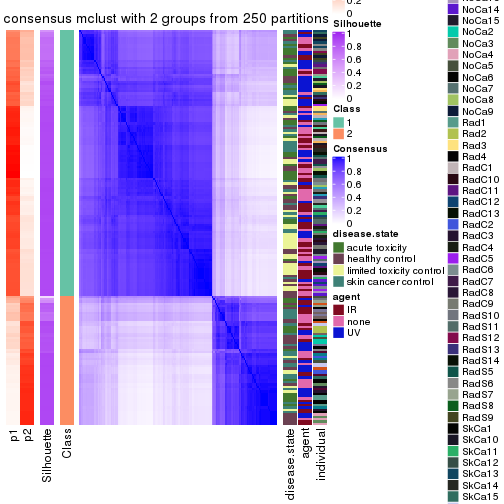</p>

</div>
<div id='tab-SD-mclust-consensus-heatmap-2'>
<pre><code class="r">consensus_heatmap(res, k = 3)
</code></pre>

<p>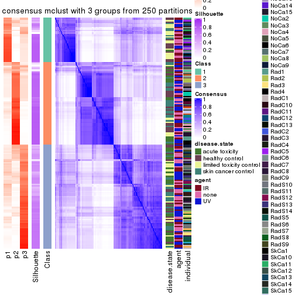</p>

</div>
<div id='tab-SD-mclust-consensus-heatmap-3'>
<pre><code class="r">consensus_heatmap(res, k = 4)
</code></pre>

<p>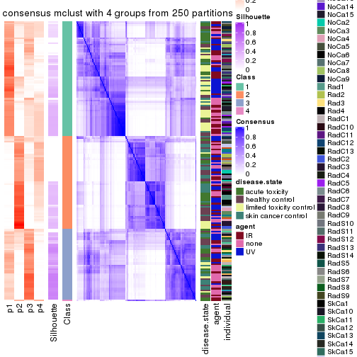</p>

</div>
<div id='tab-SD-mclust-consensus-heatmap-4'>
<pre><code class="r">consensus_heatmap(res, k = 5)
</code></pre>

<p>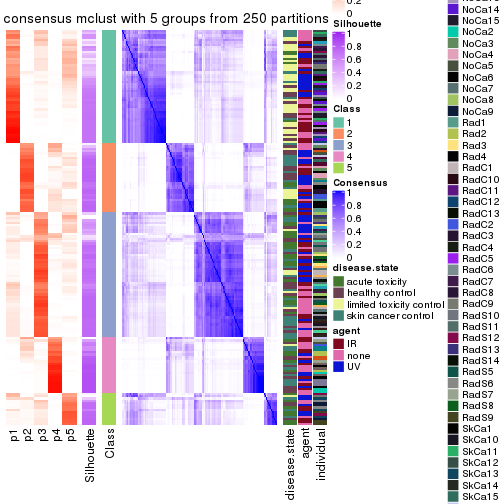</p>

</div>
<div id='tab-SD-mclust-consensus-heatmap-5'>
<pre><code class="r">consensus_heatmap(res, k = 6)
</code></pre>

<p>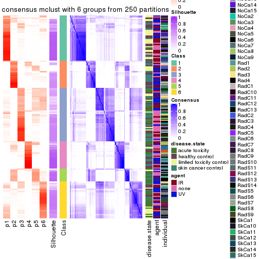</p>

</div>
</div>

Heatmaps for the membership of samples in all partitions to see how consistent they are:


<script>
$( function() {
	$( '#tabs-SD-mclust-membership-heatmap' ).tabs();
} );
</script>
<div id='tabs-SD-mclust-membership-heatmap'>
<ul>
<li><a href='#tab-SD-mclust-membership-heatmap-1'>k = 2</a></li>
<li><a href='#tab-SD-mclust-membership-heatmap-2'>k = 3</a></li>
<li><a href='#tab-SD-mclust-membership-heatmap-3'>k = 4</a></li>
<li><a href='#tab-SD-mclust-membership-heatmap-4'>k = 5</a></li>
<li><a href='#tab-SD-mclust-membership-heatmap-5'>k = 6</a></li>
</ul>
<div id='tab-SD-mclust-membership-heatmap-1'>
<pre><code class="r">membership_heatmap(res, k = 2)
</code></pre>

<p>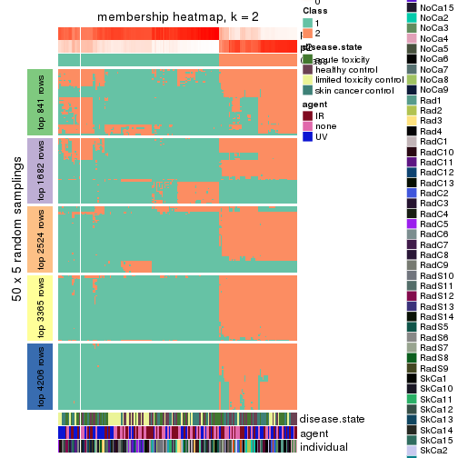</p>

</div>
<div id='tab-SD-mclust-membership-heatmap-2'>
<pre><code class="r">membership_heatmap(res, k = 3)
</code></pre>

<p>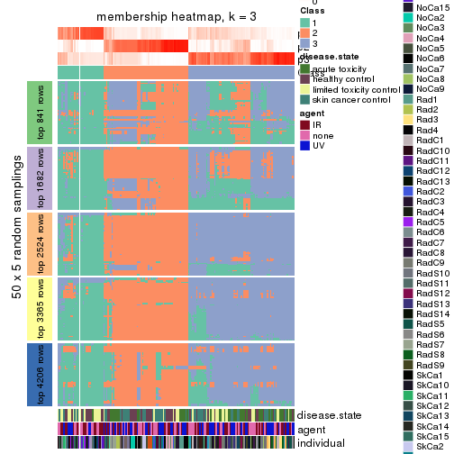</p>

</div>
<div id='tab-SD-mclust-membership-heatmap-3'>
<pre><code class="r">membership_heatmap(res, k = 4)
</code></pre>

<p>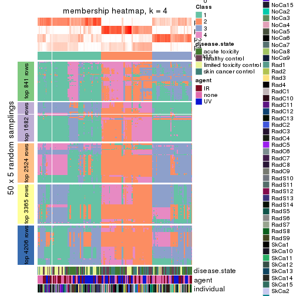</p>

</div>
<div id='tab-SD-mclust-membership-heatmap-4'>
<pre><code class="r">membership_heatmap(res, k = 5)
</code></pre>

<p>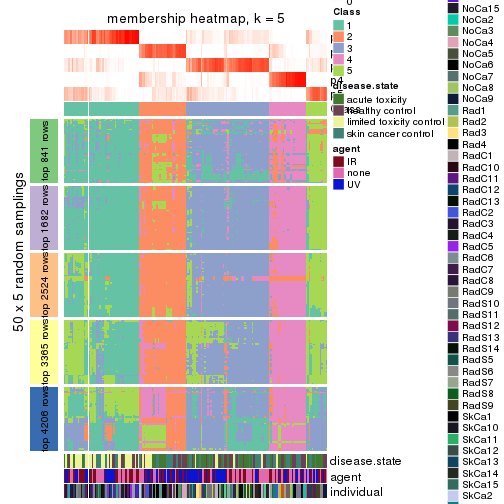</p>

</div>
<div id='tab-SD-mclust-membership-heatmap-5'>
<pre><code class="r">membership_heatmap(res, k = 6)
</code></pre>

<p>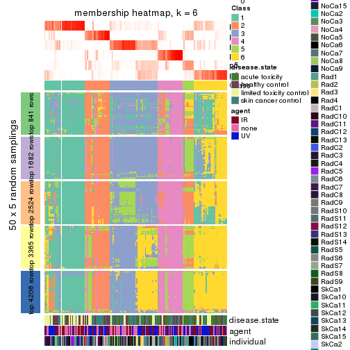</p>

</div>
</div>

As soon as we have had the classes for columns, we can look for signatures
which are significantly different between classes which can be candidate marks
for certain classes. Following are the heatmaps for signatures.


Signature heatmaps where rows are scaled:


<script>
$( function() {
	$( '#tabs-SD-mclust-get-signatures' ).tabs();
} );
</script>
<div id='tabs-SD-mclust-get-signatures'>
<ul>
<li><a href='#tab-SD-mclust-get-signatures-1'>k = 2</a></li>
<li><a href='#tab-SD-mclust-get-signatures-2'>k = 3</a></li>
<li><a href='#tab-SD-mclust-get-signatures-3'>k = 4</a></li>
<li><a href='#tab-SD-mclust-get-signatures-4'>k = 5</a></li>
<li><a href='#tab-SD-mclust-get-signatures-5'>k = 6</a></li>
</ul>
<div id='tab-SD-mclust-get-signatures-1'>
<pre><code class="r">get_signatures(res, k = 2)
</code></pre>

<pre><code>#&gt; Error in mat[ceiling(1:nr/h_ratio), ceiling(1:nc/w_ratio), drop = FALSE]: subscript out of bounds
</code></pre>

<p>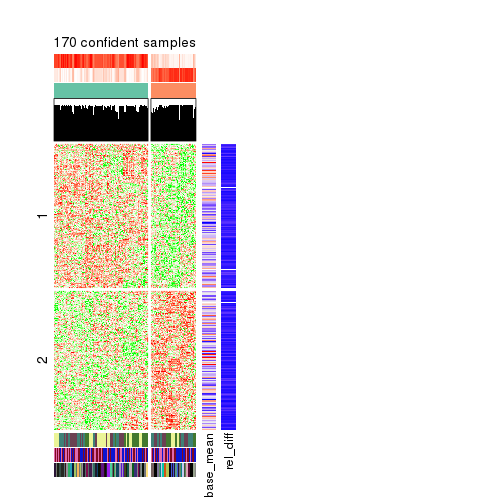</p>

</div>
<div id='tab-SD-mclust-get-signatures-2'>
<pre><code class="r">get_signatures(res, k = 3)
</code></pre>

<p>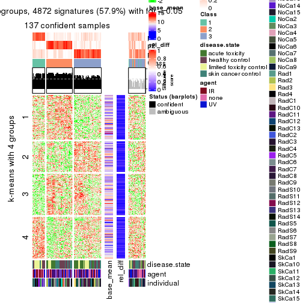</p>

</div>
<div id='tab-SD-mclust-get-signatures-3'>
<pre><code class="r">get_signatures(res, k = 4)
</code></pre>

<p></p>

</div>
<div id='tab-SD-mclust-get-signatures-4'>
<pre><code class="r">get_signatures(res, k = 5)
</code></pre>

<p>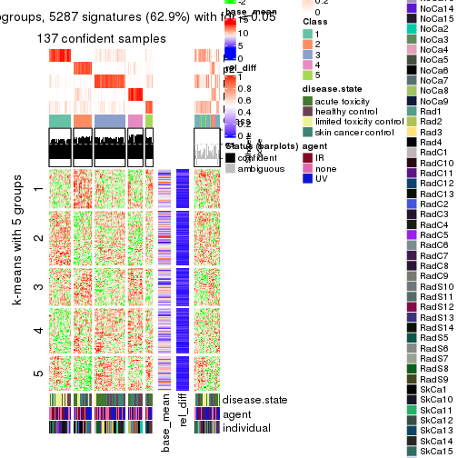</p>

</div>
<div id='tab-SD-mclust-get-signatures-5'>
<pre><code class="r">get_signatures(res, k = 6)
</code></pre>

<p>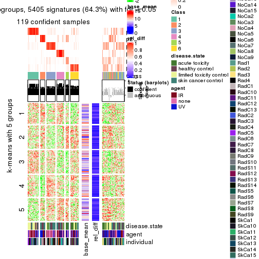</p>

</div>
</div>


Signature heatmaps where rows are not scaled:


<script>
$( function() {
	$( '#tabs-SD-mclust-get-signatures-no-scale' ).tabs();
} );
</script>
<div id='tabs-SD-mclust-get-signatures-no-scale'>
<ul>
<li><a href='#tab-SD-mclust-get-signatures-no-scale-1'>k = 2</a></li>
<li><a href='#tab-SD-mclust-get-signatures-no-scale-2'>k = 3</a></li>
<li><a href='#tab-SD-mclust-get-signatures-no-scale-3'>k = 4</a></li>
<li><a href='#tab-SD-mclust-get-signatures-no-scale-4'>k = 5</a></li>
<li><a href='#tab-SD-mclust-get-signatures-no-scale-5'>k = 6</a></li>
</ul>
<div id='tab-SD-mclust-get-signatures-no-scale-1'>
<pre><code class="r">get_signatures(res, k = 2, scale_rows = FALSE)
</code></pre>

<p>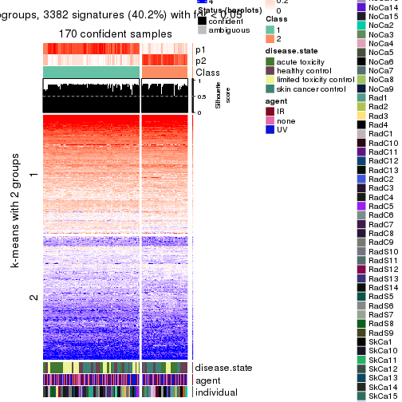</p>

</div>
<div id='tab-SD-mclust-get-signatures-no-scale-2'>
<pre><code class="r">get_signatures(res, k = 3, scale_rows = FALSE)
</code></pre>

<p>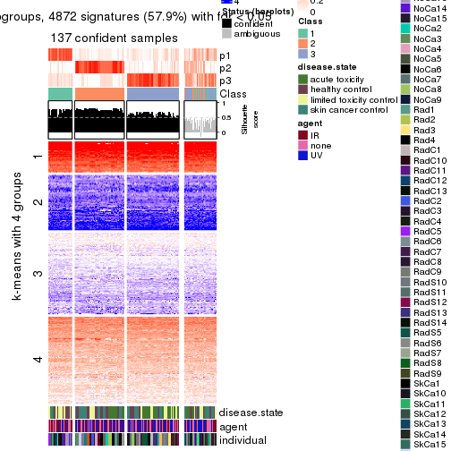</p>

</div>
<div id='tab-SD-mclust-get-signatures-no-scale-3'>
<pre><code class="r">get_signatures(res, k = 4, scale_rows = FALSE)
</code></pre>

<p></p>

</div>
<div id='tab-SD-mclust-get-signatures-no-scale-4'>
<pre><code class="r">get_signatures(res, k = 5, scale_rows = FALSE)
</code></pre>

<p>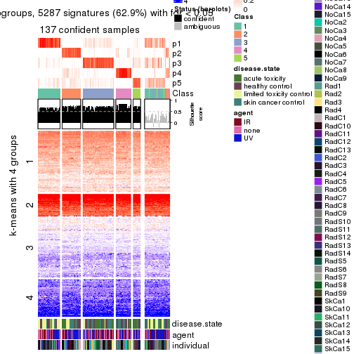</p>

</div>
<div id='tab-SD-mclust-get-signatures-no-scale-5'>
<pre><code class="r">get_signatures(res, k = 6, scale_rows = FALSE)
</code></pre>

<p>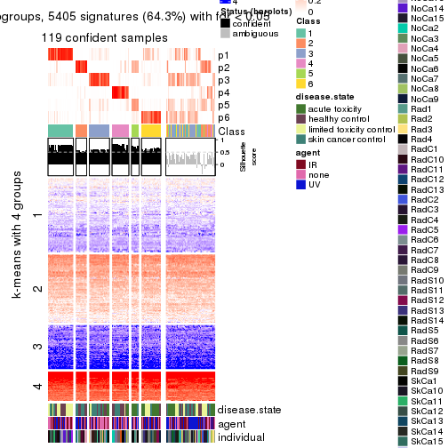</p>

</div>
</div>


Compare the overlap of signatures from different k:

```r
compare_signatures(res)
```

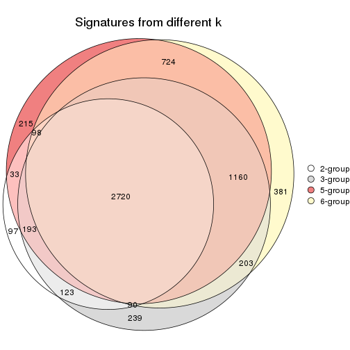

`get_signature()` returns a data frame invisibly. TO get the list of signatures, the function
call should be assigned to a variable explicitly. In following code, if `plot` argument is set
to `FALSE`, no heatmap is plotted while only the differential analysis is performed.

```r
# code only for demonstration
tb = get_signature(res, k = ..., plot = FALSE)
```

An example of the output of `tb` is:

```
#>   which_row         fdr    mean_1    mean_2 scaled_mean_1 scaled_mean_2 km
#> 1        38 0.042760348  8.373488  9.131774    -0.5533452     0.5164555  1
#> 2        40 0.018707592  7.106213  8.469186    -0.6173731     0.5762149  1
#> 3        55 0.019134737 10.221463 11.207825    -0.6159697     0.5749050  1
#> 4        59 0.006059896  5.921854  7.869574    -0.6899429     0.6439467  1
#> 5        60 0.018055526  8.928898 10.211722    -0.6204761     0.5791110  1
#> 6        98 0.009384629 15.714769 14.887706     0.6635654    -0.6193277  2
...
```

The columns in `tb` are:

1. `which_row`: row indices corresponding to the input matrix.
2. `fdr`: FDR for the differential test. 
3. `mean_x`: The mean value in group x.
4. `scaled_mean_x`: The mean value in group x after rows are scaled.
5. `km`: Row groups if k-means clustering is applied to rows.


UMAP plot which shows how samples are separated.


<script>
$( function() {
	$( '#tabs-SD-mclust-dimension-reduction' ).tabs();
} );
</script>
<div id='tabs-SD-mclust-dimension-reduction'>
<ul>
<li><a href='#tab-SD-mclust-dimension-reduction-1'>k = 2</a></li>
<li><a href='#tab-SD-mclust-dimension-reduction-2'>k = 3</a></li>
<li><a href='#tab-SD-mclust-dimension-reduction-3'>k = 4</a></li>
<li><a href='#tab-SD-mclust-dimension-reduction-4'>k = 5</a></li>
<li><a href='#tab-SD-mclust-dimension-reduction-5'>k = 6</a></li>
</ul>
<div id='tab-SD-mclust-dimension-reduction-1'>
<pre><code class="r">dimension_reduction(res, k = 2, method = &quot;UMAP&quot;)
</code></pre>

<p>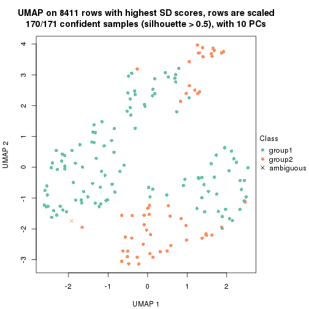</p>

</div>
<div id='tab-SD-mclust-dimension-reduction-2'>
<pre><code class="r">dimension_reduction(res, k = 3, method = &quot;UMAP&quot;)
</code></pre>

<p>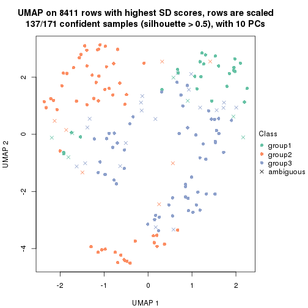</p>

</div>
<div id='tab-SD-mclust-dimension-reduction-3'>
<pre><code class="r">dimension_reduction(res, k = 4, method = &quot;UMAP&quot;)
</code></pre>

<p>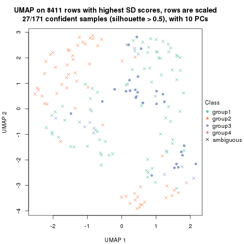</p>

</div>
<div id='tab-SD-mclust-dimension-reduction-4'>
<pre><code class="r">dimension_reduction(res, k = 5, method = &quot;UMAP&quot;)
</code></pre>

<p>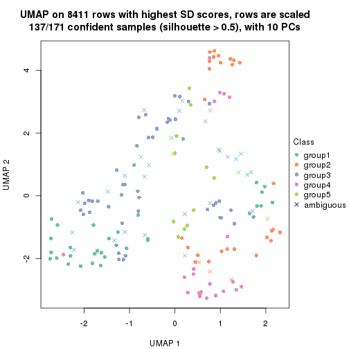</p>

</div>
<div id='tab-SD-mclust-dimension-reduction-5'>
<pre><code class="r">dimension_reduction(res, k = 6, method = &quot;UMAP&quot;)
</code></pre>

<p>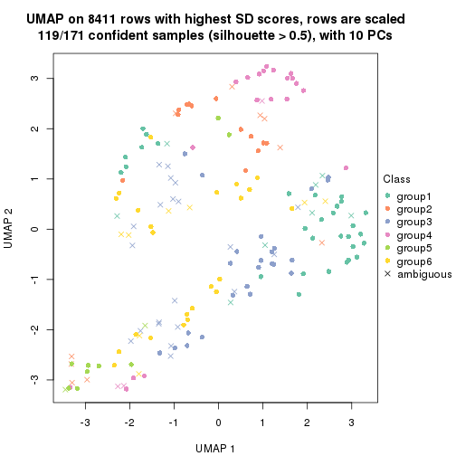</p>

</div>
</div>


Following heatmap shows how subgroups are split when increasing `k`:

```r
collect_classes(res)
```

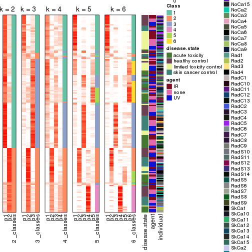


Test correlation between subgroups and known annotations. If the known
annotation is numeric, one-way ANOVA test is applied, and if the known
annotation is discrete, chi-squared contingency table test is applied.

```r
test_to_known_factors(res)
```

```
#>             n disease.state(p) agent(p) individual(p) k
#> SD:mclust 170         4.67e-02   0.6726      1.24e-11 2
#> SD:mclust 137         5.56e-05   0.3646      3.32e-14 3
#> SD:mclust  27               NA       NA            NA 4
#> SD:mclust 137         8.71e-06   0.6253      9.79e-25 5
#> SD:mclust 119         5.69e-09   0.0687      4.96e-19 6
```


If matrix rows can be associated to genes, consider to use `functional_enrichment(res,
...)` to perform function enrichment for the signature genes. See [this vignette](http://bioconductor.org/packages/devel/bioc/vignettes/cola/inst/doc/functional_enrichment.html) for more detailed explanations.


 

---------------------------------------------------


### SD:NMF


The object with results only for a single top-value method and a single partition method 
can be extracted as:

```r
res = res_list["SD", "NMF"]
# you can also extract it by
# res = res_list["SD:NMF"]
```

A summary of `res` and all the functions that can be applied to it:

```r
res
```

```
#> A 'ConsensusPartition' object with k = 2, 3, 4, 5, 6.
#>   On a matrix with 8411 rows and 171 columns.
#>   Top rows (841, 1682, 2524, 3365, 4206) are extracted by 'SD' method.
#>   Subgroups are detected by 'NMF' method.
#>   Performed in total 1250 partitions by row resampling.
#>   Best k for subgroups seems to be 2.
#> 
#> Following methods can be applied to this 'ConsensusPartition' object:
#>  [1] "cola_report"             "collect_classes"         "collect_plots"          
#>  [4] "collect_stats"           "colnames"                "compare_signatures"     
#>  [7] "consensus_heatmap"       "dimension_reduction"     "functional_enrichment"  
#> [10] "get_anno_col"            "get_anno"                "get_classes"            
#> [13] "get_consensus"           "get_matrix"              "get_membership"         
#> [16] "get_param"               "get_signatures"          "get_stats"              
#> [19] "is_best_k"               "is_stable_k"             "membership_heatmap"     
#> [22] "ncol"                    "nrow"                    "plot_ecdf"              
#> [25] "rownames"                "select_partition_number" "show"                   
#> [28] "suggest_best_k"          "test_to_known_factors"
```

`collect_plots()` function collects all the plots made from `res` for all `k` (number of partitions)
into one single page to provide an easy and fast comparison between different `k`.

```r
collect_plots(res)
```

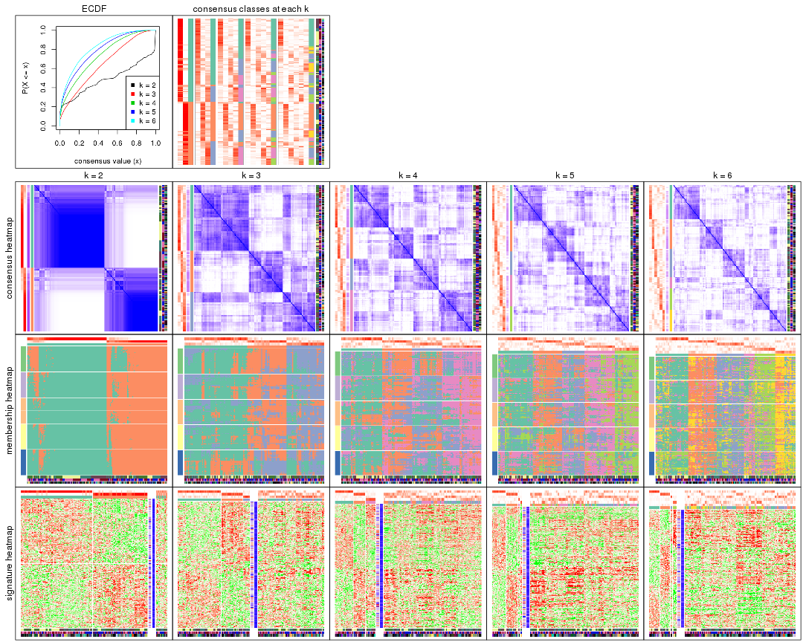

The plots are:

- The first row: a plot of the ECDF (empirical cumulative distribution
  function) curves of the consensus matrix for each `k` and the heatmap of
  predicted classes for each `k`.
- The second row: heatmaps of the consensus matrix for each `k`.
- The third row: heatmaps of the membership matrix for each `k`.
- The fouth row: heatmaps of the signatures for each `k`.

All the plots in panels can be made by individual functions and they are
plotted later in this section.

`select_partition_number()` produces several plots showing different
statistics for choosing "optimized" `k`. There are following statistics:

- ECDF curves of the consensus matrix for each `k`;
- 1-PAC. [The PAC
  score](https://en.wikipedia.org/wiki/Consensus_clustering#Over-interpretation_potential_of_consensus_clustering)
  measures the proportion of the ambiguous subgrouping.
- Mean silhouette score.
- Concordance. The mean probability of fiting the consensus class ids in all
  partitions.
- Area increased. Denote $A_k$ as the area under the ECDF curve for current
  `k`, the area increased is defined as $A_k - A_{k-1}$.
- Rand index. The percent of pairs of samples that are both in a same cluster
  or both are not in a same cluster in the partition of k and k-1.
- Jaccard index. The ratio of pairs of samples are both in a same cluster in
  the partition of k and k-1 and the pairs of samples are both in a same
  cluster in the partition k or k-1.

The detailed explanations of these statistics can be found in [the _cola_
vignette](http://bioconductor.org/packages/devel/bioc/vignettes/cola/inst/doc/cola.html#toc_13).

Generally speaking, lower PAC score, higher mean silhouette score or higher
concordance corresponds to better partition. Rand index and Jaccard index
measure how similar the current partition is compared to partition with `k-1`.
If they are too similar, we won't accept `k` is better than `k-1`.

```r
select_partition_number(res)
```

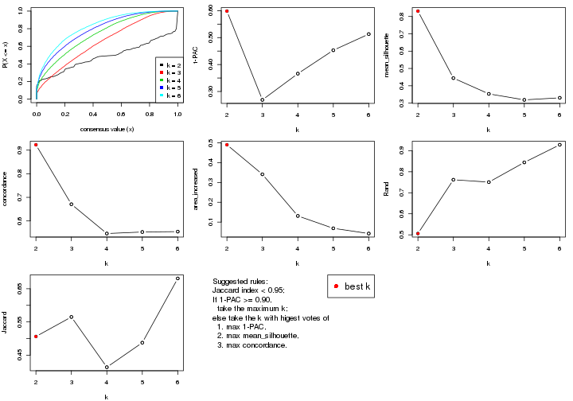

The numeric values for all these statistics can be obtained by `get_stats()`.

```r
get_stats(res)
```

```
#>   k 1-PAC mean_silhouette concordance area_increased  Rand Jaccard
#> 2 2 0.598           0.831       0.923         0.4902 0.506   0.506
#> 3 3 0.269           0.444       0.671         0.3412 0.762   0.565
#> 4 4 0.366           0.353       0.547         0.1312 0.751   0.414
#> 5 5 0.453           0.319       0.553         0.0687 0.844   0.488
#> 6 6 0.513           0.331       0.555         0.0424 0.928   0.681
```

`suggest_best_k()` suggests the best $k$ based on these statistics. The rules are as follows:

- All $k$ with Jaccard index larger than 0.95 are removed because increasing
  $k$ does not provide enough extra information. If all $k$ are removed, it is
  marked as no subgroup is detected.
- For all $k$ with 1-PAC score larger than 0.9, the maximal $k$ is taken as
  the best $k$, and other $k$ are marked as optional $k$.
- If it does not fit the second rule. The $k$ with the maximal vote of the
  highest 1-PAC score, highest mean silhouette, and highest concordance is
  taken as the best $k$.

```r
suggest_best_k(res)
```

```
#> [1] 2
```


Following shows the table of the partitions (You need to click the **show/hide
code output** link to see it). The membership matrix (columns with name `p*`)
is inferred by
[`clue::cl_consensus()`](https://www.rdocumentation.org/link/cl_consensus?package=clue)
function with the `SE` method. Basically the value in the membership matrix
represents the probability to belong to a certain group. The finall class
label for an item is determined with the group with highest probability it
belongs to.

In `get_classes()` function, the entropy is calculated from the membership
matrix and the silhouette score is calculated from the consensus matrix.


<script>
$( function() {
	$( '#tabs-SD-NMF-get-classes' ).tabs();
} );
</script>
<div id='tabs-SD-NMF-get-classes'>
<ul>
<li><a href='#tab-SD-NMF-get-classes-1'>k = 2</a></li>
<li><a href='#tab-SD-NMF-get-classes-2'>k = 3</a></li>
<li><a href='#tab-SD-NMF-get-classes-3'>k = 4</a></li>
<li><a href='#tab-SD-NMF-get-classes-4'>k = 5</a></li>
<li><a href='#tab-SD-NMF-get-classes-5'>k = 6</a></li>
</ul>

<div id='tab-SD-NMF-get-classes-1'>
<p><a id='tab-SD-NMF-get-classes-1-a' style='color:#0366d6' href='#'>show/hide code output</a></p>
<pre><code class="r">cbind(get_classes(res, k = 2), get_membership(res, k = 2))
</code></pre>

<pre><code>#&gt;          class entropy silhouette    p1    p2
#&gt; GSM29783     2  0.3584      0.866 0.068 0.932
#&gt; GSM29786     2  0.7299      0.765 0.204 0.796
#&gt; GSM29789     2  0.0000      0.894 0.000 1.000
#&gt; GSM29792     2  0.0000      0.894 0.000 1.000
#&gt; GSM29795     2  0.8499      0.679 0.276 0.724
#&gt; GSM29798     2  0.9686      0.444 0.396 0.604
#&gt; GSM29801     1  0.0000      0.926 1.000 0.000
#&gt; GSM29804     1  0.0000      0.926 1.000 0.000
#&gt; GSM29807     2  0.5408      0.811 0.124 0.876
#&gt; GSM29816     1  0.0000      0.926 1.000 0.000
#&gt; GSM29821     1  0.0000      0.926 1.000 0.000
#&gt; GSM29824     1  0.0000      0.926 1.000 0.000
#&gt; GSM29827     1  0.0000      0.926 1.000 0.000
#&gt; GSM29830     1  0.0000      0.926 1.000 0.000
#&gt; GSM29833     1  0.0000      0.926 1.000 0.000
#&gt; GSM29784     2  0.0376      0.893 0.004 0.996
#&gt; GSM29787     2  0.8386      0.686 0.268 0.732
#&gt; GSM29790     2  0.0000      0.894 0.000 1.000
#&gt; GSM29793     2  0.0000      0.894 0.000 1.000
#&gt; GSM29796     2  0.6148      0.813 0.152 0.848
#&gt; GSM29799     1  0.4161      0.863 0.916 0.084
#&gt; GSM29802     1  0.0000      0.926 1.000 0.000
#&gt; GSM29805     1  0.0000      0.926 1.000 0.000
#&gt; GSM29814     2  0.9661      0.330 0.392 0.608
#&gt; GSM29817     1  0.0000      0.926 1.000 0.000
#&gt; GSM29822     1  0.0000      0.926 1.000 0.000
#&gt; GSM29825     1  0.0000      0.926 1.000 0.000
#&gt; GSM29828     1  0.0000      0.926 1.000 0.000
#&gt; GSM29831     1  0.0000      0.926 1.000 0.000
#&gt; GSM29834     1  0.0000      0.926 1.000 0.000
#&gt; GSM29785     2  0.0000      0.894 0.000 1.000
#&gt; GSM29788     2  0.6438      0.804 0.164 0.836
#&gt; GSM29791     2  0.0000      0.894 0.000 1.000
#&gt; GSM29794     2  0.0000      0.894 0.000 1.000
#&gt; GSM29797     2  0.0376      0.893 0.004 0.996
#&gt; GSM29800     2  0.6887      0.785 0.184 0.816
#&gt; GSM29803     1  0.8443      0.590 0.728 0.272
#&gt; GSM29806     1  0.9460      0.465 0.636 0.364
#&gt; GSM29815     2  0.0000      0.894 0.000 1.000
#&gt; GSM29819     1  0.0000      0.926 1.000 0.000
#&gt; GSM29823     1  0.8813      0.525 0.700 0.300
#&gt; GSM29826     1  0.0000      0.926 1.000 0.000
#&gt; GSM29829     1  0.0000      0.926 1.000 0.000
#&gt; GSM29832     1  0.1414      0.914 0.980 0.020
#&gt; GSM29835     2  0.9732      0.424 0.404 0.596
#&gt; GSM29836     2  0.0000      0.894 0.000 1.000
#&gt; GSM29839     2  0.7056      0.778 0.192 0.808
#&gt; GSM29842     2  0.0376      0.893 0.004 0.996
#&gt; GSM29845     2  0.9209      0.578 0.336 0.664
#&gt; GSM29848     2  0.8443      0.683 0.272 0.728
#&gt; GSM29851     1  0.0000      0.926 1.000 0.000
#&gt; GSM29854     1  0.0000      0.926 1.000 0.000
#&gt; GSM29857     1  0.0000      0.926 1.000 0.000
#&gt; GSM29860     2  0.0000      0.894 0.000 1.000
#&gt; GSM29863     1  0.0376      0.924 0.996 0.004
#&gt; GSM29866     1  0.0000      0.926 1.000 0.000
#&gt; GSM29869     1  0.1184      0.917 0.984 0.016
#&gt; GSM29872     2  0.8327      0.628 0.264 0.736
#&gt; GSM29875     1  0.0000      0.926 1.000 0.000
#&gt; GSM29878     2  0.0376      0.893 0.004 0.996
#&gt; GSM29837     2  0.0000      0.894 0.000 1.000
#&gt; GSM29840     2  0.6801      0.790 0.180 0.820
#&gt; GSM29843     2  0.0672      0.892 0.008 0.992
#&gt; GSM29846     2  0.9850      0.320 0.428 0.572
#&gt; GSM29849     1  0.7883      0.666 0.764 0.236
#&gt; GSM29852     1  0.0000      0.926 1.000 0.000
#&gt; GSM29855     1  0.0000      0.926 1.000 0.000
#&gt; GSM29858     1  0.0000      0.926 1.000 0.000
#&gt; GSM29861     2  0.0000      0.894 0.000 1.000
#&gt; GSM29864     1  0.0000      0.926 1.000 0.000
#&gt; GSM29867     1  0.0000      0.926 1.000 0.000
#&gt; GSM29870     1  0.0000      0.926 1.000 0.000
#&gt; GSM29873     1  0.9795      0.328 0.584 0.416
#&gt; GSM29876     1  0.0000      0.926 1.000 0.000
#&gt; GSM29879     1  0.5842      0.815 0.860 0.140
#&gt; GSM29838     2  0.0000      0.894 0.000 1.000
#&gt; GSM29841     2  0.0000      0.894 0.000 1.000
#&gt; GSM29844     2  0.0000      0.894 0.000 1.000
#&gt; GSM29847     2  0.0938      0.891 0.012 0.988
#&gt; GSM29850     2  0.6438      0.804 0.164 0.836
#&gt; GSM29853     1  0.0672      0.922 0.992 0.008
#&gt; GSM29856     2  0.7219      0.774 0.200 0.800
#&gt; GSM29859     2  0.8386      0.623 0.268 0.732
#&gt; GSM29862     2  0.0000      0.894 0.000 1.000
#&gt; GSM29865     2  0.9580      0.483 0.380 0.620
#&gt; GSM29868     1  0.9000      0.491 0.684 0.316
#&gt; GSM29871     1  0.9795      0.325 0.584 0.416
#&gt; GSM29874     2  0.0000      0.894 0.000 1.000
#&gt; GSM29877     1  0.0000      0.926 1.000 0.000
#&gt; GSM29880     2  0.0000      0.894 0.000 1.000
#&gt; GSM29881     1  0.2236      0.904 0.964 0.036
#&gt; GSM29884     2  0.0000      0.894 0.000 1.000
#&gt; GSM29887     2  0.0000      0.894 0.000 1.000
#&gt; GSM29890     1  0.0000      0.926 1.000 0.000
#&gt; GSM29893     1  0.0000      0.926 1.000 0.000
#&gt; GSM29896     1  0.0000      0.926 1.000 0.000
#&gt; GSM29899     1  0.0000      0.926 1.000 0.000
#&gt; GSM29902     1  0.0938      0.919 0.988 0.012
#&gt; GSM29905     1  0.0000      0.926 1.000 0.000
#&gt; GSM29908     1  0.0000      0.926 1.000 0.000
#&gt; GSM29955     1  0.0000      0.926 1.000 0.000
#&gt; GSM29958     1  0.0000      0.926 1.000 0.000
#&gt; GSM29961     1  0.0000      0.926 1.000 0.000
#&gt; GSM29882     1  0.0000      0.926 1.000 0.000
#&gt; GSM29885     2  0.0000      0.894 0.000 1.000
#&gt; GSM29888     2  0.0000      0.894 0.000 1.000
#&gt; GSM29891     1  0.0000      0.926 1.000 0.000
#&gt; GSM29894     1  0.0000      0.926 1.000 0.000
#&gt; GSM29897     1  0.0000      0.926 1.000 0.000
#&gt; GSM29900     1  0.0000      0.926 1.000 0.000
#&gt; GSM29903     1  0.0000      0.926 1.000 0.000
#&gt; GSM29906     1  0.0000      0.926 1.000 0.000
#&gt; GSM29909     1  0.1184      0.917 0.984 0.016
#&gt; GSM29956     1  0.0000      0.926 1.000 0.000
#&gt; GSM29959     1  0.0000      0.926 1.000 0.000
#&gt; GSM29962     1  0.0000      0.926 1.000 0.000
#&gt; GSM29883     1  0.2423      0.901 0.960 0.040
#&gt; GSM29886     2  0.0000      0.894 0.000 1.000
#&gt; GSM29889     2  0.0000      0.894 0.000 1.000
#&gt; GSM29892     1  0.1184      0.917 0.984 0.016
#&gt; GSM29895     2  0.8386      0.688 0.268 0.732
#&gt; GSM29898     1  0.0000      0.926 1.000 0.000
#&gt; GSM29901     1  0.0000      0.926 1.000 0.000
#&gt; GSM29904     1  0.9170      0.535 0.668 0.332
#&gt; GSM29907     1  0.0000      0.926 1.000 0.000
#&gt; GSM29910     2  0.7139      0.752 0.196 0.804
#&gt; GSM29957     2  0.1184      0.890 0.016 0.984
#&gt; GSM29960     1  0.8081      0.634 0.752 0.248
#&gt; GSM29963     2  0.4431      0.846 0.092 0.908
#&gt; GSM29964     2  0.0000      0.894 0.000 1.000
#&gt; GSM29967     2  0.0000      0.894 0.000 1.000
#&gt; GSM29970     1  0.5737      0.817 0.864 0.136
#&gt; GSM29973     2  0.0000      0.894 0.000 1.000
#&gt; GSM29976     1  0.0000      0.926 1.000 0.000
#&gt; GSM29979     2  0.0000      0.894 0.000 1.000
#&gt; GSM29982     2  0.6247      0.811 0.156 0.844
#&gt; GSM29985     1  0.0000      0.926 1.000 0.000
#&gt; GSM29988     2  0.9661      0.331 0.392 0.608
#&gt; GSM29991     1  0.9775      0.216 0.588 0.412
#&gt; GSM29994     1  0.2423      0.900 0.960 0.040
#&gt; GSM29997     1  0.7139      0.737 0.804 0.196
#&gt; GSM30000     1  0.9635      0.410 0.612 0.388
#&gt; GSM30003     1  0.0000      0.926 1.000 0.000
#&gt; GSM29965     2  0.0000      0.894 0.000 1.000
#&gt; GSM29968     2  0.0376      0.893 0.004 0.996
#&gt; GSM29971     1  0.4431      0.860 0.908 0.092
#&gt; GSM29974     2  0.0000      0.894 0.000 1.000
#&gt; GSM29977     1  0.0000      0.926 1.000 0.000
#&gt; GSM29980     2  0.2236      0.878 0.036 0.964
#&gt; GSM29983     1  0.2603      0.897 0.956 0.044
#&gt; GSM29986     1  0.0000      0.926 1.000 0.000
#&gt; GSM29989     1  0.9635      0.402 0.612 0.388
#&gt; GSM29992     1  0.0672      0.922 0.992 0.008
#&gt; GSM29995     1  0.0000      0.926 1.000 0.000
#&gt; GSM29998     1  0.7219      0.733 0.800 0.200
#&gt; GSM30001     1  0.7219      0.738 0.800 0.200
#&gt; GSM30004     1  0.0000      0.926 1.000 0.000
#&gt; GSM29966     2  0.0000      0.894 0.000 1.000
#&gt; GSM29969     2  0.0000      0.894 0.000 1.000
#&gt; GSM29972     2  0.3733      0.867 0.072 0.928
#&gt; GSM29975     2  0.0000      0.894 0.000 1.000
#&gt; GSM29978     1  0.0000      0.926 1.000 0.000
#&gt; GSM29981     2  0.0000      0.894 0.000 1.000
#&gt; GSM29984     2  0.5946      0.819 0.144 0.856
#&gt; GSM29987     1  0.7674      0.677 0.776 0.224
#&gt; GSM29990     2  0.1414      0.886 0.020 0.980
#&gt; GSM29993     2  0.7056      0.778 0.192 0.808
#&gt; GSM29996     1  0.5519      0.819 0.872 0.128
#&gt; GSM29999     1  0.9881      0.268 0.564 0.436
#&gt; GSM30002     2  0.0000      0.894 0.000 1.000
#&gt; GSM30005     1  0.4161      0.860 0.916 0.084
</code></pre>

<script>
$('#tab-SD-NMF-get-classes-1-a').parent().next().next().hide();
$('#tab-SD-NMF-get-classes-1-a').click(function(){
  $('#tab-SD-NMF-get-classes-1-a').parent().next().next().toggle();
  return(false);
});
</script>
</div>

<div id='tab-SD-NMF-get-classes-2'>
<p><a id='tab-SD-NMF-get-classes-2-a' style='color:#0366d6' href='#'>show/hide code output</a></p>
<pre><code class="r">cbind(get_classes(res, k = 3), get_membership(res, k = 3))
</code></pre>

<pre><code>#&gt;          class entropy silhouette    p1    p2    p3
#&gt; GSM29783     3  0.5335     0.3871 0.008 0.232 0.760
#&gt; GSM29786     3  0.3918     0.4989 0.012 0.120 0.868
#&gt; GSM29789     2  0.3983     0.6105 0.004 0.852 0.144
#&gt; GSM29792     2  0.4099     0.6062 0.008 0.852 0.140
#&gt; GSM29795     3  0.8857     0.3261 0.132 0.344 0.524
#&gt; GSM29798     3  0.4253     0.5615 0.080 0.048 0.872
#&gt; GSM29801     1  0.6897     0.5043 0.668 0.040 0.292
#&gt; GSM29804     1  0.3918     0.6496 0.868 0.012 0.120
#&gt; GSM29807     2  0.7923     0.4920 0.120 0.652 0.228
#&gt; GSM29816     1  0.5733     0.5301 0.676 0.000 0.324
#&gt; GSM29821     1  0.8230     0.3507 0.564 0.088 0.348
#&gt; GSM29824     1  0.3031     0.6629 0.912 0.012 0.076
#&gt; GSM29827     1  0.3587     0.6367 0.892 0.088 0.020
#&gt; GSM29830     1  0.4586     0.6421 0.856 0.048 0.096
#&gt; GSM29833     1  0.7721     0.5102 0.680 0.168 0.152
#&gt; GSM29784     3  0.4178     0.4359 0.000 0.172 0.828
#&gt; GSM29787     3  0.3637     0.5355 0.024 0.084 0.892
#&gt; GSM29790     2  0.5988     0.4653 0.000 0.632 0.368
#&gt; GSM29793     2  0.4504     0.5947 0.000 0.804 0.196
#&gt; GSM29796     3  0.6688     0.3499 0.028 0.308 0.664
#&gt; GSM29799     3  0.4555     0.4752 0.200 0.000 0.800
#&gt; GSM29802     1  0.6111     0.4288 0.604 0.000 0.396
#&gt; GSM29805     1  0.4555     0.6252 0.800 0.000 0.200
#&gt; GSM29814     2  0.9315     0.3096 0.220 0.520 0.260
#&gt; GSM29817     1  0.6235     0.3157 0.564 0.000 0.436
#&gt; GSM29822     1  0.6204     0.3895 0.576 0.000 0.424
#&gt; GSM29825     1  0.4654     0.6185 0.792 0.000 0.208
#&gt; GSM29828     1  0.2879     0.6539 0.924 0.024 0.052
#&gt; GSM29831     1  0.2845     0.6580 0.920 0.012 0.068
#&gt; GSM29834     1  0.6882     0.5762 0.732 0.096 0.172
#&gt; GSM29785     2  0.6308     0.2327 0.000 0.508 0.492
#&gt; GSM29788     3  0.5254     0.3533 0.000 0.264 0.736
#&gt; GSM29791     2  0.4002     0.5941 0.000 0.840 0.160
#&gt; GSM29794     2  0.3686     0.6069 0.000 0.860 0.140
#&gt; GSM29797     2  0.6225     0.1799 0.000 0.568 0.432
#&gt; GSM29800     3  0.3816     0.4649 0.000 0.148 0.852
#&gt; GSM29803     3  0.5850     0.5058 0.188 0.040 0.772
#&gt; GSM29806     3  0.9702    -0.0754 0.220 0.364 0.416
#&gt; GSM29815     2  0.6487     0.5438 0.032 0.700 0.268
#&gt; GSM29819     3  0.7757    -0.1439 0.464 0.048 0.488
#&gt; GSM29823     3  0.9208     0.3290 0.264 0.204 0.532
#&gt; GSM29826     1  0.6570     0.5345 0.680 0.028 0.292
#&gt; GSM29829     1  0.4755     0.5933 0.808 0.184 0.008
#&gt; GSM29832     1  0.6543     0.5705 0.748 0.176 0.076
#&gt; GSM29835     3  0.9997     0.1237 0.332 0.324 0.344
#&gt; GSM29836     2  0.4178     0.6224 0.000 0.828 0.172
#&gt; GSM29839     3  0.8113     0.1864 0.068 0.428 0.504
#&gt; GSM29842     2  0.6683     0.3026 0.008 0.496 0.496
#&gt; GSM29845     3  0.2918     0.5486 0.044 0.032 0.924
#&gt; GSM29848     3  0.5202     0.5227 0.044 0.136 0.820
#&gt; GSM29851     1  0.5058     0.5825 0.756 0.000 0.244
#&gt; GSM29854     1  0.7319     0.3323 0.548 0.032 0.420
#&gt; GSM29857     1  0.7308     0.5091 0.656 0.060 0.284
#&gt; GSM29860     2  0.3091     0.6316 0.016 0.912 0.072
#&gt; GSM29863     1  0.6832     0.3921 0.604 0.020 0.376
#&gt; GSM29866     1  0.3554     0.6531 0.900 0.036 0.064
#&gt; GSM29869     1  0.5435     0.5841 0.784 0.192 0.024
#&gt; GSM29872     2  0.7301     0.4259 0.308 0.640 0.052
#&gt; GSM29875     1  0.4702     0.6038 0.788 0.000 0.212
#&gt; GSM29878     2  0.7276     0.4827 0.192 0.704 0.104
#&gt; GSM29837     2  0.4974     0.6089 0.000 0.764 0.236
#&gt; GSM29840     3  0.7636     0.2136 0.048 0.396 0.556
#&gt; GSM29843     3  0.6470     0.1687 0.012 0.356 0.632
#&gt; GSM29846     3  0.2804     0.5482 0.060 0.016 0.924
#&gt; GSM29849     3  0.5787     0.5269 0.136 0.068 0.796
#&gt; GSM29852     1  0.5988     0.4745 0.632 0.000 0.368
#&gt; GSM29855     3  0.6398     0.0355 0.416 0.004 0.580
#&gt; GSM29858     1  0.6756     0.5594 0.712 0.056 0.232
#&gt; GSM29861     2  0.3722     0.6153 0.024 0.888 0.088
#&gt; GSM29864     1  0.6308     0.2171 0.508 0.000 0.492
#&gt; GSM29867     1  0.3038     0.6567 0.896 0.000 0.104
#&gt; GSM29870     1  0.3686     0.6533 0.860 0.000 0.140
#&gt; GSM29873     1  0.8566     0.1238 0.480 0.424 0.096
#&gt; GSM29876     1  0.5968     0.4834 0.636 0.000 0.364
#&gt; GSM29879     1  0.8918     0.3913 0.552 0.288 0.160
#&gt; GSM29838     2  0.4974     0.6100 0.000 0.764 0.236
#&gt; GSM29841     2  0.6314     0.2454 0.004 0.604 0.392
#&gt; GSM29844     2  0.5560     0.4765 0.000 0.700 0.300
#&gt; GSM29847     3  0.4555     0.4265 0.000 0.200 0.800
#&gt; GSM29850     3  0.5728     0.4007 0.008 0.272 0.720
#&gt; GSM29853     1  0.7029     0.2688 0.540 0.020 0.440
#&gt; GSM29856     3  0.7363     0.3020 0.040 0.372 0.588
#&gt; GSM29859     2  0.8984     0.3024 0.136 0.496 0.368
#&gt; GSM29862     2  0.2772     0.6321 0.004 0.916 0.080
#&gt; GSM29865     3  0.5608     0.5409 0.072 0.120 0.808
#&gt; GSM29868     1  0.7116     0.4259 0.636 0.324 0.040
#&gt; GSM29871     1  0.9550     0.0590 0.404 0.404 0.192
#&gt; GSM29874     2  0.2446     0.6211 0.052 0.936 0.012
#&gt; GSM29877     1  0.5760     0.5061 0.672 0.000 0.328
#&gt; GSM29880     2  0.2590     0.6258 0.004 0.924 0.072
#&gt; GSM29881     3  0.7039     0.2700 0.312 0.040 0.648
#&gt; GSM29884     2  0.6126     0.4826 0.000 0.600 0.400
#&gt; GSM29887     2  0.4654     0.6199 0.000 0.792 0.208
#&gt; GSM29890     1  0.0983     0.6584 0.980 0.004 0.016
#&gt; GSM29893     1  0.6644     0.5985 0.752 0.108 0.140
#&gt; GSM29896     1  0.3141     0.6572 0.912 0.020 0.068
#&gt; GSM29899     1  0.2173     0.6623 0.944 0.008 0.048
#&gt; GSM29902     1  0.7525     0.5237 0.684 0.208 0.108
#&gt; GSM29905     1  0.5067     0.6190 0.832 0.116 0.052
#&gt; GSM29908     1  0.5467     0.5792 0.792 0.176 0.032
#&gt; GSM29955     1  0.5455     0.5758 0.776 0.204 0.020
#&gt; GSM29958     1  0.6573     0.5813 0.756 0.140 0.104
#&gt; GSM29961     1  0.5743     0.5774 0.784 0.172 0.044
#&gt; GSM29882     3  0.6244    -0.0406 0.440 0.000 0.560
#&gt; GSM29885     3  0.6215    -0.1633 0.000 0.428 0.572
#&gt; GSM29888     2  0.6267     0.4382 0.000 0.548 0.452
#&gt; GSM29891     1  0.3715     0.6482 0.868 0.004 0.128
#&gt; GSM29894     1  0.5348     0.6213 0.796 0.028 0.176
#&gt; GSM29897     1  0.4744     0.6361 0.836 0.028 0.136
#&gt; GSM29900     1  0.5138     0.5941 0.748 0.000 0.252
#&gt; GSM29903     1  0.5165     0.6330 0.832 0.072 0.096
#&gt; GSM29906     1  0.5449     0.6259 0.816 0.068 0.116
#&gt; GSM29909     1  0.6046     0.6218 0.784 0.136 0.080
#&gt; GSM29956     1  0.4712     0.6200 0.848 0.108 0.044
#&gt; GSM29959     1  0.4558     0.6423 0.856 0.044 0.100
#&gt; GSM29962     1  0.3649     0.6536 0.896 0.036 0.068
#&gt; GSM29883     3  0.6753     0.0937 0.388 0.016 0.596
#&gt; GSM29886     2  0.6154     0.3678 0.000 0.592 0.408
#&gt; GSM29889     2  0.5431     0.5703 0.000 0.716 0.284
#&gt; GSM29892     1  0.5253     0.5849 0.792 0.188 0.020
#&gt; GSM29895     2  0.9892    -0.0952 0.268 0.392 0.340
#&gt; GSM29898     1  0.5897     0.6375 0.792 0.076 0.132
#&gt; GSM29901     1  0.6124     0.6055 0.744 0.036 0.220
#&gt; GSM29904     2  0.7164     0.0876 0.452 0.524 0.024
#&gt; GSM29907     1  0.7298     0.5487 0.700 0.200 0.100
#&gt; GSM29910     2  0.6684     0.4158 0.292 0.676 0.032
#&gt; GSM29957     2  0.4209     0.5877 0.120 0.860 0.020
#&gt; GSM29960     1  0.8491     0.3293 0.572 0.312 0.116
#&gt; GSM29963     2  0.6632     0.5288 0.204 0.732 0.064
#&gt; GSM29964     2  0.4842     0.6158 0.000 0.776 0.224
#&gt; GSM29967     3  0.5431     0.2928 0.000 0.284 0.716
#&gt; GSM29970     3  0.8137     0.2355 0.316 0.092 0.592
#&gt; GSM29973     2  0.4842     0.6170 0.000 0.776 0.224
#&gt; GSM29976     1  0.5919     0.5626 0.712 0.012 0.276
#&gt; GSM29979     2  0.5235     0.6181 0.036 0.812 0.152
#&gt; GSM29982     3  0.6420     0.3936 0.024 0.288 0.688
#&gt; GSM29985     1  0.7063     0.2335 0.516 0.020 0.464
#&gt; GSM29988     2  0.9400     0.3370 0.228 0.508 0.264
#&gt; GSM29991     3  0.8496     0.2121 0.324 0.112 0.564
#&gt; GSM29994     1  0.7844     0.4827 0.652 0.240 0.108
#&gt; GSM29997     1  0.6867     0.4451 0.672 0.288 0.040
#&gt; GSM30000     1  0.9059     0.0843 0.456 0.408 0.136
#&gt; GSM30003     1  0.5327     0.5768 0.728 0.000 0.272
#&gt; GSM29965     2  0.5859     0.4862 0.000 0.656 0.344
#&gt; GSM29968     3  0.4654     0.3778 0.000 0.208 0.792
#&gt; GSM29971     3  0.6975     0.1885 0.356 0.028 0.616
#&gt; GSM29974     2  0.4062     0.6292 0.000 0.836 0.164
#&gt; GSM29977     1  0.5956     0.5174 0.672 0.004 0.324
#&gt; GSM29980     2  0.8239     0.3623 0.080 0.532 0.388
#&gt; GSM29983     3  0.6931     0.2909 0.328 0.032 0.640
#&gt; GSM29986     3  0.6359     0.0551 0.404 0.004 0.592
#&gt; GSM29989     1  0.9690     0.0831 0.408 0.376 0.216
#&gt; GSM29992     3  0.7566    -0.0847 0.448 0.040 0.512
#&gt; GSM29995     1  0.4811     0.6115 0.828 0.148 0.024
#&gt; GSM29998     1  0.8160     0.4258 0.608 0.288 0.104
#&gt; GSM30001     1  0.9901     0.1514 0.404 0.300 0.296
#&gt; GSM30004     1  0.5733     0.5248 0.676 0.000 0.324
#&gt; GSM29966     2  0.4654     0.6280 0.000 0.792 0.208
#&gt; GSM29969     3  0.5810     0.1559 0.000 0.336 0.664
#&gt; GSM29972     3  0.7665     0.1873 0.060 0.340 0.600
#&gt; GSM29975     2  0.4974     0.6117 0.000 0.764 0.236
#&gt; GSM29978     1  0.6633     0.5543 0.700 0.040 0.260
#&gt; GSM29981     2  0.3816     0.6377 0.000 0.852 0.148
#&gt; GSM29984     3  0.5020     0.4552 0.012 0.192 0.796
#&gt; GSM29987     3  0.6208     0.4853 0.164 0.068 0.768
#&gt; GSM29990     2  0.7223     0.5524 0.140 0.716 0.144
#&gt; GSM29993     3  0.7493     0.4041 0.092 0.232 0.676
#&gt; GSM29996     1  0.6962     0.2431 0.568 0.412 0.020
#&gt; GSM29999     2  0.9820     0.2086 0.296 0.428 0.276
#&gt; GSM30002     2  0.7084     0.5160 0.044 0.652 0.304
#&gt; GSM30005     3  0.7905    -0.0961 0.444 0.056 0.500
</code></pre>

<script>
$('#tab-SD-NMF-get-classes-2-a').parent().next().next().hide();
$('#tab-SD-NMF-get-classes-2-a').click(function(){
  $('#tab-SD-NMF-get-classes-2-a').parent().next().next().toggle();
  return(false);
});
</script>
</div>

<div id='tab-SD-NMF-get-classes-3'>
<p><a id='tab-SD-NMF-get-classes-3-a' style='color:#0366d6' href='#'>show/hide code output</a></p>
<pre><code class="r">cbind(get_classes(res, k = 4), get_membership(res, k = 4))
</code></pre>

<pre><code>#&gt;          class entropy silhouette    p1    p2    p3    p4
#&gt; GSM29783     4   0.727   0.425974 0.036 0.208 0.132 0.624
#&gt; GSM29786     4   0.414   0.543704 0.004 0.112 0.052 0.832
#&gt; GSM29789     2   0.470   0.603223 0.104 0.816 0.024 0.056
#&gt; GSM29792     2   0.396   0.599282 0.116 0.844 0.024 0.016
#&gt; GSM29795     2   0.941   0.120853 0.296 0.356 0.100 0.248
#&gt; GSM29798     4   0.394   0.524806 0.036 0.112 0.008 0.844
#&gt; GSM29801     1   0.674   0.229014 0.572 0.060 0.020 0.348
#&gt; GSM29804     1   0.716   0.254789 0.504 0.000 0.352 0.144
#&gt; GSM29807     3   0.545   0.233543 0.020 0.340 0.636 0.004
#&gt; GSM29816     1   0.772   0.043064 0.408 0.000 0.228 0.364
#&gt; GSM29821     1   0.754   0.219859 0.544 0.108 0.032 0.316
#&gt; GSM29824     1   0.665   0.389064 0.584 0.000 0.304 0.112
#&gt; GSM29827     1   0.355   0.579799 0.860 0.044 0.096 0.000
#&gt; GSM29830     1   0.134   0.597824 0.964 0.024 0.008 0.004
#&gt; GSM29833     1   0.500   0.497119 0.760 0.192 0.008 0.040
#&gt; GSM29784     4   0.611   0.269881 0.024 0.304 0.032 0.640
#&gt; GSM29787     4   0.407   0.510370 0.020 0.132 0.016 0.832
#&gt; GSM29790     2   0.598   0.487244 0.036 0.672 0.024 0.268
#&gt; GSM29793     2   0.524   0.605379 0.088 0.788 0.028 0.096
#&gt; GSM29796     4   0.895  -0.015533 0.176 0.344 0.080 0.400
#&gt; GSM29799     4   0.385   0.579275 0.040 0.024 0.072 0.864
#&gt; GSM29802     4   0.704   0.352336 0.268 0.000 0.168 0.564
#&gt; GSM29805     1   0.754   0.292422 0.492 0.000 0.244 0.264
#&gt; GSM29814     3   0.691   0.370957 0.068 0.280 0.616 0.036
#&gt; GSM29817     4   0.639   0.241987 0.380 0.016 0.040 0.564
#&gt; GSM29822     4   0.639   0.262262 0.360 0.004 0.064 0.572
#&gt; GSM29825     1   0.718   0.364306 0.552 0.000 0.200 0.248
#&gt; GSM29828     1   0.201   0.600339 0.940 0.004 0.036 0.020
#&gt; GSM29831     1   0.347   0.585352 0.868 0.000 0.072 0.060
#&gt; GSM29834     1   0.516   0.530518 0.768 0.136 0.004 0.092
#&gt; GSM29785     2   0.604   0.459456 0.004 0.648 0.064 0.284
#&gt; GSM29788     4   0.569   0.381888 0.000 0.268 0.060 0.672
#&gt; GSM29791     2   0.349   0.608135 0.092 0.868 0.004 0.036
#&gt; GSM29794     2   0.321   0.603453 0.092 0.876 0.032 0.000
#&gt; GSM29797     2   0.699   0.398821 0.048 0.656 0.096 0.200
#&gt; GSM29800     4   0.424   0.501493 0.000 0.160 0.036 0.804
#&gt; GSM29803     4   0.490   0.564144 0.080 0.008 0.120 0.792
#&gt; GSM29806     3   0.625   0.432479 0.008 0.132 0.688 0.172
#&gt; GSM29815     3   0.526   0.124719 0.000 0.392 0.596 0.012
#&gt; GSM29819     4   0.723   0.262928 0.148 0.000 0.368 0.484
#&gt; GSM29823     4   0.857   0.181481 0.320 0.232 0.036 0.412
#&gt; GSM29826     3   0.771  -0.019829 0.228 0.000 0.424 0.348
#&gt; GSM29829     1   0.525   0.520254 0.744 0.080 0.176 0.000
#&gt; GSM29832     1   0.435   0.557969 0.824 0.096 0.076 0.004
#&gt; GSM29835     1   0.788   0.087599 0.500 0.356 0.064 0.080
#&gt; GSM29836     2   0.280   0.602002 0.000 0.884 0.108 0.008
#&gt; GSM29839     2   0.812   0.227069 0.288 0.456 0.016 0.240
#&gt; GSM29842     2   0.693   0.247960 0.024 0.508 0.056 0.412
#&gt; GSM29845     4   0.351   0.579929 0.016 0.052 0.052 0.880
#&gt; GSM29848     4   0.528   0.469323 0.068 0.156 0.012 0.764
#&gt; GSM29851     1   0.673   0.061293 0.496 0.000 0.092 0.412
#&gt; GSM29854     3   0.733  -0.159526 0.156 0.000 0.444 0.400
#&gt; GSM29857     3   0.794   0.118528 0.220 0.012 0.472 0.296
#&gt; GSM29860     2   0.440   0.567090 0.076 0.812 0.112 0.000
#&gt; GSM29863     4   0.761   0.290931 0.308 0.008 0.180 0.504
#&gt; GSM29866     1   0.182   0.594866 0.936 0.004 0.060 0.000
#&gt; GSM29869     1   0.507   0.536645 0.772 0.080 0.144 0.004
#&gt; GSM29872     3   0.734   0.181396 0.172 0.336 0.492 0.000
#&gt; GSM29875     1   0.612   0.321318 0.612 0.000 0.068 0.320
#&gt; GSM29878     2   0.640   0.337992 0.376 0.568 0.036 0.020
#&gt; GSM29837     2   0.545   0.243508 0.000 0.556 0.428 0.016
#&gt; GSM29840     2   0.823   0.178583 0.276 0.428 0.016 0.280
#&gt; GSM29843     2   0.765   0.081286 0.104 0.436 0.028 0.432
#&gt; GSM29846     4   0.373   0.581372 0.004 0.044 0.096 0.856
#&gt; GSM29849     4   0.572   0.475635 0.104 0.136 0.016 0.744
#&gt; GSM29852     4   0.688   0.184683 0.392 0.000 0.108 0.500
#&gt; GSM29855     4   0.611   0.496342 0.096 0.000 0.248 0.656
#&gt; GSM29858     3   0.790   0.079601 0.280 0.004 0.440 0.276
#&gt; GSM29861     2   0.652   0.561101 0.120 0.708 0.124 0.048
#&gt; GSM29864     4   0.629   0.454204 0.236 0.000 0.116 0.648
#&gt; GSM29867     1   0.610   0.486344 0.680 0.000 0.180 0.140
#&gt; GSM29870     1   0.581   0.501617 0.704 0.000 0.116 0.180
#&gt; GSM29873     3   0.735   0.434609 0.224 0.220 0.552 0.004
#&gt; GSM29876     4   0.722   0.177964 0.364 0.000 0.148 0.488
#&gt; GSM29879     1   0.809   0.328486 0.552 0.240 0.060 0.148
#&gt; GSM29838     2   0.496   0.475678 0.000 0.696 0.284 0.020
#&gt; GSM29841     2   0.680   0.470402 0.124 0.664 0.028 0.184
#&gt; GSM29844     2   0.426   0.602071 0.048 0.828 0.008 0.116
#&gt; GSM29847     4   0.534   0.473564 0.008 0.180 0.064 0.748
#&gt; GSM29850     4   0.670   0.298062 0.096 0.272 0.012 0.620
#&gt; GSM29853     4   0.662   0.382980 0.288 0.024 0.064 0.624
#&gt; GSM29856     4   0.813   0.279365 0.016 0.228 0.312 0.444
#&gt; GSM29859     3   0.514   0.427358 0.000 0.192 0.744 0.064
#&gt; GSM29862     2   0.471   0.551439 0.064 0.784 0.152 0.000
#&gt; GSM29865     4   0.573   0.538990 0.004 0.084 0.200 0.712
#&gt; GSM29868     1   0.762   0.309372 0.564 0.168 0.244 0.024
#&gt; GSM29871     3   0.699   0.494649 0.136 0.180 0.652 0.032
#&gt; GSM29874     2   0.653   0.324820 0.100 0.588 0.312 0.000
#&gt; GSM29877     4   0.700   0.107865 0.416 0.000 0.116 0.468
#&gt; GSM29880     2   0.423   0.581840 0.092 0.824 0.084 0.000
#&gt; GSM29881     4   0.565   0.477313 0.052 0.000 0.284 0.664
#&gt; GSM29884     2   0.538   0.555091 0.000 0.744 0.116 0.140
#&gt; GSM29887     2   0.367   0.601412 0.012 0.864 0.092 0.032
#&gt; GSM29890     1   0.515   0.512731 0.740 0.000 0.200 0.060
#&gt; GSM29893     1   0.514   0.552061 0.792 0.084 0.100 0.024
#&gt; GSM29896     1   0.469   0.552384 0.788 0.000 0.144 0.068
#&gt; GSM29899     1   0.616   0.431503 0.644 0.000 0.264 0.092
#&gt; GSM29902     3   0.528   0.079118 0.432 0.004 0.560 0.004
#&gt; GSM29905     1   0.567   0.160290 0.536 0.008 0.444 0.012
#&gt; GSM29908     1   0.446   0.555982 0.808 0.116 0.076 0.000
#&gt; GSM29955     1   0.553   0.497984 0.728 0.104 0.168 0.000
#&gt; GSM29958     1   0.360   0.555304 0.848 0.124 0.028 0.000
#&gt; GSM29961     1   0.453   0.545093 0.804 0.116 0.080 0.000
#&gt; GSM29882     4   0.594   0.527758 0.140 0.000 0.164 0.696
#&gt; GSM29885     2   0.663   0.225987 0.016 0.512 0.048 0.424
#&gt; GSM29888     2   0.713   0.422721 0.000 0.560 0.196 0.244
#&gt; GSM29891     1   0.719   0.323770 0.528 0.000 0.308 0.164
#&gt; GSM29894     1   0.391   0.589745 0.856 0.024 0.028 0.092
#&gt; GSM29897     1   0.251   0.594544 0.912 0.004 0.012 0.072
#&gt; GSM29900     1   0.727   0.349120 0.540 0.000 0.212 0.248
#&gt; GSM29903     1   0.606   0.377325 0.604 0.000 0.336 0.060
#&gt; GSM29906     1   0.651   0.234459 0.520 0.000 0.404 0.076
#&gt; GSM29909     1   0.624   0.561248 0.720 0.072 0.160 0.048
#&gt; GSM29956     1   0.284   0.578143 0.896 0.076 0.028 0.000
#&gt; GSM29959     1   0.199   0.598394 0.944 0.024 0.012 0.020
#&gt; GSM29962     1   0.367   0.599045 0.876 0.032 0.048 0.044
#&gt; GSM29883     4   0.634   0.442792 0.088 0.000 0.304 0.608
#&gt; GSM29886     2   0.436   0.595746 0.000 0.812 0.064 0.124
#&gt; GSM29889     2   0.367   0.590924 0.000 0.848 0.116 0.036
#&gt; GSM29892     1   0.600   0.118571 0.516 0.020 0.452 0.012
#&gt; GSM29895     1   0.894  -0.061910 0.408 0.344 0.160 0.088
#&gt; GSM29898     3   0.726  -0.037082 0.400 0.012 0.484 0.104
#&gt; GSM29901     3   0.787   0.055158 0.304 0.004 0.444 0.248
#&gt; GSM29904     3   0.689   0.300138 0.308 0.132 0.560 0.000
#&gt; GSM29907     3   0.556   0.346971 0.284 0.032 0.676 0.008
#&gt; GSM29910     1   0.785   0.022963 0.396 0.324 0.280 0.000
#&gt; GSM29957     2   0.741   0.267407 0.228 0.516 0.256 0.000
#&gt; GSM29960     1   0.632   0.350829 0.624 0.280 0.096 0.000
#&gt; GSM29963     3   0.805   0.091924 0.240 0.300 0.448 0.012
#&gt; GSM29964     2   0.576   0.363500 0.000 0.608 0.352 0.040
#&gt; GSM29967     4   0.672   0.423392 0.000 0.192 0.192 0.616
#&gt; GSM29970     3   0.635  -0.151756 0.064 0.000 0.520 0.416
#&gt; GSM29973     2   0.513   0.335303 0.000 0.604 0.388 0.008
#&gt; GSM29976     3   0.783  -0.000964 0.324 0.000 0.404 0.272
#&gt; GSM29979     3   0.504   0.077300 0.008 0.364 0.628 0.000
#&gt; GSM29982     4   0.818   0.199859 0.068 0.336 0.104 0.492
#&gt; GSM29985     4   0.742   0.204798 0.168 0.000 0.396 0.436
#&gt; GSM29988     3   0.477   0.406216 0.016 0.216 0.756 0.012
#&gt; GSM29991     4   0.739   0.251555 0.128 0.008 0.396 0.468
#&gt; GSM29994     3   0.573   0.244883 0.344 0.016 0.624 0.016
#&gt; GSM29997     3   0.611   0.210435 0.380 0.044 0.572 0.004
#&gt; GSM30000     3   0.650   0.408522 0.252 0.124 0.624 0.000
#&gt; GSM30003     1   0.787   0.033084 0.376 0.000 0.280 0.344
#&gt; GSM29965     3   0.700  -0.064450 0.000 0.416 0.468 0.116
#&gt; GSM29968     4   0.621   0.445942 0.000 0.196 0.136 0.668
#&gt; GSM29971     4   0.644   0.391139 0.080 0.000 0.356 0.564
#&gt; GSM29974     2   0.513   0.234375 0.000 0.552 0.444 0.004
#&gt; GSM29977     1   0.792   0.023762 0.344 0.000 0.324 0.332
#&gt; GSM29980     3   0.554   0.400017 0.000 0.180 0.724 0.096
#&gt; GSM29983     4   0.666   0.533142 0.112 0.084 0.096 0.708
#&gt; GSM29986     4   0.525   0.528157 0.056 0.000 0.220 0.724
#&gt; GSM29989     3   0.611   0.516727 0.096 0.124 0.736 0.044
#&gt; GSM29992     4   0.693   0.369749 0.136 0.000 0.308 0.556
#&gt; GSM29995     1   0.390   0.564968 0.832 0.036 0.132 0.000
#&gt; GSM29998     3   0.676   0.357942 0.264 0.076 0.632 0.028
#&gt; GSM30001     3   0.713   0.460544 0.108 0.068 0.664 0.160
#&gt; GSM30004     4   0.761   0.018595 0.392 0.000 0.200 0.408
#&gt; GSM29966     2   0.509   0.418791 0.000 0.660 0.324 0.016
#&gt; GSM29969     4   0.723   0.165982 0.000 0.352 0.152 0.496
#&gt; GSM29972     3   0.706   0.033981 0.000 0.148 0.540 0.312
#&gt; GSM29975     2   0.515   0.336640 0.000 0.596 0.396 0.008
#&gt; GSM29978     3   0.715   0.209231 0.252 0.000 0.556 0.192
#&gt; GSM29981     3   0.585  -0.242164 0.000 0.460 0.508 0.032
#&gt; GSM29984     4   0.682   0.399728 0.008 0.248 0.128 0.616
#&gt; GSM29987     4   0.510   0.413307 0.008 0.000 0.380 0.612
#&gt; GSM29990     3   0.562   0.265329 0.040 0.320 0.640 0.000
#&gt; GSM29993     4   0.797   0.237824 0.056 0.092 0.388 0.464
#&gt; GSM29996     3   0.690   0.166065 0.404 0.108 0.488 0.000
#&gt; GSM29999     3   0.418   0.478586 0.016 0.132 0.828 0.024
#&gt; GSM30002     3   0.549   0.248113 0.000 0.296 0.664 0.040
#&gt; GSM30005     4   0.700   0.235540 0.116 0.000 0.420 0.464
</code></pre>

<script>
$('#tab-SD-NMF-get-classes-3-a').parent().next().next().hide();
$('#tab-SD-NMF-get-classes-3-a').click(function(){
  $('#tab-SD-NMF-get-classes-3-a').parent().next().next().toggle();
  return(false);
});
</script>
</div>

<div id='tab-SD-NMF-get-classes-4'>
<p><a id='tab-SD-NMF-get-classes-4-a' style='color:#0366d6' href='#'>show/hide code output</a></p>
<pre><code class="r">cbind(get_classes(res, k = 5), get_membership(res, k = 5))
</code></pre>

<pre><code>#&gt;          class entropy silhouette    p1    p2    p3    p4    p5
#&gt; GSM29783     4   0.699    0.36227 0.020 0.180 0.096 0.616 0.088
#&gt; GSM29786     4   0.472    0.29905 0.000 0.016 0.016 0.672 0.296
#&gt; GSM29789     2   0.466    0.57881 0.104 0.792 0.044 0.052 0.008
#&gt; GSM29792     2   0.401    0.57721 0.156 0.800 0.016 0.004 0.024
#&gt; GSM29795     5   0.805    0.20201 0.288 0.136 0.016 0.108 0.452
#&gt; GSM29798     4   0.383    0.44923 0.012 0.028 0.012 0.828 0.120
#&gt; GSM29801     4   0.718    0.05406 0.412 0.060 0.056 0.444 0.028
#&gt; GSM29804     1   0.725    0.12215 0.432 0.000 0.368 0.148 0.052
#&gt; GSM29807     3   0.484    0.03641 0.016 0.428 0.552 0.000 0.004
#&gt; GSM29816     4   0.737    0.33041 0.212 0.000 0.276 0.464 0.048
#&gt; GSM29821     1   0.839   -0.02328 0.396 0.084 0.068 0.356 0.096
#&gt; GSM29824     1   0.687    0.13431 0.412 0.000 0.164 0.020 0.404
#&gt; GSM29827     1   0.207    0.58291 0.920 0.004 0.060 0.000 0.016
#&gt; GSM29830     1   0.315    0.58052 0.876 0.012 0.052 0.056 0.004
#&gt; GSM29833     1   0.597    0.41660 0.696 0.156 0.032 0.092 0.024
#&gt; GSM29784     4   0.521    0.23189 0.008 0.304 0.020 0.648 0.020
#&gt; GSM29787     4   0.483    0.32299 0.004 0.036 0.008 0.700 0.252
#&gt; GSM29790     2   0.541    0.52732 0.028 0.692 0.056 0.220 0.004
#&gt; GSM29793     2   0.422    0.58381 0.088 0.820 0.032 0.052 0.008
#&gt; GSM29796     2   0.901    0.08337 0.200 0.292 0.024 0.284 0.200
#&gt; GSM29799     4   0.318    0.51514 0.008 0.032 0.056 0.880 0.024
#&gt; GSM29802     4   0.561    0.49424 0.104 0.000 0.228 0.656 0.012
#&gt; GSM29805     3   0.709   -0.13131 0.268 0.000 0.376 0.344 0.012
#&gt; GSM29814     3   0.515    0.07668 0.020 0.432 0.536 0.012 0.000
#&gt; GSM29817     4   0.556    0.46012 0.224 0.012 0.060 0.684 0.020
#&gt; GSM29822     4   0.591    0.50691 0.188 0.004 0.112 0.668 0.028
#&gt; GSM29825     1   0.834    0.13729 0.376 0.000 0.244 0.200 0.180
#&gt; GSM29828     1   0.403    0.56351 0.812 0.016 0.112 0.060 0.000
#&gt; GSM29831     1   0.486    0.51645 0.740 0.004 0.156 0.096 0.004
#&gt; GSM29834     1   0.658    0.38162 0.636 0.152 0.040 0.156 0.016
#&gt; GSM29785     2   0.711    0.22397 0.000 0.472 0.028 0.224 0.276
#&gt; GSM29788     5   0.579    0.18104 0.000 0.064 0.012 0.392 0.532
#&gt; GSM29791     2   0.496    0.57521 0.148 0.760 0.028 0.012 0.052
#&gt; GSM29794     2   0.599    0.54206 0.168 0.668 0.032 0.004 0.128
#&gt; GSM29797     5   0.602    0.33519 0.080 0.204 0.012 0.036 0.668
#&gt; GSM29800     4   0.511    0.33813 0.000 0.060 0.012 0.688 0.240
#&gt; GSM29803     4   0.568    0.35519 0.004 0.000 0.100 0.608 0.288
#&gt; GSM29806     3   0.690    0.31856 0.028 0.076 0.632 0.168 0.096
#&gt; GSM29815     3   0.496   -0.05048 0.004 0.460 0.516 0.000 0.020
#&gt; GSM29819     4   0.631    0.37519 0.008 0.000 0.364 0.500 0.128
#&gt; GSM29823     5   0.809    0.12702 0.216 0.056 0.028 0.256 0.444
#&gt; GSM29826     5   0.750    0.29515 0.148 0.000 0.272 0.092 0.488
#&gt; GSM29829     1   0.490    0.52133 0.728 0.004 0.112 0.000 0.156
#&gt; GSM29832     1   0.493    0.50759 0.736 0.004 0.060 0.016 0.184
#&gt; GSM29835     1   0.745    0.27006 0.540 0.176 0.028 0.040 0.216
#&gt; GSM29836     2   0.540    0.52862 0.040 0.692 0.040 0.004 0.224
#&gt; GSM29839     2   0.806    0.16762 0.324 0.344 0.032 0.272 0.028
#&gt; GSM29842     2   0.620    0.35076 0.020 0.528 0.088 0.364 0.000
#&gt; GSM29845     4   0.427    0.47205 0.000 0.020 0.060 0.796 0.124
#&gt; GSM29848     4   0.530    0.40030 0.024 0.072 0.020 0.744 0.140
#&gt; GSM29851     4   0.668    0.38328 0.256 0.000 0.176 0.544 0.024
#&gt; GSM29854     5   0.778    0.19261 0.096 0.000 0.244 0.204 0.456
#&gt; GSM29857     3   0.563   -0.01846 0.068 0.004 0.536 0.392 0.000
#&gt; GSM29860     2   0.400    0.55265 0.076 0.804 0.116 0.000 0.004
#&gt; GSM29863     5   0.609    0.36945 0.072 0.000 0.060 0.228 0.640
#&gt; GSM29866     1   0.396    0.56584 0.820 0.004 0.120 0.036 0.020
#&gt; GSM29869     1   0.631    0.46346 0.652 0.104 0.160 0.084 0.000
#&gt; GSM29872     3   0.708   -0.07747 0.164 0.400 0.404 0.000 0.032
#&gt; GSM29875     4   0.735    0.19945 0.336 0.000 0.180 0.436 0.048
#&gt; GSM29878     2   0.595    0.27544 0.408 0.524 0.032 0.024 0.012
#&gt; GSM29837     2   0.473    0.29902 0.000 0.604 0.372 0.000 0.024
#&gt; GSM29840     2   0.793    0.20193 0.288 0.364 0.028 0.296 0.024
#&gt; GSM29843     2   0.691    0.20748 0.112 0.452 0.036 0.396 0.004
#&gt; GSM29846     4   0.463    0.49241 0.004 0.040 0.080 0.792 0.084
#&gt; GSM29849     4   0.544    0.42847 0.072 0.076 0.024 0.756 0.072
#&gt; GSM29852     4   0.560    0.49252 0.176 0.000 0.164 0.656 0.004
#&gt; GSM29855     4   0.707    0.25634 0.036 0.000 0.172 0.480 0.312
#&gt; GSM29858     3   0.609    0.08164 0.092 0.016 0.552 0.340 0.000
#&gt; GSM29861     2   0.424    0.54949 0.080 0.796 0.112 0.012 0.000
#&gt; GSM29864     4   0.699    0.40375 0.084 0.000 0.120 0.564 0.232
#&gt; GSM29867     1   0.694    0.19180 0.452 0.000 0.264 0.272 0.012
#&gt; GSM29870     1   0.768    0.07731 0.392 0.044 0.248 0.312 0.004
#&gt; GSM29873     3   0.575    0.18949 0.080 0.380 0.536 0.000 0.004
#&gt; GSM29876     4   0.658    0.46477 0.148 0.000 0.236 0.580 0.036
#&gt; GSM29879     2   0.813    0.15091 0.332 0.380 0.128 0.156 0.004
#&gt; GSM29838     2   0.628    0.42730 0.000 0.572 0.152 0.012 0.264
#&gt; GSM29841     2   0.840    0.33449 0.184 0.464 0.036 0.104 0.212
#&gt; GSM29844     2   0.648    0.52890 0.116 0.676 0.028 0.112 0.068
#&gt; GSM29847     4   0.595    0.07376 0.000 0.052 0.028 0.532 0.388
#&gt; GSM29850     4   0.714    0.26428 0.048 0.144 0.028 0.592 0.188
#&gt; GSM29853     4   0.594    0.42746 0.048 0.000 0.076 0.652 0.224
#&gt; GSM29856     5   0.281    0.50424 0.012 0.016 0.032 0.040 0.900
#&gt; GSM29859     3   0.649    0.36469 0.012 0.208 0.636 0.084 0.060
#&gt; GSM29862     2   0.588    0.52571 0.068 0.692 0.120 0.000 0.120
#&gt; GSM29865     5   0.515    0.36147 0.000 0.012 0.048 0.280 0.660
#&gt; GSM29868     5   0.728   -0.10958 0.392 0.020 0.128 0.028 0.432
#&gt; GSM29871     3   0.582    0.31304 0.044 0.300 0.612 0.044 0.000
#&gt; GSM29874     2   0.782    0.30011 0.132 0.476 0.200 0.000 0.192
#&gt; GSM29877     4   0.732    0.47290 0.156 0.000 0.192 0.544 0.108
#&gt; GSM29880     2   0.517    0.56377 0.132 0.740 0.088 0.000 0.040
#&gt; GSM29881     4   0.647    0.08123 0.000 0.000 0.188 0.448 0.364
#&gt; GSM29884     2   0.498    0.54824 0.004 0.768 0.104 0.076 0.048
#&gt; GSM29887     2   0.298    0.57697 0.016 0.888 0.060 0.028 0.008
#&gt; GSM29890     1   0.527    0.43683 0.664 0.000 0.268 0.048 0.020
#&gt; GSM29893     1   0.525    0.44913 0.676 0.012 0.032 0.016 0.264
#&gt; GSM29896     1   0.563    0.50632 0.676 0.000 0.164 0.016 0.144
#&gt; GSM29899     1   0.706    0.33540 0.484 0.000 0.188 0.032 0.296
#&gt; GSM29902     3   0.583    0.02450 0.384 0.016 0.552 0.032 0.016
#&gt; GSM29905     1   0.576    0.23884 0.504 0.000 0.432 0.028 0.036
#&gt; GSM29908     1   0.244    0.57719 0.912 0.036 0.020 0.000 0.032
#&gt; GSM29955     1   0.484    0.53061 0.756 0.020 0.124 0.000 0.100
#&gt; GSM29958     1   0.366    0.56273 0.860 0.052 0.016 0.032 0.040
#&gt; GSM29961     1   0.342    0.56910 0.852 0.020 0.032 0.000 0.096
#&gt; GSM29882     4   0.706    0.42318 0.068 0.000 0.172 0.556 0.204
#&gt; GSM29885     2   0.639    0.43267 0.036 0.568 0.080 0.312 0.004
#&gt; GSM29888     2   0.558    0.39717 0.000 0.616 0.272 0.112 0.000
#&gt; GSM29891     3   0.708    0.00943 0.328 0.000 0.432 0.220 0.020
#&gt; GSM29894     1   0.510    0.56065 0.776 0.024 0.056 0.092 0.052
#&gt; GSM29897     1   0.407    0.57607 0.820 0.000 0.072 0.080 0.028
#&gt; GSM29900     1   0.821    0.04513 0.352 0.000 0.296 0.232 0.120
#&gt; GSM29903     1   0.622    0.11923 0.460 0.020 0.452 0.060 0.008
#&gt; GSM29906     3   0.601   -0.04507 0.408 0.004 0.504 0.076 0.008
#&gt; GSM29909     1   0.648    0.41385 0.616 0.136 0.196 0.052 0.000
#&gt; GSM29956     1   0.281    0.57520 0.896 0.048 0.036 0.016 0.004
#&gt; GSM29959     1   0.365    0.56563 0.852 0.032 0.040 0.072 0.004
#&gt; GSM29962     1   0.402    0.57015 0.832 0.036 0.068 0.060 0.004
#&gt; GSM29883     5   0.662    0.22711 0.024 0.000 0.144 0.300 0.532
#&gt; GSM29886     2   0.622    0.46425 0.036 0.628 0.020 0.056 0.260
#&gt; GSM29889     2   0.360    0.56608 0.000 0.848 0.056 0.024 0.072
#&gt; GSM29892     1   0.641    0.24095 0.476 0.016 0.408 0.004 0.096
#&gt; GSM29895     5   0.598    0.24030 0.304 0.040 0.048 0.004 0.604
#&gt; GSM29898     5   0.653    0.01660 0.320 0.000 0.188 0.004 0.488
#&gt; GSM29901     5   0.682    0.36621 0.152 0.000 0.192 0.068 0.588
#&gt; GSM29904     1   0.742    0.23949 0.460 0.052 0.280 0.000 0.208
#&gt; GSM29907     3   0.709   -0.13856 0.372 0.016 0.428 0.008 0.176
#&gt; GSM29910     1   0.722    0.24943 0.504 0.092 0.104 0.000 0.300
#&gt; GSM29957     1   0.807    0.06596 0.384 0.168 0.132 0.000 0.316
#&gt; GSM29960     1   0.596    0.35955 0.624 0.068 0.040 0.000 0.268
#&gt; GSM29963     5   0.698    0.15881 0.284 0.056 0.132 0.000 0.528
#&gt; GSM29964     2   0.424    0.37876 0.000 0.684 0.304 0.008 0.004
#&gt; GSM29967     5   0.502    0.39245 0.000 0.044 0.016 0.252 0.688
#&gt; GSM29970     5   0.579    0.42301 0.020 0.000 0.176 0.140 0.664
#&gt; GSM29973     2   0.496    0.36455 0.000 0.636 0.316 0.000 0.048
#&gt; GSM29976     3   0.752    0.08877 0.204 0.000 0.472 0.256 0.068
#&gt; GSM29979     5   0.796   -0.07791 0.076 0.284 0.296 0.000 0.344
#&gt; GSM29982     5   0.399    0.46834 0.020 0.032 0.000 0.144 0.804
#&gt; GSM29985     5   0.750    0.17314 0.060 0.000 0.220 0.256 0.464
#&gt; GSM29988     3   0.492    0.26784 0.028 0.304 0.656 0.000 0.012
#&gt; GSM29991     4   0.696    0.27026 0.044 0.024 0.380 0.488 0.064
#&gt; GSM29994     3   0.552    0.23199 0.296 0.028 0.640 0.024 0.012
#&gt; GSM29997     3   0.611    0.03951 0.360 0.016 0.552 0.012 0.060
#&gt; GSM30000     1   0.720    0.14252 0.412 0.040 0.384 0.000 0.164
#&gt; GSM30003     4   0.688    0.30496 0.164 0.000 0.312 0.496 0.028
#&gt; GSM29965     2   0.509    0.22879 0.000 0.560 0.400 0.040 0.000
#&gt; GSM29968     5   0.485    0.33697 0.000 0.032 0.008 0.296 0.664
#&gt; GSM29971     5   0.658    0.22857 0.008 0.000 0.192 0.292 0.508
#&gt; GSM29974     2   0.449    0.29287 0.000 0.608 0.380 0.000 0.012
#&gt; GSM29977     3   0.696   -0.10891 0.140 0.000 0.456 0.368 0.036
#&gt; GSM29980     3   0.647    0.27815 0.008 0.260 0.604 0.048 0.080
#&gt; GSM29983     5   0.552    0.28580 0.028 0.004 0.028 0.328 0.612
#&gt; GSM29986     4   0.626    0.35523 0.008 0.000 0.184 0.576 0.232
#&gt; GSM29989     3   0.574    0.40336 0.060 0.228 0.664 0.048 0.000
#&gt; GSM29992     4   0.601    0.35369 0.040 0.020 0.368 0.556 0.016
#&gt; GSM29995     1   0.349    0.56029 0.824 0.016 0.148 0.012 0.000
#&gt; GSM29998     3   0.605    0.35789 0.224 0.080 0.652 0.036 0.008
#&gt; GSM30001     3   0.585    0.43971 0.092 0.056 0.720 0.112 0.020
#&gt; GSM30004     4   0.648    0.39149 0.176 0.000 0.268 0.544 0.012
#&gt; GSM29966     2   0.399    0.41775 0.000 0.720 0.268 0.000 0.012
#&gt; GSM29969     5   0.474    0.42139 0.000 0.060 0.008 0.204 0.728
#&gt; GSM29972     5   0.349    0.50426 0.016 0.008 0.100 0.024 0.852
#&gt; GSM29975     2   0.537    0.36608 0.000 0.620 0.296 0.000 0.084
#&gt; GSM29978     3   0.807    0.12080 0.200 0.000 0.424 0.136 0.240
#&gt; GSM29981     5   0.605    0.35937 0.044 0.168 0.128 0.000 0.660
#&gt; GSM29984     5   0.353    0.45268 0.000 0.024 0.000 0.172 0.804
#&gt; GSM29987     5   0.634    0.06779 0.000 0.000 0.164 0.372 0.464
#&gt; GSM29990     3   0.678    0.16195 0.060 0.308 0.536 0.000 0.096
#&gt; GSM29993     4   0.752    0.17559 0.000 0.048 0.308 0.416 0.228
#&gt; GSM29996     1   0.693    0.20605 0.480 0.048 0.356 0.000 0.116
#&gt; GSM29999     3   0.521    0.37711 0.032 0.208 0.712 0.004 0.044
#&gt; GSM30002     5   0.716    0.03464 0.024 0.212 0.356 0.000 0.408
#&gt; GSM30005     4   0.676    0.28086 0.008 0.000 0.240 0.480 0.272
</code></pre>

<script>
$('#tab-SD-NMF-get-classes-4-a').parent().next().next().hide();
$('#tab-SD-NMF-get-classes-4-a').click(function(){
  $('#tab-SD-NMF-get-classes-4-a').parent().next().next().toggle();
  return(false);
});
</script>
</div>

<div id='tab-SD-NMF-get-classes-5'>
<p><a id='tab-SD-NMF-get-classes-5-a' style='color:#0366d6' href='#'>show/hide code output</a></p>
<pre><code class="r">cbind(get_classes(res, k = 6), get_membership(res, k = 6))
</code></pre>

<pre><code>#&gt;          class entropy silhouette    p1    p2    p3    p4    p5    p6
#&gt; GSM29783     3   0.657    0.29129 0.080 0.048 0.568 0.256 0.004 0.044
#&gt; GSM29786     3   0.501    0.40376 0.000 0.004 0.672 0.160 0.160 0.004
#&gt; GSM29789     2   0.334    0.57357 0.076 0.852 0.016 0.028 0.000 0.028
#&gt; GSM29792     2   0.346    0.57955 0.092 0.836 0.004 0.052 0.012 0.004
#&gt; GSM29795     1   0.746    0.03540 0.468 0.092 0.024 0.200 0.212 0.004
#&gt; GSM29798     3   0.479    0.48891 0.024 0.060 0.760 0.036 0.116 0.004
#&gt; GSM29801     3   0.820    0.20989 0.320 0.112 0.372 0.040 0.128 0.028
#&gt; GSM29804     1   0.828    0.14390 0.388 0.008 0.192 0.088 0.080 0.244
#&gt; GSM29807     6   0.463    0.10370 0.000 0.352 0.000 0.036 0.008 0.604
#&gt; GSM29816     3   0.685    0.36876 0.108 0.000 0.548 0.016 0.152 0.176
#&gt; GSM29821     1   0.845   -0.08846 0.336 0.096 0.216 0.048 0.280 0.024
#&gt; GSM29824     1   0.726    0.18277 0.460 0.000 0.016 0.144 0.268 0.112
#&gt; GSM29827     1   0.302    0.53496 0.864 0.004 0.004 0.084 0.012 0.032
#&gt; GSM29830     1   0.171    0.56089 0.940 0.008 0.032 0.008 0.004 0.008
#&gt; GSM29833     1   0.373    0.51761 0.820 0.112 0.028 0.028 0.004 0.008
#&gt; GSM29784     3   0.565    0.44583 0.060 0.176 0.672 0.076 0.012 0.004
#&gt; GSM29787     3   0.613    0.29535 0.008 0.032 0.572 0.104 0.276 0.008
#&gt; GSM29790     2   0.481    0.54639 0.036 0.760 0.112 0.024 0.004 0.064
#&gt; GSM29793     2   0.311    0.57602 0.056 0.868 0.020 0.016 0.000 0.040
#&gt; GSM29796     2   0.879    0.06311 0.192 0.328 0.184 0.124 0.168 0.004
#&gt; GSM29799     3   0.307    0.51381 0.004 0.012 0.872 0.036 0.060 0.016
#&gt; GSM29802     3   0.599    0.46720 0.052 0.020 0.676 0.020 0.132 0.100
#&gt; GSM29805     6   0.817   -0.02988 0.172 0.012 0.316 0.028 0.144 0.328
#&gt; GSM29814     6   0.498    0.20540 0.008 0.340 0.012 0.012 0.020 0.608
#&gt; GSM29817     3   0.794    0.38937 0.128 0.084 0.504 0.048 0.188 0.048
#&gt; GSM29822     3   0.769    0.38424 0.136 0.036 0.520 0.044 0.188 0.076
#&gt; GSM29825     5   0.732    0.27874 0.160 0.000 0.132 0.020 0.488 0.200
#&gt; GSM29828     1   0.299    0.55928 0.876 0.012 0.044 0.036 0.000 0.032
#&gt; GSM29831     1   0.392    0.54655 0.816 0.008 0.092 0.036 0.004 0.044
#&gt; GSM29834     1   0.659    0.39821 0.612 0.192 0.096 0.040 0.032 0.028
#&gt; GSM29785     4   0.748    0.13880 0.008 0.216 0.156 0.448 0.168 0.004
#&gt; GSM29788     4   0.661   -0.13449 0.000 0.024 0.320 0.352 0.304 0.000
#&gt; GSM29791     2   0.498    0.55729 0.088 0.756 0.012 0.088 0.024 0.032
#&gt; GSM29794     2   0.554    0.46835 0.120 0.660 0.000 0.176 0.036 0.008
#&gt; GSM29797     4   0.711    0.09762 0.060 0.192 0.012 0.380 0.356 0.000
#&gt; GSM29800     3   0.523    0.41727 0.000 0.020 0.680 0.120 0.172 0.008
#&gt; GSM29803     3   0.622    0.39112 0.012 0.008 0.588 0.124 0.236 0.032
#&gt; GSM29806     6   0.748    0.18348 0.028 0.012 0.212 0.280 0.044 0.424
#&gt; GSM29815     6   0.479    0.11598 0.000 0.328 0.004 0.060 0.000 0.608
#&gt; GSM29819     3   0.708    0.39891 0.040 0.000 0.548 0.152 0.100 0.160
#&gt; GSM29823     5   0.792    0.21508 0.128 0.084 0.176 0.108 0.492 0.012
#&gt; GSM29826     5   0.723    0.46964 0.072 0.000 0.064 0.136 0.528 0.200
#&gt; GSM29829     1   0.503    0.36032 0.660 0.008 0.008 0.264 0.012 0.048
#&gt; GSM29832     1   0.504    0.37134 0.668 0.020 0.008 0.260 0.016 0.028
#&gt; GSM29835     1   0.727    0.21416 0.520 0.172 0.012 0.128 0.156 0.012
#&gt; GSM29836     2   0.578    0.47527 0.012 0.636 0.008 0.228 0.084 0.032
#&gt; GSM29839     2   0.754    0.14549 0.308 0.392 0.208 0.064 0.016 0.012
#&gt; GSM29842     2   0.686    0.14902 0.052 0.424 0.400 0.060 0.000 0.064
#&gt; GSM29845     3   0.469    0.46808 0.008 0.024 0.756 0.064 0.136 0.012
#&gt; GSM29848     3   0.661    0.40594 0.024 0.120 0.600 0.072 0.176 0.008
#&gt; GSM29851     3   0.564    0.46654 0.240 0.004 0.644 0.052 0.024 0.036
#&gt; GSM29854     5   0.803    0.36989 0.100 0.000 0.172 0.176 0.444 0.108
#&gt; GSM29857     3   0.678    0.22909 0.064 0.000 0.508 0.140 0.016 0.272
#&gt; GSM29860     2   0.420    0.55327 0.044 0.772 0.000 0.032 0.004 0.148
#&gt; GSM29863     5   0.745    0.27395 0.140 0.000 0.148 0.256 0.440 0.016
#&gt; GSM29866     1   0.309    0.55867 0.876 0.004 0.036 0.036 0.016 0.032
#&gt; GSM29869     1   0.784    0.29307 0.472 0.204 0.108 0.024 0.028 0.164
#&gt; GSM29872     6   0.724   -0.05705 0.136 0.352 0.000 0.096 0.016 0.400
#&gt; GSM29875     3   0.722    0.26665 0.324 0.000 0.416 0.024 0.176 0.060
#&gt; GSM29878     2   0.544    0.37702 0.300 0.612 0.020 0.048 0.004 0.016
#&gt; GSM29837     2   0.510    0.31980 0.000 0.540 0.008 0.064 0.000 0.388
#&gt; GSM29840     2   0.748    0.25622 0.208 0.492 0.188 0.060 0.040 0.012
#&gt; GSM29843     2   0.638    0.34843 0.080 0.580 0.264 0.040 0.020 0.016
#&gt; GSM29846     3   0.462    0.45274 0.000 0.020 0.740 0.032 0.176 0.032
#&gt; GSM29849     3   0.679    0.41258 0.052 0.144 0.592 0.048 0.156 0.008
#&gt; GSM29852     3   0.480    0.51997 0.104 0.020 0.768 0.012 0.056 0.040
#&gt; GSM29855     5   0.607    0.42771 0.024 0.000 0.244 0.040 0.600 0.092
#&gt; GSM29858     6   0.608    0.07333 0.036 0.012 0.408 0.048 0.012 0.484
#&gt; GSM29861     2   0.453    0.51443 0.028 0.732 0.004 0.028 0.008 0.200
#&gt; GSM29864     3   0.665    0.09650 0.068 0.000 0.452 0.048 0.388 0.044
#&gt; GSM29867     1   0.771    0.04852 0.392 0.000 0.268 0.032 0.092 0.216
#&gt; GSM29870     1   0.913   -0.07872 0.284 0.104 0.220 0.036 0.112 0.244
#&gt; GSM29873     6   0.432    0.28189 0.016 0.284 0.000 0.016 0.004 0.680
#&gt; GSM29876     3   0.667    0.38077 0.080 0.008 0.580 0.016 0.200 0.116
#&gt; GSM29879     2   0.791    0.31066 0.148 0.500 0.108 0.056 0.024 0.164
#&gt; GSM29838     2   0.666    0.36202 0.000 0.476 0.004 0.324 0.080 0.116
#&gt; GSM29841     2   0.792    0.17962 0.140 0.456 0.064 0.240 0.088 0.012
#&gt; GSM29844     2   0.568    0.50087 0.072 0.704 0.060 0.120 0.036 0.008
#&gt; GSM29847     3   0.614   -0.08739 0.000 0.016 0.408 0.172 0.404 0.000
#&gt; GSM29850     3   0.779    0.29484 0.036 0.176 0.448 0.104 0.228 0.008
#&gt; GSM29853     3   0.620    0.45325 0.064 0.008 0.624 0.104 0.188 0.012
#&gt; GSM29856     5   0.447    0.31721 0.008 0.000 0.004 0.344 0.624 0.020
#&gt; GSM29859     6   0.651    0.36017 0.004 0.048 0.172 0.184 0.016 0.576
#&gt; GSM29862     2   0.567    0.51105 0.036 0.660 0.000 0.128 0.016 0.160
#&gt; GSM29865     5   0.655    0.28979 0.008 0.004 0.220 0.320 0.436 0.012
#&gt; GSM29868     4   0.756    0.24037 0.312 0.028 0.020 0.436 0.140 0.064
#&gt; GSM29871     6   0.525    0.35828 0.008 0.232 0.040 0.040 0.008 0.672
#&gt; GSM29874     2   0.778    0.27908 0.092 0.412 0.000 0.236 0.044 0.216
#&gt; GSM29877     3   0.718    0.12777 0.084 0.000 0.408 0.028 0.368 0.112
#&gt; GSM29880     2   0.522    0.54912 0.080 0.724 0.004 0.088 0.008 0.096
#&gt; GSM29881     5   0.642    0.45077 0.024 0.004 0.220 0.076 0.596 0.080
#&gt; GSM29884     2   0.612    0.52184 0.016 0.656 0.096 0.144 0.012 0.076
#&gt; GSM29887     2   0.464    0.56602 0.020 0.776 0.044 0.072 0.004 0.084
#&gt; GSM29890     1   0.650    0.41276 0.584 0.004 0.108 0.020 0.064 0.220
#&gt; GSM29893     1   0.526    0.44951 0.700 0.024 0.000 0.136 0.120 0.020
#&gt; GSM29896     1   0.473    0.50343 0.756 0.000 0.008 0.096 0.064 0.076
#&gt; GSM29899     1   0.697    0.32234 0.508 0.000 0.012 0.116 0.240 0.124
#&gt; GSM29902     1   0.693    0.25857 0.452 0.000 0.052 0.152 0.020 0.324
#&gt; GSM29905     1   0.666    0.30731 0.524 0.000 0.072 0.216 0.004 0.184
#&gt; GSM29908     1   0.302    0.54357 0.868 0.060 0.000 0.044 0.004 0.024
#&gt; GSM29955     1   0.442    0.49440 0.768 0.032 0.008 0.148 0.008 0.036
#&gt; GSM29958     1   0.190    0.54871 0.924 0.048 0.004 0.020 0.004 0.000
#&gt; GSM29961     1   0.406    0.51749 0.808 0.040 0.000 0.088 0.048 0.016
#&gt; GSM29882     5   0.616    0.34758 0.028 0.000 0.240 0.020 0.580 0.132
#&gt; GSM29885     2   0.667    0.46790 0.048 0.584 0.232 0.052 0.012 0.072
#&gt; GSM29888     2   0.569    0.45136 0.004 0.628 0.096 0.048 0.000 0.224
#&gt; GSM29891     6   0.740    0.15848 0.204 0.000 0.252 0.020 0.088 0.436
#&gt; GSM29894     1   0.654    0.41806 0.612 0.040 0.048 0.044 0.216 0.040
#&gt; GSM29897     1   0.243    0.56291 0.904 0.000 0.032 0.040 0.012 0.012
#&gt; GSM29900     5   0.778    0.12038 0.188 0.000 0.184 0.016 0.388 0.224
#&gt; GSM29903     6   0.707    0.18653 0.292 0.032 0.048 0.024 0.092 0.512
#&gt; GSM29906     1   0.721    0.23308 0.448 0.000 0.140 0.128 0.008 0.276
#&gt; GSM29909     1   0.734    0.25596 0.492 0.176 0.032 0.020 0.040 0.240
#&gt; GSM29956     1   0.377    0.53745 0.832 0.080 0.012 0.040 0.008 0.028
#&gt; GSM29959     1   0.345    0.55000 0.860 0.052 0.028 0.024 0.016 0.020
#&gt; GSM29962     1   0.423    0.55390 0.816 0.056 0.048 0.024 0.016 0.040
#&gt; GSM29883     5   0.448    0.53634 0.004 0.000 0.132 0.016 0.748 0.100
#&gt; GSM29886     2   0.625    0.35400 0.008 0.552 0.040 0.284 0.112 0.004
#&gt; GSM29889     2   0.456    0.54851 0.000 0.736 0.012 0.140 0.004 0.108
#&gt; GSM29892     6   0.771   -0.09040 0.304 0.016 0.016 0.184 0.084 0.396
#&gt; GSM29895     4   0.722    0.22389 0.344 0.056 0.000 0.344 0.244 0.012
#&gt; GSM29898     4   0.728    0.21497 0.320 0.000 0.016 0.420 0.144 0.100
#&gt; GSM29901     5   0.758    0.12724 0.116 0.000 0.044 0.256 0.456 0.128
#&gt; GSM29904     1   0.737   -0.05700 0.356 0.036 0.000 0.312 0.036 0.260
#&gt; GSM29907     4   0.693    0.08328 0.308 0.004 0.040 0.432 0.008 0.208
#&gt; GSM29910     1   0.645   -0.00604 0.480 0.048 0.000 0.376 0.056 0.040
#&gt; GSM29957     4   0.647    0.08990 0.404 0.052 0.004 0.456 0.024 0.060
#&gt; GSM29960     1   0.587    0.35340 0.640 0.080 0.000 0.200 0.064 0.016
#&gt; GSM29963     4   0.679    0.26027 0.344 0.020 0.000 0.452 0.140 0.044
#&gt; GSM29964     2   0.521    0.40191 0.000 0.596 0.020 0.068 0.000 0.316
#&gt; GSM29967     5   0.522    0.42816 0.000 0.024 0.092 0.240 0.644 0.000
#&gt; GSM29970     5   0.463    0.55881 0.012 0.000 0.044 0.084 0.764 0.096
#&gt; GSM29973     2   0.626    0.39750 0.000 0.536 0.024 0.188 0.008 0.244
#&gt; GSM29976     6   0.766    0.14473 0.088 0.000 0.172 0.048 0.256 0.436
#&gt; GSM29979     4   0.833    0.25701 0.084 0.148 0.004 0.408 0.164 0.192
#&gt; GSM29982     5   0.434    0.46963 0.020 0.028 0.028 0.160 0.764 0.000
#&gt; GSM29985     5   0.532    0.54017 0.024 0.000 0.084 0.048 0.712 0.132
#&gt; GSM29988     6   0.435    0.38439 0.000 0.184 0.000 0.048 0.028 0.740
#&gt; GSM29991     3   0.781    0.18227 0.104 0.008 0.420 0.252 0.028 0.188
#&gt; GSM29994     6   0.686    0.12995 0.296 0.004 0.060 0.128 0.016 0.496
#&gt; GSM29997     6   0.616    0.35198 0.180 0.004 0.016 0.040 0.144 0.616
#&gt; GSM30000     1   0.747    0.19746 0.464 0.012 0.020 0.256 0.080 0.168
#&gt; GSM30003     3   0.671    0.38001 0.176 0.000 0.580 0.104 0.028 0.112
#&gt; GSM29965     2   0.536    0.20127 0.000 0.480 0.032 0.044 0.000 0.444
#&gt; GSM29968     5   0.524    0.45831 0.000 0.036 0.120 0.168 0.676 0.000
#&gt; GSM29971     5   0.484    0.54852 0.012 0.000 0.084 0.024 0.728 0.152
#&gt; GSM29974     2   0.502    0.32706 0.000 0.556 0.004 0.068 0.000 0.372
#&gt; GSM29977     6   0.729    0.03929 0.056 0.000 0.308 0.028 0.192 0.416
#&gt; GSM29980     6   0.650    0.33902 0.000 0.172 0.012 0.092 0.140 0.584
#&gt; GSM29983     5   0.392    0.55575 0.028 0.012 0.088 0.032 0.824 0.016
#&gt; GSM29986     5   0.538    0.35089 0.004 0.000 0.300 0.020 0.600 0.076
#&gt; GSM29989     6   0.412    0.43831 0.012 0.156 0.008 0.004 0.044 0.776
#&gt; GSM29992     3   0.655    0.34882 0.088 0.000 0.576 0.160 0.012 0.164
#&gt; GSM29995     1   0.674    0.46982 0.608 0.076 0.036 0.028 0.064 0.188
#&gt; GSM29998     6   0.501    0.47850 0.068 0.028 0.020 0.012 0.128 0.744
#&gt; GSM30001     6   0.752    0.38949 0.084 0.040 0.140 0.136 0.044 0.556
#&gt; GSM30004     3   0.616    0.45817 0.128 0.012 0.652 0.028 0.044 0.136
#&gt; GSM29966     2   0.476    0.44718 0.000 0.636 0.000 0.084 0.000 0.280
#&gt; GSM29969     5   0.520    0.37921 0.000 0.032 0.056 0.268 0.640 0.004
#&gt; GSM29972     5   0.373    0.49434 0.004 0.004 0.000 0.156 0.788 0.048
#&gt; GSM29975     2   0.656    0.33288 0.000 0.456 0.004 0.232 0.028 0.280
#&gt; GSM29978     6   0.735    0.09427 0.048 0.000 0.092 0.104 0.292 0.464
#&gt; GSM29981     4   0.628    0.14020 0.012 0.068 0.000 0.504 0.352 0.064
#&gt; GSM29984     5   0.432    0.48279 0.004 0.020 0.044 0.172 0.756 0.004
#&gt; GSM29987     5   0.593    0.44640 0.000 0.000 0.240 0.140 0.580 0.040
#&gt; GSM29990     6   0.581    0.23612 0.004 0.196 0.000 0.228 0.008 0.564
#&gt; GSM29993     4   0.695   -0.08464 0.012 0.012 0.340 0.460 0.056 0.120
#&gt; GSM29996     1   0.714   -0.01053 0.384 0.016 0.016 0.308 0.016 0.260
#&gt; GSM29999     6   0.418    0.46195 0.004 0.072 0.016 0.076 0.028 0.804
#&gt; GSM30002     4   0.629    0.35666 0.040 0.040 0.024 0.648 0.076 0.172
#&gt; GSM30005     3   0.761    0.26425 0.064 0.000 0.440 0.288 0.120 0.088
</code></pre>

<script>
$('#tab-SD-NMF-get-classes-5-a').parent().next().next().hide();
$('#tab-SD-NMF-get-classes-5-a').click(function(){
  $('#tab-SD-NMF-get-classes-5-a').parent().next().next().toggle();
  return(false);
});
</script>
</div>
</div>

Heatmaps for the consensus matrix. It visualizes the probability of two
samples to be in a same group.


<script>
$( function() {
	$( '#tabs-SD-NMF-consensus-heatmap' ).tabs();
} );
</script>
<div id='tabs-SD-NMF-consensus-heatmap'>
<ul>
<li><a href='#tab-SD-NMF-consensus-heatmap-1'>k = 2</a></li>
<li><a href='#tab-SD-NMF-consensus-heatmap-2'>k = 3</a></li>
<li><a href='#tab-SD-NMF-consensus-heatmap-3'>k = 4</a></li>
<li><a href='#tab-SD-NMF-consensus-heatmap-4'>k = 5</a></li>
<li><a href='#tab-SD-NMF-consensus-heatmap-5'>k = 6</a></li>
</ul>
<div id='tab-SD-NMF-consensus-heatmap-1'>
<pre><code class="r">consensus_heatmap(res, k = 2)
</code></pre>

<p>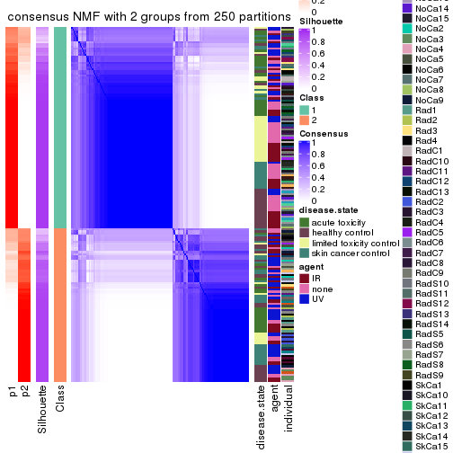</p>

</div>
<div id='tab-SD-NMF-consensus-heatmap-2'>
<pre><code class="r">consensus_heatmap(res, k = 3)
</code></pre>

<p>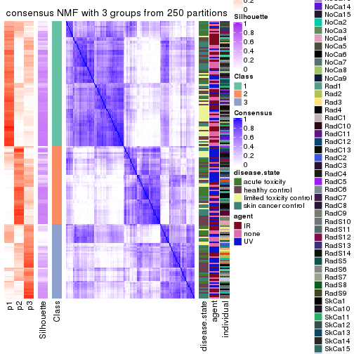</p>

</div>
<div id='tab-SD-NMF-consensus-heatmap-3'>
<pre><code class="r">consensus_heatmap(res, k = 4)
</code></pre>

<p>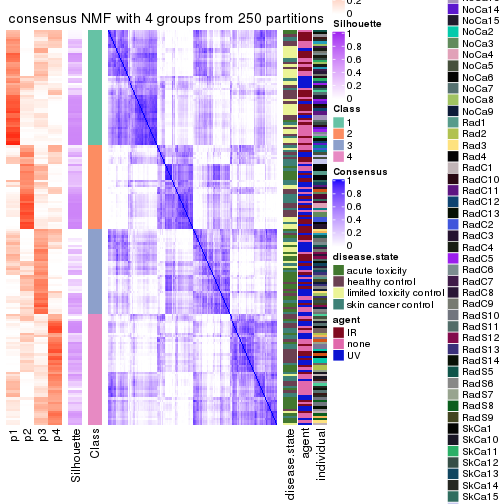</p>

</div>
<div id='tab-SD-NMF-consensus-heatmap-4'>
<pre><code class="r">consensus_heatmap(res, k = 5)
</code></pre>

<p>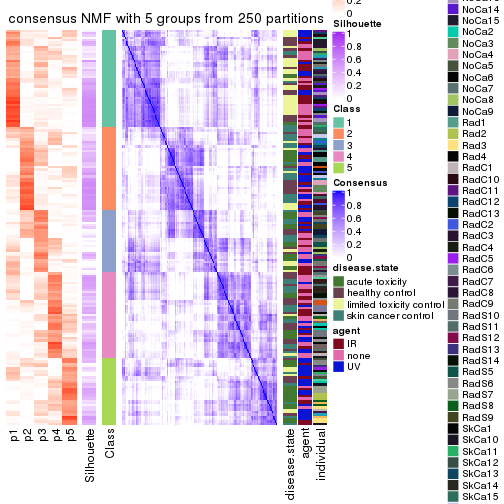</p>

</div>
<div id='tab-SD-NMF-consensus-heatmap-5'>
<pre><code class="r">consensus_heatmap(res, k = 6)
</code></pre>

<p>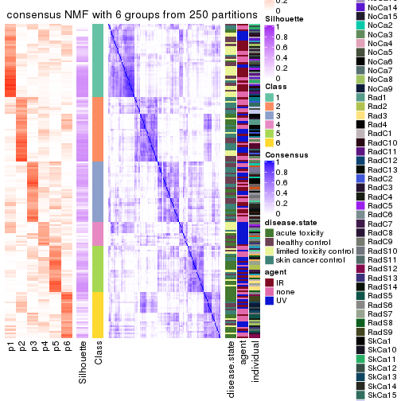</p>

</div>
</div>

Heatmaps for the membership of samples in all partitions to see how consistent they are:


<script>
$( function() {
	$( '#tabs-SD-NMF-membership-heatmap' ).tabs();
} );
</script>
<div id='tabs-SD-NMF-membership-heatmap'>
<ul>
<li><a href='#tab-SD-NMF-membership-heatmap-1'>k = 2</a></li>
<li><a href='#tab-SD-NMF-membership-heatmap-2'>k = 3</a></li>
<li><a href='#tab-SD-NMF-membership-heatmap-3'>k = 4</a></li>
<li><a href='#tab-SD-NMF-membership-heatmap-4'>k = 5</a></li>
<li><a href='#tab-SD-NMF-membership-heatmap-5'>k = 6</a></li>
</ul>
<div id='tab-SD-NMF-membership-heatmap-1'>
<pre><code class="r">membership_heatmap(res, k = 2)
</code></pre>

<p>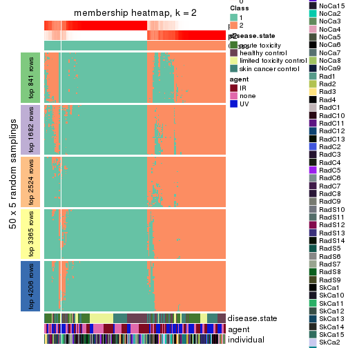</p>

</div>
<div id='tab-SD-NMF-membership-heatmap-2'>
<pre><code class="r">membership_heatmap(res, k = 3)
</code></pre>

<p>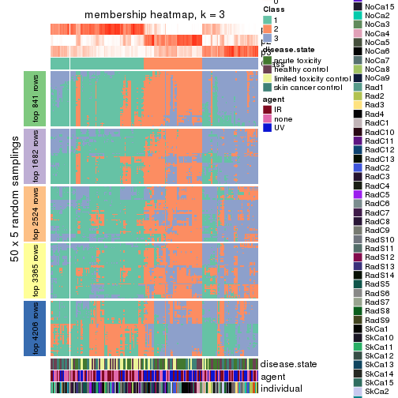</p>

</div>
<div id='tab-SD-NMF-membership-heatmap-3'>
<pre><code class="r">membership_heatmap(res, k = 4)
</code></pre>

<p>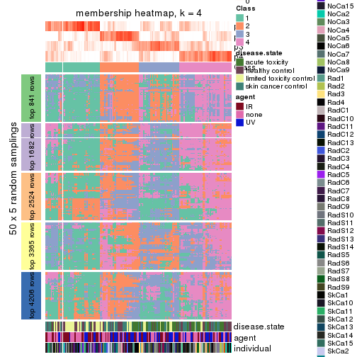</p>

</div>
<div id='tab-SD-NMF-membership-heatmap-4'>
<pre><code class="r">membership_heatmap(res, k = 5)
</code></pre>

<p>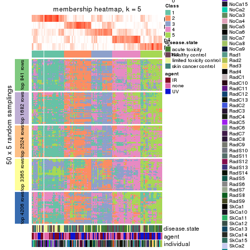</p>

</div>
<div id='tab-SD-NMF-membership-heatmap-5'>
<pre><code class="r">membership_heatmap(res, k = 6)
</code></pre>

<p>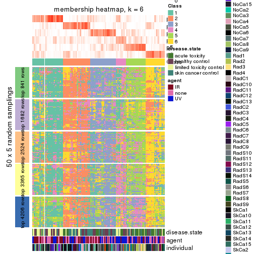</p>

</div>
</div>

As soon as we have had the classes for columns, we can look for signatures
which are significantly different between classes which can be candidate marks
for certain classes. Following are the heatmaps for signatures.


Signature heatmaps where rows are scaled:


<script>
$( function() {
	$( '#tabs-SD-NMF-get-signatures' ).tabs();
} );
</script>
<div id='tabs-SD-NMF-get-signatures'>
<ul>
<li><a href='#tab-SD-NMF-get-signatures-1'>k = 2</a></li>
<li><a href='#tab-SD-NMF-get-signatures-2'>k = 3</a></li>
<li><a href='#tab-SD-NMF-get-signatures-3'>k = 4</a></li>
<li><a href='#tab-SD-NMF-get-signatures-4'>k = 5</a></li>
<li><a href='#tab-SD-NMF-get-signatures-5'>k = 6</a></li>
</ul>
<div id='tab-SD-NMF-get-signatures-1'>
<pre><code class="r">get_signatures(res, k = 2)
</code></pre>

<p>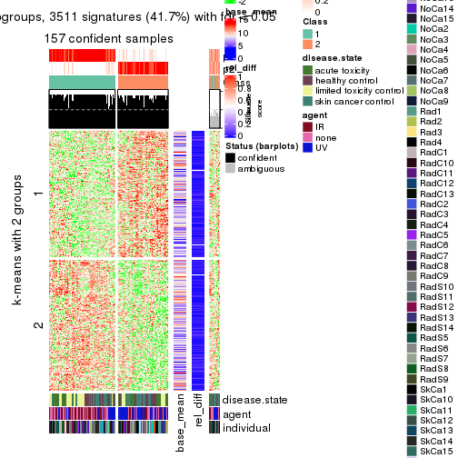</p>

</div>
<div id='tab-SD-NMF-get-signatures-2'>
<pre><code class="r">get_signatures(res, k = 3)
</code></pre>

<p>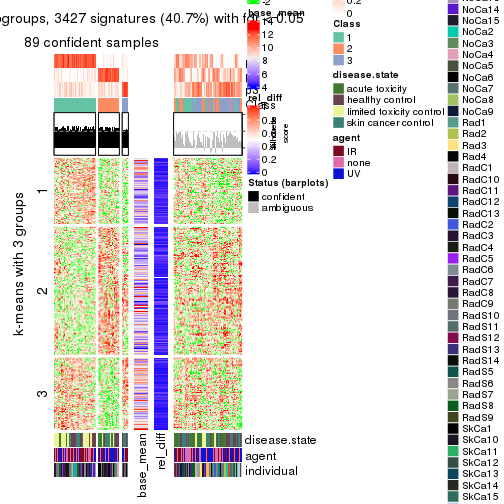</p>

</div>
<div id='tab-SD-NMF-get-signatures-3'>
<pre><code class="r">get_signatures(res, k = 4)
</code></pre>

<p>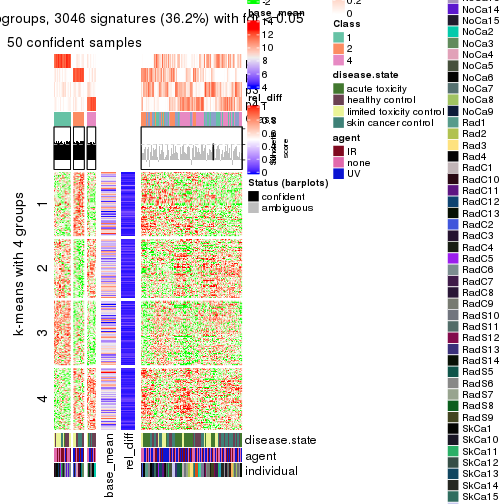</p>

</div>
<div id='tab-SD-NMF-get-signatures-4'>
<pre><code class="r">get_signatures(res, k = 5)
</code></pre>

<p>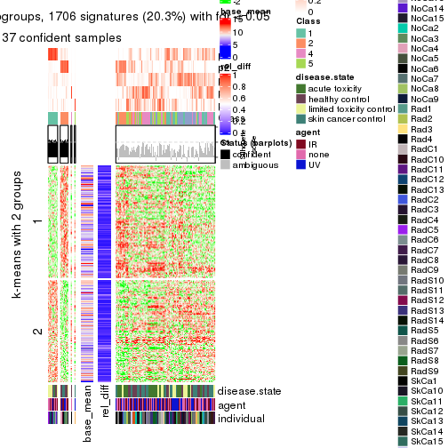</p>

</div>
<div id='tab-SD-NMF-get-signatures-5'>
<pre><code class="r">get_signatures(res, k = 6)
</code></pre>

<p>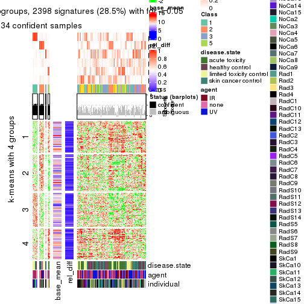</p>

</div>
</div>


Signature heatmaps where rows are not scaled:


<script>
$( function() {
	$( '#tabs-SD-NMF-get-signatures-no-scale' ).tabs();
} );
</script>
<div id='tabs-SD-NMF-get-signatures-no-scale'>
<ul>
<li><a href='#tab-SD-NMF-get-signatures-no-scale-1'>k = 2</a></li>
<li><a href='#tab-SD-NMF-get-signatures-no-scale-2'>k = 3</a></li>
<li><a href='#tab-SD-NMF-get-signatures-no-scale-3'>k = 4</a></li>
<li><a href='#tab-SD-NMF-get-signatures-no-scale-4'>k = 5</a></li>
<li><a href='#tab-SD-NMF-get-signatures-no-scale-5'>k = 6</a></li>
</ul>
<div id='tab-SD-NMF-get-signatures-no-scale-1'>
<pre><code class="r">get_signatures(res, k = 2, scale_rows = FALSE)
</code></pre>

<p>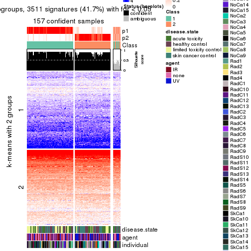</p>

</div>
<div id='tab-SD-NMF-get-signatures-no-scale-2'>
<pre><code class="r">get_signatures(res, k = 3, scale_rows = FALSE)
</code></pre>

<p>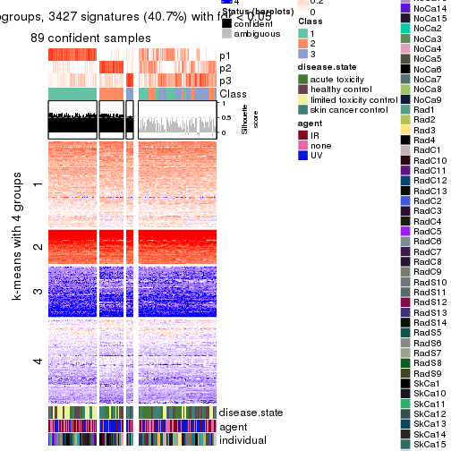</p>

</div>
<div id='tab-SD-NMF-get-signatures-no-scale-3'>
<pre><code class="r">get_signatures(res, k = 4, scale_rows = FALSE)
</code></pre>

<p>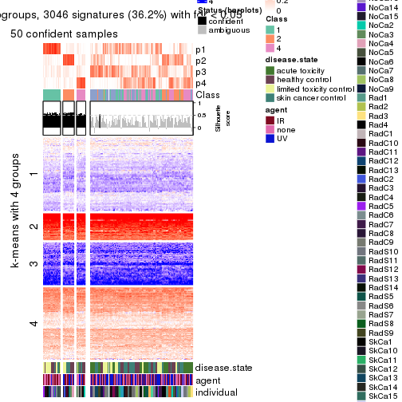</p>

</div>
<div id='tab-SD-NMF-get-signatures-no-scale-4'>
<pre><code class="r">get_signatures(res, k = 5, scale_rows = FALSE)
</code></pre>

<p>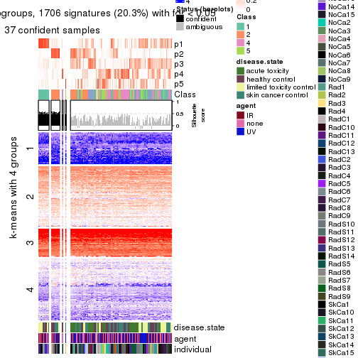</p>

</div>
<div id='tab-SD-NMF-get-signatures-no-scale-5'>
<pre><code class="r">get_signatures(res, k = 6, scale_rows = FALSE)
</code></pre>

<p>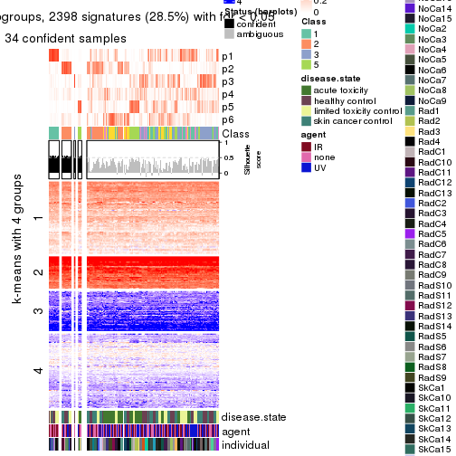</p>

</div>
</div>


Compare the overlap of signatures from different k:

```r
compare_signatures(res)
```

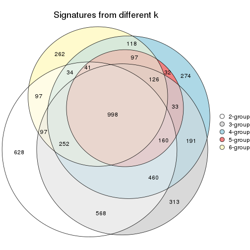

`get_signature()` returns a data frame invisibly. TO get the list of signatures, the function
call should be assigned to a variable explicitly. In following code, if `plot` argument is set
to `FALSE`, no heatmap is plotted while only the differential analysis is performed.

```r
# code only for demonstration
tb = get_signature(res, k = ..., plot = FALSE)
```

An example of the output of `tb` is:

```
#>   which_row         fdr    mean_1    mean_2 scaled_mean_1 scaled_mean_2 km
#> 1        38 0.042760348  8.373488  9.131774    -0.5533452     0.5164555  1
#> 2        40 0.018707592  7.106213  8.469186    -0.6173731     0.5762149  1
#> 3        55 0.019134737 10.221463 11.207825    -0.6159697     0.5749050  1
#> 4        59 0.006059896  5.921854  7.869574    -0.6899429     0.6439467  1
#> 5        60 0.018055526  8.928898 10.211722    -0.6204761     0.5791110  1
#> 6        98 0.009384629 15.714769 14.887706     0.6635654    -0.6193277  2
...
```

The columns in `tb` are:

1. `which_row`: row indices corresponding to the input matrix.
2. `fdr`: FDR for the differential test. 
3. `mean_x`: The mean value in group x.
4. `scaled_mean_x`: The mean value in group x after rows are scaled.
5. `km`: Row groups if k-means clustering is applied to rows.


UMAP plot which shows how samples are separated.


<script>
$( function() {
	$( '#tabs-SD-NMF-dimension-reduction' ).tabs();
} );
</script>
<div id='tabs-SD-NMF-dimension-reduction'>
<ul>
<li><a href='#tab-SD-NMF-dimension-reduction-1'>k = 2</a></li>
<li><a href='#tab-SD-NMF-dimension-reduction-2'>k = 3</a></li>
<li><a href='#tab-SD-NMF-dimension-reduction-3'>k = 4</a></li>
<li><a href='#tab-SD-NMF-dimension-reduction-4'>k = 5</a></li>
<li><a href='#tab-SD-NMF-dimension-reduction-5'>k = 6</a></li>
</ul>
<div id='tab-SD-NMF-dimension-reduction-1'>
<pre><code class="r">dimension_reduction(res, k = 2, method = &quot;UMAP&quot;)
</code></pre>

<p>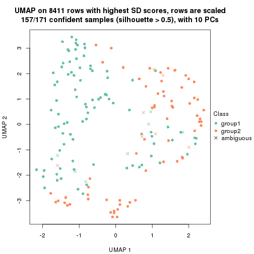</p>

</div>
<div id='tab-SD-NMF-dimension-reduction-2'>
<pre><code class="r">dimension_reduction(res, k = 3, method = &quot;UMAP&quot;)
</code></pre>

<p>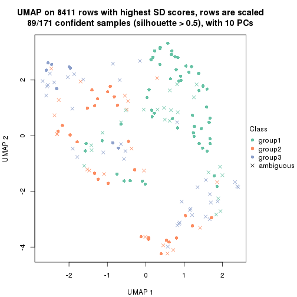</p>

</div>
<div id='tab-SD-NMF-dimension-reduction-3'>
<pre><code class="r">dimension_reduction(res, k = 4, method = &quot;UMAP&quot;)
</code></pre>

<p>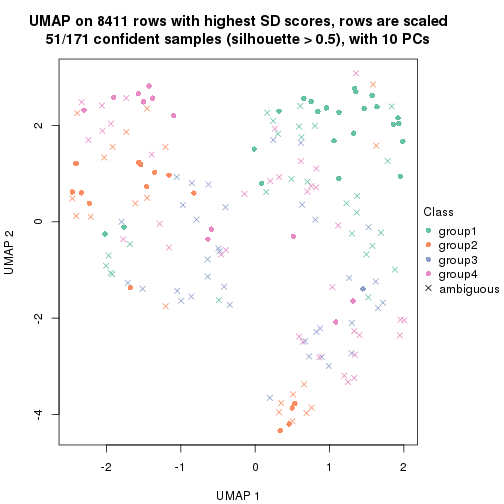</p>

</div>
<div id='tab-SD-NMF-dimension-reduction-4'>
<pre><code class="r">dimension_reduction(res, k = 5, method = &quot;UMAP&quot;)
</code></pre>

<p>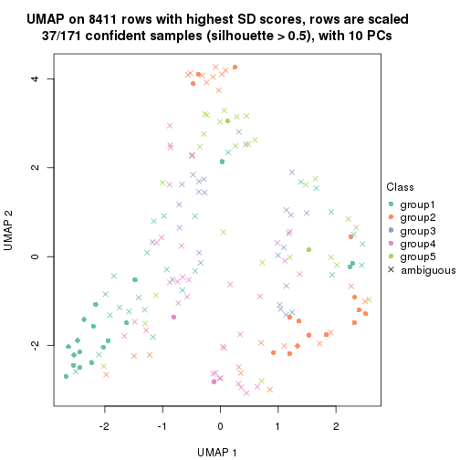</p>

</div>
<div id='tab-SD-NMF-dimension-reduction-5'>
<pre><code class="r">dimension_reduction(res, k = 6, method = &quot;UMAP&quot;)
</code></pre>

<p>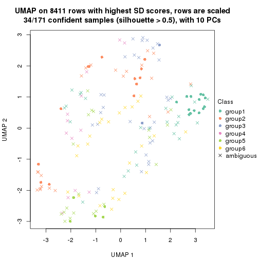</p>

</div>
</div>


Following heatmap shows how subgroups are split when increasing `k`:

```r
collect_classes(res)
```

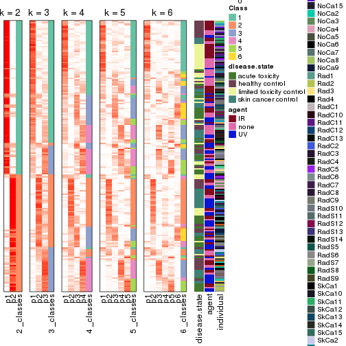


Test correlation between subgroups and known annotations. If the known
annotation is numeric, one-way ANOVA test is applied, and if the known
annotation is discrete, chi-squared contingency table test is applied.

```r
test_to_known_factors(res)
```

```
#>          n disease.state(p) agent(p) individual(p) k
#> SD:NMF 157         5.45e-02  0.00150      5.05e-07 2
#> SD:NMF  89         1.55e-03  0.00796      3.22e-07 3
#> SD:NMF  51         5.98e-03  0.08150      1.61e-05 4
#> SD:NMF  37         1.11e-02  0.03764      1.81e-04 5
#> SD:NMF  34         9.66e-05  0.10790      1.36e-03 6
```


If matrix rows can be associated to genes, consider to use `functional_enrichment(res,
...)` to perform function enrichment for the signature genes. See [this vignette](http://bioconductor.org/packages/devel/bioc/vignettes/cola/inst/doc/functional_enrichment.html) for more detailed explanations.


 

---------------------------------------------------


### CV:hclust


The object with results only for a single top-value method and a single partition method 
can be extracted as:

```r
res = res_list["CV", "hclust"]
# you can also extract it by
# res = res_list["CV:hclust"]
```

A summary of `res` and all the functions that can be applied to it:

```r
res
```

```
#> A 'ConsensusPartition' object with k = 2, 3, 4, 5, 6.
#>   On a matrix with 8411 rows and 171 columns.
#>   Top rows (841, 1682, 2524, 3365, 4206) are extracted by 'CV' method.
#>   Subgroups are detected by 'hclust' method.
#>   Performed in total 1250 partitions by row resampling.
#>   Best k for subgroups seems to be 3.
#> 
#> Following methods can be applied to this 'ConsensusPartition' object:
#>  [1] "cola_report"             "collect_classes"         "collect_plots"          
#>  [4] "collect_stats"           "colnames"                "compare_signatures"     
#>  [7] "consensus_heatmap"       "dimension_reduction"     "functional_enrichment"  
#> [10] "get_anno_col"            "get_anno"                "get_classes"            
#> [13] "get_consensus"           "get_matrix"              "get_membership"         
#> [16] "get_param"               "get_signatures"          "get_stats"              
#> [19] "is_best_k"               "is_stable_k"             "membership_heatmap"     
#> [22] "ncol"                    "nrow"                    "plot_ecdf"              
#> [25] "rownames"                "select_partition_number" "show"                   
#> [28] "suggest_best_k"          "test_to_known_factors"
```

`collect_plots()` function collects all the plots made from `res` for all `k` (number of partitions)
into one single page to provide an easy and fast comparison between different `k`.

```r
collect_plots(res)
```

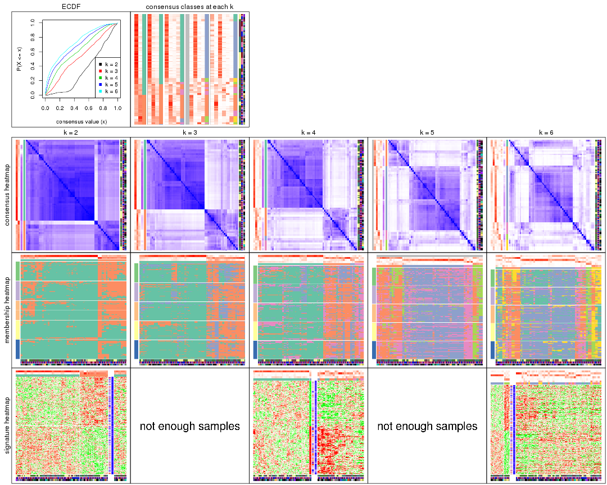

The plots are:

- The first row: a plot of the ECDF (empirical cumulative distribution
  function) curves of the consensus matrix for each `k` and the heatmap of
  predicted classes for each `k`.
- The second row: heatmaps of the consensus matrix for each `k`.
- The third row: heatmaps of the membership matrix for each `k`.
- The fouth row: heatmaps of the signatures for each `k`.

All the plots in panels can be made by individual functions and they are
plotted later in this section.

`select_partition_number()` produces several plots showing different
statistics for choosing "optimized" `k`. There are following statistics:

- ECDF curves of the consensus matrix for each `k`;
- 1-PAC. [The PAC
  score](https://en.wikipedia.org/wiki/Consensus_clustering#Over-interpretation_potential_of_consensus_clustering)
  measures the proportion of the ambiguous subgrouping.
- Mean silhouette score.
- Concordance. The mean probability of fiting the consensus class ids in all
  partitions.
- Area increased. Denote $A_k$ as the area under the ECDF curve for current
  `k`, the area increased is defined as $A_k - A_{k-1}$.
- Rand index. The percent of pairs of samples that are both in a same cluster
  or both are not in a same cluster in the partition of k and k-1.
- Jaccard index. The ratio of pairs of samples are both in a same cluster in
  the partition of k and k-1 and the pairs of samples are both in a same
  cluster in the partition k or k-1.

The detailed explanations of these statistics can be found in [the _cola_
vignette](http://bioconductor.org/packages/devel/bioc/vignettes/cola/inst/doc/cola.html#toc_13).

Generally speaking, lower PAC score, higher mean silhouette score or higher
concordance corresponds to better partition. Rand index and Jaccard index
measure how similar the current partition is compared to partition with `k-1`.
If they are too similar, we won't accept `k` is better than `k-1`.

```r
select_partition_number(res)
```

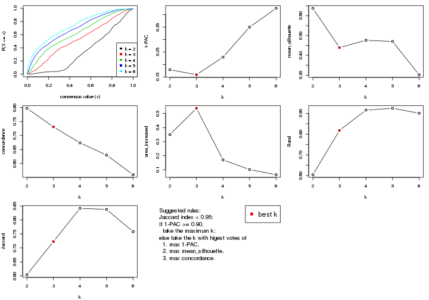

The numeric values for all these statistics can be obtained by `get_stats()`.

```r
get_stats(res)
```

```
#>   k 1-PAC mean_silhouette concordance area_increased  Rand Jaccard
#> 2 2 0.179           0.638       0.797         0.3500 0.604   0.604
#> 3 3 0.159           0.439       0.731         0.5365 0.818   0.723
#> 4 4 0.229           0.476       0.674         0.1706 0.916   0.842
#> 5 5 0.350           0.470       0.630         0.1019 0.924   0.838
#> 6 6 0.426           0.302       0.560         0.0654 0.901   0.758
```

`suggest_best_k()` suggests the best $k$ based on these statistics. The rules are as follows:

- All $k$ with Jaccard index larger than 0.95 are removed because increasing
  $k$ does not provide enough extra information. If all $k$ are removed, it is
  marked as no subgroup is detected.
- For all $k$ with 1-PAC score larger than 0.9, the maximal $k$ is taken as
  the best $k$, and other $k$ are marked as optional $k$.
- If it does not fit the second rule. The $k$ with the maximal vote of the
  highest 1-PAC score, highest mean silhouette, and highest concordance is
  taken as the best $k$.

```r
suggest_best_k(res)
```

```
#> [1] 3
```


Following shows the table of the partitions (You need to click the **show/hide
code output** link to see it). The membership matrix (columns with name `p*`)
is inferred by
[`clue::cl_consensus()`](https://www.rdocumentation.org/link/cl_consensus?package=clue)
function with the `SE` method. Basically the value in the membership matrix
represents the probability to belong to a certain group. The finall class
label for an item is determined with the group with highest probability it
belongs to.

In `get_classes()` function, the entropy is calculated from the membership
matrix and the silhouette score is calculated from the consensus matrix.


<script>
$( function() {
	$( '#tabs-CV-hclust-get-classes' ).tabs();
} );
</script>
<div id='tabs-CV-hclust-get-classes'>
<ul>
<li><a href='#tab-CV-hclust-get-classes-1'>k = 2</a></li>
<li><a href='#tab-CV-hclust-get-classes-2'>k = 3</a></li>
<li><a href='#tab-CV-hclust-get-classes-3'>k = 4</a></li>
<li><a href='#tab-CV-hclust-get-classes-4'>k = 5</a></li>
<li><a href='#tab-CV-hclust-get-classes-5'>k = 6</a></li>
</ul>

<div id='tab-CV-hclust-get-classes-1'>
<p><a id='tab-CV-hclust-get-classes-1-a' style='color:#0366d6' href='#'>show/hide code output</a></p>
<pre><code class="r">cbind(get_classes(res, k = 2), get_membership(res, k = 2))
</code></pre>

<pre><code>#&gt;          class entropy silhouette    p1    p2
#&gt; GSM29783     1  0.9993    -0.4390 0.516 0.484
#&gt; GSM29786     1  0.9996    -0.4522 0.512 0.488
#&gt; GSM29789     2  0.9000     0.7334 0.316 0.684
#&gt; GSM29792     2  0.3114     0.5690 0.056 0.944
#&gt; GSM29795     2  0.9491     0.7126 0.368 0.632
#&gt; GSM29798     1  0.9393     0.1994 0.644 0.356
#&gt; GSM29801     1  0.2948     0.8019 0.948 0.052
#&gt; GSM29804     1  0.4690     0.7849 0.900 0.100
#&gt; GSM29807     1  0.8555     0.4575 0.720 0.280
#&gt; GSM29816     1  0.3584     0.7977 0.932 0.068
#&gt; GSM29821     1  0.5294     0.7666 0.880 0.120
#&gt; GSM29824     1  0.1843     0.7994 0.972 0.028
#&gt; GSM29827     1  0.0938     0.7873 0.988 0.012
#&gt; GSM29830     1  0.1633     0.7916 0.976 0.024
#&gt; GSM29833     1  0.1633     0.7938 0.976 0.024
#&gt; GSM29784     2  0.9754     0.6931 0.408 0.592
#&gt; GSM29787     1  0.9996    -0.4522 0.512 0.488
#&gt; GSM29790     2  0.9000     0.7334 0.316 0.684
#&gt; GSM29793     2  0.3114     0.5690 0.056 0.944
#&gt; GSM29796     2  0.9491     0.7126 0.368 0.632
#&gt; GSM29799     1  0.9393     0.1994 0.644 0.356
#&gt; GSM29802     1  0.4431     0.7847 0.908 0.092
#&gt; GSM29805     1  0.4690     0.7849 0.900 0.100
#&gt; GSM29814     1  0.8555     0.4575 0.720 0.280
#&gt; GSM29817     1  0.3584     0.7981 0.932 0.068
#&gt; GSM29822     1  0.5294     0.7666 0.880 0.120
#&gt; GSM29825     1  0.1843     0.7994 0.972 0.028
#&gt; GSM29828     1  0.0938     0.7873 0.988 0.012
#&gt; GSM29831     1  0.0938     0.7873 0.988 0.012
#&gt; GSM29834     1  0.1843     0.7953 0.972 0.028
#&gt; GSM29785     2  0.9710     0.7012 0.400 0.600
#&gt; GSM29788     1  0.9996    -0.4522 0.512 0.488
#&gt; GSM29791     2  0.9000     0.7334 0.316 0.684
#&gt; GSM29794     2  0.3114     0.5690 0.056 0.944
#&gt; GSM29797     2  0.9491     0.7126 0.368 0.632
#&gt; GSM29800     1  0.9393     0.1994 0.644 0.356
#&gt; GSM29803     1  0.4298     0.7868 0.912 0.088
#&gt; GSM29806     1  0.4690     0.7849 0.900 0.100
#&gt; GSM29815     1  0.8555     0.4575 0.720 0.280
#&gt; GSM29819     1  0.4690     0.7834 0.900 0.100
#&gt; GSM29823     1  0.5294     0.7666 0.880 0.120
#&gt; GSM29826     1  0.1843     0.7994 0.972 0.028
#&gt; GSM29829     1  0.2423     0.7901 0.960 0.040
#&gt; GSM29832     1  0.2236     0.7919 0.964 0.036
#&gt; GSM29835     1  0.6973     0.6691 0.812 0.188
#&gt; GSM29836     2  0.2603     0.5662 0.044 0.956
#&gt; GSM29839     2  0.9491     0.7176 0.368 0.632
#&gt; GSM29842     1  0.9998    -0.4533 0.508 0.492
#&gt; GSM29845     1  0.8267     0.5444 0.740 0.260
#&gt; GSM29848     2  0.9993     0.5386 0.484 0.516
#&gt; GSM29851     1  0.4161     0.7942 0.916 0.084
#&gt; GSM29854     1  0.6623     0.7199 0.828 0.172
#&gt; GSM29857     1  0.4690     0.7834 0.900 0.100
#&gt; GSM29860     2  0.9775     0.6352 0.412 0.588
#&gt; GSM29863     1  0.4690     0.7836 0.900 0.100
#&gt; GSM29866     1  0.1414     0.7948 0.980 0.020
#&gt; GSM29869     1  0.1843     0.7920 0.972 0.028
#&gt; GSM29872     2  0.9754     0.5416 0.408 0.592
#&gt; GSM29875     1  0.2043     0.7961 0.968 0.032
#&gt; GSM29878     1  0.9686    -0.0780 0.604 0.396
#&gt; GSM29837     2  0.2948     0.5709 0.052 0.948
#&gt; GSM29840     2  0.9491     0.7176 0.368 0.632
#&gt; GSM29843     2  0.9635     0.7224 0.388 0.612
#&gt; GSM29846     1  0.8267     0.5444 0.740 0.260
#&gt; GSM29849     2  0.9993     0.5386 0.484 0.516
#&gt; GSM29852     1  0.4161     0.7942 0.916 0.084
#&gt; GSM29855     1  0.6712     0.7142 0.824 0.176
#&gt; GSM29858     1  0.4690     0.7834 0.900 0.100
#&gt; GSM29861     2  0.9775     0.6352 0.412 0.588
#&gt; GSM29864     1  0.4690     0.7821 0.900 0.100
#&gt; GSM29867     1  0.1414     0.7948 0.980 0.020
#&gt; GSM29870     1  0.1843     0.7920 0.972 0.028
#&gt; GSM29873     2  0.9754     0.5416 0.408 0.592
#&gt; GSM29876     1  0.2043     0.7961 0.968 0.032
#&gt; GSM29879     1  0.9661    -0.0601 0.608 0.392
#&gt; GSM29838     2  0.2948     0.5709 0.052 0.948
#&gt; GSM29841     2  0.9491     0.7176 0.368 0.632
#&gt; GSM29844     2  0.9635     0.7224 0.388 0.612
#&gt; GSM29847     1  0.8267     0.5444 0.740 0.260
#&gt; GSM29850     2  0.9993     0.5386 0.484 0.516
#&gt; GSM29853     1  0.4161     0.7942 0.916 0.084
#&gt; GSM29856     1  0.6623     0.7187 0.828 0.172
#&gt; GSM29859     1  0.4815     0.7832 0.896 0.104
#&gt; GSM29862     2  0.9775     0.6352 0.412 0.588
#&gt; GSM29865     1  0.4690     0.7821 0.900 0.100
#&gt; GSM29868     1  0.7056     0.6582 0.808 0.192
#&gt; GSM29871     1  0.1843     0.7920 0.972 0.028
#&gt; GSM29874     2  0.9732     0.5505 0.404 0.596
#&gt; GSM29877     1  0.2043     0.7961 0.968 0.032
#&gt; GSM29880     1  0.9850    -0.1678 0.572 0.428
#&gt; GSM29881     1  0.4298     0.7915 0.912 0.088
#&gt; GSM29884     2  0.9635     0.7206 0.388 0.612
#&gt; GSM29887     2  0.9635     0.7225 0.388 0.612
#&gt; GSM29890     1  0.1414     0.7873 0.980 0.020
#&gt; GSM29893     1  0.5178     0.7544 0.884 0.116
#&gt; GSM29896     1  0.0672     0.7869 0.992 0.008
#&gt; GSM29899     1  0.0672     0.7869 0.992 0.008
#&gt; GSM29902     1  0.3431     0.7952 0.936 0.064
#&gt; GSM29905     1  0.8327     0.5004 0.736 0.264
#&gt; GSM29908     1  0.0938     0.7873 0.988 0.012
#&gt; GSM29955     1  0.2948     0.7851 0.948 0.052
#&gt; GSM29958     1  0.0938     0.7873 0.988 0.012
#&gt; GSM29961     1  0.0938     0.7873 0.988 0.012
#&gt; GSM29882     1  0.4298     0.7915 0.912 0.088
#&gt; GSM29885     2  0.9635     0.7206 0.388 0.612
#&gt; GSM29888     2  0.9608     0.7229 0.384 0.616
#&gt; GSM29891     1  0.1414     0.7873 0.980 0.020
#&gt; GSM29894     1  0.5178     0.7544 0.884 0.116
#&gt; GSM29897     1  0.1184     0.7862 0.984 0.016
#&gt; GSM29900     1  0.0672     0.7869 0.992 0.008
#&gt; GSM29903     1  0.1633     0.7918 0.976 0.024
#&gt; GSM29906     1  0.8327     0.5004 0.736 0.264
#&gt; GSM29909     1  0.1184     0.7897 0.984 0.016
#&gt; GSM29956     1  0.0938     0.7909 0.988 0.012
#&gt; GSM29959     1  0.0938     0.7873 0.988 0.012
#&gt; GSM29962     1  0.1184     0.7887 0.984 0.016
#&gt; GSM29883     1  0.4298     0.7915 0.912 0.088
#&gt; GSM29886     2  0.9608     0.7239 0.384 0.616
#&gt; GSM29889     2  0.9580     0.7258 0.380 0.620
#&gt; GSM29892     1  0.1414     0.7942 0.980 0.020
#&gt; GSM29895     1  0.5294     0.7507 0.880 0.120
#&gt; GSM29898     1  0.4431     0.7850 0.908 0.092
#&gt; GSM29901     1  0.1843     0.7968 0.972 0.028
#&gt; GSM29904     1  0.3114     0.7963 0.944 0.056
#&gt; GSM29907     1  0.8327     0.5004 0.736 0.264
#&gt; GSM29910     1  0.6712     0.6810 0.824 0.176
#&gt; GSM29957     1  0.3114     0.7852 0.944 0.056
#&gt; GSM29960     1  0.3879     0.7769 0.924 0.076
#&gt; GSM29963     1  0.6623     0.6865 0.828 0.172
#&gt; GSM29964     2  0.9323     0.7340 0.348 0.652
#&gt; GSM29967     2  0.9970     0.5473 0.468 0.532
#&gt; GSM29970     1  0.9608     0.0444 0.616 0.384
#&gt; GSM29973     2  0.8955     0.7230 0.312 0.688
#&gt; GSM29976     1  0.3584     0.7981 0.932 0.068
#&gt; GSM29979     2  0.9954     0.5836 0.460 0.540
#&gt; GSM29982     1  0.7453     0.6388 0.788 0.212
#&gt; GSM29985     1  0.3584     0.7968 0.932 0.068
#&gt; GSM29988     1  0.7139     0.6312 0.804 0.196
#&gt; GSM29991     1  0.9460     0.1672 0.636 0.364
#&gt; GSM29994     1  0.4161     0.7929 0.916 0.084
#&gt; GSM29997     1  0.6048     0.6999 0.852 0.148
#&gt; GSM30000     1  0.7219     0.6853 0.800 0.200
#&gt; GSM30003     1  0.2948     0.7982 0.948 0.052
#&gt; GSM29965     2  0.9323     0.7340 0.348 0.652
#&gt; GSM29968     2  0.9970     0.5473 0.468 0.532
#&gt; GSM29971     1  0.9608     0.0444 0.616 0.384
#&gt; GSM29974     2  0.8955     0.7230 0.312 0.688
#&gt; GSM29977     1  0.3584     0.7981 0.932 0.068
#&gt; GSM29980     2  0.9954     0.5836 0.460 0.540
#&gt; GSM29983     1  0.7453     0.6388 0.788 0.212
#&gt; GSM29986     1  0.3584     0.7968 0.932 0.068
#&gt; GSM29989     1  0.7139     0.6312 0.804 0.196
#&gt; GSM29992     1  0.9460     0.1672 0.636 0.364
#&gt; GSM29995     1  0.2603     0.7927 0.956 0.044
#&gt; GSM29998     1  0.6048     0.6999 0.852 0.148
#&gt; GSM30001     1  0.7219     0.6853 0.800 0.200
#&gt; GSM30004     1  0.2948     0.7982 0.948 0.052
#&gt; GSM29966     2  0.9323     0.7340 0.348 0.652
#&gt; GSM29969     2  0.9970     0.5473 0.468 0.532
#&gt; GSM29972     1  0.9608     0.0444 0.616 0.384
#&gt; GSM29975     2  0.8955     0.7230 0.312 0.688
#&gt; GSM29978     1  0.3584     0.7981 0.932 0.068
#&gt; GSM29981     2  0.9896     0.5099 0.440 0.560
#&gt; GSM29984     1  0.7453     0.6388 0.788 0.212
#&gt; GSM29987     1  0.3584     0.7968 0.932 0.068
#&gt; GSM29990     1  0.7139     0.6312 0.804 0.196
#&gt; GSM29993     1  0.9460     0.1672 0.636 0.364
#&gt; GSM29996     1  0.3584     0.7971 0.932 0.068
#&gt; GSM29999     1  0.6343     0.7007 0.840 0.160
#&gt; GSM30002     1  0.7219     0.6853 0.800 0.200
#&gt; GSM30005     1  0.2948     0.7982 0.948 0.052
</code></pre>

<script>
$('#tab-CV-hclust-get-classes-1-a').parent().next().next().hide();
$('#tab-CV-hclust-get-classes-1-a').click(function(){
  $('#tab-CV-hclust-get-classes-1-a').parent().next().next().toggle();
  return(false);
});
</script>
</div>

<div id='tab-CV-hclust-get-classes-2'>
<p><a id='tab-CV-hclust-get-classes-2-a' style='color:#0366d6' href='#'>show/hide code output</a></p>
<pre><code class="r">cbind(get_classes(res, k = 3), get_membership(res, k = 3))
</code></pre>

<pre><code>#&gt;          class entropy silhouette    p1    p2    p3
#&gt; GSM29783     2  0.7365     0.1039 0.188 0.700 0.112
#&gt; GSM29786     2  0.8749     0.1442 0.152 0.572 0.276
#&gt; GSM29789     2  0.6388     0.2326 0.064 0.752 0.184
#&gt; GSM29792     2  0.6495     0.0453 0.004 0.536 0.460
#&gt; GSM29795     2  0.7712     0.2059 0.092 0.652 0.256
#&gt; GSM29798     2  0.9323    -0.0516 0.312 0.500 0.188
#&gt; GSM29801     1  0.4526     0.7917 0.856 0.104 0.040
#&gt; GSM29804     1  0.5285     0.7691 0.824 0.112 0.064
#&gt; GSM29807     1  0.9268     0.0351 0.524 0.268 0.208
#&gt; GSM29816     1  0.4556     0.7855 0.860 0.080 0.060
#&gt; GSM29821     1  0.6835     0.6788 0.732 0.180 0.088
#&gt; GSM29824     1  0.3009     0.7964 0.920 0.052 0.028
#&gt; GSM29827     1  0.2050     0.7752 0.952 0.020 0.028
#&gt; GSM29830     1  0.2313     0.7804 0.944 0.024 0.032
#&gt; GSM29833     1  0.2663     0.7809 0.932 0.044 0.024
#&gt; GSM29784     2  0.6250     0.2572 0.104 0.776 0.120
#&gt; GSM29787     2  0.8749     0.1442 0.152 0.572 0.276
#&gt; GSM29790     2  0.6388     0.2326 0.064 0.752 0.184
#&gt; GSM29793     2  0.6495     0.0453 0.004 0.536 0.460
#&gt; GSM29796     2  0.7712     0.2059 0.092 0.652 0.256
#&gt; GSM29799     2  0.9323    -0.0516 0.312 0.500 0.188
#&gt; GSM29802     1  0.5263     0.7671 0.824 0.116 0.060
#&gt; GSM29805     1  0.5285     0.7691 0.824 0.112 0.064
#&gt; GSM29814     1  0.9268     0.0351 0.524 0.268 0.208
#&gt; GSM29817     1  0.4642     0.7850 0.856 0.084 0.060
#&gt; GSM29822     1  0.6835     0.6788 0.732 0.180 0.088
#&gt; GSM29825     1  0.2879     0.7957 0.924 0.052 0.024
#&gt; GSM29828     1  0.2050     0.7752 0.952 0.020 0.028
#&gt; GSM29831     1  0.2050     0.7752 0.952 0.020 0.028
#&gt; GSM29834     1  0.2793     0.7813 0.928 0.044 0.028
#&gt; GSM29785     2  0.6168     0.2637 0.096 0.780 0.124
#&gt; GSM29788     2  0.8749     0.1442 0.152 0.572 0.276
#&gt; GSM29791     2  0.6388     0.2326 0.064 0.752 0.184
#&gt; GSM29794     2  0.6495     0.0453 0.004 0.536 0.460
#&gt; GSM29797     2  0.7712     0.2059 0.092 0.652 0.256
#&gt; GSM29800     2  0.9323    -0.0516 0.312 0.500 0.188
#&gt; GSM29803     1  0.5191     0.7695 0.828 0.112 0.060
#&gt; GSM29806     1  0.5285     0.7691 0.824 0.112 0.064
#&gt; GSM29815     1  0.9268     0.0351 0.524 0.268 0.208
#&gt; GSM29819     1  0.5497     0.7619 0.812 0.124 0.064
#&gt; GSM29823     1  0.6835     0.6788 0.732 0.180 0.088
#&gt; GSM29826     1  0.2879     0.7957 0.924 0.052 0.024
#&gt; GSM29829     1  0.3472     0.7758 0.904 0.040 0.056
#&gt; GSM29832     1  0.3375     0.7770 0.908 0.044 0.048
#&gt; GSM29835     1  0.7398     0.5466 0.700 0.180 0.120
#&gt; GSM29836     2  0.6678     0.0335 0.008 0.512 0.480
#&gt; GSM29839     2  0.7844     0.1886 0.120 0.660 0.220
#&gt; GSM29842     2  0.7267     0.1029 0.180 0.708 0.112
#&gt; GSM29845     1  0.8464     0.3858 0.596 0.272 0.132
#&gt; GSM29848     2  0.8067     0.1153 0.188 0.652 0.160
#&gt; GSM29851     1  0.4920     0.7811 0.840 0.108 0.052
#&gt; GSM29854     1  0.7044     0.6848 0.724 0.168 0.108
#&gt; GSM29857     1  0.5497     0.7619 0.812 0.124 0.064
#&gt; GSM29860     2  0.8862    -0.3032 0.164 0.564 0.272
#&gt; GSM29863     1  0.5153     0.7740 0.832 0.100 0.068
#&gt; GSM29866     1  0.2269     0.7919 0.944 0.040 0.016
#&gt; GSM29869     1  0.3375     0.7933 0.908 0.048 0.044
#&gt; GSM29872     2  0.9786    -0.7365 0.236 0.400 0.364
#&gt; GSM29875     1  0.3148     0.7913 0.916 0.048 0.036
#&gt; GSM29878     2  0.8967    -0.3162 0.380 0.488 0.132
#&gt; GSM29837     2  0.6819     0.0288 0.012 0.512 0.476
#&gt; GSM29840     2  0.7844     0.1886 0.120 0.660 0.220
#&gt; GSM29843     2  0.5346     0.2822 0.088 0.824 0.088
#&gt; GSM29846     1  0.8464     0.3858 0.596 0.272 0.132
#&gt; GSM29849     2  0.8067     0.1153 0.188 0.652 0.160
#&gt; GSM29852     1  0.4920     0.7811 0.840 0.108 0.052
#&gt; GSM29855     1  0.7113     0.6804 0.720 0.168 0.112
#&gt; GSM29858     1  0.5497     0.7619 0.812 0.124 0.064
#&gt; GSM29861     2  0.8862    -0.3032 0.164 0.564 0.272
#&gt; GSM29864     1  0.5253     0.7716 0.828 0.096 0.076
#&gt; GSM29867     1  0.2269     0.7919 0.944 0.040 0.016
#&gt; GSM29870     1  0.3375     0.7933 0.908 0.048 0.044
#&gt; GSM29873     2  0.9786    -0.7365 0.236 0.400 0.364
#&gt; GSM29876     1  0.3148     0.7913 0.916 0.048 0.036
#&gt; GSM29879     2  0.8927    -0.3132 0.384 0.488 0.128
#&gt; GSM29838     2  0.6819     0.0288 0.012 0.512 0.476
#&gt; GSM29841     2  0.7844     0.1886 0.120 0.660 0.220
#&gt; GSM29844     2  0.5346     0.2822 0.088 0.824 0.088
#&gt; GSM29847     1  0.8464     0.3858 0.596 0.272 0.132
#&gt; GSM29850     2  0.8067     0.1153 0.188 0.652 0.160
#&gt; GSM29853     1  0.4920     0.7811 0.840 0.108 0.052
#&gt; GSM29856     1  0.7097     0.6793 0.720 0.172 0.108
#&gt; GSM29859     1  0.5564     0.7615 0.808 0.128 0.064
#&gt; GSM29862     2  0.8862    -0.3032 0.164 0.564 0.272
#&gt; GSM29865     1  0.5253     0.7716 0.828 0.096 0.076
#&gt; GSM29868     1  0.7339     0.5728 0.708 0.144 0.148
#&gt; GSM29871     1  0.3375     0.7933 0.908 0.048 0.044
#&gt; GSM29874     2  0.9770    -0.7422 0.232 0.400 0.368
#&gt; GSM29877     1  0.3148     0.7913 0.916 0.048 0.036
#&gt; GSM29880     2  0.9674    -0.4149 0.392 0.396 0.212
#&gt; GSM29881     1  0.5307     0.7632 0.820 0.124 0.056
#&gt; GSM29884     2  0.3583     0.2983 0.044 0.900 0.056
#&gt; GSM29887     2  0.3481     0.2975 0.044 0.904 0.052
#&gt; GSM29890     1  0.1832     0.7767 0.956 0.008 0.036
#&gt; GSM29893     1  0.6208     0.6951 0.776 0.136 0.088
#&gt; GSM29896     1  0.0829     0.7791 0.984 0.004 0.012
#&gt; GSM29899     1  0.0661     0.7791 0.988 0.004 0.008
#&gt; GSM29902     1  0.3983     0.7767 0.884 0.068 0.048
#&gt; GSM29905     1  0.8801     0.2866 0.560 0.292 0.148
#&gt; GSM29908     1  0.2187     0.7776 0.948 0.024 0.028
#&gt; GSM29955     1  0.4097     0.7650 0.880 0.060 0.060
#&gt; GSM29958     1  0.2187     0.7776 0.948 0.024 0.028
#&gt; GSM29961     1  0.2318     0.7760 0.944 0.028 0.028
#&gt; GSM29882     1  0.5307     0.7632 0.820 0.124 0.056
#&gt; GSM29885     2  0.3583     0.2983 0.044 0.900 0.056
#&gt; GSM29888     2  0.3369     0.2992 0.040 0.908 0.052
#&gt; GSM29891     1  0.1832     0.7767 0.956 0.008 0.036
#&gt; GSM29894     1  0.6208     0.6951 0.776 0.136 0.088
#&gt; GSM29897     1  0.1453     0.7783 0.968 0.008 0.024
#&gt; GSM29900     1  0.0829     0.7806 0.984 0.004 0.012
#&gt; GSM29903     1  0.2434     0.7839 0.940 0.024 0.036
#&gt; GSM29906     1  0.8825     0.2748 0.556 0.296 0.148
#&gt; GSM29909     1  0.2050     0.7845 0.952 0.028 0.020
#&gt; GSM29956     1  0.2806     0.7786 0.928 0.032 0.040
#&gt; GSM29959     1  0.2187     0.7776 0.948 0.024 0.028
#&gt; GSM29962     1  0.2443     0.7770 0.940 0.032 0.028
#&gt; GSM29883     1  0.5307     0.7632 0.820 0.124 0.056
#&gt; GSM29886     2  0.3481     0.3007 0.044 0.904 0.052
#&gt; GSM29889     2  0.3369     0.3014 0.040 0.908 0.052
#&gt; GSM29892     1  0.2297     0.7846 0.944 0.020 0.036
#&gt; GSM29895     1  0.6332     0.6842 0.768 0.144 0.088
#&gt; GSM29898     1  0.5260     0.7682 0.828 0.092 0.080
#&gt; GSM29901     1  0.2050     0.7920 0.952 0.028 0.020
#&gt; GSM29904     1  0.4095     0.7772 0.880 0.064 0.056
#&gt; GSM29907     1  0.8801     0.2866 0.560 0.292 0.148
#&gt; GSM29910     1  0.7164     0.5917 0.720 0.140 0.140
#&gt; GSM29957     1  0.4194     0.7625 0.876 0.060 0.064
#&gt; GSM29960     1  0.4745     0.7509 0.852 0.080 0.068
#&gt; GSM29963     1  0.7104     0.5998 0.724 0.136 0.140
#&gt; GSM29964     2  0.4280     0.2578 0.020 0.856 0.124
#&gt; GSM29967     2  0.7190     0.1587 0.036 0.608 0.356
#&gt; GSM29970     2  0.9502    -0.0833 0.212 0.480 0.308
#&gt; GSM29973     2  0.6758     0.0848 0.072 0.728 0.200
#&gt; GSM29976     1  0.4945     0.7812 0.840 0.104 0.056
#&gt; GSM29979     2  0.8799    -0.3786 0.196 0.584 0.220
#&gt; GSM29982     1  0.9192     0.1138 0.516 0.308 0.176
#&gt; GSM29985     1  0.4920     0.7741 0.840 0.108 0.052
#&gt; GSM29988     1  0.8484     0.3774 0.616 0.196 0.188
#&gt; GSM29991     2  0.9468    -0.0793 0.300 0.488 0.212
#&gt; GSM29994     1  0.4658     0.7740 0.856 0.076 0.068
#&gt; GSM29997     1  0.6775     0.5873 0.740 0.096 0.164
#&gt; GSM30000     1  0.7419     0.5906 0.680 0.232 0.088
#&gt; GSM30003     1  0.4058     0.7879 0.880 0.076 0.044
#&gt; GSM29965     2  0.4280     0.2578 0.020 0.856 0.124
#&gt; GSM29968     2  0.7190     0.1587 0.036 0.608 0.356
#&gt; GSM29971     2  0.9502    -0.0833 0.212 0.480 0.308
#&gt; GSM29974     2  0.6758     0.0848 0.072 0.728 0.200
#&gt; GSM29977     1  0.4945     0.7812 0.840 0.104 0.056
#&gt; GSM29980     2  0.8799    -0.3786 0.196 0.584 0.220
#&gt; GSM29983     1  0.9192     0.1138 0.516 0.308 0.176
#&gt; GSM29986     1  0.4920     0.7741 0.840 0.108 0.052
#&gt; GSM29989     1  0.8484     0.3774 0.616 0.196 0.188
#&gt; GSM29992     2  0.9468    -0.0793 0.300 0.488 0.212
#&gt; GSM29995     1  0.2926     0.7805 0.924 0.036 0.040
#&gt; GSM29998     1  0.6775     0.5873 0.740 0.096 0.164
#&gt; GSM30001     1  0.7419     0.5906 0.680 0.232 0.088
#&gt; GSM30004     1  0.4058     0.7879 0.880 0.076 0.044
#&gt; GSM29966     2  0.4280     0.2578 0.020 0.856 0.124
#&gt; GSM29969     2  0.7190     0.1587 0.036 0.608 0.356
#&gt; GSM29972     2  0.9502    -0.0833 0.212 0.480 0.308
#&gt; GSM29975     2  0.6758     0.0848 0.072 0.728 0.200
#&gt; GSM29978     1  0.4945     0.7812 0.840 0.104 0.056
#&gt; GSM29981     3  0.9717     0.0000 0.220 0.384 0.396
#&gt; GSM29984     1  0.9192     0.1138 0.516 0.308 0.176
#&gt; GSM29987     1  0.4920     0.7741 0.840 0.108 0.052
#&gt; GSM29990     1  0.8484     0.3774 0.616 0.196 0.188
#&gt; GSM29993     2  0.9468    -0.0793 0.300 0.488 0.212
#&gt; GSM29996     1  0.4379     0.7830 0.868 0.072 0.060
#&gt; GSM29999     1  0.7126     0.5938 0.720 0.116 0.164
#&gt; GSM30002     1  0.7419     0.5906 0.680 0.232 0.088
#&gt; GSM30005     1  0.4058     0.7879 0.880 0.076 0.044
</code></pre>

<script>
$('#tab-CV-hclust-get-classes-2-a').parent().next().next().hide();
$('#tab-CV-hclust-get-classes-2-a').click(function(){
  $('#tab-CV-hclust-get-classes-2-a').parent().next().next().toggle();
  return(false);
});
</script>
</div>

<div id='tab-CV-hclust-get-classes-3'>
<p><a id='tab-CV-hclust-get-classes-3-a' style='color:#0366d6' href='#'>show/hide code output</a></p>
<pre><code class="r">cbind(get_classes(res, k = 4), get_membership(res, k = 4))
</code></pre>

<pre><code>#&gt;          class entropy silhouette    p1    p2    p3    p4
#&gt; GSM29783     2   0.742    0.03676 0.120 0.560 0.024 0.296
#&gt; GSM29786     4   0.752    0.11831 0.060 0.424 0.052 0.464
#&gt; GSM29789     2   0.617    0.30673 0.020 0.708 0.172 0.100
#&gt; GSM29792     2   0.541   -0.36638 0.000 0.508 0.480 0.012
#&gt; GSM29795     2   0.789    0.31005 0.036 0.556 0.188 0.220
#&gt; GSM29798     4   0.829    0.28860 0.212 0.344 0.024 0.420
#&gt; GSM29801     1   0.487    0.74336 0.792 0.048 0.016 0.144
#&gt; GSM29804     1   0.550    0.71932 0.740 0.032 0.032 0.196
#&gt; GSM29807     1   0.875    0.05869 0.436 0.260 0.252 0.052
#&gt; GSM29816     1   0.467    0.73866 0.792 0.028 0.016 0.164
#&gt; GSM29821     1   0.692    0.62034 0.640 0.096 0.032 0.232
#&gt; GSM29824     1   0.313    0.75751 0.880 0.012 0.008 0.100
#&gt; GSM29827     1   0.303    0.73684 0.904 0.024 0.040 0.032
#&gt; GSM29830     1   0.292    0.74152 0.908 0.020 0.036 0.036
#&gt; GSM29833     1   0.368    0.73281 0.876 0.036 0.044 0.044
#&gt; GSM29784     2   0.597    0.36771 0.032 0.684 0.032 0.252
#&gt; GSM29787     4   0.752    0.11831 0.060 0.424 0.052 0.464
#&gt; GSM29790     2   0.617    0.30673 0.020 0.708 0.172 0.100
#&gt; GSM29793     2   0.541   -0.36638 0.000 0.508 0.480 0.012
#&gt; GSM29796     2   0.789    0.31005 0.036 0.556 0.188 0.220
#&gt; GSM29799     4   0.829    0.28860 0.212 0.344 0.024 0.420
#&gt; GSM29802     1   0.515    0.71470 0.744 0.040 0.008 0.208
#&gt; GSM29805     1   0.550    0.71932 0.740 0.032 0.032 0.196
#&gt; GSM29814     1   0.875    0.05869 0.436 0.260 0.252 0.052
#&gt; GSM29817     1   0.469    0.73378 0.784 0.028 0.012 0.176
#&gt; GSM29822     1   0.692    0.62034 0.640 0.096 0.032 0.232
#&gt; GSM29825     1   0.326    0.75673 0.876 0.012 0.012 0.100
#&gt; GSM29828     1   0.303    0.73684 0.904 0.024 0.040 0.032
#&gt; GSM29831     1   0.303    0.73684 0.904 0.024 0.040 0.032
#&gt; GSM29834     1   0.393    0.73049 0.864 0.036 0.048 0.052
#&gt; GSM29785     2   0.578    0.36892 0.024 0.692 0.032 0.252
#&gt; GSM29788     4   0.752    0.11831 0.060 0.424 0.052 0.464
#&gt; GSM29791     2   0.617    0.30673 0.020 0.708 0.172 0.100
#&gt; GSM29794     2   0.541   -0.36638 0.000 0.508 0.480 0.012
#&gt; GSM29797     2   0.789    0.31005 0.036 0.556 0.188 0.220
#&gt; GSM29800     4   0.829    0.28860 0.212 0.344 0.024 0.420
#&gt; GSM29803     1   0.511    0.71628 0.748 0.040 0.008 0.204
#&gt; GSM29806     1   0.550    0.71932 0.740 0.032 0.032 0.196
#&gt; GSM29815     1   0.875    0.05869 0.436 0.260 0.252 0.052
#&gt; GSM29819     1   0.576    0.70875 0.720 0.048 0.024 0.208
#&gt; GSM29823     1   0.692    0.62034 0.640 0.096 0.032 0.232
#&gt; GSM29826     1   0.326    0.75673 0.876 0.012 0.012 0.100
#&gt; GSM29829     1   0.470    0.72430 0.824 0.036 0.072 0.068
#&gt; GSM29832     1   0.466    0.71714 0.824 0.032 0.084 0.060
#&gt; GSM29835     1   0.763    0.52345 0.632 0.140 0.132 0.096
#&gt; GSM29836     3   0.541    0.33195 0.000 0.488 0.500 0.012
#&gt; GSM29839     2   0.785    0.33401 0.060 0.592 0.172 0.176
#&gt; GSM29842     2   0.722    0.08305 0.132 0.596 0.020 0.252
#&gt; GSM29845     1   0.750    0.34318 0.516 0.164 0.008 0.312
#&gt; GSM29848     2   0.827    0.22500 0.084 0.504 0.100 0.312
#&gt; GSM29851     1   0.512    0.72987 0.768 0.052 0.012 0.168
#&gt; GSM29854     1   0.716    0.63575 0.628 0.060 0.072 0.240
#&gt; GSM29857     1   0.585    0.70705 0.716 0.048 0.028 0.208
#&gt; GSM29860     2   0.793   -0.19762 0.096 0.552 0.280 0.072
#&gt; GSM29863     1   0.482    0.72676 0.752 0.028 0.004 0.216
#&gt; GSM29866     1   0.295    0.75614 0.904 0.016 0.024 0.056
#&gt; GSM29869     1   0.384    0.75615 0.860 0.016 0.040 0.084
#&gt; GSM29872     3   0.893    0.51048 0.152 0.344 0.412 0.092
#&gt; GSM29875     1   0.385    0.74822 0.844 0.012 0.020 0.124
#&gt; GSM29878     2   0.862   -0.00506 0.300 0.480 0.132 0.088
#&gt; GSM29837     3   0.577    0.34651 0.004 0.484 0.492 0.020
#&gt; GSM29840     2   0.788    0.33096 0.060 0.588 0.172 0.180
#&gt; GSM29843     2   0.507    0.38954 0.024 0.776 0.036 0.164
#&gt; GSM29846     1   0.750    0.34318 0.516 0.164 0.008 0.312
#&gt; GSM29849     2   0.827    0.22500 0.084 0.504 0.100 0.312
#&gt; GSM29852     1   0.512    0.72987 0.768 0.052 0.012 0.168
#&gt; GSM29855     1   0.725    0.62774 0.620 0.060 0.076 0.244
#&gt; GSM29858     1   0.585    0.70705 0.716 0.048 0.028 0.208
#&gt; GSM29861     2   0.793   -0.19762 0.096 0.552 0.280 0.072
#&gt; GSM29864     1   0.482    0.72205 0.744 0.024 0.004 0.228
#&gt; GSM29867     1   0.295    0.75614 0.904 0.016 0.024 0.056
#&gt; GSM29870     1   0.391    0.75638 0.856 0.016 0.040 0.088
#&gt; GSM29873     3   0.893    0.51048 0.152 0.344 0.412 0.092
#&gt; GSM29876     1   0.385    0.74822 0.844 0.012 0.020 0.124
#&gt; GSM29879     2   0.859   -0.00412 0.304 0.480 0.128 0.088
#&gt; GSM29838     3   0.577    0.34651 0.004 0.484 0.492 0.020
#&gt; GSM29841     2   0.781    0.33304 0.060 0.596 0.172 0.172
#&gt; GSM29844     2   0.507    0.38954 0.024 0.776 0.036 0.164
#&gt; GSM29847     1   0.750    0.34318 0.516 0.164 0.008 0.312
#&gt; GSM29850     2   0.827    0.22500 0.084 0.504 0.100 0.312
#&gt; GSM29853     1   0.512    0.72987 0.768 0.052 0.012 0.168
#&gt; GSM29856     1   0.730    0.62338 0.616 0.056 0.084 0.244
#&gt; GSM29859     1   0.593    0.70690 0.712 0.052 0.028 0.208
#&gt; GSM29862     2   0.793   -0.19762 0.096 0.552 0.280 0.072
#&gt; GSM29865     1   0.482    0.72205 0.744 0.024 0.004 0.228
#&gt; GSM29868     1   0.759    0.55683 0.632 0.100 0.164 0.104
#&gt; GSM29871     1   0.384    0.75615 0.860 0.016 0.040 0.084
#&gt; GSM29874     3   0.895    0.50932 0.148 0.344 0.412 0.096
#&gt; GSM29877     1   0.385    0.74822 0.844 0.012 0.020 0.124
#&gt; GSM29880     2   0.934   -0.13135 0.332 0.352 0.216 0.100
#&gt; GSM29881     1   0.570    0.70794 0.724 0.036 0.032 0.208
#&gt; GSM29884     2   0.182    0.37405 0.024 0.948 0.004 0.024
#&gt; GSM29887     2   0.196    0.37431 0.024 0.944 0.008 0.024
#&gt; GSM29890     1   0.261    0.74275 0.916 0.008 0.052 0.024
#&gt; GSM29893     1   0.751    0.53294 0.636 0.080 0.120 0.164
#&gt; GSM29896     1   0.232    0.74593 0.928 0.004 0.032 0.036
#&gt; GSM29899     1   0.202    0.74899 0.940 0.004 0.032 0.024
#&gt; GSM29902     1   0.458    0.73447 0.832 0.064 0.044 0.060
#&gt; GSM29905     1   0.857    0.25657 0.492 0.212 0.060 0.236
#&gt; GSM29908     1   0.345    0.73155 0.884 0.020 0.052 0.044
#&gt; GSM29955     1   0.523    0.70415 0.796 0.052 0.088 0.064
#&gt; GSM29958     1   0.337    0.73193 0.888 0.020 0.044 0.048
#&gt; GSM29961     1   0.364    0.73071 0.876 0.024 0.048 0.052
#&gt; GSM29882     1   0.570    0.70794 0.724 0.036 0.032 0.208
#&gt; GSM29885     2   0.182    0.37405 0.024 0.948 0.004 0.024
#&gt; GSM29888     2   0.181    0.37353 0.020 0.948 0.004 0.028
#&gt; GSM29891     1   0.261    0.74275 0.916 0.008 0.052 0.024
#&gt; GSM29894     1   0.751    0.53294 0.636 0.080 0.120 0.164
#&gt; GSM29897     1   0.276    0.74082 0.908 0.004 0.052 0.036
#&gt; GSM29900     1   0.202    0.74968 0.940 0.004 0.028 0.028
#&gt; GSM29903     1   0.313    0.74708 0.896 0.016 0.060 0.028
#&gt; GSM29906     1   0.859    0.24456 0.488 0.216 0.060 0.236
#&gt; GSM29909     1   0.278    0.75030 0.912 0.016 0.048 0.024
#&gt; GSM29956     1   0.384    0.73040 0.868 0.036 0.056 0.040
#&gt; GSM29959     1   0.337    0.73193 0.888 0.020 0.044 0.048
#&gt; GSM29962     1   0.349    0.73304 0.884 0.028 0.048 0.040
#&gt; GSM29883     1   0.570    0.70794 0.724 0.036 0.032 0.208
#&gt; GSM29886     2   0.192    0.37554 0.024 0.944 0.004 0.028
#&gt; GSM29889     2   0.206    0.37334 0.020 0.940 0.008 0.032
#&gt; GSM29892     1   0.313    0.74976 0.896 0.012 0.052 0.040
#&gt; GSM29895     1   0.765    0.51516 0.624 0.084 0.124 0.168
#&gt; GSM29898     1   0.578    0.72157 0.760 0.044 0.096 0.100
#&gt; GSM29901     1   0.266    0.75816 0.916 0.012 0.024 0.048
#&gt; GSM29904     1   0.479    0.73025 0.820 0.052 0.080 0.048
#&gt; GSM29907     1   0.862    0.25208 0.488 0.212 0.064 0.236
#&gt; GSM29910     1   0.768    0.53082 0.624 0.112 0.168 0.096
#&gt; GSM29957     1   0.530    0.70129 0.792 0.052 0.088 0.068
#&gt; GSM29960     1   0.589    0.66370 0.752 0.048 0.120 0.080
#&gt; GSM29963     1   0.763    0.53742 0.628 0.108 0.168 0.096
#&gt; GSM29964     2   0.306    0.28354 0.008 0.888 0.088 0.016
#&gt; GSM29967     4   0.672    0.37645 0.004 0.276 0.116 0.604
#&gt; GSM29970     4   0.808    0.44545 0.100 0.172 0.140 0.588
#&gt; GSM29973     2   0.600    0.11174 0.048 0.732 0.164 0.056
#&gt; GSM29976     1   0.521    0.73578 0.764 0.032 0.028 0.176
#&gt; GSM29979     2   0.861   -0.02841 0.140 0.540 0.172 0.148
#&gt; GSM29982     4   0.803    0.33176 0.236 0.040 0.184 0.540
#&gt; GSM29985     1   0.537    0.72547 0.748 0.032 0.028 0.192
#&gt; GSM29988     1   0.851    0.29853 0.500 0.200 0.240 0.060
#&gt; GSM29991     2   0.904   -0.23207 0.212 0.364 0.072 0.352
#&gt; GSM29994     1   0.502    0.72796 0.808 0.064 0.048 0.080
#&gt; GSM29997     1   0.727    0.50995 0.616 0.092 0.244 0.048
#&gt; GSM30000     1   0.769    0.58982 0.620 0.172 0.084 0.124
#&gt; GSM30003     1   0.464    0.73831 0.796 0.024 0.020 0.160
#&gt; GSM29965     2   0.306    0.28354 0.008 0.888 0.088 0.016
#&gt; GSM29968     4   0.672    0.37645 0.004 0.276 0.116 0.604
#&gt; GSM29971     4   0.808    0.44545 0.100 0.172 0.140 0.588
#&gt; GSM29974     2   0.600    0.11174 0.048 0.732 0.164 0.056
#&gt; GSM29977     1   0.521    0.73578 0.764 0.032 0.028 0.176
#&gt; GSM29980     2   0.861   -0.02841 0.140 0.540 0.172 0.148
#&gt; GSM29983     4   0.803    0.33176 0.236 0.040 0.184 0.540
#&gt; GSM29986     1   0.537    0.72547 0.748 0.032 0.028 0.192
#&gt; GSM29989     1   0.851    0.29853 0.500 0.200 0.240 0.060
#&gt; GSM29992     2   0.904   -0.23207 0.212 0.364 0.072 0.352
#&gt; GSM29995     1   0.358    0.74444 0.880 0.028 0.048 0.044
#&gt; GSM29998     1   0.727    0.50995 0.616 0.092 0.244 0.048
#&gt; GSM30001     1   0.769    0.58982 0.620 0.172 0.084 0.124
#&gt; GSM30004     1   0.464    0.73831 0.796 0.024 0.020 0.160
#&gt; GSM29966     2   0.306    0.28354 0.008 0.888 0.088 0.016
#&gt; GSM29969     4   0.672    0.37645 0.004 0.276 0.116 0.604
#&gt; GSM29972     4   0.808    0.44545 0.100 0.172 0.140 0.588
#&gt; GSM29975     2   0.600    0.11174 0.048 0.732 0.164 0.056
#&gt; GSM29978     1   0.521    0.73578 0.764 0.032 0.028 0.176
#&gt; GSM29981     3   0.928    0.39417 0.108 0.296 0.400 0.196
#&gt; GSM29984     4   0.803    0.33176 0.236 0.040 0.184 0.540
#&gt; GSM29987     1   0.537    0.72547 0.748 0.032 0.028 0.192
#&gt; GSM29990     1   0.851    0.29853 0.500 0.200 0.240 0.060
#&gt; GSM29993     2   0.904   -0.23207 0.212 0.364 0.072 0.352
#&gt; GSM29996     1   0.500    0.73550 0.808 0.052 0.052 0.088
#&gt; GSM29999     1   0.763    0.49354 0.596 0.108 0.236 0.060
#&gt; GSM30002     1   0.769    0.58982 0.620 0.172 0.084 0.124
#&gt; GSM30005     1   0.464    0.73831 0.796 0.024 0.020 0.160
</code></pre>

<script>
$('#tab-CV-hclust-get-classes-3-a').parent().next().next().hide();
$('#tab-CV-hclust-get-classes-3-a').click(function(){
  $('#tab-CV-hclust-get-classes-3-a').parent().next().next().toggle();
  return(false);
});
</script>
</div>

<div id='tab-CV-hclust-get-classes-4'>
<p><a id='tab-CV-hclust-get-classes-4-a' style='color:#0366d6' href='#'>show/hide code output</a></p>
<pre><code class="r">cbind(get_classes(res, k = 5), get_membership(res, k = 5))
</code></pre>

<pre><code>#&gt;          class entropy silhouette p1    p2    p3    p4    p5
#&gt; GSM29783     2   0.855    0.04555 NA 0.416 0.164 0.280 0.040
#&gt; GSM29786     2   0.815    0.02914 NA 0.432 0.060 0.292 0.032
#&gt; GSM29789     2   0.379    0.42476 NA 0.840 0.016 0.012 0.096
#&gt; GSM29792     5   0.507    0.06936 NA 0.456 0.000 0.008 0.516
#&gt; GSM29795     2   0.660    0.42472 NA 0.664 0.024 0.128 0.100
#&gt; GSM29798     4   0.873    0.28350 NA 0.240 0.268 0.304 0.008
#&gt; GSM29801     3   0.464    0.70131 NA 0.028 0.792 0.040 0.020
#&gt; GSM29804     3   0.370    0.67076 NA 0.012 0.840 0.052 0.004
#&gt; GSM29807     5   0.822    0.36542 NA 0.108 0.264 0.024 0.456
#&gt; GSM29816     3   0.295    0.69504 NA 0.016 0.880 0.028 0.000
#&gt; GSM29821     3   0.665    0.54337 NA 0.120 0.644 0.064 0.016
#&gt; GSM29824     3   0.301    0.71781 NA 0.004 0.868 0.016 0.008
#&gt; GSM29827     3   0.407    0.68759 NA 0.016 0.720 0.000 0.000
#&gt; GSM29830     3   0.416    0.69537 NA 0.020 0.716 0.000 0.000
#&gt; GSM29833     3   0.454    0.67627 NA 0.032 0.680 0.000 0.000
#&gt; GSM29784     2   0.691    0.41085 NA 0.616 0.036 0.200 0.044
#&gt; GSM29787     2   0.815    0.02914 NA 0.432 0.060 0.292 0.032
#&gt; GSM29790     2   0.379    0.42476 NA 0.840 0.016 0.012 0.096
#&gt; GSM29793     5   0.507    0.06936 NA 0.456 0.000 0.008 0.516
#&gt; GSM29796     2   0.660    0.42472 NA 0.664 0.024 0.128 0.100
#&gt; GSM29799     4   0.873    0.28350 NA 0.240 0.268 0.304 0.008
#&gt; GSM29802     3   0.416    0.67018 NA 0.020 0.824 0.064 0.012
#&gt; GSM29805     3   0.370    0.67076 NA 0.012 0.840 0.052 0.004
#&gt; GSM29814     5   0.822    0.36542 NA 0.108 0.264 0.024 0.456
#&gt; GSM29817     3   0.331    0.69227 NA 0.016 0.864 0.032 0.004
#&gt; GSM29822     3   0.665    0.54337 NA 0.120 0.644 0.064 0.016
#&gt; GSM29825     3   0.296    0.71674 NA 0.004 0.876 0.016 0.012
#&gt; GSM29828     3   0.407    0.68759 NA 0.016 0.720 0.000 0.000
#&gt; GSM29831     3   0.407    0.68759 NA 0.016 0.720 0.000 0.000
#&gt; GSM29834     3   0.460    0.67290 NA 0.032 0.668 0.000 0.000
#&gt; GSM29785     2   0.684    0.41546 NA 0.620 0.032 0.200 0.044
#&gt; GSM29788     2   0.815    0.02914 NA 0.432 0.060 0.292 0.032
#&gt; GSM29791     2   0.379    0.42476 NA 0.840 0.016 0.012 0.096
#&gt; GSM29794     5   0.507    0.06936 NA 0.456 0.000 0.008 0.516
#&gt; GSM29797     2   0.660    0.42472 NA 0.664 0.024 0.128 0.100
#&gt; GSM29800     4   0.873    0.28350 NA 0.240 0.268 0.304 0.008
#&gt; GSM29803     3   0.410    0.67160 NA 0.020 0.828 0.064 0.012
#&gt; GSM29806     3   0.370    0.67076 NA 0.012 0.840 0.052 0.004
#&gt; GSM29815     5   0.822    0.36542 NA 0.108 0.264 0.024 0.456
#&gt; GSM29819     3   0.412    0.65798 NA 0.016 0.808 0.072 0.000
#&gt; GSM29823     3   0.665    0.54337 NA 0.120 0.644 0.064 0.016
#&gt; GSM29826     3   0.296    0.71674 NA 0.004 0.876 0.016 0.012
#&gt; GSM29829     3   0.523    0.66942 NA 0.032 0.660 0.004 0.020
#&gt; GSM29832     3   0.525    0.66137 NA 0.040 0.652 0.000 0.020
#&gt; GSM29835     3   0.813    0.42751 NA 0.148 0.496 0.032 0.104
#&gt; GSM29836     5   0.496    0.10538 NA 0.432 0.000 0.016 0.544
#&gt; GSM29839     2   0.567    0.43575 NA 0.740 0.048 0.036 0.072
#&gt; GSM29842     2   0.829    0.10687 NA 0.460 0.172 0.252 0.044
#&gt; GSM29845     3   0.766    0.26650 NA 0.144 0.544 0.144 0.012
#&gt; GSM29848     2   0.682    0.34553 NA 0.628 0.084 0.120 0.012
#&gt; GSM29851     3   0.397    0.68245 NA 0.024 0.836 0.036 0.016
#&gt; GSM29854     3   0.583    0.60641 NA 0.032 0.704 0.144 0.016
#&gt; GSM29857     3   0.407    0.65603 NA 0.016 0.812 0.072 0.000
#&gt; GSM29860     2   0.699    0.04036 NA 0.456 0.040 0.024 0.412
#&gt; GSM29863     3   0.414    0.67331 NA 0.008 0.812 0.072 0.008
#&gt; GSM29866     3   0.344    0.71627 NA 0.004 0.800 0.000 0.008
#&gt; GSM29869     3   0.378    0.71463 NA 0.012 0.820 0.008 0.020
#&gt; GSM29872     5   0.842    0.27178 NA 0.240 0.076 0.092 0.480
#&gt; GSM29875     3   0.234    0.70612 NA 0.004 0.908 0.008 0.008
#&gt; GSM29878     2   0.833    0.03336 NA 0.452 0.228 0.020 0.168
#&gt; GSM29837     5   0.493    0.10355 NA 0.432 0.000 0.020 0.544
#&gt; GSM29840     2   0.572    0.43430 NA 0.736 0.048 0.036 0.072
#&gt; GSM29843     2   0.580    0.48536 NA 0.724 0.024 0.124 0.056
#&gt; GSM29846     3   0.766    0.26650 NA 0.144 0.544 0.144 0.012
#&gt; GSM29849     2   0.682    0.34553 NA 0.628 0.084 0.120 0.012
#&gt; GSM29852     3   0.397    0.68245 NA 0.024 0.836 0.036 0.016
#&gt; GSM29855     3   0.592    0.60169 NA 0.032 0.700 0.144 0.020
#&gt; GSM29858     3   0.407    0.65603 NA 0.016 0.812 0.072 0.000
#&gt; GSM29861     2   0.699    0.04036 NA 0.456 0.040 0.024 0.412
#&gt; GSM29864     3   0.402    0.66912 NA 0.004 0.816 0.076 0.008
#&gt; GSM29867     3   0.351    0.71626 NA 0.004 0.800 0.000 0.012
#&gt; GSM29870     3   0.382    0.71469 NA 0.012 0.816 0.008 0.020
#&gt; GSM29873     5   0.842    0.27178 NA 0.240 0.076 0.092 0.480
#&gt; GSM29876     3   0.234    0.70612 NA 0.004 0.908 0.008 0.008
#&gt; GSM29879     2   0.833    0.03107 NA 0.452 0.232 0.020 0.164
#&gt; GSM29838     5   0.493    0.10355 NA 0.432 0.000 0.020 0.544
#&gt; GSM29841     2   0.560    0.43524 NA 0.744 0.048 0.032 0.072
#&gt; GSM29844     2   0.580    0.48536 NA 0.724 0.024 0.124 0.056
#&gt; GSM29847     3   0.766    0.26650 NA 0.144 0.544 0.144 0.012
#&gt; GSM29850     2   0.682    0.34553 NA 0.628 0.084 0.120 0.012
#&gt; GSM29853     3   0.397    0.68245 NA 0.024 0.836 0.036 0.016
#&gt; GSM29856     3   0.618    0.59294 NA 0.032 0.684 0.144 0.028
#&gt; GSM29859     3   0.416    0.65553 NA 0.020 0.808 0.072 0.000
#&gt; GSM29862     2   0.699    0.04036 NA 0.456 0.040 0.024 0.412
#&gt; GSM29865     3   0.402    0.66912 NA 0.004 0.816 0.076 0.008
#&gt; GSM29868     3   0.812    0.45660 NA 0.084 0.504 0.048 0.136
#&gt; GSM29871     3   0.378    0.71463 NA 0.012 0.820 0.008 0.020
#&gt; GSM29874     5   0.837    0.26875 NA 0.240 0.072 0.092 0.484
#&gt; GSM29877     3   0.234    0.70612 NA 0.004 0.908 0.008 0.008
#&gt; GSM29880     2   0.913   -0.10578 NA 0.332 0.248 0.044 0.228
#&gt; GSM29881     3   0.518    0.64494 NA 0.012 0.748 0.120 0.020
#&gt; GSM29884     2   0.636    0.46261 NA 0.664 0.016 0.164 0.104
#&gt; GSM29887     2   0.626    0.46609 NA 0.676 0.016 0.156 0.096
#&gt; GSM29890     3   0.445    0.69477 NA 0.000 0.708 0.004 0.028
#&gt; GSM29893     3   0.746    0.38556 NA 0.068 0.444 0.040 0.056
#&gt; GSM29896     3   0.434    0.69956 NA 0.008 0.720 0.004 0.012
#&gt; GSM29899     3   0.402    0.70488 NA 0.000 0.736 0.004 0.012
#&gt; GSM29902     3   0.619    0.66399 NA 0.028 0.632 0.032 0.048
#&gt; GSM29905     3   0.851    0.05392 NA 0.088 0.400 0.180 0.036
#&gt; GSM29908     3   0.453    0.67307 NA 0.020 0.672 0.000 0.004
#&gt; GSM29955     3   0.610    0.62964 NA 0.036 0.604 0.016 0.040
#&gt; GSM29958     3   0.430    0.67735 NA 0.020 0.692 0.000 0.000
#&gt; GSM29961     3   0.442    0.67341 NA 0.020 0.668 0.000 0.000
#&gt; GSM29882     3   0.518    0.64494 NA 0.012 0.748 0.120 0.020
#&gt; GSM29885     2   0.636    0.46261 NA 0.664 0.016 0.164 0.104
#&gt; GSM29888     2   0.625    0.46442 NA 0.672 0.016 0.164 0.100
#&gt; GSM29891     3   0.445    0.69477 NA 0.000 0.708 0.004 0.028
#&gt; GSM29894     3   0.746    0.38556 NA 0.068 0.444 0.040 0.056
#&gt; GSM29897     3   0.434    0.69223 NA 0.008 0.700 0.000 0.012
#&gt; GSM29900     3   0.396    0.70738 NA 0.000 0.744 0.004 0.012
#&gt; GSM29903     3   0.473    0.69705 NA 0.012 0.692 0.000 0.028
#&gt; GSM29906     3   0.851    0.03985 NA 0.088 0.396 0.180 0.036
#&gt; GSM29909     3   0.457    0.70143 NA 0.016 0.700 0.000 0.016
#&gt; GSM29956     3   0.496    0.66680 NA 0.024 0.664 0.008 0.008
#&gt; GSM29959     3   0.430    0.67735 NA 0.020 0.692 0.000 0.000
#&gt; GSM29962     3   0.446    0.67494 NA 0.024 0.672 0.000 0.000
#&gt; GSM29883     3   0.526    0.64307 NA 0.012 0.744 0.120 0.024
#&gt; GSM29886     2   0.635    0.46382 NA 0.664 0.016 0.168 0.100
#&gt; GSM29889     2   0.617    0.46484 NA 0.676 0.016 0.168 0.096
#&gt; GSM29892     3   0.480    0.70155 NA 0.008 0.712 0.008 0.032
#&gt; GSM29895     3   0.756    0.36555 NA 0.072 0.436 0.044 0.056
#&gt; GSM29898     3   0.656    0.65501 NA 0.028 0.620 0.048 0.060
#&gt; GSM29901     3   0.403    0.71633 NA 0.000 0.748 0.012 0.008
#&gt; GSM29904     3   0.612    0.66519 NA 0.020 0.612 0.020 0.060
#&gt; GSM29907     3   0.855    0.05401 NA 0.088 0.396 0.176 0.040
#&gt; GSM29910     3   0.802    0.41390 NA 0.072 0.464 0.040 0.120
#&gt; GSM29957     3   0.615    0.62791 NA 0.040 0.604 0.016 0.040
#&gt; GSM29960     3   0.652    0.57848 NA 0.048 0.556 0.016 0.048
#&gt; GSM29963     3   0.797    0.42107 NA 0.068 0.468 0.040 0.120
#&gt; GSM29964     2   0.674    0.40143 NA 0.600 0.008 0.164 0.188
#&gt; GSM29967     4   0.395    0.39296 NA 0.136 0.012 0.812 0.036
#&gt; GSM29970     4   0.471    0.48319 NA 0.028 0.064 0.804 0.044
#&gt; GSM29973     2   0.742    0.28556 NA 0.520 0.020 0.140 0.272
#&gt; GSM29976     3   0.455    0.68346 NA 0.004 0.792 0.072 0.028
#&gt; GSM29979     2   0.906    0.16003 NA 0.380 0.104 0.248 0.196
#&gt; GSM29982     4   0.755    0.37238 NA 0.020 0.188 0.416 0.024
#&gt; GSM29985     3   0.444    0.66929 NA 0.004 0.796 0.092 0.020
#&gt; GSM29988     5   0.848    0.30548 NA 0.084 0.308 0.032 0.384
#&gt; GSM29991     4   0.878    0.32504 NA 0.148 0.172 0.356 0.028
#&gt; GSM29994     3   0.630    0.65827 NA 0.036 0.612 0.044 0.028
#&gt; GSM29997     3   0.788    0.00127 NA 0.012 0.372 0.044 0.328
#&gt; GSM30000     3   0.780    0.49756 NA 0.080 0.540 0.108 0.048
#&gt; GSM30003     3   0.307    0.69535 NA 0.008 0.872 0.028 0.004
#&gt; GSM29965     2   0.674    0.40143 NA 0.600 0.008 0.164 0.188
#&gt; GSM29968     4   0.395    0.39296 NA 0.136 0.012 0.812 0.036
#&gt; GSM29971     4   0.471    0.48319 NA 0.028 0.064 0.804 0.044
#&gt; GSM29974     2   0.742    0.28556 NA 0.520 0.020 0.140 0.272
#&gt; GSM29977     3   0.455    0.68346 NA 0.004 0.792 0.072 0.028
#&gt; GSM29980     2   0.906    0.16003 NA 0.380 0.104 0.248 0.196
#&gt; GSM29983     4   0.755    0.37238 NA 0.020 0.188 0.416 0.024
#&gt; GSM29986     3   0.444    0.66929 NA 0.004 0.796 0.092 0.020
#&gt; GSM29989     5   0.848    0.30548 NA 0.084 0.308 0.032 0.384
#&gt; GSM29992     4   0.878    0.32504 NA 0.148 0.172 0.356 0.028
#&gt; GSM29995     3   0.498    0.69674 NA 0.024 0.684 0.000 0.028
#&gt; GSM29998     3   0.788    0.00127 NA 0.012 0.372 0.044 0.328
#&gt; GSM30001     3   0.780    0.49756 NA 0.080 0.540 0.108 0.048
#&gt; GSM30004     3   0.307    0.69535 NA 0.008 0.872 0.028 0.004
#&gt; GSM29966     2   0.674    0.40143 NA 0.600 0.008 0.164 0.188
#&gt; GSM29969     4   0.395    0.39296 NA 0.136 0.012 0.812 0.036
#&gt; GSM29972     4   0.471    0.48319 NA 0.028 0.064 0.804 0.044
#&gt; GSM29975     2   0.742    0.28556 NA 0.520 0.020 0.140 0.272
#&gt; GSM29978     3   0.455    0.68346 NA 0.004 0.792 0.072 0.028
#&gt; GSM29981     5   0.864    0.18109 NA 0.216 0.040 0.248 0.404
#&gt; GSM29984     4   0.755    0.37238 NA 0.020 0.188 0.416 0.024
#&gt; GSM29987     3   0.444    0.66929 NA 0.004 0.796 0.092 0.020
#&gt; GSM29990     5   0.848    0.30548 NA 0.084 0.308 0.032 0.384
#&gt; GSM29993     4   0.878    0.32504 NA 0.148 0.172 0.356 0.028
#&gt; GSM29996     3   0.601    0.67511 NA 0.048 0.620 0.016 0.028
#&gt; GSM29999     3   0.822    0.01390 NA 0.024 0.376 0.060 0.324
#&gt; GSM30002     3   0.780    0.49756 NA 0.080 0.540 0.108 0.048
#&gt; GSM30005     3   0.307    0.69535 NA 0.008 0.872 0.028 0.004
</code></pre>

<script>
$('#tab-CV-hclust-get-classes-4-a').parent().next().next().hide();
$('#tab-CV-hclust-get-classes-4-a').click(function(){
  $('#tab-CV-hclust-get-classes-4-a').parent().next().next().toggle();
  return(false);
});
</script>
</div>

<div id='tab-CV-hclust-get-classes-5'>
<p><a id='tab-CV-hclust-get-classes-5-a' style='color:#0366d6' href='#'>show/hide code output</a></p>
<pre><code class="r">cbind(get_classes(res, k = 6), get_membership(res, k = 6))
</code></pre>

<pre><code>#&gt;          class entropy silhouette    p1    p2    p3    p4    p5    p6
#&gt; GSM29783     2   0.662    -0.1470 0.004 0.456 0.180 0.328 0.016 0.016
#&gt; GSM29786     4   0.393     0.3778 0.004 0.160 0.040 0.780 0.016 0.000
#&gt; GSM29789     2   0.662     0.0637 0.020 0.492 0.012 0.308 0.012 0.156
#&gt; GSM29792     6   0.557     0.1247 0.008 0.356 0.000 0.052 0.032 0.552
#&gt; GSM29795     4   0.746     0.2462 0.012 0.320 0.016 0.424 0.088 0.140
#&gt; GSM29798     4   0.729     0.2212 0.032 0.220 0.292 0.420 0.028 0.008
#&gt; GSM29801     3   0.426     0.5147 0.092 0.020 0.804 0.044 0.028 0.012
#&gt; GSM29804     3   0.275     0.5119 0.048 0.008 0.892 0.028 0.012 0.012
#&gt; GSM29807     6   0.836     0.3709 0.244 0.140 0.160 0.040 0.024 0.392
#&gt; GSM29816     3   0.334     0.5276 0.076 0.012 0.856 0.012 0.032 0.012
#&gt; GSM29821     3   0.646     0.3116 0.096 0.052 0.636 0.132 0.080 0.004
#&gt; GSM29824     3   0.384     0.4967 0.180 0.004 0.772 0.008 0.036 0.000
#&gt; GSM29827     3   0.396     0.2605 0.436 0.000 0.560 0.004 0.000 0.000
#&gt; GSM29830     3   0.409     0.2763 0.436 0.004 0.556 0.000 0.000 0.004
#&gt; GSM29833     3   0.481     0.1991 0.436 0.012 0.528 0.016 0.004 0.004
#&gt; GSM29784     2   0.534    -0.0122 0.004 0.512 0.024 0.424 0.008 0.028
#&gt; GSM29787     4   0.393     0.3778 0.004 0.160 0.040 0.780 0.016 0.000
#&gt; GSM29790     2   0.662     0.0637 0.020 0.492 0.012 0.308 0.012 0.156
#&gt; GSM29793     6   0.557     0.1247 0.008 0.356 0.000 0.052 0.032 0.552
#&gt; GSM29796     4   0.746     0.2462 0.012 0.320 0.016 0.424 0.088 0.140
#&gt; GSM29799     4   0.729     0.2212 0.032 0.220 0.292 0.420 0.028 0.008
#&gt; GSM29802     3   0.313     0.5144 0.016 0.024 0.872 0.052 0.032 0.004
#&gt; GSM29805     3   0.275     0.5119 0.048 0.008 0.892 0.028 0.012 0.012
#&gt; GSM29814     6   0.836     0.3709 0.244 0.140 0.160 0.040 0.024 0.392
#&gt; GSM29817     3   0.355     0.5257 0.080 0.012 0.844 0.024 0.032 0.008
#&gt; GSM29822     3   0.642     0.3146 0.092 0.052 0.640 0.132 0.080 0.004
#&gt; GSM29825     3   0.381     0.5014 0.172 0.004 0.780 0.004 0.036 0.004
#&gt; GSM29828     3   0.396     0.2605 0.436 0.000 0.560 0.004 0.000 0.000
#&gt; GSM29831     3   0.396     0.2605 0.436 0.000 0.560 0.004 0.000 0.000
#&gt; GSM29834     3   0.508     0.1842 0.436 0.012 0.516 0.020 0.012 0.004
#&gt; GSM29785     2   0.527    -0.0132 0.004 0.512 0.020 0.428 0.008 0.028
#&gt; GSM29788     4   0.393     0.3778 0.004 0.160 0.040 0.780 0.016 0.000
#&gt; GSM29791     2   0.662     0.0637 0.020 0.492 0.012 0.308 0.012 0.156
#&gt; GSM29794     6   0.557     0.1247 0.008 0.356 0.000 0.052 0.032 0.552
#&gt; GSM29797     4   0.746     0.2462 0.012 0.320 0.016 0.424 0.088 0.140
#&gt; GSM29800     4   0.729     0.2212 0.032 0.220 0.292 0.420 0.028 0.008
#&gt; GSM29803     3   0.304     0.5157 0.012 0.024 0.876 0.052 0.032 0.004
#&gt; GSM29806     3   0.275     0.5119 0.048 0.008 0.892 0.028 0.012 0.012
#&gt; GSM29815     6   0.836     0.3709 0.244 0.140 0.160 0.040 0.024 0.392
#&gt; GSM29819     3   0.355     0.4991 0.056 0.024 0.852 0.040 0.016 0.012
#&gt; GSM29823     3   0.646     0.3116 0.096 0.052 0.636 0.132 0.080 0.004
#&gt; GSM29826     3   0.381     0.5014 0.172 0.004 0.780 0.004 0.036 0.004
#&gt; GSM29829     3   0.549    -0.0234 0.436 0.004 0.492 0.012 0.036 0.020
#&gt; GSM29832     3   0.538    -0.0694 0.452 0.004 0.484 0.012 0.024 0.024
#&gt; GSM29835     3   0.831    -0.3035 0.320 0.084 0.376 0.056 0.040 0.124
#&gt; GSM29836     6   0.518     0.1680 0.000 0.304 0.000 0.048 0.036 0.612
#&gt; GSM29839     4   0.713     0.1749 0.040 0.396 0.032 0.408 0.016 0.108
#&gt; GSM29842     2   0.634    -0.0837 0.012 0.520 0.196 0.256 0.012 0.004
#&gt; GSM29845     3   0.636     0.1779 0.056 0.060 0.564 0.288 0.024 0.008
#&gt; GSM29848     4   0.770     0.3241 0.040 0.328 0.088 0.436 0.072 0.036
#&gt; GSM29851     3   0.342     0.5177 0.032 0.020 0.860 0.048 0.032 0.008
#&gt; GSM29854     3   0.565     0.3909 0.104 0.032 0.716 0.052 0.076 0.020
#&gt; GSM29857     3   0.345     0.4991 0.056 0.024 0.856 0.040 0.016 0.008
#&gt; GSM29860     2   0.697     0.0677 0.096 0.416 0.008 0.088 0.008 0.384
#&gt; GSM29863     3   0.382     0.5026 0.076 0.008 0.824 0.060 0.028 0.004
#&gt; GSM29866     3   0.433     0.4385 0.300 0.008 0.668 0.012 0.012 0.000
#&gt; GSM29869     3   0.478     0.4727 0.228 0.008 0.704 0.016 0.020 0.024
#&gt; GSM29872     6   0.810     0.3050 0.136 0.172 0.052 0.040 0.112 0.488
#&gt; GSM29875     3   0.304     0.5156 0.124 0.000 0.844 0.008 0.016 0.008
#&gt; GSM29878     2   0.820     0.1135 0.172 0.440 0.184 0.092 0.008 0.104
#&gt; GSM29837     6   0.515     0.1644 0.000 0.312 0.000 0.044 0.036 0.608
#&gt; GSM29840     4   0.718     0.1804 0.044 0.392 0.032 0.408 0.016 0.108
#&gt; GSM29843     2   0.552     0.1728 0.012 0.616 0.020 0.288 0.008 0.056
#&gt; GSM29846     3   0.636     0.1779 0.056 0.060 0.564 0.288 0.024 0.008
#&gt; GSM29849     4   0.770     0.3241 0.040 0.328 0.088 0.436 0.072 0.036
#&gt; GSM29852     3   0.342     0.5177 0.032 0.020 0.860 0.048 0.032 0.008
#&gt; GSM29855     3   0.569     0.3870 0.100 0.032 0.716 0.052 0.076 0.024
#&gt; GSM29858     3   0.345     0.4991 0.056 0.024 0.856 0.040 0.016 0.008
#&gt; GSM29861     2   0.697     0.0677 0.096 0.416 0.008 0.088 0.008 0.384
#&gt; GSM29864     3   0.372     0.5004 0.072 0.004 0.828 0.064 0.028 0.004
#&gt; GSM29867     3   0.445     0.4398 0.296 0.008 0.668 0.012 0.012 0.004
#&gt; GSM29870     3   0.476     0.4733 0.224 0.008 0.708 0.016 0.020 0.024
#&gt; GSM29873     6   0.810     0.3050 0.136 0.172 0.052 0.040 0.112 0.488
#&gt; GSM29876     3   0.304     0.5156 0.124 0.000 0.844 0.008 0.016 0.008
#&gt; GSM29879     2   0.812     0.1115 0.172 0.440 0.188 0.092 0.004 0.104
#&gt; GSM29838     6   0.515     0.1644 0.000 0.312 0.000 0.044 0.036 0.608
#&gt; GSM29841     4   0.713     0.1676 0.040 0.400 0.032 0.404 0.016 0.108
#&gt; GSM29844     2   0.552     0.1728 0.012 0.616 0.020 0.288 0.008 0.056
#&gt; GSM29847     3   0.636     0.1779 0.056 0.060 0.564 0.288 0.024 0.008
#&gt; GSM29850     4   0.770     0.3241 0.040 0.328 0.088 0.436 0.072 0.036
#&gt; GSM29853     3   0.349     0.5178 0.036 0.020 0.856 0.048 0.032 0.008
#&gt; GSM29856     3   0.586     0.3597 0.112 0.032 0.700 0.052 0.080 0.024
#&gt; GSM29859     3   0.352     0.4980 0.056 0.028 0.852 0.040 0.016 0.008
#&gt; GSM29862     2   0.697     0.0677 0.096 0.416 0.008 0.088 0.008 0.384
#&gt; GSM29865     3   0.372     0.5004 0.072 0.004 0.828 0.064 0.028 0.004
#&gt; GSM29868     3   0.781    -0.3338 0.324 0.044 0.416 0.024 0.068 0.124
#&gt; GSM29871     3   0.478     0.4727 0.228 0.008 0.704 0.016 0.020 0.024
#&gt; GSM29874     6   0.805     0.3022 0.136 0.172 0.048 0.040 0.112 0.492
#&gt; GSM29877     3   0.304     0.5156 0.124 0.000 0.844 0.008 0.016 0.008
#&gt; GSM29880     2   0.927    -0.0788 0.184 0.272 0.184 0.072 0.052 0.236
#&gt; GSM29881     3   0.472     0.4539 0.072 0.008 0.748 0.044 0.128 0.000
#&gt; GSM29884     2   0.132     0.4695 0.008 0.956 0.008 0.020 0.000 0.008
#&gt; GSM29887     2   0.180     0.4637 0.008 0.936 0.004 0.020 0.004 0.028
#&gt; GSM29890     3   0.498     0.3285 0.364 0.000 0.584 0.016 0.016 0.020
#&gt; GSM29893     1   0.717     0.4493 0.460 0.028 0.312 0.040 0.148 0.012
#&gt; GSM29896     3   0.521     0.2957 0.372 0.000 0.564 0.024 0.028 0.012
#&gt; GSM29899     3   0.506     0.3377 0.344 0.000 0.596 0.020 0.028 0.012
#&gt; GSM29902     3   0.654     0.2238 0.340 0.032 0.516 0.064 0.020 0.028
#&gt; GSM29905     3   0.840    -0.1047 0.164 0.116 0.376 0.272 0.044 0.028
#&gt; GSM29908     3   0.458     0.1794 0.452 0.000 0.520 0.020 0.004 0.004
#&gt; GSM29955     1   0.596     0.1814 0.460 0.004 0.440 0.024 0.044 0.028
#&gt; GSM29958     3   0.437     0.2228 0.440 0.000 0.540 0.016 0.000 0.004
#&gt; GSM29961     3   0.458     0.1944 0.452 0.000 0.520 0.020 0.004 0.004
#&gt; GSM29882     3   0.472     0.4539 0.072 0.008 0.748 0.044 0.128 0.000
#&gt; GSM29885     2   0.132     0.4695 0.008 0.956 0.008 0.020 0.000 0.008
#&gt; GSM29888     2   0.129     0.4682 0.004 0.956 0.008 0.024 0.000 0.008
#&gt; GSM29891     3   0.498     0.3285 0.364 0.000 0.584 0.016 0.016 0.020
#&gt; GSM29894     1   0.713     0.4407 0.456 0.028 0.320 0.036 0.148 0.012
#&gt; GSM29897     3   0.490     0.2637 0.412 0.000 0.544 0.012 0.024 0.008
#&gt; GSM29900     3   0.501     0.3586 0.332 0.000 0.608 0.016 0.032 0.012
#&gt; GSM29903     3   0.504     0.3090 0.392 0.008 0.560 0.012 0.012 0.016
#&gt; GSM29906     3   0.839    -0.1049 0.160 0.116 0.376 0.276 0.044 0.028
#&gt; GSM29909     3   0.501     0.2970 0.400 0.008 0.552 0.024 0.012 0.004
#&gt; GSM29956     3   0.525     0.0358 0.456 0.004 0.488 0.016 0.020 0.016
#&gt; GSM29959     3   0.437     0.2228 0.440 0.000 0.540 0.016 0.000 0.004
#&gt; GSM29962     3   0.455     0.1960 0.452 0.000 0.520 0.020 0.000 0.008
#&gt; GSM29883     3   0.478     0.4534 0.072 0.008 0.744 0.048 0.128 0.000
#&gt; GSM29886     2   0.141     0.4673 0.008 0.952 0.008 0.024 0.000 0.008
#&gt; GSM29889     2   0.129     0.4670 0.004 0.956 0.008 0.024 0.000 0.008
#&gt; GSM29892     3   0.509     0.3323 0.360 0.004 0.584 0.012 0.016 0.024
#&gt; GSM29895     1   0.727     0.4508 0.456 0.028 0.308 0.040 0.152 0.016
#&gt; GSM29898     3   0.626     0.0502 0.324 0.020 0.548 0.016 0.052 0.040
#&gt; GSM29901     3   0.488     0.3852 0.320 0.004 0.628 0.012 0.024 0.012
#&gt; GSM29904     3   0.614     0.0766 0.412 0.016 0.480 0.020 0.032 0.040
#&gt; GSM29907     3   0.843    -0.1071 0.172 0.116 0.372 0.268 0.044 0.028
#&gt; GSM29910     1   0.779     0.4093 0.416 0.044 0.332 0.028 0.068 0.112
#&gt; GSM29957     1   0.596     0.1878 0.456 0.004 0.444 0.024 0.044 0.028
#&gt; GSM29960     1   0.625     0.3103 0.492 0.016 0.392 0.028 0.044 0.028
#&gt; GSM29963     1   0.775     0.4075 0.416 0.040 0.336 0.028 0.068 0.112
#&gt; GSM29964     2   0.275     0.4755 0.012 0.860 0.000 0.008 0.004 0.116
#&gt; GSM29967     5   0.670     0.5727 0.000 0.164 0.036 0.264 0.512 0.024
#&gt; GSM29970     5   0.684     0.6547 0.064 0.124 0.064 0.116 0.616 0.016
#&gt; GSM29973     2   0.583     0.3394 0.044 0.644 0.008 0.044 0.032 0.228
#&gt; GSM29976     3   0.395     0.4977 0.108 0.008 0.808 0.024 0.048 0.004
#&gt; GSM29979     2   0.815     0.1783 0.080 0.476 0.068 0.036 0.160 0.180
#&gt; GSM29982     5   0.602     0.5098 0.128 0.004 0.184 0.068 0.616 0.000
#&gt; GSM29985     3   0.403     0.4813 0.076 0.008 0.804 0.032 0.080 0.000
#&gt; GSM29988     6   0.850     0.2546 0.292 0.116 0.196 0.040 0.028 0.328
#&gt; GSM29991     4   0.825     0.1116 0.088 0.276 0.164 0.396 0.048 0.028
#&gt; GSM29994     3   0.645     0.2042 0.344 0.040 0.520 0.052 0.028 0.016
#&gt; GSM29997     1   0.825     0.0887 0.372 0.028 0.236 0.056 0.056 0.252
#&gt; GSM30000     3   0.807     0.0906 0.224 0.116 0.476 0.072 0.072 0.040
#&gt; GSM30003     3   0.290     0.5245 0.084 0.004 0.872 0.012 0.020 0.008
#&gt; GSM29965     2   0.275     0.4755 0.012 0.860 0.000 0.008 0.004 0.116
#&gt; GSM29968     5   0.670     0.5727 0.000 0.164 0.036 0.264 0.512 0.024
#&gt; GSM29971     5   0.684     0.6547 0.064 0.124 0.064 0.116 0.616 0.016
#&gt; GSM29974     2   0.583     0.3394 0.044 0.644 0.008 0.044 0.032 0.228
#&gt; GSM29977     3   0.395     0.4977 0.108 0.008 0.808 0.024 0.048 0.004
#&gt; GSM29980     2   0.815     0.1783 0.080 0.476 0.068 0.036 0.160 0.180
#&gt; GSM29983     5   0.602     0.5098 0.128 0.004 0.184 0.068 0.616 0.000
#&gt; GSM29986     3   0.403     0.4813 0.076 0.008 0.804 0.032 0.080 0.000
#&gt; GSM29989     6   0.850     0.2546 0.292 0.116 0.196 0.040 0.028 0.328
#&gt; GSM29992     4   0.825     0.1116 0.088 0.276 0.164 0.396 0.048 0.028
#&gt; GSM29995     3   0.541     0.2972 0.376 0.020 0.556 0.012 0.016 0.020
#&gt; GSM29998     1   0.825     0.0887 0.372 0.028 0.236 0.056 0.056 0.252
#&gt; GSM30001     3   0.807     0.0906 0.224 0.116 0.476 0.072 0.072 0.040
#&gt; GSM30004     3   0.290     0.5245 0.084 0.004 0.872 0.012 0.020 0.008
#&gt; GSM29966     2   0.275     0.4755 0.012 0.860 0.000 0.008 0.004 0.116
#&gt; GSM29969     5   0.670     0.5727 0.000 0.164 0.036 0.264 0.512 0.024
#&gt; GSM29972     5   0.684     0.6547 0.064 0.124 0.064 0.116 0.616 0.016
#&gt; GSM29975     2   0.583     0.3394 0.044 0.644 0.008 0.044 0.032 0.228
#&gt; GSM29978     3   0.395     0.4977 0.108 0.008 0.808 0.024 0.048 0.004
#&gt; GSM29981     6   0.817     0.2263 0.108 0.172 0.028 0.032 0.248 0.412
#&gt; GSM29984     5   0.602     0.5098 0.128 0.004 0.184 0.068 0.616 0.000
#&gt; GSM29987     3   0.403     0.4813 0.076 0.008 0.804 0.032 0.080 0.000
#&gt; GSM29990     6   0.850     0.2546 0.292 0.116 0.196 0.040 0.028 0.328
#&gt; GSM29993     4   0.825     0.1116 0.088 0.276 0.164 0.396 0.048 0.028
#&gt; GSM29996     3   0.576     0.1064 0.412 0.028 0.500 0.004 0.036 0.020
#&gt; GSM29999     1   0.857     0.0694 0.336 0.052 0.248 0.048 0.064 0.252
#&gt; GSM30002     3   0.807     0.0906 0.224 0.116 0.476 0.072 0.072 0.040
#&gt; GSM30005     3   0.290     0.5245 0.084 0.004 0.872 0.012 0.020 0.008
</code></pre>

<script>
$('#tab-CV-hclust-get-classes-5-a').parent().next().next().hide();
$('#tab-CV-hclust-get-classes-5-a').click(function(){
  $('#tab-CV-hclust-get-classes-5-a').parent().next().next().toggle();
  return(false);
});
</script>
</div>
</div>

Heatmaps for the consensus matrix. It visualizes the probability of two
samples to be in a same group.


<script>
$( function() {
	$( '#tabs-CV-hclust-consensus-heatmap' ).tabs();
} );
</script>
<div id='tabs-CV-hclust-consensus-heatmap'>
<ul>
<li><a href='#tab-CV-hclust-consensus-heatmap-1'>k = 2</a></li>
<li><a href='#tab-CV-hclust-consensus-heatmap-2'>k = 3</a></li>
<li><a href='#tab-CV-hclust-consensus-heatmap-3'>k = 4</a></li>
<li><a href='#tab-CV-hclust-consensus-heatmap-4'>k = 5</a></li>
<li><a href='#tab-CV-hclust-consensus-heatmap-5'>k = 6</a></li>
</ul>
<div id='tab-CV-hclust-consensus-heatmap-1'>
<pre><code class="r">consensus_heatmap(res, k = 2)
</code></pre>

<p>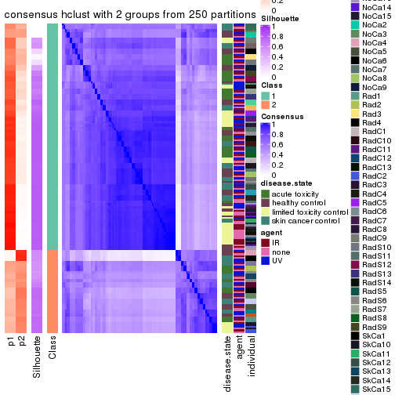</p>

</div>
<div id='tab-CV-hclust-consensus-heatmap-2'>
<pre><code class="r">consensus_heatmap(res, k = 3)
</code></pre>

<p>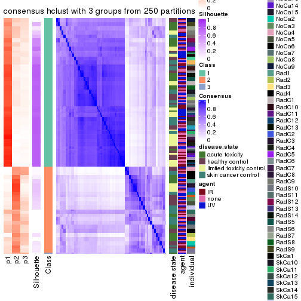</p>

</div>
<div id='tab-CV-hclust-consensus-heatmap-3'>
<pre><code class="r">consensus_heatmap(res, k = 4)
</code></pre>

<p>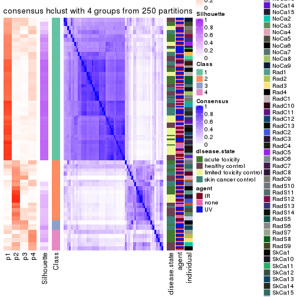</p>

</div>
<div id='tab-CV-hclust-consensus-heatmap-4'>
<pre><code class="r">consensus_heatmap(res, k = 5)
</code></pre>

<p>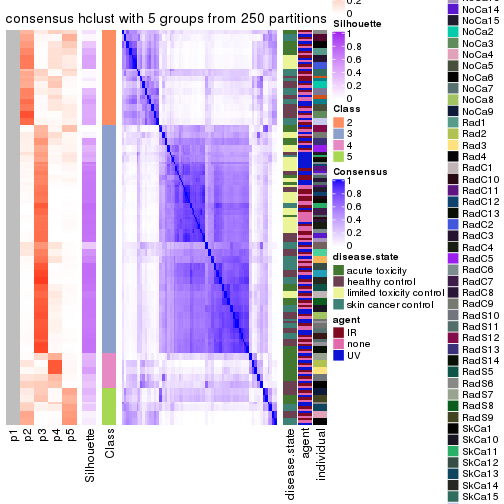</p>

</div>
<div id='tab-CV-hclust-consensus-heatmap-5'>
<pre><code class="r">consensus_heatmap(res, k = 6)
</code></pre>

<p>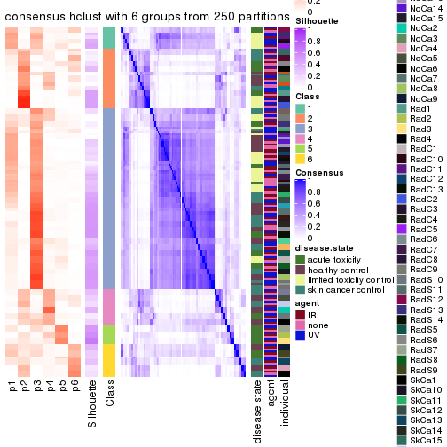</p>

</div>
</div>

Heatmaps for the membership of samples in all partitions to see how consistent they are:


<script>
$( function() {
	$( '#tabs-CV-hclust-membership-heatmap' ).tabs();
} );
</script>
<div id='tabs-CV-hclust-membership-heatmap'>
<ul>
<li><a href='#tab-CV-hclust-membership-heatmap-1'>k = 2</a></li>
<li><a href='#tab-CV-hclust-membership-heatmap-2'>k = 3</a></li>
<li><a href='#tab-CV-hclust-membership-heatmap-3'>k = 4</a></li>
<li><a href='#tab-CV-hclust-membership-heatmap-4'>k = 5</a></li>
<li><a href='#tab-CV-hclust-membership-heatmap-5'>k = 6</a></li>
</ul>
<div id='tab-CV-hclust-membership-heatmap-1'>
<pre><code class="r">membership_heatmap(res, k = 2)
</code></pre>

<p>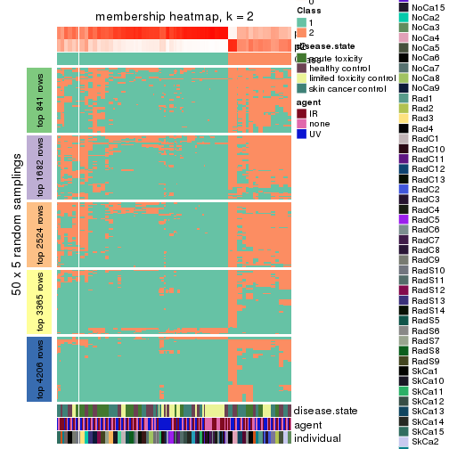</p>

</div>
<div id='tab-CV-hclust-membership-heatmap-2'>
<pre><code class="r">membership_heatmap(res, k = 3)
</code></pre>

<p>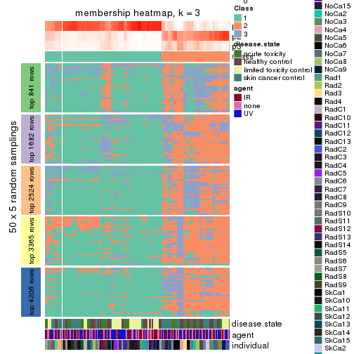</p>

</div>
<div id='tab-CV-hclust-membership-heatmap-3'>
<pre><code class="r">membership_heatmap(res, k = 4)
</code></pre>

<p>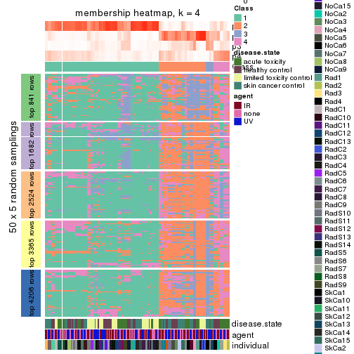</p>

</div>
<div id='tab-CV-hclust-membership-heatmap-4'>
<pre><code class="r">membership_heatmap(res, k = 5)
</code></pre>

<p>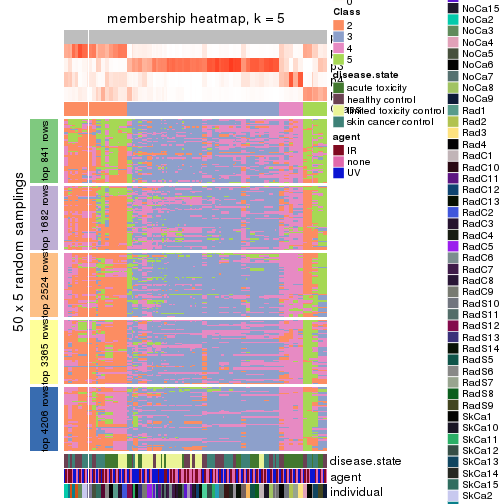</p>

</div>
<div id='tab-CV-hclust-membership-heatmap-5'>
<pre><code class="r">membership_heatmap(res, k = 6)
</code></pre>

<p>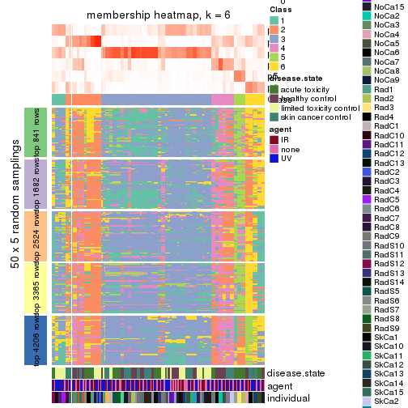</p>

</div>
</div>

As soon as we have had the classes for columns, we can look for signatures
which are significantly different between classes which can be candidate marks
for certain classes. Following are the heatmaps for signatures.


Signature heatmaps where rows are scaled:


<script>
$( function() {
	$( '#tabs-CV-hclust-get-signatures' ).tabs();
} );
</script>
<div id='tabs-CV-hclust-get-signatures'>
<ul>
<li><a href='#tab-CV-hclust-get-signatures-1'>k = 2</a></li>
<li><a href='#tab-CV-hclust-get-signatures-2'>k = 3</a></li>
<li><a href='#tab-CV-hclust-get-signatures-3'>k = 4</a></li>
<li><a href='#tab-CV-hclust-get-signatures-4'>k = 5</a></li>
<li><a href='#tab-CV-hclust-get-signatures-5'>k = 6</a></li>
</ul>
<div id='tab-CV-hclust-get-signatures-1'>
<pre><code class="r">get_signatures(res, k = 2)
</code></pre>

<p>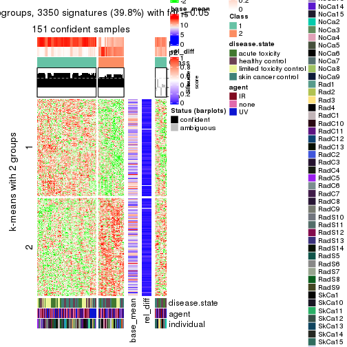</p>

</div>
<div id='tab-CV-hclust-get-signatures-2'>
<pre><code class="r">get_signatures(res, k = 3)
</code></pre>

<p></p>

</div>
<div id='tab-CV-hclust-get-signatures-3'>
<pre><code class="r">get_signatures(res, k = 4)
</code></pre>

<p>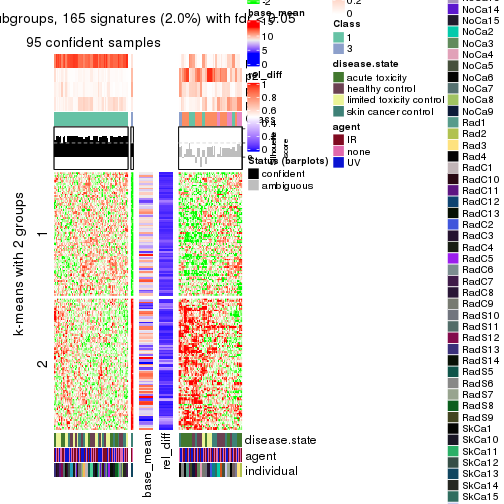</p>

</div>
<div id='tab-CV-hclust-get-signatures-4'>
<pre><code class="r">get_signatures(res, k = 5)
</code></pre>

<p></p>

</div>
<div id='tab-CV-hclust-get-signatures-5'>
<pre><code class="r">get_signatures(res, k = 6)
</code></pre>

<p>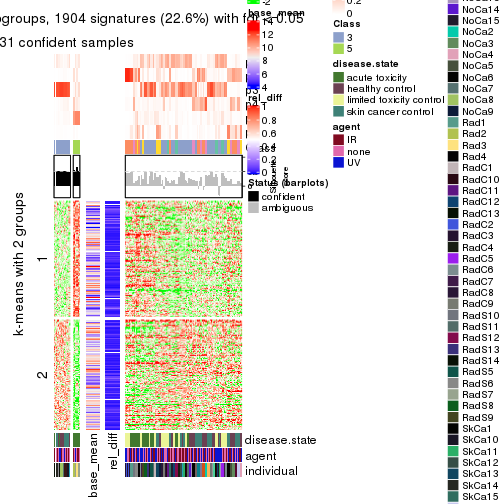</p>

</div>
</div>


Signature heatmaps where rows are not scaled:


<script>
$( function() {
	$( '#tabs-CV-hclust-get-signatures-no-scale' ).tabs();
} );
</script>
<div id='tabs-CV-hclust-get-signatures-no-scale'>
<ul>
<li><a href='#tab-CV-hclust-get-signatures-no-scale-1'>k = 2</a></li>
<li><a href='#tab-CV-hclust-get-signatures-no-scale-2'>k = 3</a></li>
<li><a href='#tab-CV-hclust-get-signatures-no-scale-3'>k = 4</a></li>
<li><a href='#tab-CV-hclust-get-signatures-no-scale-4'>k = 5</a></li>
<li><a href='#tab-CV-hclust-get-signatures-no-scale-5'>k = 6</a></li>
</ul>
<div id='tab-CV-hclust-get-signatures-no-scale-1'>
<pre><code class="r">get_signatures(res, k = 2, scale_rows = FALSE)
</code></pre>

<p>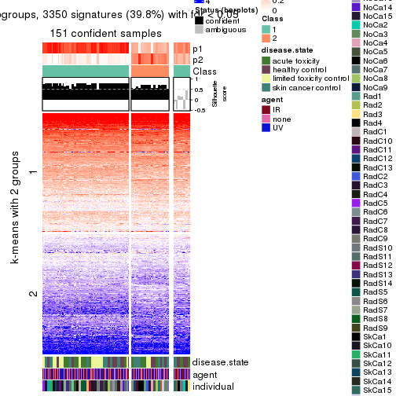</p>

</div>
<div id='tab-CV-hclust-get-signatures-no-scale-2'>
<pre><code class="r">get_signatures(res, k = 3, scale_rows = FALSE)
</code></pre>

<p></p>

</div>
<div id='tab-CV-hclust-get-signatures-no-scale-3'>
<pre><code class="r">get_signatures(res, k = 4, scale_rows = FALSE)
</code></pre>

<p>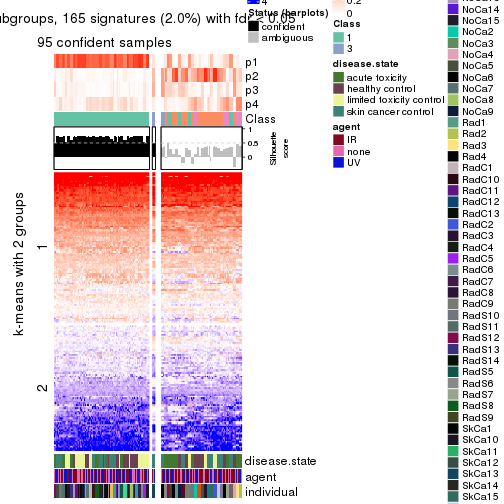</p>

</div>
<div id='tab-CV-hclust-get-signatures-no-scale-4'>
<pre><code class="r">get_signatures(res, k = 5, scale_rows = FALSE)
</code></pre>

<p></p>

</div>
<div id='tab-CV-hclust-get-signatures-no-scale-5'>
<pre><code class="r">get_signatures(res, k = 6, scale_rows = FALSE)
</code></pre>

<p>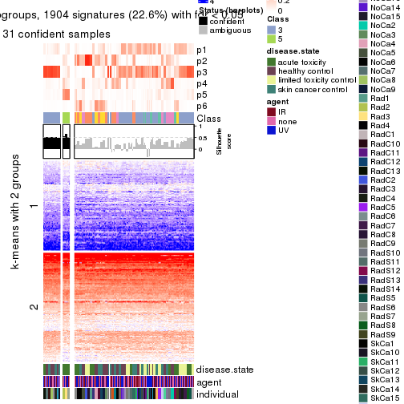</p>

</div>
</div>


Compare the overlap of signatures from different k:

```r
compare_signatures(res)
```

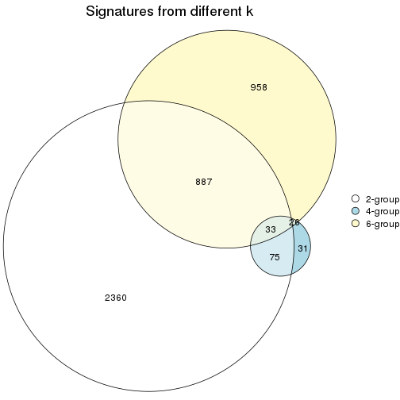

`get_signature()` returns a data frame invisibly. TO get the list of signatures, the function
call should be assigned to a variable explicitly. In following code, if `plot` argument is set
to `FALSE`, no heatmap is plotted while only the differential analysis is performed.

```r
# code only for demonstration
tb = get_signature(res, k = ..., plot = FALSE)
```

An example of the output of `tb` is:

```
#>   which_row         fdr    mean_1    mean_2 scaled_mean_1 scaled_mean_2 km
#> 1        38 0.042760348  8.373488  9.131774    -0.5533452     0.5164555  1
#> 2        40 0.018707592  7.106213  8.469186    -0.6173731     0.5762149  1
#> 3        55 0.019134737 10.221463 11.207825    -0.6159697     0.5749050  1
#> 4        59 0.006059896  5.921854  7.869574    -0.6899429     0.6439467  1
#> 5        60 0.018055526  8.928898 10.211722    -0.6204761     0.5791110  1
#> 6        98 0.009384629 15.714769 14.887706     0.6635654    -0.6193277  2
...
```

The columns in `tb` are:

1. `which_row`: row indices corresponding to the input matrix.
2. `fdr`: FDR for the differential test. 
3. `mean_x`: The mean value in group x.
4. `scaled_mean_x`: The mean value in group x after rows are scaled.
5. `km`: Row groups if k-means clustering is applied to rows.


UMAP plot which shows how samples are separated.


<script>
$( function() {
	$( '#tabs-CV-hclust-dimension-reduction' ).tabs();
} );
</script>
<div id='tabs-CV-hclust-dimension-reduction'>
<ul>
<li><a href='#tab-CV-hclust-dimension-reduction-1'>k = 2</a></li>
<li><a href='#tab-CV-hclust-dimension-reduction-2'>k = 3</a></li>
<li><a href='#tab-CV-hclust-dimension-reduction-3'>k = 4</a></li>
<li><a href='#tab-CV-hclust-dimension-reduction-4'>k = 5</a></li>
<li><a href='#tab-CV-hclust-dimension-reduction-5'>k = 6</a></li>
</ul>
<div id='tab-CV-hclust-dimension-reduction-1'>
<pre><code class="r">dimension_reduction(res, k = 2, method = &quot;UMAP&quot;)
</code></pre>

<p>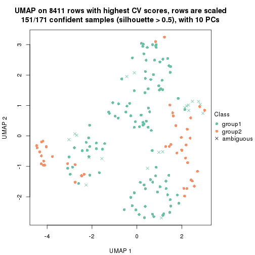</p>

</div>
<div id='tab-CV-hclust-dimension-reduction-2'>
<pre><code class="r">dimension_reduction(res, k = 3, method = &quot;UMAP&quot;)
</code></pre>

<p>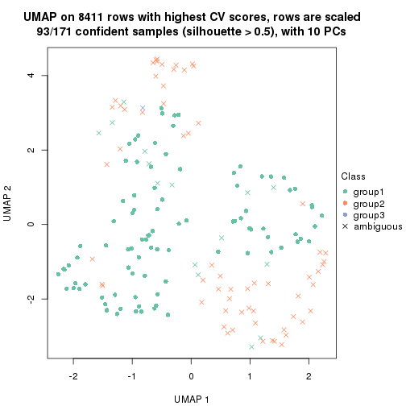</p>

</div>
<div id='tab-CV-hclust-dimension-reduction-3'>
<pre><code class="r">dimension_reduction(res, k = 4, method = &quot;UMAP&quot;)
</code></pre>

<p>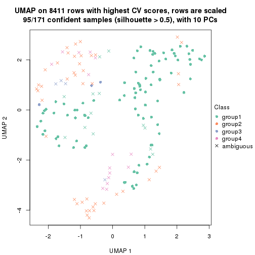</p>

</div>
<div id='tab-CV-hclust-dimension-reduction-4'>
<pre><code class="r">dimension_reduction(res, k = 5, method = &quot;UMAP&quot;)
</code></pre>

<p>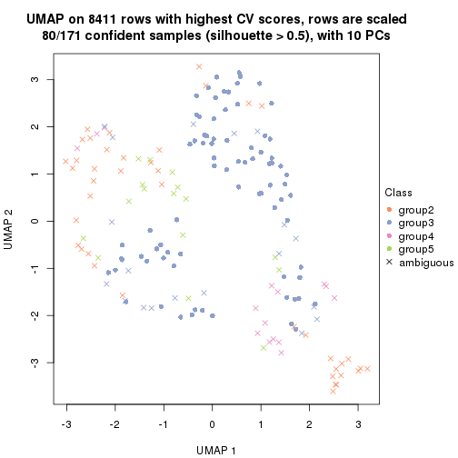</p>

</div>
<div id='tab-CV-hclust-dimension-reduction-5'>
<pre><code class="r">dimension_reduction(res, k = 6, method = &quot;UMAP&quot;)
</code></pre>

<p>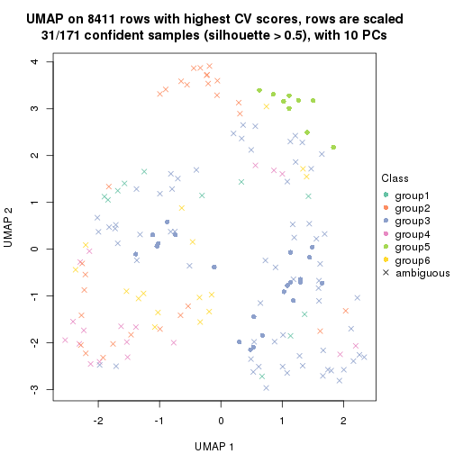</p>

</div>
</div>


Following heatmap shows how subgroups are split when increasing `k`:

```r
collect_classes(res)
```

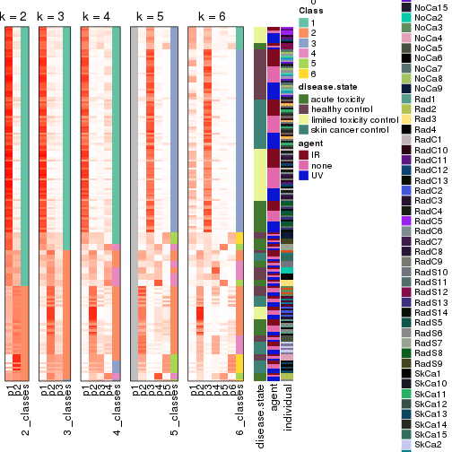


Test correlation between subgroups and known annotations. If the known
annotation is numeric, one-way ANOVA test is applied, and if the known
annotation is discrete, chi-squared contingency table test is applied.

```r
test_to_known_factors(res)
```

```
#>             n disease.state(p) agent(p) individual(p) k
#> CV:hclust 151         8.27e-02    0.941      4.48e-12 2
#> CV:hclust  93               NA       NA            NA 3
#> CV:hclust  95         2.72e-02    1.000      2.05e-08 4
#> CV:hclust  80               NA       NA            NA 5
#> CV:hclust  31         4.36e-05    0.987      5.87e-04 6
```


If matrix rows can be associated to genes, consider to use `functional_enrichment(res,
...)` to perform function enrichment for the signature genes. See [this vignette](http://bioconductor.org/packages/devel/bioc/vignettes/cola/inst/doc/functional_enrichment.html) for more detailed explanations.


 

---------------------------------------------------


### CV:kmeans


The object with results only for a single top-value method and a single partition method 
can be extracted as:

```r
res = res_list["CV", "kmeans"]
# you can also extract it by
# res = res_list["CV:kmeans"]
```

A summary of `res` and all the functions that can be applied to it:

```r
res
```

```
#> A 'ConsensusPartition' object with k = 2, 3, 4, 5, 6.
#>   On a matrix with 8411 rows and 171 columns.
#>   Top rows (841, 1682, 2524, 3365, 4206) are extracted by 'CV' method.
#>   Subgroups are detected by 'kmeans' method.
#>   Performed in total 1250 partitions by row resampling.
#>   Best k for subgroups seems to be 2.
#> 
#> Following methods can be applied to this 'ConsensusPartition' object:
#>  [1] "cola_report"             "collect_classes"         "collect_plots"          
#>  [4] "collect_stats"           "colnames"                "compare_signatures"     
#>  [7] "consensus_heatmap"       "dimension_reduction"     "functional_enrichment"  
#> [10] "get_anno_col"            "get_anno"                "get_classes"            
#> [13] "get_consensus"           "get_matrix"              "get_membership"         
#> [16] "get_param"               "get_signatures"          "get_stats"              
#> [19] "is_best_k"               "is_stable_k"             "membership_heatmap"     
#> [22] "ncol"                    "nrow"                    "plot_ecdf"              
#> [25] "rownames"                "select_partition_number" "show"                   
#> [28] "suggest_best_k"          "test_to_known_factors"
```

`collect_plots()` function collects all the plots made from `res` for all `k` (number of partitions)
into one single page to provide an easy and fast comparison between different `k`.

```r
collect_plots(res)
```

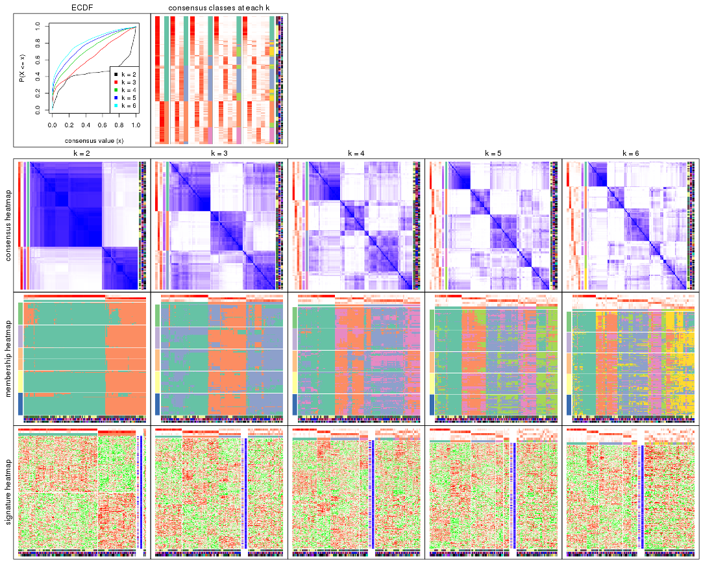

The plots are:

- The first row: a plot of the ECDF (empirical cumulative distribution
  function) curves of the consensus matrix for each `k` and the heatmap of
  predicted classes for each `k`.
- The second row: heatmaps of the consensus matrix for each `k`.
- The third row: heatmaps of the membership matrix for each `k`.
- The fouth row: heatmaps of the signatures for each `k`.

All the plots in panels can be made by individual functions and they are
plotted later in this section.

`select_partition_number()` produces several plots showing different
statistics for choosing "optimized" `k`. There are following statistics:

- ECDF curves of the consensus matrix for each `k`;
- 1-PAC. [The PAC
  score](https://en.wikipedia.org/wiki/Consensus_clustering#Over-interpretation_potential_of_consensus_clustering)
  measures the proportion of the ambiguous subgrouping.
- Mean silhouette score.
- Concordance. The mean probability of fiting the consensus class ids in all
  partitions.
- Area increased. Denote $A_k$ as the area under the ECDF curve for current
  `k`, the area increased is defined as $A_k - A_{k-1}$.
- Rand index. The percent of pairs of samples that are both in a same cluster
  or both are not in a same cluster in the partition of k and k-1.
- Jaccard index. The ratio of pairs of samples are both in a same cluster in
  the partition of k and k-1 and the pairs of samples are both in a same
  cluster in the partition k or k-1.

The detailed explanations of these statistics can be found in [the _cola_
vignette](http://bioconductor.org/packages/devel/bioc/vignettes/cola/inst/doc/cola.html#toc_13).

Generally speaking, lower PAC score, higher mean silhouette score or higher
concordance corresponds to better partition. Rand index and Jaccard index
measure how similar the current partition is compared to partition with `k-1`.
If they are too similar, we won't accept `k` is better than `k-1`.

```r
select_partition_number(res)
```

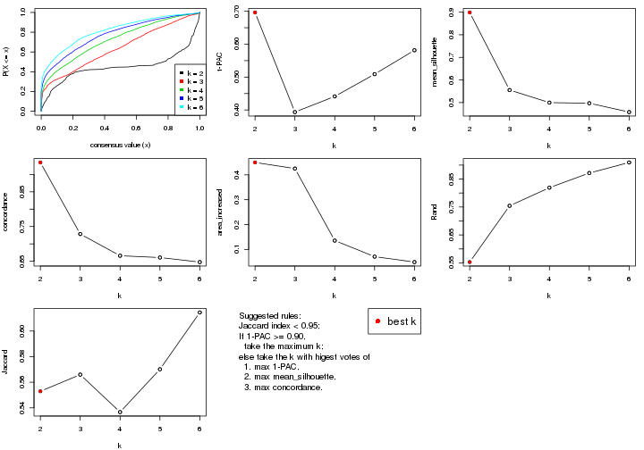

The numeric values for all these statistics can be obtained by `get_stats()`.

```r
get_stats(res)
```

```
#>   k 1-PAC mean_silhouette concordance area_increased  Rand Jaccard
#> 2 2 0.696           0.899       0.934         0.4497 0.553   0.553
#> 3 3 0.394           0.555       0.728         0.4253 0.754   0.566
#> 4 4 0.441           0.500       0.666         0.1356 0.819   0.537
#> 5 5 0.509           0.497       0.661         0.0711 0.872   0.570
#> 6 6 0.582           0.458       0.648         0.0492 0.909   0.615
```

`suggest_best_k()` suggests the best $k$ based on these statistics. The rules are as follows:

- All $k$ with Jaccard index larger than 0.95 are removed because increasing
  $k$ does not provide enough extra information. If all $k$ are removed, it is
  marked as no subgroup is detected.
- For all $k$ with 1-PAC score larger than 0.9, the maximal $k$ is taken as
  the best $k$, and other $k$ are marked as optional $k$.
- If it does not fit the second rule. The $k$ with the maximal vote of the
  highest 1-PAC score, highest mean silhouette, and highest concordance is
  taken as the best $k$.

```r
suggest_best_k(res)
```

```
#> [1] 2
```


Following shows the table of the partitions (You need to click the **show/hide
code output** link to see it). The membership matrix (columns with name `p*`)
is inferred by
[`clue::cl_consensus()`](https://www.rdocumentation.org/link/cl_consensus?package=clue)
function with the `SE` method. Basically the value in the membership matrix
represents the probability to belong to a certain group. The finall class
label for an item is determined with the group with highest probability it
belongs to.

In `get_classes()` function, the entropy is calculated from the membership
matrix and the silhouette score is calculated from the consensus matrix.


<script>
$( function() {
	$( '#tabs-CV-kmeans-get-classes' ).tabs();
} );
</script>
<div id='tabs-CV-kmeans-get-classes'>
<ul>
<li><a href='#tab-CV-kmeans-get-classes-1'>k = 2</a></li>
<li><a href='#tab-CV-kmeans-get-classes-2'>k = 3</a></li>
<li><a href='#tab-CV-kmeans-get-classes-3'>k = 4</a></li>
<li><a href='#tab-CV-kmeans-get-classes-4'>k = 5</a></li>
<li><a href='#tab-CV-kmeans-get-classes-5'>k = 6</a></li>
</ul>

<div id='tab-CV-kmeans-get-classes-1'>
<p><a id='tab-CV-kmeans-get-classes-1-a' style='color:#0366d6' href='#'>show/hide code output</a></p>
<pre><code class="r">cbind(get_classes(res, k = 2), get_membership(res, k = 2))
</code></pre>

<pre><code>#&gt;          class entropy silhouette    p1    p2
#&gt; GSM29783     2  0.4690      0.891 0.100 0.900
#&gt; GSM29786     2  0.6247      0.851 0.156 0.844
#&gt; GSM29789     2  0.2948      0.908 0.052 0.948
#&gt; GSM29792     2  0.2948      0.908 0.052 0.948
#&gt; GSM29795     2  0.7950      0.790 0.240 0.760
#&gt; GSM29798     2  0.6247      0.851 0.156 0.844
#&gt; GSM29801     1  0.0672      0.944 0.992 0.008
#&gt; GSM29804     1  0.2236      0.941 0.964 0.036
#&gt; GSM29807     1  0.8661      0.696 0.712 0.288
#&gt; GSM29816     1  0.1414      0.944 0.980 0.020
#&gt; GSM29821     1  0.0672      0.944 0.992 0.008
#&gt; GSM29824     1  0.0000      0.945 1.000 0.000
#&gt; GSM29827     1  0.0938      0.944 0.988 0.012
#&gt; GSM29830     1  0.0938      0.944 0.988 0.012
#&gt; GSM29833     1  0.0938      0.944 0.988 0.012
#&gt; GSM29784     2  0.0938      0.917 0.012 0.988
#&gt; GSM29787     2  0.6343      0.851 0.160 0.840
#&gt; GSM29790     2  0.0938      0.915 0.012 0.988
#&gt; GSM29793     2  0.2043      0.913 0.032 0.968
#&gt; GSM29796     2  0.5842      0.883 0.140 0.860
#&gt; GSM29799     2  0.6247      0.851 0.156 0.844
#&gt; GSM29802     1  0.2948      0.933 0.948 0.052
#&gt; GSM29805     1  0.1633      0.944 0.976 0.024
#&gt; GSM29814     1  0.8661      0.696 0.712 0.288
#&gt; GSM29817     1  0.0376      0.945 0.996 0.004
#&gt; GSM29822     1  0.0672      0.945 0.992 0.008
#&gt; GSM29825     1  0.0376      0.945 0.996 0.004
#&gt; GSM29828     1  0.0938      0.944 0.988 0.012
#&gt; GSM29831     1  0.0938      0.944 0.988 0.012
#&gt; GSM29834     1  0.0938      0.944 0.988 0.012
#&gt; GSM29785     2  0.0672      0.917 0.008 0.992
#&gt; GSM29788     2  0.5737      0.868 0.136 0.864
#&gt; GSM29791     2  0.2948      0.908 0.052 0.948
#&gt; GSM29794     2  0.2948      0.908 0.052 0.948
#&gt; GSM29797     2  0.3733      0.908 0.072 0.928
#&gt; GSM29800     2  0.5737      0.868 0.136 0.864
#&gt; GSM29803     1  0.3114      0.933 0.944 0.056
#&gt; GSM29806     1  0.4298      0.918 0.912 0.088
#&gt; GSM29815     1  0.9881      0.360 0.564 0.436
#&gt; GSM29819     1  0.2948      0.933 0.948 0.052
#&gt; GSM29823     1  0.0672      0.944 0.992 0.008
#&gt; GSM29826     1  0.1414      0.944 0.980 0.020
#&gt; GSM29829     1  0.0938      0.944 0.988 0.012
#&gt; GSM29832     1  0.0938      0.944 0.988 0.012
#&gt; GSM29835     1  0.0938      0.944 0.988 0.012
#&gt; GSM29836     2  0.1414      0.914 0.020 0.980
#&gt; GSM29839     2  0.5737      0.885 0.136 0.864
#&gt; GSM29842     2  0.0938      0.917 0.012 0.988
#&gt; GSM29845     2  0.4690      0.892 0.100 0.900
#&gt; GSM29848     2  0.6048      0.870 0.148 0.852
#&gt; GSM29851     1  0.0376      0.945 0.996 0.004
#&gt; GSM29854     1  0.2948      0.933 0.948 0.052
#&gt; GSM29857     1  0.3114      0.933 0.944 0.056
#&gt; GSM29860     2  0.2948      0.908 0.052 0.948
#&gt; GSM29863     1  0.0376      0.945 0.996 0.004
#&gt; GSM29866     1  0.0938      0.944 0.988 0.012
#&gt; GSM29869     1  0.0938      0.944 0.988 0.012
#&gt; GSM29872     1  0.6531      0.816 0.832 0.168
#&gt; GSM29875     1  0.0376      0.945 0.996 0.004
#&gt; GSM29878     1  0.6048      0.840 0.852 0.148
#&gt; GSM29837     2  0.0672      0.914 0.008 0.992
#&gt; GSM29840     2  0.4939      0.897 0.108 0.892
#&gt; GSM29843     2  0.1633      0.917 0.024 0.976
#&gt; GSM29846     2  0.3114      0.910 0.056 0.944
#&gt; GSM29849     2  0.6712      0.850 0.176 0.824
#&gt; GSM29852     1  0.0376      0.945 0.996 0.004
#&gt; GSM29855     1  0.2948      0.933 0.948 0.052
#&gt; GSM29858     1  0.3114      0.933 0.944 0.056
#&gt; GSM29861     2  0.2948      0.908 0.052 0.948
#&gt; GSM29864     1  0.0376      0.945 0.996 0.004
#&gt; GSM29867     1  0.0672      0.945 0.992 0.008
#&gt; GSM29870     1  0.0672      0.945 0.992 0.008
#&gt; GSM29873     1  0.6438      0.817 0.836 0.164
#&gt; GSM29876     1  0.1633      0.944 0.976 0.024
#&gt; GSM29879     1  0.1633      0.941 0.976 0.024
#&gt; GSM29838     2  0.0000      0.915 0.000 1.000
#&gt; GSM29841     2  0.4298      0.905 0.088 0.912
#&gt; GSM29844     2  0.2778      0.911 0.048 0.952
#&gt; GSM29847     2  0.4298      0.898 0.088 0.912
#&gt; GSM29850     2  0.6438      0.863 0.164 0.836
#&gt; GSM29853     1  0.0376      0.945 0.996 0.004
#&gt; GSM29856     1  0.2948      0.933 0.948 0.052
#&gt; GSM29859     1  0.5519      0.890 0.872 0.128
#&gt; GSM29862     2  0.2948      0.908 0.052 0.948
#&gt; GSM29865     1  0.3114      0.933 0.944 0.056
#&gt; GSM29868     1  0.0938      0.944 0.988 0.012
#&gt; GSM29871     1  0.6247      0.853 0.844 0.156
#&gt; GSM29874     1  0.7950      0.726 0.760 0.240
#&gt; GSM29877     1  0.0376      0.945 0.996 0.004
#&gt; GSM29880     2  0.2948      0.908 0.052 0.948
#&gt; GSM29881     1  0.2948      0.933 0.948 0.052
#&gt; GSM29884     2  0.0672      0.914 0.008 0.992
#&gt; GSM29887     2  0.0000      0.915 0.000 1.000
#&gt; GSM29890     1  0.0376      0.945 0.996 0.004
#&gt; GSM29893     1  0.0672      0.944 0.992 0.008
#&gt; GSM29896     1  0.0672      0.944 0.992 0.008
#&gt; GSM29899     1  0.0000      0.945 1.000 0.000
#&gt; GSM29902     1  0.2043      0.942 0.968 0.032
#&gt; GSM29905     1  0.1633      0.944 0.976 0.024
#&gt; GSM29908     1  0.0938      0.944 0.988 0.012
#&gt; GSM29955     1  0.0672      0.945 0.992 0.008
#&gt; GSM29958     1  0.0938      0.944 0.988 0.012
#&gt; GSM29961     1  0.0938      0.944 0.988 0.012
#&gt; GSM29882     1  0.2603      0.936 0.956 0.044
#&gt; GSM29885     2  0.0672      0.914 0.008 0.992
#&gt; GSM29888     2  0.0672      0.914 0.008 0.992
#&gt; GSM29891     1  0.1633      0.944 0.976 0.024
#&gt; GSM29894     1  0.0672      0.944 0.992 0.008
#&gt; GSM29897     1  0.0672      0.944 0.992 0.008
#&gt; GSM29900     1  0.1414      0.944 0.980 0.020
#&gt; GSM29903     1  0.1633      0.944 0.976 0.024
#&gt; GSM29906     1  0.1633      0.944 0.976 0.024
#&gt; GSM29909     1  0.2236      0.945 0.964 0.036
#&gt; GSM29956     1  0.0938      0.944 0.988 0.012
#&gt; GSM29959     1  0.0938      0.944 0.988 0.012
#&gt; GSM29962     1  0.0938      0.944 0.988 0.012
#&gt; GSM29883     1  0.2948      0.933 0.948 0.052
#&gt; GSM29886     2  0.0000      0.915 0.000 1.000
#&gt; GSM29889     2  0.0000      0.915 0.000 1.000
#&gt; GSM29892     1  0.1184      0.945 0.984 0.016
#&gt; GSM29895     1  0.1184      0.944 0.984 0.016
#&gt; GSM29898     1  0.1843      0.943 0.972 0.028
#&gt; GSM29901     1  0.1633      0.943 0.976 0.024
#&gt; GSM29904     1  0.1184      0.945 0.984 0.016
#&gt; GSM29907     1  0.2043      0.942 0.968 0.032
#&gt; GSM29910     1  0.0938      0.944 0.988 0.012
#&gt; GSM29957     1  0.2236      0.942 0.964 0.036
#&gt; GSM29960     1  0.0938      0.944 0.988 0.012
#&gt; GSM29963     1  0.1414      0.946 0.980 0.020
#&gt; GSM29964     2  0.0672      0.914 0.008 0.992
#&gt; GSM29967     2  0.1633      0.916 0.024 0.976
#&gt; GSM29970     1  0.4939      0.903 0.892 0.108
#&gt; GSM29973     2  0.0672      0.914 0.008 0.992
#&gt; GSM29976     1  0.2948      0.933 0.948 0.052
#&gt; GSM29979     1  0.8555      0.710 0.720 0.280
#&gt; GSM29982     1  0.7528      0.706 0.784 0.216
#&gt; GSM29985     1  0.2948      0.933 0.948 0.052
#&gt; GSM29988     1  0.7376      0.807 0.792 0.208
#&gt; GSM29991     2  0.9732      0.418 0.404 0.596
#&gt; GSM29994     1  0.2236      0.941 0.964 0.036
#&gt; GSM29997     1  0.2043      0.936 0.968 0.032
#&gt; GSM30000     1  0.2603      0.941 0.956 0.044
#&gt; GSM30003     1  0.2948      0.933 0.948 0.052
#&gt; GSM29965     2  0.0672      0.914 0.008 0.992
#&gt; GSM29968     2  0.1633      0.916 0.024 0.976
#&gt; GSM29971     1  0.4815      0.906 0.896 0.104
#&gt; GSM29974     2  0.0672      0.914 0.008 0.992
#&gt; GSM29977     1  0.2948      0.933 0.948 0.052
#&gt; GSM29980     1  0.8267      0.740 0.740 0.260
#&gt; GSM29983     1  0.2043      0.936 0.968 0.032
#&gt; GSM29986     1  0.2948      0.933 0.948 0.052
#&gt; GSM29989     1  0.7376      0.807 0.792 0.208
#&gt; GSM29992     2  0.9850      0.348 0.428 0.572
#&gt; GSM29995     1  0.0938      0.944 0.988 0.012
#&gt; GSM29998     1  0.3114      0.930 0.944 0.056
#&gt; GSM30001     1  0.4022      0.923 0.920 0.080
#&gt; GSM30004     1  0.1633      0.943 0.976 0.024
#&gt; GSM29966     2  0.0376      0.914 0.004 0.996
#&gt; GSM29969     2  0.1414      0.916 0.020 0.980
#&gt; GSM29972     1  0.5059      0.900 0.888 0.112
#&gt; GSM29975     2  0.0672      0.914 0.008 0.992
#&gt; GSM29978     1  0.2948      0.933 0.948 0.052
#&gt; GSM29981     2  0.4431      0.869 0.092 0.908
#&gt; GSM29984     2  0.9686      0.423 0.396 0.604
#&gt; GSM29987     1  0.2948      0.933 0.948 0.052
#&gt; GSM29990     1  0.7299      0.810 0.796 0.204
#&gt; GSM29993     2  0.7453      0.788 0.212 0.788
#&gt; GSM29996     1  0.0672      0.945 0.992 0.008
#&gt; GSM29999     1  0.7219      0.816 0.800 0.200
#&gt; GSM30002     1  0.6623      0.848 0.828 0.172
#&gt; GSM30005     1  0.2948      0.933 0.948 0.052
</code></pre>

<script>
$('#tab-CV-kmeans-get-classes-1-a').parent().next().next().hide();
$('#tab-CV-kmeans-get-classes-1-a').click(function(){
  $('#tab-CV-kmeans-get-classes-1-a').parent().next().next().toggle();
  return(false);
});
</script>
</div>

<div id='tab-CV-kmeans-get-classes-2'>
<p><a id='tab-CV-kmeans-get-classes-2-a' style='color:#0366d6' href='#'>show/hide code output</a></p>
<pre><code class="r">cbind(get_classes(res, k = 3), get_membership(res, k = 3))
</code></pre>

<pre><code>#&gt;          class entropy silhouette    p1    p2    p3
#&gt; GSM29783     2  0.5987     0.7456 0.036 0.756 0.208
#&gt; GSM29786     2  0.6018     0.6910 0.008 0.684 0.308
#&gt; GSM29789     2  0.3713     0.8118 0.032 0.892 0.076
#&gt; GSM29792     2  0.4121     0.8052 0.040 0.876 0.084
#&gt; GSM29795     2  0.9258     0.4977 0.272 0.524 0.204
#&gt; GSM29798     2  0.6018     0.6910 0.008 0.684 0.308
#&gt; GSM29801     1  0.5859     0.2335 0.656 0.000 0.344
#&gt; GSM29804     3  0.6140     0.5035 0.404 0.000 0.596
#&gt; GSM29807     3  0.8546     0.4293 0.132 0.284 0.584
#&gt; GSM29816     3  0.6215     0.4639 0.428 0.000 0.572
#&gt; GSM29821     1  0.5810     0.2895 0.664 0.000 0.336
#&gt; GSM29824     1  0.2625     0.6597 0.916 0.000 0.084
#&gt; GSM29827     1  0.0000     0.6820 1.000 0.000 0.000
#&gt; GSM29830     1  0.0000     0.6820 1.000 0.000 0.000
#&gt; GSM29833     1  0.0747     0.6732 0.984 0.000 0.016
#&gt; GSM29784     2  0.2945     0.8177 0.004 0.908 0.088
#&gt; GSM29787     2  0.5988     0.6921 0.008 0.688 0.304
#&gt; GSM29790     2  0.1129     0.8239 0.004 0.976 0.020
#&gt; GSM29793     2  0.2866     0.8163 0.008 0.916 0.076
#&gt; GSM29796     2  0.5955     0.7795 0.048 0.772 0.180
#&gt; GSM29799     2  0.6434     0.5975 0.008 0.612 0.380
#&gt; GSM29802     3  0.5706     0.5887 0.320 0.000 0.680
#&gt; GSM29805     3  0.6095     0.5265 0.392 0.000 0.608
#&gt; GSM29814     3  0.8626     0.4341 0.140 0.280 0.580
#&gt; GSM29817     1  0.6244    -0.0217 0.560 0.000 0.440
#&gt; GSM29822     1  0.6309    -0.2065 0.500 0.000 0.500
#&gt; GSM29825     1  0.5363     0.3915 0.724 0.000 0.276
#&gt; GSM29828     1  0.0000     0.6820 1.000 0.000 0.000
#&gt; GSM29831     1  0.0237     0.6814 0.996 0.000 0.004
#&gt; GSM29834     1  0.0892     0.6718 0.980 0.000 0.020
#&gt; GSM29785     2  0.2584     0.8211 0.008 0.928 0.064
#&gt; GSM29788     2  0.5896     0.7037 0.008 0.700 0.292
#&gt; GSM29791     2  0.3856     0.8093 0.040 0.888 0.072
#&gt; GSM29794     2  0.4121     0.8052 0.040 0.876 0.084
#&gt; GSM29797     2  0.5285     0.8020 0.040 0.812 0.148
#&gt; GSM29800     2  0.6018     0.6910 0.008 0.684 0.308
#&gt; GSM29803     3  0.4796     0.6180 0.220 0.000 0.780
#&gt; GSM29806     3  0.6632     0.6192 0.272 0.036 0.692
#&gt; GSM29815     3  0.7718     0.4171 0.068 0.320 0.612
#&gt; GSM29819     3  0.5291     0.6166 0.268 0.000 0.732
#&gt; GSM29823     1  0.6442     0.1673 0.564 0.004 0.432
#&gt; GSM29826     3  0.6189     0.5272 0.364 0.004 0.632
#&gt; GSM29829     1  0.1753     0.6673 0.952 0.000 0.048
#&gt; GSM29832     1  0.1753     0.6646 0.952 0.000 0.048
#&gt; GSM29835     1  0.3295     0.6288 0.896 0.008 0.096
#&gt; GSM29836     2  0.3500     0.8068 0.004 0.880 0.116
#&gt; GSM29839     2  0.5688     0.7915 0.044 0.788 0.168
#&gt; GSM29842     2  0.1647     0.8238 0.004 0.960 0.036
#&gt; GSM29845     2  0.6434     0.5978 0.008 0.612 0.380
#&gt; GSM29848     2  0.6129     0.6900 0.008 0.668 0.324
#&gt; GSM29851     1  0.6286    -0.1122 0.536 0.000 0.464
#&gt; GSM29854     3  0.5754     0.6111 0.296 0.004 0.700
#&gt; GSM29857     3  0.6033     0.5862 0.336 0.004 0.660
#&gt; GSM29860     2  0.5407     0.7719 0.040 0.804 0.156
#&gt; GSM29863     3  0.6291     0.1881 0.468 0.000 0.532
#&gt; GSM29866     1  0.0000     0.6820 1.000 0.000 0.000
#&gt; GSM29869     1  0.3340     0.6363 0.880 0.000 0.120
#&gt; GSM29872     1  0.9033     0.1732 0.548 0.180 0.272
#&gt; GSM29875     1  0.6192     0.0396 0.580 0.000 0.420
#&gt; GSM29878     1  0.6231     0.4673 0.772 0.148 0.080
#&gt; GSM29837     2  0.3412     0.7949 0.000 0.876 0.124
#&gt; GSM29840     2  0.5174     0.8058 0.048 0.824 0.128
#&gt; GSM29843     2  0.2096     0.8249 0.004 0.944 0.052
#&gt; GSM29846     2  0.6264     0.6036 0.004 0.616 0.380
#&gt; GSM29849     2  0.6155     0.6896 0.008 0.664 0.328
#&gt; GSM29852     1  0.6309    -0.2109 0.504 0.000 0.496
#&gt; GSM29855     3  0.5623     0.6138 0.280 0.004 0.716
#&gt; GSM29858     3  0.6057     0.5820 0.340 0.004 0.656
#&gt; GSM29861     2  0.5407     0.7719 0.040 0.804 0.156
#&gt; GSM29864     1  0.6280    -0.0430 0.540 0.000 0.460
#&gt; GSM29867     1  0.4121     0.5783 0.832 0.000 0.168
#&gt; GSM29870     1  0.4002     0.5983 0.840 0.000 0.160
#&gt; GSM29873     3  0.9633     0.1768 0.368 0.208 0.424
#&gt; GSM29876     3  0.6235     0.3891 0.436 0.000 0.564
#&gt; GSM29879     1  0.4818     0.6236 0.844 0.048 0.108
#&gt; GSM29838     2  0.3340     0.7932 0.000 0.880 0.120
#&gt; GSM29841     2  0.5028     0.8076 0.040 0.828 0.132
#&gt; GSM29844     2  0.2280     0.8227 0.008 0.940 0.052
#&gt; GSM29847     2  0.6018     0.6910 0.008 0.684 0.308
#&gt; GSM29850     2  0.6229     0.6892 0.008 0.652 0.340
#&gt; GSM29853     3  0.6111     0.3786 0.396 0.000 0.604
#&gt; GSM29856     3  0.5285     0.6159 0.244 0.004 0.752
#&gt; GSM29859     3  0.6372     0.6093 0.176 0.068 0.756
#&gt; GSM29862     2  0.5798     0.7520 0.040 0.776 0.184
#&gt; GSM29865     3  0.4796     0.6164 0.220 0.000 0.780
#&gt; GSM29868     1  0.3752     0.6308 0.856 0.000 0.144
#&gt; GSM29871     3  0.7963     0.5264 0.188 0.152 0.660
#&gt; GSM29874     1  0.9772     0.0964 0.440 0.292 0.268
#&gt; GSM29877     1  0.6307    -0.1809 0.512 0.000 0.488
#&gt; GSM29880     2  0.5905     0.7530 0.044 0.772 0.184
#&gt; GSM29881     3  0.5480     0.6152 0.264 0.004 0.732
#&gt; GSM29884     2  0.0829     0.8227 0.004 0.984 0.012
#&gt; GSM29887     2  0.0475     0.8229 0.004 0.992 0.004
#&gt; GSM29890     1  0.2448     0.6537 0.924 0.000 0.076
#&gt; GSM29893     1  0.0237     0.6810 0.996 0.000 0.004
#&gt; GSM29896     1  0.0237     0.6814 0.996 0.000 0.004
#&gt; GSM29899     1  0.1753     0.6694 0.952 0.000 0.048
#&gt; GSM29902     1  0.5982     0.2948 0.668 0.004 0.328
#&gt; GSM29905     1  0.5845     0.3506 0.688 0.004 0.308
#&gt; GSM29908     1  0.0000     0.6820 1.000 0.000 0.000
#&gt; GSM29955     1  0.0000     0.6820 1.000 0.000 0.000
#&gt; GSM29958     1  0.0000     0.6820 1.000 0.000 0.000
#&gt; GSM29961     1  0.0000     0.6820 1.000 0.000 0.000
#&gt; GSM29882     3  0.5929     0.5749 0.320 0.004 0.676
#&gt; GSM29885     2  0.0829     0.8227 0.004 0.984 0.012
#&gt; GSM29888     2  0.1525     0.8216 0.004 0.964 0.032
#&gt; GSM29891     1  0.6104     0.2379 0.648 0.004 0.348
#&gt; GSM29894     1  0.0237     0.6810 0.996 0.000 0.004
#&gt; GSM29897     1  0.0000     0.6820 1.000 0.000 0.000
#&gt; GSM29900     1  0.5560     0.3694 0.700 0.000 0.300
#&gt; GSM29903     1  0.5404     0.4387 0.740 0.004 0.256
#&gt; GSM29906     1  0.5815     0.3568 0.692 0.004 0.304
#&gt; GSM29909     1  0.4110     0.5892 0.844 0.004 0.152
#&gt; GSM29956     1  0.0000     0.6820 1.000 0.000 0.000
#&gt; GSM29959     1  0.0000     0.6820 1.000 0.000 0.000
#&gt; GSM29962     1  0.0000     0.6820 1.000 0.000 0.000
#&gt; GSM29883     3  0.5244     0.6185 0.240 0.004 0.756
#&gt; GSM29886     2  0.0661     0.8234 0.004 0.988 0.008
#&gt; GSM29889     2  0.1267     0.8220 0.004 0.972 0.024
#&gt; GSM29892     1  0.6057     0.3275 0.656 0.004 0.340
#&gt; GSM29895     1  0.3267     0.6248 0.884 0.000 0.116
#&gt; GSM29898     1  0.6189     0.2721 0.632 0.004 0.364
#&gt; GSM29901     3  0.6154     0.4435 0.408 0.000 0.592
#&gt; GSM29904     1  0.6081     0.3230 0.652 0.004 0.344
#&gt; GSM29907     1  0.6298     0.2111 0.608 0.004 0.388
#&gt; GSM29910     1  0.2448     0.6541 0.924 0.000 0.076
#&gt; GSM29957     1  0.4645     0.5881 0.816 0.008 0.176
#&gt; GSM29960     1  0.2537     0.6460 0.920 0.000 0.080
#&gt; GSM29963     1  0.4291     0.5867 0.820 0.000 0.180
#&gt; GSM29964     2  0.3573     0.7942 0.004 0.876 0.120
#&gt; GSM29967     2  0.4978     0.7727 0.004 0.780 0.216
#&gt; GSM29970     3  0.6264     0.5865 0.256 0.028 0.716
#&gt; GSM29973     2  0.3482     0.7933 0.000 0.872 0.128
#&gt; GSM29976     3  0.6209     0.5582 0.368 0.004 0.628
#&gt; GSM29979     3  0.7553     0.3937 0.060 0.320 0.620
#&gt; GSM29982     3  0.9049     0.0485 0.400 0.136 0.464
#&gt; GSM29985     3  0.5956     0.5913 0.324 0.004 0.672
#&gt; GSM29988     3  0.8722     0.4391 0.192 0.216 0.592
#&gt; GSM29991     3  0.8793     0.3635 0.140 0.308 0.552
#&gt; GSM29994     1  0.6189     0.2008 0.632 0.004 0.364
#&gt; GSM29997     1  0.6318     0.3042 0.636 0.008 0.356
#&gt; GSM30000     1  0.5378     0.5063 0.756 0.008 0.236
#&gt; GSM30003     3  0.5926     0.5644 0.356 0.000 0.644
#&gt; GSM29965     2  0.3644     0.7944 0.004 0.872 0.124
#&gt; GSM29968     2  0.5115     0.7660 0.004 0.768 0.228
#&gt; GSM29971     3  0.6301     0.5889 0.260 0.028 0.712
#&gt; GSM29974     2  0.3482     0.7933 0.000 0.872 0.128
#&gt; GSM29977     3  0.6228     0.5522 0.372 0.004 0.624
#&gt; GSM29980     3  0.7622     0.4417 0.080 0.272 0.648
#&gt; GSM29983     1  0.6905     0.1142 0.544 0.016 0.440
#&gt; GSM29986     3  0.4974     0.6086 0.236 0.000 0.764
#&gt; GSM29989     3  0.8841     0.4392 0.204 0.216 0.580
#&gt; GSM29992     3  0.7951     0.4372 0.104 0.260 0.636
#&gt; GSM29995     1  0.0237     0.6814 0.996 0.000 0.004
#&gt; GSM29998     1  0.6735     0.1011 0.564 0.012 0.424
#&gt; GSM30001     3  0.6633     0.3489 0.444 0.008 0.548
#&gt; GSM30004     3  0.6095     0.5161 0.392 0.000 0.608
#&gt; GSM29966     2  0.3425     0.7939 0.004 0.884 0.112
#&gt; GSM29969     2  0.4931     0.7749 0.004 0.784 0.212
#&gt; GSM29972     3  0.5939     0.5790 0.224 0.028 0.748
#&gt; GSM29975     2  0.3482     0.7933 0.000 0.872 0.128
#&gt; GSM29978     3  0.5982     0.5803 0.328 0.004 0.668
#&gt; GSM29981     2  0.6859     0.5272 0.024 0.620 0.356
#&gt; GSM29984     3  0.8470    -0.0823 0.104 0.344 0.552
#&gt; GSM29987     3  0.4399     0.6093 0.188 0.000 0.812
#&gt; GSM29990     3  0.8638     0.4347 0.184 0.216 0.600
#&gt; GSM29993     3  0.7395     0.0261 0.040 0.380 0.580
#&gt; GSM29996     1  0.4796     0.5457 0.780 0.000 0.220
#&gt; GSM29999     3  0.8569     0.4415 0.196 0.196 0.608
#&gt; GSM30002     3  0.8491     0.5147 0.284 0.128 0.588
#&gt; GSM30005     3  0.5327     0.6154 0.272 0.000 0.728
</code></pre>

<script>
$('#tab-CV-kmeans-get-classes-2-a').parent().next().next().hide();
$('#tab-CV-kmeans-get-classes-2-a').click(function(){
  $('#tab-CV-kmeans-get-classes-2-a').parent().next().next().toggle();
  return(false);
});
</script>
</div>

<div id='tab-CV-kmeans-get-classes-3'>
<p><a id='tab-CV-kmeans-get-classes-3-a' style='color:#0366d6' href='#'>show/hide code output</a></p>
<pre><code class="r">cbind(get_classes(res, k = 4), get_membership(res, k = 4))
</code></pre>

<pre><code>#&gt;          class entropy silhouette    p1    p2    p3    p4
#&gt; GSM29783     4  0.6316   4.14e-01 0.000 0.300 0.088 0.612
#&gt; GSM29786     4  0.5875   6.27e-01 0.000 0.204 0.104 0.692
#&gt; GSM29789     2  0.4019   5.21e-01 0.012 0.792 0.000 0.196
#&gt; GSM29792     2  0.3324   5.56e-01 0.012 0.852 0.000 0.136
#&gt; GSM29795     4  0.9138   2.37e-01 0.316 0.220 0.080 0.384
#&gt; GSM29798     4  0.5857   6.31e-01 0.000 0.196 0.108 0.696
#&gt; GSM29801     3  0.7851   4.44e-01 0.348 0.008 0.444 0.200
#&gt; GSM29804     3  0.5504   6.65e-01 0.160 0.004 0.740 0.096
#&gt; GSM29807     2  0.7318  -5.78e-02 0.028 0.468 0.428 0.076
#&gt; GSM29816     3  0.6260   6.40e-01 0.192 0.000 0.664 0.144
#&gt; GSM29821     3  0.7911   3.55e-01 0.388 0.012 0.416 0.184
#&gt; GSM29824     1  0.2976   7.09e-01 0.872 0.000 0.120 0.008
#&gt; GSM29827     1  0.0336   7.48e-01 0.992 0.000 0.008 0.000
#&gt; GSM29830     1  0.0469   7.47e-01 0.988 0.000 0.012 0.000
#&gt; GSM29833     1  0.0657   7.44e-01 0.984 0.004 0.012 0.000
#&gt; GSM29784     4  0.5345   1.01e-01 0.000 0.428 0.012 0.560
#&gt; GSM29787     4  0.5763   6.26e-01 0.000 0.204 0.096 0.700
#&gt; GSM29790     2  0.4477   4.39e-01 0.000 0.688 0.000 0.312
#&gt; GSM29793     2  0.2868   5.61e-01 0.000 0.864 0.000 0.136
#&gt; GSM29796     2  0.6794  -8.95e-02 0.012 0.480 0.064 0.444
#&gt; GSM29799     4  0.6050   6.04e-01 0.000 0.112 0.212 0.676
#&gt; GSM29802     3  0.6311   6.49e-01 0.116 0.004 0.664 0.216
#&gt; GSM29805     3  0.5803   6.58e-01 0.172 0.004 0.716 0.108
#&gt; GSM29814     2  0.7375  -1.09e-01 0.028 0.452 0.440 0.080
#&gt; GSM29817     3  0.7093   6.04e-01 0.216 0.000 0.568 0.216
#&gt; GSM29822     3  0.6724   6.25e-01 0.192 0.000 0.616 0.192
#&gt; GSM29825     1  0.6319  -6.53e-02 0.504 0.000 0.436 0.060
#&gt; GSM29828     1  0.0469   7.47e-01 0.988 0.000 0.012 0.000
#&gt; GSM29831     1  0.0469   7.47e-01 0.988 0.000 0.012 0.000
#&gt; GSM29834     1  0.0657   7.44e-01 0.984 0.004 0.012 0.000
#&gt; GSM29785     4  0.5143  -1.52e-05 0.000 0.456 0.004 0.540
#&gt; GSM29788     4  0.5833   6.20e-01 0.000 0.212 0.096 0.692
#&gt; GSM29791     2  0.4399   5.00e-01 0.016 0.760 0.000 0.224
#&gt; GSM29794     2  0.3547   5.54e-01 0.016 0.840 0.000 0.144
#&gt; GSM29797     2  0.6967   7.49e-02 0.020 0.528 0.068 0.384
#&gt; GSM29800     4  0.5857   6.31e-01 0.000 0.196 0.108 0.696
#&gt; GSM29803     3  0.5381   6.34e-01 0.048 0.004 0.716 0.232
#&gt; GSM29806     3  0.5011   6.68e-01 0.072 0.016 0.792 0.120
#&gt; GSM29815     2  0.6987  -1.96e-02 0.008 0.480 0.424 0.088
#&gt; GSM29819     3  0.4734   6.69e-01 0.072 0.004 0.796 0.128
#&gt; GSM29823     3  0.8631   3.45e-01 0.308 0.044 0.428 0.220
#&gt; GSM29826     3  0.4482   6.57e-01 0.092 0.004 0.816 0.088
#&gt; GSM29829     1  0.2319   7.30e-01 0.924 0.000 0.040 0.036
#&gt; GSM29832     1  0.2558   7.25e-01 0.920 0.008 0.036 0.036
#&gt; GSM29835     1  0.4192   6.92e-01 0.852 0.056 0.048 0.044
#&gt; GSM29836     2  0.2528   5.73e-01 0.004 0.908 0.008 0.080
#&gt; GSM29839     2  0.6241   1.39e-01 0.016 0.568 0.032 0.384
#&gt; GSM29842     2  0.5483   2.36e-01 0.000 0.536 0.016 0.448
#&gt; GSM29845     4  0.6118   6.07e-01 0.000 0.120 0.208 0.672
#&gt; GSM29848     4  0.6245   6.08e-01 0.000 0.244 0.108 0.648
#&gt; GSM29851     3  0.7371   5.63e-01 0.268 0.000 0.520 0.212
#&gt; GSM29854     3  0.4851   6.83e-01 0.100 0.004 0.792 0.104
#&gt; GSM29857     3  0.5247   6.71e-01 0.112 0.004 0.764 0.120
#&gt; GSM29860     2  0.1247   5.66e-01 0.016 0.968 0.012 0.004
#&gt; GSM29863     3  0.6975   5.84e-01 0.216 0.000 0.584 0.200
#&gt; GSM29866     1  0.0336   7.48e-01 0.992 0.000 0.008 0.000
#&gt; GSM29869     1  0.6182   4.09e-01 0.616 0.000 0.308 0.076
#&gt; GSM29872     2  0.9192  -8.43e-02 0.296 0.368 0.260 0.076
#&gt; GSM29875     3  0.7300   5.53e-01 0.276 0.000 0.528 0.196
#&gt; GSM29878     1  0.5808   4.38e-01 0.644 0.312 0.008 0.036
#&gt; GSM29837     2  0.3697   5.50e-01 0.000 0.852 0.048 0.100
#&gt; GSM29840     2  0.5960   1.92e-01 0.016 0.584 0.020 0.380
#&gt; GSM29843     2  0.5039   2.55e-01 0.000 0.592 0.004 0.404
#&gt; GSM29846     4  0.6050   6.03e-01 0.000 0.112 0.212 0.676
#&gt; GSM29849     4  0.6278   6.09e-01 0.000 0.228 0.120 0.652
#&gt; GSM29852     3  0.7006   6.13e-01 0.204 0.000 0.580 0.216
#&gt; GSM29855     3  0.5302   6.70e-01 0.080 0.004 0.752 0.164
#&gt; GSM29858     3  0.5355   6.66e-01 0.120 0.004 0.756 0.120
#&gt; GSM29861     2  0.1247   5.66e-01 0.016 0.968 0.012 0.004
#&gt; GSM29864     3  0.7250   5.61e-01 0.236 0.000 0.544 0.220
#&gt; GSM29867     1  0.5475   4.39e-01 0.656 0.000 0.308 0.036
#&gt; GSM29870     1  0.6234   3.33e-01 0.584 0.000 0.348 0.068
#&gt; GSM29873     3  0.8843   1.80e-01 0.148 0.380 0.388 0.084
#&gt; GSM29876     3  0.6754   6.27e-01 0.184 0.000 0.612 0.204
#&gt; GSM29879     1  0.7934   5.08e-01 0.604 0.156 0.140 0.100
#&gt; GSM29838     2  0.2611   5.73e-01 0.000 0.896 0.008 0.096
#&gt; GSM29841     2  0.5742   2.84e-01 0.016 0.620 0.016 0.348
#&gt; GSM29844     2  0.4608   3.93e-01 0.004 0.692 0.000 0.304
#&gt; GSM29847     4  0.5784   6.30e-01 0.000 0.200 0.100 0.700
#&gt; GSM29850     4  0.6162   5.55e-01 0.000 0.304 0.076 0.620
#&gt; GSM29853     3  0.6273   6.20e-01 0.108 0.000 0.644 0.248
#&gt; GSM29856     3  0.5019   5.87e-01 0.028 0.004 0.728 0.240
#&gt; GSM29859     3  0.4878   6.53e-01 0.056 0.024 0.804 0.116
#&gt; GSM29862     2  0.2352   5.50e-01 0.016 0.928 0.012 0.044
#&gt; GSM29865     3  0.5346   6.20e-01 0.040 0.004 0.708 0.248
#&gt; GSM29868     1  0.5904   6.07e-01 0.704 0.012 0.212 0.072
#&gt; GSM29871     3  0.7264   5.33e-01 0.072 0.184 0.648 0.096
#&gt; GSM29874     2  0.7459   3.40e-01 0.120 0.648 0.128 0.104
#&gt; GSM29877     3  0.6917   6.16e-01 0.204 0.000 0.592 0.204
#&gt; GSM29880     2  0.3053   5.54e-01 0.016 0.892 0.012 0.080
#&gt; GSM29881     3  0.5076   6.53e-01 0.072 0.000 0.756 0.172
#&gt; GSM29884     2  0.5386   4.30e-01 0.000 0.632 0.024 0.344
#&gt; GSM29887     2  0.4585   4.43e-01 0.000 0.668 0.000 0.332
#&gt; GSM29890     1  0.5132   6.31e-01 0.748 0.000 0.184 0.068
#&gt; GSM29893     1  0.0336   7.47e-01 0.992 0.000 0.008 0.000
#&gt; GSM29896     1  0.0188   7.48e-01 0.996 0.000 0.004 0.000
#&gt; GSM29899     1  0.1867   7.34e-01 0.928 0.000 0.072 0.000
#&gt; GSM29902     1  0.6270   3.64e-01 0.536 0.000 0.404 0.060
#&gt; GSM29905     1  0.6014   4.47e-01 0.588 0.000 0.360 0.052
#&gt; GSM29908     1  0.0188   7.48e-01 0.996 0.000 0.004 0.000
#&gt; GSM29955     1  0.0524   7.48e-01 0.988 0.000 0.008 0.004
#&gt; GSM29958     1  0.0188   7.48e-01 0.996 0.000 0.004 0.000
#&gt; GSM29961     1  0.0188   7.48e-01 0.996 0.000 0.004 0.000
#&gt; GSM29882     3  0.5839   6.42e-01 0.104 0.000 0.696 0.200
#&gt; GSM29885     2  0.5452   4.04e-01 0.000 0.616 0.024 0.360
#&gt; GSM29888     2  0.5113   4.90e-01 0.000 0.684 0.024 0.292
#&gt; GSM29891     1  0.6527   2.48e-01 0.508 0.000 0.416 0.076
#&gt; GSM29894     1  0.0469   7.47e-01 0.988 0.000 0.012 0.000
#&gt; GSM29897     1  0.0469   7.46e-01 0.988 0.000 0.012 0.000
#&gt; GSM29900     1  0.6249   3.42e-01 0.580 0.000 0.352 0.068
#&gt; GSM29903     1  0.6201   4.92e-01 0.620 0.000 0.300 0.080
#&gt; GSM29906     1  0.6280   4.45e-01 0.584 0.000 0.344 0.072
#&gt; GSM29909     1  0.4485   6.68e-01 0.796 0.000 0.152 0.052
#&gt; GSM29956     1  0.0336   7.47e-01 0.992 0.000 0.008 0.000
#&gt; GSM29959     1  0.0336   7.47e-01 0.992 0.000 0.008 0.000
#&gt; GSM29962     1  0.0336   7.47e-01 0.992 0.000 0.008 0.000
#&gt; GSM29883     3  0.4957   6.33e-01 0.048 0.000 0.748 0.204
#&gt; GSM29886     2  0.4679   4.10e-01 0.000 0.648 0.000 0.352
#&gt; GSM29889     2  0.4222   5.05e-01 0.000 0.728 0.000 0.272
#&gt; GSM29892     1  0.6820   4.31e-01 0.528 0.000 0.364 0.108
#&gt; GSM29895     1  0.3987   6.97e-01 0.860 0.028 0.056 0.056
#&gt; GSM29898     1  0.6862   3.42e-01 0.488 0.000 0.408 0.104
#&gt; GSM29901     3  0.5664   4.77e-01 0.228 0.000 0.696 0.076
#&gt; GSM29904     1  0.6875   4.00e-01 0.520 0.000 0.368 0.112
#&gt; GSM29907     1  0.6826   3.29e-01 0.484 0.000 0.416 0.100
#&gt; GSM29910     1  0.3885   7.06e-01 0.864 0.024 0.056 0.056
#&gt; GSM29957     1  0.4814   6.82e-01 0.804 0.016 0.116 0.064
#&gt; GSM29960     1  0.3315   7.10e-01 0.892 0.028 0.040 0.040
#&gt; GSM29963     1  0.4711   6.68e-01 0.784 0.000 0.152 0.064
#&gt; GSM29964     2  0.3099   5.68e-01 0.000 0.876 0.020 0.104
#&gt; GSM29967     4  0.6534   4.50e-01 0.000 0.244 0.132 0.624
#&gt; GSM29970     3  0.5248   5.48e-01 0.032 0.028 0.760 0.180
#&gt; GSM29973     2  0.3706   5.54e-01 0.000 0.848 0.040 0.112
#&gt; GSM29976     3  0.4938   6.15e-01 0.148 0.000 0.772 0.080
#&gt; GSM29979     2  0.7916   4.69e-02 0.020 0.436 0.388 0.156
#&gt; GSM29982     4  0.8655  -4.41e-03 0.188 0.052 0.344 0.416
#&gt; GSM29985     3  0.4469   6.68e-01 0.080 0.000 0.808 0.112
#&gt; GSM29988     3  0.7888   2.37e-01 0.080 0.360 0.496 0.064
#&gt; GSM29991     4  0.7553   2.12e-01 0.068 0.048 0.404 0.480
#&gt; GSM29994     1  0.6315   3.06e-01 0.508 0.000 0.432 0.060
#&gt; GSM29997     1  0.8287   2.18e-01 0.444 0.096 0.384 0.076
#&gt; GSM30000     1  0.5658   6.05e-01 0.700 0.012 0.244 0.044
#&gt; GSM30003     3  0.5897   6.70e-01 0.136 0.000 0.700 0.164
#&gt; GSM29965     2  0.3706   5.54e-01 0.000 0.848 0.040 0.112
#&gt; GSM29968     4  0.6524   4.30e-01 0.000 0.264 0.120 0.616
#&gt; GSM29971     3  0.5367   5.62e-01 0.024 0.028 0.736 0.212
#&gt; GSM29974     2  0.3697   5.50e-01 0.000 0.852 0.048 0.100
#&gt; GSM29977     3  0.5003   6.21e-01 0.148 0.000 0.768 0.084
#&gt; GSM29980     3  0.7616   1.10e-01 0.020 0.396 0.464 0.120
#&gt; GSM29983     3  0.8432   2.14e-01 0.248 0.024 0.392 0.336
#&gt; GSM29986     3  0.5035   6.43e-01 0.056 0.000 0.748 0.196
#&gt; GSM29989     3  0.7909   2.92e-01 0.072 0.344 0.508 0.076
#&gt; GSM29992     4  0.6993   1.57e-01 0.048 0.032 0.440 0.480
#&gt; GSM29995     1  0.1929   7.40e-01 0.940 0.000 0.024 0.036
#&gt; GSM29998     3  0.8391  -1.52e-01 0.400 0.100 0.420 0.080
#&gt; GSM30001     3  0.6398   4.10e-01 0.252 0.024 0.660 0.064
#&gt; GSM30004     3  0.6198   6.48e-01 0.176 0.000 0.672 0.152
#&gt; GSM29966     2  0.2546   5.70e-01 0.000 0.900 0.008 0.092
#&gt; GSM29969     4  0.6548   4.05e-01 0.000 0.276 0.116 0.608
#&gt; GSM29972     3  0.5666   5.12e-01 0.028 0.028 0.708 0.236
#&gt; GSM29975     2  0.3793   5.53e-01 0.000 0.844 0.044 0.112
#&gt; GSM29978     3  0.4411   6.18e-01 0.108 0.000 0.812 0.080
#&gt; GSM29981     2  0.7428   3.04e-01 0.012 0.568 0.208 0.212
#&gt; GSM29984     4  0.7138   8.83e-02 0.032 0.060 0.400 0.508
#&gt; GSM29987     3  0.4238   6.39e-01 0.028 0.000 0.796 0.176
#&gt; GSM29990     3  0.8389   2.06e-01 0.076 0.364 0.452 0.108
#&gt; GSM29993     4  0.6882   4.03e-01 0.008 0.084 0.388 0.520
#&gt; GSM29996     1  0.6250   5.62e-01 0.644 0.004 0.268 0.084
#&gt; GSM29999     3  0.7548   3.12e-01 0.060 0.324 0.548 0.068
#&gt; GSM30002     3  0.8229   4.19e-01 0.132 0.200 0.568 0.100
#&gt; GSM30005     3  0.5032   6.69e-01 0.072 0.004 0.772 0.152
</code></pre>

<script>
$('#tab-CV-kmeans-get-classes-3-a').parent().next().next().hide();
$('#tab-CV-kmeans-get-classes-3-a').click(function(){
  $('#tab-CV-kmeans-get-classes-3-a').parent().next().next().toggle();
  return(false);
});
</script>
</div>

<div id='tab-CV-kmeans-get-classes-4'>
<p><a id='tab-CV-kmeans-get-classes-4-a' style='color:#0366d6' href='#'>show/hide code output</a></p>
<pre><code class="r">cbind(get_classes(res, k = 5), get_membership(res, k = 5))
</code></pre>

<pre><code>#&gt;          class entropy silhouette    p1    p2    p3    p4    p5
#&gt; GSM29783     4  0.6386    0.30221 0.000 0.304 0.116 0.556 0.024
#&gt; GSM29786     4  0.5502    0.56034 0.000 0.156 0.192 0.652 0.000
#&gt; GSM29789     2  0.1430    0.63842 0.004 0.944 0.000 0.052 0.000
#&gt; GSM29792     2  0.1901    0.64617 0.004 0.932 0.000 0.040 0.024
#&gt; GSM29795     4  0.7836    0.18159 0.340 0.228 0.024 0.380 0.028
#&gt; GSM29798     4  0.5644    0.57480 0.000 0.144 0.228 0.628 0.000
#&gt; GSM29801     3  0.4080    0.60045 0.212 0.000 0.760 0.012 0.016
#&gt; GSM29804     3  0.4802    0.61104 0.060 0.000 0.720 0.008 0.212
#&gt; GSM29807     5  0.6196    0.48300 0.004 0.200 0.148 0.020 0.628
#&gt; GSM29816     3  0.4679    0.64077 0.088 0.000 0.764 0.016 0.132
#&gt; GSM29821     3  0.5988    0.51103 0.284 0.016 0.624 0.048 0.028
#&gt; GSM29824     1  0.4151    0.67443 0.800 0.000 0.136 0.024 0.040
#&gt; GSM29827     1  0.0451    0.80346 0.988 0.000 0.008 0.004 0.000
#&gt; GSM29830     1  0.0290    0.80339 0.992 0.000 0.008 0.000 0.000
#&gt; GSM29833     1  0.0290    0.80339 0.992 0.000 0.008 0.000 0.000
#&gt; GSM29784     4  0.5483    0.01478 0.000 0.416 0.040 0.532 0.012
#&gt; GSM29787     4  0.5635    0.56099 0.000 0.168 0.196 0.636 0.000
#&gt; GSM29790     2  0.3093    0.60894 0.000 0.824 0.000 0.168 0.008
#&gt; GSM29793     2  0.1990    0.64931 0.004 0.928 0.000 0.040 0.028
#&gt; GSM29796     2  0.5613    0.17648 0.008 0.540 0.016 0.408 0.028
#&gt; GSM29799     4  0.5871    0.57403 0.000 0.092 0.304 0.592 0.012
#&gt; GSM29802     3  0.2827    0.66701 0.044 0.000 0.892 0.020 0.044
#&gt; GSM29805     3  0.4407    0.63115 0.064 0.000 0.760 0.004 0.172
#&gt; GSM29814     5  0.6415    0.47600 0.004 0.200 0.164 0.024 0.608
#&gt; GSM29817     3  0.3642    0.64481 0.144 0.000 0.820 0.020 0.016
#&gt; GSM29822     3  0.3862    0.65258 0.132 0.000 0.816 0.020 0.032
#&gt; GSM29825     3  0.6194    0.29732 0.420 0.000 0.488 0.040 0.052
#&gt; GSM29828     1  0.0290    0.80339 0.992 0.000 0.008 0.000 0.000
#&gt; GSM29831     1  0.0290    0.80339 0.992 0.000 0.008 0.000 0.000
#&gt; GSM29834     1  0.0404    0.80236 0.988 0.000 0.012 0.000 0.000
#&gt; GSM29785     4  0.5090   -0.10198 0.000 0.460 0.016 0.512 0.012
#&gt; GSM29788     4  0.5642    0.54856 0.000 0.180 0.184 0.636 0.000
#&gt; GSM29791     2  0.1591    0.63352 0.004 0.940 0.000 0.052 0.004
#&gt; GSM29794     2  0.1990    0.64348 0.004 0.928 0.000 0.040 0.028
#&gt; GSM29797     2  0.5711    0.25463 0.008 0.576 0.016 0.360 0.040
#&gt; GSM29800     4  0.5788    0.56200 0.000 0.152 0.216 0.628 0.004
#&gt; GSM29803     3  0.3361    0.65442 0.020 0.000 0.856 0.032 0.092
#&gt; GSM29806     3  0.4386    0.59606 0.016 0.000 0.728 0.016 0.240
#&gt; GSM29815     5  0.6125    0.47111 0.000 0.204 0.136 0.028 0.632
#&gt; GSM29819     3  0.4421    0.61222 0.020 0.000 0.748 0.024 0.208
#&gt; GSM29823     3  0.7375    0.41768 0.208 0.068 0.588 0.072 0.064
#&gt; GSM29826     3  0.5735    0.56992 0.024 0.000 0.652 0.088 0.236
#&gt; GSM29829     1  0.2724    0.77166 0.900 0.004 0.024 0.020 0.052
#&gt; GSM29832     1  0.2757    0.77037 0.900 0.008 0.020 0.020 0.052
#&gt; GSM29835     1  0.4510    0.71876 0.808 0.088 0.028 0.020 0.056
#&gt; GSM29836     2  0.3073    0.64474 0.000 0.872 0.008 0.052 0.068
#&gt; GSM29839     2  0.4355    0.49959 0.004 0.768 0.040 0.180 0.008
#&gt; GSM29842     2  0.5372    0.39147 0.000 0.560 0.012 0.392 0.036
#&gt; GSM29845     4  0.5840    0.56928 0.000 0.084 0.320 0.584 0.012
#&gt; GSM29848     4  0.6508    0.53576 0.000 0.224 0.256 0.516 0.004
#&gt; GSM29851     3  0.3613    0.64096 0.160 0.000 0.812 0.012 0.016
#&gt; GSM29854     3  0.5383    0.60514 0.020 0.000 0.688 0.080 0.212
#&gt; GSM29857     3  0.4704    0.57737 0.036 0.000 0.712 0.012 0.240
#&gt; GSM29860     2  0.3759    0.59133 0.004 0.792 0.000 0.024 0.180
#&gt; GSM29863     3  0.4320    0.65050 0.112 0.000 0.800 0.032 0.056
#&gt; GSM29866     1  0.0451    0.80302 0.988 0.000 0.008 0.004 0.000
#&gt; GSM29869     3  0.7445    0.02273 0.356 0.008 0.368 0.020 0.248
#&gt; GSM29872     5  0.6564    0.52007 0.116 0.136 0.068 0.020 0.660
#&gt; GSM29875     3  0.4061    0.62044 0.188 0.000 0.776 0.012 0.024
#&gt; GSM29878     2  0.6083    0.19535 0.340 0.568 0.004 0.028 0.060
#&gt; GSM29837     2  0.6697    0.52777 0.000 0.524 0.016 0.204 0.256
#&gt; GSM29840     2  0.3674    0.55177 0.004 0.816 0.020 0.152 0.008
#&gt; GSM29843     2  0.4121    0.52115 0.000 0.720 0.004 0.264 0.012
#&gt; GSM29846     4  0.5872    0.57103 0.000 0.088 0.316 0.584 0.012
#&gt; GSM29849     4  0.6537    0.53691 0.000 0.220 0.268 0.508 0.004
#&gt; GSM29852     3  0.3453    0.64720 0.136 0.000 0.832 0.012 0.020
#&gt; GSM29855     3  0.4732    0.64279 0.024 0.000 0.768 0.116 0.092
#&gt; GSM29858     3  0.4694    0.58297 0.040 0.000 0.720 0.012 0.228
#&gt; GSM29861     2  0.3759    0.59133 0.004 0.792 0.000 0.024 0.180
#&gt; GSM29864     3  0.4151    0.64388 0.136 0.000 0.800 0.040 0.024
#&gt; GSM29867     1  0.5289    0.01680 0.528 0.000 0.428 0.004 0.040
#&gt; GSM29870     3  0.7012    0.20654 0.348 0.004 0.456 0.020 0.172
#&gt; GSM29873     5  0.6216    0.52335 0.056 0.128 0.108 0.020 0.688
#&gt; GSM29876     3  0.3507    0.65650 0.112 0.000 0.840 0.012 0.036
#&gt; GSM29879     1  0.8718   -0.01582 0.356 0.296 0.188 0.024 0.136
#&gt; GSM29838     2  0.5767    0.59050 0.000 0.648 0.012 0.132 0.208
#&gt; GSM29841     2  0.3756    0.55316 0.004 0.820 0.020 0.140 0.016
#&gt; GSM29844     2  0.2230    0.60293 0.000 0.884 0.000 0.116 0.000
#&gt; GSM29847     4  0.5654    0.57759 0.000 0.148 0.224 0.628 0.000
#&gt; GSM29850     4  0.6630    0.44963 0.000 0.316 0.208 0.472 0.004
#&gt; GSM29853     3  0.3649    0.65735 0.064 0.000 0.848 0.032 0.056
#&gt; GSM29856     3  0.6573    0.47353 0.020 0.004 0.576 0.228 0.172
#&gt; GSM29859     3  0.4398    0.50666 0.008 0.000 0.672 0.008 0.312
#&gt; GSM29862     2  0.3844    0.58241 0.004 0.788 0.000 0.028 0.180
#&gt; GSM29865     3  0.3627    0.65157 0.020 0.000 0.840 0.040 0.100
#&gt; GSM29868     1  0.7280    0.48614 0.592 0.040 0.132 0.052 0.184
#&gt; GSM29871     5  0.5688   -0.00844 0.012 0.024 0.452 0.016 0.496
#&gt; GSM29874     5  0.6335   -0.07494 0.048 0.428 0.008 0.036 0.480
#&gt; GSM29877     3  0.3730    0.64997 0.136 0.000 0.820 0.016 0.028
#&gt; GSM29880     2  0.3682    0.58677 0.004 0.812 0.004 0.024 0.156
#&gt; GSM29881     3  0.5518    0.59261 0.024 0.000 0.696 0.164 0.116
#&gt; GSM29884     2  0.5294    0.52897 0.000 0.632 0.008 0.304 0.056
#&gt; GSM29887     2  0.5175    0.54579 0.000 0.648 0.008 0.292 0.052
#&gt; GSM29890     1  0.6575    0.03892 0.520 0.000 0.140 0.020 0.320
#&gt; GSM29893     1  0.1074    0.79917 0.968 0.000 0.004 0.016 0.012
#&gt; GSM29896     1  0.0740    0.80310 0.980 0.000 0.008 0.008 0.004
#&gt; GSM29899     1  0.3998    0.69429 0.816 0.000 0.064 0.016 0.104
#&gt; GSM29902     5  0.6885    0.42492 0.312 0.000 0.188 0.020 0.480
#&gt; GSM29905     5  0.7064    0.32721 0.368 0.000 0.176 0.028 0.428
#&gt; GSM29908     1  0.0324    0.80317 0.992 0.000 0.004 0.004 0.000
#&gt; GSM29955     1  0.0968    0.79872 0.972 0.000 0.004 0.012 0.012
#&gt; GSM29958     1  0.0451    0.80346 0.988 0.000 0.008 0.004 0.000
#&gt; GSM29961     1  0.0324    0.80317 0.992 0.000 0.004 0.004 0.000
#&gt; GSM29882     3  0.5141    0.60271 0.036 0.000 0.732 0.164 0.068
#&gt; GSM29885     2  0.5329    0.52001 0.000 0.624 0.008 0.312 0.056
#&gt; GSM29888     2  0.5315    0.55159 0.000 0.644 0.008 0.284 0.064
#&gt; GSM29891     5  0.7304    0.28804 0.292 0.000 0.292 0.024 0.392
#&gt; GSM29894     1  0.1087    0.79755 0.968 0.000 0.008 0.008 0.016
#&gt; GSM29897     1  0.0290    0.80339 0.992 0.000 0.008 0.000 0.000
#&gt; GSM29900     1  0.6980   -0.03088 0.444 0.000 0.356 0.024 0.176
#&gt; GSM29903     5  0.6997    0.26707 0.396 0.000 0.188 0.020 0.396
#&gt; GSM29906     5  0.7078    0.32634 0.368 0.000 0.192 0.024 0.416
#&gt; GSM29909     1  0.4955    0.54630 0.732 0.000 0.092 0.012 0.164
#&gt; GSM29956     1  0.0162    0.80251 0.996 0.000 0.000 0.000 0.004
#&gt; GSM29959     1  0.0290    0.80339 0.992 0.000 0.008 0.000 0.000
#&gt; GSM29962     1  0.0162    0.80306 0.996 0.000 0.004 0.000 0.000
#&gt; GSM29883     3  0.5202    0.58389 0.016 0.000 0.716 0.164 0.104
#&gt; GSM29886     2  0.4676    0.56894 0.000 0.696 0.008 0.264 0.032
#&gt; GSM29889     2  0.4348    0.60806 0.000 0.744 0.008 0.216 0.032
#&gt; GSM29892     5  0.6981    0.33450 0.328 0.000 0.144 0.040 0.488
#&gt; GSM29895     1  0.4382    0.72621 0.820 0.044 0.024 0.036 0.076
#&gt; GSM29898     5  0.7403    0.34240 0.304 0.000 0.192 0.052 0.452
#&gt; GSM29901     3  0.7265    0.15143 0.140 0.000 0.456 0.060 0.344
#&gt; GSM29904     5  0.6887    0.40648 0.284 0.004 0.132 0.040 0.540
#&gt; GSM29907     5  0.6987    0.43010 0.252 0.000 0.204 0.032 0.512
#&gt; GSM29910     1  0.4996    0.68941 0.772 0.048 0.024 0.032 0.124
#&gt; GSM29957     1  0.5792    0.62476 0.708 0.044 0.044 0.032 0.172
#&gt; GSM29960     1  0.3754    0.74283 0.852 0.048 0.012 0.028 0.060
#&gt; GSM29963     1  0.5854    0.58930 0.692 0.024 0.056 0.036 0.192
#&gt; GSM29964     2  0.6298    0.56233 0.000 0.572 0.008 0.212 0.208
#&gt; GSM29967     4  0.5116    0.40711 0.004 0.104 0.056 0.760 0.076
#&gt; GSM29970     5  0.7201   -0.07340 0.016 0.000 0.336 0.288 0.360
#&gt; GSM29973     2  0.6581    0.54313 0.000 0.536 0.012 0.216 0.236
#&gt; GSM29976     3  0.6074    0.15612 0.044 0.000 0.500 0.040 0.416
#&gt; GSM29979     5  0.6772    0.40954 0.000 0.156 0.112 0.120 0.612
#&gt; GSM29982     4  0.8351    0.10864 0.100 0.052 0.308 0.436 0.104
#&gt; GSM29985     3  0.6182    0.51301 0.024 0.000 0.624 0.168 0.184
#&gt; GSM29988     5  0.4907    0.52288 0.004 0.084 0.144 0.016 0.752
#&gt; GSM29991     4  0.7956    0.18241 0.028 0.048 0.180 0.432 0.312
#&gt; GSM29994     5  0.6859    0.43875 0.288 0.000 0.196 0.020 0.496
#&gt; GSM29997     5  0.6187    0.50323 0.188 0.008 0.144 0.020 0.640
#&gt; GSM30000     1  0.6740    0.04410 0.508 0.000 0.112 0.040 0.340
#&gt; GSM30003     3  0.4480    0.63463 0.060 0.000 0.772 0.016 0.152
#&gt; GSM29965     2  0.6543    0.53371 0.000 0.528 0.008 0.220 0.244
#&gt; GSM29968     4  0.5164    0.40340 0.004 0.108 0.056 0.756 0.076
#&gt; GSM29971     3  0.7119    0.17245 0.016 0.000 0.416 0.292 0.276
#&gt; GSM29974     2  0.6661    0.53844 0.000 0.532 0.016 0.204 0.248
#&gt; GSM29977     3  0.6068    0.25903 0.048 0.000 0.536 0.040 0.376
#&gt; GSM29980     5  0.6789    0.45909 0.000 0.128 0.144 0.116 0.612
#&gt; GSM29983     4  0.8233   -0.00571 0.136 0.024 0.344 0.396 0.100
#&gt; GSM29986     3  0.4103    0.64408 0.024 0.000 0.812 0.108 0.056
#&gt; GSM29989     5  0.5080    0.52020 0.004 0.084 0.152 0.020 0.740
#&gt; GSM29992     4  0.7630    0.22026 0.008 0.044 0.212 0.436 0.300
#&gt; GSM29995     1  0.2995    0.72988 0.872 0.000 0.032 0.008 0.088
#&gt; GSM29998     5  0.6137    0.50437 0.160 0.008 0.164 0.020 0.648
#&gt; GSM30001     5  0.7112    0.22692 0.128 0.000 0.340 0.056 0.476
#&gt; GSM30004     3  0.5023    0.62013 0.080 0.000 0.732 0.020 0.168
#&gt; GSM29966     2  0.6140    0.57814 0.000 0.596 0.008 0.192 0.204
#&gt; GSM29969     4  0.5164    0.40340 0.004 0.108 0.056 0.756 0.076
#&gt; GSM29972     5  0.7253   -0.04656 0.012 0.004 0.316 0.296 0.372
#&gt; GSM29975     2  0.6581    0.54313 0.000 0.536 0.012 0.216 0.236
#&gt; GSM29978     3  0.5842    0.11613 0.028 0.000 0.476 0.040 0.456
#&gt; GSM29981     5  0.7501    0.13806 0.004 0.224 0.068 0.200 0.504
#&gt; GSM29984     4  0.7595    0.06479 0.024 0.040 0.356 0.440 0.140
#&gt; GSM29987     3  0.4746    0.62765 0.016 0.000 0.760 0.100 0.124
#&gt; GSM29990     5  0.4543    0.52510 0.000 0.104 0.120 0.008 0.768
#&gt; GSM29993     4  0.7255    0.31135 0.000 0.048 0.188 0.484 0.280
#&gt; GSM29996     1  0.6621   -0.07013 0.436 0.000 0.108 0.028 0.428
#&gt; GSM29999     5  0.4456    0.51394 0.000 0.056 0.156 0.016 0.772
#&gt; GSM30002     5  0.7156    0.37149 0.068 0.032 0.268 0.068 0.564
#&gt; GSM30005     3  0.4289    0.62496 0.020 0.000 0.764 0.024 0.192
</code></pre>

<script>
$('#tab-CV-kmeans-get-classes-4-a').parent().next().next().hide();
$('#tab-CV-kmeans-get-classes-4-a').click(function(){
  $('#tab-CV-kmeans-get-classes-4-a').parent().next().next().toggle();
  return(false);
});
</script>
</div>

<div id='tab-CV-kmeans-get-classes-5'>
<p><a id='tab-CV-kmeans-get-classes-5-a' style='color:#0366d6' href='#'>show/hide code output</a></p>
<pre><code class="r">cbind(get_classes(res, k = 6), get_membership(res, k = 6))
</code></pre>

<pre><code>#&gt;          class entropy silhouette    p1    p2    p3    p4    p5    p6
#&gt; GSM29783     4  0.6319   0.449738 0.000 0.256 0.076 0.580 0.056 0.032
#&gt; GSM29786     4  0.3660   0.681443 0.000 0.096 0.100 0.800 0.004 0.000
#&gt; GSM29789     2  0.1010   0.629887 0.000 0.960 0.000 0.036 0.000 0.004
#&gt; GSM29792     2  0.1074   0.624780 0.000 0.960 0.000 0.012 0.028 0.000
#&gt; GSM29795     1  0.7877  -0.227415 0.340 0.216 0.000 0.316 0.076 0.052
#&gt; GSM29798     4  0.4985   0.680521 0.000 0.108 0.148 0.712 0.024 0.008
#&gt; GSM29801     3  0.3797   0.640644 0.084 0.000 0.816 0.072 0.008 0.020
#&gt; GSM29804     3  0.5448   0.599464 0.032 0.000 0.688 0.032 0.076 0.172
#&gt; GSM29807     5  0.7169   0.099856 0.000 0.144 0.104 0.008 0.412 0.332
#&gt; GSM29816     3  0.3735   0.625220 0.028 0.000 0.800 0.004 0.024 0.144
#&gt; GSM29821     3  0.5560   0.601035 0.112 0.004 0.712 0.076 0.044 0.052
#&gt; GSM29824     1  0.5277   0.546713 0.704 0.000 0.120 0.004 0.088 0.084
#&gt; GSM29827     1  0.0508   0.815373 0.984 0.000 0.000 0.004 0.012 0.000
#&gt; GSM29830     1  0.0405   0.815598 0.988 0.000 0.000 0.004 0.008 0.000
#&gt; GSM29833     1  0.0146   0.816909 0.996 0.000 0.000 0.000 0.004 0.000
#&gt; GSM29784     4  0.5051   0.174324 0.000 0.412 0.004 0.532 0.040 0.012
#&gt; GSM29787     4  0.4180   0.677108 0.000 0.112 0.108 0.768 0.008 0.004
#&gt; GSM29790     2  0.2500   0.604752 0.000 0.868 0.000 0.116 0.012 0.004
#&gt; GSM29793     2  0.1410   0.625888 0.000 0.944 0.000 0.008 0.044 0.004
#&gt; GSM29796     2  0.6349   0.077536 0.012 0.504 0.004 0.352 0.076 0.052
#&gt; GSM29799     4  0.5120   0.648642 0.000 0.060 0.220 0.680 0.028 0.012
#&gt; GSM29802     3  0.2341   0.670239 0.008 0.000 0.908 0.044 0.016 0.024
#&gt; GSM29805     3  0.4528   0.636812 0.032 0.000 0.768 0.020 0.056 0.124
#&gt; GSM29814     5  0.7214   0.095917 0.000 0.144 0.132 0.004 0.424 0.296
#&gt; GSM29817     3  0.3215   0.652468 0.060 0.000 0.860 0.040 0.008 0.032
#&gt; GSM29822     3  0.3559   0.650163 0.052 0.000 0.840 0.044 0.008 0.056
#&gt; GSM29825     3  0.5738   0.353199 0.348 0.000 0.540 0.004 0.032 0.076
#&gt; GSM29828     1  0.0508   0.815373 0.984 0.000 0.000 0.004 0.012 0.000
#&gt; GSM29831     1  0.0653   0.814452 0.980 0.000 0.000 0.004 0.012 0.004
#&gt; GSM29834     1  0.0146   0.816909 0.996 0.000 0.000 0.000 0.004 0.000
#&gt; GSM29785     4  0.5066   0.159360 0.000 0.424 0.004 0.520 0.040 0.012
#&gt; GSM29788     4  0.3875   0.673048 0.000 0.124 0.092 0.780 0.004 0.000
#&gt; GSM29791     2  0.1820   0.624073 0.000 0.924 0.000 0.056 0.012 0.008
#&gt; GSM29794     2  0.1829   0.619755 0.000 0.928 0.000 0.028 0.036 0.008
#&gt; GSM29797     2  0.6084   0.165678 0.000 0.524 0.000 0.324 0.096 0.056
#&gt; GSM29800     4  0.5041   0.664637 0.000 0.108 0.128 0.720 0.032 0.012
#&gt; GSM29803     3  0.4264   0.656544 0.004 0.000 0.788 0.076 0.060 0.072
#&gt; GSM29806     3  0.5404   0.576206 0.008 0.000 0.672 0.040 0.092 0.188
#&gt; GSM29815     5  0.7114   0.118700 0.000 0.140 0.104 0.008 0.436 0.312
#&gt; GSM29819     3  0.5253   0.584857 0.004 0.000 0.680 0.040 0.088 0.188
#&gt; GSM29823     3  0.7587   0.471656 0.080 0.036 0.564 0.112 0.116 0.092
#&gt; GSM29826     3  0.6067   0.569487 0.008 0.000 0.600 0.048 0.132 0.212
#&gt; GSM29829     1  0.3647   0.757836 0.828 0.000 0.012 0.016 0.064 0.080
#&gt; GSM29832     1  0.3887   0.750272 0.816 0.004 0.008 0.020 0.072 0.080
#&gt; GSM29835     1  0.5117   0.701353 0.748 0.056 0.008 0.024 0.084 0.080
#&gt; GSM29836     2  0.3219   0.549185 0.000 0.808 0.000 0.016 0.168 0.008
#&gt; GSM29839     2  0.3203   0.532865 0.004 0.820 0.004 0.156 0.008 0.008
#&gt; GSM29842     2  0.5265   0.220814 0.000 0.532 0.004 0.384 0.076 0.004
#&gt; GSM29845     4  0.5314   0.643868 0.000 0.064 0.244 0.652 0.028 0.012
#&gt; GSM29848     4  0.5510   0.632897 0.004 0.148 0.196 0.636 0.012 0.004
#&gt; GSM29851     3  0.3270   0.656736 0.064 0.000 0.852 0.060 0.008 0.016
#&gt; GSM29854     3  0.5468   0.593110 0.004 0.000 0.660 0.040 0.108 0.188
#&gt; GSM29857     3  0.5129   0.555732 0.004 0.000 0.664 0.040 0.052 0.240
#&gt; GSM29860     2  0.3695   0.419309 0.000 0.712 0.000 0.000 0.272 0.016
#&gt; GSM29863     3  0.4947   0.657127 0.032 0.000 0.752 0.048 0.084 0.084
#&gt; GSM29866     1  0.0551   0.814080 0.984 0.000 0.008 0.000 0.004 0.004
#&gt; GSM29869     3  0.6856   0.039111 0.212 0.004 0.432 0.000 0.052 0.300
#&gt; GSM29872     6  0.7411   0.020988 0.096 0.088 0.052 0.000 0.380 0.384
#&gt; GSM29875     3  0.3885   0.634305 0.092 0.000 0.816 0.040 0.012 0.040
#&gt; GSM29878     2  0.6007   0.341353 0.228 0.628 0.008 0.020 0.060 0.056
#&gt; GSM29837     5  0.6312  -0.103051 0.000 0.380 0.004 0.136 0.448 0.032
#&gt; GSM29840     2  0.2967   0.555339 0.004 0.840 0.000 0.136 0.008 0.012
#&gt; GSM29843     2  0.3967   0.447604 0.000 0.720 0.004 0.252 0.016 0.008
#&gt; GSM29846     4  0.5314   0.643868 0.000 0.064 0.244 0.652 0.028 0.012
#&gt; GSM29849     4  0.5578   0.623239 0.004 0.144 0.212 0.624 0.012 0.004
#&gt; GSM29852     3  0.2924   0.654036 0.056 0.000 0.868 0.056 0.000 0.020
#&gt; GSM29855     3  0.5136   0.634172 0.000 0.000 0.704 0.060 0.116 0.120
#&gt; GSM29858     3  0.4806   0.578970 0.004 0.000 0.704 0.036 0.048 0.208
#&gt; GSM29861     2  0.3695   0.419309 0.000 0.712 0.000 0.000 0.272 0.016
#&gt; GSM29864     3  0.4516   0.668869 0.044 0.000 0.788 0.060 0.056 0.052
#&gt; GSM29867     3  0.5126   0.257974 0.424 0.000 0.512 0.000 0.016 0.048
#&gt; GSM29870     3  0.6267   0.211059 0.212 0.000 0.516 0.000 0.032 0.240
#&gt; GSM29873     6  0.7551   0.008148 0.048 0.088 0.092 0.008 0.380 0.384
#&gt; GSM29876     3  0.3460   0.647424 0.052 0.000 0.848 0.036 0.012 0.052
#&gt; GSM29879     2  0.8541  -0.137065 0.236 0.308 0.232 0.004 0.064 0.156
#&gt; GSM29838     2  0.5201   0.291886 0.000 0.548 0.000 0.076 0.368 0.008
#&gt; GSM29841     2  0.2975   0.571213 0.000 0.840 0.000 0.132 0.016 0.012
#&gt; GSM29844     2  0.2269   0.610898 0.000 0.896 0.000 0.080 0.012 0.012
#&gt; GSM29847     4  0.3947   0.687966 0.000 0.100 0.136 0.764 0.000 0.000
#&gt; GSM29850     4  0.5655   0.601529 0.004 0.204 0.160 0.616 0.012 0.004
#&gt; GSM29853     3  0.3622   0.665339 0.008 0.000 0.832 0.076 0.028 0.056
#&gt; GSM29856     3  0.7214   0.344706 0.000 0.000 0.404 0.108 0.268 0.220
#&gt; GSM29859     3  0.5373   0.549323 0.004 0.000 0.652 0.040 0.076 0.228
#&gt; GSM29862     2  0.4456   0.401531 0.000 0.676 0.000 0.020 0.276 0.028
#&gt; GSM29865     3  0.4850   0.640052 0.004 0.000 0.740 0.060 0.096 0.100
#&gt; GSM29868     1  0.8080   0.188880 0.408 0.020 0.128 0.024 0.180 0.240
#&gt; GSM29871     3  0.5982   0.153110 0.004 0.016 0.508 0.004 0.116 0.352
#&gt; GSM29874     5  0.7144   0.140243 0.024 0.308 0.008 0.020 0.396 0.244
#&gt; GSM29877     3  0.3456   0.648422 0.060 0.000 0.848 0.040 0.012 0.040
#&gt; GSM29880     2  0.4428   0.497811 0.004 0.752 0.004 0.024 0.168 0.048
#&gt; GSM29881     3  0.6064   0.536877 0.000 0.000 0.604 0.080 0.180 0.136
#&gt; GSM29884     2  0.5116   0.509582 0.000 0.644 0.000 0.184 0.168 0.004
#&gt; GSM29887     2  0.5059   0.518157 0.000 0.652 0.000 0.176 0.168 0.004
#&gt; GSM29890     6  0.5876   0.358352 0.352 0.000 0.136 0.000 0.016 0.496
#&gt; GSM29893     1  0.1148   0.812180 0.960 0.000 0.000 0.004 0.016 0.020
#&gt; GSM29896     1  0.1938   0.797067 0.920 0.000 0.000 0.008 0.020 0.052
#&gt; GSM29899     1  0.4818   0.636081 0.736 0.000 0.056 0.004 0.068 0.136
#&gt; GSM29902     6  0.4697   0.573493 0.224 0.000 0.084 0.000 0.008 0.684
#&gt; GSM29905     6  0.4985   0.555366 0.240 0.000 0.072 0.008 0.012 0.668
#&gt; GSM29908     1  0.0146   0.816909 0.996 0.000 0.000 0.000 0.004 0.000
#&gt; GSM29955     1  0.0891   0.812538 0.968 0.000 0.000 0.000 0.008 0.024
#&gt; GSM29958     1  0.0146   0.816909 0.996 0.000 0.000 0.000 0.004 0.000
#&gt; GSM29961     1  0.0146   0.816909 0.996 0.000 0.000 0.000 0.004 0.000
#&gt; GSM29882     3  0.5437   0.560729 0.004 0.000 0.688 0.084 0.132 0.092
#&gt; GSM29885     2  0.5144   0.507262 0.000 0.640 0.000 0.188 0.168 0.004
#&gt; GSM29888     2  0.4999   0.513524 0.000 0.660 0.000 0.168 0.168 0.004
#&gt; GSM29891     6  0.5749   0.454632 0.184 0.000 0.240 0.000 0.012 0.564
#&gt; GSM29894     1  0.0870   0.812115 0.972 0.000 0.000 0.004 0.012 0.012
#&gt; GSM29897     1  0.0405   0.815907 0.988 0.000 0.000 0.008 0.004 0.000
#&gt; GSM29900     3  0.6929  -0.093816 0.308 0.000 0.380 0.004 0.044 0.264
#&gt; GSM29903     6  0.5669   0.500454 0.264 0.000 0.156 0.000 0.012 0.568
#&gt; GSM29906     6  0.5206   0.532305 0.264 0.000 0.088 0.008 0.008 0.632
#&gt; GSM29909     1  0.4944   0.412799 0.656 0.000 0.076 0.000 0.016 0.252
#&gt; GSM29956     1  0.0146   0.816909 0.996 0.000 0.000 0.000 0.004 0.000
#&gt; GSM29959     1  0.0146   0.816909 0.996 0.000 0.000 0.000 0.004 0.000
#&gt; GSM29962     1  0.0146   0.816909 0.996 0.000 0.000 0.000 0.004 0.000
#&gt; GSM29883     3  0.5952   0.535137 0.000 0.000 0.616 0.080 0.184 0.120
#&gt; GSM29886     2  0.4628   0.547120 0.000 0.708 0.000 0.176 0.108 0.008
#&gt; GSM29889     2  0.4260   0.575661 0.000 0.744 0.000 0.136 0.116 0.004
#&gt; GSM29892     6  0.5542   0.511105 0.216 0.000 0.068 0.004 0.064 0.648
#&gt; GSM29895     1  0.5159   0.700208 0.736 0.032 0.008 0.024 0.100 0.100
#&gt; GSM29898     6  0.6397   0.495193 0.184 0.000 0.084 0.012 0.128 0.592
#&gt; GSM29901     6  0.7528   0.106654 0.088 0.000 0.296 0.028 0.180 0.408
#&gt; GSM29904     6  0.5410   0.536982 0.184 0.004 0.056 0.008 0.064 0.684
#&gt; GSM29907     6  0.5887   0.544653 0.144 0.000 0.096 0.024 0.072 0.664
#&gt; GSM29910     1  0.5684   0.644588 0.676 0.032 0.008 0.020 0.100 0.164
#&gt; GSM29957     1  0.6007   0.584444 0.636 0.024 0.016 0.020 0.100 0.204
#&gt; GSM29960     1  0.4631   0.719313 0.776 0.028 0.008 0.020 0.080 0.088
#&gt; GSM29963     1  0.6164   0.555951 0.620 0.016 0.024 0.020 0.116 0.204
#&gt; GSM29964     2  0.5886   0.172670 0.000 0.448 0.000 0.140 0.400 0.012
#&gt; GSM29967     4  0.5565   0.316827 0.000 0.044 0.004 0.596 0.296 0.060
#&gt; GSM29970     5  0.7495   0.103126 0.000 0.000 0.208 0.168 0.368 0.256
#&gt; GSM29973     5  0.6032  -0.140242 0.000 0.396 0.000 0.140 0.444 0.020
#&gt; GSM29976     6  0.4624   0.076263 0.000 0.000 0.452 0.008 0.024 0.516
#&gt; GSM29979     5  0.6613   0.195200 0.000 0.088 0.068 0.028 0.540 0.276
#&gt; GSM29982     5  0.7797   0.053273 0.016 0.008 0.196 0.324 0.348 0.108
#&gt; GSM29985     3  0.6510   0.468183 0.000 0.000 0.532 0.076 0.168 0.224
#&gt; GSM29988     6  0.5225   0.296431 0.000 0.028 0.060 0.000 0.308 0.604
#&gt; GSM29991     6  0.7110  -0.000525 0.004 0.012 0.104 0.368 0.100 0.412
#&gt; GSM29994     6  0.4509   0.577540 0.196 0.000 0.084 0.000 0.008 0.712
#&gt; GSM29997     6  0.5274   0.490160 0.076 0.000 0.080 0.000 0.156 0.688
#&gt; GSM30000     1  0.6923   0.005754 0.472 0.004 0.072 0.020 0.100 0.332
#&gt; GSM30003     3  0.4179   0.609245 0.008 0.000 0.752 0.024 0.024 0.192
#&gt; GSM29965     5  0.6128  -0.142171 0.000 0.404 0.000 0.144 0.428 0.024
#&gt; GSM29968     4  0.5590   0.326146 0.000 0.048 0.004 0.600 0.288 0.060
#&gt; GSM29971     5  0.7508   0.049794 0.000 0.000 0.252 0.176 0.368 0.204
#&gt; GSM29974     5  0.6131  -0.116657 0.000 0.388 0.000 0.136 0.448 0.028
#&gt; GSM29977     6  0.4566   0.011912 0.000 0.000 0.484 0.008 0.020 0.488
#&gt; GSM29980     5  0.6656   0.185322 0.000 0.076 0.088 0.028 0.544 0.264
#&gt; GSM29983     5  0.7852   0.035930 0.032 0.000 0.216 0.324 0.324 0.104
#&gt; GSM29986     3  0.4440   0.637139 0.000 0.000 0.756 0.032 0.120 0.092
#&gt; GSM29989     6  0.5568   0.299471 0.000 0.028 0.080 0.004 0.300 0.588
#&gt; GSM29992     6  0.7227  -0.023931 0.004 0.012 0.120 0.376 0.100 0.388
#&gt; GSM29995     1  0.4089   0.626052 0.760 0.000 0.040 0.000 0.024 0.176
#&gt; GSM29998     6  0.5240   0.486197 0.060 0.000 0.092 0.000 0.160 0.688
#&gt; GSM30001     6  0.7472   0.352188 0.080 0.004 0.248 0.044 0.144 0.480
#&gt; GSM30004     3  0.4138   0.578208 0.020 0.000 0.740 0.004 0.024 0.212
#&gt; GSM29966     2  0.5875   0.206153 0.000 0.464 0.000 0.128 0.392 0.016
#&gt; GSM29969     4  0.5590   0.326146 0.000 0.048 0.004 0.600 0.288 0.060
#&gt; GSM29972     5  0.7317   0.155838 0.000 0.000 0.152 0.180 0.408 0.260
#&gt; GSM29975     5  0.6032  -0.140242 0.000 0.396 0.000 0.140 0.444 0.020
#&gt; GSM29978     6  0.4912   0.076941 0.000 0.000 0.432 0.008 0.044 0.516
#&gt; GSM29981     5  0.6011   0.277698 0.000 0.120 0.020 0.052 0.636 0.172
#&gt; GSM29984     5  0.7557   0.053417 0.004 0.008 0.196 0.332 0.352 0.108
#&gt; GSM29987     3  0.5572   0.614423 0.000 0.000 0.656 0.060 0.156 0.128
#&gt; GSM29990     6  0.5623   0.176919 0.000 0.036 0.068 0.000 0.368 0.528
#&gt; GSM29993     4  0.7323   0.022040 0.004 0.016 0.108 0.404 0.116 0.352
#&gt; GSM29996     6  0.6429   0.355967 0.288 0.000 0.064 0.020 0.084 0.544
#&gt; GSM29999     6  0.4799   0.391259 0.000 0.004 0.080 0.004 0.244 0.668
#&gt; GSM30002     6  0.7687   0.347181 0.052 0.020 0.200 0.048 0.204 0.476
#&gt; GSM30005     3  0.4898   0.605841 0.004 0.000 0.712 0.028 0.088 0.168
</code></pre>

<script>
$('#tab-CV-kmeans-get-classes-5-a').parent().next().next().hide();
$('#tab-CV-kmeans-get-classes-5-a').click(function(){
  $('#tab-CV-kmeans-get-classes-5-a').parent().next().next().toggle();
  return(false);
});
</script>
</div>
</div>

Heatmaps for the consensus matrix. It visualizes the probability of two
samples to be in a same group.


<script>
$( function() {
	$( '#tabs-CV-kmeans-consensus-heatmap' ).tabs();
} );
</script>
<div id='tabs-CV-kmeans-consensus-heatmap'>
<ul>
<li><a href='#tab-CV-kmeans-consensus-heatmap-1'>k = 2</a></li>
<li><a href='#tab-CV-kmeans-consensus-heatmap-2'>k = 3</a></li>
<li><a href='#tab-CV-kmeans-consensus-heatmap-3'>k = 4</a></li>
<li><a href='#tab-CV-kmeans-consensus-heatmap-4'>k = 5</a></li>
<li><a href='#tab-CV-kmeans-consensus-heatmap-5'>k = 6</a></li>
</ul>
<div id='tab-CV-kmeans-consensus-heatmap-1'>
<pre><code class="r">consensus_heatmap(res, k = 2)
</code></pre>

<p>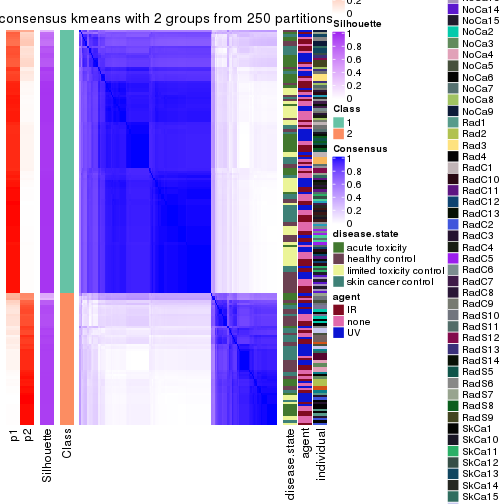</p>

</div>
<div id='tab-CV-kmeans-consensus-heatmap-2'>
<pre><code class="r">consensus_heatmap(res, k = 3)
</code></pre>

<p>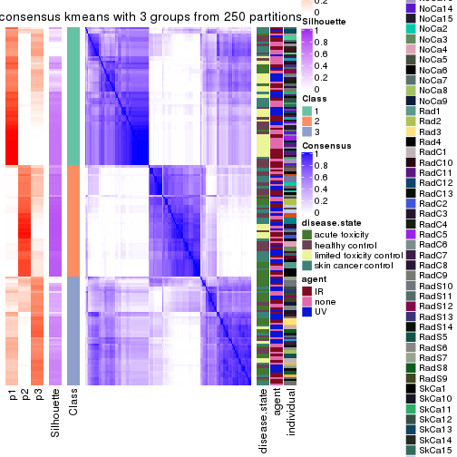</p>

</div>
<div id='tab-CV-kmeans-consensus-heatmap-3'>
<pre><code class="r">consensus_heatmap(res, k = 4)
</code></pre>

<p>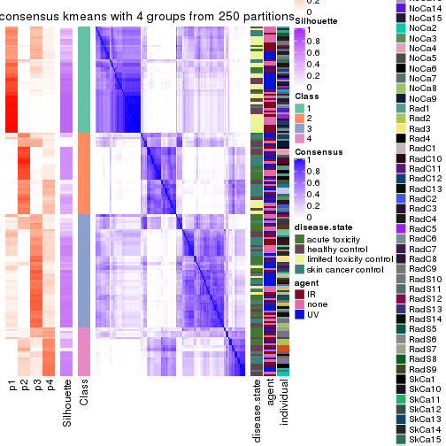</p>

</div>
<div id='tab-CV-kmeans-consensus-heatmap-4'>
<pre><code class="r">consensus_heatmap(res, k = 5)
</code></pre>

<p></p>

</div>
<div id='tab-CV-kmeans-consensus-heatmap-5'>
<pre><code class="r">consensus_heatmap(res, k = 6)
</code></pre>

<p>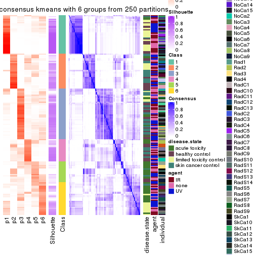</p>

</div>
</div>

Heatmaps for the membership of samples in all partitions to see how consistent they are:


<script>
$( function() {
	$( '#tabs-CV-kmeans-membership-heatmap' ).tabs();
} );
</script>
<div id='tabs-CV-kmeans-membership-heatmap'>
<ul>
<li><a href='#tab-CV-kmeans-membership-heatmap-1'>k = 2</a></li>
<li><a href='#tab-CV-kmeans-membership-heatmap-2'>k = 3</a></li>
<li><a href='#tab-CV-kmeans-membership-heatmap-3'>k = 4</a></li>
<li><a href='#tab-CV-kmeans-membership-heatmap-4'>k = 5</a></li>
<li><a href='#tab-CV-kmeans-membership-heatmap-5'>k = 6</a></li>
</ul>
<div id='tab-CV-kmeans-membership-heatmap-1'>
<pre><code class="r">membership_heatmap(res, k = 2)
</code></pre>

<p>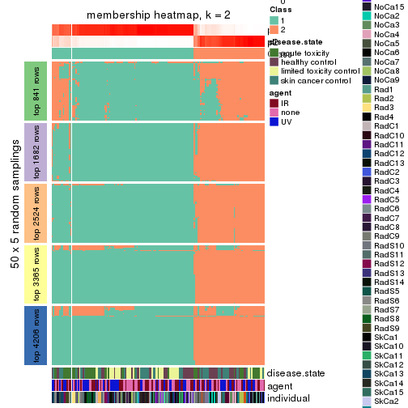</p>

</div>
<div id='tab-CV-kmeans-membership-heatmap-2'>
<pre><code class="r">membership_heatmap(res, k = 3)
</code></pre>

<p>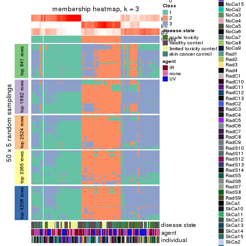</p>

</div>
<div id='tab-CV-kmeans-membership-heatmap-3'>
<pre><code class="r">membership_heatmap(res, k = 4)
</code></pre>

<p>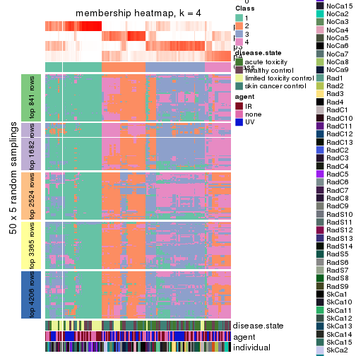</p>

</div>
<div id='tab-CV-kmeans-membership-heatmap-4'>
<pre><code class="r">membership_heatmap(res, k = 5)
</code></pre>

<p>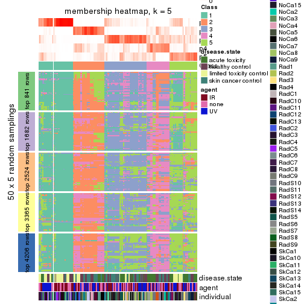</p>

</div>
<div id='tab-CV-kmeans-membership-heatmap-5'>
<pre><code class="r">membership_heatmap(res, k = 6)
</code></pre>

<p>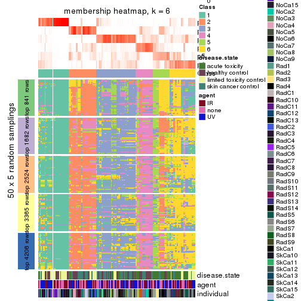</p>

</div>
</div>

As soon as we have had the classes for columns, we can look for signatures
which are significantly different between classes which can be candidate marks
for certain classes. Following are the heatmaps for signatures.


Signature heatmaps where rows are scaled:


<script>
$( function() {
	$( '#tabs-CV-kmeans-get-signatures' ).tabs();
} );
</script>
<div id='tabs-CV-kmeans-get-signatures'>
<ul>
<li><a href='#tab-CV-kmeans-get-signatures-1'>k = 2</a></li>
<li><a href='#tab-CV-kmeans-get-signatures-2'>k = 3</a></li>
<li><a href='#tab-CV-kmeans-get-signatures-3'>k = 4</a></li>
<li><a href='#tab-CV-kmeans-get-signatures-4'>k = 5</a></li>
<li><a href='#tab-CV-kmeans-get-signatures-5'>k = 6</a></li>
</ul>
<div id='tab-CV-kmeans-get-signatures-1'>
<pre><code class="r">get_signatures(res, k = 2)
</code></pre>

<p>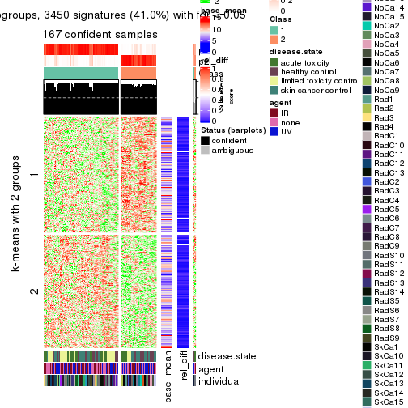</p>

</div>
<div id='tab-CV-kmeans-get-signatures-2'>
<pre><code class="r">get_signatures(res, k = 3)
</code></pre>

<p>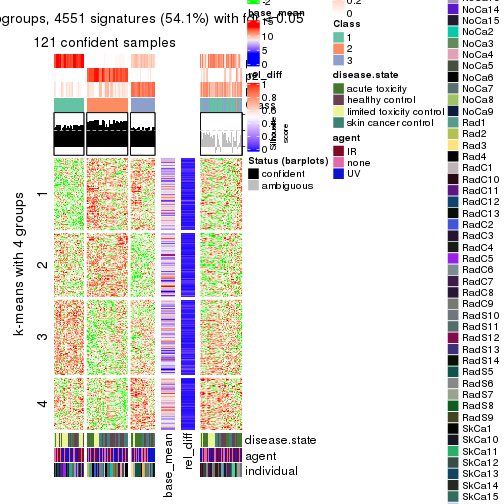</p>

</div>
<div id='tab-CV-kmeans-get-signatures-3'>
<pre><code class="r">get_signatures(res, k = 4)
</code></pre>

<p>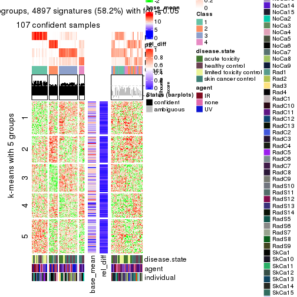</p>

</div>
<div id='tab-CV-kmeans-get-signatures-4'>
<pre><code class="r">get_signatures(res, k = 5)
</code></pre>

<p>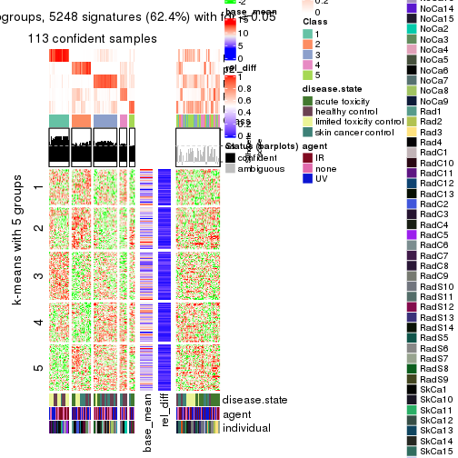</p>

</div>
<div id='tab-CV-kmeans-get-signatures-5'>
<pre><code class="r">get_signatures(res, k = 6)
</code></pre>

<p>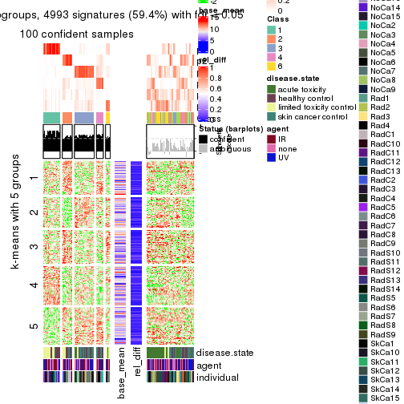</p>

</div>
</div>


Signature heatmaps where rows are not scaled:


<script>
$( function() {
	$( '#tabs-CV-kmeans-get-signatures-no-scale' ).tabs();
} );
</script>
<div id='tabs-CV-kmeans-get-signatures-no-scale'>
<ul>
<li><a href='#tab-CV-kmeans-get-signatures-no-scale-1'>k = 2</a></li>
<li><a href='#tab-CV-kmeans-get-signatures-no-scale-2'>k = 3</a></li>
<li><a href='#tab-CV-kmeans-get-signatures-no-scale-3'>k = 4</a></li>
<li><a href='#tab-CV-kmeans-get-signatures-no-scale-4'>k = 5</a></li>
<li><a href='#tab-CV-kmeans-get-signatures-no-scale-5'>k = 6</a></li>
</ul>
<div id='tab-CV-kmeans-get-signatures-no-scale-1'>
<pre><code class="r">get_signatures(res, k = 2, scale_rows = FALSE)
</code></pre>

<p>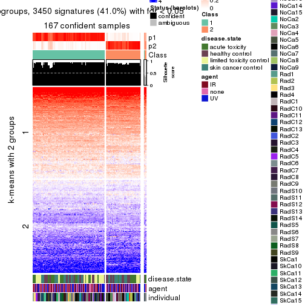</p>

</div>
<div id='tab-CV-kmeans-get-signatures-no-scale-2'>
<pre><code class="r">get_signatures(res, k = 3, scale_rows = FALSE)
</code></pre>

<p>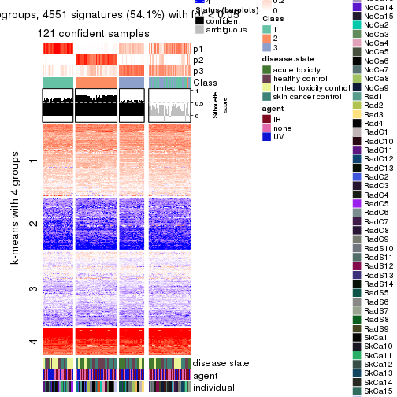</p>

</div>
<div id='tab-CV-kmeans-get-signatures-no-scale-3'>
<pre><code class="r">get_signatures(res, k = 4, scale_rows = FALSE)
</code></pre>

<p>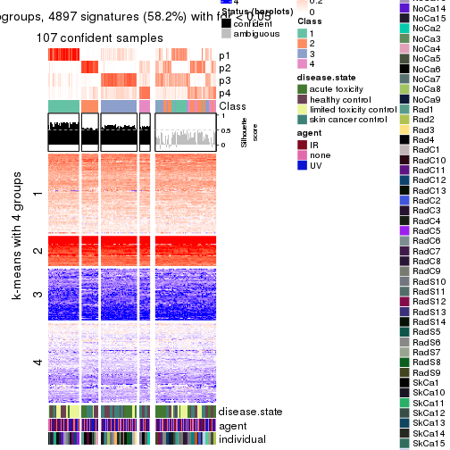</p>

</div>
<div id='tab-CV-kmeans-get-signatures-no-scale-4'>
<pre><code class="r">get_signatures(res, k = 5, scale_rows = FALSE)
</code></pre>

<p>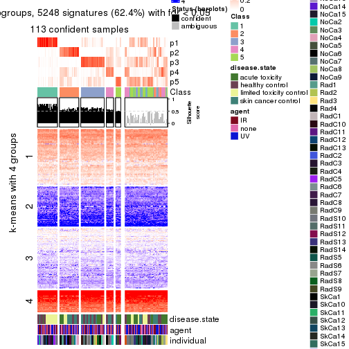</p>

</div>
<div id='tab-CV-kmeans-get-signatures-no-scale-5'>
<pre><code class="r">get_signatures(res, k = 6, scale_rows = FALSE)
</code></pre>

<p>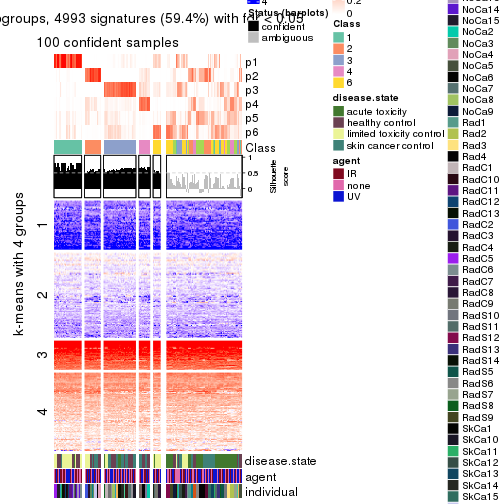</p>

</div>
</div>


Compare the overlap of signatures from different k:

```r
compare_signatures(res)
```

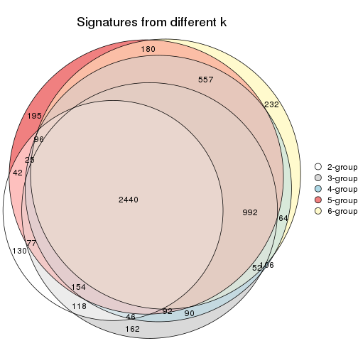

`get_signature()` returns a data frame invisibly. TO get the list of signatures, the function
call should be assigned to a variable explicitly. In following code, if `plot` argument is set
to `FALSE`, no heatmap is plotted while only the differential analysis is performed.

```r
# code only for demonstration
tb = get_signature(res, k = ..., plot = FALSE)
```

An example of the output of `tb` is:

```
#>   which_row         fdr    mean_1    mean_2 scaled_mean_1 scaled_mean_2 km
#> 1        38 0.042760348  8.373488  9.131774    -0.5533452     0.5164555  1
#> 2        40 0.018707592  7.106213  8.469186    -0.6173731     0.5762149  1
#> 3        55 0.019134737 10.221463 11.207825    -0.6159697     0.5749050  1
#> 4        59 0.006059896  5.921854  7.869574    -0.6899429     0.6439467  1
#> 5        60 0.018055526  8.928898 10.211722    -0.6204761     0.5791110  1
#> 6        98 0.009384629 15.714769 14.887706     0.6635654    -0.6193277  2
...
```

The columns in `tb` are:

1. `which_row`: row indices corresponding to the input matrix.
2. `fdr`: FDR for the differential test. 
3. `mean_x`: The mean value in group x.
4. `scaled_mean_x`: The mean value in group x after rows are scaled.
5. `km`: Row groups if k-means clustering is applied to rows.


UMAP plot which shows how samples are separated.


<script>
$( function() {
	$( '#tabs-CV-kmeans-dimension-reduction' ).tabs();
} );
</script>
<div id='tabs-CV-kmeans-dimension-reduction'>
<ul>
<li><a href='#tab-CV-kmeans-dimension-reduction-1'>k = 2</a></li>
<li><a href='#tab-CV-kmeans-dimension-reduction-2'>k = 3</a></li>
<li><a href='#tab-CV-kmeans-dimension-reduction-3'>k = 4</a></li>
<li><a href='#tab-CV-kmeans-dimension-reduction-4'>k = 5</a></li>
<li><a href='#tab-CV-kmeans-dimension-reduction-5'>k = 6</a></li>
</ul>
<div id='tab-CV-kmeans-dimension-reduction-1'>
<pre><code class="r">dimension_reduction(res, k = 2, method = &quot;UMAP&quot;)
</code></pre>

<p>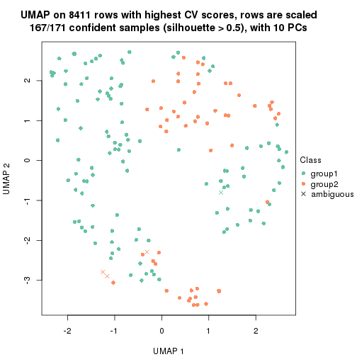</p>

</div>
<div id='tab-CV-kmeans-dimension-reduction-2'>
<pre><code class="r">dimension_reduction(res, k = 3, method = &quot;UMAP&quot;)
</code></pre>

<p>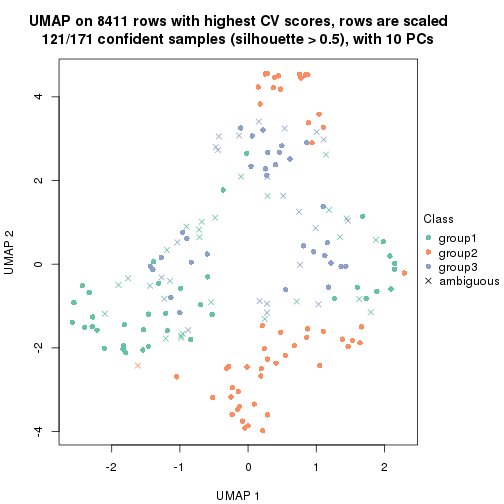</p>

</div>
<div id='tab-CV-kmeans-dimension-reduction-3'>
<pre><code class="r">dimension_reduction(res, k = 4, method = &quot;UMAP&quot;)
</code></pre>

<p>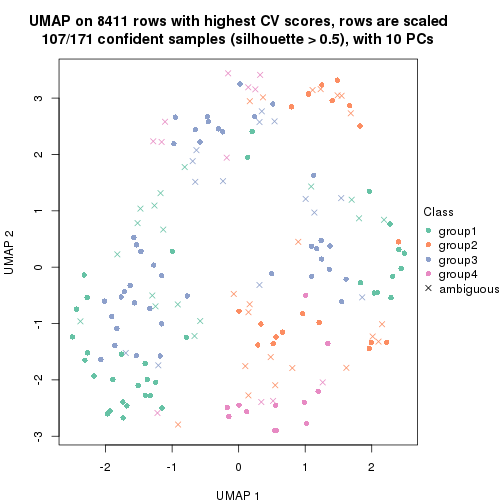</p>

</div>
<div id='tab-CV-kmeans-dimension-reduction-4'>
<pre><code class="r">dimension_reduction(res, k = 5, method = &quot;UMAP&quot;)
</code></pre>

<p>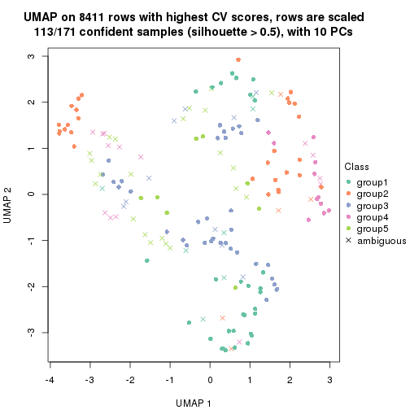</p>

</div>
<div id='tab-CV-kmeans-dimension-reduction-5'>
<pre><code class="r">dimension_reduction(res, k = 6, method = &quot;UMAP&quot;)
</code></pre>

<p>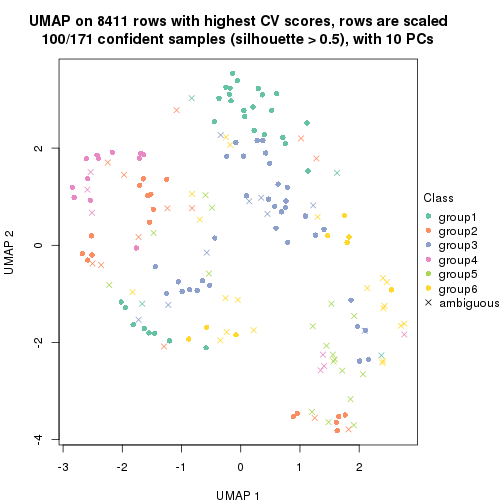</p>

</div>
</div>


Following heatmap shows how subgroups are split when increasing `k`:

```r
collect_classes(res)
```

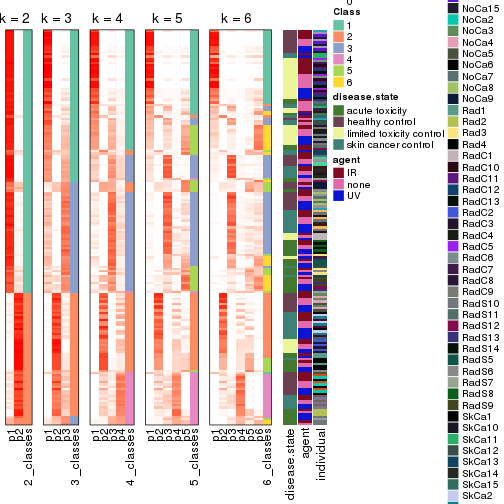


Test correlation between subgroups and known annotations. If the known
annotation is numeric, one-way ANOVA test is applied, and if the known
annotation is discrete, chi-squared contingency table test is applied.

```r
test_to_known_factors(res)
```

```
#>             n disease.state(p) agent(p) individual(p) k
#> CV:kmeans 167         3.05e-02    0.738      4.43e-12 2
#> CV:kmeans 121         2.55e-05    0.570      7.15e-14 3
#> CV:kmeans 107         1.06e-06    0.947      1.23e-18 4
#> CV:kmeans 113         1.08e-08    0.992      2.10e-27 5
#> CV:kmeans 100         7.19e-06    0.998      1.09e-22 6
```


If matrix rows can be associated to genes, consider to use `functional_enrichment(res,
...)` to perform function enrichment for the signature genes. See [this vignette](http://bioconductor.org/packages/devel/bioc/vignettes/cola/inst/doc/functional_enrichment.html) for more detailed explanations.


 

---------------------------------------------------


### CV:skmeans


The object with results only for a single top-value method and a single partition method 
can be extracted as:

```r
res = res_list["CV", "skmeans"]
# you can also extract it by
# res = res_list["CV:skmeans"]
```

A summary of `res` and all the functions that can be applied to it:

```r
res
```

```
#> A 'ConsensusPartition' object with k = 2, 3, 4, 5, 6.
#>   On a matrix with 8411 rows and 171 columns.
#>   Top rows (841, 1682, 2524, 3365, 4206) are extracted by 'CV' method.
#>   Subgroups are detected by 'skmeans' method.
#>   Performed in total 1250 partitions by row resampling.
#>   Best k for subgroups seems to be 2.
#> 
#> Following methods can be applied to this 'ConsensusPartition' object:
#>  [1] "cola_report"             "collect_classes"         "collect_plots"          
#>  [4] "collect_stats"           "colnames"                "compare_signatures"     
#>  [7] "consensus_heatmap"       "dimension_reduction"     "functional_enrichment"  
#> [10] "get_anno_col"            "get_anno"                "get_classes"            
#> [13] "get_consensus"           "get_matrix"              "get_membership"         
#> [16] "get_param"               "get_signatures"          "get_stats"              
#> [19] "is_best_k"               "is_stable_k"             "membership_heatmap"     
#> [22] "ncol"                    "nrow"                    "plot_ecdf"              
#> [25] "rownames"                "select_partition_number" "show"                   
#> [28] "suggest_best_k"          "test_to_known_factors"
```

`collect_plots()` function collects all the plots made from `res` for all `k` (number of partitions)
into one single page to provide an easy and fast comparison between different `k`.

```r
collect_plots(res)
```

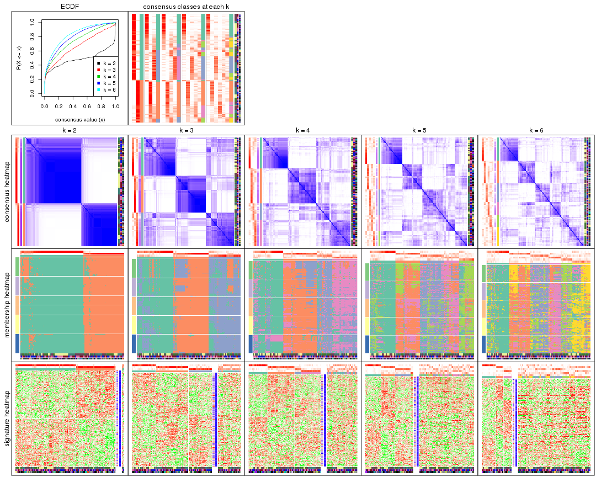

The plots are:

- The first row: a plot of the ECDF (empirical cumulative distribution
  function) curves of the consensus matrix for each `k` and the heatmap of
  predicted classes for each `k`.
- The second row: heatmaps of the consensus matrix for each `k`.
- The third row: heatmaps of the membership matrix for each `k`.
- The fouth row: heatmaps of the signatures for each `k`.

All the plots in panels can be made by individual functions and they are
plotted later in this section.

`select_partition_number()` produces several plots showing different
statistics for choosing "optimized" `k`. There are following statistics:

- ECDF curves of the consensus matrix for each `k`;
- 1-PAC. [The PAC
  score](https://en.wikipedia.org/wiki/Consensus_clustering#Over-interpretation_potential_of_consensus_clustering)
  measures the proportion of the ambiguous subgrouping.
- Mean silhouette score.
- Concordance. The mean probability of fiting the consensus class ids in all
  partitions.
- Area increased. Denote $A_k$ as the area under the ECDF curve for current
  `k`, the area increased is defined as $A_k - A_{k-1}$.
- Rand index. The percent of pairs of samples that are both in a same cluster
  or both are not in a same cluster in the partition of k and k-1.
- Jaccard index. The ratio of pairs of samples are both in a same cluster in
  the partition of k and k-1 and the pairs of samples are both in a same
  cluster in the partition k or k-1.

The detailed explanations of these statistics can be found in [the _cola_
vignette](http://bioconductor.org/packages/devel/bioc/vignettes/cola/inst/doc/cola.html#toc_13).

Generally speaking, lower PAC score, higher mean silhouette score or higher
concordance corresponds to better partition. Rand index and Jaccard index
measure how similar the current partition is compared to partition with `k-1`.
If they are too similar, we won't accept `k` is better than `k-1`.

```r
select_partition_number(res)
```

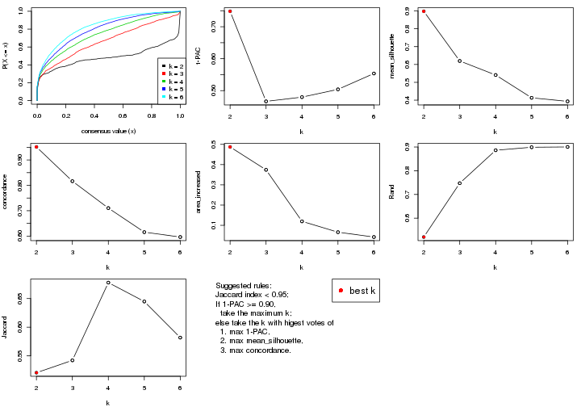

The numeric values for all these statistics can be obtained by `get_stats()`.

```r
get_stats(res)
```

```
#>   k 1-PAC mean_silhouette concordance area_increased  Rand Jaccard
#> 2 2 0.748           0.898       0.951         0.4873 0.521   0.521
#> 3 3 0.466           0.620       0.816         0.3742 0.747   0.542
#> 4 4 0.480           0.541       0.710         0.1195 0.886   0.678
#> 5 5 0.504           0.413       0.616         0.0661 0.899   0.645
#> 6 6 0.554           0.393       0.596         0.0421 0.900   0.582
```

`suggest_best_k()` suggests the best $k$ based on these statistics. The rules are as follows:

- All $k$ with Jaccard index larger than 0.95 are removed because increasing
  $k$ does not provide enough extra information. If all $k$ are removed, it is
  marked as no subgroup is detected.
- For all $k$ with 1-PAC score larger than 0.9, the maximal $k$ is taken as
  the best $k$, and other $k$ are marked as optional $k$.
- If it does not fit the second rule. The $k$ with the maximal vote of the
  highest 1-PAC score, highest mean silhouette, and highest concordance is
  taken as the best $k$.

```r
suggest_best_k(res)
```

```
#> [1] 2
```


Following shows the table of the partitions (You need to click the **show/hide
code output** link to see it). The membership matrix (columns with name `p*`)
is inferred by
[`clue::cl_consensus()`](https://www.rdocumentation.org/link/cl_consensus?package=clue)
function with the `SE` method. Basically the value in the membership matrix
represents the probability to belong to a certain group. The finall class
label for an item is determined with the group with highest probability it
belongs to.

In `get_classes()` function, the entropy is calculated from the membership
matrix and the silhouette score is calculated from the consensus matrix.


<script>
$( function() {
	$( '#tabs-CV-skmeans-get-classes' ).tabs();
} );
</script>
<div id='tabs-CV-skmeans-get-classes'>
<ul>
<li><a href='#tab-CV-skmeans-get-classes-1'>k = 2</a></li>
<li><a href='#tab-CV-skmeans-get-classes-2'>k = 3</a></li>
<li><a href='#tab-CV-skmeans-get-classes-3'>k = 4</a></li>
<li><a href='#tab-CV-skmeans-get-classes-4'>k = 5</a></li>
<li><a href='#tab-CV-skmeans-get-classes-5'>k = 6</a></li>
</ul>

<div id='tab-CV-skmeans-get-classes-1'>
<p><a id='tab-CV-skmeans-get-classes-1-a' style='color:#0366d6' href='#'>show/hide code output</a></p>
<pre><code class="r">cbind(get_classes(res, k = 2), get_membership(res, k = 2))
</code></pre>

<pre><code>#&gt;          class entropy silhouette    p1    p2
#&gt; GSM29783     2  0.0376      0.961 0.004 0.996
#&gt; GSM29786     2  0.3584      0.915 0.068 0.932
#&gt; GSM29789     2  0.0376      0.961 0.004 0.996
#&gt; GSM29792     2  0.0376      0.961 0.004 0.996
#&gt; GSM29795     2  0.4298      0.899 0.088 0.912
#&gt; GSM29798     2  0.5408      0.858 0.124 0.876
#&gt; GSM29801     1  0.0000      0.940 1.000 0.000
#&gt; GSM29804     1  0.0376      0.939 0.996 0.004
#&gt; GSM29807     2  0.8763      0.557 0.296 0.704
#&gt; GSM29816     1  0.0000      0.940 1.000 0.000
#&gt; GSM29821     1  0.0000      0.940 1.000 0.000
#&gt; GSM29824     1  0.0000      0.940 1.000 0.000
#&gt; GSM29827     1  0.0000      0.940 1.000 0.000
#&gt; GSM29830     1  0.0000      0.940 1.000 0.000
#&gt; GSM29833     1  0.0376      0.939 0.996 0.004
#&gt; GSM29784     2  0.0000      0.962 0.000 1.000
#&gt; GSM29787     2  0.2948      0.929 0.052 0.948
#&gt; GSM29790     2  0.0000      0.962 0.000 1.000
#&gt; GSM29793     2  0.0000      0.962 0.000 1.000
#&gt; GSM29796     2  0.0672      0.960 0.008 0.992
#&gt; GSM29799     2  0.5059      0.871 0.112 0.888
#&gt; GSM29802     1  0.0376      0.939 0.996 0.004
#&gt; GSM29805     1  0.0376      0.939 0.996 0.004
#&gt; GSM29814     2  0.9552      0.351 0.376 0.624
#&gt; GSM29817     1  0.0000      0.940 1.000 0.000
#&gt; GSM29822     1  0.0000      0.940 1.000 0.000
#&gt; GSM29825     1  0.0000      0.940 1.000 0.000
#&gt; GSM29828     1  0.0000      0.940 1.000 0.000
#&gt; GSM29831     1  0.0000      0.940 1.000 0.000
#&gt; GSM29834     1  0.0000      0.940 1.000 0.000
#&gt; GSM29785     2  0.0000      0.962 0.000 1.000
#&gt; GSM29788     2  0.1184      0.955 0.016 0.984
#&gt; GSM29791     2  0.0376      0.961 0.004 0.996
#&gt; GSM29794     2  0.0376      0.961 0.004 0.996
#&gt; GSM29797     2  0.0376      0.961 0.004 0.996
#&gt; GSM29800     2  0.1184      0.955 0.016 0.984
#&gt; GSM29803     1  0.4298      0.881 0.912 0.088
#&gt; GSM29806     1  0.6712      0.805 0.824 0.176
#&gt; GSM29815     2  0.1843      0.945 0.028 0.972
#&gt; GSM29819     1  0.1184      0.933 0.984 0.016
#&gt; GSM29823     1  0.6247      0.814 0.844 0.156
#&gt; GSM29826     1  0.0376      0.939 0.996 0.004
#&gt; GSM29829     1  0.0000      0.940 1.000 0.000
#&gt; GSM29832     1  0.0000      0.940 1.000 0.000
#&gt; GSM29835     1  0.7883      0.700 0.764 0.236
#&gt; GSM29836     2  0.0000      0.962 0.000 1.000
#&gt; GSM29839     2  0.0938      0.959 0.012 0.988
#&gt; GSM29842     2  0.0000      0.962 0.000 1.000
#&gt; GSM29845     2  0.0376      0.961 0.004 0.996
#&gt; GSM29848     2  0.0938      0.957 0.012 0.988
#&gt; GSM29851     1  0.0000      0.940 1.000 0.000
#&gt; GSM29854     1  0.0376      0.939 0.996 0.004
#&gt; GSM29857     1  0.0938      0.936 0.988 0.012
#&gt; GSM29860     2  0.0376      0.961 0.004 0.996
#&gt; GSM29863     1  0.0000      0.940 1.000 0.000
#&gt; GSM29866     1  0.0000      0.940 1.000 0.000
#&gt; GSM29869     1  0.1843      0.926 0.972 0.028
#&gt; GSM29872     1  0.9044      0.587 0.680 0.320
#&gt; GSM29875     1  0.0000      0.940 1.000 0.000
#&gt; GSM29878     2  0.4815      0.880 0.104 0.896
#&gt; GSM29837     2  0.0000      0.962 0.000 1.000
#&gt; GSM29840     2  0.0376      0.961 0.004 0.996
#&gt; GSM29843     2  0.0000      0.962 0.000 1.000
#&gt; GSM29846     2  0.0000      0.962 0.000 1.000
#&gt; GSM29849     2  0.1633      0.950 0.024 0.976
#&gt; GSM29852     1  0.0000      0.940 1.000 0.000
#&gt; GSM29855     1  0.1414      0.932 0.980 0.020
#&gt; GSM29858     1  0.0376      0.939 0.996 0.004
#&gt; GSM29861     2  0.0376      0.961 0.004 0.996
#&gt; GSM29864     1  0.0000      0.940 1.000 0.000
#&gt; GSM29867     1  0.0000      0.940 1.000 0.000
#&gt; GSM29870     1  0.0000      0.940 1.000 0.000
#&gt; GSM29873     1  0.9087      0.579 0.676 0.324
#&gt; GSM29876     1  0.0000      0.940 1.000 0.000
#&gt; GSM29879     1  0.9983      0.137 0.524 0.476
#&gt; GSM29838     2  0.0000      0.962 0.000 1.000
#&gt; GSM29841     2  0.0376      0.961 0.004 0.996
#&gt; GSM29844     2  0.0376      0.961 0.004 0.996
#&gt; GSM29847     2  0.0000      0.962 0.000 1.000
#&gt; GSM29850     2  0.0938      0.959 0.012 0.988
#&gt; GSM29853     1  0.0000      0.940 1.000 0.000
#&gt; GSM29856     1  0.8207      0.679 0.744 0.256
#&gt; GSM29859     1  0.9833      0.351 0.576 0.424
#&gt; GSM29862     2  0.0376      0.961 0.004 0.996
#&gt; GSM29865     1  0.9896      0.239 0.560 0.440
#&gt; GSM29868     1  0.0938      0.934 0.988 0.012
#&gt; GSM29871     1  0.8327      0.685 0.736 0.264
#&gt; GSM29874     2  0.0376      0.961 0.004 0.996
#&gt; GSM29877     1  0.0000      0.940 1.000 0.000
#&gt; GSM29880     2  0.0376      0.961 0.004 0.996
#&gt; GSM29881     1  0.0672      0.938 0.992 0.008
#&gt; GSM29884     2  0.0000      0.962 0.000 1.000
#&gt; GSM29887     2  0.0000      0.962 0.000 1.000
#&gt; GSM29890     1  0.0000      0.940 1.000 0.000
#&gt; GSM29893     1  0.0000      0.940 1.000 0.000
#&gt; GSM29896     1  0.0000      0.940 1.000 0.000
#&gt; GSM29899     1  0.0000      0.940 1.000 0.000
#&gt; GSM29902     1  0.0376      0.939 0.996 0.004
#&gt; GSM29905     1  0.0000      0.940 1.000 0.000
#&gt; GSM29908     1  0.0000      0.940 1.000 0.000
#&gt; GSM29955     1  0.0000      0.940 1.000 0.000
#&gt; GSM29958     1  0.0000      0.940 1.000 0.000
#&gt; GSM29961     1  0.0000      0.940 1.000 0.000
#&gt; GSM29882     1  0.0376      0.939 0.996 0.004
#&gt; GSM29885     2  0.0000      0.962 0.000 1.000
#&gt; GSM29888     2  0.0000      0.962 0.000 1.000
#&gt; GSM29891     1  0.0000      0.940 1.000 0.000
#&gt; GSM29894     1  0.0000      0.940 1.000 0.000
#&gt; GSM29897     1  0.0000      0.940 1.000 0.000
#&gt; GSM29900     1  0.0000      0.940 1.000 0.000
#&gt; GSM29903     1  0.0000      0.940 1.000 0.000
#&gt; GSM29906     1  0.0000      0.940 1.000 0.000
#&gt; GSM29909     1  0.1184      0.933 0.984 0.016
#&gt; GSM29956     1  0.0000      0.940 1.000 0.000
#&gt; GSM29959     1  0.0000      0.940 1.000 0.000
#&gt; GSM29962     1  0.0000      0.940 1.000 0.000
#&gt; GSM29883     1  0.0376      0.939 0.996 0.004
#&gt; GSM29886     2  0.0000      0.962 0.000 1.000
#&gt; GSM29889     2  0.0000      0.962 0.000 1.000
#&gt; GSM29892     1  0.0000      0.940 1.000 0.000
#&gt; GSM29895     1  0.7299      0.765 0.796 0.204
#&gt; GSM29898     1  0.0000      0.940 1.000 0.000
#&gt; GSM29901     1  0.0000      0.940 1.000 0.000
#&gt; GSM29904     1  0.0376      0.939 0.996 0.004
#&gt; GSM29907     1  0.0000      0.940 1.000 0.000
#&gt; GSM29910     1  0.2603      0.916 0.956 0.044
#&gt; GSM29957     2  0.8327      0.633 0.264 0.736
#&gt; GSM29960     1  0.0376      0.939 0.996 0.004
#&gt; GSM29963     1  0.3879      0.895 0.924 0.076
#&gt; GSM29964     2  0.0000      0.962 0.000 1.000
#&gt; GSM29967     2  0.0000      0.962 0.000 1.000
#&gt; GSM29970     1  0.5737      0.844 0.864 0.136
#&gt; GSM29973     2  0.0000      0.962 0.000 1.000
#&gt; GSM29976     1  0.0376      0.939 0.996 0.004
#&gt; GSM29979     2  0.0000      0.962 0.000 1.000
#&gt; GSM29982     2  0.1184      0.957 0.016 0.984
#&gt; GSM29985     1  0.0376      0.939 0.996 0.004
#&gt; GSM29988     1  0.8661      0.649 0.712 0.288
#&gt; GSM29991     2  0.7139      0.767 0.196 0.804
#&gt; GSM29994     1  0.0000      0.940 1.000 0.000
#&gt; GSM29997     1  0.1843      0.925 0.972 0.028
#&gt; GSM30000     1  0.6048      0.830 0.852 0.148
#&gt; GSM30003     1  0.0376      0.939 0.996 0.004
#&gt; GSM29965     2  0.0000      0.962 0.000 1.000
#&gt; GSM29968     2  0.0000      0.962 0.000 1.000
#&gt; GSM29971     1  0.5519      0.851 0.872 0.128
#&gt; GSM29974     2  0.0000      0.962 0.000 1.000
#&gt; GSM29977     1  0.0376      0.939 0.996 0.004
#&gt; GSM29980     2  0.0672      0.959 0.008 0.992
#&gt; GSM29983     1  0.8016      0.711 0.756 0.244
#&gt; GSM29986     1  0.0376      0.939 0.996 0.004
#&gt; GSM29989     1  0.7674      0.744 0.776 0.224
#&gt; GSM29992     2  0.7528      0.739 0.216 0.784
#&gt; GSM29995     1  0.0000      0.940 1.000 0.000
#&gt; GSM29998     1  0.2236      0.920 0.964 0.036
#&gt; GSM30001     1  0.6048      0.832 0.852 0.148
#&gt; GSM30004     1  0.0376      0.939 0.996 0.004
#&gt; GSM29966     2  0.0000      0.962 0.000 1.000
#&gt; GSM29969     2  0.0000      0.962 0.000 1.000
#&gt; GSM29972     1  0.8443      0.683 0.728 0.272
#&gt; GSM29975     2  0.0000      0.962 0.000 1.000
#&gt; GSM29978     1  0.0376      0.939 0.996 0.004
#&gt; GSM29981     2  0.0000      0.962 0.000 1.000
#&gt; GSM29984     2  0.1633      0.950 0.024 0.976
#&gt; GSM29987     1  0.4815      0.866 0.896 0.104
#&gt; GSM29990     1  0.8555      0.662 0.720 0.280
#&gt; GSM29993     2  0.4298      0.897 0.088 0.912
#&gt; GSM29996     1  0.0000      0.940 1.000 0.000
#&gt; GSM29999     1  0.8207      0.699 0.744 0.256
#&gt; GSM30002     2  0.4939      0.866 0.108 0.892
#&gt; GSM30005     1  0.2423      0.918 0.960 0.040
</code></pre>

<script>
$('#tab-CV-skmeans-get-classes-1-a').parent().next().next().hide();
$('#tab-CV-skmeans-get-classes-1-a').click(function(){
  $('#tab-CV-skmeans-get-classes-1-a').parent().next().next().toggle();
  return(false);
});
</script>
</div>

<div id='tab-CV-skmeans-get-classes-2'>
<p><a id='tab-CV-skmeans-get-classes-2-a' style='color:#0366d6' href='#'>show/hide code output</a></p>
<pre><code class="r">cbind(get_classes(res, k = 3), get_membership(res, k = 3))
</code></pre>

<pre><code>#&gt;          class entropy silhouette    p1    p2    p3
#&gt; GSM29783     2  0.2280    0.83523 0.008 0.940 0.052
#&gt; GSM29786     2  0.5465    0.69869 0.000 0.712 0.288
#&gt; GSM29789     2  0.0424    0.84396 0.008 0.992 0.000
#&gt; GSM29792     2  0.0424    0.84396 0.008 0.992 0.000
#&gt; GSM29795     2  0.8263    0.55447 0.268 0.612 0.120
#&gt; GSM29798     2  0.5465    0.69869 0.000 0.712 0.288
#&gt; GSM29801     1  0.6126    0.24752 0.600 0.000 0.400
#&gt; GSM29804     3  0.4654    0.62048 0.208 0.000 0.792
#&gt; GSM29807     3  0.6102    0.55544 0.008 0.320 0.672
#&gt; GSM29816     3  0.5291    0.57869 0.268 0.000 0.732
#&gt; GSM29821     1  0.6154    0.24094 0.592 0.000 0.408
#&gt; GSM29824     1  0.2356    0.73442 0.928 0.000 0.072
#&gt; GSM29827     1  0.0000    0.74289 1.000 0.000 0.000
#&gt; GSM29830     1  0.0237    0.74316 0.996 0.000 0.004
#&gt; GSM29833     1  0.0237    0.74316 0.996 0.000 0.004
#&gt; GSM29784     2  0.0237    0.84641 0.000 0.996 0.004
#&gt; GSM29787     2  0.5465    0.69869 0.000 0.712 0.288
#&gt; GSM29790     2  0.0237    0.84641 0.000 0.996 0.004
#&gt; GSM29793     2  0.0000    0.84570 0.000 1.000 0.000
#&gt; GSM29796     2  0.4209    0.80149 0.016 0.856 0.128
#&gt; GSM29799     2  0.5650    0.67150 0.000 0.688 0.312
#&gt; GSM29802     3  0.2959    0.69848 0.100 0.000 0.900
#&gt; GSM29805     3  0.5070    0.62293 0.224 0.004 0.772
#&gt; GSM29814     3  0.6416    0.56612 0.020 0.304 0.676
#&gt; GSM29817     3  0.6305    0.06019 0.484 0.000 0.516
#&gt; GSM29822     3  0.5988    0.33054 0.368 0.000 0.632
#&gt; GSM29825     1  0.5810    0.40652 0.664 0.000 0.336
#&gt; GSM29828     1  0.0237    0.74293 0.996 0.000 0.004
#&gt; GSM29831     1  0.0237    0.74316 0.996 0.000 0.004
#&gt; GSM29834     1  0.0237    0.74316 0.996 0.000 0.004
#&gt; GSM29785     2  0.0237    0.84641 0.000 0.996 0.004
#&gt; GSM29788     2  0.5327    0.71336 0.000 0.728 0.272
#&gt; GSM29791     2  0.0829    0.84316 0.012 0.984 0.004
#&gt; GSM29794     2  0.0592    0.84239 0.012 0.988 0.000
#&gt; GSM29797     2  0.3425    0.81240 0.004 0.884 0.112
#&gt; GSM29800     2  0.5465    0.69869 0.000 0.712 0.288
#&gt; GSM29803     3  0.0237    0.70572 0.004 0.000 0.996
#&gt; GSM29806     3  0.4047    0.67314 0.004 0.148 0.848
#&gt; GSM29815     3  0.6033    0.54146 0.004 0.336 0.660
#&gt; GSM29819     3  0.1529    0.71318 0.040 0.000 0.960
#&gt; GSM29823     1  0.6735    0.22233 0.564 0.012 0.424
#&gt; GSM29826     3  0.3755    0.69187 0.120 0.008 0.872
#&gt; GSM29829     1  0.1753    0.73369 0.952 0.000 0.048
#&gt; GSM29832     1  0.0747    0.74059 0.984 0.000 0.016
#&gt; GSM29835     1  0.2200    0.72950 0.940 0.004 0.056
#&gt; GSM29836     2  0.0000    0.84570 0.000 1.000 0.000
#&gt; GSM29839     2  0.3459    0.82320 0.012 0.892 0.096
#&gt; GSM29842     2  0.0424    0.84597 0.000 0.992 0.008
#&gt; GSM29845     2  0.5560    0.68510 0.000 0.700 0.300
#&gt; GSM29848     2  0.5497    0.69442 0.000 0.708 0.292
#&gt; GSM29851     3  0.6305    0.08281 0.484 0.000 0.516
#&gt; GSM29854     3  0.1964    0.71457 0.056 0.000 0.944
#&gt; GSM29857     3  0.3375    0.70378 0.100 0.008 0.892
#&gt; GSM29860     2  0.1015    0.83949 0.012 0.980 0.008
#&gt; GSM29863     3  0.6204    0.16171 0.424 0.000 0.576
#&gt; GSM29866     1  0.0237    0.74293 0.996 0.000 0.004
#&gt; GSM29869     1  0.4966    0.67902 0.840 0.060 0.100
#&gt; GSM29872     1  0.8737    0.40946 0.588 0.232 0.180
#&gt; GSM29875     1  0.6286    0.05784 0.536 0.000 0.464
#&gt; GSM29878     1  0.5244    0.56749 0.756 0.240 0.004
#&gt; GSM29837     2  0.0000    0.84570 0.000 1.000 0.000
#&gt; GSM29840     2  0.2492    0.83757 0.016 0.936 0.048
#&gt; GSM29843     2  0.0237    0.84641 0.000 0.996 0.004
#&gt; GSM29846     2  0.5591    0.67984 0.000 0.696 0.304
#&gt; GSM29849     2  0.5529    0.69018 0.000 0.704 0.296
#&gt; GSM29852     3  0.6154    0.27533 0.408 0.000 0.592
#&gt; GSM29855     3  0.1878    0.70752 0.044 0.004 0.952
#&gt; GSM29858     3  0.3038    0.70240 0.104 0.000 0.896
#&gt; GSM29861     2  0.1170    0.83749 0.016 0.976 0.008
#&gt; GSM29864     3  0.6299    0.04073 0.476 0.000 0.524
#&gt; GSM29867     1  0.4654    0.60640 0.792 0.000 0.208
#&gt; GSM29870     1  0.4605    0.61837 0.796 0.000 0.204
#&gt; GSM29873     1  0.9888   -0.00616 0.388 0.264 0.348
#&gt; GSM29876     3  0.5431    0.52576 0.284 0.000 0.716
#&gt; GSM29879     1  0.6757    0.57469 0.736 0.180 0.084
#&gt; GSM29838     2  0.0000    0.84570 0.000 1.000 0.000
#&gt; GSM29841     2  0.2749    0.83412 0.012 0.924 0.064
#&gt; GSM29844     2  0.0237    0.84641 0.000 0.996 0.004
#&gt; GSM29847     2  0.5397    0.70596 0.000 0.720 0.280
#&gt; GSM29850     2  0.5291    0.71663 0.000 0.732 0.268
#&gt; GSM29853     3  0.5497    0.42099 0.292 0.000 0.708
#&gt; GSM29856     3  0.2063    0.70906 0.044 0.008 0.948
#&gt; GSM29859     3  0.4121    0.66233 0.000 0.168 0.832
#&gt; GSM29862     2  0.1774    0.82830 0.016 0.960 0.024
#&gt; GSM29865     3  0.2550    0.68776 0.012 0.056 0.932
#&gt; GSM29868     1  0.4473    0.68708 0.828 0.008 0.164
#&gt; GSM29871     3  0.6053    0.59124 0.020 0.260 0.720
#&gt; GSM29874     1  0.8587    0.26990 0.500 0.400 0.100
#&gt; GSM29877     3  0.6244    0.20277 0.440 0.000 0.560
#&gt; GSM29880     2  0.2434    0.81553 0.036 0.940 0.024
#&gt; GSM29881     3  0.1647    0.70910 0.036 0.004 0.960
#&gt; GSM29884     2  0.0237    0.84641 0.000 0.996 0.004
#&gt; GSM29887     2  0.0237    0.84641 0.000 0.996 0.004
#&gt; GSM29890     1  0.1860    0.73227 0.948 0.000 0.052
#&gt; GSM29893     1  0.0747    0.74079 0.984 0.000 0.016
#&gt; GSM29896     1  0.0424    0.74289 0.992 0.000 0.008
#&gt; GSM29899     1  0.1964    0.73600 0.944 0.000 0.056
#&gt; GSM29902     1  0.6267    0.18133 0.548 0.000 0.452
#&gt; GSM29905     1  0.5835    0.42947 0.660 0.000 0.340
#&gt; GSM29908     1  0.0000    0.74289 1.000 0.000 0.000
#&gt; GSM29955     1  0.0237    0.74328 0.996 0.000 0.004
#&gt; GSM29958     1  0.0237    0.74316 0.996 0.000 0.004
#&gt; GSM29961     1  0.0237    0.74316 0.996 0.000 0.004
#&gt; GSM29882     3  0.4062    0.64013 0.164 0.000 0.836
#&gt; GSM29885     2  0.0237    0.84641 0.000 0.996 0.004
#&gt; GSM29888     2  0.0237    0.84641 0.000 0.996 0.004
#&gt; GSM29891     1  0.6305    0.01560 0.516 0.000 0.484
#&gt; GSM29894     1  0.0747    0.74151 0.984 0.000 0.016
#&gt; GSM29897     1  0.0237    0.74316 0.996 0.000 0.004
#&gt; GSM29900     1  0.6111    0.28684 0.604 0.000 0.396
#&gt; GSM29903     1  0.5591    0.47044 0.696 0.000 0.304
#&gt; GSM29906     1  0.5905    0.39708 0.648 0.000 0.352
#&gt; GSM29909     1  0.4351    0.64838 0.828 0.004 0.168
#&gt; GSM29956     1  0.0237    0.74316 0.996 0.000 0.004
#&gt; GSM29959     1  0.0237    0.74316 0.996 0.000 0.004
#&gt; GSM29962     1  0.0000    0.74289 1.000 0.000 0.000
#&gt; GSM29883     3  0.1031    0.70933 0.024 0.000 0.976
#&gt; GSM29886     2  0.0237    0.84641 0.000 0.996 0.004
#&gt; GSM29889     2  0.0237    0.84641 0.000 0.996 0.004
#&gt; GSM29892     1  0.5588    0.54998 0.720 0.004 0.276
#&gt; GSM29895     1  0.3500    0.70433 0.880 0.004 0.116
#&gt; GSM29898     1  0.6260    0.22756 0.552 0.000 0.448
#&gt; GSM29901     3  0.4887    0.58595 0.228 0.000 0.772
#&gt; GSM29904     1  0.5988    0.40541 0.632 0.000 0.368
#&gt; GSM29907     1  0.6286    0.18383 0.536 0.000 0.464
#&gt; GSM29910     1  0.2496    0.72657 0.928 0.004 0.068
#&gt; GSM29957     1  0.6254    0.63893 0.776 0.116 0.108
#&gt; GSM29960     1  0.0747    0.74059 0.984 0.000 0.016
#&gt; GSM29963     1  0.5595    0.62508 0.756 0.016 0.228
#&gt; GSM29964     2  0.0000    0.84570 0.000 1.000 0.000
#&gt; GSM29967     2  0.4121    0.78494 0.000 0.832 0.168
#&gt; GSM29970     3  0.2926    0.71085 0.036 0.040 0.924
#&gt; GSM29973     2  0.0000    0.84570 0.000 1.000 0.000
#&gt; GSM29976     3  0.3116    0.70443 0.108 0.000 0.892
#&gt; GSM29979     2  0.7736    0.01919 0.052 0.548 0.400
#&gt; GSM29982     2  0.9916    0.16984 0.316 0.396 0.288
#&gt; GSM29985     3  0.2878    0.70992 0.096 0.000 0.904
#&gt; GSM29988     3  0.8233    0.49785 0.116 0.272 0.612
#&gt; GSM29991     2  0.9342    0.07279 0.168 0.452 0.380
#&gt; GSM29994     1  0.6307    0.07520 0.512 0.000 0.488
#&gt; GSM29997     1  0.7123    0.36606 0.604 0.032 0.364
#&gt; GSM30000     1  0.6757    0.60450 0.736 0.084 0.180
#&gt; GSM30003     3  0.4062    0.67465 0.164 0.000 0.836
#&gt; GSM29965     2  0.0000    0.84570 0.000 1.000 0.000
#&gt; GSM29968     2  0.4521    0.77556 0.004 0.816 0.180
#&gt; GSM29971     3  0.3148    0.71509 0.048 0.036 0.916
#&gt; GSM29974     2  0.0237    0.84446 0.000 0.996 0.004
#&gt; GSM29977     3  0.3482    0.69566 0.128 0.000 0.872
#&gt; GSM29980     3  0.6796    0.48372 0.020 0.368 0.612
#&gt; GSM29983     1  0.7130    0.14976 0.544 0.024 0.432
#&gt; GSM29986     3  0.1753    0.70616 0.048 0.000 0.952
#&gt; GSM29989     3  0.7124    0.56398 0.056 0.272 0.672
#&gt; GSM29992     3  0.8257    0.18209 0.084 0.372 0.544
#&gt; GSM29995     1  0.0000    0.74289 1.000 0.000 0.000
#&gt; GSM29998     3  0.7476    0.04455 0.452 0.036 0.512
#&gt; GSM30001     3  0.7980    0.53053 0.172 0.168 0.660
#&gt; GSM30004     3  0.4974    0.61304 0.236 0.000 0.764
#&gt; GSM29966     2  0.0000    0.84570 0.000 1.000 0.000
#&gt; GSM29969     2  0.4351    0.78254 0.004 0.828 0.168
#&gt; GSM29972     3  0.3797    0.70068 0.052 0.056 0.892
#&gt; GSM29975     2  0.0000    0.84570 0.000 1.000 0.000
#&gt; GSM29978     3  0.1964    0.71401 0.056 0.000 0.944
#&gt; GSM29981     2  0.4411    0.70723 0.016 0.844 0.140
#&gt; GSM29984     2  0.6603    0.63224 0.020 0.648 0.332
#&gt; GSM29987     3  0.0000    0.70461 0.000 0.000 1.000
#&gt; GSM29990     3  0.8700    0.44670 0.148 0.276 0.576
#&gt; GSM29993     2  0.6919    0.39294 0.016 0.536 0.448
#&gt; GSM29996     1  0.4555    0.64989 0.800 0.000 0.200
#&gt; GSM29999     3  0.6999    0.56284 0.052 0.268 0.680
#&gt; GSM30002     3  0.8772    0.41574 0.120 0.364 0.516
#&gt; GSM30005     3  0.1411    0.71350 0.036 0.000 0.964
</code></pre>

<script>
$('#tab-CV-skmeans-get-classes-2-a').parent().next().next().hide();
$('#tab-CV-skmeans-get-classes-2-a').click(function(){
  $('#tab-CV-skmeans-get-classes-2-a').parent().next().next().toggle();
  return(false);
});
</script>
</div>

<div id='tab-CV-skmeans-get-classes-3'>
<p><a id='tab-CV-skmeans-get-classes-3-a' style='color:#0366d6' href='#'>show/hide code output</a></p>
<pre><code class="r">cbind(get_classes(res, k = 4), get_membership(res, k = 4))
</code></pre>

<pre><code>#&gt;          class entropy silhouette    p1    p2    p3    p4
#&gt; GSM29783     2  0.4752     0.6694 0.008 0.800 0.068 0.124
#&gt; GSM29786     2  0.5661     0.6040 0.000 0.700 0.080 0.220
#&gt; GSM29789     2  0.2760     0.6947 0.000 0.872 0.128 0.000
#&gt; GSM29792     2  0.3311     0.6766 0.000 0.828 0.172 0.000
#&gt; GSM29795     2  0.7350     0.4673 0.220 0.600 0.156 0.024
#&gt; GSM29798     2  0.5995     0.5701 0.000 0.660 0.084 0.256
#&gt; GSM29801     4  0.6680     0.4817 0.316 0.040 0.040 0.604
#&gt; GSM29804     4  0.5664     0.6418 0.124 0.000 0.156 0.720
#&gt; GSM29807     3  0.6511     0.5790 0.000 0.172 0.640 0.188
#&gt; GSM29816     4  0.5171     0.6527 0.112 0.000 0.128 0.760
#&gt; GSM29821     4  0.7405     0.2872 0.396 0.020 0.100 0.484
#&gt; GSM29824     1  0.4581     0.6598 0.800 0.000 0.080 0.120
#&gt; GSM29827     1  0.0000     0.7380 1.000 0.000 0.000 0.000
#&gt; GSM29830     1  0.0000     0.7380 1.000 0.000 0.000 0.000
#&gt; GSM29833     1  0.0188     0.7375 0.996 0.000 0.004 0.000
#&gt; GSM29784     2  0.2408     0.7093 0.000 0.920 0.036 0.044
#&gt; GSM29787     2  0.5496     0.6199 0.000 0.724 0.088 0.188
#&gt; GSM29790     2  0.1557     0.7097 0.000 0.944 0.056 0.000
#&gt; GSM29793     2  0.3074     0.6792 0.000 0.848 0.152 0.000
#&gt; GSM29796     2  0.4283     0.6766 0.008 0.816 0.144 0.032
#&gt; GSM29799     2  0.6434     0.2772 0.000 0.500 0.068 0.432
#&gt; GSM29802     4  0.2466     0.6976 0.028 0.000 0.056 0.916
#&gt; GSM29805     4  0.4700     0.6852 0.084 0.000 0.124 0.792
#&gt; GSM29814     3  0.6739     0.5710 0.000 0.172 0.612 0.216
#&gt; GSM29817     4  0.5763     0.6163 0.196 0.040 0.036 0.728
#&gt; GSM29822     4  0.3856     0.6723 0.136 0.000 0.032 0.832
#&gt; GSM29825     1  0.6644     0.1173 0.520 0.000 0.088 0.392
#&gt; GSM29828     1  0.0000     0.7380 1.000 0.000 0.000 0.000
#&gt; GSM29831     1  0.0376     0.7378 0.992 0.000 0.004 0.004
#&gt; GSM29834     1  0.0657     0.7358 0.984 0.000 0.012 0.004
#&gt; GSM29785     2  0.1724     0.7123 0.000 0.948 0.032 0.020
#&gt; GSM29788     2  0.5309     0.6377 0.000 0.744 0.092 0.164
#&gt; GSM29791     2  0.2973     0.6893 0.000 0.856 0.144 0.000
#&gt; GSM29794     2  0.3649     0.6620 0.000 0.796 0.204 0.000
#&gt; GSM29797     2  0.4011     0.6754 0.000 0.784 0.208 0.008
#&gt; GSM29800     2  0.5566     0.6044 0.000 0.704 0.072 0.224
#&gt; GSM29803     4  0.3052     0.6737 0.000 0.004 0.136 0.860
#&gt; GSM29806     4  0.5204     0.5839 0.004 0.032 0.252 0.712
#&gt; GSM29815     3  0.6397     0.5767 0.000 0.184 0.652 0.164
#&gt; GSM29819     4  0.3539     0.6618 0.004 0.000 0.176 0.820
#&gt; GSM29823     4  0.8620     0.2975 0.292 0.056 0.192 0.460
#&gt; GSM29826     4  0.6023     0.5684 0.060 0.000 0.328 0.612
#&gt; GSM29829     1  0.2654     0.7032 0.888 0.000 0.108 0.004
#&gt; GSM29832     1  0.2469     0.7038 0.892 0.000 0.108 0.000
#&gt; GSM29835     1  0.3945     0.6770 0.828 0.024 0.144 0.004
#&gt; GSM29836     2  0.3610     0.6584 0.000 0.800 0.200 0.000
#&gt; GSM29839     2  0.3199     0.7063 0.012 0.892 0.060 0.036
#&gt; GSM29842     2  0.1722     0.7118 0.000 0.944 0.048 0.008
#&gt; GSM29845     2  0.6440     0.4345 0.000 0.564 0.080 0.356
#&gt; GSM29848     2  0.6195     0.5659 0.000 0.648 0.100 0.252
#&gt; GSM29851     4  0.4049     0.6418 0.212 0.000 0.008 0.780
#&gt; GSM29854     4  0.4609     0.6608 0.024 0.000 0.224 0.752
#&gt; GSM29857     4  0.4011     0.6238 0.008 0.000 0.208 0.784
#&gt; GSM29860     2  0.4897     0.5137 0.008 0.660 0.332 0.000
#&gt; GSM29863     4  0.6147     0.6318 0.192 0.016 0.092 0.700
#&gt; GSM29866     1  0.0524     0.7376 0.988 0.000 0.004 0.008
#&gt; GSM29869     1  0.7379     0.3848 0.568 0.012 0.172 0.248
#&gt; GSM29872     3  0.7965     0.4229 0.284 0.164 0.520 0.032
#&gt; GSM29875     4  0.4718     0.5933 0.272 0.004 0.008 0.716
#&gt; GSM29878     1  0.6605     0.3359 0.616 0.248 0.136 0.000
#&gt; GSM29837     2  0.4655     0.5232 0.000 0.684 0.312 0.004
#&gt; GSM29840     2  0.3053     0.7075 0.012 0.892 0.080 0.016
#&gt; GSM29843     2  0.0707     0.7130 0.000 0.980 0.020 0.000
#&gt; GSM29846     2  0.6396     0.4322 0.000 0.564 0.076 0.360
#&gt; GSM29849     2  0.6444     0.5311 0.000 0.612 0.104 0.284
#&gt; GSM29852     4  0.3577     0.6636 0.156 0.000 0.012 0.832
#&gt; GSM29855     4  0.3764     0.6833 0.012 0.000 0.172 0.816
#&gt; GSM29858     4  0.4011     0.6229 0.008 0.000 0.208 0.784
#&gt; GSM29861     2  0.5165     0.4813 0.008 0.636 0.352 0.004
#&gt; GSM29864     4  0.6232     0.6111 0.208 0.016 0.088 0.688
#&gt; GSM29867     1  0.5386     0.3765 0.632 0.000 0.024 0.344
#&gt; GSM29870     1  0.6848     0.2849 0.548 0.004 0.100 0.348
#&gt; GSM29873     3  0.8209     0.5637 0.176 0.160 0.572 0.092
#&gt; GSM29876     4  0.3731     0.6806 0.120 0.000 0.036 0.844
#&gt; GSM29879     1  0.8858     0.1775 0.492 0.232 0.168 0.108
#&gt; GSM29838     2  0.4008     0.6164 0.000 0.756 0.244 0.000
#&gt; GSM29841     2  0.3280     0.7004 0.000 0.860 0.124 0.016
#&gt; GSM29844     2  0.1940     0.7092 0.000 0.924 0.076 0.000
#&gt; GSM29847     2  0.5548     0.6157 0.000 0.716 0.084 0.200
#&gt; GSM29850     2  0.6240     0.6020 0.000 0.664 0.136 0.200
#&gt; GSM29853     4  0.4406     0.6549 0.044 0.004 0.144 0.808
#&gt; GSM29856     4  0.6451     0.4884 0.036 0.020 0.396 0.548
#&gt; GSM29859     4  0.5626     0.3258 0.000 0.028 0.384 0.588
#&gt; GSM29862     2  0.4817     0.4519 0.000 0.612 0.388 0.000
#&gt; GSM29865     4  0.4121     0.6488 0.000 0.020 0.184 0.796
#&gt; GSM29868     1  0.6731     0.5175 0.624 0.008 0.248 0.120
#&gt; GSM29871     3  0.6286     0.3148 0.000 0.064 0.552 0.384
#&gt; GSM29874     3  0.7190     0.3078 0.184 0.272 0.544 0.000
#&gt; GSM29877     4  0.3913     0.6710 0.148 0.000 0.028 0.824
#&gt; GSM29880     2  0.4990     0.4880 0.008 0.640 0.352 0.000
#&gt; GSM29881     4  0.3945     0.6579 0.004 0.000 0.216 0.780
#&gt; GSM29884     2  0.2081     0.7024 0.000 0.916 0.084 0.000
#&gt; GSM29887     2  0.1716     0.7077 0.000 0.936 0.064 0.000
#&gt; GSM29890     1  0.5265     0.6054 0.748 0.000 0.160 0.092
#&gt; GSM29893     1  0.0804     0.7361 0.980 0.000 0.008 0.012
#&gt; GSM29896     1  0.0376     0.7382 0.992 0.000 0.004 0.004
#&gt; GSM29899     1  0.3621     0.7044 0.860 0.000 0.072 0.068
#&gt; GSM29902     1  0.7332     0.0455 0.448 0.000 0.396 0.156
#&gt; GSM29905     1  0.7001     0.2831 0.544 0.000 0.316 0.140
#&gt; GSM29908     1  0.0000     0.7380 1.000 0.000 0.000 0.000
#&gt; GSM29955     1  0.0376     0.7381 0.992 0.000 0.004 0.004
#&gt; GSM29958     1  0.0000     0.7380 1.000 0.000 0.000 0.000
#&gt; GSM29961     1  0.0188     0.7377 0.996 0.000 0.004 0.000
#&gt; GSM29882     4  0.4963     0.6676 0.068 0.004 0.152 0.776
#&gt; GSM29885     2  0.1824     0.7095 0.000 0.936 0.060 0.004
#&gt; GSM29888     2  0.2773     0.6930 0.000 0.880 0.116 0.004
#&gt; GSM29891     1  0.7879    -0.0100 0.380 0.000 0.288 0.332
#&gt; GSM29894     1  0.1059     0.7350 0.972 0.000 0.012 0.016
#&gt; GSM29897     1  0.0000     0.7380 1.000 0.000 0.000 0.000
#&gt; GSM29900     1  0.7169     0.3254 0.528 0.000 0.160 0.312
#&gt; GSM29903     1  0.6897     0.3571 0.572 0.000 0.284 0.144
#&gt; GSM29906     1  0.7172     0.2689 0.532 0.000 0.304 0.164
#&gt; GSM29909     1  0.4869     0.6281 0.780 0.000 0.132 0.088
#&gt; GSM29956     1  0.0000     0.7380 1.000 0.000 0.000 0.000
#&gt; GSM29959     1  0.0000     0.7380 1.000 0.000 0.000 0.000
#&gt; GSM29962     1  0.0000     0.7380 1.000 0.000 0.000 0.000
#&gt; GSM29883     4  0.4122     0.6596 0.004 0.000 0.236 0.760
#&gt; GSM29886     2  0.1022     0.7131 0.000 0.968 0.032 0.000
#&gt; GSM29889     2  0.2081     0.7023 0.000 0.916 0.084 0.000
#&gt; GSM29892     1  0.6464     0.3453 0.540 0.000 0.384 0.076
#&gt; GSM29895     1  0.4160     0.6576 0.792 0.004 0.192 0.012
#&gt; GSM29898     1  0.7240     0.1724 0.456 0.000 0.400 0.144
#&gt; GSM29901     4  0.7641     0.1765 0.208 0.000 0.376 0.416
#&gt; GSM29904     3  0.6149    -0.2289 0.476 0.000 0.476 0.048
#&gt; GSM29907     3  0.7387    -0.0115 0.392 0.000 0.444 0.164
#&gt; GSM29910     1  0.3257     0.6814 0.844 0.000 0.152 0.004
#&gt; GSM29957     1  0.6098     0.5528 0.684 0.088 0.220 0.008
#&gt; GSM29960     1  0.2530     0.7035 0.888 0.000 0.112 0.000
#&gt; GSM29963     1  0.5510     0.5586 0.684 0.008 0.276 0.032
#&gt; GSM29964     2  0.3873     0.6198 0.000 0.772 0.228 0.000
#&gt; GSM29967     2  0.5247     0.6554 0.000 0.720 0.228 0.052
#&gt; GSM29970     3  0.5991     0.2174 0.020 0.024 0.620 0.336
#&gt; GSM29973     2  0.4428     0.5688 0.000 0.720 0.276 0.004
#&gt; GSM29976     4  0.4955     0.4408 0.008 0.000 0.344 0.648
#&gt; GSM29979     3  0.5990     0.4634 0.000 0.284 0.644 0.072
#&gt; GSM29982     2  0.9859     0.1173 0.208 0.328 0.260 0.204
#&gt; GSM29985     4  0.4744     0.5887 0.012 0.000 0.284 0.704
#&gt; GSM29988     3  0.6139     0.5821 0.012 0.120 0.704 0.164
#&gt; GSM29991     3  0.8845     0.1848 0.060 0.360 0.380 0.200
#&gt; GSM29994     3  0.7554     0.1024 0.376 0.000 0.432 0.192
#&gt; GSM29997     3  0.6690     0.2206 0.352 0.000 0.548 0.100
#&gt; GSM30000     1  0.6273     0.4591 0.648 0.020 0.280 0.052
#&gt; GSM30003     4  0.4008     0.6656 0.032 0.000 0.148 0.820
#&gt; GSM29965     2  0.4483     0.5627 0.000 0.712 0.284 0.004
#&gt; GSM29968     2  0.5102     0.6536 0.000 0.748 0.188 0.064
#&gt; GSM29971     3  0.5995    -0.0303 0.012 0.020 0.520 0.448
#&gt; GSM29974     2  0.4699     0.5104 0.000 0.676 0.320 0.004
#&gt; GSM29977     4  0.5003     0.5004 0.016 0.000 0.308 0.676
#&gt; GSM29980     3  0.6267     0.5829 0.000 0.188 0.664 0.148
#&gt; GSM29983     1  0.9302    -0.0804 0.380 0.100 0.212 0.308
#&gt; GSM29986     4  0.3534     0.6800 0.004 0.008 0.148 0.840
#&gt; GSM29989     3  0.6106     0.5631 0.004 0.108 0.684 0.204
#&gt; GSM29992     3  0.8466     0.0925 0.020 0.316 0.348 0.316
#&gt; GSM29995     1  0.1629     0.7294 0.952 0.000 0.024 0.024
#&gt; GSM29998     3  0.7386     0.3729 0.268 0.012 0.560 0.160
#&gt; GSM30001     3  0.7972     0.4110 0.088 0.076 0.536 0.300
#&gt; GSM30004     4  0.4534     0.6707 0.068 0.000 0.132 0.800
#&gt; GSM29966     2  0.4008     0.6012 0.000 0.756 0.244 0.000
#&gt; GSM29969     2  0.4677     0.6674 0.000 0.768 0.192 0.040
#&gt; GSM29972     3  0.5652     0.2980 0.024 0.036 0.716 0.224
#&gt; GSM29975     2  0.4509     0.5561 0.000 0.708 0.288 0.004
#&gt; GSM29978     4  0.5088     0.4123 0.004 0.000 0.424 0.572
#&gt; GSM29981     3  0.5562     0.1660 0.008 0.360 0.616 0.016
#&gt; GSM29984     2  0.8015     0.3747 0.016 0.476 0.288 0.220
#&gt; GSM29987     4  0.3870     0.6713 0.000 0.004 0.208 0.788
#&gt; GSM29990     3  0.5080     0.5938 0.016 0.136 0.784 0.064
#&gt; GSM29993     2  0.7733     0.0647 0.004 0.444 0.352 0.200
#&gt; GSM29996     1  0.6337     0.3895 0.568 0.000 0.360 0.072
#&gt; GSM29999     3  0.5691     0.5671 0.004 0.100 0.724 0.172
#&gt; GSM30002     3  0.7064     0.5717 0.052 0.152 0.664 0.132
#&gt; GSM30005     4  0.3710     0.6631 0.000 0.004 0.192 0.804
</code></pre>

<script>
$('#tab-CV-skmeans-get-classes-3-a').parent().next().next().hide();
$('#tab-CV-skmeans-get-classes-3-a').click(function(){
  $('#tab-CV-skmeans-get-classes-3-a').parent().next().next().toggle();
  return(false);
});
</script>
</div>

<div id='tab-CV-skmeans-get-classes-4'>
<p><a id='tab-CV-skmeans-get-classes-4-a' style='color:#0366d6' href='#'>show/hide code output</a></p>
<pre><code class="r">cbind(get_classes(res, k = 5), get_membership(res, k = 5))
</code></pre>

<pre><code>#&gt;          class entropy silhouette    p1    p2    p3    p4    p5
#&gt; GSM29783     2  0.6652   -0.15754 0.000 0.444 0.112 0.416 0.028
#&gt; GSM29786     4  0.6250    0.41061 0.000 0.300 0.156 0.540 0.004
#&gt; GSM29789     2  0.2381    0.58826 0.004 0.908 0.000 0.036 0.052
#&gt; GSM29792     2  0.2812    0.59807 0.004 0.876 0.000 0.024 0.096
#&gt; GSM29795     4  0.7107    0.17811 0.204 0.352 0.004 0.424 0.016
#&gt; GSM29798     4  0.6393    0.41917 0.000 0.308 0.172 0.516 0.004
#&gt; GSM29801     3  0.6781    0.45846 0.268 0.040 0.568 0.116 0.008
#&gt; GSM29804     3  0.6193    0.56576 0.116 0.000 0.660 0.068 0.156
#&gt; GSM29807     5  0.5177    0.44465 0.000 0.224 0.040 0.036 0.700
#&gt; GSM29816     3  0.5808    0.57139 0.068 0.004 0.680 0.048 0.200
#&gt; GSM29821     3  0.8219    0.33539 0.300 0.056 0.408 0.204 0.032
#&gt; GSM29824     1  0.6034    0.53376 0.680 0.000 0.116 0.128 0.076
#&gt; GSM29827     1  0.0451    0.71933 0.988 0.000 0.008 0.000 0.004
#&gt; GSM29830     1  0.1074    0.71809 0.968 0.000 0.016 0.012 0.004
#&gt; GSM29833     1  0.0324    0.71938 0.992 0.000 0.004 0.004 0.000
#&gt; GSM29784     2  0.5521    0.14754 0.000 0.564 0.036 0.380 0.020
#&gt; GSM29787     4  0.5865    0.37962 0.000 0.360 0.108 0.532 0.000
#&gt; GSM29790     2  0.3055    0.53487 0.000 0.840 0.000 0.144 0.016
#&gt; GSM29793     2  0.3037    0.60920 0.000 0.860 0.000 0.040 0.100
#&gt; GSM29796     2  0.4959    0.05996 0.008 0.576 0.004 0.400 0.012
#&gt; GSM29799     4  0.6845    0.44217 0.000 0.212 0.312 0.464 0.012
#&gt; GSM29802     3  0.3149    0.61243 0.012 0.000 0.868 0.040 0.080
#&gt; GSM29805     3  0.5200    0.60416 0.068 0.000 0.736 0.048 0.148
#&gt; GSM29814     5  0.5324    0.46729 0.000 0.204 0.068 0.028 0.700
#&gt; GSM29817     3  0.6272    0.55340 0.136 0.032 0.676 0.128 0.028
#&gt; GSM29822     3  0.5371    0.58721 0.080 0.000 0.724 0.148 0.048
#&gt; GSM29825     1  0.8047   -0.09390 0.388 0.000 0.316 0.164 0.132
#&gt; GSM29828     1  0.0613    0.71960 0.984 0.000 0.004 0.004 0.008
#&gt; GSM29831     1  0.0740    0.71915 0.980 0.000 0.008 0.008 0.004
#&gt; GSM29834     1  0.1059    0.71674 0.968 0.004 0.008 0.020 0.000
#&gt; GSM29785     2  0.5108    0.23540 0.000 0.616 0.020 0.344 0.020
#&gt; GSM29788     4  0.5825    0.35545 0.000 0.360 0.104 0.536 0.000
#&gt; GSM29791     2  0.3244    0.55799 0.000 0.860 0.008 0.084 0.048
#&gt; GSM29794     2  0.3482    0.58553 0.000 0.844 0.008 0.052 0.096
#&gt; GSM29797     2  0.4999    0.24973 0.000 0.616 0.008 0.348 0.028
#&gt; GSM29800     4  0.6519    0.41380 0.000 0.304 0.176 0.512 0.008
#&gt; GSM29803     3  0.4176    0.57513 0.000 0.008 0.796 0.116 0.080
#&gt; GSM29806     3  0.5879    0.49782 0.000 0.024 0.640 0.100 0.236
#&gt; GSM29815     5  0.6001    0.41820 0.000 0.224 0.076 0.052 0.648
#&gt; GSM29819     3  0.4718    0.57844 0.000 0.000 0.728 0.092 0.180
#&gt; GSM29823     3  0.8832    0.17476 0.228 0.116 0.340 0.284 0.032
#&gt; GSM29826     3  0.7556    0.38834 0.060 0.000 0.452 0.240 0.248
#&gt; GSM29829     1  0.3313    0.67929 0.872 0.004 0.048 0.028 0.048
#&gt; GSM29832     1  0.3508    0.67876 0.868 0.016 0.036 0.032 0.048
#&gt; GSM29835     1  0.6011    0.57504 0.704 0.128 0.024 0.100 0.044
#&gt; GSM29836     2  0.3309    0.60190 0.000 0.836 0.000 0.036 0.128
#&gt; GSM29839     2  0.4189    0.38598 0.008 0.760 0.020 0.208 0.004
#&gt; GSM29842     2  0.4605    0.42034 0.000 0.692 0.004 0.272 0.032
#&gt; GSM29845     4  0.6775    0.44652 0.000 0.236 0.256 0.496 0.012
#&gt; GSM29848     4  0.6158    0.36577 0.000 0.384 0.136 0.480 0.000
#&gt; GSM29851     3  0.4655    0.58212 0.140 0.000 0.764 0.080 0.016
#&gt; GSM29854     3  0.6487    0.54850 0.036 0.000 0.596 0.220 0.148
#&gt; GSM29857     3  0.4930    0.55204 0.000 0.000 0.684 0.072 0.244
#&gt; GSM29860     2  0.4557    0.50843 0.004 0.700 0.000 0.032 0.264
#&gt; GSM29863     3  0.6388    0.53577 0.184 0.004 0.628 0.148 0.036
#&gt; GSM29866     1  0.1686    0.71634 0.944 0.000 0.028 0.008 0.020
#&gt; GSM29869     1  0.8671   -0.06936 0.332 0.084 0.228 0.036 0.320
#&gt; GSM29872     5  0.6866    0.39897 0.156 0.208 0.016 0.032 0.588
#&gt; GSM29875     3  0.5864    0.55817 0.188 0.000 0.672 0.096 0.044
#&gt; GSM29878     2  0.6854    0.20510 0.320 0.524 0.004 0.044 0.108
#&gt; GSM29837     2  0.6316    0.43135 0.000 0.520 0.004 0.156 0.320
#&gt; GSM29840     2  0.3971    0.42935 0.012 0.796 0.008 0.168 0.016
#&gt; GSM29843     2  0.3534    0.40580 0.000 0.744 0.000 0.256 0.000
#&gt; GSM29846     4  0.6828    0.43200 0.000 0.256 0.248 0.484 0.012
#&gt; GSM29849     4  0.6385    0.38961 0.000 0.352 0.176 0.472 0.000
#&gt; GSM29852     3  0.4536    0.58325 0.092 0.000 0.784 0.100 0.024
#&gt; GSM29855     3  0.5463    0.55121 0.000 0.004 0.644 0.256 0.096
#&gt; GSM29858     3  0.4823    0.53540 0.008 0.000 0.688 0.040 0.264
#&gt; GSM29861     2  0.4527    0.50247 0.004 0.696 0.000 0.028 0.272
#&gt; GSM29864     3  0.5931    0.53536 0.160 0.004 0.656 0.164 0.016
#&gt; GSM29867     1  0.5878    0.19839 0.544 0.000 0.376 0.020 0.060
#&gt; GSM29870     1  0.8214    0.00119 0.384 0.028 0.332 0.060 0.196
#&gt; GSM29873     5  0.6353    0.45435 0.060 0.200 0.040 0.040 0.660
#&gt; GSM29876     3  0.4923    0.59592 0.076 0.000 0.768 0.096 0.060
#&gt; GSM29879     2  0.9250   -0.11610 0.212 0.368 0.156 0.068 0.196
#&gt; GSM29838     2  0.5060    0.57628 0.000 0.684 0.000 0.092 0.224
#&gt; GSM29841     2  0.3727    0.47187 0.000 0.812 0.016 0.152 0.020
#&gt; GSM29844     2  0.2828    0.52449 0.000 0.872 0.004 0.104 0.020
#&gt; GSM29847     4  0.6242    0.38836 0.000 0.312 0.136 0.544 0.008
#&gt; GSM29850     2  0.5857   -0.30080 0.000 0.460 0.096 0.444 0.000
#&gt; GSM29853     3  0.5066    0.54800 0.024 0.024 0.752 0.160 0.040
#&gt; GSM29856     4  0.7017   -0.31003 0.008 0.020 0.392 0.432 0.148
#&gt; GSM29859     3  0.6162    0.27161 0.000 0.044 0.516 0.048 0.392
#&gt; GSM29862     2  0.5341    0.48684 0.008 0.672 0.016 0.044 0.260
#&gt; GSM29865     3  0.5470    0.51395 0.008 0.008 0.668 0.244 0.072
#&gt; GSM29868     1  0.8558    0.34612 0.484 0.060 0.136 0.152 0.168
#&gt; GSM29871     5  0.5998    0.34543 0.008 0.080 0.252 0.024 0.636
#&gt; GSM29874     2  0.7900   -0.00904 0.068 0.400 0.036 0.104 0.392
#&gt; GSM29877     3  0.5100    0.58575 0.096 0.000 0.748 0.116 0.040
#&gt; GSM29880     2  0.5054    0.52068 0.008 0.716 0.012 0.052 0.212
#&gt; GSM29881     3  0.6462    0.43776 0.000 0.004 0.484 0.344 0.168
#&gt; GSM29884     2  0.4429    0.54346 0.000 0.744 0.000 0.192 0.064
#&gt; GSM29887     2  0.3882    0.54967 0.000 0.788 0.000 0.168 0.044
#&gt; GSM29890     1  0.6466    0.26446 0.536 0.000 0.100 0.032 0.332
#&gt; GSM29893     1  0.1467    0.71685 0.956 0.008 0.016 0.016 0.004
#&gt; GSM29896     1  0.1074    0.71981 0.968 0.000 0.012 0.004 0.016
#&gt; GSM29899     1  0.4406    0.65894 0.804 0.000 0.068 0.056 0.072
#&gt; GSM29902     5  0.6321    0.16300 0.352 0.000 0.088 0.028 0.532
#&gt; GSM29905     1  0.6262    0.06919 0.464 0.000 0.072 0.028 0.436
#&gt; GSM29908     1  0.0324    0.71858 0.992 0.000 0.004 0.000 0.004
#&gt; GSM29955     1  0.1209    0.71729 0.964 0.000 0.012 0.012 0.012
#&gt; GSM29958     1  0.0162    0.71859 0.996 0.000 0.004 0.000 0.000
#&gt; GSM29961     1  0.0404    0.71827 0.988 0.000 0.012 0.000 0.000
#&gt; GSM29882     3  0.6479    0.47643 0.024 0.000 0.528 0.332 0.116
#&gt; GSM29885     2  0.4295    0.51113 0.000 0.740 0.000 0.216 0.044
#&gt; GSM29888     2  0.4537    0.55268 0.000 0.740 0.000 0.184 0.076
#&gt; GSM29891     5  0.7477    0.13003 0.276 0.000 0.252 0.044 0.428
#&gt; GSM29894     1  0.2625    0.70034 0.900 0.000 0.040 0.048 0.012
#&gt; GSM29897     1  0.0324    0.71938 0.992 0.000 0.004 0.004 0.000
#&gt; GSM29900     1  0.7919    0.11576 0.408 0.000 0.292 0.096 0.204
#&gt; GSM29903     5  0.6997   -0.04125 0.408 0.000 0.132 0.040 0.420
#&gt; GSM29906     1  0.6604    0.08701 0.464 0.000 0.100 0.032 0.404
#&gt; GSM29909     1  0.5794    0.48184 0.660 0.008 0.072 0.024 0.236
#&gt; GSM29956     1  0.0486    0.71940 0.988 0.000 0.004 0.004 0.004
#&gt; GSM29959     1  0.0324    0.71938 0.992 0.000 0.004 0.004 0.000
#&gt; GSM29962     1  0.0486    0.71986 0.988 0.000 0.004 0.004 0.004
#&gt; GSM29883     3  0.6412    0.43011 0.004 0.000 0.480 0.360 0.156
#&gt; GSM29886     2  0.2921    0.56176 0.000 0.856 0.000 0.124 0.020
#&gt; GSM29889     2  0.3075    0.59007 0.000 0.860 0.000 0.092 0.048
#&gt; GSM29892     5  0.7187   -0.11270 0.408 0.000 0.100 0.076 0.416
#&gt; GSM29895     1  0.6581    0.55264 0.668 0.084 0.044 0.148 0.056
#&gt; GSM29898     1  0.8089   -0.01462 0.352 0.000 0.168 0.132 0.348
#&gt; GSM29901     3  0.8418    0.13140 0.188 0.000 0.324 0.188 0.300
#&gt; GSM29904     5  0.6764   -0.02557 0.384 0.004 0.048 0.080 0.484
#&gt; GSM29907     5  0.7672    0.16774 0.288 0.000 0.160 0.096 0.456
#&gt; GSM29910     1  0.5747    0.60651 0.736 0.040 0.048 0.072 0.104
#&gt; GSM29957     1  0.7345    0.46728 0.604 0.120 0.040 0.084 0.152
#&gt; GSM29960     1  0.4447    0.65546 0.820 0.048 0.028 0.056 0.048
#&gt; GSM29963     1  0.7249    0.44856 0.592 0.032 0.060 0.128 0.188
#&gt; GSM29964     2  0.5644    0.55997 0.000 0.628 0.000 0.144 0.228
#&gt; GSM29967     4  0.5250    0.27922 0.000 0.280 0.016 0.656 0.048
#&gt; GSM29970     4  0.6937   -0.19880 0.004 0.004 0.228 0.384 0.380
#&gt; GSM29973     2  0.5929    0.52438 0.000 0.584 0.000 0.156 0.260
#&gt; GSM29976     3  0.6610    0.29711 0.028 0.000 0.460 0.108 0.404
#&gt; GSM29979     5  0.7314    0.29851 0.004 0.232 0.060 0.180 0.524
#&gt; GSM29982     4  0.7837    0.20044 0.116 0.160 0.128 0.556 0.040
#&gt; GSM29985     3  0.6841    0.45646 0.008 0.000 0.456 0.288 0.248
#&gt; GSM29988     5  0.3170    0.54066 0.004 0.076 0.036 0.012 0.872
#&gt; GSM29991     4  0.8559    0.30232 0.020 0.152 0.164 0.404 0.260
#&gt; GSM29994     5  0.6269    0.29077 0.284 0.000 0.092 0.036 0.588
#&gt; GSM29997     5  0.5625    0.43341 0.196 0.004 0.072 0.036 0.692
#&gt; GSM30000     1  0.7357    0.22965 0.528 0.036 0.044 0.100 0.292
#&gt; GSM30003     3  0.4873    0.57156 0.016 0.000 0.716 0.048 0.220
#&gt; GSM29965     2  0.6133    0.50327 0.000 0.544 0.000 0.164 0.292
#&gt; GSM29968     4  0.4915    0.31865 0.000 0.268 0.020 0.684 0.028
#&gt; GSM29971     4  0.6714   -0.22372 0.000 0.000 0.268 0.420 0.312
#&gt; GSM29974     2  0.6177    0.45368 0.000 0.532 0.000 0.164 0.304
#&gt; GSM29977     3  0.6516    0.33802 0.024 0.000 0.484 0.108 0.384
#&gt; GSM29980     5  0.7306    0.35800 0.000 0.200 0.088 0.176 0.536
#&gt; GSM29983     4  0.7620   -0.02125 0.168 0.056 0.228 0.524 0.024
#&gt; GSM29986     3  0.5476    0.53173 0.004 0.000 0.632 0.276 0.088
#&gt; GSM29989     5  0.3573    0.52631 0.000 0.072 0.072 0.012 0.844
#&gt; GSM29992     4  0.8603    0.27371 0.020 0.132 0.224 0.396 0.228
#&gt; GSM29995     1  0.3932    0.64518 0.820 0.000 0.032 0.032 0.116
#&gt; GSM29998     5  0.5615    0.43673 0.148 0.008 0.100 0.032 0.712
#&gt; GSM30001     5  0.8104    0.28409 0.072 0.052 0.200 0.164 0.512
#&gt; GSM30004     3  0.5654    0.53789 0.048 0.000 0.660 0.048 0.244
#&gt; GSM29966     2  0.5472    0.55179 0.000 0.632 0.000 0.108 0.260
#&gt; GSM29969     4  0.5009    0.25847 0.000 0.324 0.012 0.636 0.028
#&gt; GSM29972     4  0.6871   -0.10313 0.000 0.016 0.180 0.428 0.376
#&gt; GSM29975     2  0.6005    0.50715 0.000 0.568 0.000 0.156 0.276
#&gt; GSM29978     3  0.5931    0.30096 0.000 0.000 0.460 0.104 0.436
#&gt; GSM29981     5  0.7593    0.02948 0.000 0.332 0.048 0.240 0.380
#&gt; GSM29984     4  0.6650    0.26434 0.008 0.168 0.156 0.620 0.048
#&gt; GSM29987     3  0.5831    0.50995 0.000 0.000 0.580 0.292 0.128
#&gt; GSM29990     5  0.4932    0.52644 0.000 0.108 0.080 0.048 0.764
#&gt; GSM29993     4  0.8166    0.35995 0.000 0.192 0.188 0.424 0.196
#&gt; GSM29996     1  0.7103    0.13124 0.448 0.000 0.088 0.080 0.384
#&gt; GSM29999     5  0.3021    0.52467 0.000 0.052 0.052 0.016 0.880
#&gt; GSM30002     5  0.8359    0.36324 0.028 0.116 0.164 0.236 0.456
#&gt; GSM30005     3  0.4686    0.57674 0.000 0.000 0.736 0.104 0.160
</code></pre>

<script>
$('#tab-CV-skmeans-get-classes-4-a').parent().next().next().hide();
$('#tab-CV-skmeans-get-classes-4-a').click(function(){
  $('#tab-CV-skmeans-get-classes-4-a').parent().next().next().toggle();
  return(false);
});
</script>
</div>

<div id='tab-CV-skmeans-get-classes-5'>
<p><a id='tab-CV-skmeans-get-classes-5-a' style='color:#0366d6' href='#'>show/hide code output</a></p>
<pre><code class="r">cbind(get_classes(res, k = 6), get_membership(res, k = 6))
</code></pre>

<pre><code>#&gt;          class entropy silhouette    p1    p2    p3    p4    p5    p6
#&gt; GSM29783     4  0.4006    0.61164 0.000 0.092 0.104 0.788 0.004 0.012
#&gt; GSM29786     4  0.3628    0.68191 0.000 0.040 0.084 0.824 0.052 0.000
#&gt; GSM29789     2  0.3093    0.55006 0.000 0.816 0.000 0.164 0.008 0.012
#&gt; GSM29792     2  0.2555    0.57933 0.000 0.876 0.000 0.096 0.008 0.020
#&gt; GSM29795     1  0.8167   -0.21775 0.288 0.208 0.008 0.248 0.236 0.012
#&gt; GSM29798     4  0.3603    0.67494 0.000 0.032 0.116 0.816 0.036 0.000
#&gt; GSM29801     3  0.8502    0.21844 0.240 0.052 0.372 0.140 0.176 0.020
#&gt; GSM29804     3  0.5813    0.43862 0.108 0.004 0.684 0.024 0.072 0.108
#&gt; GSM29807     6  0.6737    0.25244 0.000 0.296 0.120 0.020 0.060 0.504
#&gt; GSM29816     3  0.6654    0.41092 0.064 0.004 0.588 0.028 0.144 0.172
#&gt; GSM29821     5  0.8397   -0.09346 0.224 0.044 0.296 0.076 0.328 0.032
#&gt; GSM29824     1  0.5894    0.52372 0.636 0.000 0.104 0.008 0.184 0.068
#&gt; GSM29827     1  0.0858    0.71186 0.968 0.000 0.004 0.000 0.000 0.028
#&gt; GSM29830     1  0.2201    0.70413 0.912 0.000 0.032 0.000 0.028 0.028
#&gt; GSM29833     1  0.0893    0.71305 0.972 0.004 0.016 0.000 0.004 0.004
#&gt; GSM29784     4  0.4313    0.45969 0.004 0.232 0.028 0.720 0.004 0.012
#&gt; GSM29787     4  0.4396    0.64647 0.000 0.076 0.052 0.768 0.104 0.000
#&gt; GSM29790     2  0.3714    0.43958 0.000 0.656 0.000 0.340 0.004 0.000
#&gt; GSM29793     2  0.3020    0.58334 0.000 0.824 0.000 0.156 0.008 0.012
#&gt; GSM29796     2  0.6877    0.00263 0.040 0.404 0.008 0.364 0.180 0.004
#&gt; GSM29799     4  0.3602    0.61017 0.000 0.000 0.208 0.760 0.032 0.000
#&gt; GSM29802     3  0.4507    0.50069 0.004 0.004 0.772 0.076 0.100 0.044
#&gt; GSM29805     3  0.4801    0.48838 0.068 0.004 0.760 0.012 0.060 0.096
#&gt; GSM29814     6  0.6800    0.30066 0.000 0.272 0.136 0.016 0.068 0.508
#&gt; GSM29817     3  0.6965    0.37643 0.088 0.020 0.552 0.076 0.240 0.024
#&gt; GSM29822     3  0.6689    0.35142 0.040 0.004 0.532 0.068 0.296 0.060
#&gt; GSM29825     1  0.7549   -0.09763 0.348 0.004 0.276 0.008 0.276 0.088
#&gt; GSM29828     1  0.0862    0.71215 0.972 0.000 0.008 0.000 0.004 0.016
#&gt; GSM29831     1  0.1464    0.70964 0.944 0.000 0.036 0.000 0.004 0.016
#&gt; GSM29834     1  0.2145    0.70240 0.916 0.000 0.044 0.004 0.020 0.016
#&gt; GSM29785     4  0.4426    0.35782 0.000 0.296 0.004 0.664 0.028 0.008
#&gt; GSM29788     4  0.4171    0.66822 0.000 0.084 0.060 0.788 0.068 0.000
#&gt; GSM29791     2  0.3299    0.53248 0.000 0.820 0.000 0.140 0.028 0.012
#&gt; GSM29794     2  0.3076    0.56817 0.000 0.852 0.000 0.096 0.024 0.028
#&gt; GSM29797     2  0.6023    0.31336 0.012 0.552 0.000 0.204 0.224 0.008
#&gt; GSM29800     4  0.3436    0.67808 0.000 0.020 0.136 0.816 0.028 0.000
#&gt; GSM29803     3  0.5530    0.45234 0.000 0.012 0.680 0.140 0.120 0.048
#&gt; GSM29806     3  0.5922    0.41503 0.004 0.020 0.664 0.064 0.100 0.148
#&gt; GSM29815     6  0.7153    0.23720 0.000 0.284 0.156 0.032 0.060 0.468
#&gt; GSM29819     3  0.4252    0.46902 0.000 0.000 0.780 0.052 0.072 0.096
#&gt; GSM29823     5  0.8821    0.13968 0.132 0.152 0.188 0.112 0.388 0.028
#&gt; GSM29826     5  0.6435   -0.03446 0.040 0.000 0.400 0.004 0.420 0.136
#&gt; GSM29829     1  0.4346    0.65618 0.796 0.032 0.024 0.004 0.056 0.088
#&gt; GSM29832     1  0.4071    0.66436 0.816 0.028 0.024 0.004 0.064 0.064
#&gt; GSM29835     1  0.6349    0.49408 0.588 0.232 0.004 0.020 0.108 0.048
#&gt; GSM29836     2  0.4505    0.58263 0.000 0.748 0.000 0.148 0.048 0.056
#&gt; GSM29839     2  0.4797    0.28521 0.032 0.568 0.004 0.388 0.008 0.000
#&gt; GSM29842     4  0.4543    0.09646 0.000 0.332 0.008 0.632 0.012 0.016
#&gt; GSM29845     4  0.3976    0.63765 0.000 0.008 0.180 0.764 0.044 0.004
#&gt; GSM29848     4  0.5279    0.57997 0.000 0.108 0.084 0.696 0.112 0.000
#&gt; GSM29851     3  0.6331    0.46114 0.124 0.004 0.628 0.116 0.112 0.016
#&gt; GSM29854     3  0.6236    0.21296 0.028 0.004 0.548 0.028 0.312 0.080
#&gt; GSM29857     3  0.4502    0.47986 0.000 0.008 0.752 0.052 0.032 0.156
#&gt; GSM29860     2  0.3912    0.55937 0.004 0.784 0.004 0.036 0.012 0.160
#&gt; GSM29863     3  0.7338    0.28532 0.136 0.008 0.496 0.096 0.240 0.024
#&gt; GSM29866     1  0.2985    0.69714 0.872 0.000 0.048 0.004 0.032 0.044
#&gt; GSM29869     1  0.8912   -0.11313 0.296 0.112 0.188 0.028 0.092 0.284
#&gt; GSM29872     6  0.7661    0.25757 0.148 0.268 0.044 0.024 0.052 0.464
#&gt; GSM29875     3  0.7291    0.34825 0.176 0.004 0.500 0.056 0.220 0.044
#&gt; GSM29878     2  0.6010    0.37297 0.216 0.632 0.008 0.024 0.036 0.084
#&gt; GSM29837     2  0.7278    0.43158 0.000 0.492 0.040 0.192 0.068 0.208
#&gt; GSM29840     2  0.4815    0.42367 0.020 0.684 0.008 0.252 0.028 0.008
#&gt; GSM29843     2  0.4538    0.17903 0.004 0.508 0.000 0.468 0.008 0.012
#&gt; GSM29846     4  0.4082    0.64885 0.000 0.020 0.168 0.768 0.040 0.004
#&gt; GSM29849     4  0.5753    0.51660 0.000 0.108 0.100 0.648 0.144 0.000
#&gt; GSM29852     3  0.5819    0.46399 0.052 0.004 0.676 0.080 0.156 0.032
#&gt; GSM29855     3  0.5244    0.07692 0.004 0.008 0.528 0.032 0.412 0.016
#&gt; GSM29858     3  0.3691    0.48893 0.000 0.004 0.796 0.024 0.020 0.156
#&gt; GSM29861     2  0.3545    0.54001 0.000 0.792 0.008 0.012 0.012 0.176
#&gt; GSM29864     3  0.7320    0.33751 0.120 0.008 0.504 0.148 0.204 0.016
#&gt; GSM29867     1  0.6599    0.19567 0.508 0.004 0.316 0.012 0.100 0.060
#&gt; GSM29870     3  0.8547    0.14575 0.252 0.020 0.332 0.044 0.136 0.216
#&gt; GSM29873     6  0.7493    0.30859 0.064 0.252 0.100 0.012 0.072 0.500
#&gt; GSM29876     3  0.6410    0.41171 0.040 0.004 0.592 0.060 0.240 0.064
#&gt; GSM29879     2  0.9290   -0.04260 0.160 0.344 0.160 0.064 0.104 0.168
#&gt; GSM29838     2  0.5694    0.55099 0.000 0.640 0.004 0.192 0.048 0.116
#&gt; GSM29841     2  0.4216    0.45813 0.000 0.720 0.000 0.228 0.040 0.012
#&gt; GSM29844     2  0.4150    0.47590 0.000 0.720 0.000 0.236 0.028 0.016
#&gt; GSM29847     4  0.4461    0.66722 0.000 0.052 0.080 0.776 0.084 0.008
#&gt; GSM29850     4  0.6023    0.51558 0.000 0.196 0.068 0.612 0.120 0.004
#&gt; GSM29853     3  0.6814    0.41157 0.012 0.028 0.572 0.172 0.168 0.048
#&gt; GSM29856     5  0.6217    0.37538 0.012 0.040 0.220 0.064 0.624 0.040
#&gt; GSM29859     3  0.5969    0.36866 0.000 0.040 0.628 0.036 0.076 0.220
#&gt; GSM29862     2  0.3384    0.55094 0.000 0.820 0.000 0.016 0.032 0.132
#&gt; GSM29865     3  0.6117    0.34970 0.000 0.012 0.576 0.184 0.204 0.024
#&gt; GSM29868     1  0.8923    0.26233 0.388 0.152 0.108 0.040 0.180 0.132
#&gt; GSM29871     6  0.7027    0.28139 0.004 0.148 0.276 0.008 0.084 0.480
#&gt; GSM29874     2  0.6708    0.17879 0.084 0.536 0.012 0.016 0.068 0.284
#&gt; GSM29877     3  0.6640    0.38573 0.056 0.004 0.552 0.056 0.276 0.056
#&gt; GSM29880     2  0.3836    0.55465 0.004 0.812 0.004 0.028 0.040 0.112
#&gt; GSM29881     5  0.6197    0.31801 0.000 0.004 0.244 0.048 0.564 0.140
#&gt; GSM29884     2  0.4991    0.34510 0.000 0.504 0.000 0.444 0.032 0.020
#&gt; GSM29887     2  0.4783    0.35939 0.000 0.520 0.000 0.440 0.024 0.016
#&gt; GSM29890     6  0.6932    0.05769 0.376 0.004 0.112 0.004 0.092 0.412
#&gt; GSM29893     1  0.2451    0.70406 0.892 0.004 0.016 0.000 0.076 0.012
#&gt; GSM29896     1  0.2971    0.69442 0.868 0.000 0.020 0.004 0.036 0.072
#&gt; GSM29899     1  0.6034    0.48879 0.612 0.004 0.060 0.000 0.160 0.164
#&gt; GSM29902     6  0.5788    0.39418 0.244 0.000 0.096 0.008 0.040 0.612
#&gt; GSM29905     6  0.6165    0.28736 0.296 0.000 0.100 0.008 0.048 0.548
#&gt; GSM29908     1  0.0622    0.71166 0.980 0.000 0.000 0.000 0.008 0.012
#&gt; GSM29955     1  0.1693    0.70504 0.936 0.000 0.012 0.000 0.020 0.032
#&gt; GSM29958     1  0.0291    0.71055 0.992 0.000 0.004 0.000 0.000 0.004
#&gt; GSM29961     1  0.1036    0.71327 0.964 0.000 0.004 0.000 0.008 0.024
#&gt; GSM29882     5  0.5273    0.23112 0.008 0.004 0.272 0.016 0.636 0.064
#&gt; GSM29885     4  0.4761   -0.30821 0.000 0.468 0.000 0.492 0.032 0.008
#&gt; GSM29888     2  0.5168    0.35835 0.000 0.516 0.000 0.420 0.032 0.032
#&gt; GSM29891     6  0.7062    0.22722 0.192 0.000 0.236 0.004 0.100 0.468
#&gt; GSM29894     1  0.4321    0.64464 0.780 0.000 0.076 0.004 0.096 0.044
#&gt; GSM29897     1  0.1293    0.71305 0.956 0.004 0.020 0.000 0.016 0.004
#&gt; GSM29900     3  0.8062    0.04223 0.232 0.000 0.268 0.016 0.248 0.236
#&gt; GSM29903     6  0.6918    0.29480 0.252 0.000 0.156 0.004 0.100 0.488
#&gt; GSM29906     6  0.6533    0.25878 0.308 0.000 0.148 0.008 0.044 0.492
#&gt; GSM29909     1  0.6705    0.31658 0.552 0.016 0.076 0.012 0.084 0.260
#&gt; GSM29956     1  0.0653    0.71283 0.980 0.000 0.012 0.000 0.004 0.004
#&gt; GSM29959     1  0.0405    0.71140 0.988 0.000 0.008 0.000 0.000 0.004
#&gt; GSM29962     1  0.1592    0.71338 0.940 0.000 0.020 0.000 0.008 0.032
#&gt; GSM29883     5  0.5536    0.27836 0.008 0.004 0.264 0.024 0.624 0.076
#&gt; GSM29886     2  0.4546    0.42395 0.000 0.580 0.000 0.388 0.020 0.012
#&gt; GSM29889     2  0.4260    0.48549 0.000 0.640 0.000 0.332 0.024 0.004
#&gt; GSM29892     6  0.7206    0.35771 0.212 0.028 0.080 0.012 0.136 0.532
#&gt; GSM29895     1  0.7163    0.49778 0.564 0.132 0.020 0.032 0.172 0.080
#&gt; GSM29898     6  0.7792    0.25334 0.204 0.012 0.112 0.016 0.240 0.416
#&gt; GSM29901     5  0.8259    0.08047 0.132 0.012 0.220 0.032 0.348 0.256
#&gt; GSM29904     6  0.6675    0.37690 0.184 0.028 0.052 0.012 0.132 0.592
#&gt; GSM29907     6  0.7794    0.31941 0.192 0.020 0.152 0.036 0.112 0.488
#&gt; GSM29910     1  0.6497    0.52781 0.620 0.100 0.016 0.012 0.104 0.148
#&gt; GSM29957     1  0.7955    0.38107 0.496 0.144 0.032 0.044 0.120 0.164
#&gt; GSM29960     1  0.4822    0.62636 0.752 0.116 0.004 0.012 0.076 0.040
#&gt; GSM29963     1  0.7603    0.39896 0.512 0.080 0.048 0.016 0.172 0.172
#&gt; GSM29964     2  0.5882    0.49531 0.000 0.552 0.000 0.288 0.028 0.132
#&gt; GSM29967     5  0.5740    0.03100 0.000 0.084 0.004 0.440 0.452 0.020
#&gt; GSM29970     5  0.5072    0.44755 0.012 0.012 0.036 0.020 0.680 0.240
#&gt; GSM29973     2  0.6566    0.48286 0.000 0.516 0.004 0.248 0.056 0.176
#&gt; GSM29976     6  0.6623    0.13104 0.028 0.004 0.268 0.004 0.224 0.472
#&gt; GSM29979     6  0.8201    0.07078 0.000 0.288 0.080 0.088 0.212 0.332
#&gt; GSM29982     5  0.6000    0.47531 0.036 0.156 0.032 0.120 0.652 0.004
#&gt; GSM29985     5  0.6033    0.28508 0.012 0.004 0.220 0.004 0.556 0.204
#&gt; GSM29988     6  0.4055    0.46270 0.004 0.116 0.024 0.004 0.056 0.796
#&gt; GSM29991     4  0.6908    0.32745 0.020 0.008 0.124 0.528 0.064 0.256
#&gt; GSM29994     6  0.5564    0.42548 0.188 0.000 0.100 0.004 0.052 0.656
#&gt; GSM29997     6  0.5147    0.46113 0.124 0.040 0.044 0.000 0.060 0.732
#&gt; GSM30000     1  0.7468    0.14035 0.468 0.028 0.048 0.032 0.132 0.292
#&gt; GSM30003     3  0.5931    0.45090 0.032 0.000 0.624 0.096 0.028 0.220
#&gt; GSM29965     2  0.6629    0.45211 0.000 0.480 0.008 0.276 0.036 0.200
#&gt; GSM29968     5  0.5409    0.00824 0.000 0.084 0.004 0.452 0.456 0.004
#&gt; GSM29971     5  0.4810    0.46182 0.008 0.012 0.064 0.016 0.732 0.168
#&gt; GSM29974     2  0.7041    0.42837 0.000 0.484 0.020 0.204 0.060 0.232
#&gt; GSM29977     6  0.6400   -0.00818 0.020 0.004 0.368 0.000 0.188 0.420
#&gt; GSM29980     6  0.8371    0.17978 0.000 0.224 0.128 0.092 0.188 0.368
#&gt; GSM29983     5  0.5806    0.45440 0.076 0.064 0.068 0.088 0.700 0.004
#&gt; GSM29986     5  0.6023    0.09296 0.000 0.000 0.364 0.076 0.500 0.060
#&gt; GSM29989     6  0.4434    0.46258 0.000 0.120 0.056 0.004 0.052 0.768
#&gt; GSM29992     4  0.6745    0.41365 0.020 0.012 0.156 0.572 0.052 0.188
#&gt; GSM29995     1  0.5356    0.52426 0.676 0.004 0.068 0.000 0.064 0.188
#&gt; GSM29998     6  0.4522    0.45664 0.032 0.044 0.064 0.000 0.076 0.784
#&gt; GSM30001     6  0.8709    0.22692 0.068 0.064 0.252 0.084 0.144 0.388
#&gt; GSM30004     3  0.6841    0.33592 0.028 0.004 0.520 0.052 0.120 0.276
#&gt; GSM29966     2  0.5728    0.52817 0.000 0.580 0.000 0.248 0.020 0.152
#&gt; GSM29969     5  0.5851    0.06544 0.000 0.144 0.004 0.392 0.456 0.004
#&gt; GSM29972     5  0.5012    0.47779 0.008 0.036 0.028 0.028 0.724 0.176
#&gt; GSM29975     2  0.6638    0.47716 0.000 0.508 0.004 0.224 0.056 0.208
#&gt; GSM29978     6  0.6634   -0.03772 0.004 0.004 0.356 0.024 0.200 0.412
#&gt; GSM29981     2  0.7121    0.08405 0.000 0.392 0.016 0.044 0.308 0.240
#&gt; GSM29984     5  0.5373    0.48557 0.004 0.120 0.024 0.152 0.688 0.012
#&gt; GSM29987     3  0.6229    0.05621 0.000 0.000 0.444 0.104 0.400 0.052
#&gt; GSM29990     6  0.5790    0.42279 0.000 0.164 0.064 0.012 0.104 0.656
#&gt; GSM29993     4  0.5844    0.51087 0.000 0.020 0.140 0.656 0.048 0.136
#&gt; GSM29996     1  0.7736    0.06273 0.384 0.048 0.096 0.016 0.088 0.368
#&gt; GSM29999     6  0.3968    0.46735 0.000 0.088 0.072 0.004 0.032 0.804
#&gt; GSM30002     6  0.8997    0.20043 0.040 0.128 0.220 0.088 0.176 0.348
#&gt; GSM30005     3  0.5178    0.45826 0.000 0.004 0.708 0.136 0.064 0.088
</code></pre>

<script>
$('#tab-CV-skmeans-get-classes-5-a').parent().next().next().hide();
$('#tab-CV-skmeans-get-classes-5-a').click(function(){
  $('#tab-CV-skmeans-get-classes-5-a').parent().next().next().toggle();
  return(false);
});
</script>
</div>
</div>

Heatmaps for the consensus matrix. It visualizes the probability of two
samples to be in a same group.


<script>
$( function() {
	$( '#tabs-CV-skmeans-consensus-heatmap' ).tabs();
} );
</script>
<div id='tabs-CV-skmeans-consensus-heatmap'>
<ul>
<li><a href='#tab-CV-skmeans-consensus-heatmap-1'>k = 2</a></li>
<li><a href='#tab-CV-skmeans-consensus-heatmap-2'>k = 3</a></li>
<li><a href='#tab-CV-skmeans-consensus-heatmap-3'>k = 4</a></li>
<li><a href='#tab-CV-skmeans-consensus-heatmap-4'>k = 5</a></li>
<li><a href='#tab-CV-skmeans-consensus-heatmap-5'>k = 6</a></li>
</ul>
<div id='tab-CV-skmeans-consensus-heatmap-1'>
<pre><code class="r">consensus_heatmap(res, k = 2)
</code></pre>

<p>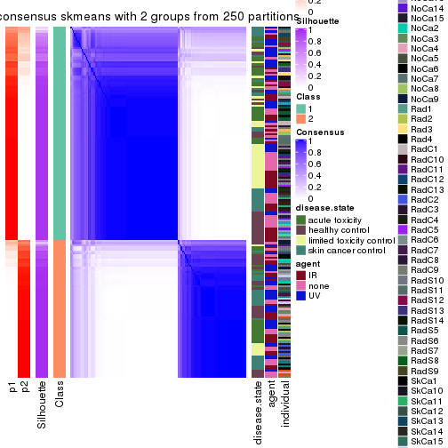</p>

</div>
<div id='tab-CV-skmeans-consensus-heatmap-2'>
<pre><code class="r">consensus_heatmap(res, k = 3)
</code></pre>

<p>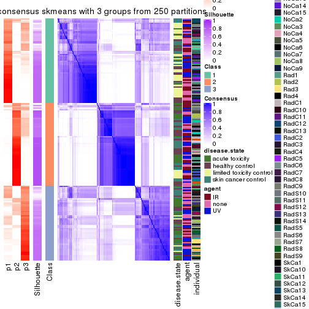</p>

</div>
<div id='tab-CV-skmeans-consensus-heatmap-3'>
<pre><code class="r">consensus_heatmap(res, k = 4)
</code></pre>

<p>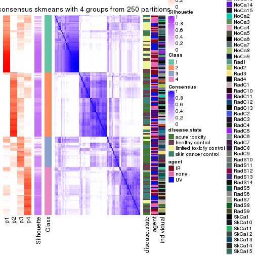</p>

</div>
<div id='tab-CV-skmeans-consensus-heatmap-4'>
<pre><code class="r">consensus_heatmap(res, k = 5)
</code></pre>

<p>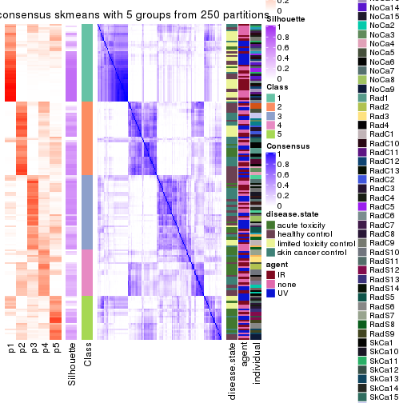</p>

</div>
<div id='tab-CV-skmeans-consensus-heatmap-5'>
<pre><code class="r">consensus_heatmap(res, k = 6)
</code></pre>

<p>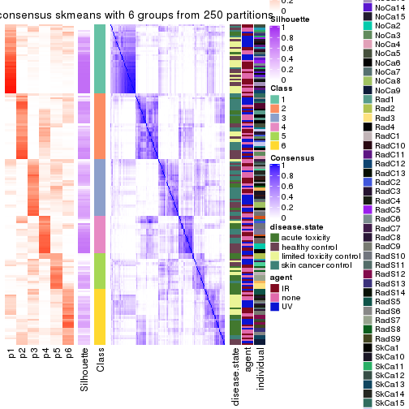</p>

</div>
</div>

Heatmaps for the membership of samples in all partitions to see how consistent they are:


<script>
$( function() {
	$( '#tabs-CV-skmeans-membership-heatmap' ).tabs();
} );
</script>
<div id='tabs-CV-skmeans-membership-heatmap'>
<ul>
<li><a href='#tab-CV-skmeans-membership-heatmap-1'>k = 2</a></li>
<li><a href='#tab-CV-skmeans-membership-heatmap-2'>k = 3</a></li>
<li><a href='#tab-CV-skmeans-membership-heatmap-3'>k = 4</a></li>
<li><a href='#tab-CV-skmeans-membership-heatmap-4'>k = 5</a></li>
<li><a href='#tab-CV-skmeans-membership-heatmap-5'>k = 6</a></li>
</ul>
<div id='tab-CV-skmeans-membership-heatmap-1'>
<pre><code class="r">membership_heatmap(res, k = 2)
</code></pre>

<p>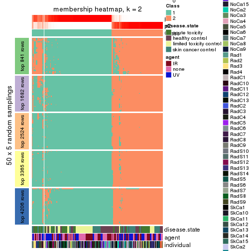</p>

</div>
<div id='tab-CV-skmeans-membership-heatmap-2'>
<pre><code class="r">membership_heatmap(res, k = 3)
</code></pre>

<p>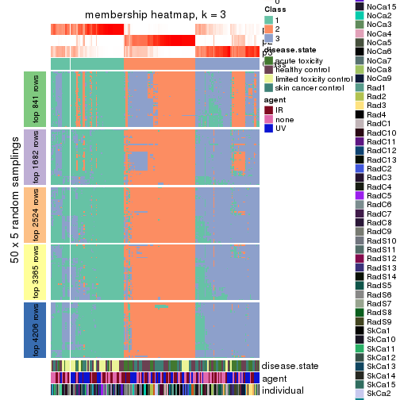</p>

</div>
<div id='tab-CV-skmeans-membership-heatmap-3'>
<pre><code class="r">membership_heatmap(res, k = 4)
</code></pre>

<p>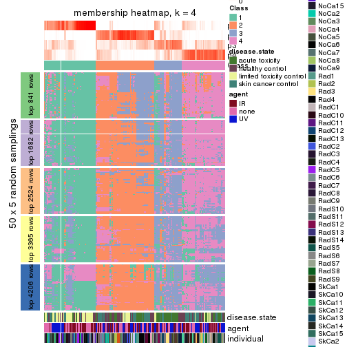</p>

</div>
<div id='tab-CV-skmeans-membership-heatmap-4'>
<pre><code class="r">membership_heatmap(res, k = 5)
</code></pre>

<p>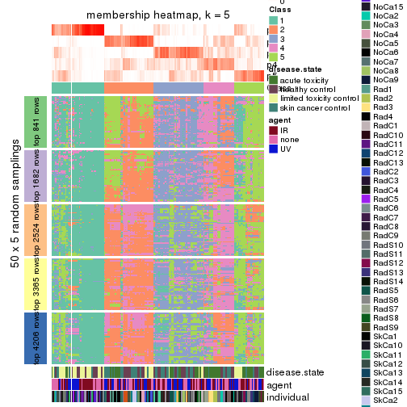</p>

</div>
<div id='tab-CV-skmeans-membership-heatmap-5'>
<pre><code class="r">membership_heatmap(res, k = 6)
</code></pre>

<p>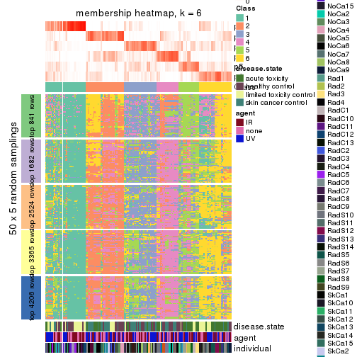</p>

</div>
</div>

As soon as we have had the classes for columns, we can look for signatures
which are significantly different between classes which can be candidate marks
for certain classes. Following are the heatmaps for signatures.


Signature heatmaps where rows are scaled:


<script>
$( function() {
	$( '#tabs-CV-skmeans-get-signatures' ).tabs();
} );
</script>
<div id='tabs-CV-skmeans-get-signatures'>
<ul>
<li><a href='#tab-CV-skmeans-get-signatures-1'>k = 2</a></li>
<li><a href='#tab-CV-skmeans-get-signatures-2'>k = 3</a></li>
<li><a href='#tab-CV-skmeans-get-signatures-3'>k = 4</a></li>
<li><a href='#tab-CV-skmeans-get-signatures-4'>k = 5</a></li>
<li><a href='#tab-CV-skmeans-get-signatures-5'>k = 6</a></li>
</ul>
<div id='tab-CV-skmeans-get-signatures-1'>
<pre><code class="r">get_signatures(res, k = 2)
</code></pre>

<p>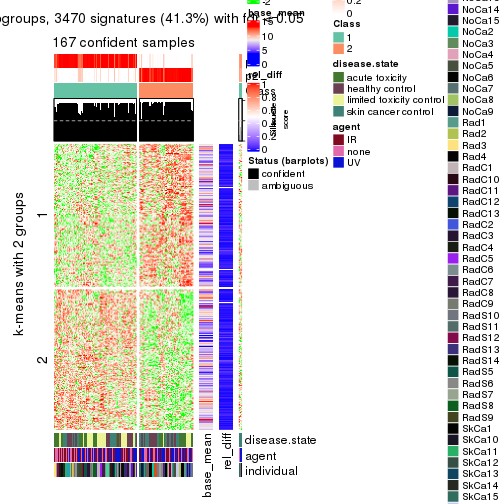</p>

</div>
<div id='tab-CV-skmeans-get-signatures-2'>
<pre><code class="r">get_signatures(res, k = 3)
</code></pre>

<p>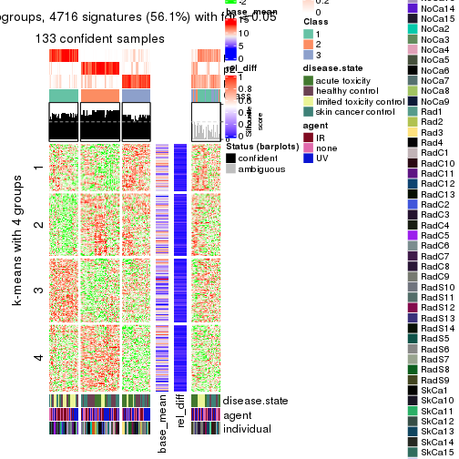</p>

</div>
<div id='tab-CV-skmeans-get-signatures-3'>
<pre><code class="r">get_signatures(res, k = 4)
</code></pre>

<p>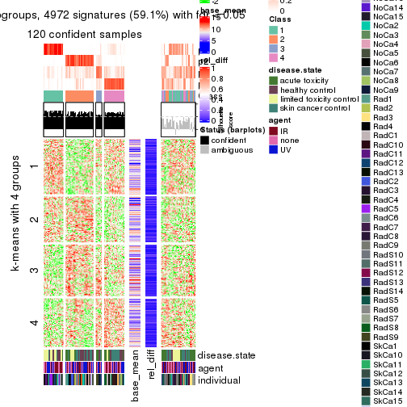</p>

</div>
<div id='tab-CV-skmeans-get-signatures-4'>
<pre><code class="r">get_signatures(res, k = 5)
</code></pre>

<p>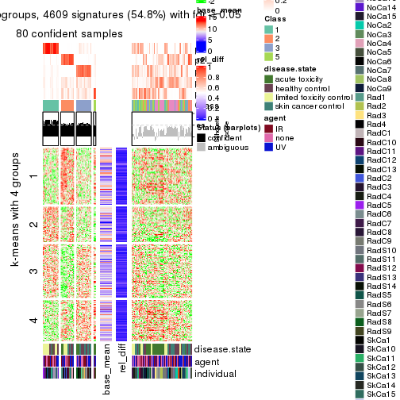</p>

</div>
<div id='tab-CV-skmeans-get-signatures-5'>
<pre><code class="r">get_signatures(res, k = 6)
</code></pre>

<p>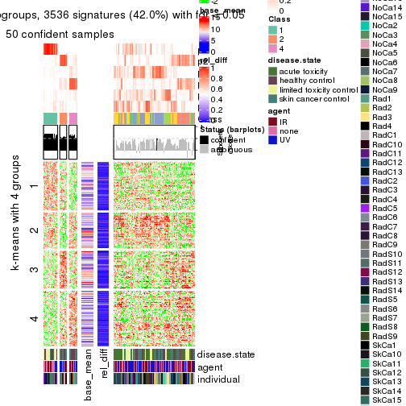</p>

</div>
</div>


Signature heatmaps where rows are not scaled:


<script>
$( function() {
	$( '#tabs-CV-skmeans-get-signatures-no-scale' ).tabs();
} );
</script>
<div id='tabs-CV-skmeans-get-signatures-no-scale'>
<ul>
<li><a href='#tab-CV-skmeans-get-signatures-no-scale-1'>k = 2</a></li>
<li><a href='#tab-CV-skmeans-get-signatures-no-scale-2'>k = 3</a></li>
<li><a href='#tab-CV-skmeans-get-signatures-no-scale-3'>k = 4</a></li>
<li><a href='#tab-CV-skmeans-get-signatures-no-scale-4'>k = 5</a></li>
<li><a href='#tab-CV-skmeans-get-signatures-no-scale-5'>k = 6</a></li>
</ul>
<div id='tab-CV-skmeans-get-signatures-no-scale-1'>
<pre><code class="r">get_signatures(res, k = 2, scale_rows = FALSE)
</code></pre>

<p>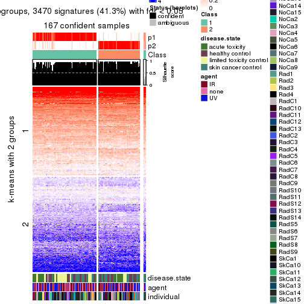</p>

</div>
<div id='tab-CV-skmeans-get-signatures-no-scale-2'>
<pre><code class="r">get_signatures(res, k = 3, scale_rows = FALSE)
</code></pre>

<p>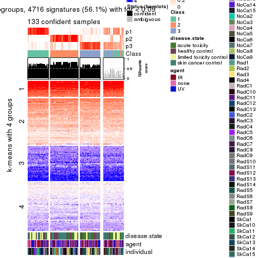</p>

</div>
<div id='tab-CV-skmeans-get-signatures-no-scale-3'>
<pre><code class="r">get_signatures(res, k = 4, scale_rows = FALSE)
</code></pre>

<p>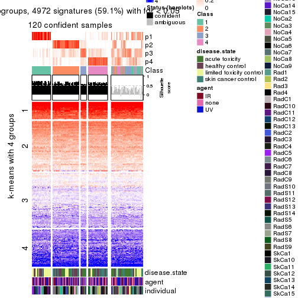</p>

</div>
<div id='tab-CV-skmeans-get-signatures-no-scale-4'>
<pre><code class="r">get_signatures(res, k = 5, scale_rows = FALSE)
</code></pre>

<p>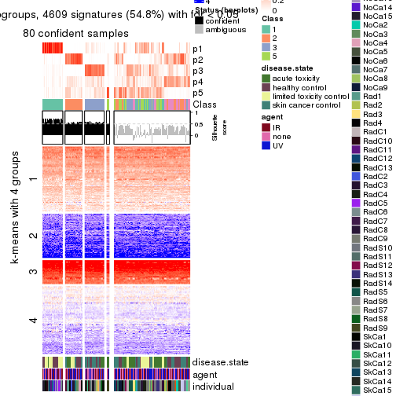</p>

</div>
<div id='tab-CV-skmeans-get-signatures-no-scale-5'>
<pre><code class="r">get_signatures(res, k = 6, scale_rows = FALSE)
</code></pre>

<p>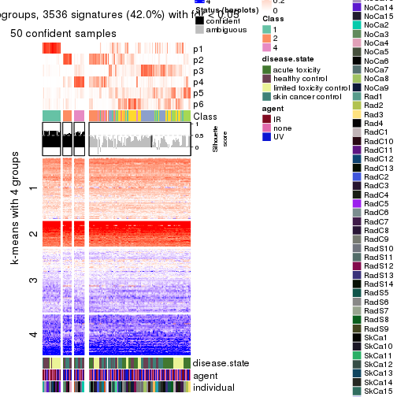</p>

</div>
</div>


Compare the overlap of signatures from different k:

```r
compare_signatures(res)
```

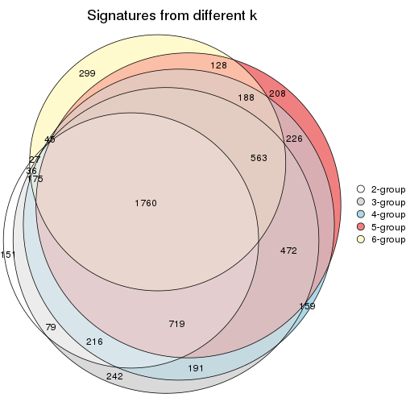

`get_signature()` returns a data frame invisibly. TO get the list of signatures, the function
call should be assigned to a variable explicitly. In following code, if `plot` argument is set
to `FALSE`, no heatmap is plotted while only the differential analysis is performed.

```r
# code only for demonstration
tb = get_signature(res, k = ..., plot = FALSE)
```

An example of the output of `tb` is:

```
#>   which_row         fdr    mean_1    mean_2 scaled_mean_1 scaled_mean_2 km
#> 1        38 0.042760348  8.373488  9.131774    -0.5533452     0.5164555  1
#> 2        40 0.018707592  7.106213  8.469186    -0.6173731     0.5762149  1
#> 3        55 0.019134737 10.221463 11.207825    -0.6159697     0.5749050  1
#> 4        59 0.006059896  5.921854  7.869574    -0.6899429     0.6439467  1
#> 5        60 0.018055526  8.928898 10.211722    -0.6204761     0.5791110  1
#> 6        98 0.009384629 15.714769 14.887706     0.6635654    -0.6193277  2
...
```

The columns in `tb` are:

1. `which_row`: row indices corresponding to the input matrix.
2. `fdr`: FDR for the differential test. 
3. `mean_x`: The mean value in group x.
4. `scaled_mean_x`: The mean value in group x after rows are scaled.
5. `km`: Row groups if k-means clustering is applied to rows.


UMAP plot which shows how samples are separated.


<script>
$( function() {
	$( '#tabs-CV-skmeans-dimension-reduction' ).tabs();
} );
</script>
<div id='tabs-CV-skmeans-dimension-reduction'>
<ul>
<li><a href='#tab-CV-skmeans-dimension-reduction-1'>k = 2</a></li>
<li><a href='#tab-CV-skmeans-dimension-reduction-2'>k = 3</a></li>
<li><a href='#tab-CV-skmeans-dimension-reduction-3'>k = 4</a></li>
<li><a href='#tab-CV-skmeans-dimension-reduction-4'>k = 5</a></li>
<li><a href='#tab-CV-skmeans-dimension-reduction-5'>k = 6</a></li>
</ul>
<div id='tab-CV-skmeans-dimension-reduction-1'>
<pre><code class="r">dimension_reduction(res, k = 2, method = &quot;UMAP&quot;)
</code></pre>

<p>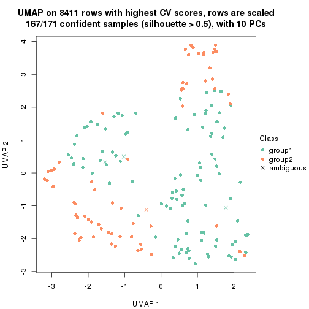</p>

</div>
<div id='tab-CV-skmeans-dimension-reduction-2'>
<pre><code class="r">dimension_reduction(res, k = 3, method = &quot;UMAP&quot;)
</code></pre>

<p>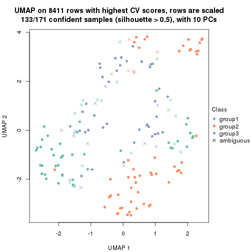</p>

</div>
<div id='tab-CV-skmeans-dimension-reduction-3'>
<pre><code class="r">dimension_reduction(res, k = 4, method = &quot;UMAP&quot;)
</code></pre>

<p>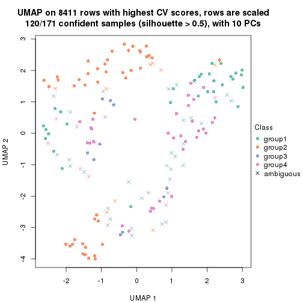</p>

</div>
<div id='tab-CV-skmeans-dimension-reduction-4'>
<pre><code class="r">dimension_reduction(res, k = 5, method = &quot;UMAP&quot;)
</code></pre>

<p>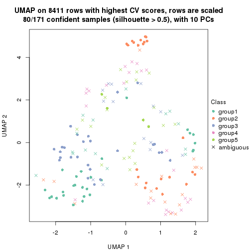</p>

</div>
<div id='tab-CV-skmeans-dimension-reduction-5'>
<pre><code class="r">dimension_reduction(res, k = 6, method = &quot;UMAP&quot;)
</code></pre>

<p>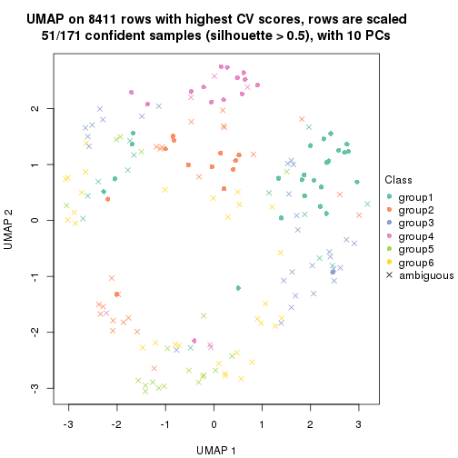</p>

</div>
</div>


Following heatmap shows how subgroups are split when increasing `k`:

```r
collect_classes(res)
```

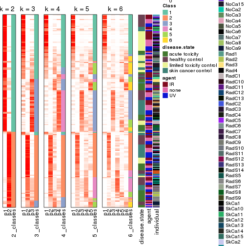


Test correlation between subgroups and known annotations. If the known
annotation is numeric, one-way ANOVA test is applied, and if the known
annotation is discrete, chi-squared contingency table test is applied.

```r
test_to_known_factors(res)
```

```
#>              n disease.state(p) agent(p) individual(p) k
#> CV:skmeans 167         1.57e-02    0.497      2.38e-11 2
#> CV:skmeans 133         2.13e-05    0.663      1.64e-14 3
#> CV:skmeans 120         3.84e-07    0.896      2.08e-19 4
#> CV:skmeans  80         2.20e-07    0.714      1.43e-12 5
#> CV:skmeans  51         2.89e-03    0.321      8.87e-08 6
```


If matrix rows can be associated to genes, consider to use `functional_enrichment(res,
...)` to perform function enrichment for the signature genes. See [this vignette](http://bioconductor.org/packages/devel/bioc/vignettes/cola/inst/doc/functional_enrichment.html) for more detailed explanations.


 

---------------------------------------------------


### CV:pam


The object with results only for a single top-value method and a single partition method 
can be extracted as:

```r
res = res_list["CV", "pam"]
# you can also extract it by
# res = res_list["CV:pam"]
```

A summary of `res` and all the functions that can be applied to it:

```r
res
```

```
#> A 'ConsensusPartition' object with k = 2, 3, 4, 5, 6.
#>   On a matrix with 8411 rows and 171 columns.
#>   Top rows (841, 1682, 2524, 3365, 4206) are extracted by 'CV' method.
#>   Subgroups are detected by 'pam' method.
#>   Performed in total 1250 partitions by row resampling.
#>   Best k for subgroups seems to be 2.
#> 
#> Following methods can be applied to this 'ConsensusPartition' object:
#>  [1] "cola_report"             "collect_classes"         "collect_plots"          
#>  [4] "collect_stats"           "colnames"                "compare_signatures"     
#>  [7] "consensus_heatmap"       "dimension_reduction"     "functional_enrichment"  
#> [10] "get_anno_col"            "get_anno"                "get_classes"            
#> [13] "get_consensus"           "get_matrix"              "get_membership"         
#> [16] "get_param"               "get_signatures"          "get_stats"              
#> [19] "is_best_k"               "is_stable_k"             "membership_heatmap"     
#> [22] "ncol"                    "nrow"                    "plot_ecdf"              
#> [25] "rownames"                "select_partition_number" "show"                   
#> [28] "suggest_best_k"          "test_to_known_factors"
```

`collect_plots()` function collects all the plots made from `res` for all `k` (number of partitions)
into one single page to provide an easy and fast comparison between different `k`.

```r
collect_plots(res)
```

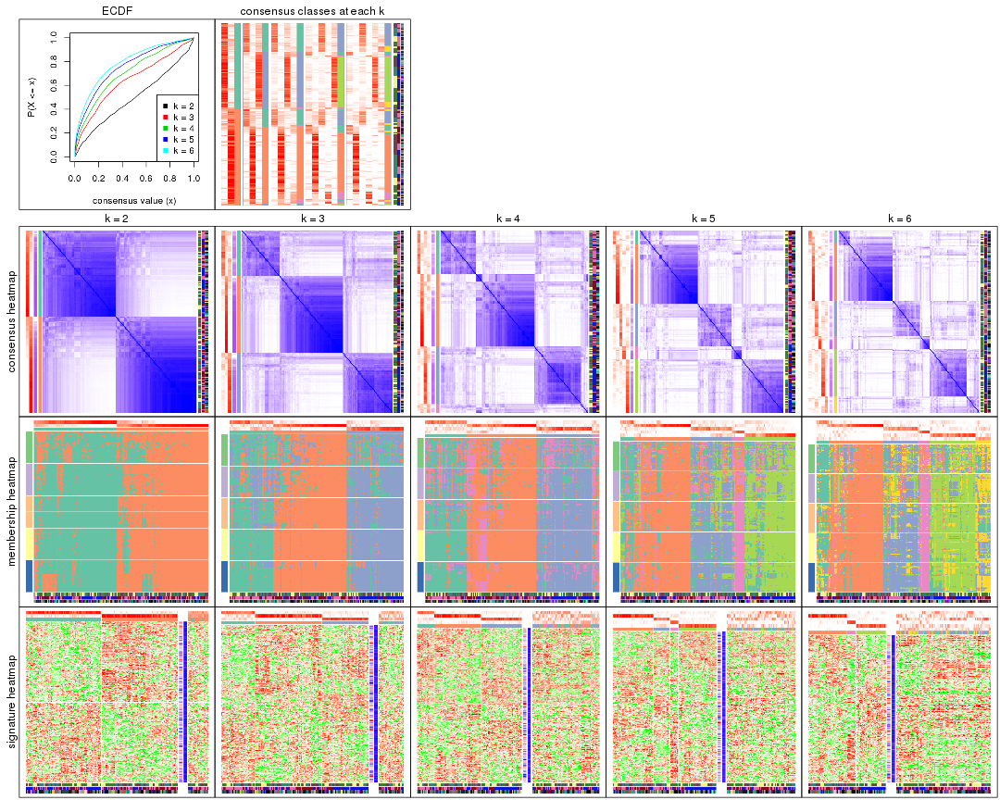

The plots are:

- The first row: a plot of the ECDF (empirical cumulative distribution
  function) curves of the consensus matrix for each `k` and the heatmap of
  predicted classes for each `k`.
- The second row: heatmaps of the consensus matrix for each `k`.
- The third row: heatmaps of the membership matrix for each `k`.
- The fouth row: heatmaps of the signatures for each `k`.

All the plots in panels can be made by individual functions and they are
plotted later in this section.

`select_partition_number()` produces several plots showing different
statistics for choosing "optimized" `k`. There are following statistics:

- ECDF curves of the consensus matrix for each `k`;
- 1-PAC. [The PAC
  score](https://en.wikipedia.org/wiki/Consensus_clustering#Over-interpretation_potential_of_consensus_clustering)
  measures the proportion of the ambiguous subgrouping.
- Mean silhouette score.
- Concordance. The mean probability of fiting the consensus class ids in all
  partitions.
- Area increased. Denote $A_k$ as the area under the ECDF curve for current
  `k`, the area increased is defined as $A_k - A_{k-1}$.
- Rand index. The percent of pairs of samples that are both in a same cluster
  or both are not in a same cluster in the partition of k and k-1.
- Jaccard index. The ratio of pairs of samples are both in a same cluster in
  the partition of k and k-1 and the pairs of samples are both in a same
  cluster in the partition k or k-1.

The detailed explanations of these statistics can be found in [the _cola_
vignette](http://bioconductor.org/packages/devel/bioc/vignettes/cola/inst/doc/cola.html#toc_13).

Generally speaking, lower PAC score, higher mean silhouette score or higher
concordance corresponds to better partition. Rand index and Jaccard index
measure how similar the current partition is compared to partition with `k-1`.
If they are too similar, we won't accept `k` is better than `k-1`.

```r
select_partition_number(res)
```

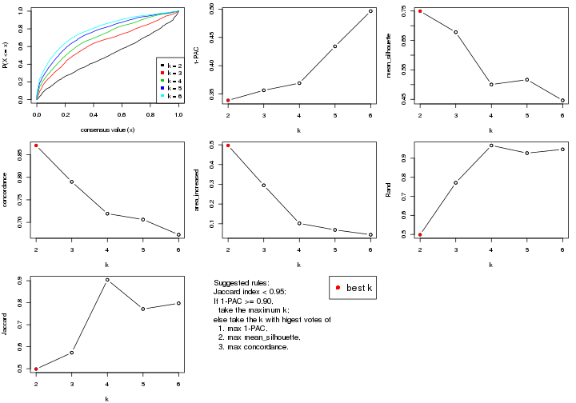

The numeric values for all these statistics can be obtained by `get_stats()`.

```r
get_stats(res)
```

```
#>   k 1-PAC mean_silhouette concordance area_increased  Rand Jaccard
#> 2 2 0.339           0.749       0.871         0.4965 0.498   0.498
#> 3 3 0.356           0.678       0.790         0.2948 0.771   0.573
#> 4 4 0.369           0.500       0.719         0.1018 0.967   0.904
#> 5 5 0.434           0.517       0.706         0.0688 0.927   0.771
#> 6 6 0.496           0.447       0.673         0.0445 0.947   0.797
```

`suggest_best_k()` suggests the best $k$ based on these statistics. The rules are as follows:

- All $k$ with Jaccard index larger than 0.95 are removed because increasing
  $k$ does not provide enough extra information. If all $k$ are removed, it is
  marked as no subgroup is detected.
- For all $k$ with 1-PAC score larger than 0.9, the maximal $k$ is taken as
  the best $k$, and other $k$ are marked as optional $k$.
- If it does not fit the second rule. The $k$ with the maximal vote of the
  highest 1-PAC score, highest mean silhouette, and highest concordance is
  taken as the best $k$.

```r
suggest_best_k(res)
```

```
#> [1] 2
```


Following shows the table of the partitions (You need to click the **show/hide
code output** link to see it). The membership matrix (columns with name `p*`)
is inferred by
[`clue::cl_consensus()`](https://www.rdocumentation.org/link/cl_consensus?package=clue)
function with the `SE` method. Basically the value in the membership matrix
represents the probability to belong to a certain group. The finall class
label for an item is determined with the group with highest probability it
belongs to.

In `get_classes()` function, the entropy is calculated from the membership
matrix and the silhouette score is calculated from the consensus matrix.


<script>
$( function() {
	$( '#tabs-CV-pam-get-classes' ).tabs();
} );
</script>
<div id='tabs-CV-pam-get-classes'>
<ul>
<li><a href='#tab-CV-pam-get-classes-1'>k = 2</a></li>
<li><a href='#tab-CV-pam-get-classes-2'>k = 3</a></li>
<li><a href='#tab-CV-pam-get-classes-3'>k = 4</a></li>
<li><a href='#tab-CV-pam-get-classes-4'>k = 5</a></li>
<li><a href='#tab-CV-pam-get-classes-5'>k = 6</a></li>
</ul>

<div id='tab-CV-pam-get-classes-1'>
<p><a id='tab-CV-pam-get-classes-1-a' style='color:#0366d6' href='#'>show/hide code output</a></p>
<pre><code class="r">cbind(get_classes(res, k = 2), get_membership(res, k = 2))
</code></pre>

<pre><code>#&gt;          class entropy silhouette    p1    p2
#&gt; GSM29783     2  0.0376     0.8575 0.004 0.996
#&gt; GSM29786     2  0.9795     0.3255 0.416 0.584
#&gt; GSM29789     2  0.2236     0.8544 0.036 0.964
#&gt; GSM29792     2  0.0376     0.8566 0.004 0.996
#&gt; GSM29795     2  0.0000     0.8565 0.000 1.000
#&gt; GSM29798     2  0.1184     0.8588 0.016 0.984
#&gt; GSM29801     2  0.7453     0.7441 0.212 0.788
#&gt; GSM29804     2  0.8909     0.5767 0.308 0.692
#&gt; GSM29807     2  0.5408     0.7870 0.124 0.876
#&gt; GSM29816     1  0.1843     0.8587 0.972 0.028
#&gt; GSM29821     2  0.9933     0.2942 0.452 0.548
#&gt; GSM29824     1  0.8081     0.7167 0.752 0.248
#&gt; GSM29827     2  0.8713     0.6398 0.292 0.708
#&gt; GSM29830     2  0.9358     0.3954 0.352 0.648
#&gt; GSM29833     2  0.0938     0.8569 0.012 0.988
#&gt; GSM29784     2  0.0376     0.8575 0.004 0.996
#&gt; GSM29787     2  0.7883     0.7174 0.236 0.764
#&gt; GSM29790     2  0.0376     0.8575 0.004 0.996
#&gt; GSM29793     2  0.0000     0.8565 0.000 1.000
#&gt; GSM29796     2  0.1843     0.8560 0.028 0.972
#&gt; GSM29799     2  0.0938     0.8582 0.012 0.988
#&gt; GSM29802     1  0.8608     0.6389 0.716 0.284
#&gt; GSM29805     2  0.9881     0.3017 0.436 0.564
#&gt; GSM29814     2  0.8016     0.6898 0.244 0.756
#&gt; GSM29817     1  0.9427     0.4235 0.640 0.360
#&gt; GSM29822     1  0.6531     0.7855 0.832 0.168
#&gt; GSM29825     1  0.4431     0.8558 0.908 0.092
#&gt; GSM29828     2  0.9933     0.2972 0.452 0.548
#&gt; GSM29831     2  0.9922     0.0419 0.448 0.552
#&gt; GSM29834     2  0.2236     0.8546 0.036 0.964
#&gt; GSM29785     2  0.1184     0.8580 0.016 0.984
#&gt; GSM29788     1  0.6623     0.7980 0.828 0.172
#&gt; GSM29791     2  0.0376     0.8575 0.004 0.996
#&gt; GSM29794     2  0.2043     0.8552 0.032 0.968
#&gt; GSM29797     2  0.2043     0.8563 0.032 0.968
#&gt; GSM29800     1  0.8443     0.7144 0.728 0.272
#&gt; GSM29803     1  0.3274     0.8576 0.940 0.060
#&gt; GSM29806     1  0.5946     0.8214 0.856 0.144
#&gt; GSM29815     1  0.9286     0.5942 0.656 0.344
#&gt; GSM29819     1  0.1843     0.8566 0.972 0.028
#&gt; GSM29823     1  0.0376     0.8500 0.996 0.004
#&gt; GSM29826     1  0.0376     0.8514 0.996 0.004
#&gt; GSM29829     1  0.1414     0.8574 0.980 0.020
#&gt; GSM29832     1  0.2236     0.8601 0.964 0.036
#&gt; GSM29835     1  0.4562     0.8436 0.904 0.096
#&gt; GSM29836     2  0.0376     0.8575 0.004 0.996
#&gt; GSM29839     2  0.0376     0.8575 0.004 0.996
#&gt; GSM29842     2  0.0376     0.8575 0.004 0.996
#&gt; GSM29845     2  0.0672     0.8576 0.008 0.992
#&gt; GSM29848     2  0.5294     0.8112 0.120 0.880
#&gt; GSM29851     2  0.8763     0.6316 0.296 0.704
#&gt; GSM29854     1  0.1414     0.8576 0.980 0.020
#&gt; GSM29857     1  0.5294     0.8379 0.880 0.120
#&gt; GSM29860     2  0.0938     0.8585 0.012 0.988
#&gt; GSM29863     1  0.0938     0.8548 0.988 0.012
#&gt; GSM29866     2  0.1184     0.8575 0.016 0.984
#&gt; GSM29869     2  0.4562     0.8269 0.096 0.904
#&gt; GSM29872     2  0.0672     0.8574 0.008 0.992
#&gt; GSM29875     2  0.9983     0.2112 0.476 0.524
#&gt; GSM29878     2  0.0376     0.8575 0.004 0.996
#&gt; GSM29837     2  0.0376     0.8575 0.004 0.996
#&gt; GSM29840     2  0.0938     0.8580 0.012 0.988
#&gt; GSM29843     2  0.0000     0.8565 0.000 1.000
#&gt; GSM29846     2  0.0672     0.8576 0.008 0.992
#&gt; GSM29849     2  0.4298     0.8288 0.088 0.912
#&gt; GSM29852     1  0.5946     0.7996 0.856 0.144
#&gt; GSM29855     1  0.2043     0.8595 0.968 0.032
#&gt; GSM29858     1  0.6531     0.7922 0.832 0.168
#&gt; GSM29861     2  0.5178     0.8173 0.116 0.884
#&gt; GSM29864     1  0.3584     0.8462 0.932 0.068
#&gt; GSM29867     2  0.8499     0.6630 0.276 0.724
#&gt; GSM29870     2  0.6801     0.7758 0.180 0.820
#&gt; GSM29873     2  0.2603     0.8518 0.044 0.956
#&gt; GSM29876     2  0.9608     0.4705 0.384 0.616
#&gt; GSM29879     2  0.2236     0.8551 0.036 0.964
#&gt; GSM29838     2  0.5178     0.7988 0.116 0.884
#&gt; GSM29841     1  0.8499     0.7128 0.724 0.276
#&gt; GSM29844     2  0.0376     0.8575 0.004 0.996
#&gt; GSM29847     2  0.2423     0.8540 0.040 0.960
#&gt; GSM29850     2  0.5519     0.8078 0.128 0.872
#&gt; GSM29853     1  0.0000     0.8489 1.000 0.000
#&gt; GSM29856     1  0.0376     0.8500 0.996 0.004
#&gt; GSM29859     1  0.2043     0.8587 0.968 0.032
#&gt; GSM29862     1  0.9460     0.5163 0.636 0.364
#&gt; GSM29865     1  0.1184     0.8552 0.984 0.016
#&gt; GSM29868     1  0.2778     0.8581 0.952 0.048
#&gt; GSM29871     1  0.6531     0.8138 0.832 0.168
#&gt; GSM29874     1  0.9983     0.2291 0.524 0.476
#&gt; GSM29877     1  0.8267     0.6773 0.740 0.260
#&gt; GSM29880     2  0.5946     0.8027 0.144 0.856
#&gt; GSM29881     2  0.7139     0.7317 0.196 0.804
#&gt; GSM29884     2  0.0376     0.8575 0.004 0.996
#&gt; GSM29887     2  0.0000     0.8565 0.000 1.000
#&gt; GSM29890     1  0.7056     0.7660 0.808 0.192
#&gt; GSM29893     1  0.5629     0.8280 0.868 0.132
#&gt; GSM29896     2  0.9427     0.4705 0.360 0.640
#&gt; GSM29899     1  0.2948     0.8571 0.948 0.052
#&gt; GSM29902     2  0.9996    -0.0573 0.488 0.512
#&gt; GSM29905     1  0.9323     0.5800 0.652 0.348
#&gt; GSM29908     2  0.7139     0.7611 0.196 0.804
#&gt; GSM29955     2  0.2948     0.8492 0.052 0.948
#&gt; GSM29958     2  0.2043     0.8556 0.032 0.968
#&gt; GSM29961     2  0.7056     0.7533 0.192 0.808
#&gt; GSM29882     1  0.5059     0.8267 0.888 0.112
#&gt; GSM29885     2  0.0376     0.8575 0.004 0.996
#&gt; GSM29888     2  0.0376     0.8575 0.004 0.996
#&gt; GSM29891     1  0.2043     0.8584 0.968 0.032
#&gt; GSM29894     1  0.0672     0.8527 0.992 0.008
#&gt; GSM29897     1  0.6343     0.8004 0.840 0.160
#&gt; GSM29900     1  0.5946     0.8120 0.856 0.144
#&gt; GSM29903     1  0.9983     0.0141 0.524 0.476
#&gt; GSM29906     1  0.9732     0.2960 0.596 0.404
#&gt; GSM29909     2  0.4161     0.8127 0.084 0.916
#&gt; GSM29956     2  0.8955     0.6111 0.312 0.688
#&gt; GSM29959     2  0.6801     0.7753 0.180 0.820
#&gt; GSM29962     2  0.1184     0.8578 0.016 0.984
#&gt; GSM29883     1  0.1633     0.8575 0.976 0.024
#&gt; GSM29886     2  0.0672     0.8580 0.008 0.992
#&gt; GSM29889     2  0.0376     0.8575 0.004 0.996
#&gt; GSM29892     1  0.1184     0.8554 0.984 0.016
#&gt; GSM29895     1  0.3584     0.8580 0.932 0.068
#&gt; GSM29898     1  0.0376     0.8483 0.996 0.004
#&gt; GSM29901     1  0.1843     0.8586 0.972 0.028
#&gt; GSM29904     1  0.0938     0.8538 0.988 0.012
#&gt; GSM29907     1  0.5059     0.8347 0.888 0.112
#&gt; GSM29910     1  0.2778     0.8572 0.952 0.048
#&gt; GSM29957     1  0.5519     0.8307 0.872 0.128
#&gt; GSM29960     1  0.1633     0.8567 0.976 0.024
#&gt; GSM29963     1  0.3274     0.8533 0.940 0.060
#&gt; GSM29964     2  0.0376     0.8575 0.004 0.996
#&gt; GSM29967     2  0.1414     0.8582 0.020 0.980
#&gt; GSM29970     1  0.7883     0.7334 0.764 0.236
#&gt; GSM29973     2  0.0376     0.8575 0.004 0.996
#&gt; GSM29976     1  0.7139     0.7702 0.804 0.196
#&gt; GSM29979     2  0.2236     0.8540 0.036 0.964
#&gt; GSM29982     1  0.9286     0.6095 0.656 0.344
#&gt; GSM29985     1  0.0938     0.8532 0.988 0.012
#&gt; GSM29988     2  0.3274     0.8477 0.060 0.940
#&gt; GSM29991     2  0.9286     0.4972 0.344 0.656
#&gt; GSM29994     1  0.8763     0.6613 0.704 0.296
#&gt; GSM29997     1  0.7219     0.7952 0.800 0.200
#&gt; GSM30000     2  0.1843     0.8570 0.028 0.972
#&gt; GSM30003     1  0.8016     0.7490 0.756 0.244
#&gt; GSM29965     2  0.0376     0.8575 0.004 0.996
#&gt; GSM29968     2  0.1843     0.8567 0.028 0.972
#&gt; GSM29971     1  0.4298     0.8551 0.912 0.088
#&gt; GSM29974     2  0.0000     0.8565 0.000 1.000
#&gt; GSM29977     1  0.0376     0.8511 0.996 0.004
#&gt; GSM29980     1  0.9833     0.3893 0.576 0.424
#&gt; GSM29983     1  0.4815     0.8339 0.896 0.104
#&gt; GSM29986     1  0.1633     0.8571 0.976 0.024
#&gt; GSM29989     2  0.9998    -0.0470 0.492 0.508
#&gt; GSM29992     2  0.0672     0.8576 0.008 0.992
#&gt; GSM29995     2  0.9815     0.3474 0.420 0.580
#&gt; GSM29998     1  0.8267     0.6678 0.740 0.260
#&gt; GSM30001     1  0.9896     0.3349 0.560 0.440
#&gt; GSM30004     1  0.5519     0.8234 0.872 0.128
#&gt; GSM29966     2  0.0672     0.8580 0.008 0.992
#&gt; GSM29969     2  0.8555     0.6544 0.280 0.720
#&gt; GSM29972     1  0.1633     0.8564 0.976 0.024
#&gt; GSM29975     2  0.5059     0.7909 0.112 0.888
#&gt; GSM29978     1  0.0376     0.8506 0.996 0.004
#&gt; GSM29981     1  0.5842     0.8232 0.860 0.140
#&gt; GSM29984     1  0.4690     0.8429 0.900 0.100
#&gt; GSM29987     1  0.1633     0.8579 0.976 0.024
#&gt; GSM29990     1  0.4562     0.8438 0.904 0.096
#&gt; GSM29993     2  0.9993    -0.1146 0.484 0.516
#&gt; GSM29996     1  0.0000     0.8489 1.000 0.000
#&gt; GSM29999     1  0.5059     0.8360 0.888 0.112
#&gt; GSM30002     1  0.3274     0.8545 0.940 0.060
#&gt; GSM30005     1  0.2603     0.8596 0.956 0.044
</code></pre>

<script>
$('#tab-CV-pam-get-classes-1-a').parent().next().next().hide();
$('#tab-CV-pam-get-classes-1-a').click(function(){
  $('#tab-CV-pam-get-classes-1-a').parent().next().next().toggle();
  return(false);
});
</script>
</div>

<div id='tab-CV-pam-get-classes-2'>
<p><a id='tab-CV-pam-get-classes-2-a' style='color:#0366d6' href='#'>show/hide code output</a></p>
<pre><code class="r">cbind(get_classes(res, k = 3), get_membership(res, k = 3))
</code></pre>

<pre><code>#&gt;          class entropy silhouette    p1    p2    p3
#&gt; GSM29783     2  0.0237    0.86414 0.000 0.996 0.004
#&gt; GSM29786     2  0.7250    0.32220 0.032 0.572 0.396
#&gt; GSM29789     2  0.1585    0.86267 0.028 0.964 0.008
#&gt; GSM29792     2  0.0848    0.86564 0.008 0.984 0.008
#&gt; GSM29795     2  0.0000    0.86400 0.000 1.000 0.000
#&gt; GSM29798     2  0.1315    0.86618 0.008 0.972 0.020
#&gt; GSM29801     2  0.7524    0.64182 0.180 0.692 0.128
#&gt; GSM29804     1  0.9203    0.56647 0.496 0.340 0.164
#&gt; GSM29807     1  0.7091    0.58217 0.640 0.320 0.040
#&gt; GSM29816     1  0.5845    0.61598 0.688 0.004 0.308
#&gt; GSM29821     2  0.8442    0.31555 0.100 0.548 0.352
#&gt; GSM29824     3  0.8118    0.53526 0.164 0.188 0.648
#&gt; GSM29827     2  0.8587    0.51474 0.220 0.604 0.176
#&gt; GSM29830     2  0.9256    0.13395 0.168 0.488 0.344
#&gt; GSM29833     2  0.3112    0.84589 0.056 0.916 0.028
#&gt; GSM29784     2  0.0237    0.86414 0.000 0.996 0.004
#&gt; GSM29787     2  0.6882    0.67082 0.096 0.732 0.172
#&gt; GSM29790     2  0.0237    0.86364 0.004 0.996 0.000
#&gt; GSM29793     2  0.0237    0.86364 0.004 0.996 0.000
#&gt; GSM29796     2  0.2063    0.86213 0.044 0.948 0.008
#&gt; GSM29799     2  0.0829    0.86555 0.004 0.984 0.012
#&gt; GSM29802     1  0.8033    0.67237 0.640 0.120 0.240
#&gt; GSM29805     1  0.8765    0.65772 0.588 0.212 0.200
#&gt; GSM29814     1  0.6737    0.65426 0.744 0.156 0.100
#&gt; GSM29817     1  0.7948    0.62750 0.600 0.080 0.320
#&gt; GSM29822     1  0.6521    0.31215 0.504 0.004 0.492
#&gt; GSM29825     1  0.7306    0.49164 0.616 0.044 0.340
#&gt; GSM29828     1  0.9764    0.41062 0.440 0.300 0.260
#&gt; GSM29831     1  0.7705    0.59632 0.604 0.332 0.064
#&gt; GSM29834     2  0.4217    0.82627 0.100 0.868 0.032
#&gt; GSM29785     2  0.1950    0.86421 0.008 0.952 0.040
#&gt; GSM29788     3  0.4914    0.74343 0.068 0.088 0.844
#&gt; GSM29791     2  0.0747    0.86657 0.000 0.984 0.016
#&gt; GSM29794     2  0.3993    0.83954 0.052 0.884 0.064
#&gt; GSM29797     2  0.2749    0.85755 0.012 0.924 0.064
#&gt; GSM29800     3  0.5743    0.68439 0.044 0.172 0.784
#&gt; GSM29803     3  0.3028    0.76481 0.048 0.032 0.920
#&gt; GSM29806     3  0.4413    0.73761 0.036 0.104 0.860
#&gt; GSM29815     3  0.9802   -0.19106 0.360 0.240 0.400
#&gt; GSM29819     3  0.2496    0.75083 0.068 0.004 0.928
#&gt; GSM29823     3  0.2400    0.76247 0.064 0.004 0.932
#&gt; GSM29826     3  0.3619    0.74692 0.136 0.000 0.864
#&gt; GSM29829     3  0.2066    0.76843 0.060 0.000 0.940
#&gt; GSM29832     3  0.3234    0.77410 0.072 0.020 0.908
#&gt; GSM29835     3  0.7146    0.60024 0.264 0.060 0.676
#&gt; GSM29836     2  0.1129    0.86517 0.004 0.976 0.020
#&gt; GSM29839     2  0.0237    0.86414 0.000 0.996 0.004
#&gt; GSM29842     2  0.0237    0.86414 0.000 0.996 0.004
#&gt; GSM29845     2  0.0661    0.86487 0.004 0.988 0.008
#&gt; GSM29848     2  0.4737    0.79757 0.084 0.852 0.064
#&gt; GSM29851     2  0.7603    0.55927 0.096 0.668 0.236
#&gt; GSM29854     3  0.3532    0.76512 0.108 0.008 0.884
#&gt; GSM29857     1  0.7262    0.60419 0.624 0.044 0.332
#&gt; GSM29860     2  0.3856    0.84522 0.072 0.888 0.040
#&gt; GSM29863     3  0.2860    0.76888 0.084 0.004 0.912
#&gt; GSM29866     2  0.1129    0.86551 0.020 0.976 0.004
#&gt; GSM29869     2  0.5435    0.75639 0.192 0.784 0.024
#&gt; GSM29872     2  0.3213    0.83959 0.092 0.900 0.008
#&gt; GSM29875     1  0.9724    0.43505 0.452 0.268 0.280
#&gt; GSM29878     2  0.1620    0.86596 0.012 0.964 0.024
#&gt; GSM29837     2  0.1129    0.86570 0.004 0.976 0.020
#&gt; GSM29840     2  0.0592    0.86552 0.000 0.988 0.012
#&gt; GSM29843     2  0.0000    0.86400 0.000 1.000 0.000
#&gt; GSM29846     2  0.0661    0.86487 0.004 0.988 0.008
#&gt; GSM29849     2  0.3590    0.82780 0.076 0.896 0.028
#&gt; GSM29852     1  0.7489    0.32686 0.496 0.036 0.468
#&gt; GSM29855     1  0.6396    0.61574 0.664 0.016 0.320
#&gt; GSM29858     1  0.6935    0.61923 0.652 0.036 0.312
#&gt; GSM29861     2  0.7394    0.59602 0.284 0.652 0.064
#&gt; GSM29864     1  0.6095    0.54463 0.608 0.000 0.392
#&gt; GSM29867     1  0.8452    0.54447 0.532 0.372 0.096
#&gt; GSM29870     1  0.6806    0.65649 0.712 0.228 0.060
#&gt; GSM29873     1  0.7551    0.50059 0.580 0.372 0.048
#&gt; GSM29876     1  0.6322    0.67851 0.772 0.108 0.120
#&gt; GSM29879     2  0.3310    0.84889 0.064 0.908 0.028
#&gt; GSM29838     2  0.5200    0.72697 0.020 0.796 0.184
#&gt; GSM29841     3  0.5268    0.65716 0.012 0.212 0.776
#&gt; GSM29844     2  0.0237    0.86414 0.000 0.996 0.004
#&gt; GSM29847     2  0.1647    0.86308 0.004 0.960 0.036
#&gt; GSM29850     2  0.5319    0.78175 0.104 0.824 0.072
#&gt; GSM29853     3  0.2959    0.74532 0.100 0.000 0.900
#&gt; GSM29856     3  0.3030    0.76504 0.092 0.004 0.904
#&gt; GSM29859     1  0.6081    0.60095 0.652 0.004 0.344
#&gt; GSM29862     3  0.8271    0.46464 0.156 0.212 0.632
#&gt; GSM29865     3  0.1453    0.76767 0.024 0.008 0.968
#&gt; GSM29868     3  0.3272    0.77109 0.080 0.016 0.904
#&gt; GSM29871     1  0.7762    0.66991 0.668 0.120 0.212
#&gt; GSM29874     3  0.9433    0.17472 0.184 0.356 0.460
#&gt; GSM29877     1  0.9215    0.47261 0.500 0.168 0.332
#&gt; GSM29880     2  0.6915    0.71948 0.140 0.736 0.124
#&gt; GSM29881     2  0.5315    0.69643 0.012 0.772 0.216
#&gt; GSM29884     2  0.0237    0.86414 0.000 0.996 0.004
#&gt; GSM29887     2  0.0000    0.86400 0.000 1.000 0.000
#&gt; GSM29890     1  0.5785    0.54438 0.696 0.004 0.300
#&gt; GSM29893     3  0.4807    0.75994 0.092 0.060 0.848
#&gt; GSM29896     2  0.9744    0.01179 0.256 0.444 0.300
#&gt; GSM29899     3  0.5581    0.74081 0.168 0.040 0.792
#&gt; GSM29902     3  0.9723    0.01703 0.228 0.348 0.424
#&gt; GSM29905     3  0.9457   -0.00541 0.340 0.192 0.468
#&gt; GSM29908     2  0.7344    0.66432 0.240 0.680 0.080
#&gt; GSM29955     2  0.6044    0.75032 0.172 0.772 0.056
#&gt; GSM29958     2  0.3921    0.83307 0.080 0.884 0.036
#&gt; GSM29961     2  0.7433    0.66697 0.168 0.700 0.132
#&gt; GSM29882     1  0.4233    0.65667 0.836 0.004 0.160
#&gt; GSM29885     2  0.0237    0.86414 0.000 0.996 0.004
#&gt; GSM29888     2  0.0237    0.86414 0.000 0.996 0.004
#&gt; GSM29891     1  0.6617    0.41603 0.556 0.008 0.436
#&gt; GSM29894     3  0.4346    0.73672 0.184 0.000 0.816
#&gt; GSM29897     3  0.7685    0.35021 0.384 0.052 0.564
#&gt; GSM29900     1  0.5998    0.68817 0.788 0.084 0.128
#&gt; GSM29903     1  0.4137    0.66148 0.872 0.032 0.096
#&gt; GSM29906     1  0.5461    0.64327 0.768 0.016 0.216
#&gt; GSM29909     1  0.6255    0.60675 0.684 0.300 0.016
#&gt; GSM29956     1  0.6495    0.60074 0.740 0.200 0.060
#&gt; GSM29959     1  0.7945    0.23606 0.548 0.388 0.064
#&gt; GSM29962     2  0.4744    0.80753 0.136 0.836 0.028
#&gt; GSM29883     3  0.3293    0.74998 0.088 0.012 0.900
#&gt; GSM29886     2  0.0592    0.86622 0.000 0.988 0.012
#&gt; GSM29889     2  0.1015    0.86554 0.012 0.980 0.008
#&gt; GSM29892     3  0.5845    0.63248 0.308 0.004 0.688
#&gt; GSM29895     3  0.4056    0.75993 0.092 0.032 0.876
#&gt; GSM29898     3  0.4172    0.75599 0.156 0.004 0.840
#&gt; GSM29901     3  0.3375    0.77100 0.100 0.008 0.892
#&gt; GSM29904     3  0.3193    0.77189 0.100 0.004 0.896
#&gt; GSM29907     3  0.3649    0.76425 0.036 0.068 0.896
#&gt; GSM29910     3  0.2400    0.77011 0.064 0.004 0.932
#&gt; GSM29957     3  0.3983    0.76319 0.068 0.048 0.884
#&gt; GSM29960     3  0.5785    0.61286 0.300 0.004 0.696
#&gt; GSM29963     3  0.1643    0.76721 0.044 0.000 0.956
#&gt; GSM29964     2  0.0848    0.86631 0.008 0.984 0.008
#&gt; GSM29967     2  0.2173    0.86176 0.008 0.944 0.048
#&gt; GSM29970     3  0.7692    0.58005 0.136 0.184 0.680
#&gt; GSM29973     2  0.1015    0.86428 0.012 0.980 0.008
#&gt; GSM29976     1  0.6161    0.61479 0.708 0.020 0.272
#&gt; GSM29979     2  0.3896    0.84060 0.060 0.888 0.052
#&gt; GSM29982     3  0.7766    0.58063 0.148 0.176 0.676
#&gt; GSM29985     3  0.5982    0.46266 0.328 0.004 0.668
#&gt; GSM29988     2  0.6852    0.60154 0.300 0.664 0.036
#&gt; GSM29991     2  0.8670    0.39041 0.168 0.592 0.240
#&gt; GSM29994     1  0.8300    0.61244 0.620 0.136 0.244
#&gt; GSM29997     3  0.8718    0.18746 0.364 0.116 0.520
#&gt; GSM30000     2  0.4324    0.82440 0.112 0.860 0.028
#&gt; GSM30003     3  0.4840    0.70141 0.016 0.168 0.816
#&gt; GSM29965     2  0.1015    0.86422 0.012 0.980 0.008
#&gt; GSM29968     2  0.2680    0.85585 0.008 0.924 0.068
#&gt; GSM29971     1  0.6099    0.65013 0.740 0.032 0.228
#&gt; GSM29974     2  0.1751    0.86146 0.028 0.960 0.012
#&gt; GSM29977     1  0.5285    0.64247 0.752 0.004 0.244
#&gt; GSM29980     1  0.9838    0.49207 0.424 0.288 0.288
#&gt; GSM29983     3  0.5449    0.73838 0.116 0.068 0.816
#&gt; GSM29986     1  0.6587    0.43880 0.568 0.008 0.424
#&gt; GSM29989     1  0.7097    0.67753 0.720 0.172 0.108
#&gt; GSM29992     2  0.0424    0.86431 0.000 0.992 0.008
#&gt; GSM29995     1  0.3484    0.63944 0.904 0.048 0.048
#&gt; GSM29998     1  0.4289    0.65773 0.868 0.092 0.040
#&gt; GSM30001     1  0.8926    0.63524 0.568 0.240 0.192
#&gt; GSM30004     3  0.4291    0.74061 0.152 0.008 0.840
#&gt; GSM29966     2  0.2116    0.85900 0.040 0.948 0.012
#&gt; GSM29969     2  0.6977    0.68048 0.076 0.712 0.212
#&gt; GSM29972     3  0.3686    0.76735 0.140 0.000 0.860
#&gt; GSM29975     2  0.4370    0.80981 0.076 0.868 0.056
#&gt; GSM29978     3  0.3816    0.72270 0.148 0.000 0.852
#&gt; GSM29981     3  0.3802    0.76279 0.080 0.032 0.888
#&gt; GSM29984     3  0.2550    0.77027 0.024 0.040 0.936
#&gt; GSM29987     3  0.2749    0.76538 0.064 0.012 0.924
#&gt; GSM29990     3  0.4345    0.74132 0.136 0.016 0.848
#&gt; GSM29993     3  0.6495    0.25239 0.004 0.460 0.536
#&gt; GSM29996     3  0.3941    0.74851 0.156 0.000 0.844
#&gt; GSM29999     3  0.7190    0.36201 0.356 0.036 0.608
#&gt; GSM30002     3  0.2384    0.76758 0.056 0.008 0.936
#&gt; GSM30005     3  0.3310    0.76170 0.064 0.028 0.908
</code></pre>

<script>
$('#tab-CV-pam-get-classes-2-a').parent().next().next().hide();
$('#tab-CV-pam-get-classes-2-a').click(function(){
  $('#tab-CV-pam-get-classes-2-a').parent().next().next().toggle();
  return(false);
});
</script>
</div>

<div id='tab-CV-pam-get-classes-3'>
<p><a id='tab-CV-pam-get-classes-3-a' style='color:#0366d6' href='#'>show/hide code output</a></p>
<pre><code class="r">cbind(get_classes(res, k = 4), get_membership(res, k = 4))
</code></pre>

<pre><code>#&gt;          class entropy silhouette    p1    p2    p3    p4
#&gt; GSM29783     2  0.0336    0.71225 0.000 0.992 0.008 0.000
#&gt; GSM29786     2  0.5724    0.06542 0.028 0.548 0.424 0.000
#&gt; GSM29789     2  0.1585    0.70760 0.040 0.952 0.004 0.004
#&gt; GSM29792     2  0.0895    0.71398 0.000 0.976 0.004 0.020
#&gt; GSM29795     2  0.0376    0.71245 0.004 0.992 0.000 0.004
#&gt; GSM29798     2  0.0937    0.71452 0.012 0.976 0.012 0.000
#&gt; GSM29801     2  0.7564    0.30439 0.228 0.608 0.092 0.072
#&gt; GSM29804     1  0.8488    0.30316 0.500 0.272 0.160 0.068
#&gt; GSM29807     1  0.7165    0.31579 0.608 0.264 0.036 0.092
#&gt; GSM29816     1  0.4868    0.59559 0.720 0.000 0.256 0.024
#&gt; GSM29821     2  0.7849    0.05398 0.140 0.520 0.308 0.032
#&gt; GSM29824     3  0.8662    0.41323 0.152 0.132 0.532 0.184
#&gt; GSM29827     2  0.8756   -0.10938 0.104 0.452 0.120 0.324
#&gt; GSM29830     2  0.9185   -0.28074 0.092 0.396 0.308 0.204
#&gt; GSM29833     2  0.4282    0.62278 0.024 0.820 0.016 0.140
#&gt; GSM29784     2  0.0000    0.71040 0.000 1.000 0.000 0.000
#&gt; GSM29787     2  0.6322    0.45002 0.148 0.696 0.140 0.016
#&gt; GSM29790     2  0.0188    0.71065 0.000 0.996 0.000 0.004
#&gt; GSM29793     2  0.0779    0.71119 0.004 0.980 0.000 0.016
#&gt; GSM29796     2  0.2123    0.70781 0.032 0.936 0.004 0.028
#&gt; GSM29799     2  0.0672    0.71373 0.008 0.984 0.008 0.000
#&gt; GSM29802     1  0.5937    0.59663 0.720 0.068 0.188 0.024
#&gt; GSM29805     1  0.7646    0.49275 0.616 0.172 0.148 0.064
#&gt; GSM29814     1  0.6898    0.45899 0.684 0.080 0.084 0.152
#&gt; GSM29817     1  0.7049    0.57349 0.644 0.068 0.224 0.064
#&gt; GSM29822     1  0.5774    0.28761 0.508 0.000 0.464 0.028
#&gt; GSM29825     1  0.7534    0.47878 0.560 0.020 0.264 0.156
#&gt; GSM29828     1  0.9418    0.01300 0.368 0.296 0.228 0.108
#&gt; GSM29831     1  0.8007    0.28933 0.536 0.292 0.064 0.108
#&gt; GSM29834     2  0.5684    0.51459 0.044 0.716 0.020 0.220
#&gt; GSM29785     2  0.1707    0.71186 0.004 0.952 0.024 0.020
#&gt; GSM29788     3  0.4403    0.72467 0.072 0.048 0.840 0.040
#&gt; GSM29791     2  0.0927    0.71461 0.000 0.976 0.016 0.008
#&gt; GSM29794     2  0.3819    0.67440 0.016 0.860 0.036 0.088
#&gt; GSM29797     2  0.2499    0.70284 0.004 0.920 0.044 0.032
#&gt; GSM29800     3  0.4978    0.64116 0.052 0.180 0.764 0.004
#&gt; GSM29803     3  0.2221    0.73353 0.044 0.016 0.932 0.008
#&gt; GSM29806     3  0.4310    0.70882 0.068 0.056 0.844 0.032
#&gt; GSM29815     4  0.9788    0.09926 0.292 0.168 0.220 0.320
#&gt; GSM29819     3  0.2287    0.72994 0.060 0.004 0.924 0.012
#&gt; GSM29823     3  0.3113    0.73219 0.052 0.004 0.892 0.052
#&gt; GSM29826     3  0.4724    0.68834 0.136 0.000 0.788 0.076
#&gt; GSM29829     3  0.2988    0.73641 0.012 0.000 0.876 0.112
#&gt; GSM29832     3  0.3026    0.74290 0.056 0.012 0.900 0.032
#&gt; GSM29835     3  0.7993    0.43322 0.156 0.036 0.520 0.288
#&gt; GSM29836     2  0.2222    0.70198 0.000 0.924 0.016 0.060
#&gt; GSM29839     2  0.0000    0.71040 0.000 1.000 0.000 0.000
#&gt; GSM29842     2  0.0000    0.71040 0.000 1.000 0.000 0.000
#&gt; GSM29845     2  0.0336    0.71173 0.008 0.992 0.000 0.000
#&gt; GSM29848     2  0.3970    0.62840 0.124 0.836 0.036 0.004
#&gt; GSM29851     2  0.7918    0.20130 0.152 0.580 0.208 0.060
#&gt; GSM29854     3  0.4985    0.70577 0.112 0.008 0.788 0.092
#&gt; GSM29857     1  0.5693    0.58599 0.696 0.028 0.252 0.024
#&gt; GSM29860     2  0.4359    0.64001 0.016 0.804 0.016 0.164
#&gt; GSM29863     3  0.4713    0.72591 0.116 0.008 0.804 0.072
#&gt; GSM29866     2  0.1059    0.71301 0.012 0.972 0.000 0.016
#&gt; GSM29869     2  0.5690    0.52867 0.184 0.732 0.016 0.068
#&gt; GSM29872     2  0.4371    0.62895 0.048 0.820 0.008 0.124
#&gt; GSM29875     1  0.8437    0.24898 0.508 0.220 0.216 0.056
#&gt; GSM29878     2  0.1526    0.71319 0.016 0.960 0.012 0.012
#&gt; GSM29837     2  0.2409    0.70317 0.004 0.924 0.032 0.040
#&gt; GSM29840     2  0.1639    0.70658 0.004 0.952 0.008 0.036
#&gt; GSM29843     2  0.0000    0.71040 0.000 1.000 0.000 0.000
#&gt; GSM29846     2  0.0336    0.71173 0.008 0.992 0.000 0.000
#&gt; GSM29849     2  0.3896    0.63675 0.120 0.844 0.012 0.024
#&gt; GSM29852     1  0.6479    0.27613 0.508 0.004 0.428 0.060
#&gt; GSM29855     1  0.6282    0.57532 0.660 0.008 0.244 0.088
#&gt; GSM29858     1  0.5560    0.59059 0.684 0.016 0.276 0.024
#&gt; GSM29861     2  0.7760    0.22088 0.204 0.560 0.028 0.208
#&gt; GSM29864     1  0.6136    0.55805 0.632 0.000 0.288 0.080
#&gt; GSM29867     1  0.7114    0.30227 0.580 0.316 0.060 0.044
#&gt; GSM29870     1  0.6000    0.45561 0.720 0.188 0.036 0.056
#&gt; GSM29873     1  0.7716    0.21642 0.552 0.288 0.040 0.120
#&gt; GSM29876     1  0.4090    0.54391 0.844 0.096 0.048 0.012
#&gt; GSM29879     2  0.3279    0.68513 0.068 0.888 0.016 0.028
#&gt; GSM29838     2  0.6672   -0.12909 0.004 0.468 0.072 0.456
#&gt; GSM29841     3  0.4827    0.66911 0.012 0.164 0.784 0.040
#&gt; GSM29844     2  0.0524    0.71292 0.000 0.988 0.008 0.004
#&gt; GSM29847     2  0.1209    0.71165 0.004 0.964 0.032 0.000
#&gt; GSM29850     2  0.6029    0.53220 0.136 0.740 0.048 0.076
#&gt; GSM29853     3  0.4590    0.68683 0.148 0.000 0.792 0.060
#&gt; GSM29856     3  0.4411    0.71265 0.108 0.000 0.812 0.080
#&gt; GSM29859     1  0.5887    0.56469 0.660 0.008 0.284 0.048
#&gt; GSM29862     3  0.8790    0.28812 0.136 0.152 0.516 0.196
#&gt; GSM29865     3  0.1042    0.73620 0.020 0.000 0.972 0.008
#&gt; GSM29868     3  0.4275    0.73811 0.064 0.012 0.836 0.088
#&gt; GSM29871     1  0.7165    0.54736 0.656 0.112 0.172 0.060
#&gt; GSM29874     4  0.9319    0.39039 0.116 0.240 0.224 0.420
#&gt; GSM29877     1  0.8517    0.34644 0.516 0.124 0.260 0.100
#&gt; GSM29880     2  0.6725    0.49141 0.104 0.704 0.100 0.092
#&gt; GSM29881     2  0.5464    0.45404 0.012 0.724 0.220 0.044
#&gt; GSM29884     2  0.2281    0.66730 0.000 0.904 0.000 0.096
#&gt; GSM29887     2  0.0336    0.71079 0.000 0.992 0.000 0.008
#&gt; GSM29890     1  0.7164    0.42651 0.556 0.000 0.204 0.240
#&gt; GSM29893     3  0.5464    0.72614 0.060 0.044 0.776 0.120
#&gt; GSM29896     4  0.9706    0.26116 0.176 0.276 0.192 0.356
#&gt; GSM29899     3  0.6537    0.65943 0.092 0.032 0.684 0.192
#&gt; GSM29902     3  0.9520   -0.17678 0.132 0.308 0.360 0.200
#&gt; GSM29905     3  0.9527    0.00685 0.236 0.172 0.408 0.184
#&gt; GSM29908     2  0.7363    0.11551 0.068 0.516 0.040 0.376
#&gt; GSM29955     2  0.6976    0.20387 0.060 0.568 0.032 0.340
#&gt; GSM29958     2  0.5311    0.54972 0.032 0.748 0.024 0.196
#&gt; GSM29961     2  0.7797    0.06374 0.060 0.512 0.080 0.348
#&gt; GSM29882     1  0.3505    0.58350 0.864 0.000 0.088 0.048
#&gt; GSM29885     2  0.0469    0.71124 0.000 0.988 0.000 0.012
#&gt; GSM29888     2  0.0336    0.71079 0.000 0.992 0.000 0.008
#&gt; GSM29891     1  0.5500    0.40587 0.564 0.004 0.420 0.012
#&gt; GSM29894     3  0.5700    0.68153 0.120 0.000 0.716 0.164
#&gt; GSM29897     3  0.7869    0.25985 0.264 0.004 0.448 0.284
#&gt; GSM29900     1  0.5816    0.56369 0.760 0.056 0.076 0.108
#&gt; GSM29903     1  0.4524    0.55141 0.816 0.012 0.052 0.120
#&gt; GSM29906     1  0.5555    0.58820 0.752 0.012 0.132 0.104
#&gt; GSM29909     1  0.6525    0.33489 0.632 0.252 0.004 0.112
#&gt; GSM29956     4  0.7822   -0.11411 0.392 0.116 0.032 0.460
#&gt; GSM29959     4  0.8689    0.18637 0.304 0.276 0.036 0.384
#&gt; GSM29962     2  0.5593    0.52210 0.052 0.728 0.016 0.204
#&gt; GSM29883     3  0.4001    0.71182 0.116 0.008 0.840 0.036
#&gt; GSM29886     2  0.5090    0.30213 0.000 0.660 0.016 0.324
#&gt; GSM29889     2  0.3444    0.58136 0.000 0.816 0.000 0.184
#&gt; GSM29892     3  0.6937    0.50640 0.300 0.004 0.572 0.124
#&gt; GSM29895     3  0.4702    0.70176 0.036 0.008 0.784 0.172
#&gt; GSM29898     3  0.4565    0.72086 0.140 0.000 0.796 0.064
#&gt; GSM29901     3  0.3647    0.72858 0.108 0.000 0.852 0.040
#&gt; GSM29904     3  0.3771    0.74236 0.088 0.004 0.856 0.052
#&gt; GSM29907     3  0.2519    0.74090 0.020 0.036 0.924 0.020
#&gt; GSM29910     3  0.2882    0.74188 0.024 0.000 0.892 0.084
#&gt; GSM29957     3  0.3606    0.73464 0.008 0.020 0.856 0.116
#&gt; GSM29960     3  0.6813    0.42058 0.104 0.000 0.516 0.380
#&gt; GSM29963     3  0.1706    0.73658 0.016 0.000 0.948 0.036
#&gt; GSM29964     2  0.4086    0.53697 0.000 0.776 0.008 0.216
#&gt; GSM29967     2  0.6497   -0.05017 0.008 0.496 0.052 0.444
#&gt; GSM29970     3  0.8415    0.46379 0.128 0.144 0.560 0.168
#&gt; GSM29973     2  0.5400    0.08730 0.004 0.560 0.008 0.428
#&gt; GSM29976     1  0.6594    0.53769 0.656 0.008 0.176 0.160
#&gt; GSM29979     2  0.6163    0.45255 0.028 0.684 0.052 0.236
#&gt; GSM29982     3  0.7641    0.51692 0.052 0.120 0.592 0.236
#&gt; GSM29985     3  0.7106    0.20184 0.380 0.000 0.488 0.132
#&gt; GSM29988     4  0.8105    0.33537 0.192 0.348 0.020 0.440
#&gt; GSM29991     2  0.9102   -0.14810 0.172 0.476 0.208 0.144
#&gt; GSM29994     1  0.8420    0.46029 0.544 0.088 0.196 0.172
#&gt; GSM29997     3  0.8971    0.08723 0.264 0.084 0.448 0.204
#&gt; GSM30000     2  0.4954    0.56583 0.028 0.772 0.020 0.180
#&gt; GSM30003     3  0.3612    0.69030 0.012 0.144 0.840 0.004
#&gt; GSM29965     2  0.1917    0.70568 0.012 0.944 0.008 0.036
#&gt; GSM29968     2  0.6502    0.02608 0.004 0.528 0.064 0.404
#&gt; GSM29971     1  0.5964    0.57749 0.720 0.012 0.148 0.120
#&gt; GSM29974     2  0.5673    0.04058 0.012 0.536 0.008 0.444
#&gt; GSM29977     1  0.4685    0.59270 0.784 0.000 0.156 0.060
#&gt; GSM29980     1  0.9276    0.23570 0.420 0.228 0.244 0.108
#&gt; GSM29983     3  0.5961    0.69979 0.084 0.028 0.732 0.156
#&gt; GSM29986     1  0.5947    0.48741 0.616 0.004 0.336 0.044
#&gt; GSM29989     1  0.7334    0.49522 0.656 0.128 0.088 0.128
#&gt; GSM29992     2  0.0188    0.71090 0.004 0.996 0.000 0.000
#&gt; GSM29995     1  0.5871    0.36321 0.624 0.012 0.028 0.336
#&gt; GSM29998     1  0.5782    0.47017 0.724 0.048 0.028 0.200
#&gt; GSM30001     1  0.8022    0.45231 0.584 0.192 0.144 0.080
#&gt; GSM30004     3  0.3208    0.71061 0.148 0.000 0.848 0.004
#&gt; GSM29966     2  0.6283   -0.00293 0.024 0.512 0.020 0.444
#&gt; GSM29969     4  0.8207    0.38715 0.052 0.272 0.156 0.520
#&gt; GSM29972     3  0.5174    0.72234 0.116 0.000 0.760 0.124
#&gt; GSM29975     4  0.7156    0.14238 0.028 0.432 0.064 0.476
#&gt; GSM29978     3  0.3583    0.69034 0.180 0.000 0.816 0.004
#&gt; GSM29981     3  0.6442    0.29798 0.036 0.020 0.552 0.392
#&gt; GSM29984     3  0.2300    0.74461 0.000 0.016 0.920 0.064
#&gt; GSM29987     3  0.2744    0.73526 0.064 0.008 0.908 0.020
#&gt; GSM29990     3  0.5191    0.68005 0.108 0.004 0.768 0.120
#&gt; GSM29993     3  0.5457   -0.00869 0.004 0.472 0.516 0.008
#&gt; GSM29996     3  0.5950    0.66588 0.148 0.000 0.696 0.156
#&gt; GSM29999     3  0.6730    0.36468 0.280 0.008 0.608 0.104
#&gt; GSM30002     3  0.3090    0.72672 0.056 0.000 0.888 0.056
#&gt; GSM30005     3  0.2307    0.73216 0.048 0.016 0.928 0.008
</code></pre>

<script>
$('#tab-CV-pam-get-classes-3-a').parent().next().next().hide();
$('#tab-CV-pam-get-classes-3-a').click(function(){
  $('#tab-CV-pam-get-classes-3-a').parent().next().next().toggle();
  return(false);
});
</script>
</div>

<div id='tab-CV-pam-get-classes-4'>
<p><a id='tab-CV-pam-get-classes-4-a' style='color:#0366d6' href='#'>show/hide code output</a></p>
<pre><code class="r">cbind(get_classes(res, k = 5), get_membership(res, k = 5))
</code></pre>

<pre><code>#&gt;          class entropy silhouette    p1    p2    p3    p4    p5
#&gt; GSM29783     2  0.0290     0.7715 0.000 0.992 0.000 0.000 0.008
#&gt; GSM29786     2  0.4718     0.1576 0.000 0.540 0.016 0.000 0.444
#&gt; GSM29789     2  0.1573     0.7665 0.004 0.948 0.036 0.004 0.008
#&gt; GSM29792     2  0.1116     0.7734 0.004 0.964 0.000 0.028 0.004
#&gt; GSM29795     2  0.0162     0.7712 0.000 0.996 0.004 0.000 0.000
#&gt; GSM29798     2  0.0932     0.7743 0.000 0.972 0.004 0.004 0.020
#&gt; GSM29801     2  0.7620     0.2610 0.148 0.524 0.216 0.008 0.104
#&gt; GSM29804     3  0.9011     0.3830 0.128 0.232 0.416 0.084 0.140
#&gt; GSM29807     3  0.7133     0.4445 0.040 0.220 0.588 0.112 0.040
#&gt; GSM29816     3  0.4701     0.5707 0.028 0.000 0.708 0.016 0.248
#&gt; GSM29821     2  0.7411     0.1105 0.064 0.492 0.132 0.008 0.304
#&gt; GSM29824     5  0.8785     0.1740 0.292 0.116 0.096 0.088 0.408
#&gt; GSM29827     1  0.7281     0.4439 0.492 0.336 0.088 0.012 0.072
#&gt; GSM29830     1  0.7888     0.4116 0.408 0.300 0.072 0.004 0.216
#&gt; GSM29833     2  0.4434     0.3597 0.348 0.640 0.000 0.008 0.004
#&gt; GSM29784     2  0.0000     0.7699 0.000 1.000 0.000 0.000 0.000
#&gt; GSM29787     2  0.5614     0.5263 0.020 0.684 0.148 0.000 0.148
#&gt; GSM29790     2  0.0290     0.7706 0.000 0.992 0.000 0.008 0.000
#&gt; GSM29793     2  0.1270     0.7676 0.000 0.948 0.000 0.052 0.000
#&gt; GSM29796     2  0.1911     0.7648 0.036 0.932 0.028 0.000 0.004
#&gt; GSM29799     2  0.0579     0.7732 0.000 0.984 0.008 0.000 0.008
#&gt; GSM29802     3  0.6210     0.5853 0.044 0.052 0.680 0.044 0.180
#&gt; GSM29805     3  0.8257     0.5081 0.124 0.128 0.532 0.076 0.140
#&gt; GSM29814     3  0.7213     0.4889 0.112 0.036 0.604 0.180 0.068
#&gt; GSM29817     3  0.6650     0.5448 0.088 0.064 0.620 0.012 0.216
#&gt; GSM29822     3  0.5508     0.2335 0.064 0.000 0.476 0.000 0.460
#&gt; GSM29825     3  0.7704     0.3930 0.224 0.012 0.460 0.048 0.256
#&gt; GSM29828     3  0.8423     0.0629 0.136 0.296 0.340 0.004 0.224
#&gt; GSM29831     3  0.7327     0.3610 0.124 0.284 0.516 0.008 0.068
#&gt; GSM29834     2  0.5218     0.1050 0.440 0.528 0.012 0.016 0.004
#&gt; GSM29785     2  0.1706     0.7702 0.016 0.948 0.008 0.016 0.012
#&gt; GSM29788     5  0.4108     0.6913 0.052 0.048 0.048 0.016 0.836
#&gt; GSM29791     2  0.1074     0.7735 0.004 0.968 0.000 0.016 0.012
#&gt; GSM29794     2  0.3706     0.7324 0.064 0.848 0.008 0.064 0.016
#&gt; GSM29797     2  0.2670     0.7562 0.024 0.904 0.004 0.044 0.024
#&gt; GSM29800     5  0.5332     0.6076 0.016 0.168 0.052 0.032 0.732
#&gt; GSM29803     5  0.1679     0.7007 0.020 0.012 0.016 0.004 0.948
#&gt; GSM29806     5  0.4584     0.6635 0.036 0.044 0.040 0.068 0.812
#&gt; GSM29815     4  0.8788     0.1527 0.104 0.088 0.204 0.456 0.148
#&gt; GSM29819     5  0.1812     0.6982 0.008 0.004 0.036 0.012 0.940
#&gt; GSM29823     5  0.3597     0.6947 0.080 0.004 0.040 0.024 0.852
#&gt; GSM29826     5  0.5438     0.6276 0.096 0.000 0.084 0.088 0.732
#&gt; GSM29829     5  0.2956     0.6885 0.140 0.000 0.008 0.004 0.848
#&gt; GSM29832     5  0.2313     0.7078 0.040 0.008 0.024 0.008 0.920
#&gt; GSM29835     1  0.6706     0.1790 0.556 0.016 0.088 0.032 0.308
#&gt; GSM29836     2  0.2497     0.7478 0.004 0.880 0.000 0.112 0.004
#&gt; GSM29839     2  0.0162     0.7703 0.004 0.996 0.000 0.000 0.000
#&gt; GSM29842     2  0.0000     0.7699 0.000 1.000 0.000 0.000 0.000
#&gt; GSM29845     2  0.0290     0.7713 0.000 0.992 0.008 0.000 0.000
#&gt; GSM29848     2  0.3712     0.6841 0.004 0.820 0.124 0.000 0.052
#&gt; GSM29851     2  0.7340     0.2568 0.112 0.540 0.144 0.000 0.204
#&gt; GSM29854     5  0.5895     0.6107 0.132 0.012 0.064 0.084 0.708
#&gt; GSM29857     3  0.5762     0.5734 0.024 0.016 0.668 0.056 0.236
#&gt; GSM29860     2  0.4915     0.6057 0.048 0.700 0.012 0.240 0.000
#&gt; GSM29863     5  0.5361     0.6626 0.104 0.004 0.076 0.072 0.744
#&gt; GSM29866     2  0.0898     0.7718 0.020 0.972 0.008 0.000 0.000
#&gt; GSM29869     2  0.5995     0.5541 0.092 0.688 0.168 0.020 0.032
#&gt; GSM29872     2  0.5342     0.6079 0.124 0.732 0.032 0.108 0.004
#&gt; GSM29875     3  0.8805     0.2670 0.164 0.188 0.428 0.044 0.176
#&gt; GSM29878     2  0.1460     0.7726 0.020 0.956 0.012 0.008 0.004
#&gt; GSM29837     2  0.2681     0.7426 0.000 0.876 0.004 0.108 0.012
#&gt; GSM29840     2  0.1331     0.7673 0.040 0.952 0.000 0.000 0.008
#&gt; GSM29843     2  0.0000     0.7699 0.000 1.000 0.000 0.000 0.000
#&gt; GSM29846     2  0.0290     0.7713 0.000 0.992 0.008 0.000 0.000
#&gt; GSM29849     2  0.4065     0.6736 0.056 0.808 0.120 0.000 0.016
#&gt; GSM29852     3  0.6194     0.2449 0.104 0.004 0.484 0.004 0.404
#&gt; GSM29855     3  0.7404     0.5254 0.160 0.008 0.544 0.080 0.208
#&gt; GSM29858     3  0.5142     0.5726 0.016 0.012 0.676 0.024 0.272
#&gt; GSM29861     2  0.7851     0.1841 0.116 0.472 0.156 0.252 0.004
#&gt; GSM29864     3  0.6899     0.5369 0.116 0.000 0.572 0.080 0.232
#&gt; GSM29867     3  0.6688     0.3818 0.080 0.304 0.548 0.000 0.068
#&gt; GSM29870     3  0.6005     0.4752 0.128 0.156 0.676 0.008 0.032
#&gt; GSM29873     3  0.7941     0.3517 0.088 0.244 0.496 0.148 0.024
#&gt; GSM29876     3  0.3675     0.5482 0.024 0.072 0.852 0.008 0.044
#&gt; GSM29879     2  0.3241     0.7408 0.048 0.876 0.052 0.012 0.012
#&gt; GSM29838     4  0.3826     0.7258 0.012 0.172 0.000 0.796 0.020
#&gt; GSM29841     5  0.4605     0.6406 0.060 0.140 0.004 0.020 0.776
#&gt; GSM29844     2  0.0798     0.7724 0.000 0.976 0.000 0.016 0.008
#&gt; GSM29847     2  0.1041     0.7718 0.000 0.964 0.004 0.000 0.032
#&gt; GSM29850     2  0.6154     0.5620 0.124 0.692 0.116 0.024 0.044
#&gt; GSM29853     5  0.4624     0.6207 0.112 0.000 0.144 0.000 0.744
#&gt; GSM29856     5  0.5579     0.6207 0.148 0.000 0.048 0.096 0.708
#&gt; GSM29859     3  0.6202     0.5526 0.040 0.004 0.608 0.072 0.276
#&gt; GSM29862     5  0.9023     0.1739 0.156 0.116 0.080 0.244 0.404
#&gt; GSM29865     5  0.1186     0.7019 0.020 0.000 0.008 0.008 0.964
#&gt; GSM29868     5  0.4425     0.6902 0.136 0.012 0.056 0.008 0.788
#&gt; GSM29871     3  0.7499     0.5473 0.076 0.100 0.596 0.064 0.164
#&gt; GSM29874     4  0.8678     0.2853 0.212 0.128 0.088 0.468 0.104
#&gt; GSM29877     3  0.8006     0.3144 0.188 0.108 0.464 0.008 0.232
#&gt; GSM29880     2  0.7075     0.4944 0.108 0.644 0.092 0.064 0.092
#&gt; GSM29881     2  0.5980     0.4174 0.096 0.648 0.012 0.016 0.228
#&gt; GSM29884     2  0.2891     0.6576 0.000 0.824 0.000 0.176 0.000
#&gt; GSM29887     2  0.0703     0.7694 0.000 0.976 0.000 0.024 0.000
#&gt; GSM29890     3  0.6470     0.2177 0.360 0.000 0.504 0.020 0.116
#&gt; GSM29893     5  0.5768     0.6226 0.208 0.044 0.040 0.020 0.688
#&gt; GSM29896     1  0.7001     0.4386 0.592 0.188 0.116 0.004 0.100
#&gt; GSM29899     5  0.6311     0.4763 0.304 0.036 0.060 0.012 0.588
#&gt; GSM29902     5  0.8858    -0.2279 0.244 0.288 0.124 0.028 0.316
#&gt; GSM29905     5  0.8928    -0.0616 0.240 0.156 0.228 0.028 0.348
#&gt; GSM29908     1  0.4790     0.4122 0.632 0.344 0.008 0.004 0.012
#&gt; GSM29955     1  0.6315     0.3193 0.512 0.388 0.072 0.020 0.008
#&gt; GSM29958     2  0.4814     0.1914 0.412 0.568 0.000 0.016 0.004
#&gt; GSM29961     1  0.5513     0.4752 0.640 0.292 0.008 0.016 0.044
#&gt; GSM29882     3  0.4127     0.5607 0.080 0.000 0.820 0.048 0.052
#&gt; GSM29885     2  0.1124     0.7701 0.000 0.960 0.004 0.036 0.000
#&gt; GSM29888     2  0.0703     0.7694 0.000 0.976 0.000 0.024 0.000
#&gt; GSM29891     3  0.5089     0.3504 0.028 0.004 0.536 0.000 0.432
#&gt; GSM29894     5  0.5846     0.5566 0.260 0.000 0.100 0.016 0.624
#&gt; GSM29897     1  0.6337     0.1600 0.524 0.000 0.164 0.004 0.308
#&gt; GSM29900     3  0.5710     0.5507 0.108 0.044 0.736 0.036 0.076
#&gt; GSM29903     3  0.3992     0.5162 0.128 0.000 0.812 0.028 0.032
#&gt; GSM29906     3  0.4928     0.5422 0.096 0.004 0.764 0.028 0.108
#&gt; GSM29909     3  0.6470     0.4036 0.128 0.212 0.616 0.040 0.004
#&gt; GSM29956     1  0.3573     0.4035 0.856 0.024 0.084 0.016 0.020
#&gt; GSM29959     1  0.6206     0.4269 0.648 0.160 0.160 0.020 0.012
#&gt; GSM29962     2  0.4575     0.3977 0.328 0.648 0.024 0.000 0.000
#&gt; GSM29883     5  0.3427     0.6766 0.056 0.004 0.096 0.000 0.844
#&gt; GSM29886     4  0.4597     0.4315 0.000 0.424 0.000 0.564 0.012
#&gt; GSM29889     2  0.4193     0.4290 0.012 0.684 0.000 0.304 0.000
#&gt; GSM29892     5  0.6942     0.2713 0.232 0.004 0.296 0.008 0.460
#&gt; GSM29895     5  0.5045     0.5739 0.264 0.004 0.008 0.044 0.680
#&gt; GSM29898     5  0.4540     0.6671 0.072 0.000 0.140 0.016 0.772
#&gt; GSM29901     5  0.3875     0.6825 0.052 0.000 0.068 0.044 0.836
#&gt; GSM29904     5  0.3854     0.7051 0.076 0.004 0.048 0.032 0.840
#&gt; GSM29907     5  0.2214     0.7074 0.024 0.016 0.020 0.012 0.928
#&gt; GSM29910     5  0.2699     0.7073 0.100 0.000 0.008 0.012 0.880
#&gt; GSM29957     5  0.3519     0.6867 0.128 0.012 0.004 0.020 0.836
#&gt; GSM29960     1  0.5575     0.2909 0.644 0.000 0.068 0.020 0.268
#&gt; GSM29963     5  0.1524     0.7035 0.016 0.000 0.016 0.016 0.952
#&gt; GSM29964     2  0.4460     0.1902 0.000 0.600 0.004 0.392 0.004
#&gt; GSM29967     4  0.3551     0.7219 0.004 0.152 0.004 0.820 0.020
#&gt; GSM29970     5  0.9088     0.1772 0.244 0.128 0.100 0.124 0.404
#&gt; GSM29973     4  0.3366     0.7150 0.000 0.212 0.004 0.784 0.000
#&gt; GSM29976     3  0.6044     0.3941 0.264 0.000 0.608 0.020 0.108
#&gt; GSM29979     2  0.7037     0.2776 0.140 0.552 0.024 0.260 0.024
#&gt; GSM29982     5  0.8221     0.3183 0.280 0.104 0.048 0.100 0.468
#&gt; GSM29985     5  0.7260     0.0985 0.192 0.000 0.352 0.036 0.420
#&gt; GSM29988     1  0.8779     0.0444 0.304 0.188 0.204 0.292 0.012
#&gt; GSM29991     2  0.9088    -0.1860 0.132 0.408 0.216 0.080 0.164
#&gt; GSM29994     3  0.7869     0.3486 0.208 0.064 0.524 0.040 0.164
#&gt; GSM29997     5  0.8885    -0.1551 0.264 0.072 0.272 0.060 0.332
#&gt; GSM30000     2  0.5399     0.5218 0.200 0.708 0.032 0.052 0.008
#&gt; GSM30003     5  0.2660     0.6631 0.000 0.128 0.008 0.000 0.864
#&gt; GSM29965     2  0.2612     0.7395 0.000 0.868 0.008 0.124 0.000
#&gt; GSM29968     4  0.4619     0.6626 0.012 0.228 0.004 0.728 0.028
#&gt; GSM29971     3  0.6603     0.4951 0.200 0.008 0.628 0.080 0.084
#&gt; GSM29974     4  0.3160     0.7227 0.000 0.188 0.004 0.808 0.000
#&gt; GSM29977     3  0.4014     0.5574 0.060 0.000 0.804 0.008 0.128
#&gt; GSM29980     3  0.9446     0.3511 0.088 0.172 0.352 0.188 0.200
#&gt; GSM29983     5  0.6988     0.5440 0.248 0.024 0.056 0.088 0.584
#&gt; GSM29986     3  0.6159     0.4633 0.096 0.004 0.596 0.020 0.284
#&gt; GSM29989     3  0.7125     0.4303 0.176 0.104 0.616 0.048 0.056
#&gt; GSM29992     2  0.0162     0.7704 0.000 0.996 0.004 0.000 0.000
#&gt; GSM29995     1  0.5157    -0.1000 0.532 0.000 0.436 0.016 0.016
#&gt; GSM29998     3  0.6008     0.3548 0.280 0.028 0.628 0.040 0.024
#&gt; GSM30001     3  0.8320     0.4937 0.072 0.164 0.520 0.128 0.116
#&gt; GSM30004     5  0.2439     0.6823 0.004 0.000 0.120 0.000 0.876
#&gt; GSM29966     4  0.3320     0.7279 0.000 0.164 0.012 0.820 0.004
#&gt; GSM29969     4  0.2981     0.6360 0.024 0.048 0.012 0.892 0.024
#&gt; GSM29972     5  0.6537     0.6051 0.164 0.000 0.100 0.104 0.632
#&gt; GSM29975     4  0.2971     0.7258 0.000 0.156 0.008 0.836 0.000
#&gt; GSM29978     5  0.3612     0.6360 0.028 0.000 0.172 0.000 0.800
#&gt; GSM29981     4  0.5509     0.2647 0.040 0.008 0.012 0.612 0.328
#&gt; GSM29984     5  0.3534     0.7050 0.040 0.012 0.004 0.096 0.848
#&gt; GSM29987     5  0.2438     0.6988 0.008 0.004 0.044 0.032 0.912
#&gt; GSM29990     5  0.6011     0.6104 0.092 0.004 0.072 0.144 0.688
#&gt; GSM29993     5  0.5593     0.1022 0.000 0.440 0.008 0.052 0.500
#&gt; GSM29996     5  0.6273     0.5665 0.152 0.000 0.184 0.036 0.628
#&gt; GSM29999     5  0.7034     0.3180 0.088 0.004 0.260 0.092 0.556
#&gt; GSM30002     5  0.3850     0.6840 0.032 0.000 0.028 0.116 0.824
#&gt; GSM30005     5  0.1026     0.6979 0.000 0.004 0.024 0.004 0.968
</code></pre>

<script>
$('#tab-CV-pam-get-classes-4-a').parent().next().next().hide();
$('#tab-CV-pam-get-classes-4-a').click(function(){
  $('#tab-CV-pam-get-classes-4-a').parent().next().next().toggle();
  return(false);
});
</script>
</div>

<div id='tab-CV-pam-get-classes-5'>
<p><a id='tab-CV-pam-get-classes-5-a' style='color:#0366d6' href='#'>show/hide code output</a></p>
<pre><code class="r">cbind(get_classes(res, k = 6), get_membership(res, k = 6))
</code></pre>

<pre><code>#&gt;          class entropy silhouette    p1    p2    p3    p4    p5    p6
#&gt; GSM29783     2  0.0146    0.75590 0.000 0.996 0.000 0.000 0.004 0.000
#&gt; GSM29786     2  0.4573    0.19220 0.004 0.532 0.020 0.000 0.440 0.004
#&gt; GSM29789     2  0.1554    0.75159 0.000 0.940 0.044 0.004 0.004 0.008
#&gt; GSM29792     2  0.1138    0.75857 0.012 0.960 0.000 0.024 0.000 0.004
#&gt; GSM29795     2  0.0260    0.75664 0.000 0.992 0.000 0.000 0.000 0.008
#&gt; GSM29798     2  0.1078    0.75939 0.000 0.964 0.012 0.008 0.016 0.000
#&gt; GSM29801     2  0.7833    0.04697 0.248 0.408 0.204 0.000 0.088 0.052
#&gt; GSM29804     3  0.8047    0.24927 0.096 0.172 0.480 0.012 0.124 0.116
#&gt; GSM29807     3  0.6215    0.37476 0.004 0.168 0.636 0.072 0.024 0.096
#&gt; GSM29816     3  0.5158    0.37857 0.024 0.000 0.668 0.008 0.228 0.072
#&gt; GSM29821     2  0.7168    0.10528 0.084 0.456 0.148 0.004 0.296 0.012
#&gt; GSM29824     5  0.8692   -0.04974 0.176 0.056 0.180 0.016 0.300 0.272
#&gt; GSM29827     1  0.7633    0.35403 0.372 0.248 0.036 0.004 0.052 0.288
#&gt; GSM29830     1  0.7810    0.38056 0.424 0.224 0.028 0.004 0.196 0.124
#&gt; GSM29833     2  0.3843   -0.02339 0.452 0.548 0.000 0.000 0.000 0.000
#&gt; GSM29784     2  0.0000    0.75473 0.000 1.000 0.000 0.000 0.000 0.000
#&gt; GSM29787     2  0.5677    0.51317 0.036 0.660 0.156 0.000 0.132 0.016
#&gt; GSM29790     2  0.0547    0.75592 0.000 0.980 0.000 0.020 0.000 0.000
#&gt; GSM29793     2  0.1501    0.75109 0.000 0.924 0.000 0.076 0.000 0.000
#&gt; GSM29796     2  0.1967    0.75121 0.020 0.928 0.028 0.000 0.008 0.016
#&gt; GSM29799     2  0.0665    0.75791 0.004 0.980 0.008 0.000 0.008 0.000
#&gt; GSM29802     3  0.4302    0.45678 0.036 0.040 0.788 0.000 0.112 0.024
#&gt; GSM29805     3  0.7159    0.32435 0.096 0.092 0.584 0.008 0.108 0.112
#&gt; GSM29814     3  0.5880    0.38090 0.020 0.024 0.684 0.072 0.052 0.148
#&gt; GSM29817     3  0.5930    0.36814 0.120 0.056 0.636 0.000 0.176 0.012
#&gt; GSM29822     5  0.6210   -0.08406 0.096 0.000 0.400 0.000 0.448 0.056
#&gt; GSM29825     3  0.7508    0.17604 0.144 0.012 0.444 0.004 0.244 0.152
#&gt; GSM29828     3  0.8209    0.05439 0.124 0.292 0.320 0.000 0.208 0.056
#&gt; GSM29831     3  0.7140    0.27631 0.124 0.240 0.516 0.000 0.052 0.068
#&gt; GSM29834     1  0.3976    0.39651 0.612 0.380 0.004 0.000 0.000 0.004
#&gt; GSM29785     2  0.1578    0.75525 0.028 0.944 0.004 0.000 0.012 0.012
#&gt; GSM29788     5  0.4468    0.62918 0.092 0.036 0.060 0.016 0.788 0.008
#&gt; GSM29791     2  0.1691    0.75802 0.012 0.940 0.000 0.028 0.008 0.012
#&gt; GSM29794     2  0.3614    0.71728 0.060 0.840 0.032 0.056 0.004 0.008
#&gt; GSM29797     2  0.2656    0.74274 0.044 0.892 0.000 0.036 0.020 0.008
#&gt; GSM29800     5  0.5291    0.55269 0.032 0.168 0.056 0.032 0.708 0.004
#&gt; GSM29803     5  0.2697    0.65726 0.044 0.004 0.040 0.000 0.888 0.024
#&gt; GSM29806     5  0.4683    0.57665 0.020 0.028 0.176 0.004 0.740 0.032
#&gt; GSM29815     4  0.8713    0.05622 0.044 0.052 0.300 0.332 0.136 0.136
#&gt; GSM29819     5  0.2504    0.65590 0.008 0.004 0.064 0.000 0.892 0.032
#&gt; GSM29823     5  0.4327    0.62227 0.128 0.000 0.040 0.028 0.780 0.024
#&gt; GSM29826     5  0.6294    0.50194 0.060 0.000 0.204 0.020 0.600 0.116
#&gt; GSM29829     5  0.2806    0.64355 0.136 0.000 0.004 0.000 0.844 0.016
#&gt; GSM29832     5  0.2316    0.65998 0.024 0.020 0.012 0.000 0.912 0.032
#&gt; GSM29835     1  0.5588    0.34139 0.672 0.008 0.060 0.000 0.152 0.108
#&gt; GSM29836     2  0.2615    0.72327 0.008 0.852 0.000 0.136 0.000 0.004
#&gt; GSM29839     2  0.0146    0.75501 0.004 0.996 0.000 0.000 0.000 0.000
#&gt; GSM29842     2  0.0000    0.75473 0.000 1.000 0.000 0.000 0.000 0.000
#&gt; GSM29845     2  0.0146    0.75567 0.000 0.996 0.004 0.000 0.000 0.000
#&gt; GSM29848     2  0.3733    0.66378 0.008 0.800 0.144 0.000 0.036 0.012
#&gt; GSM29851     2  0.7525    0.08307 0.200 0.436 0.180 0.000 0.172 0.012
#&gt; GSM29854     5  0.6893    0.43517 0.100 0.008 0.200 0.012 0.552 0.128
#&gt; GSM29857     3  0.2905    0.45572 0.000 0.012 0.836 0.000 0.144 0.008
#&gt; GSM29860     2  0.5211    0.55994 0.036 0.668 0.008 0.228 0.000 0.060
#&gt; GSM29863     5  0.6402    0.54091 0.112 0.012 0.128 0.012 0.628 0.108
#&gt; GSM29866     2  0.0891    0.75571 0.024 0.968 0.008 0.000 0.000 0.000
#&gt; GSM29869     2  0.5899    0.52043 0.048 0.656 0.132 0.004 0.016 0.144
#&gt; GSM29872     2  0.6027    0.51963 0.088 0.664 0.044 0.072 0.000 0.132
#&gt; GSM29875     3  0.7945    0.16862 0.164 0.144 0.460 0.000 0.148 0.084
#&gt; GSM29878     2  0.2025    0.75082 0.044 0.924 0.008 0.012 0.004 0.008
#&gt; GSM29837     2  0.2687    0.72160 0.000 0.860 0.004 0.120 0.004 0.012
#&gt; GSM29840     2  0.1988    0.73991 0.072 0.912 0.004 0.004 0.008 0.000
#&gt; GSM29843     2  0.0260    0.75467 0.000 0.992 0.000 0.008 0.000 0.000
#&gt; GSM29846     2  0.0146    0.75567 0.000 0.996 0.004 0.000 0.000 0.000
#&gt; GSM29849     2  0.4748    0.58511 0.116 0.724 0.140 0.000 0.012 0.008
#&gt; GSM29852     3  0.6153    0.06326 0.192 0.000 0.416 0.000 0.380 0.012
#&gt; GSM29855     3  0.6228    0.34309 0.088 0.000 0.624 0.016 0.148 0.124
#&gt; GSM29858     3  0.3543    0.42254 0.000 0.004 0.756 0.000 0.224 0.016
#&gt; GSM29861     2  0.7883    0.13084 0.056 0.420 0.124 0.256 0.000 0.144
#&gt; GSM29864     3  0.5910    0.34357 0.140 0.000 0.620 0.004 0.184 0.052
#&gt; GSM29867     3  0.6322    0.27490 0.112 0.284 0.544 0.000 0.048 0.012
#&gt; GSM29870     3  0.6847    0.28989 0.108 0.144 0.556 0.000 0.020 0.172
#&gt; GSM29873     3  0.7204    0.31118 0.044 0.184 0.556 0.084 0.012 0.120
#&gt; GSM29876     3  0.4490    0.39216 0.024 0.064 0.764 0.000 0.016 0.132
#&gt; GSM29879     2  0.3028    0.73066 0.016 0.876 0.044 0.008 0.008 0.048
#&gt; GSM29838     4  0.2408    0.71787 0.008 0.084 0.004 0.892 0.008 0.004
#&gt; GSM29841     5  0.5282    0.57663 0.108 0.116 0.016 0.040 0.716 0.004
#&gt; GSM29844     2  0.0858    0.75647 0.000 0.968 0.000 0.028 0.004 0.000
#&gt; GSM29847     2  0.1010    0.75729 0.000 0.960 0.004 0.000 0.036 0.000
#&gt; GSM29850     2  0.6861    0.40794 0.200 0.580 0.120 0.024 0.044 0.032
#&gt; GSM29853     5  0.5497    0.47205 0.208 0.000 0.172 0.000 0.608 0.012
#&gt; GSM29856     5  0.6805    0.45728 0.132 0.000 0.180 0.020 0.560 0.108
#&gt; GSM29859     3  0.3702    0.43225 0.000 0.004 0.780 0.008 0.180 0.028
#&gt; GSM29862     5  0.9687    0.03065 0.164 0.092 0.124 0.168 0.276 0.176
#&gt; GSM29865     5  0.1737    0.65885 0.040 0.000 0.020 0.000 0.932 0.008
#&gt; GSM29868     5  0.5626    0.60155 0.144 0.016 0.056 0.008 0.692 0.084
#&gt; GSM29871     3  0.6270    0.41336 0.020 0.076 0.632 0.004 0.120 0.148
#&gt; GSM29874     4  0.9257    0.19526 0.192 0.092 0.124 0.336 0.068 0.188
#&gt; GSM29877     3  0.8488    0.04883 0.228 0.096 0.348 0.000 0.180 0.148
#&gt; GSM29880     2  0.7241    0.41436 0.084 0.580 0.060 0.028 0.084 0.164
#&gt; GSM29881     2  0.6561    0.33042 0.084 0.580 0.000 0.024 0.208 0.104
#&gt; GSM29884     2  0.2854    0.64826 0.000 0.792 0.000 0.208 0.000 0.000
#&gt; GSM29887     2  0.0865    0.75327 0.000 0.964 0.000 0.036 0.000 0.000
#&gt; GSM29890     6  0.5911    0.36629 0.120 0.000 0.192 0.000 0.072 0.616
#&gt; GSM29893     5  0.6292    0.51280 0.176 0.016 0.040 0.012 0.616 0.140
#&gt; GSM29896     1  0.7439    0.25591 0.484 0.128 0.100 0.000 0.048 0.240
#&gt; GSM29899     5  0.6857    0.23656 0.188 0.016 0.044 0.000 0.472 0.280
#&gt; GSM29902     6  0.6947    0.23123 0.020 0.204 0.028 0.004 0.296 0.448
#&gt; GSM29905     6  0.7423    0.34455 0.028 0.116 0.104 0.004 0.304 0.444
#&gt; GSM29908     1  0.5561    0.49370 0.568 0.252 0.004 0.000 0.000 0.176
#&gt; GSM29955     6  0.6409   -0.24820 0.316 0.280 0.008 0.004 0.000 0.392
#&gt; GSM29958     1  0.3828    0.27284 0.560 0.440 0.000 0.000 0.000 0.000
#&gt; GSM29961     1  0.5665    0.46755 0.620 0.168 0.008 0.000 0.016 0.188
#&gt; GSM29882     3  0.5154    0.34366 0.028 0.000 0.676 0.028 0.036 0.232
#&gt; GSM29885     2  0.1327    0.75270 0.000 0.936 0.000 0.064 0.000 0.000
#&gt; GSM29888     2  0.1007    0.75286 0.000 0.956 0.000 0.044 0.000 0.000
#&gt; GSM29891     3  0.5888    0.14936 0.004 0.004 0.428 0.000 0.416 0.148
#&gt; GSM29894     5  0.6013    0.42754 0.208 0.004 0.012 0.004 0.560 0.212
#&gt; GSM29897     1  0.5294    0.29553 0.672 0.000 0.104 0.000 0.180 0.044
#&gt; GSM29900     3  0.6413    0.34273 0.060 0.036 0.612 0.012 0.064 0.216
#&gt; GSM29903     3  0.4744    0.20627 0.024 0.000 0.576 0.004 0.012 0.384
#&gt; GSM29906     3  0.4742    0.23584 0.000 0.004 0.612 0.000 0.056 0.328
#&gt; GSM29909     3  0.6794    0.16681 0.020 0.188 0.468 0.032 0.000 0.292
#&gt; GSM29956     1  0.4178    0.37038 0.700 0.000 0.032 0.000 0.008 0.260
#&gt; GSM29959     1  0.5237    0.44758 0.700 0.084 0.104 0.000 0.000 0.112
#&gt; GSM29962     2  0.4782    0.24893 0.340 0.600 0.000 0.004 0.000 0.056
#&gt; GSM29883     5  0.4391    0.61605 0.076 0.004 0.108 0.000 0.772 0.040
#&gt; GSM29886     4  0.4101    0.29692 0.000 0.408 0.000 0.580 0.012 0.000
#&gt; GSM29889     2  0.3894    0.47792 0.004 0.664 0.000 0.324 0.000 0.008
#&gt; GSM29892     6  0.6138    0.23326 0.024 0.000 0.156 0.000 0.344 0.476
#&gt; GSM29895     5  0.4813    0.53801 0.292 0.000 0.004 0.032 0.648 0.024
#&gt; GSM29898     5  0.4509    0.57468 0.004 0.000 0.104 0.000 0.712 0.180
#&gt; GSM29901     5  0.4215    0.61139 0.016 0.000 0.152 0.008 0.768 0.056
#&gt; GSM29904     5  0.4422    0.63503 0.024 0.000 0.060 0.012 0.764 0.140
#&gt; GSM29907     5  0.1471    0.65564 0.000 0.004 0.000 0.000 0.932 0.064
#&gt; GSM29910     5  0.3240    0.66112 0.056 0.000 0.008 0.008 0.848 0.080
#&gt; GSM29957     5  0.3845    0.63371 0.128 0.012 0.004 0.020 0.808 0.028
#&gt; GSM29960     1  0.5727    0.32630 0.604 0.000 0.028 0.000 0.200 0.168
#&gt; GSM29963     5  0.1981    0.65930 0.016 0.000 0.016 0.012 0.928 0.028
#&gt; GSM29964     2  0.4175    0.09028 0.000 0.524 0.000 0.464 0.000 0.012
#&gt; GSM29967     4  0.2568    0.70661 0.012 0.048 0.004 0.900 0.016 0.020
#&gt; GSM29970     6  0.8643    0.22097 0.164 0.076 0.040 0.100 0.216 0.404
#&gt; GSM29973     4  0.2003    0.70867 0.000 0.116 0.000 0.884 0.000 0.000
#&gt; GSM29976     6  0.5800    0.24411 0.036 0.000 0.348 0.004 0.076 0.536
#&gt; GSM29979     2  0.7590    0.19134 0.100 0.484 0.016 0.236 0.028 0.136
#&gt; GSM29982     5  0.8030    0.21612 0.272 0.084 0.008 0.068 0.412 0.156
#&gt; GSM29985     6  0.7100    0.25487 0.048 0.000 0.192 0.024 0.292 0.444
#&gt; GSM29988     6  0.6527    0.24792 0.028 0.128 0.040 0.208 0.008 0.588
#&gt; GSM29991     2  0.7684   -0.22455 0.004 0.376 0.064 0.064 0.132 0.360
#&gt; GSM29994     6  0.6460    0.25011 0.008 0.044 0.324 0.000 0.132 0.492
#&gt; GSM29997     6  0.7181    0.36730 0.052 0.032 0.112 0.020 0.276 0.508
#&gt; GSM30000     2  0.4867    0.42399 0.076 0.644 0.000 0.008 0.000 0.272
#&gt; GSM30003     5  0.2691    0.62923 0.000 0.088 0.008 0.000 0.872 0.032
#&gt; GSM29965     2  0.2890    0.72040 0.000 0.844 0.000 0.128 0.004 0.024
#&gt; GSM29968     4  0.4663    0.64580 0.040 0.116 0.004 0.768 0.020 0.052
#&gt; GSM29971     6  0.7391    0.06392 0.140 0.004 0.300 0.076 0.032 0.448
#&gt; GSM29974     4  0.2509    0.71193 0.000 0.088 0.000 0.876 0.000 0.036
#&gt; GSM29977     3  0.5034    0.23542 0.004 0.000 0.588 0.000 0.080 0.328
#&gt; GSM29980     3  0.8803    0.20535 0.056 0.120 0.428 0.128 0.156 0.112
#&gt; GSM29983     5  0.7596    0.27102 0.348 0.012 0.056 0.072 0.416 0.096
#&gt; GSM29986     3  0.7078    0.16204 0.052 0.004 0.456 0.012 0.260 0.216
#&gt; GSM29989     6  0.6900    0.00867 0.016 0.076 0.376 0.036 0.040 0.456
#&gt; GSM29992     2  0.0000    0.75473 0.000 1.000 0.000 0.000 0.000 0.000
#&gt; GSM29995     6  0.5581    0.32950 0.220 0.000 0.188 0.000 0.008 0.584
#&gt; GSM29998     6  0.5361    0.19728 0.032 0.016 0.372 0.012 0.008 0.560
#&gt; GSM30001     3  0.6969    0.38372 0.044 0.124 0.620 0.068 0.092 0.052
#&gt; GSM30004     5  0.2680    0.63945 0.000 0.000 0.076 0.000 0.868 0.056
#&gt; GSM29966     4  0.2146    0.71761 0.000 0.060 0.008 0.908 0.000 0.024
#&gt; GSM29969     4  0.2690    0.66523 0.032 0.012 0.008 0.896 0.012 0.040
#&gt; GSM29972     5  0.7554    0.15308 0.164 0.000 0.024 0.112 0.416 0.284
#&gt; GSM29975     4  0.1826    0.71538 0.000 0.052 0.004 0.924 0.000 0.020
#&gt; GSM29978     5  0.4006    0.51741 0.004 0.000 0.052 0.000 0.744 0.200
#&gt; GSM29981     4  0.4949    0.37264 0.008 0.004 0.012 0.660 0.268 0.048
#&gt; GSM29984     5  0.3373    0.65745 0.040 0.004 0.004 0.080 0.848 0.024
#&gt; GSM29987     5  0.2056    0.65725 0.000 0.004 0.080 0.000 0.904 0.012
#&gt; GSM29990     5  0.6716    0.45589 0.024 0.000 0.184 0.072 0.564 0.156
#&gt; GSM29993     5  0.5060    0.13216 0.000 0.440 0.012 0.048 0.500 0.000
#&gt; GSM29996     5  0.5954    0.36099 0.028 0.000 0.120 0.008 0.572 0.272
#&gt; GSM29999     5  0.7083    0.18187 0.020 0.004 0.196 0.056 0.492 0.232
#&gt; GSM30002     5  0.5095    0.60817 0.012 0.004 0.108 0.064 0.736 0.076
#&gt; GSM30005     5  0.1334    0.65204 0.000 0.000 0.020 0.000 0.948 0.032
</code></pre>

<script>
$('#tab-CV-pam-get-classes-5-a').parent().next().next().hide();
$('#tab-CV-pam-get-classes-5-a').click(function(){
  $('#tab-CV-pam-get-classes-5-a').parent().next().next().toggle();
  return(false);
});
</script>
</div>
</div>

Heatmaps for the consensus matrix. It visualizes the probability of two
samples to be in a same group.


<script>
$( function() {
	$( '#tabs-CV-pam-consensus-heatmap' ).tabs();
} );
</script>
<div id='tabs-CV-pam-consensus-heatmap'>
<ul>
<li><a href='#tab-CV-pam-consensus-heatmap-1'>k = 2</a></li>
<li><a href='#tab-CV-pam-consensus-heatmap-2'>k = 3</a></li>
<li><a href='#tab-CV-pam-consensus-heatmap-3'>k = 4</a></li>
<li><a href='#tab-CV-pam-consensus-heatmap-4'>k = 5</a></li>
<li><a href='#tab-CV-pam-consensus-heatmap-5'>k = 6</a></li>
</ul>
<div id='tab-CV-pam-consensus-heatmap-1'>
<pre><code class="r">consensus_heatmap(res, k = 2)
</code></pre>

<p>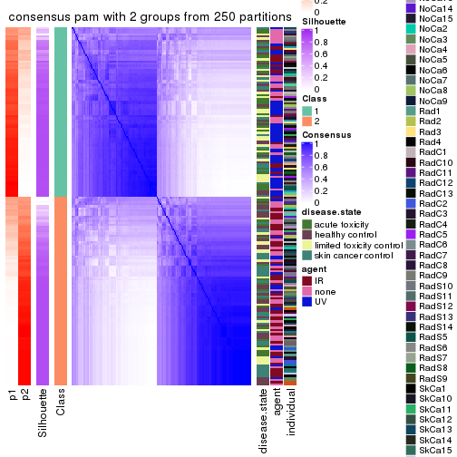</p>

</div>
<div id='tab-CV-pam-consensus-heatmap-2'>
<pre><code class="r">consensus_heatmap(res, k = 3)
</code></pre>

<p>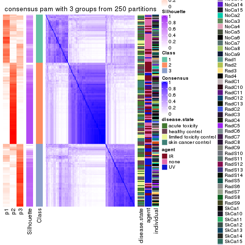</p>

</div>
<div id='tab-CV-pam-consensus-heatmap-3'>
<pre><code class="r">consensus_heatmap(res, k = 4)
</code></pre>

<p>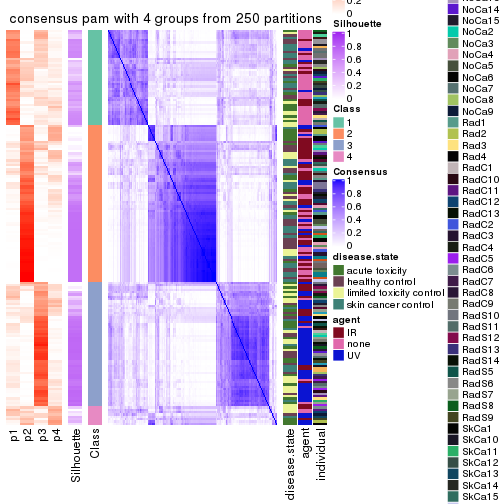</p>

</div>
<div id='tab-CV-pam-consensus-heatmap-4'>
<pre><code class="r">consensus_heatmap(res, k = 5)
</code></pre>

<p>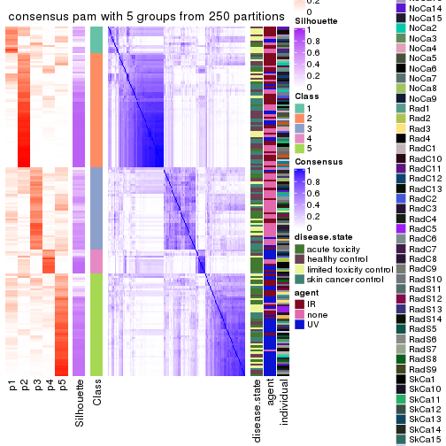</p>

</div>
<div id='tab-CV-pam-consensus-heatmap-5'>
<pre><code class="r">consensus_heatmap(res, k = 6)
</code></pre>

<p>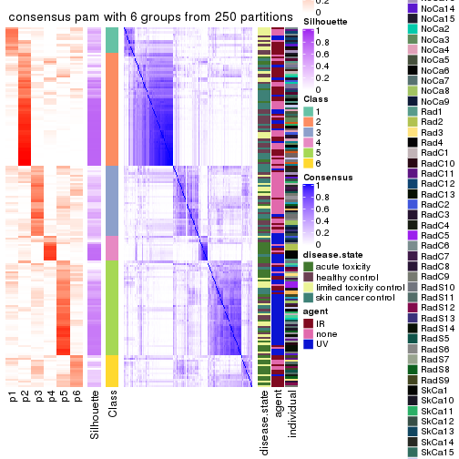</p>

</div>
</div>

Heatmaps for the membership of samples in all partitions to see how consistent they are:


<script>
$( function() {
	$( '#tabs-CV-pam-membership-heatmap' ).tabs();
} );
</script>
<div id='tabs-CV-pam-membership-heatmap'>
<ul>
<li><a href='#tab-CV-pam-membership-heatmap-1'>k = 2</a></li>
<li><a href='#tab-CV-pam-membership-heatmap-2'>k = 3</a></li>
<li><a href='#tab-CV-pam-membership-heatmap-3'>k = 4</a></li>
<li><a href='#tab-CV-pam-membership-heatmap-4'>k = 5</a></li>
<li><a href='#tab-CV-pam-membership-heatmap-5'>k = 6</a></li>
</ul>
<div id='tab-CV-pam-membership-heatmap-1'>
<pre><code class="r">membership_heatmap(res, k = 2)
</code></pre>

<p>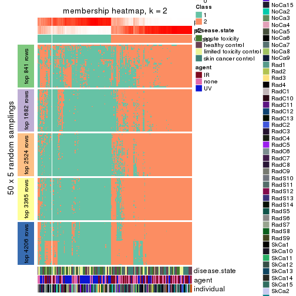</p>

</div>
<div id='tab-CV-pam-membership-heatmap-2'>
<pre><code class="r">membership_heatmap(res, k = 3)
</code></pre>

<p>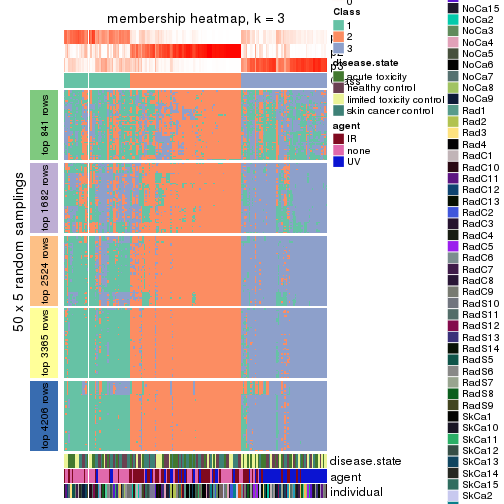</p>

</div>
<div id='tab-CV-pam-membership-heatmap-3'>
<pre><code class="r">membership_heatmap(res, k = 4)
</code></pre>

<p>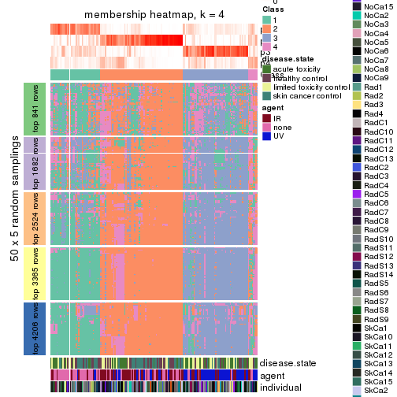</p>

</div>
<div id='tab-CV-pam-membership-heatmap-4'>
<pre><code class="r">membership_heatmap(res, k = 5)
</code></pre>

<p>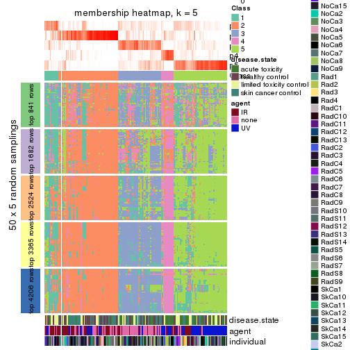</p>

</div>
<div id='tab-CV-pam-membership-heatmap-5'>
<pre><code class="r">membership_heatmap(res, k = 6)
</code></pre>

<p>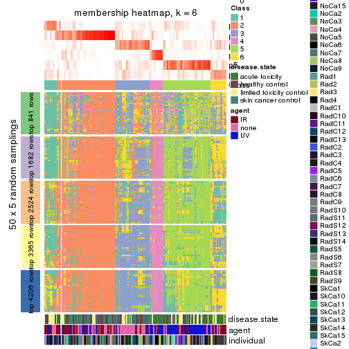</p>

</div>
</div>

As soon as we have had the classes for columns, we can look for signatures
which are significantly different between classes which can be candidate marks
for certain classes. Following are the heatmaps for signatures.


Signature heatmaps where rows are scaled:


<script>
$( function() {
	$( '#tabs-CV-pam-get-signatures' ).tabs();
} );
</script>
<div id='tabs-CV-pam-get-signatures'>
<ul>
<li><a href='#tab-CV-pam-get-signatures-1'>k = 2</a></li>
<li><a href='#tab-CV-pam-get-signatures-2'>k = 3</a></li>
<li><a href='#tab-CV-pam-get-signatures-3'>k = 4</a></li>
<li><a href='#tab-CV-pam-get-signatures-4'>k = 5</a></li>
<li><a href='#tab-CV-pam-get-signatures-5'>k = 6</a></li>
</ul>
<div id='tab-CV-pam-get-signatures-1'>
<pre><code class="r">get_signatures(res, k = 2)
</code></pre>

<p>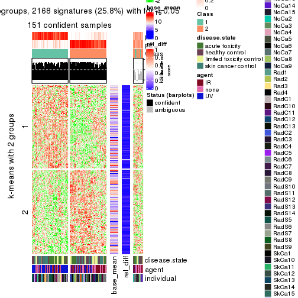</p>

</div>
<div id='tab-CV-pam-get-signatures-2'>
<pre><code class="r">get_signatures(res, k = 3)
</code></pre>

<p>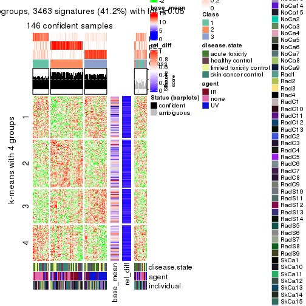</p>

</div>
<div id='tab-CV-pam-get-signatures-3'>
<pre><code class="r">get_signatures(res, k = 4)
</code></pre>

<p>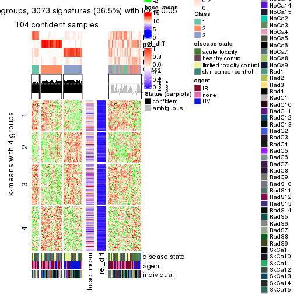</p>

</div>
<div id='tab-CV-pam-get-signatures-4'>
<pre><code class="r">get_signatures(res, k = 5)
</code></pre>

<p>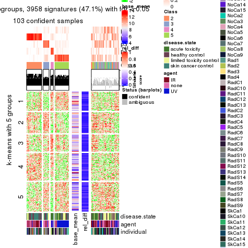</p>

</div>
<div id='tab-CV-pam-get-signatures-5'>
<pre><code class="r">get_signatures(res, k = 6)
</code></pre>

<p>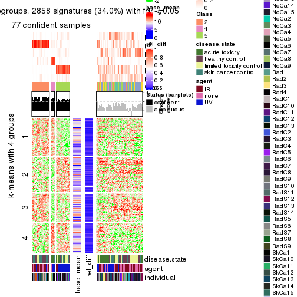</p>

</div>
</div>


Signature heatmaps where rows are not scaled:


<script>
$( function() {
	$( '#tabs-CV-pam-get-signatures-no-scale' ).tabs();
} );
</script>
<div id='tabs-CV-pam-get-signatures-no-scale'>
<ul>
<li><a href='#tab-CV-pam-get-signatures-no-scale-1'>k = 2</a></li>
<li><a href='#tab-CV-pam-get-signatures-no-scale-2'>k = 3</a></li>
<li><a href='#tab-CV-pam-get-signatures-no-scale-3'>k = 4</a></li>
<li><a href='#tab-CV-pam-get-signatures-no-scale-4'>k = 5</a></li>
<li><a href='#tab-CV-pam-get-signatures-no-scale-5'>k = 6</a></li>
</ul>
<div id='tab-CV-pam-get-signatures-no-scale-1'>
<pre><code class="r">get_signatures(res, k = 2, scale_rows = FALSE)
</code></pre>

<p>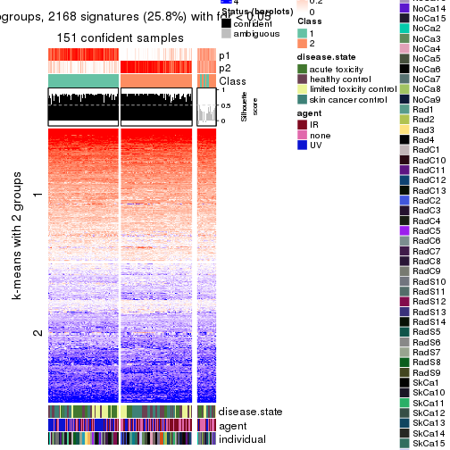</p>

</div>
<div id='tab-CV-pam-get-signatures-no-scale-2'>
<pre><code class="r">get_signatures(res, k = 3, scale_rows = FALSE)
</code></pre>

<p>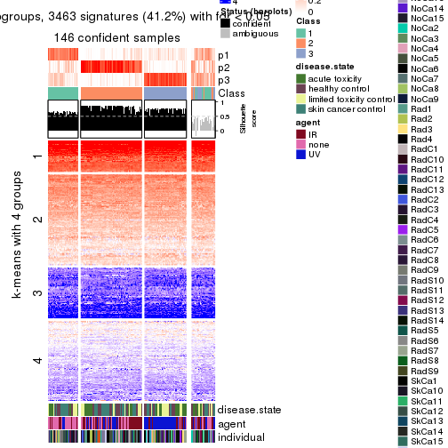</p>

</div>
<div id='tab-CV-pam-get-signatures-no-scale-3'>
<pre><code class="r">get_signatures(res, k = 4, scale_rows = FALSE)
</code></pre>

<p>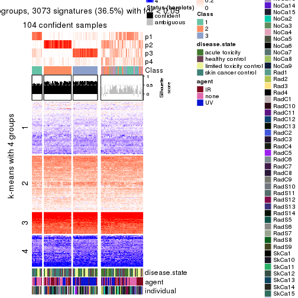</p>

</div>
<div id='tab-CV-pam-get-signatures-no-scale-4'>
<pre><code class="r">get_signatures(res, k = 5, scale_rows = FALSE)
</code></pre>

<p>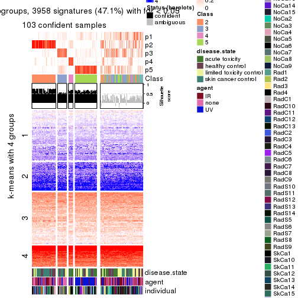</p>

</div>
<div id='tab-CV-pam-get-signatures-no-scale-5'>
<pre><code class="r">get_signatures(res, k = 6, scale_rows = FALSE)
</code></pre>

<p>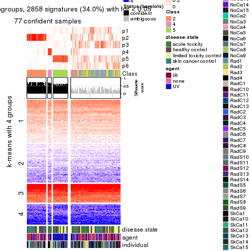</p>

</div>
</div>


Compare the overlap of signatures from different k:

```r
compare_signatures(res)
```

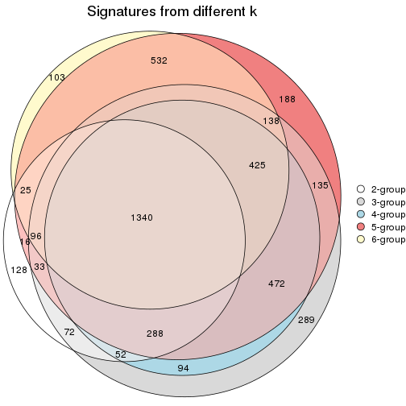

`get_signature()` returns a data frame invisibly. TO get the list of signatures, the function
call should be assigned to a variable explicitly. In following code, if `plot` argument is set
to `FALSE`, no heatmap is plotted while only the differential analysis is performed.

```r
# code only for demonstration
tb = get_signature(res, k = ..., plot = FALSE)
```

An example of the output of `tb` is:

```
#>   which_row         fdr    mean_1    mean_2 scaled_mean_1 scaled_mean_2 km
#> 1        38 0.042760348  8.373488  9.131774    -0.5533452     0.5164555  1
#> 2        40 0.018707592  7.106213  8.469186    -0.6173731     0.5762149  1
#> 3        55 0.019134737 10.221463 11.207825    -0.6159697     0.5749050  1
#> 4        59 0.006059896  5.921854  7.869574    -0.6899429     0.6439467  1
#> 5        60 0.018055526  8.928898 10.211722    -0.6204761     0.5791110  1
#> 6        98 0.009384629 15.714769 14.887706     0.6635654    -0.6193277  2
...
```

The columns in `tb` are:

1. `which_row`: row indices corresponding to the input matrix.
2. `fdr`: FDR for the differential test. 
3. `mean_x`: The mean value in group x.
4. `scaled_mean_x`: The mean value in group x after rows are scaled.
5. `km`: Row groups if k-means clustering is applied to rows.


UMAP plot which shows how samples are separated.


<script>
$( function() {
	$( '#tabs-CV-pam-dimension-reduction' ).tabs();
} );
</script>
<div id='tabs-CV-pam-dimension-reduction'>
<ul>
<li><a href='#tab-CV-pam-dimension-reduction-1'>k = 2</a></li>
<li><a href='#tab-CV-pam-dimension-reduction-2'>k = 3</a></li>
<li><a href='#tab-CV-pam-dimension-reduction-3'>k = 4</a></li>
<li><a href='#tab-CV-pam-dimension-reduction-4'>k = 5</a></li>
<li><a href='#tab-CV-pam-dimension-reduction-5'>k = 6</a></li>
</ul>
<div id='tab-CV-pam-dimension-reduction-1'>
<pre><code class="r">dimension_reduction(res, k = 2, method = &quot;UMAP&quot;)
</code></pre>

<p>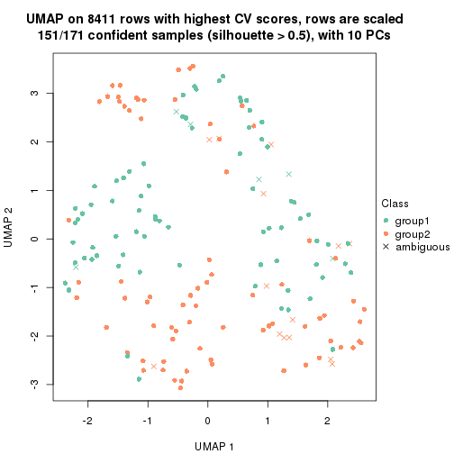</p>

</div>
<div id='tab-CV-pam-dimension-reduction-2'>
<pre><code class="r">dimension_reduction(res, k = 3, method = &quot;UMAP&quot;)
</code></pre>

<p>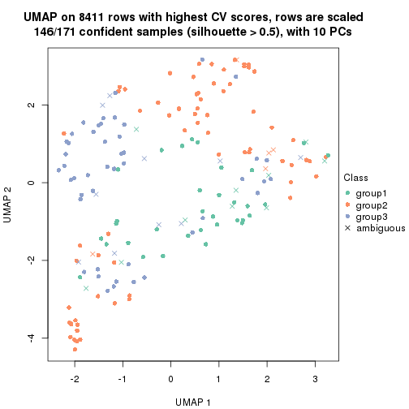</p>

</div>
<div id='tab-CV-pam-dimension-reduction-3'>
<pre><code class="r">dimension_reduction(res, k = 4, method = &quot;UMAP&quot;)
</code></pre>

<p>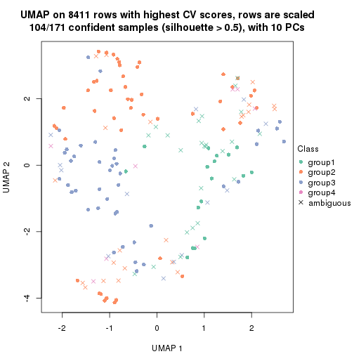</p>

</div>
<div id='tab-CV-pam-dimension-reduction-4'>
<pre><code class="r">dimension_reduction(res, k = 5, method = &quot;UMAP&quot;)
</code></pre>

<p>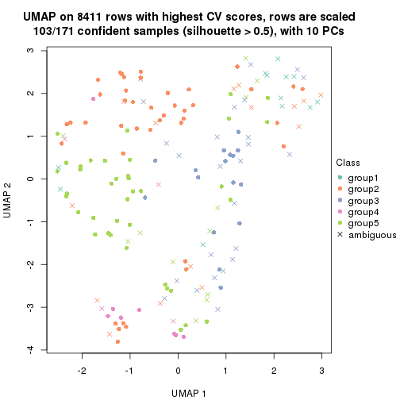</p>

</div>
<div id='tab-CV-pam-dimension-reduction-5'>
<pre><code class="r">dimension_reduction(res, k = 6, method = &quot;UMAP&quot;)
</code></pre>

<p>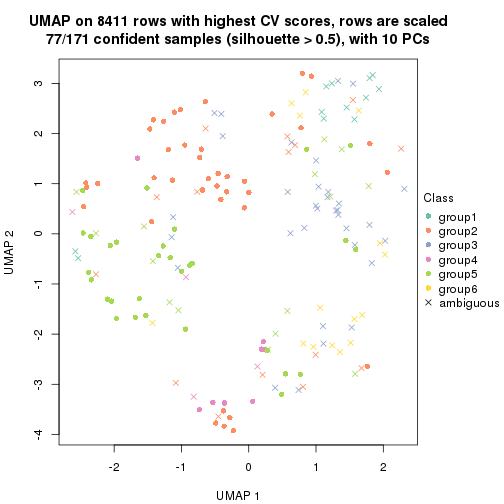</p>

</div>
</div>


Following heatmap shows how subgroups are split when increasing `k`:

```r
collect_classes(res)
```

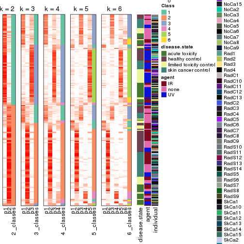


Test correlation between subgroups and known annotations. If the known
annotation is numeric, one-way ANOVA test is applied, and if the known
annotation is discrete, chi-squared contingency table test is applied.

```r
test_to_known_factors(res)
```

```
#>          n disease.state(p) agent(p) individual(p) k
#> CV:pam 151         7.81e-02 1.75e-05      0.000184 2
#> CV:pam 146         2.90e-01 3.56e-14      0.004273 3
#> CV:pam 104         2.81e-02 6.92e-10      0.007809 4
#> CV:pam 103         1.33e-05 4.51e-09      0.000133 5
#> CV:pam  77         8.54e-07 4.76e-07      0.001583 6
```


If matrix rows can be associated to genes, consider to use `functional_enrichment(res,
...)` to perform function enrichment for the signature genes. See [this vignette](http://bioconductor.org/packages/devel/bioc/vignettes/cola/inst/doc/functional_enrichment.html) for more detailed explanations.


 

---------------------------------------------------


### CV:mclust


The object with results only for a single top-value method and a single partition method 
can be extracted as:

```r
res = res_list["CV", "mclust"]
# you can also extract it by
# res = res_list["CV:mclust"]
```

A summary of `res` and all the functions that can be applied to it:

```r
res
```

```
#> A 'ConsensusPartition' object with k = 2, 3, 4, 5, 6.
#>   On a matrix with 8411 rows and 171 columns.
#>   Top rows (841, 1682, 2524, 3365, 4206) are extracted by 'CV' method.
#>   Subgroups are detected by 'mclust' method.
#>   Performed in total 1250 partitions by row resampling.
#>   Best k for subgroups seems to be 2.
#> 
#> Following methods can be applied to this 'ConsensusPartition' object:
#>  [1] "cola_report"             "collect_classes"         "collect_plots"          
#>  [4] "collect_stats"           "colnames"                "compare_signatures"     
#>  [7] "consensus_heatmap"       "dimension_reduction"     "functional_enrichment"  
#> [10] "get_anno_col"            "get_anno"                "get_classes"            
#> [13] "get_consensus"           "get_matrix"              "get_membership"         
#> [16] "get_param"               "get_signatures"          "get_stats"              
#> [19] "is_best_k"               "is_stable_k"             "membership_heatmap"     
#> [22] "ncol"                    "nrow"                    "plot_ecdf"              
#> [25] "rownames"                "select_partition_number" "show"                   
#> [28] "suggest_best_k"          "test_to_known_factors"
```

`collect_plots()` function collects all the plots made from `res` for all `k` (number of partitions)
into one single page to provide an easy and fast comparison between different `k`.

```r
collect_plots(res)
```

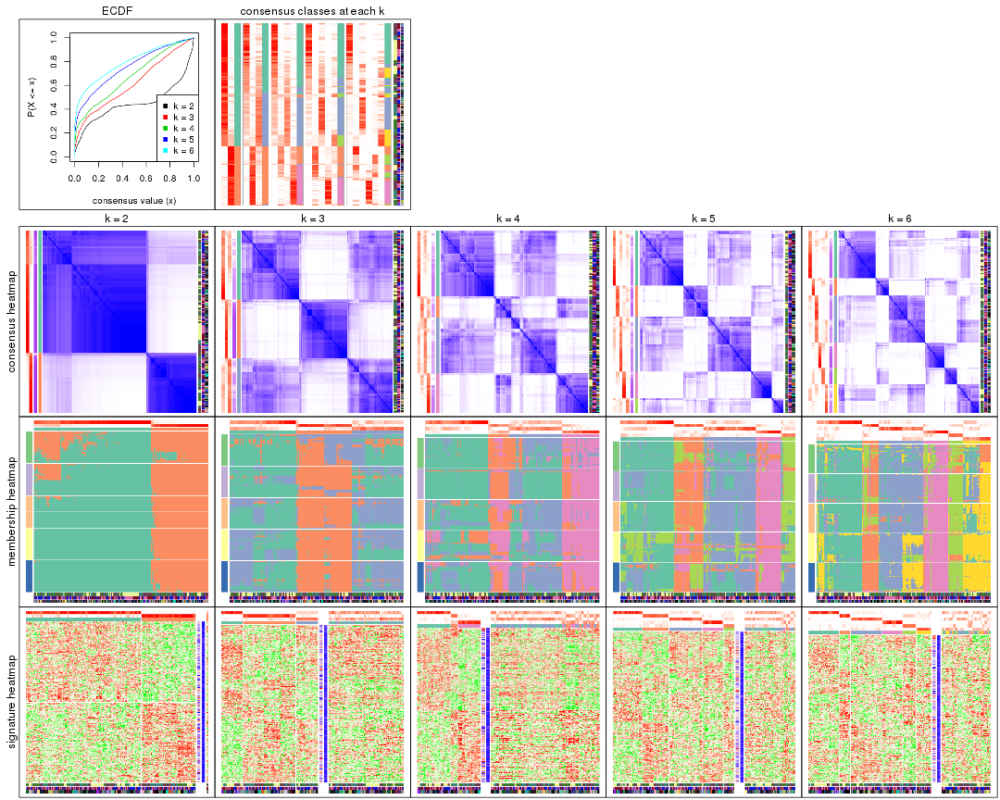

The plots are:

- The first row: a plot of the ECDF (empirical cumulative distribution
  function) curves of the consensus matrix for each `k` and the heatmap of
  predicted classes for each `k`.
- The second row: heatmaps of the consensus matrix for each `k`.
- The third row: heatmaps of the membership matrix for each `k`.
- The fouth row: heatmaps of the signatures for each `k`.

All the plots in panels can be made by individual functions and they are
plotted later in this section.

`select_partition_number()` produces several plots showing different
statistics for choosing "optimized" `k`. There are following statistics:

- ECDF curves of the consensus matrix for each `k`;
- 1-PAC. [The PAC
  score](https://en.wikipedia.org/wiki/Consensus_clustering#Over-interpretation_potential_of_consensus_clustering)
  measures the proportion of the ambiguous subgrouping.
- Mean silhouette score.
- Concordance. The mean probability of fiting the consensus class ids in all
  partitions.
- Area increased. Denote $A_k$ as the area under the ECDF curve for current
  `k`, the area increased is defined as $A_k - A_{k-1}$.
- Rand index. The percent of pairs of samples that are both in a same cluster
  or both are not in a same cluster in the partition of k and k-1.
- Jaccard index. The ratio of pairs of samples are both in a same cluster in
  the partition of k and k-1 and the pairs of samples are both in a same
  cluster in the partition k or k-1.

The detailed explanations of these statistics can be found in [the _cola_
vignette](http://bioconductor.org/packages/devel/bioc/vignettes/cola/inst/doc/cola.html#toc_13).

Generally speaking, lower PAC score, higher mean silhouette score or higher
concordance corresponds to better partition. Rand index and Jaccard index
measure how similar the current partition is compared to partition with `k-1`.
If they are too similar, we won't accept `k` is better than `k-1`.

```r
select_partition_number(res)
```

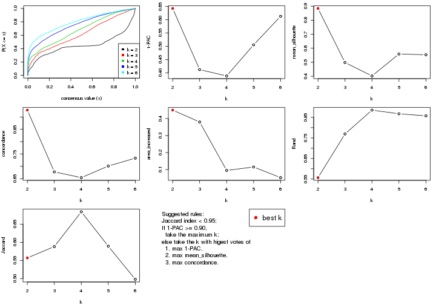

The numeric values for all these statistics can be obtained by `get_stats()`.

```r
get_stats(res)
```

```
#>   k 1-PAC mean_silhouette concordance area_increased  Rand Jaccard
#> 2 2 0.642           0.884       0.928         0.4496 0.557   0.557
#> 3 3 0.412           0.498       0.678         0.3796 0.769   0.588
#> 4 4 0.388           0.402       0.654         0.0949 0.885   0.684
#> 5 5 0.505           0.559       0.701         0.1150 0.867   0.589
#> 6 6 0.613           0.553       0.733         0.0524 0.857   0.498
```

`suggest_best_k()` suggests the best $k$ based on these statistics. The rules are as follows:

- All $k$ with Jaccard index larger than 0.95 are removed because increasing
  $k$ does not provide enough extra information. If all $k$ are removed, it is
  marked as no subgroup is detected.
- For all $k$ with 1-PAC score larger than 0.9, the maximal $k$ is taken as
  the best $k$, and other $k$ are marked as optional $k$.
- If it does not fit the second rule. The $k$ with the maximal vote of the
  highest 1-PAC score, highest mean silhouette, and highest concordance is
  taken as the best $k$.

```r
suggest_best_k(res)
```

```
#> [1] 2
```


Following shows the table of the partitions (You need to click the **show/hide
code output** link to see it). The membership matrix (columns with name `p*`)
is inferred by
[`clue::cl_consensus()`](https://www.rdocumentation.org/link/cl_consensus?package=clue)
function with the `SE` method. Basically the value in the membership matrix
represents the probability to belong to a certain group. The finall class
label for an item is determined with the group with highest probability it
belongs to.

In `get_classes()` function, the entropy is calculated from the membership
matrix and the silhouette score is calculated from the consensus matrix.


<script>
$( function() {
	$( '#tabs-CV-mclust-get-classes' ).tabs();
} );
</script>
<div id='tabs-CV-mclust-get-classes'>
<ul>
<li><a href='#tab-CV-mclust-get-classes-1'>k = 2</a></li>
<li><a href='#tab-CV-mclust-get-classes-2'>k = 3</a></li>
<li><a href='#tab-CV-mclust-get-classes-3'>k = 4</a></li>
<li><a href='#tab-CV-mclust-get-classes-4'>k = 5</a></li>
<li><a href='#tab-CV-mclust-get-classes-5'>k = 6</a></li>
</ul>

<div id='tab-CV-mclust-get-classes-1'>
<p><a id='tab-CV-mclust-get-classes-1-a' style='color:#0366d6' href='#'>show/hide code output</a></p>
<pre><code class="r">cbind(get_classes(res, k = 2), get_membership(res, k = 2))
</code></pre>

<pre><code>#&gt;          class entropy silhouette    p1    p2
#&gt; GSM29783     2  0.2603      0.940 0.044 0.956
#&gt; GSM29786     2  0.3114      0.935 0.056 0.944
#&gt; GSM29789     2  0.0672      0.949 0.008 0.992
#&gt; GSM29792     2  0.0000      0.947 0.000 1.000
#&gt; GSM29795     2  0.9833      0.188 0.424 0.576
#&gt; GSM29798     2  0.3114      0.935 0.056 0.944
#&gt; GSM29801     1  0.2236      0.916 0.964 0.036
#&gt; GSM29804     1  0.1184      0.916 0.984 0.016
#&gt; GSM29807     1  0.9000      0.689 0.684 0.316
#&gt; GSM29816     1  0.0000      0.913 1.000 0.000
#&gt; GSM29821     1  0.0938      0.915 0.988 0.012
#&gt; GSM29824     1  0.0376      0.914 0.996 0.004
#&gt; GSM29827     1  0.0000      0.913 1.000 0.000
#&gt; GSM29830     1  0.0000      0.913 1.000 0.000
#&gt; GSM29833     1  0.0000      0.913 1.000 0.000
#&gt; GSM29784     2  0.0376      0.948 0.004 0.996
#&gt; GSM29787     2  0.3114      0.935 0.056 0.944
#&gt; GSM29790     2  0.0000      0.947 0.000 1.000
#&gt; GSM29793     2  0.0000      0.947 0.000 1.000
#&gt; GSM29796     2  0.2948      0.937 0.052 0.948
#&gt; GSM29799     2  0.4815      0.895 0.104 0.896
#&gt; GSM29802     1  0.3114      0.910 0.944 0.056
#&gt; GSM29805     1  0.2043      0.916 0.968 0.032
#&gt; GSM29814     1  0.9000      0.689 0.684 0.316
#&gt; GSM29817     1  0.2778      0.912 0.952 0.048
#&gt; GSM29822     1  0.0672      0.915 0.992 0.008
#&gt; GSM29825     1  0.0000      0.913 1.000 0.000
#&gt; GSM29828     1  0.0000      0.913 1.000 0.000
#&gt; GSM29831     1  0.0000      0.913 1.000 0.000
#&gt; GSM29834     1  0.0376      0.914 0.996 0.004
#&gt; GSM29785     2  0.0672      0.949 0.008 0.992
#&gt; GSM29788     2  0.3114      0.935 0.056 0.944
#&gt; GSM29791     2  0.0000      0.947 0.000 1.000
#&gt; GSM29794     2  0.0000      0.947 0.000 1.000
#&gt; GSM29797     2  0.1633      0.946 0.024 0.976
#&gt; GSM29800     2  0.3114      0.935 0.056 0.944
#&gt; GSM29803     1  0.6048      0.859 0.852 0.148
#&gt; GSM29806     1  0.7674      0.794 0.776 0.224
#&gt; GSM29815     1  0.9358      0.625 0.648 0.352
#&gt; GSM29819     1  0.4298      0.897 0.912 0.088
#&gt; GSM29823     1  0.7883      0.778 0.764 0.236
#&gt; GSM29826     1  0.1633      0.916 0.976 0.024
#&gt; GSM29829     1  0.0376      0.913 0.996 0.004
#&gt; GSM29832     1  0.0000      0.913 1.000 0.000
#&gt; GSM29835     1  0.3114      0.911 0.944 0.056
#&gt; GSM29836     2  0.0000      0.947 0.000 1.000
#&gt; GSM29839     2  0.2043      0.945 0.032 0.968
#&gt; GSM29842     2  0.0938      0.949 0.012 0.988
#&gt; GSM29845     2  0.5178      0.883 0.116 0.884
#&gt; GSM29848     2  0.3584      0.928 0.068 0.932
#&gt; GSM29851     1  0.3584      0.905 0.932 0.068
#&gt; GSM29854     1  0.0938      0.915 0.988 0.012
#&gt; GSM29857     1  0.4562      0.894 0.904 0.096
#&gt; GSM29860     2  0.1843      0.940 0.028 0.972
#&gt; GSM29863     1  0.2236      0.915 0.964 0.036
#&gt; GSM29866     1  0.0000      0.913 1.000 0.000
#&gt; GSM29869     1  0.1843      0.914 0.972 0.028
#&gt; GSM29872     1  0.8813      0.713 0.700 0.300
#&gt; GSM29875     1  0.0376      0.914 0.996 0.004
#&gt; GSM29878     1  0.8661      0.717 0.712 0.288
#&gt; GSM29837     2  0.1184      0.945 0.016 0.984
#&gt; GSM29840     2  0.0938      0.948 0.012 0.988
#&gt; GSM29843     2  0.0672      0.949 0.008 0.992
#&gt; GSM29846     2  0.4562      0.902 0.096 0.904
#&gt; GSM29849     2  0.4690      0.900 0.100 0.900
#&gt; GSM29852     1  0.2236      0.915 0.964 0.036
#&gt; GSM29855     1  0.4161      0.899 0.916 0.084
#&gt; GSM29858     1  0.4161      0.899 0.916 0.084
#&gt; GSM29861     2  0.3879      0.902 0.076 0.924
#&gt; GSM29864     1  0.3584      0.906 0.932 0.068
#&gt; GSM29867     1  0.0000      0.913 1.000 0.000
#&gt; GSM29870     1  0.0000      0.913 1.000 0.000
#&gt; GSM29873     1  0.8661      0.729 0.712 0.288
#&gt; GSM29876     1  0.1184      0.916 0.984 0.016
#&gt; GSM29879     1  0.3879      0.903 0.924 0.076
#&gt; GSM29838     2  0.0000      0.947 0.000 1.000
#&gt; GSM29841     2  0.0376      0.948 0.004 0.996
#&gt; GSM29844     2  0.0376      0.948 0.004 0.996
#&gt; GSM29847     2  0.3114      0.935 0.056 0.944
#&gt; GSM29850     2  0.3114      0.935 0.056 0.944
#&gt; GSM29853     1  0.3584      0.906 0.932 0.068
#&gt; GSM29856     1  0.7056      0.819 0.808 0.192
#&gt; GSM29859     1  0.8144      0.761 0.748 0.252
#&gt; GSM29862     2  0.0672      0.947 0.008 0.992
#&gt; GSM29865     1  0.7602      0.795 0.780 0.220
#&gt; GSM29868     1  0.1414      0.916 0.980 0.020
#&gt; GSM29871     1  0.8327      0.755 0.736 0.264
#&gt; GSM29874     1  0.9358      0.625 0.648 0.352
#&gt; GSM29877     1  0.0000      0.913 1.000 0.000
#&gt; GSM29880     2  0.1184      0.946 0.016 0.984
#&gt; GSM29881     1  0.2778      0.913 0.952 0.048
#&gt; GSM29884     2  0.0000      0.947 0.000 1.000
#&gt; GSM29887     2  0.0376      0.948 0.004 0.996
#&gt; GSM29890     1  0.0000      0.913 1.000 0.000
#&gt; GSM29893     1  0.1633      0.916 0.976 0.024
#&gt; GSM29896     1  0.0000      0.913 1.000 0.000
#&gt; GSM29899     1  0.0000      0.913 1.000 0.000
#&gt; GSM29902     1  0.0672      0.914 0.992 0.008
#&gt; GSM29905     1  0.1184      0.916 0.984 0.016
#&gt; GSM29908     1  0.0000      0.913 1.000 0.000
#&gt; GSM29955     1  0.0376      0.913 0.996 0.004
#&gt; GSM29958     1  0.0000      0.913 1.000 0.000
#&gt; GSM29961     1  0.0000      0.913 1.000 0.000
#&gt; GSM29882     1  0.2603      0.913 0.956 0.044
#&gt; GSM29885     2  0.0376      0.948 0.004 0.996
#&gt; GSM29888     2  0.0000      0.947 0.000 1.000
#&gt; GSM29891     1  0.0000      0.913 1.000 0.000
#&gt; GSM29894     1  0.0000      0.913 1.000 0.000
#&gt; GSM29897     1  0.0000      0.913 1.000 0.000
#&gt; GSM29900     1  0.0000      0.913 1.000 0.000
#&gt; GSM29903     1  0.0376      0.913 0.996 0.004
#&gt; GSM29906     1  0.0000      0.913 1.000 0.000
#&gt; GSM29909     1  0.2948      0.911 0.948 0.052
#&gt; GSM29956     1  0.0000      0.913 1.000 0.000
#&gt; GSM29959     1  0.0000      0.913 1.000 0.000
#&gt; GSM29962     1  0.0000      0.913 1.000 0.000
#&gt; GSM29883     1  0.1843      0.916 0.972 0.028
#&gt; GSM29886     2  0.0000      0.947 0.000 1.000
#&gt; GSM29889     2  0.0000      0.947 0.000 1.000
#&gt; GSM29892     1  0.0000      0.913 1.000 0.000
#&gt; GSM29895     1  0.6887      0.831 0.816 0.184
#&gt; GSM29898     1  0.0000      0.913 1.000 0.000
#&gt; GSM29901     1  0.0376      0.914 0.996 0.004
#&gt; GSM29904     1  0.2043      0.915 0.968 0.032
#&gt; GSM29907     1  0.0938      0.916 0.988 0.012
#&gt; GSM29910     1  0.3274      0.910 0.940 0.060
#&gt; GSM29957     1  0.8081      0.768 0.752 0.248
#&gt; GSM29960     1  0.2603      0.913 0.956 0.044
#&gt; GSM29963     1  0.4431      0.896 0.908 0.092
#&gt; GSM29964     2  0.0000      0.947 0.000 1.000
#&gt; GSM29967     2  0.2603      0.941 0.044 0.956
#&gt; GSM29970     1  0.5519      0.873 0.872 0.128
#&gt; GSM29973     2  0.0000      0.947 0.000 1.000
#&gt; GSM29976     1  0.0000      0.913 1.000 0.000
#&gt; GSM29979     1  0.9000      0.689 0.684 0.316
#&gt; GSM29982     2  0.9608      0.318 0.384 0.616
#&gt; GSM29985     1  0.1414      0.916 0.980 0.020
#&gt; GSM29988     1  0.8861      0.707 0.696 0.304
#&gt; GSM29991     1  0.6438      0.835 0.836 0.164
#&gt; GSM29994     1  0.1843      0.916 0.972 0.028
#&gt; GSM29997     1  0.6887      0.837 0.816 0.184
#&gt; GSM30000     1  0.3733      0.903 0.928 0.072
#&gt; GSM30003     1  0.2778      0.912 0.952 0.048
#&gt; GSM29965     2  0.0000      0.947 0.000 1.000
#&gt; GSM29968     2  0.2603      0.941 0.044 0.956
#&gt; GSM29971     1  0.5294      0.878 0.880 0.120
#&gt; GSM29974     2  0.1184      0.945 0.016 0.984
#&gt; GSM29977     1  0.0000      0.913 1.000 0.000
#&gt; GSM29980     1  0.8909      0.701 0.692 0.308
#&gt; GSM29983     1  0.7139      0.821 0.804 0.196
#&gt; GSM29986     1  0.2236      0.915 0.964 0.036
#&gt; GSM29989     1  0.8713      0.725 0.708 0.292
#&gt; GSM29992     1  0.5178      0.883 0.884 0.116
#&gt; GSM29995     1  0.0376      0.913 0.996 0.004
#&gt; GSM29998     1  0.7883      0.786 0.764 0.236
#&gt; GSM30001     1  0.4161      0.901 0.916 0.084
#&gt; GSM30004     1  0.1633      0.916 0.976 0.024
#&gt; GSM29966     2  0.0000      0.947 0.000 1.000
#&gt; GSM29969     2  0.2603      0.941 0.044 0.956
#&gt; GSM29972     1  0.7376      0.810 0.792 0.208
#&gt; GSM29975     2  0.0000      0.947 0.000 1.000
#&gt; GSM29978     1  0.0376      0.914 0.996 0.004
#&gt; GSM29981     2  0.7139      0.724 0.196 0.804
#&gt; GSM29984     2  0.3879      0.922 0.076 0.924
#&gt; GSM29987     1  0.5408      0.876 0.876 0.124
#&gt; GSM29990     1  0.8861      0.707 0.696 0.304
#&gt; GSM29993     2  0.6048      0.845 0.148 0.852
#&gt; GSM29996     1  0.0672      0.914 0.992 0.008
#&gt; GSM29999     1  0.8713      0.725 0.708 0.292
#&gt; GSM30002     1  0.8661      0.725 0.712 0.288
#&gt; GSM30005     1  0.4431      0.895 0.908 0.092
</code></pre>

<script>
$('#tab-CV-mclust-get-classes-1-a').parent().next().next().hide();
$('#tab-CV-mclust-get-classes-1-a').click(function(){
  $('#tab-CV-mclust-get-classes-1-a').parent().next().next().toggle();
  return(false);
});
</script>
</div>

<div id='tab-CV-mclust-get-classes-2'>
<p><a id='tab-CV-mclust-get-classes-2-a' style='color:#0366d6' href='#'>show/hide code output</a></p>
<pre><code class="r">cbind(get_classes(res, k = 3), get_membership(res, k = 3))
</code></pre>

<pre><code>#&gt;          class entropy silhouette    p1    p2    p3
#&gt; GSM29783     2  0.1636   0.871160 0.016 0.964 0.020
#&gt; GSM29786     2  0.2066   0.861197 0.000 0.940 0.060
#&gt; GSM29789     2  0.3425   0.871141 0.004 0.884 0.112
#&gt; GSM29792     2  0.3879   0.861804 0.000 0.848 0.152
#&gt; GSM29795     2  0.9948  -0.320059 0.304 0.384 0.312
#&gt; GSM29798     2  0.2066   0.861197 0.000 0.940 0.060
#&gt; GSM29801     1  0.6800   0.197040 0.660 0.032 0.308
#&gt; GSM29804     1  0.6309   0.070467 0.504 0.000 0.496
#&gt; GSM29807     3  0.6012   0.375608 0.088 0.124 0.788
#&gt; GSM29816     3  0.6062   0.370125 0.384 0.000 0.616
#&gt; GSM29821     1  0.7140   0.161621 0.632 0.040 0.328
#&gt; GSM29824     1  0.6111   0.324229 0.604 0.000 0.396
#&gt; GSM29827     1  0.0592   0.530560 0.988 0.000 0.012
#&gt; GSM29830     1  0.0237   0.526438 0.996 0.000 0.004
#&gt; GSM29833     1  0.5420   0.314560 0.752 0.008 0.240
#&gt; GSM29784     2  0.1129   0.874222 0.004 0.976 0.020
#&gt; GSM29787     2  0.2066   0.861197 0.000 0.940 0.060
#&gt; GSM29790     2  0.3482   0.867821 0.000 0.872 0.128
#&gt; GSM29793     2  0.3816   0.863099 0.000 0.852 0.148
#&gt; GSM29796     2  0.1647   0.867747 0.004 0.960 0.036
#&gt; GSM29799     2  0.1860   0.863182 0.000 0.948 0.052
#&gt; GSM29802     3  0.6193   0.516999 0.292 0.016 0.692
#&gt; GSM29805     1  0.6095   0.316267 0.608 0.000 0.392
#&gt; GSM29814     3  0.4725   0.404021 0.060 0.088 0.852
#&gt; GSM29817     1  0.7945   0.000366 0.548 0.064 0.388
#&gt; GSM29822     3  0.7392   0.185492 0.468 0.032 0.500
#&gt; GSM29825     1  0.5363   0.453172 0.724 0.000 0.276
#&gt; GSM29828     1  0.1289   0.536212 0.968 0.000 0.032
#&gt; GSM29831     1  0.1964   0.539708 0.944 0.000 0.056
#&gt; GSM29834     1  0.3607   0.461825 0.880 0.008 0.112
#&gt; GSM29785     2  0.2356   0.875476 0.000 0.928 0.072
#&gt; GSM29788     2  0.1964   0.862272 0.000 0.944 0.056
#&gt; GSM29791     2  0.3192   0.872049 0.000 0.888 0.112
#&gt; GSM29794     2  0.3816   0.863049 0.000 0.852 0.148
#&gt; GSM29797     2  0.1765   0.873379 0.004 0.956 0.040
#&gt; GSM29800     2  0.2066   0.861197 0.000 0.940 0.060
#&gt; GSM29803     3  0.7360   0.555335 0.212 0.096 0.692
#&gt; GSM29806     3  0.6976   0.562262 0.236 0.064 0.700
#&gt; GSM29815     3  0.6066   0.304938 0.024 0.248 0.728
#&gt; GSM29819     3  0.6341   0.555622 0.252 0.032 0.716
#&gt; GSM29823     1  0.9735  -0.055460 0.440 0.244 0.316
#&gt; GSM29826     1  0.6825   0.110927 0.500 0.012 0.488
#&gt; GSM29829     1  0.2527   0.538366 0.936 0.020 0.044
#&gt; GSM29832     1  0.2527   0.530754 0.936 0.020 0.044
#&gt; GSM29835     1  0.8408   0.108270 0.600 0.128 0.272
#&gt; GSM29836     2  0.3941   0.860437 0.000 0.844 0.156
#&gt; GSM29839     2  0.2031   0.867640 0.032 0.952 0.016
#&gt; GSM29842     2  0.2116   0.876776 0.012 0.948 0.040
#&gt; GSM29845     2  0.2866   0.848543 0.008 0.916 0.076
#&gt; GSM29848     2  0.1964   0.862722 0.000 0.944 0.056
#&gt; GSM29851     3  0.6950   0.172574 0.476 0.016 0.508
#&gt; GSM29854     3  0.5560   0.487343 0.300 0.000 0.700
#&gt; GSM29857     3  0.6596   0.553939 0.256 0.040 0.704
#&gt; GSM29860     2  0.7576   0.726307 0.076 0.648 0.276
#&gt; GSM29863     3  0.6398   0.319028 0.416 0.004 0.580
#&gt; GSM29866     1  0.2625   0.539865 0.916 0.000 0.084
#&gt; GSM29869     1  0.4802   0.504885 0.824 0.020 0.156
#&gt; GSM29872     3  0.8906   0.123325 0.344 0.136 0.520
#&gt; GSM29875     1  0.5292   0.481779 0.764 0.008 0.228
#&gt; GSM29878     1  0.9400  -0.031830 0.508 0.228 0.264
#&gt; GSM29837     2  0.5760   0.733559 0.000 0.672 0.328
#&gt; GSM29840     2  0.0475   0.872326 0.004 0.992 0.004
#&gt; GSM29843     2  0.0829   0.873629 0.004 0.984 0.012
#&gt; GSM29846     2  0.1860   0.863142 0.000 0.948 0.052
#&gt; GSM29849     2  0.2066   0.861197 0.000 0.940 0.060
#&gt; GSM29852     3  0.7174   0.210599 0.460 0.024 0.516
#&gt; GSM29855     3  0.6026   0.548690 0.244 0.024 0.732
#&gt; GSM29858     3  0.6224   0.514264 0.296 0.016 0.688
#&gt; GSM29861     2  0.8297   0.604323 0.092 0.560 0.348
#&gt; GSM29864     3  0.7287   0.341270 0.408 0.032 0.560
#&gt; GSM29867     1  0.5178   0.462244 0.744 0.000 0.256
#&gt; GSM29870     1  0.4842   0.471454 0.776 0.000 0.224
#&gt; GSM29873     3  0.7748   0.297186 0.252 0.096 0.652
#&gt; GSM29876     3  0.7143   0.360998 0.396 0.028 0.576
#&gt; GSM29879     1  0.7974   0.113125 0.604 0.084 0.312
#&gt; GSM29838     2  0.4702   0.836892 0.000 0.788 0.212
#&gt; GSM29841     2  0.1129   0.875033 0.004 0.976 0.020
#&gt; GSM29844     2  0.1860   0.876123 0.000 0.948 0.052
#&gt; GSM29847     2  0.1753   0.863901 0.000 0.952 0.048
#&gt; GSM29850     2  0.1964   0.862722 0.000 0.944 0.056
#&gt; GSM29853     3  0.7571   0.206255 0.452 0.040 0.508
#&gt; GSM29856     3  0.8129   0.535814 0.244 0.124 0.632
#&gt; GSM29859     3  0.7199   0.549901 0.204 0.092 0.704
#&gt; GSM29862     2  0.6854   0.794300 0.068 0.716 0.216
#&gt; GSM29865     3  0.8265   0.503529 0.184 0.180 0.636
#&gt; GSM29868     1  0.7724   0.015526 0.552 0.052 0.396
#&gt; GSM29871     3  0.7222   0.530108 0.220 0.084 0.696
#&gt; GSM29874     3  0.9452   0.044748 0.220 0.284 0.496
#&gt; GSM29877     1  0.6505  -0.053020 0.528 0.004 0.468
#&gt; GSM29880     2  0.7298   0.758784 0.088 0.692 0.220
#&gt; GSM29881     3  0.5698   0.536857 0.252 0.012 0.736
#&gt; GSM29884     2  0.3686   0.865128 0.000 0.860 0.140
#&gt; GSM29887     2  0.3340   0.869485 0.000 0.880 0.120
#&gt; GSM29890     1  0.4178   0.519407 0.828 0.000 0.172
#&gt; GSM29893     1  0.1315   0.524496 0.972 0.008 0.020
#&gt; GSM29896     1  0.3340   0.533163 0.880 0.000 0.120
#&gt; GSM29899     1  0.5291   0.457326 0.732 0.000 0.268
#&gt; GSM29902     1  0.6225   0.262687 0.568 0.000 0.432
#&gt; GSM29905     1  0.6410   0.267199 0.576 0.004 0.420
#&gt; GSM29908     1  0.0000   0.525413 1.000 0.000 0.000
#&gt; GSM29955     1  0.4999   0.510948 0.820 0.028 0.152
#&gt; GSM29958     1  0.0237   0.525249 0.996 0.000 0.004
#&gt; GSM29961     1  0.0000   0.525413 1.000 0.000 0.000
#&gt; GSM29882     3  0.6566   0.450121 0.348 0.016 0.636
#&gt; GSM29885     2  0.2796   0.874058 0.000 0.908 0.092
#&gt; GSM29888     2  0.3686   0.865533 0.000 0.860 0.140
#&gt; GSM29891     1  0.6111   0.316634 0.604 0.000 0.396
#&gt; GSM29894     1  0.0592   0.525329 0.988 0.000 0.012
#&gt; GSM29897     1  0.0892   0.523974 0.980 0.000 0.020
#&gt; GSM29900     1  0.6095   0.325367 0.608 0.000 0.392
#&gt; GSM29903     1  0.5988   0.342121 0.632 0.000 0.368
#&gt; GSM29906     1  0.6204   0.267390 0.576 0.000 0.424
#&gt; GSM29909     3  0.7744   0.257556 0.448 0.048 0.504
#&gt; GSM29956     1  0.0000   0.525413 1.000 0.000 0.000
#&gt; GSM29959     1  0.0237   0.525249 0.996 0.000 0.004
#&gt; GSM29962     1  0.4702   0.448018 0.788 0.000 0.212
#&gt; GSM29883     3  0.5588   0.519746 0.276 0.004 0.720
#&gt; GSM29886     2  0.3267   0.870804 0.000 0.884 0.116
#&gt; GSM29889     2  0.3686   0.865128 0.000 0.860 0.140
#&gt; GSM29892     1  0.6783   0.292085 0.588 0.016 0.396
#&gt; GSM29895     1  0.8727   0.117544 0.588 0.176 0.236
#&gt; GSM29898     1  0.6260   0.244357 0.552 0.000 0.448
#&gt; GSM29901     1  0.6280   0.221080 0.540 0.000 0.460
#&gt; GSM29904     1  0.7807   0.274592 0.596 0.068 0.336
#&gt; GSM29907     1  0.6260   0.240168 0.552 0.000 0.448
#&gt; GSM29910     1  0.6031   0.451932 0.788 0.096 0.116
#&gt; GSM29957     3  0.9606   0.339779 0.340 0.212 0.448
#&gt; GSM29960     1  0.3692   0.514207 0.896 0.056 0.048
#&gt; GSM29963     1  0.8595  -0.048995 0.496 0.100 0.404
#&gt; GSM29964     2  0.4654   0.838907 0.000 0.792 0.208
#&gt; GSM29967     2  0.1964   0.868986 0.000 0.944 0.056
#&gt; GSM29970     3  0.7388   0.334026 0.356 0.044 0.600
#&gt; GSM29973     2  0.4654   0.838907 0.000 0.792 0.208
#&gt; GSM29976     1  0.6309   0.133300 0.504 0.000 0.496
#&gt; GSM29979     3  0.6633   0.346469 0.060 0.212 0.728
#&gt; GSM29982     2  0.9347   0.130923 0.204 0.508 0.288
#&gt; GSM29985     1  0.6678   0.157824 0.512 0.008 0.480
#&gt; GSM29988     3  0.8055   0.202794 0.292 0.096 0.612
#&gt; GSM29991     3  0.7902   0.534884 0.280 0.092 0.628
#&gt; GSM29994     1  0.6608   0.249599 0.560 0.008 0.432
#&gt; GSM29997     1  0.7878   0.230005 0.548 0.060 0.392
#&gt; GSM30000     1  0.7674  -0.027373 0.480 0.044 0.476
#&gt; GSM30003     3  0.5431   0.514111 0.284 0.000 0.716
#&gt; GSM29965     2  0.4750   0.834741 0.000 0.784 0.216
#&gt; GSM29968     2  0.1753   0.864762 0.000 0.952 0.048
#&gt; GSM29971     3  0.6662   0.549250 0.252 0.044 0.704
#&gt; GSM29974     2  0.6228   0.673715 0.004 0.624 0.372
#&gt; GSM29977     3  0.5968   0.350589 0.364 0.000 0.636
#&gt; GSM29980     3  0.6234   0.425258 0.096 0.128 0.776
#&gt; GSM29983     1  0.9532  -0.010016 0.472 0.212 0.316
#&gt; GSM29986     3  0.6337   0.540301 0.264 0.028 0.708
#&gt; GSM29989     3  0.8362   0.116438 0.348 0.096 0.556
#&gt; GSM29992     3  0.7384   0.552320 0.272 0.068 0.660
#&gt; GSM29995     1  0.0000   0.525413 1.000 0.000 0.000
#&gt; GSM29998     1  0.8316   0.119140 0.496 0.080 0.424
#&gt; GSM30001     3  0.6688   0.497177 0.308 0.028 0.664
#&gt; GSM30004     3  0.5956   0.482924 0.324 0.004 0.672
#&gt; GSM29966     2  0.4654   0.838907 0.000 0.792 0.208
#&gt; GSM29969     2  0.2066   0.869672 0.000 0.940 0.060
#&gt; GSM29972     3  0.7849   0.540752 0.248 0.104 0.648
#&gt; GSM29975     2  0.4654   0.838907 0.000 0.792 0.208
#&gt; GSM29978     1  0.6307   0.158633 0.512 0.000 0.488
#&gt; GSM29981     3  0.6786  -0.289182 0.012 0.448 0.540
#&gt; GSM29984     2  0.3845   0.819489 0.012 0.872 0.116
#&gt; GSM29987     3  0.7272   0.558302 0.204 0.096 0.700
#&gt; GSM29990     3  0.8546   0.223102 0.276 0.136 0.588
#&gt; GSM29993     2  0.6979   0.618520 0.140 0.732 0.128
#&gt; GSM29996     1  0.6999   0.411837 0.680 0.052 0.268
#&gt; GSM29999     3  0.8354   0.152537 0.320 0.104 0.576
#&gt; GSM30002     3  0.7720   0.510370 0.208 0.120 0.672
#&gt; GSM30005     3  0.6026   0.548624 0.244 0.024 0.732
</code></pre>

<script>
$('#tab-CV-mclust-get-classes-2-a').parent().next().next().hide();
$('#tab-CV-mclust-get-classes-2-a').click(function(){
  $('#tab-CV-mclust-get-classes-2-a').parent().next().next().toggle();
  return(false);
});
</script>
</div>

<div id='tab-CV-mclust-get-classes-3'>
<p><a id='tab-CV-mclust-get-classes-3-a' style='color:#0366d6' href='#'>show/hide code output</a></p>
<pre><code class="r">cbind(get_classes(res, k = 4), get_membership(res, k = 4))
</code></pre>

<pre><code>#&gt;          class entropy silhouette    p1    p2    p3    p4
#&gt; GSM29783     4  0.2342    0.62592 0.008 0.000 0.080 0.912
#&gt; GSM29786     4  0.1109    0.67122 0.004 0.000 0.028 0.968
#&gt; GSM29789     2  0.5000    0.20585 0.000 0.500 0.000 0.500
#&gt; GSM29792     2  0.4977    0.30707 0.000 0.540 0.000 0.460
#&gt; GSM29795     3  0.9913    0.16754 0.280 0.196 0.292 0.232
#&gt; GSM29798     4  0.1191    0.67284 0.004 0.004 0.024 0.968
#&gt; GSM29801     1  0.6686    0.00982 0.576 0.016 0.344 0.064
#&gt; GSM29804     1  0.5310    0.16958 0.576 0.012 0.412 0.000
#&gt; GSM29807     3  0.6170    0.20377 0.068 0.332 0.600 0.000
#&gt; GSM29816     3  0.6775    0.40912 0.384 0.100 0.516 0.000
#&gt; GSM29821     1  0.7335   -0.16518 0.496 0.016 0.384 0.104
#&gt; GSM29824     1  0.3933    0.56608 0.792 0.008 0.200 0.000
#&gt; GSM29827     1  0.0188    0.64124 0.996 0.004 0.000 0.000
#&gt; GSM29830     1  0.0672    0.64134 0.984 0.008 0.008 0.000
#&gt; GSM29833     1  0.3052    0.57453 0.880 0.012 0.104 0.004
#&gt; GSM29784     4  0.0779    0.66429 0.000 0.016 0.004 0.980
#&gt; GSM29787     4  0.1707    0.67362 0.004 0.020 0.024 0.952
#&gt; GSM29790     4  0.4522    0.17352 0.000 0.320 0.000 0.680
#&gt; GSM29793     4  0.5000   -0.28850 0.000 0.496 0.000 0.504
#&gt; GSM29796     4  0.4330    0.59421 0.012 0.112 0.048 0.828
#&gt; GSM29799     4  0.1305    0.67012 0.004 0.000 0.036 0.960
#&gt; GSM29802     3  0.7247    0.46531 0.320 0.104 0.556 0.020
#&gt; GSM29805     1  0.6438   -0.14475 0.496 0.068 0.436 0.000
#&gt; GSM29814     3  0.6121    0.24172 0.072 0.308 0.620 0.000
#&gt; GSM29817     3  0.8033    0.33748 0.412 0.096 0.436 0.056
#&gt; GSM29822     3  0.7097    0.42904 0.356 0.108 0.528 0.008
#&gt; GSM29825     1  0.6528    0.14968 0.596 0.104 0.300 0.000
#&gt; GSM29828     1  0.0376    0.64166 0.992 0.004 0.004 0.000
#&gt; GSM29831     1  0.0376    0.64153 0.992 0.004 0.004 0.000
#&gt; GSM29834     1  0.2727    0.59468 0.900 0.012 0.084 0.004
#&gt; GSM29785     4  0.4277    0.28640 0.000 0.280 0.000 0.720
#&gt; GSM29788     4  0.1697    0.67454 0.004 0.016 0.028 0.952
#&gt; GSM29791     2  0.5168    0.19444 0.000 0.500 0.004 0.496
#&gt; GSM29794     2  0.5151    0.28947 0.000 0.532 0.004 0.464
#&gt; GSM29797     4  0.6092    0.39282 0.004 0.272 0.072 0.652
#&gt; GSM29800     4  0.1109    0.67122 0.004 0.000 0.028 0.968
#&gt; GSM29803     3  0.7034    0.46456 0.224 0.012 0.612 0.152
#&gt; GSM29806     3  0.5496    0.45370 0.288 0.028 0.676 0.008
#&gt; GSM29815     3  0.7608   -0.13953 0.020 0.336 0.512 0.132
#&gt; GSM29819     3  0.5378    0.49027 0.264 0.004 0.696 0.036
#&gt; GSM29823     1  0.9384   -0.20897 0.356 0.112 0.332 0.200
#&gt; GSM29826     1  0.5488    0.04031 0.532 0.016 0.452 0.000
#&gt; GSM29829     1  0.1174    0.64061 0.968 0.000 0.012 0.020
#&gt; GSM29832     1  0.1985    0.63978 0.944 0.012 0.024 0.020
#&gt; GSM29835     1  0.6737    0.45144 0.700 0.072 0.108 0.120
#&gt; GSM29836     2  0.4888    0.39657 0.000 0.588 0.000 0.412
#&gt; GSM29839     4  0.3583    0.54787 0.004 0.180 0.000 0.816
#&gt; GSM29842     4  0.2218    0.65439 0.004 0.036 0.028 0.932
#&gt; GSM29845     4  0.2714    0.59235 0.004 0.000 0.112 0.884
#&gt; GSM29848     4  0.1598    0.67348 0.004 0.020 0.020 0.956
#&gt; GSM29851     3  0.7356    0.40378 0.372 0.108 0.504 0.016
#&gt; GSM29854     3  0.4955    0.41250 0.344 0.008 0.648 0.000
#&gt; GSM29857     3  0.5433    0.48705 0.272 0.004 0.688 0.036
#&gt; GSM29860     2  0.4635    0.52166 0.000 0.720 0.012 0.268
#&gt; GSM29863     3  0.5943    0.41612 0.388 0.008 0.576 0.028
#&gt; GSM29866     1  0.1174    0.64154 0.968 0.012 0.020 0.000
#&gt; GSM29869     1  0.1888    0.63276 0.940 0.016 0.044 0.000
#&gt; GSM29872     2  0.9261    0.07048 0.300 0.316 0.308 0.076
#&gt; GSM29875     1  0.6946   -0.15632 0.504 0.116 0.380 0.000
#&gt; GSM29878     1  0.8184    0.28638 0.584 0.140 0.124 0.152
#&gt; GSM29837     2  0.5193    0.52364 0.000 0.656 0.020 0.324
#&gt; GSM29840     4  0.3668    0.53763 0.004 0.188 0.000 0.808
#&gt; GSM29843     4  0.1396    0.66797 0.004 0.032 0.004 0.960
#&gt; GSM29846     4  0.1576    0.66254 0.004 0.000 0.048 0.948
#&gt; GSM29849     4  0.1707    0.67362 0.004 0.020 0.024 0.952
#&gt; GSM29852     3  0.7233    0.42255 0.364 0.108 0.516 0.012
#&gt; GSM29855     3  0.5695    0.46052 0.336 0.040 0.624 0.000
#&gt; GSM29858     3  0.4957    0.45267 0.336 0.004 0.656 0.004
#&gt; GSM29861     2  0.5109    0.51907 0.000 0.736 0.052 0.212
#&gt; GSM29864     3  0.7188    0.44110 0.348 0.108 0.532 0.012
#&gt; GSM29867     1  0.5650    0.44074 0.716 0.104 0.180 0.000
#&gt; GSM29870     1  0.5669    0.41153 0.708 0.092 0.200 0.000
#&gt; GSM29873     3  0.7289    0.17773 0.212 0.252 0.536 0.000
#&gt; GSM29876     3  0.6917    0.44946 0.340 0.108 0.548 0.004
#&gt; GSM29879     1  0.6709    0.31572 0.636 0.016 0.248 0.100
#&gt; GSM29838     2  0.4941    0.48709 0.000 0.564 0.000 0.436
#&gt; GSM29841     4  0.4718    0.44058 0.004 0.272 0.008 0.716
#&gt; GSM29844     4  0.5119   -0.03994 0.000 0.440 0.004 0.556
#&gt; GSM29847     4  0.1697    0.67369 0.004 0.016 0.028 0.952
#&gt; GSM29850     4  0.2246    0.65997 0.004 0.052 0.016 0.928
#&gt; GSM29853     3  0.7705    0.39467 0.352 0.032 0.504 0.112
#&gt; GSM29856     3  0.6674    0.41946 0.316 0.004 0.584 0.096
#&gt; GSM29859     3  0.5217    0.38796 0.120 0.056 0.788 0.036
#&gt; GSM29862     2  0.4040    0.53645 0.000 0.752 0.000 0.248
#&gt; GSM29865     3  0.7136    0.45295 0.212 0.012 0.604 0.172
#&gt; GSM29868     1  0.5962    0.43473 0.696 0.004 0.200 0.100
#&gt; GSM29871     3  0.6288    0.29348 0.284 0.080 0.632 0.004
#&gt; GSM29874     2  0.9594    0.28360 0.196 0.372 0.280 0.152
#&gt; GSM29877     3  0.6889    0.38371 0.396 0.108 0.496 0.000
#&gt; GSM29880     2  0.5155    0.52529 0.016 0.720 0.016 0.248
#&gt; GSM29881     3  0.4899    0.46479 0.300 0.004 0.688 0.008
#&gt; GSM29884     4  0.4761   -0.02910 0.000 0.372 0.000 0.628
#&gt; GSM29887     4  0.4697    0.02182 0.000 0.356 0.000 0.644
#&gt; GSM29890     1  0.1174    0.64331 0.968 0.012 0.020 0.000
#&gt; GSM29893     1  0.0188    0.64150 0.996 0.004 0.000 0.000
#&gt; GSM29896     1  0.0804    0.64279 0.980 0.008 0.012 0.000
#&gt; GSM29899     1  0.2737    0.62456 0.888 0.008 0.104 0.000
#&gt; GSM29902     1  0.5698    0.37041 0.636 0.044 0.320 0.000
#&gt; GSM29905     1  0.4755    0.53240 0.760 0.040 0.200 0.000
#&gt; GSM29908     1  0.0336    0.64093 0.992 0.008 0.000 0.000
#&gt; GSM29955     1  0.2408    0.62780 0.920 0.000 0.044 0.036
#&gt; GSM29958     1  0.0336    0.64119 0.992 0.008 0.000 0.000
#&gt; GSM29961     1  0.0188    0.64150 0.996 0.004 0.000 0.000
#&gt; GSM29882     3  0.6809    0.42810 0.360 0.108 0.532 0.000
#&gt; GSM29885     4  0.2868    0.54865 0.000 0.136 0.000 0.864
#&gt; GSM29888     4  0.4843   -0.10916 0.000 0.396 0.000 0.604
#&gt; GSM29891     1  0.5712    0.18589 0.584 0.032 0.384 0.000
#&gt; GSM29894     1  0.0937    0.64096 0.976 0.012 0.012 0.000
#&gt; GSM29897     1  0.0927    0.63930 0.976 0.008 0.016 0.000
#&gt; GSM29900     1  0.6712    0.01642 0.552 0.104 0.344 0.000
#&gt; GSM29903     1  0.4993    0.46250 0.712 0.028 0.260 0.000
#&gt; GSM29906     1  0.5344    0.39692 0.668 0.032 0.300 0.000
#&gt; GSM29909     1  0.5626    0.25511 0.588 0.020 0.388 0.004
#&gt; GSM29956     1  0.0336    0.64093 0.992 0.008 0.000 0.000
#&gt; GSM29959     1  0.0657    0.64038 0.984 0.012 0.004 0.000
#&gt; GSM29962     1  0.3949    0.55703 0.832 0.012 0.140 0.016
#&gt; GSM29883     3  0.4741    0.43271 0.328 0.000 0.668 0.004
#&gt; GSM29886     4  0.4761    0.10061 0.000 0.332 0.004 0.664
#&gt; GSM29889     4  0.4898   -0.18708 0.000 0.416 0.000 0.584
#&gt; GSM29892     1  0.4669    0.54708 0.764 0.036 0.200 0.000
#&gt; GSM29895     1  0.5735    0.50642 0.744 0.016 0.120 0.120
#&gt; GSM29898     1  0.5496    0.41201 0.652 0.036 0.312 0.000
#&gt; GSM29901     1  0.5352    0.26887 0.596 0.016 0.388 0.000
#&gt; GSM29904     1  0.5242    0.56194 0.764 0.040 0.172 0.024
#&gt; GSM29907     1  0.5717    0.38048 0.632 0.044 0.324 0.000
#&gt; GSM29910     1  0.4908    0.55138 0.796 0.012 0.076 0.116
#&gt; GSM29957     1  0.7503    0.34406 0.616 0.048 0.192 0.144
#&gt; GSM29960     1  0.3724    0.59639 0.864 0.012 0.040 0.084
#&gt; GSM29963     1  0.5770    0.55418 0.752 0.032 0.132 0.084
#&gt; GSM29964     2  0.4967    0.47034 0.000 0.548 0.000 0.452
#&gt; GSM29967     4  0.4362    0.58862 0.000 0.096 0.088 0.816
#&gt; GSM29970     3  0.5535    0.14871 0.420 0.020 0.560 0.000
#&gt; GSM29973     2  0.4941    0.48709 0.000 0.564 0.000 0.436
#&gt; GSM29976     3  0.5285    0.17651 0.468 0.008 0.524 0.000
#&gt; GSM29979     3  0.7621    0.01495 0.040 0.308 0.548 0.104
#&gt; GSM29982     4  0.8873    0.06014 0.092 0.144 0.344 0.420
#&gt; GSM29985     3  0.5285    0.17344 0.468 0.008 0.524 0.000
#&gt; GSM29988     3  0.7268    0.19402 0.172 0.312 0.516 0.000
#&gt; GSM29991     3  0.8117    0.32814 0.264 0.016 0.460 0.260
#&gt; GSM29994     1  0.5393    0.44926 0.688 0.044 0.268 0.000
#&gt; GSM29997     1  0.5689    0.50487 0.712 0.104 0.184 0.000
#&gt; GSM30000     1  0.5807    0.30877 0.596 0.040 0.364 0.000
#&gt; GSM30003     3  0.6138    0.46620 0.332 0.048 0.612 0.008
#&gt; GSM29965     2  0.5244    0.48866 0.000 0.556 0.008 0.436
#&gt; GSM29968     4  0.2546    0.64437 0.000 0.008 0.092 0.900
#&gt; GSM29971     3  0.4978    0.44300 0.324 0.012 0.664 0.000
#&gt; GSM29974     2  0.5940    0.50935 0.000 0.672 0.088 0.240
#&gt; GSM29977     3  0.5112    0.39316 0.384 0.008 0.608 0.000
#&gt; GSM29980     3  0.6543    0.27782 0.100 0.240 0.648 0.012
#&gt; GSM29983     3  0.8342    0.23262 0.360 0.032 0.420 0.188
#&gt; GSM29986     3  0.6568    0.47127 0.312 0.008 0.600 0.080
#&gt; GSM29989     3  0.7387    0.16992 0.224 0.256 0.520 0.000
#&gt; GSM29992     3  0.7762    0.36648 0.284 0.008 0.492 0.216
#&gt; GSM29995     1  0.0336    0.64093 0.992 0.008 0.000 0.000
#&gt; GSM29998     1  0.6690    0.35284 0.608 0.144 0.248 0.000
#&gt; GSM30001     3  0.6011    0.01313 0.476 0.040 0.484 0.000
#&gt; GSM30004     3  0.6773    0.44226 0.348 0.108 0.544 0.000
#&gt; GSM29966     2  0.4981    0.44013 0.000 0.536 0.000 0.464
#&gt; GSM29969     4  0.4605    0.57274 0.000 0.108 0.092 0.800
#&gt; GSM29972     3  0.6235    0.23564 0.356 0.048 0.588 0.008
#&gt; GSM29975     2  0.4941    0.48709 0.000 0.564 0.000 0.436
#&gt; GSM29978     1  0.5597    0.03853 0.516 0.020 0.464 0.000
#&gt; GSM29981     2  0.5961    0.49319 0.004 0.704 0.120 0.172
#&gt; GSM29984     4  0.5835    0.49965 0.024 0.088 0.148 0.740
#&gt; GSM29987     3  0.6171    0.49326 0.232 0.004 0.668 0.096
#&gt; GSM29990     3  0.8136    0.10126 0.188 0.332 0.456 0.024
#&gt; GSM29993     4  0.6427    0.31617 0.032 0.060 0.240 0.668
#&gt; GSM29996     1  0.4909    0.59467 0.800 0.040 0.128 0.032
#&gt; GSM29999     3  0.7407    0.16400 0.224 0.260 0.516 0.000
#&gt; GSM30002     3  0.6589    0.24099 0.288 0.100 0.608 0.004
#&gt; GSM30005     3  0.5405    0.49235 0.256 0.004 0.700 0.040
</code></pre>

<script>
$('#tab-CV-mclust-get-classes-3-a').parent().next().next().hide();
$('#tab-CV-mclust-get-classes-3-a').click(function(){
  $('#tab-CV-mclust-get-classes-3-a').parent().next().next().toggle();
  return(false);
});
</script>
</div>

<div id='tab-CV-mclust-get-classes-4'>
<p><a id='tab-CV-mclust-get-classes-4-a' style='color:#0366d6' href='#'>show/hide code output</a></p>
<pre><code class="r">cbind(get_classes(res, k = 5), get_membership(res, k = 5))
</code></pre>

<pre><code>#&gt;          class entropy silhouette    p1    p2    p3    p4    p5
#&gt; GSM29783     4  0.2899    0.79909 0.008 0.036 0.076 0.880 0.000
#&gt; GSM29786     4  0.0404    0.83560 0.000 0.000 0.012 0.988 0.000
#&gt; GSM29789     2  0.4102    0.73882 0.000 0.796 0.004 0.080 0.120
#&gt; GSM29792     2  0.3276    0.75089 0.000 0.836 0.000 0.032 0.132
#&gt; GSM29795     3  0.9019    0.26188 0.172 0.076 0.428 0.160 0.164
#&gt; GSM29798     4  0.0404    0.83560 0.000 0.000 0.012 0.988 0.000
#&gt; GSM29801     1  0.5456   -0.21806 0.484 0.000 0.456 0.000 0.060
#&gt; GSM29804     3  0.5781    0.25309 0.344 0.000 0.552 0.000 0.104
#&gt; GSM29807     5  0.5706    0.75562 0.052 0.076 0.184 0.000 0.688
#&gt; GSM29816     3  0.4347    0.59606 0.256 0.024 0.716 0.000 0.004
#&gt; GSM29821     3  0.5051    0.25376 0.484 0.000 0.488 0.004 0.024
#&gt; GSM29824     1  0.4683    0.58990 0.732 0.000 0.176 0.000 0.092
#&gt; GSM29827     1  0.0162    0.67163 0.996 0.000 0.000 0.000 0.004
#&gt; GSM29830     1  0.0510    0.67268 0.984 0.000 0.016 0.000 0.000
#&gt; GSM29833     1  0.2574    0.61521 0.876 0.000 0.112 0.000 0.012
#&gt; GSM29784     4  0.2733    0.79384 0.004 0.112 0.012 0.872 0.000
#&gt; GSM29787     4  0.0404    0.83560 0.000 0.000 0.012 0.988 0.000
#&gt; GSM29790     2  0.4420    0.27562 0.000 0.548 0.000 0.448 0.004
#&gt; GSM29793     2  0.3983    0.71988 0.000 0.784 0.000 0.164 0.052
#&gt; GSM29796     4  0.4568    0.75607 0.016 0.140 0.008 0.780 0.056
#&gt; GSM29799     4  0.0404    0.83560 0.000 0.000 0.012 0.988 0.000
#&gt; GSM29802     3  0.2919    0.65381 0.104 0.024 0.868 0.000 0.004
#&gt; GSM29805     3  0.5214    0.53514 0.244 0.024 0.684 0.000 0.048
#&gt; GSM29814     5  0.6308    0.70871 0.052 0.080 0.268 0.000 0.600
#&gt; GSM29817     3  0.5890    0.37557 0.404 0.020 0.532 0.020 0.024
#&gt; GSM29822     3  0.5010    0.52847 0.308 0.024 0.652 0.004 0.012
#&gt; GSM29825     1  0.5993    0.04043 0.544 0.024 0.368 0.000 0.064
#&gt; GSM29828     1  0.1195    0.67664 0.960 0.000 0.028 0.000 0.012
#&gt; GSM29831     1  0.0955    0.67602 0.968 0.000 0.028 0.000 0.004
#&gt; GSM29834     1  0.2358    0.61954 0.888 0.000 0.104 0.000 0.008
#&gt; GSM29785     2  0.3918    0.67218 0.008 0.752 0.008 0.232 0.000
#&gt; GSM29788     4  0.0912    0.83226 0.000 0.016 0.012 0.972 0.000
#&gt; GSM29791     2  0.3622    0.74309 0.000 0.816 0.000 0.048 0.136
#&gt; GSM29794     2  0.3577    0.75286 0.000 0.808 0.000 0.032 0.160
#&gt; GSM29797     2  0.6694    0.51713 0.004 0.584 0.032 0.188 0.192
#&gt; GSM29800     4  0.0693    0.83465 0.000 0.008 0.012 0.980 0.000
#&gt; GSM29803     3  0.3052    0.60561 0.016 0.000 0.876 0.072 0.036
#&gt; GSM29806     3  0.3368    0.58382 0.040 0.008 0.856 0.004 0.092
#&gt; GSM29815     5  0.5862    0.67648 0.004 0.088 0.220 0.028 0.660
#&gt; GSM29819     3  0.2308    0.61875 0.036 0.000 0.912 0.004 0.048
#&gt; GSM29823     3  0.7922    0.29529 0.340 0.044 0.436 0.136 0.044
#&gt; GSM29826     3  0.5847    0.36660 0.308 0.000 0.580 0.004 0.108
#&gt; GSM29829     1  0.1845    0.66309 0.928 0.000 0.056 0.000 0.016
#&gt; GSM29832     1  0.2592    0.63823 0.892 0.000 0.052 0.000 0.056
#&gt; GSM29835     1  0.5657    0.35014 0.604 0.000 0.072 0.012 0.312
#&gt; GSM29836     2  0.3655    0.75482 0.000 0.804 0.000 0.036 0.160
#&gt; GSM29839     4  0.5260    0.54105 0.000 0.264 0.000 0.648 0.088
#&gt; GSM29842     4  0.3814    0.75926 0.000 0.124 0.068 0.808 0.000
#&gt; GSM29845     4  0.0794    0.83335 0.000 0.000 0.028 0.972 0.000
#&gt; GSM29848     4  0.0404    0.83560 0.000 0.000 0.012 0.988 0.000
#&gt; GSM29851     3  0.5679    0.51788 0.276 0.024 0.640 0.004 0.056
#&gt; GSM29854     3  0.3289    0.63032 0.108 0.000 0.844 0.000 0.048
#&gt; GSM29857     3  0.2549    0.61841 0.044 0.004 0.904 0.004 0.044
#&gt; GSM29860     2  0.4404    0.72482 0.000 0.716 0.004 0.028 0.252
#&gt; GSM29863     3  0.5343    0.59289 0.248 0.000 0.672 0.020 0.060
#&gt; GSM29866     1  0.1836    0.67285 0.932 0.000 0.032 0.000 0.036
#&gt; GSM29869     1  0.3577    0.63822 0.808 0.000 0.160 0.000 0.032
#&gt; GSM29872     5  0.6609    0.72944 0.168 0.068 0.148 0.000 0.616
#&gt; GSM29875     3  0.6035    0.43146 0.364 0.024 0.544 0.000 0.068
#&gt; GSM29878     5  0.7694    0.14436 0.336 0.032 0.168 0.028 0.436
#&gt; GSM29837     2  0.4932    0.73487 0.000 0.748 0.024 0.084 0.144
#&gt; GSM29840     4  0.5545    0.44077 0.000 0.340 0.004 0.584 0.072
#&gt; GSM29843     4  0.2929    0.76537 0.000 0.152 0.008 0.840 0.000
#&gt; GSM29846     4  0.0703    0.83423 0.000 0.000 0.024 0.976 0.000
#&gt; GSM29849     4  0.0404    0.83560 0.000 0.000 0.012 0.988 0.000
#&gt; GSM29852     3  0.5008    0.52968 0.284 0.024 0.668 0.000 0.024
#&gt; GSM29855     3  0.2516    0.66172 0.140 0.000 0.860 0.000 0.000
#&gt; GSM29858     3  0.1952    0.65199 0.084 0.000 0.912 0.000 0.004
#&gt; GSM29861     2  0.5672    0.57550 0.000 0.632 0.048 0.036 0.284
#&gt; GSM29864     3  0.5363    0.51539 0.320 0.024 0.628 0.020 0.008
#&gt; GSM29867     1  0.4915    0.55692 0.740 0.024 0.172 0.000 0.064
#&gt; GSM29870     1  0.5156    0.47960 0.708 0.020 0.204 0.000 0.068
#&gt; GSM29873     5  0.6231    0.76281 0.104 0.068 0.176 0.000 0.652
#&gt; GSM29876     3  0.4540    0.56298 0.268 0.024 0.700 0.000 0.008
#&gt; GSM29879     1  0.6516    0.22683 0.520 0.008 0.344 0.012 0.116
#&gt; GSM29838     2  0.3937    0.75799 0.000 0.808 0.004 0.116 0.072
#&gt; GSM29841     2  0.5861    0.49640 0.000 0.608 0.004 0.252 0.136
#&gt; GSM29844     2  0.4436    0.72165 0.000 0.768 0.004 0.088 0.140
#&gt; GSM29847     4  0.0510    0.83522 0.000 0.000 0.016 0.984 0.000
#&gt; GSM29850     4  0.1200    0.83221 0.000 0.012 0.016 0.964 0.008
#&gt; GSM29853     3  0.5047    0.56878 0.236 0.008 0.704 0.036 0.016
#&gt; GSM29856     3  0.4826    0.56221 0.108 0.000 0.768 0.036 0.088
#&gt; GSM29859     3  0.4860    0.37777 0.032 0.020 0.720 0.004 0.224
#&gt; GSM29862     2  0.4113    0.73948 0.000 0.740 0.000 0.028 0.232
#&gt; GSM29865     3  0.3805    0.58588 0.020 0.000 0.828 0.108 0.044
#&gt; GSM29868     1  0.6830    0.30763 0.500 0.000 0.236 0.016 0.248
#&gt; GSM29871     3  0.5971    0.16557 0.064 0.028 0.608 0.004 0.296
#&gt; GSM29874     5  0.6469    0.40955 0.084 0.168 0.056 0.028 0.664
#&gt; GSM29877     3  0.5788    0.47714 0.336 0.024 0.584 0.000 0.056
#&gt; GSM29880     2  0.4267    0.72780 0.000 0.736 0.004 0.028 0.232
#&gt; GSM29881     3  0.2850    0.63537 0.092 0.000 0.872 0.000 0.036
#&gt; GSM29884     2  0.2771    0.75370 0.000 0.860 0.000 0.128 0.012
#&gt; GSM29887     2  0.2629    0.74871 0.000 0.860 0.004 0.136 0.000
#&gt; GSM29890     1  0.0992    0.67709 0.968 0.000 0.024 0.000 0.008
#&gt; GSM29893     1  0.0324    0.66947 0.992 0.000 0.004 0.000 0.004
#&gt; GSM29896     1  0.1082    0.67582 0.964 0.000 0.028 0.000 0.008
#&gt; GSM29899     1  0.1992    0.67423 0.924 0.000 0.032 0.000 0.044
#&gt; GSM29902     1  0.6224    0.35376 0.496 0.000 0.352 0.000 0.152
#&gt; GSM29905     1  0.5814    0.47155 0.584 0.000 0.288 0.000 0.128
#&gt; GSM29908     1  0.0162    0.67163 0.996 0.000 0.000 0.000 0.004
#&gt; GSM29955     1  0.4194    0.58970 0.780 0.000 0.132 0.000 0.088
#&gt; GSM29958     1  0.0000    0.67232 1.000 0.000 0.000 0.000 0.000
#&gt; GSM29961     1  0.0324    0.67264 0.992 0.000 0.004 0.000 0.004
#&gt; GSM29882     3  0.4819    0.60120 0.252 0.024 0.704 0.008 0.012
#&gt; GSM29885     4  0.4200    0.51353 0.000 0.320 0.004 0.672 0.004
#&gt; GSM29888     2  0.4679    0.67649 0.000 0.720 0.004 0.220 0.056
#&gt; GSM29891     1  0.5720    0.39771 0.596 0.020 0.324 0.000 0.060
#&gt; GSM29894     1  0.1251    0.67098 0.956 0.000 0.036 0.000 0.008
#&gt; GSM29897     1  0.0955    0.67414 0.968 0.000 0.028 0.000 0.004
#&gt; GSM29900     1  0.6030   -0.08541 0.496 0.024 0.420 0.000 0.060
#&gt; GSM29903     1  0.4627    0.58818 0.732 0.000 0.188 0.000 0.080
#&gt; GSM29906     1  0.5426    0.45201 0.608 0.000 0.308 0.000 0.084
#&gt; GSM29909     1  0.6418    0.32256 0.496 0.000 0.352 0.008 0.144
#&gt; GSM29956     1  0.0162    0.67163 0.996 0.000 0.000 0.000 0.004
#&gt; GSM29959     1  0.0290    0.67405 0.992 0.000 0.008 0.000 0.000
#&gt; GSM29962     1  0.3608    0.60804 0.824 0.000 0.112 0.000 0.064
#&gt; GSM29883     3  0.3064    0.63505 0.108 0.000 0.856 0.000 0.036
#&gt; GSM29886     2  0.2798    0.74499 0.000 0.852 0.000 0.140 0.008
#&gt; GSM29889     2  0.2723    0.75394 0.000 0.864 0.000 0.124 0.012
#&gt; GSM29892     1  0.6040    0.41326 0.556 0.000 0.292 0.000 0.152
#&gt; GSM29895     1  0.6312    0.26434 0.564 0.012 0.076 0.020 0.328
#&gt; GSM29898     1  0.6175    0.38067 0.516 0.000 0.332 0.000 0.152
#&gt; GSM29901     1  0.6274    0.14668 0.432 0.000 0.420 0.000 0.148
#&gt; GSM29904     1  0.6004    0.38290 0.576 0.000 0.256 0.000 0.168
#&gt; GSM29907     3  0.6322   -0.19357 0.408 0.000 0.436 0.000 0.156
#&gt; GSM29910     1  0.6615    0.19004 0.520 0.000 0.124 0.028 0.328
#&gt; GSM29957     5  0.7236    0.07159 0.356 0.004 0.184 0.028 0.428
#&gt; GSM29960     1  0.4369    0.52192 0.740 0.000 0.052 0.000 0.208
#&gt; GSM29963     1  0.6800    0.09607 0.424 0.000 0.240 0.004 0.332
#&gt; GSM29964     2  0.4473    0.74492 0.000 0.768 0.004 0.116 0.112
#&gt; GSM29967     4  0.5865    0.43160 0.000 0.320 0.028 0.592 0.060
#&gt; GSM29970     3  0.5420    0.46810 0.160 0.000 0.692 0.012 0.136
#&gt; GSM29973     2  0.4612    0.74253 0.000 0.756 0.004 0.116 0.124
#&gt; GSM29976     3  0.4129    0.59520 0.204 0.000 0.756 0.000 0.040
#&gt; GSM29979     5  0.5592    0.69679 0.004 0.072 0.236 0.020 0.668
#&gt; GSM29982     3  0.9213   -0.00192 0.112 0.100 0.344 0.300 0.144
#&gt; GSM29985     3  0.4511    0.59307 0.260 0.000 0.708 0.012 0.020
#&gt; GSM29988     5  0.6276    0.76190 0.108 0.068 0.176 0.000 0.648
#&gt; GSM29991     3  0.4719    0.57292 0.044 0.004 0.784 0.108 0.060
#&gt; GSM29994     1  0.6288    0.31493 0.472 0.000 0.372 0.000 0.156
#&gt; GSM29997     1  0.5040    0.53817 0.680 0.000 0.236 0.000 0.084
#&gt; GSM30000     1  0.6287    0.35516 0.520 0.000 0.296 0.000 0.184
#&gt; GSM30003     3  0.2020    0.65479 0.100 0.000 0.900 0.000 0.000
#&gt; GSM29965     2  0.4788    0.73559 0.000 0.740 0.004 0.120 0.136
#&gt; GSM29968     4  0.3497    0.78576 0.000 0.052 0.028 0.856 0.064
#&gt; GSM29971     3  0.3298    0.64098 0.096 0.000 0.856 0.012 0.036
#&gt; GSM29974     2  0.5628    0.67070 0.000 0.684 0.064 0.048 0.204
#&gt; GSM29977     3  0.2806    0.65726 0.152 0.000 0.844 0.000 0.004
#&gt; GSM29980     5  0.5554    0.61676 0.000 0.076 0.328 0.004 0.592
#&gt; GSM29983     3  0.7583    0.32648 0.340 0.024 0.472 0.076 0.088
#&gt; GSM29986     3  0.2513    0.66387 0.116 0.000 0.876 0.008 0.000
#&gt; GSM29989     5  0.6836    0.70826 0.164 0.068 0.180 0.000 0.588
#&gt; GSM29992     3  0.3624    0.61154 0.044 0.000 0.848 0.076 0.032
#&gt; GSM29995     1  0.0451    0.67363 0.988 0.000 0.008 0.000 0.004
#&gt; GSM29998     1  0.5680    0.46971 0.628 0.000 0.212 0.000 0.160
#&gt; GSM30001     3  0.5442    0.43486 0.240 0.000 0.644 0.000 0.116
#&gt; GSM30004     3  0.3170    0.65489 0.124 0.024 0.848 0.000 0.004
#&gt; GSM29966     2  0.4567    0.74446 0.000 0.760 0.004 0.116 0.120
#&gt; GSM29969     4  0.6141    0.15149 0.000 0.408 0.028 0.500 0.064
#&gt; GSM29972     3  0.7187   -0.06739 0.180 0.020 0.476 0.012 0.312
#&gt; GSM29975     2  0.4612    0.74253 0.000 0.756 0.004 0.116 0.124
#&gt; GSM29978     3  0.6261    0.17012 0.312 0.000 0.532 0.004 0.152
#&gt; GSM29981     2  0.6075    0.49118 0.004 0.556 0.056 0.028 0.356
#&gt; GSM29984     4  0.5381    0.72148 0.008 0.132 0.056 0.740 0.064
#&gt; GSM29987     3  0.3225    0.60629 0.028 0.000 0.872 0.052 0.048
#&gt; GSM29990     5  0.6254    0.76258 0.112 0.068 0.168 0.000 0.652
#&gt; GSM29993     4  0.6674    0.40601 0.016 0.228 0.224 0.532 0.000
#&gt; GSM29996     1  0.5373    0.50034 0.652 0.000 0.236 0.000 0.112
#&gt; GSM29999     5  0.6600    0.73847 0.140 0.068 0.176 0.000 0.616
#&gt; GSM30002     3  0.6659   -0.28954 0.076 0.052 0.464 0.000 0.408
#&gt; GSM30005     3  0.2522    0.61083 0.028 0.000 0.904 0.012 0.056
</code></pre>

<script>
$('#tab-CV-mclust-get-classes-4-a').parent().next().next().hide();
$('#tab-CV-mclust-get-classes-4-a').click(function(){
  $('#tab-CV-mclust-get-classes-4-a').parent().next().next().toggle();
  return(false);
});
</script>
</div>

<div id='tab-CV-mclust-get-classes-5'>
<p><a id='tab-CV-mclust-get-classes-5-a' style='color:#0366d6' href='#'>show/hide code output</a></p>
<pre><code class="r">cbind(get_classes(res, k = 6), get_membership(res, k = 6))
</code></pre>

<pre><code>#&gt;          class entropy silhouette    p1    p2    p3    p4    p5    p6
#&gt; GSM29783     4  0.3136     0.7884 0.004 0.004 0.080 0.848 0.064 0.000
#&gt; GSM29786     4  0.0146     0.8232 0.000 0.000 0.004 0.996 0.000 0.000
#&gt; GSM29789     5  0.3534     0.7926 0.000 0.244 0.000 0.016 0.740 0.000
#&gt; GSM29792     5  0.3555     0.8006 0.000 0.280 0.000 0.000 0.712 0.008
#&gt; GSM29795     1  0.8160     0.1199 0.320 0.016 0.232 0.100 0.304 0.028
#&gt; GSM29798     4  0.0000     0.8232 0.000 0.000 0.000 1.000 0.000 0.000
#&gt; GSM29801     1  0.4662     0.4764 0.652 0.012 0.304 0.004 0.016 0.012
#&gt; GSM29804     3  0.6180     0.3588 0.204 0.000 0.524 0.000 0.028 0.244
#&gt; GSM29807     6  0.2661     0.6122 0.016 0.092 0.012 0.000 0.004 0.876
#&gt; GSM29816     3  0.2443     0.6538 0.096 0.004 0.880 0.000 0.020 0.000
#&gt; GSM29821     1  0.4724     0.4596 0.640 0.012 0.312 0.000 0.016 0.020
#&gt; GSM29824     1  0.5793    -0.0509 0.524 0.000 0.204 0.000 0.004 0.268
#&gt; GSM29827     1  0.0260     0.7384 0.992 0.000 0.008 0.000 0.000 0.000
#&gt; GSM29830     1  0.0692     0.7395 0.976 0.000 0.020 0.000 0.000 0.004
#&gt; GSM29833     1  0.2077     0.7339 0.920 0.008 0.040 0.000 0.024 0.008
#&gt; GSM29784     4  0.3278     0.7805 0.000 0.020 0.020 0.824 0.136 0.000
#&gt; GSM29787     4  0.0000     0.8232 0.000 0.000 0.000 1.000 0.000 0.000
#&gt; GSM29790     4  0.5623     0.2530 0.000 0.172 0.000 0.516 0.312 0.000
#&gt; GSM29793     5  0.5088     0.7172 0.000 0.268 0.000 0.108 0.620 0.004
#&gt; GSM29796     4  0.4202     0.7465 0.016 0.008 0.008 0.760 0.184 0.024
#&gt; GSM29799     4  0.0622     0.8234 0.000 0.000 0.012 0.980 0.008 0.000
#&gt; GSM29802     3  0.1232     0.6485 0.024 0.000 0.956 0.000 0.016 0.004
#&gt; GSM29805     3  0.3206     0.6146 0.152 0.000 0.816 0.000 0.004 0.028
#&gt; GSM29814     6  0.3907     0.6077 0.020 0.116 0.024 0.000 0.032 0.808
#&gt; GSM29817     3  0.4796     0.3129 0.336 0.012 0.620 0.008 0.016 0.008
#&gt; GSM29822     3  0.2544     0.6521 0.072 0.008 0.888 0.000 0.028 0.004
#&gt; GSM29825     3  0.4800     0.2632 0.372 0.000 0.580 0.000 0.016 0.032
#&gt; GSM29828     1  0.1003     0.7376 0.964 0.000 0.028 0.000 0.004 0.004
#&gt; GSM29831     1  0.1226     0.7366 0.952 0.000 0.040 0.000 0.004 0.004
#&gt; GSM29834     1  0.1493     0.7336 0.936 0.000 0.056 0.000 0.004 0.004
#&gt; GSM29785     4  0.6074     0.0349 0.000 0.348 0.004 0.424 0.224 0.000
#&gt; GSM29788     4  0.0363     0.8218 0.000 0.012 0.000 0.988 0.000 0.000
#&gt; GSM29791     5  0.3559     0.7960 0.000 0.240 0.000 0.012 0.744 0.004
#&gt; GSM29794     5  0.3859     0.7985 0.000 0.288 0.000 0.000 0.692 0.020
#&gt; GSM29797     5  0.4808     0.7118 0.004 0.168 0.012 0.060 0.732 0.024
#&gt; GSM29800     4  0.0508     0.8220 0.000 0.012 0.004 0.984 0.000 0.000
#&gt; GSM29803     3  0.5000     0.5606 0.004 0.000 0.672 0.020 0.072 0.232
#&gt; GSM29806     3  0.5801     0.3521 0.032 0.000 0.528 0.000 0.096 0.344
#&gt; GSM29815     6  0.4158     0.5014 0.000 0.236 0.020 0.000 0.024 0.720
#&gt; GSM29819     3  0.4726     0.5601 0.016 0.000 0.680 0.000 0.064 0.240
#&gt; GSM29823     1  0.6627     0.4771 0.596 0.012 0.200 0.096 0.072 0.024
#&gt; GSM29826     3  0.6375     0.2787 0.216 0.004 0.476 0.000 0.020 0.284
#&gt; GSM29829     1  0.1321     0.7367 0.952 0.000 0.024 0.000 0.004 0.020
#&gt; GSM29832     1  0.1536     0.7354 0.944 0.000 0.020 0.000 0.012 0.024
#&gt; GSM29835     1  0.5025     0.5681 0.676 0.000 0.024 0.000 0.208 0.092
#&gt; GSM29836     5  0.3898     0.7932 0.000 0.296 0.000 0.000 0.684 0.020
#&gt; GSM29839     4  0.5278     0.1672 0.000 0.048 0.024 0.496 0.432 0.000
#&gt; GSM29842     4  0.3800     0.7732 0.000 0.016 0.076 0.800 0.108 0.000
#&gt; GSM29845     4  0.1616     0.8116 0.000 0.000 0.048 0.932 0.020 0.000
#&gt; GSM29848     4  0.0146     0.8239 0.000 0.000 0.004 0.996 0.000 0.000
#&gt; GSM29851     3  0.2913     0.6361 0.092 0.012 0.860 0.000 0.036 0.000
#&gt; GSM29854     3  0.5754     0.4988 0.080 0.000 0.596 0.000 0.060 0.264
#&gt; GSM29857     3  0.4784     0.5767 0.028 0.000 0.696 0.000 0.064 0.212
#&gt; GSM29860     5  0.4136     0.7888 0.000 0.272 0.004 0.000 0.692 0.032
#&gt; GSM29863     3  0.5431     0.6015 0.220 0.008 0.664 0.004 0.052 0.052
#&gt; GSM29866     1  0.1418     0.7352 0.944 0.000 0.032 0.000 0.000 0.024
#&gt; GSM29869     1  0.2617     0.7153 0.880 0.004 0.080 0.000 0.004 0.032
#&gt; GSM29872     6  0.2487     0.6250 0.028 0.076 0.004 0.000 0.004 0.888
#&gt; GSM29875     3  0.3778     0.6178 0.172 0.008 0.780 0.000 0.036 0.004
#&gt; GSM29878     1  0.6613     0.2601 0.432 0.008 0.028 0.000 0.340 0.192
#&gt; GSM29837     2  0.1700     0.7060 0.000 0.936 0.012 0.000 0.024 0.028
#&gt; GSM29840     5  0.5026     0.4763 0.004 0.052 0.016 0.276 0.648 0.004
#&gt; GSM29843     4  0.3748     0.7142 0.000 0.016 0.012 0.748 0.224 0.000
#&gt; GSM29846     4  0.1649     0.8187 0.000 0.000 0.036 0.932 0.032 0.000
#&gt; GSM29849     4  0.0291     0.8243 0.000 0.000 0.004 0.992 0.004 0.000
#&gt; GSM29852     3  0.2240     0.6452 0.056 0.008 0.904 0.000 0.032 0.000
#&gt; GSM29855     3  0.2685     0.6665 0.068 0.000 0.880 0.000 0.016 0.036
#&gt; GSM29858     3  0.3993     0.6268 0.032 0.000 0.780 0.000 0.040 0.148
#&gt; GSM29861     5  0.4634     0.7633 0.000 0.232 0.008 0.004 0.692 0.064
#&gt; GSM29864     3  0.3062     0.6531 0.092 0.008 0.860 0.008 0.028 0.004
#&gt; GSM29867     3  0.4771     0.2205 0.412 0.000 0.544 0.000 0.008 0.036
#&gt; GSM29870     1  0.4258     0.5213 0.664 0.012 0.308 0.000 0.004 0.012
#&gt; GSM29873     6  0.3134     0.6304 0.040 0.084 0.012 0.000 0.008 0.856
#&gt; GSM29876     3  0.2066     0.6457 0.052 0.000 0.908 0.000 0.040 0.000
#&gt; GSM29879     1  0.4629     0.6714 0.764 0.012 0.108 0.000 0.056 0.060
#&gt; GSM29838     2  0.1536     0.7155 0.000 0.944 0.000 0.012 0.020 0.024
#&gt; GSM29841     5  0.4417     0.7393 0.000 0.160 0.012 0.092 0.736 0.000
#&gt; GSM29844     5  0.3708     0.7849 0.000 0.220 0.008 0.020 0.752 0.000
#&gt; GSM29847     4  0.1088     0.8237 0.000 0.000 0.016 0.960 0.024 0.000
#&gt; GSM29850     4  0.0717     0.8236 0.000 0.000 0.008 0.976 0.016 0.000
#&gt; GSM29853     3  0.4199     0.6190 0.168 0.012 0.768 0.008 0.036 0.008
#&gt; GSM29856     3  0.6530     0.3056 0.096 0.012 0.468 0.000 0.060 0.364
#&gt; GSM29859     6  0.5865     0.0832 0.024 0.004 0.376 0.000 0.096 0.500
#&gt; GSM29862     5  0.4020     0.7915 0.000 0.276 0.000 0.000 0.692 0.032
#&gt; GSM29865     3  0.5653     0.5287 0.012 0.000 0.624 0.040 0.072 0.252
#&gt; GSM29868     1  0.4977     0.5949 0.700 0.000 0.104 0.000 0.032 0.164
#&gt; GSM29871     6  0.5959     0.4004 0.044 0.016 0.248 0.000 0.088 0.604
#&gt; GSM29874     5  0.5737     0.4354 0.020 0.100 0.008 0.000 0.572 0.300
#&gt; GSM29877     3  0.3166     0.6433 0.116 0.008 0.840 0.000 0.032 0.004
#&gt; GSM29880     5  0.3807     0.8035 0.004 0.228 0.000 0.000 0.740 0.028
#&gt; GSM29881     3  0.5303     0.5924 0.068 0.000 0.668 0.000 0.064 0.200
#&gt; GSM29884     2  0.3602     0.6132 0.000 0.784 0.000 0.056 0.160 0.000
#&gt; GSM29887     2  0.4504     0.1917 0.000 0.576 0.004 0.028 0.392 0.000
#&gt; GSM29890     1  0.1442     0.7360 0.944 0.000 0.040 0.000 0.004 0.012
#&gt; GSM29893     1  0.0964     0.7371 0.968 0.000 0.016 0.000 0.004 0.012
#&gt; GSM29896     1  0.1268     0.7356 0.952 0.000 0.036 0.000 0.004 0.008
#&gt; GSM29899     1  0.1464     0.7315 0.944 0.000 0.036 0.000 0.004 0.016
#&gt; GSM29902     6  0.5986     0.4271 0.304 0.000 0.200 0.000 0.008 0.488
#&gt; GSM29905     6  0.6099     0.3971 0.360 0.000 0.184 0.000 0.012 0.444
#&gt; GSM29908     1  0.0291     0.7374 0.992 0.000 0.000 0.000 0.004 0.004
#&gt; GSM29955     1  0.2611     0.6790 0.864 0.000 0.012 0.000 0.008 0.116
#&gt; GSM29958     1  0.0436     0.7381 0.988 0.000 0.004 0.000 0.004 0.004
#&gt; GSM29961     1  0.0551     0.7373 0.984 0.000 0.004 0.000 0.004 0.008
#&gt; GSM29882     3  0.2926     0.6515 0.124 0.004 0.844 0.000 0.000 0.028
#&gt; GSM29885     4  0.4624     0.6575 0.000 0.112 0.000 0.700 0.184 0.004
#&gt; GSM29888     2  0.3062     0.6635 0.000 0.836 0.000 0.052 0.112 0.000
#&gt; GSM29891     3  0.4342     0.4752 0.308 0.000 0.656 0.000 0.008 0.028
#&gt; GSM29894     1  0.1265     0.7392 0.948 0.000 0.044 0.000 0.000 0.008
#&gt; GSM29897     1  0.1226     0.7383 0.952 0.000 0.040 0.000 0.004 0.004
#&gt; GSM29900     3  0.4359     0.5570 0.232 0.000 0.712 0.000 0.028 0.028
#&gt; GSM29903     1  0.4935     0.0961 0.592 0.000 0.052 0.000 0.012 0.344
#&gt; GSM29906     1  0.6321    -0.3512 0.372 0.000 0.304 0.000 0.008 0.316
#&gt; GSM29909     1  0.5532     0.2692 0.612 0.004 0.064 0.000 0.044 0.276
#&gt; GSM29956     1  0.0551     0.7380 0.984 0.000 0.004 0.000 0.004 0.008
#&gt; GSM29959     1  0.0603     0.7402 0.980 0.000 0.016 0.000 0.000 0.004
#&gt; GSM29962     1  0.1109     0.7414 0.964 0.012 0.016 0.000 0.004 0.004
#&gt; GSM29883     3  0.5670     0.5316 0.076 0.000 0.608 0.000 0.060 0.256
#&gt; GSM29886     2  0.4319     0.2015 0.000 0.576 0.000 0.024 0.400 0.000
#&gt; GSM29889     2  0.3629     0.5027 0.000 0.724 0.000 0.016 0.260 0.000
#&gt; GSM29892     1  0.5093    -0.1208 0.512 0.000 0.068 0.000 0.004 0.416
#&gt; GSM29895     1  0.5239     0.5609 0.664 0.000 0.028 0.000 0.192 0.116
#&gt; GSM29898     6  0.6079     0.3339 0.372 0.000 0.220 0.000 0.004 0.404
#&gt; GSM29901     6  0.6260     0.0102 0.252 0.000 0.368 0.000 0.008 0.372
#&gt; GSM29904     6  0.4586     0.3370 0.400 0.000 0.032 0.000 0.004 0.564
#&gt; GSM29907     6  0.6074     0.3762 0.264 0.000 0.248 0.000 0.008 0.480
#&gt; GSM29910     1  0.5178     0.5772 0.680 0.000 0.032 0.000 0.124 0.164
#&gt; GSM29957     6  0.5724     0.1358 0.404 0.000 0.028 0.000 0.084 0.484
#&gt; GSM29960     1  0.3617     0.6729 0.816 0.000 0.016 0.000 0.088 0.080
#&gt; GSM29963     6  0.5138     0.2100 0.416 0.000 0.044 0.000 0.020 0.520
#&gt; GSM29964     2  0.1251     0.7167 0.000 0.956 0.000 0.012 0.024 0.008
#&gt; GSM29967     4  0.5806     0.1726 0.000 0.388 0.000 0.492 0.088 0.032
#&gt; GSM29970     3  0.6912     0.1196 0.108 0.024 0.408 0.000 0.064 0.396
#&gt; GSM29973     2  0.0993     0.7156 0.000 0.964 0.000 0.012 0.000 0.024
#&gt; GSM29976     3  0.5923     0.4336 0.164 0.000 0.556 0.000 0.024 0.256
#&gt; GSM29979     6  0.3154     0.5822 0.000 0.124 0.020 0.000 0.020 0.836
#&gt; GSM29982     1  0.8076     0.3230 0.456 0.024 0.104 0.140 0.224 0.052
#&gt; GSM29985     3  0.5963     0.5604 0.136 0.004 0.600 0.000 0.044 0.216
#&gt; GSM29988     6  0.3023     0.6292 0.040 0.084 0.012 0.000 0.004 0.860
#&gt; GSM29991     3  0.5531     0.5118 0.024 0.000 0.616 0.012 0.076 0.272
#&gt; GSM29994     6  0.5399     0.5247 0.300 0.000 0.116 0.000 0.008 0.576
#&gt; GSM29997     6  0.4906     0.5268 0.308 0.008 0.056 0.000 0.004 0.624
#&gt; GSM30000     1  0.4982    -0.1902 0.488 0.000 0.048 0.000 0.008 0.456
#&gt; GSM30003     3  0.1577     0.6540 0.036 0.000 0.940 0.000 0.016 0.008
#&gt; GSM29965     2  0.1275     0.7185 0.000 0.956 0.000 0.016 0.016 0.012
#&gt; GSM29968     4  0.3514     0.7795 0.000 0.036 0.000 0.824 0.108 0.032
#&gt; GSM29971     3  0.5349     0.6197 0.056 0.020 0.700 0.000 0.064 0.160
#&gt; GSM29974     2  0.1922     0.6891 0.000 0.924 0.012 0.000 0.024 0.040
#&gt; GSM29977     3  0.3522     0.6654 0.076 0.000 0.828 0.000 0.024 0.072
#&gt; GSM29980     6  0.3100     0.5867 0.000 0.128 0.024 0.000 0.012 0.836
#&gt; GSM29983     1  0.7376     0.3375 0.488 0.028 0.296 0.048 0.092 0.048
#&gt; GSM29986     3  0.2164     0.6657 0.056 0.000 0.908 0.000 0.008 0.028
#&gt; GSM29989     6  0.3564     0.6312 0.076 0.084 0.012 0.000 0.004 0.824
#&gt; GSM29992     3  0.5022     0.5875 0.028 0.000 0.696 0.008 0.072 0.196
#&gt; GSM29995     1  0.0653     0.7375 0.980 0.000 0.004 0.000 0.004 0.012
#&gt; GSM29998     6  0.4744     0.5447 0.288 0.012 0.044 0.000 0.004 0.652
#&gt; GSM30001     6  0.6691     0.0592 0.176 0.000 0.348 0.000 0.056 0.420
#&gt; GSM30004     3  0.1511     0.6558 0.044 0.004 0.940 0.000 0.012 0.000
#&gt; GSM29966     2  0.1138     0.7166 0.000 0.960 0.000 0.012 0.004 0.024
#&gt; GSM29969     2  0.6242     0.0498 0.000 0.436 0.000 0.388 0.144 0.032
#&gt; GSM29972     6  0.6922     0.4010 0.136 0.032 0.224 0.000 0.072 0.536
#&gt; GSM29975     2  0.0993     0.7156 0.000 0.964 0.000 0.012 0.000 0.024
#&gt; GSM29978     3  0.6363     0.0443 0.212 0.000 0.412 0.000 0.020 0.356
#&gt; GSM29981     2  0.5486     0.3890 0.000 0.604 0.012 0.000 0.232 0.152
#&gt; GSM29984     4  0.5110     0.7282 0.012 0.048 0.016 0.736 0.136 0.052
#&gt; GSM29987     3  0.5582     0.5430 0.020 0.004 0.632 0.020 0.068 0.256
#&gt; GSM29990     6  0.2670     0.6240 0.032 0.084 0.004 0.000 0.004 0.876
#&gt; GSM29993     2  0.7072     0.1407 0.008 0.372 0.332 0.248 0.032 0.008
#&gt; GSM29996     1  0.5173    -0.1930 0.476 0.000 0.064 0.000 0.008 0.452
#&gt; GSM29999     6  0.3340     0.6315 0.060 0.084 0.012 0.000 0.004 0.840
#&gt; GSM30002     6  0.5656     0.5199 0.056 0.052 0.184 0.000 0.036 0.672
#&gt; GSM30005     3  0.5052     0.5030 0.016 0.000 0.628 0.000 0.072 0.284
</code></pre>

<script>
$('#tab-CV-mclust-get-classes-5-a').parent().next().next().hide();
$('#tab-CV-mclust-get-classes-5-a').click(function(){
  $('#tab-CV-mclust-get-classes-5-a').parent().next().next().toggle();
  return(false);
});
</script>
</div>
</div>

Heatmaps for the consensus matrix. It visualizes the probability of two
samples to be in a same group.


<script>
$( function() {
	$( '#tabs-CV-mclust-consensus-heatmap' ).tabs();
} );
</script>
<div id='tabs-CV-mclust-consensus-heatmap'>
<ul>
<li><a href='#tab-CV-mclust-consensus-heatmap-1'>k = 2</a></li>
<li><a href='#tab-CV-mclust-consensus-heatmap-2'>k = 3</a></li>
<li><a href='#tab-CV-mclust-consensus-heatmap-3'>k = 4</a></li>
<li><a href='#tab-CV-mclust-consensus-heatmap-4'>k = 5</a></li>
<li><a href='#tab-CV-mclust-consensus-heatmap-5'>k = 6</a></li>
</ul>
<div id='tab-CV-mclust-consensus-heatmap-1'>
<pre><code class="r">consensus_heatmap(res, k = 2)
</code></pre>

<p>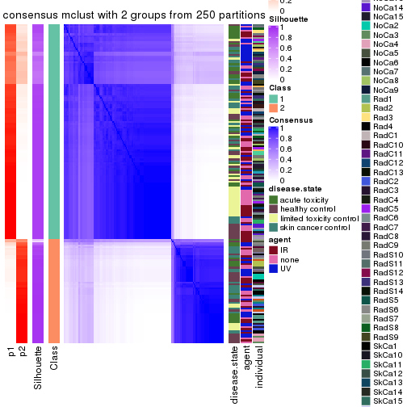</p>

</div>
<div id='tab-CV-mclust-consensus-heatmap-2'>
<pre><code class="r">consensus_heatmap(res, k = 3)
</code></pre>

<p>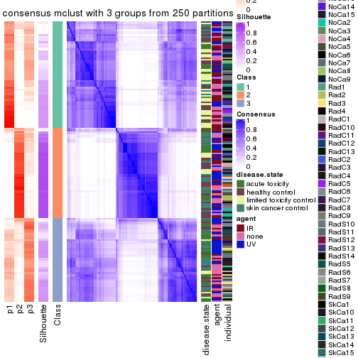</p>

</div>
<div id='tab-CV-mclust-consensus-heatmap-3'>
<pre><code class="r">consensus_heatmap(res, k = 4)
</code></pre>

<p>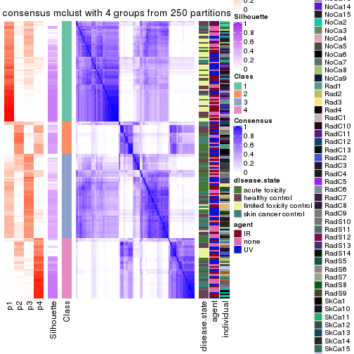</p>

</div>
<div id='tab-CV-mclust-consensus-heatmap-4'>
<pre><code class="r">consensus_heatmap(res, k = 5)
</code></pre>

<p>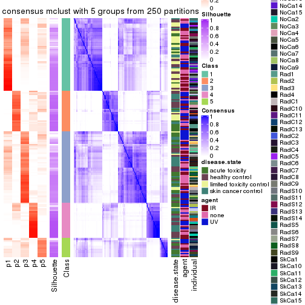</p>

</div>
<div id='tab-CV-mclust-consensus-heatmap-5'>
<pre><code class="r">consensus_heatmap(res, k = 6)
</code></pre>

<p>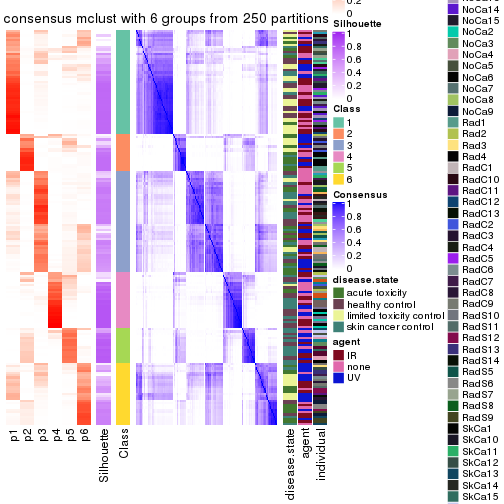</p>

</div>
</div>

Heatmaps for the membership of samples in all partitions to see how consistent they are:


<script>
$( function() {
	$( '#tabs-CV-mclust-membership-heatmap' ).tabs();
} );
</script>
<div id='tabs-CV-mclust-membership-heatmap'>
<ul>
<li><a href='#tab-CV-mclust-membership-heatmap-1'>k = 2</a></li>
<li><a href='#tab-CV-mclust-membership-heatmap-2'>k = 3</a></li>
<li><a href='#tab-CV-mclust-membership-heatmap-3'>k = 4</a></li>
<li><a href='#tab-CV-mclust-membership-heatmap-4'>k = 5</a></li>
<li><a href='#tab-CV-mclust-membership-heatmap-5'>k = 6</a></li>
</ul>
<div id='tab-CV-mclust-membership-heatmap-1'>
<pre><code class="r">membership_heatmap(res, k = 2)
</code></pre>

<p>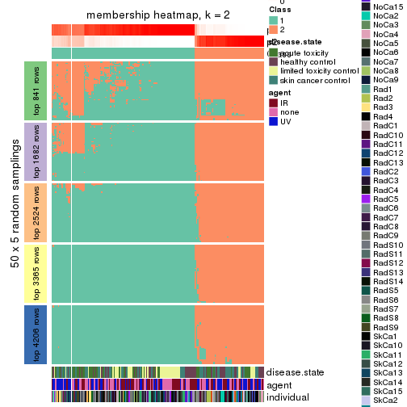</p>

</div>
<div id='tab-CV-mclust-membership-heatmap-2'>
<pre><code class="r">membership_heatmap(res, k = 3)
</code></pre>

<p>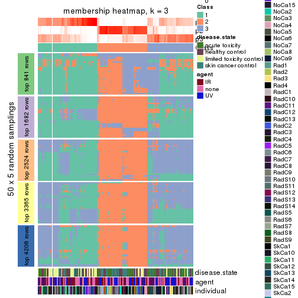</p>

</div>
<div id='tab-CV-mclust-membership-heatmap-3'>
<pre><code class="r">membership_heatmap(res, k = 4)
</code></pre>

<p>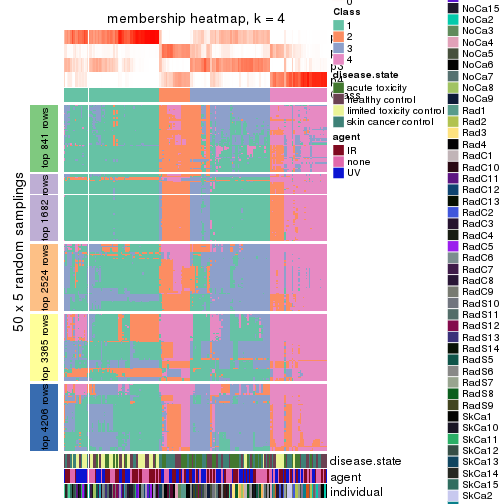</p>

</div>
<div id='tab-CV-mclust-membership-heatmap-4'>
<pre><code class="r">membership_heatmap(res, k = 5)
</code></pre>

<p>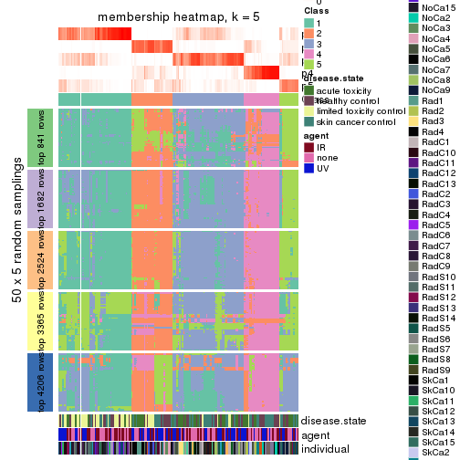</p>

</div>
<div id='tab-CV-mclust-membership-heatmap-5'>
<pre><code class="r">membership_heatmap(res, k = 6)
</code></pre>

<p>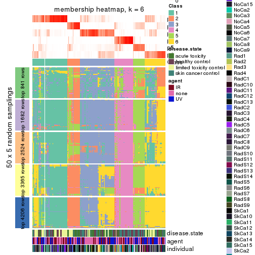</p>

</div>
</div>

As soon as we have had the classes for columns, we can look for signatures
which are significantly different between classes which can be candidate marks
for certain classes. Following are the heatmaps for signatures.


Signature heatmaps where rows are scaled:


<script>
$( function() {
	$( '#tabs-CV-mclust-get-signatures' ).tabs();
} );
</script>
<div id='tabs-CV-mclust-get-signatures'>
<ul>
<li><a href='#tab-CV-mclust-get-signatures-1'>k = 2</a></li>
<li><a href='#tab-CV-mclust-get-signatures-2'>k = 3</a></li>
<li><a href='#tab-CV-mclust-get-signatures-3'>k = 4</a></li>
<li><a href='#tab-CV-mclust-get-signatures-4'>k = 5</a></li>
<li><a href='#tab-CV-mclust-get-signatures-5'>k = 6</a></li>
</ul>
<div id='tab-CV-mclust-get-signatures-1'>
<pre><code class="r">get_signatures(res, k = 2)
</code></pre>

<p>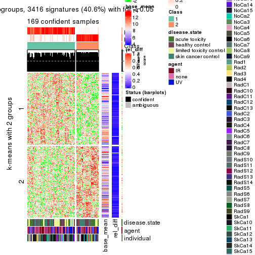</p>

</div>
<div id='tab-CV-mclust-get-signatures-2'>
<pre><code class="r">get_signatures(res, k = 3)
</code></pre>

<p>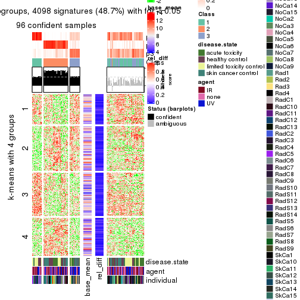</p>

</div>
<div id='tab-CV-mclust-get-signatures-3'>
<pre><code class="r">get_signatures(res, k = 4)
</code></pre>

<p>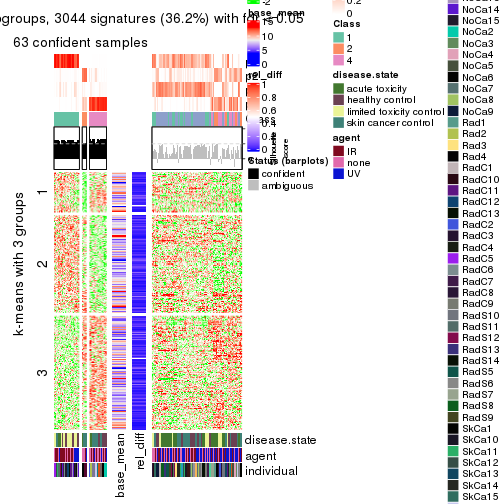</p>

</div>
<div id='tab-CV-mclust-get-signatures-4'>
<pre><code class="r">get_signatures(res, k = 5)
</code></pre>

<p>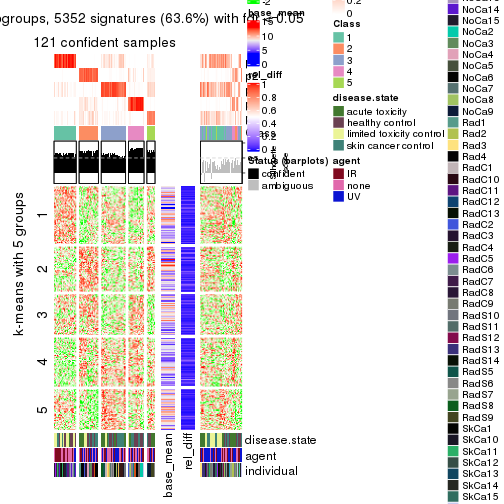</p>

</div>
<div id='tab-CV-mclust-get-signatures-5'>
<pre><code class="r">get_signatures(res, k = 6)
</code></pre>

<p>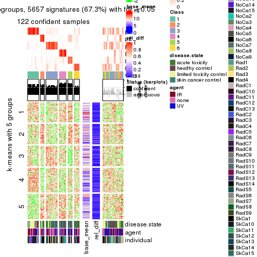</p>

</div>
</div>


Signature heatmaps where rows are not scaled:


<script>
$( function() {
	$( '#tabs-CV-mclust-get-signatures-no-scale' ).tabs();
} );
</script>
<div id='tabs-CV-mclust-get-signatures-no-scale'>
<ul>
<li><a href='#tab-CV-mclust-get-signatures-no-scale-1'>k = 2</a></li>
<li><a href='#tab-CV-mclust-get-signatures-no-scale-2'>k = 3</a></li>
<li><a href='#tab-CV-mclust-get-signatures-no-scale-3'>k = 4</a></li>
<li><a href='#tab-CV-mclust-get-signatures-no-scale-4'>k = 5</a></li>
<li><a href='#tab-CV-mclust-get-signatures-no-scale-5'>k = 6</a></li>
</ul>
<div id='tab-CV-mclust-get-signatures-no-scale-1'>
<pre><code class="r">get_signatures(res, k = 2, scale_rows = FALSE)
</code></pre>

<p>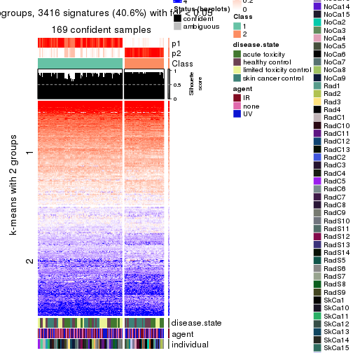</p>

</div>
<div id='tab-CV-mclust-get-signatures-no-scale-2'>
<pre><code class="r">get_signatures(res, k = 3, scale_rows = FALSE)
</code></pre>

<p>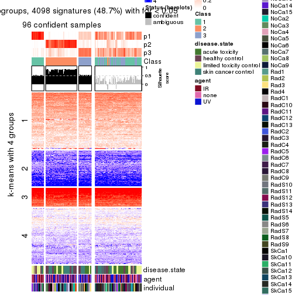</p>

</div>
<div id='tab-CV-mclust-get-signatures-no-scale-3'>
<pre><code class="r">get_signatures(res, k = 4, scale_rows = FALSE)
</code></pre>

<p>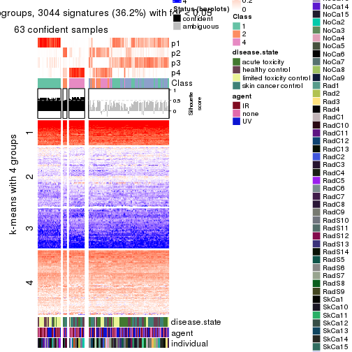</p>

</div>
<div id='tab-CV-mclust-get-signatures-no-scale-4'>
<pre><code class="r">get_signatures(res, k = 5, scale_rows = FALSE)
</code></pre>

<p></p>

</div>
<div id='tab-CV-mclust-get-signatures-no-scale-5'>
<pre><code class="r">get_signatures(res, k = 6, scale_rows = FALSE)
</code></pre>

<p>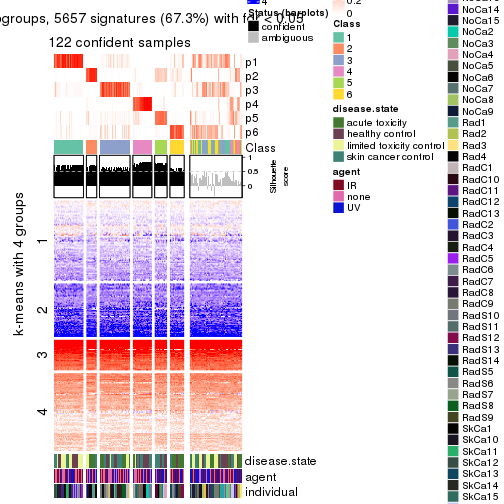</p>

</div>
</div>


Compare the overlap of signatures from different k:

```r
compare_signatures(res)
```

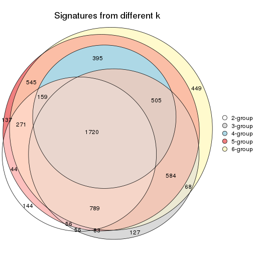

`get_signature()` returns a data frame invisibly. TO get the list of signatures, the function
call should be assigned to a variable explicitly. In following code, if `plot` argument is set
to `FALSE`, no heatmap is plotted while only the differential analysis is performed.

```r
# code only for demonstration
tb = get_signature(res, k = ..., plot = FALSE)
```

An example of the output of `tb` is:

```
#>   which_row         fdr    mean_1    mean_2 scaled_mean_1 scaled_mean_2 km
#> 1        38 0.042760348  8.373488  9.131774    -0.5533452     0.5164555  1
#> 2        40 0.018707592  7.106213  8.469186    -0.6173731     0.5762149  1
#> 3        55 0.019134737 10.221463 11.207825    -0.6159697     0.5749050  1
#> 4        59 0.006059896  5.921854  7.869574    -0.6899429     0.6439467  1
#> 5        60 0.018055526  8.928898 10.211722    -0.6204761     0.5791110  1
#> 6        98 0.009384629 15.714769 14.887706     0.6635654    -0.6193277  2
...
```

The columns in `tb` are:

1. `which_row`: row indices corresponding to the input matrix.
2. `fdr`: FDR for the differential test. 
3. `mean_x`: The mean value in group x.
4. `scaled_mean_x`: The mean value in group x after rows are scaled.
5. `km`: Row groups if k-means clustering is applied to rows.


UMAP plot which shows how samples are separated.


<script>
$( function() {
	$( '#tabs-CV-mclust-dimension-reduction' ).tabs();
} );
</script>
<div id='tabs-CV-mclust-dimension-reduction'>
<ul>
<li><a href='#tab-CV-mclust-dimension-reduction-1'>k = 2</a></li>
<li><a href='#tab-CV-mclust-dimension-reduction-2'>k = 3</a></li>
<li><a href='#tab-CV-mclust-dimension-reduction-3'>k = 4</a></li>
<li><a href='#tab-CV-mclust-dimension-reduction-4'>k = 5</a></li>
<li><a href='#tab-CV-mclust-dimension-reduction-5'>k = 6</a></li>
</ul>
<div id='tab-CV-mclust-dimension-reduction-1'>
<pre><code class="r">dimension_reduction(res, k = 2, method = &quot;UMAP&quot;)
</code></pre>

<p>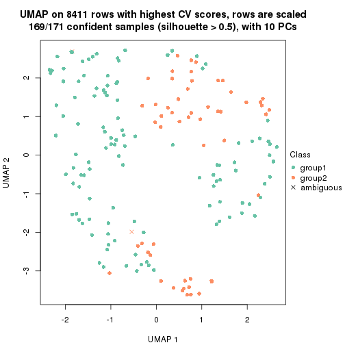</p>

</div>
<div id='tab-CV-mclust-dimension-reduction-2'>
<pre><code class="r">dimension_reduction(res, k = 3, method = &quot;UMAP&quot;)
</code></pre>

<p>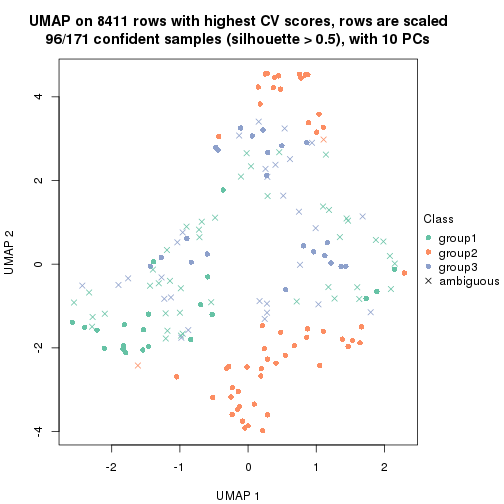</p>

</div>
<div id='tab-CV-mclust-dimension-reduction-3'>
<pre><code class="r">dimension_reduction(res, k = 4, method = &quot;UMAP&quot;)
</code></pre>

<p>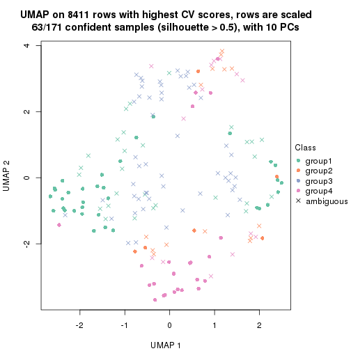</p>

</div>
<div id='tab-CV-mclust-dimension-reduction-4'>
<pre><code class="r">dimension_reduction(res, k = 5, method = &quot;UMAP&quot;)
</code></pre>

<p>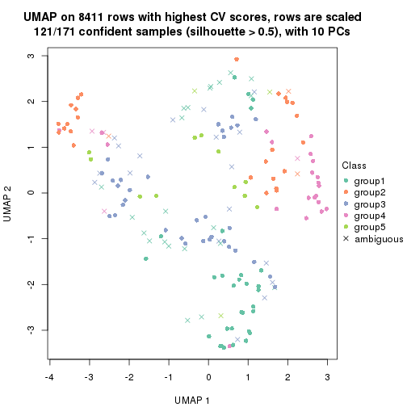</p>

</div>
<div id='tab-CV-mclust-dimension-reduction-5'>
<pre><code class="r">dimension_reduction(res, k = 6, method = &quot;UMAP&quot;)
</code></pre>

<p>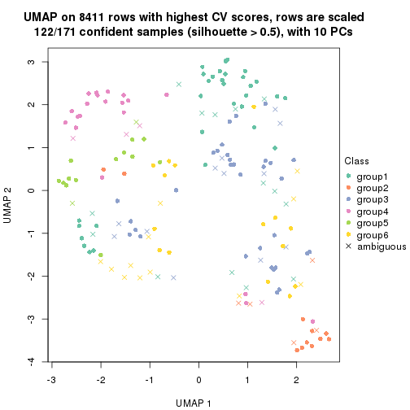</p>

</div>
</div>


Following heatmap shows how subgroups are split when increasing `k`:

```r
collect_classes(res)
```

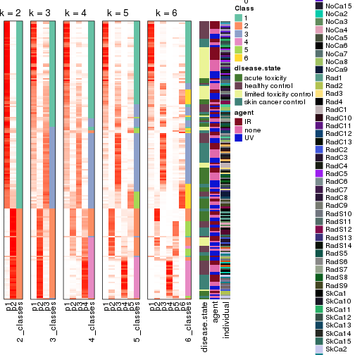


Test correlation between subgroups and known annotations. If the known
annotation is numeric, one-way ANOVA test is applied, and if the known
annotation is discrete, chi-squared contingency table test is applied.

```r
test_to_known_factors(res)
```

```
#>             n disease.state(p) agent(p) individual(p) k
#> CV:mclust 169         4.31e-02   0.6211      1.38e-11 2
#> CV:mclust  96         8.45e-05   0.0602      2.27e-09 3
#> CV:mclust  63         1.32e-05   0.5153      2.93e-06 4
#> CV:mclust 121         1.10e-04   0.2933      1.27e-18 5
#> CV:mclust 122         1.07e-08   0.6338      1.89e-22 6
```


If matrix rows can be associated to genes, consider to use `functional_enrichment(res,
...)` to perform function enrichment for the signature genes. See [this vignette](http://bioconductor.org/packages/devel/bioc/vignettes/cola/inst/doc/functional_enrichment.html) for more detailed explanations.


 

---------------------------------------------------


### CV:NMF


The object with results only for a single top-value method and a single partition method 
can be extracted as:

```r
res = res_list["CV", "NMF"]
# you can also extract it by
# res = res_list["CV:NMF"]
```

A summary of `res` and all the functions that can be applied to it:

```r
res
```

```
#> A 'ConsensusPartition' object with k = 2, 3, 4, 5, 6.
#>   On a matrix with 8411 rows and 171 columns.
#>   Top rows (841, 1682, 2524, 3365, 4206) are extracted by 'CV' method.
#>   Subgroups are detected by 'NMF' method.
#>   Performed in total 1250 partitions by row resampling.
#>   Best k for subgroups seems to be 2.
#> 
#> Following methods can be applied to this 'ConsensusPartition' object:
#>  [1] "cola_report"             "collect_classes"         "collect_plots"          
#>  [4] "collect_stats"           "colnames"                "compare_signatures"     
#>  [7] "consensus_heatmap"       "dimension_reduction"     "functional_enrichment"  
#> [10] "get_anno_col"            "get_anno"                "get_classes"            
#> [13] "get_consensus"           "get_matrix"              "get_membership"         
#> [16] "get_param"               "get_signatures"          "get_stats"              
#> [19] "is_best_k"               "is_stable_k"             "membership_heatmap"     
#> [22] "ncol"                    "nrow"                    "plot_ecdf"              
#> [25] "rownames"                "select_partition_number" "show"                   
#> [28] "suggest_best_k"          "test_to_known_factors"
```

`collect_plots()` function collects all the plots made from `res` for all `k` (number of partitions)
into one single page to provide an easy and fast comparison between different `k`.

```r
collect_plots(res)
```

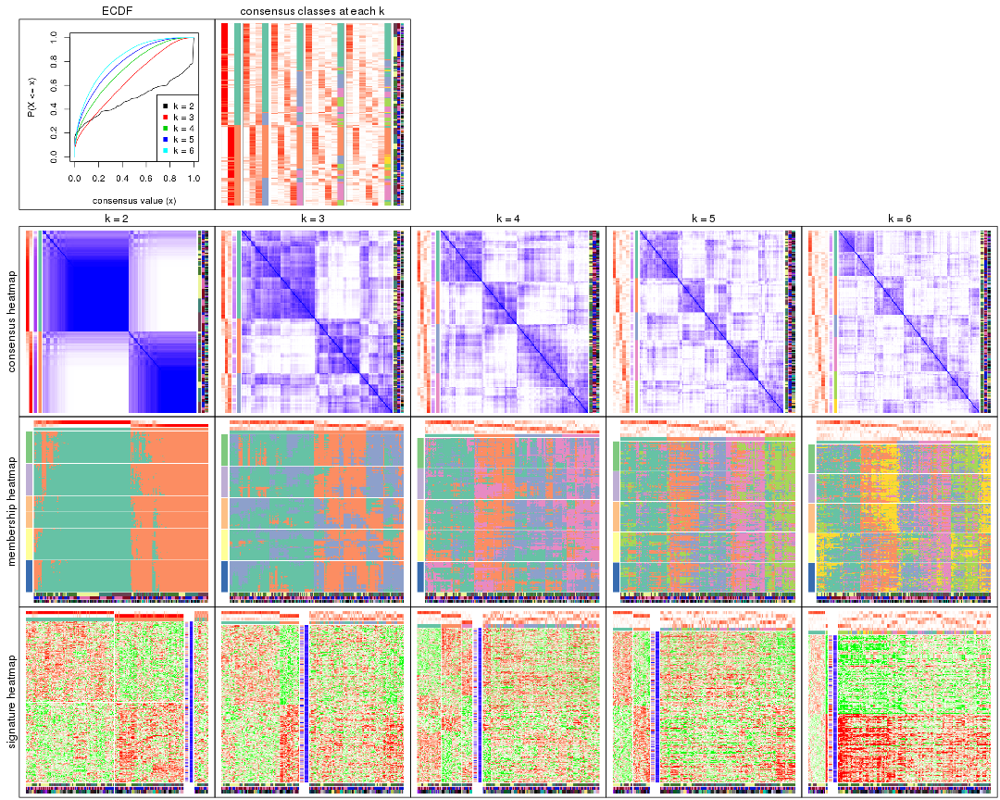

The plots are:

- The first row: a plot of the ECDF (empirical cumulative distribution
  function) curves of the consensus matrix for each `k` and the heatmap of
  predicted classes for each `k`.
- The second row: heatmaps of the consensus matrix for each `k`.
- The third row: heatmaps of the membership matrix for each `k`.
- The fouth row: heatmaps of the signatures for each `k`.

All the plots in panels can be made by individual functions and they are
plotted later in this section.

`select_partition_number()` produces several plots showing different
statistics for choosing "optimized" `k`. There are following statistics:

- ECDF curves of the consensus matrix for each `k`;
- 1-PAC. [The PAC
  score](https://en.wikipedia.org/wiki/Consensus_clustering#Over-interpretation_potential_of_consensus_clustering)
  measures the proportion of the ambiguous subgrouping.
- Mean silhouette score.
- Concordance. The mean probability of fiting the consensus class ids in all
  partitions.
- Area increased. Denote $A_k$ as the area under the ECDF curve for current
  `k`, the area increased is defined as $A_k - A_{k-1}$.
- Rand index. The percent of pairs of samples that are both in a same cluster
  or both are not in a same cluster in the partition of k and k-1.
- Jaccard index. The ratio of pairs of samples are both in a same cluster in
  the partition of k and k-1 and the pairs of samples are both in a same
  cluster in the partition k or k-1.

The detailed explanations of these statistics can be found in [the _cola_
vignette](http://bioconductor.org/packages/devel/bioc/vignettes/cola/inst/doc/cola.html#toc_13).

Generally speaking, lower PAC score, higher mean silhouette score or higher
concordance corresponds to better partition. Rand index and Jaccard index
measure how similar the current partition is compared to partition with `k-1`.
If they are too similar, we won't accept `k` is better than `k-1`.

```r
select_partition_number(res)
```

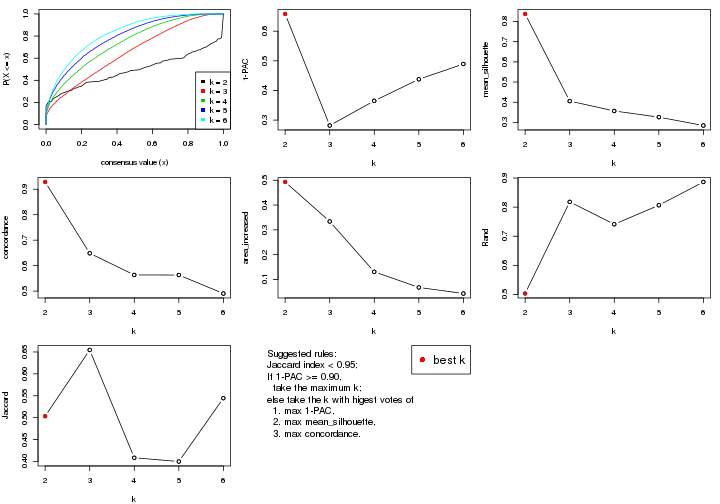

The numeric values for all these statistics can be obtained by `get_stats()`.

```r
get_stats(res)
```

```
#>   k 1-PAC mean_silhouette concordance area_increased  Rand Jaccard
#> 2 2 0.658           0.837       0.929         0.4932 0.503   0.503
#> 3 3 0.282           0.406       0.649         0.3337 0.818   0.655
#> 4 4 0.365           0.357       0.563         0.1307 0.741   0.408
#> 5 5 0.438           0.326       0.563         0.0676 0.807   0.400
#> 6 6 0.489           0.285       0.491         0.0430 0.887   0.544
```

`suggest_best_k()` suggests the best $k$ based on these statistics. The rules are as follows:

- All $k$ with Jaccard index larger than 0.95 are removed because increasing
  $k$ does not provide enough extra information. If all $k$ are removed, it is
  marked as no subgroup is detected.
- For all $k$ with 1-PAC score larger than 0.9, the maximal $k$ is taken as
  the best $k$, and other $k$ are marked as optional $k$.
- If it does not fit the second rule. The $k$ with the maximal vote of the
  highest 1-PAC score, highest mean silhouette, and highest concordance is
  taken as the best $k$.

```r
suggest_best_k(res)
```

```
#> [1] 2
```


Following shows the table of the partitions (You need to click the **show/hide
code output** link to see it). The membership matrix (columns with name `p*`)
is inferred by
[`clue::cl_consensus()`](https://www.rdocumentation.org/link/cl_consensus?package=clue)
function with the `SE` method. Basically the value in the membership matrix
represents the probability to belong to a certain group. The finall class
label for an item is determined with the group with highest probability it
belongs to.

In `get_classes()` function, the entropy is calculated from the membership
matrix and the silhouette score is calculated from the consensus matrix.


<script>
$( function() {
	$( '#tabs-CV-NMF-get-classes' ).tabs();
} );
</script>
<div id='tabs-CV-NMF-get-classes'>
<ul>
<li><a href='#tab-CV-NMF-get-classes-1'>k = 2</a></li>
<li><a href='#tab-CV-NMF-get-classes-2'>k = 3</a></li>
<li><a href='#tab-CV-NMF-get-classes-3'>k = 4</a></li>
<li><a href='#tab-CV-NMF-get-classes-4'>k = 5</a></li>
<li><a href='#tab-CV-NMF-get-classes-5'>k = 6</a></li>
</ul>

<div id='tab-CV-NMF-get-classes-1'>
<p><a id='tab-CV-NMF-get-classes-1-a' style='color:#0366d6' href='#'>show/hide code output</a></p>
<pre><code class="r">cbind(get_classes(res, k = 2), get_membership(res, k = 2))
</code></pre>

<pre><code>#&gt;          class entropy silhouette    p1    p2
#&gt; GSM29783     2  0.2423      0.892 0.040 0.960
#&gt; GSM29786     2  0.6801      0.776 0.180 0.820
#&gt; GSM29789     2  0.0000      0.907 0.000 1.000
#&gt; GSM29792     2  0.0000      0.907 0.000 1.000
#&gt; GSM29795     2  0.7602      0.733 0.220 0.780
#&gt; GSM29798     2  0.9087      0.573 0.324 0.676
#&gt; GSM29801     1  0.0000      0.931 1.000 0.000
#&gt; GSM29804     1  0.0000      0.931 1.000 0.000
#&gt; GSM29807     2  0.3431      0.872 0.064 0.936
#&gt; GSM29816     1  0.0000      0.931 1.000 0.000
#&gt; GSM29821     1  0.0000      0.931 1.000 0.000
#&gt; GSM29824     1  0.0000      0.931 1.000 0.000
#&gt; GSM29827     1  0.0000      0.931 1.000 0.000
#&gt; GSM29830     1  0.0000      0.931 1.000 0.000
#&gt; GSM29833     1  0.0000      0.931 1.000 0.000
#&gt; GSM29784     2  0.0000      0.907 0.000 1.000
#&gt; GSM29787     2  0.7299      0.751 0.204 0.796
#&gt; GSM29790     2  0.0000      0.907 0.000 1.000
#&gt; GSM29793     2  0.0000      0.907 0.000 1.000
#&gt; GSM29796     2  0.1184      0.902 0.016 0.984
#&gt; GSM29799     2  0.9754      0.394 0.408 0.592
#&gt; GSM29802     1  0.0000      0.931 1.000 0.000
#&gt; GSM29805     1  0.0000      0.931 1.000 0.000
#&gt; GSM29814     2  0.8955      0.539 0.312 0.688
#&gt; GSM29817     1  0.0000      0.931 1.000 0.000
#&gt; GSM29822     1  0.0000      0.931 1.000 0.000
#&gt; GSM29825     1  0.0000      0.931 1.000 0.000
#&gt; GSM29828     1  0.0000      0.931 1.000 0.000
#&gt; GSM29831     1  0.0000      0.931 1.000 0.000
#&gt; GSM29834     1  0.0000      0.931 1.000 0.000
#&gt; GSM29785     2  0.0000      0.907 0.000 1.000
#&gt; GSM29788     2  0.3431      0.877 0.064 0.936
#&gt; GSM29791     2  0.0000      0.907 0.000 1.000
#&gt; GSM29794     2  0.0000      0.907 0.000 1.000
#&gt; GSM29797     2  0.0000      0.907 0.000 1.000
#&gt; GSM29800     2  0.2778      0.887 0.048 0.952
#&gt; GSM29803     1  0.9323      0.423 0.652 0.348
#&gt; GSM29806     2  0.9977      0.103 0.472 0.528
#&gt; GSM29815     2  0.0000      0.907 0.000 1.000
#&gt; GSM29819     1  0.2043      0.911 0.968 0.032
#&gt; GSM29823     1  0.7674      0.691 0.776 0.224
#&gt; GSM29826     1  0.1414      0.920 0.980 0.020
#&gt; GSM29829     1  0.0000      0.931 1.000 0.000
#&gt; GSM29832     1  0.0000      0.931 1.000 0.000
#&gt; GSM29835     1  0.9909      0.112 0.556 0.444
#&gt; GSM29836     2  0.0000      0.907 0.000 1.000
#&gt; GSM29839     2  0.4022      0.868 0.080 0.920
#&gt; GSM29842     2  0.0000      0.907 0.000 1.000
#&gt; GSM29845     2  0.2236      0.895 0.036 0.964
#&gt; GSM29848     2  0.4939      0.846 0.108 0.892
#&gt; GSM29851     1  0.0000      0.931 1.000 0.000
#&gt; GSM29854     1  0.0376      0.929 0.996 0.004
#&gt; GSM29857     1  0.0000      0.931 1.000 0.000
#&gt; GSM29860     2  0.0000      0.907 0.000 1.000
#&gt; GSM29863     1  0.0000      0.931 1.000 0.000
#&gt; GSM29866     1  0.0000      0.931 1.000 0.000
#&gt; GSM29869     1  0.0000      0.931 1.000 0.000
#&gt; GSM29872     2  0.9754      0.312 0.408 0.592
#&gt; GSM29875     1  0.0000      0.931 1.000 0.000
#&gt; GSM29878     2  0.6343      0.803 0.160 0.840
#&gt; GSM29837     2  0.0000      0.907 0.000 1.000
#&gt; GSM29840     2  0.2423      0.892 0.040 0.960
#&gt; GSM29843     2  0.0000      0.907 0.000 1.000
#&gt; GSM29846     2  0.0376      0.906 0.004 0.996
#&gt; GSM29849     2  0.9552      0.470 0.376 0.624
#&gt; GSM29852     1  0.0000      0.931 1.000 0.000
#&gt; GSM29855     1  0.4298      0.869 0.912 0.088
#&gt; GSM29858     1  0.0000      0.931 1.000 0.000
#&gt; GSM29861     2  0.0000      0.907 0.000 1.000
#&gt; GSM29864     1  0.0000      0.931 1.000 0.000
#&gt; GSM29867     1  0.0000      0.931 1.000 0.000
#&gt; GSM29870     1  0.0000      0.931 1.000 0.000
#&gt; GSM29873     1  0.9795      0.306 0.584 0.416
#&gt; GSM29876     1  0.0000      0.931 1.000 0.000
#&gt; GSM29879     1  0.4562      0.865 0.904 0.096
#&gt; GSM29838     2  0.0000      0.907 0.000 1.000
#&gt; GSM29841     2  0.0000      0.907 0.000 1.000
#&gt; GSM29844     2  0.0000      0.907 0.000 1.000
#&gt; GSM29847     2  0.0000      0.907 0.000 1.000
#&gt; GSM29850     2  0.2603      0.890 0.044 0.956
#&gt; GSM29853     1  0.0376      0.929 0.996 0.004
#&gt; GSM29856     2  0.5946      0.817 0.144 0.856
#&gt; GSM29859     2  0.5946      0.804 0.144 0.856
#&gt; GSM29862     2  0.0000      0.907 0.000 1.000
#&gt; GSM29865     2  0.9286      0.534 0.344 0.656
#&gt; GSM29868     1  0.7056      0.739 0.808 0.192
#&gt; GSM29871     1  0.9954      0.163 0.540 0.460
#&gt; GSM29874     2  0.0000      0.907 0.000 1.000
#&gt; GSM29877     1  0.0000      0.931 1.000 0.000
#&gt; GSM29880     2  0.0000      0.907 0.000 1.000
#&gt; GSM29881     1  0.5178      0.847 0.884 0.116
#&gt; GSM29884     2  0.0000      0.907 0.000 1.000
#&gt; GSM29887     2  0.0000      0.907 0.000 1.000
#&gt; GSM29890     1  0.0000      0.931 1.000 0.000
#&gt; GSM29893     1  0.0000      0.931 1.000 0.000
#&gt; GSM29896     1  0.0000      0.931 1.000 0.000
#&gt; GSM29899     1  0.0000      0.931 1.000 0.000
#&gt; GSM29902     1  0.0000      0.931 1.000 0.000
#&gt; GSM29905     1  0.0000      0.931 1.000 0.000
#&gt; GSM29908     1  0.0000      0.931 1.000 0.000
#&gt; GSM29955     1  0.0672      0.927 0.992 0.008
#&gt; GSM29958     1  0.0000      0.931 1.000 0.000
#&gt; GSM29961     1  0.0000      0.931 1.000 0.000
#&gt; GSM29882     1  0.0000      0.931 1.000 0.000
#&gt; GSM29885     2  0.0000      0.907 0.000 1.000
#&gt; GSM29888     2  0.0000      0.907 0.000 1.000
#&gt; GSM29891     1  0.0000      0.931 1.000 0.000
#&gt; GSM29894     1  0.0000      0.931 1.000 0.000
#&gt; GSM29897     1  0.0000      0.931 1.000 0.000
#&gt; GSM29900     1  0.0000      0.931 1.000 0.000
#&gt; GSM29903     1  0.0000      0.931 1.000 0.000
#&gt; GSM29906     1  0.0000      0.931 1.000 0.000
#&gt; GSM29909     1  0.4022      0.876 0.920 0.080
#&gt; GSM29956     1  0.0000      0.931 1.000 0.000
#&gt; GSM29959     1  0.0000      0.931 1.000 0.000
#&gt; GSM29962     1  0.0000      0.931 1.000 0.000
#&gt; GSM29883     1  0.4161      0.875 0.916 0.084
#&gt; GSM29886     2  0.0000      0.907 0.000 1.000
#&gt; GSM29889     2  0.0000      0.907 0.000 1.000
#&gt; GSM29892     1  0.0000      0.931 1.000 0.000
#&gt; GSM29895     2  0.9970      0.179 0.468 0.532
#&gt; GSM29898     1  0.0376      0.929 0.996 0.004
#&gt; GSM29901     1  0.0000      0.931 1.000 0.000
#&gt; GSM29904     1  0.2948      0.900 0.948 0.052
#&gt; GSM29907     1  0.0000      0.931 1.000 0.000
#&gt; GSM29910     1  0.9922      0.152 0.552 0.448
#&gt; GSM29957     2  0.3114      0.882 0.056 0.944
#&gt; GSM29960     1  0.2236      0.907 0.964 0.036
#&gt; GSM29963     2  0.9635      0.393 0.388 0.612
#&gt; GSM29964     2  0.0000      0.907 0.000 1.000
#&gt; GSM29967     2  0.0000      0.907 0.000 1.000
#&gt; GSM29970     1  0.7602      0.718 0.780 0.220
#&gt; GSM29973     2  0.0000      0.907 0.000 1.000
#&gt; GSM29976     1  0.0000      0.931 1.000 0.000
#&gt; GSM29979     2  0.0000      0.907 0.000 1.000
#&gt; GSM29982     2  0.2043      0.896 0.032 0.968
#&gt; GSM29985     1  0.0000      0.931 1.000 0.000
#&gt; GSM29988     2  0.9710      0.324 0.400 0.600
#&gt; GSM29991     2  0.9358      0.526 0.352 0.648
#&gt; GSM29994     1  0.0376      0.929 0.996 0.004
#&gt; GSM29997     1  0.5408      0.833 0.876 0.124
#&gt; GSM30000     1  0.7602      0.726 0.780 0.220
#&gt; GSM30003     1  0.0000      0.931 1.000 0.000
#&gt; GSM29965     2  0.0000      0.907 0.000 1.000
#&gt; GSM29968     2  0.0000      0.907 0.000 1.000
#&gt; GSM29971     1  0.7299      0.740 0.796 0.204
#&gt; GSM29974     2  0.0000      0.907 0.000 1.000
#&gt; GSM29977     1  0.0000      0.931 1.000 0.000
#&gt; GSM29980     2  0.0376      0.906 0.004 0.996
#&gt; GSM29983     1  0.4562      0.864 0.904 0.096
#&gt; GSM29986     1  0.0000      0.931 1.000 0.000
#&gt; GSM29989     1  0.9358      0.472 0.648 0.352
#&gt; GSM29992     1  0.6973      0.745 0.812 0.188
#&gt; GSM29995     1  0.0000      0.931 1.000 0.000
#&gt; GSM29998     1  0.5519      0.829 0.872 0.128
#&gt; GSM30001     1  0.7602      0.724 0.780 0.220
#&gt; GSM30004     1  0.0000      0.931 1.000 0.000
#&gt; GSM29966     2  0.0000      0.907 0.000 1.000
#&gt; GSM29969     2  0.0000      0.907 0.000 1.000
#&gt; GSM29972     2  0.7453      0.723 0.212 0.788
#&gt; GSM29975     2  0.0000      0.907 0.000 1.000
#&gt; GSM29978     1  0.0000      0.931 1.000 0.000
#&gt; GSM29981     2  0.0000      0.907 0.000 1.000
#&gt; GSM29984     2  0.1414      0.901 0.020 0.980
#&gt; GSM29987     1  0.8861      0.534 0.696 0.304
#&gt; GSM29990     2  0.3879      0.865 0.076 0.924
#&gt; GSM29993     2  0.6247      0.802 0.156 0.844
#&gt; GSM29996     1  0.0672      0.927 0.992 0.008
#&gt; GSM29999     1  0.9661      0.374 0.608 0.392
#&gt; GSM30002     2  0.0376      0.906 0.004 0.996
#&gt; GSM30005     1  0.6801      0.759 0.820 0.180
</code></pre>

<script>
$('#tab-CV-NMF-get-classes-1-a').parent().next().next().hide();
$('#tab-CV-NMF-get-classes-1-a').click(function(){
  $('#tab-CV-NMF-get-classes-1-a').parent().next().next().toggle();
  return(false);
});
</script>
</div>

<div id='tab-CV-NMF-get-classes-2'>
<p><a id='tab-CV-NMF-get-classes-2-a' style='color:#0366d6' href='#'>show/hide code output</a></p>
<pre><code class="r">cbind(get_classes(res, k = 3), get_membership(res, k = 3))
</code></pre>

<pre><code>#&gt;          class entropy silhouette    p1    p2    p3
#&gt; GSM29783     3   0.619     0.0974 0.004 0.364 0.632
#&gt; GSM29786     3   0.566     0.3222 0.004 0.284 0.712
#&gt; GSM29789     2   0.429     0.4801 0.000 0.820 0.180
#&gt; GSM29792     2   0.375     0.5046 0.000 0.856 0.144
#&gt; GSM29795     3   0.827     0.3250 0.096 0.328 0.576
#&gt; GSM29798     3   0.563     0.4054 0.024 0.208 0.768
#&gt; GSM29801     1   0.694     0.3257 0.520 0.016 0.464
#&gt; GSM29804     1   0.410     0.6285 0.852 0.008 0.140
#&gt; GSM29807     2   0.868     0.3592 0.124 0.548 0.328
#&gt; GSM29816     1   0.573     0.5603 0.676 0.000 0.324
#&gt; GSM29821     1   0.763     0.3435 0.524 0.044 0.432
#&gt; GSM29824     1   0.254     0.6572 0.920 0.000 0.080
#&gt; GSM29827     1   0.434     0.6261 0.848 0.016 0.136
#&gt; GSM29830     1   0.558     0.5967 0.748 0.012 0.240
#&gt; GSM29833     1   0.861     0.3840 0.556 0.120 0.324
#&gt; GSM29784     3   0.630    -0.1382 0.000 0.476 0.524
#&gt; GSM29787     3   0.602     0.3725 0.012 0.288 0.700
#&gt; GSM29790     2   0.497     0.4596 0.000 0.764 0.236
#&gt; GSM29793     2   0.327     0.5220 0.000 0.884 0.116
#&gt; GSM29796     3   0.688     0.2695 0.020 0.388 0.592
#&gt; GSM29799     3   0.518     0.4227 0.088 0.080 0.832
#&gt; GSM29802     1   0.620     0.4315 0.576 0.000 0.424
#&gt; GSM29805     1   0.394     0.6373 0.844 0.000 0.156
#&gt; GSM29814     2   0.944     0.2731 0.196 0.480 0.324
#&gt; GSM29817     1   0.625     0.3580 0.556 0.000 0.444
#&gt; GSM29822     1   0.579     0.5465 0.668 0.000 0.332
#&gt; GSM29825     1   0.388     0.6466 0.848 0.000 0.152
#&gt; GSM29828     1   0.382     0.6363 0.852 0.000 0.148
#&gt; GSM29831     1   0.334     0.6475 0.880 0.000 0.120
#&gt; GSM29834     1   0.706     0.5131 0.664 0.048 0.288
#&gt; GSM29785     2   0.522     0.4129 0.000 0.740 0.260
#&gt; GSM29788     3   0.626     0.1919 0.000 0.448 0.552
#&gt; GSM29791     2   0.493     0.4301 0.000 0.768 0.232
#&gt; GSM29794     2   0.418     0.4857 0.000 0.828 0.172
#&gt; GSM29797     2   0.599     0.2020 0.000 0.632 0.368
#&gt; GSM29800     3   0.587     0.2831 0.004 0.312 0.684
#&gt; GSM29803     3   0.626     0.3901 0.204 0.048 0.748
#&gt; GSM29806     3   0.981    -0.1609 0.244 0.352 0.404
#&gt; GSM29815     2   0.733     0.4162 0.044 0.612 0.344
#&gt; GSM29819     3   0.768    -0.0878 0.412 0.048 0.540
#&gt; GSM29823     3   0.867     0.3634 0.184 0.220 0.596
#&gt; GSM29826     1   0.491     0.6236 0.796 0.008 0.196
#&gt; GSM29829     1   0.638     0.5835 0.768 0.104 0.128
#&gt; GSM29832     1   0.832     0.4783 0.624 0.148 0.228
#&gt; GSM29835     3   0.987     0.1492 0.308 0.280 0.412
#&gt; GSM29836     2   0.296     0.5271 0.000 0.900 0.100
#&gt; GSM29839     3   0.685     0.2868 0.020 0.380 0.600
#&gt; GSM29842     2   0.611     0.3666 0.000 0.604 0.396
#&gt; GSM29845     3   0.558     0.3778 0.040 0.168 0.792
#&gt; GSM29848     3   0.639     0.3718 0.020 0.300 0.680
#&gt; GSM29851     1   0.556     0.5487 0.700 0.000 0.300
#&gt; GSM29854     1   0.628     0.5047 0.664 0.012 0.324
#&gt; GSM29857     1   0.726     0.3221 0.528 0.028 0.444
#&gt; GSM29860     2   0.254     0.5363 0.000 0.920 0.080
#&gt; GSM29863     1   0.588     0.5212 0.652 0.000 0.348
#&gt; GSM29866     1   0.435     0.6336 0.828 0.004 0.168
#&gt; GSM29869     1   0.455     0.6338 0.840 0.020 0.140
#&gt; GSM29872     2   0.893     0.0885 0.416 0.460 0.124
#&gt; GSM29875     1   0.522     0.5850 0.740 0.000 0.260
#&gt; GSM29878     2   0.912     0.1536 0.224 0.548 0.228
#&gt; GSM29837     2   0.480     0.5301 0.000 0.780 0.220
#&gt; GSM29840     3   0.716     0.2855 0.032 0.372 0.596
#&gt; GSM29843     2   0.631    -0.0183 0.000 0.508 0.492
#&gt; GSM29846     3   0.563     0.3154 0.024 0.208 0.768
#&gt; GSM29849     3   0.662     0.4273 0.088 0.164 0.748
#&gt; GSM29852     1   0.586     0.5242 0.656 0.000 0.344
#&gt; GSM29855     3   0.729    -0.2207 0.464 0.028 0.508
#&gt; GSM29858     1   0.631     0.4748 0.660 0.012 0.328
#&gt; GSM29861     2   0.361     0.5157 0.008 0.880 0.112
#&gt; GSM29864     1   0.620     0.4224 0.576 0.000 0.424
#&gt; GSM29867     1   0.186     0.6571 0.948 0.000 0.052
#&gt; GSM29870     1   0.424     0.6344 0.824 0.000 0.176
#&gt; GSM29873     1   0.895     0.2202 0.524 0.332 0.144
#&gt; GSM29876     1   0.576     0.5454 0.672 0.000 0.328
#&gt; GSM29879     1   0.770     0.5154 0.672 0.116 0.212
#&gt; GSM29838     2   0.319     0.5561 0.000 0.888 0.112
#&gt; GSM29841     2   0.627    -0.0260 0.000 0.544 0.456
#&gt; GSM29844     2   0.556     0.3273 0.000 0.700 0.300
#&gt; GSM29847     3   0.623     0.1741 0.000 0.436 0.564
#&gt; GSM29850     3   0.608     0.3251 0.004 0.344 0.652
#&gt; GSM29853     1   0.642     0.3998 0.572 0.004 0.424
#&gt; GSM29856     2   0.840    -0.0700 0.084 0.472 0.444
#&gt; GSM29859     2   0.933     0.2480 0.164 0.440 0.396
#&gt; GSM29862     2   0.263     0.5355 0.000 0.916 0.084
#&gt; GSM29865     3   0.623     0.3969 0.080 0.148 0.772
#&gt; GSM29868     1   0.905     0.3719 0.556 0.236 0.208
#&gt; GSM29871     1   0.980     0.0162 0.400 0.360 0.240
#&gt; GSM29874     2   0.464     0.5045 0.044 0.852 0.104
#&gt; GSM29877     1   0.550     0.5772 0.708 0.000 0.292
#&gt; GSM29880     2   0.334     0.5183 0.000 0.880 0.120
#&gt; GSM29881     3   0.696    -0.0761 0.412 0.020 0.568
#&gt; GSM29884     2   0.497     0.5235 0.000 0.764 0.236
#&gt; GSM29887     2   0.334     0.5374 0.000 0.880 0.120
#&gt; GSM29890     1   0.103     0.6554 0.976 0.000 0.024
#&gt; GSM29893     1   0.716     0.5414 0.680 0.064 0.256
#&gt; GSM29896     1   0.341     0.6459 0.876 0.000 0.124
#&gt; GSM29899     1   0.296     0.6575 0.900 0.000 0.100
#&gt; GSM29902     1   0.675     0.5405 0.732 0.076 0.192
#&gt; GSM29905     1   0.369     0.6303 0.884 0.016 0.100
#&gt; GSM29908     1   0.629     0.5767 0.768 0.080 0.152
#&gt; GSM29955     1   0.673     0.5740 0.748 0.124 0.128
#&gt; GSM29958     1   0.713     0.5356 0.684 0.064 0.252
#&gt; GSM29961     1   0.673     0.5665 0.740 0.088 0.172
#&gt; GSM29882     1   0.622     0.4228 0.568 0.000 0.432
#&gt; GSM29885     2   0.573     0.4547 0.000 0.676 0.324
#&gt; GSM29888     2   0.559     0.4815 0.000 0.696 0.304
#&gt; GSM29891     1   0.312     0.6427 0.892 0.000 0.108
#&gt; GSM29894     1   0.506     0.5962 0.756 0.000 0.244
#&gt; GSM29897     1   0.514     0.5943 0.748 0.000 0.252
#&gt; GSM29900     1   0.429     0.6426 0.820 0.000 0.180
#&gt; GSM29903     1   0.353     0.6352 0.892 0.016 0.092
#&gt; GSM29906     1   0.406     0.6227 0.860 0.012 0.128
#&gt; GSM29909     1   0.545     0.6008 0.816 0.116 0.068
#&gt; GSM29956     1   0.563     0.5981 0.792 0.044 0.164
#&gt; GSM29959     1   0.512     0.6079 0.788 0.012 0.200
#&gt; GSM29962     1   0.362     0.6413 0.864 0.000 0.136
#&gt; GSM29883     1   0.630     0.3036 0.520 0.000 0.480
#&gt; GSM29886     2   0.460     0.4672 0.000 0.796 0.204
#&gt; GSM29889     2   0.375     0.5333 0.000 0.856 0.144
#&gt; GSM29892     1   0.388     0.6341 0.888 0.044 0.068
#&gt; GSM29895     3   0.973     0.2604 0.256 0.296 0.448
#&gt; GSM29898     1   0.428     0.6461 0.852 0.016 0.132
#&gt; GSM29901     1   0.463     0.6352 0.808 0.004 0.188
#&gt; GSM29904     1   0.764     0.4582 0.664 0.240 0.096
#&gt; GSM29907     1   0.551     0.5912 0.800 0.044 0.156
#&gt; GSM29910     1   0.933     0.1103 0.436 0.400 0.164
#&gt; GSM29957     2   0.672     0.4211 0.116 0.748 0.136
#&gt; GSM29960     1   0.936     0.2713 0.512 0.220 0.268
#&gt; GSM29963     2   0.884     0.1384 0.368 0.508 0.124
#&gt; GSM29964     2   0.455     0.5397 0.000 0.800 0.200
#&gt; GSM29967     2   0.627     0.2908 0.000 0.544 0.456
#&gt; GSM29970     1   0.961     0.1088 0.428 0.204 0.368
#&gt; GSM29973     2   0.445     0.5432 0.000 0.808 0.192
#&gt; GSM29976     1   0.548     0.5475 0.732 0.004 0.264
#&gt; GSM29979     2   0.660     0.4953 0.040 0.704 0.256
#&gt; GSM29982     3   0.769     0.3204 0.060 0.344 0.596
#&gt; GSM29985     1   0.593     0.4917 0.644 0.000 0.356
#&gt; GSM29988     2   0.994     0.1835 0.284 0.380 0.336
#&gt; GSM29991     3   0.888     0.2656 0.244 0.184 0.572
#&gt; GSM29994     1   0.746     0.5074 0.696 0.124 0.180
#&gt; GSM29997     1   0.697     0.5191 0.728 0.168 0.104
#&gt; GSM30000     1   0.849     0.3956 0.608 0.236 0.156
#&gt; GSM30003     1   0.579     0.5389 0.668 0.000 0.332
#&gt; GSM29965     2   0.573     0.4575 0.000 0.676 0.324
#&gt; GSM29968     3   0.628    -0.0466 0.000 0.460 0.540
#&gt; GSM29971     1   0.919     0.2221 0.480 0.156 0.364
#&gt; GSM29974     2   0.450     0.5433 0.000 0.804 0.196
#&gt; GSM29977     1   0.562     0.5437 0.716 0.004 0.280
#&gt; GSM29980     2   0.877     0.3282 0.120 0.516 0.364
#&gt; GSM29983     3   0.726     0.0620 0.372 0.036 0.592
#&gt; GSM29986     3   0.625    -0.1846 0.444 0.000 0.556
#&gt; GSM29989     1   0.993     0.0050 0.392 0.316 0.292
#&gt; GSM29992     3   0.794     0.0623 0.348 0.072 0.580
#&gt; GSM29995     1   0.391     0.6329 0.876 0.020 0.104
#&gt; GSM29998     1   0.757     0.4833 0.688 0.184 0.128
#&gt; GSM30001     1   0.977     0.1346 0.428 0.244 0.328
#&gt; GSM30004     1   0.556     0.5763 0.700 0.000 0.300
#&gt; GSM29966     2   0.288     0.5629 0.000 0.904 0.096
#&gt; GSM29969     2   0.618     0.2497 0.000 0.584 0.416
#&gt; GSM29972     2   0.971     0.2195 0.224 0.424 0.352
#&gt; GSM29975     2   0.440     0.5446 0.000 0.812 0.188
#&gt; GSM29978     1   0.598     0.5417 0.728 0.020 0.252
#&gt; GSM29981     2   0.295     0.5636 0.004 0.908 0.088
#&gt; GSM29984     3   0.653     0.2431 0.008 0.404 0.588
#&gt; GSM29987     3   0.691     0.3001 0.248 0.056 0.696
#&gt; GSM29990     2   0.908     0.3346 0.208 0.552 0.240
#&gt; GSM29993     3   0.736     0.1052 0.048 0.332 0.620
#&gt; GSM29996     1   0.649     0.5536 0.756 0.160 0.084
#&gt; GSM29999     2   0.998     0.1475 0.304 0.364 0.332
#&gt; GSM30002     2   0.781     0.3879 0.064 0.584 0.352
#&gt; GSM30005     3   0.736     0.0165 0.372 0.040 0.588
</code></pre>

<script>
$('#tab-CV-NMF-get-classes-2-a').parent().next().next().hide();
$('#tab-CV-NMF-get-classes-2-a').click(function(){
  $('#tab-CV-NMF-get-classes-2-a').parent().next().next().toggle();
  return(false);
});
</script>
</div>

<div id='tab-CV-NMF-get-classes-3'>
<p><a id='tab-CV-NMF-get-classes-3-a' style='color:#0366d6' href='#'>show/hide code output</a></p>
<pre><code class="r">cbind(get_classes(res, k = 4), get_membership(res, k = 4))
</code></pre>

<pre><code>#&gt;          class entropy silhouette    p1    p2    p3    p4
#&gt; GSM29783     4   0.709    0.39842 0.016 0.108 0.296 0.580
#&gt; GSM29786     4   0.438    0.51706 0.000 0.032 0.180 0.788
#&gt; GSM29789     2   0.690    0.45240 0.148 0.600 0.004 0.248
#&gt; GSM29792     2   0.686    0.48813 0.184 0.616 0.004 0.196
#&gt; GSM29795     4   0.839    0.26184 0.344 0.112 0.076 0.468
#&gt; GSM29798     4   0.323    0.54738 0.016 0.004 0.108 0.872
#&gt; GSM29801     1   0.740   -0.01618 0.432 0.000 0.164 0.404
#&gt; GSM29804     3   0.529    0.21418 0.352 0.012 0.632 0.004
#&gt; GSM29807     2   0.567    0.45356 0.052 0.660 0.288 0.000
#&gt; GSM29816     3   0.722    0.39460 0.240 0.000 0.548 0.212
#&gt; GSM29821     1   0.666   -0.01122 0.472 0.000 0.084 0.444
#&gt; GSM29824     1   0.550    0.37494 0.600 0.016 0.380 0.004
#&gt; GSM29827     1   0.276    0.59850 0.872 0.000 0.128 0.000
#&gt; GSM29830     1   0.483    0.56429 0.776 0.000 0.156 0.068
#&gt; GSM29833     1   0.607    0.51030 0.728 0.048 0.060 0.164
#&gt; GSM29784     4   0.550    0.50389 0.008 0.176 0.076 0.740
#&gt; GSM29787     4   0.241    0.57606 0.016 0.004 0.060 0.920
#&gt; GSM29790     4   0.610   -0.11750 0.024 0.468 0.012 0.496
#&gt; GSM29793     2   0.677    0.46157 0.128 0.608 0.004 0.260
#&gt; GSM29796     4   0.719    0.42056 0.196 0.108 0.052 0.644
#&gt; GSM29799     4   0.511    0.39840 0.012 0.008 0.292 0.688
#&gt; GSM29802     3   0.669    0.19047 0.092 0.000 0.520 0.388
#&gt; GSM29805     3   0.621    0.28210 0.328 0.000 0.600 0.072
#&gt; GSM29814     2   0.606    0.25803 0.044 0.516 0.440 0.000
#&gt; GSM29817     4   0.734    0.19405 0.204 0.000 0.272 0.524
#&gt; GSM29822     4   0.736   -0.05003 0.160 0.000 0.400 0.440
#&gt; GSM29825     1   0.667    0.20280 0.528 0.000 0.380 0.092
#&gt; GSM29828     1   0.398    0.57023 0.796 0.000 0.192 0.012
#&gt; GSM29831     1   0.481    0.52311 0.736 0.000 0.236 0.028
#&gt; GSM29834     1   0.420    0.54856 0.808 0.000 0.036 0.156
#&gt; GSM29785     2   0.566    0.15932 0.004 0.524 0.016 0.456
#&gt; GSM29788     4   0.383    0.56531 0.004 0.108 0.040 0.848
#&gt; GSM29791     2   0.734    0.42667 0.184 0.564 0.008 0.244
#&gt; GSM29794     2   0.701    0.49590 0.196 0.620 0.012 0.172
#&gt; GSM29797     2   0.881    0.09020 0.164 0.384 0.072 0.380
#&gt; GSM29800     4   0.451    0.53392 0.000 0.056 0.148 0.796
#&gt; GSM29803     4   0.583    0.15890 0.016 0.012 0.408 0.564
#&gt; GSM29806     3   0.587    0.29818 0.024 0.264 0.680 0.032
#&gt; GSM29815     2   0.428    0.50358 0.000 0.720 0.280 0.000
#&gt; GSM29819     3   0.531    0.38520 0.028 0.008 0.704 0.260
#&gt; GSM29823     4   0.719    0.26100 0.388 0.036 0.060 0.516
#&gt; GSM29826     3   0.561    0.35040 0.244 0.016 0.704 0.036
#&gt; GSM29829     1   0.436    0.59686 0.812 0.064 0.124 0.000
#&gt; GSM29832     1   0.382    0.60027 0.864 0.052 0.068 0.016
#&gt; GSM29835     1   0.746    0.28905 0.604 0.144 0.036 0.216
#&gt; GSM29836     2   0.583    0.54445 0.084 0.712 0.008 0.196
#&gt; GSM29839     4   0.810    0.33212 0.228 0.172 0.052 0.548
#&gt; GSM29842     4   0.737    0.38863 0.008 0.268 0.172 0.552
#&gt; GSM29845     4   0.448    0.43507 0.000 0.008 0.264 0.728
#&gt; GSM29848     4   0.241    0.57962 0.032 0.004 0.040 0.924
#&gt; GSM29851     3   0.784    0.14813 0.264 0.000 0.384 0.352
#&gt; GSM29854     3   0.516    0.49476 0.116 0.008 0.776 0.100
#&gt; GSM29857     3   0.506    0.48212 0.052 0.020 0.784 0.144
#&gt; GSM29860     2   0.522    0.58390 0.156 0.764 0.008 0.072
#&gt; GSM29863     3   0.790    0.21217 0.300 0.000 0.364 0.336
#&gt; GSM29866     1   0.469    0.55636 0.756 0.000 0.212 0.032
#&gt; GSM29869     1   0.477    0.58906 0.772 0.020 0.192 0.016
#&gt; GSM29872     2   0.752    0.26772 0.264 0.496 0.240 0.000
#&gt; GSM29875     1   0.785   -0.11638 0.372 0.000 0.360 0.268
#&gt; GSM29878     1   0.687    0.09116 0.548 0.360 0.012 0.080
#&gt; GSM29837     2   0.419    0.59684 0.000 0.812 0.148 0.040
#&gt; GSM29840     4   0.796    0.34577 0.252 0.148 0.048 0.552
#&gt; GSM29843     4   0.584    0.48748 0.048 0.156 0.052 0.744
#&gt; GSM29846     4   0.520    0.41046 0.000 0.032 0.276 0.692
#&gt; GSM29849     4   0.307    0.56646 0.068 0.000 0.044 0.888
#&gt; GSM29852     4   0.740   -0.11929 0.164 0.000 0.408 0.428
#&gt; GSM29855     3   0.647    0.23292 0.080 0.000 0.556 0.364
#&gt; GSM29858     3   0.505    0.49499 0.132 0.004 0.776 0.088
#&gt; GSM29861     2   0.594    0.55057 0.180 0.704 0.004 0.112
#&gt; GSM29864     4   0.713    0.05060 0.140 0.000 0.356 0.504
#&gt; GSM29867     1   0.599    0.24639 0.556 0.000 0.400 0.044
#&gt; GSM29870     1   0.675    0.28266 0.552 0.000 0.340 0.108
#&gt; GSM29873     2   0.770    0.12495 0.232 0.436 0.332 0.000
#&gt; GSM29876     3   0.710    0.24689 0.140 0.000 0.516 0.344
#&gt; GSM29879     1   0.709    0.49954 0.664 0.064 0.104 0.168
#&gt; GSM29838     2   0.339    0.59311 0.000 0.856 0.020 0.124
#&gt; GSM29841     4   0.812   -0.03212 0.180 0.352 0.024 0.444
#&gt; GSM29844     2   0.758    0.24374 0.128 0.476 0.016 0.380
#&gt; GSM29847     4   0.363    0.57745 0.000 0.048 0.096 0.856
#&gt; GSM29850     4   0.391    0.55828 0.080 0.052 0.012 0.856
#&gt; GSM29853     4   0.727    0.15268 0.172 0.000 0.312 0.516
#&gt; GSM29856     2   0.919   -0.00685 0.080 0.380 0.244 0.296
#&gt; GSM29859     3   0.592    0.05172 0.000 0.376 0.580 0.044
#&gt; GSM29862     2   0.537    0.58415 0.152 0.760 0.012 0.076
#&gt; GSM29865     4   0.670    0.26454 0.012 0.068 0.360 0.560
#&gt; GSM29868     1   0.655    0.52106 0.688 0.176 0.104 0.032
#&gt; GSM29871     3   0.665    0.15744 0.084 0.352 0.560 0.004
#&gt; GSM29874     2   0.571    0.53743 0.240 0.700 0.048 0.012
#&gt; GSM29877     3   0.781    0.21606 0.264 0.000 0.408 0.328
#&gt; GSM29880     2   0.539    0.57154 0.172 0.744 0.004 0.080
#&gt; GSM29881     3   0.611    0.22029 0.056 0.000 0.576 0.368
#&gt; GSM29884     2   0.511    0.53663 0.000 0.744 0.060 0.196
#&gt; GSM29887     2   0.485    0.55841 0.028 0.768 0.012 0.192
#&gt; GSM29890     1   0.468    0.44473 0.680 0.000 0.316 0.004
#&gt; GSM29893     1   0.367    0.59748 0.872 0.016 0.056 0.056
#&gt; GSM29896     1   0.423    0.53113 0.760 0.000 0.232 0.008
#&gt; GSM29899     1   0.509    0.43527 0.672 0.012 0.312 0.004
#&gt; GSM29902     3   0.677    0.03777 0.380 0.100 0.520 0.000
#&gt; GSM29905     3   0.627   -0.11230 0.456 0.056 0.488 0.000
#&gt; GSM29908     1   0.211    0.60680 0.936 0.036 0.024 0.004
#&gt; GSM29955     1   0.428    0.57534 0.820 0.076 0.104 0.000
#&gt; GSM29958     1   0.271    0.59549 0.908 0.016 0.008 0.068
#&gt; GSM29961     1   0.220    0.60400 0.928 0.048 0.024 0.000
#&gt; GSM29882     3   0.715    0.05463 0.132 0.000 0.440 0.428
#&gt; GSM29885     4   0.656   -0.03861 0.004 0.456 0.064 0.476
#&gt; GSM29888     2   0.676    0.40367 0.000 0.600 0.148 0.252
#&gt; GSM29891     3   0.558    0.15303 0.400 0.000 0.576 0.024
#&gt; GSM29894     1   0.467    0.57738 0.796 0.000 0.100 0.104
#&gt; GSM29897     1   0.483    0.56918 0.784 0.000 0.120 0.096
#&gt; GSM29900     1   0.686    0.00705 0.488 0.000 0.408 0.104
#&gt; GSM29903     1   0.596    0.24698 0.548 0.032 0.416 0.004
#&gt; GSM29906     3   0.524    0.04469 0.436 0.008 0.556 0.000
#&gt; GSM29909     1   0.610    0.50000 0.676 0.080 0.236 0.008
#&gt; GSM29956     1   0.200    0.61110 0.944 0.016 0.020 0.020
#&gt; GSM29959     1   0.344    0.60362 0.868 0.000 0.084 0.048
#&gt; GSM29962     1   0.322    0.59922 0.868 0.000 0.112 0.020
#&gt; GSM29883     3   0.690    0.35472 0.128 0.004 0.584 0.284
#&gt; GSM29886     2   0.557    0.44702 0.032 0.656 0.004 0.308
#&gt; GSM29889     2   0.385    0.56908 0.012 0.820 0.004 0.164
#&gt; GSM29892     1   0.644    0.36887 0.608 0.100 0.292 0.000
#&gt; GSM29895     1   0.796    0.26369 0.572 0.208 0.056 0.164
#&gt; GSM29898     1   0.716    0.19106 0.496 0.120 0.380 0.004
#&gt; GSM29901     3   0.729    0.08524 0.396 0.056 0.504 0.044
#&gt; GSM29904     1   0.753    0.25555 0.492 0.268 0.240 0.000
#&gt; GSM29907     3   0.732    0.11844 0.308 0.180 0.512 0.000
#&gt; GSM29910     1   0.584    0.40407 0.656 0.280 0.064 0.000
#&gt; GSM29957     2   0.603    0.28481 0.380 0.576 0.040 0.004
#&gt; GSM29960     1   0.499    0.52650 0.792 0.132 0.020 0.056
#&gt; GSM29963     1   0.774    0.07086 0.420 0.380 0.196 0.004
#&gt; GSM29964     2   0.383    0.60522 0.000 0.848 0.068 0.084
#&gt; GSM29967     4   0.734    0.33718 0.000 0.248 0.224 0.528
#&gt; GSM29970     3   0.567    0.44683 0.088 0.076 0.772 0.064
#&gt; GSM29973     2   0.395    0.60562 0.000 0.840 0.096 0.064
#&gt; GSM29976     3   0.500    0.45409 0.192 0.000 0.752 0.056
#&gt; GSM29979     2   0.485    0.55195 0.036 0.744 0.220 0.000
#&gt; GSM29982     4   0.792    0.37856 0.288 0.084 0.080 0.548
#&gt; GSM29985     3   0.612    0.47919 0.172 0.000 0.680 0.148
#&gt; GSM29988     2   0.702    0.17336 0.120 0.480 0.400 0.000
#&gt; GSM29991     3   0.742    0.25370 0.044 0.088 0.576 0.292
#&gt; GSM29994     3   0.681    0.06953 0.360 0.108 0.532 0.000
#&gt; GSM29997     1   0.670    0.14047 0.472 0.088 0.440 0.000
#&gt; GSM30000     1   0.770    0.16013 0.428 0.228 0.344 0.000
#&gt; GSM30003     3   0.658    0.44512 0.152 0.000 0.628 0.220
#&gt; GSM29965     2   0.596    0.52992 0.000 0.676 0.228 0.096
#&gt; GSM29968     4   0.575    0.51399 0.008 0.132 0.128 0.732
#&gt; GSM29971     3   0.657    0.43787 0.124 0.012 0.660 0.204
#&gt; GSM29974     2   0.322    0.60559 0.000 0.860 0.128 0.012
#&gt; GSM29977     3   0.571    0.48618 0.180 0.000 0.712 0.108
#&gt; GSM29980     2   0.568    0.34790 0.004 0.568 0.408 0.020
#&gt; GSM29983     4   0.669    0.42190 0.276 0.000 0.128 0.596
#&gt; GSM29986     3   0.598    0.08914 0.040 0.000 0.528 0.432
#&gt; GSM29989     3   0.655    0.16056 0.092 0.340 0.568 0.000
#&gt; GSM29992     3   0.646    0.23104 0.044 0.020 0.588 0.348
#&gt; GSM29995     1   0.322    0.60420 0.876 0.020 0.100 0.004
#&gt; GSM29998     3   0.685   -0.01016 0.400 0.104 0.496 0.000
#&gt; GSM30001     3   0.623    0.37358 0.120 0.200 0.676 0.004
#&gt; GSM30004     3   0.719    0.39775 0.204 0.000 0.552 0.244
#&gt; GSM29966     2   0.313    0.61091 0.004 0.888 0.032 0.076
#&gt; GSM29969     4   0.667    0.31784 0.004 0.284 0.108 0.604
#&gt; GSM29972     3   0.889    0.00921 0.176 0.308 0.436 0.080
#&gt; GSM29975     2   0.396    0.60423 0.000 0.836 0.112 0.052
#&gt; GSM29978     3   0.548    0.38218 0.204 0.052 0.732 0.012
#&gt; GSM29981     2   0.491    0.59770 0.052 0.796 0.132 0.020
#&gt; GSM29984     4   0.665    0.49694 0.068 0.132 0.096 0.704
#&gt; GSM29987     3   0.594    0.14909 0.008 0.028 0.576 0.388
#&gt; GSM29990     2   0.608    0.42405 0.076 0.636 0.288 0.000
#&gt; GSM29993     3   0.797    0.04974 0.012 0.228 0.468 0.292
#&gt; GSM29996     1   0.705    0.31938 0.548 0.152 0.300 0.000
#&gt; GSM29999     3   0.643   -0.03929 0.068 0.432 0.500 0.000
#&gt; GSM30002     2   0.515    0.44973 0.012 0.660 0.324 0.004
#&gt; GSM30005     3   0.597    0.41537 0.032 0.044 0.704 0.220
</code></pre>

<script>
$('#tab-CV-NMF-get-classes-3-a').parent().next().next().hide();
$('#tab-CV-NMF-get-classes-3-a').click(function(){
  $('#tab-CV-NMF-get-classes-3-a').parent().next().next().toggle();
  return(false);
});
</script>
</div>

<div id='tab-CV-NMF-get-classes-4'>
<p><a id='tab-CV-NMF-get-classes-4-a' style='color:#0366d6' href='#'>show/hide code output</a></p>
<pre><code class="r">cbind(get_classes(res, k = 5), get_membership(res, k = 5))
</code></pre>

<pre><code>#&gt;          class entropy silhouette    p1    p2    p3    p4    p5
#&gt; GSM29783     4   0.635    0.41771 0.016 0.092 0.180 0.660 0.052
#&gt; GSM29786     4   0.482    0.38698 0.000 0.032 0.044 0.744 0.180
#&gt; GSM29789     2   0.486    0.59849 0.092 0.772 0.032 0.100 0.004
#&gt; GSM29792     2   0.347    0.62575 0.072 0.864 0.016 0.016 0.032
#&gt; GSM29795     5   0.877    0.17717 0.264 0.204 0.020 0.156 0.356
#&gt; GSM29798     4   0.317    0.45224 0.016 0.032 0.012 0.880 0.060
#&gt; GSM29801     4   0.704    0.04870 0.420 0.048 0.032 0.448 0.052
#&gt; GSM29804     3   0.744   -0.03405 0.384 0.004 0.416 0.132 0.064
#&gt; GSM29807     3   0.523    0.11044 0.008 0.376 0.580 0.000 0.036
#&gt; GSM29816     4   0.756    0.21906 0.296 0.000 0.232 0.420 0.052
#&gt; GSM29821     1   0.788    0.04348 0.424 0.056 0.024 0.344 0.152
#&gt; GSM29824     1   0.592    0.22630 0.504 0.000 0.092 0.004 0.400
#&gt; GSM29827     1   0.293    0.61518 0.892 0.028 0.032 0.004 0.044
#&gt; GSM29830     1   0.335    0.60368 0.860 0.020 0.012 0.096 0.012
#&gt; GSM29833     1   0.593    0.46873 0.668 0.180 0.020 0.124 0.008
#&gt; GSM29784     4   0.592    0.29573 0.044 0.268 0.032 0.640 0.016
#&gt; GSM29787     4   0.475    0.35129 0.008 0.044 0.004 0.724 0.220
#&gt; GSM29790     2   0.632    0.51533 0.052 0.616 0.076 0.252 0.004
#&gt; GSM29793     2   0.475    0.60686 0.072 0.788 0.060 0.076 0.004
#&gt; GSM29796     4   0.838    0.11039 0.120 0.308 0.020 0.400 0.152
#&gt; GSM29799     4   0.337    0.47720 0.008 0.004 0.104 0.852 0.032
#&gt; GSM29802     4   0.643    0.41538 0.144 0.000 0.228 0.596 0.032
#&gt; GSM29805     3   0.718   -0.02096 0.372 0.000 0.400 0.200 0.028
#&gt; GSM29814     3   0.589    0.19261 0.040 0.340 0.584 0.008 0.028
#&gt; GSM29817     4   0.584    0.42969 0.208 0.020 0.040 0.684 0.048
#&gt; GSM29822     4   0.710    0.40828 0.184 0.004 0.116 0.584 0.112
#&gt; GSM29825     1   0.721    0.38014 0.560 0.000 0.120 0.132 0.188
#&gt; GSM29828     1   0.423    0.58496 0.816 0.020 0.076 0.080 0.008
#&gt; GSM29831     1   0.460    0.55852 0.768 0.000 0.104 0.116 0.012
#&gt; GSM29834     1   0.579    0.49552 0.692 0.148 0.020 0.128 0.012
#&gt; GSM29785     2   0.671    0.43033 0.012 0.568 0.020 0.256 0.144
#&gt; GSM29788     4   0.584    0.10229 0.000 0.104 0.000 0.528 0.368
#&gt; GSM29791     2   0.498    0.59840 0.100 0.780 0.020 0.044 0.056
#&gt; GSM29794     2   0.448    0.61230 0.068 0.804 0.012 0.024 0.092
#&gt; GSM29797     5   0.704    0.05875 0.048 0.372 0.016 0.080 0.484
#&gt; GSM29800     4   0.507    0.36754 0.000 0.048 0.036 0.724 0.192
#&gt; GSM29803     4   0.620    0.28441 0.024 0.000 0.108 0.588 0.280
#&gt; GSM29806     3   0.649    0.31497 0.028 0.028 0.644 0.116 0.184
#&gt; GSM29815     3   0.522    0.10666 0.004 0.364 0.588 0.000 0.044
#&gt; GSM29819     4   0.733    0.23295 0.056 0.000 0.368 0.424 0.152
#&gt; GSM29823     5   0.852    0.12503 0.220 0.112 0.020 0.252 0.396
#&gt; GSM29826     5   0.700    0.32546 0.196 0.000 0.204 0.052 0.548
#&gt; GSM29829     1   0.511    0.57009 0.744 0.052 0.044 0.004 0.156
#&gt; GSM29832     1   0.587    0.53826 0.688 0.068 0.020 0.032 0.192
#&gt; GSM29835     1   0.756    0.25385 0.504 0.236 0.024 0.036 0.200
#&gt; GSM29836     2   0.460    0.59239 0.012 0.760 0.020 0.024 0.184
#&gt; GSM29839     4   0.766   -0.10077 0.236 0.360 0.020 0.364 0.020
#&gt; GSM29842     4   0.752   -0.14957 0.056 0.380 0.160 0.400 0.004
#&gt; GSM29845     4   0.406    0.44355 0.000 0.012 0.068 0.808 0.112
#&gt; GSM29848     4   0.516    0.38492 0.016 0.088 0.016 0.748 0.132
#&gt; GSM29851     4   0.655    0.35028 0.288 0.000 0.124 0.556 0.032
#&gt; GSM29854     5   0.728    0.33166 0.108 0.000 0.232 0.124 0.536
#&gt; GSM29857     3   0.593    0.12345 0.092 0.000 0.576 0.320 0.012
#&gt; GSM29860     2   0.348    0.61912 0.056 0.852 0.076 0.000 0.016
#&gt; GSM29863     5   0.718    0.24154 0.160 0.000 0.064 0.252 0.524
#&gt; GSM29866     1   0.446    0.59063 0.804 0.008 0.060 0.096 0.032
#&gt; GSM29869     1   0.609    0.52464 0.692 0.096 0.120 0.084 0.008
#&gt; GSM29872     3   0.756    0.02070 0.168 0.364 0.400 0.000 0.068
#&gt; GSM29875     1   0.709   -0.00705 0.444 0.000 0.132 0.376 0.048
#&gt; GSM29878     2   0.623    0.28015 0.360 0.544 0.036 0.056 0.004
#&gt; GSM29837     2   0.529    0.31498 0.004 0.540 0.424 0.016 0.016
#&gt; GSM29840     2   0.797    0.10120 0.268 0.368 0.024 0.308 0.032
#&gt; GSM29843     4   0.716   -0.05272 0.128 0.376 0.032 0.452 0.012
#&gt; GSM29846     4   0.485    0.43731 0.000 0.016 0.120 0.752 0.112
#&gt; GSM29849     4   0.554    0.40329 0.052 0.084 0.016 0.740 0.108
#&gt; GSM29852     4   0.597    0.44163 0.216 0.004 0.132 0.636 0.012
#&gt; GSM29855     5   0.714    0.11453 0.052 0.000 0.132 0.368 0.448
#&gt; GSM29858     3   0.597    0.22047 0.132 0.000 0.616 0.240 0.012
#&gt; GSM29861     2   0.508    0.57898 0.088 0.744 0.144 0.016 0.008
#&gt; GSM29864     4   0.679    0.31349 0.140 0.000 0.048 0.560 0.252
#&gt; GSM29867     1   0.640    0.36391 0.576 0.000 0.224 0.184 0.016
#&gt; GSM29870     1   0.702    0.34151 0.544 0.020 0.160 0.256 0.020
#&gt; GSM29873     3   0.633    0.30188 0.104 0.284 0.584 0.004 0.024
#&gt; GSM29876     4   0.698    0.41530 0.176 0.000 0.180 0.572 0.072
#&gt; GSM29879     1   0.794    0.15137 0.424 0.308 0.104 0.160 0.004
#&gt; GSM29838     2   0.637    0.52574 0.000 0.600 0.132 0.032 0.236
#&gt; GSM29841     2   0.741    0.41319 0.100 0.580 0.020 0.140 0.160
#&gt; GSM29844     2   0.581    0.55214 0.104 0.712 0.012 0.124 0.048
#&gt; GSM29847     4   0.573    0.21210 0.000 0.056 0.024 0.600 0.320
#&gt; GSM29850     4   0.711    0.27209 0.040 0.172 0.020 0.576 0.192
#&gt; GSM29853     4   0.624    0.39240 0.112 0.000 0.056 0.644 0.188
#&gt; GSM29856     5   0.329    0.47158 0.028 0.016 0.020 0.060 0.876
#&gt; GSM29859     3   0.562    0.40849 0.004 0.056 0.720 0.116 0.104
#&gt; GSM29862     2   0.385    0.61905 0.024 0.832 0.060 0.000 0.084
#&gt; GSM29865     5   0.566    0.21367 0.000 0.008 0.072 0.340 0.580
#&gt; GSM29868     5   0.763   -0.14968 0.392 0.064 0.080 0.036 0.428
#&gt; GSM29871     3   0.576    0.44868 0.084 0.148 0.712 0.040 0.016
#&gt; GSM29874     2   0.728    0.37885 0.124 0.524 0.096 0.000 0.256
#&gt; GSM29877     4   0.764    0.32307 0.228 0.000 0.108 0.492 0.172
#&gt; GSM29880     2   0.389    0.62046 0.068 0.828 0.084 0.000 0.020
#&gt; GSM29881     5   0.704    0.15779 0.036 0.000 0.160 0.332 0.472
#&gt; GSM29884     2   0.552    0.54225 0.000 0.680 0.212 0.084 0.024
#&gt; GSM29887     2   0.442    0.61861 0.024 0.788 0.124 0.064 0.000
#&gt; GSM29890     1   0.464    0.54467 0.760 0.000 0.168 0.032 0.040
#&gt; GSM29893     1   0.613    0.46454 0.632 0.076 0.028 0.012 0.252
#&gt; GSM29896     1   0.459    0.54272 0.728 0.000 0.068 0.000 0.204
#&gt; GSM29899     1   0.545    0.45525 0.636 0.000 0.088 0.004 0.272
#&gt; GSM29902     3   0.507    0.08631 0.404 0.012 0.568 0.004 0.012
#&gt; GSM29905     1   0.616    0.24780 0.524 0.004 0.388 0.032 0.052
#&gt; GSM29908     1   0.340    0.60443 0.856 0.080 0.016 0.000 0.048
#&gt; GSM29955     1   0.532    0.57702 0.732 0.076 0.056 0.000 0.136
#&gt; GSM29958     1   0.347    0.59320 0.852 0.100 0.012 0.028 0.008
#&gt; GSM29961     1   0.462    0.58567 0.776 0.080 0.024 0.000 0.120
#&gt; GSM29882     4   0.747   -0.02033 0.116 0.000 0.092 0.404 0.388
#&gt; GSM29885     2   0.656    0.48240 0.012 0.580 0.136 0.256 0.016
#&gt; GSM29888     2   0.600    0.35439 0.000 0.520 0.372 0.104 0.004
#&gt; GSM29891     1   0.661    0.06270 0.436 0.000 0.420 0.124 0.020
#&gt; GSM29894     1   0.478    0.58798 0.800 0.040 0.032 0.068 0.060
#&gt; GSM29897     1   0.306    0.61740 0.884 0.012 0.008 0.044 0.052
#&gt; GSM29900     1   0.768    0.32774 0.504 0.000 0.188 0.156 0.152
#&gt; GSM29903     1   0.610    0.27501 0.552 0.020 0.368 0.020 0.040
#&gt; GSM29906     1   0.609    0.07807 0.464 0.004 0.452 0.064 0.016
#&gt; GSM29909     1   0.690    0.40197 0.584 0.156 0.212 0.028 0.020
#&gt; GSM29956     1   0.297    0.60227 0.868 0.104 0.016 0.000 0.012
#&gt; GSM29959     1   0.291    0.61592 0.892 0.044 0.008 0.044 0.012
#&gt; GSM29962     1   0.393    0.61098 0.844 0.048 0.052 0.044 0.012
#&gt; GSM29883     5   0.664    0.35185 0.084 0.000 0.088 0.232 0.596
#&gt; GSM29886     2   0.543    0.57241 0.008 0.716 0.020 0.096 0.160
#&gt; GSM29889     2   0.402    0.61946 0.004 0.828 0.092 0.036 0.040
#&gt; GSM29892     1   0.636    0.44226 0.584 0.016 0.208 0.000 0.192
#&gt; GSM29895     5   0.681    0.12370 0.296 0.184 0.020 0.000 0.500
#&gt; GSM29898     5   0.606    0.09138 0.336 0.004 0.120 0.000 0.540
#&gt; GSM29901     5   0.590    0.27461 0.260 0.000 0.124 0.008 0.608
#&gt; GSM29904     1   0.767    0.32163 0.468 0.084 0.224 0.000 0.224
#&gt; GSM29907     3   0.736    0.03310 0.324 0.000 0.436 0.044 0.196
#&gt; GSM29910     1   0.722    0.26744 0.468 0.164 0.048 0.000 0.320
#&gt; GSM29957     2   0.798    0.03006 0.288 0.352 0.080 0.000 0.280
#&gt; GSM29960     1   0.649    0.37743 0.576 0.156 0.012 0.008 0.248
#&gt; GSM29963     5   0.708    0.17380 0.280 0.116 0.076 0.000 0.528
#&gt; GSM29964     2   0.516    0.42229 0.008 0.608 0.352 0.028 0.004
#&gt; GSM29967     5   0.563    0.33483 0.000 0.080 0.024 0.236 0.660
#&gt; GSM29970     5   0.515    0.45902 0.056 0.000 0.136 0.064 0.744
#&gt; GSM29973     2   0.551    0.42757 0.000 0.588 0.344 0.008 0.060
#&gt; GSM29976     3   0.789    0.12384 0.256 0.000 0.428 0.096 0.220
#&gt; GSM29979     2   0.714    0.11421 0.012 0.344 0.312 0.000 0.332
#&gt; GSM29982     5   0.642    0.38426 0.072 0.104 0.012 0.148 0.664
#&gt; GSM29985     5   0.745    0.33153 0.104 0.000 0.180 0.192 0.524
#&gt; GSM29988     3   0.536    0.33288 0.036 0.252 0.672 0.000 0.040
#&gt; GSM29991     3   0.701   -0.16800 0.032 0.012 0.456 0.392 0.108
#&gt; GSM29994     3   0.543    0.23503 0.328 0.020 0.612 0.000 0.040
#&gt; GSM29997     1   0.640    0.12236 0.456 0.004 0.392 0.000 0.148
#&gt; GSM30000     1   0.722    0.33769 0.508 0.052 0.240 0.000 0.200
#&gt; GSM30003     4   0.704    0.14276 0.200 0.000 0.360 0.420 0.020
#&gt; GSM29965     3   0.525   -0.17887 0.000 0.456 0.504 0.036 0.004
#&gt; GSM29968     5   0.566    0.25375 0.000 0.080 0.008 0.312 0.600
#&gt; GSM29971     5   0.656    0.36913 0.068 0.000 0.112 0.208 0.612
#&gt; GSM29974     2   0.462    0.33441 0.004 0.576 0.412 0.000 0.008
#&gt; GSM29977     3   0.792    0.15785 0.256 0.000 0.440 0.188 0.116
#&gt; GSM29980     3   0.595    0.25157 0.004 0.252 0.624 0.012 0.108
#&gt; GSM29983     5   0.659    0.29839 0.128 0.028 0.008 0.248 0.588
#&gt; GSM29986     4   0.705    0.03359 0.036 0.000 0.152 0.444 0.368
#&gt; GSM29989     3   0.532    0.44343 0.072 0.164 0.728 0.008 0.028
#&gt; GSM29992     4   0.631    0.26600 0.044 0.008 0.400 0.508 0.040
#&gt; GSM29995     1   0.363    0.60731 0.848 0.060 0.064 0.000 0.028
#&gt; GSM29998     3   0.630    0.10243 0.376 0.024 0.512 0.000 0.088
#&gt; GSM30001     3   0.581    0.45049 0.148 0.032 0.716 0.036 0.068
#&gt; GSM30004     4   0.666    0.24588 0.236 0.000 0.280 0.480 0.004
#&gt; GSM29966     2   0.446    0.49551 0.000 0.692 0.284 0.008 0.016
#&gt; GSM29969     5   0.554    0.34828 0.000 0.132 0.008 0.192 0.668
#&gt; GSM29972     5   0.302    0.48338 0.064 0.008 0.032 0.012 0.884
#&gt; GSM29975     2   0.585    0.44287 0.000 0.596 0.300 0.012 0.092
#&gt; GSM29978     5   0.738    0.02998 0.204 0.000 0.364 0.040 0.392
#&gt; GSM29981     5   0.583    0.16769 0.024 0.292 0.072 0.000 0.612
#&gt; GSM29984     5   0.465    0.40085 0.016 0.056 0.000 0.176 0.752
#&gt; GSM29987     5   0.637    0.18371 0.000 0.004 0.156 0.340 0.500
#&gt; GSM29990     3   0.690    0.19162 0.036 0.292 0.516 0.000 0.156
#&gt; GSM29993     4   0.762    0.13864 0.000 0.056 0.360 0.372 0.212
#&gt; GSM29996     1   0.699    0.37244 0.528 0.048 0.268 0.000 0.156
#&gt; GSM29999     3   0.487    0.45438 0.044 0.100 0.768 0.000 0.088
#&gt; GSM30002     5   0.717   -0.09032 0.012 0.212 0.356 0.008 0.412
#&gt; GSM30005     4   0.741    0.15030 0.032 0.000 0.292 0.396 0.280
</code></pre>

<script>
$('#tab-CV-NMF-get-classes-4-a').parent().next().next().hide();
$('#tab-CV-NMF-get-classes-4-a').click(function(){
  $('#tab-CV-NMF-get-classes-4-a').parent().next().next().toggle();
  return(false);
});
</script>
</div>

<div id='tab-CV-NMF-get-classes-5'>
<p><a id='tab-CV-NMF-get-classes-5-a' style='color:#0366d6' href='#'>show/hide code output</a></p>
<pre><code class="r">cbind(get_classes(res, k = 6), get_membership(res, k = 6))
</code></pre>

<pre><code>#&gt;          class entropy silhouette    p1    p2    p3    p4    p5    p6
#&gt; GSM29783     4   0.719    0.39412 0.084 0.096 0.084 0.572 0.008 0.156
#&gt; GSM29786     4   0.503    0.43126 0.000 0.020 0.040 0.720 0.164 0.056
#&gt; GSM29789     2   0.464    0.45826 0.064 0.780 0.028 0.080 0.004 0.044
#&gt; GSM29792     2   0.418    0.46438 0.112 0.800 0.008 0.020 0.024 0.036
#&gt; GSM29795     1   0.817    0.13419 0.416 0.140 0.024 0.072 0.276 0.072
#&gt; GSM29798     4   0.379    0.46933 0.000 0.064 0.020 0.816 0.092 0.008
#&gt; GSM29801     4   0.857    0.14478 0.296 0.120 0.144 0.352 0.052 0.036
#&gt; GSM29804     3   0.729    0.20540 0.304 0.004 0.432 0.136 0.008 0.116
#&gt; GSM29807     6   0.605    0.38971 0.004 0.364 0.184 0.004 0.000 0.444
#&gt; GSM29816     3   0.609    0.17676 0.100 0.008 0.544 0.308 0.040 0.000
#&gt; GSM29821     1   0.933   -0.11059 0.276 0.116 0.176 0.204 0.192 0.036
#&gt; GSM29824     1   0.690    0.30623 0.464 0.000 0.188 0.004 0.272 0.072
#&gt; GSM29827     1   0.247    0.56034 0.892 0.004 0.036 0.004 0.000 0.064
#&gt; GSM29830     1   0.366    0.53037 0.840 0.028 0.048 0.064 0.004 0.016
#&gt; GSM29833     1   0.451    0.51559 0.788 0.100 0.028 0.044 0.012 0.028
#&gt; GSM29784     4   0.621    0.22573 0.060 0.288 0.032 0.576 0.008 0.036
#&gt; GSM29787     4   0.559    0.33190 0.004 0.060 0.028 0.628 0.264 0.016
#&gt; GSM29790     2   0.547    0.43342 0.036 0.692 0.016 0.168 0.008 0.080
#&gt; GSM29793     2   0.422    0.43397 0.040 0.804 0.020 0.044 0.004 0.088
#&gt; GSM29796     2   0.855    0.07587 0.156 0.336 0.012 0.224 0.220 0.052
#&gt; GSM29799     4   0.348    0.49974 0.004 0.008 0.080 0.844 0.040 0.024
#&gt; GSM29802     4   0.553    0.21003 0.020 0.012 0.412 0.516 0.028 0.012
#&gt; GSM29805     3   0.694    0.39267 0.172 0.012 0.556 0.168 0.016 0.076
#&gt; GSM29814     6   0.650    0.42556 0.008 0.328 0.260 0.004 0.004 0.396
#&gt; GSM29817     4   0.834    0.24755 0.132 0.060 0.212 0.448 0.108 0.040
#&gt; GSM29822     4   0.767    0.09516 0.084 0.028 0.348 0.400 0.120 0.020
#&gt; GSM29825     3   0.678    0.23969 0.240 0.000 0.468 0.052 0.236 0.004
#&gt; GSM29828     1   0.367    0.53488 0.836 0.020 0.060 0.056 0.000 0.028
#&gt; GSM29831     1   0.425    0.47726 0.764 0.004 0.156 0.052 0.000 0.024
#&gt; GSM29834     1   0.663    0.39590 0.628 0.156 0.060 0.092 0.024 0.040
#&gt; GSM29785     2   0.798    0.25312 0.016 0.408 0.024 0.260 0.168 0.124
#&gt; GSM29788     4   0.682    0.10152 0.000 0.052 0.044 0.440 0.384 0.080
#&gt; GSM29791     2   0.574    0.44756 0.112 0.696 0.004 0.036 0.088 0.064
#&gt; GSM29794     2   0.575    0.43125 0.112 0.680 0.012 0.004 0.108 0.084
#&gt; GSM29797     5   0.727    0.17321 0.092 0.232 0.020 0.040 0.536 0.080
#&gt; GSM29800     4   0.446    0.42490 0.000 0.020 0.028 0.744 0.184 0.024
#&gt; GSM29803     4   0.665    0.36917 0.000 0.004 0.188 0.540 0.180 0.088
#&gt; GSM29806     3   0.750    0.05557 0.028 0.012 0.356 0.208 0.040 0.356
#&gt; GSM29815     6   0.562    0.37624 0.000 0.328 0.128 0.004 0.004 0.536
#&gt; GSM29819     4   0.688    0.28098 0.028 0.000 0.288 0.492 0.048 0.144
#&gt; GSM29823     5   0.868    0.13563 0.160 0.136 0.092 0.144 0.428 0.040
#&gt; GSM29826     5   0.727    0.18947 0.060 0.000 0.368 0.048 0.404 0.120
#&gt; GSM29829     1   0.581    0.52493 0.668 0.004 0.096 0.016 0.060 0.156
#&gt; GSM29832     1   0.587    0.54672 0.700 0.012 0.076 0.044 0.084 0.084
#&gt; GSM29835     1   0.816    0.28885 0.464 0.172 0.064 0.032 0.188 0.080
#&gt; GSM29836     2   0.520    0.40555 0.016 0.680 0.000 0.012 0.188 0.104
#&gt; GSM29839     2   0.733    0.13860 0.252 0.380 0.004 0.300 0.020 0.044
#&gt; GSM29842     2   0.713    0.12766 0.076 0.420 0.052 0.376 0.000 0.076
#&gt; GSM29845     4   0.555    0.43893 0.008 0.028 0.076 0.704 0.140 0.044
#&gt; GSM29848     4   0.667    0.36178 0.020 0.120 0.040 0.604 0.180 0.036
#&gt; GSM29851     4   0.616    0.26623 0.236 0.004 0.164 0.564 0.004 0.028
#&gt; GSM29854     5   0.816    0.20803 0.112 0.000 0.256 0.100 0.396 0.136
#&gt; GSM29857     4   0.696    0.12095 0.068 0.008 0.332 0.428 0.000 0.164
#&gt; GSM29860     2   0.464    0.36357 0.032 0.740 0.020 0.004 0.024 0.180
#&gt; GSM29863     5   0.839    0.20178 0.188 0.000 0.156 0.192 0.376 0.088
#&gt; GSM29866     1   0.412    0.52778 0.796 0.012 0.096 0.072 0.000 0.024
#&gt; GSM29869     1   0.774    0.08827 0.420 0.152 0.284 0.076 0.000 0.068
#&gt; GSM29872     6   0.736    0.32073 0.160 0.316 0.100 0.000 0.016 0.408
#&gt; GSM29875     3   0.718    0.09151 0.292 0.004 0.352 0.300 0.044 0.008
#&gt; GSM29878     2   0.604    0.33229 0.312 0.568 0.036 0.032 0.004 0.048
#&gt; GSM29837     2   0.516   -0.04996 0.000 0.496 0.028 0.008 0.020 0.448
#&gt; GSM29840     2   0.771    0.20620 0.188 0.448 0.020 0.252 0.052 0.040
#&gt; GSM29843     2   0.726    0.19496 0.112 0.460 0.024 0.328 0.024 0.052
#&gt; GSM29846     4   0.513    0.44783 0.000 0.020 0.088 0.720 0.136 0.036
#&gt; GSM29849     4   0.716    0.36095 0.032 0.140 0.056 0.572 0.164 0.036
#&gt; GSM29852     4   0.557    0.33761 0.084 0.012 0.260 0.624 0.012 0.008
#&gt; GSM29855     5   0.664    0.32222 0.016 0.000 0.308 0.188 0.464 0.024
#&gt; GSM29858     3   0.682    0.14379 0.048 0.020 0.488 0.288 0.000 0.156
#&gt; GSM29861     2   0.516    0.30143 0.040 0.696 0.048 0.004 0.012 0.200
#&gt; GSM29864     4   0.780    0.24057 0.112 0.004 0.176 0.444 0.224 0.040
#&gt; GSM29867     1   0.634   -0.10338 0.416 0.008 0.416 0.132 0.000 0.028
#&gt; GSM29870     3   0.783    0.22260 0.252 0.080 0.420 0.200 0.008 0.040
#&gt; GSM29873     6   0.698    0.46627 0.064 0.296 0.212 0.004 0.000 0.424
#&gt; GSM29876     4   0.589    0.11828 0.040 0.000 0.436 0.452 0.068 0.004
#&gt; GSM29879     2   0.841    0.12802 0.172 0.396 0.204 0.116 0.004 0.108
#&gt; GSM29838     2   0.626    0.21254 0.000 0.512 0.008 0.020 0.172 0.288
#&gt; GSM29841     2   0.818    0.34826 0.164 0.464 0.020 0.100 0.172 0.080
#&gt; GSM29844     2   0.648    0.43587 0.112 0.628 0.004 0.144 0.056 0.056
#&gt; GSM29847     4   0.618    0.06017 0.000 0.044 0.040 0.452 0.428 0.036
#&gt; GSM29850     4   0.819    0.18848 0.052 0.188 0.052 0.404 0.264 0.040
#&gt; GSM29853     4   0.657    0.43330 0.036 0.008 0.184 0.600 0.128 0.044
#&gt; GSM29856     5   0.321    0.50683 0.012 0.008 0.040 0.012 0.864 0.064
#&gt; GSM29859     6   0.755    0.16938 0.004 0.084 0.304 0.176 0.024 0.408
#&gt; GSM29862     2   0.594    0.30165 0.036 0.600 0.032 0.000 0.064 0.268
#&gt; GSM29865     5   0.689    0.06862 0.000 0.004 0.124 0.340 0.436 0.096
#&gt; GSM29868     1   0.873    0.17720 0.308 0.044 0.140 0.040 0.300 0.168
#&gt; GSM29871     3   0.719   -0.39877 0.020 0.176 0.376 0.048 0.004 0.376
#&gt; GSM29874     2   0.774    0.06000 0.116 0.392 0.032 0.000 0.168 0.292
#&gt; GSM29877     3   0.713   -0.05009 0.076 0.000 0.408 0.340 0.164 0.012
#&gt; GSM29880     2   0.570    0.39343 0.080 0.664 0.036 0.004 0.024 0.192
#&gt; GSM29881     5   0.739    0.34934 0.024 0.000 0.264 0.204 0.432 0.076
#&gt; GSM29884     2   0.618    0.31769 0.020 0.616 0.020 0.100 0.024 0.220
#&gt; GSM29887     2   0.497    0.42803 0.056 0.744 0.008 0.068 0.008 0.116
#&gt; GSM29890     1   0.522    0.22369 0.556 0.004 0.384 0.016 0.012 0.028
#&gt; GSM29893     1   0.581    0.53578 0.668 0.032 0.068 0.008 0.184 0.040
#&gt; GSM29896     1   0.521    0.50728 0.704 0.000 0.156 0.008 0.076 0.056
#&gt; GSM29899     1   0.661    0.35414 0.516 0.000 0.240 0.004 0.180 0.060
#&gt; GSM29902     1   0.651    0.05809 0.404 0.008 0.380 0.008 0.008 0.192
#&gt; GSM29905     1   0.642    0.30876 0.504 0.000 0.300 0.028 0.012 0.156
#&gt; GSM29908     1   0.261    0.56635 0.896 0.020 0.048 0.000 0.020 0.016
#&gt; GSM29955     1   0.492    0.55780 0.748 0.036 0.088 0.000 0.028 0.100
#&gt; GSM29958     1   0.283    0.56317 0.892 0.032 0.016 0.008 0.028 0.024
#&gt; GSM29961     1   0.300    0.56967 0.876 0.024 0.020 0.000 0.052 0.028
#&gt; GSM29882     3   0.691   -0.19384 0.024 0.004 0.412 0.160 0.372 0.028
#&gt; GSM29885     2   0.666    0.35811 0.052 0.596 0.040 0.188 0.008 0.116
#&gt; GSM29888     2   0.599    0.18882 0.008 0.588 0.044 0.072 0.008 0.280
#&gt; GSM29891     3   0.574    0.37021 0.260 0.004 0.612 0.076 0.004 0.044
#&gt; GSM29894     1   0.625    0.45801 0.660 0.044 0.124 0.024 0.116 0.032
#&gt; GSM29897     1   0.418    0.55181 0.812 0.008 0.080 0.032 0.032 0.036
#&gt; GSM29900     3   0.651    0.36110 0.224 0.000 0.540 0.064 0.168 0.004
#&gt; GSM29903     3   0.642    0.24413 0.288 0.048 0.540 0.000 0.020 0.104
#&gt; GSM29906     1   0.668    0.10666 0.440 0.004 0.356 0.044 0.004 0.152
#&gt; GSM29909     1   0.772    0.13986 0.424 0.200 0.236 0.012 0.012 0.116
#&gt; GSM29956     1   0.343    0.54212 0.848 0.064 0.052 0.004 0.004 0.028
#&gt; GSM29959     1   0.385    0.54310 0.832 0.044 0.072 0.020 0.012 0.020
#&gt; GSM29962     1   0.457    0.52401 0.780 0.056 0.104 0.024 0.008 0.028
#&gt; GSM29883     5   0.595    0.41241 0.016 0.000 0.312 0.080 0.560 0.032
#&gt; GSM29886     2   0.647    0.38940 0.020 0.592 0.008 0.048 0.208 0.124
#&gt; GSM29889     2   0.425    0.38163 0.000 0.728 0.000 0.028 0.028 0.216
#&gt; GSM29892     1   0.724    0.25327 0.416 0.012 0.324 0.004 0.072 0.172
#&gt; GSM29895     5   0.768   -0.04512 0.308 0.096 0.060 0.008 0.436 0.092
#&gt; GSM29898     5   0.762   -0.20808 0.296 0.000 0.208 0.000 0.304 0.192
#&gt; GSM29901     5   0.736    0.16555 0.196 0.000 0.228 0.008 0.440 0.128
#&gt; GSM29904     1   0.814    0.22490 0.312 0.032 0.260 0.000 0.164 0.232
#&gt; GSM29907     1   0.813    0.20636 0.320 0.004 0.248 0.068 0.068 0.292
#&gt; GSM29910     1   0.787    0.41874 0.476 0.076 0.112 0.004 0.188 0.144
#&gt; GSM29957     1   0.814    0.33098 0.428 0.120 0.080 0.004 0.148 0.220
#&gt; GSM29960     1   0.685    0.46891 0.580 0.076 0.056 0.008 0.208 0.072
#&gt; GSM29963     1   0.802    0.21865 0.352 0.040 0.104 0.004 0.300 0.200
#&gt; GSM29964     2   0.511    0.17485 0.004 0.612 0.028 0.024 0.008 0.324
#&gt; GSM29967     5   0.531    0.42543 0.000 0.032 0.044 0.128 0.716 0.080
#&gt; GSM29970     5   0.542    0.44340 0.028 0.000 0.268 0.016 0.632 0.056
#&gt; GSM29973     2   0.613    0.06457 0.004 0.480 0.020 0.032 0.060 0.404
#&gt; GSM29976     3   0.568    0.38181 0.080 0.000 0.680 0.032 0.156 0.052
#&gt; GSM29979     6   0.752    0.22926 0.044 0.260 0.048 0.004 0.212 0.432
#&gt; GSM29982     5   0.373    0.48298 0.028 0.056 0.028 0.044 0.840 0.004
#&gt; GSM29985     5   0.655    0.27223 0.056 0.000 0.372 0.056 0.476 0.040
#&gt; GSM29988     6   0.698    0.49864 0.024 0.212 0.328 0.000 0.028 0.408
#&gt; GSM29991     4   0.849    0.20002 0.108 0.024 0.188 0.372 0.056 0.252
#&gt; GSM29994     3   0.665    0.05953 0.344 0.012 0.412 0.012 0.004 0.216
#&gt; GSM29997     3   0.612    0.31249 0.232 0.000 0.568 0.000 0.052 0.148
#&gt; GSM30000     1   0.739    0.41332 0.516 0.024 0.180 0.012 0.104 0.164
#&gt; GSM30003     4   0.694    0.12652 0.164 0.004 0.304 0.456 0.004 0.068
#&gt; GSM29965     2   0.589   -0.13909 0.004 0.468 0.084 0.016 0.008 0.420
#&gt; GSM29968     5   0.501    0.40568 0.000 0.036 0.040 0.156 0.728 0.040
#&gt; GSM29971     5   0.581    0.36439 0.012 0.008 0.356 0.056 0.544 0.024
#&gt; GSM29974     2   0.517   -0.05738 0.008 0.496 0.036 0.004 0.008 0.448
#&gt; GSM29977     3   0.567    0.42323 0.060 0.004 0.708 0.100 0.072 0.056
#&gt; GSM29980     6   0.752    0.44630 0.012 0.224 0.180 0.012 0.108 0.464
#&gt; GSM29983     5   0.515    0.47237 0.044 0.028 0.096 0.072 0.748 0.012
#&gt; GSM29986     5   0.672    0.23211 0.008 0.000 0.332 0.240 0.396 0.024
#&gt; GSM29989     3   0.651   -0.31913 0.032 0.144 0.464 0.000 0.012 0.348
#&gt; GSM29992     4   0.733    0.30374 0.092 0.016 0.188 0.504 0.012 0.188
#&gt; GSM29995     1   0.593    0.34050 0.588 0.052 0.292 0.008 0.012 0.048
#&gt; GSM29998     3   0.618    0.26395 0.128 0.032 0.608 0.000 0.032 0.200
#&gt; GSM30001     6   0.826   -0.10236 0.208 0.032 0.312 0.064 0.044 0.340
#&gt; GSM30004     4   0.665   -0.00189 0.124 0.008 0.408 0.416 0.012 0.032
#&gt; GSM29966     2   0.404    0.18072 0.000 0.632 0.016 0.000 0.000 0.352
#&gt; GSM29969     5   0.413    0.43714 0.000 0.048 0.000 0.100 0.788 0.064
#&gt; GSM29972     5   0.415    0.50846 0.020 0.016 0.136 0.000 0.784 0.044
#&gt; GSM29975     2   0.511   -0.00277 0.000 0.476 0.008 0.008 0.040 0.468
#&gt; GSM29978     3   0.646    0.24250 0.036 0.000 0.584 0.036 0.192 0.152
#&gt; GSM29981     5   0.613    0.26227 0.024 0.112 0.032 0.000 0.592 0.240
#&gt; GSM29984     5   0.314    0.49011 0.008 0.024 0.024 0.076 0.864 0.004
#&gt; GSM29987     5   0.673    0.24541 0.000 0.000 0.156 0.280 0.480 0.084
#&gt; GSM29990     6   0.675    0.43414 0.016 0.228 0.148 0.000 0.072 0.536
#&gt; GSM29993     4   0.775    0.29903 0.040 0.020 0.124 0.428 0.076 0.312
#&gt; GSM29996     1   0.680    0.42938 0.508 0.012 0.176 0.004 0.048 0.252
#&gt; GSM29999     6   0.617    0.36380 0.008 0.076 0.392 0.004 0.040 0.480
#&gt; GSM30002     6   0.774    0.11971 0.112 0.064 0.100 0.012 0.220 0.492
#&gt; GSM30005     4   0.767    0.29304 0.052 0.000 0.212 0.456 0.092 0.188
</code></pre>

<script>
$('#tab-CV-NMF-get-classes-5-a').parent().next().next().hide();
$('#tab-CV-NMF-get-classes-5-a').click(function(){
  $('#tab-CV-NMF-get-classes-5-a').parent().next().next().toggle();
  return(false);
});
</script>
</div>
</div>

Heatmaps for the consensus matrix. It visualizes the probability of two
samples to be in a same group.


<script>
$( function() {
	$( '#tabs-CV-NMF-consensus-heatmap' ).tabs();
} );
</script>
<div id='tabs-CV-NMF-consensus-heatmap'>
<ul>
<li><a href='#tab-CV-NMF-consensus-heatmap-1'>k = 2</a></li>
<li><a href='#tab-CV-NMF-consensus-heatmap-2'>k = 3</a></li>
<li><a href='#tab-CV-NMF-consensus-heatmap-3'>k = 4</a></li>
<li><a href='#tab-CV-NMF-consensus-heatmap-4'>k = 5</a></li>
<li><a href='#tab-CV-NMF-consensus-heatmap-5'>k = 6</a></li>
</ul>
<div id='tab-CV-NMF-consensus-heatmap-1'>
<pre><code class="r">consensus_heatmap(res, k = 2)
</code></pre>

<p>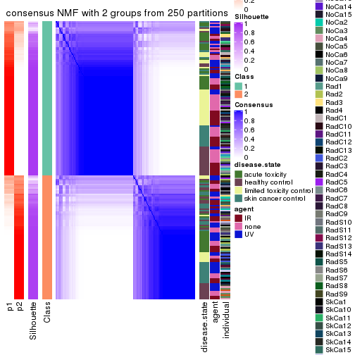</p>

</div>
<div id='tab-CV-NMF-consensus-heatmap-2'>
<pre><code class="r">consensus_heatmap(res, k = 3)
</code></pre>

<p>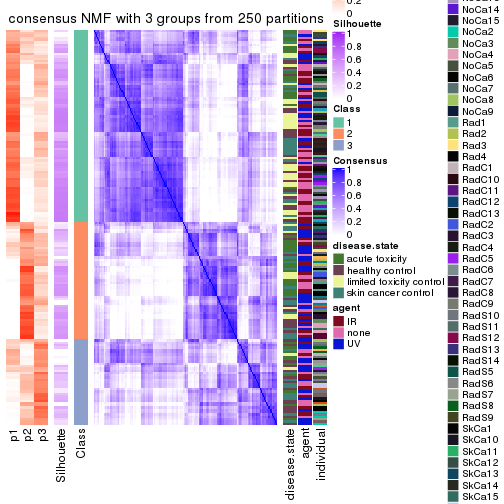</p>

</div>
<div id='tab-CV-NMF-consensus-heatmap-3'>
<pre><code class="r">consensus_heatmap(res, k = 4)
</code></pre>

<p>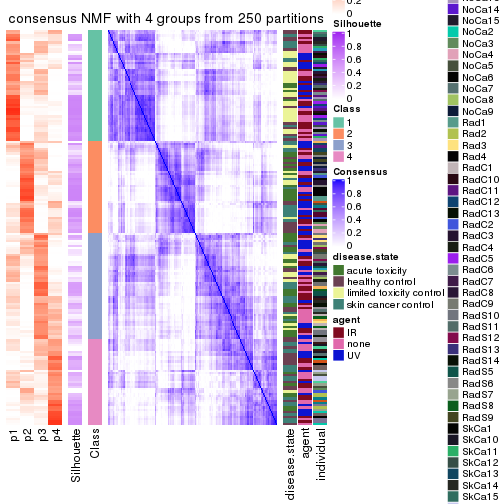</p>

</div>
<div id='tab-CV-NMF-consensus-heatmap-4'>
<pre><code class="r">consensus_heatmap(res, k = 5)
</code></pre>

<p>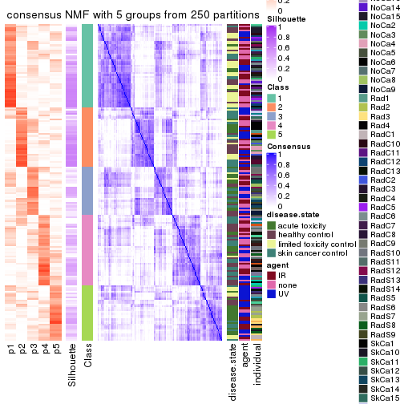</p>

</div>
<div id='tab-CV-NMF-consensus-heatmap-5'>
<pre><code class="r">consensus_heatmap(res, k = 6)
</code></pre>

<p>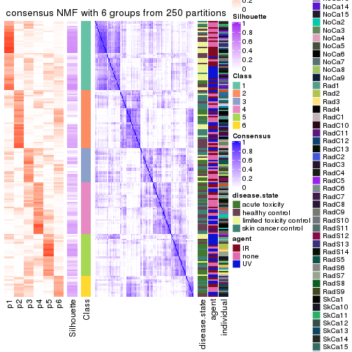</p>

</div>
</div>

Heatmaps for the membership of samples in all partitions to see how consistent they are:


<script>
$( function() {
	$( '#tabs-CV-NMF-membership-heatmap' ).tabs();
} );
</script>
<div id='tabs-CV-NMF-membership-heatmap'>
<ul>
<li><a href='#tab-CV-NMF-membership-heatmap-1'>k = 2</a></li>
<li><a href='#tab-CV-NMF-membership-heatmap-2'>k = 3</a></li>
<li><a href='#tab-CV-NMF-membership-heatmap-3'>k = 4</a></li>
<li><a href='#tab-CV-NMF-membership-heatmap-4'>k = 5</a></li>
<li><a href='#tab-CV-NMF-membership-heatmap-5'>k = 6</a></li>
</ul>
<div id='tab-CV-NMF-membership-heatmap-1'>
<pre><code class="r">membership_heatmap(res, k = 2)
</code></pre>

<p>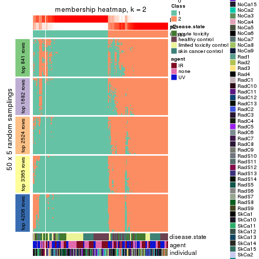</p>

</div>
<div id='tab-CV-NMF-membership-heatmap-2'>
<pre><code class="r">membership_heatmap(res, k = 3)
</code></pre>

<p>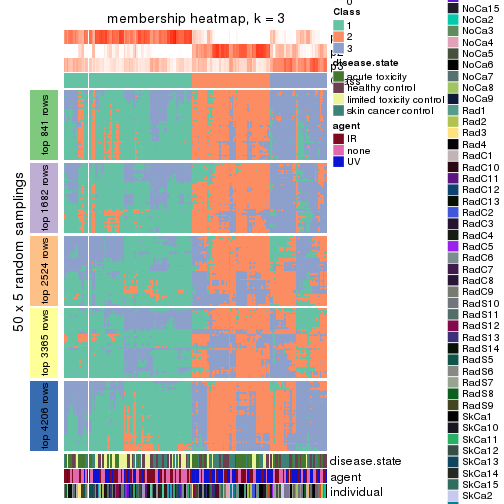</p>

</div>
<div id='tab-CV-NMF-membership-heatmap-3'>
<pre><code class="r">membership_heatmap(res, k = 4)
</code></pre>

<p>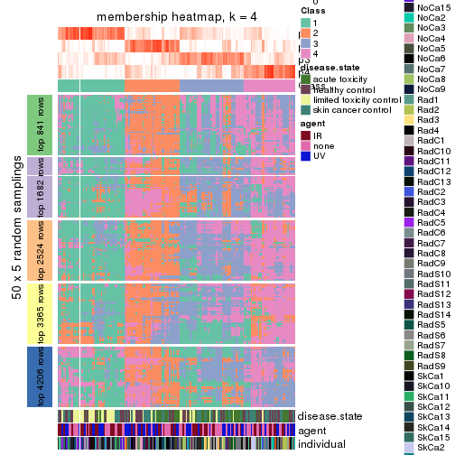</p>

</div>
<div id='tab-CV-NMF-membership-heatmap-4'>
<pre><code class="r">membership_heatmap(res, k = 5)
</code></pre>

<p>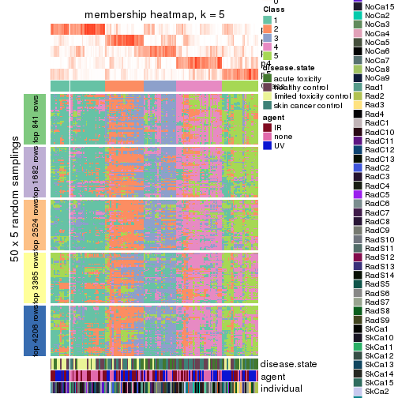</p>

</div>
<div id='tab-CV-NMF-membership-heatmap-5'>
<pre><code class="r">membership_heatmap(res, k = 6)
</code></pre>

<p>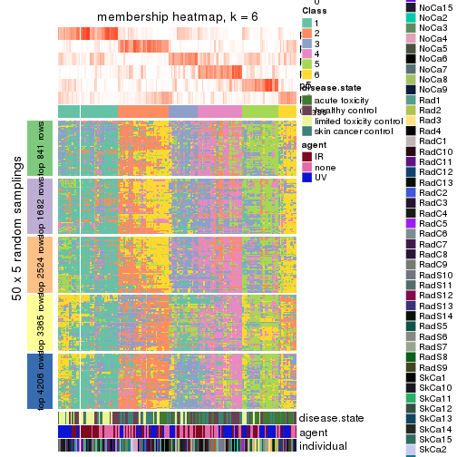</p>

</div>
</div>

As soon as we have had the classes for columns, we can look for signatures
which are significantly different between classes which can be candidate marks
for certain classes. Following are the heatmaps for signatures.


Signature heatmaps where rows are scaled:


<script>
$( function() {
	$( '#tabs-CV-NMF-get-signatures' ).tabs();
} );
</script>
<div id='tabs-CV-NMF-get-signatures'>
<ul>
<li><a href='#tab-CV-NMF-get-signatures-1'>k = 2</a></li>
<li><a href='#tab-CV-NMF-get-signatures-2'>k = 3</a></li>
<li><a href='#tab-CV-NMF-get-signatures-3'>k = 4</a></li>
<li><a href='#tab-CV-NMF-get-signatures-4'>k = 5</a></li>
<li><a href='#tab-CV-NMF-get-signatures-5'>k = 6</a></li>
</ul>
<div id='tab-CV-NMF-get-signatures-1'>
<pre><code class="r">get_signatures(res, k = 2)
</code></pre>

<p>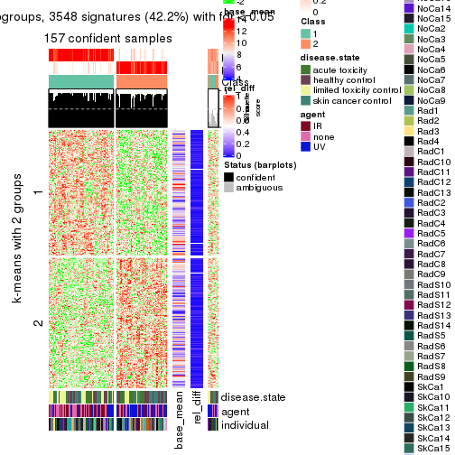</p>

</div>
<div id='tab-CV-NMF-get-signatures-2'>
<pre><code class="r">get_signatures(res, k = 3)
</code></pre>

<p>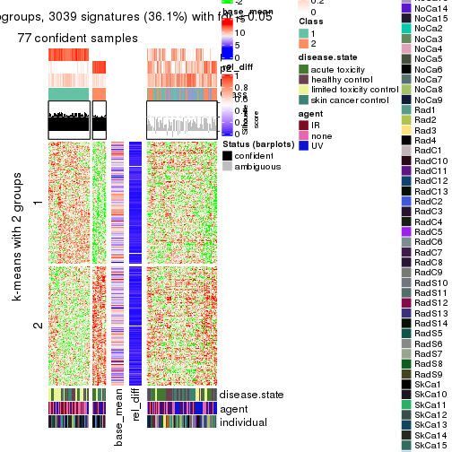</p>

</div>
<div id='tab-CV-NMF-get-signatures-3'>
<pre><code class="r">get_signatures(res, k = 4)
</code></pre>

<p>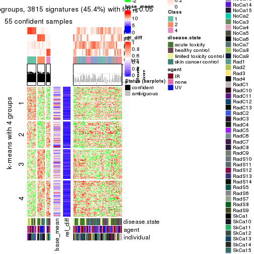</p>

</div>
<div id='tab-CV-NMF-get-signatures-4'>
<pre><code class="r">get_signatures(res, k = 5)
</code></pre>

<p>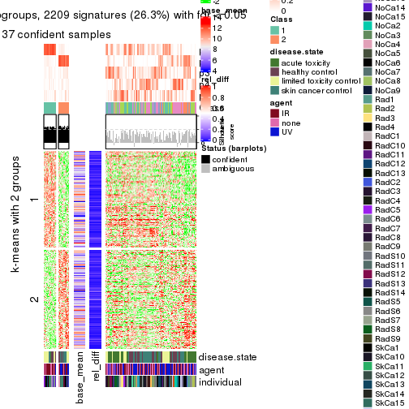</p>

</div>
<div id='tab-CV-NMF-get-signatures-5'>
<pre><code class="r">get_signatures(res, k = 6)
</code></pre>

<p>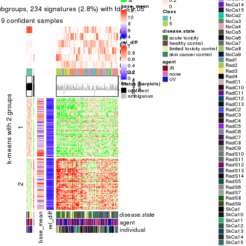</p>

</div>
</div>


Signature heatmaps where rows are not scaled:


<script>
$( function() {
	$( '#tabs-CV-NMF-get-signatures-no-scale' ).tabs();
} );
</script>
<div id='tabs-CV-NMF-get-signatures-no-scale'>
<ul>
<li><a href='#tab-CV-NMF-get-signatures-no-scale-1'>k = 2</a></li>
<li><a href='#tab-CV-NMF-get-signatures-no-scale-2'>k = 3</a></li>
<li><a href='#tab-CV-NMF-get-signatures-no-scale-3'>k = 4</a></li>
<li><a href='#tab-CV-NMF-get-signatures-no-scale-4'>k = 5</a></li>
<li><a href='#tab-CV-NMF-get-signatures-no-scale-5'>k = 6</a></li>
</ul>
<div id='tab-CV-NMF-get-signatures-no-scale-1'>
<pre><code class="r">get_signatures(res, k = 2, scale_rows = FALSE)
</code></pre>

<p>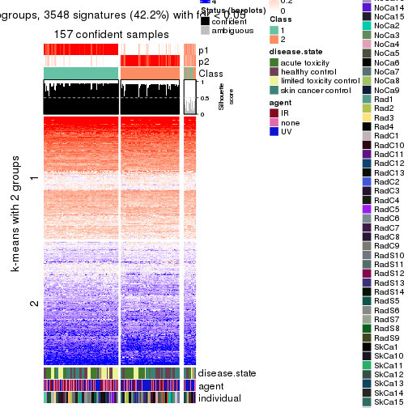</p>

</div>
<div id='tab-CV-NMF-get-signatures-no-scale-2'>
<pre><code class="r">get_signatures(res, k = 3, scale_rows = FALSE)
</code></pre>

<p>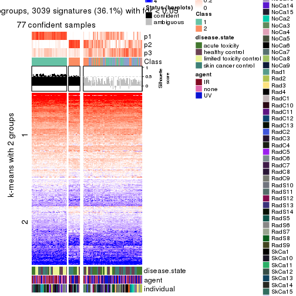</p>

</div>
<div id='tab-CV-NMF-get-signatures-no-scale-3'>
<pre><code class="r">get_signatures(res, k = 4, scale_rows = FALSE)
</code></pre>

<p>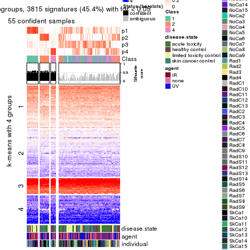</p>

</div>
<div id='tab-CV-NMF-get-signatures-no-scale-4'>
<pre><code class="r">get_signatures(res, k = 5, scale_rows = FALSE)
</code></pre>

<p>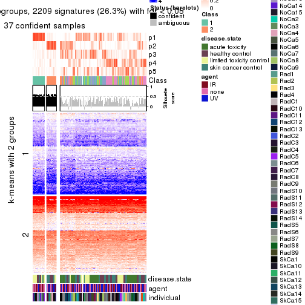</p>

</div>
<div id='tab-CV-NMF-get-signatures-no-scale-5'>
<pre><code class="r">get_signatures(res, k = 6, scale_rows = FALSE)
</code></pre>

<p>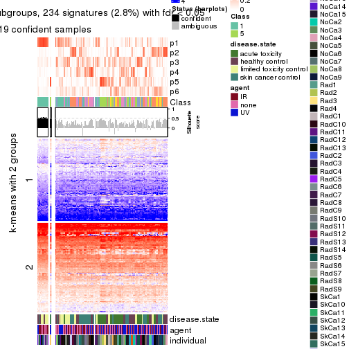</p>

</div>
</div>


Compare the overlap of signatures from different k:

```r
compare_signatures(res)
```

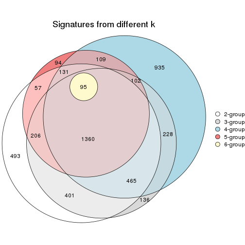

`get_signature()` returns a data frame invisibly. TO get the list of signatures, the function
call should be assigned to a variable explicitly. In following code, if `plot` argument is set
to `FALSE`, no heatmap is plotted while only the differential analysis is performed.

```r
# code only for demonstration
tb = get_signature(res, k = ..., plot = FALSE)
```

An example of the output of `tb` is:

```
#>   which_row         fdr    mean_1    mean_2 scaled_mean_1 scaled_mean_2 km
#> 1        38 0.042760348  8.373488  9.131774    -0.5533452     0.5164555  1
#> 2        40 0.018707592  7.106213  8.469186    -0.6173731     0.5762149  1
#> 3        55 0.019134737 10.221463 11.207825    -0.6159697     0.5749050  1
#> 4        59 0.006059896  5.921854  7.869574    -0.6899429     0.6439467  1
#> 5        60 0.018055526  8.928898 10.211722    -0.6204761     0.5791110  1
#> 6        98 0.009384629 15.714769 14.887706     0.6635654    -0.6193277  2
...
```

The columns in `tb` are:

1. `which_row`: row indices corresponding to the input matrix.
2. `fdr`: FDR for the differential test. 
3. `mean_x`: The mean value in group x.
4. `scaled_mean_x`: The mean value in group x after rows are scaled.
5. `km`: Row groups if k-means clustering is applied to rows.


UMAP plot which shows how samples are separated.


<script>
$( function() {
	$( '#tabs-CV-NMF-dimension-reduction' ).tabs();
} );
</script>
<div id='tabs-CV-NMF-dimension-reduction'>
<ul>
<li><a href='#tab-CV-NMF-dimension-reduction-1'>k = 2</a></li>
<li><a href='#tab-CV-NMF-dimension-reduction-2'>k = 3</a></li>
<li><a href='#tab-CV-NMF-dimension-reduction-3'>k = 4</a></li>
<li><a href='#tab-CV-NMF-dimension-reduction-4'>k = 5</a></li>
<li><a href='#tab-CV-NMF-dimension-reduction-5'>k = 6</a></li>
</ul>
<div id='tab-CV-NMF-dimension-reduction-1'>
<pre><code class="r">dimension_reduction(res, k = 2, method = &quot;UMAP&quot;)
</code></pre>

<p>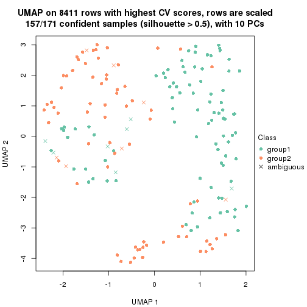</p>

</div>
<div id='tab-CV-NMF-dimension-reduction-2'>
<pre><code class="r">dimension_reduction(res, k = 3, method = &quot;UMAP&quot;)
</code></pre>

<p>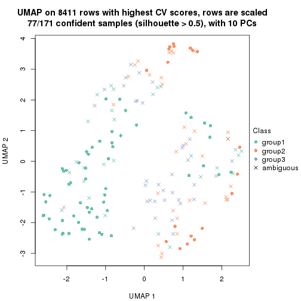</p>

</div>
<div id='tab-CV-NMF-dimension-reduction-3'>
<pre><code class="r">dimension_reduction(res, k = 4, method = &quot;UMAP&quot;)
</code></pre>

<p>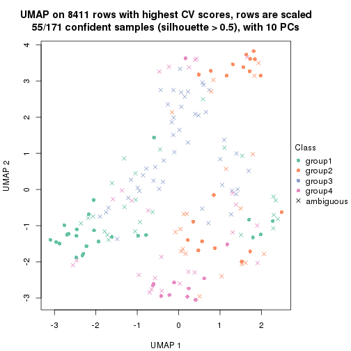</p>

</div>
<div id='tab-CV-NMF-dimension-reduction-4'>
<pre><code class="r">dimension_reduction(res, k = 5, method = &quot;UMAP&quot;)
</code></pre>

<p>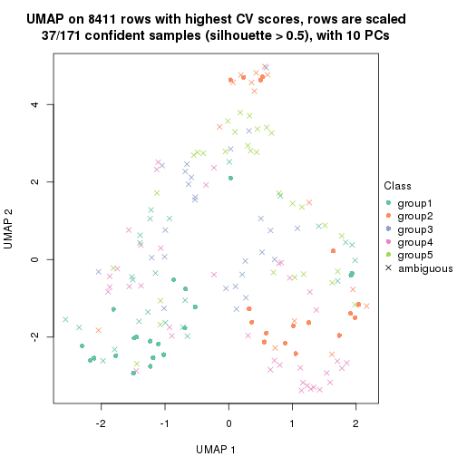</p>

</div>
<div id='tab-CV-NMF-dimension-reduction-5'>
<pre><code class="r">dimension_reduction(res, k = 6, method = &quot;UMAP&quot;)
</code></pre>

<p>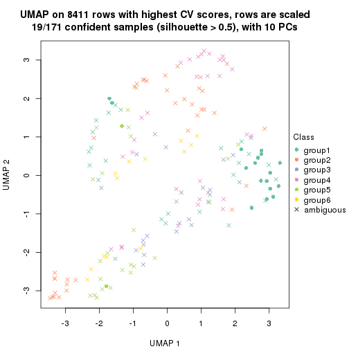</p>

</div>
</div>


Following heatmap shows how subgroups are split when increasing `k`:

```r
collect_classes(res)
```

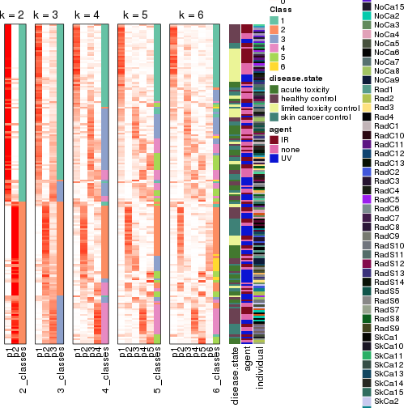


Test correlation between subgroups and known annotations. If the known
annotation is numeric, one-way ANOVA test is applied, and if the known
annotation is discrete, chi-squared contingency table test is applied.

```r
test_to_known_factors(res)
```

```
#>          n disease.state(p) agent(p) individual(p) k
#> CV:NMF 157         0.007451  0.00948      3.67e-08 2
#> CV:NMF  77         0.043337  0.04193      1.79e-04 3
#> CV:NMF  55         0.000123  0.29322      1.06e-05 4
#> CV:NMF  37         0.076965  0.03555      7.93e-03 5
#> CV:NMF  19         0.003357  0.01513      6.11e-02 6
```


If matrix rows can be associated to genes, consider to use `functional_enrichment(res,
...)` to perform function enrichment for the signature genes. See [this vignette](http://bioconductor.org/packages/devel/bioc/vignettes/cola/inst/doc/functional_enrichment.html) for more detailed explanations.


 

---------------------------------------------------


### MAD:hclust


The object with results only for a single top-value method and a single partition method 
can be extracted as:

```r
res = res_list["MAD", "hclust"]
# you can also extract it by
# res = res_list["MAD:hclust"]
```

A summary of `res` and all the functions that can be applied to it:

```r
res
```

```
#> A 'ConsensusPartition' object with k = 2, 3, 4, 5, 6.
#>   On a matrix with 8411 rows and 171 columns.
#>   Top rows (841, 1682, 2524, 3365, 4206) are extracted by 'MAD' method.
#>   Subgroups are detected by 'hclust' method.
#>   Performed in total 1250 partitions by row resampling.
#>   Best k for subgroups seems to be 3.
#> 
#> Following methods can be applied to this 'ConsensusPartition' object:
#>  [1] "cola_report"             "collect_classes"         "collect_plots"          
#>  [4] "collect_stats"           "colnames"                "compare_signatures"     
#>  [7] "consensus_heatmap"       "dimension_reduction"     "functional_enrichment"  
#> [10] "get_anno_col"            "get_anno"                "get_classes"            
#> [13] "get_consensus"           "get_matrix"              "get_membership"         
#> [16] "get_param"               "get_signatures"          "get_stats"              
#> [19] "is_best_k"               "is_stable_k"             "membership_heatmap"     
#> [22] "ncol"                    "nrow"                    "plot_ecdf"              
#> [25] "rownames"                "select_partition_number" "show"                   
#> [28] "suggest_best_k"          "test_to_known_factors"
```

`collect_plots()` function collects all the plots made from `res` for all `k` (number of partitions)
into one single page to provide an easy and fast comparison between different `k`.

```r
collect_plots(res)
```

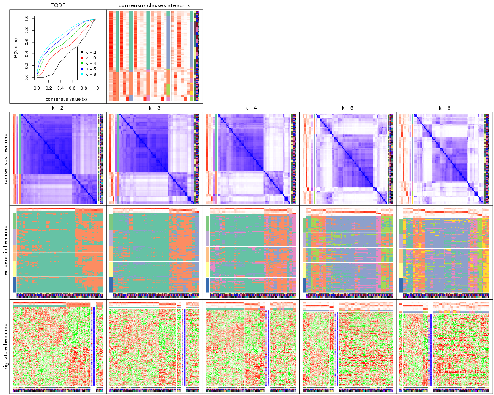

The plots are:

- The first row: a plot of the ECDF (empirical cumulative distribution
  function) curves of the consensus matrix for each `k` and the heatmap of
  predicted classes for each `k`.
- The second row: heatmaps of the consensus matrix for each `k`.
- The third row: heatmaps of the membership matrix for each `k`.
- The fouth row: heatmaps of the signatures for each `k`.

All the plots in panels can be made by individual functions and they are
plotted later in this section.

`select_partition_number()` produces several plots showing different
statistics for choosing "optimized" `k`. There are following statistics:

- ECDF curves of the consensus matrix for each `k`;
- 1-PAC. [The PAC
  score](https://en.wikipedia.org/wiki/Consensus_clustering#Over-interpretation_potential_of_consensus_clustering)
  measures the proportion of the ambiguous subgrouping.
- Mean silhouette score.
- Concordance. The mean probability of fiting the consensus class ids in all
  partitions.
- Area increased. Denote $A_k$ as the area under the ECDF curve for current
  `k`, the area increased is defined as $A_k - A_{k-1}$.
- Rand index. The percent of pairs of samples that are both in a same cluster
  or both are not in a same cluster in the partition of k and k-1.
- Jaccard index. The ratio of pairs of samples are both in a same cluster in
  the partition of k and k-1 and the pairs of samples are both in a same
  cluster in the partition k or k-1.

The detailed explanations of these statistics can be found in [the _cola_
vignette](http://bioconductor.org/packages/devel/bioc/vignettes/cola/inst/doc/cola.html#toc_13).

Generally speaking, lower PAC score, higher mean silhouette score or higher
concordance corresponds to better partition. Rand index and Jaccard index
measure how similar the current partition is compared to partition with `k-1`.
If they are too similar, we won't accept `k` is better than `k-1`.

```r
select_partition_number(res)
```

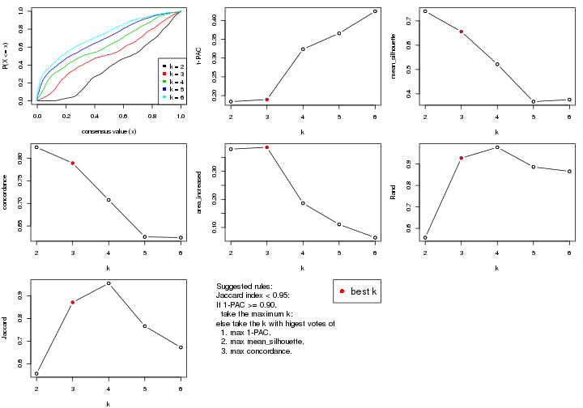

The numeric values for all these statistics can be obtained by `get_stats()`.

```r
get_stats(res)
```

```
#>   k 1-PAC mean_silhouette concordance area_increased  Rand Jaccard
#> 2 2 0.184           0.740       0.825         0.3790 0.557   0.557
#> 3 3 0.190           0.656       0.789         0.3856 0.927   0.871
#> 4 4 0.324           0.522       0.708         0.1862 0.978   0.955
#> 5 5 0.366           0.368       0.626         0.1108 0.886   0.766
#> 6 6 0.425           0.376       0.624         0.0637 0.866   0.672
```

`suggest_best_k()` suggests the best $k$ based on these statistics. The rules are as follows:

- All $k$ with Jaccard index larger than 0.95 are removed because increasing
  $k$ does not provide enough extra information. If all $k$ are removed, it is
  marked as no subgroup is detected.
- For all $k$ with 1-PAC score larger than 0.9, the maximal $k$ is taken as
  the best $k$, and other $k$ are marked as optional $k$.
- If it does not fit the second rule. The $k$ with the maximal vote of the
  highest 1-PAC score, highest mean silhouette, and highest concordance is
  taken as the best $k$.

```r
suggest_best_k(res)
```

```
#> [1] 3
```


Following shows the table of the partitions (You need to click the **show/hide
code output** link to see it). The membership matrix (columns with name `p*`)
is inferred by
[`clue::cl_consensus()`](https://www.rdocumentation.org/link/cl_consensus?package=clue)
function with the `SE` method. Basically the value in the membership matrix
represents the probability to belong to a certain group. The finall class
label for an item is determined with the group with highest probability it
belongs to.

In `get_classes()` function, the entropy is calculated from the membership
matrix and the silhouette score is calculated from the consensus matrix.


<script>
$( function() {
	$( '#tabs-MAD-hclust-get-classes' ).tabs();
} );
</script>
<div id='tabs-MAD-hclust-get-classes'>
<ul>
<li><a href='#tab-MAD-hclust-get-classes-1'>k = 2</a></li>
<li><a href='#tab-MAD-hclust-get-classes-2'>k = 3</a></li>
<li><a href='#tab-MAD-hclust-get-classes-3'>k = 4</a></li>
<li><a href='#tab-MAD-hclust-get-classes-4'>k = 5</a></li>
<li><a href='#tab-MAD-hclust-get-classes-5'>k = 6</a></li>
</ul>

<div id='tab-MAD-hclust-get-classes-1'>
<p><a id='tab-MAD-hclust-get-classes-1-a' style='color:#0366d6' href='#'>show/hide code output</a></p>
<pre><code class="r">cbind(get_classes(res, k = 2), get_membership(res, k = 2))
</code></pre>

<pre><code>#&gt;          class entropy silhouette    p1    p2
#&gt; GSM29783     2  0.9963      0.493 0.464 0.536
#&gt; GSM29786     2  0.9933      0.475 0.452 0.548
#&gt; GSM29789     2  0.8443      0.780 0.272 0.728
#&gt; GSM29792     2  0.5946      0.722 0.144 0.856
#&gt; GSM29795     2  0.8267      0.766 0.260 0.740
#&gt; GSM29798     1  0.8144      0.600 0.748 0.252
#&gt; GSM29801     1  0.3431      0.853 0.936 0.064
#&gt; GSM29804     1  0.2948      0.857 0.948 0.052
#&gt; GSM29807     1  0.8207      0.540 0.744 0.256
#&gt; GSM29816     1  0.1633      0.854 0.976 0.024
#&gt; GSM29821     1  0.6048      0.786 0.852 0.148
#&gt; GSM29824     1  0.2423      0.857 0.960 0.040
#&gt; GSM29827     1  0.1633      0.851 0.976 0.024
#&gt; GSM29830     1  0.2603      0.856 0.956 0.044
#&gt; GSM29833     1  0.2603      0.852 0.956 0.044
#&gt; GSM29784     2  0.9754      0.616 0.408 0.592
#&gt; GSM29787     2  0.9933      0.475 0.452 0.548
#&gt; GSM29790     2  0.8443      0.780 0.272 0.728
#&gt; GSM29793     2  0.5946      0.722 0.144 0.856
#&gt; GSM29796     2  0.8267      0.766 0.260 0.740
#&gt; GSM29799     1  0.8144      0.600 0.748 0.252
#&gt; GSM29802     1  0.3431      0.855 0.936 0.064
#&gt; GSM29805     1  0.2948      0.857 0.948 0.052
#&gt; GSM29814     1  0.8207      0.540 0.744 0.256
#&gt; GSM29817     1  0.1633      0.854 0.976 0.024
#&gt; GSM29822     1  0.6048      0.786 0.852 0.148
#&gt; GSM29825     1  0.2423      0.857 0.960 0.040
#&gt; GSM29828     1  0.1633      0.851 0.976 0.024
#&gt; GSM29831     1  0.1414      0.850 0.980 0.020
#&gt; GSM29834     1  0.2778      0.851 0.952 0.048
#&gt; GSM29785     2  0.9754      0.616 0.408 0.592
#&gt; GSM29788     2  0.9933      0.475 0.452 0.548
#&gt; GSM29791     2  0.8443      0.780 0.272 0.728
#&gt; GSM29794     2  0.5946      0.722 0.144 0.856
#&gt; GSM29797     2  0.8267      0.766 0.260 0.740
#&gt; GSM29800     1  0.8144      0.600 0.748 0.252
#&gt; GSM29803     1  0.3733      0.855 0.928 0.072
#&gt; GSM29806     1  0.3274      0.858 0.940 0.060
#&gt; GSM29815     1  0.8207      0.540 0.744 0.256
#&gt; GSM29819     1  0.3114      0.856 0.944 0.056
#&gt; GSM29823     1  0.6048      0.786 0.852 0.148
#&gt; GSM29826     1  0.2423      0.857 0.960 0.040
#&gt; GSM29829     1  0.4939      0.822 0.892 0.108
#&gt; GSM29832     1  0.3879      0.844 0.924 0.076
#&gt; GSM29835     1  0.7950      0.611 0.760 0.240
#&gt; GSM29836     2  0.5178      0.706 0.116 0.884
#&gt; GSM29839     2  0.9087      0.757 0.324 0.676
#&gt; GSM29842     1  0.9963     -0.332 0.536 0.464
#&gt; GSM29845     1  0.6801      0.751 0.820 0.180
#&gt; GSM29848     1  0.9933     -0.160 0.548 0.452
#&gt; GSM29851     1  0.3584      0.853 0.932 0.068
#&gt; GSM29854     1  0.5946      0.806 0.856 0.144
#&gt; GSM29857     1  0.3733      0.858 0.928 0.072
#&gt; GSM29860     2  0.9000      0.759 0.316 0.684
#&gt; GSM29863     1  0.3431      0.855 0.936 0.064
#&gt; GSM29866     1  0.2043      0.859 0.968 0.032
#&gt; GSM29869     1  0.0672      0.850 0.992 0.008
#&gt; GSM29872     2  0.8499      0.751 0.276 0.724
#&gt; GSM29875     1  0.1184      0.854 0.984 0.016
#&gt; GSM29878     2  0.9988      0.552 0.480 0.520
#&gt; GSM29837     2  0.5178      0.706 0.116 0.884
#&gt; GSM29840     2  0.9087      0.757 0.324 0.676
#&gt; GSM29843     2  0.9087      0.769 0.324 0.676
#&gt; GSM29846     1  0.6801      0.751 0.820 0.180
#&gt; GSM29849     1  0.9933     -0.160 0.548 0.452
#&gt; GSM29852     1  0.3584      0.853 0.932 0.068
#&gt; GSM29855     1  0.6247      0.796 0.844 0.156
#&gt; GSM29858     1  0.3733      0.858 0.928 0.072
#&gt; GSM29861     2  0.9000      0.759 0.316 0.684
#&gt; GSM29864     1  0.3431      0.855 0.936 0.064
#&gt; GSM29867     1  0.1414      0.854 0.980 0.020
#&gt; GSM29870     1  0.0672      0.850 0.992 0.008
#&gt; GSM29873     2  0.8499      0.751 0.276 0.724
#&gt; GSM29876     1  0.1184      0.854 0.984 0.016
#&gt; GSM29879     2  0.9988      0.552 0.480 0.520
#&gt; GSM29838     2  0.5178      0.706 0.116 0.884
#&gt; GSM29841     2  0.9087      0.757 0.324 0.676
#&gt; GSM29844     2  0.9087      0.769 0.324 0.676
#&gt; GSM29847     1  0.6801      0.751 0.820 0.180
#&gt; GSM29850     1  0.9933     -0.160 0.548 0.452
#&gt; GSM29853     1  0.3584      0.853 0.932 0.068
#&gt; GSM29856     1  0.7056      0.757 0.808 0.192
#&gt; GSM29859     1  0.3733      0.858 0.928 0.072
#&gt; GSM29862     2  0.9000      0.759 0.316 0.684
#&gt; GSM29865     1  0.3733      0.855 0.928 0.072
#&gt; GSM29868     1  0.8661      0.493 0.712 0.288
#&gt; GSM29871     1  0.0672      0.850 0.992 0.008
#&gt; GSM29874     2  0.8499      0.751 0.276 0.724
#&gt; GSM29877     1  0.1184      0.854 0.984 0.016
#&gt; GSM29880     2  0.9998      0.472 0.492 0.508
#&gt; GSM29881     1  0.3733      0.853 0.928 0.072
#&gt; GSM29884     2  0.9286      0.763 0.344 0.656
#&gt; GSM29887     2  0.9286      0.763 0.344 0.656
#&gt; GSM29890     1  0.0376      0.849 0.996 0.004
#&gt; GSM29893     1  0.8386      0.577 0.732 0.268
#&gt; GSM29896     1  0.1843      0.854 0.972 0.028
#&gt; GSM29899     1  0.0938      0.852 0.988 0.012
#&gt; GSM29902     1  0.3584      0.855 0.932 0.068
#&gt; GSM29905     1  0.6048      0.777 0.852 0.148
#&gt; GSM29908     1  0.3114      0.852 0.944 0.056
#&gt; GSM29955     1  0.4161      0.843 0.916 0.084
#&gt; GSM29958     1  0.2603      0.852 0.956 0.044
#&gt; GSM29961     1  0.2948      0.853 0.948 0.052
#&gt; GSM29882     1  0.3733      0.853 0.928 0.072
#&gt; GSM29885     2  0.9286      0.763 0.344 0.656
#&gt; GSM29888     2  0.9286      0.763 0.344 0.656
#&gt; GSM29891     1  0.0376      0.849 0.996 0.004
#&gt; GSM29894     1  0.8386      0.577 0.732 0.268
#&gt; GSM29897     1  0.1633      0.853 0.976 0.024
#&gt; GSM29900     1  0.0938      0.852 0.988 0.012
#&gt; GSM29903     1  0.0938      0.853 0.988 0.012
#&gt; GSM29906     1  0.6048      0.777 0.852 0.148
#&gt; GSM29909     1  0.0938      0.851 0.988 0.012
#&gt; GSM29956     1  0.2603      0.852 0.956 0.044
#&gt; GSM29959     1  0.2603      0.852 0.956 0.044
#&gt; GSM29962     1  0.2948      0.854 0.948 0.052
#&gt; GSM29883     1  0.3733      0.853 0.928 0.072
#&gt; GSM29886     2  0.9286      0.763 0.344 0.656
#&gt; GSM29889     2  0.9248      0.766 0.340 0.660
#&gt; GSM29892     1  0.0376      0.849 0.996 0.004
#&gt; GSM29895     1  0.8608      0.538 0.716 0.284
#&gt; GSM29898     1  0.6887      0.734 0.816 0.184
#&gt; GSM29901     1  0.1843      0.860 0.972 0.028
#&gt; GSM29904     1  0.5408      0.813 0.876 0.124
#&gt; GSM29907     1  0.6048      0.777 0.852 0.148
#&gt; GSM29910     1  0.9248      0.349 0.660 0.340
#&gt; GSM29957     1  0.4161      0.843 0.916 0.084
#&gt; GSM29960     1  0.6712      0.743 0.824 0.176
#&gt; GSM29963     1  0.9248      0.349 0.660 0.340
#&gt; GSM29964     2  0.8555      0.781 0.280 0.720
#&gt; GSM29967     2  0.8909      0.693 0.308 0.692
#&gt; GSM29970     2  0.9044      0.683 0.320 0.680
#&gt; GSM29973     2  0.8267      0.773 0.260 0.740
#&gt; GSM29976     1  0.2603      0.856 0.956 0.044
#&gt; GSM29979     2  0.7602      0.755 0.220 0.780
#&gt; GSM29982     2  0.9922      0.469 0.448 0.552
#&gt; GSM29985     1  0.3431      0.856 0.936 0.064
#&gt; GSM29988     1  0.4431      0.811 0.908 0.092
#&gt; GSM29991     1  0.7815      0.612 0.768 0.232
#&gt; GSM29994     1  0.3114      0.860 0.944 0.056
#&gt; GSM29997     1  0.3584      0.825 0.932 0.068
#&gt; GSM30000     1  0.5408      0.811 0.876 0.124
#&gt; GSM30003     1  0.1414      0.854 0.980 0.020
#&gt; GSM29965     2  0.8555      0.781 0.280 0.720
#&gt; GSM29968     2  0.8909      0.693 0.308 0.692
#&gt; GSM29971     2  0.9044      0.683 0.320 0.680
#&gt; GSM29974     2  0.8267      0.773 0.260 0.740
#&gt; GSM29977     1  0.2603      0.856 0.956 0.044
#&gt; GSM29980     2  0.7602      0.755 0.220 0.780
#&gt; GSM29983     2  0.9922      0.469 0.448 0.552
#&gt; GSM29986     1  0.3431      0.856 0.936 0.064
#&gt; GSM29989     1  0.4431      0.811 0.908 0.092
#&gt; GSM29992     1  0.7815      0.612 0.768 0.232
#&gt; GSM29995     1  0.1414      0.854 0.980 0.020
#&gt; GSM29998     1  0.3584      0.825 0.932 0.068
#&gt; GSM30001     1  0.5408      0.811 0.876 0.124
#&gt; GSM30004     1  0.1414      0.854 0.980 0.020
#&gt; GSM29966     2  0.8555      0.781 0.280 0.720
#&gt; GSM29969     2  0.8909      0.693 0.308 0.692
#&gt; GSM29972     2  0.9044      0.683 0.320 0.680
#&gt; GSM29975     2  0.8267      0.773 0.260 0.740
#&gt; GSM29978     1  0.2603      0.856 0.956 0.044
#&gt; GSM29981     2  0.7453      0.752 0.212 0.788
#&gt; GSM29984     2  0.9922      0.469 0.448 0.552
#&gt; GSM29987     1  0.3431      0.856 0.936 0.064
#&gt; GSM29990     1  0.4431      0.811 0.908 0.092
#&gt; GSM29993     1  0.7815      0.612 0.768 0.232
#&gt; GSM29996     1  0.4161      0.843 0.916 0.084
#&gt; GSM29999     1  0.3584      0.825 0.932 0.068
#&gt; GSM30002     1  0.5408      0.811 0.876 0.124
#&gt; GSM30005     1  0.1414      0.854 0.980 0.020
</code></pre>

<script>
$('#tab-MAD-hclust-get-classes-1-a').parent().next().next().hide();
$('#tab-MAD-hclust-get-classes-1-a').click(function(){
  $('#tab-MAD-hclust-get-classes-1-a').parent().next().next().toggle();
  return(false);
});
</script>
</div>

<div id='tab-MAD-hclust-get-classes-2'>
<p><a id='tab-MAD-hclust-get-classes-2-a' style='color:#0366d6' href='#'>show/hide code output</a></p>
<pre><code class="r">cbind(get_classes(res, k = 3), get_membership(res, k = 3))
</code></pre>

<pre><code>#&gt;          class entropy silhouette    p1    p2    p3
#&gt; GSM29783     2  0.9917    -0.0997 0.272 0.376 0.352
#&gt; GSM29786     3  0.9464     0.3326 0.252 0.248 0.500
#&gt; GSM29789     2  0.5657     0.6636 0.088 0.808 0.104
#&gt; GSM29792     2  0.3155     0.6187 0.044 0.916 0.040
#&gt; GSM29795     2  0.8310     0.3957 0.088 0.544 0.368
#&gt; GSM29798     1  0.7987     0.4220 0.616 0.092 0.292
#&gt; GSM29801     1  0.3686     0.8007 0.860 0.000 0.140
#&gt; GSM29804     1  0.3618     0.8154 0.884 0.012 0.104
#&gt; GSM29807     1  0.7876     0.3483 0.612 0.308 0.080
#&gt; GSM29816     1  0.1753     0.8243 0.952 0.000 0.048
#&gt; GSM29821     1  0.6521     0.6495 0.712 0.040 0.248
#&gt; GSM29824     1  0.2200     0.8286 0.940 0.004 0.056
#&gt; GSM29827     1  0.1453     0.8210 0.968 0.024 0.008
#&gt; GSM29830     1  0.2152     0.8243 0.948 0.036 0.016
#&gt; GSM29833     1  0.2176     0.8214 0.948 0.032 0.020
#&gt; GSM29784     2  0.9601     0.0180 0.200 0.408 0.392
#&gt; GSM29787     3  0.9464     0.3326 0.252 0.248 0.500
#&gt; GSM29790     2  0.5657     0.6636 0.088 0.808 0.104
#&gt; GSM29793     2  0.3155     0.6187 0.044 0.916 0.040
#&gt; GSM29796     2  0.8310     0.3957 0.088 0.544 0.368
#&gt; GSM29799     1  0.7987     0.4220 0.616 0.092 0.292
#&gt; GSM29802     1  0.3482     0.8056 0.872 0.000 0.128
#&gt; GSM29805     1  0.3618     0.8154 0.884 0.012 0.104
#&gt; GSM29814     1  0.7876     0.3483 0.612 0.308 0.080
#&gt; GSM29817     1  0.1753     0.8243 0.952 0.000 0.048
#&gt; GSM29822     1  0.6521     0.6495 0.712 0.040 0.248
#&gt; GSM29825     1  0.2200     0.8288 0.940 0.004 0.056
#&gt; GSM29828     1  0.1453     0.8210 0.968 0.024 0.008
#&gt; GSM29831     1  0.1315     0.8206 0.972 0.020 0.008
#&gt; GSM29834     1  0.2681     0.8224 0.932 0.040 0.028
#&gt; GSM29785     2  0.9601     0.0180 0.200 0.408 0.392
#&gt; GSM29788     3  0.9464     0.3326 0.252 0.248 0.500
#&gt; GSM29791     2  0.5657     0.6636 0.088 0.808 0.104
#&gt; GSM29794     2  0.3155     0.6187 0.044 0.916 0.040
#&gt; GSM29797     2  0.8310     0.3957 0.088 0.544 0.368
#&gt; GSM29800     1  0.7987     0.4220 0.616 0.092 0.292
#&gt; GSM29803     1  0.4033     0.7997 0.856 0.008 0.136
#&gt; GSM29806     1  0.3832     0.8169 0.880 0.020 0.100
#&gt; GSM29815     1  0.7876     0.3483 0.612 0.308 0.080
#&gt; GSM29819     1  0.3425     0.8133 0.884 0.004 0.112
#&gt; GSM29823     1  0.6521     0.6495 0.712 0.040 0.248
#&gt; GSM29826     1  0.2200     0.8288 0.940 0.004 0.056
#&gt; GSM29829     1  0.4035     0.7974 0.880 0.080 0.040
#&gt; GSM29832     1  0.3310     0.8131 0.908 0.064 0.028
#&gt; GSM29835     1  0.6886     0.6402 0.728 0.184 0.088
#&gt; GSM29836     2  0.2496     0.5843 0.004 0.928 0.068
#&gt; GSM29839     2  0.8350     0.5143 0.176 0.628 0.196
#&gt; GSM29842     2  0.9736     0.0703 0.324 0.436 0.240
#&gt; GSM29845     1  0.6764     0.6506 0.716 0.060 0.224
#&gt; GSM29848     3  0.9786     0.3306 0.364 0.236 0.400
#&gt; GSM29851     1  0.3752     0.7992 0.856 0.000 0.144
#&gt; GSM29854     1  0.5726     0.7345 0.760 0.024 0.216
#&gt; GSM29857     1  0.4196     0.8146 0.864 0.024 0.112
#&gt; GSM29860     2  0.6764     0.6281 0.148 0.744 0.108
#&gt; GSM29863     1  0.3644     0.8094 0.872 0.004 0.124
#&gt; GSM29866     1  0.1491     0.8284 0.968 0.016 0.016
#&gt; GSM29869     1  0.1170     0.8224 0.976 0.008 0.016
#&gt; GSM29872     2  0.6062     0.6020 0.160 0.776 0.064
#&gt; GSM29875     1  0.1289     0.8251 0.968 0.000 0.032
#&gt; GSM29878     2  0.8280     0.3724 0.344 0.564 0.092
#&gt; GSM29837     2  0.2496     0.5843 0.004 0.928 0.068
#&gt; GSM29840     2  0.8350     0.5143 0.176 0.628 0.196
#&gt; GSM29843     2  0.7692     0.6142 0.136 0.680 0.184
#&gt; GSM29846     1  0.6764     0.6506 0.716 0.060 0.224
#&gt; GSM29849     3  0.9786     0.3306 0.364 0.236 0.400
#&gt; GSM29852     1  0.3752     0.7992 0.856 0.000 0.144
#&gt; GSM29855     1  0.5860     0.7228 0.748 0.024 0.228
#&gt; GSM29858     1  0.4196     0.8146 0.864 0.024 0.112
#&gt; GSM29861     2  0.6764     0.6281 0.148 0.744 0.108
#&gt; GSM29864     1  0.3644     0.8094 0.872 0.004 0.124
#&gt; GSM29867     1  0.0848     0.8228 0.984 0.008 0.008
#&gt; GSM29870     1  0.1170     0.8224 0.976 0.008 0.016
#&gt; GSM29873     2  0.6062     0.6020 0.160 0.776 0.064
#&gt; GSM29876     1  0.1289     0.8251 0.968 0.000 0.032
#&gt; GSM29879     2  0.8280     0.3724 0.344 0.564 0.092
#&gt; GSM29838     2  0.2496     0.5843 0.004 0.928 0.068
#&gt; GSM29841     2  0.8350     0.5143 0.176 0.628 0.196
#&gt; GSM29844     2  0.7644     0.6176 0.136 0.684 0.180
#&gt; GSM29847     1  0.6764     0.6506 0.716 0.060 0.224
#&gt; GSM29850     3  0.9786     0.3306 0.364 0.236 0.400
#&gt; GSM29853     1  0.3752     0.7992 0.856 0.000 0.144
#&gt; GSM29856     1  0.6523     0.6922 0.724 0.048 0.228
#&gt; GSM29859     1  0.4196     0.8146 0.864 0.024 0.112
#&gt; GSM29862     2  0.6764     0.6281 0.148 0.744 0.108
#&gt; GSM29865     1  0.3918     0.8104 0.868 0.012 0.120
#&gt; GSM29868     1  0.7413     0.5600 0.684 0.224 0.092
#&gt; GSM29871     1  0.1170     0.8224 0.976 0.008 0.016
#&gt; GSM29874     2  0.6062     0.6020 0.160 0.776 0.064
#&gt; GSM29877     1  0.1289     0.8251 0.968 0.000 0.032
#&gt; GSM29880     2  0.8652     0.1842 0.404 0.492 0.104
#&gt; GSM29881     1  0.3551     0.8095 0.868 0.000 0.132
#&gt; GSM29884     2  0.7816     0.6406 0.132 0.668 0.200
#&gt; GSM29887     2  0.7816     0.6406 0.132 0.668 0.200
#&gt; GSM29890     1  0.1170     0.8201 0.976 0.016 0.008
#&gt; GSM29893     1  0.7692     0.5635 0.680 0.136 0.184
#&gt; GSM29896     1  0.1774     0.8244 0.960 0.016 0.024
#&gt; GSM29899     1  0.1129     0.8229 0.976 0.004 0.020
#&gt; GSM29902     1  0.3572     0.8212 0.900 0.040 0.060
#&gt; GSM29905     1  0.6351     0.6920 0.760 0.072 0.168
#&gt; GSM29908     1  0.2527     0.8212 0.936 0.044 0.020
#&gt; GSM29955     1  0.3683     0.8122 0.896 0.060 0.044
#&gt; GSM29958     1  0.2443     0.8231 0.940 0.032 0.028
#&gt; GSM29961     1  0.2414     0.8218 0.940 0.040 0.020
#&gt; GSM29882     1  0.3551     0.8095 0.868 0.000 0.132
#&gt; GSM29885     2  0.7816     0.6406 0.132 0.668 0.200
#&gt; GSM29888     2  0.7816     0.6406 0.132 0.668 0.200
#&gt; GSM29891     1  0.1170     0.8201 0.976 0.016 0.008
#&gt; GSM29894     1  0.7692     0.5635 0.680 0.136 0.184
#&gt; GSM29897     1  0.1636     0.8238 0.964 0.016 0.020
#&gt; GSM29900     1  0.1129     0.8229 0.976 0.004 0.020
#&gt; GSM29903     1  0.1482     0.8228 0.968 0.020 0.012
#&gt; GSM29906     1  0.6351     0.6920 0.760 0.072 0.168
#&gt; GSM29909     1  0.1015     0.8207 0.980 0.012 0.008
#&gt; GSM29956     1  0.2269     0.8215 0.944 0.040 0.016
#&gt; GSM29959     1  0.2443     0.8231 0.940 0.032 0.028
#&gt; GSM29962     1  0.2434     0.8244 0.940 0.036 0.024
#&gt; GSM29883     1  0.3551     0.8095 0.868 0.000 0.132
#&gt; GSM29886     2  0.7712     0.6442 0.128 0.676 0.196
#&gt; GSM29889     2  0.7651     0.6461 0.124 0.680 0.196
#&gt; GSM29892     1  0.1315     0.8221 0.972 0.020 0.008
#&gt; GSM29895     1  0.7869     0.5347 0.668 0.152 0.180
#&gt; GSM29898     1  0.6526     0.7147 0.760 0.112 0.128
#&gt; GSM29901     1  0.2446     0.8328 0.936 0.012 0.052
#&gt; GSM29904     1  0.4807     0.7906 0.848 0.092 0.060
#&gt; GSM29907     1  0.6351     0.6920 0.760 0.072 0.168
#&gt; GSM29910     1  0.8142     0.4297 0.620 0.268 0.112
#&gt; GSM29957     1  0.3683     0.8122 0.896 0.060 0.044
#&gt; GSM29960     1  0.5831     0.7318 0.796 0.128 0.076
#&gt; GSM29963     1  0.8142     0.4297 0.620 0.268 0.112
#&gt; GSM29964     2  0.6245     0.6451 0.060 0.760 0.180
#&gt; GSM29967     3  0.1999     0.5295 0.012 0.036 0.952
#&gt; GSM29970     3  0.1905     0.5354 0.016 0.028 0.956
#&gt; GSM29973     2  0.6046     0.6515 0.080 0.784 0.136
#&gt; GSM29976     1  0.2878     0.8156 0.904 0.000 0.096
#&gt; GSM29979     2  0.8109     0.5374 0.116 0.628 0.256
#&gt; GSM29982     3  0.5894     0.5469 0.220 0.028 0.752
#&gt; GSM29985     1  0.3267     0.8150 0.884 0.000 0.116
#&gt; GSM29988     1  0.5348     0.6846 0.796 0.176 0.028
#&gt; GSM29991     1  0.8148     0.3276 0.604 0.100 0.296
#&gt; GSM29994     1  0.3263     0.8246 0.912 0.040 0.048
#&gt; GSM29997     1  0.4128     0.7410 0.856 0.132 0.012
#&gt; GSM30000     1  0.6264     0.6961 0.764 0.068 0.168
#&gt; GSM30003     1  0.1999     0.8280 0.952 0.012 0.036
#&gt; GSM29965     2  0.6245     0.6451 0.060 0.760 0.180
#&gt; GSM29968     3  0.1999     0.5295 0.012 0.036 0.952
#&gt; GSM29971     3  0.1905     0.5354 0.016 0.028 0.956
#&gt; GSM29974     2  0.6046     0.6515 0.080 0.784 0.136
#&gt; GSM29977     1  0.2878     0.8156 0.904 0.000 0.096
#&gt; GSM29980     2  0.8109     0.5374 0.116 0.628 0.256
#&gt; GSM29983     3  0.5894     0.5469 0.220 0.028 0.752
#&gt; GSM29986     1  0.3267     0.8150 0.884 0.000 0.116
#&gt; GSM29989     1  0.5348     0.6846 0.796 0.176 0.028
#&gt; GSM29992     1  0.8148     0.3276 0.604 0.100 0.296
#&gt; GSM29995     1  0.1774     0.8231 0.960 0.024 0.016
#&gt; GSM29998     1  0.4128     0.7410 0.856 0.132 0.012
#&gt; GSM30001     1  0.6264     0.6961 0.764 0.068 0.168
#&gt; GSM30004     1  0.1999     0.8280 0.952 0.012 0.036
#&gt; GSM29966     2  0.6245     0.6451 0.060 0.760 0.180
#&gt; GSM29969     3  0.1999     0.5295 0.012 0.036 0.952
#&gt; GSM29972     3  0.1905     0.5354 0.016 0.028 0.956
#&gt; GSM29975     2  0.6046     0.6515 0.080 0.784 0.136
#&gt; GSM29978     1  0.2878     0.8156 0.904 0.000 0.096
#&gt; GSM29981     2  0.8007     0.5325 0.116 0.640 0.244
#&gt; GSM29984     3  0.5894     0.5469 0.220 0.028 0.752
#&gt; GSM29987     1  0.3267     0.8150 0.884 0.000 0.116
#&gt; GSM29990     1  0.5348     0.6846 0.796 0.176 0.028
#&gt; GSM29993     1  0.8148     0.3276 0.604 0.100 0.296
#&gt; GSM29996     1  0.3456     0.8141 0.904 0.060 0.036
#&gt; GSM29999     1  0.4485     0.7363 0.844 0.136 0.020
#&gt; GSM30002     1  0.6264     0.6961 0.764 0.068 0.168
#&gt; GSM30005     1  0.1999     0.8280 0.952 0.012 0.036
</code></pre>

<script>
$('#tab-MAD-hclust-get-classes-2-a').parent().next().next().hide();
$('#tab-MAD-hclust-get-classes-2-a').click(function(){
  $('#tab-MAD-hclust-get-classes-2-a').parent().next().next().toggle();
  return(false);
});
</script>
</div>

<div id='tab-MAD-hclust-get-classes-3'>
<p><a id='tab-MAD-hclust-get-classes-3-a' style='color:#0366d6' href='#'>show/hide code output</a></p>
<pre><code class="r">cbind(get_classes(res, k = 4), get_membership(res, k = 4))
</code></pre>

<pre><code>#&gt;          class entropy silhouette    p1    p2    p3    p4
#&gt; GSM29783     2   0.955    -0.0817 0.200 0.408 0.176 0.216
#&gt; GSM29786     4   0.981     0.3047 0.176 0.280 0.220 0.324
#&gt; GSM29789     2   0.411     0.6374 0.012 0.828 0.136 0.024
#&gt; GSM29792     2   0.481     0.6050 0.000 0.736 0.236 0.028
#&gt; GSM29795     2   0.778     0.3630 0.024 0.548 0.204 0.224
#&gt; GSM29798     1   0.813     0.3072 0.572 0.124 0.092 0.212
#&gt; GSM29801     1   0.414     0.6685 0.836 0.008 0.048 0.108
#&gt; GSM29804     1   0.322     0.6928 0.892 0.016 0.032 0.060
#&gt; GSM29807     3   0.863     1.0000 0.352 0.220 0.388 0.040
#&gt; GSM29816     1   0.222     0.6953 0.932 0.004 0.032 0.032
#&gt; GSM29821     1   0.703     0.4707 0.656 0.048 0.104 0.192
#&gt; GSM29824     1   0.241     0.6983 0.920 0.000 0.040 0.040
#&gt; GSM29827     1   0.401     0.6672 0.832 0.020 0.136 0.012
#&gt; GSM29830     1   0.469     0.6568 0.800 0.032 0.148 0.020
#&gt; GSM29833     1   0.438     0.6590 0.812 0.024 0.148 0.016
#&gt; GSM29784     2   0.921     0.0293 0.120 0.444 0.196 0.240
#&gt; GSM29787     4   0.981     0.3047 0.176 0.280 0.220 0.324
#&gt; GSM29790     2   0.411     0.6374 0.012 0.828 0.136 0.024
#&gt; GSM29793     2   0.481     0.6050 0.000 0.736 0.236 0.028
#&gt; GSM29796     2   0.778     0.3630 0.024 0.548 0.204 0.224
#&gt; GSM29799     1   0.813     0.3072 0.572 0.124 0.092 0.212
#&gt; GSM29802     1   0.394     0.6868 0.852 0.012 0.044 0.092
#&gt; GSM29805     1   0.322     0.6928 0.892 0.016 0.032 0.060
#&gt; GSM29814     3   0.863     1.0000 0.352 0.220 0.388 0.040
#&gt; GSM29817     1   0.212     0.6959 0.936 0.004 0.028 0.032
#&gt; GSM29822     1   0.703     0.4707 0.656 0.048 0.104 0.192
#&gt; GSM29825     1   0.223     0.6978 0.928 0.000 0.036 0.036
#&gt; GSM29828     1   0.401     0.6672 0.832 0.020 0.136 0.012
#&gt; GSM29831     1   0.396     0.6685 0.836 0.020 0.132 0.012
#&gt; GSM29834     1   0.467     0.6543 0.796 0.032 0.156 0.016
#&gt; GSM29785     2   0.921     0.0293 0.120 0.444 0.196 0.240
#&gt; GSM29788     4   0.981     0.3047 0.176 0.280 0.220 0.324
#&gt; GSM29791     2   0.411     0.6374 0.012 0.828 0.136 0.024
#&gt; GSM29794     2   0.481     0.6050 0.000 0.736 0.236 0.028
#&gt; GSM29797     2   0.778     0.3630 0.024 0.548 0.204 0.224
#&gt; GSM29800     1   0.813     0.3072 0.572 0.124 0.092 0.212
#&gt; GSM29803     1   0.433     0.6822 0.832 0.016 0.048 0.104
#&gt; GSM29806     1   0.343     0.6953 0.884 0.020 0.036 0.060
#&gt; GSM29815     3   0.863     1.0000 0.352 0.220 0.388 0.040
#&gt; GSM29819     1   0.305     0.6914 0.896 0.008 0.032 0.064
#&gt; GSM29823     1   0.703     0.4707 0.656 0.048 0.104 0.192
#&gt; GSM29826     1   0.223     0.6978 0.928 0.000 0.036 0.036
#&gt; GSM29829     1   0.582     0.5927 0.728 0.072 0.180 0.020
#&gt; GSM29832     1   0.534     0.6314 0.760 0.052 0.168 0.020
#&gt; GSM29835     1   0.777     0.2105 0.584 0.188 0.184 0.044
#&gt; GSM29836     2   0.542     0.5957 0.000 0.676 0.284 0.040
#&gt; GSM29839     2   0.694     0.4742 0.084 0.648 0.224 0.044
#&gt; GSM29842     2   0.872     0.0726 0.264 0.492 0.096 0.148
#&gt; GSM29845     1   0.671     0.5107 0.692 0.076 0.068 0.164
#&gt; GSM29848     4   0.994     0.3503 0.276 0.244 0.200 0.280
#&gt; GSM29851     1   0.420     0.6680 0.832 0.008 0.048 0.112
#&gt; GSM29854     1   0.584     0.5940 0.736 0.036 0.056 0.172
#&gt; GSM29857     1   0.360     0.6909 0.876 0.020 0.040 0.064
#&gt; GSM29860     2   0.649     0.5391 0.048 0.676 0.224 0.052
#&gt; GSM29863     1   0.357     0.6903 0.872 0.012 0.036 0.080
#&gt; GSM29866     1   0.295     0.7002 0.900 0.020 0.068 0.012
#&gt; GSM29869     1   0.252     0.6850 0.904 0.004 0.088 0.004
#&gt; GSM29872     2   0.696     0.4952 0.060 0.620 0.272 0.048
#&gt; GSM29875     1   0.201     0.6943 0.940 0.004 0.036 0.020
#&gt; GSM29878     2   0.737     0.2328 0.200 0.612 0.156 0.032
#&gt; GSM29837     2   0.542     0.5957 0.000 0.676 0.284 0.040
#&gt; GSM29840     2   0.694     0.4742 0.084 0.648 0.224 0.044
#&gt; GSM29843     2   0.623     0.5898 0.044 0.724 0.144 0.088
#&gt; GSM29846     1   0.671     0.5107 0.692 0.076 0.068 0.164
#&gt; GSM29849     4   0.994     0.3503 0.276 0.244 0.200 0.280
#&gt; GSM29852     1   0.420     0.6680 0.832 0.008 0.048 0.112
#&gt; GSM29855     1   0.599     0.5808 0.724 0.036 0.060 0.180
#&gt; GSM29858     1   0.360     0.6909 0.876 0.020 0.040 0.064
#&gt; GSM29861     2   0.649     0.5391 0.048 0.676 0.224 0.052
#&gt; GSM29864     1   0.357     0.6903 0.872 0.012 0.036 0.080
#&gt; GSM29867     1   0.197     0.6942 0.932 0.000 0.060 0.008
#&gt; GSM29870     1   0.252     0.6850 0.904 0.004 0.088 0.004
#&gt; GSM29873     2   0.696     0.4952 0.060 0.620 0.272 0.048
#&gt; GSM29876     1   0.201     0.6943 0.940 0.004 0.036 0.020
#&gt; GSM29879     2   0.737     0.2328 0.200 0.612 0.156 0.032
#&gt; GSM29838     2   0.542     0.5957 0.000 0.676 0.284 0.040
#&gt; GSM29841     2   0.694     0.4742 0.084 0.648 0.224 0.044
#&gt; GSM29844     2   0.622     0.5918 0.044 0.724 0.148 0.084
#&gt; GSM29847     1   0.671     0.5107 0.692 0.076 0.068 0.164
#&gt; GSM29850     4   0.994     0.3503 0.276 0.244 0.200 0.280
#&gt; GSM29853     1   0.420     0.6680 0.832 0.008 0.048 0.112
#&gt; GSM29856     1   0.685     0.5199 0.676 0.060 0.084 0.180
#&gt; GSM29859     1   0.360     0.6909 0.876 0.020 0.040 0.064
#&gt; GSM29862     2   0.649     0.5391 0.048 0.676 0.224 0.052
#&gt; GSM29865     1   0.377     0.6926 0.864 0.016 0.040 0.080
#&gt; GSM29868     1   0.795     0.2270 0.560 0.212 0.184 0.044
#&gt; GSM29871     1   0.252     0.6850 0.904 0.004 0.088 0.004
#&gt; GSM29874     2   0.696     0.4952 0.060 0.620 0.272 0.048
#&gt; GSM29877     1   0.201     0.6943 0.940 0.004 0.036 0.020
#&gt; GSM29880     2   0.815    -0.0685 0.292 0.492 0.184 0.032
#&gt; GSM29881     1   0.361     0.6840 0.868 0.012 0.032 0.088
#&gt; GSM29884     2   0.493     0.6300 0.044 0.812 0.060 0.084
#&gt; GSM29887     2   0.493     0.6300 0.044 0.812 0.060 0.084
#&gt; GSM29890     1   0.287     0.6519 0.864 0.000 0.136 0.000
#&gt; GSM29893     1   0.862     0.1234 0.496 0.116 0.280 0.108
#&gt; GSM29896     1   0.338     0.6864 0.868 0.008 0.108 0.016
#&gt; GSM29899     1   0.287     0.6813 0.884 0.000 0.104 0.012
#&gt; GSM29902     1   0.507     0.6413 0.780 0.036 0.156 0.028
#&gt; GSM29905     1   0.726     0.4395 0.644 0.064 0.192 0.100
#&gt; GSM29908     1   0.487     0.6427 0.780 0.040 0.168 0.012
#&gt; GSM29955     1   0.560     0.6157 0.744 0.064 0.172 0.020
#&gt; GSM29958     1   0.443     0.6620 0.812 0.028 0.144 0.016
#&gt; GSM29961     1   0.460     0.6544 0.796 0.032 0.160 0.012
#&gt; GSM29882     1   0.361     0.6840 0.868 0.012 0.032 0.088
#&gt; GSM29885     2   0.493     0.6300 0.044 0.812 0.060 0.084
#&gt; GSM29888     2   0.493     0.6300 0.044 0.812 0.060 0.084
#&gt; GSM29891     1   0.287     0.6519 0.864 0.000 0.136 0.000
#&gt; GSM29894     1   0.862     0.1234 0.496 0.116 0.280 0.108
#&gt; GSM29897     1   0.338     0.6865 0.868 0.008 0.108 0.016
#&gt; GSM29900     1   0.287     0.6813 0.884 0.000 0.104 0.012
#&gt; GSM29903     1   0.326     0.6521 0.844 0.004 0.152 0.000
#&gt; GSM29906     1   0.726     0.4395 0.644 0.064 0.192 0.100
#&gt; GSM29909     1   0.338     0.6683 0.852 0.008 0.136 0.004
#&gt; GSM29956     1   0.467     0.6512 0.800 0.036 0.148 0.016
#&gt; GSM29959     1   0.443     0.6620 0.812 0.028 0.144 0.016
#&gt; GSM29962     1   0.456     0.6575 0.800 0.032 0.156 0.012
#&gt; GSM29883     1   0.361     0.6840 0.868 0.012 0.032 0.088
#&gt; GSM29886     2   0.469     0.6326 0.040 0.824 0.052 0.084
#&gt; GSM29889     2   0.469     0.6344 0.040 0.824 0.052 0.084
#&gt; GSM29892     1   0.325     0.6560 0.852 0.008 0.140 0.000
#&gt; GSM29895     1   0.874     0.0930 0.488 0.132 0.272 0.108
#&gt; GSM29898     1   0.738     0.4889 0.644 0.116 0.168 0.072
#&gt; GSM29901     1   0.419     0.6948 0.840 0.024 0.104 0.032
#&gt; GSM29904     1   0.623     0.5657 0.700 0.084 0.192 0.024
#&gt; GSM29907     1   0.733     0.4329 0.640 0.068 0.192 0.100
#&gt; GSM29910     1   0.852    -0.0358 0.468 0.236 0.252 0.044
#&gt; GSM29957     1   0.560     0.6157 0.744 0.064 0.172 0.020
#&gt; GSM29960     1   0.700     0.4578 0.640 0.100 0.224 0.036
#&gt; GSM29963     1   0.854    -0.0379 0.464 0.236 0.256 0.044
#&gt; GSM29964     2   0.492     0.6402 0.016 0.796 0.124 0.064
#&gt; GSM29967     4   0.180     0.5792 0.016 0.040 0.000 0.944
#&gt; GSM29970     4   0.204     0.5793 0.016 0.036 0.008 0.940
#&gt; GSM29973     2   0.563     0.6247 0.024 0.744 0.172 0.060
#&gt; GSM29976     1   0.317     0.6949 0.892 0.008 0.052 0.048
#&gt; GSM29979     2   0.802     0.5025 0.044 0.552 0.196 0.208
#&gt; GSM29982     4   0.606     0.5254 0.172 0.012 0.108 0.708
#&gt; GSM29985     1   0.344     0.6901 0.880 0.012 0.040 0.068
#&gt; GSM29988     1   0.724    -0.3887 0.540 0.096 0.344 0.020
#&gt; GSM29991     1   0.881     0.1030 0.512 0.124 0.176 0.188
#&gt; GSM29994     1   0.465     0.6638 0.804 0.028 0.144 0.024
#&gt; GSM29997     1   0.613    -0.0783 0.608 0.068 0.324 0.000
#&gt; GSM30000     1   0.715     0.4762 0.668 0.088 0.148 0.096
#&gt; GSM30003     1   0.228     0.6948 0.928 0.004 0.048 0.020
#&gt; GSM29965     2   0.492     0.6402 0.016 0.796 0.124 0.064
#&gt; GSM29968     4   0.180     0.5792 0.016 0.040 0.000 0.944
#&gt; GSM29971     4   0.204     0.5793 0.016 0.036 0.008 0.940
#&gt; GSM29974     2   0.563     0.6247 0.024 0.744 0.172 0.060
#&gt; GSM29977     1   0.317     0.6949 0.892 0.008 0.052 0.048
#&gt; GSM29980     2   0.802     0.5025 0.044 0.552 0.196 0.208
#&gt; GSM29983     4   0.606     0.5254 0.172 0.012 0.108 0.708
#&gt; GSM29986     1   0.344     0.6901 0.880 0.012 0.040 0.068
#&gt; GSM29989     1   0.724    -0.3887 0.540 0.096 0.344 0.020
#&gt; GSM29992     1   0.881     0.1030 0.512 0.124 0.176 0.188
#&gt; GSM29995     1   0.365     0.6670 0.844 0.012 0.136 0.008
#&gt; GSM29998     1   0.613    -0.0783 0.608 0.068 0.324 0.000
#&gt; GSM30001     1   0.715     0.4762 0.668 0.088 0.148 0.096
#&gt; GSM30004     1   0.228     0.6948 0.928 0.004 0.048 0.020
#&gt; GSM29966     2   0.492     0.6402 0.016 0.796 0.124 0.064
#&gt; GSM29969     4   0.180     0.5792 0.016 0.040 0.000 0.944
#&gt; GSM29972     4   0.204     0.5793 0.016 0.036 0.008 0.940
#&gt; GSM29975     2   0.563     0.6247 0.024 0.744 0.172 0.060
#&gt; GSM29978     1   0.317     0.6949 0.892 0.008 0.052 0.048
#&gt; GSM29981     2   0.806     0.4884 0.048 0.552 0.204 0.196
#&gt; GSM29984     4   0.606     0.5254 0.172 0.012 0.108 0.708
#&gt; GSM29987     1   0.344     0.6901 0.880 0.012 0.040 0.068
#&gt; GSM29990     1   0.724    -0.3887 0.540 0.096 0.344 0.020
#&gt; GSM29993     1   0.881     0.1030 0.512 0.124 0.176 0.188
#&gt; GSM29996     1   0.552     0.6280 0.748 0.068 0.168 0.016
#&gt; GSM29999     1   0.635    -0.0921 0.604 0.072 0.320 0.004
#&gt; GSM30002     1   0.715     0.4762 0.668 0.088 0.148 0.096
#&gt; GSM30005     1   0.228     0.6948 0.928 0.004 0.048 0.020
</code></pre>

<script>
$('#tab-MAD-hclust-get-classes-3-a').parent().next().next().hide();
$('#tab-MAD-hclust-get-classes-3-a').click(function(){
  $('#tab-MAD-hclust-get-classes-3-a').parent().next().next().toggle();
  return(false);
});
</script>
</div>

<div id='tab-MAD-hclust-get-classes-4'>
<p><a id='tab-MAD-hclust-get-classes-4-a' style='color:#0366d6' href='#'>show/hide code output</a></p>
<pre><code class="r">cbind(get_classes(res, k = 5), get_membership(res, k = 5))
</code></pre>

<pre><code>#&gt;          class entropy silhouette    p1    p2    p3    p4    p5
#&gt; GSM29783     2   0.878     0.3075 0.088 0.456 0.152 0.204 0.100
#&gt; GSM29786     2   0.795     0.1822 0.120 0.480 0.108 0.272 0.020
#&gt; GSM29789     2   0.464     0.0880 0.012 0.668 0.008 0.004 0.308
#&gt; GSM29792     2   0.540    -0.1808 0.056 0.484 0.000 0.000 0.460
#&gt; GSM29795     2   0.543     0.3421 0.040 0.732 0.028 0.164 0.036
#&gt; GSM29798     3   0.728     0.2033 0.100 0.164 0.564 0.168 0.004
#&gt; GSM29801     3   0.368     0.5704 0.064 0.012 0.836 0.088 0.000
#&gt; GSM29804     3   0.247     0.6026 0.040 0.004 0.908 0.044 0.004
#&gt; GSM29807     5   0.743    -0.2346 0.348 0.020 0.196 0.016 0.420
#&gt; GSM29816     3   0.149     0.6013 0.040 0.004 0.948 0.008 0.000
#&gt; GSM29821     3   0.652     0.3604 0.096 0.076 0.652 0.164 0.012
#&gt; GSM29824     3   0.313     0.5989 0.084 0.000 0.868 0.036 0.012
#&gt; GSM29827     3   0.456     0.4920 0.276 0.016 0.696 0.004 0.008
#&gt; GSM29830     3   0.505     0.4700 0.296 0.024 0.660 0.004 0.016
#&gt; GSM29833     3   0.503     0.4628 0.292 0.024 0.664 0.004 0.016
#&gt; GSM29784     2   0.818     0.3460 0.092 0.520 0.072 0.208 0.108
#&gt; GSM29787     2   0.795     0.1822 0.120 0.480 0.108 0.272 0.020
#&gt; GSM29790     2   0.464     0.0880 0.012 0.668 0.008 0.004 0.308
#&gt; GSM29793     2   0.540    -0.1808 0.056 0.484 0.000 0.000 0.460
#&gt; GSM29796     2   0.543     0.3421 0.040 0.732 0.028 0.164 0.036
#&gt; GSM29799     3   0.728     0.2033 0.100 0.164 0.564 0.168 0.004
#&gt; GSM29802     3   0.325     0.5951 0.056 0.012 0.864 0.068 0.000
#&gt; GSM29805     3   0.247     0.6026 0.040 0.004 0.908 0.044 0.004
#&gt; GSM29814     5   0.743    -0.2346 0.348 0.020 0.196 0.016 0.420
#&gt; GSM29817     3   0.154     0.6015 0.036 0.008 0.948 0.008 0.000
#&gt; GSM29822     3   0.652     0.3604 0.096 0.076 0.652 0.164 0.012
#&gt; GSM29825     3   0.313     0.5981 0.084 0.000 0.868 0.036 0.012
#&gt; GSM29828     3   0.456     0.4920 0.276 0.016 0.696 0.004 0.008
#&gt; GSM29831     3   0.447     0.4955 0.276 0.012 0.700 0.004 0.008
#&gt; GSM29834     3   0.518     0.4551 0.296 0.036 0.652 0.004 0.012
#&gt; GSM29785     2   0.818     0.3460 0.092 0.520 0.072 0.208 0.108
#&gt; GSM29788     2   0.795     0.1822 0.120 0.480 0.108 0.272 0.020
#&gt; GSM29791     2   0.464     0.0880 0.012 0.668 0.008 0.004 0.308
#&gt; GSM29794     2   0.540    -0.1808 0.056 0.484 0.000 0.000 0.460
#&gt; GSM29797     2   0.543     0.3421 0.040 0.732 0.028 0.164 0.036
#&gt; GSM29800     3   0.728     0.2033 0.100 0.164 0.564 0.168 0.004
#&gt; GSM29803     3   0.370     0.5891 0.056 0.016 0.844 0.080 0.004
#&gt; GSM29806     3   0.272     0.6049 0.040 0.008 0.900 0.044 0.008
#&gt; GSM29815     5   0.743    -0.2346 0.348 0.020 0.196 0.016 0.420
#&gt; GSM29819     3   0.239     0.6013 0.040 0.004 0.908 0.048 0.000
#&gt; GSM29823     3   0.652     0.3604 0.096 0.076 0.652 0.164 0.012
#&gt; GSM29826     3   0.313     0.5981 0.084 0.000 0.868 0.036 0.012
#&gt; GSM29829     3   0.651     0.3105 0.300 0.068 0.572 0.004 0.056
#&gt; GSM29832     3   0.592     0.3781 0.320 0.044 0.596 0.004 0.036
#&gt; GSM29835     3   0.827    -0.1242 0.268 0.144 0.436 0.016 0.136
#&gt; GSM29836     5   0.539     0.2389 0.060 0.400 0.000 0.000 0.540
#&gt; GSM29839     2   0.384     0.3321 0.052 0.844 0.044 0.004 0.056
#&gt; GSM29842     2   0.893     0.1813 0.060 0.396 0.256 0.116 0.172
#&gt; GSM29845     3   0.609     0.3833 0.084 0.108 0.676 0.132 0.000
#&gt; GSM29848     2   0.850     0.0309 0.128 0.420 0.216 0.216 0.020
#&gt; GSM29851     3   0.367     0.5701 0.060 0.012 0.836 0.092 0.000
#&gt; GSM29854     3   0.542     0.5039 0.080 0.028 0.728 0.152 0.012
#&gt; GSM29857     3   0.313     0.6014 0.048 0.004 0.880 0.048 0.020
#&gt; GSM29860     5   0.585     0.3572 0.076 0.284 0.008 0.012 0.620
#&gt; GSM29863     3   0.290     0.5993 0.032 0.012 0.888 0.064 0.004
#&gt; GSM29866     3   0.384     0.5869 0.148 0.016 0.812 0.004 0.020
#&gt; GSM29869     3   0.358     0.5593 0.168 0.008 0.808 0.000 0.016
#&gt; GSM29872     5   0.627     0.4034 0.088 0.208 0.028 0.024 0.652
#&gt; GSM29875     3   0.214     0.5976 0.060 0.004 0.920 0.008 0.008
#&gt; GSM29878     5   0.808     0.1605 0.136 0.356 0.136 0.004 0.368
#&gt; GSM29837     5   0.539     0.2389 0.060 0.400 0.000 0.000 0.540
#&gt; GSM29840     2   0.384     0.3321 0.052 0.844 0.044 0.004 0.056
#&gt; GSM29843     2   0.609     0.1832 0.032 0.624 0.016 0.052 0.276
#&gt; GSM29846     3   0.609     0.3833 0.084 0.108 0.676 0.132 0.000
#&gt; GSM29849     2   0.850     0.0309 0.128 0.420 0.216 0.216 0.020
#&gt; GSM29852     3   0.367     0.5701 0.060 0.012 0.836 0.092 0.000
#&gt; GSM29855     3   0.559     0.4897 0.084 0.032 0.716 0.156 0.012
#&gt; GSM29858     3   0.313     0.6014 0.048 0.004 0.880 0.048 0.020
#&gt; GSM29861     5   0.585     0.3572 0.076 0.284 0.008 0.012 0.620
#&gt; GSM29864     3   0.290     0.5993 0.032 0.012 0.888 0.064 0.004
#&gt; GSM29867     3   0.307     0.5929 0.136 0.004 0.848 0.004 0.008
#&gt; GSM29870     3   0.358     0.5593 0.168 0.008 0.808 0.000 0.016
#&gt; GSM29873     5   0.627     0.4034 0.088 0.208 0.028 0.024 0.652
#&gt; GSM29876     3   0.214     0.5976 0.060 0.004 0.920 0.008 0.008
#&gt; GSM29879     5   0.808     0.1605 0.136 0.356 0.136 0.004 0.368
#&gt; GSM29838     5   0.539     0.2389 0.060 0.400 0.000 0.000 0.540
#&gt; GSM29841     2   0.384     0.3321 0.052 0.844 0.044 0.004 0.056
#&gt; GSM29844     2   0.602     0.1809 0.032 0.628 0.016 0.048 0.276
#&gt; GSM29847     3   0.609     0.3833 0.084 0.108 0.676 0.132 0.000
#&gt; GSM29850     2   0.850     0.0309 0.128 0.420 0.216 0.216 0.020
#&gt; GSM29853     3   0.367     0.5701 0.060 0.012 0.836 0.092 0.000
#&gt; GSM29856     3   0.655     0.4174 0.112 0.052 0.656 0.156 0.024
#&gt; GSM29859     3   0.313     0.6014 0.048 0.004 0.880 0.048 0.020
#&gt; GSM29862     5   0.585     0.3572 0.076 0.284 0.008 0.012 0.620
#&gt; GSM29865     3   0.313     0.6007 0.032 0.016 0.880 0.064 0.008
#&gt; GSM29868     3   0.848    -0.0712 0.244 0.144 0.444 0.032 0.136
#&gt; GSM29871     3   0.358     0.5593 0.168 0.008 0.808 0.000 0.016
#&gt; GSM29874     5   0.627     0.4034 0.088 0.208 0.028 0.024 0.652
#&gt; GSM29877     3   0.214     0.5976 0.060 0.004 0.920 0.008 0.008
#&gt; GSM29880     5   0.873     0.0833 0.160 0.280 0.200 0.016 0.344
#&gt; GSM29881     3   0.261     0.5921 0.028 0.008 0.896 0.068 0.000
#&gt; GSM29884     2   0.707    -0.0389 0.060 0.500 0.016 0.072 0.352
#&gt; GSM29887     2   0.707    -0.0389 0.060 0.500 0.016 0.072 0.352
#&gt; GSM29890     3   0.426     0.4745 0.256 0.004 0.720 0.000 0.020
#&gt; GSM29893     1   0.871     0.2840 0.384 0.168 0.308 0.064 0.076
#&gt; GSM29896     3   0.432     0.5438 0.220 0.012 0.748 0.012 0.008
#&gt; GSM29899     3   0.383     0.5514 0.216 0.004 0.768 0.008 0.004
#&gt; GSM29902     3   0.582     0.3985 0.276 0.032 0.640 0.036 0.016
#&gt; GSM29905     3   0.789     0.1132 0.308 0.088 0.476 0.092 0.036
#&gt; GSM29908     3   0.535     0.4472 0.292 0.036 0.648 0.004 0.020
#&gt; GSM29955     3   0.653     0.3193 0.332 0.056 0.556 0.020 0.036
#&gt; GSM29958     3   0.511     0.4625 0.292 0.028 0.660 0.004 0.016
#&gt; GSM29961     3   0.520     0.4592 0.292 0.028 0.656 0.004 0.020
#&gt; GSM29882     3   0.261     0.5921 0.028 0.008 0.896 0.068 0.000
#&gt; GSM29885     2   0.707    -0.0389 0.060 0.500 0.016 0.072 0.352
#&gt; GSM29888     2   0.707    -0.0389 0.060 0.500 0.016 0.072 0.352
#&gt; GSM29891     3   0.426     0.4745 0.256 0.004 0.720 0.000 0.020
#&gt; GSM29894     1   0.871     0.2840 0.384 0.168 0.308 0.064 0.076
#&gt; GSM29897     3   0.421     0.5447 0.220 0.012 0.752 0.008 0.008
#&gt; GSM29900     3   0.380     0.5529 0.212 0.004 0.772 0.008 0.004
#&gt; GSM29903     3   0.440     0.4747 0.264 0.004 0.708 0.000 0.024
#&gt; GSM29906     3   0.789     0.1132 0.308 0.088 0.476 0.092 0.036
#&gt; GSM29909     3   0.456     0.4935 0.268 0.020 0.700 0.000 0.012
#&gt; GSM29956     3   0.558     0.3979 0.324 0.032 0.612 0.004 0.028
#&gt; GSM29959     3   0.511     0.4625 0.292 0.028 0.660 0.004 0.016
#&gt; GSM29962     3   0.509     0.4673 0.288 0.028 0.664 0.004 0.016
#&gt; GSM29883     3   0.261     0.5921 0.028 0.008 0.896 0.068 0.000
#&gt; GSM29886     2   0.689    -0.0442 0.052 0.504 0.012 0.072 0.360
#&gt; GSM29889     2   0.689    -0.0358 0.052 0.504 0.012 0.072 0.360
#&gt; GSM29892     3   0.444     0.4734 0.260 0.004 0.712 0.004 0.020
#&gt; GSM29895     1   0.882     0.2857 0.376 0.176 0.300 0.064 0.084
#&gt; GSM29898     3   0.748     0.2715 0.268 0.072 0.544 0.056 0.060
#&gt; GSM29901     3   0.462     0.5598 0.212 0.008 0.740 0.028 0.012
#&gt; GSM29904     3   0.666     0.2685 0.320 0.056 0.556 0.016 0.052
#&gt; GSM29907     3   0.790     0.1066 0.312 0.088 0.472 0.092 0.036
#&gt; GSM29910     3   0.890    -0.2910 0.308 0.168 0.320 0.028 0.176
#&gt; GSM29957     3   0.653     0.3193 0.332 0.056 0.556 0.020 0.036
#&gt; GSM29960     3   0.753     0.0721 0.328 0.108 0.480 0.020 0.064
#&gt; GSM29963     3   0.890    -0.2917 0.312 0.168 0.316 0.028 0.176
#&gt; GSM29964     5   0.656     0.1856 0.048 0.416 0.004 0.060 0.472
#&gt; GSM29967     4   0.117     0.8305 0.000 0.012 0.020 0.964 0.004
#&gt; GSM29970     4   0.133     0.8326 0.012 0.004 0.020 0.960 0.004
#&gt; GSM29973     5   0.645     0.3164 0.056 0.344 0.000 0.064 0.536
#&gt; GSM29976     3   0.287     0.6003 0.064 0.008 0.888 0.036 0.004
#&gt; GSM29979     5   0.777     0.3023 0.108 0.268 0.000 0.168 0.456
#&gt; GSM29982     4   0.625     0.6754 0.100 0.044 0.184 0.660 0.012
#&gt; GSM29985     3   0.274     0.5959 0.036 0.008 0.896 0.056 0.004
#&gt; GSM29988     1   0.712     0.6154 0.420 0.004 0.328 0.012 0.236
#&gt; GSM29991     3   0.909    -0.1306 0.264 0.128 0.356 0.196 0.056
#&gt; GSM29994     3   0.562     0.4418 0.280 0.020 0.648 0.032 0.020
#&gt; GSM29997     1   0.657     0.5743 0.432 0.004 0.388 0.000 0.176
#&gt; GSM30000     3   0.766     0.2289 0.244 0.084 0.536 0.104 0.032
#&gt; GSM30003     3   0.240     0.5969 0.076 0.008 0.904 0.008 0.004
#&gt; GSM29965     5   0.656     0.1856 0.048 0.416 0.004 0.060 0.472
#&gt; GSM29968     4   0.117     0.8305 0.000 0.012 0.020 0.964 0.004
#&gt; GSM29971     4   0.133     0.8326 0.012 0.004 0.020 0.960 0.004
#&gt; GSM29974     5   0.645     0.3164 0.056 0.344 0.000 0.064 0.536
#&gt; GSM29977     3   0.287     0.6003 0.064 0.008 0.888 0.036 0.004
#&gt; GSM29980     5   0.777     0.3023 0.108 0.268 0.000 0.168 0.456
#&gt; GSM29983     4   0.625     0.6754 0.100 0.044 0.184 0.660 0.012
#&gt; GSM29986     3   0.274     0.5959 0.036 0.008 0.896 0.056 0.004
#&gt; GSM29989     1   0.712     0.6154 0.420 0.004 0.328 0.012 0.236
#&gt; GSM29992     3   0.909    -0.1306 0.264 0.128 0.356 0.196 0.056
#&gt; GSM29995     3   0.443     0.5026 0.256 0.004 0.712 0.000 0.028
#&gt; GSM29998     1   0.657     0.5743 0.432 0.004 0.388 0.000 0.176
#&gt; GSM30001     3   0.766     0.2289 0.244 0.084 0.536 0.104 0.032
#&gt; GSM30004     3   0.240     0.5969 0.076 0.008 0.904 0.008 0.004
#&gt; GSM29966     5   0.656     0.1856 0.048 0.416 0.004 0.060 0.472
#&gt; GSM29969     4   0.117     0.8305 0.000 0.012 0.020 0.964 0.004
#&gt; GSM29972     4   0.133     0.8326 0.012 0.004 0.020 0.960 0.004
#&gt; GSM29975     5   0.645     0.3164 0.056 0.344 0.000 0.064 0.536
#&gt; GSM29978     3   0.287     0.6003 0.064 0.008 0.888 0.036 0.004
#&gt; GSM29981     5   0.801     0.2907 0.116 0.256 0.004 0.180 0.444
#&gt; GSM29984     4   0.625     0.6754 0.100 0.044 0.184 0.660 0.012
#&gt; GSM29987     3   0.274     0.5959 0.036 0.008 0.896 0.056 0.004
#&gt; GSM29990     1   0.712     0.6154 0.420 0.004 0.328 0.012 0.236
#&gt; GSM29993     3   0.909    -0.1306 0.264 0.128 0.356 0.196 0.056
#&gt; GSM29996     3   0.628     0.3199 0.332 0.048 0.564 0.004 0.052
#&gt; GSM29999     1   0.682     0.5773 0.428 0.004 0.384 0.008 0.176
#&gt; GSM30002     3   0.766     0.2289 0.244 0.084 0.536 0.104 0.032
#&gt; GSM30005     3   0.240     0.5969 0.076 0.008 0.904 0.008 0.004
</code></pre>

<script>
$('#tab-MAD-hclust-get-classes-4-a').parent().next().next().hide();
$('#tab-MAD-hclust-get-classes-4-a').click(function(){
  $('#tab-MAD-hclust-get-classes-4-a').parent().next().next().toggle();
  return(false);
});
</script>
</div>

<div id='tab-MAD-hclust-get-classes-5'>
<p><a id='tab-MAD-hclust-get-classes-5-a' style='color:#0366d6' href='#'>show/hide code output</a></p>
<pre><code class="r">cbind(get_classes(res, k = 6), get_membership(res, k = 6))
</code></pre>

<pre><code>#&gt;          class entropy silhouette    p1    p2    p3    p4    p5    p6
#&gt; GSM29783     4   0.759   0.363699 0.004 0.272 0.148 0.452 0.076 0.048
#&gt; GSM29786     4   0.561   0.425120 0.004 0.100 0.080 0.680 0.132 0.004
#&gt; GSM29789     2   0.581   0.324613 0.012 0.556 0.000 0.204 0.000 0.228
#&gt; GSM29792     6   0.455   0.312915 0.000 0.312 0.000 0.056 0.000 0.632
#&gt; GSM29795     4   0.782   0.298278 0.012 0.248 0.012 0.408 0.136 0.184
#&gt; GSM29798     3   0.682   0.226964 0.040 0.076 0.552 0.232 0.100 0.000
#&gt; GSM29801     3   0.358   0.576741 0.052 0.000 0.828 0.040 0.080 0.000
#&gt; GSM29804     3   0.214   0.610198 0.028 0.008 0.920 0.020 0.024 0.000
#&gt; GSM29807     6   0.917   0.160307 0.252 0.168 0.140 0.088 0.048 0.304
#&gt; GSM29816     3   0.208   0.606733 0.044 0.000 0.916 0.024 0.016 0.000
#&gt; GSM29821     3   0.623   0.374176 0.080 0.020 0.632 0.096 0.168 0.004
#&gt; GSM29824     3   0.347   0.586694 0.100 0.000 0.828 0.024 0.048 0.000
#&gt; GSM29827     3   0.423   0.261995 0.404 0.000 0.580 0.012 0.000 0.004
#&gt; GSM29830     3   0.472   0.196824 0.420 0.004 0.544 0.024 0.000 0.008
#&gt; GSM29833     3   0.435   0.198991 0.428 0.000 0.552 0.016 0.004 0.000
#&gt; GSM29784     4   0.671   0.387800 0.004 0.252 0.052 0.560 0.084 0.048
#&gt; GSM29787     4   0.561   0.425120 0.004 0.100 0.080 0.680 0.132 0.004
#&gt; GSM29790     2   0.581   0.324613 0.012 0.556 0.000 0.204 0.000 0.228
#&gt; GSM29793     6   0.455   0.312915 0.000 0.312 0.000 0.056 0.000 0.632
#&gt; GSM29796     4   0.782   0.298278 0.012 0.248 0.012 0.408 0.136 0.184
#&gt; GSM29799     3   0.682   0.226964 0.040 0.076 0.552 0.232 0.100 0.000
#&gt; GSM29802     3   0.306   0.603733 0.044 0.004 0.868 0.036 0.048 0.000
#&gt; GSM29805     3   0.214   0.610198 0.028 0.008 0.920 0.020 0.024 0.000
#&gt; GSM29814     6   0.917   0.160307 0.252 0.168 0.140 0.088 0.048 0.304
#&gt; GSM29817     3   0.224   0.606076 0.044 0.000 0.908 0.032 0.016 0.000
#&gt; GSM29822     3   0.623   0.374176 0.080 0.020 0.632 0.096 0.168 0.004
#&gt; GSM29825     3   0.347   0.586596 0.100 0.000 0.828 0.024 0.048 0.000
#&gt; GSM29828     3   0.423   0.261995 0.404 0.000 0.580 0.012 0.000 0.004
#&gt; GSM29831     3   0.422   0.270829 0.400 0.000 0.584 0.012 0.000 0.004
#&gt; GSM29834     3   0.469   0.203975 0.412 0.008 0.556 0.016 0.004 0.004
#&gt; GSM29785     4   0.671   0.387800 0.004 0.252 0.052 0.560 0.084 0.048
#&gt; GSM29788     4   0.561   0.425120 0.004 0.100 0.080 0.680 0.132 0.004
#&gt; GSM29791     2   0.581   0.324613 0.012 0.556 0.000 0.204 0.000 0.228
#&gt; GSM29794     6   0.455   0.312915 0.000 0.312 0.000 0.056 0.000 0.632
#&gt; GSM29797     4   0.782   0.298278 0.012 0.248 0.012 0.408 0.136 0.184
#&gt; GSM29800     3   0.682   0.226964 0.040 0.076 0.552 0.232 0.100 0.000
#&gt; GSM29803     3   0.355   0.598594 0.052 0.004 0.844 0.032 0.060 0.008
#&gt; GSM29806     3   0.238   0.611637 0.032 0.008 0.912 0.016 0.024 0.008
#&gt; GSM29815     6   0.917   0.160307 0.252 0.168 0.140 0.088 0.048 0.304
#&gt; GSM29819     3   0.211   0.609174 0.024 0.004 0.920 0.024 0.028 0.000
#&gt; GSM29823     3   0.623   0.374176 0.080 0.020 0.632 0.096 0.168 0.004
#&gt; GSM29826     3   0.347   0.586596 0.100 0.000 0.828 0.024 0.048 0.000
#&gt; GSM29829     1   0.567   0.195170 0.492 0.008 0.416 0.064 0.004 0.016
#&gt; GSM29832     1   0.534   0.071833 0.476 0.004 0.452 0.056 0.004 0.008
#&gt; GSM29835     1   0.778   0.338194 0.416 0.108 0.328 0.044 0.020 0.084
#&gt; GSM29836     6   0.395   0.388865 0.000 0.240 0.000 0.040 0.000 0.720
#&gt; GSM29839     4   0.691   0.182379 0.036 0.340 0.024 0.432 0.000 0.168
#&gt; GSM29842     2   0.817  -0.166892 0.016 0.384 0.264 0.208 0.064 0.064
#&gt; GSM29845     3   0.569   0.389894 0.036 0.032 0.668 0.176 0.088 0.000
#&gt; GSM29848     4   0.817   0.242779 0.068 0.120 0.196 0.416 0.196 0.004
#&gt; GSM29851     3   0.350   0.576011 0.048 0.000 0.832 0.036 0.084 0.000
#&gt; GSM29854     3   0.494   0.508696 0.072 0.012 0.736 0.052 0.128 0.000
#&gt; GSM29857     3   0.277   0.609645 0.036 0.012 0.892 0.028 0.028 0.004
#&gt; GSM29860     2   0.614   0.226200 0.084 0.564 0.000 0.028 0.032 0.292
#&gt; GSM29863     3   0.274   0.604510 0.028 0.008 0.888 0.032 0.044 0.000
#&gt; GSM29866     3   0.414   0.524202 0.204 0.004 0.748 0.024 0.016 0.004
#&gt; GSM29869     3   0.420   0.543351 0.168 0.000 0.764 0.036 0.024 0.008
#&gt; GSM29872     6   0.656   0.311166 0.096 0.284 0.012 0.032 0.028 0.548
#&gt; GSM29875     3   0.252   0.602727 0.056 0.000 0.892 0.032 0.020 0.000
#&gt; GSM29878     2   0.716   0.303476 0.140 0.588 0.108 0.036 0.032 0.096
#&gt; GSM29837     6   0.395   0.388865 0.000 0.240 0.000 0.040 0.000 0.720
#&gt; GSM29840     4   0.691   0.182379 0.036 0.340 0.024 0.432 0.000 0.168
#&gt; GSM29843     2   0.575   0.332998 0.008 0.592 0.004 0.264 0.012 0.120
#&gt; GSM29846     3   0.569   0.389894 0.036 0.032 0.668 0.176 0.088 0.000
#&gt; GSM29849     4   0.817   0.242779 0.068 0.120 0.196 0.416 0.196 0.004
#&gt; GSM29852     3   0.350   0.576011 0.048 0.000 0.832 0.036 0.084 0.000
#&gt; GSM29855     3   0.508   0.495076 0.080 0.012 0.724 0.052 0.132 0.000
#&gt; GSM29858     3   0.277   0.609645 0.036 0.012 0.892 0.028 0.028 0.004
#&gt; GSM29861     2   0.614   0.226200 0.084 0.564 0.000 0.028 0.032 0.292
#&gt; GSM29864     3   0.274   0.604510 0.028 0.008 0.888 0.032 0.044 0.000
#&gt; GSM29867     3   0.345   0.550057 0.184 0.000 0.788 0.012 0.016 0.000
#&gt; GSM29870     3   0.420   0.543351 0.168 0.000 0.764 0.036 0.024 0.008
#&gt; GSM29873     6   0.656   0.311166 0.096 0.284 0.012 0.032 0.028 0.548
#&gt; GSM29876     3   0.252   0.602727 0.056 0.000 0.892 0.032 0.020 0.000
#&gt; GSM29879     2   0.716   0.303476 0.140 0.588 0.108 0.036 0.032 0.096
#&gt; GSM29838     6   0.395   0.388865 0.000 0.240 0.000 0.040 0.000 0.720
#&gt; GSM29841     4   0.691   0.182379 0.036 0.340 0.024 0.432 0.000 0.168
#&gt; GSM29844     2   0.569   0.336659 0.008 0.592 0.004 0.264 0.008 0.124
#&gt; GSM29847     3   0.569   0.389894 0.036 0.032 0.668 0.176 0.088 0.000
#&gt; GSM29850     4   0.817   0.242779 0.068 0.120 0.196 0.416 0.196 0.004
#&gt; GSM29853     3   0.356   0.575097 0.052 0.000 0.828 0.036 0.084 0.000
#&gt; GSM29856     3   0.626   0.396466 0.116 0.032 0.636 0.056 0.156 0.004
#&gt; GSM29859     3   0.277   0.609645 0.036 0.012 0.892 0.028 0.028 0.004
#&gt; GSM29862     2   0.614   0.226200 0.084 0.564 0.000 0.028 0.032 0.292
#&gt; GSM29865     3   0.300   0.605062 0.032 0.008 0.880 0.028 0.044 0.008
#&gt; GSM29868     1   0.836   0.340681 0.352 0.056 0.336 0.092 0.036 0.128
#&gt; GSM29871     3   0.420   0.543351 0.168 0.000 0.764 0.036 0.024 0.008
#&gt; GSM29874     6   0.656   0.311166 0.096 0.284 0.012 0.032 0.028 0.548
#&gt; GSM29877     3   0.252   0.602727 0.056 0.000 0.892 0.032 0.020 0.000
#&gt; GSM29880     2   0.884   0.021185 0.244 0.328 0.124 0.060 0.036 0.208
#&gt; GSM29881     3   0.245   0.599242 0.016 0.004 0.900 0.032 0.048 0.000
#&gt; GSM29884     2   0.224   0.529318 0.028 0.916 0.020 0.024 0.000 0.012
#&gt; GSM29887     2   0.224   0.529318 0.028 0.916 0.020 0.024 0.000 0.012
#&gt; GSM29890     3   0.523   0.395917 0.260 0.000 0.636 0.084 0.012 0.008
#&gt; GSM29893     1   0.752   0.329088 0.544 0.028 0.168 0.132 0.076 0.052
#&gt; GSM29896     3   0.423   0.401050 0.324 0.000 0.644 0.032 0.000 0.000
#&gt; GSM29899     3   0.458   0.466264 0.248 0.000 0.684 0.056 0.012 0.000
#&gt; GSM29902     3   0.662   0.231888 0.256 0.044 0.540 0.140 0.008 0.012
#&gt; GSM29905     3   0.778  -0.054846 0.220 0.088 0.368 0.296 0.016 0.012
#&gt; GSM29908     3   0.460   0.155732 0.436 0.012 0.536 0.012 0.004 0.000
#&gt; GSM29955     1   0.568   0.160097 0.492 0.024 0.424 0.044 0.008 0.008
#&gt; GSM29958     3   0.459   0.210919 0.412 0.004 0.560 0.016 0.004 0.004
#&gt; GSM29961     3   0.458   0.183500 0.428 0.008 0.544 0.016 0.004 0.000
#&gt; GSM29882     3   0.245   0.599242 0.016 0.004 0.900 0.032 0.048 0.000
#&gt; GSM29885     2   0.224   0.529318 0.028 0.916 0.020 0.024 0.000 0.012
#&gt; GSM29888     2   0.224   0.529318 0.028 0.916 0.020 0.024 0.000 0.012
#&gt; GSM29891     3   0.523   0.395917 0.260 0.000 0.636 0.084 0.012 0.008
#&gt; GSM29894     1   0.752   0.329088 0.544 0.028 0.168 0.132 0.076 0.052
#&gt; GSM29897     3   0.409   0.406721 0.324 0.000 0.652 0.024 0.000 0.000
#&gt; GSM29900     3   0.450   0.474592 0.244 0.000 0.692 0.052 0.012 0.000
#&gt; GSM29903     3   0.540   0.376458 0.276 0.004 0.620 0.080 0.008 0.012
#&gt; GSM29906     3   0.778  -0.054846 0.220 0.088 0.368 0.296 0.016 0.012
#&gt; GSM29909     3   0.503   0.353186 0.328 0.008 0.604 0.052 0.008 0.000
#&gt; GSM29956     1   0.475  -0.000129 0.496 0.008 0.472 0.016 0.004 0.004
#&gt; GSM29959     3   0.459   0.210919 0.412 0.004 0.560 0.016 0.004 0.004
#&gt; GSM29962     3   0.461   0.204842 0.412 0.012 0.560 0.008 0.004 0.004
#&gt; GSM29883     3   0.245   0.599242 0.016 0.004 0.900 0.032 0.048 0.000
#&gt; GSM29886     2   0.223   0.528738 0.028 0.916 0.016 0.028 0.000 0.012
#&gt; GSM29889     2   0.264   0.529035 0.028 0.896 0.016 0.036 0.000 0.024
#&gt; GSM29892     3   0.515   0.383526 0.284 0.000 0.624 0.076 0.012 0.004
#&gt; GSM29895     1   0.766   0.304144 0.536 0.032 0.160 0.136 0.080 0.056
#&gt; GSM29898     3   0.740  -0.075320 0.340 0.048 0.452 0.084 0.048 0.028
#&gt; GSM29901     3   0.515   0.474790 0.236 0.012 0.672 0.056 0.020 0.004
#&gt; GSM29904     3   0.694  -0.030325 0.352 0.040 0.468 0.096 0.020 0.024
#&gt; GSM29907     3   0.780  -0.056173 0.216 0.092 0.368 0.296 0.016 0.012
#&gt; GSM29910     1   0.828   0.361241 0.448 0.064 0.204 0.108 0.028 0.148
#&gt; GSM29957     1   0.568   0.160097 0.492 0.024 0.424 0.044 0.008 0.008
#&gt; GSM29960     1   0.646   0.347099 0.524 0.024 0.332 0.076 0.020 0.024
#&gt; GSM29963     1   0.825   0.362407 0.452 0.064 0.204 0.104 0.028 0.148
#&gt; GSM29964     2   0.271   0.492616 0.016 0.872 0.004 0.012 0.000 0.096
#&gt; GSM29967     5   0.328   0.813683 0.000 0.060 0.032 0.060 0.848 0.000
#&gt; GSM29970     5   0.322   0.816858 0.000 0.056 0.032 0.044 0.860 0.008
#&gt; GSM29973     2   0.514   0.197157 0.020 0.620 0.008 0.020 0.016 0.316
#&gt; GSM29976     3   0.281   0.601403 0.044 0.008 0.880 0.056 0.012 0.000
#&gt; GSM29979     6   0.762   0.207692 0.068 0.360 0.008 0.044 0.136 0.384
#&gt; GSM29982     5   0.517   0.636290 0.068 0.000 0.164 0.064 0.700 0.004
#&gt; GSM29985     3   0.258   0.600367 0.020 0.008 0.896 0.044 0.032 0.000
#&gt; GSM29988     1   0.904   0.167769 0.304 0.064 0.216 0.156 0.040 0.220
#&gt; GSM29991     4   0.834   0.011728 0.144 0.188 0.264 0.352 0.040 0.012
#&gt; GSM29994     3   0.624   0.239175 0.320 0.032 0.532 0.100 0.008 0.008
#&gt; GSM29997     1   0.843   0.280583 0.328 0.032 0.276 0.144 0.020 0.200
#&gt; GSM30000     3   0.771   0.062870 0.188 0.140 0.456 0.188 0.016 0.012
#&gt; GSM30003     3   0.277   0.602905 0.068 0.000 0.880 0.028 0.020 0.004
#&gt; GSM29965     2   0.271   0.492616 0.016 0.872 0.004 0.012 0.000 0.096
#&gt; GSM29968     5   0.328   0.813683 0.000 0.060 0.032 0.060 0.848 0.000
#&gt; GSM29971     5   0.322   0.816858 0.000 0.056 0.032 0.044 0.860 0.008
#&gt; GSM29974     2   0.514   0.197157 0.020 0.620 0.008 0.020 0.016 0.316
#&gt; GSM29977     3   0.281   0.601403 0.044 0.008 0.880 0.056 0.012 0.000
#&gt; GSM29980     6   0.762   0.207692 0.068 0.360 0.008 0.044 0.136 0.384
#&gt; GSM29983     5   0.517   0.636290 0.068 0.000 0.164 0.064 0.700 0.004
#&gt; GSM29986     3   0.258   0.600367 0.020 0.008 0.896 0.044 0.032 0.000
#&gt; GSM29989     1   0.904   0.167769 0.304 0.064 0.216 0.156 0.040 0.220
#&gt; GSM29992     4   0.834   0.011728 0.144 0.188 0.264 0.352 0.040 0.012
#&gt; GSM29995     3   0.533   0.364116 0.320 0.004 0.596 0.060 0.012 0.008
#&gt; GSM29998     1   0.843   0.280583 0.328 0.032 0.276 0.144 0.020 0.200
#&gt; GSM30001     3   0.771   0.062870 0.188 0.140 0.456 0.188 0.016 0.012
#&gt; GSM30004     3   0.277   0.602905 0.068 0.000 0.880 0.028 0.020 0.004
#&gt; GSM29966     2   0.271   0.492616 0.016 0.872 0.004 0.012 0.000 0.096
#&gt; GSM29969     5   0.328   0.813683 0.000 0.060 0.032 0.060 0.848 0.000
#&gt; GSM29972     5   0.322   0.816858 0.000 0.056 0.032 0.044 0.860 0.008
#&gt; GSM29975     2   0.514   0.197157 0.020 0.620 0.008 0.020 0.016 0.316
#&gt; GSM29978     3   0.281   0.601403 0.044 0.008 0.880 0.056 0.012 0.000
#&gt; GSM29981     6   0.775   0.299720 0.076 0.268 0.008 0.052 0.152 0.444
#&gt; GSM29984     5   0.517   0.636290 0.068 0.000 0.164 0.064 0.700 0.004
#&gt; GSM29987     3   0.258   0.600367 0.020 0.008 0.896 0.044 0.032 0.000
#&gt; GSM29990     1   0.904   0.167769 0.304 0.064 0.216 0.156 0.040 0.220
#&gt; GSM29993     4   0.834   0.011728 0.144 0.188 0.264 0.352 0.040 0.012
#&gt; GSM29996     1   0.600   0.089157 0.456 0.016 0.436 0.068 0.012 0.012
#&gt; GSM29999     1   0.849   0.275963 0.328 0.032 0.272 0.144 0.024 0.200
#&gt; GSM30002     3   0.771   0.062870 0.188 0.140 0.456 0.188 0.016 0.012
#&gt; GSM30005     3   0.277   0.602905 0.068 0.000 0.880 0.028 0.020 0.004
</code></pre>

<script>
$('#tab-MAD-hclust-get-classes-5-a').parent().next().next().hide();
$('#tab-MAD-hclust-get-classes-5-a').click(function(){
  $('#tab-MAD-hclust-get-classes-5-a').parent().next().next().toggle();
  return(false);
});
</script>
</div>
</div>

Heatmaps for the consensus matrix. It visualizes the probability of two
samples to be in a same group.


<script>
$( function() {
	$( '#tabs-MAD-hclust-consensus-heatmap' ).tabs();
} );
</script>
<div id='tabs-MAD-hclust-consensus-heatmap'>
<ul>
<li><a href='#tab-MAD-hclust-consensus-heatmap-1'>k = 2</a></li>
<li><a href='#tab-MAD-hclust-consensus-heatmap-2'>k = 3</a></li>
<li><a href='#tab-MAD-hclust-consensus-heatmap-3'>k = 4</a></li>
<li><a href='#tab-MAD-hclust-consensus-heatmap-4'>k = 5</a></li>
<li><a href='#tab-MAD-hclust-consensus-heatmap-5'>k = 6</a></li>
</ul>
<div id='tab-MAD-hclust-consensus-heatmap-1'>
<pre><code class="r">consensus_heatmap(res, k = 2)
</code></pre>

<p>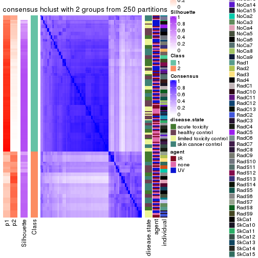</p>

</div>
<div id='tab-MAD-hclust-consensus-heatmap-2'>
<pre><code class="r">consensus_heatmap(res, k = 3)
</code></pre>

<p>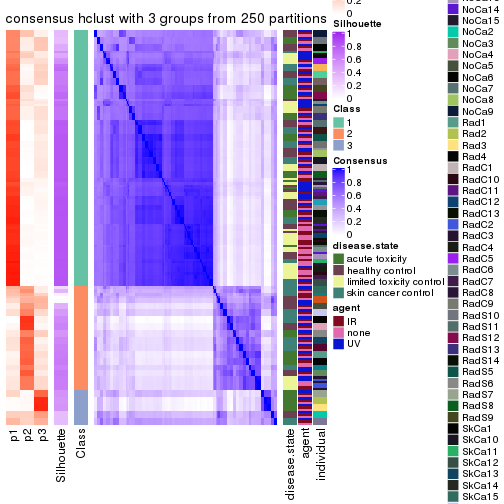</p>

</div>
<div id='tab-MAD-hclust-consensus-heatmap-3'>
<pre><code class="r">consensus_heatmap(res, k = 4)
</code></pre>

<p>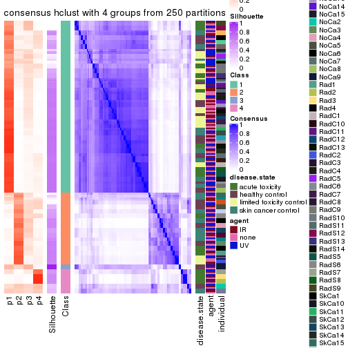</p>

</div>
<div id='tab-MAD-hclust-consensus-heatmap-4'>
<pre><code class="r">consensus_heatmap(res, k = 5)
</code></pre>

<p>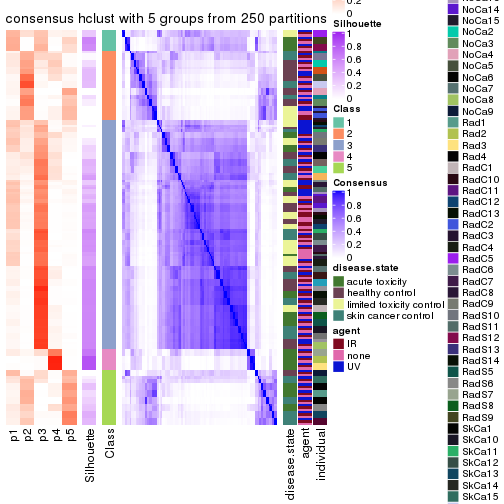</p>

</div>
<div id='tab-MAD-hclust-consensus-heatmap-5'>
<pre><code class="r">consensus_heatmap(res, k = 6)
</code></pre>

<p>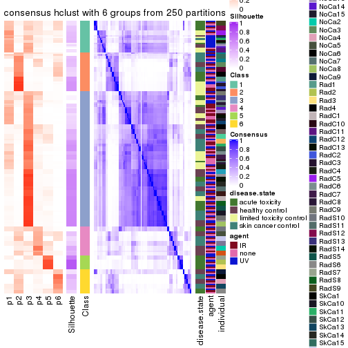</p>

</div>
</div>

Heatmaps for the membership of samples in all partitions to see how consistent they are:


<script>
$( function() {
	$( '#tabs-MAD-hclust-membership-heatmap' ).tabs();
} );
</script>
<div id='tabs-MAD-hclust-membership-heatmap'>
<ul>
<li><a href='#tab-MAD-hclust-membership-heatmap-1'>k = 2</a></li>
<li><a href='#tab-MAD-hclust-membership-heatmap-2'>k = 3</a></li>
<li><a href='#tab-MAD-hclust-membership-heatmap-3'>k = 4</a></li>
<li><a href='#tab-MAD-hclust-membership-heatmap-4'>k = 5</a></li>
<li><a href='#tab-MAD-hclust-membership-heatmap-5'>k = 6</a></li>
</ul>
<div id='tab-MAD-hclust-membership-heatmap-1'>
<pre><code class="r">membership_heatmap(res, k = 2)
</code></pre>

<p>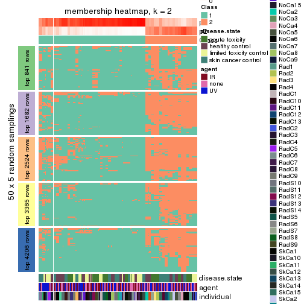</p>

</div>
<div id='tab-MAD-hclust-membership-heatmap-2'>
<pre><code class="r">membership_heatmap(res, k = 3)
</code></pre>

<p>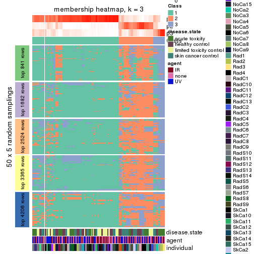</p>

</div>
<div id='tab-MAD-hclust-membership-heatmap-3'>
<pre><code class="r">membership_heatmap(res, k = 4)
</code></pre>

<p>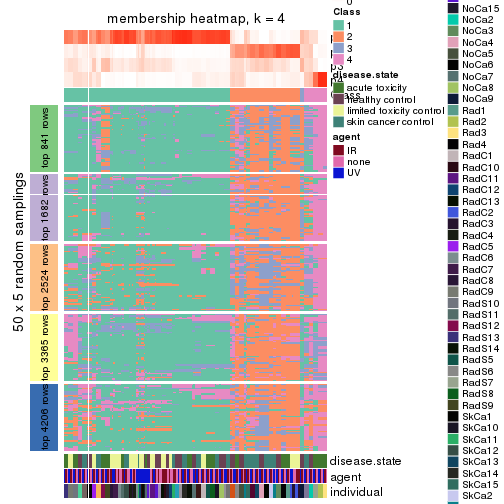</p>

</div>
<div id='tab-MAD-hclust-membership-heatmap-4'>
<pre><code class="r">membership_heatmap(res, k = 5)
</code></pre>

<p>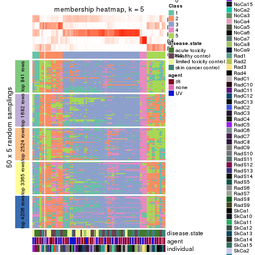</p>

</div>
<div id='tab-MAD-hclust-membership-heatmap-5'>
<pre><code class="r">membership_heatmap(res, k = 6)
</code></pre>

<p>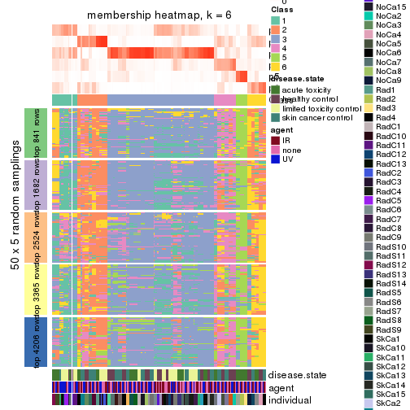</p>

</div>
</div>

As soon as we have had the classes for columns, we can look for signatures
which are significantly different between classes which can be candidate marks
for certain classes. Following are the heatmaps for signatures.


Signature heatmaps where rows are scaled:


<script>
$( function() {
	$( '#tabs-MAD-hclust-get-signatures' ).tabs();
} );
</script>
<div id='tabs-MAD-hclust-get-signatures'>
<ul>
<li><a href='#tab-MAD-hclust-get-signatures-1'>k = 2</a></li>
<li><a href='#tab-MAD-hclust-get-signatures-2'>k = 3</a></li>
<li><a href='#tab-MAD-hclust-get-signatures-3'>k = 4</a></li>
<li><a href='#tab-MAD-hclust-get-signatures-4'>k = 5</a></li>
<li><a href='#tab-MAD-hclust-get-signatures-5'>k = 6</a></li>
</ul>
<div id='tab-MAD-hclust-get-signatures-1'>
<pre><code class="r">get_signatures(res, k = 2)
</code></pre>

<p>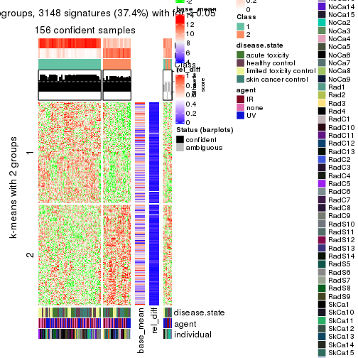</p>

</div>
<div id='tab-MAD-hclust-get-signatures-2'>
<pre><code class="r">get_signatures(res, k = 3)
</code></pre>

<p>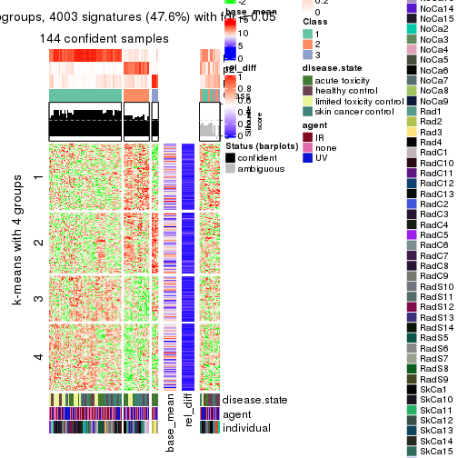</p>

</div>
<div id='tab-MAD-hclust-get-signatures-3'>
<pre><code class="r">get_signatures(res, k = 4)
</code></pre>

<p>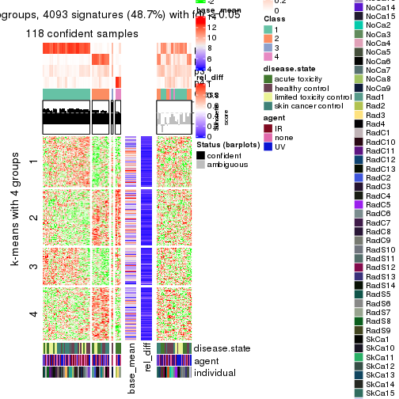</p>

</div>
<div id='tab-MAD-hclust-get-signatures-4'>
<pre><code class="r">get_signatures(res, k = 5)
</code></pre>

<p>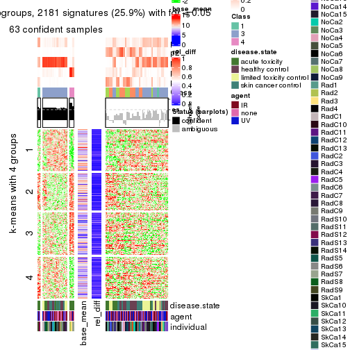</p>

</div>
<div id='tab-MAD-hclust-get-signatures-5'>
<pre><code class="r">get_signatures(res, k = 6)
</code></pre>

<p>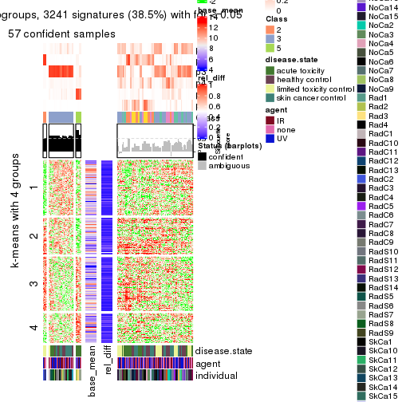</p>

</div>
</div>


Signature heatmaps where rows are not scaled:


<script>
$( function() {
	$( '#tabs-MAD-hclust-get-signatures-no-scale' ).tabs();
} );
</script>
<div id='tabs-MAD-hclust-get-signatures-no-scale'>
<ul>
<li><a href='#tab-MAD-hclust-get-signatures-no-scale-1'>k = 2</a></li>
<li><a href='#tab-MAD-hclust-get-signatures-no-scale-2'>k = 3</a></li>
<li><a href='#tab-MAD-hclust-get-signatures-no-scale-3'>k = 4</a></li>
<li><a href='#tab-MAD-hclust-get-signatures-no-scale-4'>k = 5</a></li>
<li><a href='#tab-MAD-hclust-get-signatures-no-scale-5'>k = 6</a></li>
</ul>
<div id='tab-MAD-hclust-get-signatures-no-scale-1'>
<pre><code class="r">get_signatures(res, k = 2, scale_rows = FALSE)
</code></pre>

<p>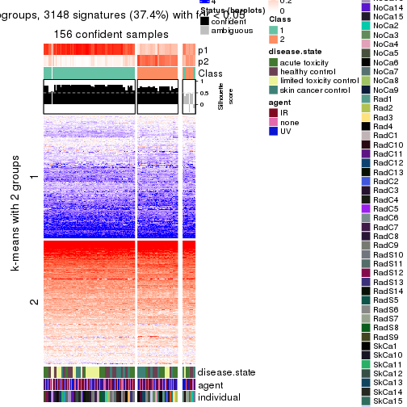</p>

</div>
<div id='tab-MAD-hclust-get-signatures-no-scale-2'>
<pre><code class="r">get_signatures(res, k = 3, scale_rows = FALSE)
</code></pre>

<p>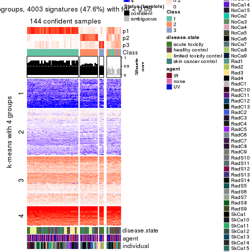</p>

</div>
<div id='tab-MAD-hclust-get-signatures-no-scale-3'>
<pre><code class="r">get_signatures(res, k = 4, scale_rows = FALSE)
</code></pre>

<p>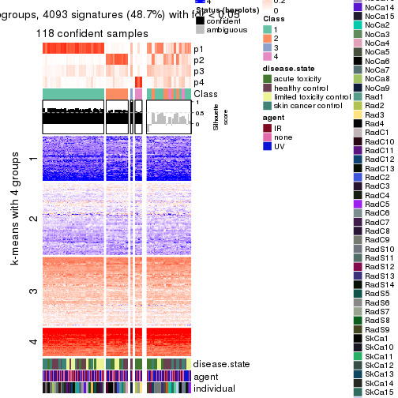</p>

</div>
<div id='tab-MAD-hclust-get-signatures-no-scale-4'>
<pre><code class="r">get_signatures(res, k = 5, scale_rows = FALSE)
</code></pre>

<p>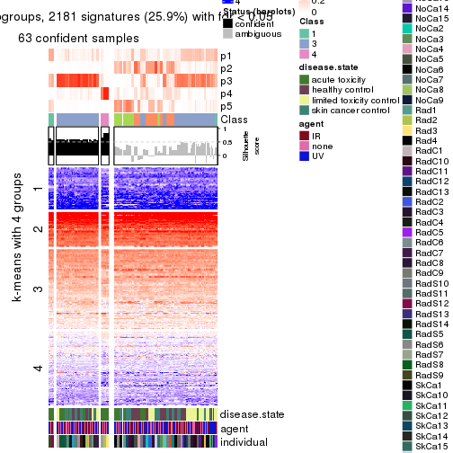</p>

</div>
<div id='tab-MAD-hclust-get-signatures-no-scale-5'>
<pre><code class="r">get_signatures(res, k = 6, scale_rows = FALSE)
</code></pre>

<p>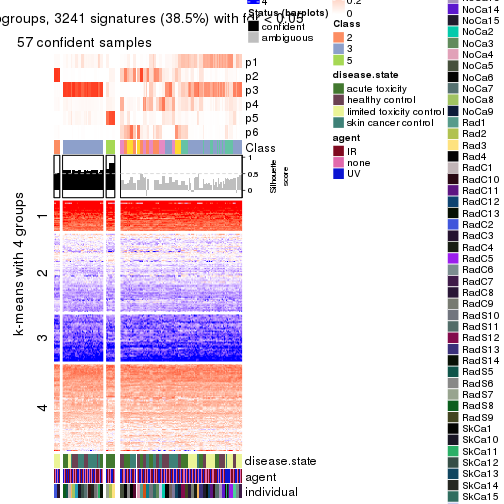</p>

</div>
</div>


Compare the overlap of signatures from different k:

```r
compare_signatures(res)
```

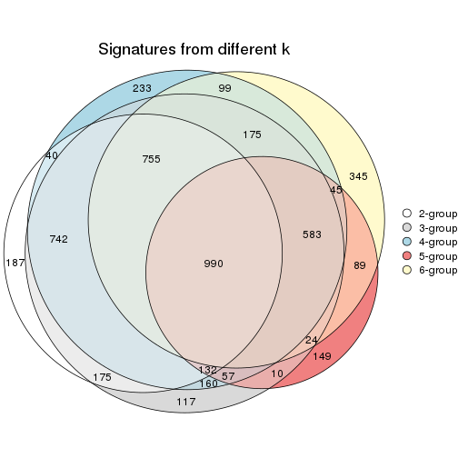

`get_signature()` returns a data frame invisibly. TO get the list of signatures, the function
call should be assigned to a variable explicitly. In following code, if `plot` argument is set
to `FALSE`, no heatmap is plotted while only the differential analysis is performed.

```r
# code only for demonstration
tb = get_signature(res, k = ..., plot = FALSE)
```

An example of the output of `tb` is:

```
#>   which_row         fdr    mean_1    mean_2 scaled_mean_1 scaled_mean_2 km
#> 1        38 0.042760348  8.373488  9.131774    -0.5533452     0.5164555  1
#> 2        40 0.018707592  7.106213  8.469186    -0.6173731     0.5762149  1
#> 3        55 0.019134737 10.221463 11.207825    -0.6159697     0.5749050  1
#> 4        59 0.006059896  5.921854  7.869574    -0.6899429     0.6439467  1
#> 5        60 0.018055526  8.928898 10.211722    -0.6204761     0.5791110  1
#> 6        98 0.009384629 15.714769 14.887706     0.6635654    -0.6193277  2
...
```

The columns in `tb` are:

1. `which_row`: row indices corresponding to the input matrix.
2. `fdr`: FDR for the differential test. 
3. `mean_x`: The mean value in group x.
4. `scaled_mean_x`: The mean value in group x after rows are scaled.
5. `km`: Row groups if k-means clustering is applied to rows.


UMAP plot which shows how samples are separated.


<script>
$( function() {
	$( '#tabs-MAD-hclust-dimension-reduction' ).tabs();
} );
</script>
<div id='tabs-MAD-hclust-dimension-reduction'>
<ul>
<li><a href='#tab-MAD-hclust-dimension-reduction-1'>k = 2</a></li>
<li><a href='#tab-MAD-hclust-dimension-reduction-2'>k = 3</a></li>
<li><a href='#tab-MAD-hclust-dimension-reduction-3'>k = 4</a></li>
<li><a href='#tab-MAD-hclust-dimension-reduction-4'>k = 5</a></li>
<li><a href='#tab-MAD-hclust-dimension-reduction-5'>k = 6</a></li>
</ul>
<div id='tab-MAD-hclust-dimension-reduction-1'>
<pre><code class="r">dimension_reduction(res, k = 2, method = &quot;UMAP&quot;)
</code></pre>

<p>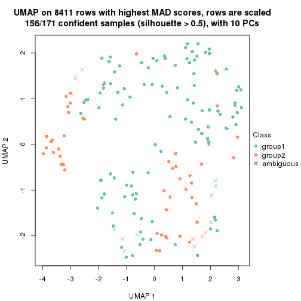</p>

</div>
<div id='tab-MAD-hclust-dimension-reduction-2'>
<pre><code class="r">dimension_reduction(res, k = 3, method = &quot;UMAP&quot;)
</code></pre>

<p>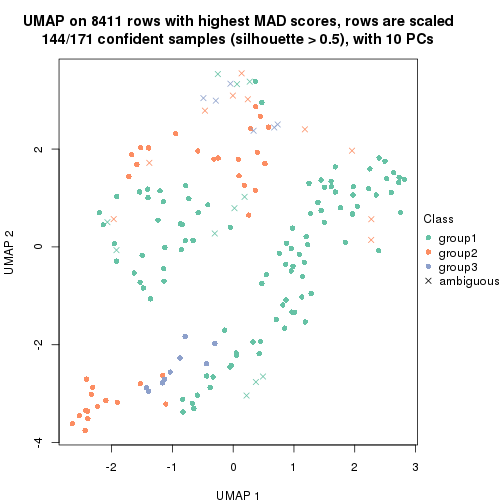</p>

</div>
<div id='tab-MAD-hclust-dimension-reduction-3'>
<pre><code class="r">dimension_reduction(res, k = 4, method = &quot;UMAP&quot;)
</code></pre>

<p>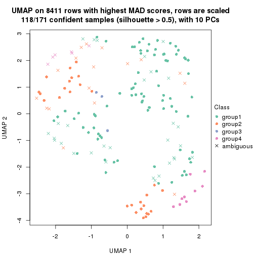</p>

</div>
<div id='tab-MAD-hclust-dimension-reduction-4'>
<pre><code class="r">dimension_reduction(res, k = 5, method = &quot;UMAP&quot;)
</code></pre>

<p>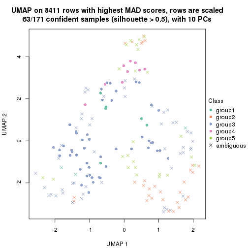</p>

</div>
<div id='tab-MAD-hclust-dimension-reduction-5'>
<pre><code class="r">dimension_reduction(res, k = 6, method = &quot;UMAP&quot;)
</code></pre>

<p>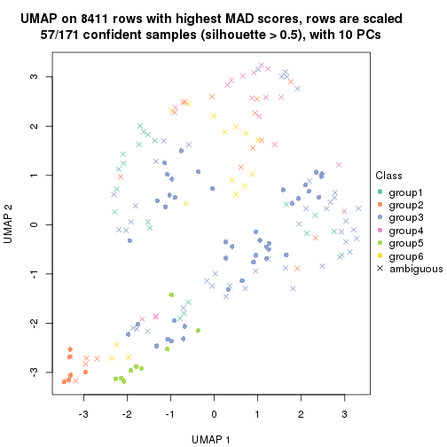</p>

</div>
</div>


Following heatmap shows how subgroups are split when increasing `k`:

```r
collect_classes(res)
```

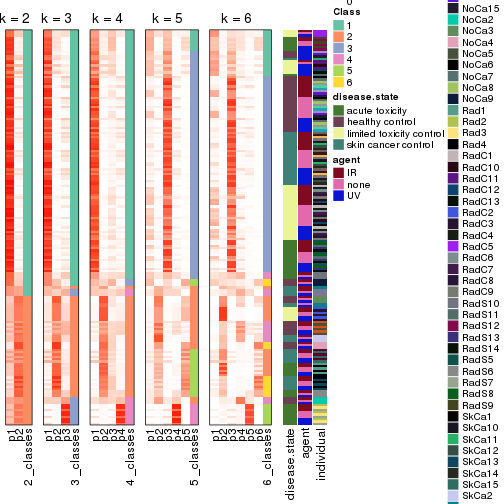


Test correlation between subgroups and known annotations. If the known
annotation is numeric, one-way ANOVA test is applied, and if the known
annotation is discrete, chi-squared contingency table test is applied.

```r
test_to_known_factors(res)
```

```
#>              n disease.state(p) agent(p) individual(p) k
#> MAD:hclust 156         7.23e-02    0.933      4.42e-12 2
#> MAD:hclust 144         2.43e-05    0.999      4.59e-21 3
#> MAD:hclust 118         4.83e-06    1.000      3.16e-24 4
#> MAD:hclust  63         4.06e-05    0.999      7.74e-10 5
#> MAD:hclust  57         1.33e-10    1.000      1.60e-09 6
```


If matrix rows can be associated to genes, consider to use `functional_enrichment(res,
...)` to perform function enrichment for the signature genes. See [this vignette](http://bioconductor.org/packages/devel/bioc/vignettes/cola/inst/doc/functional_enrichment.html) for more detailed explanations.


 

---------------------------------------------------


### MAD:kmeans


The object with results only for a single top-value method and a single partition method 
can be extracted as:

```r
res = res_list["MAD", "kmeans"]
# you can also extract it by
# res = res_list["MAD:kmeans"]
```

A summary of `res` and all the functions that can be applied to it:

```r
res
```

```
#> A 'ConsensusPartition' object with k = 2, 3, 4, 5, 6.
#>   On a matrix with 8411 rows and 171 columns.
#>   Top rows (841, 1682, 2524, 3365, 4206) are extracted by 'MAD' method.
#>   Subgroups are detected by 'kmeans' method.
#>   Performed in total 1250 partitions by row resampling.
#>   Best k for subgroups seems to be 2.
#> 
#> Following methods can be applied to this 'ConsensusPartition' object:
#>  [1] "cola_report"             "collect_classes"         "collect_plots"          
#>  [4] "collect_stats"           "colnames"                "compare_signatures"     
#>  [7] "consensus_heatmap"       "dimension_reduction"     "functional_enrichment"  
#> [10] "get_anno_col"            "get_anno"                "get_classes"            
#> [13] "get_consensus"           "get_matrix"              "get_membership"         
#> [16] "get_param"               "get_signatures"          "get_stats"              
#> [19] "is_best_k"               "is_stable_k"             "membership_heatmap"     
#> [22] "ncol"                    "nrow"                    "plot_ecdf"              
#> [25] "rownames"                "select_partition_number" "show"                   
#> [28] "suggest_best_k"          "test_to_known_factors"
```

`collect_plots()` function collects all the plots made from `res` for all `k` (number of partitions)
into one single page to provide an easy and fast comparison between different `k`.

```r
collect_plots(res)
```

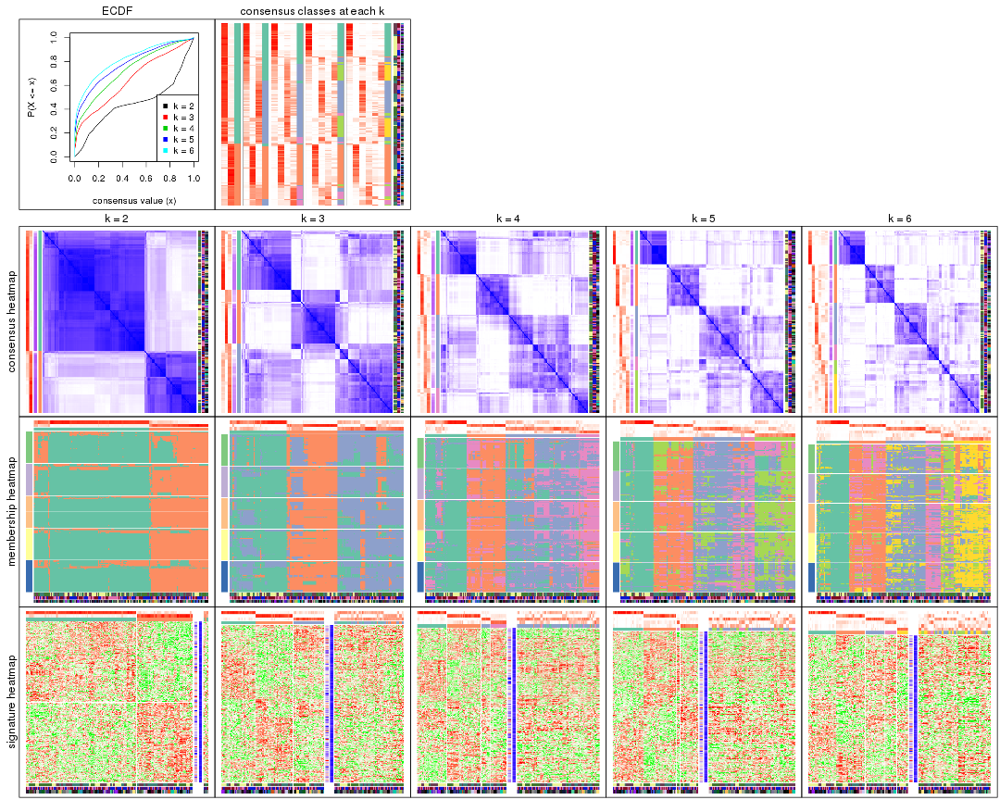

The plots are:

- The first row: a plot of the ECDF (empirical cumulative distribution
  function) curves of the consensus matrix for each `k` and the heatmap of
  predicted classes for each `k`.
- The second row: heatmaps of the consensus matrix for each `k`.
- The third row: heatmaps of the membership matrix for each `k`.
- The fouth row: heatmaps of the signatures for each `k`.

All the plots in panels can be made by individual functions and they are
plotted later in this section.

`select_partition_number()` produces several plots showing different
statistics for choosing "optimized" `k`. There are following statistics:

- ECDF curves of the consensus matrix for each `k`;
- 1-PAC. [The PAC
  score](https://en.wikipedia.org/wiki/Consensus_clustering#Over-interpretation_potential_of_consensus_clustering)
  measures the proportion of the ambiguous subgrouping.
- Mean silhouette score.
- Concordance. The mean probability of fiting the consensus class ids in all
  partitions.
- Area increased. Denote $A_k$ as the area under the ECDF curve for current
  `k`, the area increased is defined as $A_k - A_{k-1}$.
- Rand index. The percent of pairs of samples that are both in a same cluster
  or both are not in a same cluster in the partition of k and k-1.
- Jaccard index. The ratio of pairs of samples are both in a same cluster in
  the partition of k and k-1 and the pairs of samples are both in a same
  cluster in the partition k or k-1.

The detailed explanations of these statistics can be found in [the _cola_
vignette](http://bioconductor.org/packages/devel/bioc/vignettes/cola/inst/doc/cola.html#toc_13).

Generally speaking, lower PAC score, higher mean silhouette score or higher
concordance corresponds to better partition. Rand index and Jaccard index
measure how similar the current partition is compared to partition with `k-1`.
If they are too similar, we won't accept `k` is better than `k-1`.

```r
select_partition_number(res)
```

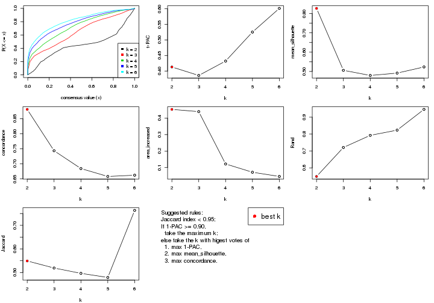

The numeric values for all these statistics can be obtained by `get_stats()`.

```r
get_stats(res)
```

```
#>   k 1-PAC mean_silhouette concordance area_increased  Rand Jaccard
#> 2 2 0.413           0.827       0.881         0.4528 0.549   0.549
#> 3 3 0.386           0.506       0.743         0.4392 0.721   0.519
#> 4 4 0.432           0.479       0.684         0.1218 0.792   0.496
#> 5 5 0.525           0.492       0.658         0.0716 0.823   0.479
#> 6 6 0.601           0.523       0.662         0.0460 0.946   0.763
```

`suggest_best_k()` suggests the best $k$ based on these statistics. The rules are as follows:

- All $k$ with Jaccard index larger than 0.95 are removed because increasing
  $k$ does not provide enough extra information. If all $k$ are removed, it is
  marked as no subgroup is detected.
- For all $k$ with 1-PAC score larger than 0.9, the maximal $k$ is taken as
  the best $k$, and other $k$ are marked as optional $k$.
- If it does not fit the second rule. The $k$ with the maximal vote of the
  highest 1-PAC score, highest mean silhouette, and highest concordance is
  taken as the best $k$.

```r
suggest_best_k(res)
```

```
#> [1] 2
```


Following shows the table of the partitions (You need to click the **show/hide
code output** link to see it). The membership matrix (columns with name `p*`)
is inferred by
[`clue::cl_consensus()`](https://www.rdocumentation.org/link/cl_consensus?package=clue)
function with the `SE` method. Basically the value in the membership matrix
represents the probability to belong to a certain group. The finall class
label for an item is determined with the group with highest probability it
belongs to.

In `get_classes()` function, the entropy is calculated from the membership
matrix and the silhouette score is calculated from the consensus matrix.


<script>
$( function() {
	$( '#tabs-MAD-kmeans-get-classes' ).tabs();
} );
</script>
<div id='tabs-MAD-kmeans-get-classes'>
<ul>
<li><a href='#tab-MAD-kmeans-get-classes-1'>k = 2</a></li>
<li><a href='#tab-MAD-kmeans-get-classes-2'>k = 3</a></li>
<li><a href='#tab-MAD-kmeans-get-classes-3'>k = 4</a></li>
<li><a href='#tab-MAD-kmeans-get-classes-4'>k = 5</a></li>
<li><a href='#tab-MAD-kmeans-get-classes-5'>k = 6</a></li>
</ul>

<div id='tab-MAD-kmeans-get-classes-1'>
<p><a id='tab-MAD-kmeans-get-classes-1-a' style='color:#0366d6' href='#'>show/hide code output</a></p>
<pre><code class="r">cbind(get_classes(res, k = 2), get_membership(res, k = 2))
</code></pre>

<pre><code>#&gt;          class entropy silhouette    p1    p2
#&gt; GSM29783     2  0.7219      0.789 0.200 0.800
#&gt; GSM29786     2  0.7950      0.767 0.240 0.760
#&gt; GSM29789     2  0.4298      0.836 0.088 0.912
#&gt; GSM29792     2  0.4161      0.837 0.084 0.916
#&gt; GSM29795     2  0.8813      0.717 0.300 0.700
#&gt; GSM29798     2  0.8443      0.734 0.272 0.728
#&gt; GSM29801     1  0.1843      0.884 0.972 0.028
#&gt; GSM29804     1  0.4161      0.889 0.916 0.084
#&gt; GSM29807     1  0.9686      0.535 0.604 0.396
#&gt; GSM29816     1  0.3879      0.890 0.924 0.076
#&gt; GSM29821     1  0.1843      0.884 0.972 0.028
#&gt; GSM29824     1  0.0376      0.893 0.996 0.004
#&gt; GSM29827     1  0.3879      0.879 0.924 0.076
#&gt; GSM29830     1  0.3114      0.885 0.944 0.056
#&gt; GSM29833     1  0.4022      0.878 0.920 0.080
#&gt; GSM29784     2  0.6438      0.816 0.164 0.836
#&gt; GSM29787     2  0.8016      0.766 0.244 0.756
#&gt; GSM29790     2  0.2236      0.854 0.036 0.964
#&gt; GSM29793     2  0.3879      0.841 0.076 0.924
#&gt; GSM29796     2  0.7602      0.798 0.220 0.780
#&gt; GSM29799     2  0.8555      0.721 0.280 0.720
#&gt; GSM29802     1  0.4298      0.890 0.912 0.088
#&gt; GSM29805     1  0.4022      0.889 0.920 0.080
#&gt; GSM29814     1  0.9710      0.534 0.600 0.400
#&gt; GSM29817     1  0.2948      0.892 0.948 0.052
#&gt; GSM29822     1  0.3584      0.892 0.932 0.068
#&gt; GSM29825     1  0.2603      0.894 0.956 0.044
#&gt; GSM29828     1  0.3879      0.880 0.924 0.076
#&gt; GSM29831     1  0.3274      0.884 0.940 0.060
#&gt; GSM29834     1  0.3879      0.880 0.924 0.076
#&gt; GSM29785     2  0.1843      0.856 0.028 0.972
#&gt; GSM29788     2  0.7883      0.771 0.236 0.764
#&gt; GSM29791     2  0.4161      0.837 0.084 0.916
#&gt; GSM29794     2  0.4161      0.837 0.084 0.916
#&gt; GSM29797     2  0.6148      0.833 0.152 0.848
#&gt; GSM29800     2  0.7815      0.770 0.232 0.768
#&gt; GSM29803     1  0.4562      0.886 0.904 0.096
#&gt; GSM29806     1  0.4298      0.884 0.912 0.088
#&gt; GSM29815     1  0.9998      0.280 0.508 0.492
#&gt; GSM29819     1  0.4298      0.884 0.912 0.088
#&gt; GSM29823     1  0.2423      0.886 0.960 0.040
#&gt; GSM29826     1  0.3584      0.892 0.932 0.068
#&gt; GSM29829     1  0.3879      0.878 0.924 0.076
#&gt; GSM29832     1  0.4022      0.878 0.920 0.080
#&gt; GSM29835     1  0.4298      0.876 0.912 0.088
#&gt; GSM29836     2  0.3584      0.846 0.068 0.932
#&gt; GSM29839     2  0.7139      0.814 0.196 0.804
#&gt; GSM29842     2  0.1633      0.855 0.024 0.976
#&gt; GSM29845     2  0.8016      0.766 0.244 0.756
#&gt; GSM29848     2  0.8386      0.761 0.268 0.732
#&gt; GSM29851     1  0.2043      0.891 0.968 0.032
#&gt; GSM29854     1  0.4161      0.885 0.916 0.084
#&gt; GSM29857     1  0.4431      0.885 0.908 0.092
#&gt; GSM29860     2  0.4431      0.836 0.092 0.908
#&gt; GSM29863     1  0.2236      0.893 0.964 0.036
#&gt; GSM29866     1  0.3733      0.881 0.928 0.072
#&gt; GSM29869     1  0.3733      0.880 0.928 0.072
#&gt; GSM29872     1  0.8267      0.671 0.740 0.260
#&gt; GSM29875     1  0.1414      0.889 0.980 0.020
#&gt; GSM29878     2  0.6973      0.783 0.188 0.812
#&gt; GSM29837     2  0.1843      0.848 0.028 0.972
#&gt; GSM29840     2  0.6343      0.831 0.160 0.840
#&gt; GSM29843     2  0.2236      0.854 0.036 0.964
#&gt; GSM29846     2  0.8016      0.766 0.244 0.756
#&gt; GSM29849     2  0.8386      0.761 0.268 0.732
#&gt; GSM29852     1  0.3584      0.892 0.932 0.068
#&gt; GSM29855     1  0.4562      0.885 0.904 0.096
#&gt; GSM29858     1  0.4431      0.885 0.908 0.092
#&gt; GSM29861     2  0.4431      0.839 0.092 0.908
#&gt; GSM29864     1  0.3584      0.892 0.932 0.068
#&gt; GSM29867     1  0.1843      0.892 0.972 0.028
#&gt; GSM29870     1  0.2236      0.894 0.964 0.036
#&gt; GSM29873     1  0.8016      0.718 0.756 0.244
#&gt; GSM29876     1  0.4022      0.891 0.920 0.080
#&gt; GSM29879     1  0.8016      0.725 0.756 0.244
#&gt; GSM29838     2  0.1414      0.850 0.020 0.980
#&gt; GSM29841     2  0.5294      0.839 0.120 0.880
#&gt; GSM29844     2  0.4161      0.837 0.084 0.916
#&gt; GSM29847     2  0.7883      0.771 0.236 0.764
#&gt; GSM29850     2  0.8386      0.770 0.268 0.732
#&gt; GSM29853     1  0.2603      0.893 0.956 0.044
#&gt; GSM29856     1  0.4161      0.886 0.916 0.084
#&gt; GSM29859     1  0.5178      0.881 0.884 0.116
#&gt; GSM29862     2  0.4562      0.836 0.096 0.904
#&gt; GSM29865     1  0.4690      0.885 0.900 0.100
#&gt; GSM29868     1  0.3584      0.884 0.932 0.068
#&gt; GSM29871     1  0.7453      0.822 0.788 0.212
#&gt; GSM29874     2  0.9963      0.173 0.464 0.536
#&gt; GSM29877     1  0.2603      0.892 0.956 0.044
#&gt; GSM29880     2  0.4298      0.837 0.088 0.912
#&gt; GSM29881     1  0.4431      0.885 0.908 0.092
#&gt; GSM29884     2  0.0672      0.853 0.008 0.992
#&gt; GSM29887     2  0.0938      0.853 0.012 0.988
#&gt; GSM29890     1  0.1843      0.893 0.972 0.028
#&gt; GSM29893     1  0.3274      0.884 0.940 0.060
#&gt; GSM29896     1  0.1843      0.884 0.972 0.028
#&gt; GSM29899     1  0.0000      0.892 1.000 0.000
#&gt; GSM29902     1  0.5178      0.886 0.884 0.116
#&gt; GSM29905     1  0.4562      0.891 0.904 0.096
#&gt; GSM29908     1  0.4022      0.878 0.920 0.080
#&gt; GSM29955     1  0.4161      0.879 0.916 0.084
#&gt; GSM29958     1  0.4022      0.878 0.920 0.080
#&gt; GSM29961     1  0.4022      0.878 0.920 0.080
#&gt; GSM29882     1  0.4161      0.889 0.916 0.084
#&gt; GSM29885     2  0.1633      0.855 0.024 0.976
#&gt; GSM29888     2  0.1184      0.853 0.016 0.984
#&gt; GSM29891     1  0.3274      0.896 0.940 0.060
#&gt; GSM29894     1  0.1843      0.884 0.972 0.028
#&gt; GSM29897     1  0.1843      0.884 0.972 0.028
#&gt; GSM29900     1  0.3431      0.894 0.936 0.064
#&gt; GSM29903     1  0.4562      0.891 0.904 0.096
#&gt; GSM29906     1  0.4431      0.894 0.908 0.092
#&gt; GSM29909     1  0.5178      0.891 0.884 0.116
#&gt; GSM29956     1  0.4022      0.878 0.920 0.080
#&gt; GSM29959     1  0.3879      0.880 0.924 0.076
#&gt; GSM29962     1  0.4022      0.878 0.920 0.080
#&gt; GSM29883     1  0.4562      0.885 0.904 0.096
#&gt; GSM29886     2  0.0000      0.853 0.000 1.000
#&gt; GSM29889     2  0.0000      0.853 0.000 1.000
#&gt; GSM29892     1  0.4161      0.891 0.916 0.084
#&gt; GSM29895     1  0.4022      0.879 0.920 0.080
#&gt; GSM29898     1  0.3114      0.894 0.944 0.056
#&gt; GSM29901     1  0.4022      0.888 0.920 0.080
#&gt; GSM29904     1  0.4690      0.877 0.900 0.100
#&gt; GSM29907     1  0.4815      0.890 0.896 0.104
#&gt; GSM29910     1  0.4022      0.876 0.920 0.080
#&gt; GSM29957     1  0.4562      0.875 0.904 0.096
#&gt; GSM29960     1  0.4161      0.878 0.916 0.084
#&gt; GSM29963     1  0.4562      0.884 0.904 0.096
#&gt; GSM29964     2  0.2043      0.849 0.032 0.968
#&gt; GSM29967     2  0.6531      0.816 0.168 0.832
#&gt; GSM29970     1  0.4161      0.885 0.916 0.084
#&gt; GSM29973     2  0.1843      0.848 0.028 0.972
#&gt; GSM29976     1  0.4161      0.885 0.916 0.084
#&gt; GSM29979     2  0.9795      0.111 0.416 0.584
#&gt; GSM29982     1  0.9933     -0.110 0.548 0.452
#&gt; GSM29985     1  0.4161      0.885 0.916 0.084
#&gt; GSM29988     1  0.8713      0.716 0.708 0.292
#&gt; GSM29991     1  0.9552      0.382 0.624 0.376
#&gt; GSM29994     1  0.5178      0.886 0.884 0.116
#&gt; GSM29997     1  0.5408      0.850 0.876 0.124
#&gt; GSM30000     1  0.5178      0.886 0.884 0.116
#&gt; GSM30003     1  0.4298      0.886 0.912 0.088
#&gt; GSM29965     2  0.2043      0.849 0.032 0.968
#&gt; GSM29968     2  0.6623      0.815 0.172 0.828
#&gt; GSM29971     1  0.4161      0.885 0.916 0.084
#&gt; GSM29974     2  0.1843      0.848 0.028 0.972
#&gt; GSM29977     1  0.4161      0.885 0.916 0.084
#&gt; GSM29980     1  0.9491      0.607 0.632 0.368
#&gt; GSM29983     1  0.2948      0.891 0.948 0.052
#&gt; GSM29986     1  0.4431      0.885 0.908 0.092
#&gt; GSM29989     1  0.8661      0.733 0.712 0.288
#&gt; GSM29992     1  0.6148      0.847 0.848 0.152
#&gt; GSM29995     1  0.3879      0.878 0.924 0.076
#&gt; GSM29998     1  0.6801      0.839 0.820 0.180
#&gt; GSM30001     1  0.4939      0.887 0.892 0.108
#&gt; GSM30004     1  0.3879      0.890 0.924 0.076
#&gt; GSM29966     2  0.1633      0.849 0.024 0.976
#&gt; GSM29969     2  0.6531      0.816 0.168 0.832
#&gt; GSM29972     1  0.4298      0.884 0.912 0.088
#&gt; GSM29975     2  0.1843      0.848 0.028 0.972
#&gt; GSM29978     1  0.4298      0.884 0.912 0.088
#&gt; GSM29981     2  0.1843      0.850 0.028 0.972
#&gt; GSM29984     2  0.8327      0.735 0.264 0.736
#&gt; GSM29987     1  0.4298      0.884 0.912 0.088
#&gt; GSM29990     1  0.8763      0.710 0.704 0.296
#&gt; GSM29993     2  0.9491      0.548 0.368 0.632
#&gt; GSM29996     1  0.4022      0.879 0.920 0.080
#&gt; GSM29999     1  0.8555      0.748 0.720 0.280
#&gt; GSM30002     1  0.6887      0.858 0.816 0.184
#&gt; GSM30005     1  0.4298      0.884 0.912 0.088
</code></pre>

<script>
$('#tab-MAD-kmeans-get-classes-1-a').parent().next().next().hide();
$('#tab-MAD-kmeans-get-classes-1-a').click(function(){
  $('#tab-MAD-kmeans-get-classes-1-a').parent().next().next().toggle();
  return(false);
});
</script>
</div>

<div id='tab-MAD-kmeans-get-classes-2'>
<p><a id='tab-MAD-kmeans-get-classes-2-a' style='color:#0366d6' href='#'>show/hide code output</a></p>
<pre><code class="r">cbind(get_classes(res, k = 3), get_membership(res, k = 3))
</code></pre>

<pre><code>#&gt;          class entropy silhouette    p1    p2    p3
#&gt; GSM29783     2  0.7376    0.56810 0.076 0.672 0.252
#&gt; GSM29786     2  0.6302    0.36347 0.000 0.520 0.480
#&gt; GSM29789     2  0.2200    0.78275 0.056 0.940 0.004
#&gt; GSM29792     2  0.2384    0.78204 0.056 0.936 0.008
#&gt; GSM29795     1  0.8479    0.23252 0.580 0.300 0.120
#&gt; GSM29798     2  0.6952    0.33348 0.016 0.504 0.480
#&gt; GSM29801     1  0.6505   -0.20547 0.528 0.004 0.468
#&gt; GSM29804     3  0.6026    0.45321 0.376 0.000 0.624
#&gt; GSM29807     3  0.8708    0.23763 0.108 0.404 0.488
#&gt; GSM29816     3  0.5733    0.52593 0.324 0.000 0.676
#&gt; GSM29821     1  0.6647   -0.16862 0.540 0.008 0.452
#&gt; GSM29824     1  0.3116    0.67968 0.892 0.000 0.108
#&gt; GSM29827     1  0.1267    0.70015 0.972 0.004 0.024
#&gt; GSM29830     1  0.1647    0.69686 0.960 0.004 0.036
#&gt; GSM29833     1  0.1453    0.69116 0.968 0.008 0.024
#&gt; GSM29784     2  0.5777    0.70101 0.052 0.788 0.160
#&gt; GSM29787     2  0.6308    0.34387 0.000 0.508 0.492
#&gt; GSM29790     2  0.1170    0.79321 0.008 0.976 0.016
#&gt; GSM29793     2  0.1585    0.79208 0.028 0.964 0.008
#&gt; GSM29796     2  0.7333    0.66313 0.136 0.708 0.156
#&gt; GSM29799     3  0.6962   -0.11555 0.020 0.412 0.568
#&gt; GSM29802     3  0.5480    0.55717 0.264 0.004 0.732
#&gt; GSM29805     3  0.5882    0.50081 0.348 0.000 0.652
#&gt; GSM29814     3  0.8768    0.23775 0.112 0.408 0.480
#&gt; GSM29817     3  0.6247    0.44345 0.376 0.004 0.620
#&gt; GSM29822     3  0.6148    0.46395 0.356 0.004 0.640
#&gt; GSM29825     1  0.6305   -0.21996 0.516 0.000 0.484
#&gt; GSM29828     1  0.1525    0.69823 0.964 0.004 0.032
#&gt; GSM29831     1  0.1647    0.69686 0.960 0.004 0.036
#&gt; GSM29834     1  0.1711    0.69321 0.960 0.008 0.032
#&gt; GSM29785     2  0.2584    0.78715 0.008 0.928 0.064
#&gt; GSM29788     2  0.6260    0.40625 0.000 0.552 0.448
#&gt; GSM29791     2  0.2486    0.78122 0.060 0.932 0.008
#&gt; GSM29794     2  0.2651    0.78052 0.060 0.928 0.012
#&gt; GSM29797     2  0.5153    0.76125 0.068 0.832 0.100
#&gt; GSM29800     2  0.6305    0.35873 0.000 0.516 0.484
#&gt; GSM29803     3  0.3607    0.60121 0.112 0.008 0.880
#&gt; GSM29806     3  0.4555    0.56860 0.200 0.000 0.800
#&gt; GSM29815     3  0.7657    0.13495 0.044 0.448 0.508
#&gt; GSM29819     3  0.4002    0.59125 0.160 0.000 0.840
#&gt; GSM29823     3  0.7188    0.18449 0.484 0.024 0.492
#&gt; GSM29826     3  0.4887    0.56181 0.228 0.000 0.772
#&gt; GSM29829     1  0.3207    0.67706 0.904 0.012 0.084
#&gt; GSM29832     1  0.2383    0.68189 0.940 0.016 0.044
#&gt; GSM29835     1  0.4256    0.62563 0.868 0.036 0.096
#&gt; GSM29836     2  0.1919    0.78835 0.020 0.956 0.024
#&gt; GSM29839     2  0.4749    0.76562 0.072 0.852 0.076
#&gt; GSM29842     2  0.2229    0.79128 0.012 0.944 0.044
#&gt; GSM29845     3  0.6664   -0.25961 0.008 0.464 0.528
#&gt; GSM29848     2  0.7184    0.34221 0.024 0.504 0.472
#&gt; GSM29851     3  0.6442    0.36874 0.432 0.004 0.564
#&gt; GSM29854     3  0.4654    0.59162 0.208 0.000 0.792
#&gt; GSM29857     3  0.5763    0.50738 0.276 0.008 0.716
#&gt; GSM29860     2  0.3237    0.77294 0.056 0.912 0.032
#&gt; GSM29863     3  0.6468    0.31410 0.444 0.004 0.552
#&gt; GSM29866     1  0.1399    0.69906 0.968 0.004 0.028
#&gt; GSM29869     1  0.3375    0.67126 0.892 0.008 0.100
#&gt; GSM29872     1  0.9150    0.33627 0.544 0.224 0.232
#&gt; GSM29875     3  0.6483    0.32872 0.452 0.004 0.544
#&gt; GSM29878     1  0.6948   -0.00134 0.512 0.472 0.016
#&gt; GSM29837     2  0.2301    0.78116 0.004 0.936 0.060
#&gt; GSM29840     2  0.4658    0.76792 0.068 0.856 0.076
#&gt; GSM29843     2  0.1832    0.79263 0.008 0.956 0.036
#&gt; GSM29846     3  0.6735   -0.15182 0.012 0.424 0.564
#&gt; GSM29849     3  0.7292   -0.29199 0.028 0.472 0.500
#&gt; GSM29852     3  0.6209    0.45917 0.368 0.004 0.628
#&gt; GSM29855     3  0.4682    0.59012 0.192 0.004 0.804
#&gt; GSM29858     3  0.5728    0.52068 0.272 0.008 0.720
#&gt; GSM29861     2  0.3134    0.77476 0.052 0.916 0.032
#&gt; GSM29864     3  0.6432    0.35490 0.428 0.004 0.568
#&gt; GSM29867     1  0.5178    0.49451 0.744 0.000 0.256
#&gt; GSM29870     1  0.6062    0.21396 0.616 0.000 0.384
#&gt; GSM29873     3  0.9758   -0.03778 0.356 0.232 0.412
#&gt; GSM29876     3  0.6008    0.49972 0.332 0.004 0.664
#&gt; GSM29879     1  0.8890    0.26210 0.544 0.308 0.148
#&gt; GSM29838     2  0.2116    0.78578 0.012 0.948 0.040
#&gt; GSM29841     2  0.4384    0.77445 0.064 0.868 0.068
#&gt; GSM29844     2  0.2050    0.79227 0.028 0.952 0.020
#&gt; GSM29847     2  0.6307    0.35200 0.000 0.512 0.488
#&gt; GSM29850     2  0.7054    0.36622 0.020 0.524 0.456
#&gt; GSM29853     3  0.6143    0.49392 0.304 0.012 0.684
#&gt; GSM29856     3  0.3826    0.59204 0.124 0.008 0.868
#&gt; GSM29859     3  0.5688    0.55574 0.168 0.044 0.788
#&gt; GSM29862     2  0.3998    0.75930 0.056 0.884 0.060
#&gt; GSM29865     3  0.3272    0.59953 0.104 0.004 0.892
#&gt; GSM29868     1  0.4741    0.63792 0.828 0.020 0.152
#&gt; GSM29871     3  0.8966    0.23781 0.256 0.184 0.560
#&gt; GSM29874     2  0.9400    0.07894 0.356 0.464 0.180
#&gt; GSM29877     3  0.6148    0.46778 0.356 0.004 0.640
#&gt; GSM29880     2  0.3998    0.76160 0.060 0.884 0.056
#&gt; GSM29881     3  0.3715    0.60365 0.128 0.004 0.868
#&gt; GSM29884     2  0.1950    0.79184 0.008 0.952 0.040
#&gt; GSM29887     2  0.1585    0.79242 0.008 0.964 0.028
#&gt; GSM29890     1  0.4555    0.58836 0.800 0.000 0.200
#&gt; GSM29893     1  0.1267    0.69923 0.972 0.004 0.024
#&gt; GSM29896     1  0.1411    0.69887 0.964 0.000 0.036
#&gt; GSM29899     1  0.2878    0.67787 0.904 0.000 0.096
#&gt; GSM29902     1  0.6513    0.35276 0.592 0.008 0.400
#&gt; GSM29905     1  0.6434    0.38503 0.612 0.008 0.380
#&gt; GSM29908     1  0.0829    0.69931 0.984 0.004 0.012
#&gt; GSM29955     1  0.0983    0.69959 0.980 0.004 0.016
#&gt; GSM29958     1  0.1267    0.69641 0.972 0.004 0.024
#&gt; GSM29961     1  0.1129    0.69945 0.976 0.004 0.020
#&gt; GSM29882     3  0.4978    0.56987 0.216 0.004 0.780
#&gt; GSM29885     2  0.1950    0.79184 0.008 0.952 0.040
#&gt; GSM29888     2  0.1453    0.79228 0.008 0.968 0.024
#&gt; GSM29891     1  0.6228    0.32173 0.624 0.004 0.372
#&gt; GSM29894     1  0.1643    0.68928 0.956 0.000 0.044
#&gt; GSM29897     1  0.1765    0.69484 0.956 0.004 0.040
#&gt; GSM29900     3  0.6204    0.39796 0.424 0.000 0.576
#&gt; GSM29903     1  0.6102    0.43005 0.672 0.008 0.320
#&gt; GSM29906     1  0.6451    0.37046 0.608 0.008 0.384
#&gt; GSM29909     1  0.4514    0.63172 0.832 0.012 0.156
#&gt; GSM29956     1  0.1399    0.69655 0.968 0.004 0.028
#&gt; GSM29959     1  0.1525    0.69454 0.964 0.004 0.032
#&gt; GSM29962     1  0.1399    0.69655 0.968 0.004 0.028
#&gt; GSM29883     3  0.3193    0.60283 0.100 0.004 0.896
#&gt; GSM29886     2  0.1751    0.79332 0.012 0.960 0.028
#&gt; GSM29889     2  0.1182    0.79380 0.012 0.976 0.012
#&gt; GSM29892     1  0.6661    0.38449 0.588 0.012 0.400
#&gt; GSM29895     1  0.3550    0.65760 0.896 0.024 0.080
#&gt; GSM29898     1  0.6647    0.38004 0.592 0.012 0.396
#&gt; GSM29901     3  0.5254    0.53238 0.264 0.000 0.736
#&gt; GSM29904     1  0.6632    0.40889 0.596 0.012 0.392
#&gt; GSM29907     1  0.6661    0.38395 0.588 0.012 0.400
#&gt; GSM29910     1  0.4270    0.64561 0.860 0.024 0.116
#&gt; GSM29957     1  0.4921    0.62023 0.816 0.020 0.164
#&gt; GSM29960     1  0.2550    0.67304 0.936 0.024 0.040
#&gt; GSM29963     1  0.5305    0.59789 0.788 0.020 0.192
#&gt; GSM29964     2  0.1765    0.78640 0.004 0.956 0.040
#&gt; GSM29967     2  0.6489    0.41236 0.004 0.540 0.456
#&gt; GSM29970     3  0.3454    0.59897 0.104 0.008 0.888
#&gt; GSM29973     2  0.1989    0.78429 0.004 0.948 0.048
#&gt; GSM29976     3  0.5580    0.54457 0.256 0.008 0.736
#&gt; GSM29979     2  0.7940    0.13695 0.060 0.524 0.416
#&gt; GSM29982     3  0.8569    0.24634 0.392 0.100 0.508
#&gt; GSM29985     3  0.3551    0.60394 0.132 0.000 0.868
#&gt; GSM29988     3  0.9581    0.13431 0.268 0.252 0.480
#&gt; GSM29991     3  0.7983    0.46617 0.228 0.124 0.648
#&gt; GSM29994     1  0.6565    0.32187 0.576 0.008 0.416
#&gt; GSM29997     1  0.8050    0.23814 0.500 0.064 0.436
#&gt; GSM30000     1  0.6075    0.48667 0.676 0.008 0.316
#&gt; GSM30003     3  0.5810    0.51125 0.336 0.000 0.664
#&gt; GSM29965     2  0.1989    0.78429 0.004 0.948 0.048
#&gt; GSM29968     2  0.6489    0.41236 0.004 0.540 0.456
#&gt; GSM29971     3  0.3295    0.59930 0.096 0.008 0.896
#&gt; GSM29974     2  0.2200    0.78154 0.004 0.940 0.056
#&gt; GSM29977     3  0.5541    0.55473 0.252 0.008 0.740
#&gt; GSM29980     3  0.8117    0.26919 0.076 0.372 0.552
#&gt; GSM29983     3  0.6654    0.24183 0.456 0.008 0.536
#&gt; GSM29986     3  0.3500    0.60049 0.116 0.004 0.880
#&gt; GSM29989     3  0.9512    0.15681 0.260 0.248 0.492
#&gt; GSM29992     3  0.7298    0.51447 0.220 0.088 0.692
#&gt; GSM29995     1  0.1765    0.69839 0.956 0.004 0.040
#&gt; GSM29998     1  0.8206    0.19833 0.480 0.072 0.448
#&gt; GSM30001     3  0.6513    0.23757 0.400 0.008 0.592
#&gt; GSM30004     3  0.5835    0.50549 0.340 0.000 0.660
#&gt; GSM29966     2  0.1647    0.78718 0.004 0.960 0.036
#&gt; GSM29969     2  0.6442    0.45007 0.004 0.564 0.432
#&gt; GSM29972     3  0.3293    0.58624 0.088 0.012 0.900
#&gt; GSM29975     2  0.1989    0.78429 0.004 0.948 0.048
#&gt; GSM29978     3  0.4931    0.55444 0.212 0.004 0.784
#&gt; GSM29981     2  0.6437    0.59024 0.048 0.732 0.220
#&gt; GSM29984     3  0.7890   -0.16394 0.060 0.396 0.544
#&gt; GSM29987     3  0.2261    0.59529 0.068 0.000 0.932
#&gt; GSM29990     3  0.9601    0.08475 0.272 0.252 0.476
#&gt; GSM29993     3  0.8112    0.46235 0.160 0.192 0.648
#&gt; GSM29996     1  0.5797    0.55059 0.712 0.008 0.280
#&gt; GSM29999     3  0.9211    0.15089 0.276 0.196 0.528
#&gt; GSM30002     3  0.7214    0.31543 0.324 0.044 0.632
#&gt; GSM30005     3  0.4452    0.57914 0.192 0.000 0.808
</code></pre>

<script>
$('#tab-MAD-kmeans-get-classes-2-a').parent().next().next().hide();
$('#tab-MAD-kmeans-get-classes-2-a').click(function(){
  $('#tab-MAD-kmeans-get-classes-2-a').parent().next().next().toggle();
  return(false);
});
</script>
</div>

<div id='tab-MAD-kmeans-get-classes-3'>
<p><a id='tab-MAD-kmeans-get-classes-3-a' style='color:#0366d6' href='#'>show/hide code output</a></p>
<pre><code class="r">cbind(get_classes(res, k = 4), get_membership(res, k = 4))
</code></pre>

<pre><code>#&gt;          class entropy silhouette    p1    p2    p3    p4
#&gt; GSM29783     4  0.7517   -0.17461 0.028 0.440 0.092 0.440
#&gt; GSM29786     4  0.5230    0.67952 0.004 0.152 0.084 0.760
#&gt; GSM29789     2  0.2483    0.78802 0.032 0.916 0.000 0.052
#&gt; GSM29792     2  0.2399    0.78810 0.032 0.920 0.000 0.048
#&gt; GSM29795     1  0.7826    0.11334 0.492 0.176 0.016 0.316
#&gt; GSM29798     4  0.5688    0.69006 0.008 0.144 0.112 0.736
#&gt; GSM29801     1  0.7977   -0.10829 0.412 0.004 0.304 0.280
#&gt; GSM29804     3  0.6587    0.47383 0.252 0.000 0.616 0.132
#&gt; GSM29807     3  0.5481    0.32192 0.020 0.348 0.628 0.004
#&gt; GSM29816     3  0.6685    0.45182 0.224 0.000 0.616 0.160
#&gt; GSM29821     1  0.7950   -0.02406 0.452 0.008 0.244 0.296
#&gt; GSM29824     1  0.4843    0.61657 0.784 0.000 0.112 0.104
#&gt; GSM29827     1  0.0895    0.73080 0.976 0.004 0.020 0.000
#&gt; GSM29830     1  0.0469    0.73238 0.988 0.000 0.012 0.000
#&gt; GSM29833     1  0.0524    0.73311 0.988 0.004 0.008 0.000
#&gt; GSM29784     2  0.6746    0.35882 0.016 0.512 0.056 0.416
#&gt; GSM29787     4  0.5022    0.69003 0.004 0.140 0.080 0.776
#&gt; GSM29790     2  0.3712    0.78136 0.012 0.832 0.004 0.152
#&gt; GSM29793     2  0.2884    0.79397 0.028 0.900 0.004 0.068
#&gt; GSM29796     2  0.6611    0.35651 0.044 0.536 0.020 0.400
#&gt; GSM29799     4  0.5871    0.69010 0.012 0.120 0.140 0.728
#&gt; GSM29802     3  0.7529    0.27350 0.224 0.000 0.488 0.288
#&gt; GSM29805     3  0.6805    0.44080 0.260 0.000 0.592 0.148
#&gt; GSM29814     3  0.5814    0.33410 0.024 0.344 0.620 0.012
#&gt; GSM29817     3  0.7884    0.15895 0.312 0.000 0.384 0.304
#&gt; GSM29822     3  0.7877    0.16673 0.312 0.000 0.388 0.300
#&gt; GSM29825     1  0.7463   -0.07649 0.456 0.000 0.364 0.180
#&gt; GSM29828     1  0.0657    0.73210 0.984 0.000 0.012 0.004
#&gt; GSM29831     1  0.0927    0.72975 0.976 0.000 0.016 0.008
#&gt; GSM29834     1  0.0804    0.73149 0.980 0.000 0.012 0.008
#&gt; GSM29785     2  0.5161    0.53582 0.008 0.592 0.000 0.400
#&gt; GSM29788     4  0.5388    0.65214 0.004 0.172 0.080 0.744
#&gt; GSM29791     2  0.2565    0.78465 0.032 0.912 0.000 0.056
#&gt; GSM29794     2  0.2483    0.78455 0.032 0.916 0.000 0.052
#&gt; GSM29797     2  0.5886    0.55027 0.028 0.640 0.016 0.316
#&gt; GSM29800     4  0.5427    0.68809 0.004 0.148 0.100 0.748
#&gt; GSM29803     3  0.6423    0.21914 0.060 0.004 0.540 0.396
#&gt; GSM29806     3  0.5540    0.47437 0.068 0.004 0.720 0.208
#&gt; GSM29815     3  0.5872    0.29199 0.004 0.356 0.604 0.036
#&gt; GSM29819     3  0.5397    0.46806 0.064 0.000 0.716 0.220
#&gt; GSM29823     4  0.9243    0.12549 0.300 0.080 0.260 0.360
#&gt; GSM29826     3  0.5687    0.46429 0.068 0.000 0.684 0.248
#&gt; GSM29829     1  0.3841    0.67611 0.864 0.028 0.076 0.032
#&gt; GSM29832     1  0.3759    0.68195 0.872 0.048 0.048 0.032
#&gt; GSM29835     1  0.4524    0.66236 0.828 0.096 0.048 0.028
#&gt; GSM29836     2  0.1771    0.77791 0.004 0.948 0.036 0.012
#&gt; GSM29839     2  0.5725    0.68284 0.040 0.732 0.036 0.192
#&gt; GSM29842     2  0.5474    0.68124 0.012 0.684 0.024 0.280
#&gt; GSM29845     4  0.5682    0.70316 0.016 0.120 0.116 0.748
#&gt; GSM29848     4  0.5770    0.69293 0.008 0.156 0.108 0.728
#&gt; GSM29851     1  0.7877   -0.21623 0.360 0.000 0.360 0.280
#&gt; GSM29854     3  0.6065    0.42185 0.080 0.000 0.644 0.276
#&gt; GSM29857     3  0.3734    0.54902 0.108 0.000 0.848 0.044
#&gt; GSM29860     2  0.2570    0.77053 0.028 0.916 0.052 0.004
#&gt; GSM29863     4  0.7863   -0.01243 0.276 0.000 0.344 0.380
#&gt; GSM29866     1  0.0524    0.73331 0.988 0.004 0.008 0.000
#&gt; GSM29869     1  0.5515    0.13445 0.564 0.008 0.420 0.008
#&gt; GSM29872     3  0.7575    0.23161 0.264 0.252 0.484 0.000
#&gt; GSM29875     1  0.7850   -0.16455 0.388 0.000 0.340 0.272
#&gt; GSM29878     2  0.4997    0.52319 0.296 0.688 0.012 0.004
#&gt; GSM29837     2  0.3875    0.76663 0.004 0.852 0.068 0.076
#&gt; GSM29840     2  0.5771    0.68289 0.040 0.732 0.040 0.188
#&gt; GSM29843     2  0.5515    0.67309 0.012 0.688 0.028 0.272
#&gt; GSM29846     4  0.5513    0.70170 0.012 0.116 0.116 0.756
#&gt; GSM29849     4  0.5804    0.69660 0.012 0.148 0.108 0.732
#&gt; GSM29852     3  0.7853    0.17901 0.308 0.000 0.400 0.292
#&gt; GSM29855     3  0.7140    0.16200 0.132 0.000 0.464 0.404
#&gt; GSM29858     3  0.3962    0.54644 0.124 0.000 0.832 0.044
#&gt; GSM29861     2  0.2570    0.77053 0.028 0.916 0.052 0.004
#&gt; GSM29864     4  0.7864   -0.00904 0.288 0.000 0.320 0.392
#&gt; GSM29867     1  0.5865    0.22843 0.612 0.000 0.340 0.048
#&gt; GSM29870     3  0.6188    0.25436 0.396 0.000 0.548 0.056
#&gt; GSM29873     3  0.6589    0.40953 0.124 0.240 0.632 0.004
#&gt; GSM29876     3  0.7846    0.18580 0.300 0.000 0.404 0.296
#&gt; GSM29879     1  0.8230    0.14397 0.428 0.372 0.168 0.032
#&gt; GSM29838     2  0.2310    0.77939 0.004 0.928 0.040 0.028
#&gt; GSM29841     2  0.5116    0.71846 0.040 0.764 0.016 0.180
#&gt; GSM29844     2  0.3647    0.76136 0.016 0.832 0.000 0.152
#&gt; GSM29847     4  0.4934    0.69896 0.004 0.128 0.084 0.784
#&gt; GSM29850     4  0.6021    0.66157 0.008 0.204 0.092 0.696
#&gt; GSM29853     3  0.7544    0.12218 0.164 0.004 0.448 0.384
#&gt; GSM29856     4  0.6444   -0.15075 0.036 0.016 0.464 0.484
#&gt; GSM29859     3  0.3656    0.53318 0.036 0.020 0.872 0.072
#&gt; GSM29862     2  0.3187    0.75277 0.028 0.896 0.052 0.024
#&gt; GSM29865     3  0.6178    0.04070 0.040 0.004 0.480 0.476
#&gt; GSM29868     1  0.7166    0.47204 0.628 0.068 0.240 0.064
#&gt; GSM29871     3  0.4037    0.52513 0.040 0.096 0.848 0.016
#&gt; GSM29874     2  0.7441    0.44897 0.136 0.616 0.204 0.044
#&gt; GSM29877     3  0.7870    0.16295 0.300 0.000 0.392 0.308
#&gt; GSM29880     2  0.2943    0.76063 0.032 0.908 0.028 0.032
#&gt; GSM29881     3  0.6130    0.18701 0.048 0.000 0.512 0.440
#&gt; GSM29884     2  0.4729    0.74075 0.012 0.752 0.012 0.224
#&gt; GSM29887     2  0.4124    0.77511 0.012 0.812 0.012 0.164
#&gt; GSM29890     1  0.5220    0.06294 0.568 0.000 0.424 0.008
#&gt; GSM29893     1  0.1082    0.73150 0.972 0.004 0.020 0.004
#&gt; GSM29896     1  0.1151    0.72997 0.968 0.000 0.024 0.008
#&gt; GSM29899     1  0.4182    0.58669 0.796 0.000 0.180 0.024
#&gt; GSM29902     3  0.5152    0.30558 0.384 0.004 0.608 0.004
#&gt; GSM29905     3  0.5097    0.23742 0.428 0.004 0.568 0.000
#&gt; GSM29908     1  0.0657    0.73241 0.984 0.004 0.012 0.000
#&gt; GSM29955     1  0.1004    0.72983 0.972 0.004 0.024 0.000
#&gt; GSM29958     1  0.0524    0.73306 0.988 0.004 0.008 0.000
#&gt; GSM29961     1  0.0779    0.73155 0.980 0.004 0.016 0.000
#&gt; GSM29882     3  0.7107    0.14642 0.128 0.000 0.464 0.408
#&gt; GSM29885     2  0.5208    0.70480 0.012 0.712 0.020 0.256
#&gt; GSM29888     2  0.4241    0.77491 0.012 0.808 0.016 0.164
#&gt; GSM29891     3  0.5204    0.33305 0.376 0.000 0.612 0.012
#&gt; GSM29894     1  0.1059    0.73031 0.972 0.000 0.016 0.012
#&gt; GSM29897     1  0.0937    0.73013 0.976 0.000 0.012 0.012
#&gt; GSM29900     3  0.7006    0.36204 0.340 0.000 0.528 0.132
#&gt; GSM29903     3  0.5558    0.19701 0.456 0.004 0.528 0.012
#&gt; GSM29906     3  0.5384    0.25431 0.420 0.004 0.568 0.008
#&gt; GSM29909     1  0.3625    0.60152 0.828 0.000 0.160 0.012
#&gt; GSM29956     1  0.0524    0.73269 0.988 0.000 0.008 0.004
#&gt; GSM29959     1  0.0657    0.73210 0.984 0.000 0.012 0.004
#&gt; GSM29962     1  0.0657    0.73210 0.984 0.000 0.012 0.004
#&gt; GSM29883     3  0.5858    0.15053 0.032 0.000 0.500 0.468
#&gt; GSM29886     2  0.4011    0.74828 0.008 0.784 0.000 0.208
#&gt; GSM29889     2  0.2918    0.79074 0.008 0.876 0.000 0.116
#&gt; GSM29892     3  0.5920    0.31755 0.348 0.004 0.608 0.040
#&gt; GSM29895     1  0.5312    0.63176 0.792 0.076 0.080 0.052
#&gt; GSM29898     3  0.6397    0.30693 0.344 0.008 0.588 0.060
#&gt; GSM29901     3  0.6252    0.51254 0.128 0.004 0.676 0.192
#&gt; GSM29904     3  0.6189    0.27989 0.364 0.008 0.584 0.044
#&gt; GSM29907     3  0.6249    0.29266 0.360 0.008 0.584 0.048
#&gt; GSM29910     1  0.5899    0.58284 0.748 0.076 0.132 0.044
#&gt; GSM29957     1  0.6515    0.53385 0.700 0.084 0.168 0.048
#&gt; GSM29960     1  0.4242    0.67014 0.848 0.068 0.048 0.036
#&gt; GSM29963     1  0.6574    0.50165 0.684 0.064 0.200 0.052
#&gt; GSM29964     2  0.3785    0.77474 0.004 0.856 0.056 0.084
#&gt; GSM29967     4  0.4406    0.57713 0.004 0.144 0.044 0.808
#&gt; GSM29970     3  0.5914    0.30553 0.024 0.008 0.556 0.412
#&gt; GSM29973     2  0.3542    0.77191 0.000 0.864 0.060 0.076
#&gt; GSM29976     3  0.4695    0.54301 0.120 0.004 0.800 0.076
#&gt; GSM29979     3  0.7497    0.17068 0.024 0.372 0.500 0.104
#&gt; GSM29982     4  0.6457    0.49676 0.104 0.068 0.108 0.720
#&gt; GSM29985     3  0.5762    0.35372 0.040 0.000 0.608 0.352
#&gt; GSM29988     3  0.5966    0.44498 0.084 0.228 0.684 0.004
#&gt; GSM29991     3  0.7559    0.32357 0.108 0.040 0.568 0.284
#&gt; GSM29994     3  0.5064    0.33040 0.360 0.004 0.632 0.004
#&gt; GSM29997     3  0.6396    0.42634 0.216 0.112 0.664 0.008
#&gt; GSM30000     3  0.6028    0.10279 0.476 0.004 0.488 0.032
#&gt; GSM30003     3  0.6565    0.46378 0.224 0.000 0.628 0.148
#&gt; GSM29965     2  0.4077    0.76582 0.004 0.840 0.068 0.088
#&gt; GSM29968     4  0.4406    0.57713 0.004 0.144 0.044 0.808
#&gt; GSM29971     3  0.5920    0.26436 0.028 0.004 0.528 0.440
#&gt; GSM29974     2  0.3731    0.76940 0.004 0.860 0.064 0.072
#&gt; GSM29977     3  0.4635    0.53775 0.124 0.000 0.796 0.080
#&gt; GSM29980     3  0.6459    0.37825 0.004 0.284 0.620 0.092
#&gt; GSM29983     4  0.6366    0.42107 0.152 0.016 0.140 0.692
#&gt; GSM29986     3  0.6008    0.13191 0.040 0.000 0.496 0.464
#&gt; GSM29989     3  0.5644    0.48409 0.072 0.184 0.732 0.012
#&gt; GSM29992     3  0.7183    0.33235 0.096 0.028 0.588 0.288
#&gt; GSM29995     1  0.2480    0.69324 0.904 0.000 0.088 0.008
#&gt; GSM29998     3  0.6210    0.46193 0.176 0.116 0.696 0.012
#&gt; GSM30001     3  0.5398    0.49660 0.216 0.004 0.724 0.056
#&gt; GSM30004     3  0.6664    0.45592 0.232 0.000 0.616 0.152
#&gt; GSM29966     2  0.3464    0.77672 0.000 0.868 0.056 0.076
#&gt; GSM29969     4  0.4419    0.55942 0.004 0.152 0.040 0.804
#&gt; GSM29972     3  0.5990    0.24625 0.012 0.020 0.524 0.444
#&gt; GSM29975     2  0.3471    0.77135 0.000 0.868 0.060 0.072
#&gt; GSM29978     3  0.4254    0.53578 0.064 0.004 0.828 0.104
#&gt; GSM29981     2  0.7004    0.46082 0.012 0.616 0.220 0.152
#&gt; GSM29984     4  0.5102    0.53708 0.008 0.096 0.116 0.780
#&gt; GSM29987     3  0.5483    0.16779 0.016 0.000 0.536 0.448
#&gt; GSM29990     3  0.6873    0.42649 0.072 0.240 0.644 0.044
#&gt; GSM29993     3  0.7336    0.21399 0.052 0.060 0.552 0.336
#&gt; GSM29996     3  0.6370    0.07826 0.456 0.008 0.492 0.044
#&gt; GSM29999     3  0.5038    0.49522 0.060 0.148 0.780 0.012
#&gt; GSM30002     3  0.6484    0.50866 0.144 0.064 0.712 0.080
#&gt; GSM30005     3  0.5809    0.46541 0.076 0.004 0.696 0.224
</code></pre>

<script>
$('#tab-MAD-kmeans-get-classes-3-a').parent().next().next().hide();
$('#tab-MAD-kmeans-get-classes-3-a').click(function(){
  $('#tab-MAD-kmeans-get-classes-3-a').parent().next().next().toggle();
  return(false);
});
</script>
</div>

<div id='tab-MAD-kmeans-get-classes-4'>
<p><a id='tab-MAD-kmeans-get-classes-4-a' style='color:#0366d6' href='#'>show/hide code output</a></p>
<pre><code class="r">cbind(get_classes(res, k = 5), get_membership(res, k = 5))
</code></pre>

<pre><code>#&gt;          class entropy silhouette    p1    p2    p3    p4    p5
#&gt; GSM29783     2  0.6932     0.1796 0.000 0.416 0.140 0.412 0.032
#&gt; GSM29786     4  0.5817     0.3770 0.000 0.084 0.388 0.524 0.004
#&gt; GSM29789     2  0.1310     0.7533 0.000 0.956 0.000 0.020 0.024
#&gt; GSM29792     2  0.1211     0.7545 0.000 0.960 0.000 0.016 0.024
#&gt; GSM29795     1  0.5579     0.5484 0.664 0.084 0.008 0.236 0.008
#&gt; GSM29798     3  0.5930    -0.2702 0.004 0.068 0.500 0.420 0.008
#&gt; GSM29801     3  0.4377     0.4533 0.192 0.000 0.760 0.024 0.024
#&gt; GSM29804     3  0.6344     0.3330 0.120 0.000 0.572 0.024 0.284
#&gt; GSM29807     5  0.6428     0.4823 0.008 0.184 0.088 0.072 0.648
#&gt; GSM29816     3  0.5171     0.3511 0.060 0.000 0.664 0.008 0.268
#&gt; GSM29821     3  0.5016     0.3992 0.212 0.004 0.712 0.064 0.008
#&gt; GSM29824     1  0.4724     0.7022 0.780 0.000 0.096 0.076 0.048
#&gt; GSM29827     1  0.0162     0.8679 0.996 0.000 0.000 0.000 0.004
#&gt; GSM29830     1  0.0162     0.8678 0.996 0.000 0.004 0.000 0.000
#&gt; GSM29833     1  0.0162     0.8677 0.996 0.004 0.000 0.000 0.000
#&gt; GSM29784     2  0.6135     0.3691 0.000 0.500 0.084 0.400 0.016
#&gt; GSM29787     4  0.5670     0.3783 0.000 0.084 0.388 0.528 0.000
#&gt; GSM29790     2  0.2170     0.7519 0.000 0.904 0.004 0.088 0.004
#&gt; GSM29793     2  0.1579     0.7582 0.000 0.944 0.000 0.032 0.024
#&gt; GSM29796     2  0.5718     0.4996 0.048 0.604 0.016 0.324 0.008
#&gt; GSM29799     3  0.5541    -0.1719 0.004 0.044 0.556 0.388 0.008
#&gt; GSM29802     3  0.2751     0.5075 0.052 0.000 0.888 0.004 0.056
#&gt; GSM29805     3  0.5238     0.4081 0.076 0.000 0.696 0.016 0.212
#&gt; GSM29814     5  0.7020     0.4674 0.008 0.180 0.148 0.072 0.592
#&gt; GSM29817     3  0.3333     0.4957 0.096 0.000 0.856 0.020 0.028
#&gt; GSM29822     3  0.3361     0.4972 0.092 0.000 0.856 0.020 0.032
#&gt; GSM29825     3  0.6872     0.2842 0.336 0.000 0.508 0.092 0.064
#&gt; GSM29828     1  0.0404     0.8676 0.988 0.000 0.012 0.000 0.000
#&gt; GSM29831     1  0.0404     0.8676 0.988 0.000 0.012 0.000 0.000
#&gt; GSM29834     1  0.0404     0.8676 0.988 0.000 0.012 0.000 0.000
#&gt; GSM29785     2  0.5396     0.4504 0.000 0.532 0.048 0.416 0.004
#&gt; GSM29788     4  0.5751     0.3966 0.000 0.096 0.364 0.540 0.000
#&gt; GSM29791     2  0.2631     0.7408 0.004 0.904 0.012 0.044 0.036
#&gt; GSM29794     2  0.2631     0.7424 0.004 0.904 0.012 0.044 0.036
#&gt; GSM29797     2  0.5261     0.5787 0.016 0.668 0.016 0.276 0.024
#&gt; GSM29800     3  0.5900    -0.3219 0.000 0.076 0.468 0.448 0.008
#&gt; GSM29803     3  0.3857     0.4333 0.016 0.000 0.820 0.044 0.120
#&gt; GSM29806     3  0.5343     0.2515 0.012 0.000 0.572 0.036 0.380
#&gt; GSM29815     5  0.5954     0.4647 0.004 0.188 0.056 0.076 0.676
#&gt; GSM29819     3  0.5242     0.2449 0.008 0.000 0.576 0.036 0.380
#&gt; GSM29823     3  0.6216     0.3062 0.092 0.032 0.700 0.112 0.064
#&gt; GSM29826     3  0.6730     0.1516 0.024 0.000 0.472 0.136 0.368
#&gt; GSM29829     1  0.3521     0.8081 0.860 0.004 0.040 0.032 0.064
#&gt; GSM29832     1  0.3567     0.8088 0.860 0.008 0.036 0.032 0.064
#&gt; GSM29835     1  0.5207     0.7608 0.776 0.068 0.040 0.064 0.052
#&gt; GSM29836     2  0.3962     0.7334 0.000 0.800 0.000 0.088 0.112
#&gt; GSM29839     2  0.3785     0.6982 0.012 0.836 0.044 0.100 0.008
#&gt; GSM29842     2  0.5085     0.6725 0.000 0.700 0.032 0.232 0.036
#&gt; GSM29845     3  0.5730    -0.2465 0.000 0.064 0.512 0.416 0.008
#&gt; GSM29848     3  0.5980    -0.2943 0.000 0.096 0.488 0.412 0.004
#&gt; GSM29851     3  0.3583     0.4710 0.168 0.000 0.808 0.008 0.016
#&gt; GSM29854     3  0.6552     0.3712 0.032 0.000 0.564 0.132 0.272
#&gt; GSM29857     5  0.5565     0.1228 0.032 0.000 0.460 0.020 0.488
#&gt; GSM29860     2  0.3807     0.7267 0.008 0.820 0.000 0.056 0.116
#&gt; GSM29863     3  0.5163     0.4050 0.136 0.000 0.740 0.084 0.040
#&gt; GSM29866     1  0.0162     0.8679 0.996 0.000 0.000 0.000 0.004
#&gt; GSM29869     5  0.7240     0.3415 0.288 0.004 0.272 0.016 0.420
#&gt; GSM29872     5  0.6524     0.5132 0.152 0.120 0.008 0.072 0.648
#&gt; GSM29875     3  0.4089     0.4709 0.180 0.000 0.780 0.016 0.024
#&gt; GSM29878     2  0.3801     0.6919 0.120 0.828 0.004 0.024 0.024
#&gt; GSM29837     2  0.5900     0.6600 0.000 0.600 0.000 0.188 0.212
#&gt; GSM29840     2  0.3675     0.7010 0.008 0.840 0.044 0.100 0.008
#&gt; GSM29843     2  0.3399     0.7130 0.000 0.812 0.012 0.172 0.004
#&gt; GSM29846     3  0.5604    -0.2111 0.000 0.056 0.532 0.404 0.008
#&gt; GSM29849     3  0.5892    -0.2784 0.000 0.088 0.500 0.408 0.004
#&gt; GSM29852     3  0.3023     0.4971 0.088 0.000 0.872 0.012 0.028
#&gt; GSM29855     3  0.4379     0.4451 0.012 0.000 0.784 0.124 0.080
#&gt; GSM29858     3  0.5461    -0.0833 0.032 0.000 0.520 0.016 0.432
#&gt; GSM29861     2  0.3889     0.7264 0.004 0.816 0.004 0.056 0.120
#&gt; GSM29864     3  0.4328     0.4373 0.116 0.000 0.792 0.076 0.016
#&gt; GSM29867     3  0.5782     0.1697 0.432 0.000 0.488 0.004 0.076
#&gt; GSM29870     3  0.6876    -0.1761 0.180 0.000 0.420 0.016 0.384
#&gt; GSM29873     5  0.6778     0.5507 0.072 0.108 0.080 0.072 0.668
#&gt; GSM29876     3  0.3289     0.4998 0.088 0.000 0.860 0.016 0.036
#&gt; GSM29879     2  0.7735     0.2717 0.172 0.516 0.192 0.008 0.112
#&gt; GSM29838     2  0.4796     0.7180 0.000 0.728 0.000 0.120 0.152
#&gt; GSM29841     2  0.3883     0.7041 0.008 0.832 0.036 0.104 0.020
#&gt; GSM29844     2  0.2533     0.7295 0.000 0.888 0.008 0.096 0.008
#&gt; GSM29847     4  0.5747     0.2741 0.000 0.072 0.460 0.464 0.004
#&gt; GSM29850     3  0.6598    -0.3556 0.000 0.180 0.420 0.396 0.004
#&gt; GSM29853     3  0.3790     0.4302 0.020 0.000 0.832 0.052 0.096
#&gt; GSM29856     3  0.6668    -0.0085 0.000 0.004 0.448 0.344 0.204
#&gt; GSM29859     5  0.5255     0.2221 0.012 0.000 0.404 0.028 0.556
#&gt; GSM29862     2  0.4624     0.7128 0.004 0.772 0.012 0.080 0.132
#&gt; GSM29865     3  0.4554     0.3801 0.012 0.000 0.772 0.100 0.116
#&gt; GSM29868     1  0.7564     0.4502 0.548 0.028 0.128 0.072 0.224
#&gt; GSM29871     5  0.5510     0.3886 0.016 0.012 0.356 0.024 0.592
#&gt; GSM29874     2  0.7495     0.2935 0.036 0.448 0.028 0.124 0.364
#&gt; GSM29877     3  0.3305     0.4995 0.088 0.000 0.860 0.020 0.032
#&gt; GSM29880     2  0.3059     0.7362 0.004 0.880 0.012 0.040 0.064
#&gt; GSM29881     3  0.5199     0.3635 0.008 0.000 0.704 0.176 0.112
#&gt; GSM29884     2  0.4256     0.7205 0.004 0.764 0.000 0.184 0.048
#&gt; GSM29887     2  0.3880     0.7375 0.004 0.800 0.000 0.152 0.044
#&gt; GSM29890     5  0.6289     0.4497 0.356 0.000 0.160 0.000 0.484
#&gt; GSM29893     1  0.0451     0.8668 0.988 0.000 0.000 0.004 0.008
#&gt; GSM29896     1  0.0290     0.8670 0.992 0.000 0.000 0.000 0.008
#&gt; GSM29899     1  0.5182     0.5362 0.708 0.000 0.096 0.012 0.184
#&gt; GSM29902     5  0.5245     0.5726 0.280 0.000 0.080 0.000 0.640
#&gt; GSM29905     5  0.5494     0.5273 0.324 0.000 0.064 0.008 0.604
#&gt; GSM29908     1  0.0162     0.8678 0.996 0.000 0.004 0.000 0.000
#&gt; GSM29955     1  0.0290     0.8670 0.992 0.000 0.000 0.000 0.008
#&gt; GSM29958     1  0.0162     0.8678 0.996 0.000 0.004 0.000 0.000
#&gt; GSM29961     1  0.0451     0.8668 0.988 0.000 0.000 0.004 0.008
#&gt; GSM29882     3  0.4293     0.4223 0.012 0.000 0.788 0.132 0.068
#&gt; GSM29885     2  0.4481     0.7140 0.004 0.752 0.004 0.192 0.048
#&gt; GSM29888     2  0.4282     0.7315 0.004 0.780 0.004 0.156 0.056
#&gt; GSM29891     5  0.6348     0.4309 0.196 0.000 0.292 0.000 0.512
#&gt; GSM29894     1  0.0566     0.8671 0.984 0.000 0.012 0.004 0.000
#&gt; GSM29897     1  0.0404     0.8676 0.988 0.000 0.012 0.000 0.000
#&gt; GSM29900     3  0.6340     0.2513 0.132 0.000 0.572 0.020 0.276
#&gt; GSM29903     5  0.6204     0.5101 0.288 0.000 0.176 0.000 0.536
#&gt; GSM29906     5  0.5954     0.5467 0.296 0.000 0.112 0.008 0.584
#&gt; GSM29909     1  0.4269     0.6425 0.776 0.000 0.116 0.000 0.108
#&gt; GSM29956     1  0.0404     0.8676 0.988 0.000 0.012 0.000 0.000
#&gt; GSM29959     1  0.0404     0.8676 0.988 0.000 0.012 0.000 0.000
#&gt; GSM29962     1  0.0404     0.8676 0.988 0.000 0.012 0.000 0.000
#&gt; GSM29883     3  0.5233     0.3606 0.004 0.000 0.696 0.164 0.136
#&gt; GSM29886     2  0.3764     0.7435 0.004 0.816 0.008 0.144 0.028
#&gt; GSM29889     2  0.2844     0.7576 0.004 0.876 0.000 0.092 0.028
#&gt; GSM29892     5  0.5732     0.5686 0.216 0.000 0.092 0.028 0.664
#&gt; GSM29895     1  0.4964     0.7659 0.788 0.028 0.048 0.064 0.072
#&gt; GSM29898     5  0.6395     0.5389 0.228 0.000 0.096 0.060 0.616
#&gt; GSM29901     5  0.6726     0.1027 0.048 0.000 0.400 0.088 0.464
#&gt; GSM29904     5  0.5647     0.5195 0.256 0.000 0.056 0.036 0.652
#&gt; GSM29907     5  0.5861     0.5591 0.220 0.000 0.088 0.036 0.656
#&gt; GSM29910     1  0.5716     0.7114 0.732 0.032 0.052 0.060 0.124
#&gt; GSM29957     1  0.5962     0.6805 0.704 0.028 0.052 0.060 0.156
#&gt; GSM29960     1  0.4285     0.7925 0.828 0.024 0.040 0.052 0.056
#&gt; GSM29963     1  0.6262     0.6415 0.676 0.024 0.056 0.072 0.172
#&gt; GSM29964     2  0.5496     0.7054 0.004 0.668 0.000 0.160 0.168
#&gt; GSM29967     4  0.4410     0.5557 0.000 0.044 0.124 0.792 0.040
#&gt; GSM29970     4  0.6832     0.2134 0.004 0.000 0.260 0.424 0.312
#&gt; GSM29973     2  0.5821     0.6843 0.004 0.628 0.000 0.176 0.192
#&gt; GSM29976     5  0.5766     0.2714 0.044 0.000 0.396 0.024 0.536
#&gt; GSM29979     5  0.6715     0.2900 0.004 0.172 0.040 0.192 0.592
#&gt; GSM29982     4  0.6344     0.4582 0.044 0.012 0.308 0.584 0.052
#&gt; GSM29985     3  0.6615     0.2541 0.008 0.000 0.508 0.208 0.276
#&gt; GSM29988     5  0.4849     0.5682 0.020 0.064 0.076 0.048 0.792
#&gt; GSM29991     5  0.7136     0.3645 0.040 0.008 0.164 0.256 0.532
#&gt; GSM29994     5  0.5064     0.5821 0.248 0.000 0.080 0.000 0.672
#&gt; GSM29997     5  0.5351     0.5911 0.116 0.008 0.100 0.036 0.740
#&gt; GSM30000     5  0.6202     0.4393 0.360 0.000 0.040 0.060 0.540
#&gt; GSM30003     3  0.5386     0.3374 0.072 0.000 0.644 0.008 0.276
#&gt; GSM29965     2  0.5965     0.6843 0.004 0.624 0.004 0.168 0.200
#&gt; GSM29968     4  0.4410     0.5557 0.000 0.044 0.124 0.792 0.040
#&gt; GSM29971     4  0.6674     0.1986 0.000 0.000 0.324 0.428 0.248
#&gt; GSM29974     2  0.5960     0.6688 0.004 0.608 0.000 0.176 0.212
#&gt; GSM29977     5  0.5687     0.2055 0.040 0.000 0.444 0.020 0.496
#&gt; GSM29980     5  0.6594     0.3571 0.000 0.104 0.084 0.196 0.616
#&gt; GSM29983     4  0.5877     0.3979 0.040 0.000 0.376 0.548 0.036
#&gt; GSM29986     3  0.4705     0.3872 0.008 0.000 0.744 0.172 0.076
#&gt; GSM29989     5  0.5310     0.5612 0.020 0.056 0.128 0.044 0.752
#&gt; GSM29992     5  0.7157     0.3505 0.028 0.012 0.188 0.248 0.524
#&gt; GSM29995     1  0.4197     0.6540 0.776 0.000 0.076 0.000 0.148
#&gt; GSM29998     5  0.5287     0.5804 0.084 0.008 0.136 0.032 0.740
#&gt; GSM30001     5  0.6467     0.4994 0.088 0.000 0.228 0.072 0.612
#&gt; GSM30004     3  0.5066     0.3627 0.064 0.000 0.672 0.004 0.260
#&gt; GSM29966     2  0.5352     0.7128 0.004 0.684 0.000 0.152 0.160
#&gt; GSM29969     4  0.4410     0.5557 0.000 0.044 0.124 0.792 0.040
#&gt; GSM29972     4  0.6688     0.2516 0.000 0.004 0.216 0.456 0.324
#&gt; GSM29975     2  0.5883     0.6818 0.004 0.620 0.000 0.184 0.192
#&gt; GSM29978     5  0.4978     0.3602 0.012 0.000 0.336 0.024 0.628
#&gt; GSM29981     5  0.7600    -0.0629 0.000 0.240 0.052 0.300 0.408
#&gt; GSM29984     4  0.5707     0.4567 0.000 0.008 0.312 0.596 0.084
#&gt; GSM29987     3  0.5700     0.3239 0.000 0.000 0.628 0.176 0.196
#&gt; GSM29990     5  0.5294     0.5375 0.016 0.088 0.056 0.080 0.760
#&gt; GSM29993     5  0.7052     0.3096 0.012 0.024 0.168 0.272 0.524
#&gt; GSM29996     5  0.6120     0.3891 0.332 0.000 0.060 0.040 0.568
#&gt; GSM29999     5  0.3658     0.5777 0.012 0.016 0.092 0.032 0.848
#&gt; GSM30002     5  0.6103     0.5232 0.068 0.004 0.160 0.092 0.676
#&gt; GSM30005     3  0.5320     0.2393 0.008 0.000 0.568 0.040 0.384
</code></pre>

<script>
$('#tab-MAD-kmeans-get-classes-4-a').parent().next().next().hide();
$('#tab-MAD-kmeans-get-classes-4-a').click(function(){
  $('#tab-MAD-kmeans-get-classes-4-a').parent().next().next().toggle();
  return(false);
});
</script>
</div>

<div id='tab-MAD-kmeans-get-classes-5'>
<p><a id='tab-MAD-kmeans-get-classes-5-a' style='color:#0366d6' href='#'>show/hide code output</a></p>
<pre><code class="r">cbind(get_classes(res, k = 6), get_membership(res, k = 6))
</code></pre>

<pre><code>#&gt;          class entropy silhouette    p1    p2    p3    p4    p5    p6
#&gt; GSM29783     4  0.5093     0.4978 0.004 0.192 0.080 0.696 0.016 0.012
#&gt; GSM29786     4  0.4335     0.7230 0.004 0.040 0.180 0.748 0.028 0.000
#&gt; GSM29789     2  0.1471     0.6680 0.000 0.932 0.000 0.064 0.004 0.000
#&gt; GSM29792     2  0.0935     0.6763 0.000 0.964 0.000 0.032 0.004 0.000
#&gt; GSM29795     1  0.6400     0.4247 0.596 0.096 0.004 0.152 0.148 0.004
#&gt; GSM29798     4  0.4184     0.7547 0.000 0.028 0.296 0.672 0.004 0.000
#&gt; GSM29801     3  0.3223     0.5936 0.104 0.000 0.836 0.052 0.008 0.000
#&gt; GSM29804     3  0.6156     0.5474 0.064 0.000 0.636 0.036 0.088 0.176
#&gt; GSM29807     6  0.7836     0.2398 0.000 0.176 0.076 0.108 0.176 0.464
#&gt; GSM29816     3  0.3658     0.5476 0.028 0.000 0.772 0.008 0.000 0.192
#&gt; GSM29821     3  0.4491     0.5513 0.136 0.008 0.760 0.064 0.032 0.000
#&gt; GSM29824     1  0.5235     0.5737 0.688 0.000 0.100 0.004 0.168 0.040
#&gt; GSM29827     1  0.0551     0.8325 0.984 0.000 0.004 0.000 0.008 0.004
#&gt; GSM29830     1  0.0551     0.8323 0.984 0.000 0.008 0.000 0.004 0.004
#&gt; GSM29833     1  0.0146     0.8323 0.996 0.000 0.004 0.000 0.000 0.000
#&gt; GSM29784     4  0.4551     0.3289 0.000 0.284 0.028 0.668 0.016 0.004
#&gt; GSM29787     4  0.4561     0.7317 0.004 0.036 0.200 0.724 0.036 0.000
#&gt; GSM29790     2  0.2744     0.6485 0.000 0.840 0.000 0.144 0.016 0.000
#&gt; GSM29793     2  0.1225     0.6767 0.000 0.952 0.000 0.036 0.012 0.000
#&gt; GSM29796     2  0.6005     0.3649 0.016 0.556 0.004 0.268 0.152 0.004
#&gt; GSM29799     4  0.3940     0.7164 0.000 0.012 0.348 0.640 0.000 0.000
#&gt; GSM29802     3  0.1536     0.6290 0.024 0.000 0.944 0.020 0.000 0.012
#&gt; GSM29805     3  0.3695     0.6097 0.032 0.000 0.820 0.008 0.032 0.108
#&gt; GSM29814     6  0.8078     0.2472 0.000 0.176 0.120 0.108 0.152 0.444
#&gt; GSM29817     3  0.2314     0.6127 0.056 0.000 0.900 0.036 0.008 0.000
#&gt; GSM29822     3  0.2862     0.6068 0.056 0.000 0.872 0.052 0.020 0.000
#&gt; GSM29825     3  0.5996     0.4425 0.220 0.000 0.588 0.000 0.140 0.052
#&gt; GSM29828     1  0.0964     0.8304 0.968 0.000 0.012 0.000 0.016 0.004
#&gt; GSM29831     1  0.0964     0.8304 0.968 0.000 0.012 0.000 0.016 0.004
#&gt; GSM29834     1  0.0717     0.8291 0.976 0.000 0.016 0.000 0.008 0.000
#&gt; GSM29785     4  0.4330     0.2494 0.000 0.308 0.008 0.660 0.020 0.004
#&gt; GSM29788     4  0.4391     0.7149 0.004 0.052 0.164 0.752 0.028 0.000
#&gt; GSM29791     2  0.2122     0.6571 0.000 0.900 0.000 0.076 0.024 0.000
#&gt; GSM29794     2  0.1890     0.6628 0.000 0.916 0.000 0.060 0.024 0.000
#&gt; GSM29797     2  0.5511     0.4403 0.000 0.596 0.000 0.212 0.184 0.008
#&gt; GSM29800     4  0.4181     0.7553 0.000 0.028 0.256 0.704 0.012 0.000
#&gt; GSM29803     3  0.5311     0.5607 0.008 0.000 0.708 0.104 0.084 0.096
#&gt; GSM29806     3  0.6714     0.4383 0.012 0.000 0.536 0.076 0.148 0.228
#&gt; GSM29815     6  0.7864     0.1674 0.000 0.172 0.056 0.112 0.228 0.432
#&gt; GSM29819     3  0.6585     0.4434 0.008 0.000 0.544 0.076 0.140 0.232
#&gt; GSM29823     3  0.6373     0.4888 0.060 0.036 0.668 0.096 0.100 0.040
#&gt; GSM29826     3  0.7038     0.3440 0.012 0.000 0.444 0.056 0.268 0.220
#&gt; GSM29829     1  0.4437     0.7511 0.788 0.016 0.012 0.020 0.088 0.076
#&gt; GSM29832     1  0.4570     0.7486 0.784 0.020 0.012 0.028 0.088 0.068
#&gt; GSM29835     1  0.5210     0.7237 0.748 0.064 0.012 0.036 0.088 0.052
#&gt; GSM29836     2  0.4541     0.6384 0.000 0.760 0.004 0.120 0.068 0.048
#&gt; GSM29839     2  0.3941     0.5602 0.008 0.748 0.012 0.216 0.016 0.000
#&gt; GSM29842     2  0.4771     0.4099 0.000 0.544 0.008 0.412 0.036 0.000
#&gt; GSM29845     4  0.4472     0.7126 0.000 0.012 0.336 0.628 0.024 0.000
#&gt; GSM29848     4  0.5150     0.6828 0.000 0.052 0.364 0.564 0.020 0.000
#&gt; GSM29851     3  0.3112     0.5975 0.104 0.000 0.840 0.052 0.004 0.000
#&gt; GSM29854     3  0.6992     0.4788 0.040 0.000 0.524 0.052 0.212 0.172
#&gt; GSM29857     3  0.5645     0.1529 0.008 0.000 0.520 0.048 0.036 0.388
#&gt; GSM29860     2  0.4050     0.6332 0.000 0.796 0.000 0.088 0.060 0.056
#&gt; GSM29863     3  0.6432     0.5427 0.088 0.000 0.632 0.120 0.108 0.052
#&gt; GSM29866     1  0.0696     0.8311 0.980 0.000 0.008 0.004 0.004 0.004
#&gt; GSM29869     6  0.6664     0.2274 0.136 0.008 0.372 0.016 0.024 0.444
#&gt; GSM29872     6  0.7845     0.2760 0.052 0.132 0.028 0.096 0.188 0.504
#&gt; GSM29875     3  0.3147     0.6013 0.108 0.000 0.844 0.036 0.008 0.004
#&gt; GSM29878     2  0.4317     0.6015 0.116 0.792 0.008 0.028 0.028 0.028
#&gt; GSM29837     2  0.7032     0.4806 0.000 0.480 0.004 0.236 0.168 0.112
#&gt; GSM29840     2  0.3804     0.5589 0.000 0.748 0.012 0.220 0.020 0.000
#&gt; GSM29843     2  0.3864     0.4506 0.000 0.648 0.004 0.344 0.004 0.000
#&gt; GSM29846     4  0.4358     0.7086 0.000 0.012 0.348 0.624 0.016 0.000
#&gt; GSM29849     4  0.5069     0.6719 0.000 0.044 0.376 0.560 0.020 0.000
#&gt; GSM29852     3  0.2129     0.6122 0.056 0.000 0.904 0.040 0.000 0.000
#&gt; GSM29855     3  0.4607     0.5988 0.012 0.000 0.744 0.032 0.164 0.048
#&gt; GSM29858     3  0.5040     0.2566 0.004 0.000 0.592 0.044 0.016 0.344
#&gt; GSM29861     2  0.4107     0.6329 0.000 0.792 0.000 0.088 0.064 0.056
#&gt; GSM29864     3  0.4957     0.5690 0.076 0.000 0.744 0.108 0.052 0.020
#&gt; GSM29867     3  0.4755     0.4081 0.304 0.000 0.632 0.000 0.008 0.056
#&gt; GSM29870     3  0.5866     0.0777 0.080 0.000 0.524 0.012 0.024 0.360
#&gt; GSM29873     6  0.7767     0.3084 0.012 0.132 0.072 0.096 0.184 0.504
#&gt; GSM29876     3  0.2554     0.6178 0.044 0.000 0.896 0.032 0.004 0.024
#&gt; GSM29879     2  0.7737     0.0509 0.104 0.400 0.328 0.016 0.024 0.128
#&gt; GSM29838     2  0.5593     0.6077 0.000 0.660 0.004 0.160 0.124 0.052
#&gt; GSM29841     2  0.3851     0.5718 0.000 0.756 0.004 0.204 0.032 0.004
#&gt; GSM29844     2  0.2869     0.6234 0.000 0.832 0.000 0.148 0.020 0.000
#&gt; GSM29847     4  0.4674     0.7461 0.000 0.028 0.276 0.664 0.032 0.000
#&gt; GSM29850     4  0.5477     0.6838 0.000 0.092 0.316 0.572 0.020 0.000
#&gt; GSM29853     3  0.4480     0.5754 0.012 0.000 0.776 0.092 0.044 0.076
#&gt; GSM29856     5  0.6924    -0.0156 0.004 0.008 0.320 0.076 0.464 0.128
#&gt; GSM29859     6  0.6276    -0.0262 0.000 0.000 0.400 0.056 0.104 0.440
#&gt; GSM29862     2  0.4657     0.6038 0.000 0.748 0.000 0.108 0.084 0.060
#&gt; GSM29865     3  0.6263     0.4995 0.008 0.000 0.612 0.136 0.136 0.108
#&gt; GSM29868     1  0.8563     0.2509 0.404 0.036 0.148 0.048 0.188 0.176
#&gt; GSM29871     6  0.5465     0.3034 0.000 0.004 0.384 0.028 0.052 0.532
#&gt; GSM29874     2  0.7795     0.0846 0.008 0.360 0.008 0.124 0.240 0.260
#&gt; GSM29877     3  0.2201     0.6140 0.056 0.000 0.904 0.036 0.004 0.000
#&gt; GSM29880     2  0.2917     0.6487 0.000 0.872 0.000 0.048 0.040 0.040
#&gt; GSM29881     3  0.5544     0.4473 0.000 0.000 0.616 0.064 0.260 0.060
#&gt; GSM29884     2  0.5064     0.5975 0.000 0.644 0.000 0.264 0.068 0.024
#&gt; GSM29887     2  0.4889     0.6177 0.000 0.676 0.000 0.232 0.068 0.024
#&gt; GSM29890     6  0.5199     0.4879 0.152 0.000 0.216 0.000 0.004 0.628
#&gt; GSM29893     1  0.1121     0.8285 0.964 0.000 0.008 0.008 0.016 0.004
#&gt; GSM29896     1  0.0798     0.8317 0.976 0.000 0.004 0.004 0.012 0.004
#&gt; GSM29899     1  0.6419     0.3409 0.572 0.000 0.156 0.008 0.068 0.196
#&gt; GSM29902     6  0.4272     0.5819 0.120 0.000 0.100 0.004 0.012 0.764
#&gt; GSM29905     6  0.4960     0.5725 0.148 0.000 0.096 0.016 0.020 0.720
#&gt; GSM29908     1  0.0146     0.8323 0.996 0.000 0.004 0.000 0.000 0.000
#&gt; GSM29955     1  0.0622     0.8305 0.980 0.000 0.008 0.000 0.012 0.000
#&gt; GSM29958     1  0.0146     0.8323 0.996 0.000 0.004 0.000 0.000 0.000
#&gt; GSM29961     1  0.0436     0.8316 0.988 0.000 0.004 0.004 0.004 0.000
#&gt; GSM29882     3  0.4055     0.5333 0.000 0.000 0.756 0.044 0.184 0.016
#&gt; GSM29885     2  0.5157     0.5801 0.000 0.624 0.000 0.284 0.068 0.024
#&gt; GSM29888     2  0.4936     0.6124 0.000 0.668 0.000 0.240 0.068 0.024
#&gt; GSM29891     6  0.4836     0.4463 0.076 0.000 0.288 0.000 0.004 0.632
#&gt; GSM29894     1  0.1312     0.8260 0.956 0.000 0.020 0.008 0.012 0.004
#&gt; GSM29897     1  0.0665     0.8324 0.980 0.000 0.008 0.000 0.008 0.004
#&gt; GSM29900     3  0.5001     0.3881 0.056 0.000 0.636 0.004 0.016 0.288
#&gt; GSM29903     6  0.4955     0.5138 0.132 0.000 0.204 0.000 0.004 0.660
#&gt; GSM29906     6  0.5051     0.5672 0.136 0.000 0.132 0.016 0.012 0.704
#&gt; GSM29909     1  0.4906     0.5191 0.676 0.000 0.124 0.000 0.008 0.192
#&gt; GSM29956     1  0.0622     0.8304 0.980 0.000 0.012 0.000 0.008 0.000
#&gt; GSM29959     1  0.0622     0.8304 0.980 0.000 0.012 0.000 0.008 0.000
#&gt; GSM29962     1  0.0622     0.8304 0.980 0.000 0.012 0.000 0.008 0.000
#&gt; GSM29883     3  0.5614     0.4474 0.000 0.000 0.608 0.064 0.264 0.064
#&gt; GSM29886     2  0.4497     0.6249 0.000 0.696 0.000 0.232 0.064 0.008
#&gt; GSM29889     2  0.3954     0.6559 0.000 0.764 0.000 0.172 0.056 0.008
#&gt; GSM29892     6  0.4855     0.5496 0.092 0.004 0.056 0.008 0.088 0.752
#&gt; GSM29895     1  0.5451     0.7093 0.724 0.036 0.012 0.044 0.116 0.068
#&gt; GSM29898     6  0.6001     0.4756 0.088 0.000 0.056 0.028 0.188 0.640
#&gt; GSM29901     6  0.7278    -0.0666 0.036 0.000 0.328 0.032 0.236 0.368
#&gt; GSM29904     6  0.5530     0.5142 0.092 0.008 0.040 0.024 0.132 0.704
#&gt; GSM29907     6  0.5434     0.5275 0.080 0.000 0.052 0.032 0.128 0.708
#&gt; GSM29910     1  0.6140     0.6468 0.660 0.036 0.016 0.036 0.140 0.112
#&gt; GSM29957     1  0.6667     0.5858 0.608 0.036 0.020 0.040 0.144 0.152
#&gt; GSM29960     1  0.4837     0.7372 0.772 0.036 0.012 0.032 0.084 0.064
#&gt; GSM29963     1  0.6660     0.5706 0.600 0.032 0.020 0.036 0.168 0.144
#&gt; GSM29964     2  0.6197     0.5846 0.000 0.572 0.000 0.232 0.116 0.080
#&gt; GSM29967     5  0.4912     0.3362 0.000 0.028 0.028 0.356 0.588 0.000
#&gt; GSM29970     5  0.5180     0.4800 0.000 0.000 0.108 0.036 0.680 0.176
#&gt; GSM29973     2  0.6705     0.5310 0.000 0.512 0.000 0.228 0.164 0.096
#&gt; GSM29976     6  0.4784     0.3450 0.008 0.000 0.356 0.016 0.020 0.600
#&gt; GSM29979     5  0.7951     0.0404 0.000 0.168 0.040 0.132 0.360 0.300
#&gt; GSM29982     5  0.5692     0.4347 0.012 0.008 0.184 0.188 0.608 0.000
#&gt; GSM29985     3  0.6408     0.2550 0.000 0.000 0.444 0.028 0.328 0.200
#&gt; GSM29988     6  0.5259     0.4872 0.000 0.032 0.060 0.080 0.100 0.728
#&gt; GSM29991     6  0.6245     0.3718 0.016 0.000 0.088 0.304 0.048 0.544
#&gt; GSM29994     6  0.4047     0.5833 0.108 0.000 0.100 0.004 0.008 0.780
#&gt; GSM29997     6  0.4694     0.5548 0.032 0.012 0.084 0.028 0.064 0.780
#&gt; GSM30000     6  0.6728     0.4362 0.240 0.000 0.048 0.040 0.124 0.548
#&gt; GSM30003     3  0.4615     0.4897 0.028 0.000 0.684 0.036 0.000 0.252
#&gt; GSM29965     2  0.6651     0.5378 0.000 0.512 0.000 0.252 0.136 0.100
#&gt; GSM29968     5  0.4791     0.3287 0.000 0.020 0.028 0.364 0.588 0.000
#&gt; GSM29971     5  0.5445     0.4580 0.000 0.000 0.176 0.036 0.652 0.136
#&gt; GSM29974     2  0.6776     0.5177 0.000 0.500 0.000 0.236 0.164 0.100
#&gt; GSM29977     6  0.4585     0.2694 0.008 0.000 0.416 0.008 0.012 0.556
#&gt; GSM29980     5  0.8051    -0.0129 0.000 0.136 0.064 0.128 0.352 0.320
#&gt; GSM29983     5  0.5587     0.4010 0.008 0.000 0.236 0.176 0.580 0.000
#&gt; GSM29986     3  0.4476     0.4638 0.000 0.000 0.676 0.048 0.268 0.008
#&gt; GSM29989     6  0.5480     0.4936 0.000 0.032 0.088 0.080 0.088 0.712
#&gt; GSM29992     6  0.6161     0.3682 0.012 0.000 0.092 0.308 0.044 0.544
#&gt; GSM29995     1  0.5207     0.3807 0.608 0.000 0.104 0.000 0.008 0.280
#&gt; GSM29998     6  0.4716     0.5537 0.024 0.008 0.112 0.028 0.060 0.768
#&gt; GSM30001     6  0.6694     0.4766 0.036 0.000 0.156 0.072 0.152 0.584
#&gt; GSM30004     3  0.4046     0.4793 0.028 0.000 0.720 0.004 0.004 0.244
#&gt; GSM29966     2  0.6212     0.5872 0.000 0.572 0.000 0.228 0.120 0.080
#&gt; GSM29969     5  0.4795     0.3339 0.000 0.024 0.024 0.364 0.588 0.000
#&gt; GSM29972     5  0.4587     0.4900 0.000 0.004 0.072 0.040 0.752 0.132
#&gt; GSM29975     2  0.6730     0.5305 0.000 0.508 0.000 0.228 0.168 0.096
#&gt; GSM29978     6  0.5467     0.3746 0.000 0.000 0.264 0.020 0.112 0.604
#&gt; GSM29981     5  0.7206     0.1608 0.000 0.172 0.012 0.116 0.480 0.220
#&gt; GSM29984     5  0.5412     0.4484 0.000 0.012 0.156 0.192 0.636 0.004
#&gt; GSM29987     3  0.6588     0.2997 0.000 0.000 0.468 0.088 0.332 0.112
#&gt; GSM29990     6  0.6347     0.3292 0.000 0.068 0.024 0.092 0.224 0.592
#&gt; GSM29993     6  0.6203     0.3128 0.012 0.000 0.068 0.340 0.060 0.520
#&gt; GSM29996     6  0.6464     0.3998 0.228 0.004 0.024 0.028 0.152 0.564
#&gt; GSM29999     6  0.4303     0.5351 0.000 0.020 0.060 0.036 0.092 0.792
#&gt; GSM30002     6  0.6441     0.4267 0.024 0.004 0.084 0.084 0.200 0.604
#&gt; GSM30005     3  0.6682     0.4290 0.008 0.000 0.528 0.080 0.140 0.244
</code></pre>

<script>
$('#tab-MAD-kmeans-get-classes-5-a').parent().next().next().hide();
$('#tab-MAD-kmeans-get-classes-5-a').click(function(){
  $('#tab-MAD-kmeans-get-classes-5-a').parent().next().next().toggle();
  return(false);
});
</script>
</div>
</div>

Heatmaps for the consensus matrix. It visualizes the probability of two
samples to be in a same group.


<script>
$( function() {
	$( '#tabs-MAD-kmeans-consensus-heatmap' ).tabs();
} );
</script>
<div id='tabs-MAD-kmeans-consensus-heatmap'>
<ul>
<li><a href='#tab-MAD-kmeans-consensus-heatmap-1'>k = 2</a></li>
<li><a href='#tab-MAD-kmeans-consensus-heatmap-2'>k = 3</a></li>
<li><a href='#tab-MAD-kmeans-consensus-heatmap-3'>k = 4</a></li>
<li><a href='#tab-MAD-kmeans-consensus-heatmap-4'>k = 5</a></li>
<li><a href='#tab-MAD-kmeans-consensus-heatmap-5'>k = 6</a></li>
</ul>
<div id='tab-MAD-kmeans-consensus-heatmap-1'>
<pre><code class="r">consensus_heatmap(res, k = 2)
</code></pre>

<p>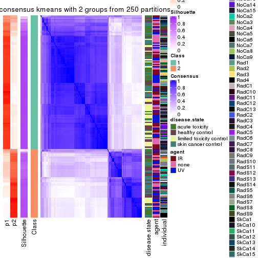</p>

</div>
<div id='tab-MAD-kmeans-consensus-heatmap-2'>
<pre><code class="r">consensus_heatmap(res, k = 3)
</code></pre>

<p>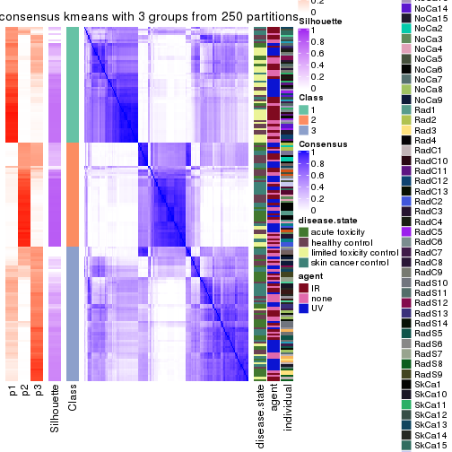</p>

</div>
<div id='tab-MAD-kmeans-consensus-heatmap-3'>
<pre><code class="r">consensus_heatmap(res, k = 4)
</code></pre>

<p>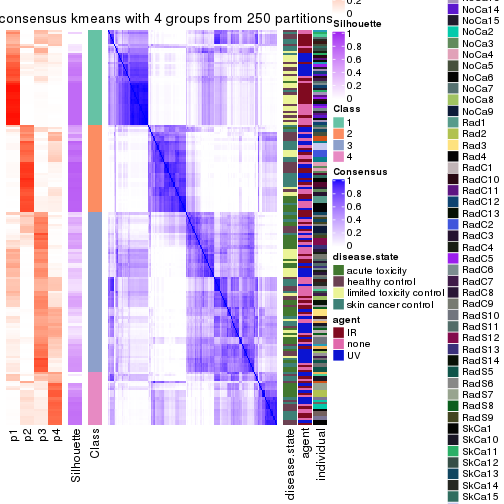</p>

</div>
<div id='tab-MAD-kmeans-consensus-heatmap-4'>
<pre><code class="r">consensus_heatmap(res, k = 5)
</code></pre>

<p>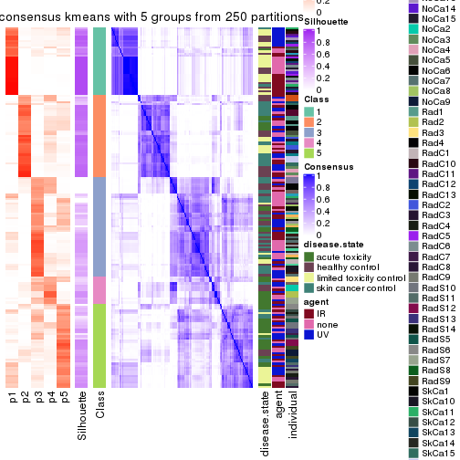</p>

</div>
<div id='tab-MAD-kmeans-consensus-heatmap-5'>
<pre><code class="r">consensus_heatmap(res, k = 6)
</code></pre>

<p>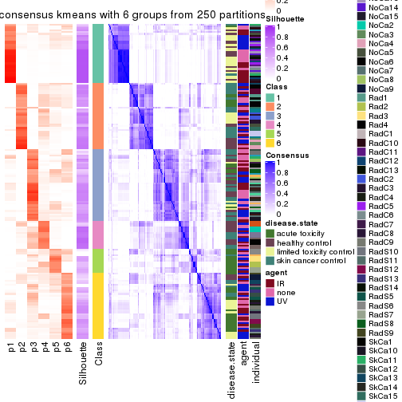</p>

</div>
</div>

Heatmaps for the membership of samples in all partitions to see how consistent they are:


<script>
$( function() {
	$( '#tabs-MAD-kmeans-membership-heatmap' ).tabs();
} );
</script>
<div id='tabs-MAD-kmeans-membership-heatmap'>
<ul>
<li><a href='#tab-MAD-kmeans-membership-heatmap-1'>k = 2</a></li>
<li><a href='#tab-MAD-kmeans-membership-heatmap-2'>k = 3</a></li>
<li><a href='#tab-MAD-kmeans-membership-heatmap-3'>k = 4</a></li>
<li><a href='#tab-MAD-kmeans-membership-heatmap-4'>k = 5</a></li>
<li><a href='#tab-MAD-kmeans-membership-heatmap-5'>k = 6</a></li>
</ul>
<div id='tab-MAD-kmeans-membership-heatmap-1'>
<pre><code class="r">membership_heatmap(res, k = 2)
</code></pre>

<p>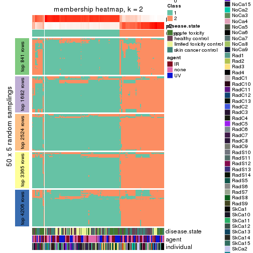</p>

</div>
<div id='tab-MAD-kmeans-membership-heatmap-2'>
<pre><code class="r">membership_heatmap(res, k = 3)
</code></pre>

<p>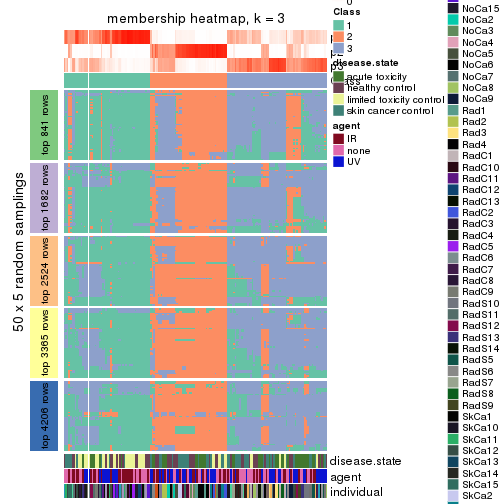</p>

</div>
<div id='tab-MAD-kmeans-membership-heatmap-3'>
<pre><code class="r">membership_heatmap(res, k = 4)
</code></pre>

<p>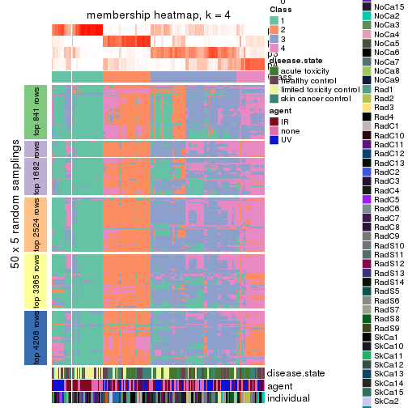</p>

</div>
<div id='tab-MAD-kmeans-membership-heatmap-4'>
<pre><code class="r">membership_heatmap(res, k = 5)
</code></pre>

<p>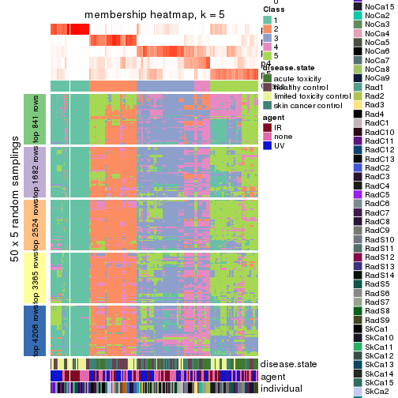</p>

</div>
<div id='tab-MAD-kmeans-membership-heatmap-5'>
<pre><code class="r">membership_heatmap(res, k = 6)
</code></pre>

<p>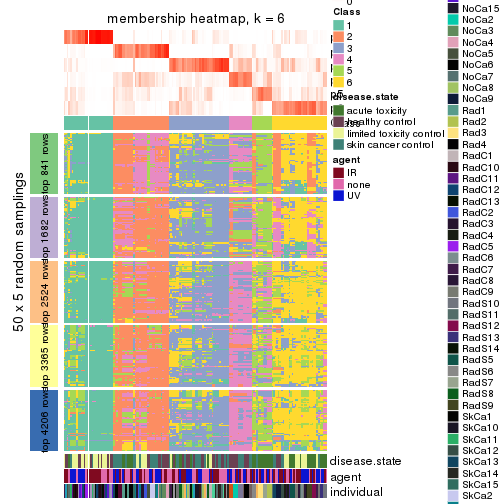</p>

</div>
</div>

As soon as we have had the classes for columns, we can look for signatures
which are significantly different between classes which can be candidate marks
for certain classes. Following are the heatmaps for signatures.


Signature heatmaps where rows are scaled:


<script>
$( function() {
	$( '#tabs-MAD-kmeans-get-signatures' ).tabs();
} );
</script>
<div id='tabs-MAD-kmeans-get-signatures'>
<ul>
<li><a href='#tab-MAD-kmeans-get-signatures-1'>k = 2</a></li>
<li><a href='#tab-MAD-kmeans-get-signatures-2'>k = 3</a></li>
<li><a href='#tab-MAD-kmeans-get-signatures-3'>k = 4</a></li>
<li><a href='#tab-MAD-kmeans-get-signatures-4'>k = 5</a></li>
<li><a href='#tab-MAD-kmeans-get-signatures-5'>k = 6</a></li>
</ul>
<div id='tab-MAD-kmeans-get-signatures-1'>
<pre><code class="r">get_signatures(res, k = 2)
</code></pre>

<p>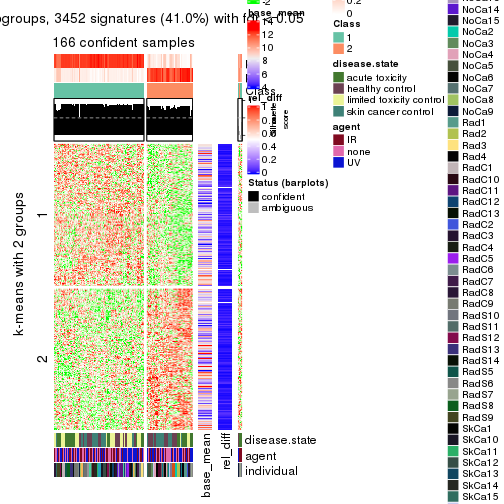</p>

</div>
<div id='tab-MAD-kmeans-get-signatures-2'>
<pre><code class="r">get_signatures(res, k = 3)
</code></pre>

<p>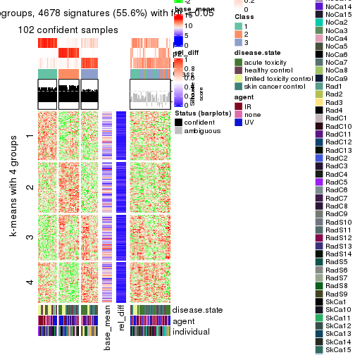</p>

</div>
<div id='tab-MAD-kmeans-get-signatures-3'>
<pre><code class="r">get_signatures(res, k = 4)
</code></pre>

<p>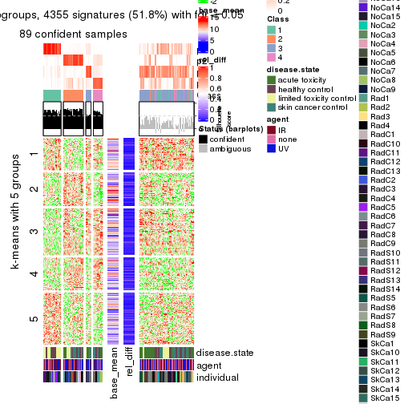</p>

</div>
<div id='tab-MAD-kmeans-get-signatures-4'>
<pre><code class="r">get_signatures(res, k = 5)
</code></pre>

<p>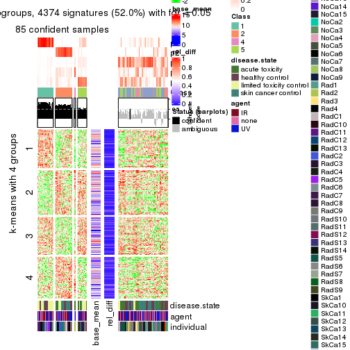</p>

</div>
<div id='tab-MAD-kmeans-get-signatures-5'>
<pre><code class="r">get_signatures(res, k = 6)
</code></pre>

<p>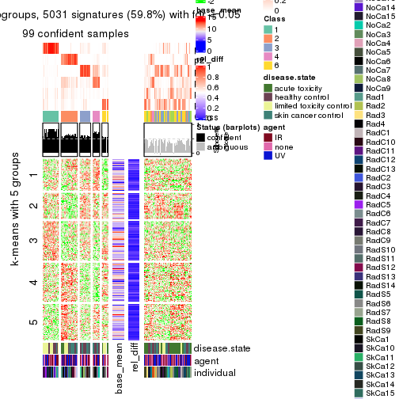</p>

</div>
</div>


Signature heatmaps where rows are not scaled:


<script>
$( function() {
	$( '#tabs-MAD-kmeans-get-signatures-no-scale' ).tabs();
} );
</script>
<div id='tabs-MAD-kmeans-get-signatures-no-scale'>
<ul>
<li><a href='#tab-MAD-kmeans-get-signatures-no-scale-1'>k = 2</a></li>
<li><a href='#tab-MAD-kmeans-get-signatures-no-scale-2'>k = 3</a></li>
<li><a href='#tab-MAD-kmeans-get-signatures-no-scale-3'>k = 4</a></li>
<li><a href='#tab-MAD-kmeans-get-signatures-no-scale-4'>k = 5</a></li>
<li><a href='#tab-MAD-kmeans-get-signatures-no-scale-5'>k = 6</a></li>
</ul>
<div id='tab-MAD-kmeans-get-signatures-no-scale-1'>
<pre><code class="r">get_signatures(res, k = 2, scale_rows = FALSE)
</code></pre>

<p>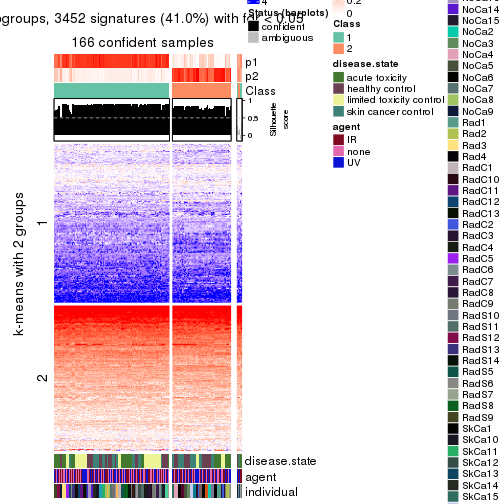</p>

</div>
<div id='tab-MAD-kmeans-get-signatures-no-scale-2'>
<pre><code class="r">get_signatures(res, k = 3, scale_rows = FALSE)
</code></pre>

<p>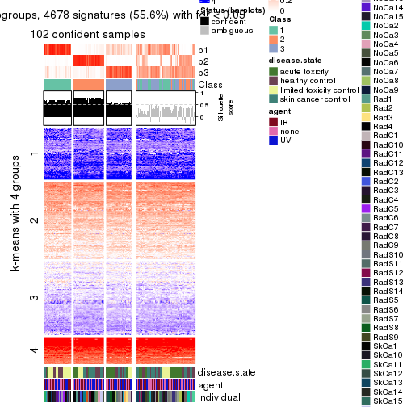</p>

</div>
<div id='tab-MAD-kmeans-get-signatures-no-scale-3'>
<pre><code class="r">get_signatures(res, k = 4, scale_rows = FALSE)
</code></pre>

<p>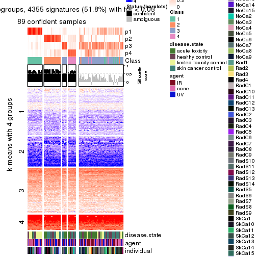</p>

</div>
<div id='tab-MAD-kmeans-get-signatures-no-scale-4'>
<pre><code class="r">get_signatures(res, k = 5, scale_rows = FALSE)
</code></pre>

<p>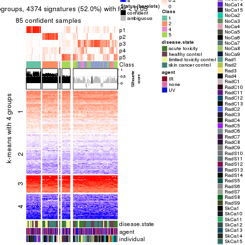</p>

</div>
<div id='tab-MAD-kmeans-get-signatures-no-scale-5'>
<pre><code class="r">get_signatures(res, k = 6, scale_rows = FALSE)
</code></pre>

<p>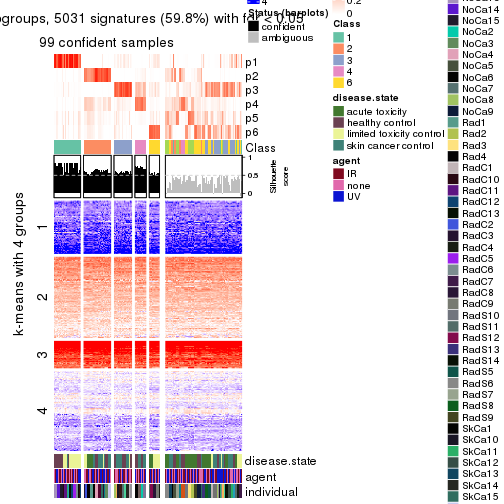</p>

</div>
</div>


Compare the overlap of signatures from different k:

```r
compare_signatures(res)
```

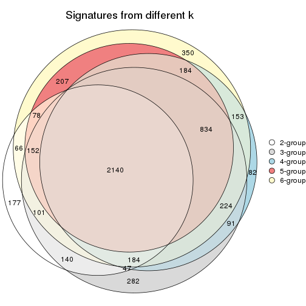

`get_signature()` returns a data frame invisibly. TO get the list of signatures, the function
call should be assigned to a variable explicitly. In following code, if `plot` argument is set
to `FALSE`, no heatmap is plotted while only the differential analysis is performed.

```r
# code only for demonstration
tb = get_signature(res, k = ..., plot = FALSE)
```

An example of the output of `tb` is:

```
#>   which_row         fdr    mean_1    mean_2 scaled_mean_1 scaled_mean_2 km
#> 1        38 0.042760348  8.373488  9.131774    -0.5533452     0.5164555  1
#> 2        40 0.018707592  7.106213  8.469186    -0.6173731     0.5762149  1
#> 3        55 0.019134737 10.221463 11.207825    -0.6159697     0.5749050  1
#> 4        59 0.006059896  5.921854  7.869574    -0.6899429     0.6439467  1
#> 5        60 0.018055526  8.928898 10.211722    -0.6204761     0.5791110  1
#> 6        98 0.009384629 15.714769 14.887706     0.6635654    -0.6193277  2
...
```

The columns in `tb` are:

1. `which_row`: row indices corresponding to the input matrix.
2. `fdr`: FDR for the differential test. 
3. `mean_x`: The mean value in group x.
4. `scaled_mean_x`: The mean value in group x after rows are scaled.
5. `km`: Row groups if k-means clustering is applied to rows.


UMAP plot which shows how samples are separated.


<script>
$( function() {
	$( '#tabs-MAD-kmeans-dimension-reduction' ).tabs();
} );
</script>
<div id='tabs-MAD-kmeans-dimension-reduction'>
<ul>
<li><a href='#tab-MAD-kmeans-dimension-reduction-1'>k = 2</a></li>
<li><a href='#tab-MAD-kmeans-dimension-reduction-2'>k = 3</a></li>
<li><a href='#tab-MAD-kmeans-dimension-reduction-3'>k = 4</a></li>
<li><a href='#tab-MAD-kmeans-dimension-reduction-4'>k = 5</a></li>
<li><a href='#tab-MAD-kmeans-dimension-reduction-5'>k = 6</a></li>
</ul>
<div id='tab-MAD-kmeans-dimension-reduction-1'>
<pre><code class="r">dimension_reduction(res, k = 2, method = &quot;UMAP&quot;)
</code></pre>

<p>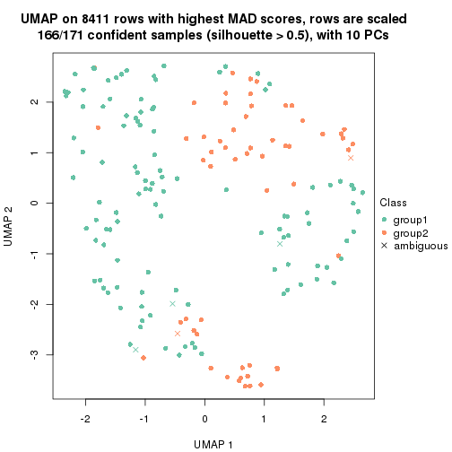</p>

</div>
<div id='tab-MAD-kmeans-dimension-reduction-2'>
<pre><code class="r">dimension_reduction(res, k = 3, method = &quot;UMAP&quot;)
</code></pre>

<p>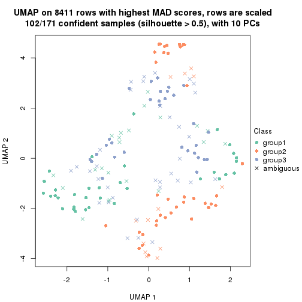</p>

</div>
<div id='tab-MAD-kmeans-dimension-reduction-3'>
<pre><code class="r">dimension_reduction(res, k = 4, method = &quot;UMAP&quot;)
</code></pre>

<p>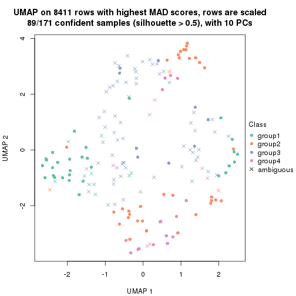</p>

</div>
<div id='tab-MAD-kmeans-dimension-reduction-4'>
<pre><code class="r">dimension_reduction(res, k = 5, method = &quot;UMAP&quot;)
</code></pre>

<p>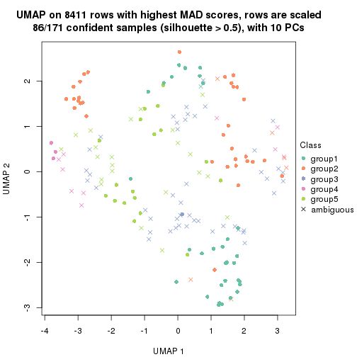</p>

</div>
<div id='tab-MAD-kmeans-dimension-reduction-5'>
<pre><code class="r">dimension_reduction(res, k = 6, method = &quot;UMAP&quot;)
</code></pre>

<p>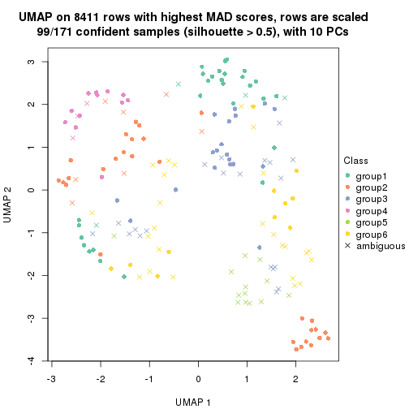</p>

</div>
</div>


Following heatmap shows how subgroups are split when increasing `k`:

```r
collect_classes(res)
```

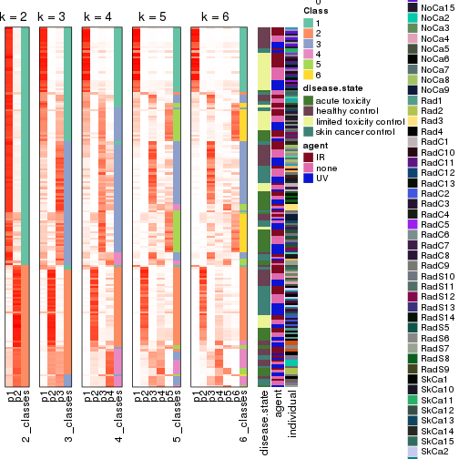


Test correlation between subgroups and known annotations. If the known
annotation is numeric, one-way ANOVA test is applied, and if the known
annotation is discrete, chi-squared contingency table test is applied.

```r
test_to_known_factors(res)
```

```
#>              n disease.state(p) agent(p) individual(p) k
#> MAD:kmeans 166         2.09e-02    0.644      2.05e-11 2
#> MAD:kmeans 102         5.18e-05    0.715      5.98e-12 3
#> MAD:kmeans  89         1.04e-05    0.835      3.18e-15 4
#> MAD:kmeans  86         7.57e-07    0.900      2.78e-19 5
#> MAD:kmeans  99         2.63e-08    0.879      7.99e-23 6
```


If matrix rows can be associated to genes, consider to use `functional_enrichment(res,
...)` to perform function enrichment for the signature genes. See [this vignette](http://bioconductor.org/packages/devel/bioc/vignettes/cola/inst/doc/functional_enrichment.html) for more detailed explanations.


 

---------------------------------------------------


### MAD:skmeans


The object with results only for a single top-value method and a single partition method 
can be extracted as:

```r
res = res_list["MAD", "skmeans"]
# you can also extract it by
# res = res_list["MAD:skmeans"]
```

A summary of `res` and all the functions that can be applied to it:

```r
res
```

```
#> A 'ConsensusPartition' object with k = 2, 3, 4, 5, 6.
#>   On a matrix with 8411 rows and 171 columns.
#>   Top rows (841, 1682, 2524, 3365, 4206) are extracted by 'MAD' method.
#>   Subgroups are detected by 'skmeans' method.
#>   Performed in total 1250 partitions by row resampling.
#>   Best k for subgroups seems to be 2.
#> 
#> Following methods can be applied to this 'ConsensusPartition' object:
#>  [1] "cola_report"             "collect_classes"         "collect_plots"          
#>  [4] "collect_stats"           "colnames"                "compare_signatures"     
#>  [7] "consensus_heatmap"       "dimension_reduction"     "functional_enrichment"  
#> [10] "get_anno_col"            "get_anno"                "get_classes"            
#> [13] "get_consensus"           "get_matrix"              "get_membership"         
#> [16] "get_param"               "get_signatures"          "get_stats"              
#> [19] "is_best_k"               "is_stable_k"             "membership_heatmap"     
#> [22] "ncol"                    "nrow"                    "plot_ecdf"              
#> [25] "rownames"                "select_partition_number" "show"                   
#> [28] "suggest_best_k"          "test_to_known_factors"
```

`collect_plots()` function collects all the plots made from `res` for all `k` (number of partitions)
into one single page to provide an easy and fast comparison between different `k`.

```r
collect_plots(res)
```

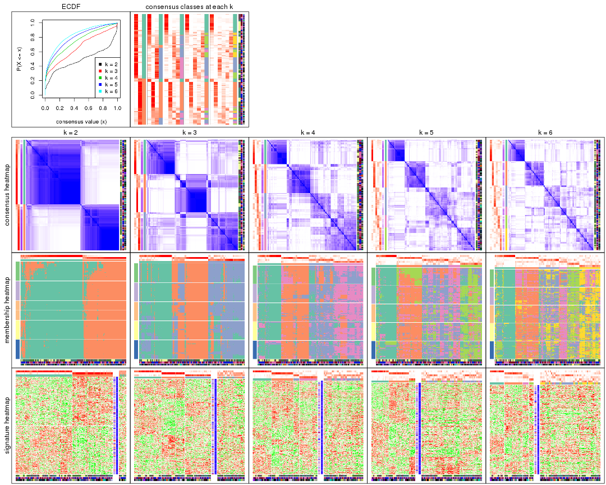

The plots are:

- The first row: a plot of the ECDF (empirical cumulative distribution
  function) curves of the consensus matrix for each `k` and the heatmap of
  predicted classes for each `k`.
- The second row: heatmaps of the consensus matrix for each `k`.
- The third row: heatmaps of the membership matrix for each `k`.
- The fouth row: heatmaps of the signatures for each `k`.

All the plots in panels can be made by individual functions and they are
plotted later in this section.

`select_partition_number()` produces several plots showing different
statistics for choosing "optimized" `k`. There are following statistics:

- ECDF curves of the consensus matrix for each `k`;
- 1-PAC. [The PAC
  score](https://en.wikipedia.org/wiki/Consensus_clustering#Over-interpretation_potential_of_consensus_clustering)
  measures the proportion of the ambiguous subgrouping.
- Mean silhouette score.
- Concordance. The mean probability of fiting the consensus class ids in all
  partitions.
- Area increased. Denote $A_k$ as the area under the ECDF curve for current
  `k`, the area increased is defined as $A_k - A_{k-1}$.
- Rand index. The percent of pairs of samples that are both in a same cluster
  or both are not in a same cluster in the partition of k and k-1.
- Jaccard index. The ratio of pairs of samples are both in a same cluster in
  the partition of k and k-1 and the pairs of samples are both in a same
  cluster in the partition k or k-1.

The detailed explanations of these statistics can be found in [the _cola_
vignette](http://bioconductor.org/packages/devel/bioc/vignettes/cola/inst/doc/cola.html#toc_13).

Generally speaking, lower PAC score, higher mean silhouette score or higher
concordance corresponds to better partition. Rand index and Jaccard index
measure how similar the current partition is compared to partition with `k-1`.
If they are too similar, we won't accept `k` is better than `k-1`.

```r
select_partition_number(res)
```

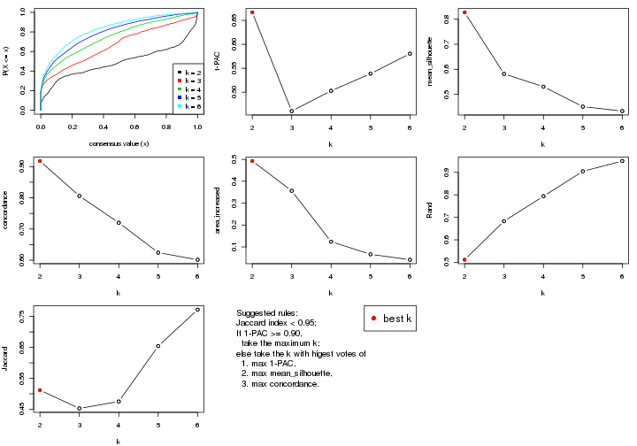

The numeric values for all these statistics can be obtained by `get_stats()`.

```r
get_stats(res)
```

```
#>   k 1-PAC mean_silhouette concordance area_increased  Rand Jaccard
#> 2 2 0.667           0.827       0.918         0.4925 0.512   0.512
#> 3 3 0.461           0.582       0.806         0.3563 0.683   0.453
#> 4 4 0.503           0.531       0.720         0.1238 0.794   0.475
#> 5 5 0.539           0.451       0.624         0.0661 0.905   0.654
#> 6 6 0.580           0.434       0.602         0.0413 0.950   0.772
```

`suggest_best_k()` suggests the best $k$ based on these statistics. The rules are as follows:

- All $k$ with Jaccard index larger than 0.95 are removed because increasing
  $k$ does not provide enough extra information. If all $k$ are removed, it is
  marked as no subgroup is detected.
- For all $k$ with 1-PAC score larger than 0.9, the maximal $k$ is taken as
  the best $k$, and other $k$ are marked as optional $k$.
- If it does not fit the second rule. The $k$ with the maximal vote of the
  highest 1-PAC score, highest mean silhouette, and highest concordance is
  taken as the best $k$.

```r
suggest_best_k(res)
```

```
#> [1] 2
```


Following shows the table of the partitions (You need to click the **show/hide
code output** link to see it). The membership matrix (columns with name `p*`)
is inferred by
[`clue::cl_consensus()`](https://www.rdocumentation.org/link/cl_consensus?package=clue)
function with the `SE` method. Basically the value in the membership matrix
represents the probability to belong to a certain group. The finall class
label for an item is determined with the group with highest probability it
belongs to.

In `get_classes()` function, the entropy is calculated from the membership
matrix and the silhouette score is calculated from the consensus matrix.


<script>
$( function() {
	$( '#tabs-MAD-skmeans-get-classes' ).tabs();
} );
</script>
<div id='tabs-MAD-skmeans-get-classes'>
<ul>
<li><a href='#tab-MAD-skmeans-get-classes-1'>k = 2</a></li>
<li><a href='#tab-MAD-skmeans-get-classes-2'>k = 3</a></li>
<li><a href='#tab-MAD-skmeans-get-classes-3'>k = 4</a></li>
<li><a href='#tab-MAD-skmeans-get-classes-4'>k = 5</a></li>
<li><a href='#tab-MAD-skmeans-get-classes-5'>k = 6</a></li>
</ul>

<div id='tab-MAD-skmeans-get-classes-1'>
<p><a id='tab-MAD-skmeans-get-classes-1-a' style='color:#0366d6' href='#'>show/hide code output</a></p>
<pre><code class="r">cbind(get_classes(res, k = 2), get_membership(res, k = 2))
</code></pre>

<pre><code>#&gt;          class entropy silhouette    p1    p2
#&gt; GSM29783     2  0.0672     0.9097 0.008 0.992
#&gt; GSM29786     2  0.5294     0.8647 0.120 0.880
#&gt; GSM29789     2  0.0000     0.9109 0.000 1.000
#&gt; GSM29792     2  0.0000     0.9109 0.000 1.000
#&gt; GSM29795     2  0.5178     0.8665 0.116 0.884
#&gt; GSM29798     2  0.6801     0.8094 0.180 0.820
#&gt; GSM29801     1  0.0376     0.9094 0.996 0.004
#&gt; GSM29804     1  0.0000     0.9101 1.000 0.000
#&gt; GSM29807     2  0.9896     0.0820 0.440 0.560
#&gt; GSM29816     1  0.0000     0.9101 1.000 0.000
#&gt; GSM29821     1  0.0938     0.9070 0.988 0.012
#&gt; GSM29824     1  0.0000     0.9101 1.000 0.000
#&gt; GSM29827     1  0.2423     0.9026 0.960 0.040
#&gt; GSM29830     1  0.0376     0.9101 0.996 0.004
#&gt; GSM29833     1  0.3114     0.8910 0.944 0.056
#&gt; GSM29784     2  0.0376     0.9102 0.004 0.996
#&gt; GSM29787     2  0.5629     0.8556 0.132 0.868
#&gt; GSM29790     2  0.0000     0.9109 0.000 1.000
#&gt; GSM29793     2  0.0000     0.9109 0.000 1.000
#&gt; GSM29796     2  0.3274     0.8949 0.060 0.940
#&gt; GSM29799     2  0.6887     0.8054 0.184 0.816
#&gt; GSM29802     1  0.0000     0.9101 1.000 0.000
#&gt; GSM29805     1  0.0000     0.9101 1.000 0.000
#&gt; GSM29814     2  0.9983    -0.0651 0.476 0.524
#&gt; GSM29817     1  0.0376     0.9094 0.996 0.004
#&gt; GSM29822     1  0.0000     0.9101 1.000 0.000
#&gt; GSM29825     1  0.0000     0.9101 1.000 0.000
#&gt; GSM29828     1  0.0938     0.9094 0.988 0.012
#&gt; GSM29831     1  0.0672     0.9098 0.992 0.008
#&gt; GSM29834     1  0.1184     0.9087 0.984 0.016
#&gt; GSM29785     2  0.0000     0.9109 0.000 1.000
#&gt; GSM29788     2  0.4161     0.8851 0.084 0.916
#&gt; GSM29791     2  0.0000     0.9109 0.000 1.000
#&gt; GSM29794     2  0.0000     0.9109 0.000 1.000
#&gt; GSM29797     2  0.2603     0.8995 0.044 0.956
#&gt; GSM29800     2  0.4562     0.8793 0.096 0.904
#&gt; GSM29803     1  0.8713     0.5393 0.708 0.292
#&gt; GSM29806     1  0.3879     0.8870 0.924 0.076
#&gt; GSM29815     2  0.1843     0.8982 0.028 0.972
#&gt; GSM29819     1  0.0000     0.9101 1.000 0.000
#&gt; GSM29823     2  0.9988     0.1950 0.480 0.520
#&gt; GSM29826     1  0.0000     0.9101 1.000 0.000
#&gt; GSM29829     1  0.3879     0.8858 0.924 0.076
#&gt; GSM29832     1  0.1633     0.9073 0.976 0.024
#&gt; GSM29835     2  0.8909     0.6015 0.308 0.692
#&gt; GSM29836     2  0.0000     0.9109 0.000 1.000
#&gt; GSM29839     2  0.2603     0.8995 0.044 0.956
#&gt; GSM29842     2  0.0000     0.9109 0.000 1.000
#&gt; GSM29845     2  0.4939     0.8728 0.108 0.892
#&gt; GSM29848     2  0.5946     0.8452 0.144 0.856
#&gt; GSM29851     1  0.0000     0.9101 1.000 0.000
#&gt; GSM29854     1  0.0000     0.9101 1.000 0.000
#&gt; GSM29857     1  0.2778     0.8968 0.952 0.048
#&gt; GSM29860     2  0.0000     0.9109 0.000 1.000
#&gt; GSM29863     1  0.0000     0.9101 1.000 0.000
#&gt; GSM29866     1  0.1184     0.9087 0.984 0.016
#&gt; GSM29869     1  0.4298     0.8792 0.912 0.088
#&gt; GSM29872     1  0.9209     0.5821 0.664 0.336
#&gt; GSM29875     1  0.0000     0.9101 1.000 0.000
#&gt; GSM29878     2  0.0376     0.9099 0.004 0.996
#&gt; GSM29837     2  0.0000     0.9109 0.000 1.000
#&gt; GSM29840     2  0.2603     0.8995 0.044 0.956
#&gt; GSM29843     2  0.0000     0.9109 0.000 1.000
#&gt; GSM29846     2  0.4939     0.8728 0.108 0.892
#&gt; GSM29849     2  0.5946     0.8452 0.144 0.856
#&gt; GSM29852     1  0.0000     0.9101 1.000 0.000
#&gt; GSM29855     1  0.0000     0.9101 1.000 0.000
#&gt; GSM29858     1  0.2603     0.8984 0.956 0.044
#&gt; GSM29861     2  0.0000     0.9109 0.000 1.000
#&gt; GSM29864     1  0.0000     0.9101 1.000 0.000
#&gt; GSM29867     1  0.0000     0.9101 1.000 0.000
#&gt; GSM29870     1  0.1633     0.9076 0.976 0.024
#&gt; GSM29873     1  0.8499     0.6851 0.724 0.276
#&gt; GSM29876     1  0.0000     0.9101 1.000 0.000
#&gt; GSM29879     1  1.0000     0.1407 0.504 0.496
#&gt; GSM29838     2  0.0000     0.9109 0.000 1.000
#&gt; GSM29841     2  0.1633     0.9056 0.024 0.976
#&gt; GSM29844     2  0.0000     0.9109 0.000 1.000
#&gt; GSM29847     2  0.4161     0.8850 0.084 0.916
#&gt; GSM29850     2  0.4431     0.8811 0.092 0.908
#&gt; GSM29853     1  0.0938     0.9068 0.988 0.012
#&gt; GSM29856     1  0.9998    -0.0867 0.508 0.492
#&gt; GSM29859     1  0.8909     0.6172 0.692 0.308
#&gt; GSM29862     2  0.0000     0.9109 0.000 1.000
#&gt; GSM29865     2  0.9686     0.4346 0.396 0.604
#&gt; GSM29868     1  0.9635     0.4305 0.612 0.388
#&gt; GSM29871     1  0.7528     0.7658 0.784 0.216
#&gt; GSM29874     2  0.0000     0.9109 0.000 1.000
#&gt; GSM29877     1  0.0000     0.9101 1.000 0.000
#&gt; GSM29880     2  0.0000     0.9109 0.000 1.000
#&gt; GSM29881     1  0.0376     0.9095 0.996 0.004
#&gt; GSM29884     2  0.0000     0.9109 0.000 1.000
#&gt; GSM29887     2  0.0000     0.9109 0.000 1.000
#&gt; GSM29890     1  0.1414     0.9074 0.980 0.020
#&gt; GSM29893     1  0.0672     0.9099 0.992 0.008
#&gt; GSM29896     1  0.0000     0.9101 1.000 0.000
#&gt; GSM29899     1  0.0000     0.9101 1.000 0.000
#&gt; GSM29902     1  0.3584     0.8890 0.932 0.068
#&gt; GSM29905     1  0.3114     0.8945 0.944 0.056
#&gt; GSM29908     1  0.2603     0.9013 0.956 0.044
#&gt; GSM29955     1  0.3733     0.8872 0.928 0.072
#&gt; GSM29958     1  0.1184     0.9087 0.984 0.016
#&gt; GSM29961     1  0.1843     0.9059 0.972 0.028
#&gt; GSM29882     1  0.0000     0.9101 1.000 0.000
#&gt; GSM29885     2  0.0000     0.9109 0.000 1.000
#&gt; GSM29888     2  0.0000     0.9109 0.000 1.000
#&gt; GSM29891     1  0.0938     0.9092 0.988 0.012
#&gt; GSM29894     1  0.0000     0.9101 1.000 0.000
#&gt; GSM29897     1  0.0000     0.9101 1.000 0.000
#&gt; GSM29900     1  0.0000     0.9101 1.000 0.000
#&gt; GSM29903     1  0.3274     0.8927 0.940 0.060
#&gt; GSM29906     1  0.3114     0.8945 0.944 0.056
#&gt; GSM29909     1  0.4298     0.8777 0.912 0.088
#&gt; GSM29956     1  0.1184     0.9087 0.984 0.016
#&gt; GSM29959     1  0.0938     0.9094 0.988 0.012
#&gt; GSM29962     1  0.1414     0.9078 0.980 0.020
#&gt; GSM29883     1  0.0000     0.9101 1.000 0.000
#&gt; GSM29886     2  0.0000     0.9109 0.000 1.000
#&gt; GSM29889     2  0.0000     0.9109 0.000 1.000
#&gt; GSM29892     1  0.3431     0.8912 0.936 0.064
#&gt; GSM29895     2  0.9358     0.5039 0.352 0.648
#&gt; GSM29898     1  0.0000     0.9101 1.000 0.000
#&gt; GSM29901     1  0.0000     0.9101 1.000 0.000
#&gt; GSM29904     1  0.5059     0.8626 0.888 0.112
#&gt; GSM29907     1  0.3114     0.8945 0.944 0.056
#&gt; GSM29910     2  0.9944     0.0644 0.456 0.544
#&gt; GSM29957     2  0.3584     0.8718 0.068 0.932
#&gt; GSM29960     1  0.8555     0.6011 0.720 0.280
#&gt; GSM29963     1  0.9998     0.1195 0.508 0.492
#&gt; GSM29964     2  0.0000     0.9109 0.000 1.000
#&gt; GSM29967     2  0.3733     0.8901 0.072 0.928
#&gt; GSM29970     1  0.3114     0.8894 0.944 0.056
#&gt; GSM29973     2  0.0000     0.9109 0.000 1.000
#&gt; GSM29976     1  0.0000     0.9101 1.000 0.000
#&gt; GSM29979     2  0.0000     0.9109 0.000 1.000
#&gt; GSM29982     2  0.5294     0.8653 0.120 0.880
#&gt; GSM29985     1  0.0000     0.9101 1.000 0.000
#&gt; GSM29988     1  0.8207     0.7148 0.744 0.256
#&gt; GSM29991     2  0.8813     0.6016 0.300 0.700
#&gt; GSM29994     1  0.4161     0.8803 0.916 0.084
#&gt; GSM29997     1  0.5946     0.8381 0.856 0.144
#&gt; GSM30000     1  0.6712     0.8116 0.824 0.176
#&gt; GSM30003     1  0.0000     0.9101 1.000 0.000
#&gt; GSM29965     2  0.0000     0.9109 0.000 1.000
#&gt; GSM29968     2  0.3733     0.8901 0.072 0.928
#&gt; GSM29971     1  0.2043     0.9012 0.968 0.032
#&gt; GSM29974     2  0.0000     0.9109 0.000 1.000
#&gt; GSM29977     1  0.0000     0.9101 1.000 0.000
#&gt; GSM29980     2  0.0938     0.9065 0.012 0.988
#&gt; GSM29983     1  0.9795     0.1953 0.584 0.416
#&gt; GSM29986     1  0.0000     0.9101 1.000 0.000
#&gt; GSM29989     1  0.6887     0.8014 0.816 0.184
#&gt; GSM29992     1  0.8555     0.6289 0.720 0.280
#&gt; GSM29995     1  0.4161     0.8803 0.916 0.084
#&gt; GSM29998     1  0.5737     0.8449 0.864 0.136
#&gt; GSM30001     1  0.4298     0.8807 0.912 0.088
#&gt; GSM30004     1  0.0000     0.9101 1.000 0.000
#&gt; GSM29966     2  0.0000     0.9109 0.000 1.000
#&gt; GSM29969     2  0.3584     0.8917 0.068 0.932
#&gt; GSM29972     1  0.9954     0.0942 0.540 0.460
#&gt; GSM29975     2  0.0000     0.9109 0.000 1.000
#&gt; GSM29978     1  0.0000     0.9101 1.000 0.000
#&gt; GSM29981     2  0.0000     0.9109 0.000 1.000
#&gt; GSM29984     2  0.4562     0.8793 0.096 0.904
#&gt; GSM29987     1  0.7528     0.6807 0.784 0.216
#&gt; GSM29990     1  0.9661     0.4728 0.608 0.392
#&gt; GSM29993     2  0.4161     0.8824 0.084 0.916
#&gt; GSM29996     1  0.4815     0.8680 0.896 0.104
#&gt; GSM29999     1  0.6887     0.8012 0.816 0.184
#&gt; GSM30002     2  0.4562     0.8455 0.096 0.904
#&gt; GSM30005     1  0.3114     0.8803 0.944 0.056
</code></pre>

<script>
$('#tab-MAD-skmeans-get-classes-1-a').parent().next().next().hide();
$('#tab-MAD-skmeans-get-classes-1-a').click(function(){
  $('#tab-MAD-skmeans-get-classes-1-a').parent().next().next().toggle();
  return(false);
});
</script>
</div>

<div id='tab-MAD-skmeans-get-classes-2'>
<p><a id='tab-MAD-skmeans-get-classes-2-a' style='color:#0366d6' href='#'>show/hide code output</a></p>
<pre><code class="r">cbind(get_classes(res, k = 3), get_membership(res, k = 3))
</code></pre>

<pre><code>#&gt;          class entropy silhouette    p1    p2    p3
#&gt; GSM29783     2  0.2313     0.7417 0.024 0.944 0.032
#&gt; GSM29786     2  0.6299     0.0595 0.000 0.524 0.476
#&gt; GSM29789     2  0.0237     0.7683 0.004 0.996 0.000
#&gt; GSM29792     2  0.0237     0.7683 0.004 0.996 0.000
#&gt; GSM29795     1  0.7337     0.1746 0.540 0.428 0.032
#&gt; GSM29798     2  0.6309    -0.0107 0.000 0.500 0.500
#&gt; GSM29801     3  0.6204     0.4840 0.424 0.000 0.576
#&gt; GSM29804     3  0.5327     0.6004 0.272 0.000 0.728
#&gt; GSM29807     2  0.7460     0.1980 0.036 0.524 0.440
#&gt; GSM29816     3  0.4399     0.7026 0.188 0.000 0.812
#&gt; GSM29821     1  0.6521    -0.3455 0.504 0.004 0.492
#&gt; GSM29824     1  0.1163     0.7941 0.972 0.000 0.028
#&gt; GSM29827     1  0.0000     0.7954 1.000 0.000 0.000
#&gt; GSM29830     1  0.0000     0.7954 1.000 0.000 0.000
#&gt; GSM29833     1  0.0000     0.7954 1.000 0.000 0.000
#&gt; GSM29784     2  0.0892     0.7597 0.000 0.980 0.020
#&gt; GSM29787     2  0.6305     0.0377 0.000 0.516 0.484
#&gt; GSM29790     2  0.0000     0.7692 0.000 1.000 0.000
#&gt; GSM29793     2  0.0000     0.7692 0.000 1.000 0.000
#&gt; GSM29796     2  0.5276     0.6435 0.128 0.820 0.052
#&gt; GSM29799     3  0.6140     0.2427 0.000 0.404 0.596
#&gt; GSM29802     3  0.4121     0.7097 0.168 0.000 0.832
#&gt; GSM29805     3  0.4555     0.6991 0.200 0.000 0.800
#&gt; GSM29814     2  0.8228     0.1488 0.076 0.512 0.412
#&gt; GSM29817     3  0.5678     0.6173 0.316 0.000 0.684
#&gt; GSM29822     3  0.5560     0.6312 0.300 0.000 0.700
#&gt; GSM29825     3  0.6309     0.2678 0.496 0.000 0.504
#&gt; GSM29828     1  0.0000     0.7954 1.000 0.000 0.000
#&gt; GSM29831     1  0.0000     0.7954 1.000 0.000 0.000
#&gt; GSM29834     1  0.0000     0.7954 1.000 0.000 0.000
#&gt; GSM29785     2  0.0237     0.7677 0.000 0.996 0.004
#&gt; GSM29788     2  0.6286     0.0909 0.000 0.536 0.464
#&gt; GSM29791     2  0.0237     0.7683 0.004 0.996 0.000
#&gt; GSM29794     2  0.0237     0.7683 0.004 0.996 0.000
#&gt; GSM29797     2  0.1482     0.7568 0.012 0.968 0.020
#&gt; GSM29800     2  0.6308     0.0147 0.000 0.508 0.492
#&gt; GSM29803     3  0.1337     0.7150 0.016 0.012 0.972
#&gt; GSM29806     3  0.0848     0.7100 0.008 0.008 0.984
#&gt; GSM29815     2  0.6295     0.2126 0.000 0.528 0.472
#&gt; GSM29819     3  0.0000     0.7107 0.000 0.000 1.000
#&gt; GSM29823     3  0.6629     0.4774 0.360 0.016 0.624
#&gt; GSM29826     3  0.2959     0.6924 0.100 0.000 0.900
#&gt; GSM29829     1  0.2796     0.7703 0.908 0.000 0.092
#&gt; GSM29832     1  0.2537     0.7715 0.920 0.000 0.080
#&gt; GSM29835     1  0.3539     0.7583 0.888 0.012 0.100
#&gt; GSM29836     2  0.0000     0.7692 0.000 1.000 0.000
#&gt; GSM29839     2  0.0475     0.7675 0.004 0.992 0.004
#&gt; GSM29842     2  0.0000     0.7692 0.000 1.000 0.000
#&gt; GSM29845     3  0.6305     0.0276 0.000 0.484 0.516
#&gt; GSM29848     2  0.6308     0.0147 0.000 0.508 0.492
#&gt; GSM29851     3  0.5968     0.5692 0.364 0.000 0.636
#&gt; GSM29854     3  0.1860     0.7221 0.052 0.000 0.948
#&gt; GSM29857     3  0.3482     0.7025 0.128 0.000 0.872
#&gt; GSM29860     2  0.0237     0.7683 0.004 0.996 0.000
#&gt; GSM29863     3  0.5733     0.5602 0.324 0.000 0.676
#&gt; GSM29866     1  0.0000     0.7954 1.000 0.000 0.000
#&gt; GSM29869     1  0.4015     0.7301 0.876 0.096 0.028
#&gt; GSM29872     1  0.9162     0.3133 0.500 0.340 0.160
#&gt; GSM29875     3  0.6225     0.4710 0.432 0.000 0.568
#&gt; GSM29878     2  0.6026     0.2988 0.376 0.624 0.000
#&gt; GSM29837     2  0.0000     0.7692 0.000 1.000 0.000
#&gt; GSM29840     2  0.0475     0.7675 0.004 0.992 0.004
#&gt; GSM29843     2  0.0000     0.7692 0.000 1.000 0.000
#&gt; GSM29846     3  0.6235     0.1628 0.000 0.436 0.564
#&gt; GSM29849     3  0.6309    -0.0228 0.000 0.500 0.500
#&gt; GSM29852     3  0.5431     0.6447 0.284 0.000 0.716
#&gt; GSM29855     3  0.3482     0.7201 0.128 0.000 0.872
#&gt; GSM29858     3  0.3340     0.7085 0.120 0.000 0.880
#&gt; GSM29861     2  0.0237     0.7683 0.004 0.996 0.000
#&gt; GSM29864     3  0.5785     0.5901 0.332 0.000 0.668
#&gt; GSM29867     1  0.4452     0.6465 0.808 0.000 0.192
#&gt; GSM29870     1  0.7044     0.2807 0.620 0.032 0.348
#&gt; GSM29873     2  0.9877     0.0170 0.296 0.412 0.292
#&gt; GSM29876     3  0.4796     0.6871 0.220 0.000 0.780
#&gt; GSM29879     1  0.7758     0.0512 0.484 0.468 0.048
#&gt; GSM29838     2  0.0000     0.7692 0.000 1.000 0.000
#&gt; GSM29841     2  0.0237     0.7683 0.004 0.996 0.000
#&gt; GSM29844     2  0.0000     0.7692 0.000 1.000 0.000
#&gt; GSM29847     2  0.6308     0.0147 0.000 0.508 0.492
#&gt; GSM29850     2  0.6307     0.0264 0.000 0.512 0.488
#&gt; GSM29853     3  0.5016     0.6266 0.240 0.000 0.760
#&gt; GSM29856     3  0.1765     0.7087 0.040 0.004 0.956
#&gt; GSM29859     3  0.4235     0.5613 0.000 0.176 0.824
#&gt; GSM29862     2  0.2400     0.7320 0.004 0.932 0.064
#&gt; GSM29865     3  0.4295     0.6705 0.032 0.104 0.864
#&gt; GSM29868     1  0.5072     0.7218 0.792 0.012 0.196
#&gt; GSM29871     3  0.7262    -0.0576 0.028 0.444 0.528
#&gt; GSM29874     2  0.8255     0.3903 0.252 0.620 0.128
#&gt; GSM29877     3  0.5363     0.6467 0.276 0.000 0.724
#&gt; GSM29880     2  0.2096     0.7400 0.004 0.944 0.052
#&gt; GSM29881     3  0.2537     0.7244 0.080 0.000 0.920
#&gt; GSM29884     2  0.0000     0.7692 0.000 1.000 0.000
#&gt; GSM29887     2  0.0000     0.7692 0.000 1.000 0.000
#&gt; GSM29890     1  0.3412     0.7459 0.876 0.000 0.124
#&gt; GSM29893     1  0.0000     0.7954 1.000 0.000 0.000
#&gt; GSM29896     1  0.0000     0.7954 1.000 0.000 0.000
#&gt; GSM29899     1  0.1031     0.7926 0.976 0.000 0.024
#&gt; GSM29902     1  0.5465     0.6225 0.712 0.000 0.288
#&gt; GSM29905     1  0.5216     0.6530 0.740 0.000 0.260
#&gt; GSM29908     1  0.0000     0.7954 1.000 0.000 0.000
#&gt; GSM29955     1  0.0424     0.7947 0.992 0.000 0.008
#&gt; GSM29958     1  0.0000     0.7954 1.000 0.000 0.000
#&gt; GSM29961     1  0.0000     0.7954 1.000 0.000 0.000
#&gt; GSM29882     3  0.4121     0.7099 0.168 0.000 0.832
#&gt; GSM29885     2  0.0000     0.7692 0.000 1.000 0.000
#&gt; GSM29888     2  0.0000     0.7692 0.000 1.000 0.000
#&gt; GSM29891     1  0.5859     0.4886 0.656 0.000 0.344
#&gt; GSM29894     1  0.0592     0.7900 0.988 0.000 0.012
#&gt; GSM29897     1  0.0000     0.7954 1.000 0.000 0.000
#&gt; GSM29900     3  0.5785     0.5693 0.332 0.000 0.668
#&gt; GSM29903     1  0.4842     0.6676 0.776 0.000 0.224
#&gt; GSM29906     1  0.5529     0.6068 0.704 0.000 0.296
#&gt; GSM29909     1  0.3619     0.7376 0.864 0.000 0.136
#&gt; GSM29956     1  0.0000     0.7954 1.000 0.000 0.000
#&gt; GSM29959     1  0.0000     0.7954 1.000 0.000 0.000
#&gt; GSM29962     1  0.0000     0.7954 1.000 0.000 0.000
#&gt; GSM29883     3  0.0424     0.7143 0.008 0.000 0.992
#&gt; GSM29886     2  0.0000     0.7692 0.000 1.000 0.000
#&gt; GSM29889     2  0.0000     0.7692 0.000 1.000 0.000
#&gt; GSM29892     1  0.5678     0.6452 0.684 0.000 0.316
#&gt; GSM29895     1  0.3459     0.7636 0.892 0.012 0.096
#&gt; GSM29898     1  0.5988     0.5805 0.632 0.000 0.368
#&gt; GSM29901     3  0.3752     0.6334 0.144 0.000 0.856
#&gt; GSM29904     1  0.5650     0.6435 0.688 0.000 0.312
#&gt; GSM29907     1  0.5968     0.5859 0.636 0.000 0.364
#&gt; GSM29910     1  0.3715     0.7571 0.868 0.004 0.128
#&gt; GSM29957     1  0.5581     0.7247 0.792 0.040 0.168
#&gt; GSM29960     1  0.2448     0.7719 0.924 0.000 0.076
#&gt; GSM29963     1  0.4629     0.7306 0.808 0.004 0.188
#&gt; GSM29964     2  0.0000     0.7692 0.000 1.000 0.000
#&gt; GSM29967     2  0.5948     0.3291 0.000 0.640 0.360
#&gt; GSM29970     3  0.2356     0.7226 0.072 0.000 0.928
#&gt; GSM29973     2  0.0000     0.7692 0.000 1.000 0.000
#&gt; GSM29976     3  0.3116     0.7174 0.108 0.000 0.892
#&gt; GSM29979     2  0.5292     0.5791 0.008 0.764 0.228
#&gt; GSM29982     3  0.9174     0.3981 0.192 0.276 0.532
#&gt; GSM29985     3  0.2165     0.7222 0.064 0.000 0.936
#&gt; GSM29988     2  0.9285     0.1039 0.160 0.448 0.392
#&gt; GSM29991     3  0.9182     0.3733 0.204 0.260 0.536
#&gt; GSM29994     1  0.5678     0.5859 0.684 0.000 0.316
#&gt; GSM29997     1  0.8512     0.4898 0.580 0.124 0.296
#&gt; GSM30000     1  0.5366     0.7136 0.776 0.016 0.208
#&gt; GSM30003     3  0.4178     0.7087 0.172 0.000 0.828
#&gt; GSM29965     2  0.0000     0.7692 0.000 1.000 0.000
#&gt; GSM29968     2  0.5968     0.3211 0.000 0.636 0.364
#&gt; GSM29971     3  0.2261     0.7232 0.068 0.000 0.932
#&gt; GSM29974     2  0.0000     0.7692 0.000 1.000 0.000
#&gt; GSM29977     3  0.3267     0.7197 0.116 0.000 0.884
#&gt; GSM29980     2  0.6252     0.2593 0.000 0.556 0.444
#&gt; GSM29983     3  0.6899     0.5457 0.364 0.024 0.612
#&gt; GSM29986     3  0.2625     0.7255 0.084 0.000 0.916
#&gt; GSM29989     2  0.9069     0.0253 0.136 0.440 0.424
#&gt; GSM29992     3  0.6714     0.6216 0.140 0.112 0.748
#&gt; GSM29995     1  0.0237     0.7941 0.996 0.000 0.004
#&gt; GSM29998     1  0.8948     0.3668 0.508 0.136 0.356
#&gt; GSM30001     3  0.7348     0.2068 0.348 0.044 0.608
#&gt; GSM30004     3  0.4346     0.7048 0.184 0.000 0.816
#&gt; GSM29966     2  0.0000     0.7692 0.000 1.000 0.000
#&gt; GSM29969     2  0.5760     0.3894 0.000 0.672 0.328
#&gt; GSM29972     3  0.1129     0.7093 0.020 0.004 0.976
#&gt; GSM29975     2  0.0000     0.7692 0.000 1.000 0.000
#&gt; GSM29978     3  0.1289     0.7072 0.032 0.000 0.968
#&gt; GSM29981     2  0.3752     0.6732 0.000 0.856 0.144
#&gt; GSM29984     3  0.6225     0.1238 0.000 0.432 0.568
#&gt; GSM29987     3  0.0000     0.7107 0.000 0.000 1.000
#&gt; GSM29990     2  0.9177     0.1536 0.148 0.452 0.400
#&gt; GSM29993     3  0.7504     0.3929 0.060 0.312 0.628
#&gt; GSM29996     1  0.4605     0.7269 0.796 0.000 0.204
#&gt; GSM29999     3  0.8747    -0.0267 0.112 0.396 0.492
#&gt; GSM30002     3  0.8918     0.0191 0.128 0.380 0.492
#&gt; GSM30005     3  0.0237     0.7108 0.004 0.000 0.996
</code></pre>

<script>
$('#tab-MAD-skmeans-get-classes-2-a').parent().next().next().hide();
$('#tab-MAD-skmeans-get-classes-2-a').click(function(){
  $('#tab-MAD-skmeans-get-classes-2-a').parent().next().next().toggle();
  return(false);
});
</script>
</div>

<div id='tab-MAD-skmeans-get-classes-3'>
<p><a id='tab-MAD-skmeans-get-classes-3-a' style='color:#0366d6' href='#'>show/hide code output</a></p>
<pre><code class="r">cbind(get_classes(res, k = 4), get_membership(res, k = 4))
</code></pre>

<pre><code>#&gt;          class entropy silhouette    p1    p2    p3    p4
#&gt; GSM29783     2  0.4163     0.6943 0.000 0.828 0.076 0.096
#&gt; GSM29786     4  0.6376     0.2317 0.000 0.432 0.064 0.504
#&gt; GSM29789     2  0.2125     0.8031 0.000 0.920 0.076 0.004
#&gt; GSM29792     2  0.2125     0.8031 0.000 0.920 0.076 0.004
#&gt; GSM29795     1  0.7402     0.1835 0.508 0.384 0.060 0.048
#&gt; GSM29798     4  0.5569     0.5198 0.000 0.296 0.044 0.660
#&gt; GSM29801     4  0.5430     0.5655 0.252 0.008 0.036 0.704
#&gt; GSM29804     4  0.7798     0.0844 0.264 0.000 0.320 0.416
#&gt; GSM29807     3  0.5519     0.3593 0.024 0.308 0.660 0.008
#&gt; GSM29816     4  0.6188     0.2312 0.056 0.000 0.396 0.548
#&gt; GSM29821     4  0.5666     0.5311 0.296 0.012 0.028 0.664
#&gt; GSM29824     1  0.3004     0.7456 0.892 0.000 0.060 0.048
#&gt; GSM29827     1  0.0000     0.8029 1.000 0.000 0.000 0.000
#&gt; GSM29830     1  0.0000     0.8029 1.000 0.000 0.000 0.000
#&gt; GSM29833     1  0.0000     0.8029 1.000 0.000 0.000 0.000
#&gt; GSM29784     2  0.3533     0.7190 0.000 0.864 0.056 0.080
#&gt; GSM29787     4  0.6233     0.3387 0.000 0.388 0.060 0.552
#&gt; GSM29790     2  0.1661     0.8030 0.000 0.944 0.052 0.004
#&gt; GSM29793     2  0.2197     0.8027 0.000 0.916 0.080 0.004
#&gt; GSM29796     2  0.5851     0.6286 0.072 0.760 0.068 0.100
#&gt; GSM29799     4  0.5213     0.5694 0.000 0.224 0.052 0.724
#&gt; GSM29802     4  0.4467     0.5879 0.040 0.000 0.172 0.788
#&gt; GSM29805     4  0.6717     0.3183 0.108 0.000 0.332 0.560
#&gt; GSM29814     3  0.6129     0.3930 0.012 0.292 0.644 0.052
#&gt; GSM29817     4  0.4389     0.6149 0.116 0.000 0.072 0.812
#&gt; GSM29822     4  0.4300     0.6177 0.092 0.000 0.088 0.820
#&gt; GSM29825     1  0.7523    -0.1719 0.416 0.000 0.184 0.400
#&gt; GSM29828     1  0.0592     0.8020 0.984 0.000 0.000 0.016
#&gt; GSM29831     1  0.0592     0.8020 0.984 0.000 0.000 0.016
#&gt; GSM29834     1  0.0592     0.8020 0.984 0.000 0.000 0.016
#&gt; GSM29785     2  0.2759     0.7492 0.000 0.904 0.044 0.052
#&gt; GSM29788     2  0.6395    -0.1453 0.000 0.472 0.064 0.464
#&gt; GSM29791     2  0.2813     0.8001 0.000 0.896 0.080 0.024
#&gt; GSM29794     2  0.2813     0.8000 0.000 0.896 0.080 0.024
#&gt; GSM29797     2  0.4552     0.7213 0.024 0.828 0.072 0.076
#&gt; GSM29800     4  0.6069     0.4161 0.000 0.356 0.056 0.588
#&gt; GSM29803     4  0.2530     0.5939 0.000 0.004 0.100 0.896
#&gt; GSM29806     4  0.5112     0.1511 0.000 0.004 0.436 0.560
#&gt; GSM29815     3  0.5929     0.3472 0.000 0.296 0.640 0.064
#&gt; GSM29819     4  0.4933     0.1864 0.000 0.000 0.432 0.568
#&gt; GSM29823     4  0.5279     0.5775 0.132 0.020 0.072 0.776
#&gt; GSM29826     3  0.6655     0.0241 0.084 0.000 0.476 0.440
#&gt; GSM29829     1  0.3873     0.7329 0.844 0.000 0.060 0.096
#&gt; GSM29832     1  0.3634     0.7391 0.856 0.000 0.048 0.096
#&gt; GSM29835     1  0.4296     0.7383 0.840 0.020 0.060 0.080
#&gt; GSM29836     2  0.2773     0.7963 0.000 0.880 0.116 0.004
#&gt; GSM29839     2  0.3401     0.7559 0.048 0.888 0.032 0.032
#&gt; GSM29842     2  0.1297     0.7822 0.000 0.964 0.020 0.016
#&gt; GSM29845     4  0.5446     0.5379 0.000 0.276 0.044 0.680
#&gt; GSM29848     4  0.5619     0.4847 0.000 0.320 0.040 0.640
#&gt; GSM29851     4  0.4800     0.5959 0.196 0.000 0.044 0.760
#&gt; GSM29854     4  0.5736     0.4420 0.044 0.000 0.328 0.628
#&gt; GSM29857     3  0.5577     0.3131 0.036 0.000 0.636 0.328
#&gt; GSM29860     2  0.3873     0.7735 0.008 0.832 0.144 0.016
#&gt; GSM29863     4  0.4731     0.6142 0.160 0.000 0.060 0.780
#&gt; GSM29866     1  0.0000     0.8029 1.000 0.000 0.000 0.000
#&gt; GSM29869     1  0.6800     0.1735 0.556 0.040 0.368 0.036
#&gt; GSM29872     3  0.7959     0.2772 0.312 0.236 0.444 0.008
#&gt; GSM29875     4  0.5744     0.5372 0.256 0.000 0.068 0.676
#&gt; GSM29878     2  0.6924     0.4352 0.320 0.568 0.104 0.008
#&gt; GSM29837     2  0.3355     0.7772 0.000 0.836 0.160 0.004
#&gt; GSM29840     2  0.2910     0.7630 0.020 0.908 0.028 0.044
#&gt; GSM29843     2  0.1520     0.7775 0.000 0.956 0.024 0.020
#&gt; GSM29846     4  0.5008     0.5658 0.000 0.228 0.040 0.732
#&gt; GSM29849     4  0.5543     0.5409 0.004 0.276 0.040 0.680
#&gt; GSM29852     4  0.4669     0.6065 0.100 0.000 0.104 0.796
#&gt; GSM29855     4  0.4175     0.5987 0.016 0.000 0.200 0.784
#&gt; GSM29858     3  0.5573     0.2601 0.028 0.000 0.604 0.368
#&gt; GSM29861     2  0.4044     0.7658 0.004 0.820 0.152 0.024
#&gt; GSM29864     4  0.4017     0.6229 0.128 0.000 0.044 0.828
#&gt; GSM29867     1  0.6936     0.2468 0.568 0.000 0.148 0.284
#&gt; GSM29870     3  0.8008     0.2013 0.300 0.004 0.400 0.296
#&gt; GSM29873     3  0.7561     0.4811 0.152 0.208 0.600 0.040
#&gt; GSM29876     4  0.4869     0.5957 0.088 0.000 0.132 0.780
#&gt; GSM29879     2  0.8839     0.1659 0.292 0.440 0.200 0.068
#&gt; GSM29838     2  0.3052     0.7904 0.000 0.860 0.136 0.004
#&gt; GSM29841     2  0.2909     0.7728 0.008 0.904 0.036 0.052
#&gt; GSM29844     2  0.1174     0.7964 0.000 0.968 0.020 0.012
#&gt; GSM29847     4  0.6110     0.3846 0.000 0.368 0.056 0.576
#&gt; GSM29850     4  0.5790     0.4414 0.000 0.340 0.044 0.616
#&gt; GSM29853     4  0.2593     0.6049 0.016 0.000 0.080 0.904
#&gt; GSM29856     4  0.4695     0.4974 0.012 0.004 0.252 0.732
#&gt; GSM29859     3  0.5297     0.4356 0.000 0.032 0.676 0.292
#&gt; GSM29862     2  0.5100     0.7102 0.000 0.756 0.168 0.076
#&gt; GSM29865     4  0.2831     0.5882 0.000 0.004 0.120 0.876
#&gt; GSM29868     1  0.7001     0.5186 0.624 0.016 0.216 0.144
#&gt; GSM29871     3  0.4731     0.5555 0.004 0.100 0.800 0.096
#&gt; GSM29874     2  0.8380     0.3577 0.096 0.504 0.300 0.100
#&gt; GSM29877     4  0.4364     0.6197 0.092 0.000 0.092 0.816
#&gt; GSM29880     2  0.4711     0.7343 0.000 0.784 0.152 0.064
#&gt; GSM29881     4  0.4988     0.5319 0.020 0.000 0.288 0.692
#&gt; GSM29884     2  0.0895     0.7967 0.000 0.976 0.020 0.004
#&gt; GSM29887     2  0.1576     0.8026 0.000 0.948 0.048 0.004
#&gt; GSM29890     1  0.5279     0.1455 0.588 0.000 0.400 0.012
#&gt; GSM29893     1  0.0188     0.8022 0.996 0.000 0.004 0.000
#&gt; GSM29896     1  0.0000     0.8029 1.000 0.000 0.000 0.000
#&gt; GSM29899     1  0.4257     0.6670 0.812 0.000 0.140 0.048
#&gt; GSM29902     3  0.5231     0.3791 0.384 0.000 0.604 0.012
#&gt; GSM29905     3  0.5119     0.2727 0.440 0.000 0.556 0.004
#&gt; GSM29908     1  0.0000     0.8029 1.000 0.000 0.000 0.000
#&gt; GSM29955     1  0.0524     0.8012 0.988 0.000 0.004 0.008
#&gt; GSM29958     1  0.0000     0.8029 1.000 0.000 0.000 0.000
#&gt; GSM29961     1  0.0000     0.8029 1.000 0.000 0.000 0.000
#&gt; GSM29882     4  0.4332     0.6039 0.032 0.000 0.176 0.792
#&gt; GSM29885     2  0.0657     0.7916 0.000 0.984 0.012 0.004
#&gt; GSM29888     2  0.1902     0.8037 0.000 0.932 0.064 0.004
#&gt; GSM29891     3  0.6956     0.4542 0.288 0.000 0.564 0.148
#&gt; GSM29894     1  0.0895     0.7999 0.976 0.000 0.004 0.020
#&gt; GSM29897     1  0.0469     0.8026 0.988 0.000 0.000 0.012
#&gt; GSM29900     4  0.7732    -0.0214 0.228 0.000 0.380 0.392
#&gt; GSM29903     3  0.6070     0.3042 0.404 0.000 0.548 0.048
#&gt; GSM29906     3  0.5805     0.3421 0.388 0.000 0.576 0.036
#&gt; GSM29909     1  0.4549     0.6103 0.776 0.000 0.188 0.036
#&gt; GSM29956     1  0.0592     0.8020 0.984 0.000 0.000 0.016
#&gt; GSM29959     1  0.0592     0.8020 0.984 0.000 0.000 0.016
#&gt; GSM29962     1  0.0592     0.8020 0.984 0.000 0.000 0.016
#&gt; GSM29883     4  0.3400     0.5953 0.000 0.000 0.180 0.820
#&gt; GSM29886     2  0.0524     0.7931 0.000 0.988 0.004 0.008
#&gt; GSM29889     2  0.1743     0.8044 0.000 0.940 0.056 0.004
#&gt; GSM29892     3  0.6586     0.2667 0.368 0.000 0.544 0.088
#&gt; GSM29895     1  0.4480     0.7235 0.820 0.008 0.072 0.100
#&gt; GSM29898     3  0.6686     0.2115 0.388 0.000 0.520 0.092
#&gt; GSM29901     3  0.7049     0.1982 0.124 0.000 0.484 0.392
#&gt; GSM29904     3  0.6637     0.2465 0.368 0.000 0.540 0.092
#&gt; GSM29907     3  0.6446     0.3446 0.328 0.000 0.584 0.088
#&gt; GSM29910     1  0.4905     0.6879 0.788 0.004 0.112 0.096
#&gt; GSM29957     1  0.6142     0.6477 0.736 0.048 0.116 0.100
#&gt; GSM29960     1  0.3439     0.7479 0.868 0.000 0.048 0.084
#&gt; GSM29963     1  0.5812     0.6049 0.712 0.004 0.184 0.100
#&gt; GSM29964     2  0.2999     0.7913 0.000 0.864 0.132 0.004
#&gt; GSM29967     2  0.6649     0.1763 0.000 0.560 0.100 0.340
#&gt; GSM29970     3  0.5928    -0.0649 0.020 0.012 0.560 0.408
#&gt; GSM29973     2  0.3024     0.7857 0.000 0.852 0.148 0.000
#&gt; GSM29976     3  0.5906     0.3402 0.064 0.000 0.644 0.292
#&gt; GSM29979     2  0.6474     0.4051 0.016 0.556 0.384 0.044
#&gt; GSM29982     4  0.7812     0.5359 0.140 0.144 0.100 0.616
#&gt; GSM29985     4  0.5543     0.3179 0.020 0.000 0.424 0.556
#&gt; GSM29988     3  0.4090     0.5606 0.032 0.140 0.824 0.004
#&gt; GSM29991     3  0.6881     0.4514 0.056 0.156 0.680 0.108
#&gt; GSM29994     3  0.4955     0.4332 0.344 0.000 0.648 0.008
#&gt; GSM29997     3  0.5403     0.5679 0.196 0.052 0.740 0.012
#&gt; GSM30000     1  0.5944     0.3352 0.628 0.028 0.328 0.016
#&gt; GSM30003     4  0.6658     0.0862 0.084 0.000 0.444 0.472
#&gt; GSM29965     2  0.3401     0.7799 0.000 0.840 0.152 0.008
#&gt; GSM29968     2  0.6766     0.0484 0.000 0.520 0.100 0.380
#&gt; GSM29971     4  0.5296     0.2068 0.000 0.008 0.492 0.500
#&gt; GSM29974     2  0.3257     0.7813 0.000 0.844 0.152 0.004
#&gt; GSM29977     3  0.5682     0.2676 0.036 0.000 0.612 0.352
#&gt; GSM29980     3  0.5560     0.1097 0.000 0.392 0.584 0.024
#&gt; GSM29983     4  0.5734     0.6009 0.148 0.020 0.088 0.744
#&gt; GSM29986     4  0.3528     0.5970 0.000 0.000 0.192 0.808
#&gt; GSM29989     3  0.4821     0.5606 0.024 0.112 0.808 0.056
#&gt; GSM29992     3  0.6929     0.4112 0.032 0.152 0.660 0.156
#&gt; GSM29995     1  0.2563     0.7613 0.908 0.000 0.072 0.020
#&gt; GSM29998     3  0.5187     0.5803 0.100 0.056 0.796 0.048
#&gt; GSM30001     3  0.5555     0.5638 0.132 0.012 0.752 0.104
#&gt; GSM30004     4  0.6384     0.1160 0.064 0.000 0.440 0.496
#&gt; GSM29966     2  0.2868     0.7881 0.000 0.864 0.136 0.000
#&gt; GSM29969     2  0.6425     0.2786 0.000 0.604 0.096 0.300
#&gt; GSM29972     3  0.5590    -0.0430 0.000 0.020 0.524 0.456
#&gt; GSM29975     2  0.2973     0.7868 0.000 0.856 0.144 0.000
#&gt; GSM29978     3  0.4677     0.3810 0.004 0.000 0.680 0.316
#&gt; GSM29981     2  0.6603     0.4787 0.000 0.572 0.328 0.100
#&gt; GSM29984     4  0.6133     0.5100 0.000 0.204 0.124 0.672
#&gt; GSM29987     4  0.4250     0.5288 0.000 0.000 0.276 0.724
#&gt; GSM29990     3  0.5851     0.5007 0.012 0.192 0.716 0.080
#&gt; GSM29993     3  0.6726     0.3646 0.012 0.244 0.632 0.112
#&gt; GSM29996     1  0.6549     0.2880 0.556 0.000 0.356 0.088
#&gt; GSM29999     3  0.3200     0.5685 0.004 0.092 0.880 0.024
#&gt; GSM30002     3  0.6270     0.5433 0.036 0.128 0.720 0.116
#&gt; GSM30005     4  0.4907     0.1750 0.000 0.000 0.420 0.580
</code></pre>

<script>
$('#tab-MAD-skmeans-get-classes-3-a').parent().next().next().hide();
$('#tab-MAD-skmeans-get-classes-3-a').click(function(){
  $('#tab-MAD-skmeans-get-classes-3-a').parent().next().next().toggle();
  return(false);
});
</script>
</div>

<div id='tab-MAD-skmeans-get-classes-4'>
<p><a id='tab-MAD-skmeans-get-classes-4-a' style='color:#0366d6' href='#'>show/hide code output</a></p>
<pre><code class="r">cbind(get_classes(res, k = 5), get_membership(res, k = 5))
</code></pre>

<pre><code>#&gt;          class entropy silhouette    p1    p2    p3    p4    p5
#&gt; GSM29783     2  0.5787   0.354765 0.000 0.580 0.068 0.336 0.016
#&gt; GSM29786     4  0.6767   0.278969 0.000 0.280 0.264 0.452 0.004
#&gt; GSM29789     2  0.2234   0.749991 0.004 0.916 0.000 0.036 0.044
#&gt; GSM29792     2  0.2199   0.752213 0.008 0.916 0.000 0.016 0.060
#&gt; GSM29795     1  0.6824   0.019463 0.428 0.260 0.004 0.308 0.000
#&gt; GSM29798     3  0.6535  -0.122563 0.000 0.176 0.464 0.356 0.004
#&gt; GSM29801     3  0.4489   0.445763 0.156 0.012 0.780 0.036 0.016
#&gt; GSM29804     3  0.7212   0.380703 0.156 0.000 0.560 0.108 0.176
#&gt; GSM29807     5  0.6332   0.262626 0.008 0.300 0.024 0.088 0.580
#&gt; GSM29816     3  0.5122   0.380372 0.020 0.000 0.656 0.032 0.292
#&gt; GSM29821     3  0.6861   0.243191 0.288 0.028 0.528 0.152 0.004
#&gt; GSM29824     1  0.5281   0.550723 0.684 0.000 0.044 0.240 0.032
#&gt; GSM29827     1  0.0162   0.829893 0.996 0.000 0.000 0.004 0.000
#&gt; GSM29830     1  0.0162   0.829901 0.996 0.000 0.004 0.000 0.000
#&gt; GSM29833     1  0.0162   0.830081 0.996 0.004 0.000 0.000 0.000
#&gt; GSM29784     2  0.5336   0.433997 0.000 0.632 0.052 0.304 0.012
#&gt; GSM29787     4  0.6669   0.265747 0.000 0.220 0.308 0.468 0.004
#&gt; GSM29790     2  0.2409   0.744917 0.000 0.900 0.000 0.068 0.032
#&gt; GSM29793     2  0.1484   0.753250 0.000 0.944 0.000 0.008 0.048
#&gt; GSM29796     2  0.6239   0.337402 0.068 0.564 0.032 0.332 0.004
#&gt; GSM29799     3  0.5887   0.079551 0.000 0.104 0.588 0.300 0.008
#&gt; GSM29802     3  0.2769   0.478559 0.024 0.000 0.892 0.020 0.064
#&gt; GSM29805     3  0.5124   0.461859 0.044 0.000 0.744 0.076 0.136
#&gt; GSM29814     5  0.6786   0.360724 0.004 0.248 0.080 0.084 0.584
#&gt; GSM29817     3  0.3410   0.464965 0.052 0.000 0.860 0.064 0.024
#&gt; GSM29822     3  0.3241   0.474142 0.052 0.000 0.872 0.040 0.036
#&gt; GSM29825     3  0.8005   0.117827 0.300 0.000 0.352 0.264 0.084
#&gt; GSM29828     1  0.0404   0.829617 0.988 0.000 0.012 0.000 0.000
#&gt; GSM29831     1  0.0566   0.828379 0.984 0.000 0.012 0.000 0.004
#&gt; GSM29834     1  0.0889   0.826509 0.976 0.004 0.012 0.004 0.004
#&gt; GSM29785     2  0.4380   0.527221 0.000 0.692 0.012 0.288 0.008
#&gt; GSM29788     4  0.6677   0.294130 0.000 0.304 0.224 0.468 0.004
#&gt; GSM29791     2  0.3415   0.738787 0.004 0.856 0.008 0.080 0.052
#&gt; GSM29794     2  0.3433   0.743190 0.004 0.856 0.008 0.064 0.068
#&gt; GSM29797     2  0.5398   0.463799 0.032 0.612 0.012 0.336 0.008
#&gt; GSM29800     4  0.6765   0.186917 0.000 0.220 0.368 0.408 0.004
#&gt; GSM29803     3  0.4527   0.372721 0.000 0.004 0.752 0.172 0.072
#&gt; GSM29806     3  0.6278   0.285578 0.000 0.004 0.560 0.208 0.228
#&gt; GSM29815     5  0.6788   0.174334 0.000 0.316 0.036 0.132 0.516
#&gt; GSM29819     3  0.5867   0.343063 0.000 0.000 0.604 0.180 0.216
#&gt; GSM29823     3  0.7434   0.142209 0.132 0.052 0.544 0.244 0.028
#&gt; GSM29826     4  0.7301   0.062239 0.044 0.000 0.308 0.456 0.192
#&gt; GSM29829     1  0.3698   0.763188 0.844 0.000 0.028 0.064 0.064
#&gt; GSM29832     1  0.3699   0.764794 0.848 0.004 0.028 0.076 0.044
#&gt; GSM29835     1  0.4667   0.746478 0.800 0.044 0.028 0.096 0.032
#&gt; GSM29836     2  0.3616   0.745821 0.004 0.828 0.000 0.052 0.116
#&gt; GSM29839     2  0.4566   0.643501 0.044 0.788 0.040 0.124 0.004
#&gt; GSM29842     2  0.3292   0.682086 0.000 0.836 0.016 0.140 0.008
#&gt; GSM29845     3  0.6406  -0.089077 0.000 0.136 0.476 0.380 0.008
#&gt; GSM29848     3  0.6698  -0.160068 0.000 0.204 0.424 0.368 0.004
#&gt; GSM29851     3  0.3675   0.459983 0.124 0.000 0.828 0.032 0.016
#&gt; GSM29854     3  0.6921   0.082476 0.048 0.000 0.436 0.408 0.108
#&gt; GSM29857     3  0.5483   0.138021 0.000 0.000 0.512 0.064 0.424
#&gt; GSM29860     2  0.4031   0.729773 0.008 0.804 0.004 0.044 0.140
#&gt; GSM29863     3  0.6165   0.185459 0.104 0.004 0.548 0.336 0.008
#&gt; GSM29866     1  0.0000   0.830352 1.000 0.000 0.000 0.000 0.000
#&gt; GSM29869     5  0.7414   0.345329 0.336 0.040 0.168 0.008 0.448
#&gt; GSM29872     5  0.7678   0.305807 0.208 0.232 0.004 0.076 0.480
#&gt; GSM29875     3  0.4464   0.457212 0.176 0.000 0.764 0.020 0.040
#&gt; GSM29878     2  0.5657   0.568295 0.228 0.672 0.008 0.020 0.072
#&gt; GSM29837     2  0.4926   0.697888 0.000 0.712 0.000 0.112 0.176
#&gt; GSM29840     2  0.4327   0.644214 0.032 0.796 0.048 0.124 0.000
#&gt; GSM29843     2  0.3476   0.656640 0.000 0.816 0.020 0.160 0.004
#&gt; GSM29846     3  0.6258  -0.000315 0.000 0.116 0.528 0.344 0.012
#&gt; GSM29849     3  0.6610  -0.134147 0.000 0.188 0.448 0.360 0.004
#&gt; GSM29852     3  0.2591   0.473832 0.044 0.000 0.904 0.020 0.032
#&gt; GSM29855     3  0.5466   0.256715 0.016 0.000 0.620 0.312 0.052
#&gt; GSM29858     3  0.5092   0.093259 0.000 0.000 0.524 0.036 0.440
#&gt; GSM29861     2  0.4074   0.726462 0.004 0.800 0.008 0.044 0.144
#&gt; GSM29864     3  0.4377   0.362981 0.044 0.004 0.760 0.188 0.004
#&gt; GSM29867     3  0.5994   0.278121 0.372 0.000 0.532 0.012 0.084
#&gt; GSM29870     3  0.7048   0.000974 0.156 0.008 0.448 0.020 0.368
#&gt; GSM29873     5  0.7304   0.438710 0.072 0.200 0.052 0.080 0.596
#&gt; GSM29876     3  0.3518   0.476067 0.044 0.000 0.856 0.036 0.064
#&gt; GSM29879     2  0.8624   0.093330 0.188 0.416 0.220 0.024 0.152
#&gt; GSM29838     2  0.4106   0.736041 0.000 0.792 0.004 0.068 0.136
#&gt; GSM29841     2  0.3863   0.676272 0.012 0.812 0.020 0.148 0.008
#&gt; GSM29844     2  0.2756   0.707903 0.004 0.868 0.004 0.120 0.004
#&gt; GSM29847     4  0.6762   0.228181 0.000 0.204 0.336 0.452 0.008
#&gt; GSM29850     3  0.6830  -0.195403 0.000 0.240 0.396 0.360 0.004
#&gt; GSM29853     3  0.3693   0.406339 0.008 0.008 0.840 0.096 0.048
#&gt; GSM29856     4  0.5520   0.248883 0.004 0.004 0.248 0.652 0.092
#&gt; GSM29859     5  0.6496   0.124028 0.000 0.012 0.376 0.136 0.476
#&gt; GSM29862     2  0.4899   0.703510 0.004 0.744 0.008 0.096 0.148
#&gt; GSM29865     3  0.5554   0.095445 0.000 0.004 0.528 0.408 0.060
#&gt; GSM29868     1  0.7446   0.471116 0.560 0.024 0.064 0.200 0.152
#&gt; GSM29871     5  0.6130   0.475540 0.000 0.060 0.196 0.092 0.652
#&gt; GSM29874     2  0.7824   0.293954 0.056 0.448 0.020 0.164 0.312
#&gt; GSM29877     3  0.3018   0.471625 0.036 0.000 0.884 0.044 0.036
#&gt; GSM29880     2  0.4355   0.723096 0.004 0.796 0.012 0.088 0.100
#&gt; GSM29881     3  0.6516  -0.046051 0.008 0.000 0.440 0.404 0.148
#&gt; GSM29884     2  0.2462   0.718116 0.000 0.880 0.000 0.112 0.008
#&gt; GSM29887     2  0.2628   0.739241 0.000 0.884 0.000 0.088 0.028
#&gt; GSM29890     5  0.6072   0.445483 0.316 0.000 0.128 0.004 0.552
#&gt; GSM29893     1  0.0510   0.827166 0.984 0.000 0.000 0.016 0.000
#&gt; GSM29896     1  0.0451   0.829012 0.988 0.000 0.000 0.004 0.008
#&gt; GSM29899     1  0.6772   0.417270 0.604 0.000 0.092 0.120 0.184
#&gt; GSM29902     5  0.4741   0.545636 0.240 0.000 0.044 0.008 0.708
#&gt; GSM29905     5  0.5146   0.487509 0.300 0.000 0.036 0.016 0.648
#&gt; GSM29908     1  0.0000   0.830352 1.000 0.000 0.000 0.000 0.000
#&gt; GSM29955     1  0.0579   0.827977 0.984 0.000 0.000 0.008 0.008
#&gt; GSM29958     1  0.0000   0.830352 1.000 0.000 0.000 0.000 0.000
#&gt; GSM29961     1  0.0000   0.830352 1.000 0.000 0.000 0.000 0.000
#&gt; GSM29882     3  0.5480   0.246340 0.008 0.000 0.632 0.284 0.076
#&gt; GSM29885     2  0.3053   0.704137 0.000 0.852 0.008 0.128 0.012
#&gt; GSM29888     2  0.2905   0.741398 0.000 0.868 0.000 0.096 0.036
#&gt; GSM29891     5  0.5908   0.378497 0.128 0.000 0.276 0.004 0.592
#&gt; GSM29894     1  0.1911   0.807830 0.932 0.000 0.036 0.028 0.004
#&gt; GSM29897     1  0.0404   0.829617 0.988 0.000 0.012 0.000 0.000
#&gt; GSM29900     3  0.7307   0.112996 0.108 0.000 0.448 0.084 0.360
#&gt; GSM29903     5  0.5668   0.498060 0.220 0.000 0.136 0.004 0.640
#&gt; GSM29906     5  0.5564   0.520621 0.252 0.000 0.088 0.012 0.648
#&gt; GSM29909     1  0.4800   0.625678 0.760 0.012 0.072 0.008 0.148
#&gt; GSM29956     1  0.0404   0.829617 0.988 0.000 0.012 0.000 0.000
#&gt; GSM29959     1  0.0404   0.829617 0.988 0.000 0.012 0.000 0.000
#&gt; GSM29962     1  0.0566   0.828604 0.984 0.000 0.012 0.004 0.000
#&gt; GSM29883     3  0.5861   0.004271 0.000 0.000 0.500 0.400 0.100
#&gt; GSM29886     2  0.2249   0.725929 0.000 0.896 0.000 0.096 0.008
#&gt; GSM29889     2  0.2149   0.751033 0.000 0.916 0.000 0.048 0.036
#&gt; GSM29892     5  0.6259   0.503380 0.236 0.000 0.072 0.068 0.624
#&gt; GSM29895     1  0.5177   0.707190 0.744 0.016 0.028 0.160 0.052
#&gt; GSM29898     5  0.7523   0.363339 0.240 0.000 0.064 0.228 0.468
#&gt; GSM29901     4  0.7434   0.110595 0.044 0.000 0.220 0.428 0.308
#&gt; GSM29904     5  0.6175   0.475205 0.228 0.008 0.028 0.100 0.636
#&gt; GSM29907     5  0.6312   0.508155 0.200 0.000 0.064 0.100 0.636
#&gt; GSM29910     1  0.5498   0.677595 0.732 0.016 0.028 0.116 0.108
#&gt; GSM29957     1  0.6032   0.653518 0.704 0.040 0.028 0.108 0.120
#&gt; GSM29960     1  0.3610   0.771288 0.856 0.008 0.028 0.072 0.036
#&gt; GSM29963     1  0.6638   0.530715 0.612 0.012 0.032 0.184 0.160
#&gt; GSM29964     2  0.4170   0.734225 0.000 0.780 0.000 0.080 0.140
#&gt; GSM29967     4  0.4548   0.433077 0.000 0.168 0.076 0.752 0.004
#&gt; GSM29970     4  0.6478   0.244872 0.008 0.000 0.152 0.488 0.352
#&gt; GSM29973     2  0.4637   0.712825 0.000 0.740 0.000 0.100 0.160
#&gt; GSM29976     5  0.5428   0.325511 0.008 0.000 0.308 0.064 0.620
#&gt; GSM29979     2  0.7127   0.222676 0.004 0.400 0.008 0.296 0.292
#&gt; GSM29982     4  0.6003   0.367130 0.080 0.048 0.204 0.664 0.004
#&gt; GSM29985     4  0.6846   0.076458 0.004 0.000 0.320 0.416 0.260
#&gt; GSM29988     5  0.3701   0.551146 0.004 0.068 0.024 0.056 0.848
#&gt; GSM29991     5  0.7603   0.370894 0.036 0.068 0.120 0.228 0.548
#&gt; GSM29994     5  0.4450   0.561491 0.188 0.000 0.044 0.012 0.756
#&gt; GSM29997     5  0.3271   0.577359 0.072 0.008 0.024 0.024 0.872
#&gt; GSM30000     1  0.6787   0.035451 0.480 0.028 0.004 0.116 0.372
#&gt; GSM30003     3  0.5547   0.317944 0.028 0.000 0.600 0.036 0.336
#&gt; GSM29965     2  0.4712   0.711203 0.000 0.732 0.000 0.100 0.168
#&gt; GSM29968     4  0.4637   0.430809 0.000 0.160 0.088 0.748 0.004
#&gt; GSM29971     4  0.6518   0.187212 0.000 0.000 0.276 0.484 0.240
#&gt; GSM29974     2  0.4879   0.694844 0.000 0.716 0.000 0.108 0.176
#&gt; GSM29977     5  0.4885   0.200768 0.000 0.000 0.400 0.028 0.572
#&gt; GSM29980     5  0.7451  -0.000296 0.000 0.308 0.032 0.288 0.372
#&gt; GSM29983     4  0.5716   0.255355 0.052 0.012 0.332 0.596 0.008
#&gt; GSM29986     3  0.5447   0.158282 0.000 0.000 0.572 0.356 0.072
#&gt; GSM29989     5  0.3898   0.552803 0.000 0.040 0.084 0.044 0.832
#&gt; GSM29992     5  0.7650   0.335511 0.024 0.068 0.148 0.232 0.528
#&gt; GSM29995     1  0.4325   0.598871 0.756 0.000 0.048 0.004 0.192
#&gt; GSM29998     5  0.3235   0.563038 0.024 0.004 0.072 0.028 0.872
#&gt; GSM30001     5  0.6814   0.472982 0.072 0.016 0.104 0.184 0.624
#&gt; GSM30004     3  0.4931   0.309078 0.016 0.000 0.624 0.016 0.344
#&gt; GSM29966     2  0.3759   0.739087 0.000 0.808 0.000 0.056 0.136
#&gt; GSM29969     4  0.4799   0.420096 0.000 0.228 0.060 0.708 0.004
#&gt; GSM29972     4  0.5863   0.309878 0.004 0.008 0.100 0.616 0.272
#&gt; GSM29975     2  0.4724   0.709921 0.000 0.732 0.000 0.104 0.164
#&gt; GSM29978     5  0.5815   0.328954 0.000 0.000 0.272 0.136 0.592
#&gt; GSM29981     2  0.7381   0.178282 0.000 0.360 0.028 0.344 0.268
#&gt; GSM29984     4  0.5030   0.394028 0.000 0.052 0.220 0.708 0.020
#&gt; GSM29987     4  0.5965   0.082723 0.000 0.000 0.392 0.496 0.112
#&gt; GSM29990     5  0.5874   0.455708 0.004 0.120 0.032 0.164 0.680
#&gt; GSM29993     5  0.7528   0.190642 0.000 0.112 0.112 0.316 0.460
#&gt; GSM29996     5  0.6669   0.171669 0.368 0.000 0.032 0.112 0.488
#&gt; GSM29999     5  0.2749   0.565340 0.004 0.012 0.028 0.060 0.896
#&gt; GSM30002     5  0.7055   0.300703 0.012 0.088 0.056 0.328 0.516
#&gt; GSM30005     3  0.6200   0.311376 0.000 0.004 0.568 0.180 0.248
</code></pre>

<script>
$('#tab-MAD-skmeans-get-classes-4-a').parent().next().next().hide();
$('#tab-MAD-skmeans-get-classes-4-a').click(function(){
  $('#tab-MAD-skmeans-get-classes-4-a').parent().next().next().toggle();
  return(false);
});
</script>
</div>

<div id='tab-MAD-skmeans-get-classes-5'>
<p><a id='tab-MAD-skmeans-get-classes-5-a' style='color:#0366d6' href='#'>show/hide code output</a></p>
<pre><code class="r">cbind(get_classes(res, k = 6), get_membership(res, k = 6))
</code></pre>

<pre><code>#&gt;          class entropy silhouette    p1    p2    p3    p4    p5    p6
#&gt; GSM29783     4  0.5844   0.381731 0.000 0.316 0.064 0.568 0.036 0.016
#&gt; GSM29786     4  0.6529   0.672557 0.000 0.108 0.236 0.536 0.120 0.000
#&gt; GSM29789     2  0.1296   0.663387 0.004 0.948 0.004 0.044 0.000 0.000
#&gt; GSM29792     2  0.0972   0.678395 0.000 0.964 0.000 0.028 0.000 0.008
#&gt; GSM29795     1  0.6994   0.137438 0.464 0.168 0.000 0.116 0.252 0.000
#&gt; GSM29798     4  0.5837   0.631461 0.000 0.072 0.368 0.512 0.048 0.000
#&gt; GSM29801     3  0.4031   0.434842 0.208 0.012 0.752 0.012 0.012 0.004
#&gt; GSM29804     3  0.8394   0.315897 0.192 0.000 0.392 0.124 0.136 0.156
#&gt; GSM29807     6  0.7508   0.169846 0.004 0.244 0.024 0.296 0.056 0.376
#&gt; GSM29816     3  0.5403   0.319323 0.016 0.000 0.588 0.020 0.048 0.328
#&gt; GSM29821     3  0.6416   0.329486 0.212 0.024 0.600 0.048 0.108 0.008
#&gt; GSM29824     1  0.5000   0.427367 0.648 0.000 0.024 0.024 0.284 0.020
#&gt; GSM29827     1  0.0508   0.764080 0.984 0.000 0.004 0.000 0.000 0.012
#&gt; GSM29830     1  0.0717   0.763853 0.976 0.000 0.016 0.000 0.000 0.008
#&gt; GSM29833     1  0.0862   0.763948 0.972 0.008 0.016 0.000 0.004 0.000
#&gt; GSM29784     4  0.5257   0.172799 0.000 0.424 0.048 0.508 0.016 0.004
#&gt; GSM29787     4  0.6751   0.655753 0.000 0.100 0.256 0.496 0.148 0.000
#&gt; GSM29790     2  0.2320   0.637564 0.000 0.864 0.004 0.132 0.000 0.000
#&gt; GSM29793     2  0.1584   0.680571 0.000 0.928 0.000 0.064 0.000 0.008
#&gt; GSM29796     2  0.6871   0.098139 0.024 0.488 0.036 0.236 0.216 0.000
#&gt; GSM29799     4  0.5293   0.527478 0.000 0.028 0.436 0.492 0.044 0.000
#&gt; GSM29802     3  0.2811   0.492131 0.008 0.000 0.880 0.012 0.048 0.052
#&gt; GSM29805     3  0.6443   0.448234 0.056 0.000 0.632 0.100 0.088 0.124
#&gt; GSM29814     6  0.7787   0.259069 0.000 0.204 0.092 0.276 0.040 0.388
#&gt; GSM29817     3  0.2596   0.477377 0.044 0.000 0.896 0.012 0.032 0.016
#&gt; GSM29822     3  0.3051   0.469870 0.032 0.000 0.872 0.016 0.056 0.024
#&gt; GSM29825     3  0.7889   0.000431 0.260 0.000 0.320 0.036 0.292 0.092
#&gt; GSM29828     1  0.1590   0.760731 0.936 0.000 0.048 0.000 0.008 0.008
#&gt; GSM29831     1  0.2069   0.749881 0.908 0.000 0.068 0.000 0.004 0.020
#&gt; GSM29834     1  0.1901   0.750401 0.912 0.000 0.076 0.000 0.004 0.008
#&gt; GSM29785     2  0.4866   0.058871 0.000 0.516 0.012 0.444 0.020 0.008
#&gt; GSM29788     4  0.6843   0.647812 0.000 0.136 0.204 0.508 0.152 0.000
#&gt; GSM29791     2  0.2934   0.640527 0.004 0.868 0.004 0.068 0.052 0.004
#&gt; GSM29794     2  0.2930   0.658514 0.004 0.868 0.000 0.072 0.044 0.012
#&gt; GSM29797     2  0.5949   0.354124 0.012 0.556 0.008 0.132 0.288 0.004
#&gt; GSM29800     4  0.6095   0.668448 0.000 0.112 0.296 0.540 0.052 0.000
#&gt; GSM29803     3  0.5876   0.337414 0.000 0.000 0.616 0.136 0.188 0.060
#&gt; GSM29806     3  0.7659   0.191000 0.000 0.004 0.356 0.208 0.252 0.180
#&gt; GSM29815     6  0.7851   0.156835 0.000 0.228 0.032 0.316 0.100 0.324
#&gt; GSM29819     3  0.7339   0.275149 0.000 0.000 0.420 0.168 0.208 0.204
#&gt; GSM29823     3  0.7351   0.215112 0.060 0.064 0.544 0.084 0.220 0.028
#&gt; GSM29826     5  0.6962   0.280843 0.016 0.000 0.196 0.132 0.532 0.124
#&gt; GSM29829     1  0.5216   0.644774 0.732 0.004 0.024 0.064 0.116 0.060
#&gt; GSM29832     1  0.5393   0.640131 0.720 0.016 0.016 0.060 0.132 0.056
#&gt; GSM29835     1  0.6746   0.598490 0.632 0.080 0.048 0.072 0.136 0.032
#&gt; GSM29836     2  0.4060   0.670566 0.004 0.780 0.000 0.148 0.028 0.040
#&gt; GSM29839     2  0.4450   0.537805 0.044 0.768 0.036 0.136 0.016 0.000
#&gt; GSM29842     2  0.4545   0.385325 0.000 0.616 0.032 0.344 0.000 0.008
#&gt; GSM29845     4  0.6066   0.620687 0.004 0.048 0.336 0.524 0.088 0.000
#&gt; GSM29848     3  0.6712  -0.579049 0.000 0.116 0.408 0.384 0.092 0.000
#&gt; GSM29851     3  0.3708   0.456935 0.136 0.000 0.808 0.024 0.020 0.012
#&gt; GSM29854     5  0.7268   0.206039 0.036 0.000 0.260 0.132 0.484 0.088
#&gt; GSM29857     3  0.7096   0.170333 0.004 0.000 0.372 0.168 0.088 0.368
#&gt; GSM29860     2  0.4087   0.640328 0.004 0.744 0.000 0.188 0.000 0.064
#&gt; GSM29863     3  0.7628   0.090705 0.152 0.000 0.384 0.152 0.296 0.016
#&gt; GSM29866     1  0.1036   0.762305 0.964 0.000 0.024 0.004 0.000 0.008
#&gt; GSM29869     6  0.8144   0.239052 0.248 0.064 0.172 0.100 0.008 0.408
#&gt; GSM29872     6  0.8231   0.188052 0.192 0.192 0.004 0.288 0.028 0.296
#&gt; GSM29875     3  0.4027   0.472297 0.200 0.000 0.752 0.004 0.012 0.032
#&gt; GSM29878     2  0.4878   0.604289 0.144 0.728 0.020 0.092 0.000 0.016
#&gt; GSM29837     2  0.6028   0.530758 0.000 0.556 0.004 0.284 0.036 0.120
#&gt; GSM29840     2  0.4728   0.525714 0.024 0.752 0.064 0.132 0.028 0.000
#&gt; GSM29843     2  0.4176   0.457281 0.000 0.708 0.044 0.244 0.004 0.000
#&gt; GSM29846     4  0.5711   0.583064 0.000 0.028 0.368 0.516 0.088 0.000
#&gt; GSM29849     3  0.6650  -0.544602 0.000 0.100 0.428 0.372 0.100 0.000
#&gt; GSM29852     3  0.2351   0.476692 0.040 0.000 0.908 0.016 0.008 0.028
#&gt; GSM29855     3  0.5684  -0.121966 0.000 0.000 0.464 0.072 0.432 0.032
#&gt; GSM29858     3  0.6403   0.207208 0.000 0.000 0.464 0.108 0.068 0.360
#&gt; GSM29861     2  0.4230   0.634081 0.004 0.728 0.000 0.200 0.000 0.068
#&gt; GSM29864     3  0.6122   0.357107 0.068 0.000 0.620 0.124 0.176 0.012
#&gt; GSM29867     3  0.5972   0.278290 0.348 0.000 0.520 0.016 0.016 0.100
#&gt; GSM29870     3  0.6208   0.116468 0.092 0.000 0.480 0.036 0.012 0.380
#&gt; GSM29873     6  0.8419   0.262270 0.064 0.188 0.052 0.292 0.044 0.360
#&gt; GSM29876     3  0.2849   0.491486 0.024 0.000 0.876 0.004 0.028 0.068
#&gt; GSM29879     2  0.8449   0.132454 0.108 0.416 0.196 0.116 0.012 0.152
#&gt; GSM29838     2  0.4776   0.653372 0.000 0.716 0.004 0.184 0.028 0.068
#&gt; GSM29841     2  0.4351   0.579293 0.008 0.776 0.020 0.120 0.072 0.004
#&gt; GSM29844     2  0.3457   0.595348 0.004 0.808 0.008 0.152 0.028 0.000
#&gt; GSM29847     4  0.6559   0.656223 0.000 0.076 0.284 0.500 0.140 0.000
#&gt; GSM29850     4  0.6917   0.543609 0.000 0.144 0.376 0.384 0.096 0.000
#&gt; GSM29853     3  0.4892   0.343297 0.000 0.008 0.732 0.120 0.104 0.036
#&gt; GSM29856     5  0.4422   0.492819 0.000 0.004 0.096 0.084 0.772 0.044
#&gt; GSM29859     6  0.7795  -0.036344 0.000 0.008 0.264 0.212 0.184 0.332
#&gt; GSM29862     2  0.5433   0.596948 0.004 0.652 0.000 0.224 0.056 0.064
#&gt; GSM29865     3  0.6803   0.074811 0.000 0.000 0.400 0.204 0.340 0.056
#&gt; GSM29868     1  0.8914   0.110151 0.312 0.040 0.064 0.152 0.280 0.152
#&gt; GSM29871     6  0.6911   0.384152 0.000 0.056 0.172 0.188 0.040 0.544
#&gt; GSM29874     2  0.8164   0.123036 0.028 0.340 0.012 0.296 0.128 0.196
#&gt; GSM29877     3  0.2351   0.490583 0.028 0.000 0.904 0.000 0.036 0.032
#&gt; GSM29880     2  0.4612   0.637947 0.004 0.744 0.008 0.168 0.048 0.028
#&gt; GSM29881     5  0.5815   0.544674 0.004 0.000 0.196 0.052 0.628 0.120
#&gt; GSM29884     2  0.3309   0.622177 0.000 0.788 0.000 0.192 0.004 0.016
#&gt; GSM29887     2  0.2846   0.653096 0.000 0.840 0.000 0.140 0.004 0.016
#&gt; GSM29890     6  0.5629   0.357364 0.224 0.000 0.148 0.004 0.016 0.608
#&gt; GSM29893     1  0.0696   0.764271 0.980 0.000 0.008 0.004 0.004 0.004
#&gt; GSM29896     1  0.0881   0.764133 0.972 0.000 0.012 0.000 0.008 0.008
#&gt; GSM29899     1  0.6626   0.366589 0.564 0.000 0.064 0.020 0.192 0.160
#&gt; GSM29902     6  0.4929   0.474106 0.188 0.004 0.032 0.028 0.028 0.720
#&gt; GSM29905     6  0.4586   0.439012 0.236 0.000 0.020 0.016 0.024 0.704
#&gt; GSM29908     1  0.0146   0.763637 0.996 0.000 0.000 0.000 0.000 0.004
#&gt; GSM29955     1  0.0551   0.763468 0.984 0.000 0.000 0.004 0.008 0.004
#&gt; GSM29958     1  0.0508   0.763945 0.984 0.000 0.012 0.000 0.004 0.000
#&gt; GSM29961     1  0.0000   0.764175 1.000 0.000 0.000 0.000 0.000 0.000
#&gt; GSM29882     5  0.5052   0.275270 0.004 0.000 0.444 0.008 0.500 0.044
#&gt; GSM29885     2  0.3968   0.588627 0.000 0.744 0.008 0.220 0.012 0.016
#&gt; GSM29888     2  0.3455   0.630713 0.000 0.776 0.000 0.200 0.004 0.020
#&gt; GSM29891     6  0.5171   0.300713 0.064 0.000 0.260 0.012 0.016 0.648
#&gt; GSM29894     1  0.2485   0.736956 0.884 0.000 0.088 0.004 0.004 0.020
#&gt; GSM29897     1  0.1219   0.761969 0.948 0.000 0.048 0.000 0.000 0.004
#&gt; GSM29900     3  0.6919   0.136883 0.076 0.000 0.444 0.016 0.116 0.348
#&gt; GSM29903     6  0.5239   0.390580 0.128 0.000 0.164 0.008 0.020 0.680
#&gt; GSM29906     6  0.4853   0.439838 0.168 0.000 0.080 0.012 0.020 0.720
#&gt; GSM29909     1  0.5665   0.413794 0.612 0.008 0.104 0.008 0.012 0.256
#&gt; GSM29956     1  0.1080   0.763904 0.960 0.000 0.032 0.000 0.004 0.004
#&gt; GSM29959     1  0.1296   0.761595 0.948 0.000 0.044 0.000 0.004 0.004
#&gt; GSM29962     1  0.1850   0.756660 0.924 0.000 0.052 0.000 0.008 0.016
#&gt; GSM29883     5  0.4868   0.486412 0.000 0.000 0.296 0.020 0.636 0.048
#&gt; GSM29886     2  0.3086   0.636743 0.000 0.820 0.000 0.156 0.020 0.004
#&gt; GSM29889     2  0.1949   0.663223 0.000 0.904 0.000 0.088 0.004 0.004
#&gt; GSM29892     6  0.5959   0.449924 0.112 0.004 0.040 0.048 0.124 0.672
#&gt; GSM29895     1  0.6488   0.582399 0.628 0.052 0.024 0.076 0.184 0.036
#&gt; GSM29898     6  0.6808   0.243618 0.116 0.000 0.024 0.056 0.328 0.476
#&gt; GSM29901     5  0.7008   0.229492 0.056 0.000 0.104 0.064 0.528 0.248
#&gt; GSM29904     6  0.7024   0.411950 0.140 0.008 0.020 0.108 0.168 0.556
#&gt; GSM29907     6  0.6648   0.405120 0.120 0.000 0.028 0.088 0.180 0.584
#&gt; GSM29910     1  0.6963   0.530077 0.592 0.040 0.020 0.084 0.172 0.092
#&gt; GSM29957     1  0.7841   0.422690 0.504 0.092 0.016 0.076 0.172 0.140
#&gt; GSM29960     1  0.5294   0.654390 0.736 0.028 0.020 0.056 0.120 0.040
#&gt; GSM29963     1  0.7443   0.433576 0.516 0.024 0.024 0.100 0.220 0.116
#&gt; GSM29964     2  0.4455   0.642066 0.000 0.684 0.000 0.240 0.000 0.076
#&gt; GSM29967     5  0.5122   0.426118 0.000 0.076 0.016 0.260 0.644 0.004
#&gt; GSM29970     5  0.4899   0.576753 0.012 0.000 0.040 0.052 0.720 0.176
#&gt; GSM29973     2  0.5375   0.616127 0.000 0.628 0.000 0.248 0.028 0.096
#&gt; GSM29976     6  0.5613   0.287106 0.012 0.000 0.228 0.020 0.112 0.628
#&gt; GSM29979     2  0.8078   0.159694 0.012 0.324 0.008 0.248 0.232 0.176
#&gt; GSM29982     5  0.5038   0.572356 0.056 0.012 0.108 0.092 0.732 0.000
#&gt; GSM29985     5  0.5660   0.507346 0.008 0.000 0.144 0.024 0.632 0.192
#&gt; GSM29988     6  0.5610   0.470348 0.008 0.076 0.012 0.196 0.040 0.668
#&gt; GSM29991     6  0.5803   0.295274 0.004 0.012 0.052 0.336 0.036 0.560
#&gt; GSM29994     6  0.3827   0.485530 0.124 0.000 0.032 0.016 0.020 0.808
#&gt; GSM29997     6  0.5665   0.499722 0.096 0.020 0.032 0.120 0.028 0.704
#&gt; GSM30000     1  0.7136  -0.089132 0.404 0.012 0.004 0.092 0.116 0.372
#&gt; GSM30003     3  0.6177   0.287443 0.020 0.000 0.512 0.084 0.032 0.352
#&gt; GSM29965     2  0.5333   0.591207 0.000 0.576 0.000 0.300 0.004 0.120
#&gt; GSM29968     5  0.5066   0.416013 0.000 0.076 0.020 0.260 0.644 0.000
#&gt; GSM29971     5  0.5109   0.559380 0.000 0.000 0.128 0.040 0.696 0.136
#&gt; GSM29974     2  0.5707   0.582021 0.000 0.596 0.004 0.264 0.028 0.108
#&gt; GSM29977     6  0.5173   0.177034 0.000 0.000 0.328 0.016 0.068 0.588
#&gt; GSM29980     4  0.8112  -0.302292 0.000 0.200 0.024 0.308 0.224 0.244
#&gt; GSM29983     5  0.5509   0.528047 0.036 0.008 0.200 0.100 0.656 0.000
#&gt; GSM29986     5  0.5483   0.362451 0.000 0.000 0.376 0.032 0.532 0.060
#&gt; GSM29989     6  0.5675   0.472433 0.000 0.056 0.084 0.160 0.024 0.676
#&gt; GSM29992     6  0.5590   0.266490 0.000 0.004 0.060 0.364 0.032 0.540
#&gt; GSM29995     1  0.4948   0.394587 0.612 0.000 0.080 0.004 0.000 0.304
#&gt; GSM29998     6  0.4687   0.489859 0.020 0.008 0.072 0.124 0.016 0.760
#&gt; GSM30001     6  0.7092   0.346335 0.044 0.008 0.044 0.180 0.188 0.536
#&gt; GSM30004     3  0.5244   0.205809 0.012 0.000 0.536 0.036 0.016 0.400
#&gt; GSM29966     2  0.4121   0.654373 0.000 0.720 0.000 0.220 0.000 0.060
#&gt; GSM29969     5  0.5106   0.423368 0.000 0.092 0.016 0.248 0.644 0.000
#&gt; GSM29972     5  0.3511   0.584412 0.004 0.004 0.020 0.044 0.836 0.092
#&gt; GSM29975     2  0.5501   0.607688 0.000 0.620 0.004 0.252 0.024 0.100
#&gt; GSM29978     6  0.6238   0.317455 0.000 0.000 0.180 0.052 0.212 0.556
#&gt; GSM29981     5  0.7840  -0.131244 0.008 0.240 0.008 0.260 0.352 0.132
#&gt; GSM29984     5  0.4211   0.564534 0.000 0.028 0.076 0.124 0.772 0.000
#&gt; GSM29987     5  0.5830   0.479359 0.000 0.000 0.164 0.096 0.636 0.104
#&gt; GSM29990     6  0.7692   0.335870 0.008 0.100 0.024 0.288 0.164 0.416
#&gt; GSM29993     6  0.6384   0.140147 0.000 0.040 0.040 0.420 0.056 0.444
#&gt; GSM29996     6  0.7907   0.154149 0.276 0.008 0.024 0.120 0.184 0.388
#&gt; GSM29999     6  0.4282   0.502214 0.000 0.024 0.012 0.144 0.048 0.772
#&gt; GSM30002     6  0.7589   0.217252 0.004 0.060 0.024 0.276 0.280 0.356
#&gt; GSM30005     3  0.7577   0.232442 0.000 0.000 0.356 0.208 0.232 0.204
</code></pre>

<script>
$('#tab-MAD-skmeans-get-classes-5-a').parent().next().next().hide();
$('#tab-MAD-skmeans-get-classes-5-a').click(function(){
  $('#tab-MAD-skmeans-get-classes-5-a').parent().next().next().toggle();
  return(false);
});
</script>
</div>
</div>

Heatmaps for the consensus matrix. It visualizes the probability of two
samples to be in a same group.


<script>
$( function() {
	$( '#tabs-MAD-skmeans-consensus-heatmap' ).tabs();
} );
</script>
<div id='tabs-MAD-skmeans-consensus-heatmap'>
<ul>
<li><a href='#tab-MAD-skmeans-consensus-heatmap-1'>k = 2</a></li>
<li><a href='#tab-MAD-skmeans-consensus-heatmap-2'>k = 3</a></li>
<li><a href='#tab-MAD-skmeans-consensus-heatmap-3'>k = 4</a></li>
<li><a href='#tab-MAD-skmeans-consensus-heatmap-4'>k = 5</a></li>
<li><a href='#tab-MAD-skmeans-consensus-heatmap-5'>k = 6</a></li>
</ul>
<div id='tab-MAD-skmeans-consensus-heatmap-1'>
<pre><code class="r">consensus_heatmap(res, k = 2)
</code></pre>

<p>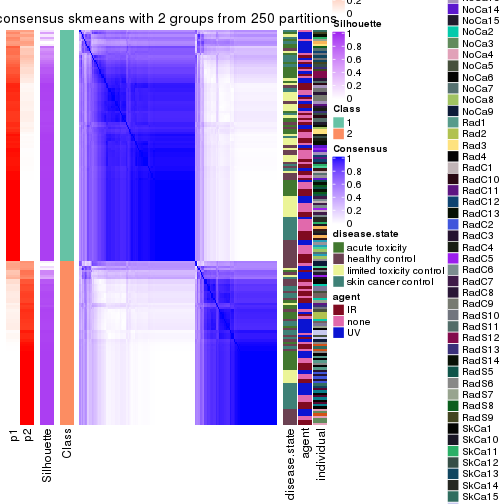</p>

</div>
<div id='tab-MAD-skmeans-consensus-heatmap-2'>
<pre><code class="r">consensus_heatmap(res, k = 3)
</code></pre>

<p>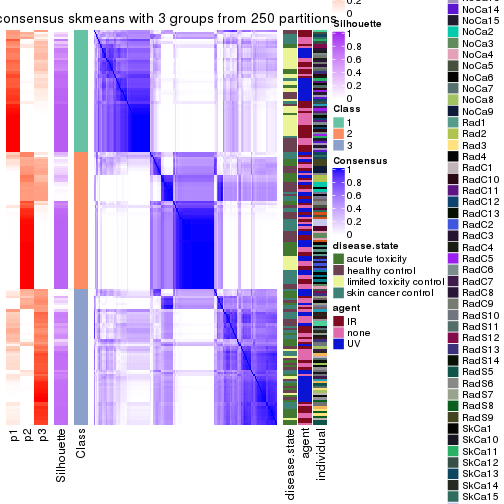</p>

</div>
<div id='tab-MAD-skmeans-consensus-heatmap-3'>
<pre><code class="r">consensus_heatmap(res, k = 4)
</code></pre>

<p>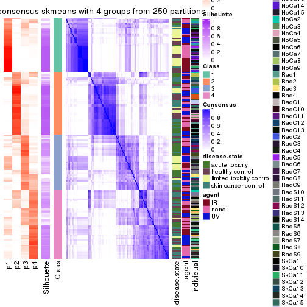</p>

</div>
<div id='tab-MAD-skmeans-consensus-heatmap-4'>
<pre><code class="r">consensus_heatmap(res, k = 5)
</code></pre>

<p>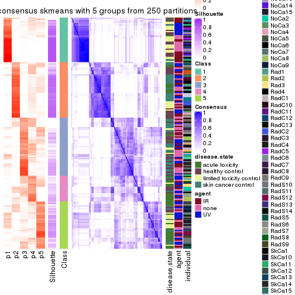</p>

</div>
<div id='tab-MAD-skmeans-consensus-heatmap-5'>
<pre><code class="r">consensus_heatmap(res, k = 6)
</code></pre>

<p>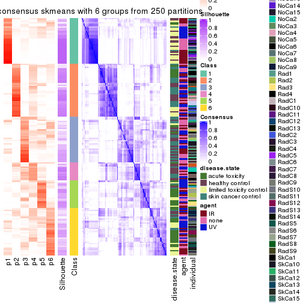</p>

</div>
</div>

Heatmaps for the membership of samples in all partitions to see how consistent they are:


<script>
$( function() {
	$( '#tabs-MAD-skmeans-membership-heatmap' ).tabs();
} );
</script>
<div id='tabs-MAD-skmeans-membership-heatmap'>
<ul>
<li><a href='#tab-MAD-skmeans-membership-heatmap-1'>k = 2</a></li>
<li><a href='#tab-MAD-skmeans-membership-heatmap-2'>k = 3</a></li>
<li><a href='#tab-MAD-skmeans-membership-heatmap-3'>k = 4</a></li>
<li><a href='#tab-MAD-skmeans-membership-heatmap-4'>k = 5</a></li>
<li><a href='#tab-MAD-skmeans-membership-heatmap-5'>k = 6</a></li>
</ul>
<div id='tab-MAD-skmeans-membership-heatmap-1'>
<pre><code class="r">membership_heatmap(res, k = 2)
</code></pre>

<p>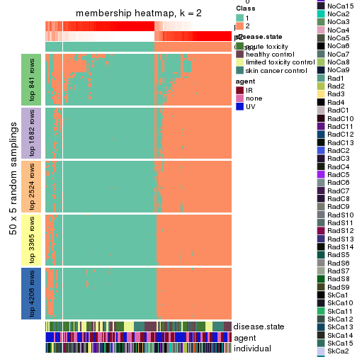</p>

</div>
<div id='tab-MAD-skmeans-membership-heatmap-2'>
<pre><code class="r">membership_heatmap(res, k = 3)
</code></pre>

<p>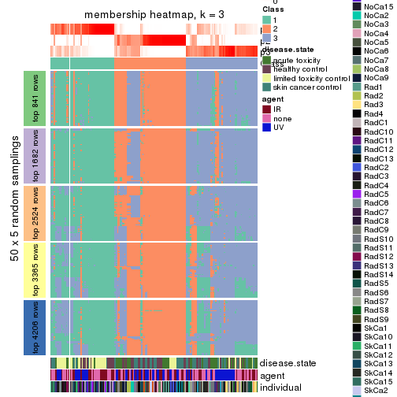</p>

</div>
<div id='tab-MAD-skmeans-membership-heatmap-3'>
<pre><code class="r">membership_heatmap(res, k = 4)
</code></pre>

<p>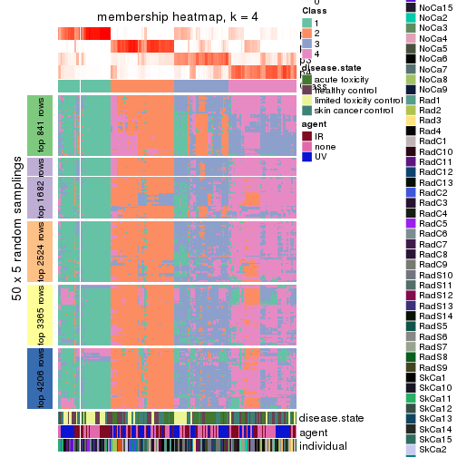</p>

</div>
<div id='tab-MAD-skmeans-membership-heatmap-4'>
<pre><code class="r">membership_heatmap(res, k = 5)
</code></pre>

<p>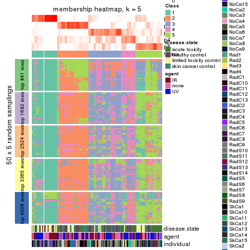</p>

</div>
<div id='tab-MAD-skmeans-membership-heatmap-5'>
<pre><code class="r">membership_heatmap(res, k = 6)
</code></pre>

<p>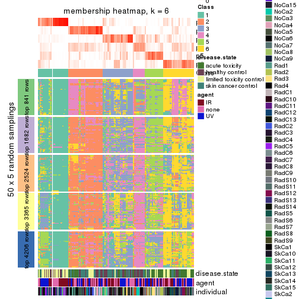</p>

</div>
</div>

As soon as we have had the classes for columns, we can look for signatures
which are significantly different between classes which can be candidate marks
for certain classes. Following are the heatmaps for signatures.


Signature heatmaps where rows are scaled:


<script>
$( function() {
	$( '#tabs-MAD-skmeans-get-signatures' ).tabs();
} );
</script>
<div id='tabs-MAD-skmeans-get-signatures'>
<ul>
<li><a href='#tab-MAD-skmeans-get-signatures-1'>k = 2</a></li>
<li><a href='#tab-MAD-skmeans-get-signatures-2'>k = 3</a></li>
<li><a href='#tab-MAD-skmeans-get-signatures-3'>k = 4</a></li>
<li><a href='#tab-MAD-skmeans-get-signatures-4'>k = 5</a></li>
<li><a href='#tab-MAD-skmeans-get-signatures-5'>k = 6</a></li>
</ul>
<div id='tab-MAD-skmeans-get-signatures-1'>
<pre><code class="r">get_signatures(res, k = 2)
</code></pre>

<p>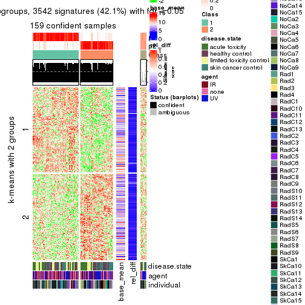</p>

</div>
<div id='tab-MAD-skmeans-get-signatures-2'>
<pre><code class="r">get_signatures(res, k = 3)
</code></pre>

<p>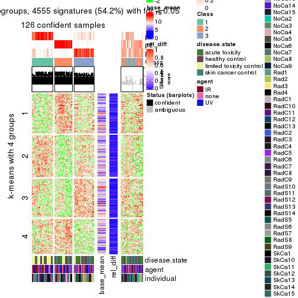</p>

</div>
<div id='tab-MAD-skmeans-get-signatures-3'>
<pre><code class="r">get_signatures(res, k = 4)
</code></pre>

<p>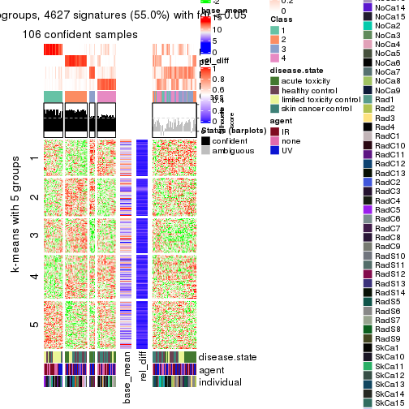</p>

</div>
<div id='tab-MAD-skmeans-get-signatures-4'>
<pre><code class="r">get_signatures(res, k = 5)
</code></pre>

<p>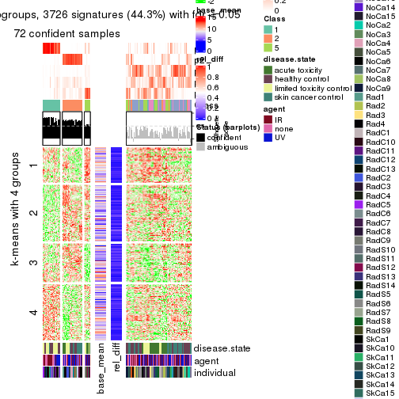</p>

</div>
<div id='tab-MAD-skmeans-get-signatures-5'>
<pre><code class="r">get_signatures(res, k = 6)
</code></pre>

<p>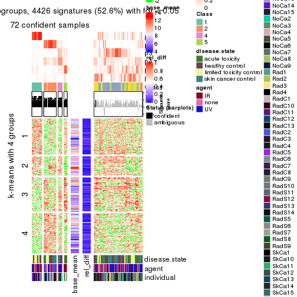</p>

</div>
</div>


Signature heatmaps where rows are not scaled:


<script>
$( function() {
	$( '#tabs-MAD-skmeans-get-signatures-no-scale' ).tabs();
} );
</script>
<div id='tabs-MAD-skmeans-get-signatures-no-scale'>
<ul>
<li><a href='#tab-MAD-skmeans-get-signatures-no-scale-1'>k = 2</a></li>
<li><a href='#tab-MAD-skmeans-get-signatures-no-scale-2'>k = 3</a></li>
<li><a href='#tab-MAD-skmeans-get-signatures-no-scale-3'>k = 4</a></li>
<li><a href='#tab-MAD-skmeans-get-signatures-no-scale-4'>k = 5</a></li>
<li><a href='#tab-MAD-skmeans-get-signatures-no-scale-5'>k = 6</a></li>
</ul>
<div id='tab-MAD-skmeans-get-signatures-no-scale-1'>
<pre><code class="r">get_signatures(res, k = 2, scale_rows = FALSE)
</code></pre>

<p>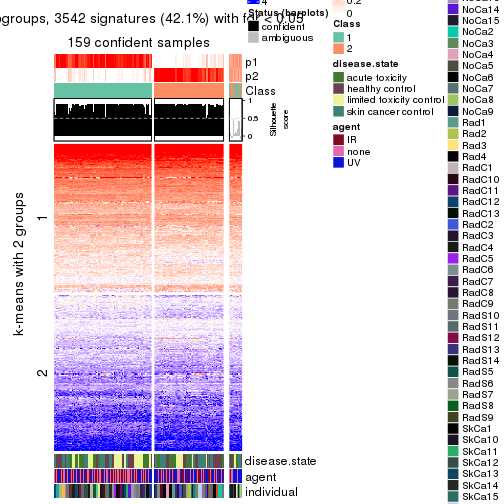</p>

</div>
<div id='tab-MAD-skmeans-get-signatures-no-scale-2'>
<pre><code class="r">get_signatures(res, k = 3, scale_rows = FALSE)
</code></pre>

<p>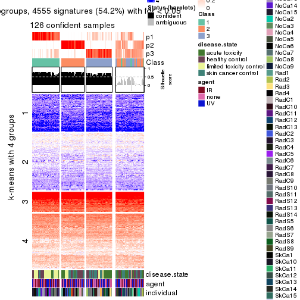</p>

</div>
<div id='tab-MAD-skmeans-get-signatures-no-scale-3'>
<pre><code class="r">get_signatures(res, k = 4, scale_rows = FALSE)
</code></pre>

<p>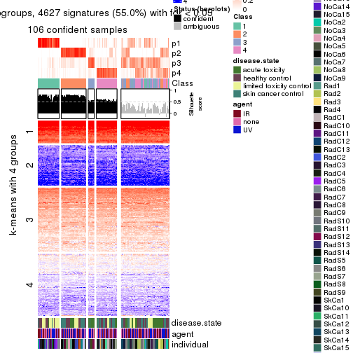</p>

</div>
<div id='tab-MAD-skmeans-get-signatures-no-scale-4'>
<pre><code class="r">get_signatures(res, k = 5, scale_rows = FALSE)
</code></pre>

<p>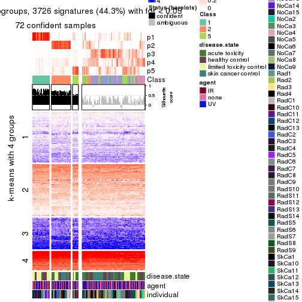</p>

</div>
<div id='tab-MAD-skmeans-get-signatures-no-scale-5'>
<pre><code class="r">get_signatures(res, k = 6, scale_rows = FALSE)
</code></pre>

<p>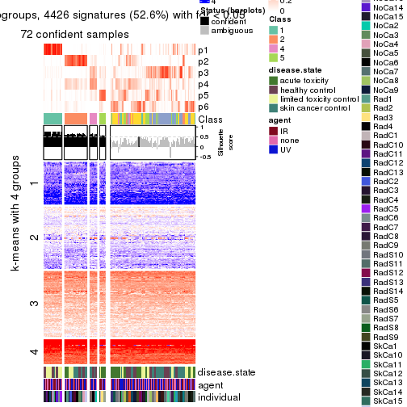</p>

</div>
</div>


Compare the overlap of signatures from different k:

```r
compare_signatures(res)
```

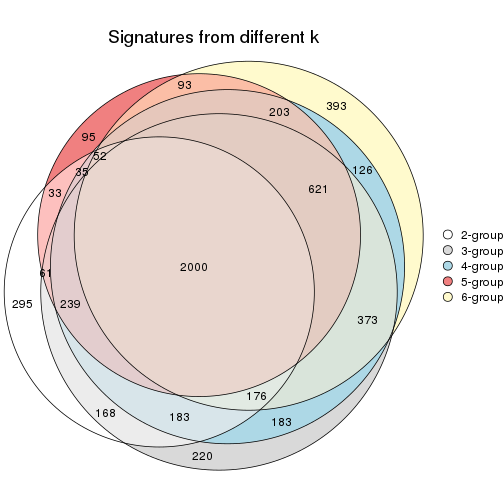

`get_signature()` returns a data frame invisibly. TO get the list of signatures, the function
call should be assigned to a variable explicitly. In following code, if `plot` argument is set
to `FALSE`, no heatmap is plotted while only the differential analysis is performed.

```r
# code only for demonstration
tb = get_signature(res, k = ..., plot = FALSE)
```

An example of the output of `tb` is:

```
#>   which_row         fdr    mean_1    mean_2 scaled_mean_1 scaled_mean_2 km
#> 1        38 0.042760348  8.373488  9.131774    -0.5533452     0.5164555  1
#> 2        40 0.018707592  7.106213  8.469186    -0.6173731     0.5762149  1
#> 3        55 0.019134737 10.221463 11.207825    -0.6159697     0.5749050  1
#> 4        59 0.006059896  5.921854  7.869574    -0.6899429     0.6439467  1
#> 5        60 0.018055526  8.928898 10.211722    -0.6204761     0.5791110  1
#> 6        98 0.009384629 15.714769 14.887706     0.6635654    -0.6193277  2
...
```

The columns in `tb` are:

1. `which_row`: row indices corresponding to the input matrix.
2. `fdr`: FDR for the differential test. 
3. `mean_x`: The mean value in group x.
4. `scaled_mean_x`: The mean value in group x after rows are scaled.
5. `km`: Row groups if k-means clustering is applied to rows.


UMAP plot which shows how samples are separated.


<script>
$( function() {
	$( '#tabs-MAD-skmeans-dimension-reduction' ).tabs();
} );
</script>
<div id='tabs-MAD-skmeans-dimension-reduction'>
<ul>
<li><a href='#tab-MAD-skmeans-dimension-reduction-1'>k = 2</a></li>
<li><a href='#tab-MAD-skmeans-dimension-reduction-2'>k = 3</a></li>
<li><a href='#tab-MAD-skmeans-dimension-reduction-3'>k = 4</a></li>
<li><a href='#tab-MAD-skmeans-dimension-reduction-4'>k = 5</a></li>
<li><a href='#tab-MAD-skmeans-dimension-reduction-5'>k = 6</a></li>
</ul>
<div id='tab-MAD-skmeans-dimension-reduction-1'>
<pre><code class="r">dimension_reduction(res, k = 2, method = &quot;UMAP&quot;)
</code></pre>

<p>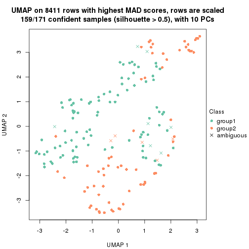</p>

</div>
<div id='tab-MAD-skmeans-dimension-reduction-2'>
<pre><code class="r">dimension_reduction(res, k = 3, method = &quot;UMAP&quot;)
</code></pre>

<p>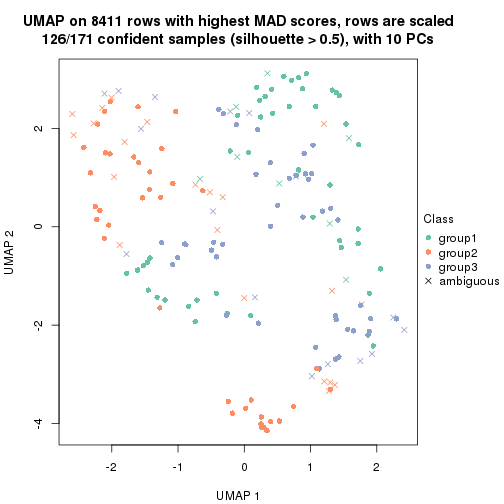</p>

</div>
<div id='tab-MAD-skmeans-dimension-reduction-3'>
<pre><code class="r">dimension_reduction(res, k = 4, method = &quot;UMAP&quot;)
</code></pre>

<p>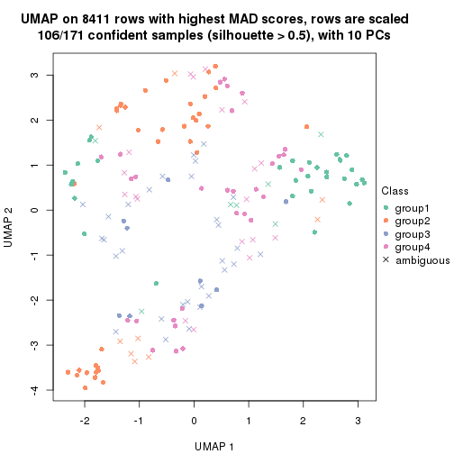</p>

</div>
<div id='tab-MAD-skmeans-dimension-reduction-4'>
<pre><code class="r">dimension_reduction(res, k = 5, method = &quot;UMAP&quot;)
</code></pre>

<p>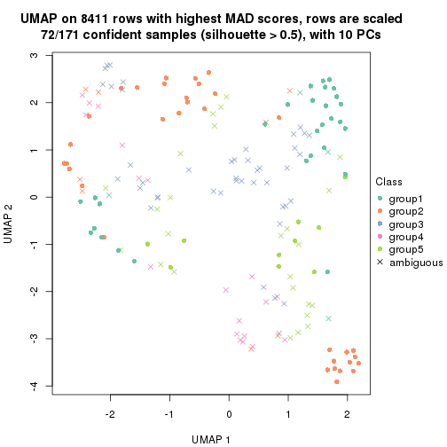</p>

</div>
<div id='tab-MAD-skmeans-dimension-reduction-5'>
<pre><code class="r">dimension_reduction(res, k = 6, method = &quot;UMAP&quot;)
</code></pre>

<p>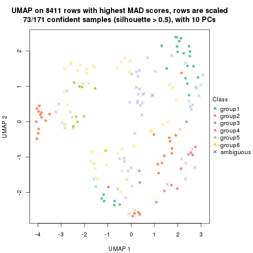</p>

</div>
</div>


Following heatmap shows how subgroups are split when increasing `k`:

```r
collect_classes(res)
```

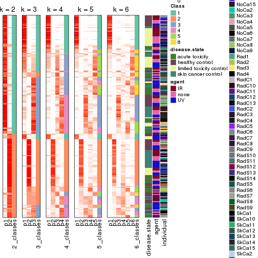


Test correlation between subgroups and known annotations. If the known
annotation is numeric, one-way ANOVA test is applied, and if the known
annotation is discrete, chi-squared contingency table test is applied.

```r
test_to_known_factors(res)
```

```
#>               n disease.state(p) agent(p) individual(p) k
#> MAD:skmeans 159         3.96e-02   0.0612      1.75e-09 2
#> MAD:skmeans 126         6.06e-06   0.6577      1.87e-15 3
#> MAD:skmeans 106         1.95e-09   0.8796      1.41e-18 4
#> MAD:skmeans  72         1.41e-06   0.9605      5.00e-09 5
#> MAD:skmeans  73         2.80e-08   0.8720      3.68e-17 6
```


If matrix rows can be associated to genes, consider to use `functional_enrichment(res,
...)` to perform function enrichment for the signature genes. See [this vignette](http://bioconductor.org/packages/devel/bioc/vignettes/cola/inst/doc/functional_enrichment.html) for more detailed explanations.


 

---------------------------------------------------


### MAD:pam


The object with results only for a single top-value method and a single partition method 
can be extracted as:

```r
res = res_list["MAD", "pam"]
# you can also extract it by
# res = res_list["MAD:pam"]
```

A summary of `res` and all the functions that can be applied to it:

```r
res
```

```
#> A 'ConsensusPartition' object with k = 2, 3, 4, 5, 6.
#>   On a matrix with 8411 rows and 171 columns.
#>   Top rows (841, 1682, 2524, 3365, 4206) are extracted by 'MAD' method.
#>   Subgroups are detected by 'pam' method.
#>   Performed in total 1250 partitions by row resampling.
#>   Best k for subgroups seems to be 2.
#> 
#> Following methods can be applied to this 'ConsensusPartition' object:
#>  [1] "cola_report"             "collect_classes"         "collect_plots"          
#>  [4] "collect_stats"           "colnames"                "compare_signatures"     
#>  [7] "consensus_heatmap"       "dimension_reduction"     "functional_enrichment"  
#> [10] "get_anno_col"            "get_anno"                "get_classes"            
#> [13] "get_consensus"           "get_matrix"              "get_membership"         
#> [16] "get_param"               "get_signatures"          "get_stats"              
#> [19] "is_best_k"               "is_stable_k"             "membership_heatmap"     
#> [22] "ncol"                    "nrow"                    "plot_ecdf"              
#> [25] "rownames"                "select_partition_number" "show"                   
#> [28] "suggest_best_k"          "test_to_known_factors"
```

`collect_plots()` function collects all the plots made from `res` for all `k` (number of partitions)
into one single page to provide an easy and fast comparison between different `k`.

```r
collect_plots(res)
```

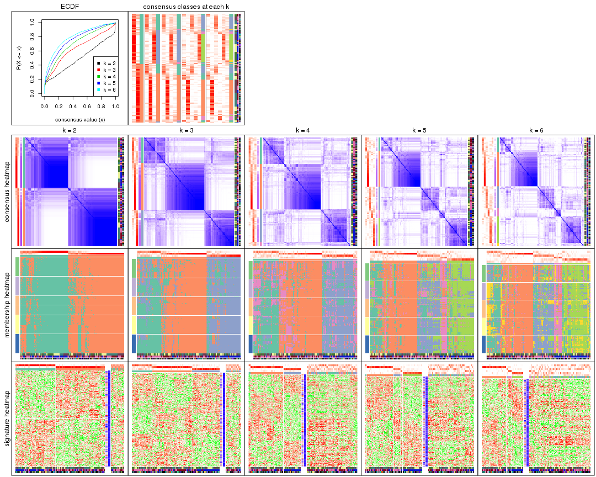

The plots are:

- The first row: a plot of the ECDF (empirical cumulative distribution
  function) curves of the consensus matrix for each `k` and the heatmap of
  predicted classes for each `k`.
- The second row: heatmaps of the consensus matrix for each `k`.
- The third row: heatmaps of the membership matrix for each `k`.
- The fouth row: heatmaps of the signatures for each `k`.

All the plots in panels can be made by individual functions and they are
plotted later in this section.

`select_partition_number()` produces several plots showing different
statistics for choosing "optimized" `k`. There are following statistics:

- ECDF curves of the consensus matrix for each `k`;
- 1-PAC. [The PAC
  score](https://en.wikipedia.org/wiki/Consensus_clustering#Over-interpretation_potential_of_consensus_clustering)
  measures the proportion of the ambiguous subgrouping.
- Mean silhouette score.
- Concordance. The mean probability of fiting the consensus class ids in all
  partitions.
- Area increased. Denote $A_k$ as the area under the ECDF curve for current
  `k`, the area increased is defined as $A_k - A_{k-1}$.
- Rand index. The percent of pairs of samples that are both in a same cluster
  or both are not in a same cluster in the partition of k and k-1.
- Jaccard index. The ratio of pairs of samples are both in a same cluster in
  the partition of k and k-1 and the pairs of samples are both in a same
  cluster in the partition k or k-1.

The detailed explanations of these statistics can be found in [the _cola_
vignette](http://bioconductor.org/packages/devel/bioc/vignettes/cola/inst/doc/cola.html#toc_13).

Generally speaking, lower PAC score, higher mean silhouette score or higher
concordance corresponds to better partition. Rand index and Jaccard index
measure how similar the current partition is compared to partition with `k-1`.
If they are too similar, we won't accept `k` is better than `k-1`.

```r
select_partition_number(res)
```

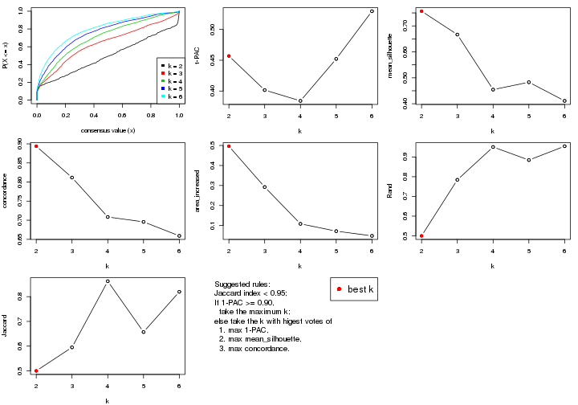

The numeric values for all these statistics can be obtained by `get_stats()`.

```r
get_stats(res)
```

```
#>   k 1-PAC mean_silhouette concordance area_increased  Rand Jaccard
#> 2 2 0.457           0.756       0.894         0.4963 0.500   0.500
#> 3 3 0.402           0.667       0.812         0.2923 0.784   0.595
#> 4 4 0.384           0.455       0.708         0.1084 0.951   0.862
#> 5 5 0.452           0.483       0.696         0.0719 0.884   0.657
#> 6 6 0.529           0.411       0.659         0.0484 0.954   0.820
```

`suggest_best_k()` suggests the best $k$ based on these statistics. The rules are as follows:

- All $k$ with Jaccard index larger than 0.95 are removed because increasing
  $k$ does not provide enough extra information. If all $k$ are removed, it is
  marked as no subgroup is detected.
- For all $k$ with 1-PAC score larger than 0.9, the maximal $k$ is taken as
  the best $k$, and other $k$ are marked as optional $k$.
- If it does not fit the second rule. The $k$ with the maximal vote of the
  highest 1-PAC score, highest mean silhouette, and highest concordance is
  taken as the best $k$.

```r
suggest_best_k(res)
```

```
#> [1] 2
```


Following shows the table of the partitions (You need to click the **show/hide
code output** link to see it). The membership matrix (columns with name `p*`)
is inferred by
[`clue::cl_consensus()`](https://www.rdocumentation.org/link/cl_consensus?package=clue)
function with the `SE` method. Basically the value in the membership matrix
represents the probability to belong to a certain group. The finall class
label for an item is determined with the group with highest probability it
belongs to.

In `get_classes()` function, the entropy is calculated from the membership
matrix and the silhouette score is calculated from the consensus matrix.


<script>
$( function() {
	$( '#tabs-MAD-pam-get-classes' ).tabs();
} );
</script>
<div id='tabs-MAD-pam-get-classes'>
<ul>
<li><a href='#tab-MAD-pam-get-classes-1'>k = 2</a></li>
<li><a href='#tab-MAD-pam-get-classes-2'>k = 3</a></li>
<li><a href='#tab-MAD-pam-get-classes-3'>k = 4</a></li>
<li><a href='#tab-MAD-pam-get-classes-4'>k = 5</a></li>
<li><a href='#tab-MAD-pam-get-classes-5'>k = 6</a></li>
</ul>

<div id='tab-MAD-pam-get-classes-1'>
<p><a id='tab-MAD-pam-get-classes-1-a' style='color:#0366d6' href='#'>show/hide code output</a></p>
<pre><code class="r">cbind(get_classes(res, k = 2), get_membership(res, k = 2))
</code></pre>

<pre><code>#&gt;          class entropy silhouette    p1    p2
#&gt; GSM29783     2  0.0376     0.8829 0.004 0.996
#&gt; GSM29786     2  0.7950     0.6710 0.240 0.760
#&gt; GSM29789     2  0.0000     0.8839 0.000 1.000
#&gt; GSM29792     2  0.0000     0.8839 0.000 1.000
#&gt; GSM29795     2  0.0000     0.8839 0.000 1.000
#&gt; GSM29798     2  0.0000     0.8839 0.000 1.000
#&gt; GSM29801     2  0.1414     0.8788 0.020 0.980
#&gt; GSM29804     2  0.9933     0.1459 0.452 0.548
#&gt; GSM29807     2  0.8861     0.5191 0.304 0.696
#&gt; GSM29816     1  0.1184     0.8583 0.984 0.016
#&gt; GSM29821     2  0.7745     0.6858 0.228 0.772
#&gt; GSM29824     1  0.5519     0.7953 0.872 0.128
#&gt; GSM29827     2  0.7745     0.6928 0.228 0.772
#&gt; GSM29830     2  0.6247     0.7762 0.156 0.844
#&gt; GSM29833     2  0.0000     0.8839 0.000 1.000
#&gt; GSM29784     2  0.0000     0.8839 0.000 1.000
#&gt; GSM29787     2  0.5629     0.8032 0.132 0.868
#&gt; GSM29790     2  0.0000     0.8839 0.000 1.000
#&gt; GSM29793     2  0.0000     0.8839 0.000 1.000
#&gt; GSM29796     2  0.0000     0.8839 0.000 1.000
#&gt; GSM29799     2  0.1843     0.8742 0.028 0.972
#&gt; GSM29802     1  0.8909     0.5692 0.692 0.308
#&gt; GSM29805     1  0.8499     0.6142 0.724 0.276
#&gt; GSM29814     2  0.9209     0.4540 0.336 0.664
#&gt; GSM29817     1  0.9970     0.1490 0.532 0.468
#&gt; GSM29822     1  0.6712     0.7558 0.824 0.176
#&gt; GSM29825     1  0.0000     0.8619 1.000 0.000
#&gt; GSM29828     2  0.9970     0.0835 0.468 0.532
#&gt; GSM29831     2  0.8207     0.6521 0.256 0.744
#&gt; GSM29834     2  0.0000     0.8839 0.000 1.000
#&gt; GSM29785     2  0.5629     0.8007 0.132 0.868
#&gt; GSM29788     1  0.8713     0.5724 0.708 0.292
#&gt; GSM29791     2  0.0000     0.8839 0.000 1.000
#&gt; GSM29794     2  0.2423     0.8681 0.040 0.960
#&gt; GSM29797     2  0.1184     0.8801 0.016 0.984
#&gt; GSM29800     1  0.8081     0.6453 0.752 0.248
#&gt; GSM29803     1  0.0000     0.8619 1.000 0.000
#&gt; GSM29806     1  0.0000     0.8619 1.000 0.000
#&gt; GSM29815     1  0.3274     0.8400 0.940 0.060
#&gt; GSM29819     1  0.0000     0.8619 1.000 0.000
#&gt; GSM29823     1  0.0000     0.8619 1.000 0.000
#&gt; GSM29826     1  0.0000     0.8619 1.000 0.000
#&gt; GSM29829     1  0.0000     0.8619 1.000 0.000
#&gt; GSM29832     1  0.0000     0.8619 1.000 0.000
#&gt; GSM29835     1  0.5519     0.7896 0.872 0.128
#&gt; GSM29836     2  0.0000     0.8839 0.000 1.000
#&gt; GSM29839     2  0.0000     0.8839 0.000 1.000
#&gt; GSM29842     2  0.0000     0.8839 0.000 1.000
#&gt; GSM29845     2  0.0000     0.8839 0.000 1.000
#&gt; GSM29848     2  0.0000     0.8839 0.000 1.000
#&gt; GSM29851     2  0.2236     0.8706 0.036 0.964
#&gt; GSM29854     1  0.0000     0.8619 1.000 0.000
#&gt; GSM29857     1  0.2778     0.8441 0.952 0.048
#&gt; GSM29860     2  0.0000     0.8839 0.000 1.000
#&gt; GSM29863     1  0.0672     0.8607 0.992 0.008
#&gt; GSM29866     2  0.0000     0.8839 0.000 1.000
#&gt; GSM29869     2  0.0000     0.8839 0.000 1.000
#&gt; GSM29872     2  0.0000     0.8839 0.000 1.000
#&gt; GSM29875     2  0.5178     0.8197 0.116 0.884
#&gt; GSM29878     2  0.0000     0.8839 0.000 1.000
#&gt; GSM29837     2  0.0000     0.8839 0.000 1.000
#&gt; GSM29840     2  0.0000     0.8839 0.000 1.000
#&gt; GSM29843     2  0.0000     0.8839 0.000 1.000
#&gt; GSM29846     2  0.0000     0.8839 0.000 1.000
#&gt; GSM29849     2  0.0000     0.8839 0.000 1.000
#&gt; GSM29852     1  0.9833     0.2954 0.576 0.424
#&gt; GSM29855     1  0.0672     0.8602 0.992 0.008
#&gt; GSM29858     1  0.7139     0.7371 0.804 0.196
#&gt; GSM29861     2  0.1414     0.8780 0.020 0.980
#&gt; GSM29864     1  0.0672     0.8603 0.992 0.008
#&gt; GSM29867     2  0.9795     0.2663 0.416 0.584
#&gt; GSM29870     2  0.0000     0.8839 0.000 1.000
#&gt; GSM29873     2  0.4298     0.8358 0.088 0.912
#&gt; GSM29876     2  0.6048     0.7876 0.148 0.852
#&gt; GSM29879     2  0.0000     0.8839 0.000 1.000
#&gt; GSM29838     2  0.4690     0.8299 0.100 0.900
#&gt; GSM29841     2  0.9522     0.3943 0.372 0.628
#&gt; GSM29844     2  0.0000     0.8839 0.000 1.000
#&gt; GSM29847     2  0.6247     0.7774 0.156 0.844
#&gt; GSM29850     2  0.1184     0.8802 0.016 0.984
#&gt; GSM29853     1  0.0000     0.8619 1.000 0.000
#&gt; GSM29856     1  0.0000     0.8619 1.000 0.000
#&gt; GSM29859     1  0.0000     0.8619 1.000 0.000
#&gt; GSM29862     1  0.9427     0.4569 0.640 0.360
#&gt; GSM29865     1  0.0000     0.8619 1.000 0.000
#&gt; GSM29868     1  0.0000     0.8619 1.000 0.000
#&gt; GSM29871     1  0.7139     0.7232 0.804 0.196
#&gt; GSM29874     1  0.8386     0.6383 0.732 0.268
#&gt; GSM29877     1  0.7219     0.7299 0.800 0.200
#&gt; GSM29880     2  0.4690     0.8222 0.100 0.900
#&gt; GSM29881     2  0.8016     0.6607 0.244 0.756
#&gt; GSM29884     2  0.0000     0.8839 0.000 1.000
#&gt; GSM29887     2  0.0000     0.8839 0.000 1.000
#&gt; GSM29890     1  0.9209     0.4938 0.664 0.336
#&gt; GSM29893     1  0.6247     0.7628 0.844 0.156
#&gt; GSM29896     2  0.6148     0.7795 0.152 0.848
#&gt; GSM29899     1  0.2948     0.8459 0.948 0.052
#&gt; GSM29902     2  0.8661     0.5793 0.288 0.712
#&gt; GSM29905     2  0.9996    -0.0125 0.488 0.512
#&gt; GSM29908     2  0.0000     0.8839 0.000 1.000
#&gt; GSM29955     2  0.2948     0.8636 0.052 0.948
#&gt; GSM29958     2  0.0000     0.8839 0.000 1.000
#&gt; GSM29961     2  0.3733     0.8461 0.072 0.928
#&gt; GSM29882     1  0.4562     0.8214 0.904 0.096
#&gt; GSM29885     2  0.0000     0.8839 0.000 1.000
#&gt; GSM29888     2  0.0000     0.8839 0.000 1.000
#&gt; GSM29891     1  0.2948     0.8441 0.948 0.052
#&gt; GSM29894     1  0.0000     0.8619 1.000 0.000
#&gt; GSM29897     1  0.9963     0.1824 0.536 0.464
#&gt; GSM29900     1  0.0376     0.8612 0.996 0.004
#&gt; GSM29903     2  0.9552     0.3943 0.376 0.624
#&gt; GSM29906     2  0.9661     0.3249 0.392 0.608
#&gt; GSM29909     2  0.6343     0.7569 0.160 0.840
#&gt; GSM29956     2  0.7674     0.6857 0.224 0.776
#&gt; GSM29959     2  0.0938     0.8808 0.012 0.988
#&gt; GSM29962     2  0.0376     0.8829 0.004 0.996
#&gt; GSM29883     1  0.0000     0.8619 1.000 0.000
#&gt; GSM29886     2  0.0000     0.8839 0.000 1.000
#&gt; GSM29889     2  0.0000     0.8839 0.000 1.000
#&gt; GSM29892     1  0.0000     0.8619 1.000 0.000
#&gt; GSM29895     1  0.0000     0.8619 1.000 0.000
#&gt; GSM29898     1  0.0000     0.8619 1.000 0.000
#&gt; GSM29901     1  0.0000     0.8619 1.000 0.000
#&gt; GSM29904     1  0.0000     0.8619 1.000 0.000
#&gt; GSM29907     1  0.0376     0.8612 0.996 0.004
#&gt; GSM29910     1  0.0000     0.8619 1.000 0.000
#&gt; GSM29957     1  0.3431     0.8377 0.936 0.064
#&gt; GSM29960     1  0.0000     0.8619 1.000 0.000
#&gt; GSM29963     1  0.0000     0.8619 1.000 0.000
#&gt; GSM29964     2  0.0000     0.8839 0.000 1.000
#&gt; GSM29967     2  0.1414     0.8786 0.020 0.980
#&gt; GSM29970     1  0.7602     0.7058 0.780 0.220
#&gt; GSM29973     2  0.0000     0.8839 0.000 1.000
#&gt; GSM29976     1  0.9996     0.0935 0.512 0.488
#&gt; GSM29979     2  0.4939     0.8184 0.108 0.892
#&gt; GSM29982     1  0.9896     0.2587 0.560 0.440
#&gt; GSM29985     1  0.0000     0.8619 1.000 0.000
#&gt; GSM29988     2  0.1414     0.8782 0.020 0.980
#&gt; GSM29991     2  0.8861     0.5568 0.304 0.696
#&gt; GSM29994     2  0.9552     0.3847 0.376 0.624
#&gt; GSM29997     1  0.9286     0.5125 0.656 0.344
#&gt; GSM30000     2  0.1184     0.8800 0.016 0.984
#&gt; GSM30003     1  0.9170     0.4987 0.668 0.332
#&gt; GSM29965     2  0.0000     0.8839 0.000 1.000
#&gt; GSM29968     2  0.0376     0.8831 0.004 0.996
#&gt; GSM29971     1  0.0000     0.8619 1.000 0.000
#&gt; GSM29974     2  0.0376     0.8829 0.004 0.996
#&gt; GSM29977     1  0.1633     0.8560 0.976 0.024
#&gt; GSM29980     1  0.9881     0.2629 0.564 0.436
#&gt; GSM29983     1  0.7528     0.7145 0.784 0.216
#&gt; GSM29986     1  0.0376     0.8613 0.996 0.004
#&gt; GSM29989     2  0.9795     0.2673 0.416 0.584
#&gt; GSM29992     2  0.0000     0.8839 0.000 1.000
#&gt; GSM29995     2  0.7815     0.6820 0.232 0.768
#&gt; GSM29998     1  0.9795     0.3246 0.584 0.416
#&gt; GSM30001     1  0.9881     0.2621 0.564 0.436
#&gt; GSM30004     1  0.6438     0.7544 0.836 0.164
#&gt; GSM29966     2  0.0000     0.8839 0.000 1.000
#&gt; GSM29969     1  0.9909     0.2354 0.556 0.444
#&gt; GSM29972     1  0.0000     0.8619 1.000 0.000
#&gt; GSM29975     2  0.8555     0.5695 0.280 0.720
#&gt; GSM29978     1  0.0000     0.8619 1.000 0.000
#&gt; GSM29981     1  0.0672     0.8605 0.992 0.008
#&gt; GSM29984     1  0.0000     0.8619 1.000 0.000
#&gt; GSM29987     1  0.0000     0.8619 1.000 0.000
#&gt; GSM29990     1  0.0672     0.8605 0.992 0.008
#&gt; GSM29993     1  0.8608     0.6089 0.716 0.284
#&gt; GSM29996     1  0.0000     0.8619 1.000 0.000
#&gt; GSM29999     1  0.0000     0.8619 1.000 0.000
#&gt; GSM30002     1  0.0000     0.8619 1.000 0.000
#&gt; GSM30005     1  0.0000     0.8619 1.000 0.000
</code></pre>

<script>
$('#tab-MAD-pam-get-classes-1-a').parent().next().next().hide();
$('#tab-MAD-pam-get-classes-1-a').click(function(){
  $('#tab-MAD-pam-get-classes-1-a').parent().next().next().toggle();
  return(false);
});
</script>
</div>

<div id='tab-MAD-pam-get-classes-2'>
<p><a id='tab-MAD-pam-get-classes-2-a' style='color:#0366d6' href='#'>show/hide code output</a></p>
<pre><code class="r">cbind(get_classes(res, k = 3), get_membership(res, k = 3))
</code></pre>

<pre><code>#&gt;          class entropy silhouette    p1    p2    p3
#&gt; GSM29783     2  0.0237    0.87029 0.000 0.996 0.004
#&gt; GSM29786     2  0.4842    0.67848 0.000 0.776 0.224
#&gt; GSM29789     2  0.0000    0.87010 0.000 1.000 0.000
#&gt; GSM29792     2  0.0000    0.87010 0.000 1.000 0.000
#&gt; GSM29795     2  0.2261    0.84667 0.068 0.932 0.000
#&gt; GSM29798     2  0.0475    0.87006 0.004 0.992 0.004
#&gt; GSM29801     2  0.3253    0.83929 0.036 0.912 0.052
#&gt; GSM29804     2  0.9405    0.02271 0.192 0.484 0.324
#&gt; GSM29807     1  0.9323    0.56252 0.500 0.312 0.188
#&gt; GSM29816     1  0.6659    0.61531 0.668 0.028 0.304
#&gt; GSM29821     2  0.6622    0.67925 0.088 0.748 0.164
#&gt; GSM29824     3  0.7431    0.60515 0.188 0.116 0.696
#&gt; GSM29827     2  0.8396    0.49684 0.196 0.624 0.180
#&gt; GSM29830     2  0.7930    0.55653 0.164 0.664 0.172
#&gt; GSM29833     2  0.1529    0.86016 0.040 0.960 0.000
#&gt; GSM29784     2  0.0000    0.87010 0.000 1.000 0.000
#&gt; GSM29787     2  0.3425    0.81103 0.004 0.884 0.112
#&gt; GSM29790     2  0.0000    0.87010 0.000 1.000 0.000
#&gt; GSM29793     2  0.0000    0.87010 0.000 1.000 0.000
#&gt; GSM29796     2  0.0000    0.87010 0.000 1.000 0.000
#&gt; GSM29799     2  0.1399    0.86519 0.004 0.968 0.028
#&gt; GSM29802     1  0.8666    0.62430 0.544 0.120 0.336
#&gt; GSM29805     1  0.7681    0.46976 0.540 0.048 0.412
#&gt; GSM29814     1  0.8398    0.65635 0.624 0.192 0.184
#&gt; GSM29817     1  0.8890    0.63690 0.544 0.148 0.308
#&gt; GSM29822     1  0.6910    0.52283 0.584 0.020 0.396
#&gt; GSM29825     1  0.5968    0.51053 0.636 0.000 0.364
#&gt; GSM29828     1  0.9823    0.39104 0.428 0.284 0.288
#&gt; GSM29831     1  0.6905    0.62489 0.676 0.280 0.044
#&gt; GSM29834     2  0.1643    0.86140 0.044 0.956 0.000
#&gt; GSM29785     2  0.3340    0.80563 0.000 0.880 0.120
#&gt; GSM29788     3  0.4346    0.62348 0.000 0.184 0.816
#&gt; GSM29791     2  0.0000    0.87010 0.000 1.000 0.000
#&gt; GSM29794     2  0.2434    0.85639 0.024 0.940 0.036
#&gt; GSM29797     2  0.2903    0.85391 0.048 0.924 0.028
#&gt; GSM29800     3  0.3752    0.67027 0.000 0.144 0.856
#&gt; GSM29803     3  0.0747    0.75257 0.016 0.000 0.984
#&gt; GSM29806     3  0.0592    0.75380 0.012 0.000 0.988
#&gt; GSM29815     3  0.7043   -0.12297 0.400 0.024 0.576
#&gt; GSM29819     3  0.0424    0.75313 0.008 0.000 0.992
#&gt; GSM29823     3  0.0747    0.75257 0.016 0.000 0.984
#&gt; GSM29826     3  0.2261    0.74721 0.068 0.000 0.932
#&gt; GSM29829     3  0.0000    0.75279 0.000 0.000 1.000
#&gt; GSM29832     3  0.1031    0.75633 0.024 0.000 0.976
#&gt; GSM29835     3  0.5426    0.66778 0.092 0.088 0.820
#&gt; GSM29836     2  0.0892    0.86779 0.020 0.980 0.000
#&gt; GSM29839     2  0.0000    0.87010 0.000 1.000 0.000
#&gt; GSM29842     2  0.0000    0.87010 0.000 1.000 0.000
#&gt; GSM29845     2  0.0237    0.87027 0.004 0.996 0.000
#&gt; GSM29848     2  0.0424    0.86964 0.008 0.992 0.000
#&gt; GSM29851     2  0.2173    0.85686 0.008 0.944 0.048
#&gt; GSM29854     3  0.2356    0.74452 0.072 0.000 0.928
#&gt; GSM29857     1  0.6799    0.47607 0.532 0.012 0.456
#&gt; GSM29860     2  0.1031    0.86818 0.024 0.976 0.000
#&gt; GSM29863     3  0.2845    0.74515 0.068 0.012 0.920
#&gt; GSM29866     2  0.0000    0.87010 0.000 1.000 0.000
#&gt; GSM29869     2  0.1529    0.85683 0.040 0.960 0.000
#&gt; GSM29872     2  0.1643    0.86438 0.044 0.956 0.000
#&gt; GSM29875     2  0.8064    0.27270 0.328 0.588 0.084
#&gt; GSM29878     2  0.0000    0.87010 0.000 1.000 0.000
#&gt; GSM29837     2  0.1482    0.86626 0.020 0.968 0.012
#&gt; GSM29840     2  0.0237    0.87019 0.004 0.996 0.000
#&gt; GSM29843     2  0.0000    0.87010 0.000 1.000 0.000
#&gt; GSM29846     2  0.0237    0.87027 0.004 0.996 0.000
#&gt; GSM29849     2  0.0892    0.86787 0.020 0.980 0.000
#&gt; GSM29852     1  0.8700    0.64626 0.576 0.148 0.276
#&gt; GSM29855     1  0.6140    0.50368 0.596 0.000 0.404
#&gt; GSM29858     1  0.8125    0.61495 0.576 0.084 0.340
#&gt; GSM29861     2  0.6742    0.42904 0.316 0.656 0.028
#&gt; GSM29864     3  0.6192   -0.15456 0.420 0.000 0.580
#&gt; GSM29867     1  0.8160    0.65253 0.608 0.288 0.104
#&gt; GSM29870     1  0.5882    0.55861 0.652 0.348 0.000
#&gt; GSM29873     1  0.8144    0.57260 0.572 0.344 0.084
#&gt; GSM29876     1  0.6482    0.66623 0.716 0.244 0.040
#&gt; GSM29879     2  0.0424    0.86964 0.008 0.992 0.000
#&gt; GSM29838     2  0.5792    0.68171 0.036 0.772 0.192
#&gt; GSM29841     3  0.6308    0.08250 0.000 0.492 0.508
#&gt; GSM29844     2  0.0000    0.87010 0.000 1.000 0.000
#&gt; GSM29847     2  0.3851    0.78784 0.004 0.860 0.136
#&gt; GSM29850     2  0.2414    0.85491 0.020 0.940 0.040
#&gt; GSM29853     3  0.0000    0.75279 0.000 0.000 1.000
#&gt; GSM29856     3  0.2165    0.74476 0.064 0.000 0.936
#&gt; GSM29859     1  0.6267    0.47993 0.548 0.000 0.452
#&gt; GSM29862     3  0.7622    0.40068 0.080 0.272 0.648
#&gt; GSM29865     3  0.0237    0.75242 0.004 0.000 0.996
#&gt; GSM29868     3  0.0000    0.75279 0.000 0.000 1.000
#&gt; GSM29871     1  0.9001    0.64356 0.548 0.172 0.280
#&gt; GSM29874     3  0.7298    0.49644 0.088 0.220 0.692
#&gt; GSM29877     3  0.9336   -0.41435 0.416 0.164 0.420
#&gt; GSM29880     2  0.4253    0.80153 0.048 0.872 0.080
#&gt; GSM29881     2  0.6895    0.58663 0.064 0.708 0.228
#&gt; GSM29884     2  0.0000    0.87010 0.000 1.000 0.000
#&gt; GSM29887     2  0.0000    0.87010 0.000 1.000 0.000
#&gt; GSM29890     1  0.5884    0.56723 0.716 0.012 0.272
#&gt; GSM29893     3  0.6605    0.66837 0.152 0.096 0.752
#&gt; GSM29896     2  0.9579    0.06951 0.340 0.452 0.208
#&gt; GSM29899     3  0.6348    0.66647 0.188 0.060 0.752
#&gt; GSM29902     2  0.9258    0.22788 0.256 0.528 0.216
#&gt; GSM29905     3  0.9757    0.00382 0.324 0.244 0.432
#&gt; GSM29908     2  0.2625    0.84123 0.084 0.916 0.000
#&gt; GSM29955     2  0.5692    0.67988 0.268 0.724 0.008
#&gt; GSM29958     2  0.2261    0.85003 0.068 0.932 0.000
#&gt; GSM29961     2  0.6254    0.71843 0.188 0.756 0.056
#&gt; GSM29882     1  0.5219    0.65991 0.788 0.016 0.196
#&gt; GSM29885     2  0.0000    0.87010 0.000 1.000 0.000
#&gt; GSM29888     2  0.0000    0.87010 0.000 1.000 0.000
#&gt; GSM29891     1  0.5731    0.64720 0.752 0.020 0.228
#&gt; GSM29894     3  0.4931    0.65884 0.232 0.000 0.768
#&gt; GSM29897     1  0.9773    0.27565 0.412 0.236 0.352
#&gt; GSM29900     1  0.4575    0.65586 0.812 0.004 0.184
#&gt; GSM29903     1  0.3181    0.67485 0.912 0.064 0.024
#&gt; GSM29906     1  0.5974    0.69031 0.784 0.148 0.068
#&gt; GSM29909     1  0.4645    0.68479 0.816 0.176 0.008
#&gt; GSM29956     1  0.4293    0.66494 0.832 0.164 0.004
#&gt; GSM29959     2  0.6339    0.45213 0.360 0.632 0.008
#&gt; GSM29962     2  0.4002    0.79283 0.160 0.840 0.000
#&gt; GSM29883     3  0.0892    0.75400 0.020 0.000 0.980
#&gt; GSM29886     2  0.0237    0.87007 0.004 0.996 0.000
#&gt; GSM29889     2  0.0000    0.87010 0.000 1.000 0.000
#&gt; GSM29892     3  0.5722    0.56527 0.292 0.004 0.704
#&gt; GSM29895     3  0.1643    0.75814 0.044 0.000 0.956
#&gt; GSM29898     3  0.2796    0.73863 0.092 0.000 0.908
#&gt; GSM29901     3  0.0892    0.75494 0.020 0.000 0.980
#&gt; GSM29904     3  0.3686    0.72498 0.140 0.000 0.860
#&gt; GSM29907     3  0.2584    0.74754 0.064 0.008 0.928
#&gt; GSM29910     3  0.1031    0.75644 0.024 0.000 0.976
#&gt; GSM29957     3  0.3406    0.74038 0.028 0.068 0.904
#&gt; GSM29960     3  0.5529    0.62681 0.296 0.000 0.704
#&gt; GSM29963     3  0.1411    0.75752 0.036 0.000 0.964
#&gt; GSM29964     2  0.0424    0.86999 0.008 0.992 0.000
#&gt; GSM29967     2  0.3587    0.82785 0.088 0.892 0.020
#&gt; GSM29970     3  0.7841    0.56483 0.272 0.092 0.636
#&gt; GSM29973     2  0.0592    0.86954 0.012 0.988 0.000
#&gt; GSM29976     1  0.6783    0.66290 0.744 0.116 0.140
#&gt; GSM29979     2  0.6037    0.72968 0.100 0.788 0.112
#&gt; GSM29982     3  0.8916    0.35467 0.152 0.304 0.544
#&gt; GSM29985     3  0.6204    0.37272 0.424 0.000 0.576
#&gt; GSM29988     2  0.6275    0.51021 0.348 0.644 0.008
#&gt; GSM29991     2  0.9616   -0.20966 0.376 0.420 0.204
#&gt; GSM29994     1  0.6138    0.68704 0.768 0.172 0.060
#&gt; GSM29997     1  0.9277    0.37529 0.496 0.176 0.328
#&gt; GSM30000     2  0.3293    0.82730 0.088 0.900 0.012
#&gt; GSM30003     3  0.5618    0.52524 0.008 0.260 0.732
#&gt; GSM29965     2  0.0424    0.86999 0.008 0.992 0.000
#&gt; GSM29968     2  0.3213    0.83346 0.092 0.900 0.008
#&gt; GSM29971     1  0.4346    0.62858 0.816 0.000 0.184
#&gt; GSM29974     2  0.0661    0.87027 0.008 0.988 0.004
#&gt; GSM29977     1  0.4915    0.65837 0.804 0.012 0.184
#&gt; GSM29980     1  0.9700    0.49295 0.428 0.224 0.348
#&gt; GSM29983     3  0.7766    0.54289 0.148 0.176 0.676
#&gt; GSM29986     1  0.5926    0.52532 0.644 0.000 0.356
#&gt; GSM29989     1  0.4164    0.68656 0.848 0.144 0.008
#&gt; GSM29992     2  0.4235    0.71324 0.176 0.824 0.000
#&gt; GSM29995     1  0.3784    0.67957 0.864 0.132 0.004
#&gt; GSM29998     1  0.4233    0.68166 0.836 0.160 0.004
#&gt; GSM30001     1  0.8866    0.65269 0.572 0.180 0.248
#&gt; GSM30004     3  0.6026    0.56848 0.244 0.024 0.732
#&gt; GSM29966     2  0.0892    0.86843 0.020 0.980 0.000
#&gt; GSM29969     3  0.8334    0.14013 0.080 0.440 0.480
#&gt; GSM29972     3  0.4291    0.71441 0.180 0.000 0.820
#&gt; GSM29975     2  0.6351    0.66164 0.072 0.760 0.168
#&gt; GSM29978     3  0.3482    0.69025 0.128 0.000 0.872
#&gt; GSM29981     3  0.3425    0.74263 0.112 0.004 0.884
#&gt; GSM29984     3  0.2878    0.73921 0.096 0.000 0.904
#&gt; GSM29987     3  0.0237    0.75242 0.004 0.000 0.996
#&gt; GSM29990     3  0.2537    0.74392 0.080 0.000 0.920
#&gt; GSM29993     3  0.5202    0.59511 0.008 0.220 0.772
#&gt; GSM29996     3  0.3752    0.70895 0.144 0.000 0.856
#&gt; GSM29999     3  0.5560    0.50399 0.300 0.000 0.700
#&gt; GSM30002     3  0.1170    0.75661 0.016 0.008 0.976
#&gt; GSM30005     3  0.0424    0.75476 0.008 0.000 0.992
</code></pre>

<script>
$('#tab-MAD-pam-get-classes-2-a').parent().next().next().hide();
$('#tab-MAD-pam-get-classes-2-a').click(function(){
  $('#tab-MAD-pam-get-classes-2-a').parent().next().next().toggle();
  return(false);
});
</script>
</div>

<div id='tab-MAD-pam-get-classes-3'>
<p><a id='tab-MAD-pam-get-classes-3-a' style='color:#0366d6' href='#'>show/hide code output</a></p>
<pre><code class="r">cbind(get_classes(res, k = 4), get_membership(res, k = 4))
</code></pre>

<pre><code>#&gt;          class entropy silhouette    p1    p2    p3    p4
#&gt; GSM29783     2  0.0188    0.76744 0.000 0.996 0.004 0.000
#&gt; GSM29786     2  0.3975    0.55790 0.000 0.760 0.240 0.000
#&gt; GSM29789     2  0.0000    0.76712 0.000 1.000 0.000 0.000
#&gt; GSM29792     2  0.0592    0.76764 0.000 0.984 0.000 0.016
#&gt; GSM29795     2  0.2401    0.74168 0.004 0.904 0.000 0.092
#&gt; GSM29798     2  0.0376    0.76794 0.004 0.992 0.004 0.000
#&gt; GSM29801     2  0.6225    0.57467 0.044 0.720 0.076 0.160
#&gt; GSM29804     2  0.9584   -0.35682 0.136 0.360 0.288 0.216
#&gt; GSM29807     1  0.8542    0.33466 0.524 0.212 0.180 0.084
#&gt; GSM29816     1  0.7315    0.46224 0.572 0.020 0.284 0.124
#&gt; GSM29821     2  0.7548    0.33476 0.036 0.600 0.184 0.180
#&gt; GSM29824     4  0.8166    0.07222 0.088 0.072 0.420 0.420
#&gt; GSM29827     2  0.9040   -0.30555 0.212 0.372 0.072 0.344
#&gt; GSM29830     2  0.9035   -0.12335 0.148 0.452 0.120 0.280
#&gt; GSM29833     2  0.3910    0.67215 0.024 0.820 0.000 0.156
#&gt; GSM29784     2  0.0000    0.76712 0.000 1.000 0.000 0.000
#&gt; GSM29787     2  0.3908    0.69878 0.008 0.844 0.116 0.032
#&gt; GSM29790     2  0.0000    0.76712 0.000 1.000 0.000 0.000
#&gt; GSM29793     2  0.0000    0.76712 0.000 1.000 0.000 0.000
#&gt; GSM29796     2  0.0000    0.76712 0.000 1.000 0.000 0.000
#&gt; GSM29799     2  0.1443    0.76466 0.004 0.960 0.028 0.008
#&gt; GSM29802     1  0.7989    0.45599 0.516 0.064 0.324 0.096
#&gt; GSM29805     1  0.8067    0.32000 0.432 0.012 0.328 0.228
#&gt; GSM29814     1  0.7362    0.45807 0.648 0.072 0.148 0.132
#&gt; GSM29817     1  0.8445    0.48156 0.536 0.100 0.232 0.132
#&gt; GSM29822     1  0.6216    0.42021 0.576 0.008 0.372 0.044
#&gt; GSM29825     1  0.7028    0.41740 0.560 0.000 0.280 0.160
#&gt; GSM29828     1  0.9682   -0.03206 0.360 0.236 0.252 0.152
#&gt; GSM29831     1  0.7139    0.36550 0.628 0.184 0.024 0.164
#&gt; GSM29834     2  0.4139    0.67718 0.040 0.816 0.000 0.144
#&gt; GSM29785     2  0.2647    0.71586 0.000 0.880 0.120 0.000
#&gt; GSM29788     3  0.4491    0.47099 0.000 0.140 0.800 0.060
#&gt; GSM29791     2  0.0336    0.76824 0.000 0.992 0.000 0.008
#&gt; GSM29794     2  0.2364    0.75878 0.008 0.928 0.036 0.028
#&gt; GSM29797     2  0.3707    0.72773 0.004 0.852 0.032 0.112
#&gt; GSM29800     3  0.3931    0.50597 0.000 0.128 0.832 0.040
#&gt; GSM29803     3  0.2797    0.62286 0.032 0.000 0.900 0.068
#&gt; GSM29806     3  0.2805    0.61309 0.012 0.000 0.888 0.100
#&gt; GSM29815     3  0.8184   -0.04385 0.344 0.012 0.392 0.252
#&gt; GSM29819     3  0.2775    0.62040 0.020 0.000 0.896 0.084
#&gt; GSM29823     3  0.2282    0.61589 0.024 0.000 0.924 0.052
#&gt; GSM29826     3  0.3836    0.59261 0.016 0.000 0.816 0.168
#&gt; GSM29829     3  0.1118    0.61992 0.000 0.000 0.964 0.036
#&gt; GSM29832     3  0.1724    0.62911 0.020 0.000 0.948 0.032
#&gt; GSM29835     3  0.7002    0.34815 0.064 0.052 0.628 0.256
#&gt; GSM29836     2  0.2813    0.75037 0.024 0.896 0.000 0.080
#&gt; GSM29839     2  0.0000    0.76712 0.000 1.000 0.000 0.000
#&gt; GSM29842     2  0.0000    0.76712 0.000 1.000 0.000 0.000
#&gt; GSM29845     2  0.0524    0.76799 0.004 0.988 0.000 0.008
#&gt; GSM29848     2  0.0657    0.76825 0.012 0.984 0.000 0.004
#&gt; GSM29851     2  0.3504    0.73649 0.016 0.880 0.056 0.048
#&gt; GSM29854     3  0.4290    0.55702 0.016 0.000 0.772 0.212
#&gt; GSM29857     1  0.7178    0.38083 0.508 0.012 0.380 0.100
#&gt; GSM29860     2  0.2313    0.75794 0.044 0.924 0.000 0.032
#&gt; GSM29863     3  0.4756    0.53814 0.020 0.004 0.744 0.232
#&gt; GSM29866     2  0.2466    0.73168 0.004 0.900 0.000 0.096
#&gt; GSM29869     2  0.3266    0.72598 0.040 0.876 0.000 0.084
#&gt; GSM29872     2  0.3760    0.70991 0.028 0.836 0.000 0.136
#&gt; GSM29875     2  0.8755   -0.03616 0.268 0.452 0.060 0.220
#&gt; GSM29878     2  0.1389    0.75941 0.000 0.952 0.000 0.048
#&gt; GSM29837     2  0.3266    0.74327 0.048 0.884 0.004 0.064
#&gt; GSM29840     2  0.0188    0.76770 0.004 0.996 0.000 0.000
#&gt; GSM29843     2  0.0000    0.76712 0.000 1.000 0.000 0.000
#&gt; GSM29846     2  0.0524    0.76799 0.004 0.988 0.000 0.008
#&gt; GSM29849     2  0.1575    0.76492 0.028 0.956 0.004 0.012
#&gt; GSM29852     1  0.7862    0.45205 0.548 0.096 0.292 0.064
#&gt; GSM29855     1  0.7503    0.40080 0.496 0.000 0.276 0.228
#&gt; GSM29858     1  0.7826    0.48115 0.564 0.068 0.272 0.096
#&gt; GSM29861     2  0.6827    0.27082 0.368 0.548 0.016 0.068
#&gt; GSM29864     3  0.7282   -0.06458 0.348 0.000 0.492 0.160
#&gt; GSM29867     1  0.8154    0.35536 0.520 0.284 0.052 0.144
#&gt; GSM29870     1  0.5024    0.34703 0.632 0.360 0.000 0.008
#&gt; GSM29873     1  0.7556    0.38807 0.572 0.288 0.056 0.084
#&gt; GSM29876     1  0.6350    0.47251 0.696 0.200 0.060 0.044
#&gt; GSM29879     2  0.0779    0.76845 0.016 0.980 0.000 0.004
#&gt; GSM29838     2  0.7676    0.39225 0.072 0.568 0.076 0.284
#&gt; GSM29841     3  0.5856   -0.13937 0.000 0.464 0.504 0.032
#&gt; GSM29844     2  0.0000    0.76712 0.000 1.000 0.000 0.000
#&gt; GSM29847     2  0.3432    0.69009 0.004 0.848 0.140 0.008
#&gt; GSM29850     2  0.4033    0.71424 0.024 0.856 0.068 0.052
#&gt; GSM29853     3  0.1389    0.61863 0.000 0.000 0.952 0.048
#&gt; GSM29856     3  0.4175    0.55933 0.012 0.000 0.776 0.212
#&gt; GSM29859     1  0.6797    0.40394 0.536 0.000 0.356 0.108
#&gt; GSM29862     3  0.9152    0.00248 0.120 0.176 0.448 0.256
#&gt; GSM29865     3  0.1356    0.62794 0.008 0.000 0.960 0.032
#&gt; GSM29868     3  0.2814    0.57826 0.000 0.000 0.868 0.132
#&gt; GSM29871     1  0.8519    0.46771 0.536 0.156 0.208 0.100
#&gt; GSM29874     3  0.8795    0.06021 0.136 0.096 0.452 0.316
#&gt; GSM29877     3  0.8920   -0.28841 0.372 0.136 0.392 0.100
#&gt; GSM29880     2  0.4979    0.66110 0.064 0.796 0.120 0.020
#&gt; GSM29881     2  0.7476    0.24929 0.032 0.600 0.208 0.160
#&gt; GSM29884     2  0.1211    0.76406 0.000 0.960 0.000 0.040
#&gt; GSM29887     2  0.0000    0.76712 0.000 1.000 0.000 0.000
#&gt; GSM29890     1  0.7485    0.23650 0.560 0.012 0.212 0.216
#&gt; GSM29893     3  0.6977    0.20971 0.052 0.048 0.600 0.300
#&gt; GSM29896     4  0.9147    0.29651 0.272 0.172 0.116 0.440
#&gt; GSM29899     3  0.8517   -0.17978 0.156 0.056 0.436 0.352
#&gt; GSM29902     2  0.9268   -0.20777 0.240 0.444 0.144 0.172
#&gt; GSM29905     1  0.9761   -0.24514 0.316 0.184 0.312 0.188
#&gt; GSM29908     2  0.6065    0.42678 0.080 0.644 0.000 0.276
#&gt; GSM29955     4  0.7765    0.15952 0.200 0.380 0.004 0.416
#&gt; GSM29958     2  0.5203    0.55797 0.048 0.720 0.000 0.232
#&gt; GSM29961     2  0.7734   -0.00731 0.108 0.472 0.032 0.388
#&gt; GSM29882     1  0.5991    0.50337 0.712 0.008 0.148 0.132
#&gt; GSM29885     2  0.0000    0.76712 0.000 1.000 0.000 0.000
#&gt; GSM29888     2  0.0000    0.76712 0.000 1.000 0.000 0.000
#&gt; GSM29891     1  0.4854    0.49790 0.736 0.016 0.240 0.008
#&gt; GSM29894     3  0.6685    0.27360 0.124 0.000 0.592 0.284
#&gt; GSM29897     4  0.9666    0.15177 0.264 0.140 0.248 0.348
#&gt; GSM29900     1  0.5271    0.50930 0.748 0.004 0.180 0.068
#&gt; GSM29903     1  0.3687    0.48847 0.868 0.048 0.012 0.072
#&gt; GSM29906     1  0.5208    0.48762 0.784 0.132 0.052 0.032
#&gt; GSM29909     1  0.5479    0.45324 0.748 0.156 0.008 0.088
#&gt; GSM29956     1  0.6840    0.04554 0.468 0.100 0.000 0.432
#&gt; GSM29959     2  0.8034   -0.13800 0.244 0.416 0.008 0.332
#&gt; GSM29962     2  0.5569    0.58444 0.104 0.724 0.000 0.172
#&gt; GSM29883     3  0.2706    0.61231 0.020 0.000 0.900 0.080
#&gt; GSM29886     2  0.3831    0.65525 0.004 0.792 0.000 0.204
#&gt; GSM29889     2  0.3074    0.70029 0.000 0.848 0.000 0.152
#&gt; GSM29892     3  0.6827    0.25648 0.304 0.000 0.568 0.128
#&gt; GSM29895     3  0.3479    0.58663 0.012 0.000 0.840 0.148
#&gt; GSM29898     3  0.3547    0.60610 0.072 0.000 0.864 0.064
#&gt; GSM29901     3  0.2918    0.62095 0.008 0.000 0.876 0.116
#&gt; GSM29904     3  0.4890    0.57090 0.144 0.000 0.776 0.080
#&gt; GSM29907     3  0.1930    0.62235 0.056 0.004 0.936 0.004
#&gt; GSM29910     3  0.2546    0.62905 0.028 0.000 0.912 0.060
#&gt; GSM29957     3  0.3857    0.60341 0.020 0.060 0.864 0.056
#&gt; GSM29960     4  0.7500    0.14254 0.180 0.000 0.404 0.416
#&gt; GSM29963     3  0.3108    0.61649 0.016 0.000 0.872 0.112
#&gt; GSM29964     2  0.2255    0.75408 0.012 0.920 0.000 0.068
#&gt; GSM29967     2  0.5683    0.29599 0.008 0.528 0.012 0.452
#&gt; GSM29970     3  0.8362   -0.03019 0.180 0.036 0.428 0.356
#&gt; GSM29973     2  0.4387    0.62221 0.012 0.752 0.000 0.236
#&gt; GSM29976     1  0.7402    0.36336 0.624 0.096 0.064 0.216
#&gt; GSM29979     2  0.6971    0.35311 0.024 0.596 0.084 0.296
#&gt; GSM29982     4  0.7975    0.27291 0.028 0.152 0.340 0.480
#&gt; GSM29985     3  0.7871   -0.04870 0.332 0.000 0.384 0.284
#&gt; GSM29988     1  0.7844   -0.15155 0.396 0.384 0.004 0.216
#&gt; GSM29991     1  0.9309   -0.05312 0.380 0.328 0.172 0.120
#&gt; GSM29994     1  0.6789    0.42136 0.692 0.128 0.060 0.120
#&gt; GSM29997     1  0.9426   -0.04005 0.412 0.132 0.232 0.224
#&gt; GSM30000     2  0.4735    0.64479 0.108 0.804 0.008 0.080
#&gt; GSM30003     3  0.5190    0.29515 0.008 0.244 0.720 0.028
#&gt; GSM29965     2  0.0657    0.76776 0.012 0.984 0.000 0.004
#&gt; GSM29968     2  0.5421    0.33938 0.008 0.548 0.004 0.440
#&gt; GSM29971     1  0.6100    0.41687 0.644 0.000 0.084 0.272
#&gt; GSM29974     2  0.4499    0.62571 0.012 0.756 0.004 0.228
#&gt; GSM29977     1  0.4397    0.50961 0.800 0.012 0.168 0.020
#&gt; GSM29980     1  0.9565    0.27153 0.364 0.188 0.300 0.148
#&gt; GSM29983     3  0.8404   -0.03703 0.072 0.116 0.456 0.356
#&gt; GSM29986     1  0.7252    0.40747 0.544 0.000 0.232 0.224
#&gt; GSM29989     1  0.4337    0.46937 0.824 0.072 0.004 0.100
#&gt; GSM29992     2  0.3486    0.64515 0.188 0.812 0.000 0.000
#&gt; GSM29995     1  0.6221    0.29336 0.644 0.100 0.000 0.256
#&gt; GSM29998     1  0.4888    0.44941 0.780 0.124 0.000 0.096
#&gt; GSM30001     1  0.8843    0.45996 0.512 0.144 0.188 0.156
#&gt; GSM30004     3  0.5564    0.44257 0.224 0.024 0.720 0.032
#&gt; GSM29966     2  0.5219    0.58721 0.044 0.712 0.000 0.244
#&gt; GSM29969     4  0.7643    0.16199 0.008 0.208 0.268 0.516
#&gt; GSM29972     3  0.5767    0.44712 0.060 0.000 0.660 0.280
#&gt; GSM29975     2  0.8899    0.06113 0.112 0.428 0.124 0.336
#&gt; GSM29978     3  0.3856    0.55707 0.136 0.000 0.832 0.032
#&gt; GSM29981     3  0.6794    0.22767 0.104 0.000 0.524 0.372
#&gt; GSM29984     3  0.4453    0.52157 0.012 0.000 0.744 0.244
#&gt; GSM29987     3  0.1867    0.63163 0.000 0.000 0.928 0.072
#&gt; GSM29990     3  0.5476    0.53676 0.120 0.000 0.736 0.144
#&gt; GSM29993     3  0.5609    0.42759 0.012 0.168 0.740 0.080
#&gt; GSM29996     3  0.5540    0.44177 0.164 0.000 0.728 0.108
#&gt; GSM29999     3  0.6585    0.30392 0.312 0.000 0.584 0.104
#&gt; GSM30002     3  0.3617    0.61640 0.020 0.012 0.860 0.108
#&gt; GSM30005     3  0.1807    0.62788 0.008 0.000 0.940 0.052
</code></pre>

<script>
$('#tab-MAD-pam-get-classes-3-a').parent().next().next().hide();
$('#tab-MAD-pam-get-classes-3-a').click(function(){
  $('#tab-MAD-pam-get-classes-3-a').parent().next().next().toggle();
  return(false);
});
</script>
</div>

<div id='tab-MAD-pam-get-classes-4'>
<p><a id='tab-MAD-pam-get-classes-4-a' style='color:#0366d6' href='#'>show/hide code output</a></p>
<pre><code class="r">cbind(get_classes(res, k = 5), get_membership(res, k = 5))
</code></pre>

<pre><code>#&gt;          class entropy silhouette    p1    p2    p3    p4    p5
#&gt; GSM29783     2  0.0162    0.77094 0.000 0.996 0.000 0.000 0.004
#&gt; GSM29786     2  0.3424    0.56495 0.000 0.760 0.000 0.000 0.240
#&gt; GSM29789     2  0.0000    0.77056 0.000 1.000 0.000 0.000 0.000
#&gt; GSM29792     2  0.1671    0.74645 0.000 0.924 0.000 0.076 0.000
#&gt; GSM29795     2  0.2760    0.73668 0.028 0.892 0.064 0.016 0.000
#&gt; GSM29798     2  0.0324    0.77145 0.000 0.992 0.004 0.000 0.004
#&gt; GSM29801     2  0.6837    0.38887 0.232 0.604 0.068 0.020 0.076
#&gt; GSM29804     2  0.9157   -0.29028 0.056 0.316 0.216 0.124 0.288
#&gt; GSM29807     3  0.8061    0.35438 0.012 0.148 0.488 0.172 0.180
#&gt; GSM29816     3  0.6140    0.52826 0.044 0.020 0.620 0.036 0.280
#&gt; GSM29821     2  0.7957    0.22246 0.144 0.532 0.116 0.032 0.176
#&gt; GSM29824     1  0.8344    0.12078 0.440 0.036 0.108 0.128 0.288
#&gt; GSM29827     1  0.3464    0.50916 0.848 0.108 0.028 0.008 0.008
#&gt; GSM29830     1  0.5719    0.45540 0.656 0.248 0.028 0.004 0.064
#&gt; GSM29833     2  0.4331    0.26673 0.400 0.596 0.000 0.004 0.000
#&gt; GSM29784     2  0.0000    0.77056 0.000 1.000 0.000 0.000 0.000
#&gt; GSM29787     2  0.3903    0.69513 0.020 0.832 0.020 0.020 0.108
#&gt; GSM29790     2  0.0000    0.77056 0.000 1.000 0.000 0.000 0.000
#&gt; GSM29793     2  0.0000    0.77056 0.000 1.000 0.000 0.000 0.000
#&gt; GSM29796     2  0.0613    0.77185 0.004 0.984 0.004 0.008 0.000
#&gt; GSM29799     2  0.1701    0.76388 0.000 0.944 0.012 0.016 0.028
#&gt; GSM29802     3  0.7233    0.52498 0.020 0.052 0.536 0.108 0.284
#&gt; GSM29805     3  0.7479    0.32604 0.056 0.012 0.484 0.140 0.308
#&gt; GSM29814     3  0.6236    0.50045 0.008 0.024 0.632 0.216 0.120
#&gt; GSM29817     3  0.7505    0.53808 0.064 0.072 0.576 0.076 0.212
#&gt; GSM29822     3  0.5756    0.47137 0.036 0.004 0.596 0.032 0.332
#&gt; GSM29825     3  0.6050    0.48904 0.044 0.000 0.632 0.080 0.244
#&gt; GSM29828     1  0.8454    0.12920 0.356 0.192 0.284 0.004 0.164
#&gt; GSM29831     3  0.6092    0.24706 0.388 0.076 0.520 0.008 0.008
#&gt; GSM29834     2  0.5149    0.23038 0.388 0.572 0.036 0.004 0.000
#&gt; GSM29785     2  0.2329    0.71039 0.000 0.876 0.000 0.000 0.124
#&gt; GSM29788     5  0.4627    0.58641 0.028 0.132 0.004 0.056 0.780
#&gt; GSM29791     2  0.0324    0.77094 0.004 0.992 0.000 0.004 0.000
#&gt; GSM29794     2  0.2171    0.75950 0.016 0.924 0.000 0.032 0.028
#&gt; GSM29797     2  0.3808    0.70475 0.032 0.840 0.012 0.096 0.020
#&gt; GSM29800     5  0.4279    0.60421 0.004 0.128 0.012 0.060 0.796
#&gt; GSM29803     5  0.3457    0.66895 0.016 0.000 0.048 0.084 0.852
#&gt; GSM29806     5  0.3257    0.66560 0.016 0.000 0.024 0.104 0.856
#&gt; GSM29815     4  0.7244   -0.06691 0.016 0.004 0.256 0.412 0.312
#&gt; GSM29819     5  0.3052    0.67106 0.008 0.000 0.032 0.092 0.868
#&gt; GSM29823     5  0.2684    0.67841 0.032 0.000 0.044 0.024 0.900
#&gt; GSM29826     5  0.4863    0.64972 0.028 0.000 0.092 0.120 0.760
#&gt; GSM29829     5  0.1026    0.68812 0.024 0.000 0.004 0.004 0.968
#&gt; GSM29832     5  0.1808    0.69747 0.044 0.000 0.008 0.012 0.936
#&gt; GSM29835     5  0.7059    0.23163 0.372 0.024 0.048 0.068 0.488
#&gt; GSM29836     2  0.3231    0.65349 0.000 0.800 0.004 0.196 0.000
#&gt; GSM29839     2  0.0000    0.77056 0.000 1.000 0.000 0.000 0.000
#&gt; GSM29842     2  0.0000    0.77056 0.000 1.000 0.000 0.000 0.000
#&gt; GSM29845     2  0.0912    0.76861 0.000 0.972 0.012 0.016 0.000
#&gt; GSM29848     2  0.0579    0.77146 0.000 0.984 0.008 0.008 0.000
#&gt; GSM29851     2  0.3552    0.72407 0.052 0.860 0.040 0.004 0.044
#&gt; GSM29854     5  0.5397    0.61868 0.052 0.000 0.096 0.124 0.728
#&gt; GSM29857     3  0.6460    0.43524 0.012 0.008 0.520 0.108 0.352
#&gt; GSM29860     2  0.3460    0.68560 0.000 0.828 0.044 0.128 0.000
#&gt; GSM29863     5  0.6389    0.58868 0.112 0.008 0.096 0.116 0.668
#&gt; GSM29866     2  0.3419    0.64925 0.180 0.804 0.016 0.000 0.000
#&gt; GSM29869     2  0.3771    0.65744 0.156 0.804 0.036 0.004 0.000
#&gt; GSM29872     2  0.4575    0.63885 0.148 0.772 0.028 0.052 0.000
#&gt; GSM29875     2  0.8675   -0.32192 0.284 0.316 0.292 0.056 0.052
#&gt; GSM29878     2  0.1638    0.75481 0.064 0.932 0.000 0.004 0.000
#&gt; GSM29837     2  0.3197    0.69940 0.000 0.836 0.024 0.140 0.000
#&gt; GSM29840     2  0.0162    0.77128 0.000 0.996 0.004 0.000 0.000
#&gt; GSM29843     2  0.0000    0.77056 0.000 1.000 0.000 0.000 0.000
#&gt; GSM29846     2  0.0912    0.76861 0.000 0.972 0.012 0.016 0.000
#&gt; GSM29849     2  0.2603    0.74548 0.012 0.900 0.068 0.016 0.004
#&gt; GSM29852     3  0.7018    0.51114 0.056 0.084 0.584 0.028 0.248
#&gt; GSM29855     3  0.6634    0.47489 0.044 0.000 0.584 0.144 0.228
#&gt; GSM29858     3  0.6875    0.55026 0.008 0.064 0.584 0.104 0.240
#&gt; GSM29861     2  0.6786    0.05307 0.004 0.476 0.344 0.164 0.012
#&gt; GSM29864     5  0.7233   -0.01979 0.060 0.000 0.328 0.140 0.472
#&gt; GSM29867     3  0.7882    0.20417 0.208 0.252 0.468 0.036 0.036
#&gt; GSM29870     3  0.4589    0.35467 0.020 0.316 0.660 0.004 0.000
#&gt; GSM29873     3  0.6831    0.39938 0.028 0.264 0.584 0.088 0.036
#&gt; GSM29876     3  0.4945    0.48026 0.016 0.168 0.752 0.020 0.044
#&gt; GSM29879     2  0.0727    0.77107 0.004 0.980 0.012 0.004 0.000
#&gt; GSM29838     4  0.5246    0.54244 0.000 0.260 0.044 0.672 0.024
#&gt; GSM29841     5  0.5561    0.01138 0.028 0.468 0.004 0.016 0.484
#&gt; GSM29844     2  0.0000    0.77056 0.000 1.000 0.000 0.000 0.000
#&gt; GSM29847     2  0.3402    0.68154 0.000 0.832 0.012 0.016 0.140
#&gt; GSM29850     2  0.4571    0.67631 0.040 0.812 0.036 0.040 0.072
#&gt; GSM29853     5  0.2342    0.68325 0.040 0.000 0.024 0.020 0.916
#&gt; GSM29856     5  0.5390    0.62561 0.052 0.000 0.092 0.128 0.728
#&gt; GSM29859     3  0.6268    0.46225 0.008 0.000 0.536 0.136 0.320
#&gt; GSM29862     4  0.8003    0.11082 0.040 0.080 0.096 0.420 0.364
#&gt; GSM29865     5  0.1808    0.68854 0.008 0.000 0.012 0.044 0.936
#&gt; GSM29868     5  0.4025    0.60645 0.184 0.000 0.012 0.024 0.780
#&gt; GSM29871     3  0.7503    0.51477 0.008 0.160 0.548 0.108 0.176
#&gt; GSM29874     4  0.7792    0.23563 0.040 0.060 0.112 0.488 0.300
#&gt; GSM29877     3  0.8284    0.32072 0.076 0.124 0.408 0.048 0.344
#&gt; GSM29880     2  0.4825    0.61764 0.004 0.772 0.048 0.048 0.128
#&gt; GSM29881     2  0.7791    0.19358 0.116 0.548 0.048 0.080 0.208
#&gt; GSM29884     2  0.1732    0.74216 0.000 0.920 0.000 0.080 0.000
#&gt; GSM29887     2  0.0000    0.77056 0.000 1.000 0.000 0.000 0.000
#&gt; GSM29890     1  0.7102    0.14810 0.504 0.004 0.292 0.036 0.164
#&gt; GSM29893     5  0.6778    0.13760 0.408 0.024 0.080 0.020 0.468
#&gt; GSM29896     1  0.3493    0.48300 0.868 0.040 0.040 0.012 0.040
#&gt; GSM29899     1  0.7226    0.24083 0.536 0.024 0.072 0.072 0.296
#&gt; GSM29902     1  0.8750    0.26139 0.352 0.332 0.148 0.040 0.128
#&gt; GSM29905     1  0.8603    0.23696 0.420 0.128 0.168 0.032 0.252
#&gt; GSM29908     1  0.4318    0.38022 0.644 0.348 0.004 0.004 0.000
#&gt; GSM29955     1  0.4838    0.51097 0.756 0.168 0.040 0.028 0.008
#&gt; GSM29958     1  0.4390    0.17345 0.568 0.428 0.000 0.004 0.000
#&gt; GSM29961     1  0.5316    0.44532 0.680 0.256 0.028 0.020 0.016
#&gt; GSM29882     3  0.4138    0.54585 0.004 0.004 0.796 0.060 0.136
#&gt; GSM29885     2  0.0000    0.77056 0.000 1.000 0.000 0.000 0.000
#&gt; GSM29888     2  0.0000    0.77056 0.000 1.000 0.000 0.000 0.000
#&gt; GSM29891     3  0.5184    0.52890 0.068 0.016 0.696 0.000 0.220
#&gt; GSM29894     5  0.6988    0.19723 0.352 0.000 0.156 0.032 0.460
#&gt; GSM29897     1  0.6916    0.38159 0.612 0.072 0.172 0.012 0.132
#&gt; GSM29900     3  0.4595    0.54953 0.040 0.004 0.768 0.024 0.164
#&gt; GSM29903     3  0.4310    0.45618 0.164 0.020 0.784 0.024 0.008
#&gt; GSM29906     3  0.5956    0.43808 0.172 0.092 0.688 0.024 0.024
#&gt; GSM29909     3  0.6178    0.38278 0.208 0.116 0.640 0.032 0.004
#&gt; GSM29956     1  0.3826    0.42995 0.796 0.020 0.172 0.012 0.000
#&gt; GSM29959     1  0.5869    0.44660 0.628 0.216 0.148 0.008 0.000
#&gt; GSM29962     2  0.5363    0.24390 0.372 0.572 0.052 0.004 0.000
#&gt; GSM29883     5  0.3581    0.67113 0.036 0.000 0.044 0.068 0.852
#&gt; GSM29886     2  0.4249   -0.02888 0.000 0.568 0.000 0.432 0.000
#&gt; GSM29889     2  0.3684    0.43841 0.000 0.720 0.000 0.280 0.000
#&gt; GSM29892     5  0.7632    0.24508 0.192 0.000 0.244 0.088 0.476
#&gt; GSM29895     5  0.4037    0.63777 0.176 0.000 0.012 0.028 0.784
#&gt; GSM29898     5  0.3427    0.68535 0.048 0.000 0.028 0.064 0.860
#&gt; GSM29901     5  0.3374    0.67906 0.016 0.000 0.032 0.100 0.852
#&gt; GSM29904     5  0.5539    0.61405 0.136 0.000 0.092 0.056 0.716
#&gt; GSM29907     5  0.2138    0.69391 0.044 0.004 0.024 0.004 0.924
#&gt; GSM29910     5  0.2930    0.69098 0.032 0.000 0.012 0.076 0.880
#&gt; GSM29957     5  0.3160    0.69142 0.032 0.052 0.004 0.032 0.880
#&gt; GSM29960     1  0.5292    0.33454 0.668 0.000 0.052 0.020 0.260
#&gt; GSM29963     5  0.3664    0.67528 0.024 0.000 0.032 0.108 0.836
#&gt; GSM29964     2  0.3700    0.56063 0.000 0.752 0.008 0.240 0.000
#&gt; GSM29967     4  0.5217    0.49981 0.020 0.172 0.092 0.716 0.000
#&gt; GSM29970     5  0.8830   -0.00454 0.268 0.012 0.204 0.212 0.304
#&gt; GSM29973     4  0.4517    0.34351 0.000 0.436 0.008 0.556 0.000
#&gt; GSM29976     3  0.7917    0.12531 0.328 0.068 0.464 0.084 0.056
#&gt; GSM29979     2  0.8209   -0.11601 0.080 0.448 0.092 0.316 0.064
#&gt; GSM29982     1  0.9489    0.19271 0.320 0.116 0.108 0.248 0.208
#&gt; GSM29985     3  0.8210   -0.05774 0.268 0.000 0.340 0.112 0.280
#&gt; GSM29988     1  0.8491    0.17784 0.336 0.204 0.236 0.224 0.000
#&gt; GSM29991     3  0.9521   -0.10109 0.212 0.260 0.296 0.088 0.144
#&gt; GSM29994     3  0.6974    0.22435 0.340 0.076 0.520 0.028 0.036
#&gt; GSM29997     1  0.8430    0.21912 0.460 0.084 0.228 0.048 0.180
#&gt; GSM30000     2  0.5071    0.54468 0.180 0.736 0.052 0.024 0.008
#&gt; GSM30003     5  0.4860    0.47487 0.072 0.212 0.004 0.000 0.712
#&gt; GSM29965     2  0.0798    0.76875 0.000 0.976 0.008 0.016 0.000
#&gt; GSM29968     4  0.5049    0.51445 0.012 0.200 0.076 0.712 0.000
#&gt; GSM29971     3  0.6075    0.37119 0.100 0.000 0.640 0.220 0.040
#&gt; GSM29974     4  0.4533    0.31743 0.000 0.448 0.008 0.544 0.000
#&gt; GSM29977     3  0.4746    0.51847 0.120 0.000 0.744 0.004 0.132
#&gt; GSM29980     3  0.8697    0.33987 0.016 0.172 0.352 0.176 0.284
#&gt; GSM29983     5  0.9399    0.10108 0.208 0.076 0.164 0.208 0.344
#&gt; GSM29986     3  0.6105    0.47615 0.016 0.000 0.620 0.176 0.188
#&gt; GSM29989     3  0.5236    0.41264 0.148 0.020 0.720 0.112 0.000
#&gt; GSM29992     2  0.2966    0.63576 0.000 0.816 0.184 0.000 0.000
#&gt; GSM29995     1  0.5942    0.13794 0.540 0.048 0.380 0.032 0.000
#&gt; GSM29998     3  0.5922    0.31375 0.272 0.064 0.624 0.040 0.000
#&gt; GSM30001     3  0.8356    0.51674 0.064 0.120 0.512 0.140 0.164
#&gt; GSM30004     5  0.5197    0.53612 0.080 0.020 0.188 0.000 0.712
#&gt; GSM29966     4  0.4930    0.43387 0.000 0.388 0.032 0.580 0.000
#&gt; GSM29969     4  0.4358    0.45672 0.012 0.068 0.072 0.816 0.032
#&gt; GSM29972     5  0.6616    0.53280 0.068 0.000 0.132 0.188 0.612
#&gt; GSM29975     4  0.5195    0.54601 0.000 0.184 0.076 0.716 0.024
#&gt; GSM29978     5  0.3234    0.63296 0.008 0.000 0.144 0.012 0.836
#&gt; GSM29981     4  0.4369    0.40379 0.000 0.000 0.052 0.740 0.208
#&gt; GSM29984     5  0.5600    0.56338 0.020 0.000 0.084 0.236 0.660
#&gt; GSM29987     5  0.2568    0.69216 0.004 0.000 0.016 0.092 0.888
#&gt; GSM29990     5  0.5509    0.56622 0.016 0.000 0.088 0.228 0.668
#&gt; GSM29993     5  0.5490    0.54718 0.000 0.120 0.016 0.176 0.688
#&gt; GSM29996     5  0.5907    0.42716 0.252 0.000 0.076 0.036 0.636
#&gt; GSM29999     5  0.7246    0.29962 0.100 0.000 0.256 0.116 0.528
#&gt; GSM30002     5  0.3795    0.67201 0.012 0.012 0.024 0.124 0.828
#&gt; GSM30005     5  0.2492    0.68771 0.072 0.000 0.008 0.020 0.900
</code></pre>

<script>
$('#tab-MAD-pam-get-classes-4-a').parent().next().next().hide();
$('#tab-MAD-pam-get-classes-4-a').click(function(){
  $('#tab-MAD-pam-get-classes-4-a').parent().next().next().toggle();
  return(false);
});
</script>
</div>

<div id='tab-MAD-pam-get-classes-5'>
<p><a id='tab-MAD-pam-get-classes-5-a' style='color:#0366d6' href='#'>show/hide code output</a></p>
<pre><code class="r">cbind(get_classes(res, k = 6), get_membership(res, k = 6))
</code></pre>

<pre><code>#&gt;          class entropy silhouette    p1    p2    p3    p4    p5    p6
#&gt; GSM29783     2  0.0146     0.7790 0.000 0.996 0.000 0.000 0.004 0.000
#&gt; GSM29786     2  0.3076     0.6113 0.000 0.760 0.000 0.000 0.240 0.000
#&gt; GSM29789     2  0.0000     0.7781 0.000 1.000 0.000 0.000 0.000 0.000
#&gt; GSM29792     2  0.1863     0.7452 0.000 0.896 0.000 0.104 0.000 0.000
#&gt; GSM29795     2  0.2640     0.7559 0.032 0.892 0.040 0.004 0.000 0.032
#&gt; GSM29798     2  0.0291     0.7798 0.000 0.992 0.004 0.000 0.004 0.000
#&gt; GSM29801     2  0.7573     0.2066 0.124 0.484 0.120 0.000 0.056 0.216
#&gt; GSM29804     5  0.8003    -0.0988 0.008 0.276 0.236 0.004 0.276 0.200
#&gt; GSM29807     3  0.8252     0.3721 0.016 0.120 0.436 0.184 0.180 0.064
#&gt; GSM29816     3  0.5719     0.4605 0.064 0.020 0.608 0.004 0.280 0.024
#&gt; GSM29821     2  0.8119     0.1189 0.104 0.456 0.148 0.004 0.128 0.160
#&gt; GSM29824     1  0.7812    -0.0794 0.468 0.028 0.104 0.020 0.200 0.180
#&gt; GSM29827     1  0.3118     0.2175 0.820 0.012 0.012 0.000 0.000 0.156
#&gt; GSM29830     1  0.6307     0.0619 0.544 0.132 0.016 0.000 0.032 0.276
#&gt; GSM29833     2  0.6058     0.0238 0.292 0.456 0.004 0.000 0.000 0.248
#&gt; GSM29784     2  0.0000     0.7781 0.000 1.000 0.000 0.000 0.000 0.000
#&gt; GSM29787     2  0.4399     0.6912 0.000 0.780 0.036 0.012 0.092 0.080
#&gt; GSM29790     2  0.0000     0.7781 0.000 1.000 0.000 0.000 0.000 0.000
#&gt; GSM29793     2  0.0146     0.7785 0.000 0.996 0.000 0.000 0.000 0.004
#&gt; GSM29796     2  0.0748     0.7798 0.000 0.976 0.004 0.004 0.000 0.016
#&gt; GSM29799     2  0.1874     0.7717 0.000 0.932 0.012 0.008 0.028 0.020
#&gt; GSM29802     3  0.6004     0.4389 0.000 0.040 0.596 0.004 0.192 0.168
#&gt; GSM29805     3  0.6252     0.2892 0.000 0.012 0.496 0.008 0.280 0.204
#&gt; GSM29814     3  0.6229     0.4591 0.004 0.008 0.604 0.188 0.140 0.056
#&gt; GSM29817     3  0.5952     0.4682 0.016 0.052 0.640 0.004 0.092 0.196
#&gt; GSM29822     3  0.6010     0.3427 0.024 0.000 0.564 0.004 0.240 0.168
#&gt; GSM29825     3  0.5744     0.4303 0.040 0.000 0.624 0.016 0.244 0.076
#&gt; GSM29828     3  0.8746    -0.1292 0.232 0.176 0.276 0.000 0.108 0.208
#&gt; GSM29831     3  0.6673     0.1772 0.356 0.064 0.452 0.000 0.008 0.120
#&gt; GSM29834     2  0.6658    -0.1076 0.284 0.396 0.032 0.000 0.000 0.288
#&gt; GSM29785     2  0.2446     0.7261 0.000 0.864 0.000 0.012 0.124 0.000
#&gt; GSM29788     5  0.4061     0.5132 0.000 0.028 0.016 0.008 0.760 0.188
#&gt; GSM29791     2  0.1003     0.7784 0.000 0.964 0.000 0.016 0.000 0.020
#&gt; GSM29794     2  0.2151     0.7691 0.012 0.916 0.000 0.032 0.036 0.004
#&gt; GSM29797     2  0.4276     0.6460 0.004 0.752 0.000 0.048 0.020 0.176
#&gt; GSM29800     5  0.5255     0.4806 0.000 0.096 0.044 0.012 0.704 0.144
#&gt; GSM29803     5  0.4882     0.5116 0.000 0.000 0.152 0.000 0.660 0.188
#&gt; GSM29806     5  0.3602     0.5616 0.000 0.000 0.088 0.000 0.796 0.116
#&gt; GSM29815     4  0.7299    -0.0694 0.000 0.000 0.224 0.384 0.276 0.116
#&gt; GSM29819     5  0.2856     0.5747 0.000 0.000 0.076 0.000 0.856 0.068
#&gt; GSM29823     5  0.4666     0.4611 0.000 0.000 0.108 0.000 0.676 0.216
#&gt; GSM29826     5  0.4724     0.5383 0.008 0.000 0.116 0.008 0.720 0.148
#&gt; GSM29829     5  0.2402     0.5645 0.000 0.000 0.012 0.000 0.868 0.120
#&gt; GSM29832     5  0.1405     0.5934 0.024 0.000 0.004 0.000 0.948 0.024
#&gt; GSM29835     6  0.7292     0.2242 0.208 0.008 0.076 0.012 0.228 0.468
#&gt; GSM29836     2  0.3151     0.6205 0.000 0.748 0.000 0.252 0.000 0.000
#&gt; GSM29839     2  0.0000     0.7781 0.000 1.000 0.000 0.000 0.000 0.000
#&gt; GSM29842     2  0.0000     0.7781 0.000 1.000 0.000 0.000 0.000 0.000
#&gt; GSM29845     2  0.1167     0.7757 0.000 0.960 0.012 0.008 0.000 0.020
#&gt; GSM29848     2  0.0862     0.7800 0.000 0.972 0.016 0.004 0.000 0.008
#&gt; GSM29851     2  0.4725     0.6433 0.012 0.748 0.072 0.000 0.036 0.132
#&gt; GSM29854     5  0.5029     0.4519 0.004 0.000 0.128 0.004 0.664 0.200
#&gt; GSM29857     3  0.5521     0.4161 0.012 0.012 0.560 0.004 0.352 0.060
#&gt; GSM29860     2  0.3074     0.6803 0.000 0.792 0.004 0.200 0.000 0.004
#&gt; GSM29863     5  0.6090     0.4100 0.048 0.008 0.116 0.008 0.620 0.200
#&gt; GSM29866     2  0.3529     0.6616 0.176 0.788 0.008 0.000 0.000 0.028
#&gt; GSM29869     2  0.3824     0.6766 0.148 0.796 0.024 0.012 0.000 0.020
#&gt; GSM29872     2  0.4727     0.6443 0.148 0.744 0.012 0.044 0.000 0.052
#&gt; GSM29875     1  0.8691    -0.0875 0.264 0.236 0.248 0.024 0.032 0.196
#&gt; GSM29878     2  0.1829     0.7651 0.064 0.920 0.000 0.004 0.000 0.012
#&gt; GSM29837     2  0.3334     0.7092 0.000 0.820 0.020 0.144 0.008 0.008
#&gt; GSM29840     2  0.0405     0.7803 0.000 0.988 0.004 0.000 0.000 0.008
#&gt; GSM29843     2  0.0000     0.7781 0.000 1.000 0.000 0.000 0.000 0.000
#&gt; GSM29846     2  0.1167     0.7757 0.000 0.960 0.012 0.008 0.000 0.020
#&gt; GSM29849     2  0.2925     0.7400 0.000 0.860 0.080 0.008 0.000 0.052
#&gt; GSM29852     3  0.6604     0.3971 0.012 0.052 0.556 0.004 0.196 0.180
#&gt; GSM29855     3  0.5619     0.3913 0.000 0.000 0.576 0.008 0.232 0.184
#&gt; GSM29858     3  0.5360     0.5141 0.000 0.060 0.664 0.004 0.212 0.060
#&gt; GSM29861     2  0.6799     0.1130 0.000 0.452 0.272 0.232 0.016 0.028
#&gt; GSM29864     5  0.6387     0.0191 0.000 0.000 0.324 0.016 0.408 0.252
#&gt; GSM29867     3  0.7661     0.2315 0.220 0.252 0.412 0.000 0.044 0.072
#&gt; GSM29870     3  0.4853     0.3597 0.012 0.296 0.644 0.012 0.000 0.036
#&gt; GSM29873     3  0.6894     0.4087 0.036 0.248 0.564 0.068 0.052 0.032
#&gt; GSM29876     3  0.4181     0.4817 0.008 0.116 0.792 0.004 0.028 0.052
#&gt; GSM29879     2  0.0725     0.7807 0.000 0.976 0.000 0.012 0.000 0.012
#&gt; GSM29838     4  0.2213     0.5792 0.000 0.100 0.008 0.888 0.004 0.000
#&gt; GSM29841     5  0.6798     0.0722 0.000 0.332 0.028 0.016 0.424 0.200
#&gt; GSM29844     2  0.0363     0.7786 0.000 0.988 0.000 0.012 0.000 0.000
#&gt; GSM29847     2  0.3312     0.7095 0.000 0.828 0.012 0.008 0.132 0.020
#&gt; GSM29850     2  0.5678     0.4863 0.000 0.636 0.060 0.016 0.052 0.236
#&gt; GSM29853     5  0.3912     0.5017 0.000 0.000 0.044 0.000 0.732 0.224
#&gt; GSM29856     5  0.5180     0.4447 0.000 0.000 0.124 0.004 0.616 0.256
#&gt; GSM29859     3  0.5357     0.4505 0.000 0.000 0.592 0.032 0.312 0.064
#&gt; GSM29862     4  0.7588     0.0640 0.000 0.036 0.096 0.436 0.172 0.260
#&gt; GSM29865     5  0.3551     0.5708 0.000 0.000 0.060 0.000 0.792 0.148
#&gt; GSM29868     5  0.5274     0.4426 0.132 0.000 0.028 0.000 0.664 0.176
#&gt; GSM29871     3  0.6348     0.4938 0.000 0.140 0.600 0.020 0.180 0.060
#&gt; GSM29874     4  0.7300     0.1979 0.000 0.060 0.076 0.520 0.152 0.192
#&gt; GSM29877     3  0.7908     0.0980 0.016 0.092 0.356 0.016 0.232 0.288
#&gt; GSM29880     2  0.5862     0.5433 0.000 0.676 0.044 0.060 0.084 0.136
#&gt; GSM29881     2  0.7865     0.1052 0.116 0.480 0.032 0.024 0.188 0.160
#&gt; GSM29884     2  0.2006     0.7421 0.000 0.892 0.000 0.104 0.000 0.004
#&gt; GSM29887     2  0.0146     0.7785 0.000 0.996 0.000 0.000 0.000 0.004
#&gt; GSM29890     1  0.5103     0.2850 0.676 0.000 0.204 0.004 0.096 0.020
#&gt; GSM29893     5  0.7114    -0.1224 0.312 0.008 0.052 0.004 0.408 0.216
#&gt; GSM29896     1  0.3906     0.2002 0.744 0.008 0.012 0.000 0.012 0.224
#&gt; GSM29899     1  0.5980     0.1447 0.636 0.012 0.072 0.008 0.208 0.064
#&gt; GSM29902     1  0.7100     0.2279 0.544 0.236 0.088 0.012 0.076 0.044
#&gt; GSM29905     1  0.6268     0.2336 0.612 0.064 0.108 0.000 0.192 0.024
#&gt; GSM29908     1  0.5639     0.1176 0.536 0.212 0.000 0.000 0.000 0.252
#&gt; GSM29955     1  0.4957     0.2317 0.704 0.096 0.016 0.004 0.004 0.176
#&gt; GSM29958     1  0.6165     0.0681 0.452 0.272 0.008 0.000 0.000 0.268
#&gt; GSM29961     1  0.6300     0.0637 0.480 0.176 0.012 0.000 0.012 0.320
#&gt; GSM29882     3  0.4293     0.4899 0.016 0.004 0.788 0.016 0.096 0.080
#&gt; GSM29885     2  0.0146     0.7785 0.000 0.996 0.000 0.000 0.000 0.004
#&gt; GSM29888     2  0.0508     0.7789 0.000 0.984 0.000 0.012 0.000 0.004
#&gt; GSM29891     3  0.5187     0.4834 0.088 0.012 0.680 0.000 0.200 0.020
#&gt; GSM29894     5  0.7387    -0.0860 0.296 0.000 0.124 0.008 0.404 0.168
#&gt; GSM29897     6  0.6661    -0.0488 0.408 0.032 0.096 0.000 0.040 0.424
#&gt; GSM29900     3  0.4868     0.5038 0.048 0.004 0.740 0.012 0.148 0.048
#&gt; GSM29903     3  0.4196     0.3216 0.260 0.000 0.704 0.016 0.004 0.016
#&gt; GSM29906     3  0.4962     0.2869 0.292 0.056 0.632 0.000 0.020 0.000
#&gt; GSM29909     3  0.5781     0.1804 0.328 0.100 0.548 0.004 0.004 0.016
#&gt; GSM29956     1  0.5241     0.0362 0.580 0.004 0.088 0.004 0.000 0.324
#&gt; GSM29959     1  0.6717    -0.0025 0.468 0.100 0.120 0.000 0.000 0.312
#&gt; GSM29962     2  0.6374     0.1522 0.248 0.492 0.032 0.000 0.000 0.228
#&gt; GSM29883     5  0.4927     0.4482 0.000 0.000 0.092 0.008 0.652 0.248
#&gt; GSM29886     4  0.3961     0.2357 0.000 0.440 0.000 0.556 0.000 0.004
#&gt; GSM29889     2  0.3714     0.3877 0.000 0.656 0.000 0.340 0.000 0.004
#&gt; GSM29892     5  0.7214    -0.0219 0.344 0.000 0.200 0.012 0.376 0.068
#&gt; GSM29895     5  0.5159     0.4615 0.088 0.000 0.016 0.012 0.676 0.208
#&gt; GSM29898     5  0.3076     0.5683 0.076 0.000 0.008 0.004 0.856 0.056
#&gt; GSM29901     5  0.3123     0.5750 0.000 0.000 0.076 0.000 0.836 0.088
#&gt; GSM29904     5  0.5945     0.4449 0.164 0.000 0.100 0.012 0.644 0.080
#&gt; GSM29907     5  0.3190     0.5828 0.072 0.004 0.024 0.000 0.856 0.044
#&gt; GSM29910     5  0.4304     0.5869 0.028 0.000 0.056 0.008 0.772 0.136
#&gt; GSM29957     5  0.2816     0.5818 0.016 0.064 0.012 0.004 0.884 0.020
#&gt; GSM29960     1  0.6321    -0.1704 0.448 0.000 0.028 0.004 0.148 0.372
#&gt; GSM29963     5  0.3623     0.5733 0.012 0.000 0.080 0.008 0.824 0.076
#&gt; GSM29964     2  0.3647     0.4083 0.000 0.640 0.000 0.360 0.000 0.000
#&gt; GSM29967     4  0.4091     0.4521 0.000 0.016 0.032 0.736 0.000 0.216
#&gt; GSM29970     6  0.8388     0.1010 0.240 0.012 0.112 0.080 0.160 0.396
#&gt; GSM29973     4  0.3151     0.5413 0.000 0.252 0.000 0.748 0.000 0.000
#&gt; GSM29976     1  0.7234     0.1738 0.456 0.068 0.316 0.008 0.024 0.128
#&gt; GSM29979     2  0.8350    -0.1680 0.044 0.388 0.080 0.296 0.052 0.140
#&gt; GSM29982     6  0.8456     0.2593 0.216 0.068 0.048 0.104 0.124 0.440
#&gt; GSM29985     3  0.7810    -0.1782 0.296 0.000 0.324 0.012 0.164 0.204
#&gt; GSM29988     1  0.7184     0.2387 0.500 0.120 0.176 0.188 0.000 0.016
#&gt; GSM29991     1  0.8013     0.1697 0.384 0.216 0.260 0.008 0.092 0.040
#&gt; GSM29994     1  0.5334     0.1262 0.548 0.036 0.380 0.008 0.028 0.000
#&gt; GSM29997     1  0.5860     0.2826 0.668 0.032 0.144 0.016 0.124 0.016
#&gt; GSM30000     2  0.4350     0.4250 0.320 0.652 0.004 0.004 0.012 0.008
#&gt; GSM30003     5  0.4191     0.4272 0.088 0.180 0.000 0.000 0.732 0.000
#&gt; GSM29965     2  0.0858     0.7777 0.000 0.968 0.000 0.028 0.000 0.004
#&gt; GSM29968     4  0.4693     0.4051 0.000 0.032 0.028 0.660 0.000 0.280
#&gt; GSM29971     3  0.6853     0.1349 0.108 0.000 0.480 0.092 0.012 0.308
#&gt; GSM29974     4  0.3266     0.5293 0.000 0.272 0.000 0.728 0.000 0.000
#&gt; GSM29977     3  0.4286     0.4527 0.132 0.000 0.760 0.000 0.088 0.020
#&gt; GSM29980     3  0.8094     0.3206 0.004 0.180 0.380 0.064 0.280 0.092
#&gt; GSM29983     6  0.6763     0.3250 0.040 0.024 0.116 0.064 0.136 0.620
#&gt; GSM29986     3  0.5007     0.3761 0.000 0.000 0.688 0.020 0.140 0.152
#&gt; GSM29989     3  0.6333     0.2584 0.236 0.016 0.552 0.168 0.000 0.028
#&gt; GSM29992     2  0.2838     0.6638 0.000 0.808 0.188 0.000 0.000 0.004
#&gt; GSM29995     1  0.4811     0.3061 0.660 0.028 0.280 0.012 0.000 0.020
#&gt; GSM29998     1  0.5392     0.0243 0.472 0.032 0.460 0.016 0.000 0.020
#&gt; GSM30001     3  0.7310     0.4776 0.056 0.112 0.556 0.016 0.180 0.080
#&gt; GSM30004     5  0.4691     0.4782 0.100 0.028 0.144 0.000 0.728 0.000
#&gt; GSM29966     4  0.2823     0.5683 0.000 0.204 0.000 0.796 0.000 0.000
#&gt; GSM29969     4  0.3343     0.4776 0.000 0.004 0.024 0.796 0.000 0.176
#&gt; GSM29972     5  0.6499    -0.0285 0.008 0.000 0.068 0.088 0.424 0.412
#&gt; GSM29975     4  0.2094     0.5683 0.000 0.068 0.016 0.908 0.008 0.000
#&gt; GSM29978     5  0.3520     0.5183 0.000 0.000 0.188 0.000 0.776 0.036
#&gt; GSM29981     4  0.2510     0.5010 0.000 0.000 0.008 0.884 0.080 0.028
#&gt; GSM29984     5  0.5353     0.3419 0.000 0.000 0.024 0.088 0.612 0.276
#&gt; GSM29987     5  0.3095     0.5855 0.000 0.000 0.044 0.008 0.844 0.104
#&gt; GSM29990     5  0.5778     0.4307 0.000 0.000 0.096 0.180 0.636 0.088
#&gt; GSM29993     5  0.5303     0.4504 0.000 0.124 0.012 0.096 0.708 0.060
#&gt; GSM29996     5  0.5291     0.1132 0.424 0.000 0.040 0.000 0.504 0.032
#&gt; GSM29999     5  0.7544     0.1773 0.200 0.000 0.156 0.124 0.480 0.040
#&gt; GSM30002     5  0.3950     0.5675 0.000 0.012 0.068 0.016 0.804 0.100
#&gt; GSM30005     5  0.1806     0.5785 0.088 0.000 0.004 0.000 0.908 0.000
</code></pre>

<script>
$('#tab-MAD-pam-get-classes-5-a').parent().next().next().hide();
$('#tab-MAD-pam-get-classes-5-a').click(function(){
  $('#tab-MAD-pam-get-classes-5-a').parent().next().next().toggle();
  return(false);
});
</script>
</div>
</div>

Heatmaps for the consensus matrix. It visualizes the probability of two
samples to be in a same group.


<script>
$( function() {
	$( '#tabs-MAD-pam-consensus-heatmap' ).tabs();
} );
</script>
<div id='tabs-MAD-pam-consensus-heatmap'>
<ul>
<li><a href='#tab-MAD-pam-consensus-heatmap-1'>k = 2</a></li>
<li><a href='#tab-MAD-pam-consensus-heatmap-2'>k = 3</a></li>
<li><a href='#tab-MAD-pam-consensus-heatmap-3'>k = 4</a></li>
<li><a href='#tab-MAD-pam-consensus-heatmap-4'>k = 5</a></li>
<li><a href='#tab-MAD-pam-consensus-heatmap-5'>k = 6</a></li>
</ul>
<div id='tab-MAD-pam-consensus-heatmap-1'>
<pre><code class="r">consensus_heatmap(res, k = 2)
</code></pre>

<p>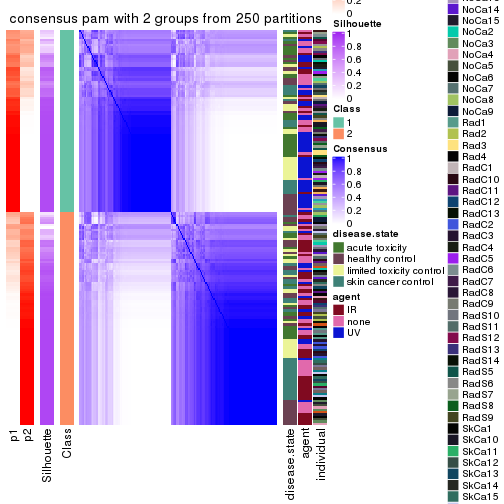</p>

</div>
<div id='tab-MAD-pam-consensus-heatmap-2'>
<pre><code class="r">consensus_heatmap(res, k = 3)
</code></pre>

<p>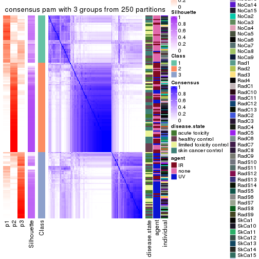</p>

</div>
<div id='tab-MAD-pam-consensus-heatmap-3'>
<pre><code class="r">consensus_heatmap(res, k = 4)
</code></pre>

<p>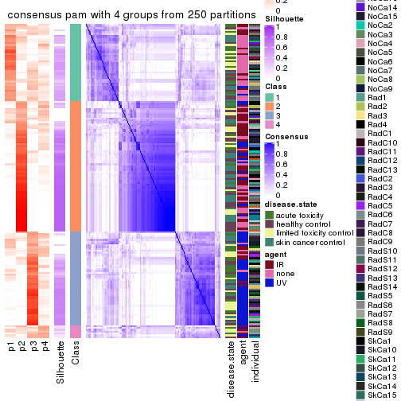</p>

</div>
<div id='tab-MAD-pam-consensus-heatmap-4'>
<pre><code class="r">consensus_heatmap(res, k = 5)
</code></pre>

<p>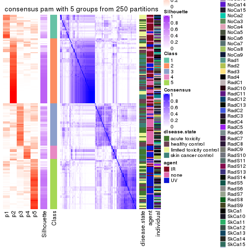</p>

</div>
<div id='tab-MAD-pam-consensus-heatmap-5'>
<pre><code class="r">consensus_heatmap(res, k = 6)
</code></pre>

<p>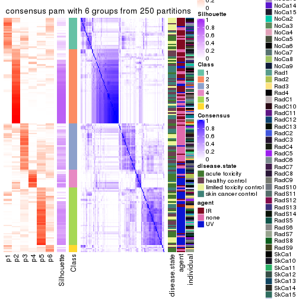</p>

</div>
</div>

Heatmaps for the membership of samples in all partitions to see how consistent they are:


<script>
$( function() {
	$( '#tabs-MAD-pam-membership-heatmap' ).tabs();
} );
</script>
<div id='tabs-MAD-pam-membership-heatmap'>
<ul>
<li><a href='#tab-MAD-pam-membership-heatmap-1'>k = 2</a></li>
<li><a href='#tab-MAD-pam-membership-heatmap-2'>k = 3</a></li>
<li><a href='#tab-MAD-pam-membership-heatmap-3'>k = 4</a></li>
<li><a href='#tab-MAD-pam-membership-heatmap-4'>k = 5</a></li>
<li><a href='#tab-MAD-pam-membership-heatmap-5'>k = 6</a></li>
</ul>
<div id='tab-MAD-pam-membership-heatmap-1'>
<pre><code class="r">membership_heatmap(res, k = 2)
</code></pre>

<p>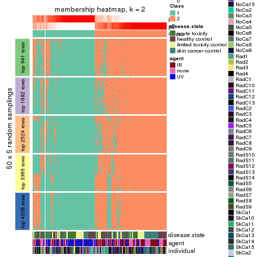</p>

</div>
<div id='tab-MAD-pam-membership-heatmap-2'>
<pre><code class="r">membership_heatmap(res, k = 3)
</code></pre>

<p>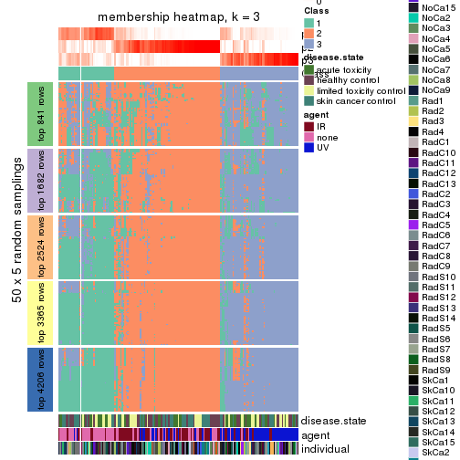</p>

</div>
<div id='tab-MAD-pam-membership-heatmap-3'>
<pre><code class="r">membership_heatmap(res, k = 4)
</code></pre>

<p>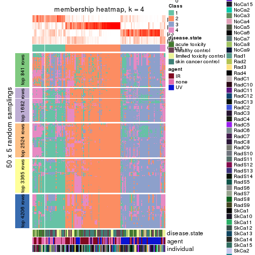</p>

</div>
<div id='tab-MAD-pam-membership-heatmap-4'>
<pre><code class="r">membership_heatmap(res, k = 5)
</code></pre>

<p>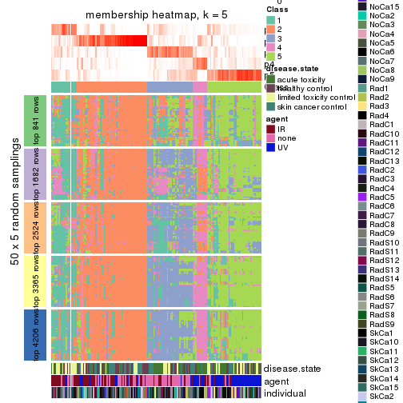</p>

</div>
<div id='tab-MAD-pam-membership-heatmap-5'>
<pre><code class="r">membership_heatmap(res, k = 6)
</code></pre>

<p>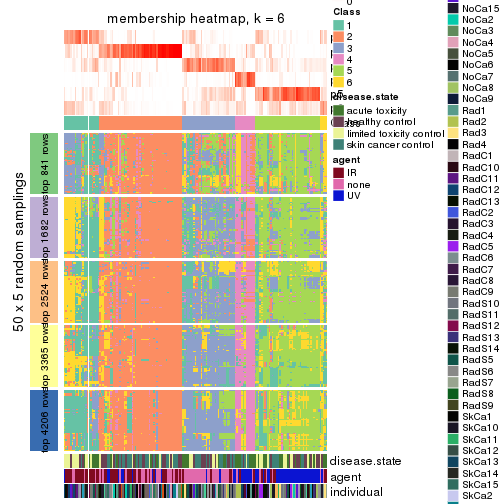</p>

</div>
</div>

As soon as we have had the classes for columns, we can look for signatures
which are significantly different between classes which can be candidate marks
for certain classes. Following are the heatmaps for signatures.


Signature heatmaps where rows are scaled:


<script>
$( function() {
	$( '#tabs-MAD-pam-get-signatures' ).tabs();
} );
</script>
<div id='tabs-MAD-pam-get-signatures'>
<ul>
<li><a href='#tab-MAD-pam-get-signatures-1'>k = 2</a></li>
<li><a href='#tab-MAD-pam-get-signatures-2'>k = 3</a></li>
<li><a href='#tab-MAD-pam-get-signatures-3'>k = 4</a></li>
<li><a href='#tab-MAD-pam-get-signatures-4'>k = 5</a></li>
<li><a href='#tab-MAD-pam-get-signatures-5'>k = 6</a></li>
</ul>
<div id='tab-MAD-pam-get-signatures-1'>
<pre><code class="r">get_signatures(res, k = 2)
</code></pre>

<p>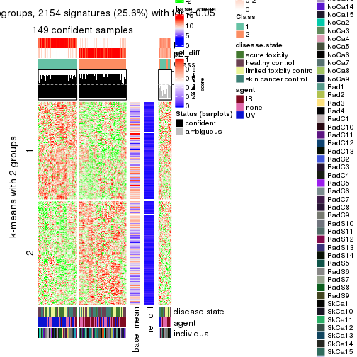</p>

</div>
<div id='tab-MAD-pam-get-signatures-2'>
<pre><code class="r">get_signatures(res, k = 3)
</code></pre>

<p>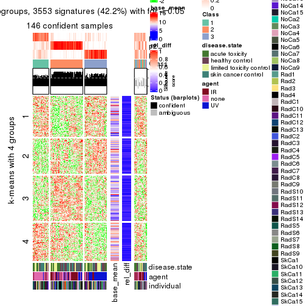</p>

</div>
<div id='tab-MAD-pam-get-signatures-3'>
<pre><code class="r">get_signatures(res, k = 4)
</code></pre>

<p>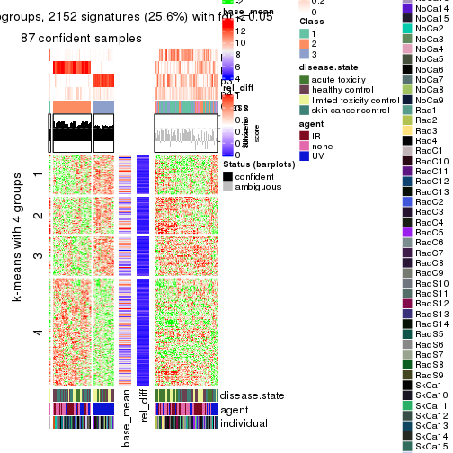</p>

</div>
<div id='tab-MAD-pam-get-signatures-4'>
<pre><code class="r">get_signatures(res, k = 5)
</code></pre>

<p>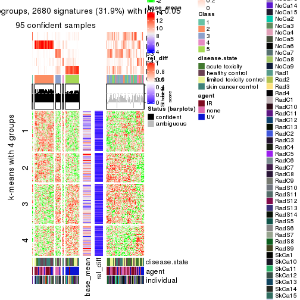</p>

</div>
<div id='tab-MAD-pam-get-signatures-5'>
<pre><code class="r">get_signatures(res, k = 6)
</code></pre>

<p>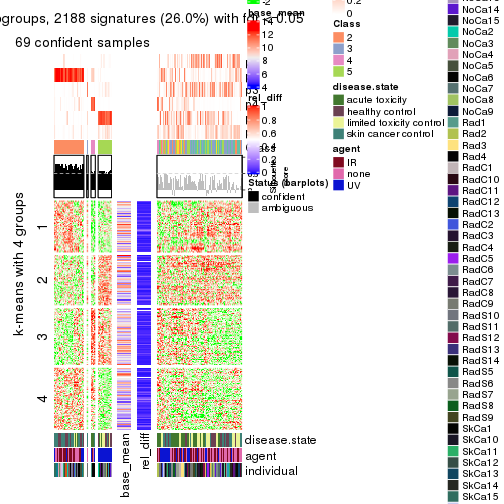</p>

</div>
</div>


Signature heatmaps where rows are not scaled:


<script>
$( function() {
	$( '#tabs-MAD-pam-get-signatures-no-scale' ).tabs();
} );
</script>
<div id='tabs-MAD-pam-get-signatures-no-scale'>
<ul>
<li><a href='#tab-MAD-pam-get-signatures-no-scale-1'>k = 2</a></li>
<li><a href='#tab-MAD-pam-get-signatures-no-scale-2'>k = 3</a></li>
<li><a href='#tab-MAD-pam-get-signatures-no-scale-3'>k = 4</a></li>
<li><a href='#tab-MAD-pam-get-signatures-no-scale-4'>k = 5</a></li>
<li><a href='#tab-MAD-pam-get-signatures-no-scale-5'>k = 6</a></li>
</ul>
<div id='tab-MAD-pam-get-signatures-no-scale-1'>
<pre><code class="r">get_signatures(res, k = 2, scale_rows = FALSE)
</code></pre>

<p>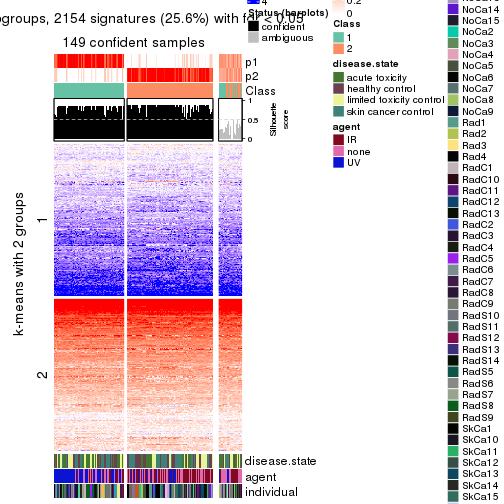</p>

</div>
<div id='tab-MAD-pam-get-signatures-no-scale-2'>
<pre><code class="r">get_signatures(res, k = 3, scale_rows = FALSE)
</code></pre>

<p>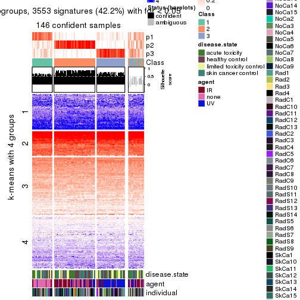</p>

</div>
<div id='tab-MAD-pam-get-signatures-no-scale-3'>
<pre><code class="r">get_signatures(res, k = 4, scale_rows = FALSE)
</code></pre>

<p>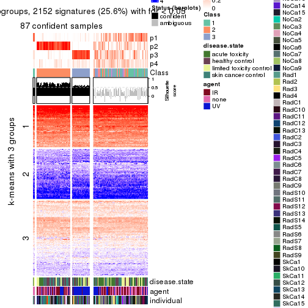</p>

</div>
<div id='tab-MAD-pam-get-signatures-no-scale-4'>
<pre><code class="r">get_signatures(res, k = 5, scale_rows = FALSE)
</code></pre>

<p>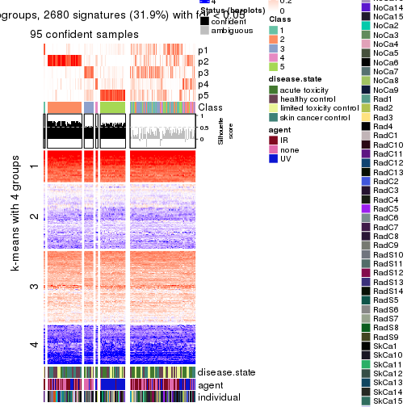</p>

</div>
<div id='tab-MAD-pam-get-signatures-no-scale-5'>
<pre><code class="r">get_signatures(res, k = 6, scale_rows = FALSE)
</code></pre>

<p>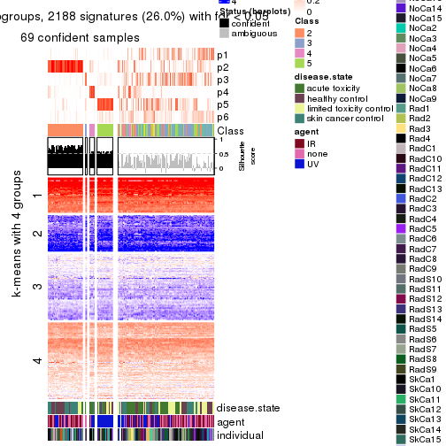</p>

</div>
</div>


Compare the overlap of signatures from different k:

```r
compare_signatures(res)
```

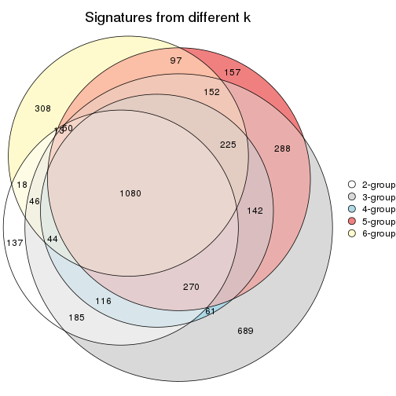

`get_signature()` returns a data frame invisibly. TO get the list of signatures, the function
call should be assigned to a variable explicitly. In following code, if `plot` argument is set
to `FALSE`, no heatmap is plotted while only the differential analysis is performed.

```r
# code only for demonstration
tb = get_signature(res, k = ..., plot = FALSE)
```

An example of the output of `tb` is:

```
#>   which_row         fdr    mean_1    mean_2 scaled_mean_1 scaled_mean_2 km
#> 1        38 0.042760348  8.373488  9.131774    -0.5533452     0.5164555  1
#> 2        40 0.018707592  7.106213  8.469186    -0.6173731     0.5762149  1
#> 3        55 0.019134737 10.221463 11.207825    -0.6159697     0.5749050  1
#> 4        59 0.006059896  5.921854  7.869574    -0.6899429     0.6439467  1
#> 5        60 0.018055526  8.928898 10.211722    -0.6204761     0.5791110  1
#> 6        98 0.009384629 15.714769 14.887706     0.6635654    -0.6193277  2
...
```

The columns in `tb` are:

1. `which_row`: row indices corresponding to the input matrix.
2. `fdr`: FDR for the differential test. 
3. `mean_x`: The mean value in group x.
4. `scaled_mean_x`: The mean value in group x after rows are scaled.
5. `km`: Row groups if k-means clustering is applied to rows.


UMAP plot which shows how samples are separated.


<script>
$( function() {
	$( '#tabs-MAD-pam-dimension-reduction' ).tabs();
} );
</script>
<div id='tabs-MAD-pam-dimension-reduction'>
<ul>
<li><a href='#tab-MAD-pam-dimension-reduction-1'>k = 2</a></li>
<li><a href='#tab-MAD-pam-dimension-reduction-2'>k = 3</a></li>
<li><a href='#tab-MAD-pam-dimension-reduction-3'>k = 4</a></li>
<li><a href='#tab-MAD-pam-dimension-reduction-4'>k = 5</a></li>
<li><a href='#tab-MAD-pam-dimension-reduction-5'>k = 6</a></li>
</ul>
<div id='tab-MAD-pam-dimension-reduction-1'>
<pre><code class="r">dimension_reduction(res, k = 2, method = &quot;UMAP&quot;)
</code></pre>

<p>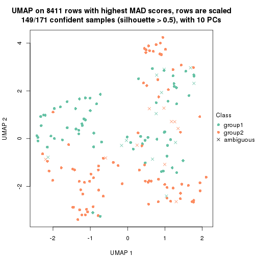</p>

</div>
<div id='tab-MAD-pam-dimension-reduction-2'>
<pre><code class="r">dimension_reduction(res, k = 3, method = &quot;UMAP&quot;)
</code></pre>

<p>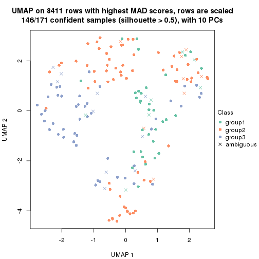</p>

</div>
<div id='tab-MAD-pam-dimension-reduction-3'>
<pre><code class="r">dimension_reduction(res, k = 4, method = &quot;UMAP&quot;)
</code></pre>

<p></p>

</div>
<div id='tab-MAD-pam-dimension-reduction-4'>
<pre><code class="r">dimension_reduction(res, k = 5, method = &quot;UMAP&quot;)
</code></pre>

<p>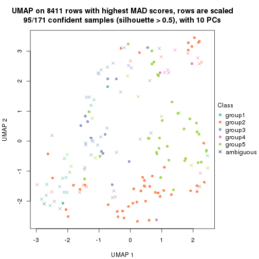</p>

</div>
<div id='tab-MAD-pam-dimension-reduction-5'>
<pre><code class="r">dimension_reduction(res, k = 6, method = &quot;UMAP&quot;)
</code></pre>

<p>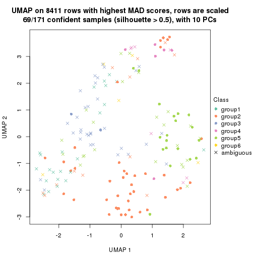</p>

</div>
</div>


Following heatmap shows how subgroups are split when increasing `k`:

```r
collect_classes(res)
```

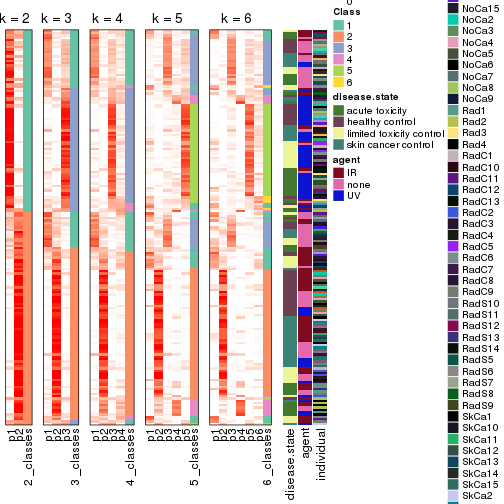


Test correlation between subgroups and known annotations. If the known
annotation is numeric, one-way ANOVA test is applied, and if the known
annotation is discrete, chi-squared contingency table test is applied.

```r
test_to_known_factors(res)
```

```
#>           n disease.state(p) agent(p) individual(p) k
#> MAD:pam 149         2.03e-01 2.36e-08       0.00375 2
#> MAD:pam 146         1.52e-01 6.36e-18       0.03283 3
#> MAD:pam  87         1.00e-01 2.88e-10       0.10527 4
#> MAD:pam  95         5.05e-02 1.58e-11       0.01747 5
#> MAD:pam  69         3.43e-05 8.29e-08       0.00324 6
```


If matrix rows can be associated to genes, consider to use `functional_enrichment(res,
...)` to perform function enrichment for the signature genes. See [this vignette](http://bioconductor.org/packages/devel/bioc/vignettes/cola/inst/doc/functional_enrichment.html) for more detailed explanations.


 

---------------------------------------------------


### MAD:mclust


The object with results only for a single top-value method and a single partition method 
can be extracted as:

```r
res = res_list["MAD", "mclust"]
# you can also extract it by
# res = res_list["MAD:mclust"]
```

A summary of `res` and all the functions that can be applied to it:

```r
res
```

```
#> A 'ConsensusPartition' object with k = 2, 3, 4, 5, 6.
#>   On a matrix with 8411 rows and 171 columns.
#>   Top rows (841, 1682, 2524, 3365, 4206) are extracted by 'MAD' method.
#>   Subgroups are detected by 'mclust' method.
#>   Performed in total 1250 partitions by row resampling.
#>   Best k for subgroups seems to be 5.
#> 
#> Following methods can be applied to this 'ConsensusPartition' object:
#>  [1] "cola_report"             "collect_classes"         "collect_plots"          
#>  [4] "collect_stats"           "colnames"                "compare_signatures"     
#>  [7] "consensus_heatmap"       "dimension_reduction"     "functional_enrichment"  
#> [10] "get_anno_col"            "get_anno"                "get_classes"            
#> [13] "get_consensus"           "get_matrix"              "get_membership"         
#> [16] "get_param"               "get_signatures"          "get_stats"              
#> [19] "is_best_k"               "is_stable_k"             "membership_heatmap"     
#> [22] "ncol"                    "nrow"                    "plot_ecdf"              
#> [25] "rownames"                "select_partition_number" "show"                   
#> [28] "suggest_best_k"          "test_to_known_factors"
```

`collect_plots()` function collects all the plots made from `res` for all `k` (number of partitions)
into one single page to provide an easy and fast comparison between different `k`.

```r
collect_plots(res)
```

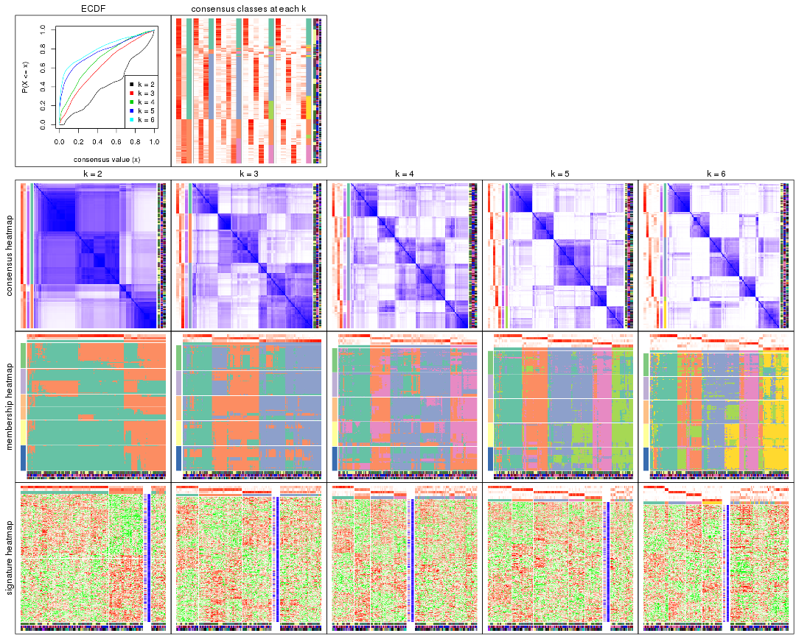

The plots are:

- The first row: a plot of the ECDF (empirical cumulative distribution
  function) curves of the consensus matrix for each `k` and the heatmap of
  predicted classes for each `k`.
- The second row: heatmaps of the consensus matrix for each `k`.
- The third row: heatmaps of the membership matrix for each `k`.
- The fouth row: heatmaps of the signatures for each `k`.

All the plots in panels can be made by individual functions and they are
plotted later in this section.

`select_partition_number()` produces several plots showing different
statistics for choosing "optimized" `k`. There are following statistics:

- ECDF curves of the consensus matrix for each `k`;
- 1-PAC. [The PAC
  score](https://en.wikipedia.org/wiki/Consensus_clustering#Over-interpretation_potential_of_consensus_clustering)
  measures the proportion of the ambiguous subgrouping.
- Mean silhouette score.
- Concordance. The mean probability of fiting the consensus class ids in all
  partitions.
- Area increased. Denote $A_k$ as the area under the ECDF curve for current
  `k`, the area increased is defined as $A_k - A_{k-1}$.
- Rand index. The percent of pairs of samples that are both in a same cluster
  or both are not in a same cluster in the partition of k and k-1.
- Jaccard index. The ratio of pairs of samples are both in a same cluster in
  the partition of k and k-1 and the pairs of samples are both in a same
  cluster in the partition k or k-1.

The detailed explanations of these statistics can be found in [the _cola_
vignette](http://bioconductor.org/packages/devel/bioc/vignettes/cola/inst/doc/cola.html#toc_13).

Generally speaking, lower PAC score, higher mean silhouette score or higher
concordance corresponds to better partition. Rand index and Jaccard index
measure how similar the current partition is compared to partition with `k-1`.
If they are too similar, we won't accept `k` is better than `k-1`.

```r
select_partition_number(res)
```

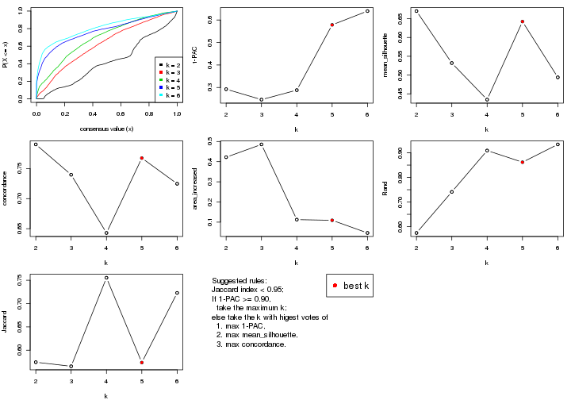

The numeric values for all these statistics can be obtained by `get_stats()`.

```r
get_stats(res)
```

```
#>   k 1-PAC mean_silhouette concordance area_increased  Rand Jaccard
#> 2 2 0.292           0.670       0.790         0.4222 0.574   0.574
#> 3 3 0.246           0.532       0.740         0.4856 0.741   0.566
#> 4 4 0.288           0.435       0.643         0.1125 0.909   0.755
#> 5 5 0.578           0.642       0.768         0.1092 0.862   0.574
#> 6 6 0.640           0.494       0.725         0.0463 0.934   0.723
```

`suggest_best_k()` suggests the best $k$ based on these statistics. The rules are as follows:

- All $k$ with Jaccard index larger than 0.95 are removed because increasing
  $k$ does not provide enough extra information. If all $k$ are removed, it is
  marked as no subgroup is detected.
- For all $k$ with 1-PAC score larger than 0.9, the maximal $k$ is taken as
  the best $k$, and other $k$ are marked as optional $k$.
- If it does not fit the second rule. The $k$ with the maximal vote of the
  highest 1-PAC score, highest mean silhouette, and highest concordance is
  taken as the best $k$.

```r
suggest_best_k(res)
```

```
#> [1] 5
```


Following shows the table of the partitions (You need to click the **show/hide
code output** link to see it). The membership matrix (columns with name `p*`)
is inferred by
[`clue::cl_consensus()`](https://www.rdocumentation.org/link/cl_consensus?package=clue)
function with the `SE` method. Basically the value in the membership matrix
represents the probability to belong to a certain group. The finall class
label for an item is determined with the group with highest probability it
belongs to.

In `get_classes()` function, the entropy is calculated from the membership
matrix and the silhouette score is calculated from the consensus matrix.


<script>
$( function() {
	$( '#tabs-MAD-mclust-get-classes' ).tabs();
} );
</script>
<div id='tabs-MAD-mclust-get-classes'>
<ul>
<li><a href='#tab-MAD-mclust-get-classes-1'>k = 2</a></li>
<li><a href='#tab-MAD-mclust-get-classes-2'>k = 3</a></li>
<li><a href='#tab-MAD-mclust-get-classes-3'>k = 4</a></li>
<li><a href='#tab-MAD-mclust-get-classes-4'>k = 5</a></li>
<li><a href='#tab-MAD-mclust-get-classes-5'>k = 6</a></li>
</ul>

<div id='tab-MAD-mclust-get-classes-1'>
<p><a id='tab-MAD-mclust-get-classes-1-a' style='color:#0366d6' href='#'>show/hide code output</a></p>
<pre><code class="r">cbind(get_classes(res, k = 2), get_membership(res, k = 2))
</code></pre>

<pre><code>#&gt;          class entropy silhouette    p1    p2
#&gt; GSM29783     1  0.9970  -0.272400 0.532 0.468
#&gt; GSM29786     2  0.6801   0.580987 0.180 0.820
#&gt; GSM29789     2  0.8813   0.769262 0.300 0.700
#&gt; GSM29792     2  0.8813   0.769262 0.300 0.700
#&gt; GSM29795     1  0.8813   0.337240 0.700 0.300
#&gt; GSM29798     2  0.9754   0.107796 0.408 0.592
#&gt; GSM29801     1  0.7883   0.746845 0.764 0.236
#&gt; GSM29804     1  0.4022   0.767055 0.920 0.080
#&gt; GSM29807     1  0.3584   0.710192 0.932 0.068
#&gt; GSM29816     1  0.8207   0.733299 0.744 0.256
#&gt; GSM29821     1  0.7602   0.751322 0.780 0.220
#&gt; GSM29824     1  0.6438   0.761641 0.836 0.164
#&gt; GSM29827     1  0.3733   0.733989 0.928 0.072
#&gt; GSM29830     1  0.3584   0.736378 0.932 0.068
#&gt; GSM29833     1  0.3584   0.736378 0.932 0.068
#&gt; GSM29784     2  0.9933   0.565299 0.452 0.548
#&gt; GSM29787     2  0.9087   0.351617 0.324 0.676
#&gt; GSM29790     2  0.8813   0.774226 0.300 0.700
#&gt; GSM29793     2  0.8861   0.770860 0.304 0.696
#&gt; GSM29796     2  0.9922   0.533339 0.448 0.552
#&gt; GSM29799     2  0.9896  -0.014322 0.440 0.560
#&gt; GSM29802     1  0.8207   0.733299 0.744 0.256
#&gt; GSM29805     1  0.8081   0.738297 0.752 0.248
#&gt; GSM29814     1  0.3431   0.714540 0.936 0.064
#&gt; GSM29817     1  0.8081   0.735825 0.752 0.248
#&gt; GSM29822     1  0.8081   0.735825 0.752 0.248
#&gt; GSM29825     1  0.8207   0.733299 0.744 0.256
#&gt; GSM29828     1  0.3584   0.736378 0.932 0.068
#&gt; GSM29831     1  0.3114   0.743035 0.944 0.056
#&gt; GSM29834     1  0.3584   0.736378 0.932 0.068
#&gt; GSM29785     2  0.8763   0.772600 0.296 0.704
#&gt; GSM29788     2  0.5629   0.612247 0.132 0.868
#&gt; GSM29791     2  0.8813   0.769262 0.300 0.700
#&gt; GSM29794     2  0.8813   0.769262 0.300 0.700
#&gt; GSM29797     2  0.8813   0.768155 0.300 0.700
#&gt; GSM29800     2  0.6343   0.597018 0.160 0.840
#&gt; GSM29803     1  0.8267   0.731157 0.740 0.260
#&gt; GSM29806     1  0.7376   0.749494 0.792 0.208
#&gt; GSM29815     1  0.4298   0.685632 0.912 0.088
#&gt; GSM29819     1  0.8144   0.733060 0.748 0.252
#&gt; GSM29823     1  0.9996   0.294746 0.512 0.488
#&gt; GSM29826     1  0.8081   0.735835 0.752 0.248
#&gt; GSM29829     1  0.3431   0.738764 0.936 0.064
#&gt; GSM29832     1  0.3584   0.736378 0.932 0.068
#&gt; GSM29835     1  0.7883   0.348116 0.764 0.236
#&gt; GSM29836     2  0.8813   0.769262 0.300 0.700
#&gt; GSM29839     2  0.9358   0.749315 0.352 0.648
#&gt; GSM29842     2  0.9998   0.532451 0.492 0.508
#&gt; GSM29845     2  0.9866   0.020877 0.432 0.568
#&gt; GSM29848     2  0.9661   0.162207 0.392 0.608
#&gt; GSM29851     1  0.8144   0.734888 0.748 0.252
#&gt; GSM29854     1  0.8144   0.733060 0.748 0.252
#&gt; GSM29857     1  0.6887   0.756817 0.816 0.184
#&gt; GSM29860     2  0.8813   0.769262 0.300 0.700
#&gt; GSM29863     1  0.8207   0.735486 0.744 0.256
#&gt; GSM29866     1  0.3584   0.736378 0.932 0.068
#&gt; GSM29869     1  0.1843   0.748249 0.972 0.028
#&gt; GSM29872     1  0.3879   0.709487 0.924 0.076
#&gt; GSM29875     1  0.8144   0.736550 0.748 0.252
#&gt; GSM29878     1  0.7453   0.457112 0.788 0.212
#&gt; GSM29837     2  0.9209   0.765757 0.336 0.664
#&gt; GSM29840     2  0.9323   0.745976 0.348 0.652
#&gt; GSM29843     2  0.9661   0.688858 0.392 0.608
#&gt; GSM29846     2  0.9866   0.020877 0.432 0.568
#&gt; GSM29849     2  0.9833   0.047806 0.424 0.576
#&gt; GSM29852     1  0.8207   0.733299 0.744 0.256
#&gt; GSM29855     1  0.8207   0.733299 0.744 0.256
#&gt; GSM29858     1  0.7299   0.751811 0.796 0.204
#&gt; GSM29861     1  0.9988  -0.480164 0.520 0.480
#&gt; GSM29864     1  0.8207   0.733299 0.744 0.256
#&gt; GSM29867     1  0.5737   0.764886 0.864 0.136
#&gt; GSM29870     1  0.4022   0.766934 0.920 0.080
#&gt; GSM29873     1  0.3274   0.718210 0.940 0.060
#&gt; GSM29876     1  0.8081   0.735825 0.752 0.248
#&gt; GSM29879     1  0.2043   0.745303 0.968 0.032
#&gt; GSM29838     2  0.9000   0.772203 0.316 0.684
#&gt; GSM29841     2  0.8813   0.772625 0.300 0.700
#&gt; GSM29844     2  0.8763   0.770954 0.296 0.704
#&gt; GSM29847     2  0.8207   0.484497 0.256 0.744
#&gt; GSM29850     2  0.6343   0.597018 0.160 0.840
#&gt; GSM29853     1  0.8207   0.733299 0.744 0.256
#&gt; GSM29856     1  0.8207   0.732636 0.744 0.256
#&gt; GSM29859     1  0.5946   0.762341 0.856 0.144
#&gt; GSM29862     2  0.8813   0.769262 0.300 0.700
#&gt; GSM29865     1  0.9686   0.542305 0.604 0.396
#&gt; GSM29868     1  0.1843   0.751693 0.972 0.028
#&gt; GSM29871     1  0.3114   0.739807 0.944 0.056
#&gt; GSM29874     1  0.9323  -0.000241 0.652 0.348
#&gt; GSM29877     1  0.8207   0.733299 0.744 0.256
#&gt; GSM29880     2  0.8813   0.769262 0.300 0.700
#&gt; GSM29881     1  0.8144   0.733060 0.748 0.252
#&gt; GSM29884     2  0.8861   0.774560 0.304 0.696
#&gt; GSM29887     2  0.8955   0.772871 0.312 0.688
#&gt; GSM29890     1  0.1633   0.749963 0.976 0.024
#&gt; GSM29893     1  0.3584   0.736378 0.932 0.068
#&gt; GSM29896     1  0.5519   0.750391 0.872 0.128
#&gt; GSM29899     1  0.6801   0.759367 0.820 0.180
#&gt; GSM29902     1  0.1184   0.749819 0.984 0.016
#&gt; GSM29905     1  0.0672   0.753377 0.992 0.008
#&gt; GSM29908     1  0.3879   0.731273 0.924 0.076
#&gt; GSM29955     1  0.2043   0.748337 0.968 0.032
#&gt; GSM29958     1  0.3584   0.736378 0.932 0.068
#&gt; GSM29961     1  0.3733   0.733989 0.928 0.072
#&gt; GSM29882     1  0.8207   0.733299 0.744 0.256
#&gt; GSM29885     2  0.9323   0.747759 0.348 0.652
#&gt; GSM29888     2  0.8763   0.772834 0.296 0.704
#&gt; GSM29891     1  0.5408   0.765469 0.876 0.124
#&gt; GSM29894     1  0.5519   0.751584 0.872 0.128
#&gt; GSM29897     1  0.4431   0.747633 0.908 0.092
#&gt; GSM29900     1  0.8207   0.733299 0.744 0.256
#&gt; GSM29903     1  0.1184   0.753409 0.984 0.016
#&gt; GSM29906     1  0.1414   0.757512 0.980 0.020
#&gt; GSM29909     1  0.1184   0.751185 0.984 0.016
#&gt; GSM29956     1  0.3584   0.736378 0.932 0.068
#&gt; GSM29959     1  0.3584   0.736378 0.932 0.068
#&gt; GSM29962     1  0.2236   0.750156 0.964 0.036
#&gt; GSM29883     1  0.8267   0.732807 0.740 0.260
#&gt; GSM29886     2  0.8713   0.773463 0.292 0.708
#&gt; GSM29889     2  0.8955   0.772871 0.312 0.688
#&gt; GSM29892     1  0.0938   0.751379 0.988 0.012
#&gt; GSM29895     1  0.3114   0.737575 0.944 0.056
#&gt; GSM29898     1  0.6973   0.755391 0.812 0.188
#&gt; GSM29901     1  0.8081   0.735835 0.752 0.248
#&gt; GSM29904     1  0.3114   0.728805 0.944 0.056
#&gt; GSM29907     1  0.2236   0.760071 0.964 0.036
#&gt; GSM29910     1  0.3114   0.732265 0.944 0.056
#&gt; GSM29957     1  0.3584   0.721715 0.932 0.068
#&gt; GSM29960     1  0.2043   0.749786 0.968 0.032
#&gt; GSM29963     1  0.2603   0.738985 0.956 0.044
#&gt; GSM29964     2  0.9000   0.772203 0.316 0.684
#&gt; GSM29967     2  0.5519   0.613694 0.128 0.872
#&gt; GSM29970     1  0.8081   0.735689 0.752 0.248
#&gt; GSM29973     2  0.9000   0.772203 0.316 0.684
#&gt; GSM29976     1  0.8081   0.735835 0.752 0.248
#&gt; GSM29979     1  0.3879   0.700801 0.924 0.076
#&gt; GSM29982     2  0.9881  -0.014432 0.436 0.564
#&gt; GSM29985     1  0.8144   0.733060 0.748 0.252
#&gt; GSM29988     1  0.3431   0.714540 0.936 0.064
#&gt; GSM29991     1  0.7950   0.741120 0.760 0.240
#&gt; GSM29994     1  0.1633   0.750641 0.976 0.024
#&gt; GSM29997     1  0.2778   0.738684 0.952 0.048
#&gt; GSM30000     1  0.2043   0.741382 0.968 0.032
#&gt; GSM30003     1  0.8144   0.733060 0.748 0.252
#&gt; GSM29965     2  0.9460   0.745098 0.364 0.636
#&gt; GSM29968     2  0.5842   0.608712 0.140 0.860
#&gt; GSM29971     1  0.8207   0.732628 0.744 0.256
#&gt; GSM29974     2  0.9000   0.772203 0.316 0.684
#&gt; GSM29977     1  0.8144   0.733060 0.748 0.252
#&gt; GSM29980     1  0.3733   0.731842 0.928 0.072
#&gt; GSM29983     1  0.9922   0.408496 0.552 0.448
#&gt; GSM29986     1  0.8207   0.733299 0.744 0.256
#&gt; GSM29989     1  0.3114   0.728824 0.944 0.056
#&gt; GSM29992     1  0.7950   0.739467 0.760 0.240
#&gt; GSM29995     1  0.3879   0.731273 0.924 0.076
#&gt; GSM29998     1  0.2603   0.744528 0.956 0.044
#&gt; GSM30001     1  0.3584   0.766331 0.932 0.068
#&gt; GSM30004     1  0.8207   0.733299 0.744 0.256
#&gt; GSM29966     2  0.9000   0.772203 0.316 0.684
#&gt; GSM29969     2  0.5178   0.617226 0.116 0.884
#&gt; GSM29972     1  0.8144   0.735256 0.748 0.252
#&gt; GSM29975     2  0.9000   0.772203 0.316 0.684
#&gt; GSM29978     1  0.8081   0.735835 0.752 0.248
#&gt; GSM29981     2  0.9427   0.742860 0.360 0.640
#&gt; GSM29984     2  0.6712   0.584115 0.176 0.824
#&gt; GSM29987     1  0.8081   0.735689 0.752 0.248
#&gt; GSM29990     1  0.3431   0.714540 0.936 0.064
#&gt; GSM29993     1  0.9944   0.386603 0.544 0.456
#&gt; GSM29996     1  0.2423   0.740382 0.960 0.040
#&gt; GSM29999     1  0.3879   0.730903 0.924 0.076
#&gt; GSM30002     1  0.3274   0.732443 0.940 0.060
#&gt; GSM30005     1  0.8144   0.733060 0.748 0.252
</code></pre>

<script>
$('#tab-MAD-mclust-get-classes-1-a').parent().next().next().hide();
$('#tab-MAD-mclust-get-classes-1-a').click(function(){
  $('#tab-MAD-mclust-get-classes-1-a').parent().next().next().toggle();
  return(false);
});
</script>
</div>

<div id='tab-MAD-mclust-get-classes-2'>
<p><a id='tab-MAD-mclust-get-classes-2-a' style='color:#0366d6' href='#'>show/hide code output</a></p>
<pre><code class="r">cbind(get_classes(res, k = 3), get_membership(res, k = 3))
</code></pre>

<pre><code>#&gt;          class entropy silhouette    p1    p2    p3
#&gt; GSM29783     2  0.8030     0.6238 0.144 0.652 0.204
#&gt; GSM29786     2  0.6715     0.5836 0.028 0.660 0.312
#&gt; GSM29789     2  0.3412     0.6751 0.124 0.876 0.000
#&gt; GSM29792     2  0.3551     0.6737 0.132 0.868 0.000
#&gt; GSM29795     2  0.8784     0.2444 0.388 0.496 0.116
#&gt; GSM29798     2  0.6715     0.5836 0.028 0.660 0.312
#&gt; GSM29801     1  0.9428     0.1178 0.428 0.176 0.396
#&gt; GSM29804     3  0.6075     0.4006 0.316 0.008 0.676
#&gt; GSM29807     3  0.9636     0.2346 0.248 0.284 0.468
#&gt; GSM29816     3  0.2846     0.6317 0.020 0.056 0.924
#&gt; GSM29821     3  0.9745    -0.0379 0.348 0.232 0.420
#&gt; GSM29824     3  0.5588     0.4847 0.276 0.004 0.720
#&gt; GSM29827     1  0.1964     0.7367 0.944 0.000 0.056
#&gt; GSM29830     1  0.2165     0.7350 0.936 0.000 0.064
#&gt; GSM29833     1  0.4642     0.7397 0.856 0.084 0.060
#&gt; GSM29784     2  0.6034     0.6731 0.152 0.780 0.068
#&gt; GSM29787     2  0.6715     0.5836 0.028 0.660 0.312
#&gt; GSM29790     2  0.1411     0.6965 0.036 0.964 0.000
#&gt; GSM29793     2  0.3038     0.6838 0.104 0.896 0.000
#&gt; GSM29796     2  0.6151     0.6835 0.160 0.772 0.068
#&gt; GSM29799     2  0.6819     0.5636 0.028 0.644 0.328
#&gt; GSM29802     3  0.3966     0.6113 0.024 0.100 0.876
#&gt; GSM29805     3  0.4642     0.6214 0.060 0.084 0.856
#&gt; GSM29814     3  0.8835     0.3228 0.244 0.180 0.576
#&gt; GSM29817     3  0.9006     0.3075 0.188 0.256 0.556
#&gt; GSM29822     3  0.8052     0.4550 0.152 0.196 0.652
#&gt; GSM29825     3  0.6023     0.5635 0.120 0.092 0.788
#&gt; GSM29828     1  0.2066     0.7368 0.940 0.000 0.060
#&gt; GSM29831     1  0.3412     0.7103 0.876 0.000 0.124
#&gt; GSM29834     1  0.4725     0.7391 0.852 0.088 0.060
#&gt; GSM29785     2  0.4277     0.6815 0.132 0.852 0.016
#&gt; GSM29788     2  0.6473     0.5859 0.020 0.668 0.312
#&gt; GSM29791     2  0.3551     0.6737 0.132 0.868 0.000
#&gt; GSM29794     2  0.3551     0.6737 0.132 0.868 0.000
#&gt; GSM29797     2  0.5698     0.6201 0.252 0.736 0.012
#&gt; GSM29800     2  0.6715     0.5836 0.028 0.660 0.312
#&gt; GSM29803     3  0.5639     0.5177 0.016 0.232 0.752
#&gt; GSM29806     3  0.3973     0.6215 0.088 0.032 0.880
#&gt; GSM29815     3  0.9589     0.2091 0.208 0.344 0.448
#&gt; GSM29819     3  0.0829     0.6409 0.004 0.012 0.984
#&gt; GSM29823     2  0.9431     0.3860 0.176 0.424 0.400
#&gt; GSM29826     3  0.1129     0.6393 0.020 0.004 0.976
#&gt; GSM29829     1  0.5020     0.7344 0.836 0.108 0.056
#&gt; GSM29832     1  0.4609     0.7393 0.856 0.092 0.052
#&gt; GSM29835     1  0.7693     0.3145 0.580 0.364 0.056
#&gt; GSM29836     2  0.3482     0.6736 0.128 0.872 0.000
#&gt; GSM29839     2  0.5656     0.6024 0.264 0.728 0.008
#&gt; GSM29842     2  0.4874     0.6808 0.144 0.828 0.028
#&gt; GSM29845     2  0.6912     0.5467 0.028 0.628 0.344
#&gt; GSM29848     2  0.6715     0.5836 0.028 0.660 0.312
#&gt; GSM29851     3  0.8122     0.4374 0.184 0.168 0.648
#&gt; GSM29854     3  0.0592     0.6396 0.012 0.000 0.988
#&gt; GSM29857     3  0.4228     0.5825 0.148 0.008 0.844
#&gt; GSM29860     2  0.4802     0.6544 0.156 0.824 0.020
#&gt; GSM29863     3  0.7741     0.4336 0.216 0.116 0.668
#&gt; GSM29866     1  0.2590     0.7360 0.924 0.004 0.072
#&gt; GSM29869     1  0.6119     0.6751 0.772 0.064 0.164
#&gt; GSM29872     3  0.9873     0.0802 0.328 0.268 0.404
#&gt; GSM29875     3  0.8339     0.4386 0.204 0.168 0.628
#&gt; GSM29878     2  0.7583    -0.0558 0.468 0.492 0.040
#&gt; GSM29837     2  0.5913     0.6093 0.068 0.788 0.144
#&gt; GSM29840     2  0.6143     0.6305 0.256 0.720 0.024
#&gt; GSM29843     2  0.5173     0.6806 0.148 0.816 0.036
#&gt; GSM29846     2  0.6890     0.5534 0.028 0.632 0.340
#&gt; GSM29849     2  0.6715     0.5836 0.028 0.660 0.312
#&gt; GSM29852     3  0.7661     0.4856 0.144 0.172 0.684
#&gt; GSM29855     3  0.3193     0.6173 0.004 0.100 0.896
#&gt; GSM29858     3  0.3695     0.6114 0.108 0.012 0.880
#&gt; GSM29861     2  0.5020     0.6233 0.192 0.796 0.012
#&gt; GSM29864     3  0.7615     0.4883 0.148 0.164 0.688
#&gt; GSM29867     3  0.7851     0.4231 0.304 0.080 0.616
#&gt; GSM29870     3  0.8624     0.1570 0.424 0.100 0.476
#&gt; GSM29873     3  0.8770     0.3186 0.272 0.156 0.572
#&gt; GSM29876     3  0.6239     0.5709 0.072 0.160 0.768
#&gt; GSM29879     1  0.7474     0.6486 0.684 0.216 0.100
#&gt; GSM29838     2  0.3933     0.6768 0.028 0.880 0.092
#&gt; GSM29841     2  0.5580     0.6146 0.256 0.736 0.008
#&gt; GSM29844     2  0.3816     0.6723 0.148 0.852 0.000
#&gt; GSM29847     2  0.6715     0.5836 0.028 0.660 0.312
#&gt; GSM29850     2  0.6688     0.5870 0.028 0.664 0.308
#&gt; GSM29853     3  0.8265     0.4161 0.184 0.180 0.636
#&gt; GSM29856     3  0.4982     0.5882 0.036 0.136 0.828
#&gt; GSM29859     3  0.7256     0.4992 0.216 0.088 0.696
#&gt; GSM29862     2  0.3686     0.6690 0.140 0.860 0.000
#&gt; GSM29865     3  0.6587     0.1323 0.016 0.352 0.632
#&gt; GSM29868     1  0.7902     0.5779 0.660 0.132 0.208
#&gt; GSM29871     3  0.7580     0.3134 0.340 0.056 0.604
#&gt; GSM29874     1  0.7586     0.1265 0.480 0.480 0.040
#&gt; GSM29877     3  0.7104     0.5168 0.136 0.140 0.724
#&gt; GSM29880     2  0.4172     0.6579 0.156 0.840 0.004
#&gt; GSM29881     3  0.1525     0.6378 0.004 0.032 0.964
#&gt; GSM29884     2  0.5625     0.6712 0.116 0.808 0.076
#&gt; GSM29887     2  0.4165     0.6877 0.048 0.876 0.076
#&gt; GSM29890     1  0.6779     0.1071 0.544 0.012 0.444
#&gt; GSM29893     1  0.2448     0.7317 0.924 0.000 0.076
#&gt; GSM29896     1  0.5497     0.5057 0.708 0.000 0.292
#&gt; GSM29899     3  0.5517     0.4981 0.268 0.004 0.728
#&gt; GSM29902     3  0.7015     0.2769 0.392 0.024 0.584
#&gt; GSM29905     3  0.6881     0.2870 0.388 0.020 0.592
#&gt; GSM29908     1  0.1989     0.7369 0.948 0.004 0.048
#&gt; GSM29955     1  0.5243     0.7329 0.828 0.100 0.072
#&gt; GSM29958     1  0.1753     0.7370 0.952 0.000 0.048
#&gt; GSM29961     1  0.1989     0.7369 0.948 0.004 0.048
#&gt; GSM29882     3  0.5069     0.5949 0.044 0.128 0.828
#&gt; GSM29885     2  0.5060     0.6775 0.156 0.816 0.028
#&gt; GSM29888     2  0.5174     0.6937 0.092 0.832 0.076
#&gt; GSM29891     3  0.4700     0.5767 0.180 0.008 0.812
#&gt; GSM29894     1  0.4575     0.6295 0.812 0.004 0.184
#&gt; GSM29897     1  0.3941     0.6595 0.844 0.000 0.156
#&gt; GSM29900     3  0.4121     0.6180 0.040 0.084 0.876
#&gt; GSM29903     3  0.6896     0.2704 0.392 0.020 0.588
#&gt; GSM29906     3  0.6814     0.3149 0.372 0.020 0.608
#&gt; GSM29909     1  0.7121     0.1862 0.548 0.024 0.428
#&gt; GSM29956     1  0.1860     0.7372 0.948 0.000 0.052
#&gt; GSM29959     1  0.1964     0.7371 0.944 0.000 0.056
#&gt; GSM29962     1  0.5042     0.7356 0.836 0.060 0.104
#&gt; GSM29883     3  0.2845     0.6371 0.012 0.068 0.920
#&gt; GSM29886     2  0.3889     0.7023 0.084 0.884 0.032
#&gt; GSM29889     2  0.3850     0.6844 0.028 0.884 0.088
#&gt; GSM29892     3  0.8010     0.2587 0.384 0.068 0.548
#&gt; GSM29895     1  0.7528     0.5103 0.648 0.280 0.072
#&gt; GSM29898     3  0.5913     0.5911 0.144 0.068 0.788
#&gt; GSM29901     3  0.1163     0.6395 0.028 0.000 0.972
#&gt; GSM29904     1  0.8981    -0.0407 0.448 0.128 0.424
#&gt; GSM29907     3  0.8439     0.2708 0.368 0.096 0.536
#&gt; GSM29910     1  0.5891     0.6953 0.780 0.168 0.052
#&gt; GSM29957     1  0.7915     0.5736 0.644 0.248 0.108
#&gt; GSM29960     1  0.5307     0.7203 0.816 0.136 0.048
#&gt; GSM29963     1  0.8973     0.1810 0.500 0.136 0.364
#&gt; GSM29964     2  0.4174     0.6735 0.036 0.872 0.092
#&gt; GSM29967     2  0.6879     0.5691 0.024 0.616 0.360
#&gt; GSM29970     3  0.0829     0.6408 0.012 0.004 0.984
#&gt; GSM29973     2  0.4289     0.6725 0.040 0.868 0.092
#&gt; GSM29976     3  0.1399     0.6386 0.028 0.004 0.968
#&gt; GSM29979     3  0.9724     0.2053 0.268 0.280 0.452
#&gt; GSM29982     2  0.8841     0.5341 0.136 0.536 0.328
#&gt; GSM29985     3  0.1315     0.6403 0.020 0.008 0.972
#&gt; GSM29988     3  0.9452     0.2763 0.268 0.232 0.500
#&gt; GSM29991     3  0.5094     0.6097 0.056 0.112 0.832
#&gt; GSM29994     3  0.6969     0.3003 0.380 0.024 0.596
#&gt; GSM29997     3  0.7517     0.3159 0.364 0.048 0.588
#&gt; GSM30000     3  0.7475     0.2785 0.376 0.044 0.580
#&gt; GSM30003     3  0.1491     0.6406 0.016 0.016 0.968
#&gt; GSM29965     2  0.4982     0.6545 0.064 0.840 0.096
#&gt; GSM29968     2  0.6800     0.5835 0.032 0.660 0.308
#&gt; GSM29971     3  0.1647     0.6373 0.004 0.036 0.960
#&gt; GSM29974     2  0.6181     0.5922 0.072 0.772 0.156
#&gt; GSM29977     3  0.1453     0.6402 0.024 0.008 0.968
#&gt; GSM29980     3  0.9117     0.2536 0.328 0.160 0.512
#&gt; GSM29983     2  0.8983     0.3206 0.132 0.480 0.388
#&gt; GSM29986     3  0.3715     0.6170 0.004 0.128 0.868
#&gt; GSM29989     3  0.8310     0.3315 0.312 0.104 0.584
#&gt; GSM29992     3  0.3406     0.6395 0.028 0.068 0.904
#&gt; GSM29995     1  0.2384     0.7402 0.936 0.008 0.056
#&gt; GSM29998     3  0.7552     0.3252 0.352 0.052 0.596
#&gt; GSM30001     3  0.5992     0.4555 0.268 0.016 0.716
#&gt; GSM30004     3  0.3805     0.6142 0.024 0.092 0.884
#&gt; GSM29966     2  0.4056     0.6756 0.032 0.876 0.092
#&gt; GSM29969     2  0.6750     0.5817 0.024 0.640 0.336
#&gt; GSM29972     3  0.3349     0.6136 0.004 0.108 0.888
#&gt; GSM29975     2  0.4399     0.6703 0.044 0.864 0.092
#&gt; GSM29978     3  0.1525     0.6382 0.032 0.004 0.964
#&gt; GSM29981     2  0.7126     0.5421 0.116 0.720 0.164
#&gt; GSM29984     2  0.6855     0.5758 0.032 0.652 0.316
#&gt; GSM29987     3  0.3695     0.6149 0.012 0.108 0.880
#&gt; GSM29990     3  0.9706     0.2249 0.268 0.276 0.456
#&gt; GSM29993     3  0.5951     0.5345 0.040 0.196 0.764
#&gt; GSM29996     1  0.8887     0.1576 0.504 0.128 0.368
#&gt; GSM29999     3  0.9189     0.2842 0.316 0.172 0.512
#&gt; GSM30002     3  0.9112     0.2688 0.308 0.168 0.524
#&gt; GSM30005     3  0.1832     0.6426 0.008 0.036 0.956
</code></pre>

<script>
$('#tab-MAD-mclust-get-classes-2-a').parent().next().next().hide();
$('#tab-MAD-mclust-get-classes-2-a').click(function(){
  $('#tab-MAD-mclust-get-classes-2-a').parent().next().next().toggle();
  return(false);
});
</script>
</div>

<div id='tab-MAD-mclust-get-classes-3'>
<p><a id='tab-MAD-mclust-get-classes-3-a' style='color:#0366d6' href='#'>show/hide code output</a></p>
<pre><code class="r">cbind(get_classes(res, k = 4), get_membership(res, k = 4))
</code></pre>

<pre><code>#&gt;          class entropy silhouette    p1    p2    p3    p4
#&gt; GSM29783     4  0.6047     0.4482 0.100 0.068 0.084 0.748
#&gt; GSM29786     4  0.3863     0.6301 0.008 0.004 0.176 0.812
#&gt; GSM29789     2  0.5273     0.5794 0.008 0.536 0.000 0.456
#&gt; GSM29792     2  0.4888     0.6253 0.000 0.588 0.000 0.412
#&gt; GSM29795     1  0.9391     0.0365 0.372 0.128 0.176 0.324
#&gt; GSM29798     4  0.3768     0.6307 0.008 0.000 0.184 0.808
#&gt; GSM29801     1  0.7660    -0.0249 0.420 0.004 0.396 0.180
#&gt; GSM29804     3  0.5993     0.3694 0.344 0.012 0.612 0.032
#&gt; GSM29807     3  0.7143     0.2888 0.080 0.352 0.544 0.024
#&gt; GSM29816     3  0.6452     0.5519 0.140 0.160 0.684 0.016
#&gt; GSM29821     3  0.8315     0.0140 0.368 0.020 0.380 0.232
#&gt; GSM29824     3  0.5652     0.4308 0.328 0.016 0.640 0.016
#&gt; GSM29827     1  0.0817     0.6965 0.976 0.000 0.024 0.000
#&gt; GSM29830     1  0.0707     0.6956 0.980 0.000 0.020 0.000
#&gt; GSM29833     1  0.3198     0.6981 0.884 0.004 0.032 0.080
#&gt; GSM29784     4  0.4800     0.4458 0.096 0.048 0.040 0.816
#&gt; GSM29787     4  0.3681     0.6307 0.008 0.000 0.176 0.816
#&gt; GSM29790     4  0.5007    -0.3316 0.008 0.356 0.000 0.636
#&gt; GSM29793     4  0.5288    -0.5302 0.008 0.472 0.000 0.520
#&gt; GSM29796     4  0.6790     0.3169 0.092 0.176 0.052 0.680
#&gt; GSM29799     4  0.4153     0.6231 0.008 0.004 0.204 0.784
#&gt; GSM29802     3  0.7633     0.5273 0.124 0.160 0.628 0.088
#&gt; GSM29805     3  0.6715     0.5417 0.176 0.160 0.652 0.012
#&gt; GSM29814     3  0.7287     0.2862 0.096 0.332 0.548 0.024
#&gt; GSM29817     3  0.8654     0.4324 0.156 0.164 0.536 0.144
#&gt; GSM29822     3  0.8033     0.4886 0.116 0.164 0.596 0.124
#&gt; GSM29825     3  0.7178     0.5062 0.200 0.164 0.616 0.020
#&gt; GSM29828     1  0.0707     0.6956 0.980 0.000 0.020 0.000
#&gt; GSM29831     1  0.1637     0.6766 0.940 0.000 0.060 0.000
#&gt; GSM29834     1  0.3491     0.6907 0.864 0.004 0.028 0.104
#&gt; GSM29785     4  0.6666    -0.3537 0.088 0.340 0.004 0.568
#&gt; GSM29788     4  0.5339     0.5869 0.004 0.072 0.180 0.744
#&gt; GSM29791     2  0.4898     0.6217 0.000 0.584 0.000 0.416
#&gt; GSM29794     2  0.4898     0.6254 0.000 0.584 0.000 0.416
#&gt; GSM29797     2  0.7233     0.4764 0.092 0.484 0.016 0.408
#&gt; GSM29800     4  0.3765     0.6284 0.004 0.004 0.180 0.812
#&gt; GSM29803     3  0.5093     0.2191 0.008 0.004 0.652 0.336
#&gt; GSM29806     3  0.3653     0.5362 0.112 0.008 0.856 0.024
#&gt; GSM29815     3  0.8847    -0.0483 0.060 0.368 0.372 0.200
#&gt; GSM29819     3  0.1706     0.5831 0.036 0.000 0.948 0.016
#&gt; GSM29823     4  0.8351     0.2836 0.096 0.080 0.408 0.416
#&gt; GSM29826     3  0.3052     0.5847 0.104 0.004 0.880 0.012
#&gt; GSM29829     1  0.5234     0.6724 0.776 0.012 0.104 0.108
#&gt; GSM29832     1  0.4786     0.6740 0.788 0.000 0.104 0.108
#&gt; GSM29835     1  0.8140     0.3423 0.516 0.160 0.044 0.280
#&gt; GSM29836     2  0.4483     0.6755 0.004 0.712 0.000 0.284
#&gt; GSM29839     4  0.7162    -0.2897 0.124 0.364 0.004 0.508
#&gt; GSM29842     4  0.5757     0.2345 0.108 0.144 0.012 0.736
#&gt; GSM29845     4  0.4482     0.5716 0.008 0.000 0.264 0.728
#&gt; GSM29848     4  0.3725     0.6308 0.008 0.000 0.180 0.812
#&gt; GSM29851     3  0.8266     0.4529 0.204 0.160 0.556 0.080
#&gt; GSM29854     3  0.1807     0.5869 0.052 0.000 0.940 0.008
#&gt; GSM29857     3  0.4771     0.5195 0.184 0.012 0.776 0.028
#&gt; GSM29860     2  0.5040     0.6572 0.008 0.628 0.000 0.364
#&gt; GSM29863     3  0.6984     0.3473 0.184 0.000 0.580 0.236
#&gt; GSM29866     1  0.0921     0.6934 0.972 0.000 0.028 0.000
#&gt; GSM29869     1  0.3444     0.6970 0.884 0.020 0.040 0.056
#&gt; GSM29872     2  0.9723    -0.0562 0.288 0.336 0.220 0.156
#&gt; GSM29875     3  0.7974     0.4049 0.276 0.160 0.528 0.036
#&gt; GSM29878     1  0.9191    -0.0841 0.372 0.312 0.080 0.236
#&gt; GSM29837     2  0.5789     0.5692 0.008 0.600 0.024 0.368
#&gt; GSM29840     4  0.7063    -0.0357 0.120 0.284 0.012 0.584
#&gt; GSM29843     4  0.4999     0.3369 0.096 0.100 0.012 0.792
#&gt; GSM29846     4  0.4230     0.6175 0.008 0.004 0.212 0.776
#&gt; GSM29849     4  0.3768     0.6307 0.008 0.000 0.184 0.808
#&gt; GSM29852     3  0.7988     0.4991 0.132 0.160 0.600 0.108
#&gt; GSM29855     3  0.7456     0.5298 0.096 0.156 0.644 0.104
#&gt; GSM29858     3  0.5118     0.5298 0.224 0.008 0.736 0.032
#&gt; GSM29861     2  0.5437     0.6374 0.012 0.624 0.008 0.356
#&gt; GSM29864     3  0.8088     0.4836 0.124 0.160 0.592 0.124
#&gt; GSM29867     3  0.7852     0.3034 0.376 0.176 0.436 0.012
#&gt; GSM29870     1  0.8042    -0.1304 0.456 0.168 0.352 0.024
#&gt; GSM29873     3  0.7945     0.2343 0.232 0.208 0.532 0.028
#&gt; GSM29876     3  0.7805     0.5191 0.112 0.160 0.616 0.112
#&gt; GSM29879     1  0.6013     0.6111 0.712 0.024 0.068 0.196
#&gt; GSM29838     2  0.4585     0.6583 0.000 0.668 0.000 0.332
#&gt; GSM29841     2  0.6948     0.4807 0.096 0.484 0.004 0.416
#&gt; GSM29844     2  0.5731     0.5970 0.028 0.544 0.000 0.428
#&gt; GSM29847     4  0.3768     0.6307 0.008 0.000 0.184 0.808
#&gt; GSM29850     4  0.4875     0.6147 0.008 0.040 0.180 0.772
#&gt; GSM29853     3  0.7270     0.2879 0.168 0.004 0.548 0.280
#&gt; GSM29856     3  0.4436     0.4254 0.020 0.000 0.764 0.216
#&gt; GSM29859     3  0.5675     0.4730 0.156 0.052 0.752 0.040
#&gt; GSM29862     2  0.4905     0.6577 0.004 0.632 0.000 0.364
#&gt; GSM29865     3  0.5580    -0.1951 0.008 0.008 0.520 0.464
#&gt; GSM29868     1  0.7137     0.5869 0.624 0.024 0.144 0.208
#&gt; GSM29871     3  0.7230     0.2080 0.344 0.056 0.552 0.048
#&gt; GSM29874     2  0.8214     0.3993 0.220 0.540 0.056 0.184
#&gt; GSM29877     3  0.8144     0.4906 0.152 0.160 0.584 0.104
#&gt; GSM29880     2  0.4792     0.6696 0.008 0.680 0.000 0.312
#&gt; GSM29881     3  0.3948     0.5823 0.064 0.000 0.840 0.096
#&gt; GSM29884     4  0.6508    -0.4334 0.068 0.380 0.004 0.548
#&gt; GSM29887     4  0.4998    -0.5911 0.000 0.488 0.000 0.512
#&gt; GSM29890     1  0.6195     0.3470 0.664 0.024 0.264 0.048
#&gt; GSM29893     1  0.1356     0.6992 0.960 0.008 0.032 0.000
#&gt; GSM29896     1  0.3612     0.5994 0.840 0.012 0.144 0.004
#&gt; GSM29899     3  0.5803     0.3815 0.372 0.024 0.596 0.008
#&gt; GSM29902     3  0.7176     0.1607 0.372 0.052 0.532 0.044
#&gt; GSM29905     3  0.7081     0.1441 0.392 0.048 0.520 0.040
#&gt; GSM29908     1  0.0817     0.6965 0.976 0.000 0.024 0.000
#&gt; GSM29955     1  0.4956     0.6694 0.776 0.000 0.108 0.116
#&gt; GSM29958     1  0.0707     0.6956 0.980 0.000 0.020 0.000
#&gt; GSM29961     1  0.1211     0.6960 0.960 0.000 0.040 0.000
#&gt; GSM29882     3  0.7877     0.4969 0.096 0.160 0.608 0.136
#&gt; GSM29885     4  0.4596     0.3782 0.104 0.068 0.012 0.816
#&gt; GSM29888     4  0.5696    -0.1324 0.052 0.264 0.004 0.680
#&gt; GSM29891     3  0.6855     0.4710 0.292 0.084 0.604 0.020
#&gt; GSM29894     1  0.4005     0.5480 0.808 0.008 0.176 0.008
#&gt; GSM29897     1  0.3360     0.6125 0.860 0.008 0.124 0.008
#&gt; GSM29900     3  0.6750     0.5402 0.164 0.164 0.656 0.016
#&gt; GSM29903     1  0.6854    -0.1426 0.464 0.044 0.464 0.028
#&gt; GSM29906     3  0.6930     0.1277 0.448 0.044 0.476 0.032
#&gt; GSM29909     1  0.6341     0.4673 0.656 0.012 0.252 0.080
#&gt; GSM29956     1  0.0921     0.6934 0.972 0.000 0.028 0.000
#&gt; GSM29959     1  0.0707     0.6956 0.980 0.000 0.020 0.000
#&gt; GSM29962     1  0.3144     0.6982 0.884 0.000 0.044 0.072
#&gt; GSM29883     3  0.4281     0.5240 0.028 0.000 0.792 0.180
#&gt; GSM29886     2  0.6315     0.5449 0.048 0.480 0.004 0.468
#&gt; GSM29889     2  0.4933     0.6516 0.000 0.568 0.000 0.432
#&gt; GSM29892     3  0.6984     0.1409 0.380 0.044 0.536 0.040
#&gt; GSM29895     1  0.7084     0.5719 0.632 0.028 0.128 0.212
#&gt; GSM29898     3  0.4838     0.5085 0.152 0.032 0.792 0.024
#&gt; GSM29901     3  0.1953     0.5809 0.044 0.012 0.940 0.004
#&gt; GSM29904     1  0.8237     0.3639 0.520 0.056 0.272 0.152
#&gt; GSM29907     3  0.7142     0.1637 0.360 0.052 0.544 0.044
#&gt; GSM29910     1  0.6587     0.5966 0.684 0.036 0.092 0.188
#&gt; GSM29957     1  0.7527     0.5382 0.624 0.072 0.108 0.196
#&gt; GSM29960     1  0.5675     0.6422 0.728 0.004 0.108 0.160
#&gt; GSM29963     1  0.7760     0.4913 0.580 0.040 0.192 0.188
#&gt; GSM29964     2  0.4661     0.6507 0.000 0.652 0.000 0.348
#&gt; GSM29967     4  0.5553     0.5651 0.000 0.100 0.176 0.724
#&gt; GSM29970     3  0.2456     0.5838 0.040 0.008 0.924 0.028
#&gt; GSM29973     2  0.4624     0.6490 0.000 0.660 0.000 0.340
#&gt; GSM29976     3  0.3415     0.5780 0.128 0.008 0.856 0.008
#&gt; GSM29979     3  0.9567     0.1042 0.144 0.284 0.372 0.200
#&gt; GSM29982     4  0.5986     0.5812 0.020 0.060 0.220 0.700
#&gt; GSM29985     3  0.3464     0.5827 0.108 0.000 0.860 0.032
#&gt; GSM29988     3  0.7610     0.2763 0.120 0.320 0.532 0.028
#&gt; GSM29991     3  0.4919     0.5197 0.076 0.000 0.772 0.152
#&gt; GSM29994     3  0.7204     0.1690 0.384 0.052 0.520 0.044
#&gt; GSM29997     3  0.8018     0.1707 0.392 0.096 0.456 0.056
#&gt; GSM30000     3  0.6866     0.1500 0.368 0.048 0.552 0.032
#&gt; GSM30003     3  0.5363     0.5698 0.136 0.096 0.760 0.008
#&gt; GSM29965     2  0.6638     0.4330 0.000 0.496 0.084 0.420
#&gt; GSM29968     4  0.3721     0.6274 0.004 0.004 0.176 0.816
#&gt; GSM29971     3  0.4861     0.5835 0.100 0.040 0.812 0.048
#&gt; GSM29974     2  0.4679     0.6089 0.000 0.648 0.000 0.352
#&gt; GSM29977     3  0.4890     0.5757 0.136 0.060 0.792 0.012
#&gt; GSM29980     3  0.7706     0.3091 0.240 0.092 0.592 0.076
#&gt; GSM29983     4  0.6929     0.4149 0.120 0.004 0.308 0.568
#&gt; GSM29986     3  0.7092     0.4307 0.096 0.036 0.624 0.244
#&gt; GSM29989     3  0.8301     0.2338 0.280 0.148 0.512 0.060
#&gt; GSM29992     3  0.5325     0.5332 0.096 0.000 0.744 0.160
#&gt; GSM29995     1  0.1509     0.6987 0.960 0.012 0.020 0.008
#&gt; GSM29998     3  0.8054     0.1796 0.384 0.112 0.456 0.048
#&gt; GSM30001     3  0.5600     0.4498 0.180 0.032 0.744 0.044
#&gt; GSM30004     3  0.6747     0.5479 0.132 0.160 0.676 0.032
#&gt; GSM29966     2  0.4522     0.6600 0.000 0.680 0.000 0.320
#&gt; GSM29969     4  0.6476     0.4605 0.000 0.180 0.176 0.644
#&gt; GSM29972     3  0.3392     0.5727 0.024 0.016 0.880 0.080
#&gt; GSM29975     2  0.4624     0.6490 0.000 0.660 0.000 0.340
#&gt; GSM29978     3  0.2207     0.5768 0.056 0.012 0.928 0.004
#&gt; GSM29981     2  0.5822     0.6108 0.032 0.648 0.012 0.308
#&gt; GSM29984     4  0.4005     0.6293 0.008 0.008 0.176 0.808
#&gt; GSM29987     3  0.3893     0.4865 0.008 0.000 0.796 0.196
#&gt; GSM29990     3  0.8839     0.2112 0.112 0.344 0.428 0.116
#&gt; GSM29993     3  0.6144     0.4137 0.060 0.020 0.680 0.240
#&gt; GSM29996     1  0.8096     0.3387 0.512 0.052 0.308 0.128
#&gt; GSM29999     3  0.8257     0.2293 0.256 0.156 0.528 0.060
#&gt; GSM30002     3  0.8220     0.2451 0.276 0.084 0.532 0.108
#&gt; GSM30005     3  0.1302     0.5806 0.044 0.000 0.956 0.000
</code></pre>

<script>
$('#tab-MAD-mclust-get-classes-3-a').parent().next().next().hide();
$('#tab-MAD-mclust-get-classes-3-a').click(function(){
  $('#tab-MAD-mclust-get-classes-3-a').parent().next().next().toggle();
  return(false);
});
</script>
</div>

<div id='tab-MAD-mclust-get-classes-4'>
<p><a id='tab-MAD-mclust-get-classes-4-a' style='color:#0366d6' href='#'>show/hide code output</a></p>
<pre><code class="r">cbind(get_classes(res, k = 5), get_membership(res, k = 5))
</code></pre>

<pre><code>#&gt;          class entropy silhouette    p1    p2    p3    p4    p5
#&gt; GSM29783     4  0.5579     0.6974 0.072 0.048 0.124 0.736 0.020
#&gt; GSM29786     4  0.1124     0.8247 0.000 0.004 0.036 0.960 0.000
#&gt; GSM29789     2  0.1740     0.7739 0.012 0.932 0.000 0.056 0.000
#&gt; GSM29792     2  0.0404     0.7897 0.012 0.988 0.000 0.000 0.000
#&gt; GSM29795     1  0.8234     0.1069 0.380 0.340 0.168 0.096 0.016
#&gt; GSM29798     4  0.1357     0.8261 0.000 0.004 0.048 0.948 0.000
#&gt; GSM29801     3  0.4347     0.5396 0.276 0.004 0.704 0.004 0.012
#&gt; GSM29804     3  0.6325     0.1670 0.180 0.000 0.504 0.000 0.316
#&gt; GSM29807     5  0.3897     0.7230 0.028 0.028 0.104 0.008 0.832
#&gt; GSM29816     3  0.0960     0.7013 0.008 0.000 0.972 0.004 0.016
#&gt; GSM29821     3  0.5141     0.5065 0.276 0.028 0.672 0.008 0.016
#&gt; GSM29824     3  0.6712     0.1231 0.300 0.000 0.424 0.000 0.276
#&gt; GSM29827     1  0.2193     0.8194 0.900 0.000 0.092 0.000 0.008
#&gt; GSM29830     1  0.2068     0.8198 0.904 0.000 0.092 0.000 0.004
#&gt; GSM29833     1  0.2011     0.8208 0.908 0.004 0.088 0.000 0.000
#&gt; GSM29784     4  0.4611     0.6924 0.048 0.148 0.020 0.776 0.008
#&gt; GSM29787     4  0.1041     0.8238 0.000 0.004 0.032 0.964 0.000
#&gt; GSM29790     2  0.4278     0.2282 0.000 0.548 0.000 0.452 0.000
#&gt; GSM29793     2  0.3010     0.7280 0.004 0.824 0.000 0.172 0.000
#&gt; GSM29796     4  0.5519     0.5180 0.020 0.304 0.052 0.624 0.000
#&gt; GSM29799     4  0.2233     0.7995 0.000 0.004 0.104 0.892 0.000
#&gt; GSM29802     3  0.1173     0.6981 0.020 0.000 0.964 0.012 0.004
#&gt; GSM29805     3  0.1872     0.6958 0.052 0.000 0.928 0.000 0.020
#&gt; GSM29814     5  0.4131     0.6941 0.008 0.028 0.168 0.008 0.788
#&gt; GSM29817     3  0.2721     0.6767 0.052 0.000 0.896 0.036 0.016
#&gt; GSM29822     3  0.2578     0.6792 0.040 0.000 0.904 0.040 0.016
#&gt; GSM29825     3  0.3142     0.6765 0.076 0.000 0.864 0.004 0.056
#&gt; GSM29828     1  0.1851     0.8205 0.912 0.000 0.088 0.000 0.000
#&gt; GSM29831     1  0.2136     0.8194 0.904 0.000 0.088 0.000 0.008
#&gt; GSM29834     1  0.2011     0.8208 0.908 0.004 0.088 0.000 0.000
#&gt; GSM29785     2  0.5553     0.7152 0.044 0.712 0.004 0.164 0.076
#&gt; GSM29788     4  0.2925     0.7844 0.000 0.068 0.024 0.884 0.024
#&gt; GSM29791     2  0.0404     0.7897 0.012 0.988 0.000 0.000 0.000
#&gt; GSM29794     2  0.0404     0.7897 0.012 0.988 0.000 0.000 0.000
#&gt; GSM29797     2  0.3598     0.7389 0.056 0.844 0.004 0.088 0.008
#&gt; GSM29800     4  0.1285     0.8251 0.000 0.004 0.036 0.956 0.004
#&gt; GSM29803     3  0.5166     0.6363 0.020 0.004 0.736 0.100 0.140
#&gt; GSM29806     3  0.5091     0.5442 0.084 0.000 0.672 0.000 0.244
#&gt; GSM29815     5  0.4642     0.6975 0.028 0.040 0.148 0.008 0.776
#&gt; GSM29819     3  0.3762     0.6129 0.004 0.000 0.748 0.004 0.244
#&gt; GSM29823     3  0.8104     0.0880 0.192 0.128 0.396 0.284 0.000
#&gt; GSM29826     3  0.4528     0.5801 0.012 0.000 0.680 0.012 0.296
#&gt; GSM29829     1  0.1889     0.7678 0.936 0.020 0.004 0.004 0.036
#&gt; GSM29832     1  0.1766     0.7603 0.940 0.040 0.004 0.004 0.012
#&gt; GSM29835     1  0.4855     0.6283 0.736 0.204 0.012 0.028 0.020
#&gt; GSM29836     2  0.1830     0.7891 0.012 0.932 0.000 0.004 0.052
#&gt; GSM29839     2  0.4912     0.6440 0.088 0.740 0.004 0.160 0.008
#&gt; GSM29842     4  0.6274     0.1185 0.044 0.388 0.028 0.524 0.016
#&gt; GSM29845     4  0.2233     0.8052 0.000 0.004 0.104 0.892 0.000
#&gt; GSM29848     4  0.1430     0.8255 0.000 0.004 0.052 0.944 0.000
#&gt; GSM29851     3  0.2647     0.6761 0.076 0.000 0.892 0.008 0.024
#&gt; GSM29854     3  0.4030     0.6120 0.008 0.000 0.736 0.008 0.248
#&gt; GSM29857     3  0.5345     0.4762 0.088 0.000 0.632 0.000 0.280
#&gt; GSM29860     2  0.1117     0.7901 0.016 0.964 0.000 0.000 0.020
#&gt; GSM29863     3  0.4175     0.6599 0.152 0.004 0.788 0.004 0.052
#&gt; GSM29866     1  0.1908     0.8201 0.908 0.000 0.092 0.000 0.000
#&gt; GSM29869     1  0.3437     0.7905 0.832 0.000 0.120 0.000 0.048
#&gt; GSM29872     5  0.6252     0.6204 0.220 0.072 0.064 0.004 0.640
#&gt; GSM29875     3  0.3357     0.6637 0.092 0.000 0.852 0.008 0.048
#&gt; GSM29878     1  0.5313     0.4604 0.628 0.320 0.004 0.016 0.032
#&gt; GSM29837     2  0.6077     0.6447 0.016 0.640 0.032 0.060 0.252
#&gt; GSM29840     2  0.5620     0.2293 0.048 0.544 0.004 0.396 0.008
#&gt; GSM29843     4  0.5130     0.4528 0.044 0.288 0.000 0.656 0.012
#&gt; GSM29846     4  0.2439     0.7906 0.000 0.004 0.120 0.876 0.000
#&gt; GSM29849     4  0.1430     0.8255 0.000 0.004 0.052 0.944 0.000
#&gt; GSM29852     3  0.2537     0.6787 0.056 0.000 0.904 0.024 0.016
#&gt; GSM29855     3  0.1673     0.7004 0.008 0.000 0.944 0.032 0.016
#&gt; GSM29858     3  0.4541     0.5911 0.084 0.000 0.744 0.000 0.172
#&gt; GSM29861     2  0.2958     0.7657 0.020 0.880 0.000 0.076 0.024
#&gt; GSM29864     3  0.2844     0.6783 0.064 0.000 0.888 0.032 0.016
#&gt; GSM29867     3  0.5606     0.3524 0.296 0.000 0.600 0.000 0.104
#&gt; GSM29870     3  0.5302     0.0351 0.412 0.000 0.536 0.000 0.052
#&gt; GSM29873     5  0.3388     0.7327 0.028 0.020 0.080 0.008 0.864
#&gt; GSM29876     3  0.2142     0.6878 0.048 0.000 0.920 0.028 0.004
#&gt; GSM29879     1  0.5637     0.6145 0.648 0.012 0.264 0.008 0.068
#&gt; GSM29838     2  0.4010     0.7776 0.000 0.796 0.000 0.088 0.116
#&gt; GSM29841     2  0.3491     0.7411 0.060 0.852 0.004 0.076 0.008
#&gt; GSM29844     2  0.1012     0.7893 0.020 0.968 0.000 0.000 0.012
#&gt; GSM29847     4  0.1282     0.8259 0.000 0.004 0.044 0.952 0.000
#&gt; GSM29850     4  0.1965     0.8226 0.000 0.024 0.052 0.924 0.000
#&gt; GSM29853     3  0.2851     0.6761 0.092 0.004 0.880 0.016 0.008
#&gt; GSM29856     3  0.5994     0.5722 0.044 0.004 0.660 0.080 0.212
#&gt; GSM29859     3  0.5644     0.3421 0.096 0.000 0.576 0.000 0.328
#&gt; GSM29862     2  0.1106     0.7903 0.012 0.964 0.000 0.000 0.024
#&gt; GSM29865     3  0.6286     0.4878 0.024 0.004 0.612 0.236 0.124
#&gt; GSM29868     1  0.5449     0.6124 0.732 0.048 0.108 0.004 0.108
#&gt; GSM29871     5  0.5598     0.6334 0.112 0.004 0.248 0.000 0.636
#&gt; GSM29874     2  0.6908     0.2085 0.324 0.424 0.000 0.008 0.244
#&gt; GSM29877     3  0.2800     0.6773 0.072 0.000 0.888 0.016 0.024
#&gt; GSM29880     2  0.0693     0.7903 0.012 0.980 0.000 0.000 0.008
#&gt; GSM29881     3  0.3612     0.6572 0.004 0.000 0.796 0.016 0.184
#&gt; GSM29884     2  0.4510     0.7686 0.036 0.792 0.000 0.092 0.080
#&gt; GSM29887     2  0.3582     0.7814 0.008 0.840 0.000 0.080 0.072
#&gt; GSM29890     1  0.5619     0.5497 0.636 0.000 0.156 0.000 0.208
#&gt; GSM29893     1  0.2770     0.8063 0.864 0.008 0.124 0.000 0.004
#&gt; GSM29896     1  0.3841     0.7467 0.780 0.000 0.188 0.000 0.032
#&gt; GSM29899     3  0.6625     0.0453 0.368 0.000 0.412 0.000 0.220
#&gt; GSM29902     5  0.4982     0.7283 0.220 0.000 0.088 0.000 0.692
#&gt; GSM29905     5  0.5441     0.6754 0.280 0.000 0.096 0.000 0.624
#&gt; GSM29908     1  0.2011     0.8199 0.908 0.000 0.088 0.000 0.004
#&gt; GSM29955     1  0.2632     0.7418 0.892 0.000 0.032 0.004 0.072
#&gt; GSM29958     1  0.1851     0.8205 0.912 0.000 0.088 0.000 0.000
#&gt; GSM29961     1  0.2006     0.8184 0.916 0.000 0.072 0.000 0.012
#&gt; GSM29882     3  0.2032     0.6942 0.020 0.000 0.924 0.052 0.004
#&gt; GSM29885     4  0.5648     0.4414 0.048 0.288 0.008 0.636 0.020
#&gt; GSM29888     2  0.6260     0.1525 0.028 0.468 0.000 0.432 0.072
#&gt; GSM29891     3  0.5836     0.2334 0.176 0.000 0.608 0.000 0.216
#&gt; GSM29894     1  0.3548     0.7510 0.796 0.000 0.188 0.004 0.012
#&gt; GSM29897     1  0.3399     0.7651 0.812 0.000 0.172 0.004 0.012
#&gt; GSM29900     3  0.3012     0.6810 0.052 0.000 0.872 0.004 0.072
#&gt; GSM29903     5  0.6394     0.4470 0.344 0.000 0.180 0.000 0.476
#&gt; GSM29906     5  0.6056     0.5949 0.288 0.000 0.156 0.000 0.556
#&gt; GSM29909     1  0.5487     0.4505 0.620 0.000 0.280 0.000 0.100
#&gt; GSM29956     1  0.1851     0.8205 0.912 0.000 0.088 0.000 0.000
#&gt; GSM29959     1  0.1851     0.8205 0.912 0.000 0.088 0.000 0.000
#&gt; GSM29962     1  0.2864     0.8039 0.864 0.000 0.112 0.000 0.024
#&gt; GSM29883     3  0.4052     0.6491 0.016 0.000 0.784 0.024 0.176
#&gt; GSM29886     2  0.4153     0.7766 0.024 0.812 0.000 0.088 0.076
#&gt; GSM29889     2  0.3176     0.7815 0.000 0.856 0.000 0.080 0.064
#&gt; GSM29892     5  0.5868     0.6688 0.292 0.000 0.132 0.000 0.576
#&gt; GSM29895     1  0.4391     0.6924 0.808 0.112 0.024 0.032 0.024
#&gt; GSM29898     5  0.5728     0.1186 0.084 0.000 0.432 0.000 0.484
#&gt; GSM29901     3  0.4570     0.5342 0.016 0.000 0.648 0.004 0.332
#&gt; GSM29904     5  0.5252     0.6810 0.292 0.000 0.076 0.000 0.632
#&gt; GSM29907     5  0.5104     0.7419 0.192 0.000 0.116 0.000 0.692
#&gt; GSM29910     1  0.3517     0.6988 0.840 0.072 0.000 0.004 0.084
#&gt; GSM29957     1  0.5461     0.5308 0.684 0.168 0.004 0.004 0.140
#&gt; GSM29960     1  0.2017     0.7493 0.924 0.060 0.004 0.004 0.008
#&gt; GSM29963     1  0.5785     0.0619 0.572 0.060 0.012 0.004 0.352
#&gt; GSM29964     2  0.4010     0.7779 0.000 0.796 0.000 0.088 0.116
#&gt; GSM29967     4  0.3820     0.7389 0.004 0.084 0.016 0.836 0.060
#&gt; GSM29970     3  0.5015     0.5825 0.008 0.000 0.684 0.056 0.252
#&gt; GSM29973     2  0.4104     0.7759 0.000 0.788 0.000 0.088 0.124
#&gt; GSM29976     3  0.3642     0.6318 0.008 0.000 0.760 0.000 0.232
#&gt; GSM29979     5  0.5663     0.6756 0.052 0.104 0.140 0.000 0.704
#&gt; GSM29982     4  0.4829     0.7160 0.036 0.136 0.056 0.768 0.004
#&gt; GSM29985     3  0.4149     0.6505 0.004 0.000 0.768 0.040 0.188
#&gt; GSM29988     5  0.3486     0.7306 0.024 0.016 0.100 0.008 0.852
#&gt; GSM29991     3  0.4986     0.5902 0.048 0.004 0.708 0.012 0.228
#&gt; GSM29994     5  0.4496     0.7511 0.156 0.000 0.092 0.000 0.752
#&gt; GSM29997     5  0.4679     0.7489 0.136 0.000 0.124 0.000 0.740
#&gt; GSM30000     5  0.5916     0.6302 0.336 0.000 0.120 0.000 0.544
#&gt; GSM30003     3  0.0992     0.7017 0.008 0.000 0.968 0.000 0.024
#&gt; GSM29965     2  0.7314     0.4801 0.012 0.484 0.028 0.188 0.288
#&gt; GSM29968     4  0.1121     0.8140 0.004 0.004 0.016 0.968 0.008
#&gt; GSM29971     3  0.2654     0.6933 0.008 0.000 0.896 0.056 0.040
#&gt; GSM29974     2  0.4771     0.7696 0.004 0.764 0.020 0.068 0.144
#&gt; GSM29977     3  0.0932     0.7011 0.004 0.000 0.972 0.004 0.020
#&gt; GSM29980     5  0.5760     0.3627 0.096 0.000 0.368 0.000 0.536
#&gt; GSM29983     4  0.6035     0.4251 0.060 0.024 0.316 0.592 0.008
#&gt; GSM29986     3  0.2158     0.6966 0.008 0.000 0.920 0.052 0.020
#&gt; GSM29989     5  0.3834     0.7424 0.052 0.000 0.124 0.008 0.816
#&gt; GSM29992     3  0.4091     0.6261 0.012 0.004 0.756 0.008 0.220
#&gt; GSM29995     1  0.2628     0.8157 0.884 0.000 0.088 0.000 0.028
#&gt; GSM29998     5  0.4401     0.7449 0.104 0.000 0.132 0.000 0.764
#&gt; GSM30001     3  0.5666     0.4006 0.108 0.000 0.592 0.000 0.300
#&gt; GSM30004     3  0.0693     0.7011 0.008 0.000 0.980 0.000 0.012
#&gt; GSM29966     2  0.4057     0.7770 0.000 0.792 0.000 0.088 0.120
#&gt; GSM29969     4  0.4397     0.6919 0.004 0.124 0.016 0.792 0.064
#&gt; GSM29972     3  0.5644     0.5569 0.032 0.000 0.656 0.064 0.248
#&gt; GSM29975     2  0.4149     0.7746 0.000 0.784 0.000 0.088 0.128
#&gt; GSM29978     3  0.4127     0.5642 0.008 0.000 0.680 0.000 0.312
#&gt; GSM29981     2  0.3911     0.7669 0.008 0.792 0.004 0.020 0.176
#&gt; GSM29984     4  0.1235     0.8139 0.004 0.012 0.016 0.964 0.004
#&gt; GSM29987     3  0.5245     0.5911 0.020 0.000 0.692 0.064 0.224
#&gt; GSM29990     5  0.3472     0.7266 0.032 0.020 0.080 0.008 0.860
#&gt; GSM29993     3  0.6740     0.5155 0.032 0.020 0.588 0.104 0.256
#&gt; GSM29996     5  0.5531     0.5989 0.352 0.000 0.068 0.004 0.576
#&gt; GSM29999     5  0.3244     0.7429 0.048 0.000 0.084 0.008 0.860
#&gt; GSM30002     5  0.6582     0.3060 0.108 0.028 0.380 0.000 0.484
#&gt; GSM30005     3  0.4000     0.6087 0.024 0.000 0.748 0.000 0.228
</code></pre>

<script>
$('#tab-MAD-mclust-get-classes-4-a').parent().next().next().hide();
$('#tab-MAD-mclust-get-classes-4-a').click(function(){
  $('#tab-MAD-mclust-get-classes-4-a').parent().next().next().toggle();
  return(false);
});
</script>
</div>

<div id='tab-MAD-mclust-get-classes-5'>
<p><a id='tab-MAD-mclust-get-classes-5-a' style='color:#0366d6' href='#'>show/hide code output</a></p>
<pre><code class="r">cbind(get_classes(res, k = 6), get_membership(res, k = 6))
</code></pre>

<pre><code>#&gt;          class entropy silhouette    p1    p2    p3    p4    p5    p6
#&gt; GSM29783     4  0.5794    0.69589 0.052 0.060 0.064 0.712 0.092 0.020
#&gt; GSM29786     4  0.0865    0.81941 0.000 0.000 0.036 0.964 0.000 0.000
#&gt; GSM29789     2  0.0790    0.50237 0.000 0.968 0.000 0.032 0.000 0.000
#&gt; GSM29792     2  0.0260    0.50072 0.000 0.992 0.000 0.008 0.000 0.000
#&gt; GSM29795     2  0.8049    0.00263 0.320 0.392 0.120 0.064 0.088 0.016
#&gt; GSM29798     4  0.1219    0.81985 0.000 0.000 0.048 0.948 0.004 0.000
#&gt; GSM29801     3  0.5025    0.02961 0.436 0.000 0.492 0.000 0.072 0.000
#&gt; GSM29804     6  0.6744    0.30975 0.144 0.000 0.252 0.000 0.104 0.500
#&gt; GSM29807     6  0.3352    0.69559 0.008 0.024 0.012 0.000 0.128 0.828
#&gt; GSM29816     3  0.1528    0.63763 0.016 0.000 0.936 0.000 0.048 0.000
#&gt; GSM29821     3  0.5755   -0.05707 0.448 0.000 0.448 0.028 0.072 0.004
#&gt; GSM29824     1  0.6621   -0.04834 0.388 0.000 0.296 0.000 0.028 0.288
#&gt; GSM29827     1  0.0508    0.81558 0.984 0.000 0.012 0.000 0.000 0.004
#&gt; GSM29830     1  0.0603    0.81586 0.980 0.000 0.016 0.000 0.004 0.000
#&gt; GSM29833     1  0.1015    0.81536 0.968 0.000 0.012 0.004 0.012 0.004
#&gt; GSM29784     4  0.4796    0.67864 0.028 0.136 0.008 0.752 0.060 0.016
#&gt; GSM29787     4  0.0858    0.81722 0.000 0.000 0.028 0.968 0.004 0.000
#&gt; GSM29790     2  0.4258    0.01478 0.000 0.516 0.000 0.468 0.016 0.000
#&gt; GSM29793     2  0.3050    0.38702 0.000 0.764 0.000 0.236 0.000 0.000
#&gt; GSM29796     4  0.5509    0.54555 0.012 0.252 0.032 0.640 0.060 0.004
#&gt; GSM29799     4  0.1957    0.78950 0.000 0.000 0.112 0.888 0.000 0.000
#&gt; GSM29802     3  0.0914    0.63429 0.016 0.000 0.968 0.000 0.016 0.000
#&gt; GSM29805     3  0.2380    0.63139 0.036 0.000 0.892 0.000 0.068 0.004
#&gt; GSM29814     6  0.4137    0.68244 0.008 0.028 0.028 0.000 0.168 0.768
#&gt; GSM29817     3  0.2458    0.59785 0.016 0.000 0.892 0.024 0.068 0.000
#&gt; GSM29822     3  0.1461    0.62346 0.016 0.000 0.940 0.000 0.044 0.000
#&gt; GSM29825     3  0.1887    0.63452 0.016 0.000 0.924 0.000 0.048 0.012
#&gt; GSM29828     1  0.0603    0.81586 0.980 0.000 0.016 0.000 0.004 0.000
#&gt; GSM29831     1  0.0837    0.81578 0.972 0.000 0.020 0.000 0.004 0.004
#&gt; GSM29834     1  0.1053    0.81542 0.964 0.000 0.020 0.004 0.012 0.000
#&gt; GSM29785     2  0.6143    0.14866 0.024 0.532 0.000 0.112 0.316 0.016
#&gt; GSM29788     4  0.2122    0.79970 0.000 0.032 0.024 0.916 0.028 0.000
#&gt; GSM29791     2  0.0146    0.49915 0.000 0.996 0.000 0.000 0.004 0.000
#&gt; GSM29794     2  0.0146    0.50007 0.000 0.996 0.000 0.000 0.004 0.000
#&gt; GSM29797     2  0.3430    0.47553 0.016 0.852 0.012 0.044 0.068 0.008
#&gt; GSM29800     4  0.1226    0.81993 0.000 0.004 0.040 0.952 0.004 0.000
#&gt; GSM29803     3  0.7013    0.40568 0.008 0.000 0.492 0.100 0.168 0.232
#&gt; GSM29806     6  0.6537   -0.16906 0.036 0.000 0.380 0.000 0.192 0.392
#&gt; GSM29815     6  0.4783    0.63808 0.012 0.032 0.024 0.004 0.224 0.704
#&gt; GSM29819     3  0.5974    0.32269 0.004 0.000 0.468 0.000 0.212 0.316
#&gt; GSM29823     1  0.7606   -0.04523 0.316 0.024 0.292 0.296 0.072 0.000
#&gt; GSM29826     3  0.5989    0.23290 0.004 0.000 0.436 0.004 0.168 0.388
#&gt; GSM29829     1  0.1320    0.80107 0.948 0.000 0.000 0.000 0.036 0.016
#&gt; GSM29832     1  0.1340    0.80079 0.948 0.008 0.000 0.000 0.040 0.004
#&gt; GSM29835     1  0.5796    0.34518 0.540 0.348 0.008 0.008 0.084 0.012
#&gt; GSM29836     2  0.2420    0.43400 0.000 0.876 0.000 0.008 0.108 0.008
#&gt; GSM29839     2  0.4039    0.45940 0.060 0.796 0.000 0.092 0.052 0.000
#&gt; GSM29842     4  0.6225    0.24878 0.044 0.344 0.016 0.528 0.060 0.008
#&gt; GSM29845     4  0.1910    0.79308 0.000 0.000 0.108 0.892 0.000 0.000
#&gt; GSM29848     4  0.1219    0.81985 0.000 0.000 0.048 0.948 0.004 0.000
#&gt; GSM29851     3  0.1794    0.62562 0.036 0.000 0.924 0.000 0.040 0.000
#&gt; GSM29854     3  0.5912    0.30302 0.004 0.000 0.472 0.000 0.192 0.332
#&gt; GSM29857     6  0.6851    0.03346 0.060 0.000 0.300 0.000 0.220 0.420
#&gt; GSM29860     2  0.1686    0.48266 0.004 0.932 0.000 0.008 0.052 0.004
#&gt; GSM29863     3  0.5486    0.50756 0.236 0.000 0.644 0.008 0.068 0.044
#&gt; GSM29866     1  0.0458    0.81549 0.984 0.000 0.016 0.000 0.000 0.000
#&gt; GSM29869     1  0.2412    0.77121 0.880 0.000 0.028 0.000 0.000 0.092
#&gt; GSM29872     6  0.4249    0.68489 0.100 0.064 0.000 0.000 0.056 0.780
#&gt; GSM29875     3  0.1938    0.62621 0.036 0.000 0.920 0.000 0.040 0.004
#&gt; GSM29878     2  0.5450   -0.09678 0.432 0.492 0.000 0.012 0.048 0.016
#&gt; GSM29837     5  0.5160    0.25671 0.000 0.456 0.012 0.012 0.488 0.032
#&gt; GSM29840     2  0.5657    0.06027 0.040 0.484 0.000 0.416 0.060 0.000
#&gt; GSM29843     4  0.5501    0.43614 0.032 0.288 0.000 0.608 0.064 0.008
#&gt; GSM29846     4  0.2135    0.77664 0.000 0.000 0.128 0.872 0.000 0.000
#&gt; GSM29849     4  0.1285    0.81913 0.000 0.000 0.052 0.944 0.004 0.000
#&gt; GSM29852     3  0.1168    0.62976 0.016 0.000 0.956 0.000 0.028 0.000
#&gt; GSM29855     3  0.1371    0.63638 0.004 0.000 0.948 0.004 0.040 0.004
#&gt; GSM29858     3  0.6429    0.41070 0.060 0.000 0.532 0.000 0.220 0.188
#&gt; GSM29861     2  0.3076    0.46624 0.004 0.856 0.000 0.056 0.076 0.008
#&gt; GSM29864     3  0.1429    0.62573 0.004 0.000 0.940 0.004 0.052 0.000
#&gt; GSM29867     3  0.4830    0.37767 0.244 0.000 0.672 0.000 0.020 0.064
#&gt; GSM29870     3  0.5310    0.14190 0.348 0.000 0.564 0.000 0.020 0.068
#&gt; GSM29873     6  0.2359    0.72272 0.016 0.024 0.004 0.000 0.052 0.904
#&gt; GSM29876     3  0.1088    0.63144 0.016 0.000 0.960 0.000 0.024 0.000
#&gt; GSM29879     1  0.5421    0.53768 0.620 0.000 0.280 0.012 0.024 0.064
#&gt; GSM29838     2  0.4776   -0.28303 0.000 0.512 0.000 0.028 0.448 0.012
#&gt; GSM29841     2  0.2973    0.48121 0.036 0.872 0.000 0.032 0.056 0.004
#&gt; GSM29844     2  0.1526    0.50032 0.008 0.944 0.000 0.008 0.036 0.004
#&gt; GSM29847     4  0.0865    0.81955 0.000 0.000 0.036 0.964 0.000 0.000
#&gt; GSM29850     4  0.1152    0.81975 0.000 0.000 0.044 0.952 0.004 0.000
#&gt; GSM29853     3  0.3834    0.56847 0.172 0.000 0.772 0.008 0.048 0.000
#&gt; GSM29856     3  0.7193    0.17883 0.008 0.000 0.376 0.076 0.196 0.344
#&gt; GSM29859     6  0.6427    0.25465 0.048 0.000 0.260 0.000 0.184 0.508
#&gt; GSM29862     2  0.1542    0.47488 0.000 0.936 0.000 0.008 0.052 0.004
#&gt; GSM29865     3  0.7450    0.27636 0.004 0.004 0.404 0.276 0.116 0.196
#&gt; GSM29868     1  0.6371    0.51048 0.604 0.052 0.100 0.000 0.040 0.204
#&gt; GSM29871     6  0.4662    0.69598 0.084 0.004 0.060 0.000 0.096 0.756
#&gt; GSM29874     2  0.6830    0.15719 0.152 0.516 0.000 0.000 0.160 0.172
#&gt; GSM29877     3  0.1168    0.63035 0.016 0.000 0.956 0.000 0.028 0.000
#&gt; GSM29880     2  0.0622    0.49803 0.000 0.980 0.000 0.008 0.012 0.000
#&gt; GSM29881     3  0.5516    0.43275 0.000 0.000 0.560 0.000 0.196 0.244
#&gt; GSM29884     2  0.5148    0.12333 0.028 0.580 0.000 0.028 0.356 0.008
#&gt; GSM29887     2  0.4087    0.18971 0.004 0.692 0.000 0.028 0.276 0.000
#&gt; GSM29890     1  0.4145    0.59429 0.700 0.000 0.048 0.000 0.000 0.252
#&gt; GSM29893     1  0.1268    0.80909 0.952 0.000 0.036 0.000 0.004 0.008
#&gt; GSM29896     1  0.2527    0.76245 0.868 0.000 0.108 0.000 0.000 0.024
#&gt; GSM29899     1  0.6364    0.19838 0.468 0.000 0.268 0.000 0.024 0.240
#&gt; GSM29902     6  0.2234    0.72805 0.124 0.000 0.000 0.000 0.004 0.872
#&gt; GSM29905     6  0.2445    0.72754 0.120 0.000 0.008 0.000 0.004 0.868
#&gt; GSM29908     1  0.0260    0.81474 0.992 0.000 0.008 0.000 0.000 0.000
#&gt; GSM29955     1  0.1464    0.79858 0.944 0.000 0.000 0.004 0.016 0.036
#&gt; GSM29958     1  0.0603    0.81586 0.980 0.000 0.016 0.000 0.004 0.000
#&gt; GSM29961     1  0.0260    0.81474 0.992 0.000 0.008 0.000 0.000 0.000
#&gt; GSM29882     3  0.1036    0.63182 0.004 0.000 0.964 0.008 0.024 0.000
#&gt; GSM29885     4  0.5450    0.49027 0.040 0.260 0.000 0.632 0.060 0.008
#&gt; GSM29888     2  0.6756    0.08768 0.028 0.416 0.000 0.248 0.300 0.008
#&gt; GSM29891     3  0.5264    0.38153 0.144 0.000 0.648 0.000 0.016 0.192
#&gt; GSM29894     1  0.2146    0.76278 0.880 0.000 0.116 0.000 0.000 0.004
#&gt; GSM29897     1  0.1806    0.78261 0.908 0.000 0.088 0.000 0.000 0.004
#&gt; GSM29900     3  0.1949    0.63317 0.020 0.000 0.924 0.000 0.036 0.020
#&gt; GSM29903     6  0.4635    0.59400 0.256 0.000 0.064 0.000 0.008 0.672
#&gt; GSM29906     6  0.3452    0.69736 0.176 0.000 0.024 0.000 0.008 0.792
#&gt; GSM29909     1  0.5298    0.44233 0.632 0.000 0.140 0.000 0.012 0.216
#&gt; GSM29956     1  0.0603    0.81586 0.980 0.000 0.016 0.000 0.004 0.000
#&gt; GSM29959     1  0.0692    0.81583 0.976 0.000 0.020 0.000 0.004 0.000
#&gt; GSM29962     1  0.1036    0.81490 0.964 0.000 0.024 0.004 0.008 0.000
#&gt; GSM29883     3  0.5845    0.42496 0.000 0.000 0.556 0.020 0.156 0.268
#&gt; GSM29886     2  0.4988    0.21250 0.028 0.628 0.000 0.028 0.308 0.008
#&gt; GSM29889     2  0.4083    0.10487 0.000 0.668 0.000 0.028 0.304 0.000
#&gt; GSM29892     6  0.3301    0.69807 0.188 0.000 0.024 0.000 0.000 0.788
#&gt; GSM29895     1  0.6115    0.41400 0.556 0.320 0.024 0.016 0.068 0.016
#&gt; GSM29898     6  0.5089    0.35389 0.036 0.000 0.296 0.000 0.044 0.624
#&gt; GSM29901     3  0.5657    0.22406 0.004 0.000 0.452 0.000 0.132 0.412
#&gt; GSM29904     6  0.2121    0.73529 0.096 0.000 0.000 0.000 0.012 0.892
#&gt; GSM29907     6  0.2163    0.73181 0.092 0.000 0.016 0.000 0.000 0.892
#&gt; GSM29910     1  0.5398    0.55286 0.640 0.232 0.000 0.000 0.040 0.088
#&gt; GSM29957     1  0.6610    0.35334 0.480 0.284 0.000 0.000 0.060 0.176
#&gt; GSM29960     1  0.2773    0.75984 0.872 0.076 0.004 0.000 0.044 0.004
#&gt; GSM29963     6  0.6214    0.27022 0.352 0.100 0.004 0.000 0.048 0.496
#&gt; GSM29964     2  0.4783   -0.30475 0.000 0.500 0.000 0.028 0.460 0.012
#&gt; GSM29967     4  0.3978    0.53707 0.000 0.032 0.000 0.700 0.268 0.000
#&gt; GSM29970     3  0.6906    0.25144 0.004 0.000 0.400 0.048 0.232 0.316
#&gt; GSM29973     2  0.4863   -0.31446 0.000 0.496 0.000 0.028 0.460 0.016
#&gt; GSM29976     3  0.6119    0.33075 0.012 0.000 0.464 0.000 0.200 0.324
#&gt; GSM29979     6  0.4711    0.66517 0.020 0.076 0.024 0.004 0.116 0.760
#&gt; GSM29982     4  0.3864    0.77357 0.028 0.056 0.040 0.828 0.048 0.000
#&gt; GSM29985     3  0.6709    0.32859 0.004 0.000 0.448 0.040 0.220 0.288
#&gt; GSM29988     6  0.1872    0.71924 0.004 0.008 0.004 0.000 0.064 0.920
#&gt; GSM29991     3  0.6705    0.27619 0.028 0.000 0.420 0.008 0.220 0.324
#&gt; GSM29994     6  0.1843    0.73380 0.080 0.000 0.004 0.000 0.004 0.912
#&gt; GSM29997     6  0.1364    0.73393 0.048 0.000 0.004 0.000 0.004 0.944
#&gt; GSM30000     6  0.3694    0.67403 0.232 0.000 0.028 0.000 0.000 0.740
#&gt; GSM30003     3  0.2655    0.63376 0.020 0.000 0.872 0.000 0.096 0.012
#&gt; GSM29965     5  0.5287    0.23393 0.000 0.340 0.000 0.068 0.572 0.020
#&gt; GSM29968     4  0.0858    0.79990 0.000 0.004 0.000 0.968 0.028 0.000
#&gt; GSM29971     3  0.4898    0.56641 0.004 0.000 0.696 0.048 0.212 0.040
#&gt; GSM29974     5  0.5033    0.20447 0.000 0.476 0.008 0.020 0.476 0.020
#&gt; GSM29977     3  0.2912    0.62799 0.012 0.000 0.856 0.000 0.104 0.028
#&gt; GSM29980     6  0.5832    0.52128 0.040 0.004 0.136 0.000 0.204 0.616
#&gt; GSM29983     4  0.4370    0.64962 0.024 0.000 0.188 0.736 0.052 0.000
#&gt; GSM29986     3  0.2727    0.61577 0.004 0.000 0.876 0.048 0.068 0.004
#&gt; GSM29989     6  0.2206    0.73179 0.024 0.000 0.008 0.000 0.064 0.904
#&gt; GSM29992     3  0.6431    0.37497 0.020 0.000 0.484 0.008 0.212 0.276
#&gt; GSM29995     1  0.1245    0.80985 0.952 0.000 0.016 0.000 0.000 0.032
#&gt; GSM29998     6  0.1624    0.73396 0.040 0.000 0.004 0.000 0.020 0.936
#&gt; GSM30001     6  0.6687    0.28255 0.072 0.000 0.232 0.000 0.200 0.496
#&gt; GSM30004     3  0.1237    0.63676 0.020 0.000 0.956 0.000 0.020 0.004
#&gt; GSM29966     2  0.4783   -0.30475 0.000 0.500 0.000 0.028 0.460 0.012
#&gt; GSM29969     4  0.4423    0.48279 0.000 0.060 0.000 0.668 0.272 0.000
#&gt; GSM29972     3  0.7002    0.17386 0.008 0.000 0.384 0.056 0.196 0.356
#&gt; GSM29975     2  0.4865   -0.33491 0.000 0.488 0.000 0.028 0.468 0.016
#&gt; GSM29978     3  0.5921    0.21701 0.008 0.000 0.432 0.000 0.160 0.400
#&gt; GSM29981     5  0.5303    0.20176 0.000 0.460 0.004 0.008 0.464 0.064
#&gt; GSM29984     4  0.0858    0.79990 0.000 0.004 0.000 0.968 0.028 0.000
#&gt; GSM29987     3  0.6835    0.27372 0.000 0.000 0.412 0.056 0.224 0.308
#&gt; GSM29990     6  0.2367    0.71165 0.008 0.016 0.000 0.000 0.088 0.888
#&gt; GSM29993     5  0.6169   -0.46398 0.004 0.004 0.420 0.028 0.440 0.104
#&gt; GSM29996     6  0.3584    0.60430 0.244 0.000 0.004 0.000 0.012 0.740
#&gt; GSM29999     6  0.1367    0.72807 0.012 0.000 0.000 0.000 0.044 0.944
#&gt; GSM30002     6  0.5482    0.60733 0.048 0.016 0.148 0.000 0.100 0.688
#&gt; GSM30005     3  0.6060    0.31268 0.008 0.000 0.460 0.000 0.204 0.328
</code></pre>

<script>
$('#tab-MAD-mclust-get-classes-5-a').parent().next().next().hide();
$('#tab-MAD-mclust-get-classes-5-a').click(function(){
  $('#tab-MAD-mclust-get-classes-5-a').parent().next().next().toggle();
  return(false);
});
</script>
</div>
</div>

Heatmaps for the consensus matrix. It visualizes the probability of two
samples to be in a same group.


<script>
$( function() {
	$( '#tabs-MAD-mclust-consensus-heatmap' ).tabs();
} );
</script>
<div id='tabs-MAD-mclust-consensus-heatmap'>
<ul>
<li><a href='#tab-MAD-mclust-consensus-heatmap-1'>k = 2</a></li>
<li><a href='#tab-MAD-mclust-consensus-heatmap-2'>k = 3</a></li>
<li><a href='#tab-MAD-mclust-consensus-heatmap-3'>k = 4</a></li>
<li><a href='#tab-MAD-mclust-consensus-heatmap-4'>k = 5</a></li>
<li><a href='#tab-MAD-mclust-consensus-heatmap-5'>k = 6</a></li>
</ul>
<div id='tab-MAD-mclust-consensus-heatmap-1'>
<pre><code class="r">consensus_heatmap(res, k = 2)
</code></pre>

<p>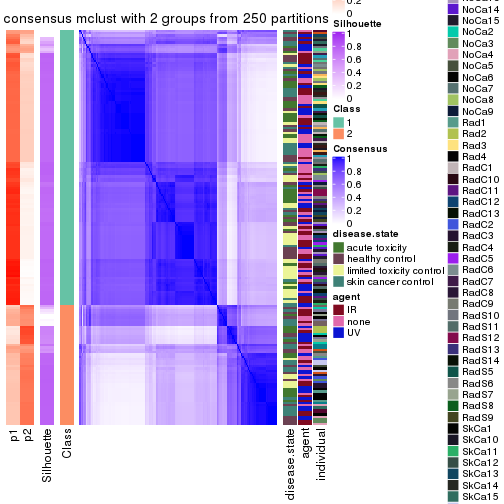</p>

</div>
<div id='tab-MAD-mclust-consensus-heatmap-2'>
<pre><code class="r">consensus_heatmap(res, k = 3)
</code></pre>

<p>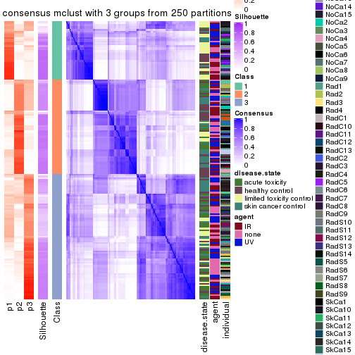</p>

</div>
<div id='tab-MAD-mclust-consensus-heatmap-3'>
<pre><code class="r">consensus_heatmap(res, k = 4)
</code></pre>

<p>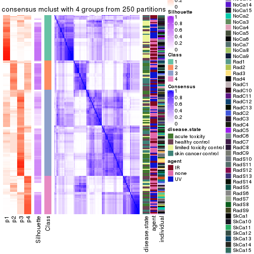</p>

</div>
<div id='tab-MAD-mclust-consensus-heatmap-4'>
<pre><code class="r">consensus_heatmap(res, k = 5)
</code></pre>

<p>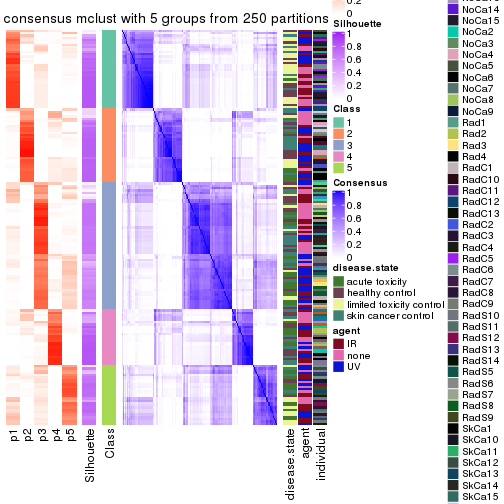</p>

</div>
<div id='tab-MAD-mclust-consensus-heatmap-5'>
<pre><code class="r">consensus_heatmap(res, k = 6)
</code></pre>

<p>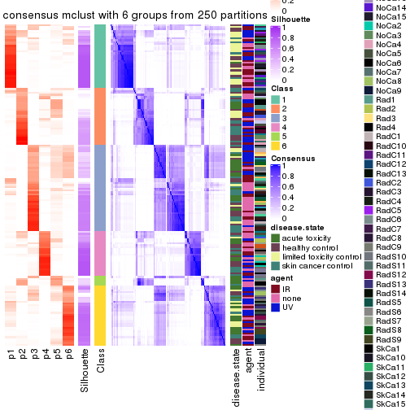</p>

</div>
</div>

Heatmaps for the membership of samples in all partitions to see how consistent they are:


<script>
$( function() {
	$( '#tabs-MAD-mclust-membership-heatmap' ).tabs();
} );
</script>
<div id='tabs-MAD-mclust-membership-heatmap'>
<ul>
<li><a href='#tab-MAD-mclust-membership-heatmap-1'>k = 2</a></li>
<li><a href='#tab-MAD-mclust-membership-heatmap-2'>k = 3</a></li>
<li><a href='#tab-MAD-mclust-membership-heatmap-3'>k = 4</a></li>
<li><a href='#tab-MAD-mclust-membership-heatmap-4'>k = 5</a></li>
<li><a href='#tab-MAD-mclust-membership-heatmap-5'>k = 6</a></li>
</ul>
<div id='tab-MAD-mclust-membership-heatmap-1'>
<pre><code class="r">membership_heatmap(res, k = 2)
</code></pre>

<p>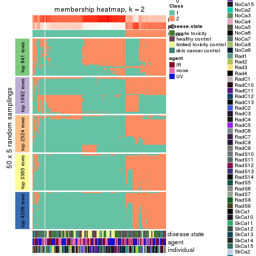</p>

</div>
<div id='tab-MAD-mclust-membership-heatmap-2'>
<pre><code class="r">membership_heatmap(res, k = 3)
</code></pre>

<p>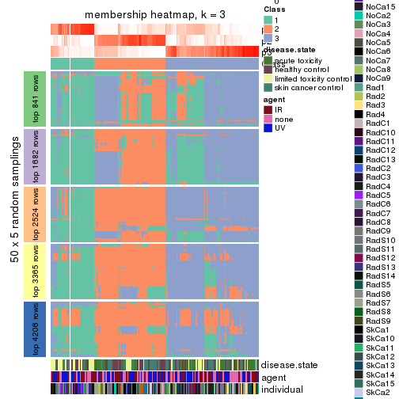</p>

</div>
<div id='tab-MAD-mclust-membership-heatmap-3'>
<pre><code class="r">membership_heatmap(res, k = 4)
</code></pre>

<p>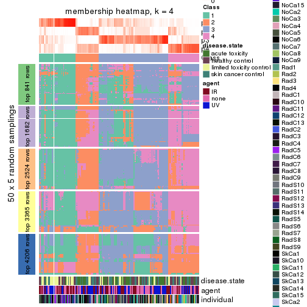</p>

</div>
<div id='tab-MAD-mclust-membership-heatmap-4'>
<pre><code class="r">membership_heatmap(res, k = 5)
</code></pre>

<p>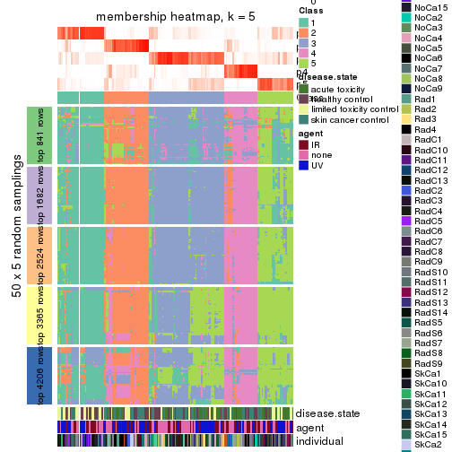</p>

</div>
<div id='tab-MAD-mclust-membership-heatmap-5'>
<pre><code class="r">membership_heatmap(res, k = 6)
</code></pre>

<p>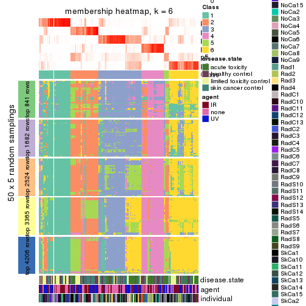</p>

</div>
</div>

As soon as we have had the classes for columns, we can look for signatures
which are significantly different between classes which can be candidate marks
for certain classes. Following are the heatmaps for signatures.


Signature heatmaps where rows are scaled:


<script>
$( function() {
	$( '#tabs-MAD-mclust-get-signatures' ).tabs();
} );
</script>
<div id='tabs-MAD-mclust-get-signatures'>
<ul>
<li><a href='#tab-MAD-mclust-get-signatures-1'>k = 2</a></li>
<li><a href='#tab-MAD-mclust-get-signatures-2'>k = 3</a></li>
<li><a href='#tab-MAD-mclust-get-signatures-3'>k = 4</a></li>
<li><a href='#tab-MAD-mclust-get-signatures-4'>k = 5</a></li>
<li><a href='#tab-MAD-mclust-get-signatures-5'>k = 6</a></li>
</ul>
<div id='tab-MAD-mclust-get-signatures-1'>
<pre><code class="r">get_signatures(res, k = 2)
</code></pre>

<p>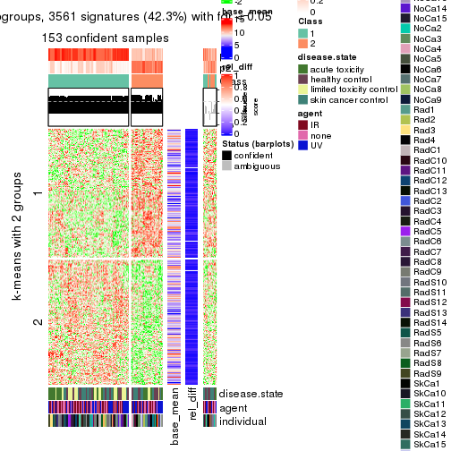</p>

</div>
<div id='tab-MAD-mclust-get-signatures-2'>
<pre><code class="r">get_signatures(res, k = 3)
</code></pre>

<p>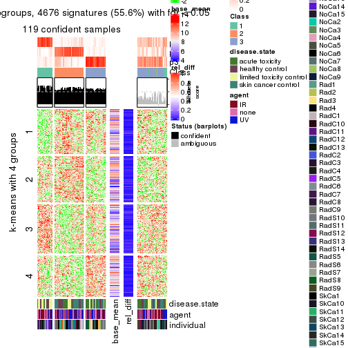</p>

</div>
<div id='tab-MAD-mclust-get-signatures-3'>
<pre><code class="r">get_signatures(res, k = 4)
</code></pre>

<p>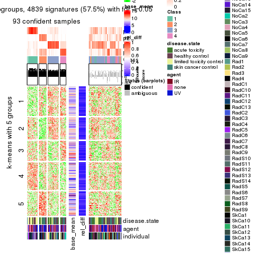</p>

</div>
<div id='tab-MAD-mclust-get-signatures-4'>
<pre><code class="r">get_signatures(res, k = 5)
</code></pre>

<p>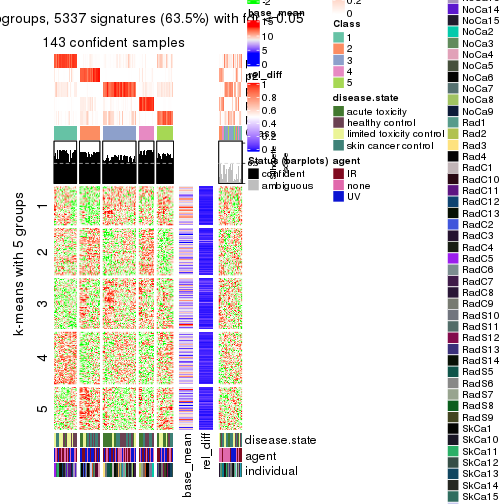</p>

</div>
<div id='tab-MAD-mclust-get-signatures-5'>
<pre><code class="r">get_signatures(res, k = 6)
</code></pre>

<p>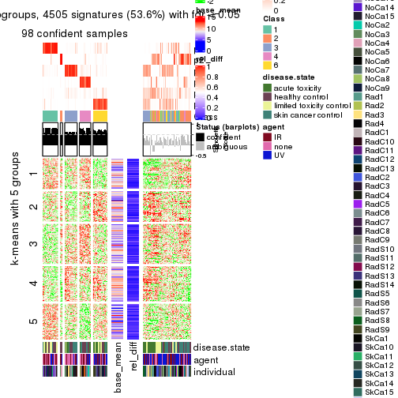</p>

</div>
</div>


Signature heatmaps where rows are not scaled:


<script>
$( function() {
	$( '#tabs-MAD-mclust-get-signatures-no-scale' ).tabs();
} );
</script>
<div id='tabs-MAD-mclust-get-signatures-no-scale'>
<ul>
<li><a href='#tab-MAD-mclust-get-signatures-no-scale-1'>k = 2</a></li>
<li><a href='#tab-MAD-mclust-get-signatures-no-scale-2'>k = 3</a></li>
<li><a href='#tab-MAD-mclust-get-signatures-no-scale-3'>k = 4</a></li>
<li><a href='#tab-MAD-mclust-get-signatures-no-scale-4'>k = 5</a></li>
<li><a href='#tab-MAD-mclust-get-signatures-no-scale-5'>k = 6</a></li>
</ul>
<div id='tab-MAD-mclust-get-signatures-no-scale-1'>
<pre><code class="r">get_signatures(res, k = 2, scale_rows = FALSE)
</code></pre>

<p>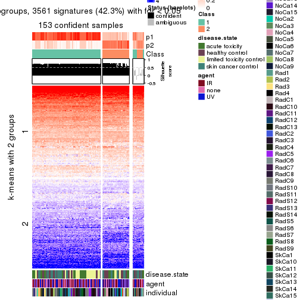</p>

</div>
<div id='tab-MAD-mclust-get-signatures-no-scale-2'>
<pre><code class="r">get_signatures(res, k = 3, scale_rows = FALSE)
</code></pre>

<p>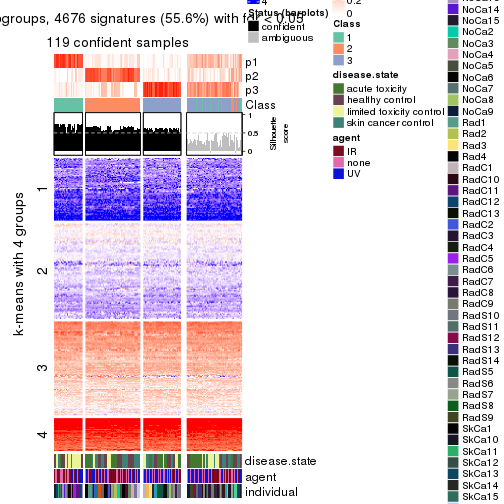</p>

</div>
<div id='tab-MAD-mclust-get-signatures-no-scale-3'>
<pre><code class="r">get_signatures(res, k = 4, scale_rows = FALSE)
</code></pre>

<p>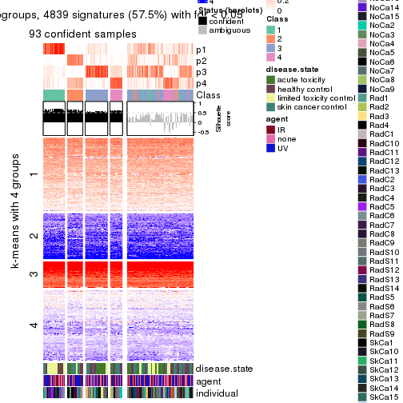</p>

</div>
<div id='tab-MAD-mclust-get-signatures-no-scale-4'>
<pre><code class="r">get_signatures(res, k = 5, scale_rows = FALSE)
</code></pre>

<p>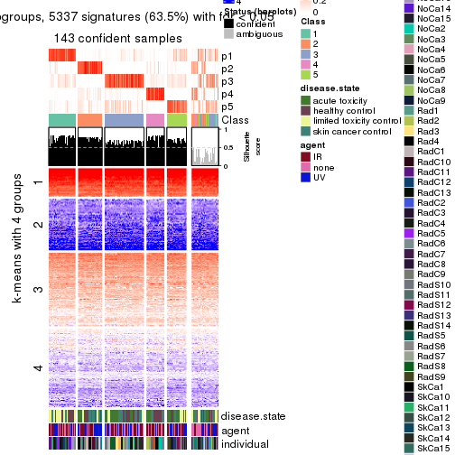</p>

</div>
<div id='tab-MAD-mclust-get-signatures-no-scale-5'>
<pre><code class="r">get_signatures(res, k = 6, scale_rows = FALSE)
</code></pre>

<p>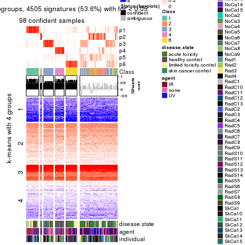</p>

</div>
</div>


Compare the overlap of signatures from different k:

```r
compare_signatures(res)
```

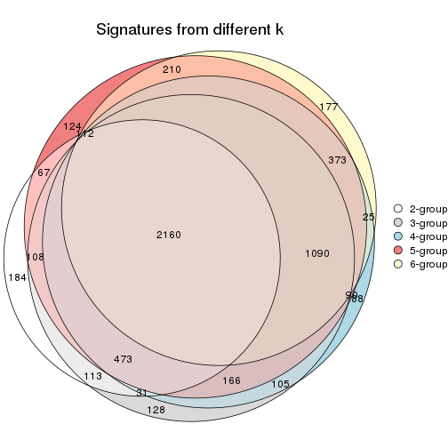

`get_signature()` returns a data frame invisibly. TO get the list of signatures, the function
call should be assigned to a variable explicitly. In following code, if `plot` argument is set
to `FALSE`, no heatmap is plotted while only the differential analysis is performed.

```r
# code only for demonstration
tb = get_signature(res, k = ..., plot = FALSE)
```

An example of the output of `tb` is:

```
#>   which_row         fdr    mean_1    mean_2 scaled_mean_1 scaled_mean_2 km
#> 1        38 0.042760348  8.373488  9.131774    -0.5533452     0.5164555  1
#> 2        40 0.018707592  7.106213  8.469186    -0.6173731     0.5762149  1
#> 3        55 0.019134737 10.221463 11.207825    -0.6159697     0.5749050  1
#> 4        59 0.006059896  5.921854  7.869574    -0.6899429     0.6439467  1
#> 5        60 0.018055526  8.928898 10.211722    -0.6204761     0.5791110  1
#> 6        98 0.009384629 15.714769 14.887706     0.6635654    -0.6193277  2
...
```

The columns in `tb` are:

1. `which_row`: row indices corresponding to the input matrix.
2. `fdr`: FDR for the differential test. 
3. `mean_x`: The mean value in group x.
4. `scaled_mean_x`: The mean value in group x after rows are scaled.
5. `km`: Row groups if k-means clustering is applied to rows.


UMAP plot which shows how samples are separated.


<script>
$( function() {
	$( '#tabs-MAD-mclust-dimension-reduction' ).tabs();
} );
</script>
<div id='tabs-MAD-mclust-dimension-reduction'>
<ul>
<li><a href='#tab-MAD-mclust-dimension-reduction-1'>k = 2</a></li>
<li><a href='#tab-MAD-mclust-dimension-reduction-2'>k = 3</a></li>
<li><a href='#tab-MAD-mclust-dimension-reduction-3'>k = 4</a></li>
<li><a href='#tab-MAD-mclust-dimension-reduction-4'>k = 5</a></li>
<li><a href='#tab-MAD-mclust-dimension-reduction-5'>k = 6</a></li>
</ul>
<div id='tab-MAD-mclust-dimension-reduction-1'>
<pre><code class="r">dimension_reduction(res, k = 2, method = &quot;UMAP&quot;)
</code></pre>

<p>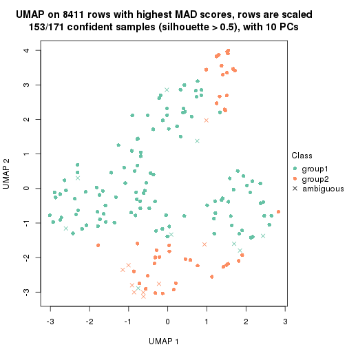</p>

</div>
<div id='tab-MAD-mclust-dimension-reduction-2'>
<pre><code class="r">dimension_reduction(res, k = 3, method = &quot;UMAP&quot;)
</code></pre>

<p>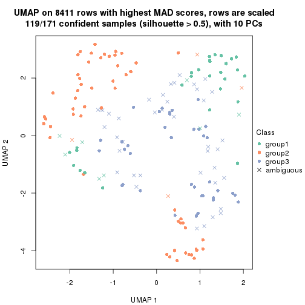</p>

</div>
<div id='tab-MAD-mclust-dimension-reduction-3'>
<pre><code class="r">dimension_reduction(res, k = 4, method = &quot;UMAP&quot;)
</code></pre>

<p>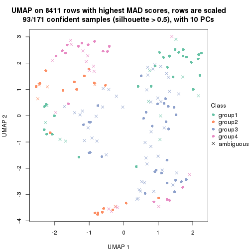</p>

</div>
<div id='tab-MAD-mclust-dimension-reduction-4'>
<pre><code class="r">dimension_reduction(res, k = 5, method = &quot;UMAP&quot;)
</code></pre>

<p>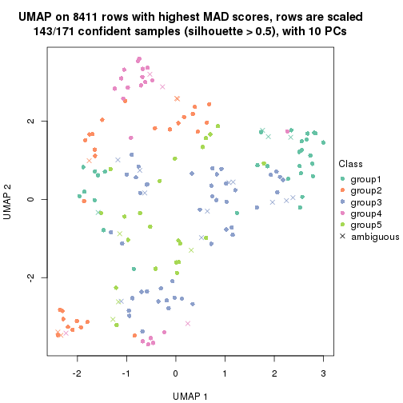</p>

</div>
<div id='tab-MAD-mclust-dimension-reduction-5'>
<pre><code class="r">dimension_reduction(res, k = 6, method = &quot;UMAP&quot;)
</code></pre>

<p>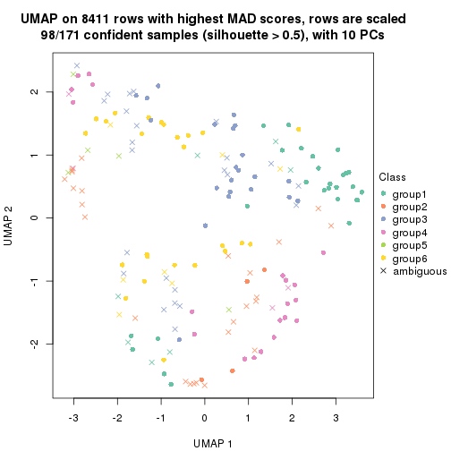</p>

</div>
</div>


Following heatmap shows how subgroups are split when increasing `k`:

```r
collect_classes(res)
```

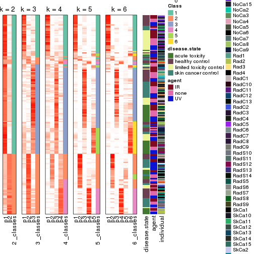


Test correlation between subgroups and known annotations. If the known
annotation is numeric, one-way ANOVA test is applied, and if the known
annotation is discrete, chi-squared contingency table test is applied.

```r
test_to_known_factors(res)
```

```
#>              n disease.state(p) agent(p) individual(p) k
#> MAD:mclust 153         1.93e-01    0.250      2.37e-10 2
#> MAD:mclust 119         6.75e-05    0.666      8.89e-14 3
#> MAD:mclust  93         2.99e-04    0.416      1.37e-12 4
#> MAD:mclust 143         6.66e-05    0.461      1.45e-26 5
#> MAD:mclust  98         4.12e-05    0.089      4.99e-15 6
```


If matrix rows can be associated to genes, consider to use `functional_enrichment(res,
...)` to perform function enrichment for the signature genes. See [this vignette](http://bioconductor.org/packages/devel/bioc/vignettes/cola/inst/doc/functional_enrichment.html) for more detailed explanations.


 

---------------------------------------------------


### MAD:NMF


The object with results only for a single top-value method and a single partition method 
can be extracted as:

```r
res = res_list["MAD", "NMF"]
# you can also extract it by
# res = res_list["MAD:NMF"]
```

A summary of `res` and all the functions that can be applied to it:

```r
res
```

```
#> A 'ConsensusPartition' object with k = 2, 3, 4, 5, 6.
#>   On a matrix with 8411 rows and 171 columns.
#>   Top rows (841, 1682, 2524, 3365, 4206) are extracted by 'MAD' method.
#>   Subgroups are detected by 'NMF' method.
#>   Performed in total 1250 partitions by row resampling.
#>   Best k for subgroups seems to be 2.
#> 
#> Following methods can be applied to this 'ConsensusPartition' object:
#>  [1] "cola_report"             "collect_classes"         "collect_plots"          
#>  [4] "collect_stats"           "colnames"                "compare_signatures"     
#>  [7] "consensus_heatmap"       "dimension_reduction"     "functional_enrichment"  
#> [10] "get_anno_col"            "get_anno"                "get_classes"            
#> [13] "get_consensus"           "get_matrix"              "get_membership"         
#> [16] "get_param"               "get_signatures"          "get_stats"              
#> [19] "is_best_k"               "is_stable_k"             "membership_heatmap"     
#> [22] "ncol"                    "nrow"                    "plot_ecdf"              
#> [25] "rownames"                "select_partition_number" "show"                   
#> [28] "suggest_best_k"          "test_to_known_factors"
```

`collect_plots()` function collects all the plots made from `res` for all `k` (number of partitions)
into one single page to provide an easy and fast comparison between different `k`.

```r
collect_plots(res)
```

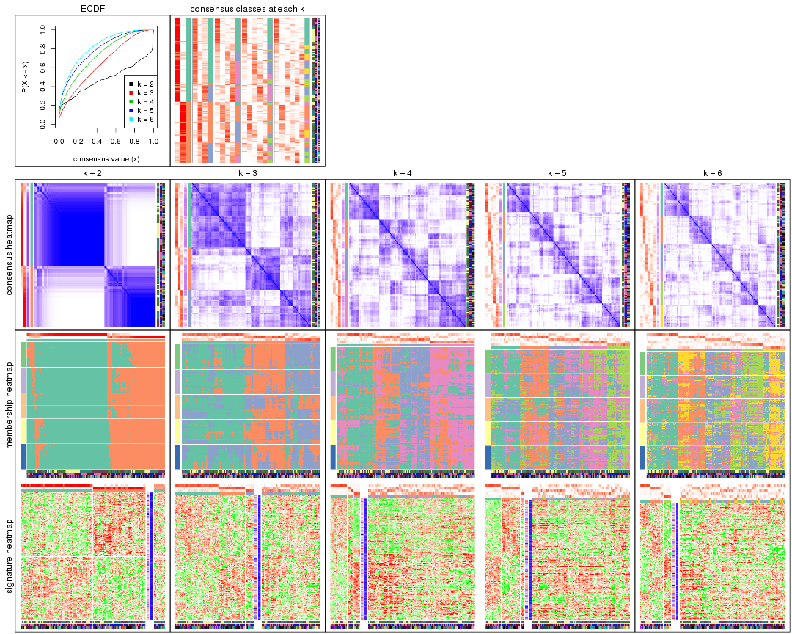

The plots are:

- The first row: a plot of the ECDF (empirical cumulative distribution
  function) curves of the consensus matrix for each `k` and the heatmap of
  predicted classes for each `k`.
- The second row: heatmaps of the consensus matrix for each `k`.
- The third row: heatmaps of the membership matrix for each `k`.
- The fouth row: heatmaps of the signatures for each `k`.

All the plots in panels can be made by individual functions and they are
plotted later in this section.

`select_partition_number()` produces several plots showing different
statistics for choosing "optimized" `k`. There are following statistics:

- ECDF curves of the consensus matrix for each `k`;
- 1-PAC. [The PAC
  score](https://en.wikipedia.org/wiki/Consensus_clustering#Over-interpretation_potential_of_consensus_clustering)
  measures the proportion of the ambiguous subgrouping.
- Mean silhouette score.
- Concordance. The mean probability of fiting the consensus class ids in all
  partitions.
- Area increased. Denote $A_k$ as the area under the ECDF curve for current
  `k`, the area increased is defined as $A_k - A_{k-1}$.
- Rand index. The percent of pairs of samples that are both in a same cluster
  or both are not in a same cluster in the partition of k and k-1.
- Jaccard index. The ratio of pairs of samples are both in a same cluster in
  the partition of k and k-1 and the pairs of samples are both in a same
  cluster in the partition k or k-1.

The detailed explanations of these statistics can be found in [the _cola_
vignette](http://bioconductor.org/packages/devel/bioc/vignettes/cola/inst/doc/cola.html#toc_13).

Generally speaking, lower PAC score, higher mean silhouette score or higher
concordance corresponds to better partition. Rand index and Jaccard index
measure how similar the current partition is compared to partition with `k-1`.
If they are too similar, we won't accept `k` is better than `k-1`.

```r
select_partition_number(res)
```

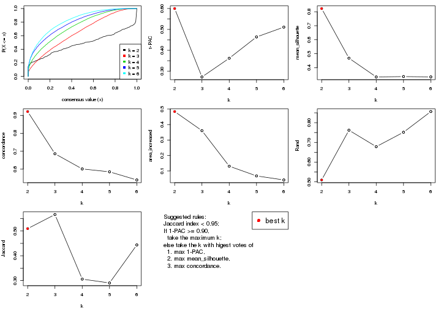

The numeric values for all these statistics can be obtained by `get_stats()`.

```r
get_stats(res)
```

```
#>   k 1-PAC mean_silhouette concordance area_increased  Rand Jaccard
#> 2 2 0.600           0.823       0.922          0.484 0.510   0.510
#> 3 3 0.272           0.468       0.686          0.361 0.762   0.566
#> 4 4 0.362           0.334       0.601          0.131 0.678   0.306
#> 5 5 0.464           0.336       0.585          0.068 0.752   0.290
#> 6 6 0.511           0.334       0.540          0.042 0.856   0.444
```

`suggest_best_k()` suggests the best $k$ based on these statistics. The rules are as follows:

- All $k$ with Jaccard index larger than 0.95 are removed because increasing
  $k$ does not provide enough extra information. If all $k$ are removed, it is
  marked as no subgroup is detected.
- For all $k$ with 1-PAC score larger than 0.9, the maximal $k$ is taken as
  the best $k$, and other $k$ are marked as optional $k$.
- If it does not fit the second rule. The $k$ with the maximal vote of the
  highest 1-PAC score, highest mean silhouette, and highest concordance is
  taken as the best $k$.

```r
suggest_best_k(res)
```

```
#> [1] 2
```


Following shows the table of the partitions (You need to click the **show/hide
code output** link to see it). The membership matrix (columns with name `p*`)
is inferred by
[`clue::cl_consensus()`](https://www.rdocumentation.org/link/cl_consensus?package=clue)
function with the `SE` method. Basically the value in the membership matrix
represents the probability to belong to a certain group. The finall class
label for an item is determined with the group with highest probability it
belongs to.

In `get_classes()` function, the entropy is calculated from the membership
matrix and the silhouette score is calculated from the consensus matrix.


<script>
$( function() {
	$( '#tabs-MAD-NMF-get-classes' ).tabs();
} );
</script>
<div id='tabs-MAD-NMF-get-classes'>
<ul>
<li><a href='#tab-MAD-NMF-get-classes-1'>k = 2</a></li>
<li><a href='#tab-MAD-NMF-get-classes-2'>k = 3</a></li>
<li><a href='#tab-MAD-NMF-get-classes-3'>k = 4</a></li>
<li><a href='#tab-MAD-NMF-get-classes-4'>k = 5</a></li>
<li><a href='#tab-MAD-NMF-get-classes-5'>k = 6</a></li>
</ul>

<div id='tab-MAD-NMF-get-classes-1'>
<p><a id='tab-MAD-NMF-get-classes-1-a' style='color:#0366d6' href='#'>show/hide code output</a></p>
<pre><code class="r">cbind(get_classes(res, k = 2), get_membership(res, k = 2))
</code></pre>

<pre><code>#&gt;          class entropy silhouette    p1    p2
#&gt; GSM29783     2  0.4939     0.8403 0.108 0.892
#&gt; GSM29786     2  0.7528     0.7546 0.216 0.784
#&gt; GSM29789     2  0.0000     0.8827 0.000 1.000
#&gt; GSM29792     2  0.0000     0.8827 0.000 1.000
#&gt; GSM29795     2  0.8555     0.6755 0.280 0.720
#&gt; GSM29798     1  0.9358     0.3805 0.648 0.352
#&gt; GSM29801     1  0.0000     0.9294 1.000 0.000
#&gt; GSM29804     1  0.0000     0.9294 1.000 0.000
#&gt; GSM29807     2  0.4298     0.8347 0.088 0.912
#&gt; GSM29816     1  0.0000     0.9294 1.000 0.000
#&gt; GSM29821     1  0.0000     0.9294 1.000 0.000
#&gt; GSM29824     1  0.0000     0.9294 1.000 0.000
#&gt; GSM29827     1  0.0000     0.9294 1.000 0.000
#&gt; GSM29830     1  0.0000     0.9294 1.000 0.000
#&gt; GSM29833     1  0.1843     0.9116 0.972 0.028
#&gt; GSM29784     2  0.5737     0.8233 0.136 0.864
#&gt; GSM29787     2  0.9686     0.4520 0.396 0.604
#&gt; GSM29790     2  0.0000     0.8827 0.000 1.000
#&gt; GSM29793     2  0.0000     0.8827 0.000 1.000
#&gt; GSM29796     2  0.7299     0.7691 0.204 0.796
#&gt; GSM29799     1  0.0000     0.9294 1.000 0.000
#&gt; GSM29802     1  0.0000     0.9294 1.000 0.000
#&gt; GSM29805     1  0.0000     0.9294 1.000 0.000
#&gt; GSM29814     2  0.9896     0.1953 0.440 0.560
#&gt; GSM29817     1  0.0000     0.9294 1.000 0.000
#&gt; GSM29822     1  0.0000     0.9294 1.000 0.000
#&gt; GSM29825     1  0.0000     0.9294 1.000 0.000
#&gt; GSM29828     1  0.0000     0.9294 1.000 0.000
#&gt; GSM29831     1  0.0000     0.9294 1.000 0.000
#&gt; GSM29834     1  0.0000     0.9294 1.000 0.000
#&gt; GSM29785     2  0.0000     0.8827 0.000 1.000
#&gt; GSM29788     2  0.6048     0.8136 0.148 0.852
#&gt; GSM29791     2  0.0000     0.8827 0.000 1.000
#&gt; GSM29794     2  0.0000     0.8827 0.000 1.000
#&gt; GSM29797     2  0.0000     0.8827 0.000 1.000
#&gt; GSM29800     2  0.7950     0.7266 0.240 0.760
#&gt; GSM29803     1  0.9323     0.3900 0.652 0.348
#&gt; GSM29806     1  0.6438     0.7717 0.836 0.164
#&gt; GSM29815     2  0.0000     0.8827 0.000 1.000
#&gt; GSM29819     1  0.0000     0.9294 1.000 0.000
#&gt; GSM29823     1  0.9552     0.3089 0.624 0.376
#&gt; GSM29826     1  0.0000     0.9294 1.000 0.000
#&gt; GSM29829     1  0.3114     0.8911 0.944 0.056
#&gt; GSM29832     1  0.6148     0.7780 0.848 0.152
#&gt; GSM29835     2  0.9522     0.5056 0.372 0.628
#&gt; GSM29836     2  0.0000     0.8827 0.000 1.000
#&gt; GSM29839     2  0.6973     0.7823 0.188 0.812
#&gt; GSM29842     2  0.2236     0.8736 0.036 0.964
#&gt; GSM29845     1  0.9661     0.2619 0.608 0.392
#&gt; GSM29848     2  0.9850     0.3691 0.428 0.572
#&gt; GSM29851     1  0.0000     0.9294 1.000 0.000
#&gt; GSM29854     1  0.0000     0.9294 1.000 0.000
#&gt; GSM29857     1  0.0000     0.9294 1.000 0.000
#&gt; GSM29860     2  0.0000     0.8827 0.000 1.000
#&gt; GSM29863     1  0.0000     0.9294 1.000 0.000
#&gt; GSM29866     1  0.0000     0.9294 1.000 0.000
#&gt; GSM29869     1  0.0000     0.9294 1.000 0.000
#&gt; GSM29872     2  0.5946     0.7854 0.144 0.856
#&gt; GSM29875     1  0.0000     0.9294 1.000 0.000
#&gt; GSM29878     2  0.0000     0.8827 0.000 1.000
#&gt; GSM29837     2  0.0000     0.8827 0.000 1.000
#&gt; GSM29840     2  0.7056     0.7800 0.192 0.808
#&gt; GSM29843     2  0.1633     0.8778 0.024 0.976
#&gt; GSM29846     1  0.3584     0.8784 0.932 0.068
#&gt; GSM29849     1  0.2043     0.9085 0.968 0.032
#&gt; GSM29852     1  0.0000     0.9294 1.000 0.000
#&gt; GSM29855     1  0.0000     0.9294 1.000 0.000
#&gt; GSM29858     1  0.0000     0.9294 1.000 0.000
#&gt; GSM29861     2  0.0000     0.8827 0.000 1.000
#&gt; GSM29864     1  0.0000     0.9294 1.000 0.000
#&gt; GSM29867     1  0.0000     0.9294 1.000 0.000
#&gt; GSM29870     1  0.0000     0.9294 1.000 0.000
#&gt; GSM29873     1  0.9323     0.4682 0.652 0.348
#&gt; GSM29876     1  0.0000     0.9294 1.000 0.000
#&gt; GSM29879     1  0.4815     0.8401 0.896 0.104
#&gt; GSM29838     2  0.0000     0.8827 0.000 1.000
#&gt; GSM29841     2  0.0938     0.8807 0.012 0.988
#&gt; GSM29844     2  0.0000     0.8827 0.000 1.000
#&gt; GSM29847     2  0.6623     0.7971 0.172 0.828
#&gt; GSM29850     2  0.8499     0.6798 0.276 0.724
#&gt; GSM29853     1  0.0672     0.9250 0.992 0.008
#&gt; GSM29856     2  0.9000     0.6168 0.316 0.684
#&gt; GSM29859     2  0.8861     0.5535 0.304 0.696
#&gt; GSM29862     2  0.0000     0.8827 0.000 1.000
#&gt; GSM29865     2  1.0000     0.1500 0.496 0.504
#&gt; GSM29868     1  0.9993    -0.0741 0.516 0.484
#&gt; GSM29871     1  0.9129     0.5114 0.672 0.328
#&gt; GSM29874     2  0.0000     0.8827 0.000 1.000
#&gt; GSM29877     1  0.0000     0.9294 1.000 0.000
#&gt; GSM29880     2  0.0000     0.8827 0.000 1.000
#&gt; GSM29881     1  0.0376     0.9274 0.996 0.004
#&gt; GSM29884     2  0.0000     0.8827 0.000 1.000
#&gt; GSM29887     2  0.0000     0.8827 0.000 1.000
#&gt; GSM29890     1  0.0000     0.9294 1.000 0.000
#&gt; GSM29893     1  0.0000     0.9294 1.000 0.000
#&gt; GSM29896     1  0.0000     0.9294 1.000 0.000
#&gt; GSM29899     1  0.0000     0.9294 1.000 0.000
#&gt; GSM29902     1  0.0938     0.9224 0.988 0.012
#&gt; GSM29905     1  0.0000     0.9294 1.000 0.000
#&gt; GSM29908     1  0.0000     0.9294 1.000 0.000
#&gt; GSM29955     1  0.2423     0.9043 0.960 0.040
#&gt; GSM29958     1  0.0000     0.9294 1.000 0.000
#&gt; GSM29961     1  0.0672     0.9256 0.992 0.008
#&gt; GSM29882     1  0.0000     0.9294 1.000 0.000
#&gt; GSM29885     2  0.2948     0.8676 0.052 0.948
#&gt; GSM29888     2  0.0000     0.8827 0.000 1.000
#&gt; GSM29891     1  0.0000     0.9294 1.000 0.000
#&gt; GSM29894     1  0.0000     0.9294 1.000 0.000
#&gt; GSM29897     1  0.0000     0.9294 1.000 0.000
#&gt; GSM29900     1  0.0000     0.9294 1.000 0.000
#&gt; GSM29903     1  0.0000     0.9294 1.000 0.000
#&gt; GSM29906     1  0.0000     0.9294 1.000 0.000
#&gt; GSM29909     1  0.1414     0.9175 0.980 0.020
#&gt; GSM29956     1  0.0000     0.9294 1.000 0.000
#&gt; GSM29959     1  0.0000     0.9294 1.000 0.000
#&gt; GSM29962     1  0.0000     0.9294 1.000 0.000
#&gt; GSM29883     1  0.0376     0.9273 0.996 0.004
#&gt; GSM29886     2  0.0000     0.8827 0.000 1.000
#&gt; GSM29889     2  0.0000     0.8827 0.000 1.000
#&gt; GSM29892     1  0.0376     0.9274 0.996 0.004
#&gt; GSM29895     2  0.7453     0.7613 0.212 0.788
#&gt; GSM29898     1  0.1184     0.9199 0.984 0.016
#&gt; GSM29901     1  0.0000     0.9294 1.000 0.000
#&gt; GSM29904     2  0.9552     0.3965 0.376 0.624
#&gt; GSM29907     1  0.1843     0.9130 0.972 0.028
#&gt; GSM29910     2  0.0938     0.8806 0.012 0.988
#&gt; GSM29957     2  0.0000     0.8827 0.000 1.000
#&gt; GSM29960     1  0.9983    -0.0634 0.524 0.476
#&gt; GSM29963     2  0.1184     0.8797 0.016 0.984
#&gt; GSM29964     2  0.0000     0.8827 0.000 1.000
#&gt; GSM29967     2  0.3431     0.8622 0.064 0.936
#&gt; GSM29970     1  0.1414     0.9188 0.980 0.020
#&gt; GSM29973     2  0.0000     0.8827 0.000 1.000
#&gt; GSM29976     1  0.0000     0.9294 1.000 0.000
#&gt; GSM29979     2  0.0000     0.8827 0.000 1.000
#&gt; GSM29982     2  0.8861     0.6357 0.304 0.696
#&gt; GSM29985     1  0.0000     0.9294 1.000 0.000
#&gt; GSM29988     2  0.9635     0.3471 0.388 0.612
#&gt; GSM29991     1  0.5842     0.7964 0.860 0.140
#&gt; GSM29994     1  0.3584     0.8760 0.932 0.068
#&gt; GSM29997     1  0.7299     0.7191 0.796 0.204
#&gt; GSM30000     1  0.9000     0.5454 0.684 0.316
#&gt; GSM30003     1  0.0000     0.9294 1.000 0.000
#&gt; GSM29965     2  0.0000     0.8827 0.000 1.000
#&gt; GSM29968     2  0.4298     0.8505 0.088 0.912
#&gt; GSM29971     1  0.0000     0.9294 1.000 0.000
#&gt; GSM29974     2  0.0000     0.8827 0.000 1.000
#&gt; GSM29977     1  0.0000     0.9294 1.000 0.000
#&gt; GSM29980     2  0.5059     0.8185 0.112 0.888
#&gt; GSM29983     1  0.0000     0.9294 1.000 0.000
#&gt; GSM29986     1  0.0000     0.9294 1.000 0.000
#&gt; GSM29989     1  0.8713     0.5815 0.708 0.292
#&gt; GSM29992     1  0.0000     0.9294 1.000 0.000
#&gt; GSM29995     1  0.0672     0.9250 0.992 0.008
#&gt; GSM29998     1  0.6887     0.7453 0.816 0.184
#&gt; GSM30001     1  0.0938     0.9225 0.988 0.012
#&gt; GSM30004     1  0.0000     0.9294 1.000 0.000
#&gt; GSM29966     2  0.0000     0.8827 0.000 1.000
#&gt; GSM29969     2  0.0672     0.8814 0.008 0.992
#&gt; GSM29972     2  0.7376     0.7645 0.208 0.792
#&gt; GSM29975     2  0.0000     0.8827 0.000 1.000
#&gt; GSM29978     1  0.0000     0.9294 1.000 0.000
#&gt; GSM29981     2  0.0000     0.8827 0.000 1.000
#&gt; GSM29984     2  0.7745     0.7425 0.228 0.772
#&gt; GSM29987     1  0.5946     0.7884 0.856 0.144
#&gt; GSM29990     2  0.0000     0.8827 0.000 1.000
#&gt; GSM29993     2  0.6801     0.7906 0.180 0.820
#&gt; GSM29996     1  0.7376     0.7208 0.792 0.208
#&gt; GSM29999     1  0.9775     0.3072 0.588 0.412
#&gt; GSM30002     2  0.0000     0.8827 0.000 1.000
#&gt; GSM30005     1  0.4161     0.8596 0.916 0.084
</code></pre>

<script>
$('#tab-MAD-NMF-get-classes-1-a').parent().next().next().hide();
$('#tab-MAD-NMF-get-classes-1-a').click(function(){
  $('#tab-MAD-NMF-get-classes-1-a').parent().next().next().toggle();
  return(false);
});
</script>
</div>

<div id='tab-MAD-NMF-get-classes-2'>
<p><a id='tab-MAD-NMF-get-classes-2-a' style='color:#0366d6' href='#'>show/hide code output</a></p>
<pre><code class="r">cbind(get_classes(res, k = 3), get_membership(res, k = 3))
</code></pre>

<pre><code>#&gt;          class entropy silhouette    p1    p2    p3
#&gt; GSM29783     3   0.685    0.07671 0.016 0.416 0.568
#&gt; GSM29786     3   0.520    0.47471 0.008 0.220 0.772
#&gt; GSM29789     2   0.481    0.61879 0.008 0.804 0.188
#&gt; GSM29792     2   0.433    0.64492 0.012 0.844 0.144
#&gt; GSM29795     3   0.748    0.34613 0.076 0.264 0.660
#&gt; GSM29798     3   0.367    0.59267 0.092 0.020 0.888
#&gt; GSM29801     1   0.659    0.36766 0.568 0.008 0.424
#&gt; GSM29804     1   0.175    0.66813 0.952 0.000 0.048
#&gt; GSM29807     2   0.800    0.49848 0.224 0.648 0.128
#&gt; GSM29816     1   0.445    0.62236 0.808 0.000 0.192
#&gt; GSM29821     3   0.739    0.10790 0.380 0.040 0.580
#&gt; GSM29824     1   0.445    0.66190 0.836 0.012 0.152
#&gt; GSM29827     1   0.576    0.62638 0.800 0.076 0.124
#&gt; GSM29830     1   0.551    0.63159 0.784 0.028 0.188
#&gt; GSM29833     1   0.820    0.46512 0.596 0.100 0.304
#&gt; GSM29784     3   0.458    0.47413 0.004 0.184 0.812
#&gt; GSM29787     3   0.397    0.57406 0.044 0.072 0.884
#&gt; GSM29790     2   0.628    0.35503 0.000 0.540 0.460
#&gt; GSM29793     2   0.562    0.57351 0.008 0.732 0.260
#&gt; GSM29796     3   0.556    0.48754 0.028 0.192 0.780
#&gt; GSM29799     3   0.480    0.48949 0.220 0.000 0.780
#&gt; GSM29802     1   0.603    0.43063 0.624 0.000 0.376
#&gt; GSM29805     1   0.445    0.63225 0.808 0.000 0.192
#&gt; GSM29814     2   0.921    0.20043 0.356 0.484 0.160
#&gt; GSM29817     3   0.626    0.01699 0.448 0.000 0.552
#&gt; GSM29822     1   0.631    0.16881 0.508 0.000 0.492
#&gt; GSM29825     1   0.493    0.59823 0.768 0.000 0.232
#&gt; GSM29828     1   0.423    0.64268 0.836 0.004 0.160
#&gt; GSM29831     1   0.417    0.64711 0.840 0.004 0.156
#&gt; GSM29834     1   0.636    0.55882 0.684 0.020 0.296
#&gt; GSM29785     2   0.608    0.37128 0.000 0.612 0.388
#&gt; GSM29788     3   0.576    0.33547 0.000 0.328 0.672
#&gt; GSM29791     2   0.406    0.62420 0.000 0.836 0.164
#&gt; GSM29794     2   0.334    0.65001 0.000 0.880 0.120
#&gt; GSM29797     2   0.626    0.15871 0.000 0.552 0.448
#&gt; GSM29800     3   0.458    0.49879 0.004 0.184 0.812
#&gt; GSM29803     3   0.761    0.54928 0.216 0.108 0.676
#&gt; GSM29806     1   0.919    0.30415 0.512 0.172 0.316
#&gt; GSM29815     2   0.567    0.62350 0.060 0.800 0.140
#&gt; GSM29819     1   0.691    0.33448 0.584 0.020 0.396
#&gt; GSM29823     3   0.692    0.50095 0.132 0.132 0.736
#&gt; GSM29826     1   0.520    0.57332 0.772 0.008 0.220
#&gt; GSM29829     1   0.753    0.54789 0.684 0.208 0.108
#&gt; GSM29832     1   0.781    0.54578 0.672 0.184 0.144
#&gt; GSM29835     3   0.844    0.28696 0.132 0.268 0.600
#&gt; GSM29836     2   0.280    0.65853 0.000 0.908 0.092
#&gt; GSM29839     3   0.764    0.16009 0.052 0.372 0.576
#&gt; GSM29842     2   0.682    0.28768 0.012 0.512 0.476
#&gt; GSM29845     3   0.383    0.58563 0.100 0.020 0.880
#&gt; GSM29848     3   0.409    0.57333 0.028 0.100 0.872
#&gt; GSM29851     1   0.583    0.52860 0.660 0.000 0.340
#&gt; GSM29854     1   0.611    0.49480 0.688 0.012 0.300
#&gt; GSM29857     1   0.518    0.62242 0.812 0.032 0.156
#&gt; GSM29860     2   0.249    0.66276 0.016 0.936 0.048
#&gt; GSM29863     3   0.739   -0.07421 0.460 0.032 0.508
#&gt; GSM29866     1   0.499    0.64156 0.816 0.024 0.160
#&gt; GSM29869     1   0.585    0.63424 0.796 0.080 0.124
#&gt; GSM29872     2   0.681    0.51727 0.228 0.712 0.060
#&gt; GSM29875     1   0.550    0.58570 0.708 0.000 0.292
#&gt; GSM29878     2   0.732    0.54308 0.104 0.700 0.196
#&gt; GSM29837     2   0.343    0.65971 0.004 0.884 0.112
#&gt; GSM29840     3   0.625    0.41739 0.036 0.232 0.732
#&gt; GSM29843     3   0.596    0.32248 0.016 0.264 0.720
#&gt; GSM29846     3   0.410    0.56520 0.140 0.008 0.852
#&gt; GSM29849     3   0.418    0.53614 0.172 0.000 0.828
#&gt; GSM29852     1   0.601    0.44955 0.628 0.000 0.372
#&gt; GSM29855     3   0.629    0.00811 0.464 0.000 0.536
#&gt; GSM29858     1   0.453    0.62672 0.824 0.008 0.168
#&gt; GSM29861     2   0.441    0.64930 0.016 0.844 0.140
#&gt; GSM29864     3   0.627    0.01799 0.452 0.000 0.548
#&gt; GSM29867     1   0.406    0.65171 0.836 0.000 0.164
#&gt; GSM29870     1   0.412    0.64948 0.832 0.000 0.168
#&gt; GSM29873     1   0.774    0.19578 0.548 0.400 0.052
#&gt; GSM29876     1   0.579    0.49166 0.668 0.000 0.332
#&gt; GSM29879     1   0.898    0.40905 0.532 0.152 0.316
#&gt; GSM29838     2   0.334    0.65904 0.000 0.880 0.120
#&gt; GSM29841     2   0.615    0.28695 0.000 0.592 0.408
#&gt; GSM29844     2   0.543    0.51815 0.000 0.716 0.284
#&gt; GSM29847     3   0.465    0.48758 0.000 0.208 0.792
#&gt; GSM29850     3   0.468    0.51242 0.004 0.192 0.804
#&gt; GSM29853     3   0.692    0.07266 0.400 0.020 0.580
#&gt; GSM29856     2   0.805   -0.08421 0.064 0.500 0.436
#&gt; GSM29859     2   0.922    0.35462 0.256 0.532 0.212
#&gt; GSM29862     2   0.164    0.66726 0.000 0.956 0.044
#&gt; GSM29865     3   0.721    0.53095 0.100 0.192 0.708
#&gt; GSM29868     2   0.893   -0.04892 0.420 0.456 0.124
#&gt; GSM29871     1   0.882    0.20898 0.512 0.364 0.124
#&gt; GSM29874     2   0.268    0.65561 0.040 0.932 0.028
#&gt; GSM29877     1   0.601    0.40089 0.628 0.000 0.372
#&gt; GSM29880     2   0.303    0.66422 0.012 0.912 0.076
#&gt; GSM29881     3   0.641    0.15423 0.420 0.004 0.576
#&gt; GSM29884     2   0.562    0.53774 0.000 0.692 0.308
#&gt; GSM29887     2   0.450    0.63468 0.000 0.804 0.196
#&gt; GSM29890     1   0.188    0.66927 0.952 0.004 0.044
#&gt; GSM29893     1   0.788    0.54443 0.640 0.100 0.260
#&gt; GSM29896     1   0.413    0.65962 0.856 0.012 0.132
#&gt; GSM29899     1   0.353    0.66974 0.884 0.008 0.108
#&gt; GSM29902     1   0.564    0.59465 0.784 0.180 0.036
#&gt; GSM29905     1   0.362    0.64389 0.884 0.104 0.012
#&gt; GSM29908     1   0.756    0.56350 0.692 0.152 0.156
#&gt; GSM29955     1   0.787    0.52908 0.660 0.216 0.124
#&gt; GSM29958     1   0.710    0.58132 0.704 0.080 0.216
#&gt; GSM29961     1   0.772    0.54965 0.680 0.156 0.164
#&gt; GSM29882     3   0.627    0.04355 0.452 0.000 0.548
#&gt; GSM29885     3   0.575    0.27023 0.004 0.296 0.700
#&gt; GSM29888     2   0.639    0.42522 0.004 0.584 0.412
#&gt; GSM29891     1   0.254    0.66257 0.920 0.000 0.080
#&gt; GSM29894     1   0.529    0.58830 0.732 0.000 0.268
#&gt; GSM29897     1   0.502    0.61268 0.760 0.000 0.240
#&gt; GSM29900     1   0.412    0.64058 0.832 0.000 0.168
#&gt; GSM29903     1   0.355    0.65926 0.900 0.036 0.064
#&gt; GSM29906     1   0.270    0.66241 0.928 0.016 0.056
#&gt; GSM29909     1   0.684    0.64591 0.732 0.088 0.180
#&gt; GSM29956     1   0.574    0.62032 0.784 0.044 0.172
#&gt; GSM29959     1   0.507    0.62107 0.772 0.004 0.224
#&gt; GSM29962     1   0.527    0.62582 0.776 0.012 0.212
#&gt; GSM29883     3   0.628    0.23591 0.384 0.004 0.612
#&gt; GSM29886     2   0.588    0.45584 0.000 0.652 0.348
#&gt; GSM29889     2   0.470    0.61412 0.000 0.788 0.212
#&gt; GSM29892     1   0.447    0.63715 0.852 0.120 0.028
#&gt; GSM29895     2   0.873    0.09399 0.108 0.472 0.420
#&gt; GSM29898     1   0.609    0.63593 0.784 0.092 0.124
#&gt; GSM29901     1   0.585    0.61454 0.776 0.044 0.180
#&gt; GSM29904     2   0.793    0.22437 0.384 0.552 0.064
#&gt; GSM29907     1   0.689    0.53683 0.704 0.236 0.060
#&gt; GSM29910     2   0.659    0.55363 0.156 0.752 0.092
#&gt; GSM29957     2   0.453    0.62731 0.104 0.856 0.040
#&gt; GSM29960     1   0.962    0.23771 0.448 0.336 0.216
#&gt; GSM29963     2   0.573    0.58055 0.164 0.788 0.048
#&gt; GSM29964     2   0.369    0.65305 0.000 0.860 0.140
#&gt; GSM29967     3   0.603    0.29954 0.004 0.336 0.660
#&gt; GSM29970     1   0.781    0.17468 0.512 0.052 0.436
#&gt; GSM29973     2   0.319    0.66122 0.000 0.888 0.112
#&gt; GSM29976     1   0.463    0.62011 0.808 0.004 0.188
#&gt; GSM29979     2   0.374    0.66419 0.036 0.892 0.072
#&gt; GSM29982     3   0.564    0.47711 0.016 0.232 0.752
#&gt; GSM29985     1   0.672    0.35851 0.604 0.016 0.380
#&gt; GSM29988     2   0.909    0.36482 0.296 0.532 0.172
#&gt; GSM29991     1   0.831    0.34742 0.556 0.092 0.352
#&gt; GSM29994     1   0.619    0.58562 0.764 0.176 0.060
#&gt; GSM29997     1   0.645    0.50601 0.704 0.264 0.032
#&gt; GSM30000     1   0.853    0.24605 0.536 0.360 0.104
#&gt; GSM30003     1   0.334    0.65054 0.880 0.000 0.120
#&gt; GSM29965     2   0.639    0.53638 0.024 0.692 0.284
#&gt; GSM29968     3   0.506    0.42347 0.000 0.244 0.756
#&gt; GSM29971     3   0.681    0.01185 0.464 0.012 0.524
#&gt; GSM29974     2   0.329    0.66346 0.008 0.896 0.096
#&gt; GSM29977     1   0.489    0.59585 0.772 0.000 0.228
#&gt; GSM29980     2   0.867    0.42348 0.168 0.592 0.240
#&gt; GSM29983     3   0.525    0.44867 0.224 0.008 0.768
#&gt; GSM29986     3   0.611    0.20669 0.396 0.000 0.604
#&gt; GSM29989     1   0.895    0.29274 0.532 0.320 0.148
#&gt; GSM29992     1   0.636    0.45870 0.652 0.012 0.336
#&gt; GSM29995     1   0.536    0.64256 0.820 0.064 0.116
#&gt; GSM29998     1   0.709    0.53640 0.708 0.208 0.084
#&gt; GSM30001     1   0.701    0.55631 0.712 0.080 0.208
#&gt; GSM30004     1   0.493    0.61068 0.768 0.000 0.232
#&gt; GSM29966     2   0.334    0.66155 0.000 0.880 0.120
#&gt; GSM29969     3   0.613    0.17472 0.000 0.400 0.600
#&gt; GSM29972     3   0.911    0.02364 0.140 0.428 0.432
#&gt; GSM29975     2   0.341    0.65800 0.000 0.876 0.124
#&gt; GSM29978     1   0.594    0.60030 0.760 0.036 0.204
#&gt; GSM29981     2   0.240    0.67004 0.004 0.932 0.064
#&gt; GSM29984     3   0.536    0.42209 0.000 0.276 0.724
#&gt; GSM29987     3   0.749    0.30929 0.324 0.056 0.620
#&gt; GSM29990     2   0.623    0.59565 0.172 0.764 0.064
#&gt; GSM29993     3   0.932    0.06572 0.164 0.388 0.448
#&gt; GSM29996     1   0.798    0.21674 0.536 0.400 0.064
#&gt; GSM29999     2   0.935    0.12827 0.384 0.448 0.168
#&gt; GSM30002     2   0.675    0.58550 0.092 0.740 0.168
#&gt; GSM30005     1   0.770    0.31986 0.560 0.052 0.388
</code></pre>

<script>
$('#tab-MAD-NMF-get-classes-2-a').parent().next().next().hide();
$('#tab-MAD-NMF-get-classes-2-a').click(function(){
  $('#tab-MAD-NMF-get-classes-2-a').parent().next().next().toggle();
  return(false);
});
</script>
</div>

<div id='tab-MAD-NMF-get-classes-3'>
<p><a id='tab-MAD-NMF-get-classes-3-a' style='color:#0366d6' href='#'>show/hide code output</a></p>
<pre><code class="r">cbind(get_classes(res, k = 4), get_membership(res, k = 4))
</code></pre>

<pre><code>#&gt;          class entropy silhouette    p1    p2    p3    p4
#&gt; GSM29783     2   0.815    0.32542 0.016 0.416 0.216 0.352
#&gt; GSM29786     4   0.583    0.14201 0.004 0.368 0.032 0.596
#&gt; GSM29789     2   0.662    0.43420 0.120 0.624 0.252 0.004
#&gt; GSM29792     2   0.683    0.38648 0.144 0.584 0.272 0.000
#&gt; GSM29795     2   0.699    0.04238 0.420 0.492 0.016 0.072
#&gt; GSM29798     4   0.613    0.11218 0.052 0.400 0.000 0.548
#&gt; GSM29801     1   0.684    0.38289 0.600 0.180 0.000 0.220
#&gt; GSM29804     1   0.712    0.16371 0.524 0.000 0.148 0.328
#&gt; GSM29807     3   0.383    0.51675 0.052 0.052 0.868 0.028
#&gt; GSM29816     4   0.631    0.39971 0.288 0.004 0.080 0.628
#&gt; GSM29821     1   0.742    0.25330 0.500 0.304 0.000 0.196
#&gt; GSM29824     1   0.773    0.37385 0.560 0.028 0.176 0.236
#&gt; GSM29827     1   0.229    0.61890 0.924 0.012 0.060 0.004
#&gt; GSM29830     1   0.248    0.64048 0.916 0.052 0.000 0.032
#&gt; GSM29833     1   0.448    0.50088 0.748 0.240 0.004 0.008
#&gt; GSM29784     2   0.595    0.27558 0.024 0.584 0.012 0.380
#&gt; GSM29787     4   0.532    0.15021 0.008 0.396 0.004 0.592
#&gt; GSM29790     2   0.665    0.51117 0.028 0.680 0.164 0.128
#&gt; GSM29793     2   0.684    0.47908 0.104 0.656 0.208 0.032
#&gt; GSM29796     2   0.671    0.36682 0.176 0.616 0.000 0.208
#&gt; GSM29799     4   0.449    0.42823 0.028 0.200 0.000 0.772
#&gt; GSM29802     4   0.484    0.48534 0.212 0.020 0.012 0.756
#&gt; GSM29805     4   0.664    0.23440 0.388 0.004 0.076 0.532
#&gt; GSM29814     3   0.728    0.42741 0.080 0.060 0.620 0.240
#&gt; GSM29817     4   0.697    0.33034 0.284 0.152 0.000 0.564
#&gt; GSM29822     4   0.661    0.37568 0.256 0.132 0.000 0.612
#&gt; GSM29825     4   0.635    0.30089 0.368 0.016 0.040 0.576
#&gt; GSM29828     1   0.182    0.63414 0.944 0.008 0.004 0.044
#&gt; GSM29831     1   0.247    0.60501 0.900 0.000 0.004 0.096
#&gt; GSM29834     1   0.514    0.53250 0.744 0.192 0.000 0.064
#&gt; GSM29785     2   0.658    0.45137 0.000 0.620 0.244 0.136
#&gt; GSM29788     2   0.620    0.13768 0.000 0.500 0.052 0.448
#&gt; GSM29791     2   0.637    0.41212 0.100 0.620 0.280 0.000
#&gt; GSM29794     2   0.647    0.39046 0.104 0.608 0.288 0.000
#&gt; GSM29797     2   0.586    0.50449 0.068 0.760 0.096 0.076
#&gt; GSM29800     4   0.598    0.06319 0.000 0.396 0.044 0.560
#&gt; GSM29803     4   0.480    0.44385 0.016 0.152 0.040 0.792
#&gt; GSM29806     4   0.628    0.09530 0.056 0.000 0.468 0.476
#&gt; GSM29815     3   0.320    0.47194 0.000 0.080 0.880 0.040
#&gt; GSM29819     4   0.556    0.48254 0.076 0.000 0.216 0.708
#&gt; GSM29823     2   0.781    0.10564 0.280 0.416 0.000 0.304
#&gt; GSM29826     4   0.777    0.39623 0.172 0.028 0.248 0.552
#&gt; GSM29829     1   0.543    0.49725 0.728 0.044 0.216 0.012
#&gt; GSM29832     1   0.464    0.57983 0.804 0.076 0.116 0.004
#&gt; GSM29835     1   0.622    0.20689 0.552 0.404 0.024 0.020
#&gt; GSM29836     2   0.560    0.17967 0.020 0.516 0.464 0.000
#&gt; GSM29839     2   0.595    0.20807 0.364 0.596 0.008 0.032
#&gt; GSM29842     2   0.711    0.51400 0.048 0.656 0.128 0.168
#&gt; GSM29845     4   0.524    0.26033 0.016 0.320 0.004 0.660
#&gt; GSM29848     2   0.651    0.00722 0.072 0.464 0.000 0.464
#&gt; GSM29851     1   0.644    0.03018 0.492 0.068 0.000 0.440
#&gt; GSM29854     4   0.679    0.49618 0.132 0.032 0.164 0.672
#&gt; GSM29857     4   0.750    0.23520 0.200 0.000 0.324 0.476
#&gt; GSM29860     2   0.676    0.15010 0.092 0.456 0.452 0.000
#&gt; GSM29863     4   0.731    0.31134 0.300 0.136 0.012 0.552
#&gt; GSM29866     1   0.221    0.63604 0.936 0.020 0.016 0.028
#&gt; GSM29869     1   0.423    0.61100 0.844 0.024 0.084 0.048
#&gt; GSM29872     3   0.582    0.44080 0.176 0.120 0.704 0.000
#&gt; GSM29875     1   0.617    0.17568 0.556 0.056 0.000 0.388
#&gt; GSM29878     1   0.729   -0.02183 0.476 0.368 0.156 0.000
#&gt; GSM29837     3   0.491    0.21829 0.000 0.312 0.676 0.012
#&gt; GSM29840     2   0.650    0.33252 0.268 0.616 0.000 0.116
#&gt; GSM29843     2   0.645    0.47676 0.092 0.688 0.028 0.192
#&gt; GSM29846     4   0.414    0.40439 0.012 0.208 0.000 0.780
#&gt; GSM29849     4   0.681    0.05713 0.100 0.404 0.000 0.496
#&gt; GSM29852     4   0.664    0.32316 0.320 0.092 0.004 0.584
#&gt; GSM29855     4   0.398    0.56190 0.084 0.052 0.012 0.852
#&gt; GSM29858     4   0.730    0.35113 0.228 0.000 0.236 0.536
#&gt; GSM29861     2   0.739    0.34288 0.124 0.536 0.324 0.016
#&gt; GSM29864     4   0.604    0.47048 0.188 0.128 0.000 0.684
#&gt; GSM29867     1   0.580    0.31653 0.640 0.012 0.028 0.320
#&gt; GSM29870     1   0.700    0.15049 0.536 0.028 0.060 0.376
#&gt; GSM29873     3   0.681    0.44984 0.224 0.032 0.652 0.092
#&gt; GSM29876     4   0.509    0.43128 0.276 0.020 0.004 0.700
#&gt; GSM29879     1   0.855    0.30027 0.504 0.264 0.080 0.152
#&gt; GSM29838     3   0.565   -0.02460 0.000 0.432 0.544 0.024
#&gt; GSM29841     2   0.525    0.49726 0.132 0.768 0.092 0.008
#&gt; GSM29844     2   0.478    0.50108 0.044 0.776 0.176 0.004
#&gt; GSM29847     4   0.539    0.03119 0.000 0.456 0.012 0.532
#&gt; GSM29850     2   0.624    0.18086 0.060 0.548 0.000 0.392
#&gt; GSM29853     4   0.647    0.43669 0.212 0.148 0.000 0.640
#&gt; GSM29856     4   0.818    0.05011 0.016 0.220 0.368 0.396
#&gt; GSM29859     3   0.501    0.40324 0.008 0.012 0.704 0.276
#&gt; GSM29862     3   0.644   -0.13389 0.068 0.440 0.492 0.000
#&gt; GSM29865     4   0.612    0.29139 0.004 0.248 0.084 0.664
#&gt; GSM29868     1   0.781    0.10012 0.476 0.084 0.388 0.052
#&gt; GSM29871     3   0.721    0.33994 0.124 0.020 0.592 0.264
#&gt; GSM29874     3   0.617    0.26909 0.100 0.248 0.652 0.000
#&gt; GSM29877     4   0.547    0.43267 0.268 0.048 0.000 0.684
#&gt; GSM29880     2   0.658    0.23632 0.080 0.504 0.416 0.000
#&gt; GSM29881     4   0.419    0.56008 0.032 0.040 0.080 0.848
#&gt; GSM29884     2   0.587    0.38942 0.000 0.624 0.324 0.052
#&gt; GSM29887     2   0.582    0.33921 0.016 0.600 0.368 0.016
#&gt; GSM29890     1   0.599    0.44566 0.688 0.000 0.124 0.188
#&gt; GSM29893     1   0.453    0.60384 0.820 0.116 0.044 0.020
#&gt; GSM29896     1   0.391    0.60472 0.852 0.008 0.052 0.088
#&gt; GSM29899     1   0.682    0.35943 0.600 0.000 0.168 0.232
#&gt; GSM29902     3   0.704    0.06509 0.416 0.000 0.464 0.120
#&gt; GSM29905     1   0.717    0.05906 0.468 0.000 0.396 0.136
#&gt; GSM29908     1   0.367    0.60355 0.852 0.104 0.044 0.000
#&gt; GSM29955     1   0.506    0.53256 0.760 0.076 0.164 0.000
#&gt; GSM29958     1   0.329    0.59134 0.852 0.140 0.004 0.004
#&gt; GSM29961     1   0.442    0.58319 0.804 0.140 0.056 0.000
#&gt; GSM29882     4   0.344    0.55488 0.084 0.048 0.000 0.868
#&gt; GSM29885     2   0.696    0.43017 0.048 0.620 0.060 0.272
#&gt; GSM29888     2   0.741    0.32421 0.000 0.492 0.320 0.188
#&gt; GSM29891     1   0.728   -0.04027 0.444 0.000 0.148 0.408
#&gt; GSM29894     1   0.455    0.58981 0.804 0.096 0.000 0.100
#&gt; GSM29897     1   0.376    0.61158 0.852 0.068 0.000 0.080
#&gt; GSM29900     4   0.631    0.25378 0.392 0.000 0.064 0.544
#&gt; GSM29903     1   0.749    0.19730 0.500 0.000 0.232 0.268
#&gt; GSM29906     1   0.776    0.07824 0.432 0.000 0.264 0.304
#&gt; GSM29909     1   0.633    0.55434 0.716 0.044 0.088 0.152
#&gt; GSM29956     1   0.231    0.63318 0.920 0.068 0.008 0.004
#&gt; GSM29959     1   0.346    0.62618 0.864 0.096 0.000 0.040
#&gt; GSM29962     1   0.404    0.62895 0.844 0.096 0.008 0.052
#&gt; GSM29883     4   0.340    0.56898 0.028 0.036 0.048 0.888
#&gt; GSM29886     2   0.483    0.46835 0.000 0.740 0.228 0.032
#&gt; GSM29889     2   0.555    0.30830 0.000 0.588 0.388 0.024
#&gt; GSM29892     3   0.707    0.04473 0.412 0.000 0.464 0.124
#&gt; GSM29895     1   0.841    0.19026 0.472 0.296 0.188 0.044
#&gt; GSM29898     3   0.839    0.13332 0.276 0.028 0.444 0.252
#&gt; GSM29901     4   0.792    0.28319 0.188 0.016 0.320 0.476
#&gt; GSM29904     3   0.517    0.44818 0.236 0.036 0.724 0.004
#&gt; GSM29907     3   0.634    0.36909 0.264 0.004 0.640 0.092
#&gt; GSM29910     1   0.764   -0.05724 0.416 0.176 0.404 0.004
#&gt; GSM29957     3   0.760    0.21470 0.260 0.228 0.508 0.004
#&gt; GSM29960     1   0.646    0.44954 0.660 0.212 0.120 0.008
#&gt; GSM29963     3   0.740    0.35857 0.232 0.152 0.592 0.024
#&gt; GSM29964     3   0.591    0.03413 0.004 0.392 0.572 0.032
#&gt; GSM29967     4   0.733   -0.04482 0.004 0.372 0.140 0.484
#&gt; GSM29970     4   0.673    0.44254 0.068 0.040 0.240 0.652
#&gt; GSM29973     3   0.524    0.13558 0.000 0.356 0.628 0.016
#&gt; GSM29976     4   0.713    0.37278 0.240 0.000 0.200 0.560
#&gt; GSM29979     3   0.413    0.40185 0.008 0.176 0.804 0.012
#&gt; GSM29982     2   0.702    0.11816 0.084 0.504 0.012 0.400
#&gt; GSM29985     4   0.593    0.52139 0.116 0.016 0.140 0.728
#&gt; GSM29988     3   0.409    0.53888 0.068 0.008 0.844 0.080
#&gt; GSM29991     4   0.692    0.31976 0.080 0.016 0.344 0.560
#&gt; GSM29994     3   0.739    0.18485 0.332 0.000 0.488 0.180
#&gt; GSM29997     3   0.720    0.22572 0.320 0.000 0.520 0.160
#&gt; GSM30000     3   0.670    0.40036 0.248 0.012 0.632 0.108
#&gt; GSM30003     4   0.687    0.20903 0.384 0.000 0.108 0.508
#&gt; GSM29965     3   0.711    0.20124 0.000 0.256 0.560 0.184
#&gt; GSM29968     4   0.626    0.07358 0.004 0.384 0.052 0.560
#&gt; GSM29971     4   0.481    0.55139 0.044 0.036 0.108 0.812
#&gt; GSM29974     3   0.457    0.26537 0.000 0.276 0.716 0.008
#&gt; GSM29977     4   0.650    0.44013 0.216 0.000 0.148 0.636
#&gt; GSM29980     3   0.531    0.43174 0.000 0.044 0.700 0.256
#&gt; GSM29983     4   0.645    0.26533 0.092 0.316 0.000 0.592
#&gt; GSM29986     4   0.219    0.56473 0.032 0.020 0.012 0.936
#&gt; GSM29989     3   0.734    0.28739 0.148 0.012 0.560 0.280
#&gt; GSM29992     4   0.611    0.49418 0.112 0.008 0.184 0.696
#&gt; GSM29995     1   0.344    0.60334 0.868 0.000 0.084 0.048
#&gt; GSM29998     3   0.777    0.14342 0.232 0.004 0.468 0.296
#&gt; GSM30001     4   0.746    0.21754 0.188 0.000 0.336 0.476
#&gt; GSM30004     4   0.627    0.35933 0.320 0.012 0.052 0.616
#&gt; GSM29966     3   0.578   -0.02004 0.000 0.412 0.556 0.032
#&gt; GSM29969     2   0.745    0.18597 0.004 0.436 0.148 0.412
#&gt; GSM29972     3   0.718   -0.04336 0.016 0.088 0.488 0.408
#&gt; GSM29975     3   0.535    0.16509 0.000 0.336 0.640 0.024
#&gt; GSM29978     4   0.764    0.24779 0.168 0.008 0.348 0.476
#&gt; GSM29981     3   0.516    0.32809 0.008 0.240 0.724 0.028
#&gt; GSM29984     4   0.636    0.06262 0.004 0.396 0.056 0.544
#&gt; GSM29987     4   0.467    0.51623 0.004 0.060 0.140 0.796
#&gt; GSM29990     3   0.240    0.51041 0.044 0.028 0.924 0.004
#&gt; GSM29993     4   0.713    0.10224 0.012 0.092 0.408 0.488
#&gt; GSM29996     3   0.602    0.23370 0.384 0.032 0.576 0.008
#&gt; GSM29999     3   0.515    0.45969 0.060 0.000 0.740 0.200
#&gt; GSM30002     3   0.409    0.48152 0.004 0.080 0.840 0.076
#&gt; GSM30005     4   0.653    0.39591 0.088 0.004 0.308 0.600
</code></pre>

<script>
$('#tab-MAD-NMF-get-classes-3-a').parent().next().next().hide();
$('#tab-MAD-NMF-get-classes-3-a').click(function(){
  $('#tab-MAD-NMF-get-classes-3-a').parent().next().next().toggle();
  return(false);
});
</script>
</div>

<div id='tab-MAD-NMF-get-classes-4'>
<p><a id='tab-MAD-NMF-get-classes-4-a' style='color:#0366d6' href='#'>show/hide code output</a></p>
<pre><code class="r">cbind(get_classes(res, k = 5), get_membership(res, k = 5))
</code></pre>

<pre><code>#&gt;          class entropy silhouette    p1    p2    p3    p4    p5
#&gt; GSM29783     4   0.754   0.271628 0.020 0.200 0.068 0.544 0.168
#&gt; GSM29786     4   0.518   0.236897 0.000 0.012 0.032 0.608 0.348
#&gt; GSM29789     2   0.520   0.625485 0.140 0.724 0.000 0.116 0.020
#&gt; GSM29792     2   0.514   0.615993 0.200 0.716 0.000 0.036 0.048
#&gt; GSM29795     5   0.667   0.070020 0.412 0.060 0.000 0.068 0.460
#&gt; GSM29798     4   0.258   0.508945 0.032 0.004 0.016 0.908 0.040
#&gt; GSM29801     1   0.640   0.008142 0.452 0.008 0.068 0.448 0.024
#&gt; GSM29804     3   0.641   0.043828 0.408 0.000 0.484 0.052 0.056
#&gt; GSM29807     2   0.541   0.175103 0.016 0.500 0.456 0.000 0.028
#&gt; GSM29816     3   0.706   0.073625 0.152 0.000 0.472 0.336 0.040
#&gt; GSM29821     1   0.677   0.089569 0.468 0.032 0.008 0.400 0.092
#&gt; GSM29824     5   0.671  -0.000281 0.364 0.000 0.144 0.020 0.472
#&gt; GSM29827     1   0.350   0.625658 0.844 0.008 0.108 0.004 0.036
#&gt; GSM29830     1   0.342   0.633086 0.856 0.000 0.084 0.024 0.036
#&gt; GSM29833     1   0.351   0.585563 0.848 0.072 0.000 0.068 0.012
#&gt; GSM29784     4   0.502   0.311926 0.040 0.236 0.012 0.704 0.008
#&gt; GSM29787     4   0.400   0.420640 0.000 0.004 0.024 0.764 0.208
#&gt; GSM29790     2   0.575   0.509255 0.064 0.628 0.004 0.284 0.020
#&gt; GSM29793     2   0.547   0.623486 0.136 0.712 0.008 0.128 0.016
#&gt; GSM29796     4   0.805   0.129647 0.216 0.188 0.000 0.440 0.156
#&gt; GSM29799     4   0.379   0.531674 0.012 0.008 0.160 0.808 0.012
#&gt; GSM29802     4   0.590   0.263498 0.100 0.000 0.348 0.548 0.004
#&gt; GSM29805     3   0.639   0.203812 0.196 0.000 0.500 0.304 0.000
#&gt; GSM29814     3   0.493  -0.064583 0.004 0.444 0.536 0.008 0.008
#&gt; GSM29817     4   0.551   0.460544 0.160 0.000 0.156 0.676 0.008
#&gt; GSM29822     4   0.543   0.429556 0.148 0.000 0.192 0.660 0.000
#&gt; GSM29825     3   0.810   0.118500 0.228 0.000 0.416 0.224 0.132
#&gt; GSM29828     1   0.372   0.604183 0.816 0.004 0.144 0.032 0.004
#&gt; GSM29831     1   0.472   0.541252 0.736 0.000 0.196 0.056 0.012
#&gt; GSM29834     1   0.546   0.509971 0.712 0.060 0.028 0.188 0.012
#&gt; GSM29785     2   0.708   0.187985 0.012 0.440 0.004 0.236 0.308
#&gt; GSM29788     5   0.533   0.113000 0.000 0.052 0.000 0.432 0.516
#&gt; GSM29791     2   0.561   0.618493 0.136 0.712 0.000 0.088 0.064
#&gt; GSM29794     2   0.623   0.568013 0.188 0.636 0.004 0.028 0.144
#&gt; GSM29797     5   0.630   0.337765 0.092 0.164 0.000 0.092 0.652
#&gt; GSM29800     4   0.445   0.430803 0.000 0.028 0.032 0.768 0.172
#&gt; GSM29803     4   0.610   0.358681 0.000 0.004 0.164 0.580 0.252
#&gt; GSM29806     3   0.564   0.337203 0.004 0.036 0.696 0.080 0.184
#&gt; GSM29815     2   0.535   0.182440 0.000 0.496 0.452 0.000 0.052
#&gt; GSM29819     3   0.607  -0.057311 0.000 0.000 0.504 0.368 0.128
#&gt; GSM29823     4   0.728   0.154317 0.212 0.032 0.004 0.472 0.280
#&gt; GSM29826     5   0.736   0.167848 0.084 0.000 0.384 0.112 0.420
#&gt; GSM29829     1   0.526   0.551111 0.704 0.016 0.092 0.000 0.188
#&gt; GSM29832     1   0.397   0.570010 0.780 0.012 0.020 0.000 0.188
#&gt; GSM29835     1   0.626   0.390306 0.648 0.112 0.000 0.064 0.176
#&gt; GSM29836     2   0.509   0.587497 0.044 0.712 0.012 0.012 0.220
#&gt; GSM29839     1   0.751  -0.134445 0.392 0.312 0.000 0.256 0.040
#&gt; GSM29842     2   0.656   0.335156 0.072 0.512 0.020 0.376 0.020
#&gt; GSM29845     4   0.414   0.504988 0.000 0.008 0.092 0.800 0.100
#&gt; GSM29848     4   0.280   0.488077 0.040 0.016 0.000 0.892 0.052
#&gt; GSM29851     4   0.707   0.175461 0.288 0.000 0.240 0.452 0.020
#&gt; GSM29854     5   0.710   0.241724 0.040 0.000 0.264 0.192 0.504
#&gt; GSM29857     3   0.385   0.468935 0.024 0.024 0.824 0.124 0.004
#&gt; GSM29860     2   0.281   0.657965 0.084 0.876 0.040 0.000 0.000
#&gt; GSM29863     5   0.606   0.325784 0.048 0.000 0.076 0.244 0.632
#&gt; GSM29866     1   0.353   0.623756 0.840 0.000 0.112 0.016 0.032
#&gt; GSM29869     1   0.568   0.497998 0.684 0.044 0.208 0.060 0.004
#&gt; GSM29872     2   0.758   0.315288 0.192 0.476 0.252 0.000 0.080
#&gt; GSM29875     1   0.728   0.025390 0.404 0.000 0.272 0.300 0.024
#&gt; GSM29878     2   0.532   0.291288 0.440 0.520 0.000 0.024 0.016
#&gt; GSM29837     2   0.421   0.538788 0.000 0.736 0.236 0.004 0.024
#&gt; GSM29840     4   0.745  -0.166091 0.292 0.300 0.000 0.376 0.032
#&gt; GSM29843     4   0.662  -0.174596 0.112 0.388 0.004 0.476 0.020
#&gt; GSM29846     4   0.414   0.528326 0.004 0.016 0.160 0.792 0.028
#&gt; GSM29849     4   0.307   0.502158 0.072 0.028 0.012 0.880 0.008
#&gt; GSM29852     4   0.607   0.327493 0.148 0.000 0.272 0.576 0.004
#&gt; GSM29855     4   0.694   0.362770 0.020 0.000 0.268 0.488 0.224
#&gt; GSM29858     3   0.507   0.436319 0.052 0.040 0.732 0.176 0.000
#&gt; GSM29861     2   0.424   0.645697 0.076 0.824 0.048 0.040 0.012
#&gt; GSM29864     4   0.663   0.481652 0.060 0.000 0.180 0.608 0.152
#&gt; GSM29867     1   0.674  -0.026931 0.412 0.000 0.372 0.212 0.004
#&gt; GSM29870     3   0.741   0.168772 0.296 0.016 0.384 0.296 0.008
#&gt; GSM29873     3   0.597  -0.023485 0.056 0.416 0.504 0.000 0.024
#&gt; GSM29876     4   0.637   0.229730 0.124 0.000 0.360 0.504 0.012
#&gt; GSM29879     2   0.832   0.142182 0.272 0.352 0.096 0.272 0.008
#&gt; GSM29838     2   0.578   0.550813 0.008 0.660 0.088 0.016 0.228
#&gt; GSM29841     2   0.816   0.333811 0.220 0.408 0.000 0.140 0.232
#&gt; GSM29844     2   0.638   0.561882 0.120 0.632 0.000 0.188 0.060
#&gt; GSM29847     4   0.500   0.289395 0.004 0.016 0.020 0.656 0.304
#&gt; GSM29850     4   0.482   0.430161 0.056 0.060 0.000 0.772 0.112
#&gt; GSM29853     4   0.649   0.449483 0.044 0.000 0.148 0.608 0.200
#&gt; GSM29856     5   0.314   0.461920 0.008 0.008 0.028 0.084 0.872
#&gt; GSM29859     3   0.556   0.346527 0.000 0.196 0.688 0.032 0.084
#&gt; GSM29862     2   0.478   0.630510 0.076 0.772 0.040 0.000 0.112
#&gt; GSM29865     5   0.547   0.169665 0.000 0.004 0.060 0.368 0.568
#&gt; GSM29868     5   0.640   0.153100 0.300 0.032 0.104 0.000 0.564
#&gt; GSM29871     3   0.533   0.195227 0.016 0.344 0.608 0.028 0.004
#&gt; GSM29874     2   0.750   0.411749 0.136 0.516 0.124 0.000 0.224
#&gt; GSM29877     4   0.726   0.358305 0.116 0.000 0.292 0.504 0.088
#&gt; GSM29880     2   0.372   0.654008 0.120 0.828 0.020 0.000 0.032
#&gt; GSM29881     4   0.674   0.138298 0.004 0.000 0.216 0.420 0.360
#&gt; GSM29884     2   0.472   0.638385 0.020 0.780 0.008 0.104 0.088
#&gt; GSM29887     2   0.344   0.662257 0.032 0.868 0.016 0.064 0.020
#&gt; GSM29890     1   0.518   0.291114 0.576 0.000 0.384 0.032 0.008
#&gt; GSM29893     1   0.471   0.472448 0.680 0.000 0.028 0.008 0.284
#&gt; GSM29896     1   0.594   0.526886 0.640 0.000 0.188 0.016 0.156
#&gt; GSM29899     1   0.711   0.267367 0.436 0.000 0.236 0.020 0.308
#&gt; GSM29902     3   0.568   0.259418 0.304 0.052 0.616 0.000 0.028
#&gt; GSM29905     3   0.616   0.011444 0.392 0.012 0.500 0.000 0.096
#&gt; GSM29908     1   0.309   0.633620 0.884 0.028 0.036 0.004 0.048
#&gt; GSM29955     1   0.473   0.603704 0.768 0.024 0.092 0.000 0.116
#&gt; GSM29958     1   0.197   0.635247 0.936 0.020 0.008 0.008 0.028
#&gt; GSM29961     1   0.345   0.599022 0.836 0.024 0.012 0.000 0.128
#&gt; GSM29882     4   0.618   0.478498 0.028 0.000 0.268 0.600 0.104
#&gt; GSM29885     2   0.705   0.224490 0.068 0.436 0.044 0.428 0.024
#&gt; GSM29888     2   0.576   0.561703 0.004 0.660 0.156 0.172 0.008
#&gt; GSM29891     3   0.607   0.350516 0.244 0.004 0.600 0.148 0.004
#&gt; GSM29894     1   0.457   0.626659 0.792 0.000 0.072 0.084 0.052
#&gt; GSM29897     1   0.407   0.618879 0.816 0.000 0.100 0.060 0.024
#&gt; GSM29900     3   0.726   0.239592 0.252 0.000 0.492 0.208 0.048
#&gt; GSM29903     3   0.606   0.314544 0.292 0.052 0.608 0.044 0.004
#&gt; GSM29906     3   0.461   0.349414 0.280 0.008 0.688 0.024 0.000
#&gt; GSM29909     1   0.709   0.347866 0.552 0.160 0.228 0.056 0.004
#&gt; GSM29956     1   0.230   0.634572 0.912 0.004 0.064 0.016 0.004
#&gt; GSM29959     1   0.334   0.622847 0.852 0.000 0.072 0.072 0.004
#&gt; GSM29962     1   0.448   0.610344 0.804 0.032 0.084 0.072 0.008
#&gt; GSM29883     4   0.676   0.101059 0.004 0.000 0.220 0.420 0.356
#&gt; GSM29886     2   0.635   0.552452 0.056 0.636 0.000 0.132 0.176
#&gt; GSM29889     2   0.281   0.655578 0.000 0.884 0.004 0.048 0.064
#&gt; GSM29892     3   0.686   0.085573 0.352 0.028 0.496 0.008 0.116
#&gt; GSM29895     5   0.533   0.181838 0.340 0.032 0.000 0.020 0.608
#&gt; GSM29898     5   0.576   0.395672 0.156 0.004 0.160 0.012 0.668
#&gt; GSM29901     5   0.607   0.417513 0.068 0.000 0.232 0.060 0.640
#&gt; GSM29904     1   0.820   0.060775 0.324 0.108 0.280 0.000 0.288
#&gt; GSM29907     3   0.723   0.136072 0.224 0.032 0.452 0.000 0.292
#&gt; GSM29910     1   0.695   0.196701 0.484 0.100 0.060 0.000 0.356
#&gt; GSM29957     5   0.742  -0.030848 0.356 0.188 0.048 0.000 0.408
#&gt; GSM29960     1   0.468   0.454866 0.692 0.028 0.004 0.004 0.272
#&gt; GSM29963     5   0.624   0.183643 0.300 0.064 0.052 0.000 0.584
#&gt; GSM29964     2   0.333   0.588905 0.000 0.812 0.176 0.004 0.008
#&gt; GSM29967     5   0.467   0.297092 0.000 0.020 0.008 0.308 0.664
#&gt; GSM29970     5   0.634   0.303665 0.008 0.000 0.260 0.176 0.556
#&gt; GSM29973     2   0.484   0.560031 0.000 0.724 0.188 0.004 0.084
#&gt; GSM29976     3   0.565   0.418242 0.096 0.000 0.704 0.148 0.052
#&gt; GSM29979     5   0.690   0.109473 0.040 0.268 0.160 0.000 0.532
#&gt; GSM29982     5   0.438   0.313691 0.016 0.004 0.000 0.292 0.688
#&gt; GSM29985     5   0.724   0.023667 0.020 0.000 0.344 0.264 0.372
#&gt; GSM29988     3   0.562   0.145943 0.016 0.336 0.592 0.000 0.056
#&gt; GSM29991     3   0.585   0.289767 0.008 0.016 0.644 0.248 0.084
#&gt; GSM29994     3   0.487   0.422037 0.184 0.060 0.736 0.000 0.020
#&gt; GSM29997     3   0.614   0.361850 0.228 0.080 0.636 0.000 0.056
#&gt; GSM30000     3   0.788   0.015477 0.304 0.064 0.392 0.004 0.236
#&gt; GSM30003     3   0.683   0.268480 0.196 0.000 0.532 0.244 0.028
#&gt; GSM29965     2   0.531   0.405228 0.004 0.616 0.332 0.040 0.008
#&gt; GSM29968     5   0.507   0.081256 0.000 0.012 0.016 0.436 0.536
#&gt; GSM29971     4   0.714   0.073664 0.012 0.000 0.332 0.344 0.312
#&gt; GSM29974     2   0.414   0.516461 0.000 0.728 0.248 0.000 0.024
#&gt; GSM29977     3   0.487   0.334402 0.056 0.000 0.692 0.248 0.004
#&gt; GSM29980     3   0.535   0.181824 0.000 0.324 0.620 0.028 0.028
#&gt; GSM29983     4   0.561   0.116867 0.024 0.000 0.032 0.524 0.420
#&gt; GSM29986     4   0.635   0.383691 0.004 0.000 0.296 0.528 0.172
#&gt; GSM29989     3   0.470   0.284826 0.016 0.280 0.688 0.008 0.008
#&gt; GSM29992     3   0.520   0.226435 0.008 0.024 0.632 0.324 0.012
#&gt; GSM29995     1   0.419   0.580564 0.772 0.028 0.188 0.004 0.008
#&gt; GSM29998     3   0.450   0.491183 0.096 0.112 0.780 0.004 0.008
#&gt; GSM30001     3   0.305   0.495911 0.012 0.036 0.888 0.048 0.016
#&gt; GSM30004     3   0.624   0.063857 0.148 0.000 0.476 0.376 0.000
#&gt; GSM29966     2   0.343   0.611049 0.000 0.832 0.136 0.008 0.024
#&gt; GSM29969     5   0.497   0.340683 0.004 0.044 0.004 0.272 0.676
#&gt; GSM29972     5   0.403   0.469165 0.008 0.012 0.088 0.068 0.824
#&gt; GSM29975     2   0.521   0.542038 0.000 0.692 0.192 0.004 0.112
#&gt; GSM29978     3   0.596   0.349232 0.052 0.000 0.668 0.096 0.184
#&gt; GSM29981     5   0.538   0.330543 0.016 0.184 0.092 0.004 0.704
#&gt; GSM29984     5   0.435   0.277893 0.000 0.008 0.004 0.328 0.660
#&gt; GSM29987     5   0.677  -0.052750 0.000 0.004 0.220 0.372 0.404
#&gt; GSM29990     3   0.743  -0.085611 0.048 0.352 0.408 0.000 0.192
#&gt; GSM29993     3   0.758   0.066818 0.000 0.076 0.476 0.224 0.224
#&gt; GSM29996     1   0.742   0.241803 0.468 0.064 0.296 0.000 0.172
#&gt; GSM29999     3   0.506   0.327733 0.008 0.216 0.700 0.000 0.076
#&gt; GSM30002     5   0.664   0.141857 0.008 0.192 0.312 0.000 0.488
#&gt; GSM30005     5   0.710   0.049479 0.012 0.000 0.324 0.280 0.384
</code></pre>

<script>
$('#tab-MAD-NMF-get-classes-4-a').parent().next().next().hide();
$('#tab-MAD-NMF-get-classes-4-a').click(function(){
  $('#tab-MAD-NMF-get-classes-4-a').parent().next().next().toggle();
  return(false);
});
</script>
</div>

<div id='tab-MAD-NMF-get-classes-5'>
<p><a id='tab-MAD-NMF-get-classes-5-a' style='color:#0366d6' href='#'>show/hide code output</a></p>
<pre><code class="r">cbind(get_classes(res, k = 6), get_membership(res, k = 6))
</code></pre>

<pre><code>#&gt;          class entropy silhouette    p1    p2    p3    p4    p5    p6
#&gt; GSM29783     3   0.773    0.19063 0.052 0.120 0.420 0.332 0.048 0.028
#&gt; GSM29786     3   0.636    0.30028 0.004 0.052 0.576 0.116 0.240 0.012
#&gt; GSM29789     2   0.384    0.60461 0.040 0.828 0.028 0.020 0.004 0.080
#&gt; GSM29792     2   0.393    0.58392 0.104 0.816 0.008 0.028 0.012 0.032
#&gt; GSM29795     1   0.768   -0.00852 0.420 0.112 0.028 0.228 0.212 0.000
#&gt; GSM29798     3   0.496    0.41724 0.008 0.084 0.724 0.028 0.152 0.004
#&gt; GSM29801     1   0.745    0.10460 0.456 0.068 0.332 0.060 0.060 0.024
#&gt; GSM29804     1   0.724    0.32458 0.508 0.000 0.180 0.120 0.024 0.168
#&gt; GSM29807     6   0.486    0.22346 0.000 0.244 0.004 0.076 0.008 0.668
#&gt; GSM29816     3   0.742    0.33180 0.156 0.000 0.496 0.044 0.100 0.204
#&gt; GSM29821     1   0.810    0.15324 0.432 0.120 0.216 0.060 0.164 0.008
#&gt; GSM29824     1   0.681    0.11439 0.460 0.000 0.004 0.236 0.248 0.052
#&gt; GSM29827     1   0.323    0.52125 0.832 0.008 0.012 0.132 0.000 0.016
#&gt; GSM29830     1   0.203    0.56474 0.928 0.008 0.024 0.024 0.008 0.008
#&gt; GSM29833     1   0.431    0.49699 0.776 0.140 0.040 0.032 0.008 0.004
#&gt; GSM29784     3   0.663    0.33311 0.020 0.264 0.568 0.068 0.052 0.028
#&gt; GSM29787     3   0.544    0.15093 0.000 0.056 0.532 0.032 0.380 0.000
#&gt; GSM29790     2   0.545    0.54584 0.020 0.688 0.152 0.036 0.000 0.104
#&gt; GSM29793     2   0.415    0.59058 0.036 0.804 0.036 0.032 0.000 0.092
#&gt; GSM29796     2   0.829    0.17010 0.152 0.400 0.180 0.068 0.196 0.004
#&gt; GSM29799     3   0.405    0.46472 0.012 0.040 0.820 0.028 0.080 0.020
#&gt; GSM29802     3   0.657    0.42888 0.096 0.012 0.616 0.020 0.104 0.152
#&gt; GSM29805     3   0.729    0.10255 0.208 0.000 0.384 0.020 0.060 0.328
#&gt; GSM29814     6   0.410    0.34701 0.004 0.196 0.024 0.012 0.008 0.756
#&gt; GSM29817     3   0.764    0.31975 0.132 0.040 0.512 0.048 0.216 0.052
#&gt; GSM29822     3   0.760    0.33875 0.140 0.036 0.524 0.040 0.192 0.068
#&gt; GSM29825     5   0.791    0.13158 0.212 0.000 0.164 0.028 0.392 0.204
#&gt; GSM29828     1   0.313    0.56816 0.864 0.016 0.056 0.012 0.000 0.052
#&gt; GSM29831     1   0.383    0.55653 0.808 0.012 0.088 0.008 0.000 0.084
#&gt; GSM29834     1   0.638    0.42086 0.620 0.160 0.136 0.052 0.008 0.024
#&gt; GSM29785     4   0.766    0.12591 0.000 0.268 0.160 0.368 0.196 0.008
#&gt; GSM29788     5   0.683    0.12453 0.000 0.056 0.304 0.224 0.416 0.000
#&gt; GSM29791     2   0.492    0.58159 0.072 0.768 0.028 0.052 0.012 0.068
#&gt; GSM29794     2   0.596    0.50821 0.100 0.676 0.012 0.136 0.040 0.036
#&gt; GSM29797     5   0.724   -0.12654 0.072 0.224 0.012 0.276 0.416 0.000
#&gt; GSM29800     3   0.573    0.28245 0.000 0.056 0.588 0.052 0.296 0.008
#&gt; GSM29803     3   0.577    0.28621 0.004 0.000 0.584 0.080 0.288 0.044
#&gt; GSM29806     6   0.759    0.06265 0.008 0.004 0.284 0.232 0.104 0.368
#&gt; GSM29815     6   0.461    0.21997 0.000 0.220 0.000 0.088 0.004 0.688
#&gt; GSM29819     3   0.668    0.34176 0.004 0.000 0.552 0.152 0.132 0.160
#&gt; GSM29823     5   0.789    0.17443 0.132 0.112 0.228 0.060 0.460 0.008
#&gt; GSM29826     5   0.750    0.36802 0.072 0.000 0.084 0.140 0.500 0.204
#&gt; GSM29829     1   0.560    0.14521 0.560 0.024 0.016 0.360 0.016 0.024
#&gt; GSM29832     1   0.543    0.21921 0.600 0.020 0.016 0.320 0.036 0.008
#&gt; GSM29835     1   0.797    0.14888 0.440 0.232 0.068 0.148 0.108 0.004
#&gt; GSM29836     2   0.642    0.49296 0.012 0.604 0.008 0.192 0.080 0.104
#&gt; GSM29839     2   0.678    0.26288 0.300 0.492 0.132 0.064 0.008 0.004
#&gt; GSM29842     2   0.674    0.24493 0.036 0.492 0.340 0.076 0.004 0.052
#&gt; GSM29845     3   0.630    0.35374 0.024 0.056 0.616 0.088 0.208 0.008
#&gt; GSM29848     3   0.677    0.27644 0.024 0.164 0.524 0.036 0.248 0.004
#&gt; GSM29851     3   0.549    0.36697 0.276 0.012 0.632 0.036 0.016 0.028
#&gt; GSM29854     5   0.800    0.30155 0.148 0.000 0.140 0.204 0.436 0.072
#&gt; GSM29857     3   0.721    0.09599 0.096 0.004 0.448 0.152 0.008 0.292
#&gt; GSM29860     2   0.472    0.53828 0.016 0.684 0.004 0.040 0.004 0.252
#&gt; GSM29863     5   0.690    0.25924 0.168 0.000 0.132 0.200 0.500 0.000
#&gt; GSM29866     1   0.297    0.55319 0.872 0.008 0.012 0.072 0.004 0.032
#&gt; GSM29869     1   0.568    0.50596 0.672 0.056 0.068 0.028 0.000 0.176
#&gt; GSM29872     6   0.756   -0.06592 0.172 0.300 0.008 0.128 0.004 0.388
#&gt; GSM29875     1   0.666    0.10041 0.476 0.004 0.352 0.012 0.088 0.068
#&gt; GSM29878     2   0.521    0.44442 0.276 0.640 0.004 0.040 0.004 0.036
#&gt; GSM29837     2   0.529    0.31573 0.000 0.484 0.008 0.076 0.000 0.432
#&gt; GSM29840     2   0.708    0.34561 0.200 0.528 0.180 0.060 0.020 0.012
#&gt; GSM29843     2   0.645    0.36436 0.080 0.572 0.260 0.056 0.004 0.028
#&gt; GSM29846     3   0.568    0.38700 0.008 0.052 0.672 0.032 0.196 0.040
#&gt; GSM29849     3   0.703    0.29085 0.048 0.148 0.540 0.040 0.216 0.008
#&gt; GSM29852     3   0.506    0.46949 0.116 0.016 0.748 0.016 0.056 0.048
#&gt; GSM29855     5   0.601    0.32823 0.028 0.000 0.300 0.016 0.560 0.096
#&gt; GSM29858     6   0.585    0.08278 0.056 0.004 0.412 0.032 0.008 0.488
#&gt; GSM29861     2   0.549    0.47236 0.016 0.588 0.024 0.040 0.004 0.328
#&gt; GSM29864     3   0.598    0.07515 0.076 0.000 0.480 0.020 0.404 0.020
#&gt; GSM29867     1   0.701    0.22880 0.476 0.004 0.252 0.040 0.020 0.208
#&gt; GSM29870     6   0.759    0.00416 0.276 0.016 0.304 0.024 0.036 0.344
#&gt; GSM29873     6   0.393    0.36089 0.012 0.192 0.008 0.024 0.000 0.764
#&gt; GSM29876     3   0.694    0.36528 0.160 0.000 0.552 0.024 0.148 0.116
#&gt; GSM29879     2   0.805    0.26440 0.156 0.416 0.132 0.044 0.008 0.244
#&gt; GSM29838     2   0.691    0.39023 0.000 0.496 0.008 0.256 0.092 0.148
#&gt; GSM29841     2   0.722    0.33785 0.136 0.556 0.060 0.152 0.092 0.004
#&gt; GSM29844     2   0.529    0.53241 0.068 0.744 0.068 0.072 0.036 0.012
#&gt; GSM29847     5   0.563    0.05086 0.000 0.068 0.416 0.032 0.484 0.000
#&gt; GSM29850     3   0.729    0.15796 0.024 0.192 0.428 0.052 0.300 0.004
#&gt; GSM29853     3   0.624    0.35949 0.028 0.012 0.612 0.092 0.224 0.032
#&gt; GSM29856     5   0.408    0.42254 0.008 0.016 0.012 0.216 0.744 0.004
#&gt; GSM29859     6   0.654    0.34630 0.000 0.028 0.196 0.180 0.036 0.560
#&gt; GSM29862     2   0.594    0.50055 0.016 0.584 0.000 0.136 0.016 0.248
#&gt; GSM29865     5   0.579    0.38643 0.004 0.008 0.224 0.176 0.584 0.004
#&gt; GSM29868     4   0.714    0.53254 0.180 0.024 0.020 0.548 0.164 0.064
#&gt; GSM29871     6   0.434    0.42804 0.004 0.116 0.076 0.032 0.000 0.772
#&gt; GSM29874     2   0.747    0.21151 0.052 0.360 0.000 0.216 0.036 0.336
#&gt; GSM29877     3   0.711    0.20736 0.088 0.000 0.472 0.040 0.312 0.088
#&gt; GSM29880     2   0.560    0.52831 0.032 0.612 0.000 0.116 0.000 0.240
#&gt; GSM29881     5   0.624    0.46417 0.044 0.000 0.196 0.092 0.620 0.048
#&gt; GSM29884     2   0.589    0.53170 0.008 0.676 0.088 0.148 0.032 0.048
#&gt; GSM29887     2   0.483    0.59075 0.032 0.772 0.044 0.076 0.008 0.068
#&gt; GSM29890     1   0.548    0.46699 0.680 0.004 0.052 0.056 0.016 0.192
#&gt; GSM29893     1   0.489    0.40232 0.696 0.016 0.000 0.192 0.092 0.004
#&gt; GSM29896     1   0.477    0.48693 0.740 0.000 0.016 0.152 0.032 0.060
#&gt; GSM29899     1   0.703    0.28800 0.524 0.000 0.020 0.184 0.176 0.096
#&gt; GSM29902     1   0.727    0.16148 0.424 0.004 0.064 0.216 0.012 0.280
#&gt; GSM29905     1   0.677    0.18448 0.464 0.000 0.076 0.316 0.004 0.140
#&gt; GSM29908     1   0.283    0.53118 0.868 0.040 0.000 0.080 0.000 0.012
#&gt; GSM29955     1   0.449    0.45825 0.736 0.036 0.004 0.196 0.008 0.020
#&gt; GSM29958     1   0.271    0.54462 0.888 0.048 0.012 0.044 0.004 0.004
#&gt; GSM29961     1   0.406    0.49587 0.788 0.036 0.000 0.136 0.032 0.008
#&gt; GSM29882     5   0.642    0.21533 0.044 0.000 0.320 0.008 0.500 0.128
#&gt; GSM29885     2   0.709    0.43997 0.048 0.580 0.196 0.068 0.032 0.076
#&gt; GSM29888     2   0.633    0.44577 0.000 0.552 0.120 0.056 0.008 0.264
#&gt; GSM29891     6   0.721    0.15113 0.272 0.000 0.272 0.044 0.020 0.392
#&gt; GSM29894     1   0.444    0.55237 0.800 0.020 0.032 0.044 0.080 0.024
#&gt; GSM29897     1   0.343    0.56487 0.856 0.012 0.060 0.040 0.012 0.020
#&gt; GSM29900     1   0.810   -0.07602 0.316 0.000 0.204 0.024 0.232 0.224
#&gt; GSM29903     6   0.644    0.25935 0.316 0.020 0.064 0.044 0.016 0.540
#&gt; GSM29906     6   0.727    0.12837 0.340 0.000 0.164 0.116 0.004 0.376
#&gt; GSM29909     1   0.739    0.02763 0.420 0.180 0.044 0.032 0.008 0.316
#&gt; GSM29956     1   0.374    0.55555 0.840 0.056 0.036 0.028 0.004 0.036
#&gt; GSM29959     1   0.401    0.55388 0.824 0.032 0.068 0.044 0.008 0.024
#&gt; GSM29962     1   0.484    0.54922 0.776 0.080 0.048 0.036 0.016 0.044
#&gt; GSM29883     5   0.496    0.50268 0.008 0.000 0.168 0.028 0.712 0.084
#&gt; GSM29886     2   0.542    0.48052 0.016 0.692 0.016 0.112 0.152 0.012
#&gt; GSM29889     2   0.421    0.58697 0.000 0.776 0.016 0.072 0.008 0.128
#&gt; GSM29892     6   0.691    0.10236 0.328 0.004 0.028 0.148 0.032 0.460
#&gt; GSM29895     4   0.663    0.38590 0.296 0.032 0.000 0.408 0.264 0.000
#&gt; GSM29898     4   0.643    0.52086 0.176 0.000 0.016 0.572 0.188 0.048
#&gt; GSM29901     5   0.716    0.14465 0.100 0.000 0.052 0.276 0.496 0.076
#&gt; GSM29904     4   0.722    0.33005 0.260 0.032 0.000 0.416 0.036 0.256
#&gt; GSM29907     4   0.641    0.35830 0.212 0.000 0.060 0.564 0.008 0.156
#&gt; GSM29910     4   0.622    0.30625 0.376 0.056 0.000 0.496 0.044 0.028
#&gt; GSM29957     4   0.678    0.44247 0.288 0.076 0.000 0.524 0.052 0.060
#&gt; GSM29960     1   0.599    0.18716 0.576 0.044 0.004 0.296 0.068 0.012
#&gt; GSM29963     4   0.638    0.51594 0.224 0.040 0.000 0.580 0.128 0.028
#&gt; GSM29964     2   0.597    0.43901 0.008 0.560 0.036 0.096 0.000 0.300
#&gt; GSM29967     5   0.409    0.52471 0.004 0.036 0.044 0.116 0.796 0.004
#&gt; GSM29970     5   0.547    0.53484 0.048 0.000 0.044 0.100 0.712 0.096
#&gt; GSM29973     2   0.696    0.44798 0.000 0.504 0.036 0.192 0.040 0.228
#&gt; GSM29976     6   0.847    0.12502 0.192 0.000 0.196 0.088 0.168 0.356
#&gt; GSM29979     4   0.776    0.35419 0.060 0.144 0.004 0.488 0.172 0.132
#&gt; GSM29982     5   0.323    0.55845 0.024 0.012 0.028 0.080 0.856 0.000
#&gt; GSM29985     5   0.653    0.47524 0.068 0.000 0.128 0.072 0.624 0.108
#&gt; GSM29988     6   0.531    0.38637 0.020 0.140 0.008 0.112 0.016 0.704
#&gt; GSM29991     3   0.776    0.20002 0.052 0.016 0.440 0.252 0.048 0.192
#&gt; GSM29994     6   0.702    0.12014 0.332 0.000 0.064 0.168 0.012 0.424
#&gt; GSM29997     6   0.637    0.31605 0.264 0.008 0.012 0.100 0.048 0.568
#&gt; GSM30000     1   0.719    0.16624 0.448 0.012 0.020 0.324 0.052 0.144
#&gt; GSM30003     3   0.753    0.21396 0.248 0.004 0.444 0.168 0.016 0.120
#&gt; GSM29965     6   0.583   -0.25153 0.000 0.436 0.036 0.068 0.004 0.456
#&gt; GSM29968     5   0.305    0.54125 0.000 0.028 0.088 0.028 0.856 0.000
#&gt; GSM29971     5   0.541    0.50018 0.024 0.000 0.132 0.032 0.696 0.116
#&gt; GSM29974     2   0.546    0.29588 0.000 0.484 0.008 0.080 0.004 0.424
#&gt; GSM29977     6   0.724    0.01114 0.100 0.000 0.336 0.036 0.092 0.436
#&gt; GSM29980     6   0.565    0.40713 0.016 0.116 0.032 0.060 0.064 0.712
#&gt; GSM29983     5   0.400    0.53514 0.020 0.008 0.124 0.028 0.804 0.016
#&gt; GSM29986     5   0.576    0.30636 0.008 0.000 0.320 0.032 0.564 0.076
#&gt; GSM29989     6   0.396    0.47084 0.028 0.088 0.040 0.016 0.008 0.820
#&gt; GSM29992     3   0.656    0.31968 0.036 0.012 0.580 0.156 0.020 0.196
#&gt; GSM29995     1   0.533    0.48294 0.676 0.024 0.028 0.032 0.012 0.228
#&gt; GSM29998     6   0.458    0.49225 0.080 0.008 0.040 0.052 0.032 0.788
#&gt; GSM30001     6   0.712    0.35584 0.100 0.004 0.200 0.132 0.028 0.536
#&gt; GSM30004     3   0.642    0.34019 0.152 0.000 0.588 0.044 0.028 0.188
#&gt; GSM29966     2   0.480    0.44822 0.000 0.596 0.008 0.048 0.000 0.348
#&gt; GSM29969     5   0.341    0.52479 0.000 0.036 0.024 0.112 0.828 0.000
#&gt; GSM29972     5   0.365    0.53289 0.016 0.000 0.008 0.108 0.820 0.048
#&gt; GSM29975     2   0.679    0.34847 0.000 0.448 0.012 0.184 0.040 0.316
#&gt; GSM29978     6   0.805    0.16484 0.076 0.000 0.168 0.120 0.212 0.424
#&gt; GSM29981     4   0.665    0.20981 0.004 0.104 0.000 0.420 0.392 0.080
#&gt; GSM29984     5   0.259    0.56143 0.000 0.020 0.036 0.056 0.888 0.000
#&gt; GSM29987     5   0.501    0.44296 0.000 0.000 0.244 0.052 0.664 0.040
#&gt; GSM29990     6   0.533    0.28772 0.004 0.136 0.000 0.220 0.008 0.632
#&gt; GSM29993     4   0.739   -0.11461 0.004 0.020 0.332 0.408 0.080 0.156
#&gt; GSM29996     1   0.712   -0.16813 0.356 0.028 0.020 0.356 0.004 0.236
#&gt; GSM29999     6   0.372    0.46736 0.000 0.036 0.020 0.116 0.012 0.816
#&gt; GSM30002     4   0.626    0.45422 0.012 0.052 0.020 0.636 0.128 0.152
#&gt; GSM30005     3   0.723    0.11233 0.032 0.000 0.396 0.372 0.132 0.068
</code></pre>

<script>
$('#tab-MAD-NMF-get-classes-5-a').parent().next().next().hide();
$('#tab-MAD-NMF-get-classes-5-a').click(function(){
  $('#tab-MAD-NMF-get-classes-5-a').parent().next().next().toggle();
  return(false);
});
</script>
</div>
</div>

Heatmaps for the consensus matrix. It visualizes the probability of two
samples to be in a same group.


<script>
$( function() {
	$( '#tabs-MAD-NMF-consensus-heatmap' ).tabs();
} );
</script>
<div id='tabs-MAD-NMF-consensus-heatmap'>
<ul>
<li><a href='#tab-MAD-NMF-consensus-heatmap-1'>k = 2</a></li>
<li><a href='#tab-MAD-NMF-consensus-heatmap-2'>k = 3</a></li>
<li><a href='#tab-MAD-NMF-consensus-heatmap-3'>k = 4</a></li>
<li><a href='#tab-MAD-NMF-consensus-heatmap-4'>k = 5</a></li>
<li><a href='#tab-MAD-NMF-consensus-heatmap-5'>k = 6</a></li>
</ul>
<div id='tab-MAD-NMF-consensus-heatmap-1'>
<pre><code class="r">consensus_heatmap(res, k = 2)
</code></pre>

<p>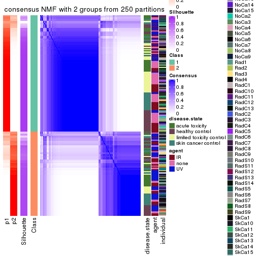</p>

</div>
<div id='tab-MAD-NMF-consensus-heatmap-2'>
<pre><code class="r">consensus_heatmap(res, k = 3)
</code></pre>

<p>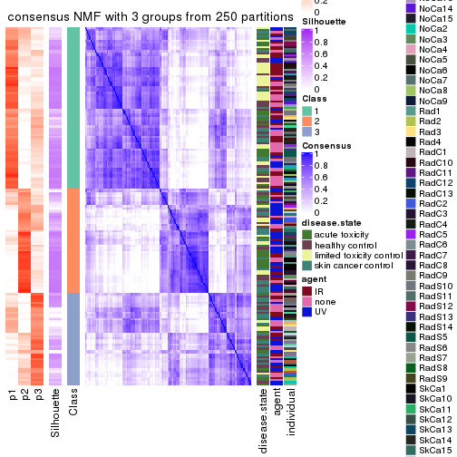</p>

</div>
<div id='tab-MAD-NMF-consensus-heatmap-3'>
<pre><code class="r">consensus_heatmap(res, k = 4)
</code></pre>

<p>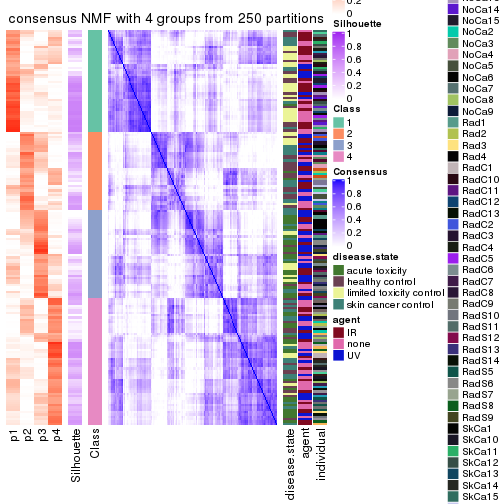</p>

</div>
<div id='tab-MAD-NMF-consensus-heatmap-4'>
<pre><code class="r">consensus_heatmap(res, k = 5)
</code></pre>

<p>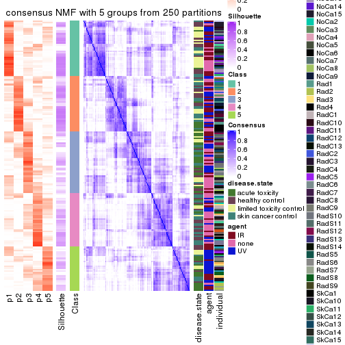</p>

</div>
<div id='tab-MAD-NMF-consensus-heatmap-5'>
<pre><code class="r">consensus_heatmap(res, k = 6)
</code></pre>

<p>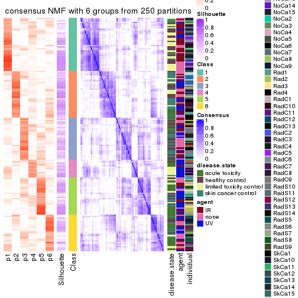</p>

</div>
</div>

Heatmaps for the membership of samples in all partitions to see how consistent they are:


<script>
$( function() {
	$( '#tabs-MAD-NMF-membership-heatmap' ).tabs();
} );
</script>
<div id='tabs-MAD-NMF-membership-heatmap'>
<ul>
<li><a href='#tab-MAD-NMF-membership-heatmap-1'>k = 2</a></li>
<li><a href='#tab-MAD-NMF-membership-heatmap-2'>k = 3</a></li>
<li><a href='#tab-MAD-NMF-membership-heatmap-3'>k = 4</a></li>
<li><a href='#tab-MAD-NMF-membership-heatmap-4'>k = 5</a></li>
<li><a href='#tab-MAD-NMF-membership-heatmap-5'>k = 6</a></li>
</ul>
<div id='tab-MAD-NMF-membership-heatmap-1'>
<pre><code class="r">membership_heatmap(res, k = 2)
</code></pre>

<p>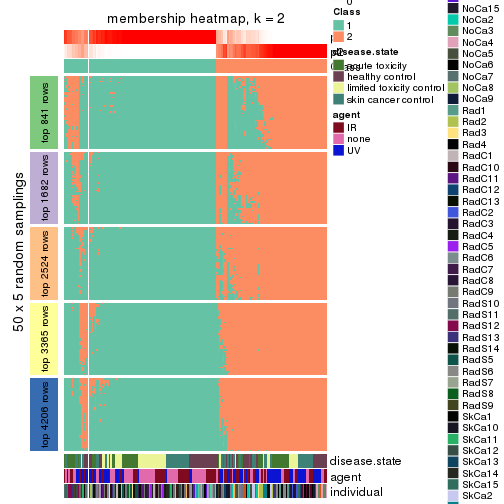</p>

</div>
<div id='tab-MAD-NMF-membership-heatmap-2'>
<pre><code class="r">membership_heatmap(res, k = 3)
</code></pre>

<p>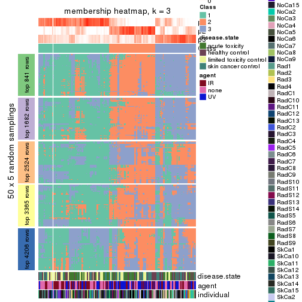</p>

</div>
<div id='tab-MAD-NMF-membership-heatmap-3'>
<pre><code class="r">membership_heatmap(res, k = 4)
</code></pre>

<p>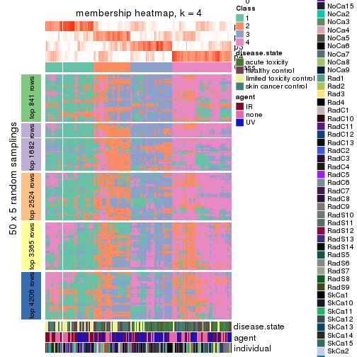</p>

</div>
<div id='tab-MAD-NMF-membership-heatmap-4'>
<pre><code class="r">membership_heatmap(res, k = 5)
</code></pre>

<p>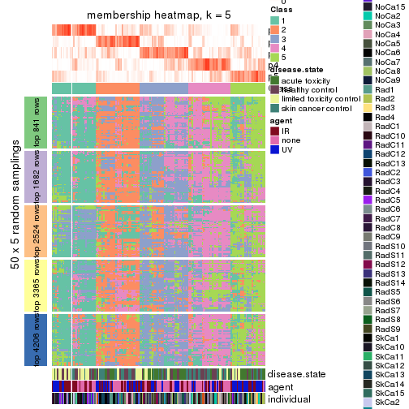</p>

</div>
<div id='tab-MAD-NMF-membership-heatmap-5'>
<pre><code class="r">membership_heatmap(res, k = 6)
</code></pre>

<p>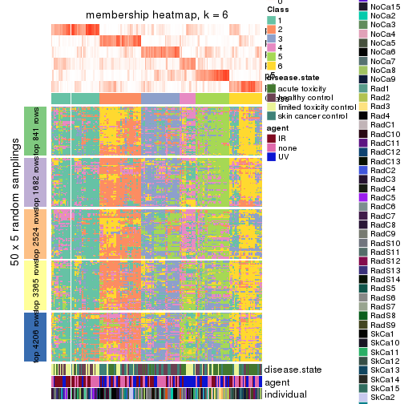</p>

</div>
</div>

As soon as we have had the classes for columns, we can look for signatures
which are significantly different between classes which can be candidate marks
for certain classes. Following are the heatmaps for signatures.


Signature heatmaps where rows are scaled:


<script>
$( function() {
	$( '#tabs-MAD-NMF-get-signatures' ).tabs();
} );
</script>
<div id='tabs-MAD-NMF-get-signatures'>
<ul>
<li><a href='#tab-MAD-NMF-get-signatures-1'>k = 2</a></li>
<li><a href='#tab-MAD-NMF-get-signatures-2'>k = 3</a></li>
<li><a href='#tab-MAD-NMF-get-signatures-3'>k = 4</a></li>
<li><a href='#tab-MAD-NMF-get-signatures-4'>k = 5</a></li>
<li><a href='#tab-MAD-NMF-get-signatures-5'>k = 6</a></li>
</ul>
<div id='tab-MAD-NMF-get-signatures-1'>
<pre><code class="r">get_signatures(res, k = 2)
</code></pre>

<p>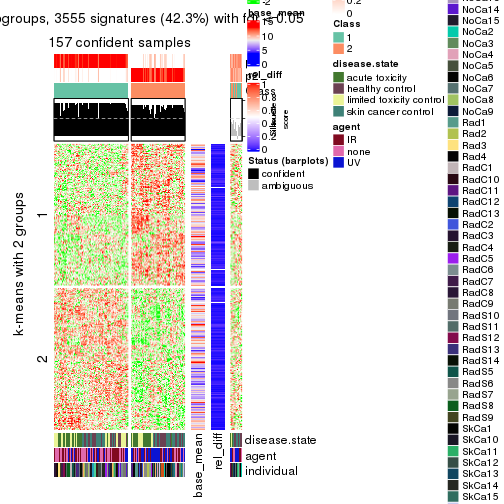</p>

</div>
<div id='tab-MAD-NMF-get-signatures-2'>
<pre><code class="r">get_signatures(res, k = 3)
</code></pre>

<p>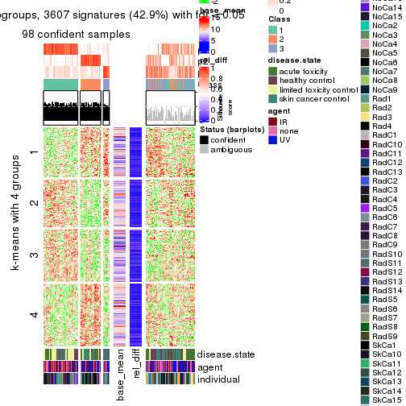</p>

</div>
<div id='tab-MAD-NMF-get-signatures-3'>
<pre><code class="r">get_signatures(res, k = 4)
</code></pre>

<p>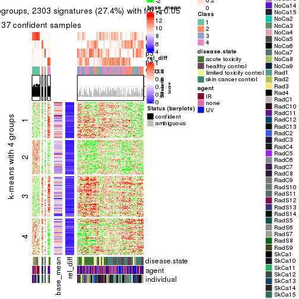</p>

</div>
<div id='tab-MAD-NMF-get-signatures-4'>
<pre><code class="r">get_signatures(res, k = 5)
</code></pre>

<p>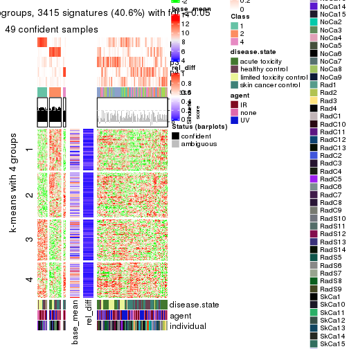</p>

</div>
<div id='tab-MAD-NMF-get-signatures-5'>
<pre><code class="r">get_signatures(res, k = 6)
</code></pre>

<p>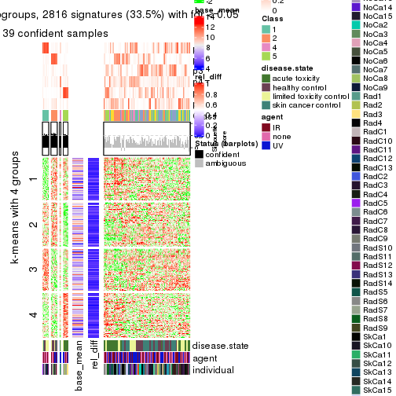</p>

</div>
</div>


Signature heatmaps where rows are not scaled:


<script>
$( function() {
	$( '#tabs-MAD-NMF-get-signatures-no-scale' ).tabs();
} );
</script>
<div id='tabs-MAD-NMF-get-signatures-no-scale'>
<ul>
<li><a href='#tab-MAD-NMF-get-signatures-no-scale-1'>k = 2</a></li>
<li><a href='#tab-MAD-NMF-get-signatures-no-scale-2'>k = 3</a></li>
<li><a href='#tab-MAD-NMF-get-signatures-no-scale-3'>k = 4</a></li>
<li><a href='#tab-MAD-NMF-get-signatures-no-scale-4'>k = 5</a></li>
<li><a href='#tab-MAD-NMF-get-signatures-no-scale-5'>k = 6</a></li>
</ul>
<div id='tab-MAD-NMF-get-signatures-no-scale-1'>
<pre><code class="r">get_signatures(res, k = 2, scale_rows = FALSE)
</code></pre>

<p>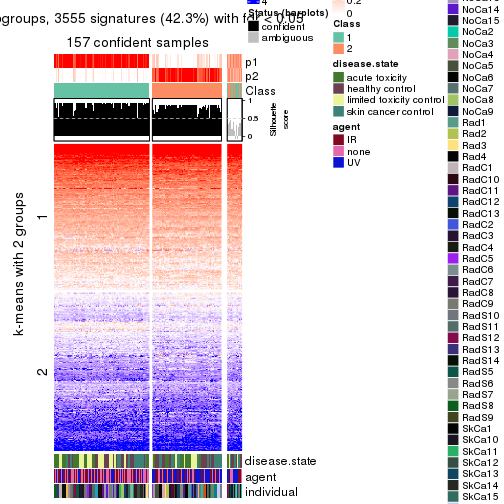</p>

</div>
<div id='tab-MAD-NMF-get-signatures-no-scale-2'>
<pre><code class="r">get_signatures(res, k = 3, scale_rows = FALSE)
</code></pre>

<p>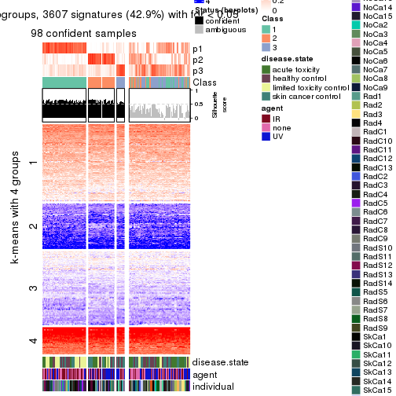</p>

</div>
<div id='tab-MAD-NMF-get-signatures-no-scale-3'>
<pre><code class="r">get_signatures(res, k = 4, scale_rows = FALSE)
</code></pre>

<p>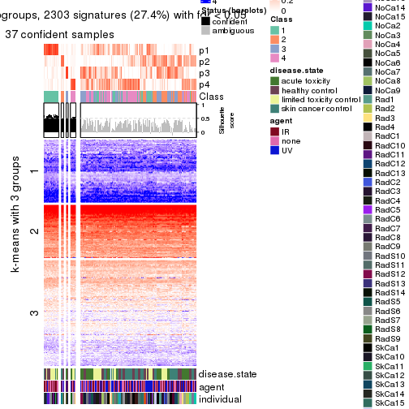</p>

</div>
<div id='tab-MAD-NMF-get-signatures-no-scale-4'>
<pre><code class="r">get_signatures(res, k = 5, scale_rows = FALSE)
</code></pre>

<p>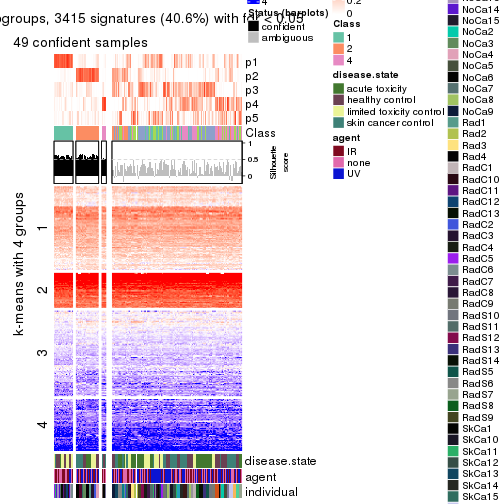</p>

</div>
<div id='tab-MAD-NMF-get-signatures-no-scale-5'>
<pre><code class="r">get_signatures(res, k = 6, scale_rows = FALSE)
</code></pre>

<p>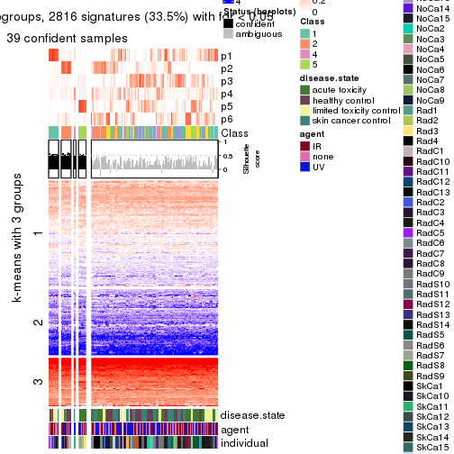</p>

</div>
</div>


Compare the overlap of signatures from different k:

```r
compare_signatures(res)
```

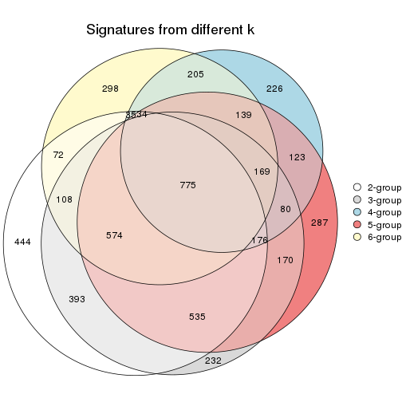

`get_signature()` returns a data frame invisibly. TO get the list of signatures, the function
call should be assigned to a variable explicitly. In following code, if `plot` argument is set
to `FALSE`, no heatmap is plotted while only the differential analysis is performed.

```r
# code only for demonstration
tb = get_signature(res, k = ..., plot = FALSE)
```

An example of the output of `tb` is:

```
#>   which_row         fdr    mean_1    mean_2 scaled_mean_1 scaled_mean_2 km
#> 1        38 0.042760348  8.373488  9.131774    -0.5533452     0.5164555  1
#> 2        40 0.018707592  7.106213  8.469186    -0.6173731     0.5762149  1
#> 3        55 0.019134737 10.221463 11.207825    -0.6159697     0.5749050  1
#> 4        59 0.006059896  5.921854  7.869574    -0.6899429     0.6439467  1
#> 5        60 0.018055526  8.928898 10.211722    -0.6204761     0.5791110  1
#> 6        98 0.009384629 15.714769 14.887706     0.6635654    -0.6193277  2
...
```

The columns in `tb` are:

1. `which_row`: row indices corresponding to the input matrix.
2. `fdr`: FDR for the differential test. 
3. `mean_x`: The mean value in group x.
4. `scaled_mean_x`: The mean value in group x after rows are scaled.
5. `km`: Row groups if k-means clustering is applied to rows.


UMAP plot which shows how samples are separated.


<script>
$( function() {
	$( '#tabs-MAD-NMF-dimension-reduction' ).tabs();
} );
</script>
<div id='tabs-MAD-NMF-dimension-reduction'>
<ul>
<li><a href='#tab-MAD-NMF-dimension-reduction-1'>k = 2</a></li>
<li><a href='#tab-MAD-NMF-dimension-reduction-2'>k = 3</a></li>
<li><a href='#tab-MAD-NMF-dimension-reduction-3'>k = 4</a></li>
<li><a href='#tab-MAD-NMF-dimension-reduction-4'>k = 5</a></li>
<li><a href='#tab-MAD-NMF-dimension-reduction-5'>k = 6</a></li>
</ul>
<div id='tab-MAD-NMF-dimension-reduction-1'>
<pre><code class="r">dimension_reduction(res, k = 2, method = &quot;UMAP&quot;)
</code></pre>

<p>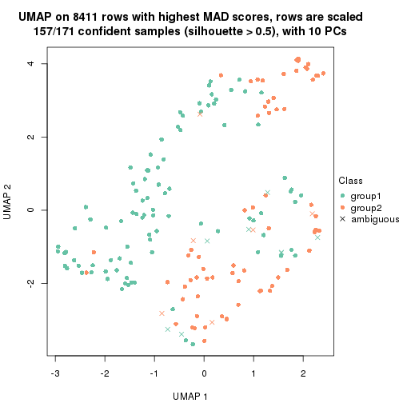</p>

</div>
<div id='tab-MAD-NMF-dimension-reduction-2'>
<pre><code class="r">dimension_reduction(res, k = 3, method = &quot;UMAP&quot;)
</code></pre>

<p>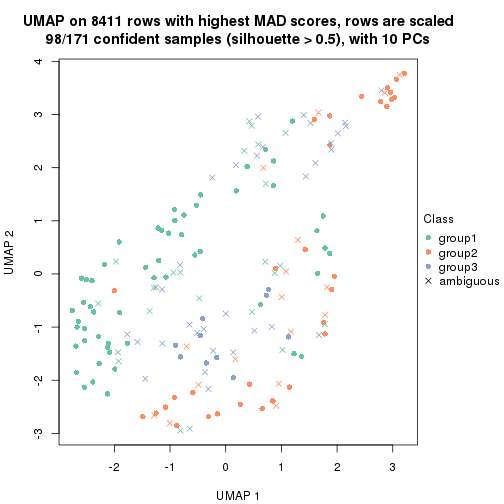</p>

</div>
<div id='tab-MAD-NMF-dimension-reduction-3'>
<pre><code class="r">dimension_reduction(res, k = 4, method = &quot;UMAP&quot;)
</code></pre>

<p>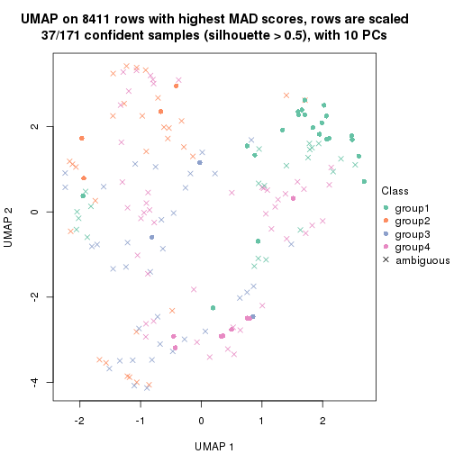</p>

</div>
<div id='tab-MAD-NMF-dimension-reduction-4'>
<pre><code class="r">dimension_reduction(res, k = 5, method = &quot;UMAP&quot;)
</code></pre>

<p>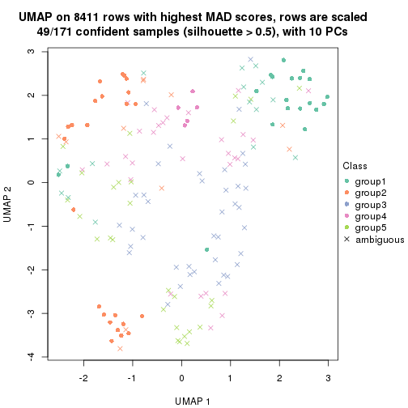</p>

</div>
<div id='tab-MAD-NMF-dimension-reduction-5'>
<pre><code class="r">dimension_reduction(res, k = 6, method = &quot;UMAP&quot;)
</code></pre>

<p>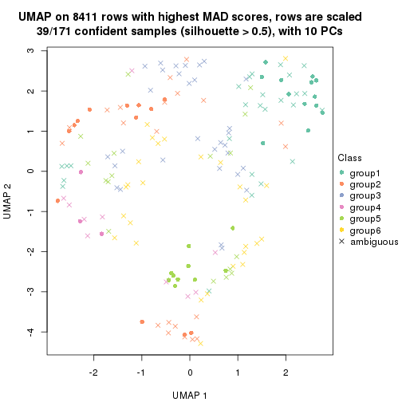</p>

</div>
</div>


Following heatmap shows how subgroups are split when increasing `k`:

```r
collect_classes(res)
```

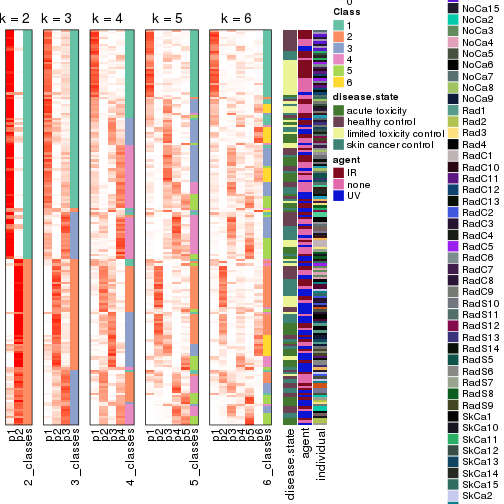


Test correlation between subgroups and known annotations. If the known
annotation is numeric, one-way ANOVA test is applied, and if the known
annotation is discrete, chi-squared contingency table test is applied.

```r
test_to_known_factors(res)
```

```
#>           n disease.state(p) agent(p) individual(p) k
#> MAD:NMF 157         1.91e-01 0.000103      4.49e-06 2
#> MAD:NMF  98         1.73e-03 0.004000      4.05e-08 3
#> MAD:NMF  37         7.10e-03 0.180182      6.92e-05 4
#> MAD:NMF  49         2.07e-02 0.083710      1.26e-05 5
#> MAD:NMF  39         8.21e-06 0.021364      4.05e-03 6
```


If matrix rows can be associated to genes, consider to use `functional_enrichment(res,
...)` to perform function enrichment for the signature genes. See [this vignette](http://bioconductor.org/packages/devel/bioc/vignettes/cola/inst/doc/functional_enrichment.html) for more detailed explanations.


 

---------------------------------------------------


### ATC:hclust


The object with results only for a single top-value method and a single partition method 
can be extracted as:

```r
res = res_list["ATC", "hclust"]
# you can also extract it by
# res = res_list["ATC:hclust"]
```

A summary of `res` and all the functions that can be applied to it:

```r
res
```

```
#> A 'ConsensusPartition' object with k = 2, 3, 4, 5, 6.
#>   On a matrix with 8411 rows and 171 columns.
#>   Top rows (841, 1682, 2524, 3365, 4206) are extracted by 'ATC' method.
#>   Subgroups are detected by 'hclust' method.
#>   Performed in total 1250 partitions by row resampling.
#>   Best k for subgroups seems to be 3.
#> 
#> Following methods can be applied to this 'ConsensusPartition' object:
#>  [1] "cola_report"             "collect_classes"         "collect_plots"          
#>  [4] "collect_stats"           "colnames"                "compare_signatures"     
#>  [7] "consensus_heatmap"       "dimension_reduction"     "functional_enrichment"  
#> [10] "get_anno_col"            "get_anno"                "get_classes"            
#> [13] "get_consensus"           "get_matrix"              "get_membership"         
#> [16] "get_param"               "get_signatures"          "get_stats"              
#> [19] "is_best_k"               "is_stable_k"             "membership_heatmap"     
#> [22] "ncol"                    "nrow"                    "plot_ecdf"              
#> [25] "rownames"                "select_partition_number" "show"                   
#> [28] "suggest_best_k"          "test_to_known_factors"
```

`collect_plots()` function collects all the plots made from `res` for all `k` (number of partitions)
into one single page to provide an easy and fast comparison between different `k`.

```r
collect_plots(res)
```

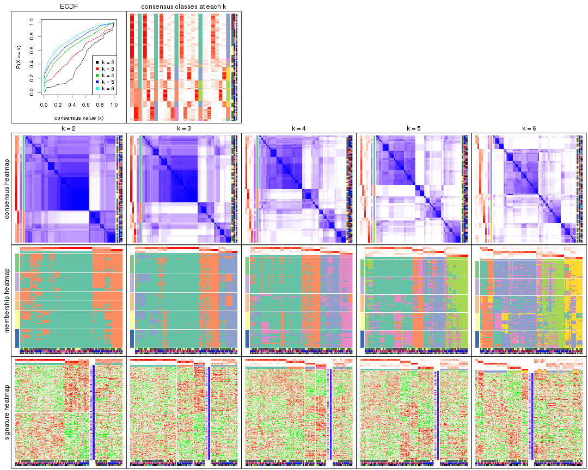

The plots are:

- The first row: a plot of the ECDF (empirical cumulative distribution
  function) curves of the consensus matrix for each `k` and the heatmap of
  predicted classes for each `k`.
- The second row: heatmaps of the consensus matrix for each `k`.
- The third row: heatmaps of the membership matrix for each `k`.
- The fouth row: heatmaps of the signatures for each `k`.

All the plots in panels can be made by individual functions and they are
plotted later in this section.

`select_partition_number()` produces several plots showing different
statistics for choosing "optimized" `k`. There are following statistics:

- ECDF curves of the consensus matrix for each `k`;
- 1-PAC. [The PAC
  score](https://en.wikipedia.org/wiki/Consensus_clustering#Over-interpretation_potential_of_consensus_clustering)
  measures the proportion of the ambiguous subgrouping.
- Mean silhouette score.
- Concordance. The mean probability of fiting the consensus class ids in all
  partitions.
- Area increased. Denote $A_k$ as the area under the ECDF curve for current
  `k`, the area increased is defined as $A_k - A_{k-1}$.
- Rand index. The percent of pairs of samples that are both in a same cluster
  or both are not in a same cluster in the partition of k and k-1.
- Jaccard index. The ratio of pairs of samples are both in a same cluster in
  the partition of k and k-1 and the pairs of samples are both in a same
  cluster in the partition k or k-1.

The detailed explanations of these statistics can be found in [the _cola_
vignette](http://bioconductor.org/packages/devel/bioc/vignettes/cola/inst/doc/cola.html#toc_13).

Generally speaking, lower PAC score, higher mean silhouette score or higher
concordance corresponds to better partition. Rand index and Jaccard index
measure how similar the current partition is compared to partition with `k-1`.
If they are too similar, we won't accept `k` is better than `k-1`.

```r
select_partition_number(res)
```

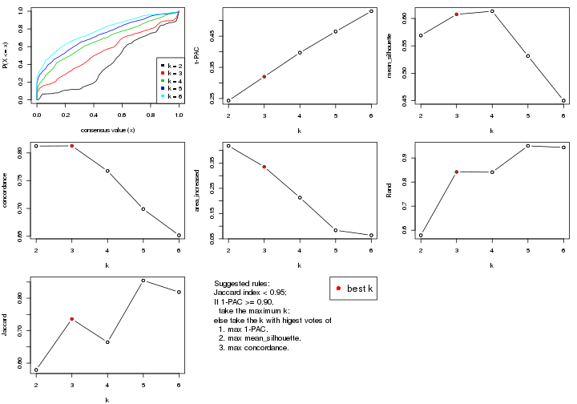

The numeric values for all these statistics can be obtained by `get_stats()`.

```r
get_stats(res)
```

```
#>   k 1-PAC mean_silhouette concordance area_increased  Rand Jaccard
#> 2 2 0.243           0.569       0.812         0.4181 0.579   0.579
#> 3 3 0.320           0.607       0.813         0.3351 0.842   0.736
#> 4 4 0.397           0.613       0.768         0.2132 0.841   0.664
#> 5 5 0.465           0.531       0.699         0.0839 0.950   0.855
#> 6 6 0.530           0.450       0.652         0.0640 0.944   0.819
```

`suggest_best_k()` suggests the best $k$ based on these statistics. The rules are as follows:

- All $k$ with Jaccard index larger than 0.95 are removed because increasing
  $k$ does not provide enough extra information. If all $k$ are removed, it is
  marked as no subgroup is detected.
- For all $k$ with 1-PAC score larger than 0.9, the maximal $k$ is taken as
  the best $k$, and other $k$ are marked as optional $k$.
- If it does not fit the second rule. The $k$ with the maximal vote of the
  highest 1-PAC score, highest mean silhouette, and highest concordance is
  taken as the best $k$.

```r
suggest_best_k(res)
```

```
#> [1] 3
```


Following shows the table of the partitions (You need to click the **show/hide
code output** link to see it). The membership matrix (columns with name `p*`)
is inferred by
[`clue::cl_consensus()`](https://www.rdocumentation.org/link/cl_consensus?package=clue)
function with the `SE` method. Basically the value in the membership matrix
represents the probability to belong to a certain group. The finall class
label for an item is determined with the group with highest probability it
belongs to.

In `get_classes()` function, the entropy is calculated from the membership
matrix and the silhouette score is calculated from the consensus matrix.


<script>
$( function() {
	$( '#tabs-ATC-hclust-get-classes' ).tabs();
} );
</script>
<div id='tabs-ATC-hclust-get-classes'>
<ul>
<li><a href='#tab-ATC-hclust-get-classes-1'>k = 2</a></li>
<li><a href='#tab-ATC-hclust-get-classes-2'>k = 3</a></li>
<li><a href='#tab-ATC-hclust-get-classes-3'>k = 4</a></li>
<li><a href='#tab-ATC-hclust-get-classes-4'>k = 5</a></li>
<li><a href='#tab-ATC-hclust-get-classes-5'>k = 6</a></li>
</ul>

<div id='tab-ATC-hclust-get-classes-1'>
<p><a id='tab-ATC-hclust-get-classes-1-a' style='color:#0366d6' href='#'>show/hide code output</a></p>
<pre><code class="r">cbind(get_classes(res, k = 2), get_membership(res, k = 2))
</code></pre>

<pre><code>#&gt;          class entropy silhouette    p1    p2
#&gt; GSM29783     1  0.6048     0.6899 0.852 0.148
#&gt; GSM29786     1  0.6048     0.6921 0.852 0.148
#&gt; GSM29789     1  0.9491     0.2002 0.632 0.368
#&gt; GSM29792     1  0.9491     0.2002 0.632 0.368
#&gt; GSM29795     1  0.9896    -0.1056 0.560 0.440
#&gt; GSM29798     1  0.5842     0.6916 0.860 0.140
#&gt; GSM29801     1  0.0000     0.7756 1.000 0.000
#&gt; GSM29804     1  0.0000     0.7756 1.000 0.000
#&gt; GSM29807     1  0.0376     0.7752 0.996 0.004
#&gt; GSM29816     1  0.0376     0.7752 0.996 0.004
#&gt; GSM29821     1  0.0000     0.7756 1.000 0.000
#&gt; GSM29824     1  0.0000     0.7756 1.000 0.000
#&gt; GSM29827     1  0.0938     0.7740 0.988 0.012
#&gt; GSM29830     1  0.0000     0.7756 1.000 0.000
#&gt; GSM29833     1  0.0938     0.7740 0.988 0.012
#&gt; GSM29784     1  0.6048     0.6899 0.852 0.148
#&gt; GSM29787     1  0.6048     0.6921 0.852 0.148
#&gt; GSM29790     1  0.6247     0.6869 0.844 0.156
#&gt; GSM29793     1  0.6247     0.6869 0.844 0.156
#&gt; GSM29796     1  0.9896    -0.1056 0.560 0.440
#&gt; GSM29799     1  0.5842     0.6916 0.860 0.140
#&gt; GSM29802     1  0.0672     0.7744 0.992 0.008
#&gt; GSM29805     1  0.0672     0.7744 0.992 0.008
#&gt; GSM29814     1  0.0376     0.7752 0.996 0.004
#&gt; GSM29817     1  0.0000     0.7756 1.000 0.000
#&gt; GSM29822     1  0.0000     0.7756 1.000 0.000
#&gt; GSM29825     1  0.0000     0.7756 1.000 0.000
#&gt; GSM29828     1  0.0938     0.7740 0.988 0.012
#&gt; GSM29831     1  0.0938     0.7740 0.988 0.012
#&gt; GSM29834     1  0.0938     0.7740 0.988 0.012
#&gt; GSM29785     2  0.9000     0.5843 0.316 0.684
#&gt; GSM29788     2  0.9000     0.5843 0.316 0.684
#&gt; GSM29791     2  0.9850     0.5137 0.428 0.572
#&gt; GSM29794     2  0.9850     0.5137 0.428 0.572
#&gt; GSM29797     2  0.9850     0.5137 0.428 0.572
#&gt; GSM29800     1  1.0000    -0.1506 0.500 0.500
#&gt; GSM29803     1  0.9954    -0.0740 0.540 0.460
#&gt; GSM29806     1  0.9087     0.4335 0.676 0.324
#&gt; GSM29815     1  0.8661     0.4968 0.712 0.288
#&gt; GSM29819     1  0.9044     0.4464 0.680 0.320
#&gt; GSM29823     2  0.9866     0.5053 0.432 0.568
#&gt; GSM29826     1  0.7883     0.5804 0.764 0.236
#&gt; GSM29829     2  0.9922     0.4715 0.448 0.552
#&gt; GSM29832     2  0.9922     0.4715 0.448 0.552
#&gt; GSM29835     2  0.9850     0.5137 0.428 0.572
#&gt; GSM29836     2  0.9850     0.5137 0.428 0.572
#&gt; GSM29839     1  0.9491     0.2002 0.632 0.368
#&gt; GSM29842     1  0.5946     0.6911 0.856 0.144
#&gt; GSM29845     1  0.5629     0.6994 0.868 0.132
#&gt; GSM29848     1  0.0672     0.7743 0.992 0.008
#&gt; GSM29851     1  0.0000     0.7756 1.000 0.000
#&gt; GSM29854     1  0.0000     0.7756 1.000 0.000
#&gt; GSM29857     1  0.0938     0.7737 0.988 0.012
#&gt; GSM29860     1  0.6148     0.6685 0.848 0.152
#&gt; GSM29863     1  0.0938     0.7748 0.988 0.012
#&gt; GSM29866     1  0.0000     0.7756 1.000 0.000
#&gt; GSM29869     1  0.0000     0.7756 1.000 0.000
#&gt; GSM29872     1  0.4815     0.7208 0.896 0.104
#&gt; GSM29875     1  0.0000     0.7756 1.000 0.000
#&gt; GSM29878     1  0.0000     0.7756 1.000 0.000
#&gt; GSM29837     2  0.9850     0.5137 0.428 0.572
#&gt; GSM29840     1  0.9491     0.2002 0.632 0.368
#&gt; GSM29843     1  0.5946     0.6911 0.856 0.144
#&gt; GSM29846     1  0.5629     0.6994 0.868 0.132
#&gt; GSM29849     1  0.0672     0.7743 0.992 0.008
#&gt; GSM29852     1  0.0000     0.7756 1.000 0.000
#&gt; GSM29855     1  0.0672     0.7744 0.992 0.008
#&gt; GSM29858     1  0.0938     0.7737 0.988 0.012
#&gt; GSM29861     1  0.6148     0.6685 0.848 0.152
#&gt; GSM29864     1  0.0938     0.7748 0.988 0.012
#&gt; GSM29867     1  0.0000     0.7756 1.000 0.000
#&gt; GSM29870     1  0.0000     0.7756 1.000 0.000
#&gt; GSM29873     1  0.4815     0.7208 0.896 0.104
#&gt; GSM29876     1  0.0000     0.7756 1.000 0.000
#&gt; GSM29879     1  0.0000     0.7756 1.000 0.000
#&gt; GSM29838     2  0.9850     0.5137 0.428 0.572
#&gt; GSM29841     2  0.9850     0.5137 0.428 0.572
#&gt; GSM29844     2  0.9754     0.5313 0.408 0.592
#&gt; GSM29847     2  0.9963     0.3298 0.464 0.536
#&gt; GSM29850     1  0.7674     0.5720 0.776 0.224
#&gt; GSM29853     1  0.6343     0.6642 0.840 0.160
#&gt; GSM29856     1  0.9963    -0.0917 0.536 0.464
#&gt; GSM29859     1  0.9087     0.4335 0.676 0.324
#&gt; GSM29862     2  0.9850     0.5137 0.428 0.572
#&gt; GSM29865     1  0.9909    -0.0122 0.556 0.444
#&gt; GSM29868     1  0.9963    -0.0914 0.536 0.464
#&gt; GSM29871     1  0.6801     0.6420 0.820 0.180
#&gt; GSM29874     2  0.9850     0.5137 0.428 0.572
#&gt; GSM29877     1  0.3879     0.7438 0.924 0.076
#&gt; GSM29880     1  0.9661     0.0961 0.608 0.392
#&gt; GSM29881     1  0.9710     0.2613 0.600 0.400
#&gt; GSM29884     2  0.1633     0.6591 0.024 0.976
#&gt; GSM29887     2  0.1633     0.6591 0.024 0.976
#&gt; GSM29890     1  0.0000     0.7756 1.000 0.000
#&gt; GSM29893     1  0.0000     0.7756 1.000 0.000
#&gt; GSM29896     1  0.0000     0.7756 1.000 0.000
#&gt; GSM29899     1  0.0000     0.7756 1.000 0.000
#&gt; GSM29902     1  0.5629     0.7091 0.868 0.132
#&gt; GSM29905     1  0.5629     0.7115 0.868 0.132
#&gt; GSM29908     1  0.0376     0.7751 0.996 0.004
#&gt; GSM29955     2  0.9993     0.1317 0.484 0.516
#&gt; GSM29958     1  0.0938     0.7740 0.988 0.012
#&gt; GSM29961     1  0.0376     0.7751 0.996 0.004
#&gt; GSM29882     1  0.9710     0.2613 0.600 0.400
#&gt; GSM29885     2  0.1633     0.6591 0.024 0.976
#&gt; GSM29888     2  0.1633     0.6591 0.024 0.976
#&gt; GSM29891     1  0.0000     0.7756 1.000 0.000
#&gt; GSM29894     1  0.0000     0.7756 1.000 0.000
#&gt; GSM29897     1  0.0000     0.7756 1.000 0.000
#&gt; GSM29900     1  0.0000     0.7756 1.000 0.000
#&gt; GSM29903     1  0.5629     0.7091 0.868 0.132
#&gt; GSM29906     1  0.5629     0.7115 0.868 0.132
#&gt; GSM29909     1  0.4431     0.7353 0.908 0.092
#&gt; GSM29956     1  0.0938     0.7740 0.988 0.012
#&gt; GSM29959     1  0.0938     0.7740 0.988 0.012
#&gt; GSM29962     1  0.0000     0.7756 1.000 0.000
#&gt; GSM29883     2  0.9815     0.3800 0.420 0.580
#&gt; GSM29886     2  0.1414     0.6640 0.020 0.980
#&gt; GSM29889     2  0.1414     0.6640 0.020 0.980
#&gt; GSM29892     1  0.9963     0.0372 0.536 0.464
#&gt; GSM29895     1  0.9491     0.2455 0.632 0.368
#&gt; GSM29898     2  0.9358     0.5570 0.352 0.648
#&gt; GSM29901     1  0.9129     0.4125 0.672 0.328
#&gt; GSM29904     1  0.9922     0.0728 0.552 0.448
#&gt; GSM29907     1  0.9881     0.1142 0.564 0.436
#&gt; GSM29910     2  0.9850     0.5053 0.428 0.572
#&gt; GSM29957     2  0.7602     0.6493 0.220 0.780
#&gt; GSM29960     2  0.9815     0.5226 0.420 0.580
#&gt; GSM29963     2  0.9933     0.4537 0.452 0.548
#&gt; GSM29964     2  0.1633     0.6591 0.024 0.976
#&gt; GSM29967     2  0.1633     0.6646 0.024 0.976
#&gt; GSM29970     1  0.9754     0.2491 0.592 0.408
#&gt; GSM29973     2  0.1414     0.6640 0.020 0.980
#&gt; GSM29976     1  0.9661     0.2829 0.608 0.392
#&gt; GSM29979     2  0.9000     0.5222 0.316 0.684
#&gt; GSM29982     1  0.0938     0.7741 0.988 0.012
#&gt; GSM29985     1  0.9732     0.2506 0.596 0.404
#&gt; GSM29988     1  0.9635     0.2949 0.612 0.388
#&gt; GSM29991     2  0.1633     0.6591 0.024 0.976
#&gt; GSM29994     1  0.9608     0.3032 0.616 0.384
#&gt; GSM29997     1  0.0000     0.7756 1.000 0.000
#&gt; GSM30000     2  0.9732     0.3922 0.404 0.596
#&gt; GSM30003     1  0.4022     0.7448 0.920 0.080
#&gt; GSM29965     2  0.1633     0.6591 0.024 0.976
#&gt; GSM29968     2  0.1633     0.6646 0.024 0.976
#&gt; GSM29971     1  0.9754     0.2491 0.592 0.408
#&gt; GSM29974     2  0.1414     0.6640 0.020 0.980
#&gt; GSM29977     1  0.9661     0.2829 0.608 0.392
#&gt; GSM29980     2  0.9000     0.5222 0.316 0.684
#&gt; GSM29983     1  0.0938     0.7741 0.988 0.012
#&gt; GSM29986     1  0.9732     0.2506 0.596 0.404
#&gt; GSM29989     1  0.9635     0.2949 0.612 0.388
#&gt; GSM29992     2  0.1633     0.6591 0.024 0.976
#&gt; GSM29995     1  0.0000     0.7756 1.000 0.000
#&gt; GSM29998     1  0.4298     0.7397 0.912 0.088
#&gt; GSM30001     2  0.9732     0.3922 0.404 0.596
#&gt; GSM30004     1  0.4022     0.7448 0.920 0.080
#&gt; GSM29966     2  0.1184     0.6625 0.016 0.984
#&gt; GSM29969     2  0.1414     0.6640 0.020 0.980
#&gt; GSM29972     2  0.9358     0.5342 0.352 0.648
#&gt; GSM29975     2  0.1414     0.6640 0.020 0.980
#&gt; GSM29978     1  1.0000    -0.1058 0.504 0.496
#&gt; GSM29981     2  0.6343     0.6608 0.160 0.840
#&gt; GSM29984     2  0.6973     0.6571 0.188 0.812
#&gt; GSM29987     2  0.9909     0.2982 0.444 0.556
#&gt; GSM29990     1  0.9775     0.2200 0.588 0.412
#&gt; GSM29993     2  0.0000     0.6538 0.000 1.000
#&gt; GSM29996     1  0.7299     0.6012 0.796 0.204
#&gt; GSM29999     1  0.9833     0.1723 0.576 0.424
#&gt; GSM30002     2  0.9732     0.3922 0.404 0.596
#&gt; GSM30005     1  0.9170     0.4228 0.668 0.332
</code></pre>

<script>
$('#tab-ATC-hclust-get-classes-1-a').parent().next().next().hide();
$('#tab-ATC-hclust-get-classes-1-a').click(function(){
  $('#tab-ATC-hclust-get-classes-1-a').parent().next().next().toggle();
  return(false);
});
</script>
</div>

<div id='tab-ATC-hclust-get-classes-2'>
<p><a id='tab-ATC-hclust-get-classes-2-a' style='color:#0366d6' href='#'>show/hide code output</a></p>
<pre><code class="r">cbind(get_classes(res, k = 3), get_membership(res, k = 3))
</code></pre>

<pre><code>#&gt;          class entropy silhouette    p1    p2    p3
#&gt; GSM29783     1  0.4551     0.7379 0.840 0.020 0.140
#&gt; GSM29786     1  0.5631     0.7111 0.804 0.064 0.132
#&gt; GSM29789     2  0.5733     0.6115 0.324 0.676 0.000
#&gt; GSM29792     2  0.5733     0.6115 0.324 0.676 0.000
#&gt; GSM29795     2  0.6180     0.6013 0.332 0.660 0.008
#&gt; GSM29798     1  0.3918     0.7457 0.856 0.004 0.140
#&gt; GSM29801     1  0.0592     0.8025 0.988 0.012 0.000
#&gt; GSM29804     1  0.0000     0.8028 1.000 0.000 0.000
#&gt; GSM29807     1  0.0237     0.8031 0.996 0.000 0.004
#&gt; GSM29816     1  0.0237     0.8031 0.996 0.000 0.004
#&gt; GSM29821     1  0.0892     0.8011 0.980 0.020 0.000
#&gt; GSM29824     1  0.0237     0.8030 0.996 0.004 0.000
#&gt; GSM29827     1  0.3686     0.7218 0.860 0.140 0.000
#&gt; GSM29830     1  0.0592     0.8025 0.988 0.012 0.000
#&gt; GSM29833     1  0.1163     0.7977 0.972 0.028 0.000
#&gt; GSM29784     1  0.4551     0.7379 0.840 0.020 0.140
#&gt; GSM29787     1  0.5631     0.7111 0.804 0.064 0.132
#&gt; GSM29790     1  0.4551     0.7390 0.840 0.020 0.140
#&gt; GSM29793     1  0.4551     0.7390 0.840 0.020 0.140
#&gt; GSM29796     2  0.6180     0.6013 0.332 0.660 0.008
#&gt; GSM29799     1  0.3918     0.7457 0.856 0.004 0.140
#&gt; GSM29802     1  0.0424     0.8030 0.992 0.000 0.008
#&gt; GSM29805     1  0.0424     0.8030 0.992 0.000 0.008
#&gt; GSM29814     1  0.0237     0.8031 0.996 0.000 0.004
#&gt; GSM29817     1  0.0000     0.8028 1.000 0.000 0.000
#&gt; GSM29822     1  0.0892     0.8011 0.980 0.020 0.000
#&gt; GSM29825     1  0.0000     0.8028 1.000 0.000 0.000
#&gt; GSM29828     1  0.3686     0.7218 0.860 0.140 0.000
#&gt; GSM29831     1  0.3686     0.7218 0.860 0.140 0.000
#&gt; GSM29834     1  0.1163     0.7977 0.972 0.028 0.000
#&gt; GSM29785     2  0.7984     0.5312 0.216 0.652 0.132
#&gt; GSM29788     2  0.7984     0.5312 0.216 0.652 0.132
#&gt; GSM29791     2  0.0000     0.6530 0.000 1.000 0.000
#&gt; GSM29794     2  0.0000     0.6530 0.000 1.000 0.000
#&gt; GSM29797     2  0.0000     0.6530 0.000 1.000 0.000
#&gt; GSM29800     1  0.9093    -0.1759 0.460 0.400 0.140
#&gt; GSM29803     2  0.8264     0.4982 0.356 0.556 0.088
#&gt; GSM29806     1  0.8079     0.3971 0.628 0.260 0.112
#&gt; GSM29815     1  0.7303     0.4822 0.680 0.244 0.076
#&gt; GSM29819     1  0.8378     0.3246 0.596 0.284 0.120
#&gt; GSM29823     2  0.4465     0.6833 0.176 0.820 0.004
#&gt; GSM29826     1  0.6964     0.4733 0.684 0.264 0.052
#&gt; GSM29829     2  0.3816     0.6986 0.148 0.852 0.000
#&gt; GSM29832     2  0.3816     0.6986 0.148 0.852 0.000
#&gt; GSM29835     2  0.0592     0.6602 0.012 0.988 0.000
#&gt; GSM29836     2  0.0000     0.6530 0.000 1.000 0.000
#&gt; GSM29839     2  0.5650     0.6160 0.312 0.688 0.000
#&gt; GSM29842     1  0.4099     0.7443 0.852 0.008 0.140
#&gt; GSM29845     1  0.3784     0.7509 0.864 0.004 0.132
#&gt; GSM29848     1  0.0848     0.8031 0.984 0.008 0.008
#&gt; GSM29851     1  0.0237     0.8030 0.996 0.004 0.000
#&gt; GSM29854     1  0.0000     0.8028 1.000 0.000 0.000
#&gt; GSM29857     1  0.0592     0.8028 0.988 0.000 0.012
#&gt; GSM29860     1  0.6244     0.0931 0.560 0.440 0.000
#&gt; GSM29863     1  0.0829     0.8024 0.984 0.012 0.004
#&gt; GSM29866     1  0.0237     0.8030 0.996 0.004 0.000
#&gt; GSM29869     1  0.0000     0.8028 1.000 0.000 0.000
#&gt; GSM29872     1  0.6267     0.0805 0.548 0.452 0.000
#&gt; GSM29875     1  0.0000     0.8028 1.000 0.000 0.000
#&gt; GSM29878     1  0.0592     0.8023 0.988 0.012 0.000
#&gt; GSM29837     2  0.0000     0.6530 0.000 1.000 0.000
#&gt; GSM29840     2  0.5733     0.6115 0.324 0.676 0.000
#&gt; GSM29843     1  0.4099     0.7443 0.852 0.008 0.140
#&gt; GSM29846     1  0.3784     0.7509 0.864 0.004 0.132
#&gt; GSM29849     1  0.0848     0.8031 0.984 0.008 0.008
#&gt; GSM29852     1  0.0237     0.8030 0.996 0.004 0.000
#&gt; GSM29855     1  0.0424     0.8030 0.992 0.000 0.008
#&gt; GSM29858     1  0.0592     0.8028 0.988 0.000 0.012
#&gt; GSM29861     1  0.6244     0.0931 0.560 0.440 0.000
#&gt; GSM29864     1  0.0829     0.8024 0.984 0.012 0.004
#&gt; GSM29867     1  0.0000     0.8028 1.000 0.000 0.000
#&gt; GSM29870     1  0.0000     0.8028 1.000 0.000 0.000
#&gt; GSM29873     1  0.6267     0.0805 0.548 0.452 0.000
#&gt; GSM29876     1  0.0000     0.8028 1.000 0.000 0.000
#&gt; GSM29879     1  0.0592     0.8023 0.988 0.012 0.000
#&gt; GSM29838     2  0.0000     0.6530 0.000 1.000 0.000
#&gt; GSM29841     2  0.0000     0.6530 0.000 1.000 0.000
#&gt; GSM29844     2  0.2918     0.6564 0.044 0.924 0.032
#&gt; GSM29847     2  0.8132     0.5538 0.304 0.600 0.096
#&gt; GSM29850     1  0.5461     0.5588 0.748 0.244 0.008
#&gt; GSM29853     1  0.5659     0.5588 0.740 0.248 0.012
#&gt; GSM29856     2  0.8465     0.4680 0.376 0.528 0.096
#&gt; GSM29859     1  0.8079     0.3971 0.628 0.260 0.112
#&gt; GSM29862     2  0.0000     0.6530 0.000 1.000 0.000
#&gt; GSM29865     2  0.8324     0.4778 0.372 0.540 0.088
#&gt; GSM29868     2  0.8346     0.4917 0.360 0.548 0.092
#&gt; GSM29871     1  0.5062     0.6420 0.800 0.184 0.016
#&gt; GSM29874     2  0.1289     0.6698 0.032 0.968 0.000
#&gt; GSM29877     1  0.4575     0.6924 0.828 0.160 0.012
#&gt; GSM29880     2  0.5327     0.6423 0.272 0.728 0.000
#&gt; GSM29881     1  0.6204     0.3126 0.576 0.000 0.424
#&gt; GSM29884     3  0.0424     0.6525 0.000 0.008 0.992
#&gt; GSM29887     3  0.0424     0.6525 0.000 0.008 0.992
#&gt; GSM29890     1  0.0000     0.8028 1.000 0.000 0.000
#&gt; GSM29893     1  0.0424     0.8026 0.992 0.008 0.000
#&gt; GSM29896     1  0.0592     0.8025 0.988 0.012 0.000
#&gt; GSM29899     1  0.0000     0.8028 1.000 0.000 0.000
#&gt; GSM29902     1  0.3941     0.7294 0.844 0.000 0.156
#&gt; GSM29905     1  0.3941     0.7315 0.844 0.000 0.156
#&gt; GSM29908     1  0.0747     0.8016 0.984 0.016 0.000
#&gt; GSM29955     3  0.9189     0.2966 0.348 0.160 0.492
#&gt; GSM29958     1  0.1163     0.7977 0.972 0.028 0.000
#&gt; GSM29961     1  0.0747     0.8016 0.984 0.016 0.000
#&gt; GSM29882     1  0.6204     0.3126 0.576 0.000 0.424
#&gt; GSM29885     3  0.0424     0.6525 0.000 0.008 0.992
#&gt; GSM29888     3  0.0424     0.6525 0.000 0.008 0.992
#&gt; GSM29891     1  0.0000     0.8028 1.000 0.000 0.000
#&gt; GSM29894     1  0.0424     0.8026 0.992 0.008 0.000
#&gt; GSM29897     1  0.0592     0.8025 0.988 0.012 0.000
#&gt; GSM29900     1  0.0000     0.8028 1.000 0.000 0.000
#&gt; GSM29903     1  0.3941     0.7294 0.844 0.000 0.156
#&gt; GSM29906     1  0.3941     0.7315 0.844 0.000 0.156
#&gt; GSM29909     1  0.3845     0.7545 0.872 0.012 0.116
#&gt; GSM29956     1  0.1163     0.7977 0.972 0.028 0.000
#&gt; GSM29959     1  0.1163     0.7977 0.972 0.028 0.000
#&gt; GSM29962     1  0.0592     0.8023 0.988 0.012 0.000
#&gt; GSM29883     3  0.8056     0.2854 0.400 0.068 0.532
#&gt; GSM29886     3  0.5138     0.5651 0.000 0.252 0.748
#&gt; GSM29889     3  0.5138     0.5651 0.000 0.252 0.748
#&gt; GSM29892     1  0.7293     0.0586 0.496 0.028 0.476
#&gt; GSM29895     2  0.7141     0.5227 0.368 0.600 0.032
#&gt; GSM29898     3  0.9053     0.3875 0.220 0.224 0.556
#&gt; GSM29901     1  0.8343     0.4418 0.612 0.132 0.256
#&gt; GSM29904     1  0.9695     0.0797 0.452 0.244 0.304
#&gt; GSM29907     1  0.9623     0.1049 0.464 0.232 0.304
#&gt; GSM29910     2  0.4937     0.6806 0.148 0.824 0.028
#&gt; GSM29957     3  0.7642     0.5089 0.092 0.248 0.660
#&gt; GSM29960     2  0.3532     0.6887 0.108 0.884 0.008
#&gt; GSM29963     2  0.5292     0.6778 0.172 0.800 0.028
#&gt; GSM29964     3  0.0424     0.6525 0.000 0.008 0.992
#&gt; GSM29967     3  0.5058     0.5712 0.000 0.244 0.756
#&gt; GSM29970     1  0.6225     0.3037 0.568 0.000 0.432
#&gt; GSM29973     3  0.5138     0.5651 0.000 0.252 0.748
#&gt; GSM29976     1  0.6180     0.3315 0.584 0.000 0.416
#&gt; GSM29979     3  0.8457     0.4997 0.216 0.168 0.616
#&gt; GSM29982     1  0.0892     0.8005 0.980 0.020 0.000
#&gt; GSM29985     1  0.6215     0.3030 0.572 0.000 0.428
#&gt; GSM29988     1  0.6168     0.3418 0.588 0.000 0.412
#&gt; GSM29991     3  0.0000     0.6499 0.000 0.000 1.000
#&gt; GSM29994     1  0.6154     0.3496 0.592 0.000 0.408
#&gt; GSM29997     1  0.0000     0.8028 1.000 0.000 0.000
#&gt; GSM30000     3  0.7263     0.3495 0.372 0.036 0.592
#&gt; GSM30003     1  0.3038     0.7629 0.896 0.000 0.104
#&gt; GSM29965     3  0.0424     0.6525 0.000 0.008 0.992
#&gt; GSM29968     3  0.5058     0.5712 0.000 0.244 0.756
#&gt; GSM29971     1  0.6225     0.3037 0.568 0.000 0.432
#&gt; GSM29974     3  0.5138     0.5651 0.000 0.252 0.748
#&gt; GSM29977     1  0.6180     0.3315 0.584 0.000 0.416
#&gt; GSM29980     3  0.8457     0.4997 0.216 0.168 0.616
#&gt; GSM29983     1  0.0892     0.8005 0.980 0.020 0.000
#&gt; GSM29986     1  0.6215     0.3030 0.572 0.000 0.428
#&gt; GSM29989     1  0.6168     0.3418 0.588 0.000 0.412
#&gt; GSM29992     3  0.0000     0.6499 0.000 0.000 1.000
#&gt; GSM29995     1  0.0592     0.8025 0.988 0.012 0.000
#&gt; GSM29998     1  0.3192     0.7578 0.888 0.000 0.112
#&gt; GSM30001     3  0.7263     0.3495 0.372 0.036 0.592
#&gt; GSM30004     1  0.3038     0.7629 0.896 0.000 0.104
#&gt; GSM29966     3  0.4291     0.6058 0.000 0.180 0.820
#&gt; GSM29969     3  0.5138     0.5651 0.000 0.252 0.748
#&gt; GSM29972     3  0.8630     0.4158 0.328 0.120 0.552
#&gt; GSM29975     3  0.5138     0.5651 0.000 0.252 0.748
#&gt; GSM29978     3  0.7838     0.0524 0.460 0.052 0.488
#&gt; GSM29981     3  0.7353     0.4010 0.036 0.396 0.568
#&gt; GSM29984     3  0.8097     0.3756 0.072 0.388 0.540
#&gt; GSM29987     3  0.7453     0.1747 0.436 0.036 0.528
#&gt; GSM29990     1  0.8918     0.3123 0.548 0.156 0.296
#&gt; GSM29993     3  0.1031     0.6503 0.000 0.024 0.976
#&gt; GSM29996     1  0.5070     0.6030 0.772 0.224 0.004
#&gt; GSM29999     1  0.7248     0.1927 0.536 0.028 0.436
#&gt; GSM30002     3  0.7263     0.3495 0.372 0.036 0.592
#&gt; GSM30005     1  0.8546     0.3000 0.584 0.284 0.132
</code></pre>

<script>
$('#tab-ATC-hclust-get-classes-2-a').parent().next().next().hide();
$('#tab-ATC-hclust-get-classes-2-a').click(function(){
  $('#tab-ATC-hclust-get-classes-2-a').parent().next().next().toggle();
  return(false);
});
</script>
</div>

<div id='tab-ATC-hclust-get-classes-3'>
<p><a id='tab-ATC-hclust-get-classes-3-a' style='color:#0366d6' href='#'>show/hide code output</a></p>
<pre><code class="r">cbind(get_classes(res, k = 4), get_membership(res, k = 4))
</code></pre>

<pre><code>#&gt;          class entropy silhouette    p1    p2    p3    p4
#&gt; GSM29783     1  0.4715     0.6733 0.788 0.016 0.028 0.168
#&gt; GSM29786     1  0.5504     0.6426 0.756 0.060 0.024 0.160
#&gt; GSM29789     2  0.4720     0.6132 0.324 0.672 0.000 0.004
#&gt; GSM29792     2  0.4720     0.6132 0.324 0.672 0.000 0.004
#&gt; GSM29795     2  0.5175     0.6359 0.328 0.656 0.004 0.012
#&gt; GSM29798     1  0.4149     0.6832 0.804 0.000 0.028 0.168
#&gt; GSM29801     1  0.1509     0.7745 0.960 0.008 0.020 0.012
#&gt; GSM29804     1  0.2412     0.7687 0.908 0.000 0.084 0.008
#&gt; GSM29807     1  0.4472     0.6866 0.760 0.000 0.220 0.020
#&gt; GSM29816     1  0.4149     0.7147 0.804 0.000 0.168 0.028
#&gt; GSM29821     1  0.2291     0.7818 0.932 0.016 0.036 0.016
#&gt; GSM29824     1  0.2197     0.7715 0.916 0.004 0.080 0.000
#&gt; GSM29827     1  0.3508     0.7079 0.848 0.136 0.004 0.012
#&gt; GSM29830     1  0.1509     0.7745 0.960 0.008 0.020 0.012
#&gt; GSM29833     1  0.2269     0.7764 0.932 0.028 0.032 0.008
#&gt; GSM29784     1  0.4715     0.6733 0.788 0.016 0.028 0.168
#&gt; GSM29787     1  0.5504     0.6426 0.756 0.060 0.024 0.160
#&gt; GSM29790     1  0.4715     0.6753 0.788 0.016 0.028 0.168
#&gt; GSM29793     1  0.4715     0.6753 0.788 0.016 0.028 0.168
#&gt; GSM29796     2  0.5175     0.6359 0.328 0.656 0.004 0.012
#&gt; GSM29799     1  0.4149     0.6832 0.804 0.000 0.028 0.168
#&gt; GSM29802     1  0.4808     0.6549 0.736 0.000 0.236 0.028
#&gt; GSM29805     1  0.4808     0.6549 0.736 0.000 0.236 0.028
#&gt; GSM29814     1  0.4472     0.6866 0.760 0.000 0.220 0.020
#&gt; GSM29817     1  0.2610     0.7652 0.900 0.000 0.088 0.012
#&gt; GSM29822     1  0.2291     0.7818 0.932 0.016 0.036 0.016
#&gt; GSM29825     1  0.2610     0.7652 0.900 0.000 0.088 0.012
#&gt; GSM29828     1  0.3508     0.7079 0.848 0.136 0.004 0.012
#&gt; GSM29831     1  0.3508     0.7079 0.848 0.136 0.004 0.012
#&gt; GSM29834     1  0.2269     0.7764 0.932 0.028 0.032 0.008
#&gt; GSM29785     2  0.6906     0.6000 0.196 0.648 0.024 0.132
#&gt; GSM29788     2  0.6906     0.6000 0.196 0.648 0.024 0.132
#&gt; GSM29791     2  0.0000     0.7169 0.000 1.000 0.000 0.000
#&gt; GSM29794     2  0.0000     0.7169 0.000 1.000 0.000 0.000
#&gt; GSM29797     2  0.0000     0.7169 0.000 1.000 0.000 0.000
#&gt; GSM29800     1  0.8168    -0.2826 0.408 0.396 0.028 0.168
#&gt; GSM29803     2  0.7557     0.5326 0.300 0.556 0.108 0.036
#&gt; GSM29806     1  0.8537     0.2730 0.492 0.256 0.192 0.060
#&gt; GSM29815     1  0.8325     0.3621 0.504 0.240 0.212 0.044
#&gt; GSM29819     1  0.8176     0.2501 0.516 0.280 0.156 0.048
#&gt; GSM29823     2  0.3836     0.7407 0.168 0.816 0.016 0.000
#&gt; GSM29826     1  0.7389     0.4345 0.580 0.264 0.132 0.024
#&gt; GSM29829     2  0.3208     0.7517 0.148 0.848 0.000 0.004
#&gt; GSM29832     2  0.3208     0.7517 0.148 0.848 0.000 0.004
#&gt; GSM29835     2  0.0524     0.7207 0.008 0.988 0.004 0.000
#&gt; GSM29836     2  0.0000     0.7169 0.000 1.000 0.000 0.000
#&gt; GSM29839     2  0.4655     0.6257 0.312 0.684 0.000 0.004
#&gt; GSM29842     1  0.4331     0.6817 0.800 0.004 0.028 0.168
#&gt; GSM29845     1  0.3958     0.6917 0.816 0.000 0.024 0.160
#&gt; GSM29848     1  0.2007     0.7609 0.940 0.004 0.020 0.036
#&gt; GSM29851     1  0.2658     0.7710 0.904 0.004 0.080 0.012
#&gt; GSM29854     1  0.2412     0.7687 0.908 0.000 0.084 0.008
#&gt; GSM29857     1  0.4840     0.6512 0.732 0.000 0.240 0.028
#&gt; GSM29860     1  0.5360     0.1295 0.552 0.436 0.000 0.012
#&gt; GSM29863     1  0.3069     0.7715 0.888 0.012 0.088 0.012
#&gt; GSM29866     1  0.2197     0.7715 0.916 0.004 0.080 0.000
#&gt; GSM29869     1  0.2730     0.7663 0.896 0.000 0.088 0.016
#&gt; GSM29872     1  0.5972     0.1558 0.520 0.448 0.008 0.024
#&gt; GSM29875     1  0.2542     0.7661 0.904 0.000 0.084 0.012
#&gt; GSM29878     1  0.2950     0.7789 0.900 0.012 0.068 0.020
#&gt; GSM29837     2  0.0000     0.7169 0.000 1.000 0.000 0.000
#&gt; GSM29840     2  0.4720     0.6132 0.324 0.672 0.000 0.004
#&gt; GSM29843     1  0.4331     0.6817 0.800 0.004 0.028 0.168
#&gt; GSM29846     1  0.3958     0.6917 0.816 0.000 0.024 0.160
#&gt; GSM29849     1  0.2007     0.7609 0.940 0.004 0.020 0.036
#&gt; GSM29852     1  0.2658     0.7710 0.904 0.004 0.080 0.012
#&gt; GSM29855     1  0.4808     0.6549 0.736 0.000 0.236 0.028
#&gt; GSM29858     1  0.4840     0.6512 0.732 0.000 0.240 0.028
#&gt; GSM29861     1  0.5360     0.1295 0.552 0.436 0.000 0.012
#&gt; GSM29864     1  0.3069     0.7715 0.888 0.012 0.088 0.012
#&gt; GSM29867     1  0.2610     0.7652 0.900 0.000 0.088 0.012
#&gt; GSM29870     1  0.2610     0.7652 0.900 0.000 0.088 0.012
#&gt; GSM29873     1  0.5972     0.1558 0.520 0.448 0.008 0.024
#&gt; GSM29876     1  0.2542     0.7661 0.904 0.000 0.084 0.012
#&gt; GSM29879     1  0.3095     0.7787 0.892 0.012 0.076 0.020
#&gt; GSM29838     2  0.0000     0.7169 0.000 1.000 0.000 0.000
#&gt; GSM29841     2  0.0000     0.7169 0.000 1.000 0.000 0.000
#&gt; GSM29844     2  0.2313     0.7181 0.044 0.924 0.000 0.032
#&gt; GSM29847     2  0.7426     0.6433 0.264 0.596 0.056 0.084
#&gt; GSM29850     1  0.5681     0.4837 0.704 0.240 0.020 0.036
#&gt; GSM29853     1  0.6599     0.5526 0.640 0.248 0.100 0.012
#&gt; GSM29856     2  0.7790     0.4923 0.316 0.528 0.116 0.040
#&gt; GSM29859     1  0.8537     0.2730 0.492 0.256 0.192 0.060
#&gt; GSM29862     2  0.0000     0.7169 0.000 1.000 0.000 0.000
#&gt; GSM29865     2  0.7623     0.5056 0.316 0.540 0.108 0.036
#&gt; GSM29868     2  0.7649     0.5274 0.300 0.548 0.116 0.036
#&gt; GSM29871     1  0.6541     0.6159 0.684 0.184 0.104 0.028
#&gt; GSM29874     2  0.1118     0.7308 0.036 0.964 0.000 0.000
#&gt; GSM29877     1  0.5826     0.6843 0.728 0.160 0.100 0.012
#&gt; GSM29880     2  0.5167     0.6843 0.236 0.728 0.016 0.020
#&gt; GSM29881     3  0.2197     0.6578 0.048 0.000 0.928 0.024
#&gt; GSM29884     4  0.3873     0.7496 0.000 0.000 0.228 0.772
#&gt; GSM29887     4  0.3873     0.7496 0.000 0.000 0.228 0.772
#&gt; GSM29890     1  0.4833     0.6562 0.740 0.000 0.228 0.032
#&gt; GSM29893     1  0.1816     0.7782 0.948 0.004 0.024 0.024
#&gt; GSM29896     1  0.1509     0.7745 0.960 0.008 0.020 0.012
#&gt; GSM29899     1  0.3166     0.7566 0.868 0.000 0.116 0.016
#&gt; GSM29902     3  0.5446     0.5406 0.276 0.000 0.680 0.044
#&gt; GSM29905     3  0.5764     0.4939 0.304 0.000 0.644 0.052
#&gt; GSM29908     1  0.1640     0.7739 0.956 0.012 0.020 0.012
#&gt; GSM29955     3  0.8394     0.3007 0.112 0.140 0.556 0.192
#&gt; GSM29958     1  0.2269     0.7764 0.932 0.028 0.032 0.008
#&gt; GSM29961     1  0.1640     0.7739 0.956 0.012 0.020 0.012
#&gt; GSM29882     3  0.2197     0.6578 0.048 0.000 0.928 0.024
#&gt; GSM29885     4  0.3873     0.7496 0.000 0.000 0.228 0.772
#&gt; GSM29888     4  0.3873     0.7496 0.000 0.000 0.228 0.772
#&gt; GSM29891     1  0.4833     0.6562 0.740 0.000 0.228 0.032
#&gt; GSM29894     1  0.1816     0.7782 0.948 0.004 0.024 0.024
#&gt; GSM29897     1  0.1509     0.7745 0.960 0.008 0.020 0.012
#&gt; GSM29900     1  0.3166     0.7566 0.868 0.000 0.116 0.016
#&gt; GSM29903     3  0.5446     0.5406 0.276 0.000 0.680 0.044
#&gt; GSM29906     3  0.5764     0.4939 0.304 0.000 0.644 0.052
#&gt; GSM29909     3  0.6415     0.1430 0.464 0.012 0.484 0.040
#&gt; GSM29956     1  0.2269     0.7764 0.932 0.028 0.032 0.008
#&gt; GSM29959     1  0.2269     0.7764 0.932 0.028 0.032 0.008
#&gt; GSM29962     1  0.3024     0.7788 0.896 0.012 0.072 0.020
#&gt; GSM29883     3  0.5783     0.5099 0.044 0.020 0.704 0.232
#&gt; GSM29886     4  0.2546     0.7744 0.000 0.092 0.008 0.900
#&gt; GSM29889     4  0.2546     0.7744 0.000 0.092 0.008 0.900
#&gt; GSM29892     3  0.5918     0.5706 0.108 0.016 0.728 0.148
#&gt; GSM29895     2  0.6189     0.5140 0.344 0.600 0.048 0.008
#&gt; GSM29898     4  0.9041     0.1213 0.124 0.132 0.316 0.428
#&gt; GSM29901     1  0.8533    -0.0793 0.408 0.120 0.396 0.076
#&gt; GSM29904     1  0.9520    -0.0891 0.360 0.232 0.288 0.120
#&gt; GSM29907     1  0.9497    -0.1093 0.360 0.220 0.300 0.120
#&gt; GSM29910     2  0.4037     0.7371 0.136 0.824 0.040 0.000
#&gt; GSM29957     4  0.8252     0.4044 0.064 0.140 0.272 0.524
#&gt; GSM29960     2  0.2973     0.7426 0.096 0.884 0.020 0.000
#&gt; GSM29963     2  0.4332     0.7346 0.160 0.800 0.040 0.000
#&gt; GSM29964     4  0.3907     0.7470 0.000 0.000 0.232 0.768
#&gt; GSM29967     4  0.3015     0.7755 0.000 0.092 0.024 0.884
#&gt; GSM29970     3  0.2282     0.6383 0.052 0.000 0.924 0.024
#&gt; GSM29973     4  0.2546     0.7744 0.000 0.092 0.008 0.900
#&gt; GSM29976     3  0.1975     0.6580 0.048 0.000 0.936 0.016
#&gt; GSM29979     3  0.7036     0.0685 0.008 0.112 0.556 0.324
#&gt; GSM29982     1  0.2215     0.7672 0.936 0.016 0.024 0.024
#&gt; GSM29985     3  0.2111     0.6551 0.044 0.000 0.932 0.024
#&gt; GSM29988     3  0.1888     0.6563 0.044 0.000 0.940 0.016
#&gt; GSM29991     4  0.4040     0.7332 0.000 0.000 0.248 0.752
#&gt; GSM29994     3  0.2142     0.6602 0.056 0.000 0.928 0.016
#&gt; GSM29997     1  0.5083     0.6327 0.716 0.000 0.248 0.036
#&gt; GSM30000     3  0.5079     0.4804 0.032 0.004 0.728 0.236
#&gt; GSM30003     3  0.5775     0.2557 0.408 0.000 0.560 0.032
#&gt; GSM29965     4  0.3907     0.7470 0.000 0.000 0.232 0.768
#&gt; GSM29968     4  0.3015     0.7755 0.000 0.092 0.024 0.884
#&gt; GSM29971     3  0.2282     0.6383 0.052 0.000 0.924 0.024
#&gt; GSM29974     4  0.2546     0.7744 0.000 0.092 0.008 0.900
#&gt; GSM29977     3  0.1975     0.6580 0.048 0.000 0.936 0.016
#&gt; GSM29980     3  0.7036     0.0685 0.008 0.112 0.556 0.324
#&gt; GSM29983     1  0.2215     0.7672 0.936 0.016 0.024 0.024
#&gt; GSM29986     3  0.2111     0.6551 0.044 0.000 0.932 0.024
#&gt; GSM29989     3  0.1888     0.6563 0.044 0.000 0.940 0.016
#&gt; GSM29992     4  0.4040     0.7332 0.000 0.000 0.248 0.752
#&gt; GSM29995     1  0.1631     0.7742 0.956 0.008 0.020 0.016
#&gt; GSM29998     3  0.5558     0.4690 0.324 0.000 0.640 0.036
#&gt; GSM30001     3  0.5079     0.4804 0.032 0.004 0.728 0.236
#&gt; GSM30004     3  0.5775     0.2557 0.408 0.000 0.560 0.032
#&gt; GSM29966     4  0.3320     0.7769 0.000 0.056 0.068 0.876
#&gt; GSM29969     4  0.2796     0.7733 0.000 0.092 0.016 0.892
#&gt; GSM29972     3  0.6489     0.2871 0.044 0.024 0.600 0.332
#&gt; GSM29975     4  0.2546     0.7744 0.000 0.092 0.008 0.900
#&gt; GSM29978     3  0.6735     0.5205 0.116 0.028 0.668 0.188
#&gt; GSM29981     4  0.7346     0.4932 0.004 0.224 0.220 0.552
#&gt; GSM29984     4  0.7981     0.4702 0.032 0.216 0.216 0.536
#&gt; GSM29987     3  0.4839     0.5477 0.044 0.000 0.756 0.200
#&gt; GSM29990     3  0.8782     0.1701 0.344 0.144 0.428 0.084
#&gt; GSM29993     4  0.3837     0.7474 0.000 0.000 0.224 0.776
#&gt; GSM29996     1  0.5032     0.5631 0.744 0.220 0.020 0.016
#&gt; GSM29999     3  0.6867     0.5235 0.172 0.016 0.644 0.168
#&gt; GSM30002     3  0.5079     0.4804 0.032 0.004 0.728 0.236
#&gt; GSM30005     1  0.8336     0.2243 0.508 0.280 0.152 0.060
</code></pre>

<script>
$('#tab-ATC-hclust-get-classes-3-a').parent().next().next().hide();
$('#tab-ATC-hclust-get-classes-3-a').click(function(){
  $('#tab-ATC-hclust-get-classes-3-a').parent().next().next().toggle();
  return(false);
});
</script>
</div>

<div id='tab-ATC-hclust-get-classes-4'>
<p><a id='tab-ATC-hclust-get-classes-4-a' style='color:#0366d6' href='#'>show/hide code output</a></p>
<pre><code class="r">cbind(get_classes(res, k = 5), get_membership(res, k = 5))
</code></pre>

<pre><code>#&gt;          class entropy silhouette    p1    p2    p3    p4    p5
#&gt; GSM29783     1  0.6059     0.5612 0.596 0.112 0.000 0.276 0.016
#&gt; GSM29786     1  0.6681     0.5331 0.572 0.104 0.000 0.264 0.060
#&gt; GSM29789     5  0.5545     0.6107 0.204 0.004 0.004 0.120 0.668
#&gt; GSM29792     5  0.5545     0.6107 0.204 0.004 0.004 0.120 0.668
#&gt; GSM29795     5  0.5700     0.6178 0.216 0.012 0.000 0.120 0.652
#&gt; GSM29798     1  0.5637     0.5672 0.604 0.112 0.000 0.284 0.000
#&gt; GSM29801     1  0.2890     0.7092 0.836 0.000 0.000 0.160 0.004
#&gt; GSM29804     1  0.2171     0.7267 0.912 0.000 0.064 0.024 0.000
#&gt; GSM29807     1  0.5269     0.6080 0.688 0.004 0.188 0.120 0.000
#&gt; GSM29816     1  0.4109     0.6493 0.788 0.004 0.148 0.060 0.000
#&gt; GSM29821     1  0.2804     0.7323 0.880 0.000 0.016 0.092 0.012
#&gt; GSM29824     1  0.2819     0.7288 0.884 0.000 0.060 0.052 0.004
#&gt; GSM29827     1  0.5271     0.6252 0.704 0.004 0.004 0.156 0.132
#&gt; GSM29830     1  0.3010     0.7052 0.824 0.000 0.000 0.172 0.004
#&gt; GSM29833     1  0.3246     0.7197 0.848 0.000 0.008 0.120 0.024
#&gt; GSM29784     1  0.6059     0.5612 0.596 0.112 0.000 0.276 0.016
#&gt; GSM29787     1  0.6681     0.5331 0.572 0.104 0.000 0.264 0.060
#&gt; GSM29790     1  0.6096     0.5540 0.588 0.112 0.000 0.284 0.016
#&gt; GSM29793     1  0.6096     0.5540 0.588 0.112 0.000 0.284 0.016
#&gt; GSM29796     5  0.5700     0.6178 0.216 0.012 0.000 0.120 0.652
#&gt; GSM29799     1  0.5637     0.5672 0.604 0.112 0.000 0.284 0.000
#&gt; GSM29802     1  0.5047     0.5657 0.700 0.004 0.208 0.088 0.000
#&gt; GSM29805     1  0.5047     0.5657 0.700 0.004 0.208 0.088 0.000
#&gt; GSM29814     1  0.5269     0.6080 0.688 0.004 0.188 0.120 0.000
#&gt; GSM29817     1  0.2079     0.7218 0.916 0.000 0.064 0.020 0.000
#&gt; GSM29822     1  0.2804     0.7323 0.880 0.000 0.016 0.092 0.012
#&gt; GSM29825     1  0.2079     0.7218 0.916 0.000 0.064 0.020 0.000
#&gt; GSM29828     1  0.5271     0.6252 0.704 0.004 0.004 0.156 0.132
#&gt; GSM29831     1  0.5271     0.6252 0.704 0.004 0.004 0.156 0.132
#&gt; GSM29834     1  0.3246     0.7197 0.848 0.000 0.008 0.120 0.024
#&gt; GSM29785     5  0.6360     0.5425 0.088 0.104 0.000 0.160 0.648
#&gt; GSM29788     5  0.6360     0.5425 0.088 0.104 0.000 0.160 0.648
#&gt; GSM29791     5  0.0290     0.6586 0.000 0.000 0.000 0.008 0.992
#&gt; GSM29794     5  0.0290     0.6586 0.000 0.000 0.000 0.008 0.992
#&gt; GSM29797     5  0.0404     0.6587 0.000 0.000 0.000 0.012 0.988
#&gt; GSM29800     5  0.8078     0.3452 0.224 0.112 0.000 0.268 0.396
#&gt; GSM29803     5  0.7681     0.4358 0.272 0.024 0.064 0.136 0.504
#&gt; GSM29806     1  0.8937     0.0965 0.380 0.036 0.164 0.196 0.224
#&gt; GSM29815     1  0.8690     0.1881 0.396 0.020 0.172 0.200 0.212
#&gt; GSM29819     1  0.8643     0.0726 0.404 0.028 0.120 0.224 0.224
#&gt; GSM29823     5  0.4258     0.6714 0.120 0.004 0.004 0.080 0.792
#&gt; GSM29826     1  0.7656     0.3017 0.500 0.004 0.096 0.168 0.232
#&gt; GSM29829     5  0.3517     0.6845 0.084 0.004 0.000 0.072 0.840
#&gt; GSM29832     5  0.3517     0.6845 0.084 0.004 0.000 0.072 0.840
#&gt; GSM29835     5  0.0960     0.6645 0.008 0.004 0.000 0.016 0.972
#&gt; GSM29836     5  0.0510     0.6584 0.000 0.000 0.000 0.016 0.984
#&gt; GSM29839     5  0.5441     0.6130 0.196 0.004 0.004 0.116 0.680
#&gt; GSM29842     1  0.5786     0.5649 0.600 0.112 0.000 0.284 0.004
#&gt; GSM29845     1  0.5556     0.5772 0.616 0.108 0.000 0.276 0.000
#&gt; GSM29848     1  0.3452     0.6683 0.756 0.000 0.000 0.244 0.000
#&gt; GSM29851     1  0.2451     0.7298 0.904 0.000 0.056 0.036 0.004
#&gt; GSM29854     1  0.2171     0.7267 0.912 0.000 0.064 0.024 0.000
#&gt; GSM29857     1  0.5077     0.5640 0.696 0.004 0.212 0.088 0.000
#&gt; GSM29860     5  0.6672     0.0882 0.396 0.004 0.004 0.168 0.428
#&gt; GSM29863     1  0.3120     0.7289 0.872 0.000 0.064 0.052 0.012
#&gt; GSM29866     1  0.2819     0.7288 0.884 0.000 0.060 0.052 0.004
#&gt; GSM29869     1  0.2359     0.7255 0.904 0.000 0.060 0.036 0.000
#&gt; GSM29872     1  0.6303     0.0333 0.440 0.004 0.000 0.132 0.424
#&gt; GSM29875     1  0.1914     0.7239 0.924 0.000 0.060 0.016 0.000
#&gt; GSM29878     1  0.3606     0.7250 0.816 0.000 0.024 0.152 0.008
#&gt; GSM29837     5  0.0510     0.6584 0.000 0.000 0.000 0.016 0.984
#&gt; GSM29840     5  0.5545     0.6107 0.204 0.004 0.004 0.120 0.668
#&gt; GSM29843     1  0.5786     0.5649 0.600 0.112 0.000 0.284 0.004
#&gt; GSM29846     1  0.5556     0.5772 0.616 0.108 0.000 0.276 0.000
#&gt; GSM29849     1  0.3452     0.6683 0.756 0.000 0.000 0.244 0.000
#&gt; GSM29852     1  0.2451     0.7298 0.904 0.000 0.056 0.036 0.004
#&gt; GSM29855     1  0.5047     0.5657 0.700 0.004 0.208 0.088 0.000
#&gt; GSM29858     1  0.5077     0.5640 0.696 0.004 0.212 0.088 0.000
#&gt; GSM29861     5  0.6672     0.0882 0.396 0.004 0.004 0.168 0.428
#&gt; GSM29864     1  0.3120     0.7289 0.872 0.000 0.064 0.052 0.012
#&gt; GSM29867     1  0.2079     0.7218 0.916 0.000 0.064 0.020 0.000
#&gt; GSM29870     1  0.2079     0.7218 0.916 0.000 0.064 0.020 0.000
#&gt; GSM29873     1  0.6303     0.0333 0.440 0.004 0.000 0.132 0.424
#&gt; GSM29876     1  0.1914     0.7239 0.924 0.000 0.060 0.016 0.000
#&gt; GSM29879     1  0.3774     0.7240 0.808 0.000 0.032 0.152 0.008
#&gt; GSM29838     5  0.0510     0.6584 0.000 0.000 0.000 0.016 0.984
#&gt; GSM29841     5  0.0404     0.6587 0.000 0.000 0.000 0.012 0.988
#&gt; GSM29844     5  0.2165     0.6609 0.016 0.024 0.000 0.036 0.924
#&gt; GSM29847     5  0.7290     0.5548 0.176 0.060 0.024 0.160 0.580
#&gt; GSM29850     1  0.6369     0.2862 0.520 0.000 0.000 0.244 0.236
#&gt; GSM29853     1  0.6358     0.4723 0.620 0.000 0.064 0.088 0.228
#&gt; GSM29856     5  0.7916     0.4031 0.276 0.024 0.072 0.152 0.476
#&gt; GSM29859     1  0.8937     0.0965 0.380 0.036 0.164 0.196 0.224
#&gt; GSM29862     5  0.0290     0.6586 0.000 0.000 0.000 0.008 0.992
#&gt; GSM29865     5  0.7773     0.4205 0.280 0.024 0.064 0.144 0.488
#&gt; GSM29868     5  0.7797     0.4290 0.268 0.024 0.072 0.140 0.496
#&gt; GSM29871     1  0.6365     0.5102 0.640 0.000 0.064 0.128 0.168
#&gt; GSM29874     5  0.1549     0.6708 0.016 0.000 0.000 0.040 0.944
#&gt; GSM29877     1  0.5752     0.6164 0.700 0.000 0.064 0.096 0.140
#&gt; GSM29880     5  0.5092     0.6289 0.164 0.000 0.008 0.112 0.716
#&gt; GSM29881     3  0.0486     0.5579 0.004 0.004 0.988 0.004 0.000
#&gt; GSM29884     2  0.3074     0.6463 0.000 0.804 0.196 0.000 0.000
#&gt; GSM29887     2  0.3074     0.6463 0.000 0.804 0.196 0.000 0.000
#&gt; GSM29890     1  0.5289     0.5610 0.684 0.004 0.196 0.116 0.000
#&gt; GSM29893     1  0.2389     0.7253 0.880 0.000 0.004 0.116 0.000
#&gt; GSM29896     1  0.3010     0.7052 0.824 0.000 0.000 0.172 0.004
#&gt; GSM29899     1  0.3055     0.7137 0.864 0.000 0.064 0.072 0.000
#&gt; GSM29902     3  0.5661     0.4364 0.208 0.004 0.644 0.144 0.000
#&gt; GSM29905     3  0.6011     0.4192 0.240 0.012 0.612 0.136 0.000
#&gt; GSM29908     1  0.3132     0.7038 0.820 0.000 0.000 0.172 0.008
#&gt; GSM29955     3  0.8069    -0.0346 0.072 0.148 0.536 0.172 0.072
#&gt; GSM29958     1  0.3246     0.7197 0.848 0.000 0.008 0.120 0.024
#&gt; GSM29961     1  0.3132     0.7038 0.820 0.000 0.000 0.172 0.008
#&gt; GSM29882     3  0.0486     0.5579 0.004 0.004 0.988 0.004 0.000
#&gt; GSM29885     2  0.3074     0.6463 0.000 0.804 0.196 0.000 0.000
#&gt; GSM29888     2  0.3074     0.6463 0.000 0.804 0.196 0.000 0.000
#&gt; GSM29891     1  0.5289     0.5610 0.684 0.004 0.196 0.116 0.000
#&gt; GSM29894     1  0.2389     0.7253 0.880 0.000 0.004 0.116 0.000
#&gt; GSM29897     1  0.3010     0.7052 0.824 0.000 0.000 0.172 0.004
#&gt; GSM29900     1  0.3055     0.7137 0.864 0.000 0.064 0.072 0.000
#&gt; GSM29903     3  0.5661     0.4364 0.208 0.004 0.644 0.144 0.000
#&gt; GSM29906     3  0.6011     0.4192 0.240 0.012 0.612 0.136 0.000
#&gt; GSM29909     3  0.6798     0.1921 0.388 0.004 0.428 0.172 0.008
#&gt; GSM29956     1  0.3246     0.7197 0.848 0.000 0.008 0.120 0.024
#&gt; GSM29959     1  0.3246     0.7197 0.848 0.000 0.008 0.120 0.024
#&gt; GSM29962     1  0.3692     0.7244 0.812 0.000 0.028 0.152 0.008
#&gt; GSM29883     3  0.4662     0.4067 0.004 0.132 0.760 0.100 0.004
#&gt; GSM29886     2  0.4070     0.5741 0.000 0.728 0.004 0.256 0.012
#&gt; GSM29889     2  0.4070     0.5741 0.000 0.728 0.004 0.256 0.012
#&gt; GSM29892     3  0.5439     0.4141 0.060 0.100 0.728 0.112 0.000
#&gt; GSM29895     5  0.7071     0.4377 0.244 0.004 0.028 0.212 0.512
#&gt; GSM29898     4  0.8768     0.4415 0.084 0.220 0.280 0.368 0.048
#&gt; GSM29901     3  0.8410    -0.0382 0.328 0.040 0.332 0.252 0.048
#&gt; GSM29904     4  0.9522     0.0985 0.252 0.084 0.260 0.264 0.140
#&gt; GSM29907     3  0.9471    -0.2875 0.252 0.084 0.272 0.264 0.128
#&gt; GSM29910     5  0.4896     0.6357 0.104 0.004 0.024 0.104 0.764
#&gt; GSM29957     4  0.8447     0.4010 0.032 0.256 0.244 0.396 0.072
#&gt; GSM29960     5  0.3559     0.6672 0.068 0.004 0.008 0.072 0.848
#&gt; GSM29963     5  0.5180     0.6296 0.124 0.004 0.024 0.108 0.740
#&gt; GSM29964     2  0.3109     0.6433 0.000 0.800 0.200 0.000 0.000
#&gt; GSM29967     2  0.3982     0.5951 0.000 0.772 0.016 0.200 0.012
#&gt; GSM29970     3  0.1717     0.5297 0.004 0.008 0.936 0.052 0.000
#&gt; GSM29973     2  0.4070     0.5741 0.000 0.728 0.004 0.256 0.012
#&gt; GSM29976     3  0.0566     0.5592 0.004 0.000 0.984 0.012 0.000
#&gt; GSM29979     3  0.6759    -0.0486 0.000 0.296 0.516 0.164 0.024
#&gt; GSM29982     1  0.4264     0.6914 0.760 0.004 0.020 0.204 0.012
#&gt; GSM29985     3  0.0865     0.5547 0.004 0.024 0.972 0.000 0.000
#&gt; GSM29988     3  0.1469     0.5576 0.016 0.000 0.948 0.036 0.000
#&gt; GSM29991     2  0.3398     0.6209 0.000 0.780 0.216 0.004 0.000
#&gt; GSM29994     3  0.0771     0.5582 0.004 0.000 0.976 0.020 0.000
#&gt; GSM29997     1  0.5464     0.5336 0.664 0.004 0.208 0.124 0.000
#&gt; GSM30000     3  0.4677     0.3910 0.004 0.176 0.740 0.080 0.000
#&gt; GSM30003     3  0.6085     0.3376 0.344 0.004 0.532 0.120 0.000
#&gt; GSM29965     2  0.3109     0.6433 0.000 0.800 0.200 0.000 0.000
#&gt; GSM29968     2  0.3982     0.5951 0.000 0.772 0.016 0.200 0.012
#&gt; GSM29971     3  0.1717     0.5297 0.004 0.008 0.936 0.052 0.000
#&gt; GSM29974     2  0.4070     0.5741 0.000 0.728 0.004 0.256 0.012
#&gt; GSM29977     3  0.0566     0.5592 0.004 0.000 0.984 0.012 0.000
#&gt; GSM29980     3  0.6759    -0.0486 0.000 0.296 0.516 0.164 0.024
#&gt; GSM29983     1  0.4264     0.6914 0.760 0.004 0.020 0.204 0.012
#&gt; GSM29986     3  0.0865     0.5547 0.004 0.024 0.972 0.000 0.000
#&gt; GSM29989     3  0.1469     0.5576 0.016 0.000 0.948 0.036 0.000
#&gt; GSM29992     2  0.3398     0.6209 0.000 0.780 0.216 0.004 0.000
#&gt; GSM29995     1  0.2833     0.7137 0.852 0.004 0.000 0.140 0.004
#&gt; GSM29998     3  0.5869     0.3959 0.268 0.004 0.600 0.128 0.000
#&gt; GSM30001     3  0.4677     0.3910 0.004 0.176 0.740 0.080 0.000
#&gt; GSM30004     3  0.6085     0.3376 0.344 0.004 0.532 0.120 0.000
#&gt; GSM29966     2  0.5211     0.5738 0.000 0.664 0.076 0.256 0.004
#&gt; GSM29969     2  0.4190     0.5687 0.000 0.724 0.008 0.256 0.012
#&gt; GSM29972     3  0.5725     0.0542 0.004 0.108 0.608 0.280 0.000
#&gt; GSM29975     2  0.4070     0.5741 0.000 0.728 0.004 0.256 0.012
#&gt; GSM29978     3  0.6284     0.3277 0.068 0.132 0.664 0.132 0.004
#&gt; GSM29981     4  0.7354     0.3563 0.000 0.356 0.176 0.420 0.048
#&gt; GSM29984     4  0.7250     0.3665 0.000 0.332 0.184 0.444 0.040
#&gt; GSM29987     3  0.3991     0.4491 0.004 0.156 0.792 0.048 0.000
#&gt; GSM29990     3  0.8801    -0.0898 0.236 0.052 0.388 0.236 0.088
#&gt; GSM29993     2  0.3196     0.6321 0.000 0.804 0.192 0.004 0.000
#&gt; GSM29996     1  0.6053     0.3970 0.596 0.004 0.000 0.196 0.204
#&gt; GSM29999     3  0.6871     0.3317 0.124 0.132 0.604 0.140 0.000
#&gt; GSM30002     3  0.4677     0.3910 0.004 0.176 0.740 0.080 0.000
#&gt; GSM30005     1  0.8768     0.0449 0.396 0.036 0.120 0.224 0.224
</code></pre>

<script>
$('#tab-ATC-hclust-get-classes-4-a').parent().next().next().hide();
$('#tab-ATC-hclust-get-classes-4-a').click(function(){
  $('#tab-ATC-hclust-get-classes-4-a').parent().next().next().toggle();
  return(false);
});
</script>
</div>

<div id='tab-ATC-hclust-get-classes-5'>
<p><a id='tab-ATC-hclust-get-classes-5-a' style='color:#0366d6' href='#'>show/hide code output</a></p>
<pre><code class="r">cbind(get_classes(res, k = 6), get_membership(res, k = 6))
</code></pre>

<pre><code>#&gt;          class entropy silhouette    p1    p2    p3    p4    p5    p6
#&gt; GSM29783     3  0.5210    0.33047 0.004 0.056 0.476 0.456 0.008 0.000
#&gt; GSM29786     3  0.5904    0.30671 0.004 0.056 0.456 0.432 0.052 0.000
#&gt; GSM29789     5  0.5664    0.52225 0.068 0.000 0.072 0.244 0.616 0.000
#&gt; GSM29792     5  0.5664    0.52225 0.068 0.000 0.072 0.244 0.616 0.000
#&gt; GSM29795     5  0.5877    0.52671 0.076 0.000 0.092 0.224 0.608 0.000
#&gt; GSM29798     3  0.4855    0.33759 0.000 0.056 0.484 0.460 0.000 0.000
#&gt; GSM29801     3  0.4394    0.57520 0.068 0.000 0.716 0.208 0.008 0.000
#&gt; GSM29804     3  0.1829    0.63635 0.008 0.000 0.928 0.028 0.000 0.036
#&gt; GSM29807     3  0.5142    0.50942 0.076 0.000 0.700 0.072 0.000 0.152
#&gt; GSM29816     3  0.3995    0.55817 0.056 0.000 0.796 0.044 0.000 0.104
#&gt; GSM29821     3  0.3245    0.63322 0.068 0.000 0.840 0.084 0.004 0.004
#&gt; GSM29824     3  0.2993    0.63317 0.016 0.000 0.864 0.080 0.004 0.036
#&gt; GSM29827     3  0.6436    0.41708 0.096 0.000 0.536 0.256 0.112 0.000
#&gt; GSM29830     3  0.4620    0.54739 0.068 0.000 0.680 0.244 0.008 0.000
#&gt; GSM29833     3  0.4248    0.58054 0.052 0.000 0.708 0.236 0.004 0.000
#&gt; GSM29784     3  0.5210    0.33047 0.004 0.056 0.476 0.456 0.008 0.000
#&gt; GSM29787     3  0.5904    0.30671 0.004 0.056 0.456 0.432 0.052 0.000
#&gt; GSM29790     4  0.5083   -0.38567 0.000 0.056 0.468 0.468 0.008 0.000
#&gt; GSM29793     3  0.5083    0.31458 0.000 0.056 0.468 0.468 0.008 0.000
#&gt; GSM29796     5  0.5877    0.52671 0.076 0.000 0.092 0.224 0.608 0.000
#&gt; GSM29799     3  0.4855    0.33759 0.000 0.056 0.484 0.460 0.000 0.000
#&gt; GSM29802     3  0.5171    0.47615 0.088 0.000 0.692 0.056 0.000 0.164
#&gt; GSM29805     3  0.5171    0.47615 0.088 0.000 0.692 0.056 0.000 0.164
#&gt; GSM29814     3  0.5142    0.50942 0.076 0.000 0.700 0.072 0.000 0.152
#&gt; GSM29817     3  0.1666    0.63140 0.008 0.000 0.936 0.020 0.000 0.036
#&gt; GSM29822     3  0.3245    0.63322 0.068 0.000 0.840 0.084 0.004 0.004
#&gt; GSM29825     3  0.1666    0.63140 0.008 0.000 0.936 0.020 0.000 0.036
#&gt; GSM29828     3  0.6436    0.41708 0.096 0.000 0.536 0.256 0.112 0.000
#&gt; GSM29831     3  0.6436    0.41708 0.096 0.000 0.536 0.256 0.112 0.000
#&gt; GSM29834     3  0.4248    0.58054 0.052 0.000 0.708 0.236 0.004 0.000
#&gt; GSM29785     5  0.5114    0.42043 0.004 0.056 0.020 0.296 0.624 0.000
#&gt; GSM29788     5  0.5114    0.42043 0.004 0.056 0.020 0.296 0.624 0.000
#&gt; GSM29791     5  0.0405    0.63215 0.008 0.000 0.000 0.004 0.988 0.000
#&gt; GSM29794     5  0.0405    0.63215 0.008 0.000 0.000 0.004 0.988 0.000
#&gt; GSM29797     5  0.0363    0.63351 0.012 0.000 0.000 0.000 0.988 0.000
#&gt; GSM29800     4  0.6517   -0.17655 0.000 0.056 0.140 0.428 0.376 0.000
#&gt; GSM29803     5  0.8078    0.16983 0.120 0.016 0.156 0.204 0.452 0.052
#&gt; GSM29806     4  0.9019    0.47205 0.104 0.024 0.252 0.304 0.172 0.144
#&gt; GSM29815     4  0.8646    0.44429 0.100 0.008 0.296 0.308 0.156 0.132
#&gt; GSM29819     4  0.8771    0.42543 0.156 0.016 0.220 0.356 0.156 0.096
#&gt; GSM29823     5  0.4972    0.59785 0.100 0.000 0.084 0.080 0.732 0.004
#&gt; GSM29826     3  0.7852   -0.35978 0.092 0.000 0.384 0.304 0.164 0.056
#&gt; GSM29829     5  0.4128    0.62643 0.072 0.000 0.044 0.096 0.788 0.000
#&gt; GSM29832     5  0.4128    0.62643 0.072 0.000 0.044 0.096 0.788 0.000
#&gt; GSM29835     5  0.1904    0.63490 0.020 0.000 0.004 0.048 0.924 0.004
#&gt; GSM29836     5  0.1088    0.63330 0.024 0.000 0.000 0.016 0.960 0.000
#&gt; GSM29839     5  0.5494    0.52786 0.064 0.000 0.064 0.240 0.632 0.000
#&gt; GSM29842     3  0.4856    0.33397 0.000 0.056 0.480 0.464 0.000 0.000
#&gt; GSM29845     3  0.4850    0.35021 0.000 0.056 0.496 0.448 0.000 0.000
#&gt; GSM29848     3  0.4052    0.49809 0.016 0.000 0.628 0.356 0.000 0.000
#&gt; GSM29851     3  0.2822    0.63279 0.004 0.000 0.864 0.096 0.004 0.032
#&gt; GSM29854     3  0.1829    0.63635 0.008 0.000 0.928 0.028 0.000 0.036
#&gt; GSM29857     3  0.5203    0.47375 0.088 0.000 0.688 0.056 0.000 0.168
#&gt; GSM29860     5  0.7066    0.13002 0.072 0.000 0.244 0.320 0.364 0.000
#&gt; GSM29863     3  0.3357    0.62719 0.012 0.000 0.836 0.108 0.008 0.036
#&gt; GSM29866     3  0.2993    0.63317 0.016 0.000 0.864 0.080 0.004 0.036
#&gt; GSM29869     3  0.2074    0.63352 0.004 0.000 0.912 0.048 0.000 0.036
#&gt; GSM29872     5  0.7014    0.00879 0.060 0.000 0.344 0.216 0.376 0.004
#&gt; GSM29875     3  0.1642    0.63244 0.004 0.000 0.936 0.028 0.000 0.032
#&gt; GSM29878     3  0.3610    0.61173 0.052 0.000 0.792 0.152 0.000 0.004
#&gt; GSM29837     5  0.1088    0.63330 0.024 0.000 0.000 0.016 0.960 0.000
#&gt; GSM29840     5  0.5664    0.52225 0.068 0.000 0.072 0.244 0.616 0.000
#&gt; GSM29843     3  0.4856    0.33397 0.000 0.056 0.480 0.464 0.000 0.000
#&gt; GSM29846     3  0.4850    0.35021 0.000 0.056 0.496 0.448 0.000 0.000
#&gt; GSM29849     3  0.4052    0.49809 0.016 0.000 0.628 0.356 0.000 0.000
#&gt; GSM29852     3  0.2822    0.63279 0.004 0.000 0.864 0.096 0.004 0.032
#&gt; GSM29855     3  0.5171    0.47615 0.088 0.000 0.692 0.056 0.000 0.164
#&gt; GSM29858     3  0.5203    0.47375 0.088 0.000 0.688 0.056 0.000 0.168
#&gt; GSM29861     5  0.7066    0.13002 0.072 0.000 0.244 0.320 0.364 0.000
#&gt; GSM29864     3  0.3357    0.62719 0.012 0.000 0.836 0.108 0.008 0.036
#&gt; GSM29867     3  0.1666    0.63140 0.008 0.000 0.936 0.020 0.000 0.036
#&gt; GSM29870     3  0.1577    0.63011 0.008 0.000 0.940 0.016 0.000 0.036
#&gt; GSM29873     5  0.7014    0.00879 0.060 0.000 0.344 0.216 0.376 0.004
#&gt; GSM29876     3  0.1390    0.63096 0.004 0.000 0.948 0.016 0.000 0.032
#&gt; GSM29879     3  0.3817    0.60857 0.052 0.000 0.784 0.152 0.000 0.012
#&gt; GSM29838     5  0.1088    0.63330 0.024 0.000 0.000 0.016 0.960 0.000
#&gt; GSM29841     5  0.0363    0.63351 0.012 0.000 0.000 0.000 0.988 0.000
#&gt; GSM29844     5  0.2051    0.62185 0.004 0.004 0.000 0.096 0.896 0.000
#&gt; GSM29847     5  0.7124    0.37387 0.068 0.048 0.092 0.240 0.540 0.012
#&gt; GSM29850     3  0.6285    0.12294 0.016 0.000 0.424 0.348 0.212 0.000
#&gt; GSM29853     3  0.6780    0.16854 0.040 0.000 0.540 0.192 0.192 0.036
#&gt; GSM29856     5  0.8286    0.09128 0.132 0.016 0.164 0.212 0.420 0.056
#&gt; GSM29859     4  0.9019    0.47205 0.104 0.024 0.252 0.304 0.172 0.144
#&gt; GSM29862     5  0.0508    0.63245 0.012 0.000 0.000 0.004 0.984 0.000
#&gt; GSM29865     5  0.8113    0.14709 0.120 0.016 0.172 0.192 0.448 0.052
#&gt; GSM29868     5  0.8171    0.14186 0.124 0.016 0.156 0.208 0.440 0.056
#&gt; GSM29871     3  0.6192    0.03400 0.016 0.000 0.568 0.268 0.108 0.040
#&gt; GSM29874     5  0.1590    0.63842 0.048 0.000 0.008 0.008 0.936 0.000
#&gt; GSM29877     3  0.6184    0.37798 0.040 0.000 0.612 0.212 0.100 0.036
#&gt; GSM29880     5  0.4978    0.50807 0.028 0.000 0.144 0.128 0.700 0.000
#&gt; GSM29881     6  0.1078    0.59390 0.000 0.016 0.012 0.008 0.000 0.964
#&gt; GSM29884     2  0.1588    0.61400 0.004 0.924 0.000 0.000 0.000 0.072
#&gt; GSM29887     2  0.1588    0.61400 0.004 0.924 0.000 0.000 0.000 0.072
#&gt; GSM29890     3  0.5574    0.46540 0.100 0.000 0.664 0.088 0.000 0.148
#&gt; GSM29893     3  0.3017    0.62324 0.052 0.000 0.848 0.096 0.004 0.000
#&gt; GSM29896     3  0.4643    0.54440 0.068 0.000 0.676 0.248 0.008 0.000
#&gt; GSM29899     3  0.2847    0.62383 0.040 0.000 0.876 0.048 0.000 0.036
#&gt; GSM29902     6  0.6562    0.41810 0.124 0.012 0.196 0.096 0.000 0.572
#&gt; GSM29905     6  0.6686    0.38795 0.116 0.012 0.224 0.100 0.000 0.548
#&gt; GSM29908     3  0.4665    0.53971 0.068 0.000 0.672 0.252 0.008 0.000
#&gt; GSM29955     6  0.8158   -0.13730 0.268 0.160 0.052 0.060 0.040 0.420
#&gt; GSM29958     3  0.4248    0.58054 0.052 0.000 0.708 0.236 0.004 0.000
#&gt; GSM29961     3  0.4665    0.53971 0.068 0.000 0.672 0.252 0.008 0.000
#&gt; GSM29882     6  0.1078    0.59390 0.000 0.016 0.012 0.008 0.000 0.964
#&gt; GSM29885     2  0.1588    0.61400 0.004 0.924 0.000 0.000 0.000 0.072
#&gt; GSM29888     2  0.1588    0.61400 0.004 0.924 0.000 0.000 0.000 0.072
#&gt; GSM29891     3  0.5574    0.46540 0.100 0.000 0.664 0.088 0.000 0.148
#&gt; GSM29894     3  0.3017    0.62324 0.052 0.000 0.848 0.096 0.004 0.000
#&gt; GSM29897     3  0.4643    0.54440 0.068 0.000 0.676 0.248 0.008 0.000
#&gt; GSM29900     3  0.2847    0.62383 0.040 0.000 0.876 0.048 0.000 0.036
#&gt; GSM29903     6  0.6562    0.41810 0.124 0.012 0.196 0.096 0.000 0.572
#&gt; GSM29906     6  0.6686    0.38795 0.116 0.012 0.224 0.100 0.000 0.548
#&gt; GSM29909     6  0.6971    0.06872 0.080 0.004 0.368 0.156 0.000 0.392
#&gt; GSM29956     3  0.4223    0.58217 0.052 0.000 0.712 0.232 0.004 0.000
#&gt; GSM29959     3  0.4248    0.58054 0.052 0.000 0.708 0.236 0.004 0.000
#&gt; GSM29962     3  0.3792    0.61070 0.052 0.000 0.780 0.160 0.000 0.008
#&gt; GSM29883     6  0.4899    0.43679 0.128 0.124 0.012 0.016 0.000 0.720
#&gt; GSM29886     2  0.3843    0.46497 0.452 0.548 0.000 0.000 0.000 0.000
#&gt; GSM29889     2  0.3843    0.46497 0.452 0.548 0.000 0.000 0.000 0.000
#&gt; GSM29892     6  0.6170    0.36681 0.132 0.148 0.012 0.084 0.000 0.624
#&gt; GSM29895     5  0.7058    0.23627 0.184 0.000 0.084 0.296 0.432 0.004
#&gt; GSM29898     1  0.7670    0.53557 0.512 0.176 0.052 0.068 0.024 0.168
#&gt; GSM29901     4  0.8560    0.19782 0.236 0.064 0.172 0.312 0.004 0.212
#&gt; GSM29904     4  0.9114    0.10748 0.256 0.116 0.072 0.328 0.072 0.156
#&gt; GSM29907     4  0.9112    0.08887 0.256 0.116 0.072 0.324 0.068 0.164
#&gt; GSM29910     5  0.5025    0.56653 0.160 0.000 0.052 0.072 0.712 0.004
#&gt; GSM29957     1  0.6869    0.60172 0.584 0.180 0.016 0.048 0.040 0.132
#&gt; GSM29960     5  0.4172    0.61369 0.092 0.000 0.032 0.084 0.788 0.004
#&gt; GSM29963     5  0.5276    0.55265 0.160 0.000 0.056 0.088 0.692 0.004
#&gt; GSM29964     2  0.1444    0.61263 0.000 0.928 0.000 0.000 0.000 0.072
#&gt; GSM29967     2  0.3830    0.49827 0.376 0.620 0.000 0.000 0.000 0.004
#&gt; GSM29970     6  0.1785    0.55953 0.048 0.008 0.000 0.016 0.000 0.928
#&gt; GSM29973     2  0.3843    0.46497 0.452 0.548 0.000 0.000 0.000 0.000
#&gt; GSM29976     6  0.1312    0.59577 0.008 0.020 0.012 0.004 0.000 0.956
#&gt; GSM29979     6  0.6560   -0.15011 0.296 0.268 0.004 0.004 0.012 0.416
#&gt; GSM29982     3  0.4954    0.55432 0.072 0.000 0.660 0.248 0.000 0.020
#&gt; GSM29985     6  0.1707    0.58844 0.000 0.056 0.012 0.004 0.000 0.928
#&gt; GSM29988     6  0.1804    0.59437 0.020 0.020 0.016 0.008 0.000 0.936
#&gt; GSM29991     2  0.2095    0.59452 0.016 0.904 0.000 0.004 0.000 0.076
#&gt; GSM29994     6  0.1129    0.59510 0.008 0.012 0.012 0.004 0.000 0.964
#&gt; GSM29997     3  0.5637    0.44509 0.112 0.000 0.652 0.072 0.000 0.164
#&gt; GSM30000     6  0.4951    0.40888 0.116 0.196 0.012 0.000 0.000 0.676
#&gt; GSM30003     6  0.6509    0.27699 0.096 0.000 0.324 0.096 0.000 0.484
#&gt; GSM29965     2  0.1444    0.61263 0.000 0.928 0.000 0.000 0.000 0.072
#&gt; GSM29968     2  0.3830    0.49827 0.376 0.620 0.000 0.000 0.000 0.004
#&gt; GSM29971     6  0.1785    0.55953 0.048 0.008 0.000 0.016 0.000 0.928
#&gt; GSM29974     2  0.3843    0.46497 0.452 0.548 0.000 0.000 0.000 0.000
#&gt; GSM29977     6  0.1312    0.59577 0.008 0.020 0.012 0.004 0.000 0.956
#&gt; GSM29980     6  0.6560   -0.15011 0.296 0.268 0.004 0.004 0.012 0.416
#&gt; GSM29983     3  0.4954    0.55432 0.072 0.000 0.660 0.248 0.000 0.020
#&gt; GSM29986     6  0.1707    0.58844 0.000 0.056 0.012 0.004 0.000 0.928
#&gt; GSM29989     6  0.1804    0.59437 0.020 0.020 0.016 0.008 0.000 0.936
#&gt; GSM29992     2  0.2095    0.59452 0.016 0.904 0.000 0.004 0.000 0.076
#&gt; GSM29995     3  0.4226    0.59586 0.076 0.000 0.744 0.172 0.008 0.000
#&gt; GSM29998     6  0.6241    0.36643 0.112 0.004 0.260 0.064 0.000 0.560
#&gt; GSM30001     6  0.4951    0.40888 0.116 0.196 0.012 0.000 0.000 0.676
#&gt; GSM30004     6  0.6509    0.27699 0.096 0.000 0.324 0.096 0.000 0.484
#&gt; GSM29966     2  0.4516    0.47910 0.400 0.564 0.000 0.000 0.000 0.036
#&gt; GSM29969     2  0.3971    0.46018 0.448 0.548 0.000 0.000 0.000 0.004
#&gt; GSM29972     6  0.4821    0.03807 0.356 0.036 0.000 0.016 0.000 0.592
#&gt; GSM29975     2  0.3843    0.46497 0.452 0.548 0.000 0.000 0.000 0.000
#&gt; GSM29978     6  0.6744    0.26008 0.172 0.156 0.016 0.096 0.000 0.560
#&gt; GSM29981     1  0.5122    0.63723 0.696 0.144 0.000 0.012 0.016 0.132
#&gt; GSM29984     1  0.4788    0.63359 0.720 0.120 0.000 0.012 0.008 0.140
#&gt; GSM29987     6  0.4344    0.47557 0.072 0.164 0.012 0.004 0.000 0.748
#&gt; GSM29990     4  0.8742    0.10206 0.192 0.088 0.068 0.320 0.040 0.292
#&gt; GSM29993     2  0.2437    0.59961 0.036 0.888 0.000 0.004 0.000 0.072
#&gt; GSM29996     3  0.6858   -0.04482 0.084 0.000 0.400 0.364 0.152 0.000
#&gt; GSM29999     6  0.7639    0.25903 0.160 0.176 0.076 0.096 0.000 0.492
#&gt; GSM30002     6  0.4951    0.40888 0.116 0.196 0.012 0.000 0.000 0.676
#&gt; GSM30005     4  0.8906    0.42200 0.156 0.028 0.212 0.356 0.156 0.092
</code></pre>

<script>
$('#tab-ATC-hclust-get-classes-5-a').parent().next().next().hide();
$('#tab-ATC-hclust-get-classes-5-a').click(function(){
  $('#tab-ATC-hclust-get-classes-5-a').parent().next().next().toggle();
  return(false);
});
</script>
</div>
</div>

Heatmaps for the consensus matrix. It visualizes the probability of two
samples to be in a same group.


<script>
$( function() {
	$( '#tabs-ATC-hclust-consensus-heatmap' ).tabs();
} );
</script>
<div id='tabs-ATC-hclust-consensus-heatmap'>
<ul>
<li><a href='#tab-ATC-hclust-consensus-heatmap-1'>k = 2</a></li>
<li><a href='#tab-ATC-hclust-consensus-heatmap-2'>k = 3</a></li>
<li><a href='#tab-ATC-hclust-consensus-heatmap-3'>k = 4</a></li>
<li><a href='#tab-ATC-hclust-consensus-heatmap-4'>k = 5</a></li>
<li><a href='#tab-ATC-hclust-consensus-heatmap-5'>k = 6</a></li>
</ul>
<div id='tab-ATC-hclust-consensus-heatmap-1'>
<pre><code class="r">consensus_heatmap(res, k = 2)
</code></pre>

<p>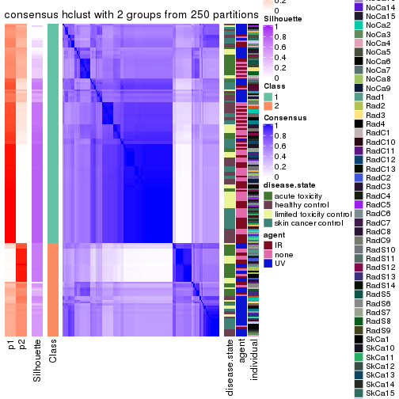</p>

</div>
<div id='tab-ATC-hclust-consensus-heatmap-2'>
<pre><code class="r">consensus_heatmap(res, k = 3)
</code></pre>

<p>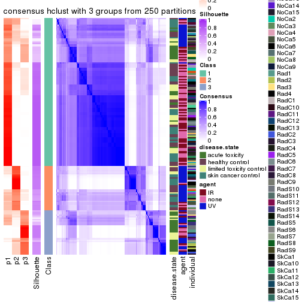</p>

</div>
<div id='tab-ATC-hclust-consensus-heatmap-3'>
<pre><code class="r">consensus_heatmap(res, k = 4)
</code></pre>

<p>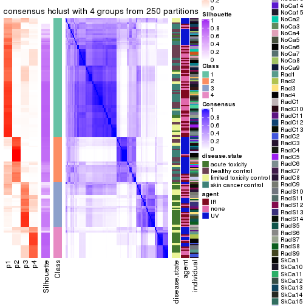</p>

</div>
<div id='tab-ATC-hclust-consensus-heatmap-4'>
<pre><code class="r">consensus_heatmap(res, k = 5)
</code></pre>

<p>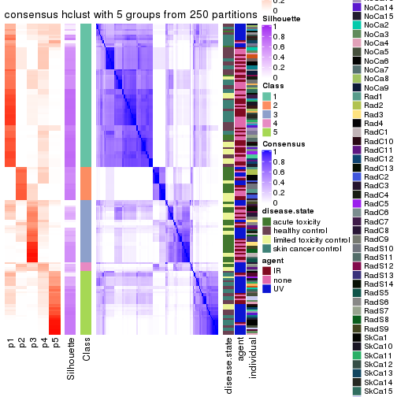</p>

</div>
<div id='tab-ATC-hclust-consensus-heatmap-5'>
<pre><code class="r">consensus_heatmap(res, k = 6)
</code></pre>

<p>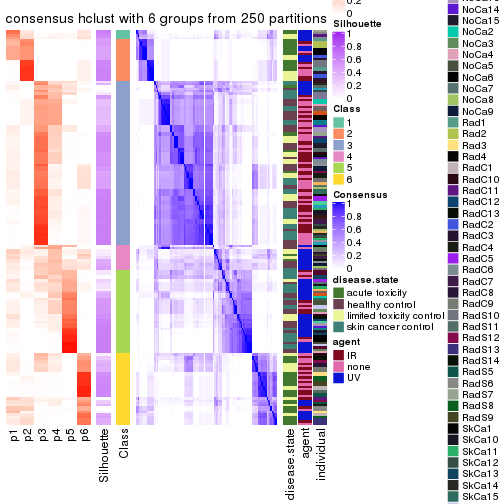</p>

</div>
</div>

Heatmaps for the membership of samples in all partitions to see how consistent they are:


<script>
$( function() {
	$( '#tabs-ATC-hclust-membership-heatmap' ).tabs();
} );
</script>
<div id='tabs-ATC-hclust-membership-heatmap'>
<ul>
<li><a href='#tab-ATC-hclust-membership-heatmap-1'>k = 2</a></li>
<li><a href='#tab-ATC-hclust-membership-heatmap-2'>k = 3</a></li>
<li><a href='#tab-ATC-hclust-membership-heatmap-3'>k = 4</a></li>
<li><a href='#tab-ATC-hclust-membership-heatmap-4'>k = 5</a></li>
<li><a href='#tab-ATC-hclust-membership-heatmap-5'>k = 6</a></li>
</ul>
<div id='tab-ATC-hclust-membership-heatmap-1'>
<pre><code class="r">membership_heatmap(res, k = 2)
</code></pre>

<p>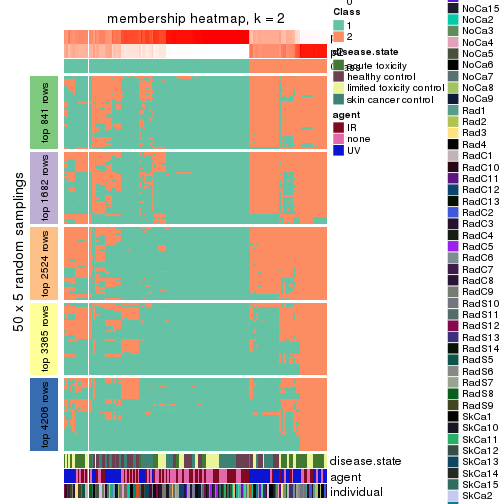</p>

</div>
<div id='tab-ATC-hclust-membership-heatmap-2'>
<pre><code class="r">membership_heatmap(res, k = 3)
</code></pre>

<p>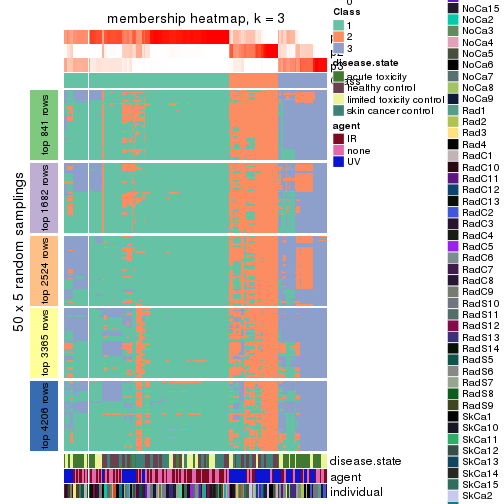</p>

</div>
<div id='tab-ATC-hclust-membership-heatmap-3'>
<pre><code class="r">membership_heatmap(res, k = 4)
</code></pre>

<p>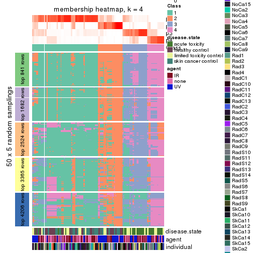</p>

</div>
<div id='tab-ATC-hclust-membership-heatmap-4'>
<pre><code class="r">membership_heatmap(res, k = 5)
</code></pre>

<p>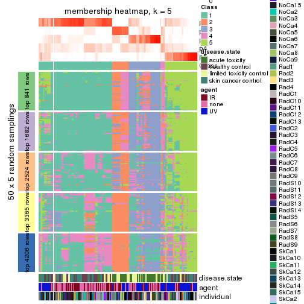</p>

</div>
<div id='tab-ATC-hclust-membership-heatmap-5'>
<pre><code class="r">membership_heatmap(res, k = 6)
</code></pre>

<p>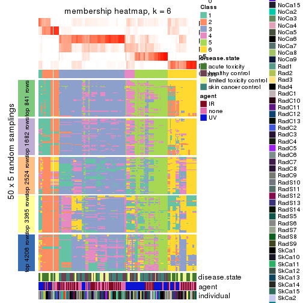</p>

</div>
</div>

As soon as we have had the classes for columns, we can look for signatures
which are significantly different between classes which can be candidate marks
for certain classes. Following are the heatmaps for signatures.


Signature heatmaps where rows are scaled:


<script>
$( function() {
	$( '#tabs-ATC-hclust-get-signatures' ).tabs();
} );
</script>
<div id='tabs-ATC-hclust-get-signatures'>
<ul>
<li><a href='#tab-ATC-hclust-get-signatures-1'>k = 2</a></li>
<li><a href='#tab-ATC-hclust-get-signatures-2'>k = 3</a></li>
<li><a href='#tab-ATC-hclust-get-signatures-3'>k = 4</a></li>
<li><a href='#tab-ATC-hclust-get-signatures-4'>k = 5</a></li>
<li><a href='#tab-ATC-hclust-get-signatures-5'>k = 6</a></li>
</ul>
<div id='tab-ATC-hclust-get-signatures-1'>
<pre><code class="r">get_signatures(res, k = 2)
</code></pre>

<p>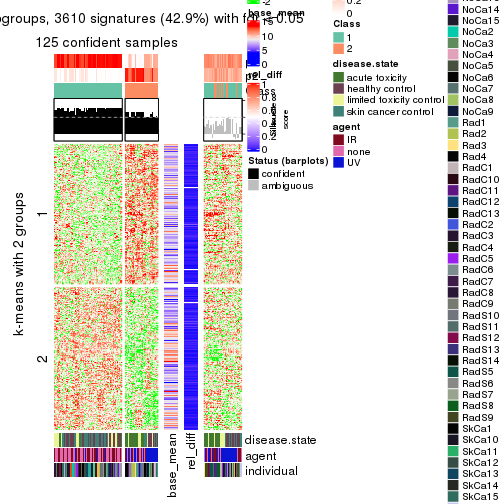</p>

</div>
<div id='tab-ATC-hclust-get-signatures-2'>
<pre><code class="r">get_signatures(res, k = 3)
</code></pre>

<p>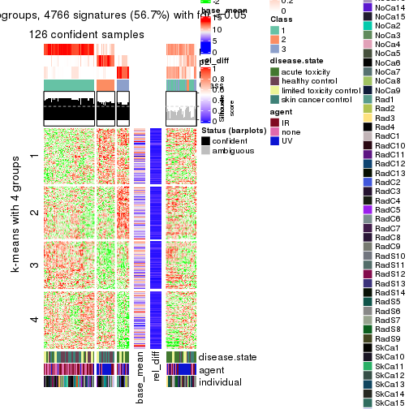</p>

</div>
<div id='tab-ATC-hclust-get-signatures-3'>
<pre><code class="r">get_signatures(res, k = 4)
</code></pre>

<p>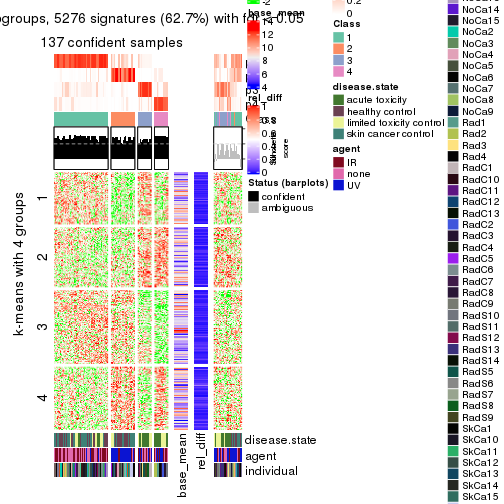</p>

</div>
<div id='tab-ATC-hclust-get-signatures-4'>
<pre><code class="r">get_signatures(res, k = 5)
</code></pre>

<p>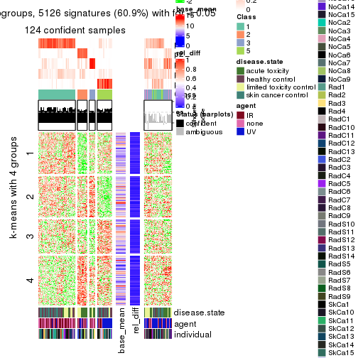</p>

</div>
<div id='tab-ATC-hclust-get-signatures-5'>
<pre><code class="r">get_signatures(res, k = 6)
</code></pre>

<p>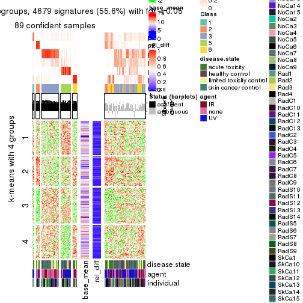</p>

</div>
</div>


Signature heatmaps where rows are not scaled:


<script>
$( function() {
	$( '#tabs-ATC-hclust-get-signatures-no-scale' ).tabs();
} );
</script>
<div id='tabs-ATC-hclust-get-signatures-no-scale'>
<ul>
<li><a href='#tab-ATC-hclust-get-signatures-no-scale-1'>k = 2</a></li>
<li><a href='#tab-ATC-hclust-get-signatures-no-scale-2'>k = 3</a></li>
<li><a href='#tab-ATC-hclust-get-signatures-no-scale-3'>k = 4</a></li>
<li><a href='#tab-ATC-hclust-get-signatures-no-scale-4'>k = 5</a></li>
<li><a href='#tab-ATC-hclust-get-signatures-no-scale-5'>k = 6</a></li>
</ul>
<div id='tab-ATC-hclust-get-signatures-no-scale-1'>
<pre><code class="r">get_signatures(res, k = 2, scale_rows = FALSE)
</code></pre>

<p>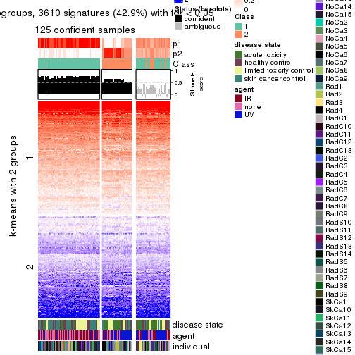</p>

</div>
<div id='tab-ATC-hclust-get-signatures-no-scale-2'>
<pre><code class="r">get_signatures(res, k = 3, scale_rows = FALSE)
</code></pre>

<p>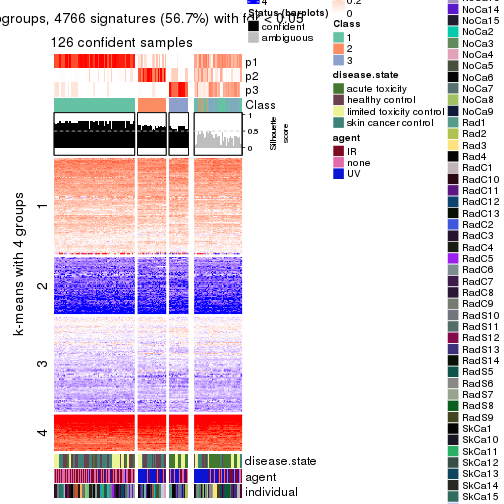</p>

</div>
<div id='tab-ATC-hclust-get-signatures-no-scale-3'>
<pre><code class="r">get_signatures(res, k = 4, scale_rows = FALSE)
</code></pre>

<p>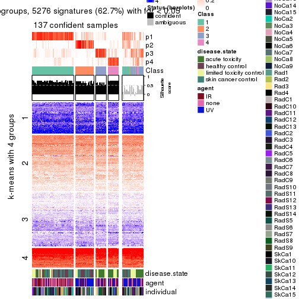</p>

</div>
<div id='tab-ATC-hclust-get-signatures-no-scale-4'>
<pre><code class="r">get_signatures(res, k = 5, scale_rows = FALSE)
</code></pre>

<p>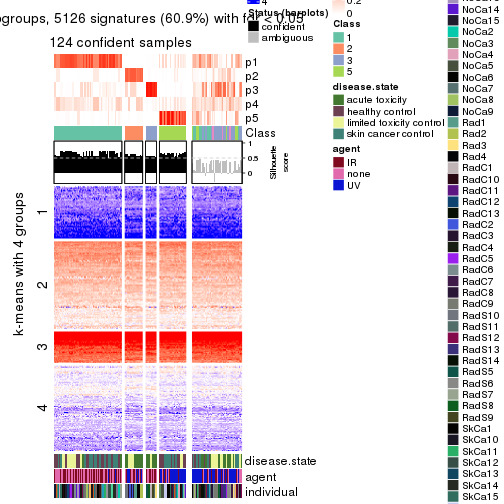</p>

</div>
<div id='tab-ATC-hclust-get-signatures-no-scale-5'>
<pre><code class="r">get_signatures(res, k = 6, scale_rows = FALSE)
</code></pre>

<p>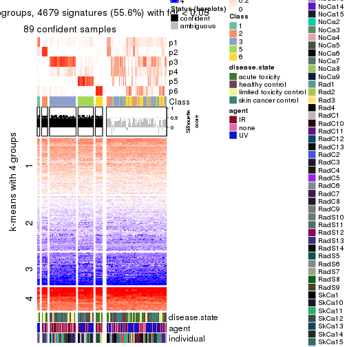</p>

</div>
</div>


Compare the overlap of signatures from different k:

```r
compare_signatures(res)
```

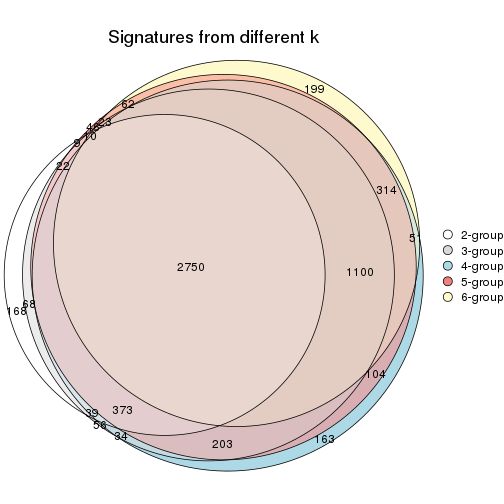

`get_signature()` returns a data frame invisibly. TO get the list of signatures, the function
call should be assigned to a variable explicitly. In following code, if `plot` argument is set
to `FALSE`, no heatmap is plotted while only the differential analysis is performed.

```r
# code only for demonstration
tb = get_signature(res, k = ..., plot = FALSE)
```

An example of the output of `tb` is:

```
#>   which_row         fdr    mean_1    mean_2 scaled_mean_1 scaled_mean_2 km
#> 1        38 0.042760348  8.373488  9.131774    -0.5533452     0.5164555  1
#> 2        40 0.018707592  7.106213  8.469186    -0.6173731     0.5762149  1
#> 3        55 0.019134737 10.221463 11.207825    -0.6159697     0.5749050  1
#> 4        59 0.006059896  5.921854  7.869574    -0.6899429     0.6439467  1
#> 5        60 0.018055526  8.928898 10.211722    -0.6204761     0.5791110  1
#> 6        98 0.009384629 15.714769 14.887706     0.6635654    -0.6193277  2
...
```

The columns in `tb` are:

1. `which_row`: row indices corresponding to the input matrix.
2. `fdr`: FDR for the differential test. 
3. `mean_x`: The mean value in group x.
4. `scaled_mean_x`: The mean value in group x after rows are scaled.
5. `km`: Row groups if k-means clustering is applied to rows.


UMAP plot which shows how samples are separated.


<script>
$( function() {
	$( '#tabs-ATC-hclust-dimension-reduction' ).tabs();
} );
</script>
<div id='tabs-ATC-hclust-dimension-reduction'>
<ul>
<li><a href='#tab-ATC-hclust-dimension-reduction-1'>k = 2</a></li>
<li><a href='#tab-ATC-hclust-dimension-reduction-2'>k = 3</a></li>
<li><a href='#tab-ATC-hclust-dimension-reduction-3'>k = 4</a></li>
<li><a href='#tab-ATC-hclust-dimension-reduction-4'>k = 5</a></li>
<li><a href='#tab-ATC-hclust-dimension-reduction-5'>k = 6</a></li>
</ul>
<div id='tab-ATC-hclust-dimension-reduction-1'>
<pre><code class="r">dimension_reduction(res, k = 2, method = &quot;UMAP&quot;)
</code></pre>

<p>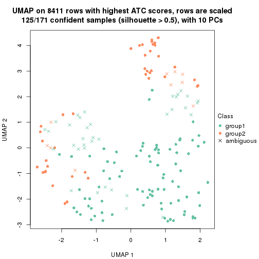</p>

</div>
<div id='tab-ATC-hclust-dimension-reduction-2'>
<pre><code class="r">dimension_reduction(res, k = 3, method = &quot;UMAP&quot;)
</code></pre>

<p>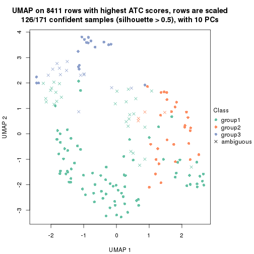</p>

</div>
<div id='tab-ATC-hclust-dimension-reduction-3'>
<pre><code class="r">dimension_reduction(res, k = 4, method = &quot;UMAP&quot;)
</code></pre>

<p>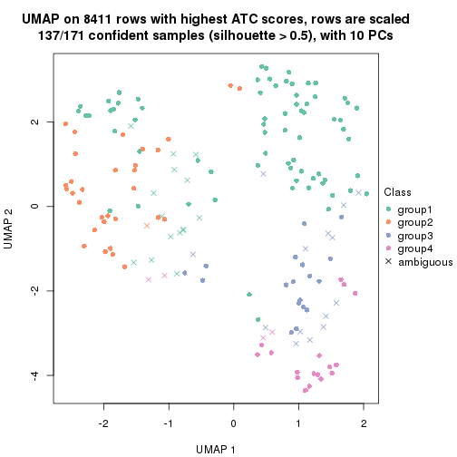</p>

</div>
<div id='tab-ATC-hclust-dimension-reduction-4'>
<pre><code class="r">dimension_reduction(res, k = 5, method = &quot;UMAP&quot;)
</code></pre>

<p>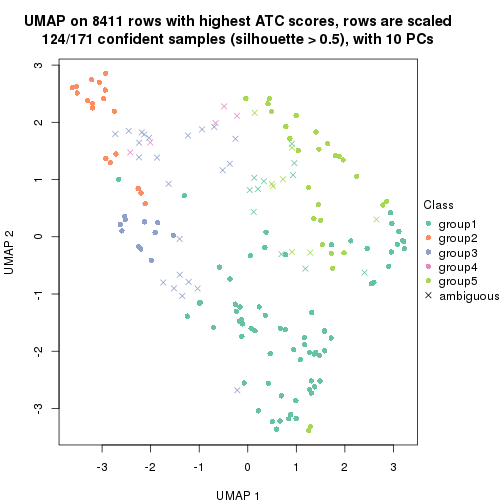</p>

</div>
<div id='tab-ATC-hclust-dimension-reduction-5'>
<pre><code class="r">dimension_reduction(res, k = 6, method = &quot;UMAP&quot;)
</code></pre>

<p>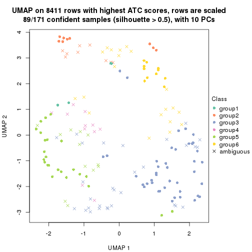</p>

</div>
</div>


Following heatmap shows how subgroups are split when increasing `k`:

```r
collect_classes(res)
```

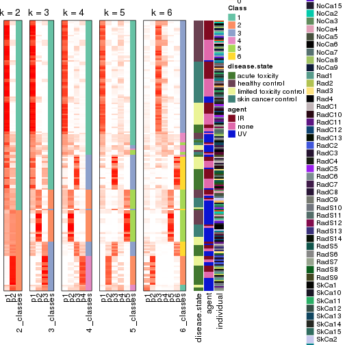


Test correlation between subgroups and known annotations. If the known
annotation is numeric, one-way ANOVA test is applied, and if the known
annotation is discrete, chi-squared contingency table test is applied.

```r
test_to_known_factors(res)
```

```
#>              n disease.state(p) agent(p) individual(p) k
#> ATC:hclust 125         2.03e-04 4.99e-10      2.01e-03 2
#> ATC:hclust 126         4.14e-09 8.92e-10      1.62e-07 3
#> ATC:hclust 137         1.44e-13 3.01e-09      3.76e-13 4
#> ATC:hclust 124         3.30e-13 2.34e-10      2.41e-12 5
#> ATC:hclust  89         6.50e-08 5.13e-09      1.14e-07 6
```


If matrix rows can be associated to genes, consider to use `functional_enrichment(res,
...)` to perform function enrichment for the signature genes. See [this vignette](http://bioconductor.org/packages/devel/bioc/vignettes/cola/inst/doc/functional_enrichment.html) for more detailed explanations.


 

---------------------------------------------------


### ATC:kmeans**


The object with results only for a single top-value method and a single partition method 
can be extracted as:

```r
res = res_list["ATC", "kmeans"]
# you can also extract it by
# res = res_list["ATC:kmeans"]
```

A summary of `res` and all the functions that can be applied to it:

```r
res
```

```
#> A 'ConsensusPartition' object with k = 2, 3, 4, 5, 6.
#>   On a matrix with 8411 rows and 171 columns.
#>   Top rows (841, 1682, 2524, 3365, 4206) are extracted by 'ATC' method.
#>   Subgroups are detected by 'kmeans' method.
#>   Performed in total 1250 partitions by row resampling.
#>   Best k for subgroups seems to be 3.
#> 
#> Following methods can be applied to this 'ConsensusPartition' object:
#>  [1] "cola_report"             "collect_classes"         "collect_plots"          
#>  [4] "collect_stats"           "colnames"                "compare_signatures"     
#>  [7] "consensus_heatmap"       "dimension_reduction"     "functional_enrichment"  
#> [10] "get_anno_col"            "get_anno"                "get_classes"            
#> [13] "get_consensus"           "get_matrix"              "get_membership"         
#> [16] "get_param"               "get_signatures"          "get_stats"              
#> [19] "is_best_k"               "is_stable_k"             "membership_heatmap"     
#> [22] "ncol"                    "nrow"                    "plot_ecdf"              
#> [25] "rownames"                "select_partition_number" "show"                   
#> [28] "suggest_best_k"          "test_to_known_factors"
```

`collect_plots()` function collects all the plots made from `res` for all `k` (number of partitions)
into one single page to provide an easy and fast comparison between different `k`.

```r
collect_plots(res)
```

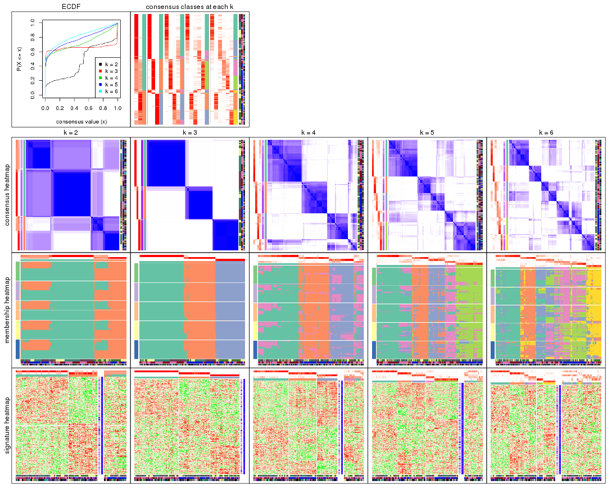

The plots are:

- The first row: a plot of the ECDF (empirical cumulative distribution
  function) curves of the consensus matrix for each `k` and the heatmap of
  predicted classes for each `k`.
- The second row: heatmaps of the consensus matrix for each `k`.
- The third row: heatmaps of the membership matrix for each `k`.
- The fouth row: heatmaps of the signatures for each `k`.

All the plots in panels can be made by individual functions and they are
plotted later in this section.

`select_partition_number()` produces several plots showing different
statistics for choosing "optimized" `k`. There are following statistics:

- ECDF curves of the consensus matrix for each `k`;
- 1-PAC. [The PAC
  score](https://en.wikipedia.org/wiki/Consensus_clustering#Over-interpretation_potential_of_consensus_clustering)
  measures the proportion of the ambiguous subgrouping.
- Mean silhouette score.
- Concordance. The mean probability of fiting the consensus class ids in all
  partitions.
- Area increased. Denote $A_k$ as the area under the ECDF curve for current
  `k`, the area increased is defined as $A_k - A_{k-1}$.
- Rand index. The percent of pairs of samples that are both in a same cluster
  or both are not in a same cluster in the partition of k and k-1.
- Jaccard index. The ratio of pairs of samples are both in a same cluster in
  the partition of k and k-1 and the pairs of samples are both in a same
  cluster in the partition k or k-1.

The detailed explanations of these statistics can be found in [the _cola_
vignette](http://bioconductor.org/packages/devel/bioc/vignettes/cola/inst/doc/cola.html#toc_13).

Generally speaking, lower PAC score, higher mean silhouette score or higher
concordance corresponds to better partition. Rand index and Jaccard index
measure how similar the current partition is compared to partition with `k-1`.
If they are too similar, we won't accept `k` is better than `k-1`.

```r
select_partition_number(res)
```

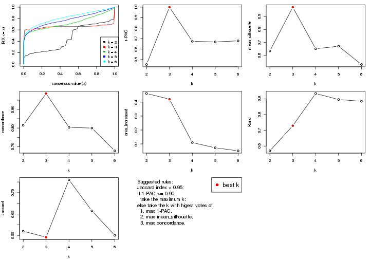

The numeric values for all these statistics can be obtained by `get_stats()`.

```r
get_stats(res)
```

```
#>   k 1-PAC mean_silhouette concordance area_increased  Rand Jaccard
#> 2 2 0.454           0.635       0.815         0.4619 0.570   0.570
#> 3 3 1.000           0.972       0.986         0.4213 0.729   0.542
#> 4 4 0.674           0.652       0.803         0.1094 0.934   0.810
#> 5 5 0.669           0.671       0.800         0.0722 0.896   0.665
#> 6 6 0.679           0.531       0.677         0.0503 0.884   0.550
```

`suggest_best_k()` suggests the best $k$ based on these statistics. The rules are as follows:

- All $k$ with Jaccard index larger than 0.95 are removed because increasing
  $k$ does not provide enough extra information. If all $k$ are removed, it is
  marked as no subgroup is detected.
- For all $k$ with 1-PAC score larger than 0.9, the maximal $k$ is taken as
  the best $k$, and other $k$ are marked as optional $k$.
- If it does not fit the second rule. The $k$ with the maximal vote of the
  highest 1-PAC score, highest mean silhouette, and highest concordance is
  taken as the best $k$.

```r
suggest_best_k(res)
```

```
#> [1] 3
```


Following shows the table of the partitions (You need to click the **show/hide
code output** link to see it). The membership matrix (columns with name `p*`)
is inferred by
[`clue::cl_consensus()`](https://www.rdocumentation.org/link/cl_consensus?package=clue)
function with the `SE` method. Basically the value in the membership matrix
represents the probability to belong to a certain group. The finall class
label for an item is determined with the group with highest probability it
belongs to.

In `get_classes()` function, the entropy is calculated from the membership
matrix and the silhouette score is calculated from the consensus matrix.


<script>
$( function() {
	$( '#tabs-ATC-kmeans-get-classes' ).tabs();
} );
</script>
<div id='tabs-ATC-kmeans-get-classes'>
<ul>
<li><a href='#tab-ATC-kmeans-get-classes-1'>k = 2</a></li>
<li><a href='#tab-ATC-kmeans-get-classes-2'>k = 3</a></li>
<li><a href='#tab-ATC-kmeans-get-classes-3'>k = 4</a></li>
<li><a href='#tab-ATC-kmeans-get-classes-4'>k = 5</a></li>
<li><a href='#tab-ATC-kmeans-get-classes-5'>k = 6</a></li>
</ul>

<div id='tab-ATC-kmeans-get-classes-1'>
<p><a id='tab-ATC-kmeans-get-classes-1-a' style='color:#0366d6' href='#'>show/hide code output</a></p>
<pre><code class="r">cbind(get_classes(res, k = 2), get_membership(res, k = 2))
</code></pre>

<pre><code>#&gt;          class entropy silhouette    p1    p2
#&gt; GSM29783     1  0.0000      0.738 1.000 0.000
#&gt; GSM29786     1  0.0376      0.737 0.996 0.004
#&gt; GSM29789     1  0.9286      0.577 0.656 0.344
#&gt; GSM29792     1  0.9775      0.540 0.588 0.412
#&gt; GSM29795     1  0.9754      0.542 0.592 0.408
#&gt; GSM29798     1  0.0000      0.738 1.000 0.000
#&gt; GSM29801     1  0.0000      0.738 1.000 0.000
#&gt; GSM29804     1  0.0000      0.738 1.000 0.000
#&gt; GSM29807     1  0.0000      0.738 1.000 0.000
#&gt; GSM29816     1  0.0000      0.738 1.000 0.000
#&gt; GSM29821     1  0.0000      0.738 1.000 0.000
#&gt; GSM29824     1  0.0000      0.738 1.000 0.000
#&gt; GSM29827     1  0.0000      0.738 1.000 0.000
#&gt; GSM29830     1  0.0000      0.738 1.000 0.000
#&gt; GSM29833     1  0.0000      0.738 1.000 0.000
#&gt; GSM29784     1  0.0000      0.738 1.000 0.000
#&gt; GSM29787     1  0.1414      0.730 0.980 0.020
#&gt; GSM29790     1  0.7139      0.651 0.804 0.196
#&gt; GSM29793     1  0.7453      0.642 0.788 0.212
#&gt; GSM29796     1  0.9552      0.560 0.624 0.376
#&gt; GSM29799     1  0.0000      0.738 1.000 0.000
#&gt; GSM29802     1  0.0000      0.738 1.000 0.000
#&gt; GSM29805     1  0.0000      0.738 1.000 0.000
#&gt; GSM29814     1  0.0000      0.738 1.000 0.000
#&gt; GSM29817     1  0.0000      0.738 1.000 0.000
#&gt; GSM29822     1  0.0000      0.738 1.000 0.000
#&gt; GSM29825     1  0.0000      0.738 1.000 0.000
#&gt; GSM29828     1  0.0000      0.738 1.000 0.000
#&gt; GSM29831     1  0.0000      0.738 1.000 0.000
#&gt; GSM29834     1  0.0000      0.738 1.000 0.000
#&gt; GSM29785     1  0.9970      0.498 0.532 0.468
#&gt; GSM29788     1  0.9970      0.498 0.532 0.468
#&gt; GSM29791     1  0.9970      0.498 0.532 0.468
#&gt; GSM29794     1  0.9970      0.498 0.532 0.468
#&gt; GSM29797     1  0.9970      0.498 0.532 0.468
#&gt; GSM29800     1  0.9970      0.498 0.532 0.468
#&gt; GSM29803     1  0.9970      0.498 0.532 0.468
#&gt; GSM29806     1  0.9970      0.498 0.532 0.468
#&gt; GSM29815     1  0.9970      0.498 0.532 0.468
#&gt; GSM29819     1  0.9635      0.549 0.612 0.388
#&gt; GSM29823     1  0.9970      0.498 0.532 0.468
#&gt; GSM29826     1  0.3733      0.708 0.928 0.072
#&gt; GSM29829     1  0.9954      0.504 0.540 0.460
#&gt; GSM29832     1  0.9970      0.498 0.532 0.468
#&gt; GSM29835     1  0.9970      0.498 0.532 0.468
#&gt; GSM29836     1  0.9970      0.498 0.532 0.468
#&gt; GSM29839     1  0.9754      0.542 0.592 0.408
#&gt; GSM29842     1  0.0000      0.738 1.000 0.000
#&gt; GSM29845     1  0.0000      0.738 1.000 0.000
#&gt; GSM29848     1  0.0000      0.738 1.000 0.000
#&gt; GSM29851     1  0.0000      0.738 1.000 0.000
#&gt; GSM29854     1  0.0000      0.738 1.000 0.000
#&gt; GSM29857     1  0.0000      0.738 1.000 0.000
#&gt; GSM29860     1  0.9754      0.542 0.592 0.408
#&gt; GSM29863     1  0.0000      0.738 1.000 0.000
#&gt; GSM29866     1  0.0000      0.738 1.000 0.000
#&gt; GSM29869     1  0.0000      0.738 1.000 0.000
#&gt; GSM29872     1  0.0000      0.738 1.000 0.000
#&gt; GSM29875     1  0.0000      0.738 1.000 0.000
#&gt; GSM29878     1  0.0000      0.738 1.000 0.000
#&gt; GSM29837     1  0.9970      0.498 0.532 0.468
#&gt; GSM29840     1  0.6712      0.662 0.824 0.176
#&gt; GSM29843     1  0.0000      0.738 1.000 0.000
#&gt; GSM29846     1  0.0000      0.738 1.000 0.000
#&gt; GSM29849     1  0.0000      0.738 1.000 0.000
#&gt; GSM29852     1  0.0000      0.738 1.000 0.000
#&gt; GSM29855     1  0.0000      0.738 1.000 0.000
#&gt; GSM29858     1  0.0000      0.738 1.000 0.000
#&gt; GSM29861     1  0.6623      0.663 0.828 0.172
#&gt; GSM29864     1  0.0000      0.738 1.000 0.000
#&gt; GSM29867     1  0.0000      0.738 1.000 0.000
#&gt; GSM29870     1  0.0000      0.738 1.000 0.000
#&gt; GSM29873     1  0.0000      0.738 1.000 0.000
#&gt; GSM29876     1  0.0000      0.738 1.000 0.000
#&gt; GSM29879     1  0.0000      0.738 1.000 0.000
#&gt; GSM29838     1  0.9970      0.498 0.532 0.468
#&gt; GSM29841     1  0.9970      0.498 0.532 0.468
#&gt; GSM29844     1  0.9970      0.498 0.532 0.468
#&gt; GSM29847     1  0.9954      0.504 0.540 0.460
#&gt; GSM29850     1  0.9850      0.528 0.572 0.428
#&gt; GSM29853     1  0.9795      0.537 0.584 0.416
#&gt; GSM29856     1  0.9970      0.498 0.532 0.468
#&gt; GSM29859     1  0.9970      0.498 0.532 0.468
#&gt; GSM29862     1  0.9970      0.498 0.532 0.468
#&gt; GSM29865     1  0.9970      0.498 0.532 0.468
#&gt; GSM29868     1  0.9970      0.498 0.532 0.468
#&gt; GSM29871     1  0.9775      0.540 0.588 0.412
#&gt; GSM29874     1  0.9970      0.498 0.532 0.468
#&gt; GSM29877     1  0.0000      0.738 1.000 0.000
#&gt; GSM29880     1  0.9970      0.498 0.532 0.468
#&gt; GSM29881     2  0.9896      0.533 0.440 0.560
#&gt; GSM29884     2  0.0000      0.722 0.000 1.000
#&gt; GSM29887     2  0.0000      0.722 0.000 1.000
#&gt; GSM29890     1  0.0000      0.738 1.000 0.000
#&gt; GSM29893     1  0.0000      0.738 1.000 0.000
#&gt; GSM29896     1  0.0000      0.738 1.000 0.000
#&gt; GSM29899     1  0.0000      0.738 1.000 0.000
#&gt; GSM29902     2  0.9983      0.489 0.476 0.524
#&gt; GSM29905     2  0.9970      0.501 0.468 0.532
#&gt; GSM29908     1  0.0000      0.738 1.000 0.000
#&gt; GSM29955     2  0.9732      0.563 0.404 0.596
#&gt; GSM29958     1  0.0000      0.738 1.000 0.000
#&gt; GSM29961     1  0.0000      0.738 1.000 0.000
#&gt; GSM29882     2  0.9970      0.500 0.468 0.532
#&gt; GSM29885     2  0.0000      0.722 0.000 1.000
#&gt; GSM29888     2  0.3114      0.710 0.056 0.944
#&gt; GSM29891     1  0.0000      0.738 1.000 0.000
#&gt; GSM29894     1  0.0000      0.738 1.000 0.000
#&gt; GSM29897     1  0.0000      0.738 1.000 0.000
#&gt; GSM29900     1  0.0000      0.738 1.000 0.000
#&gt; GSM29903     2  0.9944      0.517 0.456 0.544
#&gt; GSM29906     2  0.9944      0.517 0.456 0.544
#&gt; GSM29909     2  0.9944      0.517 0.456 0.544
#&gt; GSM29956     1  0.0000      0.738 1.000 0.000
#&gt; GSM29959     1  0.0000      0.738 1.000 0.000
#&gt; GSM29962     1  0.0000      0.738 1.000 0.000
#&gt; GSM29883     2  0.0000      0.722 0.000 1.000
#&gt; GSM29886     2  0.0000      0.722 0.000 1.000
#&gt; GSM29889     2  0.0000      0.722 0.000 1.000
#&gt; GSM29892     2  0.0000      0.722 0.000 1.000
#&gt; GSM29895     1  0.9970      0.498 0.532 0.468
#&gt; GSM29898     2  0.0000      0.722 0.000 1.000
#&gt; GSM29901     2  0.0938      0.720 0.012 0.988
#&gt; GSM29904     1  0.9970      0.498 0.532 0.468
#&gt; GSM29907     1  0.9970      0.498 0.532 0.468
#&gt; GSM29910     1  0.9970      0.498 0.532 0.468
#&gt; GSM29957     2  0.0000      0.722 0.000 1.000
#&gt; GSM29960     1  0.9970      0.498 0.532 0.468
#&gt; GSM29963     1  0.9970      0.498 0.532 0.468
#&gt; GSM29964     2  0.8386      0.633 0.268 0.732
#&gt; GSM29967     2  0.0000      0.722 0.000 1.000
#&gt; GSM29970     2  0.9896      0.533 0.440 0.560
#&gt; GSM29973     2  0.0000      0.722 0.000 1.000
#&gt; GSM29976     2  0.9754      0.561 0.408 0.592
#&gt; GSM29979     2  0.0000      0.722 0.000 1.000
#&gt; GSM29982     1  0.9580      0.549 0.620 0.380
#&gt; GSM29985     2  0.9754      0.561 0.408 0.592
#&gt; GSM29988     2  0.9754      0.561 0.408 0.592
#&gt; GSM29991     2  0.8909      0.614 0.308 0.692
#&gt; GSM29994     2  0.9944      0.517 0.456 0.544
#&gt; GSM29997     1  0.0000      0.738 1.000 0.000
#&gt; GSM30000     2  0.4939      0.698 0.108 0.892
#&gt; GSM30003     1  0.0000      0.738 1.000 0.000
#&gt; GSM29965     2  0.8499      0.629 0.276 0.724
#&gt; GSM29968     2  0.0000      0.722 0.000 1.000
#&gt; GSM29971     1  0.9710     -0.224 0.600 0.400
#&gt; GSM29974     2  0.0000      0.722 0.000 1.000
#&gt; GSM29977     2  0.9944      0.517 0.456 0.544
#&gt; GSM29980     2  0.0000      0.722 0.000 1.000
#&gt; GSM29983     1  0.0000      0.738 1.000 0.000
#&gt; GSM29986     2  0.9754      0.561 0.408 0.592
#&gt; GSM29989     2  0.9944      0.517 0.456 0.544
#&gt; GSM29992     2  0.9754      0.561 0.408 0.592
#&gt; GSM29995     1  0.0000      0.738 1.000 0.000
#&gt; GSM29998     2  0.9970      0.500 0.468 0.532
#&gt; GSM30001     2  0.4939      0.698 0.108 0.892
#&gt; GSM30004     2  0.9988      0.482 0.480 0.520
#&gt; GSM29966     2  0.0000      0.722 0.000 1.000
#&gt; GSM29969     2  0.0000      0.722 0.000 1.000
#&gt; GSM29972     2  0.0000      0.722 0.000 1.000
#&gt; GSM29975     2  0.0000      0.722 0.000 1.000
#&gt; GSM29978     2  0.0000      0.722 0.000 1.000
#&gt; GSM29981     2  0.0000      0.722 0.000 1.000
#&gt; GSM29984     2  0.0000      0.722 0.000 1.000
#&gt; GSM29987     2  0.0000      0.722 0.000 1.000
#&gt; GSM29990     2  0.9993     -0.423 0.484 0.516
#&gt; GSM29993     2  0.0000      0.722 0.000 1.000
#&gt; GSM29996     1  0.9795      0.537 0.584 0.416
#&gt; GSM29999     2  0.5178      0.695 0.116 0.884
#&gt; GSM30002     2  0.0000      0.722 0.000 1.000
#&gt; GSM30005     1  0.9970      0.498 0.532 0.468
</code></pre>

<script>
$('#tab-ATC-kmeans-get-classes-1-a').parent().next().next().hide();
$('#tab-ATC-kmeans-get-classes-1-a').click(function(){
  $('#tab-ATC-kmeans-get-classes-1-a').parent().next().next().toggle();
  return(false);
});
</script>
</div>

<div id='tab-ATC-kmeans-get-classes-2'>
<p><a id='tab-ATC-kmeans-get-classes-2-a' style='color:#0366d6' href='#'>show/hide code output</a></p>
<pre><code class="r">cbind(get_classes(res, k = 3), get_membership(res, k = 3))
</code></pre>

<pre><code>#&gt;          class entropy silhouette    p1    p2    p3
#&gt; GSM29783     1  0.0000      0.996 1.000 0.000 0.000
#&gt; GSM29786     1  0.0000      0.996 1.000 0.000 0.000
#&gt; GSM29789     2  0.0237      0.965 0.004 0.996 0.000
#&gt; GSM29792     2  0.0237      0.965 0.004 0.996 0.000
#&gt; GSM29795     2  0.0237      0.965 0.004 0.996 0.000
#&gt; GSM29798     1  0.0000      0.996 1.000 0.000 0.000
#&gt; GSM29801     1  0.0000      0.996 1.000 0.000 0.000
#&gt; GSM29804     1  0.0000      0.996 1.000 0.000 0.000
#&gt; GSM29807     1  0.0000      0.996 1.000 0.000 0.000
#&gt; GSM29816     1  0.0000      0.996 1.000 0.000 0.000
#&gt; GSM29821     1  0.0000      0.996 1.000 0.000 0.000
#&gt; GSM29824     1  0.0000      0.996 1.000 0.000 0.000
#&gt; GSM29827     1  0.0000      0.996 1.000 0.000 0.000
#&gt; GSM29830     1  0.0000      0.996 1.000 0.000 0.000
#&gt; GSM29833     1  0.0000      0.996 1.000 0.000 0.000
#&gt; GSM29784     1  0.0000      0.996 1.000 0.000 0.000
#&gt; GSM29787     1  0.1163      0.968 0.972 0.028 0.000
#&gt; GSM29790     2  0.5785      0.545 0.332 0.668 0.000
#&gt; GSM29793     2  0.5058      0.707 0.244 0.756 0.000
#&gt; GSM29796     2  0.4062      0.817 0.164 0.836 0.000
#&gt; GSM29799     1  0.0000      0.996 1.000 0.000 0.000
#&gt; GSM29802     1  0.0000      0.996 1.000 0.000 0.000
#&gt; GSM29805     1  0.0000      0.996 1.000 0.000 0.000
#&gt; GSM29814     1  0.0000      0.996 1.000 0.000 0.000
#&gt; GSM29817     1  0.0000      0.996 1.000 0.000 0.000
#&gt; GSM29822     1  0.0000      0.996 1.000 0.000 0.000
#&gt; GSM29825     1  0.0000      0.996 1.000 0.000 0.000
#&gt; GSM29828     1  0.0000      0.996 1.000 0.000 0.000
#&gt; GSM29831     1  0.0000      0.996 1.000 0.000 0.000
#&gt; GSM29834     1  0.0000      0.996 1.000 0.000 0.000
#&gt; GSM29785     2  0.0237      0.965 0.004 0.996 0.000
#&gt; GSM29788     2  0.0237      0.965 0.004 0.996 0.000
#&gt; GSM29791     2  0.0237      0.965 0.004 0.996 0.000
#&gt; GSM29794     2  0.0237      0.965 0.004 0.996 0.000
#&gt; GSM29797     2  0.0237      0.965 0.004 0.996 0.000
#&gt; GSM29800     2  0.0237      0.965 0.004 0.996 0.000
#&gt; GSM29803     2  0.0237      0.965 0.004 0.996 0.000
#&gt; GSM29806     2  0.0237      0.965 0.004 0.996 0.000
#&gt; GSM29815     2  0.0237      0.965 0.004 0.996 0.000
#&gt; GSM29819     2  0.4605      0.761 0.204 0.796 0.000
#&gt; GSM29823     2  0.0237      0.965 0.004 0.996 0.000
#&gt; GSM29826     2  0.4842      0.734 0.224 0.776 0.000
#&gt; GSM29829     2  0.0237      0.965 0.004 0.996 0.000
#&gt; GSM29832     2  0.0237      0.965 0.004 0.996 0.000
#&gt; GSM29835     2  0.0237      0.965 0.004 0.996 0.000
#&gt; GSM29836     2  0.0237      0.965 0.004 0.996 0.000
#&gt; GSM29839     2  0.0237      0.965 0.004 0.996 0.000
#&gt; GSM29842     1  0.0000      0.996 1.000 0.000 0.000
#&gt; GSM29845     1  0.0000      0.996 1.000 0.000 0.000
#&gt; GSM29848     1  0.0000      0.996 1.000 0.000 0.000
#&gt; GSM29851     1  0.0000      0.996 1.000 0.000 0.000
#&gt; GSM29854     1  0.0000      0.996 1.000 0.000 0.000
#&gt; GSM29857     1  0.0000      0.996 1.000 0.000 0.000
#&gt; GSM29860     2  0.0237      0.965 0.004 0.996 0.000
#&gt; GSM29863     1  0.0000      0.996 1.000 0.000 0.000
#&gt; GSM29866     1  0.0000      0.996 1.000 0.000 0.000
#&gt; GSM29869     1  0.0000      0.996 1.000 0.000 0.000
#&gt; GSM29872     1  0.1031      0.972 0.976 0.024 0.000
#&gt; GSM29875     1  0.0000      0.996 1.000 0.000 0.000
#&gt; GSM29878     1  0.0000      0.996 1.000 0.000 0.000
#&gt; GSM29837     2  0.0237      0.965 0.004 0.996 0.000
#&gt; GSM29840     2  0.4399      0.788 0.188 0.812 0.000
#&gt; GSM29843     1  0.0000      0.996 1.000 0.000 0.000
#&gt; GSM29846     1  0.0000      0.996 1.000 0.000 0.000
#&gt; GSM29849     1  0.0000      0.996 1.000 0.000 0.000
#&gt; GSM29852     1  0.0000      0.996 1.000 0.000 0.000
#&gt; GSM29855     1  0.0000      0.996 1.000 0.000 0.000
#&gt; GSM29858     1  0.0000      0.996 1.000 0.000 0.000
#&gt; GSM29861     2  0.4452      0.783 0.192 0.808 0.000
#&gt; GSM29864     1  0.0000      0.996 1.000 0.000 0.000
#&gt; GSM29867     1  0.0000      0.996 1.000 0.000 0.000
#&gt; GSM29870     1  0.0000      0.996 1.000 0.000 0.000
#&gt; GSM29873     1  0.0000      0.996 1.000 0.000 0.000
#&gt; GSM29876     1  0.0000      0.996 1.000 0.000 0.000
#&gt; GSM29879     1  0.0000      0.996 1.000 0.000 0.000
#&gt; GSM29838     2  0.0000      0.961 0.000 1.000 0.000
#&gt; GSM29841     2  0.0237      0.965 0.004 0.996 0.000
#&gt; GSM29844     2  0.0237      0.965 0.004 0.996 0.000
#&gt; GSM29847     2  0.0237      0.965 0.004 0.996 0.000
#&gt; GSM29850     2  0.0237      0.965 0.004 0.996 0.000
#&gt; GSM29853     2  0.0237      0.965 0.004 0.996 0.000
#&gt; GSM29856     2  0.0237      0.965 0.004 0.996 0.000
#&gt; GSM29859     2  0.0237      0.965 0.004 0.996 0.000
#&gt; GSM29862     2  0.0237      0.965 0.004 0.996 0.000
#&gt; GSM29865     2  0.0237      0.965 0.004 0.996 0.000
#&gt; GSM29868     2  0.0237      0.965 0.004 0.996 0.000
#&gt; GSM29871     2  0.0237      0.965 0.004 0.996 0.000
#&gt; GSM29874     2  0.0237      0.965 0.004 0.996 0.000
#&gt; GSM29877     1  0.0000      0.996 1.000 0.000 0.000
#&gt; GSM29880     2  0.0237      0.965 0.004 0.996 0.000
#&gt; GSM29881     3  0.0000      0.991 0.000 0.000 1.000
#&gt; GSM29884     3  0.0237      0.991 0.000 0.004 0.996
#&gt; GSM29887     3  0.0237      0.991 0.000 0.004 0.996
#&gt; GSM29890     1  0.0000      0.996 1.000 0.000 0.000
#&gt; GSM29893     1  0.0000      0.996 1.000 0.000 0.000
#&gt; GSM29896     1  0.0000      0.996 1.000 0.000 0.000
#&gt; GSM29899     1  0.0000      0.996 1.000 0.000 0.000
#&gt; GSM29902     1  0.0424      0.989 0.992 0.000 0.008
#&gt; GSM29905     1  0.3412      0.861 0.876 0.000 0.124
#&gt; GSM29908     1  0.0000      0.996 1.000 0.000 0.000
#&gt; GSM29955     3  0.0000      0.991 0.000 0.000 1.000
#&gt; GSM29958     1  0.0000      0.996 1.000 0.000 0.000
#&gt; GSM29961     1  0.0000      0.996 1.000 0.000 0.000
#&gt; GSM29882     3  0.0592      0.980 0.012 0.000 0.988
#&gt; GSM29885     3  0.0237      0.991 0.000 0.004 0.996
#&gt; GSM29888     3  0.0237      0.991 0.000 0.004 0.996
#&gt; GSM29891     1  0.0237      0.992 0.996 0.000 0.004
#&gt; GSM29894     1  0.0000      0.996 1.000 0.000 0.000
#&gt; GSM29897     1  0.0000      0.996 1.000 0.000 0.000
#&gt; GSM29900     1  0.0237      0.992 0.996 0.000 0.004
#&gt; GSM29903     3  0.0000      0.991 0.000 0.000 1.000
#&gt; GSM29906     3  0.0000      0.991 0.000 0.000 1.000
#&gt; GSM29909     3  0.0237      0.988 0.004 0.000 0.996
#&gt; GSM29956     1  0.0000      0.996 1.000 0.000 0.000
#&gt; GSM29959     1  0.0000      0.996 1.000 0.000 0.000
#&gt; GSM29962     1  0.0000      0.996 1.000 0.000 0.000
#&gt; GSM29883     3  0.0237      0.991 0.000 0.004 0.996
#&gt; GSM29886     3  0.1411      0.963 0.000 0.036 0.964
#&gt; GSM29889     2  0.0000      0.961 0.000 1.000 0.000
#&gt; GSM29892     3  0.0000      0.991 0.000 0.000 1.000
#&gt; GSM29895     2  0.0237      0.965 0.004 0.996 0.000
#&gt; GSM29898     3  0.0000      0.991 0.000 0.000 1.000
#&gt; GSM29901     3  0.0000      0.991 0.000 0.000 1.000
#&gt; GSM29904     2  0.0237      0.965 0.004 0.996 0.000
#&gt; GSM29907     2  0.0237      0.965 0.004 0.996 0.000
#&gt; GSM29910     2  0.0237      0.965 0.004 0.996 0.000
#&gt; GSM29957     3  0.1529      0.959 0.000 0.040 0.960
#&gt; GSM29960     2  0.0237      0.965 0.004 0.996 0.000
#&gt; GSM29963     2  0.0237      0.965 0.004 0.996 0.000
#&gt; GSM29964     3  0.0237      0.991 0.000 0.004 0.996
#&gt; GSM29967     3  0.0237      0.991 0.000 0.004 0.996
#&gt; GSM29970     3  0.0000      0.991 0.000 0.000 1.000
#&gt; GSM29973     3  0.0237      0.991 0.000 0.004 0.996
#&gt; GSM29976     3  0.0000      0.991 0.000 0.000 1.000
#&gt; GSM29979     3  0.0237      0.991 0.000 0.004 0.996
#&gt; GSM29982     1  0.2711      0.904 0.912 0.000 0.088
#&gt; GSM29985     3  0.0000      0.991 0.000 0.000 1.000
#&gt; GSM29988     3  0.0000      0.991 0.000 0.000 1.000
#&gt; GSM29991     3  0.0000      0.991 0.000 0.000 1.000
#&gt; GSM29994     3  0.0000      0.991 0.000 0.000 1.000
#&gt; GSM29997     1  0.0000      0.996 1.000 0.000 0.000
#&gt; GSM30000     3  0.0000      0.991 0.000 0.000 1.000
#&gt; GSM30003     1  0.0000      0.996 1.000 0.000 0.000
#&gt; GSM29965     3  0.0237      0.991 0.000 0.004 0.996
#&gt; GSM29968     3  0.0237      0.991 0.000 0.004 0.996
#&gt; GSM29971     1  0.0237      0.992 0.996 0.000 0.004
#&gt; GSM29974     3  0.0237      0.991 0.000 0.004 0.996
#&gt; GSM29977     3  0.0000      0.991 0.000 0.000 1.000
#&gt; GSM29980     3  0.0237      0.991 0.000 0.004 0.996
#&gt; GSM29983     1  0.0000      0.996 1.000 0.000 0.000
#&gt; GSM29986     3  0.0000      0.991 0.000 0.000 1.000
#&gt; GSM29989     3  0.0000      0.991 0.000 0.000 1.000
#&gt; GSM29992     3  0.0000      0.991 0.000 0.000 1.000
#&gt; GSM29995     1  0.0000      0.996 1.000 0.000 0.000
#&gt; GSM29998     3  0.0237      0.988 0.004 0.000 0.996
#&gt; GSM30001     3  0.0000      0.991 0.000 0.000 1.000
#&gt; GSM30004     1  0.0237      0.992 0.996 0.000 0.004
#&gt; GSM29966     3  0.0237      0.991 0.000 0.004 0.996
#&gt; GSM29969     3  0.0237      0.991 0.000 0.004 0.996
#&gt; GSM29972     3  0.0000      0.991 0.000 0.000 1.000
#&gt; GSM29975     3  0.0237      0.991 0.000 0.004 0.996
#&gt; GSM29978     3  0.0000      0.991 0.000 0.000 1.000
#&gt; GSM29981     3  0.5254      0.654 0.000 0.264 0.736
#&gt; GSM29984     3  0.0237      0.991 0.000 0.004 0.996
#&gt; GSM29987     3  0.0237      0.991 0.000 0.004 0.996
#&gt; GSM29990     2  0.0661      0.959 0.004 0.988 0.008
#&gt; GSM29993     3  0.0237      0.991 0.000 0.004 0.996
#&gt; GSM29996     2  0.0237      0.965 0.004 0.996 0.000
#&gt; GSM29999     3  0.0000      0.991 0.000 0.000 1.000
#&gt; GSM30002     3  0.0237      0.991 0.000 0.004 0.996
#&gt; GSM30005     2  0.0237      0.965 0.004 0.996 0.000
</code></pre>

<script>
$('#tab-ATC-kmeans-get-classes-2-a').parent().next().next().hide();
$('#tab-ATC-kmeans-get-classes-2-a').click(function(){
  $('#tab-ATC-kmeans-get-classes-2-a').parent().next().next().toggle();
  return(false);
});
</script>
</div>

<div id='tab-ATC-kmeans-get-classes-3'>
<p><a id='tab-ATC-kmeans-get-classes-3-a' style='color:#0366d6' href='#'>show/hide code output</a></p>
<pre><code class="r">cbind(get_classes(res, k = 4), get_membership(res, k = 4))
</code></pre>

<pre><code>#&gt;          class entropy silhouette    p1    p2    p3    p4
#&gt; GSM29783     1  0.5766    0.42485 0.512 0.004 0.020 0.464
#&gt; GSM29786     1  0.6279    0.42005 0.516 0.024 0.020 0.440
#&gt; GSM29789     2  0.6204    0.69623 0.164 0.672 0.000 0.164
#&gt; GSM29792     2  0.4552    0.80426 0.128 0.800 0.000 0.072
#&gt; GSM29795     2  0.4775    0.78984 0.140 0.784 0.000 0.076
#&gt; GSM29798     1  0.5615    0.49607 0.556 0.004 0.016 0.424
#&gt; GSM29801     1  0.0000    0.79211 1.000 0.000 0.000 0.000
#&gt; GSM29804     1  0.2345    0.77678 0.900 0.000 0.000 0.100
#&gt; GSM29807     1  0.2345    0.77435 0.900 0.000 0.000 0.100
#&gt; GSM29816     1  0.4605    0.65180 0.664 0.000 0.000 0.336
#&gt; GSM29821     1  0.0469    0.79105 0.988 0.000 0.000 0.012
#&gt; GSM29824     1  0.0000    0.79211 1.000 0.000 0.000 0.000
#&gt; GSM29827     1  0.0376    0.79078 0.992 0.004 0.000 0.004
#&gt; GSM29830     1  0.0000    0.79211 1.000 0.000 0.000 0.000
#&gt; GSM29833     1  0.0657    0.78975 0.984 0.004 0.000 0.012
#&gt; GSM29784     4  0.5774   -0.43168 0.480 0.004 0.020 0.496
#&gt; GSM29787     1  0.6876    0.33700 0.464 0.056 0.020 0.460
#&gt; GSM29790     4  0.8142    0.00190 0.256 0.252 0.020 0.472
#&gt; GSM29793     4  0.8216   -0.09490 0.216 0.336 0.020 0.428
#&gt; GSM29796     2  0.7145    0.52459 0.192 0.556 0.000 0.252
#&gt; GSM29799     4  0.5766   -0.43058 0.464 0.004 0.020 0.512
#&gt; GSM29802     1  0.4585    0.65577 0.668 0.000 0.000 0.332
#&gt; GSM29805     1  0.4585    0.65577 0.668 0.000 0.000 0.332
#&gt; GSM29814     1  0.4643    0.64520 0.656 0.000 0.000 0.344
#&gt; GSM29817     1  0.3837    0.73732 0.776 0.000 0.000 0.224
#&gt; GSM29822     1  0.4103    0.71788 0.744 0.000 0.000 0.256
#&gt; GSM29825     1  0.2760    0.77682 0.872 0.000 0.000 0.128
#&gt; GSM29828     1  0.1004    0.79175 0.972 0.004 0.000 0.024
#&gt; GSM29831     1  0.0592    0.79319 0.984 0.000 0.000 0.016
#&gt; GSM29834     1  0.0817    0.79269 0.976 0.000 0.000 0.024
#&gt; GSM29785     2  0.2921    0.86011 0.000 0.860 0.000 0.140
#&gt; GSM29788     2  0.2814    0.86298 0.000 0.868 0.000 0.132
#&gt; GSM29791     2  0.1576    0.88439 0.000 0.948 0.004 0.048
#&gt; GSM29794     2  0.1576    0.88439 0.000 0.948 0.004 0.048
#&gt; GSM29797     2  0.1576    0.88439 0.000 0.948 0.004 0.048
#&gt; GSM29800     2  0.4678    0.78036 0.000 0.744 0.024 0.232
#&gt; GSM29803     2  0.1743    0.88464 0.000 0.940 0.004 0.056
#&gt; GSM29806     2  0.2473    0.87558 0.000 0.908 0.012 0.080
#&gt; GSM29815     2  0.2271    0.87890 0.000 0.916 0.008 0.076
#&gt; GSM29819     2  0.4660    0.79616 0.060 0.804 0.008 0.128
#&gt; GSM29823     2  0.0188    0.88749 0.004 0.996 0.000 0.000
#&gt; GSM29826     2  0.5712    0.40475 0.384 0.584 0.000 0.032
#&gt; GSM29829     2  0.0188    0.88749 0.004 0.996 0.000 0.000
#&gt; GSM29832     2  0.0188    0.88749 0.004 0.996 0.000 0.000
#&gt; GSM29835     2  0.0779    0.88770 0.004 0.980 0.000 0.016
#&gt; GSM29836     2  0.1576    0.88439 0.000 0.948 0.004 0.048
#&gt; GSM29839     2  0.6122    0.70537 0.160 0.680 0.000 0.160
#&gt; GSM29842     1  0.5746    0.45029 0.532 0.004 0.020 0.444
#&gt; GSM29845     1  0.4920    0.57935 0.628 0.004 0.000 0.368
#&gt; GSM29848     1  0.4920    0.57935 0.628 0.004 0.000 0.368
#&gt; GSM29851     1  0.0000    0.79211 1.000 0.000 0.000 0.000
#&gt; GSM29854     1  0.2469    0.77502 0.892 0.000 0.000 0.108
#&gt; GSM29857     1  0.4661    0.63592 0.652 0.000 0.000 0.348
#&gt; GSM29860     2  0.4388    0.80654 0.132 0.808 0.000 0.060
#&gt; GSM29863     1  0.0000    0.79211 1.000 0.000 0.000 0.000
#&gt; GSM29866     1  0.0000    0.79211 1.000 0.000 0.000 0.000
#&gt; GSM29869     1  0.0000    0.79211 1.000 0.000 0.000 0.000
#&gt; GSM29872     1  0.2021    0.74999 0.936 0.040 0.000 0.024
#&gt; GSM29875     1  0.0000    0.79211 1.000 0.000 0.000 0.000
#&gt; GSM29878     1  0.0657    0.78975 0.984 0.004 0.000 0.012
#&gt; GSM29837     2  0.2949    0.87742 0.000 0.888 0.024 0.088
#&gt; GSM29840     2  0.7458    0.42509 0.240 0.508 0.000 0.252
#&gt; GSM29843     4  0.5774   -0.43168 0.480 0.004 0.020 0.496
#&gt; GSM29846     1  0.5763    0.45094 0.516 0.004 0.020 0.460
#&gt; GSM29849     1  0.5050    0.55319 0.588 0.004 0.000 0.408
#&gt; GSM29852     1  0.3610    0.74657 0.800 0.000 0.000 0.200
#&gt; GSM29855     1  0.4661    0.64258 0.652 0.000 0.000 0.348
#&gt; GSM29858     1  0.4713    0.63035 0.640 0.000 0.000 0.360
#&gt; GSM29861     2  0.6991    0.40895 0.324 0.540 0.000 0.136
#&gt; GSM29864     1  0.3942    0.73050 0.764 0.000 0.000 0.236
#&gt; GSM29867     1  0.3569    0.74889 0.804 0.000 0.000 0.196
#&gt; GSM29870     1  0.4431    0.68138 0.696 0.000 0.000 0.304
#&gt; GSM29873     1  0.3610    0.75224 0.800 0.000 0.000 0.200
#&gt; GSM29876     1  0.4624    0.65032 0.660 0.000 0.000 0.340
#&gt; GSM29879     1  0.4564    0.66999 0.672 0.000 0.000 0.328
#&gt; GSM29838     2  0.1661    0.88451 0.000 0.944 0.004 0.052
#&gt; GSM29841     2  0.1576    0.88439 0.000 0.948 0.004 0.048
#&gt; GSM29844     2  0.2216    0.87398 0.000 0.908 0.000 0.092
#&gt; GSM29847     2  0.3569    0.82480 0.000 0.804 0.000 0.196
#&gt; GSM29850     2  0.3649    0.81893 0.000 0.796 0.000 0.204
#&gt; GSM29853     2  0.1576    0.88577 0.004 0.948 0.000 0.048
#&gt; GSM29856     2  0.0779    0.88553 0.000 0.980 0.004 0.016
#&gt; GSM29859     2  0.2402    0.87736 0.000 0.912 0.012 0.076
#&gt; GSM29862     2  0.1209    0.88618 0.000 0.964 0.004 0.032
#&gt; GSM29865     2  0.1743    0.88464 0.000 0.940 0.004 0.056
#&gt; GSM29868     2  0.0188    0.88749 0.004 0.996 0.000 0.000
#&gt; GSM29871     2  0.2101    0.88285 0.012 0.928 0.000 0.060
#&gt; GSM29874     2  0.1209    0.88618 0.000 0.964 0.004 0.032
#&gt; GSM29877     1  0.2450    0.78792 0.912 0.016 0.000 0.072
#&gt; GSM29880     2  0.1209    0.88720 0.000 0.964 0.004 0.032
#&gt; GSM29881     3  0.4967    0.47960 0.000 0.000 0.548 0.452
#&gt; GSM29884     3  0.0592    0.75562 0.000 0.000 0.984 0.016
#&gt; GSM29887     3  0.0592    0.75562 0.000 0.000 0.984 0.016
#&gt; GSM29890     1  0.2408    0.75436 0.896 0.000 0.000 0.104
#&gt; GSM29893     1  0.0000    0.79211 1.000 0.000 0.000 0.000
#&gt; GSM29896     1  0.0000    0.79211 1.000 0.000 0.000 0.000
#&gt; GSM29899     1  0.2216    0.76209 0.908 0.000 0.000 0.092
#&gt; GSM29902     4  0.4722    0.31708 0.300 0.000 0.008 0.692
#&gt; GSM29905     4  0.5810    0.39557 0.276 0.000 0.064 0.660
#&gt; GSM29908     1  0.0188    0.79094 0.996 0.004 0.000 0.000
#&gt; GSM29955     3  0.7538    0.24552 0.188 0.000 0.428 0.384
#&gt; GSM29958     1  0.0657    0.78975 0.984 0.004 0.000 0.012
#&gt; GSM29961     1  0.0188    0.79094 0.996 0.004 0.000 0.000
#&gt; GSM29882     4  0.4535    0.13888 0.004 0.000 0.292 0.704
#&gt; GSM29885     3  0.0592    0.75562 0.000 0.000 0.984 0.016
#&gt; GSM29888     3  0.0592    0.75562 0.000 0.000 0.984 0.016
#&gt; GSM29891     1  0.4948    0.46871 0.560 0.000 0.000 0.440
#&gt; GSM29894     1  0.1389    0.79443 0.952 0.000 0.000 0.048
#&gt; GSM29897     1  0.0592    0.79319 0.984 0.000 0.000 0.016
#&gt; GSM29900     1  0.4697    0.62656 0.644 0.000 0.000 0.356
#&gt; GSM29903     4  0.4961   -0.28054 0.000 0.000 0.448 0.552
#&gt; GSM29906     4  0.4955    0.00039 0.008 0.000 0.344 0.648
#&gt; GSM29909     4  0.4511    0.17693 0.008 0.000 0.268 0.724
#&gt; GSM29956     1  0.1004    0.79175 0.972 0.004 0.000 0.024
#&gt; GSM29959     1  0.0817    0.79269 0.976 0.000 0.000 0.024
#&gt; GSM29962     1  0.3444    0.75614 0.816 0.000 0.000 0.184
#&gt; GSM29883     3  0.2589    0.75478 0.000 0.000 0.884 0.116
#&gt; GSM29886     3  0.1297    0.73518 0.000 0.016 0.964 0.020
#&gt; GSM29889     2  0.5920    0.52353 0.000 0.612 0.336 0.052
#&gt; GSM29892     3  0.4661    0.62723 0.000 0.000 0.652 0.348
#&gt; GSM29895     2  0.0779    0.88507 0.004 0.980 0.000 0.016
#&gt; GSM29898     3  0.4365    0.72103 0.000 0.028 0.784 0.188
#&gt; GSM29901     4  0.6077   -0.40699 0.000 0.044 0.460 0.496
#&gt; GSM29904     2  0.1677    0.87937 0.000 0.948 0.012 0.040
#&gt; GSM29907     2  0.1854    0.87961 0.000 0.940 0.012 0.048
#&gt; GSM29910     2  0.0188    0.88749 0.004 0.996 0.000 0.000
#&gt; GSM29957     3  0.3547    0.61500 0.000 0.144 0.840 0.016
#&gt; GSM29960     2  0.0188    0.88749 0.004 0.996 0.000 0.000
#&gt; GSM29963     2  0.1042    0.88257 0.000 0.972 0.008 0.020
#&gt; GSM29964     3  0.2868    0.73521 0.000 0.000 0.864 0.136
#&gt; GSM29967     3  0.0336    0.75557 0.000 0.000 0.992 0.008
#&gt; GSM29970     3  0.4999    0.40108 0.000 0.000 0.508 0.492
#&gt; GSM29973     3  0.0000    0.75679 0.000 0.000 1.000 0.000
#&gt; GSM29976     3  0.4817    0.58137 0.000 0.000 0.612 0.388
#&gt; GSM29979     3  0.2011    0.76216 0.000 0.000 0.920 0.080
#&gt; GSM29982     1  0.3285    0.71034 0.892 0.024 0.052 0.032
#&gt; GSM29985     3  0.4843    0.58033 0.000 0.000 0.604 0.396
#&gt; GSM29988     3  0.4830    0.57663 0.000 0.000 0.608 0.392
#&gt; GSM29991     3  0.4761    0.59962 0.000 0.000 0.628 0.372
#&gt; GSM29994     3  0.4996    0.40421 0.000 0.000 0.516 0.484
#&gt; GSM29997     1  0.1474    0.77490 0.948 0.000 0.000 0.052
#&gt; GSM30000     3  0.4222    0.68405 0.000 0.000 0.728 0.272
#&gt; GSM30003     1  0.4624    0.64277 0.660 0.000 0.000 0.340
#&gt; GSM29965     3  0.2921    0.73311 0.000 0.000 0.860 0.140
#&gt; GSM29968     3  0.0336    0.75557 0.000 0.000 0.992 0.008
#&gt; GSM29971     4  0.4483    0.30183 0.284 0.000 0.004 0.712
#&gt; GSM29974     3  0.0000    0.75679 0.000 0.000 1.000 0.000
#&gt; GSM29977     4  0.4992   -0.34664 0.000 0.000 0.476 0.524
#&gt; GSM29980     3  0.1867    0.76288 0.000 0.000 0.928 0.072
#&gt; GSM29983     1  0.0921    0.79265 0.972 0.000 0.000 0.028
#&gt; GSM29986     3  0.4830    0.58097 0.000 0.000 0.608 0.392
#&gt; GSM29989     4  0.4985   -0.33416 0.000 0.000 0.468 0.532
#&gt; GSM29992     3  0.4830    0.58018 0.000 0.000 0.608 0.392
#&gt; GSM29995     1  0.0469    0.79301 0.988 0.000 0.000 0.012
#&gt; GSM29998     4  0.6748    0.02820 0.112 0.000 0.328 0.560
#&gt; GSM30001     3  0.4222    0.68405 0.000 0.000 0.728 0.272
#&gt; GSM30004     4  0.4372    0.32208 0.268 0.000 0.004 0.728
#&gt; GSM29966     3  0.0336    0.75382 0.000 0.000 0.992 0.008
#&gt; GSM29969     3  0.0336    0.75557 0.000 0.000 0.992 0.008
#&gt; GSM29972     3  0.3528    0.73120 0.000 0.000 0.808 0.192
#&gt; GSM29975     3  0.0000    0.75679 0.000 0.000 1.000 0.000
#&gt; GSM29978     3  0.5036    0.67070 0.000 0.024 0.696 0.280
#&gt; GSM29981     3  0.5407    0.38563 0.000 0.296 0.668 0.036
#&gt; GSM29984     3  0.1022    0.75935 0.000 0.000 0.968 0.032
#&gt; GSM29987     3  0.1867    0.76289 0.000 0.000 0.928 0.072
#&gt; GSM29990     2  0.1938    0.87990 0.000 0.936 0.012 0.052
#&gt; GSM29993     3  0.0000    0.75679 0.000 0.000 1.000 0.000
#&gt; GSM29996     2  0.1109    0.88651 0.004 0.968 0.000 0.028
#&gt; GSM29999     3  0.4992    0.44111 0.000 0.000 0.524 0.476
#&gt; GSM30002     3  0.1792    0.76308 0.000 0.000 0.932 0.068
#&gt; GSM30005     2  0.2329    0.87893 0.000 0.916 0.012 0.072
</code></pre>

<script>
$('#tab-ATC-kmeans-get-classes-3-a').parent().next().next().hide();
$('#tab-ATC-kmeans-get-classes-3-a').click(function(){
  $('#tab-ATC-kmeans-get-classes-3-a').parent().next().next().toggle();
  return(false);
});
</script>
</div>

<div id='tab-ATC-kmeans-get-classes-4'>
<p><a id='tab-ATC-kmeans-get-classes-4-a' style='color:#0366d6' href='#'>show/hide code output</a></p>
<pre><code class="r">cbind(get_classes(res, k = 5), get_membership(res, k = 5))
</code></pre>

<pre><code>#&gt;          class entropy silhouette    p1    p2    p3    p4    p5
#&gt; GSM29783     4  0.3328     0.7847 0.176 0.000 0.008 0.812 0.004
#&gt; GSM29786     4  0.2890     0.7846 0.160 0.000 0.000 0.836 0.004
#&gt; GSM29789     5  0.6489     0.4168 0.148 0.000 0.016 0.300 0.536
#&gt; GSM29792     5  0.5031     0.7043 0.124 0.000 0.020 0.116 0.740
#&gt; GSM29795     5  0.4990     0.6853 0.152 0.000 0.012 0.104 0.732
#&gt; GSM29798     4  0.3779     0.7324 0.236 0.000 0.012 0.752 0.000
#&gt; GSM29801     1  0.0162     0.7489 0.996 0.000 0.000 0.004 0.000
#&gt; GSM29804     1  0.3374     0.7162 0.844 0.000 0.044 0.108 0.004
#&gt; GSM29807     1  0.3963     0.6997 0.808 0.000 0.084 0.104 0.004
#&gt; GSM29816     1  0.6494     0.4831 0.516 0.000 0.212 0.268 0.004
#&gt; GSM29821     1  0.0955     0.7429 0.968 0.000 0.004 0.028 0.000
#&gt; GSM29824     1  0.0162     0.7489 0.996 0.000 0.000 0.004 0.000
#&gt; GSM29827     1  0.0609     0.7429 0.980 0.000 0.000 0.020 0.000
#&gt; GSM29830     1  0.0162     0.7472 0.996 0.000 0.000 0.004 0.000
#&gt; GSM29833     1  0.0955     0.7397 0.968 0.000 0.004 0.028 0.000
#&gt; GSM29784     4  0.3256     0.7839 0.148 0.000 0.016 0.832 0.004
#&gt; GSM29787     4  0.2727     0.7801 0.116 0.000 0.000 0.868 0.016
#&gt; GSM29790     4  0.3550     0.7377 0.064 0.000 0.016 0.848 0.072
#&gt; GSM29793     4  0.4289     0.6838 0.064 0.000 0.020 0.796 0.120
#&gt; GSM29796     4  0.6011     0.2777 0.092 0.000 0.016 0.576 0.316
#&gt; GSM29799     4  0.3991     0.7020 0.172 0.000 0.048 0.780 0.000
#&gt; GSM29802     1  0.6472     0.4609 0.504 0.000 0.184 0.308 0.004
#&gt; GSM29805     1  0.6472     0.4609 0.504 0.000 0.184 0.308 0.004
#&gt; GSM29814     1  0.6635     0.4390 0.480 0.000 0.220 0.296 0.004
#&gt; GSM29817     1  0.5304     0.5501 0.628 0.000 0.080 0.292 0.000
#&gt; GSM29822     1  0.5583     0.4542 0.564 0.000 0.084 0.352 0.000
#&gt; GSM29825     1  0.4155     0.6837 0.780 0.000 0.076 0.144 0.000
#&gt; GSM29828     1  0.2054     0.7437 0.920 0.000 0.028 0.052 0.000
#&gt; GSM29831     1  0.1818     0.7469 0.932 0.000 0.024 0.044 0.000
#&gt; GSM29834     1  0.2054     0.7437 0.920 0.000 0.028 0.052 0.000
#&gt; GSM29785     5  0.3885     0.7083 0.000 0.000 0.008 0.268 0.724
#&gt; GSM29788     5  0.3582     0.7312 0.000 0.000 0.008 0.224 0.768
#&gt; GSM29791     5  0.1857     0.8100 0.000 0.004 0.008 0.060 0.928
#&gt; GSM29794     5  0.1857     0.8100 0.000 0.004 0.008 0.060 0.928
#&gt; GSM29797     5  0.1857     0.8100 0.000 0.004 0.008 0.060 0.928
#&gt; GSM29800     4  0.4467     0.0452 0.000 0.000 0.016 0.640 0.344
#&gt; GSM29803     5  0.3916     0.7859 0.004 0.000 0.056 0.136 0.804
#&gt; GSM29806     5  0.5103     0.7413 0.004 0.008 0.100 0.164 0.724
#&gt; GSM29815     5  0.5152     0.7399 0.004 0.008 0.104 0.164 0.720
#&gt; GSM29819     5  0.7278     0.4813 0.068 0.004 0.160 0.232 0.536
#&gt; GSM29823     5  0.1087     0.8185 0.008 0.000 0.008 0.016 0.968
#&gt; GSM29826     1  0.7018    -0.0422 0.456 0.000 0.076 0.084 0.384
#&gt; GSM29829     5  0.0740     0.8174 0.008 0.000 0.008 0.004 0.980
#&gt; GSM29832     5  0.0740     0.8174 0.008 0.000 0.008 0.004 0.980
#&gt; GSM29835     5  0.1569     0.8153 0.008 0.000 0.004 0.044 0.944
#&gt; GSM29836     5  0.2074     0.8083 0.000 0.004 0.016 0.060 0.920
#&gt; GSM29839     5  0.6457     0.4269 0.144 0.000 0.016 0.300 0.540
#&gt; GSM29842     4  0.3328     0.7847 0.176 0.000 0.008 0.812 0.004
#&gt; GSM29845     4  0.3612     0.7152 0.268 0.000 0.000 0.732 0.000
#&gt; GSM29848     4  0.3612     0.7144 0.268 0.000 0.000 0.732 0.000
#&gt; GSM29851     1  0.0290     0.7485 0.992 0.000 0.000 0.008 0.000
#&gt; GSM29854     1  0.3567     0.7113 0.832 0.000 0.052 0.112 0.004
#&gt; GSM29857     1  0.6519     0.4331 0.500 0.000 0.196 0.300 0.004
#&gt; GSM29860     5  0.5165     0.7028 0.124 0.000 0.020 0.128 0.728
#&gt; GSM29863     1  0.0162     0.7489 0.996 0.000 0.000 0.004 0.000
#&gt; GSM29866     1  0.0162     0.7489 0.996 0.000 0.000 0.004 0.000
#&gt; GSM29869     1  0.0162     0.7489 0.996 0.000 0.000 0.004 0.000
#&gt; GSM29872     1  0.2270     0.6935 0.908 0.000 0.016 0.072 0.004
#&gt; GSM29875     1  0.0324     0.7498 0.992 0.000 0.004 0.004 0.000
#&gt; GSM29878     1  0.1168     0.7414 0.960 0.000 0.008 0.032 0.000
#&gt; GSM29837     5  0.3566     0.7887 0.000 0.004 0.024 0.160 0.812
#&gt; GSM29840     4  0.6080     0.3250 0.096 0.000 0.020 0.584 0.300
#&gt; GSM29843     4  0.3256     0.7839 0.148 0.000 0.016 0.832 0.004
#&gt; GSM29846     4  0.3944     0.7224 0.200 0.000 0.032 0.768 0.000
#&gt; GSM29849     4  0.3878     0.7105 0.236 0.000 0.016 0.748 0.000
#&gt; GSM29852     1  0.5059     0.5930 0.668 0.000 0.076 0.256 0.000
#&gt; GSM29855     1  0.6472     0.4609 0.504 0.000 0.184 0.308 0.004
#&gt; GSM29858     1  0.6609     0.4321 0.480 0.000 0.208 0.308 0.004
#&gt; GSM29861     5  0.7542     0.0532 0.252 0.000 0.048 0.280 0.420
#&gt; GSM29864     1  0.5341     0.5410 0.620 0.000 0.080 0.300 0.000
#&gt; GSM29867     1  0.4986     0.6266 0.688 0.000 0.084 0.228 0.000
#&gt; GSM29870     1  0.6260     0.4712 0.516 0.000 0.172 0.312 0.000
#&gt; GSM29873     1  0.5470     0.5380 0.612 0.000 0.092 0.296 0.000
#&gt; GSM29876     1  0.6430     0.4554 0.504 0.000 0.172 0.320 0.004
#&gt; GSM29879     1  0.6348     0.4522 0.496 0.000 0.180 0.324 0.000
#&gt; GSM29838     5  0.1857     0.8100 0.000 0.004 0.008 0.060 0.928
#&gt; GSM29841     5  0.1857     0.8100 0.000 0.004 0.008 0.060 0.928
#&gt; GSM29844     5  0.2909     0.7774 0.000 0.000 0.012 0.140 0.848
#&gt; GSM29847     5  0.4341     0.5741 0.000 0.000 0.008 0.364 0.628
#&gt; GSM29850     5  0.4546     0.3665 0.000 0.000 0.008 0.460 0.532
#&gt; GSM29853     5  0.2968     0.8082 0.008 0.000 0.028 0.092 0.872
#&gt; GSM29856     5  0.2605     0.8005 0.004 0.000 0.056 0.044 0.896
#&gt; GSM29859     5  0.5103     0.7413 0.004 0.008 0.100 0.164 0.724
#&gt; GSM29862     5  0.1569     0.8135 0.000 0.004 0.008 0.044 0.944
#&gt; GSM29865     5  0.3960     0.7844 0.004 0.000 0.056 0.140 0.800
#&gt; GSM29868     5  0.1041     0.8172 0.004 0.000 0.032 0.000 0.964
#&gt; GSM29871     5  0.5082     0.7346 0.008 0.000 0.108 0.168 0.716
#&gt; GSM29874     5  0.1492     0.8143 0.000 0.004 0.008 0.040 0.948
#&gt; GSM29877     1  0.3919     0.7053 0.820 0.000 0.056 0.108 0.016
#&gt; GSM29880     5  0.1492     0.8143 0.000 0.004 0.008 0.040 0.948
#&gt; GSM29881     3  0.3906     0.6947 0.000 0.240 0.744 0.016 0.000
#&gt; GSM29884     2  0.0798     0.8260 0.000 0.976 0.008 0.016 0.000
#&gt; GSM29887     2  0.0912     0.8252 0.000 0.972 0.012 0.016 0.000
#&gt; GSM29890     1  0.3273     0.7086 0.848 0.000 0.112 0.036 0.004
#&gt; GSM29893     1  0.0290     0.7483 0.992 0.000 0.000 0.008 0.000
#&gt; GSM29896     1  0.0162     0.7472 0.996 0.000 0.000 0.004 0.000
#&gt; GSM29899     1  0.2234     0.7346 0.916 0.000 0.044 0.036 0.004
#&gt; GSM29902     3  0.4175     0.6534 0.104 0.004 0.800 0.088 0.004
#&gt; GSM29905     3  0.3182     0.6969 0.096 0.008 0.864 0.028 0.004
#&gt; GSM29908     1  0.0609     0.7429 0.980 0.000 0.000 0.020 0.000
#&gt; GSM29955     3  0.6242     0.4620 0.332 0.080 0.556 0.032 0.000
#&gt; GSM29958     1  0.0955     0.7397 0.968 0.000 0.004 0.028 0.000
#&gt; GSM29961     1  0.0609     0.7429 0.980 0.000 0.000 0.020 0.000
#&gt; GSM29882     3  0.2359     0.7376 0.000 0.060 0.904 0.036 0.000
#&gt; GSM29885     2  0.1018     0.8246 0.000 0.968 0.016 0.016 0.000
#&gt; GSM29888     2  0.1211     0.8211 0.000 0.960 0.024 0.016 0.000
#&gt; GSM29891     1  0.6832     0.2881 0.392 0.000 0.364 0.240 0.004
#&gt; GSM29894     1  0.2645     0.7446 0.888 0.000 0.044 0.068 0.000
#&gt; GSM29897     1  0.1818     0.7469 0.932 0.000 0.024 0.044 0.000
#&gt; GSM29900     1  0.6637     0.4436 0.488 0.000 0.260 0.248 0.004
#&gt; GSM29903     3  0.2130     0.7419 0.000 0.080 0.908 0.012 0.000
#&gt; GSM29906     3  0.2379     0.7336 0.012 0.048 0.912 0.028 0.000
#&gt; GSM29909     3  0.3695     0.6845 0.016 0.052 0.836 0.096 0.000
#&gt; GSM29956     1  0.2054     0.7437 0.920 0.000 0.028 0.052 0.000
#&gt; GSM29959     1  0.2054     0.7437 0.920 0.000 0.028 0.052 0.000
#&gt; GSM29962     1  0.4905     0.6321 0.696 0.000 0.080 0.224 0.000
#&gt; GSM29883     2  0.4284     0.5983 0.000 0.736 0.224 0.040 0.000
#&gt; GSM29886     2  0.1059     0.8160 0.000 0.968 0.004 0.008 0.020
#&gt; GSM29889     2  0.4926     0.4481 0.000 0.660 0.008 0.036 0.296
#&gt; GSM29892     3  0.4791     0.5578 0.000 0.316 0.652 0.024 0.008
#&gt; GSM29895     5  0.2589     0.8020 0.008 0.000 0.048 0.044 0.900
#&gt; GSM29898     2  0.6562     0.1066 0.000 0.480 0.400 0.064 0.056
#&gt; GSM29901     3  0.4735     0.6304 0.004 0.056 0.788 0.068 0.084
#&gt; GSM29904     5  0.4301     0.7720 0.004 0.008 0.096 0.096 0.796
#&gt; GSM29907     5  0.4301     0.7720 0.004 0.008 0.096 0.096 0.796
#&gt; GSM29910     5  0.0932     0.8170 0.004 0.000 0.020 0.004 0.972
#&gt; GSM29957     2  0.4063     0.7053 0.000 0.816 0.044 0.032 0.108
#&gt; GSM29960     5  0.0740     0.8174 0.008 0.000 0.008 0.004 0.980
#&gt; GSM29963     5  0.3104     0.7943 0.004 0.008 0.056 0.056 0.876
#&gt; GSM29964     2  0.3527     0.6250 0.000 0.792 0.192 0.016 0.000
#&gt; GSM29967     2  0.0671     0.8289 0.000 0.980 0.004 0.016 0.000
#&gt; GSM29970     3  0.3053     0.7338 0.000 0.164 0.828 0.008 0.000
#&gt; GSM29973     2  0.0162     0.8292 0.000 0.996 0.000 0.004 0.000
#&gt; GSM29976     3  0.4109     0.6606 0.000 0.288 0.700 0.012 0.000
#&gt; GSM29979     2  0.3521     0.7346 0.000 0.820 0.140 0.040 0.000
#&gt; GSM29982     1  0.2770     0.6791 0.892 0.016 0.016 0.072 0.004
#&gt; GSM29985     3  0.4275     0.6555 0.000 0.284 0.696 0.020 0.000
#&gt; GSM29988     3  0.4109     0.6606 0.000 0.288 0.700 0.012 0.000
#&gt; GSM29991     3  0.4173     0.6466 0.000 0.300 0.688 0.012 0.000
#&gt; GSM29994     3  0.2773     0.7360 0.000 0.164 0.836 0.000 0.000
#&gt; GSM29997     1  0.1753     0.7394 0.936 0.000 0.032 0.032 0.000
#&gt; GSM30000     3  0.5028     0.3220 0.000 0.444 0.524 0.032 0.000
#&gt; GSM30003     1  0.6228     0.4977 0.564 0.000 0.184 0.248 0.004
#&gt; GSM29965     2  0.3527     0.6250 0.000 0.792 0.192 0.016 0.000
#&gt; GSM29968     2  0.0671     0.8289 0.000 0.980 0.004 0.016 0.000
#&gt; GSM29971     3  0.3950     0.6142 0.068 0.000 0.796 0.136 0.000
#&gt; GSM29974     2  0.0162     0.8292 0.000 0.996 0.000 0.004 0.000
#&gt; GSM29977     3  0.2722     0.7444 0.000 0.108 0.872 0.020 0.000
#&gt; GSM29980     2  0.3794     0.7188 0.000 0.800 0.152 0.048 0.000
#&gt; GSM29983     1  0.1836     0.7485 0.932 0.000 0.036 0.032 0.000
#&gt; GSM29986     3  0.4184     0.6582 0.000 0.284 0.700 0.016 0.000
#&gt; GSM29989     3  0.2017     0.7428 0.000 0.080 0.912 0.008 0.000
#&gt; GSM29992     3  0.4130     0.6575 0.000 0.292 0.696 0.012 0.000
#&gt; GSM29995     1  0.1493     0.7493 0.948 0.000 0.024 0.028 0.000
#&gt; GSM29998     3  0.2116     0.7319 0.028 0.040 0.924 0.008 0.000
#&gt; GSM30001     3  0.5028     0.3220 0.000 0.444 0.524 0.032 0.000
#&gt; GSM30004     3  0.4418     0.5335 0.060 0.000 0.756 0.180 0.004
#&gt; GSM29966     2  0.0290     0.8281 0.000 0.992 0.000 0.008 0.000
#&gt; GSM29969     2  0.0771     0.8287 0.000 0.976 0.004 0.020 0.000
#&gt; GSM29972     2  0.5043     0.3042 0.000 0.600 0.356 0.044 0.000
#&gt; GSM29975     2  0.0162     0.8292 0.000 0.996 0.000 0.004 0.000
#&gt; GSM29978     3  0.6397     0.2659 0.000 0.368 0.520 0.064 0.048
#&gt; GSM29981     2  0.4867     0.6762 0.000 0.764 0.060 0.048 0.128
#&gt; GSM29984     2  0.1549     0.8209 0.000 0.944 0.016 0.040 0.000
#&gt; GSM29987     2  0.3573     0.7206 0.000 0.812 0.152 0.036 0.000
#&gt; GSM29990     5  0.4713     0.7587 0.004 0.012 0.112 0.104 0.768
#&gt; GSM29993     2  0.0451     0.8296 0.000 0.988 0.004 0.008 0.000
#&gt; GSM29996     5  0.2772     0.8062 0.012 0.000 0.052 0.044 0.892
#&gt; GSM29999     3  0.3307     0.7249 0.000 0.116 0.848 0.024 0.012
#&gt; GSM30002     2  0.3400     0.7382 0.000 0.828 0.136 0.036 0.000
#&gt; GSM30005     5  0.4741     0.7626 0.004 0.008 0.084 0.148 0.756
</code></pre>

<script>
$('#tab-ATC-kmeans-get-classes-4-a').parent().next().next().hide();
$('#tab-ATC-kmeans-get-classes-4-a').click(function(){
  $('#tab-ATC-kmeans-get-classes-4-a').parent().next().next().toggle();
  return(false);
});
</script>
</div>

<div id='tab-ATC-kmeans-get-classes-5'>
<p><a id='tab-ATC-kmeans-get-classes-5-a' style='color:#0366d6' href='#'>show/hide code output</a></p>
<pre><code class="r">cbind(get_classes(res, k = 6), get_membership(res, k = 6))
</code></pre>

<pre><code>#&gt;          class entropy silhouette    p1    p2    p3    p4    p5    p6
#&gt; GSM29783     3  0.5218     0.4429 0.084 0.000 0.592 0.312 0.012 0.000
#&gt; GSM29786     3  0.5563     0.3987 0.076 0.000 0.560 0.332 0.032 0.000
#&gt; GSM29789     4  0.5912     0.5143 0.128 0.000 0.052 0.616 0.200 0.004
#&gt; GSM29792     4  0.5161     0.5392 0.112 0.000 0.012 0.640 0.236 0.000
#&gt; GSM29795     4  0.5322     0.5195 0.132 0.000 0.000 0.624 0.232 0.012
#&gt; GSM29798     3  0.4818     0.5162 0.100 0.000 0.664 0.232 0.004 0.000
#&gt; GSM29801     1  0.1082     0.7850 0.956 0.000 0.040 0.004 0.000 0.000
#&gt; GSM29804     1  0.3986     0.4415 0.648 0.000 0.340 0.004 0.004 0.004
#&gt; GSM29807     1  0.4808     0.4068 0.616 0.000 0.332 0.008 0.036 0.008
#&gt; GSM29816     3  0.5820     0.3841 0.272 0.000 0.568 0.000 0.028 0.132
#&gt; GSM29821     1  0.0972     0.7884 0.964 0.000 0.008 0.028 0.000 0.000
#&gt; GSM29824     1  0.1010     0.7860 0.960 0.000 0.036 0.004 0.000 0.000
#&gt; GSM29827     1  0.1536     0.7845 0.940 0.000 0.000 0.040 0.004 0.016
#&gt; GSM29830     1  0.0767     0.7918 0.976 0.000 0.004 0.008 0.000 0.012
#&gt; GSM29833     1  0.1760     0.7824 0.928 0.000 0.000 0.048 0.004 0.020
#&gt; GSM29784     3  0.4676     0.4563 0.040 0.000 0.640 0.308 0.008 0.004
#&gt; GSM29787     3  0.5063     0.3762 0.036 0.000 0.572 0.364 0.028 0.000
#&gt; GSM29790     3  0.4856     0.3291 0.020 0.000 0.560 0.396 0.020 0.004
#&gt; GSM29793     4  0.5227    -0.2349 0.028 0.000 0.444 0.496 0.024 0.008
#&gt; GSM29796     4  0.5399     0.4111 0.072 0.000 0.144 0.688 0.092 0.004
#&gt; GSM29799     3  0.4216     0.5298 0.044 0.000 0.732 0.212 0.004 0.008
#&gt; GSM29802     3  0.5219     0.4024 0.272 0.000 0.604 0.000 0.004 0.120
#&gt; GSM29805     3  0.5219     0.4024 0.272 0.000 0.604 0.000 0.004 0.120
#&gt; GSM29814     3  0.5879     0.4091 0.248 0.000 0.584 0.004 0.028 0.136
#&gt; GSM29817     3  0.5009     0.1327 0.424 0.000 0.512 0.004 0.000 0.060
#&gt; GSM29822     3  0.5570     0.2616 0.360 0.000 0.540 0.040 0.000 0.060
#&gt; GSM29825     1  0.4728     0.3973 0.616 0.000 0.324 0.004 0.000 0.056
#&gt; GSM29828     1  0.3054     0.7724 0.868 0.000 0.036 0.052 0.004 0.040
#&gt; GSM29831     1  0.2854     0.7761 0.880 0.000 0.036 0.044 0.004 0.036
#&gt; GSM29834     1  0.3123     0.7706 0.864 0.000 0.040 0.052 0.004 0.040
#&gt; GSM29785     4  0.5219     0.4967 0.000 0.000 0.108 0.552 0.340 0.000
#&gt; GSM29788     4  0.5171     0.4997 0.000 0.000 0.104 0.560 0.336 0.000
#&gt; GSM29791     4  0.4070     0.5098 0.000 0.004 0.004 0.568 0.424 0.000
#&gt; GSM29794     4  0.4070     0.5098 0.000 0.004 0.004 0.568 0.424 0.000
#&gt; GSM29797     4  0.3930     0.5123 0.000 0.004 0.000 0.576 0.420 0.000
#&gt; GSM29800     3  0.5912    -0.0364 0.000 0.000 0.416 0.376 0.208 0.000
#&gt; GSM29803     5  0.2320     0.5092 0.000 0.000 0.004 0.132 0.864 0.000
#&gt; GSM29806     5  0.1708     0.5478 0.000 0.000 0.040 0.024 0.932 0.004
#&gt; GSM29815     5  0.1755     0.5485 0.000 0.000 0.032 0.028 0.932 0.008
#&gt; GSM29819     5  0.4346     0.3629 0.028 0.000 0.220 0.024 0.724 0.004
#&gt; GSM29823     5  0.3989    -0.3168 0.000 0.004 0.000 0.468 0.528 0.000
#&gt; GSM29826     5  0.4871     0.2316 0.352 0.000 0.040 0.016 0.592 0.000
#&gt; GSM29829     5  0.4006    -0.0538 0.000 0.004 0.000 0.392 0.600 0.004
#&gt; GSM29832     5  0.4033    -0.0956 0.000 0.004 0.000 0.404 0.588 0.004
#&gt; GSM29835     4  0.3995     0.4104 0.000 0.004 0.000 0.516 0.480 0.000
#&gt; GSM29836     4  0.3852     0.5335 0.000 0.000 0.004 0.612 0.384 0.000
#&gt; GSM29839     4  0.5742     0.5195 0.124 0.000 0.052 0.624 0.200 0.000
#&gt; GSM29842     3  0.5112     0.4454 0.084 0.000 0.600 0.308 0.008 0.000
#&gt; GSM29845     3  0.4859     0.5151 0.104 0.000 0.660 0.232 0.004 0.000
#&gt; GSM29848     3  0.4940     0.5183 0.112 0.000 0.652 0.232 0.004 0.000
#&gt; GSM29851     1  0.0603     0.7893 0.980 0.000 0.016 0.004 0.000 0.000
#&gt; GSM29854     1  0.4283     0.4139 0.632 0.000 0.344 0.004 0.016 0.004
#&gt; GSM29857     3  0.6139     0.3750 0.292 0.000 0.544 0.004 0.044 0.116
#&gt; GSM29860     4  0.5512     0.5264 0.120 0.000 0.012 0.600 0.264 0.004
#&gt; GSM29863     1  0.0692     0.7891 0.976 0.000 0.020 0.004 0.000 0.000
#&gt; GSM29866     1  0.0777     0.7888 0.972 0.000 0.024 0.004 0.000 0.000
#&gt; GSM29869     1  0.0858     0.7882 0.968 0.000 0.028 0.004 0.000 0.000
#&gt; GSM29872     1  0.3195     0.7200 0.852 0.000 0.016 0.080 0.048 0.004
#&gt; GSM29875     1  0.0935     0.7872 0.964 0.000 0.032 0.004 0.000 0.000
#&gt; GSM29878     1  0.1649     0.7850 0.936 0.000 0.016 0.040 0.000 0.008
#&gt; GSM29837     4  0.4641     0.5039 0.000 0.000 0.036 0.564 0.396 0.004
#&gt; GSM29840     4  0.5565     0.4048 0.072 0.000 0.164 0.668 0.092 0.004
#&gt; GSM29843     3  0.4554     0.4622 0.040 0.000 0.648 0.304 0.004 0.004
#&gt; GSM29846     3  0.4284     0.5263 0.052 0.000 0.720 0.220 0.004 0.004
#&gt; GSM29849     3  0.4255     0.5312 0.068 0.000 0.708 0.224 0.000 0.000
#&gt; GSM29852     1  0.5032    -0.0351 0.468 0.000 0.468 0.004 0.000 0.060
#&gt; GSM29855     3  0.5219     0.4024 0.272 0.000 0.604 0.000 0.004 0.120
#&gt; GSM29858     3  0.5726     0.4167 0.244 0.000 0.596 0.000 0.032 0.128
#&gt; GSM29861     4  0.7342     0.3310 0.188 0.000 0.152 0.480 0.164 0.016
#&gt; GSM29864     3  0.5021     0.0894 0.436 0.000 0.504 0.008 0.000 0.052
#&gt; GSM29867     1  0.5032    -0.0196 0.472 0.000 0.464 0.004 0.000 0.060
#&gt; GSM29870     3  0.5198     0.3867 0.284 0.000 0.600 0.004 0.000 0.112
#&gt; GSM29873     1  0.6950     0.0925 0.456 0.000 0.352 0.084 0.040 0.068
#&gt; GSM29876     3  0.5237     0.3957 0.276 0.000 0.600 0.004 0.000 0.120
#&gt; GSM29879     3  0.5767     0.3843 0.260 0.000 0.584 0.032 0.000 0.124
#&gt; GSM29838     4  0.4063     0.5133 0.000 0.004 0.004 0.572 0.420 0.000
#&gt; GSM29841     4  0.3937     0.5086 0.000 0.004 0.000 0.572 0.424 0.000
#&gt; GSM29844     4  0.3925     0.5502 0.000 0.004 0.008 0.656 0.332 0.000
#&gt; GSM29847     4  0.5611     0.4275 0.000 0.000 0.180 0.528 0.292 0.000
#&gt; GSM29850     4  0.5646     0.3921 0.000 0.000 0.220 0.536 0.244 0.000
#&gt; GSM29853     5  0.3426     0.2710 0.000 0.000 0.004 0.276 0.720 0.000
#&gt; GSM29856     5  0.2135     0.5063 0.000 0.000 0.000 0.128 0.872 0.000
#&gt; GSM29859     5  0.1562     0.5515 0.000 0.000 0.032 0.024 0.940 0.004
#&gt; GSM29862     4  0.4103     0.4667 0.000 0.004 0.004 0.544 0.448 0.000
#&gt; GSM29865     5  0.2320     0.5092 0.000 0.000 0.004 0.132 0.864 0.000
#&gt; GSM29868     5  0.3565     0.1889 0.000 0.004 0.000 0.304 0.692 0.000
#&gt; GSM29871     5  0.3827     0.4615 0.008 0.000 0.096 0.084 0.804 0.008
#&gt; GSM29874     4  0.3986     0.4341 0.000 0.004 0.000 0.532 0.464 0.000
#&gt; GSM29877     1  0.5502     0.5352 0.656 0.000 0.192 0.012 0.116 0.024
#&gt; GSM29880     4  0.3989     0.4290 0.000 0.004 0.000 0.528 0.468 0.000
#&gt; GSM29881     6  0.2742     0.7493 0.000 0.128 0.008 0.012 0.000 0.852
#&gt; GSM29884     2  0.1503     0.8206 0.000 0.944 0.008 0.032 0.000 0.016
#&gt; GSM29887     2  0.1675     0.8187 0.000 0.936 0.008 0.032 0.000 0.024
#&gt; GSM29890     1  0.3739     0.6292 0.768 0.000 0.176 0.000 0.000 0.056
#&gt; GSM29893     1  0.1010     0.7859 0.960 0.000 0.036 0.004 0.000 0.000
#&gt; GSM29896     1  0.1325     0.7919 0.956 0.000 0.012 0.012 0.004 0.016
#&gt; GSM29899     1  0.2879     0.6816 0.816 0.000 0.176 0.004 0.000 0.004
#&gt; GSM29902     6  0.5266     0.5942 0.096 0.000 0.164 0.008 0.040 0.692
#&gt; GSM29905     6  0.4155     0.7152 0.080 0.004 0.060 0.008 0.044 0.804
#&gt; GSM29908     1  0.1390     0.7859 0.948 0.000 0.000 0.032 0.004 0.016
#&gt; GSM29955     6  0.6906     0.3061 0.348 0.020 0.016 0.068 0.072 0.476
#&gt; GSM29958     1  0.1672     0.7829 0.932 0.000 0.000 0.048 0.004 0.016
#&gt; GSM29961     1  0.1390     0.7859 0.948 0.000 0.000 0.032 0.004 0.016
#&gt; GSM29882     6  0.1779     0.7621 0.000 0.016 0.064 0.000 0.000 0.920
#&gt; GSM29885     2  0.1755     0.8171 0.000 0.932 0.008 0.032 0.000 0.028
#&gt; GSM29888     2  0.1832     0.8153 0.000 0.928 0.008 0.032 0.000 0.032
#&gt; GSM29891     3  0.6327     0.3208 0.188 0.000 0.468 0.000 0.028 0.316
#&gt; GSM29894     1  0.3848     0.5862 0.692 0.000 0.292 0.004 0.000 0.012
#&gt; GSM29897     1  0.2706     0.7792 0.888 0.000 0.036 0.044 0.004 0.028
#&gt; GSM29900     3  0.6013     0.3709 0.268 0.000 0.544 0.000 0.028 0.160
#&gt; GSM29903     6  0.2101     0.7641 0.000 0.016 0.040 0.008 0.016 0.920
#&gt; GSM29906     6  0.2677     0.7525 0.000 0.012 0.052 0.008 0.040 0.888
#&gt; GSM29909     6  0.3824     0.6783 0.000 0.016 0.156 0.016 0.020 0.792
#&gt; GSM29956     1  0.3054     0.7724 0.868 0.000 0.036 0.052 0.004 0.040
#&gt; GSM29959     1  0.3123     0.7706 0.864 0.000 0.040 0.052 0.004 0.040
#&gt; GSM29962     1  0.5539     0.3859 0.592 0.000 0.296 0.048 0.000 0.064
#&gt; GSM29883     2  0.5585     0.5278 0.000 0.612 0.024 0.020 0.064 0.280
#&gt; GSM29886     2  0.1003     0.8150 0.000 0.964 0.000 0.028 0.004 0.004
#&gt; GSM29889     2  0.3672     0.6447 0.000 0.776 0.000 0.168 0.056 0.000
#&gt; GSM29892     6  0.5527     0.5728 0.000 0.140 0.016 0.020 0.164 0.660
#&gt; GSM29895     5  0.2520     0.4900 0.000 0.000 0.000 0.152 0.844 0.004
#&gt; GSM29898     5  0.6848    -0.1321 0.000 0.264 0.016 0.024 0.420 0.276
#&gt; GSM29901     5  0.5454    -0.2050 0.000 0.016 0.032 0.024 0.488 0.440
#&gt; GSM29904     5  0.0881     0.5598 0.000 0.000 0.008 0.012 0.972 0.008
#&gt; GSM29907     5  0.0779     0.5595 0.000 0.000 0.008 0.008 0.976 0.008
#&gt; GSM29910     5  0.3862    -0.0357 0.000 0.004 0.000 0.388 0.608 0.000
#&gt; GSM29957     2  0.4032     0.6772 0.000 0.740 0.016 0.020 0.220 0.004
#&gt; GSM29960     5  0.4006    -0.0538 0.000 0.004 0.000 0.392 0.600 0.004
#&gt; GSM29963     5  0.1700     0.5385 0.000 0.000 0.000 0.080 0.916 0.004
#&gt; GSM29964     2  0.4002     0.5997 0.000 0.736 0.008 0.036 0.000 0.220
#&gt; GSM29967     2  0.1173     0.8240 0.000 0.960 0.008 0.016 0.000 0.016
#&gt; GSM29970     6  0.2163     0.7638 0.000 0.096 0.008 0.004 0.000 0.892
#&gt; GSM29973     2  0.0458     0.8253 0.000 0.984 0.000 0.000 0.000 0.016
#&gt; GSM29976     6  0.2821     0.7363 0.000 0.152 0.000 0.016 0.000 0.832
#&gt; GSM29979     2  0.5178     0.6838 0.000 0.704 0.024 0.024 0.080 0.168
#&gt; GSM29982     1  0.4941     0.6010 0.760 0.020 0.036 0.040 0.116 0.028
#&gt; GSM29985     6  0.3111     0.7311 0.000 0.156 0.008 0.016 0.000 0.820
#&gt; GSM29988     6  0.2821     0.7363 0.000 0.152 0.000 0.016 0.000 0.832
#&gt; GSM29991     6  0.3604     0.7109 0.000 0.168 0.008 0.036 0.000 0.788
#&gt; GSM29994     6  0.1788     0.7700 0.000 0.076 0.004 0.004 0.000 0.916
#&gt; GSM29997     1  0.2482     0.7094 0.848 0.000 0.148 0.000 0.000 0.004
#&gt; GSM30000     6  0.5227     0.4540 0.000 0.296 0.028 0.040 0.012 0.624
#&gt; GSM30003     3  0.6087     0.2717 0.368 0.000 0.488 0.004 0.032 0.108
#&gt; GSM29965     2  0.4002     0.5997 0.000 0.736 0.008 0.036 0.000 0.220
#&gt; GSM29968     2  0.1514     0.8228 0.000 0.948 0.016 0.016 0.004 0.016
#&gt; GSM29971     6  0.4383     0.3752 0.016 0.012 0.356 0.000 0.000 0.616
#&gt; GSM29974     2  0.0603     0.8253 0.000 0.980 0.000 0.000 0.004 0.016
#&gt; GSM29977     6  0.1518     0.7732 0.000 0.024 0.024 0.008 0.000 0.944
#&gt; GSM29980     2  0.5133     0.6447 0.000 0.680 0.028 0.032 0.032 0.228
#&gt; GSM29983     1  0.3200     0.7609 0.856 0.008 0.080 0.024 0.000 0.032
#&gt; GSM29986     6  0.2982     0.7328 0.000 0.152 0.008 0.012 0.000 0.828
#&gt; GSM29989     6  0.0891     0.7714 0.000 0.008 0.024 0.000 0.000 0.968
#&gt; GSM29992     6  0.3559     0.7288 0.000 0.152 0.012 0.036 0.000 0.800
#&gt; GSM29995     1  0.2627     0.7804 0.892 0.000 0.044 0.024 0.004 0.036
#&gt; GSM29998     6  0.1080     0.7693 0.004 0.004 0.032 0.000 0.000 0.960
#&gt; GSM30001     6  0.5227     0.4540 0.000 0.296 0.028 0.040 0.012 0.624
#&gt; GSM30004     6  0.4791     0.4405 0.020 0.000 0.296 0.008 0.028 0.648
#&gt; GSM29966     2  0.0748     0.8252 0.000 0.976 0.004 0.000 0.004 0.016
#&gt; GSM29969     2  0.1007     0.8226 0.000 0.968 0.004 0.008 0.004 0.016
#&gt; GSM29972     2  0.6398     0.2797 0.000 0.480 0.024 0.020 0.124 0.352
#&gt; GSM29975     2  0.0603     0.8253 0.000 0.980 0.000 0.000 0.004 0.016
#&gt; GSM29978     5  0.6695    -0.2334 0.000 0.180 0.020 0.020 0.396 0.384
#&gt; GSM29981     2  0.4598     0.6875 0.000 0.724 0.024 0.032 0.204 0.016
#&gt; GSM29984     2  0.2951     0.7972 0.000 0.880 0.024 0.020 0.040 0.036
#&gt; GSM29987     2  0.4792     0.6574 0.000 0.704 0.028 0.020 0.028 0.220
#&gt; GSM29990     5  0.1232     0.5503 0.000 0.000 0.004 0.016 0.956 0.024
#&gt; GSM29993     2  0.1059     0.8237 0.000 0.964 0.004 0.016 0.000 0.016
#&gt; GSM29996     5  0.2340     0.4898 0.000 0.000 0.000 0.148 0.852 0.000
#&gt; GSM29999     6  0.3911     0.7021 0.000 0.044 0.008 0.004 0.172 0.772
#&gt; GSM30002     2  0.4815     0.6705 0.000 0.712 0.024 0.020 0.040 0.204
#&gt; GSM30005     5  0.0806     0.5567 0.000 0.000 0.008 0.020 0.972 0.000
</code></pre>

<script>
$('#tab-ATC-kmeans-get-classes-5-a').parent().next().next().hide();
$('#tab-ATC-kmeans-get-classes-5-a').click(function(){
  $('#tab-ATC-kmeans-get-classes-5-a').parent().next().next().toggle();
  return(false);
});
</script>
</div>
</div>

Heatmaps for the consensus matrix. It visualizes the probability of two
samples to be in a same group.


<script>
$( function() {
	$( '#tabs-ATC-kmeans-consensus-heatmap' ).tabs();
} );
</script>
<div id='tabs-ATC-kmeans-consensus-heatmap'>
<ul>
<li><a href='#tab-ATC-kmeans-consensus-heatmap-1'>k = 2</a></li>
<li><a href='#tab-ATC-kmeans-consensus-heatmap-2'>k = 3</a></li>
<li><a href='#tab-ATC-kmeans-consensus-heatmap-3'>k = 4</a></li>
<li><a href='#tab-ATC-kmeans-consensus-heatmap-4'>k = 5</a></li>
<li><a href='#tab-ATC-kmeans-consensus-heatmap-5'>k = 6</a></li>
</ul>
<div id='tab-ATC-kmeans-consensus-heatmap-1'>
<pre><code class="r">consensus_heatmap(res, k = 2)
</code></pre>

<p>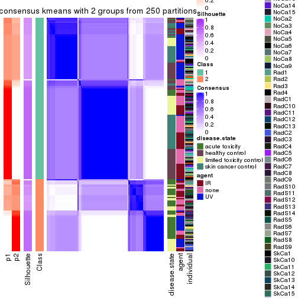</p>

</div>
<div id='tab-ATC-kmeans-consensus-heatmap-2'>
<pre><code class="r">consensus_heatmap(res, k = 3)
</code></pre>

<p>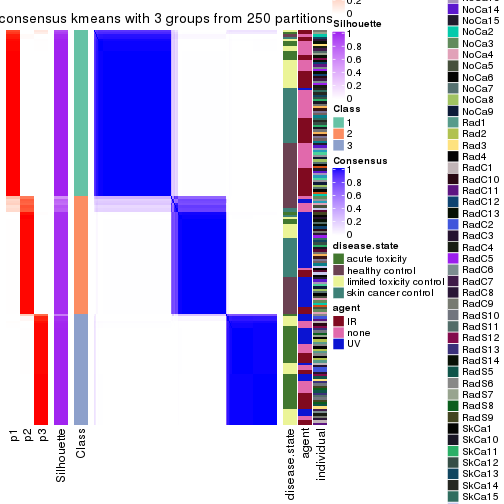</p>

</div>
<div id='tab-ATC-kmeans-consensus-heatmap-3'>
<pre><code class="r">consensus_heatmap(res, k = 4)
</code></pre>

<p>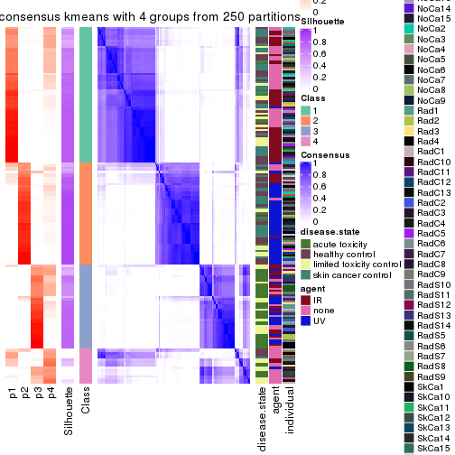</p>

</div>
<div id='tab-ATC-kmeans-consensus-heatmap-4'>
<pre><code class="r">consensus_heatmap(res, k = 5)
</code></pre>

<p>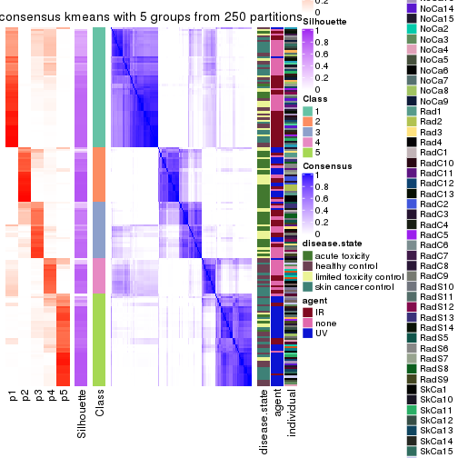</p>

</div>
<div id='tab-ATC-kmeans-consensus-heatmap-5'>
<pre><code class="r">consensus_heatmap(res, k = 6)
</code></pre>

<p>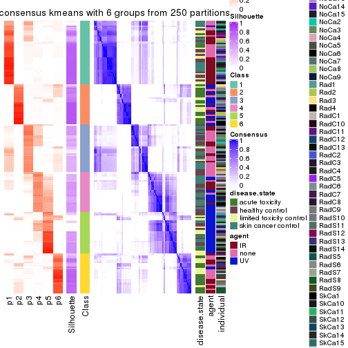</p>

</div>
</div>

Heatmaps for the membership of samples in all partitions to see how consistent they are:


<script>
$( function() {
	$( '#tabs-ATC-kmeans-membership-heatmap' ).tabs();
} );
</script>
<div id='tabs-ATC-kmeans-membership-heatmap'>
<ul>
<li><a href='#tab-ATC-kmeans-membership-heatmap-1'>k = 2</a></li>
<li><a href='#tab-ATC-kmeans-membership-heatmap-2'>k = 3</a></li>
<li><a href='#tab-ATC-kmeans-membership-heatmap-3'>k = 4</a></li>
<li><a href='#tab-ATC-kmeans-membership-heatmap-4'>k = 5</a></li>
<li><a href='#tab-ATC-kmeans-membership-heatmap-5'>k = 6</a></li>
</ul>
<div id='tab-ATC-kmeans-membership-heatmap-1'>
<pre><code class="r">membership_heatmap(res, k = 2)
</code></pre>

<p>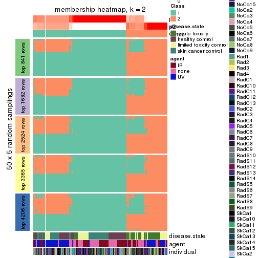</p>

</div>
<div id='tab-ATC-kmeans-membership-heatmap-2'>
<pre><code class="r">membership_heatmap(res, k = 3)
</code></pre>

<p>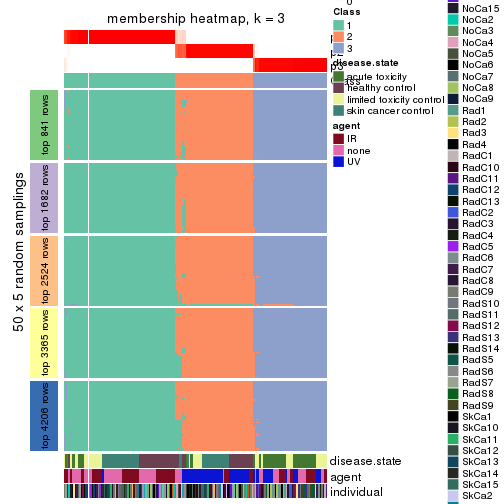</p>

</div>
<div id='tab-ATC-kmeans-membership-heatmap-3'>
<pre><code class="r">membership_heatmap(res, k = 4)
</code></pre>

<p>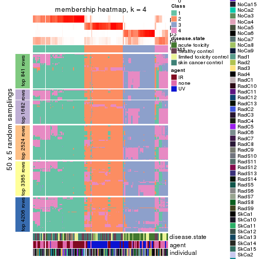</p>

</div>
<div id='tab-ATC-kmeans-membership-heatmap-4'>
<pre><code class="r">membership_heatmap(res, k = 5)
</code></pre>

<p>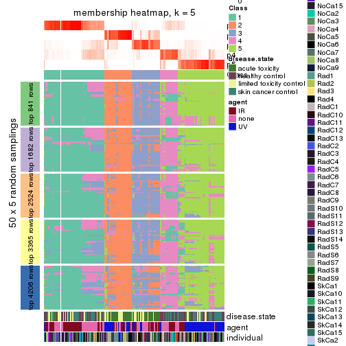</p>

</div>
<div id='tab-ATC-kmeans-membership-heatmap-5'>
<pre><code class="r">membership_heatmap(res, k = 6)
</code></pre>

<p>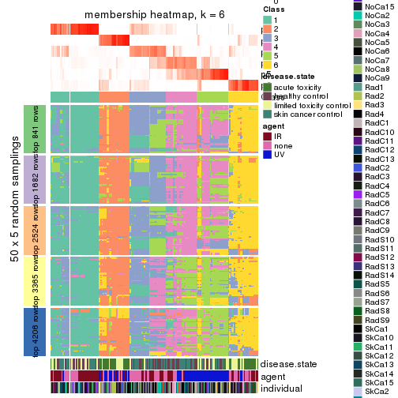</p>

</div>
</div>

As soon as we have had the classes for columns, we can look for signatures
which are significantly different between classes which can be candidate marks
for certain classes. Following are the heatmaps for signatures.


Signature heatmaps where rows are scaled:


<script>
$( function() {
	$( '#tabs-ATC-kmeans-get-signatures' ).tabs();
} );
</script>
<div id='tabs-ATC-kmeans-get-signatures'>
<ul>
<li><a href='#tab-ATC-kmeans-get-signatures-1'>k = 2</a></li>
<li><a href='#tab-ATC-kmeans-get-signatures-2'>k = 3</a></li>
<li><a href='#tab-ATC-kmeans-get-signatures-3'>k = 4</a></li>
<li><a href='#tab-ATC-kmeans-get-signatures-4'>k = 5</a></li>
<li><a href='#tab-ATC-kmeans-get-signatures-5'>k = 6</a></li>
</ul>
<div id='tab-ATC-kmeans-get-signatures-1'>
<pre><code class="r">get_signatures(res, k = 2)
</code></pre>

<p>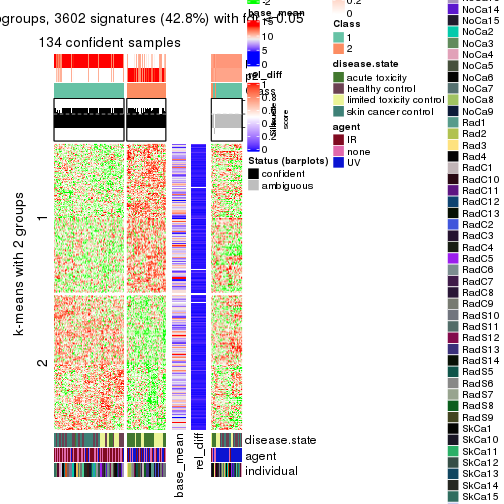</p>

</div>
<div id='tab-ATC-kmeans-get-signatures-2'>
<pre><code class="r">get_signatures(res, k = 3)
</code></pre>

<p>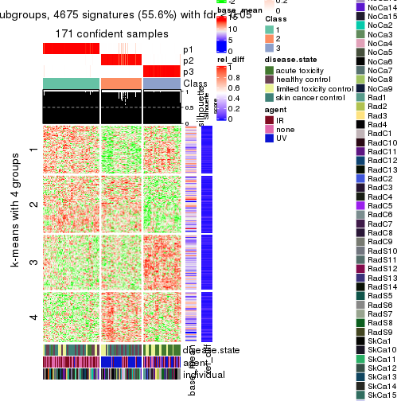</p>

</div>
<div id='tab-ATC-kmeans-get-signatures-3'>
<pre><code class="r">get_signatures(res, k = 4)
</code></pre>

<p>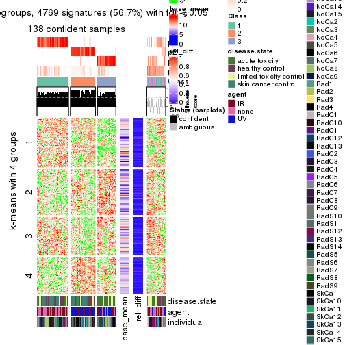</p>

</div>
<div id='tab-ATC-kmeans-get-signatures-4'>
<pre><code class="r">get_signatures(res, k = 5)
</code></pre>

<p>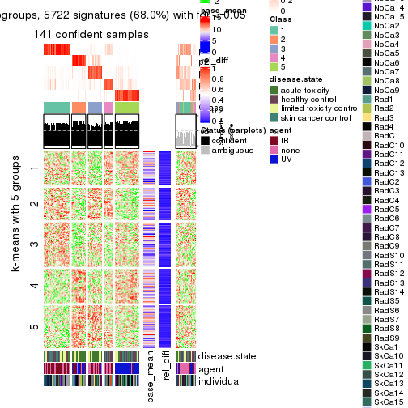</p>

</div>
<div id='tab-ATC-kmeans-get-signatures-5'>
<pre><code class="r">get_signatures(res, k = 6)
</code></pre>

<p>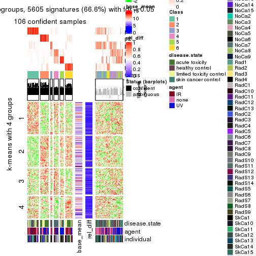</p>

</div>
</div>


Signature heatmaps where rows are not scaled:


<script>
$( function() {
	$( '#tabs-ATC-kmeans-get-signatures-no-scale' ).tabs();
} );
</script>
<div id='tabs-ATC-kmeans-get-signatures-no-scale'>
<ul>
<li><a href='#tab-ATC-kmeans-get-signatures-no-scale-1'>k = 2</a></li>
<li><a href='#tab-ATC-kmeans-get-signatures-no-scale-2'>k = 3</a></li>
<li><a href='#tab-ATC-kmeans-get-signatures-no-scale-3'>k = 4</a></li>
<li><a href='#tab-ATC-kmeans-get-signatures-no-scale-4'>k = 5</a></li>
<li><a href='#tab-ATC-kmeans-get-signatures-no-scale-5'>k = 6</a></li>
</ul>
<div id='tab-ATC-kmeans-get-signatures-no-scale-1'>
<pre><code class="r">get_signatures(res, k = 2, scale_rows = FALSE)
</code></pre>

<p>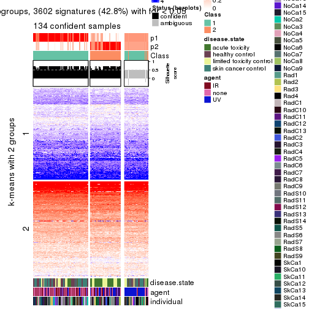</p>

</div>
<div id='tab-ATC-kmeans-get-signatures-no-scale-2'>
<pre><code class="r">get_signatures(res, k = 3, scale_rows = FALSE)
</code></pre>

<p>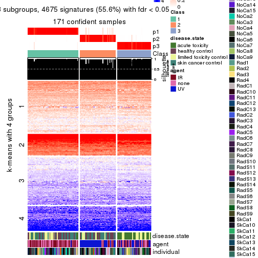</p>

</div>
<div id='tab-ATC-kmeans-get-signatures-no-scale-3'>
<pre><code class="r">get_signatures(res, k = 4, scale_rows = FALSE)
</code></pre>

<p>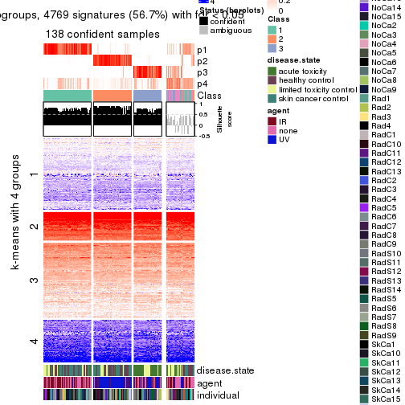</p>

</div>
<div id='tab-ATC-kmeans-get-signatures-no-scale-4'>
<pre><code class="r">get_signatures(res, k = 5, scale_rows = FALSE)
</code></pre>

<p>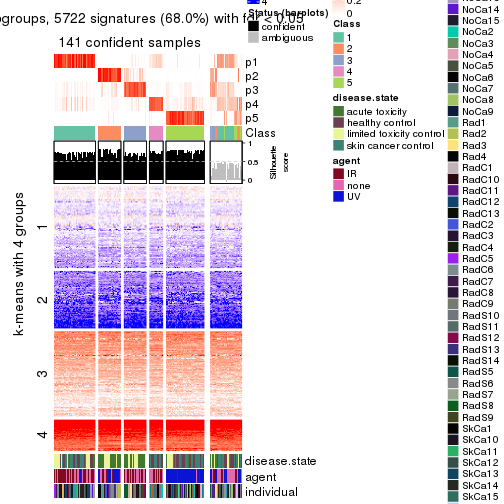</p>

</div>
<div id='tab-ATC-kmeans-get-signatures-no-scale-5'>
<pre><code class="r">get_signatures(res, k = 6, scale_rows = FALSE)
</code></pre>

<p>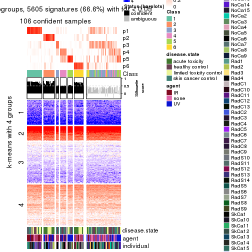</p>

</div>
</div>


Compare the overlap of signatures from different k:

```r
compare_signatures(res)
```

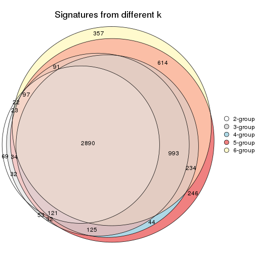

`get_signature()` returns a data frame invisibly. TO get the list of signatures, the function
call should be assigned to a variable explicitly. In following code, if `plot` argument is set
to `FALSE`, no heatmap is plotted while only the differential analysis is performed.

```r
# code only for demonstration
tb = get_signature(res, k = ..., plot = FALSE)
```

An example of the output of `tb` is:

```
#>   which_row         fdr    mean_1    mean_2 scaled_mean_1 scaled_mean_2 km
#> 1        38 0.042760348  8.373488  9.131774    -0.5533452     0.5164555  1
#> 2        40 0.018707592  7.106213  8.469186    -0.6173731     0.5762149  1
#> 3        55 0.019134737 10.221463 11.207825    -0.6159697     0.5749050  1
#> 4        59 0.006059896  5.921854  7.869574    -0.6899429     0.6439467  1
#> 5        60 0.018055526  8.928898 10.211722    -0.6204761     0.5791110  1
#> 6        98 0.009384629 15.714769 14.887706     0.6635654    -0.6193277  2
...
```

The columns in `tb` are:

1. `which_row`: row indices corresponding to the input matrix.
2. `fdr`: FDR for the differential test. 
3. `mean_x`: The mean value in group x.
4. `scaled_mean_x`: The mean value in group x after rows are scaled.
5. `km`: Row groups if k-means clustering is applied to rows.


UMAP plot which shows how samples are separated.


<script>
$( function() {
	$( '#tabs-ATC-kmeans-dimension-reduction' ).tabs();
} );
</script>
<div id='tabs-ATC-kmeans-dimension-reduction'>
<ul>
<li><a href='#tab-ATC-kmeans-dimension-reduction-1'>k = 2</a></li>
<li><a href='#tab-ATC-kmeans-dimension-reduction-2'>k = 3</a></li>
<li><a href='#tab-ATC-kmeans-dimension-reduction-3'>k = 4</a></li>
<li><a href='#tab-ATC-kmeans-dimension-reduction-4'>k = 5</a></li>
<li><a href='#tab-ATC-kmeans-dimension-reduction-5'>k = 6</a></li>
</ul>
<div id='tab-ATC-kmeans-dimension-reduction-1'>
<pre><code class="r">dimension_reduction(res, k = 2, method = &quot;UMAP&quot;)
</code></pre>

<p>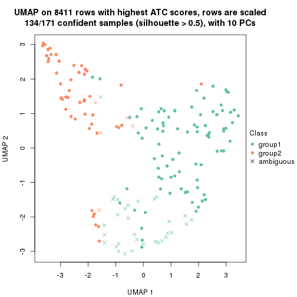</p>

</div>
<div id='tab-ATC-kmeans-dimension-reduction-2'>
<pre><code class="r">dimension_reduction(res, k = 3, method = &quot;UMAP&quot;)
</code></pre>

<p>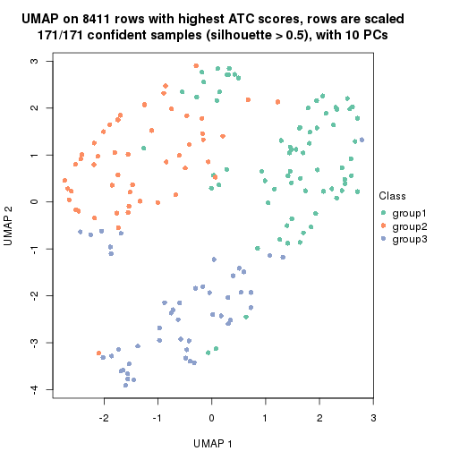</p>

</div>
<div id='tab-ATC-kmeans-dimension-reduction-3'>
<pre><code class="r">dimension_reduction(res, k = 4, method = &quot;UMAP&quot;)
</code></pre>

<p>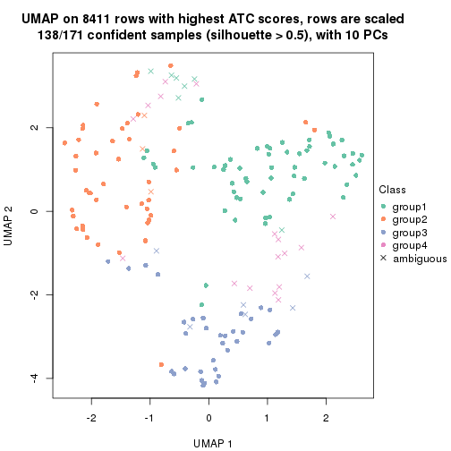</p>

</div>
<div id='tab-ATC-kmeans-dimension-reduction-4'>
<pre><code class="r">dimension_reduction(res, k = 5, method = &quot;UMAP&quot;)
</code></pre>

<p>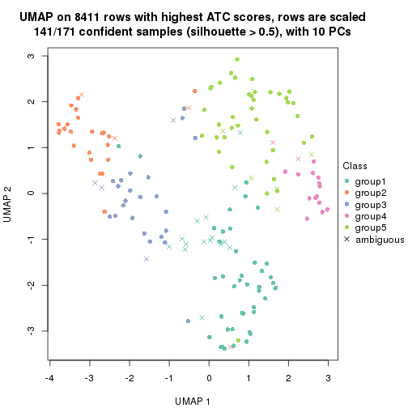</p>

</div>
<div id='tab-ATC-kmeans-dimension-reduction-5'>
<pre><code class="r">dimension_reduction(res, k = 6, method = &quot;UMAP&quot;)
</code></pre>

<p>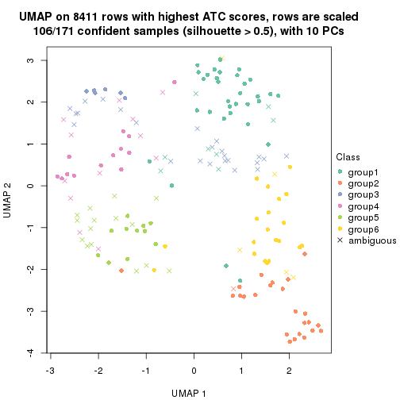</p>

</div>
</div>


Following heatmap shows how subgroups are split when increasing `k`:

```r
collect_classes(res)
```

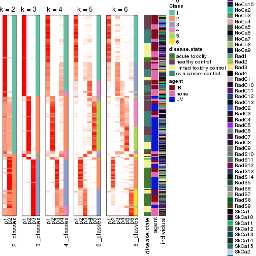


Test correlation between subgroups and known annotations. If the known
annotation is numeric, one-way ANOVA test is applied, and if the known
annotation is discrete, chi-squared contingency table test is applied.

```r
test_to_known_factors(res)
```

```
#>              n disease.state(p) agent(p) individual(p) k
#> ATC:kmeans 134         5.72e-17 8.90e-04      8.40e-06 2
#> ATC:kmeans 171         5.97e-17 1.28e-15      8.51e-05 3
#> ATC:kmeans 138         8.72e-14 9.87e-15      3.22e-04 4
#> ATC:kmeans 141         3.50e-13 7.10e-15      2.32e-07 5
#> ATC:kmeans 106         4.61e-09 4.28e-08      2.80e-10 6
```


If matrix rows can be associated to genes, consider to use `functional_enrichment(res,
...)` to perform function enrichment for the signature genes. See [this vignette](http://bioconductor.org/packages/devel/bioc/vignettes/cola/inst/doc/functional_enrichment.html) for more detailed explanations.


 

---------------------------------------------------


### ATC:skmeans**


The object with results only for a single top-value method and a single partition method 
can be extracted as:

```r
res = res_list["ATC", "skmeans"]
# you can also extract it by
# res = res_list["ATC:skmeans"]
```

A summary of `res` and all the functions that can be applied to it:

```r
res
```

```
#> A 'ConsensusPartition' object with k = 2, 3, 4, 5, 6.
#>   On a matrix with 8411 rows and 171 columns.
#>   Top rows (841, 1682, 2524, 3365, 4206) are extracted by 'ATC' method.
#>   Subgroups are detected by 'skmeans' method.
#>   Performed in total 1250 partitions by row resampling.
#>   Best k for subgroups seems to be 3.
#> 
#> Following methods can be applied to this 'ConsensusPartition' object:
#>  [1] "cola_report"             "collect_classes"         "collect_plots"          
#>  [4] "collect_stats"           "colnames"                "compare_signatures"     
#>  [7] "consensus_heatmap"       "dimension_reduction"     "functional_enrichment"  
#> [10] "get_anno_col"            "get_anno"                "get_classes"            
#> [13] "get_consensus"           "get_matrix"              "get_membership"         
#> [16] "get_param"               "get_signatures"          "get_stats"              
#> [19] "is_best_k"               "is_stable_k"             "membership_heatmap"     
#> [22] "ncol"                    "nrow"                    "plot_ecdf"              
#> [25] "rownames"                "select_partition_number" "show"                   
#> [28] "suggest_best_k"          "test_to_known_factors"
```

`collect_plots()` function collects all the plots made from `res` for all `k` (number of partitions)
into one single page to provide an easy and fast comparison between different `k`.

```r
collect_plots(res)
```

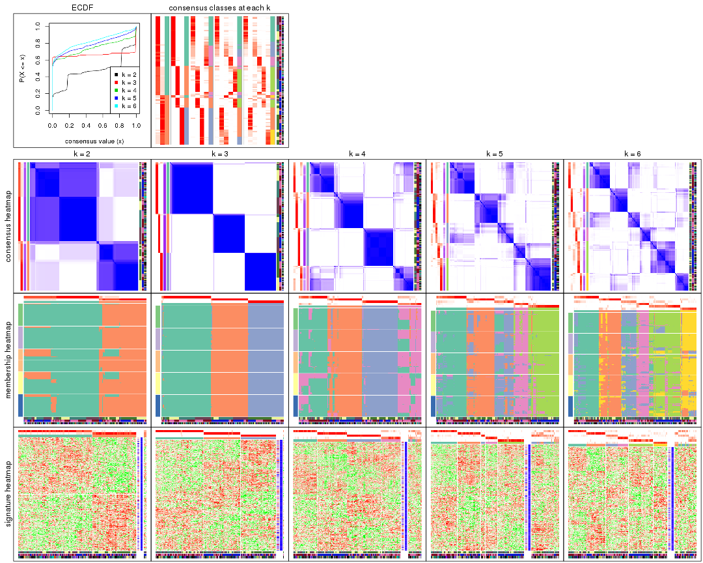

The plots are:

- The first row: a plot of the ECDF (empirical cumulative distribution
  function) curves of the consensus matrix for each `k` and the heatmap of
  predicted classes for each `k`.
- The second row: heatmaps of the consensus matrix for each `k`.
- The third row: heatmaps of the membership matrix for each `k`.
- The fouth row: heatmaps of the signatures for each `k`.

All the plots in panels can be made by individual functions and they are
plotted later in this section.

`select_partition_number()` produces several plots showing different
statistics for choosing "optimized" `k`. There are following statistics:

- ECDF curves of the consensus matrix for each `k`;
- 1-PAC. [The PAC
  score](https://en.wikipedia.org/wiki/Consensus_clustering#Over-interpretation_potential_of_consensus_clustering)
  measures the proportion of the ambiguous subgrouping.
- Mean silhouette score.
- Concordance. The mean probability of fiting the consensus class ids in all
  partitions.
- Area increased. Denote $A_k$ as the area under the ECDF curve for current
  `k`, the area increased is defined as $A_k - A_{k-1}$.
- Rand index. The percent of pairs of samples that are both in a same cluster
  or both are not in a same cluster in the partition of k and k-1.
- Jaccard index. The ratio of pairs of samples are both in a same cluster in
  the partition of k and k-1 and the pairs of samples are both in a same
  cluster in the partition k or k-1.

The detailed explanations of these statistics can be found in [the _cola_
vignette](http://bioconductor.org/packages/devel/bioc/vignettes/cola/inst/doc/cola.html#toc_13).

Generally speaking, lower PAC score, higher mean silhouette score or higher
concordance corresponds to better partition. Rand index and Jaccard index
measure how similar the current partition is compared to partition with `k-1`.
If they are too similar, we won't accept `k` is better than `k-1`.

```r
select_partition_number(res)
```

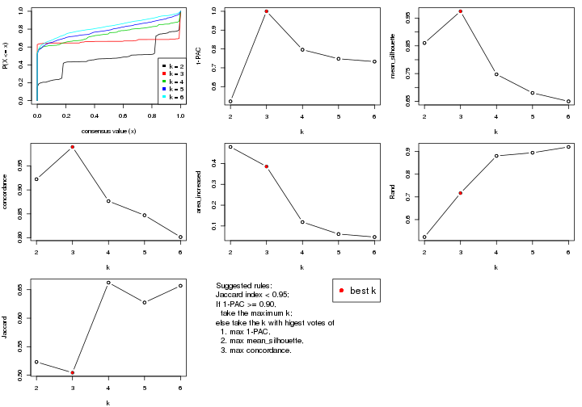

The numeric values for all these statistics can be obtained by `get_stats()`.

```r
get_stats(res)
```

```
#>   k 1-PAC mean_silhouette concordance area_increased  Rand Jaccard
#> 2 2 0.522           0.860       0.922         0.4795 0.523   0.523
#> 3 3 1.000           0.975       0.990         0.3856 0.717   0.504
#> 4 4 0.796           0.747       0.877         0.1187 0.880   0.662
#> 5 5 0.748           0.680       0.847         0.0613 0.894   0.628
#> 6 6 0.733           0.650       0.802         0.0470 0.920   0.657
```

`suggest_best_k()` suggests the best $k$ based on these statistics. The rules are as follows:

- All $k$ with Jaccard index larger than 0.95 are removed because increasing
  $k$ does not provide enough extra information. If all $k$ are removed, it is
  marked as no subgroup is detected.
- For all $k$ with 1-PAC score larger than 0.9, the maximal $k$ is taken as
  the best $k$, and other $k$ are marked as optional $k$.
- If it does not fit the second rule. The $k$ with the maximal vote of the
  highest 1-PAC score, highest mean silhouette, and highest concordance is
  taken as the best $k$.

```r
suggest_best_k(res)
```

```
#> [1] 3
```


Following shows the table of the partitions (You need to click the **show/hide
code output** link to see it). The membership matrix (columns with name `p*`)
is inferred by
[`clue::cl_consensus()`](https://www.rdocumentation.org/link/cl_consensus?package=clue)
function with the `SE` method. Basically the value in the membership matrix
represents the probability to belong to a certain group. The finall class
label for an item is determined with the group with highest probability it
belongs to.

In `get_classes()` function, the entropy is calculated from the membership
matrix and the silhouette score is calculated from the consensus matrix.


<script>
$( function() {
	$( '#tabs-ATC-skmeans-get-classes' ).tabs();
} );
</script>
<div id='tabs-ATC-skmeans-get-classes'>
<ul>
<li><a href='#tab-ATC-skmeans-get-classes-1'>k = 2</a></li>
<li><a href='#tab-ATC-skmeans-get-classes-2'>k = 3</a></li>
<li><a href='#tab-ATC-skmeans-get-classes-3'>k = 4</a></li>
<li><a href='#tab-ATC-skmeans-get-classes-4'>k = 5</a></li>
<li><a href='#tab-ATC-skmeans-get-classes-5'>k = 6</a></li>
</ul>

<div id='tab-ATC-skmeans-get-classes-1'>
<p><a id='tab-ATC-skmeans-get-classes-1-a' style='color:#0366d6' href='#'>show/hide code output</a></p>
<pre><code class="r">cbind(get_classes(res, k = 2), get_membership(res, k = 2))
</code></pre>

<pre><code>#&gt;          class entropy silhouette    p1    p2
#&gt; GSM29783     1  0.0000      0.910 1.000 0.000
#&gt; GSM29786     1  0.0376      0.909 0.996 0.004
#&gt; GSM29789     1  0.6623      0.851 0.828 0.172
#&gt; GSM29792     1  0.6623      0.851 0.828 0.172
#&gt; GSM29795     1  0.6623      0.851 0.828 0.172
#&gt; GSM29798     1  0.0000      0.910 1.000 0.000
#&gt; GSM29801     1  0.0000      0.910 1.000 0.000
#&gt; GSM29804     1  0.0000      0.910 1.000 0.000
#&gt; GSM29807     1  0.0000      0.910 1.000 0.000
#&gt; GSM29816     1  0.0672      0.906 0.992 0.008
#&gt; GSM29821     1  0.0000      0.910 1.000 0.000
#&gt; GSM29824     1  0.0000      0.910 1.000 0.000
#&gt; GSM29827     1  0.0000      0.910 1.000 0.000
#&gt; GSM29830     1  0.0000      0.910 1.000 0.000
#&gt; GSM29833     1  0.0000      0.910 1.000 0.000
#&gt; GSM29784     1  0.5519      0.796 0.872 0.128
#&gt; GSM29787     1  0.0672      0.908 0.992 0.008
#&gt; GSM29790     1  0.6048      0.862 0.852 0.148
#&gt; GSM29793     1  0.6343      0.857 0.840 0.160
#&gt; GSM29796     1  0.6623      0.851 0.828 0.172
#&gt; GSM29799     1  0.6801      0.725 0.820 0.180
#&gt; GSM29802     1  0.0000      0.910 1.000 0.000
#&gt; GSM29805     1  0.0000      0.910 1.000 0.000
#&gt; GSM29814     1  0.4161      0.845 0.916 0.084
#&gt; GSM29817     1  0.0000      0.910 1.000 0.000
#&gt; GSM29822     1  0.0000      0.910 1.000 0.000
#&gt; GSM29825     1  0.0000      0.910 1.000 0.000
#&gt; GSM29828     1  0.0000      0.910 1.000 0.000
#&gt; GSM29831     1  0.0000      0.910 1.000 0.000
#&gt; GSM29834     1  0.0000      0.910 1.000 0.000
#&gt; GSM29785     1  0.6712      0.849 0.824 0.176
#&gt; GSM29788     1  0.6712      0.849 0.824 0.176
#&gt; GSM29791     1  0.6712      0.849 0.824 0.176
#&gt; GSM29794     1  0.6712      0.849 0.824 0.176
#&gt; GSM29797     1  0.6712      0.849 0.824 0.176
#&gt; GSM29800     2  0.2236      0.877 0.036 0.964
#&gt; GSM29803     1  0.6712      0.849 0.824 0.176
#&gt; GSM29806     2  0.9710      0.176 0.400 0.600
#&gt; GSM29815     2  0.9580      0.246 0.380 0.620
#&gt; GSM29819     2  0.9754      0.151 0.408 0.592
#&gt; GSM29823     1  0.6712      0.849 0.824 0.176
#&gt; GSM29826     1  0.4298      0.884 0.912 0.088
#&gt; GSM29829     1  0.6712      0.849 0.824 0.176
#&gt; GSM29832     1  0.6712      0.849 0.824 0.176
#&gt; GSM29835     1  0.6712      0.849 0.824 0.176
#&gt; GSM29836     1  0.6712      0.849 0.824 0.176
#&gt; GSM29839     1  0.6623      0.851 0.828 0.172
#&gt; GSM29842     1  0.0000      0.910 1.000 0.000
#&gt; GSM29845     1  0.0000      0.910 1.000 0.000
#&gt; GSM29848     1  0.0000      0.910 1.000 0.000
#&gt; GSM29851     1  0.0000      0.910 1.000 0.000
#&gt; GSM29854     1  0.0000      0.910 1.000 0.000
#&gt; GSM29857     1  0.6801      0.725 0.820 0.180
#&gt; GSM29860     1  0.6623      0.851 0.828 0.172
#&gt; GSM29863     1  0.0000      0.910 1.000 0.000
#&gt; GSM29866     1  0.0000      0.910 1.000 0.000
#&gt; GSM29869     1  0.0000      0.910 1.000 0.000
#&gt; GSM29872     1  0.0000      0.910 1.000 0.000
#&gt; GSM29875     1  0.0000      0.910 1.000 0.000
#&gt; GSM29878     1  0.0000      0.910 1.000 0.000
#&gt; GSM29837     2  0.1633      0.886 0.024 0.976
#&gt; GSM29840     1  0.6343      0.857 0.840 0.160
#&gt; GSM29843     1  0.0000      0.910 1.000 0.000
#&gt; GSM29846     1  0.0000      0.910 1.000 0.000
#&gt; GSM29849     1  0.0000      0.910 1.000 0.000
#&gt; GSM29852     1  0.0000      0.910 1.000 0.000
#&gt; GSM29855     1  0.0000      0.910 1.000 0.000
#&gt; GSM29858     1  0.6801      0.725 0.820 0.180
#&gt; GSM29861     1  0.6343      0.857 0.840 0.160
#&gt; GSM29864     1  0.0000      0.910 1.000 0.000
#&gt; GSM29867     1  0.0000      0.910 1.000 0.000
#&gt; GSM29870     1  0.0000      0.910 1.000 0.000
#&gt; GSM29873     1  0.0000      0.910 1.000 0.000
#&gt; GSM29876     1  0.0000      0.910 1.000 0.000
#&gt; GSM29879     1  0.0000      0.910 1.000 0.000
#&gt; GSM29838     2  0.1184      0.891 0.016 0.984
#&gt; GSM29841     1  0.6712      0.849 0.824 0.176
#&gt; GSM29844     1  0.6712      0.849 0.824 0.176
#&gt; GSM29847     1  0.6712      0.849 0.824 0.176
#&gt; GSM29850     1  0.6623      0.851 0.828 0.172
#&gt; GSM29853     1  0.6623      0.851 0.828 0.172
#&gt; GSM29856     1  0.6712      0.849 0.824 0.176
#&gt; GSM29859     2  0.9286      0.358 0.344 0.656
#&gt; GSM29862     1  0.6712      0.849 0.824 0.176
#&gt; GSM29865     1  0.6712      0.849 0.824 0.176
#&gt; GSM29868     1  0.6712      0.849 0.824 0.176
#&gt; GSM29871     1  0.6623      0.851 0.828 0.172
#&gt; GSM29874     1  0.6712      0.849 0.824 0.176
#&gt; GSM29877     1  0.0000      0.910 1.000 0.000
#&gt; GSM29880     1  0.6712      0.849 0.824 0.176
#&gt; GSM29881     2  0.6623      0.834 0.172 0.828
#&gt; GSM29884     2  0.0000      0.900 0.000 1.000
#&gt; GSM29887     2  0.0000      0.900 0.000 1.000
#&gt; GSM29890     1  0.0000      0.910 1.000 0.000
#&gt; GSM29893     1  0.0000      0.910 1.000 0.000
#&gt; GSM29896     1  0.0000      0.910 1.000 0.000
#&gt; GSM29899     1  0.0000      0.910 1.000 0.000
#&gt; GSM29902     2  0.6712      0.831 0.176 0.824
#&gt; GSM29905     2  0.6623      0.834 0.172 0.828
#&gt; GSM29908     1  0.0000      0.910 1.000 0.000
#&gt; GSM29955     2  0.6438      0.838 0.164 0.836
#&gt; GSM29958     1  0.0000      0.910 1.000 0.000
#&gt; GSM29961     1  0.0000      0.910 1.000 0.000
#&gt; GSM29882     2  0.6712      0.831 0.176 0.824
#&gt; GSM29885     2  0.0000      0.900 0.000 1.000
#&gt; GSM29888     2  0.0000      0.900 0.000 1.000
#&gt; GSM29891     1  0.6973      0.713 0.812 0.188
#&gt; GSM29894     1  0.0000      0.910 1.000 0.000
#&gt; GSM29897     1  0.0000      0.910 1.000 0.000
#&gt; GSM29900     1  0.6623      0.737 0.828 0.172
#&gt; GSM29903     2  0.6623      0.834 0.172 0.828
#&gt; GSM29906     2  0.6623      0.834 0.172 0.828
#&gt; GSM29909     2  0.6623      0.834 0.172 0.828
#&gt; GSM29956     1  0.0000      0.910 1.000 0.000
#&gt; GSM29959     1  0.0000      0.910 1.000 0.000
#&gt; GSM29962     1  0.0000      0.910 1.000 0.000
#&gt; GSM29883     2  0.0000      0.900 0.000 1.000
#&gt; GSM29886     2  0.0000      0.900 0.000 1.000
#&gt; GSM29889     2  0.0000      0.900 0.000 1.000
#&gt; GSM29892     2  0.0000      0.900 0.000 1.000
#&gt; GSM29895     1  0.6712      0.849 0.824 0.176
#&gt; GSM29898     2  0.0000      0.900 0.000 1.000
#&gt; GSM29901     2  0.0000      0.900 0.000 1.000
#&gt; GSM29904     2  0.0000      0.900 0.000 1.000
#&gt; GSM29907     2  0.0000      0.900 0.000 1.000
#&gt; GSM29910     1  0.6712      0.849 0.824 0.176
#&gt; GSM29957     2  0.0000      0.900 0.000 1.000
#&gt; GSM29960     1  0.6712      0.849 0.824 0.176
#&gt; GSM29963     2  0.0000      0.900 0.000 1.000
#&gt; GSM29964     2  0.3431      0.881 0.064 0.936
#&gt; GSM29967     2  0.0000      0.900 0.000 1.000
#&gt; GSM29970     2  0.6623      0.834 0.172 0.828
#&gt; GSM29973     2  0.0000      0.900 0.000 1.000
#&gt; GSM29976     2  0.6623      0.834 0.172 0.828
#&gt; GSM29979     2  0.0000      0.900 0.000 1.000
#&gt; GSM29982     2  0.6973      0.701 0.188 0.812
#&gt; GSM29985     2  0.6623      0.834 0.172 0.828
#&gt; GSM29988     2  0.6623      0.834 0.172 0.828
#&gt; GSM29991     2  0.4939      0.863 0.108 0.892
#&gt; GSM29994     2  0.6623      0.834 0.172 0.828
#&gt; GSM29997     1  0.0000      0.910 1.000 0.000
#&gt; GSM30000     2  0.0000      0.900 0.000 1.000
#&gt; GSM30003     1  0.6712      0.731 0.824 0.176
#&gt; GSM29965     2  0.4022      0.875 0.080 0.920
#&gt; GSM29968     2  0.0000      0.900 0.000 1.000
#&gt; GSM29971     2  0.6712      0.831 0.176 0.824
#&gt; GSM29974     2  0.0000      0.900 0.000 1.000
#&gt; GSM29977     2  0.6623      0.834 0.172 0.828
#&gt; GSM29980     2  0.0000      0.900 0.000 1.000
#&gt; GSM29983     1  0.0000      0.910 1.000 0.000
#&gt; GSM29986     2  0.6623      0.834 0.172 0.828
#&gt; GSM29989     2  0.6623      0.834 0.172 0.828
#&gt; GSM29992     2  0.6623      0.834 0.172 0.828
#&gt; GSM29995     1  0.0000      0.910 1.000 0.000
#&gt; GSM29998     2  0.6712      0.831 0.176 0.824
#&gt; GSM30001     2  0.0000      0.900 0.000 1.000
#&gt; GSM30004     2  0.6712      0.831 0.176 0.824
#&gt; GSM29966     2  0.0000      0.900 0.000 1.000
#&gt; GSM29969     2  0.0000      0.900 0.000 1.000
#&gt; GSM29972     2  0.0000      0.900 0.000 1.000
#&gt; GSM29975     2  0.0000      0.900 0.000 1.000
#&gt; GSM29978     2  0.0000      0.900 0.000 1.000
#&gt; GSM29981     2  0.0000      0.900 0.000 1.000
#&gt; GSM29984     2  0.0000      0.900 0.000 1.000
#&gt; GSM29987     2  0.0000      0.900 0.000 1.000
#&gt; GSM29990     2  0.0000      0.900 0.000 1.000
#&gt; GSM29993     2  0.0000      0.900 0.000 1.000
#&gt; GSM29996     1  0.6623      0.851 0.828 0.172
#&gt; GSM29999     2  0.0000      0.900 0.000 1.000
#&gt; GSM30002     2  0.0000      0.900 0.000 1.000
#&gt; GSM30005     2  0.0000      0.900 0.000 1.000
</code></pre>

<script>
$('#tab-ATC-skmeans-get-classes-1-a').parent().next().next().hide();
$('#tab-ATC-skmeans-get-classes-1-a').click(function(){
  $('#tab-ATC-skmeans-get-classes-1-a').parent().next().next().toggle();
  return(false);
});
</script>
</div>

<div id='tab-ATC-skmeans-get-classes-2'>
<p><a id='tab-ATC-skmeans-get-classes-2-a' style='color:#0366d6' href='#'>show/hide code output</a></p>
<pre><code class="r">cbind(get_classes(res, k = 3), get_membership(res, k = 3))
</code></pre>

<pre><code>#&gt;          class entropy silhouette    p1    p2    p3
#&gt; GSM29783     1  0.0000      0.984 1.000 0.000 0.000
#&gt; GSM29786     1  0.2448      0.907 0.924 0.076 0.000
#&gt; GSM29789     2  0.0000      0.987 0.000 1.000 0.000
#&gt; GSM29792     2  0.0000      0.987 0.000 1.000 0.000
#&gt; GSM29795     2  0.0000      0.987 0.000 1.000 0.000
#&gt; GSM29798     1  0.0000      0.984 1.000 0.000 0.000
#&gt; GSM29801     1  0.0000      0.984 1.000 0.000 0.000
#&gt; GSM29804     1  0.0000      0.984 1.000 0.000 0.000
#&gt; GSM29807     1  0.0000      0.984 1.000 0.000 0.000
#&gt; GSM29816     1  0.0000      0.984 1.000 0.000 0.000
#&gt; GSM29821     1  0.0000      0.984 1.000 0.000 0.000
#&gt; GSM29824     1  0.0000      0.984 1.000 0.000 0.000
#&gt; GSM29827     1  0.0000      0.984 1.000 0.000 0.000
#&gt; GSM29830     1  0.0000      0.984 1.000 0.000 0.000
#&gt; GSM29833     1  0.0000      0.984 1.000 0.000 0.000
#&gt; GSM29784     1  0.0000      0.984 1.000 0.000 0.000
#&gt; GSM29787     1  0.5621      0.555 0.692 0.308 0.000
#&gt; GSM29790     2  0.0000      0.987 0.000 1.000 0.000
#&gt; GSM29793     2  0.0000      0.987 0.000 1.000 0.000
#&gt; GSM29796     2  0.0000      0.987 0.000 1.000 0.000
#&gt; GSM29799     1  0.0000      0.984 1.000 0.000 0.000
#&gt; GSM29802     1  0.0000      0.984 1.000 0.000 0.000
#&gt; GSM29805     1  0.0000      0.984 1.000 0.000 0.000
#&gt; GSM29814     1  0.0000      0.984 1.000 0.000 0.000
#&gt; GSM29817     1  0.0000      0.984 1.000 0.000 0.000
#&gt; GSM29822     1  0.0000      0.984 1.000 0.000 0.000
#&gt; GSM29825     1  0.0000      0.984 1.000 0.000 0.000
#&gt; GSM29828     1  0.0000      0.984 1.000 0.000 0.000
#&gt; GSM29831     1  0.0000      0.984 1.000 0.000 0.000
#&gt; GSM29834     1  0.0000      0.984 1.000 0.000 0.000
#&gt; GSM29785     2  0.0000      0.987 0.000 1.000 0.000
#&gt; GSM29788     2  0.0000      0.987 0.000 1.000 0.000
#&gt; GSM29791     2  0.0000      0.987 0.000 1.000 0.000
#&gt; GSM29794     2  0.0000      0.987 0.000 1.000 0.000
#&gt; GSM29797     2  0.0000      0.987 0.000 1.000 0.000
#&gt; GSM29800     2  0.0000      0.987 0.000 1.000 0.000
#&gt; GSM29803     2  0.0000      0.987 0.000 1.000 0.000
#&gt; GSM29806     2  0.0000      0.987 0.000 1.000 0.000
#&gt; GSM29815     2  0.0000      0.987 0.000 1.000 0.000
#&gt; GSM29819     2  0.0000      0.987 0.000 1.000 0.000
#&gt; GSM29823     2  0.0000      0.987 0.000 1.000 0.000
#&gt; GSM29826     2  0.0000      0.987 0.000 1.000 0.000
#&gt; GSM29829     2  0.0000      0.987 0.000 1.000 0.000
#&gt; GSM29832     2  0.0000      0.987 0.000 1.000 0.000
#&gt; GSM29835     2  0.0000      0.987 0.000 1.000 0.000
#&gt; GSM29836     2  0.0000      0.987 0.000 1.000 0.000
#&gt; GSM29839     2  0.0000      0.987 0.000 1.000 0.000
#&gt; GSM29842     1  0.0000      0.984 1.000 0.000 0.000
#&gt; GSM29845     1  0.0000      0.984 1.000 0.000 0.000
#&gt; GSM29848     1  0.0000      0.984 1.000 0.000 0.000
#&gt; GSM29851     1  0.0000      0.984 1.000 0.000 0.000
#&gt; GSM29854     1  0.0000      0.984 1.000 0.000 0.000
#&gt; GSM29857     1  0.0000      0.984 1.000 0.000 0.000
#&gt; GSM29860     2  0.0000      0.987 0.000 1.000 0.000
#&gt; GSM29863     1  0.0000      0.984 1.000 0.000 0.000
#&gt; GSM29866     1  0.0000      0.984 1.000 0.000 0.000
#&gt; GSM29869     1  0.0000      0.984 1.000 0.000 0.000
#&gt; GSM29872     2  0.5760      0.510 0.328 0.672 0.000
#&gt; GSM29875     1  0.0000      0.984 1.000 0.000 0.000
#&gt; GSM29878     1  0.0000      0.984 1.000 0.000 0.000
#&gt; GSM29837     2  0.0000      0.987 0.000 1.000 0.000
#&gt; GSM29840     2  0.0000      0.987 0.000 1.000 0.000
#&gt; GSM29843     1  0.0000      0.984 1.000 0.000 0.000
#&gt; GSM29846     1  0.0000      0.984 1.000 0.000 0.000
#&gt; GSM29849     1  0.0000      0.984 1.000 0.000 0.000
#&gt; GSM29852     1  0.0000      0.984 1.000 0.000 0.000
#&gt; GSM29855     1  0.0000      0.984 1.000 0.000 0.000
#&gt; GSM29858     1  0.0000      0.984 1.000 0.000 0.000
#&gt; GSM29861     2  0.0000      0.987 0.000 1.000 0.000
#&gt; GSM29864     1  0.0000      0.984 1.000 0.000 0.000
#&gt; GSM29867     1  0.0000      0.984 1.000 0.000 0.000
#&gt; GSM29870     1  0.0000      0.984 1.000 0.000 0.000
#&gt; GSM29873     1  0.0747      0.969 0.984 0.016 0.000
#&gt; GSM29876     1  0.0000      0.984 1.000 0.000 0.000
#&gt; GSM29879     1  0.0000      0.984 1.000 0.000 0.000
#&gt; GSM29838     2  0.0000      0.987 0.000 1.000 0.000
#&gt; GSM29841     2  0.0000      0.987 0.000 1.000 0.000
#&gt; GSM29844     2  0.0000      0.987 0.000 1.000 0.000
#&gt; GSM29847     2  0.0000      0.987 0.000 1.000 0.000
#&gt; GSM29850     2  0.0000      0.987 0.000 1.000 0.000
#&gt; GSM29853     2  0.0000      0.987 0.000 1.000 0.000
#&gt; GSM29856     2  0.0000      0.987 0.000 1.000 0.000
#&gt; GSM29859     2  0.0000      0.987 0.000 1.000 0.000
#&gt; GSM29862     2  0.0000      0.987 0.000 1.000 0.000
#&gt; GSM29865     2  0.0000      0.987 0.000 1.000 0.000
#&gt; GSM29868     2  0.0000      0.987 0.000 1.000 0.000
#&gt; GSM29871     2  0.0000      0.987 0.000 1.000 0.000
#&gt; GSM29874     2  0.0000      0.987 0.000 1.000 0.000
#&gt; GSM29877     1  0.0237      0.980 0.996 0.004 0.000
#&gt; GSM29880     2  0.0000      0.987 0.000 1.000 0.000
#&gt; GSM29881     3  0.0000      0.999 0.000 0.000 1.000
#&gt; GSM29884     3  0.0000      0.999 0.000 0.000 1.000
#&gt; GSM29887     3  0.0000      0.999 0.000 0.000 1.000
#&gt; GSM29890     1  0.0000      0.984 1.000 0.000 0.000
#&gt; GSM29893     1  0.0000      0.984 1.000 0.000 0.000
#&gt; GSM29896     1  0.0000      0.984 1.000 0.000 0.000
#&gt; GSM29899     1  0.0000      0.984 1.000 0.000 0.000
#&gt; GSM29902     1  0.5529      0.585 0.704 0.000 0.296
#&gt; GSM29905     3  0.0000      0.999 0.000 0.000 1.000
#&gt; GSM29908     1  0.0000      0.984 1.000 0.000 0.000
#&gt; GSM29955     3  0.0000      0.999 0.000 0.000 1.000
#&gt; GSM29958     1  0.0000      0.984 1.000 0.000 0.000
#&gt; GSM29961     1  0.0000      0.984 1.000 0.000 0.000
#&gt; GSM29882     3  0.0000      0.999 0.000 0.000 1.000
#&gt; GSM29885     3  0.0000      0.999 0.000 0.000 1.000
#&gt; GSM29888     3  0.0000      0.999 0.000 0.000 1.000
#&gt; GSM29891     1  0.0000      0.984 1.000 0.000 0.000
#&gt; GSM29894     1  0.0000      0.984 1.000 0.000 0.000
#&gt; GSM29897     1  0.0000      0.984 1.000 0.000 0.000
#&gt; GSM29900     1  0.0000      0.984 1.000 0.000 0.000
#&gt; GSM29903     3  0.0000      0.999 0.000 0.000 1.000
#&gt; GSM29906     3  0.0000      0.999 0.000 0.000 1.000
#&gt; GSM29909     3  0.0000      0.999 0.000 0.000 1.000
#&gt; GSM29956     1  0.0000      0.984 1.000 0.000 0.000
#&gt; GSM29959     1  0.0000      0.984 1.000 0.000 0.000
#&gt; GSM29962     1  0.0000      0.984 1.000 0.000 0.000
#&gt; GSM29883     3  0.0000      0.999 0.000 0.000 1.000
#&gt; GSM29886     3  0.0000      0.999 0.000 0.000 1.000
#&gt; GSM29889     2  0.0000      0.987 0.000 1.000 0.000
#&gt; GSM29892     3  0.0000      0.999 0.000 0.000 1.000
#&gt; GSM29895     2  0.0000      0.987 0.000 1.000 0.000
#&gt; GSM29898     3  0.0000      0.999 0.000 0.000 1.000
#&gt; GSM29901     3  0.0000      0.999 0.000 0.000 1.000
#&gt; GSM29904     2  0.0000      0.987 0.000 1.000 0.000
#&gt; GSM29907     2  0.0000      0.987 0.000 1.000 0.000
#&gt; GSM29910     2  0.0000      0.987 0.000 1.000 0.000
#&gt; GSM29957     3  0.0000      0.999 0.000 0.000 1.000
#&gt; GSM29960     2  0.0000      0.987 0.000 1.000 0.000
#&gt; GSM29963     2  0.0000      0.987 0.000 1.000 0.000
#&gt; GSM29964     3  0.0000      0.999 0.000 0.000 1.000
#&gt; GSM29967     3  0.0000      0.999 0.000 0.000 1.000
#&gt; GSM29970     3  0.0000      0.999 0.000 0.000 1.000
#&gt; GSM29973     3  0.0000      0.999 0.000 0.000 1.000
#&gt; GSM29976     3  0.0000      0.999 0.000 0.000 1.000
#&gt; GSM29979     3  0.0000      0.999 0.000 0.000 1.000
#&gt; GSM29982     3  0.0000      0.999 0.000 0.000 1.000
#&gt; GSM29985     3  0.0000      0.999 0.000 0.000 1.000
#&gt; GSM29988     3  0.0000      0.999 0.000 0.000 1.000
#&gt; GSM29991     3  0.0000      0.999 0.000 0.000 1.000
#&gt; GSM29994     3  0.0000      0.999 0.000 0.000 1.000
#&gt; GSM29997     1  0.0000      0.984 1.000 0.000 0.000
#&gt; GSM30000     3  0.0000      0.999 0.000 0.000 1.000
#&gt; GSM30003     1  0.0000      0.984 1.000 0.000 0.000
#&gt; GSM29965     3  0.0000      0.999 0.000 0.000 1.000
#&gt; GSM29968     3  0.0000      0.999 0.000 0.000 1.000
#&gt; GSM29971     1  0.0424      0.977 0.992 0.000 0.008
#&gt; GSM29974     3  0.0000      0.999 0.000 0.000 1.000
#&gt; GSM29977     3  0.0000      0.999 0.000 0.000 1.000
#&gt; GSM29980     3  0.0000      0.999 0.000 0.000 1.000
#&gt; GSM29983     1  0.0000      0.984 1.000 0.000 0.000
#&gt; GSM29986     3  0.0000      0.999 0.000 0.000 1.000
#&gt; GSM29989     3  0.0000      0.999 0.000 0.000 1.000
#&gt; GSM29992     3  0.0000      0.999 0.000 0.000 1.000
#&gt; GSM29995     1  0.0000      0.984 1.000 0.000 0.000
#&gt; GSM29998     3  0.0000      0.999 0.000 0.000 1.000
#&gt; GSM30001     3  0.0000      0.999 0.000 0.000 1.000
#&gt; GSM30004     1  0.6111      0.353 0.604 0.000 0.396
#&gt; GSM29966     3  0.0000      0.999 0.000 0.000 1.000
#&gt; GSM29969     3  0.0000      0.999 0.000 0.000 1.000
#&gt; GSM29972     3  0.0000      0.999 0.000 0.000 1.000
#&gt; GSM29975     3  0.0000      0.999 0.000 0.000 1.000
#&gt; GSM29978     3  0.0000      0.999 0.000 0.000 1.000
#&gt; GSM29981     3  0.1411      0.962 0.000 0.036 0.964
#&gt; GSM29984     3  0.0000      0.999 0.000 0.000 1.000
#&gt; GSM29987     3  0.0000      0.999 0.000 0.000 1.000
#&gt; GSM29990     2  0.5560      0.569 0.000 0.700 0.300
#&gt; GSM29993     3  0.0000      0.999 0.000 0.000 1.000
#&gt; GSM29996     2  0.0000      0.987 0.000 1.000 0.000
#&gt; GSM29999     3  0.0000      0.999 0.000 0.000 1.000
#&gt; GSM30002     3  0.0000      0.999 0.000 0.000 1.000
#&gt; GSM30005     2  0.0000      0.987 0.000 1.000 0.000
</code></pre>

<script>
$('#tab-ATC-skmeans-get-classes-2-a').parent().next().next().hide();
$('#tab-ATC-skmeans-get-classes-2-a').click(function(){
  $('#tab-ATC-skmeans-get-classes-2-a').parent().next().next().toggle();
  return(false);
});
</script>
</div>

<div id='tab-ATC-skmeans-get-classes-3'>
<p><a id='tab-ATC-skmeans-get-classes-3-a' style='color:#0366d6' href='#'>show/hide code output</a></p>
<pre><code class="r">cbind(get_classes(res, k = 4), get_membership(res, k = 4))
</code></pre>

<pre><code>#&gt;          class entropy silhouette    p1    p2    p3    p4
#&gt; GSM29783     4  0.3172     0.5608 0.160 0.000 0.000 0.840
#&gt; GSM29786     4  0.3219     0.5602 0.164 0.000 0.000 0.836
#&gt; GSM29789     2  0.7793     0.1925 0.356 0.396 0.000 0.248
#&gt; GSM29792     2  0.6295     0.4759 0.348 0.580 0.000 0.072
#&gt; GSM29795     2  0.6163     0.4607 0.364 0.576 0.000 0.060
#&gt; GSM29798     4  0.3123     0.5630 0.156 0.000 0.000 0.844
#&gt; GSM29801     1  0.0188     0.8109 0.996 0.000 0.000 0.004
#&gt; GSM29804     1  0.3688     0.5738 0.792 0.000 0.000 0.208
#&gt; GSM29807     1  0.1867     0.7609 0.928 0.000 0.000 0.072
#&gt; GSM29816     4  0.4697     0.5226 0.356 0.000 0.000 0.644
#&gt; GSM29821     1  0.0592     0.8011 0.984 0.000 0.000 0.016
#&gt; GSM29824     1  0.0188     0.8109 0.996 0.000 0.000 0.004
#&gt; GSM29827     1  0.0000     0.8114 1.000 0.000 0.000 0.000
#&gt; GSM29830     1  0.0000     0.8114 1.000 0.000 0.000 0.000
#&gt; GSM29833     1  0.0188     0.8096 0.996 0.000 0.000 0.004
#&gt; GSM29784     4  0.0188     0.6246 0.004 0.000 0.000 0.996
#&gt; GSM29787     4  0.1356     0.6140 0.008 0.032 0.000 0.960
#&gt; GSM29790     4  0.2124     0.5962 0.008 0.068 0.000 0.924
#&gt; GSM29793     4  0.4054     0.5006 0.016 0.188 0.000 0.796
#&gt; GSM29796     4  0.7327     0.0947 0.176 0.320 0.000 0.504
#&gt; GSM29799     4  0.0188     0.6246 0.004 0.000 0.000 0.996
#&gt; GSM29802     4  0.4661     0.5346 0.348 0.000 0.000 0.652
#&gt; GSM29805     4  0.4661     0.5346 0.348 0.000 0.000 0.652
#&gt; GSM29814     4  0.4661     0.5346 0.348 0.000 0.000 0.652
#&gt; GSM29817     4  0.4830     0.4515 0.392 0.000 0.000 0.608
#&gt; GSM29822     4  0.4543     0.5505 0.324 0.000 0.000 0.676
#&gt; GSM29825     1  0.4730     0.3503 0.636 0.000 0.000 0.364
#&gt; GSM29828     1  0.3074     0.7274 0.848 0.000 0.000 0.152
#&gt; GSM29831     1  0.3074     0.7274 0.848 0.000 0.000 0.152
#&gt; GSM29834     1  0.3123     0.7241 0.844 0.000 0.000 0.156
#&gt; GSM29785     2  0.1867     0.8574 0.000 0.928 0.000 0.072
#&gt; GSM29788     2  0.1867     0.8574 0.000 0.928 0.000 0.072
#&gt; GSM29791     2  0.0000     0.8990 0.000 1.000 0.000 0.000
#&gt; GSM29794     2  0.0000     0.8990 0.000 1.000 0.000 0.000
#&gt; GSM29797     2  0.0000     0.8990 0.000 1.000 0.000 0.000
#&gt; GSM29800     2  0.4250     0.6682 0.000 0.724 0.000 0.276
#&gt; GSM29803     2  0.0000     0.8990 0.000 1.000 0.000 0.000
#&gt; GSM29806     2  0.0000     0.8990 0.000 1.000 0.000 0.000
#&gt; GSM29815     2  0.0000     0.8990 0.000 1.000 0.000 0.000
#&gt; GSM29819     2  0.0592     0.8885 0.000 0.984 0.000 0.016
#&gt; GSM29823     2  0.0000     0.8990 0.000 1.000 0.000 0.000
#&gt; GSM29826     2  0.4072     0.6325 0.252 0.748 0.000 0.000
#&gt; GSM29829     2  0.0000     0.8990 0.000 1.000 0.000 0.000
#&gt; GSM29832     2  0.0000     0.8990 0.000 1.000 0.000 0.000
#&gt; GSM29835     2  0.0000     0.8990 0.000 1.000 0.000 0.000
#&gt; GSM29836     2  0.0000     0.8990 0.000 1.000 0.000 0.000
#&gt; GSM29839     2  0.7793     0.1925 0.356 0.396 0.000 0.248
#&gt; GSM29842     4  0.3219     0.5602 0.164 0.000 0.000 0.836
#&gt; GSM29845     4  0.3266     0.5603 0.168 0.000 0.000 0.832
#&gt; GSM29848     4  0.3266     0.5603 0.168 0.000 0.000 0.832
#&gt; GSM29851     1  0.0000     0.8114 1.000 0.000 0.000 0.000
#&gt; GSM29854     1  0.3764     0.5588 0.784 0.000 0.000 0.216
#&gt; GSM29857     1  0.5000    -0.3072 0.500 0.000 0.000 0.500
#&gt; GSM29860     2  0.4643     0.5417 0.344 0.656 0.000 0.000
#&gt; GSM29863     1  0.0000     0.8114 1.000 0.000 0.000 0.000
#&gt; GSM29866     1  0.0000     0.8114 1.000 0.000 0.000 0.000
#&gt; GSM29869     1  0.0000     0.8114 1.000 0.000 0.000 0.000
#&gt; GSM29872     1  0.1118     0.7750 0.964 0.036 0.000 0.000
#&gt; GSM29875     1  0.0188     0.8109 0.996 0.000 0.000 0.004
#&gt; GSM29878     1  0.0336     0.8072 0.992 0.000 0.000 0.008
#&gt; GSM29837     2  0.0336     0.8956 0.000 0.992 0.000 0.008
#&gt; GSM29840     4  0.7258     0.0847 0.164 0.328 0.000 0.508
#&gt; GSM29843     4  0.0188     0.6246 0.004 0.000 0.000 0.996
#&gt; GSM29846     4  0.0188     0.6246 0.004 0.000 0.000 0.996
#&gt; GSM29849     4  0.0469     0.6245 0.012 0.000 0.000 0.988
#&gt; GSM29852     4  0.4972     0.2807 0.456 0.000 0.000 0.544
#&gt; GSM29855     4  0.4661     0.5346 0.348 0.000 0.000 0.652
#&gt; GSM29858     4  0.4643     0.5385 0.344 0.000 0.000 0.656
#&gt; GSM29861     2  0.6915     0.3768 0.140 0.564 0.000 0.296
#&gt; GSM29864     4  0.4679     0.5274 0.352 0.000 0.000 0.648
#&gt; GSM29867     1  0.4955     0.0751 0.556 0.000 0.000 0.444
#&gt; GSM29870     4  0.4661     0.5346 0.348 0.000 0.000 0.652
#&gt; GSM29873     1  0.4500     0.4652 0.684 0.000 0.000 0.316
#&gt; GSM29876     4  0.4643     0.5385 0.344 0.000 0.000 0.656
#&gt; GSM29879     4  0.4624     0.5405 0.340 0.000 0.000 0.660
#&gt; GSM29838     2  0.0000     0.8990 0.000 1.000 0.000 0.000
#&gt; GSM29841     2  0.0000     0.8990 0.000 1.000 0.000 0.000
#&gt; GSM29844     2  0.1867     0.8574 0.000 0.928 0.000 0.072
#&gt; GSM29847     2  0.2647     0.8223 0.000 0.880 0.000 0.120
#&gt; GSM29850     2  0.3942     0.7106 0.000 0.764 0.000 0.236
#&gt; GSM29853     2  0.0000     0.8990 0.000 1.000 0.000 0.000
#&gt; GSM29856     2  0.0000     0.8990 0.000 1.000 0.000 0.000
#&gt; GSM29859     2  0.0000     0.8990 0.000 1.000 0.000 0.000
#&gt; GSM29862     2  0.0000     0.8990 0.000 1.000 0.000 0.000
#&gt; GSM29865     2  0.0000     0.8990 0.000 1.000 0.000 0.000
#&gt; GSM29868     2  0.0000     0.8990 0.000 1.000 0.000 0.000
#&gt; GSM29871     2  0.0000     0.8990 0.000 1.000 0.000 0.000
#&gt; GSM29874     2  0.0000     0.8990 0.000 1.000 0.000 0.000
#&gt; GSM29877     1  0.4904     0.6125 0.744 0.040 0.000 0.216
#&gt; GSM29880     2  0.0000     0.8990 0.000 1.000 0.000 0.000
#&gt; GSM29881     3  0.0188     0.9657 0.000 0.000 0.996 0.004
#&gt; GSM29884     3  0.0188     0.9655 0.000 0.000 0.996 0.004
#&gt; GSM29887     3  0.0188     0.9655 0.000 0.000 0.996 0.004
#&gt; GSM29890     1  0.0336     0.8092 0.992 0.000 0.000 0.008
#&gt; GSM29893     1  0.0000     0.8114 1.000 0.000 0.000 0.000
#&gt; GSM29896     1  0.0000     0.8114 1.000 0.000 0.000 0.000
#&gt; GSM29899     1  0.0336     0.8092 0.992 0.000 0.000 0.008
#&gt; GSM29902     3  0.7740    -0.1067 0.248 0.000 0.432 0.320
#&gt; GSM29905     3  0.1890     0.9119 0.056 0.000 0.936 0.008
#&gt; GSM29908     1  0.0000     0.8114 1.000 0.000 0.000 0.000
#&gt; GSM29955     3  0.0188     0.9657 0.000 0.000 0.996 0.004
#&gt; GSM29958     1  0.0000     0.8114 1.000 0.000 0.000 0.000
#&gt; GSM29961     1  0.0000     0.8114 1.000 0.000 0.000 0.000
#&gt; GSM29882     3  0.3356     0.7697 0.000 0.000 0.824 0.176
#&gt; GSM29885     3  0.0188     0.9655 0.000 0.000 0.996 0.004
#&gt; GSM29888     3  0.0188     0.9655 0.000 0.000 0.996 0.004
#&gt; GSM29891     4  0.4679     0.5294 0.352 0.000 0.000 0.648
#&gt; GSM29894     1  0.3801     0.6566 0.780 0.000 0.000 0.220
#&gt; GSM29897     1  0.3074     0.7274 0.848 0.000 0.000 0.152
#&gt; GSM29900     4  0.4679     0.5294 0.352 0.000 0.000 0.648
#&gt; GSM29903     3  0.0336     0.9640 0.000 0.000 0.992 0.008
#&gt; GSM29906     3  0.0336     0.9640 0.000 0.000 0.992 0.008
#&gt; GSM29909     3  0.3123     0.7949 0.000 0.000 0.844 0.156
#&gt; GSM29956     1  0.3074     0.7274 0.848 0.000 0.000 0.152
#&gt; GSM29959     1  0.3074     0.7274 0.848 0.000 0.000 0.152
#&gt; GSM29962     1  0.4948     0.0963 0.560 0.000 0.000 0.440
#&gt; GSM29883     3  0.0000     0.9661 0.000 0.000 1.000 0.000
#&gt; GSM29886     3  0.0657     0.9565 0.000 0.012 0.984 0.004
#&gt; GSM29889     2  0.0376     0.8947 0.000 0.992 0.004 0.004
#&gt; GSM29892     3  0.0000     0.9661 0.000 0.000 1.000 0.000
#&gt; GSM29895     2  0.0000     0.8990 0.000 1.000 0.000 0.000
#&gt; GSM29898     3  0.0000     0.9661 0.000 0.000 1.000 0.000
#&gt; GSM29901     3  0.0188     0.9657 0.000 0.000 0.996 0.004
#&gt; GSM29904     2  0.0000     0.8990 0.000 1.000 0.000 0.000
#&gt; GSM29907     2  0.0000     0.8990 0.000 1.000 0.000 0.000
#&gt; GSM29910     2  0.0000     0.8990 0.000 1.000 0.000 0.000
#&gt; GSM29957     3  0.1489     0.9251 0.000 0.044 0.952 0.004
#&gt; GSM29960     2  0.0000     0.8990 0.000 1.000 0.000 0.000
#&gt; GSM29963     2  0.0000     0.8990 0.000 1.000 0.000 0.000
#&gt; GSM29964     3  0.0188     0.9655 0.000 0.000 0.996 0.004
#&gt; GSM29967     3  0.0188     0.9655 0.000 0.000 0.996 0.004
#&gt; GSM29970     3  0.0188     0.9657 0.000 0.000 0.996 0.004
#&gt; GSM29973     3  0.0188     0.9655 0.000 0.000 0.996 0.004
#&gt; GSM29976     3  0.0188     0.9657 0.000 0.000 0.996 0.004
#&gt; GSM29979     3  0.0000     0.9661 0.000 0.000 1.000 0.000
#&gt; GSM29982     3  0.4941     0.2906 0.436 0.000 0.564 0.000
#&gt; GSM29985     3  0.0188     0.9657 0.000 0.000 0.996 0.004
#&gt; GSM29988     3  0.0188     0.9657 0.000 0.000 0.996 0.004
#&gt; GSM29991     3  0.0188     0.9657 0.000 0.000 0.996 0.004
#&gt; GSM29994     3  0.0188     0.9657 0.000 0.000 0.996 0.004
#&gt; GSM29997     1  0.0188     0.8109 0.996 0.000 0.000 0.004
#&gt; GSM30000     3  0.0000     0.9661 0.000 0.000 1.000 0.000
#&gt; GSM30003     1  0.5000    -0.3072 0.500 0.000 0.000 0.500
#&gt; GSM29965     3  0.0188     0.9655 0.000 0.000 0.996 0.004
#&gt; GSM29968     3  0.0188     0.9655 0.000 0.000 0.996 0.004
#&gt; GSM29971     4  0.5475     0.5387 0.308 0.000 0.036 0.656
#&gt; GSM29974     3  0.0188     0.9655 0.000 0.000 0.996 0.004
#&gt; GSM29977     3  0.0336     0.9640 0.000 0.000 0.992 0.008
#&gt; GSM29980     3  0.0000     0.9661 0.000 0.000 1.000 0.000
#&gt; GSM29983     1  0.3123     0.7241 0.844 0.000 0.000 0.156
#&gt; GSM29986     3  0.0188     0.9657 0.000 0.000 0.996 0.004
#&gt; GSM29989     3  0.0336     0.9640 0.000 0.000 0.992 0.008
#&gt; GSM29992     3  0.0188     0.9657 0.000 0.000 0.996 0.004
#&gt; GSM29995     1  0.3074     0.7274 0.848 0.000 0.000 0.152
#&gt; GSM29998     3  0.0336     0.9640 0.000 0.000 0.992 0.008
#&gt; GSM30001     3  0.0000     0.9661 0.000 0.000 1.000 0.000
#&gt; GSM30004     4  0.5250     0.4325 0.024 0.000 0.316 0.660
#&gt; GSM29966     3  0.0188     0.9655 0.000 0.000 0.996 0.004
#&gt; GSM29969     3  0.0188     0.9655 0.000 0.000 0.996 0.004
#&gt; GSM29972     3  0.0000     0.9661 0.000 0.000 1.000 0.000
#&gt; GSM29975     3  0.0188     0.9655 0.000 0.000 0.996 0.004
#&gt; GSM29978     3  0.0000     0.9661 0.000 0.000 1.000 0.000
#&gt; GSM29981     2  0.4790     0.3693 0.000 0.620 0.380 0.000
#&gt; GSM29984     3  0.0000     0.9661 0.000 0.000 1.000 0.000
#&gt; GSM29987     3  0.0000     0.9661 0.000 0.000 1.000 0.000
#&gt; GSM29990     2  0.3569     0.6964 0.000 0.804 0.196 0.000
#&gt; GSM29993     3  0.0188     0.9655 0.000 0.000 0.996 0.004
#&gt; GSM29996     2  0.0000     0.8990 0.000 1.000 0.000 0.000
#&gt; GSM29999     3  0.0188     0.9657 0.000 0.000 0.996 0.004
#&gt; GSM30002     3  0.0000     0.9661 0.000 0.000 1.000 0.000
#&gt; GSM30005     2  0.0000     0.8990 0.000 1.000 0.000 0.000
</code></pre>

<script>
$('#tab-ATC-skmeans-get-classes-3-a').parent().next().next().hide();
$('#tab-ATC-skmeans-get-classes-3-a').click(function(){
  $('#tab-ATC-skmeans-get-classes-3-a').parent().next().next().toggle();
  return(false);
});
</script>
</div>

<div id='tab-ATC-skmeans-get-classes-4'>
<p><a id='tab-ATC-skmeans-get-classes-4-a' style='color:#0366d6' href='#'>show/hide code output</a></p>
<pre><code class="r">cbind(get_classes(res, k = 5), get_membership(res, k = 5))
</code></pre>

<pre><code>#&gt;          class entropy silhouette    p1    p2    p3    p4    p5
#&gt; GSM29783     4  0.1668     0.8260 0.032 0.000 0.028 0.940 0.000
#&gt; GSM29786     4  0.1041     0.8252 0.032 0.000 0.004 0.964 0.000
#&gt; GSM29789     4  0.6456     0.1446 0.180 0.000 0.000 0.428 0.392
#&gt; GSM29792     5  0.5791     0.4889 0.196 0.000 0.000 0.188 0.616
#&gt; GSM29795     5  0.5678     0.4834 0.260 0.000 0.000 0.128 0.612
#&gt; GSM29798     4  0.1992     0.8207 0.032 0.000 0.044 0.924 0.000
#&gt; GSM29801     1  0.0000     0.8349 1.000 0.000 0.000 0.000 0.000
#&gt; GSM29804     1  0.3535     0.7056 0.808 0.000 0.164 0.028 0.000
#&gt; GSM29807     1  0.3132     0.7121 0.820 0.000 0.172 0.008 0.000
#&gt; GSM29816     3  0.5049     0.3880 0.296 0.000 0.644 0.060 0.000
#&gt; GSM29821     1  0.0162     0.8327 0.996 0.000 0.000 0.004 0.000
#&gt; GSM29824     1  0.0000     0.8349 1.000 0.000 0.000 0.000 0.000
#&gt; GSM29827     1  0.0000     0.8349 1.000 0.000 0.000 0.000 0.000
#&gt; GSM29830     1  0.0000     0.8349 1.000 0.000 0.000 0.000 0.000
#&gt; GSM29833     1  0.0000     0.8349 1.000 0.000 0.000 0.000 0.000
#&gt; GSM29784     4  0.0880     0.8224 0.000 0.000 0.032 0.968 0.000
#&gt; GSM29787     4  0.0162     0.8268 0.000 0.000 0.004 0.996 0.000
#&gt; GSM29790     4  0.0162     0.8259 0.000 0.000 0.000 0.996 0.004
#&gt; GSM29793     4  0.1043     0.8156 0.000 0.000 0.000 0.960 0.040
#&gt; GSM29796     4  0.3123     0.7129 0.004 0.000 0.000 0.812 0.184
#&gt; GSM29799     4  0.1851     0.7837 0.000 0.000 0.088 0.912 0.000
#&gt; GSM29802     3  0.5951     0.2000 0.364 0.000 0.520 0.116 0.000
#&gt; GSM29805     3  0.5951     0.2000 0.364 0.000 0.520 0.116 0.000
#&gt; GSM29814     3  0.5732     0.3445 0.296 0.000 0.588 0.116 0.000
#&gt; GSM29817     1  0.5952     0.3981 0.560 0.000 0.304 0.136 0.000
#&gt; GSM29822     1  0.6781     0.0714 0.388 0.000 0.292 0.320 0.000
#&gt; GSM29825     1  0.4713     0.5930 0.676 0.000 0.280 0.044 0.000
#&gt; GSM29828     1  0.2388     0.8143 0.900 0.000 0.072 0.028 0.000
#&gt; GSM29831     1  0.2388     0.8143 0.900 0.000 0.072 0.028 0.000
#&gt; GSM29834     1  0.2388     0.8143 0.900 0.000 0.072 0.028 0.000
#&gt; GSM29785     5  0.3913     0.5274 0.000 0.000 0.000 0.324 0.676
#&gt; GSM29788     5  0.3895     0.5354 0.000 0.000 0.000 0.320 0.680
#&gt; GSM29791     5  0.1121     0.8702 0.000 0.000 0.000 0.044 0.956
#&gt; GSM29794     5  0.1121     0.8702 0.000 0.000 0.000 0.044 0.956
#&gt; GSM29797     5  0.1043     0.8721 0.000 0.000 0.000 0.040 0.960
#&gt; GSM29800     4  0.3109     0.6947 0.000 0.000 0.000 0.800 0.200
#&gt; GSM29803     5  0.0162     0.8815 0.000 0.000 0.004 0.000 0.996
#&gt; GSM29806     5  0.0510     0.8784 0.000 0.000 0.016 0.000 0.984
#&gt; GSM29815     5  0.0510     0.8784 0.000 0.000 0.016 0.000 0.984
#&gt; GSM29819     5  0.1671     0.8330 0.000 0.000 0.076 0.000 0.924
#&gt; GSM29823     5  0.0290     0.8811 0.000 0.000 0.000 0.008 0.992
#&gt; GSM29826     5  0.2674     0.7458 0.140 0.000 0.004 0.000 0.856
#&gt; GSM29829     5  0.0000     0.8818 0.000 0.000 0.000 0.000 1.000
#&gt; GSM29832     5  0.0000     0.8818 0.000 0.000 0.000 0.000 1.000
#&gt; GSM29835     5  0.0609     0.8787 0.000 0.000 0.000 0.020 0.980
#&gt; GSM29836     5  0.1270     0.8658 0.000 0.000 0.000 0.052 0.948
#&gt; GSM29839     4  0.6447     0.1827 0.180 0.000 0.000 0.440 0.380
#&gt; GSM29842     4  0.1579     0.8266 0.032 0.000 0.024 0.944 0.000
#&gt; GSM29845     4  0.2139     0.8164 0.052 0.000 0.032 0.916 0.000
#&gt; GSM29848     4  0.2067     0.8191 0.048 0.000 0.032 0.920 0.000
#&gt; GSM29851     1  0.0000     0.8349 1.000 0.000 0.000 0.000 0.000
#&gt; GSM29854     1  0.3574     0.7014 0.804 0.000 0.168 0.028 0.000
#&gt; GSM29857     3  0.5641     0.3158 0.356 0.000 0.556 0.088 0.000
#&gt; GSM29860     5  0.4125     0.7021 0.172 0.000 0.000 0.056 0.772
#&gt; GSM29863     1  0.0000     0.8349 1.000 0.000 0.000 0.000 0.000
#&gt; GSM29866     1  0.0000     0.8349 1.000 0.000 0.000 0.000 0.000
#&gt; GSM29869     1  0.0000     0.8349 1.000 0.000 0.000 0.000 0.000
#&gt; GSM29872     1  0.1270     0.7878 0.948 0.000 0.000 0.000 0.052
#&gt; GSM29875     1  0.0000     0.8349 1.000 0.000 0.000 0.000 0.000
#&gt; GSM29878     1  0.0000     0.8349 1.000 0.000 0.000 0.000 0.000
#&gt; GSM29837     5  0.2416     0.8278 0.000 0.012 0.000 0.100 0.888
#&gt; GSM29840     4  0.3328     0.7211 0.004 0.000 0.008 0.812 0.176
#&gt; GSM29843     4  0.1043     0.8187 0.000 0.000 0.040 0.960 0.000
#&gt; GSM29846     4  0.1544     0.8020 0.000 0.000 0.068 0.932 0.000
#&gt; GSM29849     4  0.1732     0.7938 0.000 0.000 0.080 0.920 0.000
#&gt; GSM29852     1  0.5644     0.4425 0.584 0.000 0.316 0.100 0.000
#&gt; GSM29855     3  0.5942     0.2105 0.360 0.000 0.524 0.116 0.000
#&gt; GSM29858     3  0.5697     0.3575 0.288 0.000 0.596 0.116 0.000
#&gt; GSM29861     5  0.6608     0.3924 0.076 0.000 0.076 0.272 0.576
#&gt; GSM29864     1  0.5920     0.4451 0.580 0.000 0.272 0.148 0.000
#&gt; GSM29867     1  0.5197     0.5015 0.620 0.000 0.316 0.064 0.000
#&gt; GSM29870     3  0.5976     0.1713 0.376 0.000 0.508 0.116 0.000
#&gt; GSM29873     1  0.4584     0.6500 0.716 0.000 0.228 0.056 0.000
#&gt; GSM29876     3  0.5976     0.1713 0.376 0.000 0.508 0.116 0.000
#&gt; GSM29879     3  0.5960     0.1955 0.368 0.000 0.516 0.116 0.000
#&gt; GSM29838     5  0.1121     0.8702 0.000 0.000 0.000 0.044 0.956
#&gt; GSM29841     5  0.1043     0.8721 0.000 0.000 0.000 0.040 0.960
#&gt; GSM29844     5  0.3796     0.5724 0.000 0.000 0.000 0.300 0.700
#&gt; GSM29847     5  0.4307     0.0166 0.000 0.000 0.000 0.496 0.504
#&gt; GSM29850     4  0.4126     0.3559 0.000 0.000 0.000 0.620 0.380
#&gt; GSM29853     5  0.0000     0.8818 0.000 0.000 0.000 0.000 1.000
#&gt; GSM29856     5  0.0162     0.8815 0.000 0.000 0.004 0.000 0.996
#&gt; GSM29859     5  0.0510     0.8784 0.000 0.000 0.016 0.000 0.984
#&gt; GSM29862     5  0.0963     0.8736 0.000 0.000 0.000 0.036 0.964
#&gt; GSM29865     5  0.0162     0.8815 0.000 0.000 0.004 0.000 0.996
#&gt; GSM29868     5  0.0162     0.8815 0.000 0.000 0.004 0.000 0.996
#&gt; GSM29871     5  0.0404     0.8802 0.000 0.000 0.012 0.000 0.988
#&gt; GSM29874     5  0.0609     0.8787 0.000 0.000 0.000 0.020 0.980
#&gt; GSM29877     1  0.4774     0.7250 0.768 0.000 0.128 0.036 0.068
#&gt; GSM29880     5  0.0794     0.8764 0.000 0.000 0.000 0.028 0.972
#&gt; GSM29881     2  0.4300     0.4086 0.000 0.524 0.476 0.000 0.000
#&gt; GSM29884     2  0.0290     0.8426 0.000 0.992 0.000 0.008 0.000
#&gt; GSM29887     2  0.0290     0.8426 0.000 0.992 0.000 0.008 0.000
#&gt; GSM29890     1  0.3636     0.5441 0.728 0.000 0.272 0.000 0.000
#&gt; GSM29893     1  0.0000     0.8349 1.000 0.000 0.000 0.000 0.000
#&gt; GSM29896     1  0.0000     0.8349 1.000 0.000 0.000 0.000 0.000
#&gt; GSM29899     1  0.2179     0.7753 0.888 0.000 0.112 0.000 0.000
#&gt; GSM29902     3  0.3047     0.5497 0.084 0.044 0.868 0.004 0.000
#&gt; GSM29905     3  0.3980     0.4767 0.076 0.128 0.796 0.000 0.000
#&gt; GSM29908     1  0.0000     0.8349 1.000 0.000 0.000 0.000 0.000
#&gt; GSM29955     2  0.4562     0.6297 0.032 0.676 0.292 0.000 0.000
#&gt; GSM29958     1  0.0000     0.8349 1.000 0.000 0.000 0.000 0.000
#&gt; GSM29961     1  0.0000     0.8349 1.000 0.000 0.000 0.000 0.000
#&gt; GSM29882     3  0.1124     0.5720 0.000 0.036 0.960 0.004 0.000
#&gt; GSM29885     2  0.0290     0.8426 0.000 0.992 0.000 0.008 0.000
#&gt; GSM29888     2  0.1408     0.8325 0.000 0.948 0.044 0.008 0.000
#&gt; GSM29891     3  0.3596     0.4989 0.200 0.000 0.784 0.016 0.000
#&gt; GSM29894     1  0.3527     0.7564 0.804 0.000 0.172 0.024 0.000
#&gt; GSM29897     1  0.2388     0.8143 0.900 0.000 0.072 0.028 0.000
#&gt; GSM29900     3  0.4758     0.4180 0.276 0.000 0.676 0.048 0.000
#&gt; GSM29903     3  0.3177     0.4029 0.000 0.208 0.792 0.000 0.000
#&gt; GSM29906     3  0.3039     0.4280 0.000 0.192 0.808 0.000 0.000
#&gt; GSM29909     3  0.2329     0.5085 0.000 0.124 0.876 0.000 0.000
#&gt; GSM29956     1  0.2388     0.8143 0.900 0.000 0.072 0.028 0.000
#&gt; GSM29959     1  0.2388     0.8143 0.900 0.000 0.072 0.028 0.000
#&gt; GSM29962     1  0.4619     0.6575 0.720 0.000 0.216 0.064 0.000
#&gt; GSM29883     2  0.0162     0.8430 0.000 0.996 0.004 0.000 0.000
#&gt; GSM29886     2  0.0510     0.8384 0.000 0.984 0.000 0.016 0.000
#&gt; GSM29889     5  0.5334     0.2438 0.000 0.436 0.000 0.052 0.512
#&gt; GSM29892     2  0.2773     0.7617 0.000 0.836 0.164 0.000 0.000
#&gt; GSM29895     5  0.0290     0.8806 0.000 0.000 0.008 0.000 0.992
#&gt; GSM29898     2  0.1364     0.8325 0.000 0.952 0.036 0.000 0.012
#&gt; GSM29901     2  0.5181     0.5090 0.000 0.588 0.360 0.000 0.052
#&gt; GSM29904     5  0.0290     0.8806 0.000 0.000 0.008 0.000 0.992
#&gt; GSM29907     5  0.0290     0.8806 0.000 0.000 0.008 0.000 0.992
#&gt; GSM29910     5  0.0000     0.8818 0.000 0.000 0.000 0.000 1.000
#&gt; GSM29957     2  0.0865     0.8287 0.000 0.972 0.004 0.000 0.024
#&gt; GSM29960     5  0.0000     0.8818 0.000 0.000 0.000 0.000 1.000
#&gt; GSM29963     5  0.0290     0.8806 0.000 0.000 0.008 0.000 0.992
#&gt; GSM29964     2  0.2971     0.7695 0.000 0.836 0.156 0.008 0.000
#&gt; GSM29967     2  0.0290     0.8426 0.000 0.992 0.000 0.008 0.000
#&gt; GSM29970     3  0.4138    -0.0579 0.000 0.384 0.616 0.000 0.000
#&gt; GSM29973     2  0.0290     0.8426 0.000 0.992 0.000 0.008 0.000
#&gt; GSM29976     2  0.4297     0.4169 0.000 0.528 0.472 0.000 0.000
#&gt; GSM29979     2  0.0000     0.8432 0.000 1.000 0.000 0.000 0.000
#&gt; GSM29982     2  0.3074     0.6429 0.196 0.804 0.000 0.000 0.000
#&gt; GSM29985     2  0.4297     0.4169 0.000 0.528 0.472 0.000 0.000
#&gt; GSM29988     2  0.4297     0.4169 0.000 0.528 0.472 0.000 0.000
#&gt; GSM29991     2  0.4201     0.5151 0.000 0.592 0.408 0.000 0.000
#&gt; GSM29994     3  0.4126    -0.0442 0.000 0.380 0.620 0.000 0.000
#&gt; GSM29997     1  0.1608     0.8059 0.928 0.000 0.072 0.000 0.000
#&gt; GSM30000     2  0.1792     0.8173 0.000 0.916 0.084 0.000 0.000
#&gt; GSM30003     3  0.5415     0.3104 0.384 0.000 0.552 0.064 0.000
#&gt; GSM29965     2  0.2971     0.7695 0.000 0.836 0.156 0.008 0.000
#&gt; GSM29968     2  0.0290     0.8426 0.000 0.992 0.000 0.008 0.000
#&gt; GSM29971     3  0.0451     0.5717 0.000 0.004 0.988 0.008 0.000
#&gt; GSM29974     2  0.0290     0.8426 0.000 0.992 0.000 0.008 0.000
#&gt; GSM29977     3  0.3366     0.3569 0.000 0.232 0.768 0.000 0.000
#&gt; GSM29980     2  0.0000     0.8432 0.000 1.000 0.000 0.000 0.000
#&gt; GSM29983     1  0.2740     0.8007 0.876 0.000 0.096 0.028 0.000
#&gt; GSM29986     2  0.4297     0.4169 0.000 0.528 0.472 0.000 0.000
#&gt; GSM29989     3  0.2732     0.4696 0.000 0.160 0.840 0.000 0.000
#&gt; GSM29992     2  0.4297     0.4169 0.000 0.528 0.472 0.000 0.000
#&gt; GSM29995     1  0.2388     0.8143 0.900 0.000 0.072 0.028 0.000
#&gt; GSM29998     3  0.2074     0.5294 0.000 0.104 0.896 0.000 0.000
#&gt; GSM30001     2  0.1792     0.8173 0.000 0.916 0.084 0.000 0.000
#&gt; GSM30004     3  0.0290     0.5715 0.000 0.000 0.992 0.008 0.000
#&gt; GSM29966     2  0.0290     0.8426 0.000 0.992 0.000 0.008 0.000
#&gt; GSM29969     2  0.0290     0.8426 0.000 0.992 0.000 0.008 0.000
#&gt; GSM29972     2  0.0404     0.8417 0.000 0.988 0.012 0.000 0.000
#&gt; GSM29975     2  0.0290     0.8426 0.000 0.992 0.000 0.008 0.000
#&gt; GSM29978     2  0.2624     0.7934 0.000 0.872 0.116 0.000 0.012
#&gt; GSM29981     2  0.2843     0.7003 0.000 0.848 0.008 0.000 0.144
#&gt; GSM29984     2  0.0000     0.8432 0.000 1.000 0.000 0.000 0.000
#&gt; GSM29987     2  0.0162     0.8430 0.000 0.996 0.004 0.000 0.000
#&gt; GSM29990     5  0.3551     0.6365 0.000 0.220 0.008 0.000 0.772
#&gt; GSM29993     2  0.0000     0.8432 0.000 1.000 0.000 0.000 0.000
#&gt; GSM29996     5  0.0162     0.8815 0.000 0.000 0.004 0.000 0.996
#&gt; GSM29999     3  0.4138    -0.0680 0.000 0.384 0.616 0.000 0.000
#&gt; GSM30002     2  0.0000     0.8432 0.000 1.000 0.000 0.000 0.000
#&gt; GSM30005     5  0.0290     0.8806 0.000 0.000 0.008 0.000 0.992
</code></pre>

<script>
$('#tab-ATC-skmeans-get-classes-4-a').parent().next().next().hide();
$('#tab-ATC-skmeans-get-classes-4-a').click(function(){
  $('#tab-ATC-skmeans-get-classes-4-a').parent().next().next().toggle();
  return(false);
});
</script>
</div>

<div id='tab-ATC-skmeans-get-classes-5'>
<p><a id='tab-ATC-skmeans-get-classes-5-a' style='color:#0366d6' href='#'>show/hide code output</a></p>
<pre><code class="r">cbind(get_classes(res, k = 6), get_membership(res, k = 6))
</code></pre>

<pre><code>#&gt;          class entropy silhouette    p1    p2    p3    p4    p5    p6
#&gt; GSM29783     4  0.0603    0.83856 0.004 0.000 0.016 0.980 0.000 0.000
#&gt; GSM29786     4  0.0405    0.83532 0.004 0.000 0.000 0.988 0.008 0.000
#&gt; GSM29789     5  0.5768    0.30490 0.192 0.000 0.020 0.204 0.584 0.000
#&gt; GSM29792     5  0.5128    0.44729 0.216 0.000 0.020 0.104 0.660 0.000
#&gt; GSM29795     5  0.4892    0.43068 0.268 0.000 0.012 0.072 0.648 0.000
#&gt; GSM29798     4  0.1082    0.83020 0.004 0.000 0.040 0.956 0.000 0.000
#&gt; GSM29801     1  0.0632    0.78537 0.976 0.000 0.024 0.000 0.000 0.000
#&gt; GSM29804     1  0.4788    0.06942 0.560 0.000 0.396 0.016 0.000 0.028
#&gt; GSM29807     1  0.5000   -0.01564 0.524 0.000 0.416 0.008 0.000 0.052
#&gt; GSM29816     3  0.5872    0.68944 0.112 0.000 0.600 0.056 0.000 0.232
#&gt; GSM29821     1  0.0000    0.78961 1.000 0.000 0.000 0.000 0.000 0.000
#&gt; GSM29824     1  0.0458    0.78891 0.984 0.000 0.016 0.000 0.000 0.000
#&gt; GSM29827     1  0.0000    0.78961 1.000 0.000 0.000 0.000 0.000 0.000
#&gt; GSM29830     1  0.0000    0.78961 1.000 0.000 0.000 0.000 0.000 0.000
#&gt; GSM29833     1  0.0146    0.78904 0.996 0.000 0.000 0.000 0.000 0.004
#&gt; GSM29784     4  0.0547    0.83837 0.000 0.000 0.020 0.980 0.000 0.000
#&gt; GSM29787     4  0.0692    0.83066 0.000 0.000 0.004 0.976 0.020 0.000
#&gt; GSM29790     4  0.1528    0.81596 0.000 0.000 0.016 0.936 0.048 0.000
#&gt; GSM29793     4  0.3313    0.73422 0.008 0.000 0.024 0.808 0.160 0.000
#&gt; GSM29796     4  0.4913    0.27875 0.016 0.000 0.032 0.512 0.440 0.000
#&gt; GSM29799     4  0.1556    0.79724 0.000 0.000 0.080 0.920 0.000 0.000
#&gt; GSM29802     3  0.5649    0.73022 0.116 0.000 0.660 0.096 0.000 0.128
#&gt; GSM29805     3  0.5649    0.73022 0.116 0.000 0.660 0.096 0.000 0.128
#&gt; GSM29814     3  0.5529    0.72767 0.100 0.000 0.668 0.084 0.000 0.148
#&gt; GSM29817     3  0.5739    0.53959 0.316 0.000 0.548 0.112 0.000 0.024
#&gt; GSM29822     3  0.6189    0.54221 0.212 0.000 0.496 0.272 0.000 0.020
#&gt; GSM29825     3  0.4873    0.17432 0.468 0.000 0.488 0.024 0.000 0.020
#&gt; GSM29828     1  0.2482    0.71678 0.848 0.000 0.148 0.000 0.000 0.004
#&gt; GSM29831     1  0.2340    0.71803 0.852 0.000 0.148 0.000 0.000 0.000
#&gt; GSM29834     1  0.2632    0.70126 0.832 0.000 0.164 0.000 0.000 0.004
#&gt; GSM29785     5  0.3565    0.44090 0.000 0.000 0.004 0.304 0.692 0.000
#&gt; GSM29788     5  0.3565    0.44067 0.000 0.000 0.004 0.304 0.692 0.000
#&gt; GSM29791     5  0.0713    0.71625 0.000 0.000 0.000 0.028 0.972 0.000
#&gt; GSM29794     5  0.0713    0.71625 0.000 0.000 0.000 0.028 0.972 0.000
#&gt; GSM29797     5  0.0632    0.71815 0.000 0.000 0.000 0.024 0.976 0.000
#&gt; GSM29800     4  0.3192    0.74086 0.000 0.020 0.016 0.828 0.136 0.000
#&gt; GSM29803     5  0.4389    0.68797 0.000 0.000 0.288 0.000 0.660 0.052
#&gt; GSM29806     5  0.4697    0.66433 0.000 0.000 0.324 0.000 0.612 0.064
#&gt; GSM29815     5  0.4725    0.66334 0.000 0.000 0.332 0.000 0.604 0.064
#&gt; GSM29819     3  0.5009   -0.43096 0.000 0.000 0.536 0.000 0.388 0.076
#&gt; GSM29823     5  0.1226    0.73207 0.000 0.000 0.040 0.004 0.952 0.004
#&gt; GSM29826     5  0.6408    0.54677 0.148 0.000 0.308 0.000 0.492 0.052
#&gt; GSM29829     5  0.2263    0.73751 0.000 0.000 0.100 0.000 0.884 0.016
#&gt; GSM29832     5  0.2214    0.73751 0.000 0.000 0.096 0.000 0.888 0.016
#&gt; GSM29835     5  0.0405    0.72620 0.000 0.000 0.008 0.004 0.988 0.000
#&gt; GSM29836     5  0.1334    0.70638 0.000 0.000 0.020 0.032 0.948 0.000
#&gt; GSM29839     5  0.5720    0.32335 0.196 0.000 0.020 0.192 0.592 0.000
#&gt; GSM29842     4  0.0603    0.83856 0.004 0.000 0.016 0.980 0.000 0.000
#&gt; GSM29845     4  0.1151    0.83100 0.012 0.000 0.032 0.956 0.000 0.000
#&gt; GSM29848     4  0.1049    0.83331 0.008 0.000 0.032 0.960 0.000 0.000
#&gt; GSM29851     1  0.0260    0.79054 0.992 0.000 0.008 0.000 0.000 0.000
#&gt; GSM29854     1  0.5039    0.00871 0.540 0.000 0.400 0.016 0.000 0.044
#&gt; GSM29857     3  0.6461    0.68699 0.144 0.000 0.556 0.100 0.000 0.200
#&gt; GSM29860     5  0.4166    0.54671 0.196 0.000 0.020 0.040 0.744 0.000
#&gt; GSM29863     1  0.0260    0.79054 0.992 0.000 0.008 0.000 0.000 0.000
#&gt; GSM29866     1  0.0260    0.79048 0.992 0.000 0.008 0.000 0.000 0.000
#&gt; GSM29869     1  0.0458    0.78882 0.984 0.000 0.016 0.000 0.000 0.000
#&gt; GSM29872     1  0.1408    0.74873 0.944 0.000 0.020 0.000 0.036 0.000
#&gt; GSM29875     1  0.0547    0.78754 0.980 0.000 0.020 0.000 0.000 0.000
#&gt; GSM29878     1  0.0692    0.78574 0.976 0.000 0.020 0.000 0.000 0.004
#&gt; GSM29837     5  0.3908    0.59669 0.000 0.120 0.020 0.068 0.792 0.000
#&gt; GSM29840     4  0.5516    0.28054 0.040 0.000 0.048 0.488 0.424 0.000
#&gt; GSM29843     4  0.0713    0.83697 0.000 0.000 0.028 0.972 0.000 0.000
#&gt; GSM29846     4  0.1267    0.81668 0.000 0.000 0.060 0.940 0.000 0.000
#&gt; GSM29849     4  0.1501    0.80474 0.000 0.000 0.076 0.924 0.000 0.000
#&gt; GSM29852     3  0.5621    0.57520 0.292 0.000 0.576 0.108 0.000 0.024
#&gt; GSM29855     3  0.5646    0.73025 0.112 0.000 0.660 0.096 0.000 0.132
#&gt; GSM29858     3  0.5662    0.72730 0.100 0.000 0.656 0.096 0.000 0.148
#&gt; GSM29861     5  0.5749    0.39656 0.068 0.000 0.192 0.108 0.632 0.000
#&gt; GSM29864     3  0.5825    0.51417 0.324 0.000 0.528 0.128 0.000 0.020
#&gt; GSM29867     3  0.5063    0.38884 0.396 0.000 0.544 0.036 0.000 0.024
#&gt; GSM29870     3  0.5741    0.71965 0.148 0.000 0.648 0.092 0.000 0.112
#&gt; GSM29873     1  0.5258    0.22642 0.576 0.000 0.352 0.040 0.008 0.024
#&gt; GSM29876     3  0.5800    0.72336 0.140 0.000 0.644 0.104 0.000 0.112
#&gt; GSM29879     3  0.5736    0.71886 0.148 0.000 0.648 0.088 0.000 0.116
#&gt; GSM29838     5  0.0632    0.71815 0.000 0.000 0.000 0.024 0.976 0.000
#&gt; GSM29841     5  0.0632    0.71815 0.000 0.000 0.000 0.024 0.976 0.000
#&gt; GSM29844     5  0.2854    0.54914 0.000 0.000 0.000 0.208 0.792 0.000
#&gt; GSM29847     5  0.3966    0.09101 0.000 0.000 0.004 0.444 0.552 0.000
#&gt; GSM29850     4  0.3997    0.07278 0.000 0.000 0.004 0.508 0.488 0.000
#&gt; GSM29853     5  0.2605    0.73658 0.000 0.000 0.108 0.000 0.864 0.028
#&gt; GSM29856     5  0.4371    0.69012 0.000 0.000 0.284 0.000 0.664 0.052
#&gt; GSM29859     5  0.4747    0.66189 0.000 0.000 0.324 0.000 0.608 0.068
#&gt; GSM29862     5  0.0547    0.71964 0.000 0.000 0.000 0.020 0.980 0.000
#&gt; GSM29865     5  0.4389    0.68797 0.000 0.000 0.288 0.000 0.660 0.052
#&gt; GSM29868     5  0.2605    0.73598 0.000 0.000 0.108 0.000 0.864 0.028
#&gt; GSM29871     5  0.4427    0.69301 0.000 0.000 0.284 0.000 0.660 0.056
#&gt; GSM29874     5  0.0291    0.72531 0.000 0.000 0.004 0.004 0.992 0.000
#&gt; GSM29877     1  0.4198    0.46666 0.656 0.000 0.316 0.004 0.024 0.000
#&gt; GSM29880     5  0.0260    0.72322 0.000 0.000 0.000 0.008 0.992 0.000
#&gt; GSM29881     6  0.2762    0.76107 0.000 0.196 0.000 0.000 0.000 0.804
#&gt; GSM29884     2  0.0260    0.85535 0.000 0.992 0.000 0.000 0.000 0.008
#&gt; GSM29887     2  0.0260    0.85535 0.000 0.992 0.000 0.000 0.000 0.008
#&gt; GSM29890     1  0.5208    0.05535 0.556 0.000 0.336 0.000 0.000 0.108
#&gt; GSM29893     1  0.0363    0.78990 0.988 0.000 0.012 0.000 0.000 0.000
#&gt; GSM29896     1  0.0260    0.79054 0.992 0.000 0.008 0.000 0.000 0.000
#&gt; GSM29899     1  0.4064    0.29350 0.644 0.000 0.336 0.000 0.000 0.020
#&gt; GSM29902     6  0.2290    0.75145 0.044 0.004 0.044 0.004 0.000 0.904
#&gt; GSM29905     6  0.1590    0.77759 0.048 0.008 0.008 0.000 0.000 0.936
#&gt; GSM29908     1  0.0000    0.78961 1.000 0.000 0.000 0.000 0.000 0.000
#&gt; GSM29955     6  0.4371    0.33531 0.028 0.392 0.000 0.000 0.000 0.580
#&gt; GSM29958     1  0.0146    0.78904 0.996 0.000 0.000 0.000 0.000 0.004
#&gt; GSM29961     1  0.0000    0.78961 1.000 0.000 0.000 0.000 0.000 0.000
#&gt; GSM29882     6  0.1918    0.76702 0.000 0.008 0.088 0.000 0.000 0.904
#&gt; GSM29885     2  0.0260    0.85535 0.000 0.992 0.000 0.000 0.000 0.008
#&gt; GSM29888     2  0.2260    0.75154 0.000 0.860 0.000 0.000 0.000 0.140
#&gt; GSM29891     3  0.5291    0.51494 0.076 0.000 0.544 0.012 0.000 0.368
#&gt; GSM29894     3  0.4226    0.09854 0.484 0.000 0.504 0.004 0.000 0.008
#&gt; GSM29897     1  0.2340    0.71803 0.852 0.000 0.148 0.000 0.000 0.000
#&gt; GSM29900     3  0.5688    0.64356 0.096 0.000 0.580 0.036 0.000 0.288
#&gt; GSM29903     6  0.1856    0.79840 0.000 0.032 0.048 0.000 0.000 0.920
#&gt; GSM29906     6  0.1633    0.79578 0.000 0.024 0.044 0.000 0.000 0.932
#&gt; GSM29909     6  0.2094    0.77690 0.000 0.020 0.080 0.000 0.000 0.900
#&gt; GSM29956     1  0.2482    0.71678 0.848 0.000 0.148 0.000 0.000 0.004
#&gt; GSM29959     1  0.2595    0.70535 0.836 0.000 0.160 0.000 0.000 0.004
#&gt; GSM29962     1  0.4871    0.29772 0.616 0.000 0.324 0.036 0.000 0.024
#&gt; GSM29883     2  0.1327    0.82956 0.000 0.936 0.000 0.000 0.000 0.064
#&gt; GSM29886     2  0.0146    0.85475 0.000 0.996 0.000 0.000 0.004 0.000
#&gt; GSM29889     2  0.3337    0.59038 0.000 0.736 0.000 0.004 0.260 0.000
#&gt; GSM29892     2  0.4076    0.07885 0.000 0.540 0.008 0.000 0.000 0.452
#&gt; GSM29895     5  0.4085    0.70280 0.000 0.000 0.252 0.000 0.704 0.044
#&gt; GSM29898     2  0.5196    0.51449 0.000 0.616 0.128 0.000 0.004 0.252
#&gt; GSM29901     6  0.6044    0.30667 0.000 0.188 0.288 0.000 0.016 0.508
#&gt; GSM29904     5  0.4687    0.67373 0.000 0.000 0.296 0.000 0.632 0.072
#&gt; GSM29907     5  0.4704    0.67184 0.000 0.000 0.300 0.000 0.628 0.072
#&gt; GSM29910     5  0.2263    0.73767 0.000 0.000 0.100 0.000 0.884 0.016
#&gt; GSM29957     2  0.0508    0.84855 0.000 0.984 0.012 0.000 0.000 0.004
#&gt; GSM29960     5  0.2214    0.73751 0.000 0.000 0.096 0.000 0.888 0.016
#&gt; GSM29963     5  0.4587    0.67738 0.000 0.000 0.296 0.000 0.640 0.064
#&gt; GSM29964     2  0.3175    0.59040 0.000 0.744 0.000 0.000 0.000 0.256
#&gt; GSM29967     2  0.0000    0.85646 0.000 1.000 0.000 0.000 0.000 0.000
#&gt; GSM29970     6  0.2300    0.79048 0.000 0.144 0.000 0.000 0.000 0.856
#&gt; GSM29973     2  0.0000    0.85646 0.000 1.000 0.000 0.000 0.000 0.000
#&gt; GSM29976     6  0.2762    0.76080 0.000 0.196 0.000 0.000 0.000 0.804
#&gt; GSM29979     2  0.0146    0.85630 0.000 0.996 0.000 0.000 0.000 0.004
#&gt; GSM29982     2  0.3259    0.65612 0.216 0.772 0.000 0.000 0.000 0.012
#&gt; GSM29985     6  0.2793    0.75667 0.000 0.200 0.000 0.000 0.000 0.800
#&gt; GSM29988     6  0.2762    0.76080 0.000 0.196 0.000 0.000 0.000 0.804
#&gt; GSM29991     6  0.2969    0.72409 0.000 0.224 0.000 0.000 0.000 0.776
#&gt; GSM29994     6  0.2092    0.79746 0.000 0.124 0.000 0.000 0.000 0.876
#&gt; GSM29997     1  0.3717    0.43774 0.708 0.000 0.276 0.000 0.000 0.016
#&gt; GSM30000     2  0.3578    0.47718 0.000 0.660 0.000 0.000 0.000 0.340
#&gt; GSM30003     3  0.6785    0.57238 0.212 0.000 0.444 0.060 0.000 0.284
#&gt; GSM29965     2  0.3221    0.57731 0.000 0.736 0.000 0.000 0.000 0.264
#&gt; GSM29968     2  0.0000    0.85646 0.000 1.000 0.000 0.000 0.000 0.000
#&gt; GSM29971     6  0.3993   -0.12590 0.000 0.000 0.476 0.004 0.000 0.520
#&gt; GSM29974     2  0.0000    0.85646 0.000 1.000 0.000 0.000 0.000 0.000
#&gt; GSM29977     6  0.1863    0.80431 0.000 0.044 0.036 0.000 0.000 0.920
#&gt; GSM29980     2  0.0260    0.85554 0.000 0.992 0.000 0.000 0.000 0.008
#&gt; GSM29983     1  0.2969    0.63218 0.776 0.000 0.224 0.000 0.000 0.000
#&gt; GSM29986     6  0.2793    0.75667 0.000 0.200 0.000 0.000 0.000 0.800
#&gt; GSM29989     6  0.1563    0.78785 0.000 0.012 0.056 0.000 0.000 0.932
#&gt; GSM29992     6  0.2762    0.76080 0.000 0.196 0.000 0.000 0.000 0.804
#&gt; GSM29995     1  0.2378    0.71739 0.848 0.000 0.152 0.000 0.000 0.000
#&gt; GSM29998     6  0.1524    0.78421 0.000 0.008 0.060 0.000 0.000 0.932
#&gt; GSM30001     2  0.3607    0.46039 0.000 0.652 0.000 0.000 0.000 0.348
#&gt; GSM30004     6  0.2968    0.64454 0.000 0.000 0.168 0.016 0.000 0.816
#&gt; GSM29966     2  0.0000    0.85646 0.000 1.000 0.000 0.000 0.000 0.000
#&gt; GSM29969     2  0.0000    0.85646 0.000 1.000 0.000 0.000 0.000 0.000
#&gt; GSM29972     2  0.2482    0.75476 0.000 0.848 0.004 0.000 0.000 0.148
#&gt; GSM29975     2  0.0000    0.85646 0.000 1.000 0.000 0.000 0.000 0.000
#&gt; GSM29978     2  0.5711    0.17832 0.000 0.472 0.144 0.000 0.004 0.380
#&gt; GSM29981     2  0.0984    0.84032 0.000 0.968 0.012 0.000 0.012 0.008
#&gt; GSM29984     2  0.0146    0.85630 0.000 0.996 0.000 0.000 0.000 0.004
#&gt; GSM29987     2  0.1267    0.83215 0.000 0.940 0.000 0.000 0.000 0.060
#&gt; GSM29990     5  0.6764    0.51410 0.000 0.152 0.300 0.000 0.464 0.084
#&gt; GSM29993     2  0.0000    0.85646 0.000 1.000 0.000 0.000 0.000 0.000
#&gt; GSM29996     5  0.4130    0.70005 0.000 0.000 0.260 0.000 0.696 0.044
#&gt; GSM29999     6  0.2325    0.78229 0.000 0.060 0.048 0.000 0.000 0.892
#&gt; GSM30002     2  0.1267    0.83215 0.000 0.940 0.000 0.000 0.000 0.060
#&gt; GSM30005     5  0.4687    0.66978 0.000 0.000 0.308 0.000 0.624 0.068
</code></pre>

<script>
$('#tab-ATC-skmeans-get-classes-5-a').parent().next().next().hide();
$('#tab-ATC-skmeans-get-classes-5-a').click(function(){
  $('#tab-ATC-skmeans-get-classes-5-a').parent().next().next().toggle();
  return(false);
});
</script>
</div>
</div>

Heatmaps for the consensus matrix. It visualizes the probability of two
samples to be in a same group.


<script>
$( function() {
	$( '#tabs-ATC-skmeans-consensus-heatmap' ).tabs();
} );
</script>
<div id='tabs-ATC-skmeans-consensus-heatmap'>
<ul>
<li><a href='#tab-ATC-skmeans-consensus-heatmap-1'>k = 2</a></li>
<li><a href='#tab-ATC-skmeans-consensus-heatmap-2'>k = 3</a></li>
<li><a href='#tab-ATC-skmeans-consensus-heatmap-3'>k = 4</a></li>
<li><a href='#tab-ATC-skmeans-consensus-heatmap-4'>k = 5</a></li>
<li><a href='#tab-ATC-skmeans-consensus-heatmap-5'>k = 6</a></li>
</ul>
<div id='tab-ATC-skmeans-consensus-heatmap-1'>
<pre><code class="r">consensus_heatmap(res, k = 2)
</code></pre>

<p>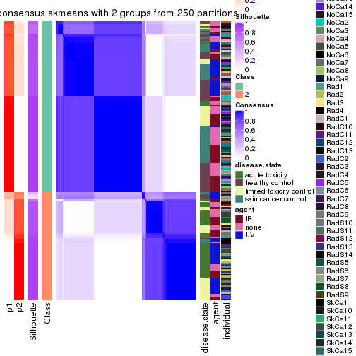</p>

</div>
<div id='tab-ATC-skmeans-consensus-heatmap-2'>
<pre><code class="r">consensus_heatmap(res, k = 3)
</code></pre>

<p>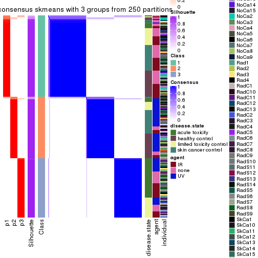</p>

</div>
<div id='tab-ATC-skmeans-consensus-heatmap-3'>
<pre><code class="r">consensus_heatmap(res, k = 4)
</code></pre>

<p>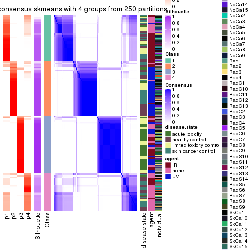</p>

</div>
<div id='tab-ATC-skmeans-consensus-heatmap-4'>
<pre><code class="r">consensus_heatmap(res, k = 5)
</code></pre>

<p>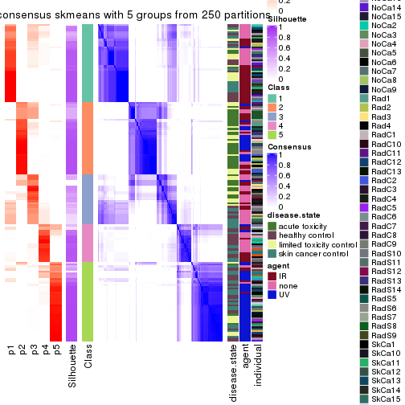</p>

</div>
<div id='tab-ATC-skmeans-consensus-heatmap-5'>
<pre><code class="r">consensus_heatmap(res, k = 6)
</code></pre>

<p>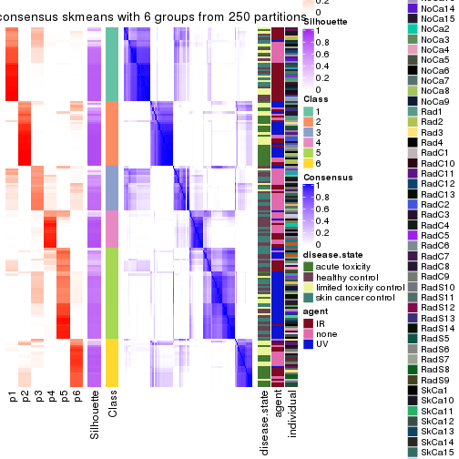</p>

</div>
</div>

Heatmaps for the membership of samples in all partitions to see how consistent they are:


<script>
$( function() {
	$( '#tabs-ATC-skmeans-membership-heatmap' ).tabs();
} );
</script>
<div id='tabs-ATC-skmeans-membership-heatmap'>
<ul>
<li><a href='#tab-ATC-skmeans-membership-heatmap-1'>k = 2</a></li>
<li><a href='#tab-ATC-skmeans-membership-heatmap-2'>k = 3</a></li>
<li><a href='#tab-ATC-skmeans-membership-heatmap-3'>k = 4</a></li>
<li><a href='#tab-ATC-skmeans-membership-heatmap-4'>k = 5</a></li>
<li><a href='#tab-ATC-skmeans-membership-heatmap-5'>k = 6</a></li>
</ul>
<div id='tab-ATC-skmeans-membership-heatmap-1'>
<pre><code class="r">membership_heatmap(res, k = 2)
</code></pre>

<p>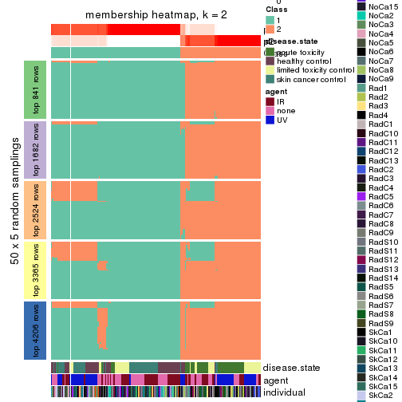</p>

</div>
<div id='tab-ATC-skmeans-membership-heatmap-2'>
<pre><code class="r">membership_heatmap(res, k = 3)
</code></pre>

<p>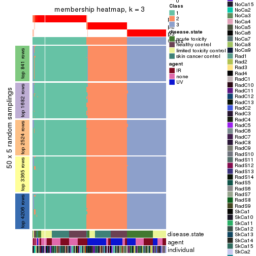</p>

</div>
<div id='tab-ATC-skmeans-membership-heatmap-3'>
<pre><code class="r">membership_heatmap(res, k = 4)
</code></pre>

<p>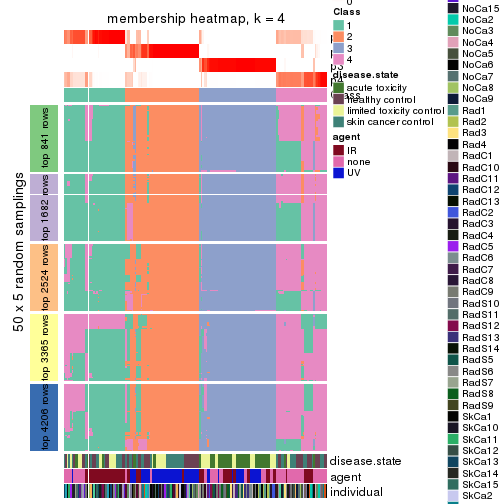</p>

</div>
<div id='tab-ATC-skmeans-membership-heatmap-4'>
<pre><code class="r">membership_heatmap(res, k = 5)
</code></pre>

<p>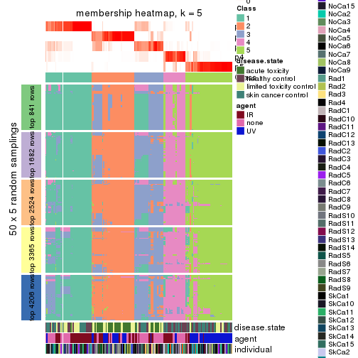</p>

</div>
<div id='tab-ATC-skmeans-membership-heatmap-5'>
<pre><code class="r">membership_heatmap(res, k = 6)
</code></pre>

<p>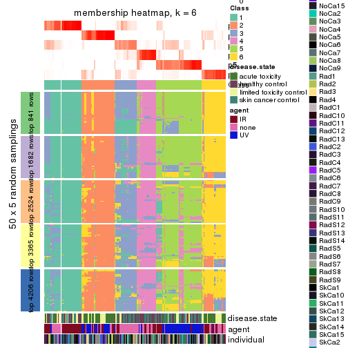</p>

</div>
</div>

As soon as we have had the classes for columns, we can look for signatures
which are significantly different between classes which can be candidate marks
for certain classes. Following are the heatmaps for signatures.


Signature heatmaps where rows are scaled:


<script>
$( function() {
	$( '#tabs-ATC-skmeans-get-signatures' ).tabs();
} );
</script>
<div id='tabs-ATC-skmeans-get-signatures'>
<ul>
<li><a href='#tab-ATC-skmeans-get-signatures-1'>k = 2</a></li>
<li><a href='#tab-ATC-skmeans-get-signatures-2'>k = 3</a></li>
<li><a href='#tab-ATC-skmeans-get-signatures-3'>k = 4</a></li>
<li><a href='#tab-ATC-skmeans-get-signatures-4'>k = 5</a></li>
<li><a href='#tab-ATC-skmeans-get-signatures-5'>k = 6</a></li>
</ul>
<div id='tab-ATC-skmeans-get-signatures-1'>
<pre><code class="r">get_signatures(res, k = 2)
</code></pre>

<p>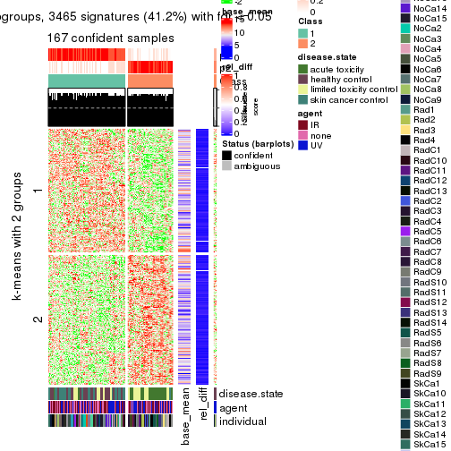</p>

</div>
<div id='tab-ATC-skmeans-get-signatures-2'>
<pre><code class="r">get_signatures(res, k = 3)
</code></pre>

<pre><code>#&gt; Error in mat[ceiling(1:nr/h_ratio), ceiling(1:nc/w_ratio), drop = FALSE]: subscript out of bounds
</code></pre>

<p>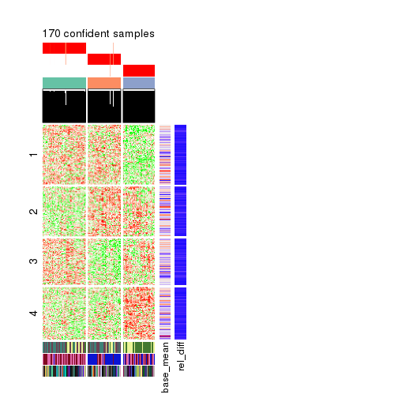</p>

</div>
<div id='tab-ATC-skmeans-get-signatures-3'>
<pre><code class="r">get_signatures(res, k = 4)
</code></pre>

<p>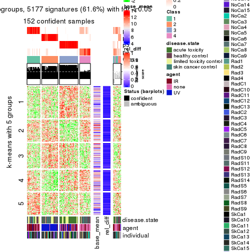</p>

</div>
<div id='tab-ATC-skmeans-get-signatures-4'>
<pre><code class="r">get_signatures(res, k = 5)
</code></pre>

<p>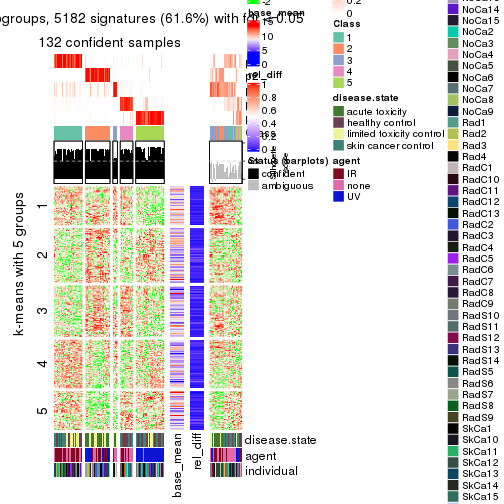</p>

</div>
<div id='tab-ATC-skmeans-get-signatures-5'>
<pre><code class="r">get_signatures(res, k = 6)
</code></pre>

<p>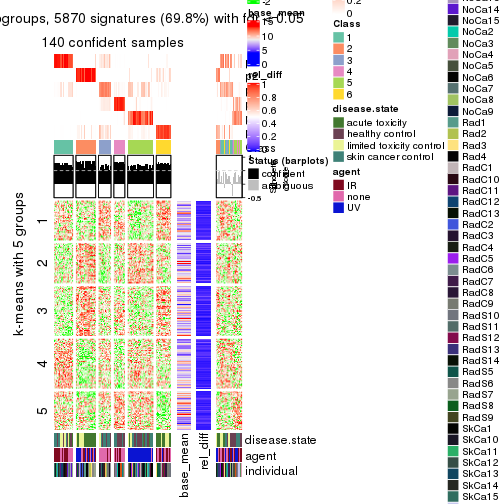</p>

</div>
</div>


Signature heatmaps where rows are not scaled:


<script>
$( function() {
	$( '#tabs-ATC-skmeans-get-signatures-no-scale' ).tabs();
} );
</script>
<div id='tabs-ATC-skmeans-get-signatures-no-scale'>
<ul>
<li><a href='#tab-ATC-skmeans-get-signatures-no-scale-1'>k = 2</a></li>
<li><a href='#tab-ATC-skmeans-get-signatures-no-scale-2'>k = 3</a></li>
<li><a href='#tab-ATC-skmeans-get-signatures-no-scale-3'>k = 4</a></li>
<li><a href='#tab-ATC-skmeans-get-signatures-no-scale-4'>k = 5</a></li>
<li><a href='#tab-ATC-skmeans-get-signatures-no-scale-5'>k = 6</a></li>
</ul>
<div id='tab-ATC-skmeans-get-signatures-no-scale-1'>
<pre><code class="r">get_signatures(res, k = 2, scale_rows = FALSE)
</code></pre>

<p>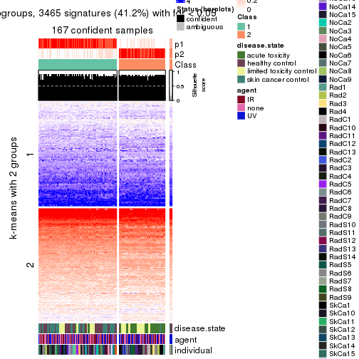</p>

</div>
<div id='tab-ATC-skmeans-get-signatures-no-scale-2'>
<pre><code class="r">get_signatures(res, k = 3, scale_rows = FALSE)
</code></pre>

<p>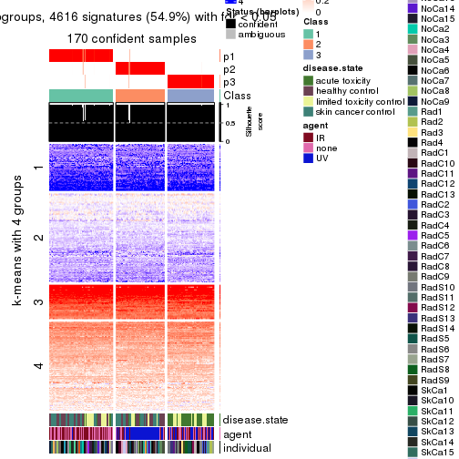</p>

</div>
<div id='tab-ATC-skmeans-get-signatures-no-scale-3'>
<pre><code class="r">get_signatures(res, k = 4, scale_rows = FALSE)
</code></pre>

<p>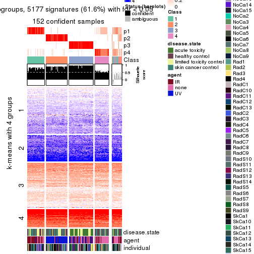</p>

</div>
<div id='tab-ATC-skmeans-get-signatures-no-scale-4'>
<pre><code class="r">get_signatures(res, k = 5, scale_rows = FALSE)
</code></pre>

<p>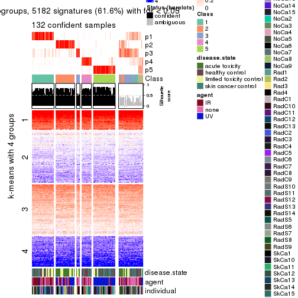</p>

</div>
<div id='tab-ATC-skmeans-get-signatures-no-scale-5'>
<pre><code class="r">get_signatures(res, k = 6, scale_rows = FALSE)
</code></pre>

<p>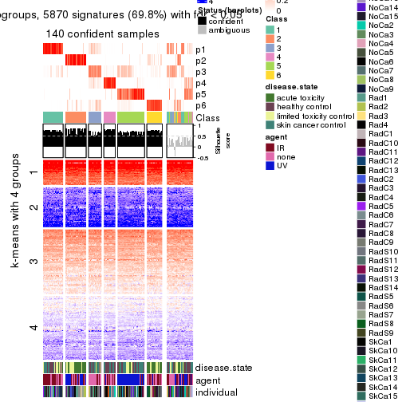</p>

</div>
</div>


Compare the overlap of signatures from different k:

```r
compare_signatures(res)
```

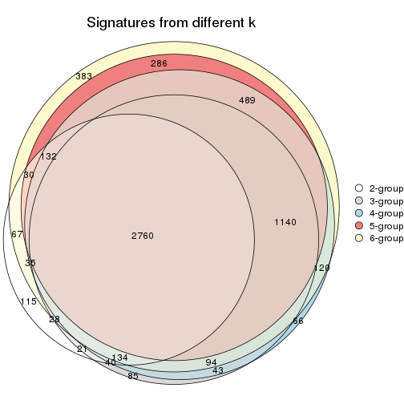

`get_signature()` returns a data frame invisibly. TO get the list of signatures, the function
call should be assigned to a variable explicitly. In following code, if `plot` argument is set
to `FALSE`, no heatmap is plotted while only the differential analysis is performed.

```r
# code only for demonstration
tb = get_signature(res, k = ..., plot = FALSE)
```

An example of the output of `tb` is:

```
#>   which_row         fdr    mean_1    mean_2 scaled_mean_1 scaled_mean_2 km
#> 1        38 0.042760348  8.373488  9.131774    -0.5533452     0.5164555  1
#> 2        40 0.018707592  7.106213  8.469186    -0.6173731     0.5762149  1
#> 3        55 0.019134737 10.221463 11.207825    -0.6159697     0.5749050  1
#> 4        59 0.006059896  5.921854  7.869574    -0.6899429     0.6439467  1
#> 5        60 0.018055526  8.928898 10.211722    -0.6204761     0.5791110  1
#> 6        98 0.009384629 15.714769 14.887706     0.6635654    -0.6193277  2
...
```

The columns in `tb` are:

1. `which_row`: row indices corresponding to the input matrix.
2. `fdr`: FDR for the differential test. 
3. `mean_x`: The mean value in group x.
4. `scaled_mean_x`: The mean value in group x after rows are scaled.
5. `km`: Row groups if k-means clustering is applied to rows.


UMAP plot which shows how samples are separated.


<script>
$( function() {
	$( '#tabs-ATC-skmeans-dimension-reduction' ).tabs();
} );
</script>
<div id='tabs-ATC-skmeans-dimension-reduction'>
<ul>
<li><a href='#tab-ATC-skmeans-dimension-reduction-1'>k = 2</a></li>
<li><a href='#tab-ATC-skmeans-dimension-reduction-2'>k = 3</a></li>
<li><a href='#tab-ATC-skmeans-dimension-reduction-3'>k = 4</a></li>
<li><a href='#tab-ATC-skmeans-dimension-reduction-4'>k = 5</a></li>
<li><a href='#tab-ATC-skmeans-dimension-reduction-5'>k = 6</a></li>
</ul>
<div id='tab-ATC-skmeans-dimension-reduction-1'>
<pre><code class="r">dimension_reduction(res, k = 2, method = &quot;UMAP&quot;)
</code></pre>

<p>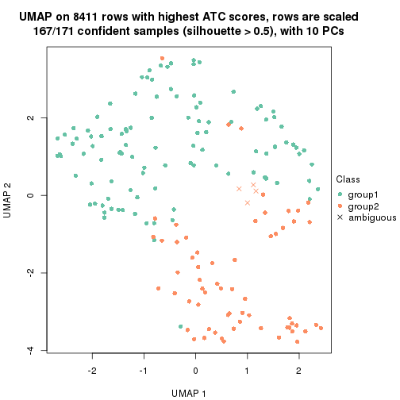</p>

</div>
<div id='tab-ATC-skmeans-dimension-reduction-2'>
<pre><code class="r">dimension_reduction(res, k = 3, method = &quot;UMAP&quot;)
</code></pre>

<p>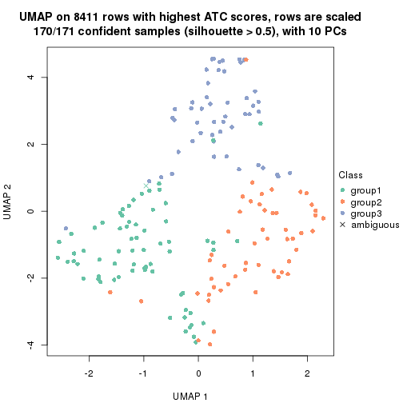</p>

</div>
<div id='tab-ATC-skmeans-dimension-reduction-3'>
<pre><code class="r">dimension_reduction(res, k = 4, method = &quot;UMAP&quot;)
</code></pre>

<p>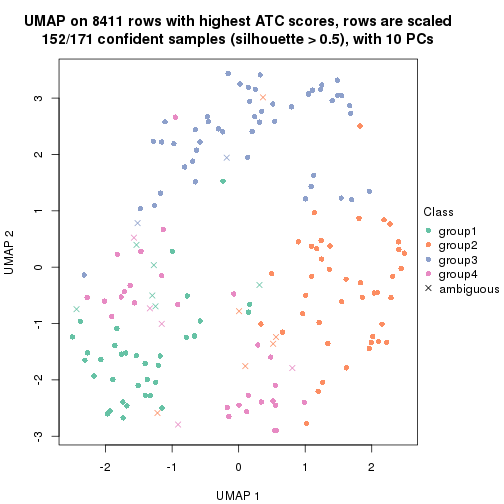</p>

</div>
<div id='tab-ATC-skmeans-dimension-reduction-4'>
<pre><code class="r">dimension_reduction(res, k = 5, method = &quot;UMAP&quot;)
</code></pre>

<p>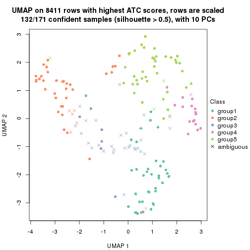</p>

</div>
<div id='tab-ATC-skmeans-dimension-reduction-5'>
<pre><code class="r">dimension_reduction(res, k = 6, method = &quot;UMAP&quot;)
</code></pre>

<p>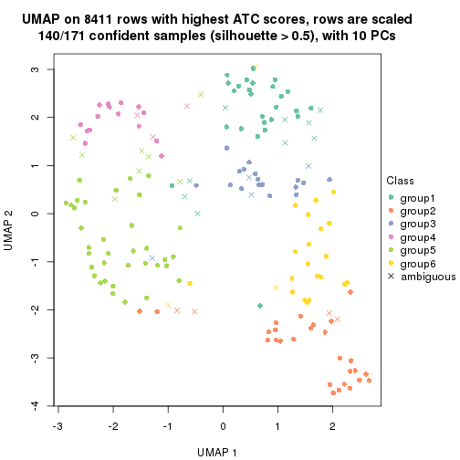</p>

</div>
</div>


Following heatmap shows how subgroups are split when increasing `k`:

```r
collect_classes(res)
```

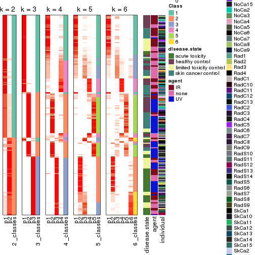


Test correlation between subgroups and known annotations. If the known
annotation is numeric, one-way ANOVA test is applied, and if the known
annotation is discrete, chi-squared contingency table test is applied.

```r
test_to_known_factors(res)
```

```
#>               n disease.state(p) agent(p) individual(p) k
#> ATC:skmeans 167         2.16e-20 1.83e-01      3.58e-08 2
#> ATC:skmeans 170         3.77e-18 1.05e-14      7.39e-05 3
#> ATC:skmeans 152         1.14e-15 9.25e-22      3.92e-02 4
#> ATC:skmeans 132         1.69e-12 5.39e-16      4.70e-04 5
#> ATC:skmeans 140         4.26e-13 2.50e-18      1.38e-07 6
```


If matrix rows can be associated to genes, consider to use `functional_enrichment(res,
...)` to perform function enrichment for the signature genes. See [this vignette](http://bioconductor.org/packages/devel/bioc/vignettes/cola/inst/doc/functional_enrichment.html) for more detailed explanations.


 

---------------------------------------------------


### ATC:pam


The object with results only for a single top-value method and a single partition method 
can be extracted as:

```r
res = res_list["ATC", "pam"]
# you can also extract it by
# res = res_list["ATC:pam"]
```

A summary of `res` and all the functions that can be applied to it:

```r
res
```

```
#> A 'ConsensusPartition' object with k = 2, 3, 4, 5, 6.
#>   On a matrix with 8411 rows and 171 columns.
#>   Top rows (841, 1682, 2524, 3365, 4206) are extracted by 'ATC' method.
#>   Subgroups are detected by 'pam' method.
#>   Performed in total 1250 partitions by row resampling.
#>   Best k for subgroups seems to be 3.
#> 
#> Following methods can be applied to this 'ConsensusPartition' object:
#>  [1] "cola_report"             "collect_classes"         "collect_plots"          
#>  [4] "collect_stats"           "colnames"                "compare_signatures"     
#>  [7] "consensus_heatmap"       "dimension_reduction"     "functional_enrichment"  
#> [10] "get_anno_col"            "get_anno"                "get_classes"            
#> [13] "get_consensus"           "get_matrix"              "get_membership"         
#> [16] "get_param"               "get_signatures"          "get_stats"              
#> [19] "is_best_k"               "is_stable_k"             "membership_heatmap"     
#> [22] "ncol"                    "nrow"                    "plot_ecdf"              
#> [25] "rownames"                "select_partition_number" "show"                   
#> [28] "suggest_best_k"          "test_to_known_factors"
```

`collect_plots()` function collects all the plots made from `res` for all `k` (number of partitions)
into one single page to provide an easy and fast comparison between different `k`.

```r
collect_plots(res)
```

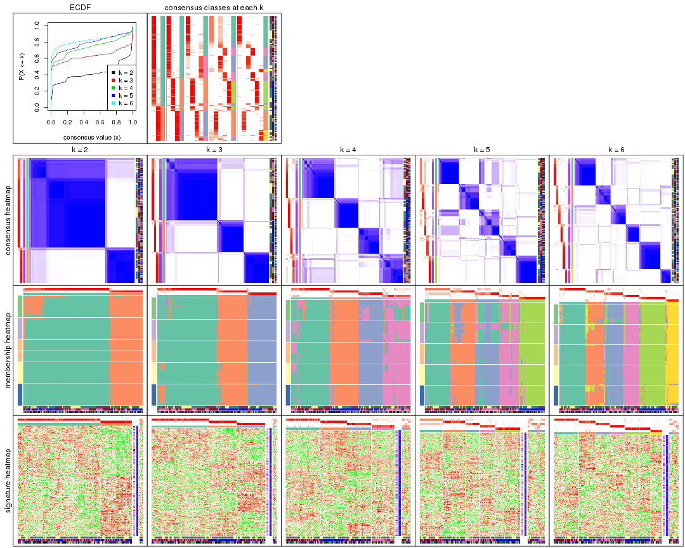

The plots are:

- The first row: a plot of the ECDF (empirical cumulative distribution
  function) curves of the consensus matrix for each `k` and the heatmap of
  predicted classes for each `k`.
- The second row: heatmaps of the consensus matrix for each `k`.
- The third row: heatmaps of the membership matrix for each `k`.
- The fouth row: heatmaps of the signatures for each `k`.

All the plots in panels can be made by individual functions and they are
plotted later in this section.

`select_partition_number()` produces several plots showing different
statistics for choosing "optimized" `k`. There are following statistics:

- ECDF curves of the consensus matrix for each `k`;
- 1-PAC. [The PAC
  score](https://en.wikipedia.org/wiki/Consensus_clustering#Over-interpretation_potential_of_consensus_clustering)
  measures the proportion of the ambiguous subgrouping.
- Mean silhouette score.
- Concordance. The mean probability of fiting the consensus class ids in all
  partitions.
- Area increased. Denote $A_k$ as the area under the ECDF curve for current
  `k`, the area increased is defined as $A_k - A_{k-1}$.
- Rand index. The percent of pairs of samples that are both in a same cluster
  or both are not in a same cluster in the partition of k and k-1.
- Jaccard index. The ratio of pairs of samples are both in a same cluster in
  the partition of k and k-1 and the pairs of samples are both in a same
  cluster in the partition k or k-1.

The detailed explanations of these statistics can be found in [the _cola_
vignette](http://bioconductor.org/packages/devel/bioc/vignettes/cola/inst/doc/cola.html#toc_13).

Generally speaking, lower PAC score, higher mean silhouette score or higher
concordance corresponds to better partition. Rand index and Jaccard index
measure how similar the current partition is compared to partition with `k-1`.
If they are too similar, we won't accept `k` is better than `k-1`.

```r
select_partition_number(res)
```

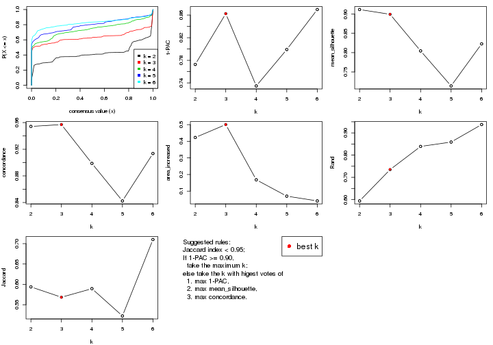

The numeric values for all these statistics can be obtained by `get_stats()`.

```r
get_stats(res)
```

```
#>   k 1-PAC mean_silhouette concordance area_increased  Rand Jaccard
#> 2 2 0.773           0.912       0.954         0.4227 0.594   0.594
#> 3 3 0.863           0.899       0.957         0.5005 0.735   0.568
#> 4 4 0.735           0.804       0.899         0.1684 0.839   0.590
#> 5 5 0.799           0.714       0.842         0.0699 0.859   0.523
#> 6 6 0.870           0.823       0.914         0.0413 0.938   0.710
```

`suggest_best_k()` suggests the best $k$ based on these statistics. The rules are as follows:

- All $k$ with Jaccard index larger than 0.95 are removed because increasing
  $k$ does not provide enough extra information. If all $k$ are removed, it is
  marked as no subgroup is detected.
- For all $k$ with 1-PAC score larger than 0.9, the maximal $k$ is taken as
  the best $k$, and other $k$ are marked as optional $k$.
- If it does not fit the second rule. The $k$ with the maximal vote of the
  highest 1-PAC score, highest mean silhouette, and highest concordance is
  taken as the best $k$.

```r
suggest_best_k(res)
```

```
#> [1] 3
```


Following shows the table of the partitions (You need to click the **show/hide
code output** link to see it). The membership matrix (columns with name `p*`)
is inferred by
[`clue::cl_consensus()`](https://www.rdocumentation.org/link/cl_consensus?package=clue)
function with the `SE` method. Basically the value in the membership matrix
represents the probability to belong to a certain group. The finall class
label for an item is determined with the group with highest probability it
belongs to.

In `get_classes()` function, the entropy is calculated from the membership
matrix and the silhouette score is calculated from the consensus matrix.


<script>
$( function() {
	$( '#tabs-ATC-pam-get-classes' ).tabs();
} );
</script>
<div id='tabs-ATC-pam-get-classes'>
<ul>
<li><a href='#tab-ATC-pam-get-classes-1'>k = 2</a></li>
<li><a href='#tab-ATC-pam-get-classes-2'>k = 3</a></li>
<li><a href='#tab-ATC-pam-get-classes-3'>k = 4</a></li>
<li><a href='#tab-ATC-pam-get-classes-4'>k = 5</a></li>
<li><a href='#tab-ATC-pam-get-classes-5'>k = 6</a></li>
</ul>

<div id='tab-ATC-pam-get-classes-1'>
<p><a id='tab-ATC-pam-get-classes-1-a' style='color:#0366d6' href='#'>show/hide code output</a></p>
<pre><code class="r">cbind(get_classes(res, k = 2), get_membership(res, k = 2))
</code></pre>

<pre><code>#&gt;          class entropy silhouette    p1    p2
#&gt; GSM29783     1  0.0000      0.946 1.000 0.000
#&gt; GSM29786     1  0.0376      0.945 0.996 0.004
#&gt; GSM29789     1  0.1184      0.942 0.984 0.016
#&gt; GSM29792     1  0.1184      0.942 0.984 0.016
#&gt; GSM29795     1  0.1184      0.942 0.984 0.016
#&gt; GSM29798     1  0.0000      0.946 1.000 0.000
#&gt; GSM29801     1  0.0000      0.946 1.000 0.000
#&gt; GSM29804     1  0.0000      0.946 1.000 0.000
#&gt; GSM29807     1  0.0376      0.945 0.996 0.004
#&gt; GSM29816     1  0.0000      0.946 1.000 0.000
#&gt; GSM29821     1  0.0000      0.946 1.000 0.000
#&gt; GSM29824     1  0.0000      0.946 1.000 0.000
#&gt; GSM29827     1  0.0376      0.945 0.996 0.004
#&gt; GSM29830     1  0.0000      0.946 1.000 0.000
#&gt; GSM29833     1  0.0000      0.946 1.000 0.000
#&gt; GSM29784     1  0.2236      0.930 0.964 0.036
#&gt; GSM29787     1  0.0376      0.945 0.996 0.004
#&gt; GSM29790     1  0.1184      0.942 0.984 0.016
#&gt; GSM29793     1  0.4161      0.901 0.916 0.084
#&gt; GSM29796     1  0.1184      0.942 0.984 0.016
#&gt; GSM29799     1  0.0000      0.946 1.000 0.000
#&gt; GSM29802     1  0.0000      0.946 1.000 0.000
#&gt; GSM29805     1  0.0000      0.946 1.000 0.000
#&gt; GSM29814     1  0.0000      0.946 1.000 0.000
#&gt; GSM29817     1  0.0000      0.946 1.000 0.000
#&gt; GSM29822     1  0.0000      0.946 1.000 0.000
#&gt; GSM29825     1  0.0000      0.946 1.000 0.000
#&gt; GSM29828     1  0.0000      0.946 1.000 0.000
#&gt; GSM29831     1  0.0000      0.946 1.000 0.000
#&gt; GSM29834     1  0.0000      0.946 1.000 0.000
#&gt; GSM29785     1  0.6801      0.824 0.820 0.180
#&gt; GSM29788     2  0.9710      0.247 0.400 0.600
#&gt; GSM29791     1  0.5842      0.860 0.860 0.140
#&gt; GSM29794     1  0.7056      0.811 0.808 0.192
#&gt; GSM29797     1  0.7056      0.811 0.808 0.192
#&gt; GSM29800     2  0.3879      0.896 0.076 0.924
#&gt; GSM29803     1  0.1184      0.942 0.984 0.016
#&gt; GSM29806     1  0.9686      0.434 0.604 0.396
#&gt; GSM29815     1  0.7056      0.811 0.808 0.192
#&gt; GSM29819     2  0.9491      0.396 0.368 0.632
#&gt; GSM29823     1  0.1184      0.942 0.984 0.016
#&gt; GSM29826     1  0.1184      0.942 0.984 0.016
#&gt; GSM29829     1  0.1184      0.942 0.984 0.016
#&gt; GSM29832     1  0.1184      0.942 0.984 0.016
#&gt; GSM29835     1  0.1184      0.942 0.984 0.016
#&gt; GSM29836     1  0.7056      0.811 0.808 0.192
#&gt; GSM29839     1  0.1184      0.942 0.984 0.016
#&gt; GSM29842     1  0.0000      0.946 1.000 0.000
#&gt; GSM29845     1  0.0000      0.946 1.000 0.000
#&gt; GSM29848     1  0.0000      0.946 1.000 0.000
#&gt; GSM29851     1  0.0000      0.946 1.000 0.000
#&gt; GSM29854     1  0.0000      0.946 1.000 0.000
#&gt; GSM29857     1  0.0376      0.945 0.996 0.004
#&gt; GSM29860     1  0.1184      0.942 0.984 0.016
#&gt; GSM29863     1  0.0000      0.946 1.000 0.000
#&gt; GSM29866     1  0.0000      0.946 1.000 0.000
#&gt; GSM29869     1  0.0000      0.946 1.000 0.000
#&gt; GSM29872     1  0.1184      0.942 0.984 0.016
#&gt; GSM29875     1  0.0000      0.946 1.000 0.000
#&gt; GSM29878     1  0.0000      0.946 1.000 0.000
#&gt; GSM29837     1  0.7056      0.811 0.808 0.192
#&gt; GSM29840     1  0.0672      0.944 0.992 0.008
#&gt; GSM29843     1  0.0000      0.946 1.000 0.000
#&gt; GSM29846     1  0.0000      0.946 1.000 0.000
#&gt; GSM29849     1  0.0000      0.946 1.000 0.000
#&gt; GSM29852     1  0.0000      0.946 1.000 0.000
#&gt; GSM29855     1  0.0000      0.946 1.000 0.000
#&gt; GSM29858     1  0.0000      0.946 1.000 0.000
#&gt; GSM29861     1  0.1184      0.942 0.984 0.016
#&gt; GSM29864     1  0.0000      0.946 1.000 0.000
#&gt; GSM29867     1  0.0000      0.946 1.000 0.000
#&gt; GSM29870     1  0.0000      0.946 1.000 0.000
#&gt; GSM29873     1  0.0000      0.946 1.000 0.000
#&gt; GSM29876     1  0.0000      0.946 1.000 0.000
#&gt; GSM29879     1  0.0000      0.946 1.000 0.000
#&gt; GSM29838     2  0.1184      0.959 0.016 0.984
#&gt; GSM29841     1  0.7056      0.811 0.808 0.192
#&gt; GSM29844     1  0.6531      0.835 0.832 0.168
#&gt; GSM29847     1  0.1184      0.942 0.984 0.016
#&gt; GSM29850     1  0.1184      0.942 0.984 0.016
#&gt; GSM29853     1  0.1184      0.942 0.984 0.016
#&gt; GSM29856     1  0.4161      0.903 0.916 0.084
#&gt; GSM29859     1  0.7883      0.752 0.764 0.236
#&gt; GSM29862     1  0.7056      0.811 0.808 0.192
#&gt; GSM29865     1  0.3431      0.918 0.936 0.064
#&gt; GSM29868     1  0.1184      0.942 0.984 0.016
#&gt; GSM29871     1  0.1184      0.942 0.984 0.016
#&gt; GSM29874     1  0.3431      0.917 0.936 0.064
#&gt; GSM29877     1  0.0938      0.943 0.988 0.012
#&gt; GSM29880     1  0.6531      0.835 0.832 0.168
#&gt; GSM29881     2  0.1184      0.964 0.016 0.984
#&gt; GSM29884     2  0.0376      0.969 0.004 0.996
#&gt; GSM29887     2  0.7674      0.684 0.224 0.776
#&gt; GSM29890     1  0.0000      0.946 1.000 0.000
#&gt; GSM29893     1  0.0000      0.946 1.000 0.000
#&gt; GSM29896     1  0.0000      0.946 1.000 0.000
#&gt; GSM29899     1  0.0000      0.946 1.000 0.000
#&gt; GSM29902     1  0.0672      0.944 0.992 0.008
#&gt; GSM29905     1  0.6712      0.823 0.824 0.176
#&gt; GSM29908     1  0.0000      0.946 1.000 0.000
#&gt; GSM29955     1  0.6973      0.812 0.812 0.188
#&gt; GSM29958     1  0.0000      0.946 1.000 0.000
#&gt; GSM29961     1  0.0000      0.946 1.000 0.000
#&gt; GSM29882     2  0.1633      0.961 0.024 0.976
#&gt; GSM29885     2  0.0376      0.969 0.004 0.996
#&gt; GSM29888     2  0.0376      0.969 0.004 0.996
#&gt; GSM29891     1  0.0000      0.946 1.000 0.000
#&gt; GSM29894     1  0.0000      0.946 1.000 0.000
#&gt; GSM29897     1  0.0000      0.946 1.000 0.000
#&gt; GSM29900     1  0.0000      0.946 1.000 0.000
#&gt; GSM29903     2  0.1184      0.964 0.016 0.984
#&gt; GSM29906     1  0.7674      0.769 0.776 0.224
#&gt; GSM29909     1  0.6712      0.818 0.824 0.176
#&gt; GSM29956     1  0.0000      0.946 1.000 0.000
#&gt; GSM29959     1  0.0000      0.946 1.000 0.000
#&gt; GSM29962     1  0.0000      0.946 1.000 0.000
#&gt; GSM29883     2  0.0376      0.969 0.004 0.996
#&gt; GSM29886     2  0.0000      0.969 0.000 1.000
#&gt; GSM29889     2  0.0000      0.969 0.000 1.000
#&gt; GSM29892     2  0.0376      0.969 0.004 0.996
#&gt; GSM29895     1  0.6712      0.828 0.824 0.176
#&gt; GSM29898     2  0.0000      0.969 0.000 1.000
#&gt; GSM29901     2  0.0000      0.969 0.000 1.000
#&gt; GSM29904     1  0.7056      0.811 0.808 0.192
#&gt; GSM29907     1  0.7056      0.811 0.808 0.192
#&gt; GSM29910     1  0.1184      0.942 0.984 0.016
#&gt; GSM29957     2  0.0000      0.969 0.000 1.000
#&gt; GSM29960     1  0.1184      0.942 0.984 0.016
#&gt; GSM29963     1  0.7056      0.811 0.808 0.192
#&gt; GSM29964     1  0.9775      0.401 0.588 0.412
#&gt; GSM29967     2  0.0376      0.969 0.004 0.996
#&gt; GSM29970     2  0.1184      0.964 0.016 0.984
#&gt; GSM29973     2  0.0000      0.969 0.000 1.000
#&gt; GSM29976     2  0.1184      0.964 0.016 0.984
#&gt; GSM29979     2  0.0938      0.966 0.012 0.988
#&gt; GSM29982     1  0.6887      0.815 0.816 0.184
#&gt; GSM29985     2  0.0938      0.966 0.012 0.988
#&gt; GSM29988     2  0.1184      0.964 0.016 0.984
#&gt; GSM29991     2  0.0376      0.969 0.004 0.996
#&gt; GSM29994     1  0.9988      0.161 0.520 0.480
#&gt; GSM29997     1  0.0000      0.946 1.000 0.000
#&gt; GSM30000     2  0.0376      0.969 0.004 0.996
#&gt; GSM30003     1  0.0000      0.946 1.000 0.000
#&gt; GSM29965     2  0.0672      0.968 0.008 0.992
#&gt; GSM29968     2  0.0376      0.969 0.004 0.996
#&gt; GSM29971     1  0.0376      0.945 0.996 0.004
#&gt; GSM29974     2  0.0000      0.969 0.000 1.000
#&gt; GSM29977     2  0.1184      0.964 0.016 0.984
#&gt; GSM29980     2  0.0376      0.969 0.004 0.996
#&gt; GSM29983     1  0.0000      0.946 1.000 0.000
#&gt; GSM29986     2  0.1184      0.964 0.016 0.984
#&gt; GSM29989     2  0.1184      0.964 0.016 0.984
#&gt; GSM29992     2  0.1184      0.964 0.016 0.984
#&gt; GSM29995     1  0.0000      0.946 1.000 0.000
#&gt; GSM29998     1  0.6887      0.810 0.816 0.184
#&gt; GSM30001     2  0.0376      0.969 0.004 0.996
#&gt; GSM30004     1  0.5059      0.876 0.888 0.112
#&gt; GSM29966     2  0.0000      0.969 0.000 1.000
#&gt; GSM29969     2  0.0000      0.969 0.000 1.000
#&gt; GSM29972     2  0.0000      0.969 0.000 1.000
#&gt; GSM29975     2  0.0000      0.969 0.000 1.000
#&gt; GSM29978     2  0.0000      0.969 0.000 1.000
#&gt; GSM29981     2  0.0000      0.969 0.000 1.000
#&gt; GSM29984     2  0.0000      0.969 0.000 1.000
#&gt; GSM29987     2  0.0376      0.969 0.004 0.996
#&gt; GSM29990     1  0.7056      0.811 0.808 0.192
#&gt; GSM29993     2  0.0376      0.969 0.004 0.996
#&gt; GSM29996     1  0.1184      0.942 0.984 0.016
#&gt; GSM29999     2  0.0376      0.969 0.004 0.996
#&gt; GSM30002     2  0.0000      0.969 0.000 1.000
#&gt; GSM30005     2  0.1633      0.952 0.024 0.976
</code></pre>

<script>
$('#tab-ATC-pam-get-classes-1-a').parent().next().next().hide();
$('#tab-ATC-pam-get-classes-1-a').click(function(){
  $('#tab-ATC-pam-get-classes-1-a').parent().next().next().toggle();
  return(false);
});
</script>
</div>

<div id='tab-ATC-pam-get-classes-2'>
<p><a id='tab-ATC-pam-get-classes-2-a' style='color:#0366d6' href='#'>show/hide code output</a></p>
<pre><code class="r">cbind(get_classes(res, k = 3), get_membership(res, k = 3))
</code></pre>

<pre><code>#&gt;          class entropy silhouette    p1    p2    p3
#&gt; GSM29783     1  0.0000     0.9477 1.000 0.000 0.000
#&gt; GSM29786     1  0.0424     0.9434 0.992 0.008 0.000
#&gt; GSM29789     1  0.0424     0.9434 0.992 0.008 0.000
#&gt; GSM29792     1  0.4504     0.7524 0.804 0.196 0.000
#&gt; GSM29795     1  0.4452     0.7588 0.808 0.192 0.000
#&gt; GSM29798     1  0.0000     0.9477 1.000 0.000 0.000
#&gt; GSM29801     1  0.0000     0.9477 1.000 0.000 0.000
#&gt; GSM29804     1  0.0000     0.9477 1.000 0.000 0.000
#&gt; GSM29807     1  0.0000     0.9477 1.000 0.000 0.000
#&gt; GSM29816     1  0.0000     0.9477 1.000 0.000 0.000
#&gt; GSM29821     1  0.0000     0.9477 1.000 0.000 0.000
#&gt; GSM29824     1  0.0000     0.9477 1.000 0.000 0.000
#&gt; GSM29827     1  0.0000     0.9477 1.000 0.000 0.000
#&gt; GSM29830     1  0.0000     0.9477 1.000 0.000 0.000
#&gt; GSM29833     1  0.0000     0.9477 1.000 0.000 0.000
#&gt; GSM29784     1  0.5365     0.6819 0.744 0.252 0.004
#&gt; GSM29787     1  0.3941     0.8157 0.844 0.156 0.000
#&gt; GSM29790     1  0.5178     0.6787 0.744 0.256 0.000
#&gt; GSM29793     1  0.1163     0.9301 0.972 0.028 0.000
#&gt; GSM29796     1  0.6168     0.2852 0.588 0.412 0.000
#&gt; GSM29799     1  0.5335     0.7067 0.760 0.232 0.008
#&gt; GSM29802     1  0.5292     0.7128 0.764 0.228 0.008
#&gt; GSM29805     1  0.0000     0.9477 1.000 0.000 0.000
#&gt; GSM29814     1  0.0237     0.9457 0.996 0.000 0.004
#&gt; GSM29817     1  0.0000     0.9477 1.000 0.000 0.000
#&gt; GSM29822     1  0.4399     0.7719 0.812 0.188 0.000
#&gt; GSM29825     1  0.0000     0.9477 1.000 0.000 0.000
#&gt; GSM29828     1  0.0000     0.9477 1.000 0.000 0.000
#&gt; GSM29831     1  0.0000     0.9477 1.000 0.000 0.000
#&gt; GSM29834     1  0.0000     0.9477 1.000 0.000 0.000
#&gt; GSM29785     2  0.0000     0.9389 0.000 1.000 0.000
#&gt; GSM29788     2  0.0000     0.9389 0.000 1.000 0.000
#&gt; GSM29791     2  0.0000     0.9389 0.000 1.000 0.000
#&gt; GSM29794     2  0.0000     0.9389 0.000 1.000 0.000
#&gt; GSM29797     2  0.0000     0.9389 0.000 1.000 0.000
#&gt; GSM29800     2  0.1163     0.9174 0.000 0.972 0.028
#&gt; GSM29803     2  0.0000     0.9389 0.000 1.000 0.000
#&gt; GSM29806     2  0.0000     0.9389 0.000 1.000 0.000
#&gt; GSM29815     2  0.0000     0.9389 0.000 1.000 0.000
#&gt; GSM29819     2  0.1753     0.9000 0.000 0.952 0.048
#&gt; GSM29823     2  0.0000     0.9389 0.000 1.000 0.000
#&gt; GSM29826     2  0.5016     0.6936 0.240 0.760 0.000
#&gt; GSM29829     2  0.0000     0.9389 0.000 1.000 0.000
#&gt; GSM29832     2  0.0000     0.9389 0.000 1.000 0.000
#&gt; GSM29835     2  0.0000     0.9389 0.000 1.000 0.000
#&gt; GSM29836     2  0.4931     0.6987 0.232 0.768 0.000
#&gt; GSM29839     1  0.0592     0.9411 0.988 0.012 0.000
#&gt; GSM29842     1  0.0000     0.9477 1.000 0.000 0.000
#&gt; GSM29845     1  0.0000     0.9477 1.000 0.000 0.000
#&gt; GSM29848     1  0.0000     0.9477 1.000 0.000 0.000
#&gt; GSM29851     1  0.0000     0.9477 1.000 0.000 0.000
#&gt; GSM29854     1  0.0000     0.9477 1.000 0.000 0.000
#&gt; GSM29857     1  0.2537     0.8868 0.920 0.080 0.000
#&gt; GSM29860     1  0.4452     0.7574 0.808 0.192 0.000
#&gt; GSM29863     1  0.0000     0.9477 1.000 0.000 0.000
#&gt; GSM29866     1  0.0000     0.9477 1.000 0.000 0.000
#&gt; GSM29869     1  0.0000     0.9477 1.000 0.000 0.000
#&gt; GSM29872     1  0.0000     0.9477 1.000 0.000 0.000
#&gt; GSM29875     1  0.0000     0.9477 1.000 0.000 0.000
#&gt; GSM29878     1  0.0000     0.9477 1.000 0.000 0.000
#&gt; GSM29837     2  0.0000     0.9389 0.000 1.000 0.000
#&gt; GSM29840     1  0.3619     0.8292 0.864 0.136 0.000
#&gt; GSM29843     1  0.0000     0.9477 1.000 0.000 0.000
#&gt; GSM29846     1  0.4842     0.7239 0.776 0.224 0.000
#&gt; GSM29849     1  0.0000     0.9477 1.000 0.000 0.000
#&gt; GSM29852     1  0.0000     0.9477 1.000 0.000 0.000
#&gt; GSM29855     1  0.0000     0.9477 1.000 0.000 0.000
#&gt; GSM29858     1  0.4099     0.8243 0.852 0.140 0.008
#&gt; GSM29861     2  0.6095     0.3771 0.392 0.608 0.000
#&gt; GSM29864     1  0.4887     0.7182 0.772 0.228 0.000
#&gt; GSM29867     1  0.0000     0.9477 1.000 0.000 0.000
#&gt; GSM29870     1  0.0000     0.9477 1.000 0.000 0.000
#&gt; GSM29873     1  0.0000     0.9477 1.000 0.000 0.000
#&gt; GSM29876     1  0.0000     0.9477 1.000 0.000 0.000
#&gt; GSM29879     1  0.0424     0.9435 0.992 0.000 0.008
#&gt; GSM29838     2  0.0000     0.9389 0.000 1.000 0.000
#&gt; GSM29841     2  0.0000     0.9389 0.000 1.000 0.000
#&gt; GSM29844     2  0.0000     0.9389 0.000 1.000 0.000
#&gt; GSM29847     2  0.0000     0.9389 0.000 1.000 0.000
#&gt; GSM29850     2  0.0000     0.9389 0.000 1.000 0.000
#&gt; GSM29853     2  0.0000     0.9389 0.000 1.000 0.000
#&gt; GSM29856     2  0.0000     0.9389 0.000 1.000 0.000
#&gt; GSM29859     2  0.0000     0.9389 0.000 1.000 0.000
#&gt; GSM29862     2  0.0000     0.9389 0.000 1.000 0.000
#&gt; GSM29865     2  0.0000     0.9389 0.000 1.000 0.000
#&gt; GSM29868     2  0.2356     0.8760 0.072 0.928 0.000
#&gt; GSM29871     2  0.0000     0.9389 0.000 1.000 0.000
#&gt; GSM29874     2  0.0000     0.9389 0.000 1.000 0.000
#&gt; GSM29877     2  0.6286     0.1870 0.464 0.536 0.000
#&gt; GSM29880     2  0.0000     0.9389 0.000 1.000 0.000
#&gt; GSM29881     3  0.0000     0.9704 0.000 0.000 1.000
#&gt; GSM29884     3  0.0000     0.9704 0.000 0.000 1.000
#&gt; GSM29887     3  0.4796     0.6997 0.220 0.000 0.780
#&gt; GSM29890     1  0.0000     0.9477 1.000 0.000 0.000
#&gt; GSM29893     1  0.0000     0.9477 1.000 0.000 0.000
#&gt; GSM29896     1  0.0000     0.9477 1.000 0.000 0.000
#&gt; GSM29899     1  0.0000     0.9477 1.000 0.000 0.000
#&gt; GSM29902     1  0.0000     0.9477 1.000 0.000 0.000
#&gt; GSM29905     1  0.0000     0.9477 1.000 0.000 0.000
#&gt; GSM29908     1  0.0000     0.9477 1.000 0.000 0.000
#&gt; GSM29955     1  0.2448     0.8906 0.924 0.000 0.076
#&gt; GSM29958     1  0.0000     0.9477 1.000 0.000 0.000
#&gt; GSM29961     1  0.0000     0.9477 1.000 0.000 0.000
#&gt; GSM29882     3  0.1031     0.9475 0.024 0.000 0.976
#&gt; GSM29885     3  0.0000     0.9704 0.000 0.000 1.000
#&gt; GSM29888     3  0.0000     0.9704 0.000 0.000 1.000
#&gt; GSM29891     1  0.0424     0.9435 0.992 0.000 0.008
#&gt; GSM29894     1  0.0000     0.9477 1.000 0.000 0.000
#&gt; GSM29897     1  0.0000     0.9477 1.000 0.000 0.000
#&gt; GSM29900     1  0.0424     0.9435 0.992 0.000 0.008
#&gt; GSM29903     3  0.0000     0.9704 0.000 0.000 1.000
#&gt; GSM29906     1  0.4121     0.7961 0.832 0.000 0.168
#&gt; GSM29909     1  0.2625     0.8856 0.916 0.000 0.084
#&gt; GSM29956     1  0.0000     0.9477 1.000 0.000 0.000
#&gt; GSM29959     1  0.0000     0.9477 1.000 0.000 0.000
#&gt; GSM29962     1  0.0000     0.9477 1.000 0.000 0.000
#&gt; GSM29883     3  0.0424     0.9668 0.000 0.008 0.992
#&gt; GSM29886     3  0.0424     0.9668 0.000 0.008 0.992
#&gt; GSM29889     2  0.0000     0.9389 0.000 1.000 0.000
#&gt; GSM29892     3  0.0000     0.9704 0.000 0.000 1.000
#&gt; GSM29895     2  0.0000     0.9389 0.000 1.000 0.000
#&gt; GSM29898     3  0.0424     0.9668 0.000 0.008 0.992
#&gt; GSM29901     3  0.2796     0.8785 0.000 0.092 0.908
#&gt; GSM29904     2  0.0000     0.9389 0.000 1.000 0.000
#&gt; GSM29907     2  0.0000     0.9389 0.000 1.000 0.000
#&gt; GSM29910     2  0.0000     0.9389 0.000 1.000 0.000
#&gt; GSM29957     2  0.6192     0.2611 0.000 0.580 0.420
#&gt; GSM29960     2  0.3482     0.8203 0.128 0.872 0.000
#&gt; GSM29963     2  0.0000     0.9389 0.000 1.000 0.000
#&gt; GSM29964     1  0.6204     0.2748 0.576 0.000 0.424
#&gt; GSM29967     3  0.0424     0.9648 0.008 0.000 0.992
#&gt; GSM29970     3  0.0000     0.9704 0.000 0.000 1.000
#&gt; GSM29973     3  0.0000     0.9704 0.000 0.000 1.000
#&gt; GSM29976     3  0.0000     0.9704 0.000 0.000 1.000
#&gt; GSM29979     3  0.0747     0.9582 0.016 0.000 0.984
#&gt; GSM29982     1  0.0000     0.9477 1.000 0.000 0.000
#&gt; GSM29985     3  0.0000     0.9704 0.000 0.000 1.000
#&gt; GSM29988     3  0.0000     0.9704 0.000 0.000 1.000
#&gt; GSM29991     3  0.0000     0.9704 0.000 0.000 1.000
#&gt; GSM29994     3  0.6309    -0.0236 0.496 0.000 0.504
#&gt; GSM29997     1  0.0000     0.9477 1.000 0.000 0.000
#&gt; GSM30000     3  0.0000     0.9704 0.000 0.000 1.000
#&gt; GSM30003     1  0.0000     0.9477 1.000 0.000 0.000
#&gt; GSM29965     3  0.0000     0.9704 0.000 0.000 1.000
#&gt; GSM29968     3  0.0000     0.9704 0.000 0.000 1.000
#&gt; GSM29971     1  0.0424     0.9435 0.992 0.000 0.008
#&gt; GSM29974     3  0.0424     0.9668 0.000 0.008 0.992
#&gt; GSM29977     3  0.0000     0.9704 0.000 0.000 1.000
#&gt; GSM29980     3  0.0000     0.9704 0.000 0.000 1.000
#&gt; GSM29983     1  0.0000     0.9477 1.000 0.000 0.000
#&gt; GSM29986     3  0.0000     0.9704 0.000 0.000 1.000
#&gt; GSM29989     3  0.0000     0.9704 0.000 0.000 1.000
#&gt; GSM29992     3  0.0000     0.9704 0.000 0.000 1.000
#&gt; GSM29995     1  0.0000     0.9477 1.000 0.000 0.000
#&gt; GSM29998     1  0.2796     0.8787 0.908 0.000 0.092
#&gt; GSM30001     3  0.0000     0.9704 0.000 0.000 1.000
#&gt; GSM30004     1  0.0747     0.9391 0.984 0.000 0.016
#&gt; GSM29966     3  0.0424     0.9668 0.000 0.008 0.992
#&gt; GSM29969     3  0.0424     0.9668 0.000 0.008 0.992
#&gt; GSM29972     3  0.0424     0.9668 0.000 0.008 0.992
#&gt; GSM29975     3  0.0424     0.9668 0.000 0.008 0.992
#&gt; GSM29978     3  0.0000     0.9704 0.000 0.000 1.000
#&gt; GSM29981     3  0.2537     0.8926 0.000 0.080 0.920
#&gt; GSM29984     3  0.0424     0.9668 0.000 0.008 0.992
#&gt; GSM29987     3  0.0000     0.9704 0.000 0.000 1.000
#&gt; GSM29990     2  0.0000     0.9389 0.000 1.000 0.000
#&gt; GSM29993     3  0.0000     0.9704 0.000 0.000 1.000
#&gt; GSM29996     2  0.4750     0.7221 0.216 0.784 0.000
#&gt; GSM29999     3  0.0000     0.9704 0.000 0.000 1.000
#&gt; GSM30002     3  0.0000     0.9704 0.000 0.000 1.000
#&gt; GSM30005     2  0.0424     0.9331 0.000 0.992 0.008
</code></pre>

<script>
$('#tab-ATC-pam-get-classes-2-a').parent().next().next().hide();
$('#tab-ATC-pam-get-classes-2-a').click(function(){
  $('#tab-ATC-pam-get-classes-2-a').parent().next().next().toggle();
  return(false);
});
</script>
</div>

<div id='tab-ATC-pam-get-classes-3'>
<p><a id='tab-ATC-pam-get-classes-3-a' style='color:#0366d6' href='#'>show/hide code output</a></p>
<pre><code class="r">cbind(get_classes(res, k = 4), get_membership(res, k = 4))
</code></pre>

<pre><code>#&gt;          class entropy silhouette    p1    p2    p3    p4
#&gt; GSM29783     1  0.4804     0.2825 0.616 0.000 0.000 0.384
#&gt; GSM29786     1  0.1867     0.8492 0.928 0.000 0.000 0.072
#&gt; GSM29789     1  0.0817     0.8751 0.976 0.000 0.000 0.024
#&gt; GSM29792     1  0.3937     0.6993 0.800 0.188 0.000 0.012
#&gt; GSM29795     1  0.3969     0.7067 0.804 0.180 0.000 0.016
#&gt; GSM29798     1  0.3400     0.7539 0.820 0.000 0.000 0.180
#&gt; GSM29801     1  0.0000     0.8865 1.000 0.000 0.000 0.000
#&gt; GSM29804     1  0.2345     0.8143 0.900 0.000 0.000 0.100
#&gt; GSM29807     1  0.0000     0.8865 1.000 0.000 0.000 0.000
#&gt; GSM29816     4  0.3356     0.8059 0.176 0.000 0.000 0.824
#&gt; GSM29821     1  0.0000     0.8865 1.000 0.000 0.000 0.000
#&gt; GSM29824     1  0.0000     0.8865 1.000 0.000 0.000 0.000
#&gt; GSM29827     1  0.0000     0.8865 1.000 0.000 0.000 0.000
#&gt; GSM29830     1  0.0000     0.8865 1.000 0.000 0.000 0.000
#&gt; GSM29833     1  0.0000     0.8865 1.000 0.000 0.000 0.000
#&gt; GSM29784     4  0.3208     0.8080 0.148 0.004 0.000 0.848
#&gt; GSM29787     4  0.4164     0.7099 0.264 0.000 0.000 0.736
#&gt; GSM29790     4  0.4422     0.7151 0.256 0.008 0.000 0.736
#&gt; GSM29793     4  0.5217     0.5003 0.380 0.012 0.000 0.608
#&gt; GSM29796     1  0.7432     0.3047 0.480 0.336 0.000 0.184
#&gt; GSM29799     4  0.2921     0.8090 0.140 0.000 0.000 0.860
#&gt; GSM29802     4  0.3356     0.8059 0.176 0.000 0.000 0.824
#&gt; GSM29805     4  0.3356     0.8059 0.176 0.000 0.000 0.824
#&gt; GSM29814     4  0.3356     0.8059 0.176 0.000 0.000 0.824
#&gt; GSM29817     4  0.3907     0.7544 0.232 0.000 0.000 0.768
#&gt; GSM29822     4  0.3356     0.8059 0.176 0.000 0.000 0.824
#&gt; GSM29825     1  0.3610     0.6897 0.800 0.000 0.000 0.200
#&gt; GSM29828     1  0.0000     0.8865 1.000 0.000 0.000 0.000
#&gt; GSM29831     1  0.0000     0.8865 1.000 0.000 0.000 0.000
#&gt; GSM29834     1  0.0469     0.8807 0.988 0.000 0.000 0.012
#&gt; GSM29785     2  0.0000     0.9404 0.000 1.000 0.000 0.000
#&gt; GSM29788     2  0.0000     0.9404 0.000 1.000 0.000 0.000
#&gt; GSM29791     2  0.0000     0.9404 0.000 1.000 0.000 0.000
#&gt; GSM29794     2  0.0000     0.9404 0.000 1.000 0.000 0.000
#&gt; GSM29797     2  0.0000     0.9404 0.000 1.000 0.000 0.000
#&gt; GSM29800     2  0.5003     0.7408 0.000 0.768 0.148 0.084
#&gt; GSM29803     2  0.0000     0.9404 0.000 1.000 0.000 0.000
#&gt; GSM29806     4  0.3444     0.6899 0.000 0.184 0.000 0.816
#&gt; GSM29815     2  0.4989     0.0751 0.000 0.528 0.000 0.472
#&gt; GSM29819     4  0.3400     0.6942 0.000 0.180 0.000 0.820
#&gt; GSM29823     2  0.0000     0.9404 0.000 1.000 0.000 0.000
#&gt; GSM29826     2  0.1022     0.9094 0.032 0.968 0.000 0.000
#&gt; GSM29829     2  0.0000     0.9404 0.000 1.000 0.000 0.000
#&gt; GSM29832     2  0.0000     0.9404 0.000 1.000 0.000 0.000
#&gt; GSM29835     2  0.0000     0.9404 0.000 1.000 0.000 0.000
#&gt; GSM29836     2  0.0188     0.9371 0.004 0.996 0.000 0.000
#&gt; GSM29839     1  0.1004     0.8739 0.972 0.004 0.000 0.024
#&gt; GSM29842     1  0.1637     0.8564 0.940 0.000 0.000 0.060
#&gt; GSM29845     1  0.0817     0.8751 0.976 0.000 0.000 0.024
#&gt; GSM29848     1  0.0817     0.8751 0.976 0.000 0.000 0.024
#&gt; GSM29851     1  0.0000     0.8865 1.000 0.000 0.000 0.000
#&gt; GSM29854     1  0.4454     0.5147 0.692 0.000 0.000 0.308
#&gt; GSM29857     4  0.3074     0.8076 0.152 0.000 0.000 0.848
#&gt; GSM29860     1  0.3610     0.6921 0.800 0.200 0.000 0.000
#&gt; GSM29863     1  0.0000     0.8865 1.000 0.000 0.000 0.000
#&gt; GSM29866     1  0.0000     0.8865 1.000 0.000 0.000 0.000
#&gt; GSM29869     1  0.0000     0.8865 1.000 0.000 0.000 0.000
#&gt; GSM29872     1  0.0000     0.8865 1.000 0.000 0.000 0.000
#&gt; GSM29875     1  0.0000     0.8865 1.000 0.000 0.000 0.000
#&gt; GSM29878     1  0.0000     0.8865 1.000 0.000 0.000 0.000
#&gt; GSM29837     2  0.3873     0.6880 0.000 0.772 0.000 0.228
#&gt; GSM29840     1  0.3501     0.7624 0.848 0.132 0.000 0.020
#&gt; GSM29843     4  0.3074     0.8076 0.152 0.000 0.000 0.848
#&gt; GSM29846     4  0.3074     0.8076 0.152 0.000 0.000 0.848
#&gt; GSM29849     1  0.4543     0.5067 0.676 0.000 0.000 0.324
#&gt; GSM29852     4  0.3356     0.8059 0.176 0.000 0.000 0.824
#&gt; GSM29855     4  0.3356     0.8059 0.176 0.000 0.000 0.824
#&gt; GSM29858     4  0.3074     0.8076 0.152 0.000 0.000 0.848
#&gt; GSM29861     2  0.6979     0.1327 0.120 0.504 0.000 0.376
#&gt; GSM29864     1  0.4661     0.4200 0.652 0.000 0.000 0.348
#&gt; GSM29867     1  0.0000     0.8865 1.000 0.000 0.000 0.000
#&gt; GSM29870     4  0.3649     0.7856 0.204 0.000 0.000 0.796
#&gt; GSM29873     1  0.0592     0.8793 0.984 0.000 0.000 0.016
#&gt; GSM29876     4  0.3356     0.8059 0.176 0.000 0.000 0.824
#&gt; GSM29879     4  0.3219     0.8075 0.164 0.000 0.000 0.836
#&gt; GSM29838     2  0.0000     0.9404 0.000 1.000 0.000 0.000
#&gt; GSM29841     2  0.0000     0.9404 0.000 1.000 0.000 0.000
#&gt; GSM29844     2  0.0000     0.9404 0.000 1.000 0.000 0.000
#&gt; GSM29847     2  0.0000     0.9404 0.000 1.000 0.000 0.000
#&gt; GSM29850     2  0.0000     0.9404 0.000 1.000 0.000 0.000
#&gt; GSM29853     2  0.0000     0.9404 0.000 1.000 0.000 0.000
#&gt; GSM29856     2  0.0000     0.9404 0.000 1.000 0.000 0.000
#&gt; GSM29859     4  0.4972     0.1367 0.000 0.456 0.000 0.544
#&gt; GSM29862     2  0.0000     0.9404 0.000 1.000 0.000 0.000
#&gt; GSM29865     2  0.0000     0.9404 0.000 1.000 0.000 0.000
#&gt; GSM29868     2  0.0000     0.9404 0.000 1.000 0.000 0.000
#&gt; GSM29871     2  0.0000     0.9404 0.000 1.000 0.000 0.000
#&gt; GSM29874     2  0.0000     0.9404 0.000 1.000 0.000 0.000
#&gt; GSM29877     2  0.4222     0.5909 0.272 0.728 0.000 0.000
#&gt; GSM29880     2  0.0000     0.9404 0.000 1.000 0.000 0.000
#&gt; GSM29881     3  0.3172     0.8850 0.000 0.000 0.840 0.160
#&gt; GSM29884     3  0.0000     0.9419 0.000 0.000 1.000 0.000
#&gt; GSM29887     3  0.3801     0.6784 0.220 0.000 0.780 0.000
#&gt; GSM29890     1  0.0000     0.8865 1.000 0.000 0.000 0.000
#&gt; GSM29893     1  0.0000     0.8865 1.000 0.000 0.000 0.000
#&gt; GSM29896     1  0.0000     0.8865 1.000 0.000 0.000 0.000
#&gt; GSM29899     1  0.0000     0.8865 1.000 0.000 0.000 0.000
#&gt; GSM29902     1  0.4972     0.2817 0.544 0.000 0.000 0.456
#&gt; GSM29905     1  0.4776     0.3812 0.624 0.000 0.000 0.376
#&gt; GSM29908     1  0.0000     0.8865 1.000 0.000 0.000 0.000
#&gt; GSM29955     1  0.2670     0.8335 0.908 0.000 0.052 0.040
#&gt; GSM29958     1  0.0000     0.8865 1.000 0.000 0.000 0.000
#&gt; GSM29961     1  0.0000     0.8865 1.000 0.000 0.000 0.000
#&gt; GSM29882     4  0.0817     0.7637 0.000 0.000 0.024 0.976
#&gt; GSM29885     3  0.0188     0.9419 0.000 0.000 0.996 0.004
#&gt; GSM29888     3  0.1940     0.9213 0.000 0.000 0.924 0.076
#&gt; GSM29891     4  0.3074     0.8085 0.152 0.000 0.000 0.848
#&gt; GSM29894     1  0.4454     0.5148 0.692 0.000 0.000 0.308
#&gt; GSM29897     1  0.0000     0.8865 1.000 0.000 0.000 0.000
#&gt; GSM29900     4  0.3356     0.8059 0.176 0.000 0.000 0.824
#&gt; GSM29903     4  0.0817     0.7637 0.000 0.000 0.024 0.976
#&gt; GSM29906     4  0.0817     0.7637 0.000 0.000 0.024 0.976
#&gt; GSM29909     4  0.0817     0.7637 0.000 0.000 0.024 0.976
#&gt; GSM29956     1  0.0000     0.8865 1.000 0.000 0.000 0.000
#&gt; GSM29959     1  0.3528     0.7000 0.808 0.000 0.000 0.192
#&gt; GSM29962     4  0.4713     0.5482 0.360 0.000 0.000 0.640
#&gt; GSM29883     3  0.1004     0.9350 0.000 0.024 0.972 0.004
#&gt; GSM29886     3  0.0000     0.9419 0.000 0.000 1.000 0.000
#&gt; GSM29889     2  0.1716     0.8915 0.000 0.936 0.064 0.000
#&gt; GSM29892     3  0.1716     0.9312 0.000 0.000 0.936 0.064
#&gt; GSM29895     2  0.0000     0.9404 0.000 1.000 0.000 0.000
#&gt; GSM29898     3  0.1302     0.9239 0.000 0.044 0.956 0.000
#&gt; GSM29901     3  0.2408     0.8726 0.000 0.104 0.896 0.000
#&gt; GSM29904     2  0.0000     0.9404 0.000 1.000 0.000 0.000
#&gt; GSM29907     2  0.0000     0.9404 0.000 1.000 0.000 0.000
#&gt; GSM29910     2  0.0000     0.9404 0.000 1.000 0.000 0.000
#&gt; GSM29957     2  0.4382     0.5852 0.000 0.704 0.296 0.000
#&gt; GSM29960     2  0.0000     0.9404 0.000 1.000 0.000 0.000
#&gt; GSM29963     2  0.0000     0.9404 0.000 1.000 0.000 0.000
#&gt; GSM29964     4  0.6816     0.4906 0.184 0.000 0.212 0.604
#&gt; GSM29967     3  0.0000     0.9419 0.000 0.000 1.000 0.000
#&gt; GSM29970     3  0.3837     0.8195 0.000 0.000 0.776 0.224
#&gt; GSM29973     3  0.0000     0.9419 0.000 0.000 1.000 0.000
#&gt; GSM29976     3  0.3074     0.8905 0.000 0.000 0.848 0.152
#&gt; GSM29979     3  0.0336     0.9384 0.008 0.000 0.992 0.000
#&gt; GSM29982     1  0.0817     0.8746 0.976 0.000 0.000 0.024
#&gt; GSM29985     3  0.3074     0.8905 0.000 0.000 0.848 0.152
#&gt; GSM29988     3  0.3074     0.8905 0.000 0.000 0.848 0.152
#&gt; GSM29991     3  0.3074     0.8905 0.000 0.000 0.848 0.152
#&gt; GSM29994     4  0.5434     0.6030 0.132 0.000 0.128 0.740
#&gt; GSM29997     1  0.0000     0.8865 1.000 0.000 0.000 0.000
#&gt; GSM30000     3  0.1716     0.9312 0.000 0.000 0.936 0.064
#&gt; GSM30003     4  0.4992     0.1815 0.476 0.000 0.000 0.524
#&gt; GSM29965     4  0.4948    -0.0203 0.000 0.000 0.440 0.560
#&gt; GSM29968     3  0.0000     0.9419 0.000 0.000 1.000 0.000
#&gt; GSM29971     4  0.0817     0.7768 0.024 0.000 0.000 0.976
#&gt; GSM29974     3  0.0000     0.9419 0.000 0.000 1.000 0.000
#&gt; GSM29977     4  0.4477     0.3618 0.000 0.000 0.312 0.688
#&gt; GSM29980     3  0.0188     0.9420 0.000 0.000 0.996 0.004
#&gt; GSM29983     1  0.4454     0.5148 0.692 0.000 0.000 0.308
#&gt; GSM29986     3  0.3074     0.8905 0.000 0.000 0.848 0.152
#&gt; GSM29989     4  0.0817     0.7637 0.000 0.000 0.024 0.976
#&gt; GSM29992     4  0.4948    -0.0203 0.000 0.000 0.440 0.560
#&gt; GSM29995     1  0.0000     0.8865 1.000 0.000 0.000 0.000
#&gt; GSM29998     4  0.1004     0.7642 0.004 0.000 0.024 0.972
#&gt; GSM30001     3  0.1716     0.9312 0.000 0.000 0.936 0.064
#&gt; GSM30004     4  0.0188     0.7717 0.004 0.000 0.000 0.996
#&gt; GSM29966     3  0.0000     0.9419 0.000 0.000 1.000 0.000
#&gt; GSM29969     3  0.0000     0.9419 0.000 0.000 1.000 0.000
#&gt; GSM29972     3  0.2002     0.9315 0.000 0.020 0.936 0.044
#&gt; GSM29975     3  0.0000     0.9419 0.000 0.000 1.000 0.000
#&gt; GSM29978     3  0.1716     0.9312 0.000 0.000 0.936 0.064
#&gt; GSM29981     3  0.0817     0.9279 0.000 0.024 0.976 0.000
#&gt; GSM29984     3  0.0000     0.9419 0.000 0.000 1.000 0.000
#&gt; GSM29987     3  0.0188     0.9420 0.000 0.000 0.996 0.004
#&gt; GSM29990     2  0.0000     0.9404 0.000 1.000 0.000 0.000
#&gt; GSM29993     3  0.0000     0.9419 0.000 0.000 1.000 0.000
#&gt; GSM29996     2  0.0000     0.9404 0.000 1.000 0.000 0.000
#&gt; GSM29999     3  0.2814     0.9019 0.000 0.000 0.868 0.132
#&gt; GSM30002     3  0.0000     0.9419 0.000 0.000 1.000 0.000
#&gt; GSM30005     2  0.2973     0.8054 0.000 0.856 0.144 0.000
</code></pre>

<script>
$('#tab-ATC-pam-get-classes-3-a').parent().next().next().hide();
$('#tab-ATC-pam-get-classes-3-a').click(function(){
  $('#tab-ATC-pam-get-classes-3-a').parent().next().next().toggle();
  return(false);
});
</script>
</div>

<div id='tab-ATC-pam-get-classes-4'>
<p><a id='tab-ATC-pam-get-classes-4-a' style='color:#0366d6' href='#'>show/hide code output</a></p>
<pre><code class="r">cbind(get_classes(res, k = 5), get_membership(res, k = 5))
</code></pre>

<pre><code>#&gt;          class entropy silhouette    p1    p2    p3    p4    p5
#&gt; GSM29783     4  0.1741   8.23e-01 0.024 0.000 0.040 0.936 0.000
#&gt; GSM29786     4  0.1571   8.24e-01 0.060 0.000 0.004 0.936 0.000
#&gt; GSM29789     4  0.1478   8.23e-01 0.064 0.000 0.000 0.936 0.000
#&gt; GSM29792     4  0.3327   7.88e-01 0.060 0.000 0.004 0.852 0.084
#&gt; GSM29795     1  0.6200   6.52e-01 0.664 0.000 0.136 0.124 0.076
#&gt; GSM29798     4  0.1701   8.21e-01 0.016 0.000 0.048 0.936 0.000
#&gt; GSM29801     1  0.3949   9.13e-01 0.668 0.000 0.332 0.000 0.000
#&gt; GSM29804     3  0.4201  -3.74e-01 0.408 0.000 0.592 0.000 0.000
#&gt; GSM29807     1  0.3966   9.08e-01 0.664 0.000 0.336 0.000 0.000
#&gt; GSM29816     3  0.0000   6.38e-01 0.000 0.000 1.000 0.000 0.000
#&gt; GSM29821     1  0.3949   9.13e-01 0.668 0.000 0.332 0.000 0.000
#&gt; GSM29824     1  0.3949   9.13e-01 0.668 0.000 0.332 0.000 0.000
#&gt; GSM29827     1  0.3949   9.13e-01 0.668 0.000 0.332 0.000 0.000
#&gt; GSM29830     1  0.3949   9.13e-01 0.668 0.000 0.332 0.000 0.000
#&gt; GSM29833     1  0.3949   9.13e-01 0.668 0.000 0.332 0.000 0.000
#&gt; GSM29784     4  0.1478   8.14e-01 0.000 0.000 0.064 0.936 0.000
#&gt; GSM29787     4  0.1701   8.21e-01 0.016 0.000 0.048 0.936 0.000
#&gt; GSM29790     4  0.1662   8.25e-01 0.056 0.000 0.004 0.936 0.004
#&gt; GSM29793     4  0.1571   8.24e-01 0.060 0.000 0.004 0.936 0.000
#&gt; GSM29796     4  0.1885   8.21e-01 0.020 0.000 0.004 0.932 0.044
#&gt; GSM29799     4  0.1478   8.14e-01 0.000 0.000 0.064 0.936 0.000
#&gt; GSM29802     3  0.0000   6.38e-01 0.000 0.000 1.000 0.000 0.000
#&gt; GSM29805     3  0.0000   6.38e-01 0.000 0.000 1.000 0.000 0.000
#&gt; GSM29814     3  0.0000   6.38e-01 0.000 0.000 1.000 0.000 0.000
#&gt; GSM29817     3  0.0162   6.36e-01 0.004 0.000 0.996 0.000 0.000
#&gt; GSM29822     3  0.0162   6.36e-01 0.004 0.000 0.996 0.000 0.000
#&gt; GSM29825     3  0.4287  -5.08e-01 0.460 0.000 0.540 0.000 0.000
#&gt; GSM29828     1  0.3949   9.13e-01 0.668 0.000 0.332 0.000 0.000
#&gt; GSM29831     1  0.3949   9.13e-01 0.668 0.000 0.332 0.000 0.000
#&gt; GSM29834     3  0.4307  -6.00e-01 0.496 0.000 0.504 0.000 0.000
#&gt; GSM29785     4  0.4256   2.60e-01 0.000 0.000 0.000 0.564 0.436
#&gt; GSM29788     5  0.0000   9.46e-01 0.000 0.000 0.000 0.000 1.000
#&gt; GSM29791     5  0.0000   9.46e-01 0.000 0.000 0.000 0.000 1.000
#&gt; GSM29794     5  0.0000   9.46e-01 0.000 0.000 0.000 0.000 1.000
#&gt; GSM29797     5  0.0000   9.46e-01 0.000 0.000 0.000 0.000 1.000
#&gt; GSM29800     4  0.1478   8.11e-01 0.000 0.000 0.000 0.936 0.064
#&gt; GSM29803     5  0.0000   9.46e-01 0.000 0.000 0.000 0.000 1.000
#&gt; GSM29806     3  0.3966   3.39e-01 0.000 0.000 0.664 0.000 0.336
#&gt; GSM29815     5  0.3003   7.57e-01 0.000 0.000 0.188 0.000 0.812
#&gt; GSM29819     3  0.3966   3.39e-01 0.000 0.000 0.664 0.000 0.336
#&gt; GSM29823     5  0.0000   9.46e-01 0.000 0.000 0.000 0.000 1.000
#&gt; GSM29826     5  0.0794   9.18e-01 0.000 0.000 0.028 0.000 0.972
#&gt; GSM29829     5  0.0000   9.46e-01 0.000 0.000 0.000 0.000 1.000
#&gt; GSM29832     5  0.0000   9.46e-01 0.000 0.000 0.000 0.000 1.000
#&gt; GSM29835     5  0.0000   9.46e-01 0.000 0.000 0.000 0.000 1.000
#&gt; GSM29836     5  0.0162   9.43e-01 0.004 0.000 0.000 0.000 0.996
#&gt; GSM29839     4  0.1478   8.23e-01 0.064 0.000 0.000 0.936 0.000
#&gt; GSM29842     4  0.1571   8.24e-01 0.060 0.000 0.004 0.936 0.000
#&gt; GSM29845     4  0.1478   8.23e-01 0.064 0.000 0.000 0.936 0.000
#&gt; GSM29848     4  0.1478   8.23e-01 0.064 0.000 0.000 0.936 0.000
#&gt; GSM29851     1  0.3949   9.13e-01 0.668 0.000 0.332 0.000 0.000
#&gt; GSM29854     3  0.3707   9.66e-02 0.284 0.000 0.716 0.000 0.000
#&gt; GSM29857     3  0.3932   3.21e-01 0.000 0.000 0.672 0.328 0.000
#&gt; GSM29860     1  0.5375   5.99e-01 0.664 0.000 0.136 0.000 0.200
#&gt; GSM29863     1  0.3949   9.13e-01 0.668 0.000 0.332 0.000 0.000
#&gt; GSM29866     1  0.3949   9.13e-01 0.668 0.000 0.332 0.000 0.000
#&gt; GSM29869     1  0.3949   9.13e-01 0.668 0.000 0.332 0.000 0.000
#&gt; GSM29872     1  0.3949   9.13e-01 0.668 0.000 0.332 0.000 0.000
#&gt; GSM29875     1  0.3949   9.13e-01 0.668 0.000 0.332 0.000 0.000
#&gt; GSM29878     1  0.3949   9.13e-01 0.668 0.000 0.332 0.000 0.000
#&gt; GSM29837     4  0.1608   8.08e-01 0.000 0.000 0.000 0.928 0.072
#&gt; GSM29840     4  0.5052   4.69e-01 0.312 0.000 0.028 0.644 0.016
#&gt; GSM29843     4  0.1478   8.14e-01 0.000 0.000 0.064 0.936 0.000
#&gt; GSM29846     4  0.1478   8.14e-01 0.000 0.000 0.064 0.936 0.000
#&gt; GSM29849     4  0.4425   1.84e-01 0.004 0.000 0.452 0.544 0.000
#&gt; GSM29852     3  0.0162   6.36e-01 0.004 0.000 0.996 0.000 0.000
#&gt; GSM29855     3  0.0000   6.38e-01 0.000 0.000 1.000 0.000 0.000
#&gt; GSM29858     3  0.3932   3.21e-01 0.000 0.000 0.672 0.328 0.000
#&gt; GSM29861     4  0.6955   2.11e-01 0.008 0.000 0.248 0.388 0.356
#&gt; GSM29864     3  0.3053   4.24e-01 0.164 0.000 0.828 0.008 0.000
#&gt; GSM29867     1  0.3949   9.13e-01 0.668 0.000 0.332 0.000 0.000
#&gt; GSM29870     3  0.0290   6.33e-01 0.008 0.000 0.992 0.000 0.000
#&gt; GSM29873     1  0.3983   9.03e-01 0.660 0.000 0.340 0.000 0.000
#&gt; GSM29876     3  0.0000   6.38e-01 0.000 0.000 1.000 0.000 0.000
#&gt; GSM29879     3  0.2852   5.70e-01 0.000 0.000 0.828 0.172 0.000
#&gt; GSM29838     5  0.0000   9.46e-01 0.000 0.000 0.000 0.000 1.000
#&gt; GSM29841     5  0.0000   9.46e-01 0.000 0.000 0.000 0.000 1.000
#&gt; GSM29844     5  0.3774   5.28e-01 0.000 0.000 0.000 0.296 0.704
#&gt; GSM29847     4  0.4182   3.50e-01 0.000 0.000 0.000 0.600 0.400
#&gt; GSM29850     5  0.0880   9.20e-01 0.000 0.000 0.000 0.032 0.968
#&gt; GSM29853     5  0.0000   9.46e-01 0.000 0.000 0.000 0.000 1.000
#&gt; GSM29856     5  0.0000   9.46e-01 0.000 0.000 0.000 0.000 1.000
#&gt; GSM29859     5  0.3210   7.25e-01 0.000 0.000 0.212 0.000 0.788
#&gt; GSM29862     5  0.0000   9.46e-01 0.000 0.000 0.000 0.000 1.000
#&gt; GSM29865     5  0.0000   9.46e-01 0.000 0.000 0.000 0.000 1.000
#&gt; GSM29868     5  0.0000   9.46e-01 0.000 0.000 0.000 0.000 1.000
#&gt; GSM29871     5  0.0000   9.46e-01 0.000 0.000 0.000 0.000 1.000
#&gt; GSM29874     5  0.0000   9.46e-01 0.000 0.000 0.000 0.000 1.000
#&gt; GSM29877     5  0.4169   5.58e-01 0.028 0.000 0.240 0.000 0.732
#&gt; GSM29880     5  0.0000   9.46e-01 0.000 0.000 0.000 0.000 1.000
#&gt; GSM29881     2  0.5260   6.76e-01 0.332 0.604 0.000 0.064 0.000
#&gt; GSM29884     2  0.4171   1.83e-01 0.000 0.604 0.000 0.396 0.000
#&gt; GSM29887     4  0.3949   5.18e-01 0.000 0.332 0.000 0.668 0.000
#&gt; GSM29890     1  0.3949   9.13e-01 0.668 0.000 0.332 0.000 0.000
#&gt; GSM29893     1  0.3949   9.13e-01 0.668 0.000 0.332 0.000 0.000
#&gt; GSM29896     1  0.3949   9.13e-01 0.668 0.000 0.332 0.000 0.000
#&gt; GSM29899     1  0.3949   9.13e-01 0.668 0.000 0.332 0.000 0.000
#&gt; GSM29902     1  0.5514   8.94e-02 0.652 0.000 0.172 0.176 0.000
#&gt; GSM29905     1  0.4708   6.00e-01 0.668 0.000 0.292 0.040 0.000
#&gt; GSM29908     1  0.3949   9.13e-01 0.668 0.000 0.332 0.000 0.000
#&gt; GSM29955     1  0.5679   6.59e-01 0.664 0.012 0.152 0.172 0.000
#&gt; GSM29958     1  0.3949   9.13e-01 0.668 0.000 0.332 0.000 0.000
#&gt; GSM29961     1  0.3949   9.13e-01 0.668 0.000 0.332 0.000 0.000
#&gt; GSM29882     3  0.5260   5.04e-01 0.332 0.000 0.604 0.064 0.000
#&gt; GSM29885     2  0.0566   8.46e-01 0.012 0.984 0.000 0.004 0.000
#&gt; GSM29888     4  0.6660   1.99e-02 0.244 0.324 0.000 0.432 0.000
#&gt; GSM29891     3  0.2471   6.31e-01 0.136 0.000 0.864 0.000 0.000
#&gt; GSM29894     3  0.3003   3.70e-01 0.188 0.000 0.812 0.000 0.000
#&gt; GSM29897     1  0.3949   9.13e-01 0.668 0.000 0.332 0.000 0.000
#&gt; GSM29900     3  0.0000   6.38e-01 0.000 0.000 1.000 0.000 0.000
#&gt; GSM29903     3  0.5260   5.04e-01 0.332 0.000 0.604 0.064 0.000
#&gt; GSM29906     3  0.5260   5.04e-01 0.332 0.000 0.604 0.064 0.000
#&gt; GSM29909     3  0.5260   5.04e-01 0.332 0.000 0.604 0.064 0.000
#&gt; GSM29956     1  0.3949   9.13e-01 0.668 0.000 0.332 0.000 0.000
#&gt; GSM29959     3  0.3983  -1.04e-01 0.340 0.000 0.660 0.000 0.000
#&gt; GSM29962     3  0.1282   6.00e-01 0.044 0.000 0.952 0.004 0.000
#&gt; GSM29883     2  0.1704   8.20e-01 0.004 0.928 0.000 0.000 0.068
#&gt; GSM29886     2  0.0000   8.47e-01 0.000 1.000 0.000 0.000 0.000
#&gt; GSM29889     5  0.3648   7.91e-01 0.000 0.092 0.000 0.084 0.824
#&gt; GSM29892     2  0.2291   8.35e-01 0.056 0.908 0.000 0.036 0.000
#&gt; GSM29895     5  0.0000   9.46e-01 0.000 0.000 0.000 0.000 1.000
#&gt; GSM29898     2  0.1732   8.13e-01 0.000 0.920 0.000 0.000 0.080
#&gt; GSM29901     2  0.3002   7.76e-01 0.000 0.856 0.028 0.000 0.116
#&gt; GSM29904     5  0.0000   9.46e-01 0.000 0.000 0.000 0.000 1.000
#&gt; GSM29907     5  0.0000   9.46e-01 0.000 0.000 0.000 0.000 1.000
#&gt; GSM29910     5  0.0000   9.46e-01 0.000 0.000 0.000 0.000 1.000
#&gt; GSM29957     5  0.3876   5.53e-01 0.000 0.316 0.000 0.000 0.684
#&gt; GSM29960     5  0.0000   9.46e-01 0.000 0.000 0.000 0.000 1.000
#&gt; GSM29963     5  0.0000   9.46e-01 0.000 0.000 0.000 0.000 1.000
#&gt; GSM29964     4  0.0963   8.14e-01 0.000 0.036 0.000 0.964 0.000
#&gt; GSM29967     2  0.0000   8.47e-01 0.000 1.000 0.000 0.000 0.000
#&gt; GSM29970     2  0.5260   6.76e-01 0.332 0.604 0.000 0.064 0.000
#&gt; GSM29973     2  0.0000   8.47e-01 0.000 1.000 0.000 0.000 0.000
#&gt; GSM29976     2  0.5260   6.76e-01 0.332 0.604 0.000 0.064 0.000
#&gt; GSM29979     2  0.0451   8.43e-01 0.008 0.988 0.000 0.004 0.000
#&gt; GSM29982     1  0.4030   8.85e-01 0.648 0.000 0.352 0.000 0.000
#&gt; GSM29985     2  0.4536   7.45e-01 0.240 0.712 0.000 0.048 0.000
#&gt; GSM29988     2  0.5260   6.76e-01 0.332 0.604 0.000 0.064 0.000
#&gt; GSM29991     2  0.5260   6.76e-01 0.332 0.604 0.000 0.064 0.000
#&gt; GSM29994     1  0.5904  -1.91e-01 0.668 0.068 0.200 0.064 0.000
#&gt; GSM29997     1  0.3949   9.13e-01 0.668 0.000 0.332 0.000 0.000
#&gt; GSM30000     2  0.2291   8.35e-01 0.056 0.908 0.000 0.036 0.000
#&gt; GSM30003     3  0.4541  -3.51e-06 0.288 0.000 0.680 0.032 0.000
#&gt; GSM29965     4  0.4101   5.13e-01 0.332 0.004 0.000 0.664 0.000
#&gt; GSM29968     2  0.0000   8.47e-01 0.000 1.000 0.000 0.000 0.000
#&gt; GSM29971     3  0.4101   5.24e-01 0.332 0.000 0.664 0.004 0.000
#&gt; GSM29974     2  0.0000   8.47e-01 0.000 1.000 0.000 0.000 0.000
#&gt; GSM29977     2  0.7837   2.31e-01 0.332 0.336 0.268 0.064 0.000
#&gt; GSM29980     2  0.0162   8.47e-01 0.004 0.996 0.000 0.000 0.000
#&gt; GSM29983     3  0.3109   3.44e-01 0.200 0.000 0.800 0.000 0.000
#&gt; GSM29986     2  0.5068   7.01e-01 0.300 0.640 0.000 0.060 0.000
#&gt; GSM29989     3  0.5260   5.04e-01 0.332 0.000 0.604 0.064 0.000
#&gt; GSM29992     2  0.7524   4.29e-01 0.332 0.428 0.176 0.064 0.000
#&gt; GSM29995     1  0.3949   9.13e-01 0.668 0.000 0.332 0.000 0.000
#&gt; GSM29998     3  0.5440   4.95e-01 0.396 0.000 0.540 0.064 0.000
#&gt; GSM30001     2  0.2291   8.35e-01 0.056 0.908 0.000 0.036 0.000
#&gt; GSM30004     3  0.5260   5.04e-01 0.332 0.000 0.604 0.064 0.000
#&gt; GSM29966     2  0.0290   8.43e-01 0.000 0.992 0.000 0.008 0.000
#&gt; GSM29969     2  0.0000   8.47e-01 0.000 1.000 0.000 0.000 0.000
#&gt; GSM29972     2  0.2236   8.21e-01 0.024 0.908 0.000 0.000 0.068
#&gt; GSM29975     2  0.0000   8.47e-01 0.000 1.000 0.000 0.000 0.000
#&gt; GSM29978     2  0.2291   8.35e-01 0.056 0.908 0.000 0.036 0.000
#&gt; GSM29981     2  0.0000   8.47e-01 0.000 1.000 0.000 0.000 0.000
#&gt; GSM29984     2  0.0000   8.47e-01 0.000 1.000 0.000 0.000 0.000
#&gt; GSM29987     2  0.0579   8.47e-01 0.008 0.984 0.000 0.008 0.000
#&gt; GSM29990     5  0.0000   9.46e-01 0.000 0.000 0.000 0.000 1.000
#&gt; GSM29993     2  0.0000   8.47e-01 0.000 1.000 0.000 0.000 0.000
#&gt; GSM29996     5  0.0000   9.46e-01 0.000 0.000 0.000 0.000 1.000
#&gt; GSM29999     2  0.4237   7.67e-01 0.200 0.752 0.000 0.048 0.000
#&gt; GSM30002     2  0.0000   8.47e-01 0.000 1.000 0.000 0.000 0.000
#&gt; GSM30005     5  0.2561   8.04e-01 0.000 0.144 0.000 0.000 0.856
</code></pre>

<script>
$('#tab-ATC-pam-get-classes-4-a').parent().next().next().hide();
$('#tab-ATC-pam-get-classes-4-a').click(function(){
  $('#tab-ATC-pam-get-classes-4-a').parent().next().next().toggle();
  return(false);
});
</script>
</div>

<div id='tab-ATC-pam-get-classes-5'>
<p><a id='tab-ATC-pam-get-classes-5-a' style='color:#0366d6' href='#'>show/hide code output</a></p>
<pre><code class="r">cbind(get_classes(res, k = 6), get_membership(res, k = 6))
</code></pre>

<pre><code>#&gt;          class entropy silhouette    p1    p2    p3    p4    p5    p6
#&gt; GSM29783     4  0.0000     0.9161 0.000 0.000 0.000 1.000 0.000 0.000
#&gt; GSM29786     4  0.0000     0.9161 0.000 0.000 0.000 1.000 0.000 0.000
#&gt; GSM29789     4  0.0000     0.9161 0.000 0.000 0.000 1.000 0.000 0.000
#&gt; GSM29792     4  0.1753     0.8391 0.004 0.000 0.000 0.912 0.084 0.000
#&gt; GSM29795     1  0.3534     0.7598 0.800 0.000 0.000 0.124 0.076 0.000
#&gt; GSM29798     4  0.0000     0.9161 0.000 0.000 0.000 1.000 0.000 0.000
#&gt; GSM29801     1  0.0547     0.9244 0.980 0.000 0.020 0.000 0.000 0.000
#&gt; GSM29804     3  0.3789     0.3509 0.416 0.000 0.584 0.000 0.000 0.000
#&gt; GSM29807     1  0.0000     0.9364 1.000 0.000 0.000 0.000 0.000 0.000
#&gt; GSM29816     3  0.1075     0.8357 0.048 0.000 0.952 0.000 0.000 0.000
#&gt; GSM29821     1  0.0000     0.9364 1.000 0.000 0.000 0.000 0.000 0.000
#&gt; GSM29824     1  0.0000     0.9364 1.000 0.000 0.000 0.000 0.000 0.000
#&gt; GSM29827     1  0.0000     0.9364 1.000 0.000 0.000 0.000 0.000 0.000
#&gt; GSM29830     1  0.0000     0.9364 1.000 0.000 0.000 0.000 0.000 0.000
#&gt; GSM29833     1  0.0000     0.9364 1.000 0.000 0.000 0.000 0.000 0.000
#&gt; GSM29784     4  0.0000     0.9161 0.000 0.000 0.000 1.000 0.000 0.000
#&gt; GSM29787     4  0.0000     0.9161 0.000 0.000 0.000 1.000 0.000 0.000
#&gt; GSM29790     4  0.0000     0.9161 0.000 0.000 0.000 1.000 0.000 0.000
#&gt; GSM29793     4  0.0000     0.9161 0.000 0.000 0.000 1.000 0.000 0.000
#&gt; GSM29796     4  0.0146     0.9137 0.000 0.000 0.004 0.996 0.000 0.000
#&gt; GSM29799     4  0.0146     0.9138 0.000 0.000 0.004 0.996 0.000 0.000
#&gt; GSM29802     3  0.1007     0.8350 0.044 0.000 0.956 0.000 0.000 0.000
#&gt; GSM29805     3  0.1007     0.8350 0.044 0.000 0.956 0.000 0.000 0.000
#&gt; GSM29814     3  0.0937     0.8335 0.040 0.000 0.960 0.000 0.000 0.000
#&gt; GSM29817     3  0.1075     0.8357 0.048 0.000 0.952 0.000 0.000 0.000
#&gt; GSM29822     3  0.1075     0.8357 0.048 0.000 0.952 0.000 0.000 0.000
#&gt; GSM29825     1  0.3076     0.6385 0.760 0.000 0.240 0.000 0.000 0.000
#&gt; GSM29828     1  0.0000     0.9364 1.000 0.000 0.000 0.000 0.000 0.000
#&gt; GSM29831     1  0.0000     0.9364 1.000 0.000 0.000 0.000 0.000 0.000
#&gt; GSM29834     1  0.2793     0.6949 0.800 0.000 0.200 0.000 0.000 0.000
#&gt; GSM29785     4  0.3907     0.3136 0.000 0.000 0.004 0.588 0.408 0.000
#&gt; GSM29788     5  0.0000     0.9564 0.000 0.000 0.000 0.000 1.000 0.000
#&gt; GSM29791     5  0.0000     0.9564 0.000 0.000 0.000 0.000 1.000 0.000
#&gt; GSM29794     5  0.0000     0.9564 0.000 0.000 0.000 0.000 1.000 0.000
#&gt; GSM29797     5  0.0000     0.9564 0.000 0.000 0.000 0.000 1.000 0.000
#&gt; GSM29800     4  0.0146     0.9138 0.000 0.000 0.004 0.996 0.000 0.000
#&gt; GSM29803     5  0.0260     0.9544 0.000 0.000 0.008 0.000 0.992 0.000
#&gt; GSM29806     3  0.2664     0.6852 0.000 0.000 0.816 0.000 0.184 0.000
#&gt; GSM29815     5  0.0937     0.9319 0.000 0.000 0.040 0.000 0.960 0.000
#&gt; GSM29819     3  0.1556     0.7804 0.000 0.000 0.920 0.000 0.080 0.000
#&gt; GSM29823     5  0.0000     0.9564 0.000 0.000 0.000 0.000 1.000 0.000
#&gt; GSM29826     5  0.0713     0.9347 0.028 0.000 0.000 0.000 0.972 0.000
#&gt; GSM29829     5  0.0000     0.9564 0.000 0.000 0.000 0.000 1.000 0.000
#&gt; GSM29832     5  0.0000     0.9564 0.000 0.000 0.000 0.000 1.000 0.000
#&gt; GSM29835     5  0.0000     0.9564 0.000 0.000 0.000 0.000 1.000 0.000
#&gt; GSM29836     5  0.0146     0.9544 0.004 0.000 0.000 0.000 0.996 0.000
#&gt; GSM29839     4  0.0000     0.9161 0.000 0.000 0.000 1.000 0.000 0.000
#&gt; GSM29842     4  0.0000     0.9161 0.000 0.000 0.000 1.000 0.000 0.000
#&gt; GSM29845     4  0.0000     0.9161 0.000 0.000 0.000 1.000 0.000 0.000
#&gt; GSM29848     4  0.0000     0.9161 0.000 0.000 0.000 1.000 0.000 0.000
#&gt; GSM29851     1  0.0000     0.9364 1.000 0.000 0.000 0.000 0.000 0.000
#&gt; GSM29854     3  0.3843     0.2432 0.452 0.000 0.548 0.000 0.000 0.000
#&gt; GSM29857     3  0.1007     0.8086 0.000 0.000 0.956 0.044 0.000 0.000
#&gt; GSM29860     1  0.2793     0.7069 0.800 0.000 0.000 0.000 0.200 0.000
#&gt; GSM29863     1  0.0000     0.9364 1.000 0.000 0.000 0.000 0.000 0.000
#&gt; GSM29866     1  0.0000     0.9364 1.000 0.000 0.000 0.000 0.000 0.000
#&gt; GSM29869     1  0.0000     0.9364 1.000 0.000 0.000 0.000 0.000 0.000
#&gt; GSM29872     1  0.0000     0.9364 1.000 0.000 0.000 0.000 0.000 0.000
#&gt; GSM29875     1  0.0000     0.9364 1.000 0.000 0.000 0.000 0.000 0.000
#&gt; GSM29878     1  0.0000     0.9364 1.000 0.000 0.000 0.000 0.000 0.000
#&gt; GSM29837     4  0.0405     0.9090 0.000 0.000 0.004 0.988 0.008 0.000
#&gt; GSM29840     4  0.3816     0.5149 0.296 0.000 0.000 0.688 0.016 0.000
#&gt; GSM29843     4  0.0000     0.9161 0.000 0.000 0.000 1.000 0.000 0.000
#&gt; GSM29846     4  0.0000     0.9161 0.000 0.000 0.000 1.000 0.000 0.000
#&gt; GSM29849     3  0.2053     0.7780 0.004 0.000 0.888 0.108 0.000 0.000
#&gt; GSM29852     3  0.1075     0.8357 0.048 0.000 0.952 0.000 0.000 0.000
#&gt; GSM29855     3  0.1007     0.8350 0.044 0.000 0.956 0.000 0.000 0.000
#&gt; GSM29858     3  0.0937     0.8093 0.000 0.000 0.960 0.040 0.000 0.000
#&gt; GSM29861     3  0.6698     0.1237 0.036 0.000 0.376 0.248 0.340 0.000
#&gt; GSM29864     3  0.2871     0.7598 0.192 0.000 0.804 0.004 0.000 0.000
#&gt; GSM29867     1  0.0713     0.9193 0.972 0.000 0.028 0.000 0.000 0.000
#&gt; GSM29870     3  0.1204     0.8340 0.056 0.000 0.944 0.000 0.000 0.000
#&gt; GSM29873     1  0.0713     0.9187 0.972 0.000 0.000 0.028 0.000 0.000
#&gt; GSM29876     3  0.1075     0.8357 0.048 0.000 0.952 0.000 0.000 0.000
#&gt; GSM29879     3  0.1245     0.8199 0.016 0.000 0.952 0.032 0.000 0.000
#&gt; GSM29838     5  0.1204     0.9182 0.000 0.056 0.000 0.000 0.944 0.000
#&gt; GSM29841     5  0.0000     0.9564 0.000 0.000 0.000 0.000 1.000 0.000
#&gt; GSM29844     5  0.3390     0.5517 0.000 0.000 0.000 0.296 0.704 0.000
#&gt; GSM29847     4  0.3756     0.3469 0.000 0.000 0.000 0.600 0.400 0.000
#&gt; GSM29850     5  0.0790     0.9337 0.000 0.000 0.000 0.032 0.968 0.000
#&gt; GSM29853     5  0.0000     0.9564 0.000 0.000 0.000 0.000 1.000 0.000
#&gt; GSM29856     5  0.0146     0.9554 0.000 0.000 0.004 0.000 0.996 0.000
#&gt; GSM29859     5  0.1075     0.9258 0.000 0.000 0.048 0.000 0.952 0.000
#&gt; GSM29862     5  0.0000     0.9564 0.000 0.000 0.000 0.000 1.000 0.000
#&gt; GSM29865     5  0.0260     0.9544 0.000 0.000 0.008 0.000 0.992 0.000
#&gt; GSM29868     5  0.0000     0.9564 0.000 0.000 0.000 0.000 1.000 0.000
#&gt; GSM29871     5  0.0146     0.9555 0.000 0.000 0.004 0.000 0.996 0.000
#&gt; GSM29874     5  0.0000     0.9564 0.000 0.000 0.000 0.000 1.000 0.000
#&gt; GSM29877     5  0.3050     0.6684 0.236 0.000 0.000 0.000 0.764 0.000
#&gt; GSM29880     5  0.0146     0.9555 0.000 0.000 0.004 0.000 0.996 0.000
#&gt; GSM29881     6  0.0632     0.8930 0.000 0.024 0.000 0.000 0.000 0.976
#&gt; GSM29884     2  0.5045     0.4701 0.000 0.624 0.040 0.300 0.000 0.036
#&gt; GSM29887     4  0.4994     0.4526 0.000 0.288 0.040 0.636 0.000 0.036
#&gt; GSM29890     1  0.1007     0.9072 0.956 0.000 0.044 0.000 0.000 0.000
#&gt; GSM29893     1  0.0000     0.9364 1.000 0.000 0.000 0.000 0.000 0.000
#&gt; GSM29896     1  0.0000     0.9364 1.000 0.000 0.000 0.000 0.000 0.000
#&gt; GSM29899     1  0.0000     0.9364 1.000 0.000 0.000 0.000 0.000 0.000
#&gt; GSM29902     1  0.6821     0.1336 0.468 0.000 0.284 0.156 0.000 0.092
#&gt; GSM29905     1  0.3380     0.8136 0.840 0.000 0.036 0.044 0.000 0.080
#&gt; GSM29908     1  0.0000     0.9364 1.000 0.000 0.000 0.000 0.000 0.000
#&gt; GSM29955     1  0.3087     0.7605 0.808 0.012 0.004 0.176 0.000 0.000
#&gt; GSM29958     1  0.0000     0.9364 1.000 0.000 0.000 0.000 0.000 0.000
#&gt; GSM29961     1  0.0000     0.9364 1.000 0.000 0.000 0.000 0.000 0.000
#&gt; GSM29882     6  0.0865     0.9013 0.000 0.000 0.036 0.000 0.000 0.964
#&gt; GSM29885     6  0.4642    -0.0521 0.000 0.452 0.040 0.000 0.000 0.508
#&gt; GSM29888     6  0.2821     0.7740 0.000 0.096 0.040 0.004 0.000 0.860
#&gt; GSM29891     3  0.4377     0.4875 0.044 0.000 0.644 0.000 0.000 0.312
#&gt; GSM29894     3  0.1910     0.8142 0.108 0.000 0.892 0.000 0.000 0.000
#&gt; GSM29897     1  0.0000     0.9364 1.000 0.000 0.000 0.000 0.000 0.000
#&gt; GSM29900     3  0.1152     0.8344 0.044 0.000 0.952 0.000 0.000 0.004
#&gt; GSM29903     6  0.0632     0.9009 0.000 0.000 0.024 0.000 0.000 0.976
#&gt; GSM29906     6  0.0865     0.9013 0.000 0.000 0.036 0.000 0.000 0.964
#&gt; GSM29909     6  0.0632     0.9009 0.000 0.000 0.024 0.000 0.000 0.976
#&gt; GSM29956     1  0.0000     0.9364 1.000 0.000 0.000 0.000 0.000 0.000
#&gt; GSM29959     1  0.2793     0.7019 0.800 0.000 0.200 0.000 0.000 0.000
#&gt; GSM29962     3  0.2994     0.7446 0.208 0.000 0.788 0.004 0.000 0.000
#&gt; GSM29883     2  0.2420     0.8063 0.000 0.876 0.008 0.000 0.108 0.008
#&gt; GSM29886     2  0.1794     0.8500 0.000 0.924 0.040 0.000 0.000 0.036
#&gt; GSM29889     5  0.5000     0.7192 0.000 0.128 0.040 0.056 0.740 0.036
#&gt; GSM29892     6  0.3867    -0.0149 0.000 0.488 0.000 0.000 0.000 0.512
#&gt; GSM29895     5  0.0000     0.9564 0.000 0.000 0.000 0.000 1.000 0.000
#&gt; GSM29898     2  0.2257     0.8011 0.000 0.876 0.008 0.000 0.116 0.000
#&gt; GSM29901     2  0.3408     0.7496 0.000 0.800 0.048 0.000 0.152 0.000
#&gt; GSM29904     5  0.0146     0.9555 0.000 0.000 0.004 0.000 0.996 0.000
#&gt; GSM29907     5  0.0260     0.9544 0.000 0.000 0.008 0.000 0.992 0.000
#&gt; GSM29910     5  0.0000     0.9564 0.000 0.000 0.000 0.000 1.000 0.000
#&gt; GSM29957     5  0.3464     0.5348 0.000 0.312 0.000 0.000 0.688 0.000
#&gt; GSM29960     5  0.0000     0.9564 0.000 0.000 0.000 0.000 1.000 0.000
#&gt; GSM29963     5  0.0260     0.9544 0.000 0.000 0.008 0.000 0.992 0.000
#&gt; GSM29964     4  0.0777     0.8984 0.000 0.000 0.004 0.972 0.000 0.024
#&gt; GSM29967     2  0.1564     0.8541 0.000 0.936 0.040 0.000 0.000 0.024
#&gt; GSM29970     6  0.0865     0.8896 0.000 0.036 0.000 0.000 0.000 0.964
#&gt; GSM29973     2  0.1794     0.8500 0.000 0.924 0.040 0.000 0.000 0.036
#&gt; GSM29976     6  0.0865     0.8896 0.000 0.036 0.000 0.000 0.000 0.964
#&gt; GSM29979     2  0.2350     0.8274 0.064 0.900 0.008 0.004 0.000 0.024
#&gt; GSM29982     1  0.1075     0.9009 0.952 0.000 0.048 0.000 0.000 0.000
#&gt; GSM29985     2  0.3592     0.5341 0.000 0.656 0.000 0.000 0.000 0.344
#&gt; GSM29988     6  0.0632     0.8930 0.000 0.024 0.000 0.000 0.000 0.976
#&gt; GSM29991     6  0.0713     0.8924 0.000 0.028 0.000 0.000 0.000 0.972
#&gt; GSM29994     6  0.0935     0.9010 0.004 0.000 0.032 0.000 0.000 0.964
#&gt; GSM29997     1  0.0000     0.9364 1.000 0.000 0.000 0.000 0.000 0.000
#&gt; GSM30000     2  0.2178     0.8040 0.000 0.868 0.000 0.000 0.000 0.132
#&gt; GSM30003     3  0.4491     0.3813 0.388 0.000 0.576 0.036 0.000 0.000
#&gt; GSM29965     6  0.2668     0.7283 0.000 0.000 0.004 0.168 0.000 0.828
#&gt; GSM29968     2  0.0937     0.8586 0.000 0.960 0.040 0.000 0.000 0.000
#&gt; GSM29971     3  0.3634     0.3933 0.000 0.000 0.644 0.000 0.000 0.356
#&gt; GSM29974     2  0.1723     0.8510 0.000 0.928 0.036 0.000 0.000 0.036
#&gt; GSM29977     6  0.0865     0.9013 0.000 0.000 0.036 0.000 0.000 0.964
#&gt; GSM29980     2  0.1471     0.8427 0.000 0.932 0.004 0.000 0.000 0.064
#&gt; GSM29983     3  0.3409     0.6307 0.300 0.000 0.700 0.000 0.000 0.000
#&gt; GSM29986     2  0.3804     0.3416 0.000 0.576 0.000 0.000 0.000 0.424
#&gt; GSM29989     6  0.0865     0.9013 0.000 0.000 0.036 0.000 0.000 0.964
#&gt; GSM29992     6  0.0790     0.9017 0.000 0.000 0.032 0.000 0.000 0.968
#&gt; GSM29995     1  0.0000     0.9364 1.000 0.000 0.000 0.000 0.000 0.000
#&gt; GSM29998     6  0.0935     0.9010 0.004 0.000 0.032 0.000 0.000 0.964
#&gt; GSM30001     2  0.2178     0.8040 0.000 0.868 0.000 0.000 0.000 0.132
#&gt; GSM30004     6  0.0865     0.9013 0.000 0.000 0.036 0.000 0.000 0.964
#&gt; GSM29966     2  0.1980     0.8483 0.000 0.920 0.036 0.008 0.000 0.036
#&gt; GSM29969     2  0.0865     0.8587 0.000 0.964 0.036 0.000 0.000 0.000
#&gt; GSM29972     2  0.2450     0.8014 0.000 0.868 0.000 0.000 0.116 0.016
#&gt; GSM29975     2  0.1492     0.8547 0.000 0.940 0.036 0.000 0.000 0.024
#&gt; GSM29978     2  0.3240     0.6823 0.000 0.752 0.004 0.000 0.000 0.244
#&gt; GSM29981     2  0.0146     0.8579 0.000 0.996 0.000 0.000 0.004 0.000
#&gt; GSM29984     2  0.0000     0.8576 0.000 1.000 0.000 0.000 0.000 0.000
#&gt; GSM29987     2  0.1501     0.8381 0.000 0.924 0.000 0.000 0.000 0.076
#&gt; GSM29990     5  0.0260     0.9544 0.000 0.000 0.008 0.000 0.992 0.000
#&gt; GSM29993     2  0.0865     0.8587 0.000 0.964 0.036 0.000 0.000 0.000
#&gt; GSM29996     5  0.0000     0.9564 0.000 0.000 0.000 0.000 1.000 0.000
#&gt; GSM29999     2  0.3653     0.6089 0.000 0.692 0.008 0.000 0.000 0.300
#&gt; GSM30002     2  0.0146     0.8577 0.000 0.996 0.004 0.000 0.000 0.000
#&gt; GSM30005     5  0.2165     0.8575 0.000 0.108 0.008 0.000 0.884 0.000
</code></pre>

<script>
$('#tab-ATC-pam-get-classes-5-a').parent().next().next().hide();
$('#tab-ATC-pam-get-classes-5-a').click(function(){
  $('#tab-ATC-pam-get-classes-5-a').parent().next().next().toggle();
  return(false);
});
</script>
</div>
</div>

Heatmaps for the consensus matrix. It visualizes the probability of two
samples to be in a same group.


<script>
$( function() {
	$( '#tabs-ATC-pam-consensus-heatmap' ).tabs();
} );
</script>
<div id='tabs-ATC-pam-consensus-heatmap'>
<ul>
<li><a href='#tab-ATC-pam-consensus-heatmap-1'>k = 2</a></li>
<li><a href='#tab-ATC-pam-consensus-heatmap-2'>k = 3</a></li>
<li><a href='#tab-ATC-pam-consensus-heatmap-3'>k = 4</a></li>
<li><a href='#tab-ATC-pam-consensus-heatmap-4'>k = 5</a></li>
<li><a href='#tab-ATC-pam-consensus-heatmap-5'>k = 6</a></li>
</ul>
<div id='tab-ATC-pam-consensus-heatmap-1'>
<pre><code class="r">consensus_heatmap(res, k = 2)
</code></pre>

<p>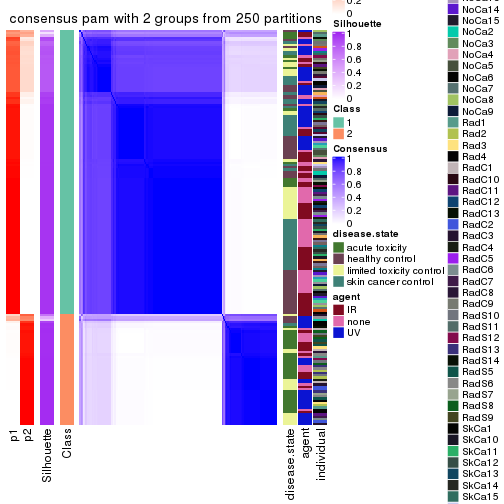</p>

</div>
<div id='tab-ATC-pam-consensus-heatmap-2'>
<pre><code class="r">consensus_heatmap(res, k = 3)
</code></pre>

<p>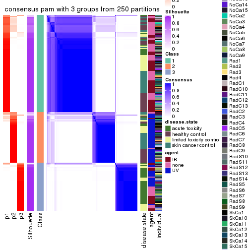</p>

</div>
<div id='tab-ATC-pam-consensus-heatmap-3'>
<pre><code class="r">consensus_heatmap(res, k = 4)
</code></pre>

<p>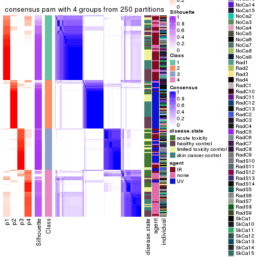</p>

</div>
<div id='tab-ATC-pam-consensus-heatmap-4'>
<pre><code class="r">consensus_heatmap(res, k = 5)
</code></pre>

<p>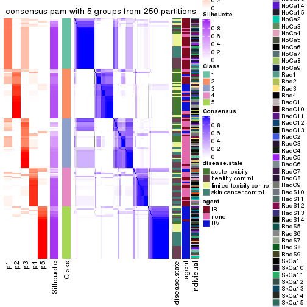</p>

</div>
<div id='tab-ATC-pam-consensus-heatmap-5'>
<pre><code class="r">consensus_heatmap(res, k = 6)
</code></pre>

<p>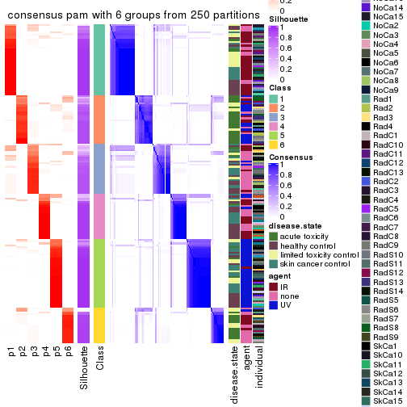</p>

</div>
</div>

Heatmaps for the membership of samples in all partitions to see how consistent they are:


<script>
$( function() {
	$( '#tabs-ATC-pam-membership-heatmap' ).tabs();
} );
</script>
<div id='tabs-ATC-pam-membership-heatmap'>
<ul>
<li><a href='#tab-ATC-pam-membership-heatmap-1'>k = 2</a></li>
<li><a href='#tab-ATC-pam-membership-heatmap-2'>k = 3</a></li>
<li><a href='#tab-ATC-pam-membership-heatmap-3'>k = 4</a></li>
<li><a href='#tab-ATC-pam-membership-heatmap-4'>k = 5</a></li>
<li><a href='#tab-ATC-pam-membership-heatmap-5'>k = 6</a></li>
</ul>
<div id='tab-ATC-pam-membership-heatmap-1'>
<pre><code class="r">membership_heatmap(res, k = 2)
</code></pre>

<p>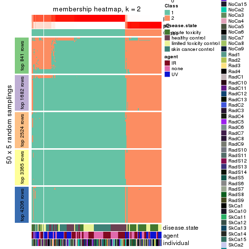</p>

</div>
<div id='tab-ATC-pam-membership-heatmap-2'>
<pre><code class="r">membership_heatmap(res, k = 3)
</code></pre>

<p>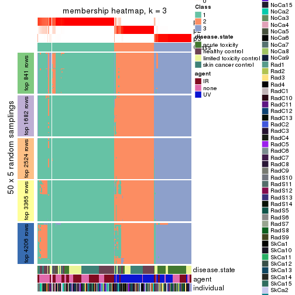</p>

</div>
<div id='tab-ATC-pam-membership-heatmap-3'>
<pre><code class="r">membership_heatmap(res, k = 4)
</code></pre>

<p>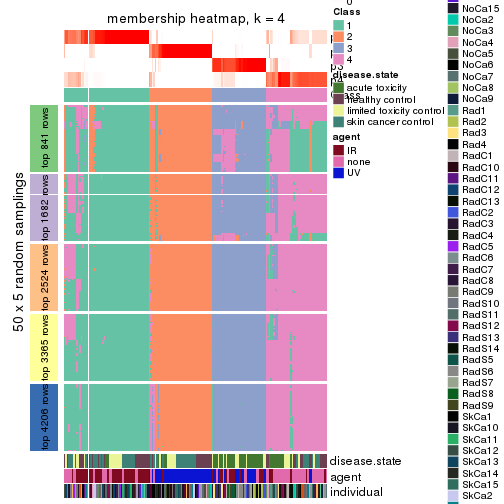</p>

</div>
<div id='tab-ATC-pam-membership-heatmap-4'>
<pre><code class="r">membership_heatmap(res, k = 5)
</code></pre>

<p>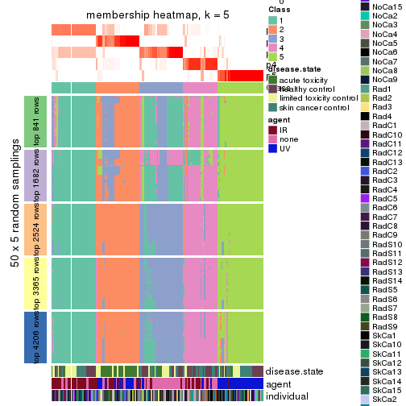</p>

</div>
<div id='tab-ATC-pam-membership-heatmap-5'>
<pre><code class="r">membership_heatmap(res, k = 6)
</code></pre>

<p>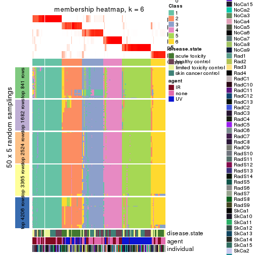</p>

</div>
</div>

As soon as we have had the classes for columns, we can look for signatures
which are significantly different between classes which can be candidate marks
for certain classes. Following are the heatmaps for signatures.


Signature heatmaps where rows are scaled:


<script>
$( function() {
	$( '#tabs-ATC-pam-get-signatures' ).tabs();
} );
</script>
<div id='tabs-ATC-pam-get-signatures'>
<ul>
<li><a href='#tab-ATC-pam-get-signatures-1'>k = 2</a></li>
<li><a href='#tab-ATC-pam-get-signatures-2'>k = 3</a></li>
<li><a href='#tab-ATC-pam-get-signatures-3'>k = 4</a></li>
<li><a href='#tab-ATC-pam-get-signatures-4'>k = 5</a></li>
<li><a href='#tab-ATC-pam-get-signatures-5'>k = 6</a></li>
</ul>
<div id='tab-ATC-pam-get-signatures-1'>
<pre><code class="r">get_signatures(res, k = 2)
</code></pre>

<p>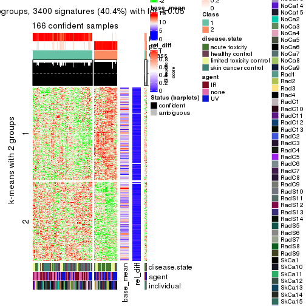</p>

</div>
<div id='tab-ATC-pam-get-signatures-2'>
<pre><code class="r">get_signatures(res, k = 3)
</code></pre>

<p>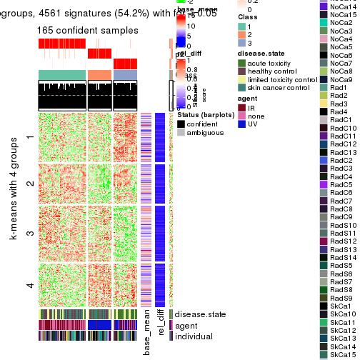</p>

</div>
<div id='tab-ATC-pam-get-signatures-3'>
<pre><code class="r">get_signatures(res, k = 4)
</code></pre>

<p>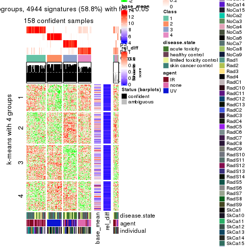</p>

</div>
<div id='tab-ATC-pam-get-signatures-4'>
<pre><code class="r">get_signatures(res, k = 5)
</code></pre>

<p>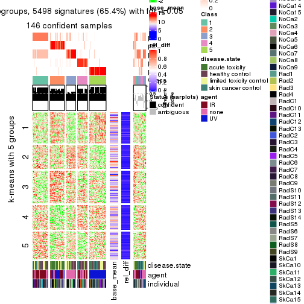</p>

</div>
<div id='tab-ATC-pam-get-signatures-5'>
<pre><code class="r">get_signatures(res, k = 6)
</code></pre>

<p>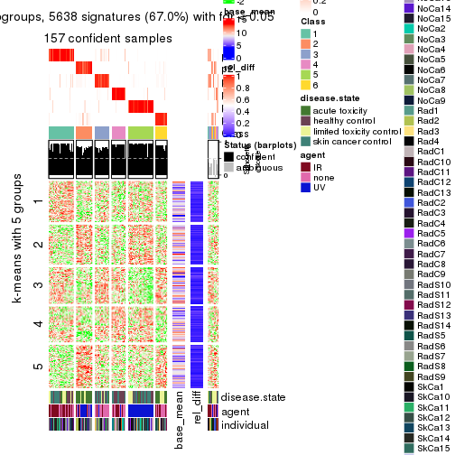</p>

</div>
</div>


Signature heatmaps where rows are not scaled:


<script>
$( function() {
	$( '#tabs-ATC-pam-get-signatures-no-scale' ).tabs();
} );
</script>
<div id='tabs-ATC-pam-get-signatures-no-scale'>
<ul>
<li><a href='#tab-ATC-pam-get-signatures-no-scale-1'>k = 2</a></li>
<li><a href='#tab-ATC-pam-get-signatures-no-scale-2'>k = 3</a></li>
<li><a href='#tab-ATC-pam-get-signatures-no-scale-3'>k = 4</a></li>
<li><a href='#tab-ATC-pam-get-signatures-no-scale-4'>k = 5</a></li>
<li><a href='#tab-ATC-pam-get-signatures-no-scale-5'>k = 6</a></li>
</ul>
<div id='tab-ATC-pam-get-signatures-no-scale-1'>
<pre><code class="r">get_signatures(res, k = 2, scale_rows = FALSE)
</code></pre>

<p>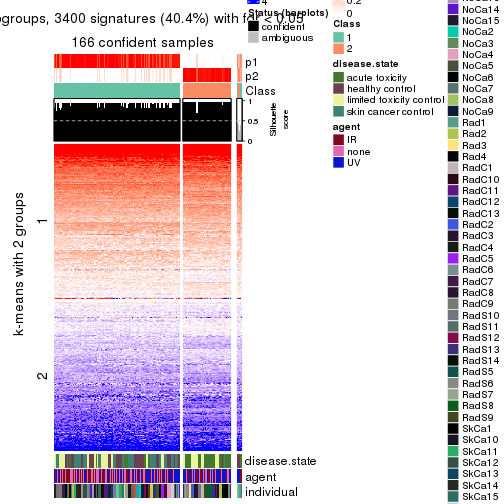</p>

</div>
<div id='tab-ATC-pam-get-signatures-no-scale-2'>
<pre><code class="r">get_signatures(res, k = 3, scale_rows = FALSE)
</code></pre>

<p>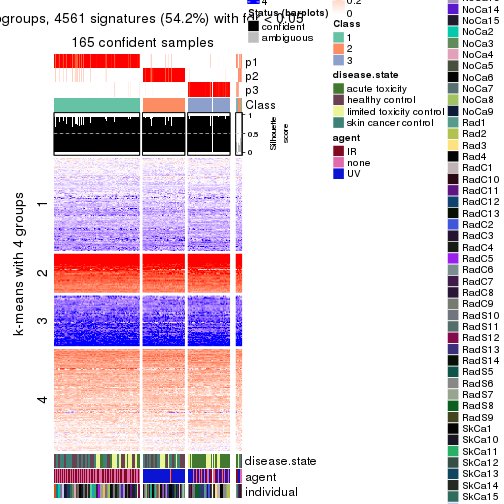</p>

</div>
<div id='tab-ATC-pam-get-signatures-no-scale-3'>
<pre><code class="r">get_signatures(res, k = 4, scale_rows = FALSE)
</code></pre>

<p>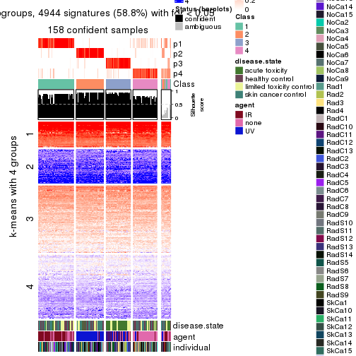</p>

</div>
<div id='tab-ATC-pam-get-signatures-no-scale-4'>
<pre><code class="r">get_signatures(res, k = 5, scale_rows = FALSE)
</code></pre>

<p>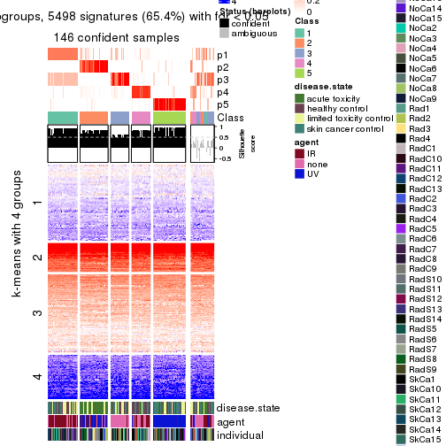</p>

</div>
<div id='tab-ATC-pam-get-signatures-no-scale-5'>
<pre><code class="r">get_signatures(res, k = 6, scale_rows = FALSE)
</code></pre>

<p>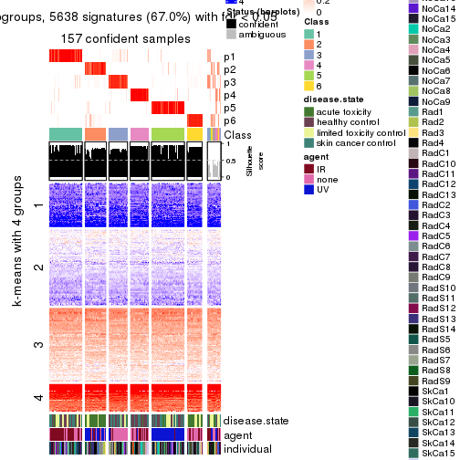</p>

</div>
</div>


Compare the overlap of signatures from different k:

```r
compare_signatures(res)
```

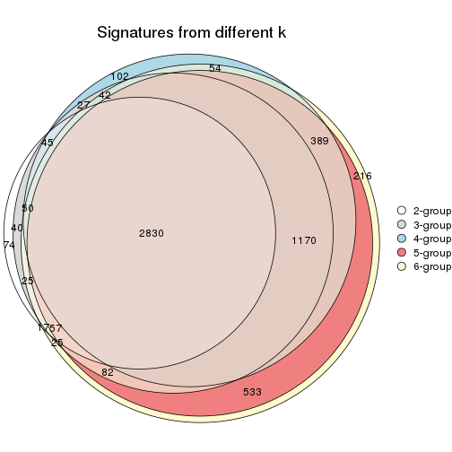

`get_signature()` returns a data frame invisibly. TO get the list of signatures, the function
call should be assigned to a variable explicitly. In following code, if `plot` argument is set
to `FALSE`, no heatmap is plotted while only the differential analysis is performed.

```r
# code only for demonstration
tb = get_signature(res, k = ..., plot = FALSE)
```

An example of the output of `tb` is:

```
#>   which_row         fdr    mean_1    mean_2 scaled_mean_1 scaled_mean_2 km
#> 1        38 0.042760348  8.373488  9.131774    -0.5533452     0.5164555  1
#> 2        40 0.018707592  7.106213  8.469186    -0.6173731     0.5762149  1
#> 3        55 0.019134737 10.221463 11.207825    -0.6159697     0.5749050  1
#> 4        59 0.006059896  5.921854  7.869574    -0.6899429     0.6439467  1
#> 5        60 0.018055526  8.928898 10.211722    -0.6204761     0.5791110  1
#> 6        98 0.009384629 15.714769 14.887706     0.6635654    -0.6193277  2
...
```

The columns in `tb` are:

1. `which_row`: row indices corresponding to the input matrix.
2. `fdr`: FDR for the differential test. 
3. `mean_x`: The mean value in group x.
4. `scaled_mean_x`: The mean value in group x after rows are scaled.
5. `km`: Row groups if k-means clustering is applied to rows.


UMAP plot which shows how samples are separated.


<script>
$( function() {
	$( '#tabs-ATC-pam-dimension-reduction' ).tabs();
} );
</script>
<div id='tabs-ATC-pam-dimension-reduction'>
<ul>
<li><a href='#tab-ATC-pam-dimension-reduction-1'>k = 2</a></li>
<li><a href='#tab-ATC-pam-dimension-reduction-2'>k = 3</a></li>
<li><a href='#tab-ATC-pam-dimension-reduction-3'>k = 4</a></li>
<li><a href='#tab-ATC-pam-dimension-reduction-4'>k = 5</a></li>
<li><a href='#tab-ATC-pam-dimension-reduction-5'>k = 6</a></li>
</ul>
<div id='tab-ATC-pam-dimension-reduction-1'>
<pre><code class="r">dimension_reduction(res, k = 2, method = &quot;UMAP&quot;)
</code></pre>

<p>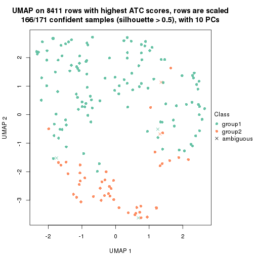</p>

</div>
<div id='tab-ATC-pam-dimension-reduction-2'>
<pre><code class="r">dimension_reduction(res, k = 3, method = &quot;UMAP&quot;)
</code></pre>

<p>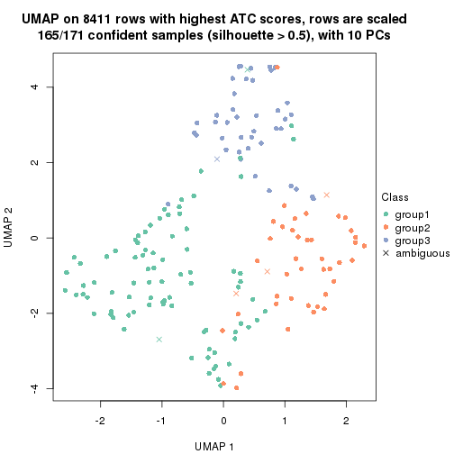</p>

</div>
<div id='tab-ATC-pam-dimension-reduction-3'>
<pre><code class="r">dimension_reduction(res, k = 4, method = &quot;UMAP&quot;)
</code></pre>

<p>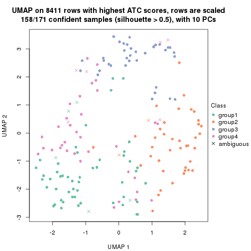</p>

</div>
<div id='tab-ATC-pam-dimension-reduction-4'>
<pre><code class="r">dimension_reduction(res, k = 5, method = &quot;UMAP&quot;)
</code></pre>

<p>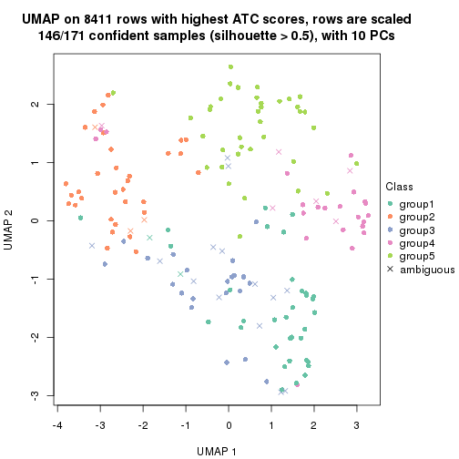</p>

</div>
<div id='tab-ATC-pam-dimension-reduction-5'>
<pre><code class="r">dimension_reduction(res, k = 6, method = &quot;UMAP&quot;)
</code></pre>

<p>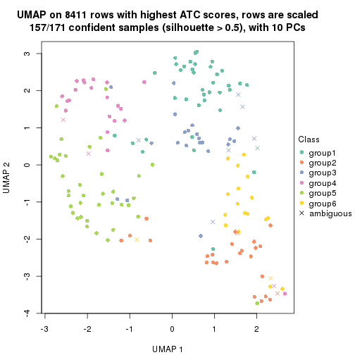</p>

</div>
</div>


Following heatmap shows how subgroups are split when increasing `k`:

```r
collect_classes(res)
```

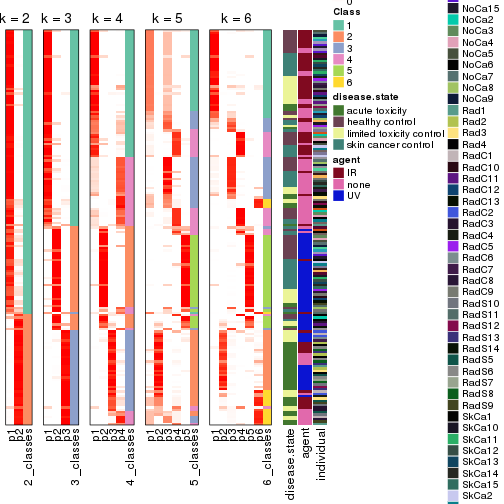


Test correlation between subgroups and known annotations. If the known
annotation is numeric, one-way ANOVA test is applied, and if the known
annotation is discrete, chi-squared contingency table test is applied.

```r
test_to_known_factors(res)
```

```
#>           n disease.state(p) agent(p) individual(p) k
#> ATC:pam 166         5.92e-16 8.18e-02      2.58e-07 2
#> ATC:pam 165         5.07e-15 2.04e-23      7.98e-03 3
#> ATC:pam 158         9.10e-12 9.76e-30      7.06e-02 4
#> ATC:pam 146         3.30e-12 2.51e-28      6.48e-03 5
#> ATC:pam 157         2.19e-15 2.38e-26      5.77e-05 6
```


If matrix rows can be associated to genes, consider to use `functional_enrichment(res,
...)` to perform function enrichment for the signature genes. See [this vignette](http://bioconductor.org/packages/devel/bioc/vignettes/cola/inst/doc/functional_enrichment.html) for more detailed explanations.


 

---------------------------------------------------


### ATC:mclust


The object with results only for a single top-value method and a single partition method 
can be extracted as:

```r
res = res_list["ATC", "mclust"]
# you can also extract it by
# res = res_list["ATC:mclust"]
```

A summary of `res` and all the functions that can be applied to it:

```r
res
```

```
#> A 'ConsensusPartition' object with k = 2, 3, 4, 5, 6.
#>   On a matrix with 8411 rows and 171 columns.
#>   Top rows (841, 1682, 2524, 3365, 4206) are extracted by 'ATC' method.
#>   Subgroups are detected by 'mclust' method.
#>   Performed in total 1250 partitions by row resampling.
#>   Best k for subgroups seems to be 2.
#> 
#> Following methods can be applied to this 'ConsensusPartition' object:
#>  [1] "cola_report"             "collect_classes"         "collect_plots"          
#>  [4] "collect_stats"           "colnames"                "compare_signatures"     
#>  [7] "consensus_heatmap"       "dimension_reduction"     "functional_enrichment"  
#> [10] "get_anno_col"            "get_anno"                "get_classes"            
#> [13] "get_consensus"           "get_matrix"              "get_membership"         
#> [16] "get_param"               "get_signatures"          "get_stats"              
#> [19] "is_best_k"               "is_stable_k"             "membership_heatmap"     
#> [22] "ncol"                    "nrow"                    "plot_ecdf"              
#> [25] "rownames"                "select_partition_number" "show"                   
#> [28] "suggest_best_k"          "test_to_known_factors"
```

`collect_plots()` function collects all the plots made from `res` for all `k` (number of partitions)
into one single page to provide an easy and fast comparison between different `k`.

```r
collect_plots(res)
```

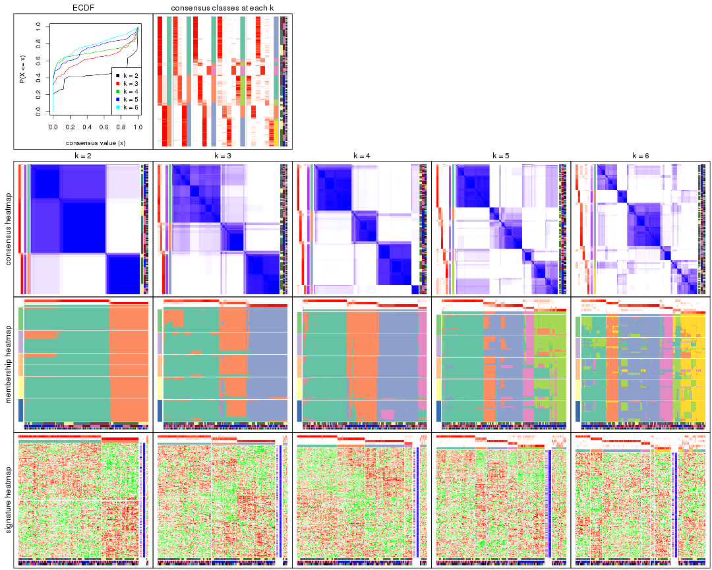

The plots are:

- The first row: a plot of the ECDF (empirical cumulative distribution
  function) curves of the consensus matrix for each `k` and the heatmap of
  predicted classes for each `k`.
- The second row: heatmaps of the consensus matrix for each `k`.
- The third row: heatmaps of the membership matrix for each `k`.
- The fouth row: heatmaps of the signatures for each `k`.

All the plots in panels can be made by individual functions and they are
plotted later in this section.

`select_partition_number()` produces several plots showing different
statistics for choosing "optimized" `k`. There are following statistics:

- ECDF curves of the consensus matrix for each `k`;
- 1-PAC. [The PAC
  score](https://en.wikipedia.org/wiki/Consensus_clustering#Over-interpretation_potential_of_consensus_clustering)
  measures the proportion of the ambiguous subgrouping.
- Mean silhouette score.
- Concordance. The mean probability of fiting the consensus class ids in all
  partitions.
- Area increased. Denote $A_k$ as the area under the ECDF curve for current
  `k`, the area increased is defined as $A_k - A_{k-1}$.
- Rand index. The percent of pairs of samples that are both in a same cluster
  or both are not in a same cluster in the partition of k and k-1.
- Jaccard index. The ratio of pairs of samples are both in a same cluster in
  the partition of k and k-1 and the pairs of samples are both in a same
  cluster in the partition k or k-1.

The detailed explanations of these statistics can be found in [the _cola_
vignette](http://bioconductor.org/packages/devel/bioc/vignettes/cola/inst/doc/cola.html#toc_13).

Generally speaking, lower PAC score, higher mean silhouette score or higher
concordance corresponds to better partition. Rand index and Jaccard index
measure how similar the current partition is compared to partition with `k-1`.
If they are too similar, we won't accept `k` is better than `k-1`.

```r
select_partition_number(res)
```

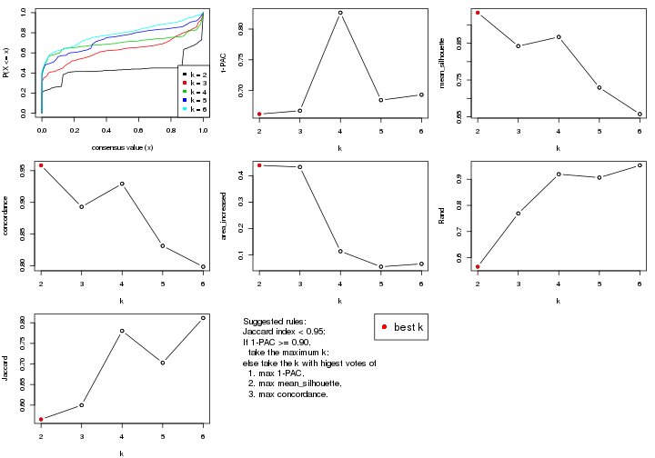

The numeric values for all these statistics can be obtained by `get_stats()`.

```r
get_stats(res)
```

```
#>   k 1-PAC mean_silhouette concordance area_increased  Rand Jaccard
#> 2 2 0.662           0.933       0.958         0.4395 0.565   0.565
#> 3 3 0.667           0.842       0.893         0.4333 0.769   0.600
#> 4 4 0.827           0.867       0.929         0.1138 0.919   0.780
#> 5 5 0.684           0.729       0.831         0.0552 0.906   0.703
#> 6 6 0.693           0.657       0.798         0.0660 0.953   0.812
```

`suggest_best_k()` suggests the best $k$ based on these statistics. The rules are as follows:

- All $k$ with Jaccard index larger than 0.95 are removed because increasing
  $k$ does not provide enough extra information. If all $k$ are removed, it is
  marked as no subgroup is detected.
- For all $k$ with 1-PAC score larger than 0.9, the maximal $k$ is taken as
  the best $k$, and other $k$ are marked as optional $k$.
- If it does not fit the second rule. The $k$ with the maximal vote of the
  highest 1-PAC score, highest mean silhouette, and highest concordance is
  taken as the best $k$.

```r
suggest_best_k(res)
```

```
#> [1] 2
```


Following shows the table of the partitions (You need to click the **show/hide
code output** link to see it). The membership matrix (columns with name `p*`)
is inferred by
[`clue::cl_consensus()`](https://www.rdocumentation.org/link/cl_consensus?package=clue)
function with the `SE` method. Basically the value in the membership matrix
represents the probability to belong to a certain group. The finall class
label for an item is determined with the group with highest probability it
belongs to.

In `get_classes()` function, the entropy is calculated from the membership
matrix and the silhouette score is calculated from the consensus matrix.


<script>
$( function() {
	$( '#tabs-ATC-mclust-get-classes' ).tabs();
} );
</script>
<div id='tabs-ATC-mclust-get-classes'>
<ul>
<li><a href='#tab-ATC-mclust-get-classes-1'>k = 2</a></li>
<li><a href='#tab-ATC-mclust-get-classes-2'>k = 3</a></li>
<li><a href='#tab-ATC-mclust-get-classes-3'>k = 4</a></li>
<li><a href='#tab-ATC-mclust-get-classes-4'>k = 5</a></li>
<li><a href='#tab-ATC-mclust-get-classes-5'>k = 6</a></li>
</ul>

<div id='tab-ATC-mclust-get-classes-1'>
<p><a id='tab-ATC-mclust-get-classes-1-a' style='color:#0366d6' href='#'>show/hide code output</a></p>
<pre><code class="r">cbind(get_classes(res, k = 2), get_membership(res, k = 2))
</code></pre>

<pre><code>#&gt;          class entropy silhouette    p1    p2
#&gt; GSM29783     1  0.0000      0.944 1.000 0.000
#&gt; GSM29786     1  0.0000      0.944 1.000 0.000
#&gt; GSM29789     1  0.0376      0.943 0.996 0.004
#&gt; GSM29792     1  0.5408      0.908 0.876 0.124
#&gt; GSM29795     1  0.5408      0.908 0.876 0.124
#&gt; GSM29798     1  0.0000      0.944 1.000 0.000
#&gt; GSM29801     1  0.0000      0.944 1.000 0.000
#&gt; GSM29804     1  0.0000      0.944 1.000 0.000
#&gt; GSM29807     1  0.0000      0.944 1.000 0.000
#&gt; GSM29816     1  0.0000      0.944 1.000 0.000
#&gt; GSM29821     1  0.0000      0.944 1.000 0.000
#&gt; GSM29824     1  0.0000      0.944 1.000 0.000
#&gt; GSM29827     1  0.0000      0.944 1.000 0.000
#&gt; GSM29830     1  0.0000      0.944 1.000 0.000
#&gt; GSM29833     1  0.0000      0.944 1.000 0.000
#&gt; GSM29784     1  0.0000      0.944 1.000 0.000
#&gt; GSM29787     1  0.0000      0.944 1.000 0.000
#&gt; GSM29790     1  0.0000      0.944 1.000 0.000
#&gt; GSM29793     1  0.0000      0.944 1.000 0.000
#&gt; GSM29796     1  0.1414      0.940 0.980 0.020
#&gt; GSM29799     1  0.0000      0.944 1.000 0.000
#&gt; GSM29802     1  0.0000      0.944 1.000 0.000
#&gt; GSM29805     1  0.0000      0.944 1.000 0.000
#&gt; GSM29814     1  0.0000      0.944 1.000 0.000
#&gt; GSM29817     1  0.0000      0.944 1.000 0.000
#&gt; GSM29822     1  0.0000      0.944 1.000 0.000
#&gt; GSM29825     1  0.0000      0.944 1.000 0.000
#&gt; GSM29828     1  0.0000      0.944 1.000 0.000
#&gt; GSM29831     1  0.0000      0.944 1.000 0.000
#&gt; GSM29834     1  0.0000      0.944 1.000 0.000
#&gt; GSM29785     1  0.5408      0.908 0.876 0.124
#&gt; GSM29788     1  0.5408      0.908 0.876 0.124
#&gt; GSM29791     1  0.5408      0.908 0.876 0.124
#&gt; GSM29794     1  0.5408      0.908 0.876 0.124
#&gt; GSM29797     1  0.5408      0.908 0.876 0.124
#&gt; GSM29800     1  0.5408      0.908 0.876 0.124
#&gt; GSM29803     1  0.5408      0.908 0.876 0.124
#&gt; GSM29806     1  0.5408      0.908 0.876 0.124
#&gt; GSM29815     1  0.5408      0.908 0.876 0.124
#&gt; GSM29819     1  0.5737      0.897 0.864 0.136
#&gt; GSM29823     1  0.5408      0.908 0.876 0.124
#&gt; GSM29826     1  0.5408      0.908 0.876 0.124
#&gt; GSM29829     1  0.5408      0.908 0.876 0.124
#&gt; GSM29832     1  0.5408      0.908 0.876 0.124
#&gt; GSM29835     1  0.5408      0.908 0.876 0.124
#&gt; GSM29836     1  0.5408      0.908 0.876 0.124
#&gt; GSM29839     1  0.3879      0.925 0.924 0.076
#&gt; GSM29842     1  0.0000      0.944 1.000 0.000
#&gt; GSM29845     1  0.0000      0.944 1.000 0.000
#&gt; GSM29848     1  0.0000      0.944 1.000 0.000
#&gt; GSM29851     1  0.0000      0.944 1.000 0.000
#&gt; GSM29854     1  0.0000      0.944 1.000 0.000
#&gt; GSM29857     1  0.0000      0.944 1.000 0.000
#&gt; GSM29860     1  0.5408      0.908 0.876 0.124
#&gt; GSM29863     1  0.0000      0.944 1.000 0.000
#&gt; GSM29866     1  0.0000      0.944 1.000 0.000
#&gt; GSM29869     1  0.0000      0.944 1.000 0.000
#&gt; GSM29872     1  0.2043      0.937 0.968 0.032
#&gt; GSM29875     1  0.0000      0.944 1.000 0.000
#&gt; GSM29878     1  0.0000      0.944 1.000 0.000
#&gt; GSM29837     1  0.5408      0.908 0.876 0.124
#&gt; GSM29840     1  0.0000      0.944 1.000 0.000
#&gt; GSM29843     1  0.0000      0.944 1.000 0.000
#&gt; GSM29846     1  0.0000      0.944 1.000 0.000
#&gt; GSM29849     1  0.0000      0.944 1.000 0.000
#&gt; GSM29852     1  0.0000      0.944 1.000 0.000
#&gt; GSM29855     1  0.0000      0.944 1.000 0.000
#&gt; GSM29858     1  0.0000      0.944 1.000 0.000
#&gt; GSM29861     1  0.3114      0.931 0.944 0.056
#&gt; GSM29864     1  0.0000      0.944 1.000 0.000
#&gt; GSM29867     1  0.0000      0.944 1.000 0.000
#&gt; GSM29870     1  0.0000      0.944 1.000 0.000
#&gt; GSM29873     1  0.1633      0.939 0.976 0.024
#&gt; GSM29876     1  0.0000      0.944 1.000 0.000
#&gt; GSM29879     1  0.0000      0.944 1.000 0.000
#&gt; GSM29838     1  0.5408      0.908 0.876 0.124
#&gt; GSM29841     1  0.5408      0.908 0.876 0.124
#&gt; GSM29844     1  0.5408      0.908 0.876 0.124
#&gt; GSM29847     1  0.5408      0.908 0.876 0.124
#&gt; GSM29850     1  0.4562      0.918 0.904 0.096
#&gt; GSM29853     1  0.5408      0.908 0.876 0.124
#&gt; GSM29856     1  0.5408      0.908 0.876 0.124
#&gt; GSM29859     1  0.5408      0.908 0.876 0.124
#&gt; GSM29862     1  0.5408      0.908 0.876 0.124
#&gt; GSM29865     1  0.5408      0.908 0.876 0.124
#&gt; GSM29868     1  0.5408      0.908 0.876 0.124
#&gt; GSM29871     1  0.5408      0.908 0.876 0.124
#&gt; GSM29874     1  0.5408      0.908 0.876 0.124
#&gt; GSM29877     1  0.2603      0.934 0.956 0.044
#&gt; GSM29880     1  0.5408      0.908 0.876 0.124
#&gt; GSM29881     2  0.0000      0.980 0.000 1.000
#&gt; GSM29884     2  0.0000      0.980 0.000 1.000
#&gt; GSM29887     2  0.0000      0.980 0.000 1.000
#&gt; GSM29890     1  0.0000      0.944 1.000 0.000
#&gt; GSM29893     1  0.0000      0.944 1.000 0.000
#&gt; GSM29896     1  0.0000      0.944 1.000 0.000
#&gt; GSM29899     1  0.0000      0.944 1.000 0.000
#&gt; GSM29902     2  0.3733      0.907 0.072 0.928
#&gt; GSM29905     2  0.1414      0.963 0.020 0.980
#&gt; GSM29908     1  0.0000      0.944 1.000 0.000
#&gt; GSM29955     2  0.9580      0.307 0.380 0.620
#&gt; GSM29958     1  0.0000      0.944 1.000 0.000
#&gt; GSM29961     1  0.0000      0.944 1.000 0.000
#&gt; GSM29882     2  0.0000      0.980 0.000 1.000
#&gt; GSM29885     2  0.0000      0.980 0.000 1.000
#&gt; GSM29888     2  0.0000      0.980 0.000 1.000
#&gt; GSM29891     1  0.2236      0.936 0.964 0.036
#&gt; GSM29894     1  0.0000      0.944 1.000 0.000
#&gt; GSM29897     1  0.0000      0.944 1.000 0.000
#&gt; GSM29900     1  0.0000      0.944 1.000 0.000
#&gt; GSM29903     2  0.0000      0.980 0.000 1.000
#&gt; GSM29906     2  0.0000      0.980 0.000 1.000
#&gt; GSM29909     2  0.3114      0.925 0.056 0.944
#&gt; GSM29956     1  0.0000      0.944 1.000 0.000
#&gt; GSM29959     1  0.0000      0.944 1.000 0.000
#&gt; GSM29962     1  0.0000      0.944 1.000 0.000
#&gt; GSM29883     2  0.0000      0.980 0.000 1.000
#&gt; GSM29886     2  0.0000      0.980 0.000 1.000
#&gt; GSM29889     2  0.2948      0.930 0.052 0.948
#&gt; GSM29892     2  0.0000      0.980 0.000 1.000
#&gt; GSM29895     1  0.5408      0.908 0.876 0.124
#&gt; GSM29898     2  0.0000      0.980 0.000 1.000
#&gt; GSM29901     2  0.0000      0.980 0.000 1.000
#&gt; GSM29904     1  0.6048      0.886 0.852 0.148
#&gt; GSM29907     1  0.9922      0.314 0.552 0.448
#&gt; GSM29910     1  0.5408      0.908 0.876 0.124
#&gt; GSM29957     2  0.0000      0.980 0.000 1.000
#&gt; GSM29960     1  0.5408      0.908 0.876 0.124
#&gt; GSM29963     1  0.6148      0.882 0.848 0.152
#&gt; GSM29964     2  0.0000      0.980 0.000 1.000
#&gt; GSM29967     2  0.0000      0.980 0.000 1.000
#&gt; GSM29970     2  0.0000      0.980 0.000 1.000
#&gt; GSM29973     2  0.0000      0.980 0.000 1.000
#&gt; GSM29976     2  0.0000      0.980 0.000 1.000
#&gt; GSM29979     2  0.0000      0.980 0.000 1.000
#&gt; GSM29982     1  0.6247      0.878 0.844 0.156
#&gt; GSM29985     2  0.0000      0.980 0.000 1.000
#&gt; GSM29988     2  0.0000      0.980 0.000 1.000
#&gt; GSM29991     2  0.0000      0.980 0.000 1.000
#&gt; GSM29994     2  0.0000      0.980 0.000 1.000
#&gt; GSM29997     1  0.0000      0.944 1.000 0.000
#&gt; GSM30000     2  0.0000      0.980 0.000 1.000
#&gt; GSM30003     1  0.0000      0.944 1.000 0.000
#&gt; GSM29965     2  0.0000      0.980 0.000 1.000
#&gt; GSM29968     2  0.0000      0.980 0.000 1.000
#&gt; GSM29971     2  0.0376      0.977 0.004 0.996
#&gt; GSM29974     2  0.0000      0.980 0.000 1.000
#&gt; GSM29977     2  0.0000      0.980 0.000 1.000
#&gt; GSM29980     2  0.0000      0.980 0.000 1.000
#&gt; GSM29983     1  0.5294      0.909 0.880 0.120
#&gt; GSM29986     2  0.0000      0.980 0.000 1.000
#&gt; GSM29989     2  0.0000      0.980 0.000 1.000
#&gt; GSM29992     2  0.0000      0.980 0.000 1.000
#&gt; GSM29995     1  0.0000      0.944 1.000 0.000
#&gt; GSM29998     2  0.0000      0.980 0.000 1.000
#&gt; GSM30001     2  0.0000      0.980 0.000 1.000
#&gt; GSM30004     2  0.9323      0.400 0.348 0.652
#&gt; GSM29966     2  0.0000      0.980 0.000 1.000
#&gt; GSM29969     2  0.0000      0.980 0.000 1.000
#&gt; GSM29972     2  0.0000      0.980 0.000 1.000
#&gt; GSM29975     2  0.0000      0.980 0.000 1.000
#&gt; GSM29978     2  0.0000      0.980 0.000 1.000
#&gt; GSM29981     2  0.0000      0.980 0.000 1.000
#&gt; GSM29984     2  0.0000      0.980 0.000 1.000
#&gt; GSM29987     2  0.0000      0.980 0.000 1.000
#&gt; GSM29990     2  0.0672      0.974 0.008 0.992
#&gt; GSM29993     2  0.0000      0.980 0.000 1.000
#&gt; GSM29996     1  0.5408      0.908 0.876 0.124
#&gt; GSM29999     2  0.0000      0.980 0.000 1.000
#&gt; GSM30002     2  0.0000      0.980 0.000 1.000
#&gt; GSM30005     1  0.6343      0.874 0.840 0.160
</code></pre>

<script>
$('#tab-ATC-mclust-get-classes-1-a').parent().next().next().hide();
$('#tab-ATC-mclust-get-classes-1-a').click(function(){
  $('#tab-ATC-mclust-get-classes-1-a').parent().next().next().toggle();
  return(false);
});
</script>
</div>

<div id='tab-ATC-mclust-get-classes-2'>
<p><a id='tab-ATC-mclust-get-classes-2-a' style='color:#0366d6' href='#'>show/hide code output</a></p>
<pre><code class="r">cbind(get_classes(res, k = 3), get_membership(res, k = 3))
</code></pre>

<pre><code>#&gt;          class entropy silhouette    p1    p2    p3
#&gt; GSM29783     1  0.3941     0.8101 0.844 0.156 0.000
#&gt; GSM29786     1  0.4346     0.7792 0.816 0.184 0.000
#&gt; GSM29789     1  0.4504     0.7730 0.804 0.196 0.000
#&gt; GSM29792     2  0.4346     0.8684 0.184 0.816 0.000
#&gt; GSM29795     1  0.6026     0.4449 0.624 0.376 0.000
#&gt; GSM29798     1  0.3686     0.8223 0.860 0.140 0.000
#&gt; GSM29801     1  0.2796     0.8173 0.908 0.092 0.000
#&gt; GSM29804     1  0.1529     0.8688 0.960 0.040 0.000
#&gt; GSM29807     1  0.2625     0.8602 0.916 0.084 0.000
#&gt; GSM29816     1  0.2774     0.8556 0.920 0.072 0.008
#&gt; GSM29821     1  0.1163     0.8699 0.972 0.028 0.000
#&gt; GSM29824     1  0.1529     0.8688 0.960 0.040 0.000
#&gt; GSM29827     1  0.2165     0.8366 0.936 0.064 0.000
#&gt; GSM29830     1  0.2796     0.8173 0.908 0.092 0.000
#&gt; GSM29833     1  0.0237     0.8680 0.996 0.004 0.000
#&gt; GSM29784     1  0.4002     0.8067 0.840 0.160 0.000
#&gt; GSM29787     1  0.4399     0.7787 0.812 0.188 0.000
#&gt; GSM29790     1  0.4399     0.7787 0.812 0.188 0.000
#&gt; GSM29793     1  0.4399     0.7787 0.812 0.188 0.000
#&gt; GSM29796     1  0.4504     0.7730 0.804 0.196 0.000
#&gt; GSM29799     1  0.3619     0.8251 0.864 0.136 0.000
#&gt; GSM29802     1  0.1529     0.8694 0.960 0.040 0.000
#&gt; GSM29805     1  0.1753     0.8680 0.952 0.048 0.000
#&gt; GSM29814     1  0.2590     0.8582 0.924 0.072 0.004
#&gt; GSM29817     1  0.0237     0.8680 0.996 0.004 0.000
#&gt; GSM29822     1  0.0237     0.8680 0.996 0.004 0.000
#&gt; GSM29825     1  0.0747     0.8701 0.984 0.016 0.000
#&gt; GSM29828     1  0.3816     0.8219 0.852 0.148 0.000
#&gt; GSM29831     1  0.2796     0.8173 0.908 0.092 0.000
#&gt; GSM29834     1  0.2448     0.8289 0.924 0.076 0.000
#&gt; GSM29785     2  0.3551     0.9092 0.132 0.868 0.000
#&gt; GSM29788     2  0.3551     0.9092 0.132 0.868 0.000
#&gt; GSM29791     2  0.3551     0.9092 0.132 0.868 0.000
#&gt; GSM29794     2  0.3551     0.9092 0.132 0.868 0.000
#&gt; GSM29797     2  0.3551     0.9092 0.132 0.868 0.000
#&gt; GSM29800     2  0.6688     0.6826 0.308 0.664 0.028
#&gt; GSM29803     2  0.4291     0.8730 0.180 0.820 0.000
#&gt; GSM29806     2  0.6728     0.7908 0.124 0.748 0.128
#&gt; GSM29815     2  0.5582     0.8311 0.100 0.812 0.088
#&gt; GSM29819     2  0.8198     0.5561 0.100 0.596 0.304
#&gt; GSM29823     2  0.3551     0.9092 0.132 0.868 0.000
#&gt; GSM29826     2  0.6062     0.5159 0.384 0.616 0.000
#&gt; GSM29829     2  0.3551     0.9092 0.132 0.868 0.000
#&gt; GSM29832     2  0.3551     0.9092 0.132 0.868 0.000
#&gt; GSM29835     2  0.3551     0.9092 0.132 0.868 0.000
#&gt; GSM29836     2  0.3551     0.9092 0.132 0.868 0.000
#&gt; GSM29839     1  0.4555     0.7703 0.800 0.200 0.000
#&gt; GSM29842     1  0.3879     0.8133 0.848 0.152 0.000
#&gt; GSM29845     1  0.3340     0.8331 0.880 0.120 0.000
#&gt; GSM29848     1  0.3192     0.8396 0.888 0.112 0.000
#&gt; GSM29851     1  0.2796     0.8173 0.908 0.092 0.000
#&gt; GSM29854     1  0.2356     0.8602 0.928 0.072 0.000
#&gt; GSM29857     1  0.2590     0.8582 0.924 0.072 0.004
#&gt; GSM29860     2  0.4555     0.8512 0.200 0.800 0.000
#&gt; GSM29863     1  0.1529     0.8688 0.960 0.040 0.000
#&gt; GSM29866     1  0.2448     0.8288 0.924 0.076 0.000
#&gt; GSM29869     1  0.0000     0.8670 1.000 0.000 0.000
#&gt; GSM29872     1  0.4842     0.7506 0.776 0.224 0.000
#&gt; GSM29875     1  0.2796     0.8173 0.908 0.092 0.000
#&gt; GSM29878     1  0.1860     0.8651 0.948 0.052 0.000
#&gt; GSM29837     2  0.4121     0.8837 0.168 0.832 0.000
#&gt; GSM29840     1  0.4346     0.7792 0.816 0.184 0.000
#&gt; GSM29843     1  0.3941     0.8101 0.844 0.156 0.000
#&gt; GSM29846     1  0.3686     0.8223 0.860 0.140 0.000
#&gt; GSM29849     1  0.3116     0.8418 0.892 0.108 0.000
#&gt; GSM29852     1  0.0000     0.8670 1.000 0.000 0.000
#&gt; GSM29855     1  0.2356     0.8602 0.928 0.072 0.000
#&gt; GSM29858     1  0.2590     0.8582 0.924 0.072 0.004
#&gt; GSM29861     1  0.4796     0.7543 0.780 0.220 0.000
#&gt; GSM29864     1  0.1163     0.8709 0.972 0.028 0.000
#&gt; GSM29867     1  0.0424     0.8691 0.992 0.008 0.000
#&gt; GSM29870     1  0.1411     0.8701 0.964 0.036 0.000
#&gt; GSM29873     1  0.4842     0.7506 0.776 0.224 0.000
#&gt; GSM29876     1  0.0892     0.8705 0.980 0.020 0.000
#&gt; GSM29879     1  0.1529     0.8694 0.960 0.040 0.000
#&gt; GSM29838     2  0.3784     0.9059 0.132 0.864 0.004
#&gt; GSM29841     2  0.3551     0.9092 0.132 0.868 0.000
#&gt; GSM29844     2  0.3551     0.9092 0.132 0.868 0.000
#&gt; GSM29847     2  0.5621     0.6946 0.308 0.692 0.000
#&gt; GSM29850     1  0.5138     0.6953 0.748 0.252 0.000
#&gt; GSM29853     2  0.5621     0.6941 0.308 0.692 0.000
#&gt; GSM29856     2  0.3267     0.8955 0.116 0.884 0.000
#&gt; GSM29859     2  0.6935     0.7520 0.096 0.728 0.176
#&gt; GSM29862     2  0.3551     0.9092 0.132 0.868 0.000
#&gt; GSM29865     2  0.3551     0.9092 0.132 0.868 0.000
#&gt; GSM29868     2  0.3551     0.9092 0.132 0.868 0.000
#&gt; GSM29871     1  0.6168     0.2880 0.588 0.412 0.000
#&gt; GSM29874     2  0.3551     0.9092 0.132 0.868 0.000
#&gt; GSM29877     1  0.4796     0.7560 0.780 0.220 0.000
#&gt; GSM29880     2  0.3551     0.9092 0.132 0.868 0.000
#&gt; GSM29881     3  0.1163     0.9429 0.000 0.028 0.972
#&gt; GSM29884     3  0.0424     0.9424 0.000 0.008 0.992
#&gt; GSM29887     3  0.0424     0.9424 0.000 0.008 0.992
#&gt; GSM29890     1  0.1529     0.8688 0.960 0.040 0.000
#&gt; GSM29893     1  0.2796     0.8173 0.908 0.092 0.000
#&gt; GSM29896     1  0.1529     0.8688 0.960 0.040 0.000
#&gt; GSM29899     1  0.1529     0.8688 0.960 0.040 0.000
#&gt; GSM29902     3  0.5060     0.7938 0.100 0.064 0.836
#&gt; GSM29905     3  0.2926     0.8976 0.040 0.036 0.924
#&gt; GSM29908     1  0.2796     0.8173 0.908 0.092 0.000
#&gt; GSM29955     3  0.4165     0.8364 0.076 0.048 0.876
#&gt; GSM29958     1  0.2796     0.8173 0.908 0.092 0.000
#&gt; GSM29961     1  0.2796     0.8173 0.908 0.092 0.000
#&gt; GSM29882     3  0.1289     0.9413 0.000 0.032 0.968
#&gt; GSM29885     3  0.0424     0.9424 0.000 0.008 0.992
#&gt; GSM29888     3  0.0424     0.9424 0.000 0.008 0.992
#&gt; GSM29891     1  0.2774     0.8556 0.920 0.072 0.008
#&gt; GSM29894     1  0.2796     0.8173 0.908 0.092 0.000
#&gt; GSM29897     1  0.2796     0.8173 0.908 0.092 0.000
#&gt; GSM29900     1  0.2774     0.8556 0.920 0.072 0.008
#&gt; GSM29903     3  0.1163     0.9429 0.000 0.028 0.972
#&gt; GSM29906     3  0.1289     0.9413 0.000 0.032 0.968
#&gt; GSM29909     3  0.2176     0.9255 0.020 0.032 0.948
#&gt; GSM29956     1  0.4452     0.7868 0.808 0.192 0.000
#&gt; GSM29959     1  0.0747     0.8618 0.984 0.016 0.000
#&gt; GSM29962     1  0.0237     0.8680 0.996 0.004 0.000
#&gt; GSM29883     3  0.0592     0.9439 0.000 0.012 0.988
#&gt; GSM29886     3  0.0424     0.9424 0.000 0.008 0.992
#&gt; GSM29889     3  0.0424     0.9424 0.000 0.008 0.992
#&gt; GSM29892     3  0.1163     0.9429 0.000 0.028 0.972
#&gt; GSM29895     2  0.3551     0.9092 0.132 0.868 0.000
#&gt; GSM29898     3  0.1163     0.9429 0.000 0.028 0.972
#&gt; GSM29901     3  0.1289     0.9413 0.000 0.032 0.968
#&gt; GSM29904     2  0.8395     0.4374 0.096 0.548 0.356
#&gt; GSM29907     3  0.7458     0.4912 0.084 0.244 0.672
#&gt; GSM29910     2  0.3551     0.9092 0.132 0.868 0.000
#&gt; GSM29957     3  0.0000     0.9436 0.000 0.000 1.000
#&gt; GSM29960     2  0.3551     0.9092 0.132 0.868 0.000
#&gt; GSM29963     2  0.8268     0.5012 0.096 0.576 0.328
#&gt; GSM29964     3  0.0424     0.9424 0.000 0.008 0.992
#&gt; GSM29967     3  0.0424     0.9424 0.000 0.008 0.992
#&gt; GSM29970     3  0.1163     0.9429 0.000 0.028 0.972
#&gt; GSM29973     3  0.0424     0.9424 0.000 0.008 0.992
#&gt; GSM29976     3  0.1163     0.9429 0.000 0.028 0.972
#&gt; GSM29979     3  0.1163     0.9429 0.000 0.028 0.972
#&gt; GSM29982     3  0.8570    -0.0698 0.096 0.428 0.476
#&gt; GSM29985     3  0.1163     0.9429 0.000 0.028 0.972
#&gt; GSM29988     3  0.1163     0.9429 0.000 0.028 0.972
#&gt; GSM29991     3  0.0424     0.9424 0.000 0.008 0.992
#&gt; GSM29994     3  0.1289     0.9413 0.000 0.032 0.968
#&gt; GSM29997     1  0.1529     0.8688 0.960 0.040 0.000
#&gt; GSM30000     3  0.1163     0.9429 0.000 0.028 0.972
#&gt; GSM30003     1  0.2590     0.8582 0.924 0.072 0.004
#&gt; GSM29965     3  0.0424     0.9424 0.000 0.008 0.992
#&gt; GSM29968     3  0.0424     0.9424 0.000 0.008 0.992
#&gt; GSM29971     3  0.1711     0.9356 0.008 0.032 0.960
#&gt; GSM29974     3  0.0424     0.9424 0.000 0.008 0.992
#&gt; GSM29977     3  0.1163     0.9429 0.000 0.028 0.972
#&gt; GSM29980     3  0.0000     0.9436 0.000 0.000 1.000
#&gt; GSM29983     1  0.4887     0.7452 0.772 0.228 0.000
#&gt; GSM29986     3  0.0424     0.9439 0.000 0.008 0.992
#&gt; GSM29989     3  0.1163     0.9429 0.000 0.028 0.972
#&gt; GSM29992     3  0.0424     0.9424 0.000 0.008 0.992
#&gt; GSM29995     1  0.2796     0.8173 0.908 0.092 0.000
#&gt; GSM29998     3  0.1289     0.9413 0.000 0.032 0.968
#&gt; GSM30001     3  0.0000     0.9436 0.000 0.000 1.000
#&gt; GSM30004     3  0.7699     0.2606 0.388 0.052 0.560
#&gt; GSM29966     3  0.0424     0.9424 0.000 0.008 0.992
#&gt; GSM29969     3  0.0424     0.9424 0.000 0.008 0.992
#&gt; GSM29972     3  0.1163     0.9429 0.000 0.028 0.972
#&gt; GSM29975     3  0.0424     0.9424 0.000 0.008 0.992
#&gt; GSM29978     3  0.1163     0.9429 0.000 0.028 0.972
#&gt; GSM29981     3  0.0000     0.9436 0.000 0.000 1.000
#&gt; GSM29984     3  0.0000     0.9436 0.000 0.000 1.000
#&gt; GSM29987     3  0.0000     0.9436 0.000 0.000 1.000
#&gt; GSM29990     3  0.1289     0.9413 0.000 0.032 0.968
#&gt; GSM29993     3  0.0424     0.9424 0.000 0.008 0.992
#&gt; GSM29996     2  0.3551     0.9092 0.132 0.868 0.000
#&gt; GSM29999     3  0.1163     0.9429 0.000 0.028 0.972
#&gt; GSM30002     3  0.0000     0.9436 0.000 0.000 1.000
#&gt; GSM30005     3  0.8561    -0.0870 0.096 0.420 0.484
</code></pre>

<script>
$('#tab-ATC-mclust-get-classes-2-a').parent().next().next().hide();
$('#tab-ATC-mclust-get-classes-2-a').click(function(){
  $('#tab-ATC-mclust-get-classes-2-a').parent().next().next().toggle();
  return(false);
});
</script>
</div>

<div id='tab-ATC-mclust-get-classes-3'>
<p><a id='tab-ATC-mclust-get-classes-3-a' style='color:#0366d6' href='#'>show/hide code output</a></p>
<pre><code class="r">cbind(get_classes(res, k = 4), get_membership(res, k = 4))
</code></pre>

<pre><code>#&gt;          class entropy silhouette    p1    p2    p3    p4
#&gt; GSM29783     4  0.3497     0.9567 0.124 0.024 0.000 0.852
#&gt; GSM29786     4  0.3598     0.9530 0.124 0.028 0.000 0.848
#&gt; GSM29789     1  0.4608     0.4912 0.692 0.304 0.000 0.004
#&gt; GSM29792     2  0.0707     0.8848 0.020 0.980 0.000 0.000
#&gt; GSM29795     2  0.1940     0.8413 0.076 0.924 0.000 0.000
#&gt; GSM29798     4  0.3497     0.9567 0.124 0.024 0.000 0.852
#&gt; GSM29801     1  0.0921     0.9321 0.972 0.000 0.000 0.028
#&gt; GSM29804     1  0.0336     0.9425 0.992 0.000 0.008 0.000
#&gt; GSM29807     1  0.0000     0.9442 1.000 0.000 0.000 0.000
#&gt; GSM29816     1  0.0336     0.9425 0.992 0.000 0.008 0.000
#&gt; GSM29821     1  0.0000     0.9442 1.000 0.000 0.000 0.000
#&gt; GSM29824     1  0.0000     0.9442 1.000 0.000 0.000 0.000
#&gt; GSM29827     1  0.0336     0.9434 0.992 0.000 0.000 0.008
#&gt; GSM29830     1  0.1118     0.9262 0.964 0.000 0.000 0.036
#&gt; GSM29833     1  0.0188     0.9427 0.996 0.004 0.000 0.000
#&gt; GSM29784     4  0.3497     0.9567 0.124 0.024 0.000 0.852
#&gt; GSM29787     4  0.3542     0.9543 0.120 0.028 0.000 0.852
#&gt; GSM29790     4  0.3542     0.9543 0.120 0.028 0.000 0.852
#&gt; GSM29793     4  0.3542     0.9543 0.120 0.028 0.000 0.852
#&gt; GSM29796     1  0.5716     0.1929 0.552 0.420 0.000 0.028
#&gt; GSM29799     4  0.3625     0.9520 0.120 0.024 0.004 0.852
#&gt; GSM29802     1  0.0000     0.9442 1.000 0.000 0.000 0.000
#&gt; GSM29805     1  0.0336     0.9425 0.992 0.000 0.008 0.000
#&gt; GSM29814     1  0.0469     0.9403 0.988 0.000 0.012 0.000
#&gt; GSM29817     1  0.0000     0.9442 1.000 0.000 0.000 0.000
#&gt; GSM29822     1  0.5062     0.4470 0.692 0.024 0.000 0.284
#&gt; GSM29825     1  0.0000     0.9442 1.000 0.000 0.000 0.000
#&gt; GSM29828     1  0.0188     0.9432 0.996 0.004 0.000 0.000
#&gt; GSM29831     1  0.1118     0.9262 0.964 0.000 0.000 0.036
#&gt; GSM29834     1  0.0336     0.9432 0.992 0.000 0.000 0.008
#&gt; GSM29785     2  0.0336     0.8865 0.008 0.992 0.000 0.000
#&gt; GSM29788     2  0.0336     0.8865 0.008 0.992 0.000 0.000
#&gt; GSM29791     2  0.0336     0.8865 0.008 0.992 0.000 0.000
#&gt; GSM29794     2  0.0336     0.8865 0.008 0.992 0.000 0.000
#&gt; GSM29797     2  0.0336     0.8865 0.008 0.992 0.000 0.000
#&gt; GSM29800     2  0.2775     0.8499 0.032 0.912 0.044 0.012
#&gt; GSM29803     2  0.0592     0.8864 0.016 0.984 0.000 0.000
#&gt; GSM29806     2  0.3818     0.7971 0.048 0.844 0.108 0.000
#&gt; GSM29815     2  0.2871     0.8371 0.032 0.896 0.072 0.000
#&gt; GSM29819     2  0.5695     0.5052 0.040 0.624 0.336 0.000
#&gt; GSM29823     2  0.0817     0.8870 0.024 0.976 0.000 0.000
#&gt; GSM29826     2  0.4304     0.5847 0.284 0.716 0.000 0.000
#&gt; GSM29829     2  0.1022     0.8854 0.032 0.968 0.000 0.000
#&gt; GSM29832     2  0.1022     0.8854 0.032 0.968 0.000 0.000
#&gt; GSM29835     2  0.0336     0.8865 0.008 0.992 0.000 0.000
#&gt; GSM29836     2  0.0336     0.8865 0.008 0.992 0.000 0.000
#&gt; GSM29839     2  0.4985     0.1336 0.468 0.532 0.000 0.000
#&gt; GSM29842     4  0.3497     0.9567 0.124 0.024 0.000 0.852
#&gt; GSM29845     1  0.5420     0.2523 0.624 0.024 0.000 0.352
#&gt; GSM29848     1  0.2443     0.8634 0.916 0.024 0.000 0.060
#&gt; GSM29851     1  0.0921     0.9321 0.972 0.000 0.000 0.028
#&gt; GSM29854     1  0.0336     0.9425 0.992 0.000 0.008 0.000
#&gt; GSM29857     1  0.0336     0.9425 0.992 0.000 0.008 0.000
#&gt; GSM29860     2  0.1302     0.8801 0.044 0.956 0.000 0.000
#&gt; GSM29863     1  0.0188     0.9432 0.996 0.004 0.000 0.000
#&gt; GSM29866     1  0.0592     0.9394 0.984 0.000 0.000 0.016
#&gt; GSM29869     1  0.0000     0.9442 1.000 0.000 0.000 0.000
#&gt; GSM29872     1  0.0188     0.9432 0.996 0.004 0.000 0.000
#&gt; GSM29875     1  0.0336     0.9434 0.992 0.000 0.000 0.008
#&gt; GSM29878     1  0.0188     0.9427 0.996 0.004 0.000 0.000
#&gt; GSM29837     2  0.0817     0.8831 0.024 0.976 0.000 0.000
#&gt; GSM29840     1  0.3813     0.7432 0.828 0.148 0.000 0.024
#&gt; GSM29843     4  0.3497     0.9567 0.124 0.024 0.000 0.852
#&gt; GSM29846     4  0.3497     0.9567 0.124 0.024 0.000 0.852
#&gt; GSM29849     4  0.5691     0.3184 0.468 0.024 0.000 0.508
#&gt; GSM29852     1  0.0000     0.9442 1.000 0.000 0.000 0.000
#&gt; GSM29855     1  0.0336     0.9425 0.992 0.000 0.008 0.000
#&gt; GSM29858     1  0.0336     0.9425 0.992 0.000 0.008 0.000
#&gt; GSM29861     1  0.3907     0.6279 0.768 0.232 0.000 0.000
#&gt; GSM29864     1  0.0000     0.9442 1.000 0.000 0.000 0.000
#&gt; GSM29867     1  0.0000     0.9442 1.000 0.000 0.000 0.000
#&gt; GSM29870     1  0.0000     0.9442 1.000 0.000 0.000 0.000
#&gt; GSM29873     1  0.0188     0.9432 0.996 0.004 0.000 0.000
#&gt; GSM29876     1  0.0000     0.9442 1.000 0.000 0.000 0.000
#&gt; GSM29879     1  0.0188     0.9439 0.996 0.000 0.004 0.000
#&gt; GSM29838     2  0.0524     0.8859 0.008 0.988 0.000 0.004
#&gt; GSM29841     2  0.0336     0.8865 0.008 0.992 0.000 0.000
#&gt; GSM29844     2  0.0336     0.8865 0.008 0.992 0.000 0.000
#&gt; GSM29847     2  0.1118     0.8774 0.036 0.964 0.000 0.000
#&gt; GSM29850     2  0.3907     0.6348 0.232 0.768 0.000 0.000
#&gt; GSM29853     2  0.2868     0.7903 0.136 0.864 0.000 0.000
#&gt; GSM29856     2  0.0817     0.8827 0.024 0.976 0.000 0.000
#&gt; GSM29859     2  0.4057     0.7568 0.032 0.816 0.152 0.000
#&gt; GSM29862     2  0.0336     0.8865 0.008 0.992 0.000 0.000
#&gt; GSM29865     2  0.1118     0.8846 0.036 0.964 0.000 0.000
#&gt; GSM29868     2  0.1022     0.8854 0.032 0.968 0.000 0.000
#&gt; GSM29871     2  0.3975     0.6527 0.240 0.760 0.000 0.000
#&gt; GSM29874     2  0.0336     0.8865 0.008 0.992 0.000 0.000
#&gt; GSM29877     1  0.0336     0.9409 0.992 0.008 0.000 0.000
#&gt; GSM29880     2  0.0336     0.8865 0.008 0.992 0.000 0.000
#&gt; GSM29881     3  0.0188     0.9334 0.000 0.000 0.996 0.004
#&gt; GSM29884     3  0.2469     0.9056 0.000 0.000 0.892 0.108
#&gt; GSM29887     3  0.2469     0.9056 0.000 0.000 0.892 0.108
#&gt; GSM29890     1  0.0336     0.9425 0.992 0.000 0.008 0.000
#&gt; GSM29893     1  0.1118     0.9262 0.964 0.000 0.000 0.036
#&gt; GSM29896     1  0.0000     0.9442 1.000 0.000 0.000 0.000
#&gt; GSM29899     1  0.0336     0.9425 0.992 0.000 0.008 0.000
#&gt; GSM29902     3  0.0779     0.9236 0.016 0.000 0.980 0.004
#&gt; GSM29905     3  0.0188     0.9334 0.000 0.004 0.996 0.000
#&gt; GSM29908     1  0.1118     0.9262 0.964 0.000 0.000 0.036
#&gt; GSM29955     3  0.1042     0.9235 0.020 0.008 0.972 0.000
#&gt; GSM29958     1  0.1022     0.9292 0.968 0.000 0.000 0.032
#&gt; GSM29961     1  0.1118     0.9262 0.964 0.000 0.000 0.036
#&gt; GSM29882     3  0.0188     0.9334 0.000 0.000 0.996 0.004
#&gt; GSM29885     3  0.2530     0.9052 0.000 0.000 0.888 0.112
#&gt; GSM29888     3  0.2530     0.9052 0.000 0.000 0.888 0.112
#&gt; GSM29891     1  0.0657     0.9380 0.984 0.000 0.012 0.004
#&gt; GSM29894     1  0.0469     0.9417 0.988 0.000 0.000 0.012
#&gt; GSM29897     1  0.1118     0.9262 0.964 0.000 0.000 0.036
#&gt; GSM29900     1  0.0657     0.9380 0.984 0.000 0.012 0.004
#&gt; GSM29903     3  0.0188     0.9334 0.000 0.000 0.996 0.004
#&gt; GSM29906     3  0.0188     0.9334 0.000 0.000 0.996 0.004
#&gt; GSM29909     3  0.0895     0.9233 0.020 0.000 0.976 0.004
#&gt; GSM29956     1  0.0188     0.9432 0.996 0.004 0.000 0.000
#&gt; GSM29959     1  0.0188     0.9441 0.996 0.000 0.000 0.004
#&gt; GSM29962     1  0.0000     0.9442 1.000 0.000 0.000 0.000
#&gt; GSM29883     3  0.0336     0.9331 0.000 0.008 0.992 0.000
#&gt; GSM29886     3  0.2469     0.9056 0.000 0.000 0.892 0.108
#&gt; GSM29889     3  0.2469     0.9056 0.000 0.000 0.892 0.108
#&gt; GSM29892     3  0.0336     0.9331 0.000 0.008 0.992 0.000
#&gt; GSM29895     2  0.0817     0.8827 0.024 0.976 0.000 0.000
#&gt; GSM29898     3  0.0336     0.9331 0.000 0.008 0.992 0.000
#&gt; GSM29901     3  0.0336     0.9331 0.000 0.008 0.992 0.000
#&gt; GSM29904     2  0.5414     0.4284 0.020 0.604 0.376 0.000
#&gt; GSM29907     3  0.4608     0.5124 0.004 0.304 0.692 0.000
#&gt; GSM29910     2  0.1022     0.8854 0.032 0.968 0.000 0.000
#&gt; GSM29957     3  0.1151     0.9309 0.000 0.008 0.968 0.024
#&gt; GSM29960     2  0.1022     0.8854 0.032 0.968 0.000 0.000
#&gt; GSM29963     2  0.5400     0.4383 0.020 0.608 0.372 0.000
#&gt; GSM29964     3  0.2530     0.9052 0.000 0.000 0.888 0.112
#&gt; GSM29967     3  0.2469     0.9056 0.000 0.000 0.892 0.108
#&gt; GSM29970     3  0.0188     0.9334 0.000 0.000 0.996 0.004
#&gt; GSM29973     3  0.2469     0.9056 0.000 0.000 0.892 0.108
#&gt; GSM29976     3  0.0188     0.9334 0.000 0.000 0.996 0.004
#&gt; GSM29979     3  0.0336     0.9331 0.000 0.008 0.992 0.000
#&gt; GSM29982     3  0.5606    -0.0544 0.020 0.480 0.500 0.000
#&gt; GSM29985     3  0.0188     0.9334 0.000 0.000 0.996 0.004
#&gt; GSM29988     3  0.0188     0.9334 0.000 0.000 0.996 0.004
#&gt; GSM29991     3  0.2216     0.9112 0.000 0.000 0.908 0.092
#&gt; GSM29994     3  0.0188     0.9334 0.000 0.000 0.996 0.004
#&gt; GSM29997     1  0.0188     0.9439 0.996 0.000 0.004 0.000
#&gt; GSM30000     3  0.0336     0.9331 0.000 0.008 0.992 0.000
#&gt; GSM30003     1  0.0336     0.9425 0.992 0.000 0.008 0.000
#&gt; GSM29965     3  0.2530     0.9052 0.000 0.000 0.888 0.112
#&gt; GSM29968     3  0.2469     0.9056 0.000 0.000 0.892 0.108
#&gt; GSM29971     3  0.0188     0.9334 0.000 0.000 0.996 0.004
#&gt; GSM29974     3  0.2469     0.9056 0.000 0.000 0.892 0.108
#&gt; GSM29977     3  0.0188     0.9334 0.000 0.000 0.996 0.004
#&gt; GSM29980     3  0.0657     0.9334 0.000 0.004 0.984 0.012
#&gt; GSM29983     1  0.2216     0.8426 0.908 0.092 0.000 0.000
#&gt; GSM29986     3  0.0188     0.9334 0.000 0.000 0.996 0.004
#&gt; GSM29989     3  0.0188     0.9334 0.000 0.000 0.996 0.004
#&gt; GSM29992     3  0.2081     0.9123 0.000 0.000 0.916 0.084
#&gt; GSM29995     1  0.1118     0.9262 0.964 0.000 0.000 0.036
#&gt; GSM29998     3  0.0188     0.9334 0.000 0.000 0.996 0.004
#&gt; GSM30001     3  0.0779     0.9336 0.000 0.004 0.980 0.016
#&gt; GSM30004     3  0.2888     0.8007 0.124 0.000 0.872 0.004
#&gt; GSM29966     3  0.2469     0.9056 0.000 0.000 0.892 0.108
#&gt; GSM29969     3  0.2469     0.9056 0.000 0.000 0.892 0.108
#&gt; GSM29972     3  0.0336     0.9331 0.000 0.008 0.992 0.000
#&gt; GSM29975     3  0.2469     0.9056 0.000 0.000 0.892 0.108
#&gt; GSM29978     3  0.0336     0.9331 0.000 0.008 0.992 0.000
#&gt; GSM29981     3  0.0524     0.9334 0.000 0.008 0.988 0.004
#&gt; GSM29984     3  0.0672     0.9333 0.000 0.008 0.984 0.008
#&gt; GSM29987     3  0.0657     0.9334 0.000 0.004 0.984 0.012
#&gt; GSM29990     3  0.0336     0.9331 0.000 0.008 0.992 0.000
#&gt; GSM29993     3  0.2469     0.9056 0.000 0.000 0.892 0.108
#&gt; GSM29996     2  0.1022     0.8854 0.032 0.968 0.000 0.000
#&gt; GSM29999     3  0.0336     0.9331 0.000 0.008 0.992 0.000
#&gt; GSM30002     3  0.0336     0.9331 0.000 0.008 0.992 0.000
#&gt; GSM30005     3  0.5607    -0.0852 0.020 0.484 0.496 0.000
</code></pre>

<script>
$('#tab-ATC-mclust-get-classes-3-a').parent().next().next().hide();
$('#tab-ATC-mclust-get-classes-3-a').click(function(){
  $('#tab-ATC-mclust-get-classes-3-a').parent().next().next().toggle();
  return(false);
});
</script>
</div>

<div id='tab-ATC-mclust-get-classes-4'>
<p><a id='tab-ATC-mclust-get-classes-4-a' style='color:#0366d6' href='#'>show/hide code output</a></p>
<pre><code class="r">cbind(get_classes(res, k = 5), get_membership(res, k = 5))
</code></pre>

<pre><code>#&gt;          class entropy silhouette    p1    p2    p3    p4    p5
#&gt; GSM29783     4  0.2416    0.83894 0.100 0.000 0.000 0.888 0.012
#&gt; GSM29786     4  0.2416    0.83894 0.100 0.000 0.000 0.888 0.012
#&gt; GSM29789     5  0.6572    0.02996 0.260 0.008 0.000 0.212 0.520
#&gt; GSM29792     5  0.0451    0.62747 0.004 0.008 0.000 0.000 0.988
#&gt; GSM29795     5  0.1764    0.59828 0.064 0.008 0.000 0.000 0.928
#&gt; GSM29798     4  0.2361    0.83786 0.096 0.000 0.000 0.892 0.012
#&gt; GSM29801     1  0.0798    0.93241 0.976 0.016 0.000 0.008 0.000
#&gt; GSM29804     1  0.0162    0.93372 0.996 0.004 0.000 0.000 0.000
#&gt; GSM29807     1  0.0486    0.93387 0.988 0.004 0.000 0.004 0.004
#&gt; GSM29816     1  0.2414    0.87087 0.900 0.012 0.080 0.008 0.000
#&gt; GSM29821     1  0.0486    0.93406 0.988 0.004 0.000 0.004 0.004
#&gt; GSM29824     1  0.0162    0.93433 0.996 0.004 0.000 0.000 0.000
#&gt; GSM29827     1  0.0510    0.93407 0.984 0.016 0.000 0.000 0.000
#&gt; GSM29830     1  0.0798    0.93241 0.976 0.016 0.000 0.008 0.000
#&gt; GSM29833     1  0.0613    0.93382 0.984 0.008 0.000 0.004 0.004
#&gt; GSM29784     4  0.2361    0.83786 0.096 0.000 0.000 0.892 0.012
#&gt; GSM29787     4  0.2416    0.83894 0.100 0.000 0.000 0.888 0.012
#&gt; GSM29790     4  0.2361    0.83786 0.096 0.000 0.000 0.892 0.012
#&gt; GSM29793     4  0.2625    0.83435 0.108 0.000 0.000 0.876 0.016
#&gt; GSM29796     4  0.6582    0.33716 0.164 0.008 0.000 0.464 0.364
#&gt; GSM29799     4  0.2361    0.83786 0.096 0.000 0.000 0.892 0.012
#&gt; GSM29802     1  0.1798    0.89385 0.928 0.004 0.064 0.004 0.000
#&gt; GSM29805     1  0.1892    0.87930 0.916 0.004 0.080 0.000 0.000
#&gt; GSM29814     1  0.2630    0.86854 0.892 0.012 0.080 0.016 0.000
#&gt; GSM29817     1  0.0324    0.93366 0.992 0.004 0.000 0.004 0.000
#&gt; GSM29822     4  0.4706    0.36661 0.488 0.004 0.000 0.500 0.008
#&gt; GSM29825     1  0.0000    0.93404 1.000 0.000 0.000 0.000 0.000
#&gt; GSM29828     1  0.0613    0.93382 0.984 0.008 0.000 0.004 0.004
#&gt; GSM29831     1  0.0798    0.93241 0.976 0.016 0.000 0.008 0.000
#&gt; GSM29834     1  0.0912    0.93229 0.972 0.016 0.000 0.012 0.000
#&gt; GSM29785     5  0.0290    0.62829 0.000 0.008 0.000 0.000 0.992
#&gt; GSM29788     5  0.0451    0.62774 0.000 0.008 0.000 0.004 0.988
#&gt; GSM29791     5  0.0000    0.63116 0.000 0.000 0.000 0.000 1.000
#&gt; GSM29794     5  0.0000    0.63116 0.000 0.000 0.000 0.000 1.000
#&gt; GSM29797     5  0.0000    0.63116 0.000 0.000 0.000 0.000 1.000
#&gt; GSM29800     5  0.4902   -0.00904 0.000 0.024 0.000 0.468 0.508
#&gt; GSM29803     5  0.2011    0.65441 0.088 0.004 0.000 0.000 0.908
#&gt; GSM29806     5  0.7526    0.60805 0.308 0.132 0.000 0.096 0.464
#&gt; GSM29815     5  0.7382    0.61882 0.304 0.116 0.000 0.096 0.484
#&gt; GSM29819     5  0.8320    0.55661 0.328 0.132 0.032 0.100 0.408
#&gt; GSM29823     5  0.4270    0.65730 0.112 0.112 0.000 0.000 0.776
#&gt; GSM29826     1  0.5643    0.24643 0.628 0.112 0.000 0.004 0.256
#&gt; GSM29829     5  0.5796    0.64704 0.312 0.116 0.000 0.000 0.572
#&gt; GSM29832     5  0.5889    0.64846 0.308 0.112 0.000 0.004 0.576
#&gt; GSM29835     5  0.1894    0.63615 0.008 0.072 0.000 0.000 0.920
#&gt; GSM29836     5  0.0000    0.63116 0.000 0.000 0.000 0.000 1.000
#&gt; GSM29839     5  0.3362    0.51191 0.156 0.008 0.000 0.012 0.824
#&gt; GSM29842     4  0.2416    0.83894 0.100 0.000 0.000 0.888 0.012
#&gt; GSM29845     4  0.4557    0.55097 0.404 0.000 0.000 0.584 0.012
#&gt; GSM29848     1  0.4617   -0.21040 0.552 0.000 0.000 0.436 0.012
#&gt; GSM29851     1  0.0912    0.93229 0.972 0.016 0.000 0.012 0.000
#&gt; GSM29854     1  0.0486    0.93387 0.988 0.004 0.000 0.004 0.004
#&gt; GSM29857     1  0.2172    0.89042 0.916 0.004 0.060 0.020 0.000
#&gt; GSM29860     5  0.4218    0.63941 0.324 0.004 0.000 0.004 0.668
#&gt; GSM29863     1  0.0290    0.93433 0.992 0.008 0.000 0.000 0.000
#&gt; GSM29866     1  0.0451    0.93464 0.988 0.008 0.000 0.004 0.000
#&gt; GSM29869     1  0.0000    0.93404 1.000 0.000 0.000 0.000 0.000
#&gt; GSM29872     1  0.0992    0.92605 0.968 0.000 0.000 0.008 0.024
#&gt; GSM29875     1  0.0798    0.93241 0.976 0.016 0.000 0.008 0.000
#&gt; GSM29878     1  0.0162    0.93418 0.996 0.000 0.000 0.004 0.000
#&gt; GSM29837     5  0.4367    0.28193 0.000 0.008 0.000 0.372 0.620
#&gt; GSM29840     4  0.6859    0.44047 0.256 0.008 0.000 0.452 0.284
#&gt; GSM29843     4  0.2361    0.83786 0.096 0.000 0.000 0.892 0.012
#&gt; GSM29846     4  0.2361    0.83786 0.096 0.000 0.000 0.892 0.012
#&gt; GSM29849     4  0.4537    0.56548 0.396 0.000 0.000 0.592 0.012
#&gt; GSM29852     1  0.0162    0.93418 0.996 0.000 0.000 0.004 0.000
#&gt; GSM29855     1  0.2177    0.87580 0.908 0.004 0.080 0.008 0.000
#&gt; GSM29858     1  0.2913    0.85800 0.876 0.004 0.080 0.040 0.000
#&gt; GSM29861     1  0.4496    0.50967 0.724 0.004 0.000 0.040 0.232
#&gt; GSM29864     1  0.0566    0.93142 0.984 0.004 0.000 0.012 0.000
#&gt; GSM29867     1  0.0162    0.93372 0.996 0.004 0.000 0.000 0.000
#&gt; GSM29870     1  0.0727    0.93171 0.980 0.004 0.012 0.004 0.000
#&gt; GSM29873     1  0.1356    0.91838 0.956 0.004 0.000 0.012 0.028
#&gt; GSM29876     1  0.0451    0.93304 0.988 0.004 0.000 0.008 0.000
#&gt; GSM29879     1  0.3509    0.67994 0.792 0.008 0.000 0.196 0.004
#&gt; GSM29838     5  0.0162    0.63115 0.000 0.000 0.000 0.004 0.996
#&gt; GSM29841     5  0.0000    0.63116 0.000 0.000 0.000 0.000 1.000
#&gt; GSM29844     5  0.0290    0.62829 0.000 0.008 0.000 0.000 0.992
#&gt; GSM29847     5  0.0854    0.62504 0.004 0.008 0.000 0.012 0.976
#&gt; GSM29850     5  0.5826    0.20641 0.100 0.008 0.000 0.296 0.596
#&gt; GSM29853     5  0.5605    0.63658 0.328 0.080 0.000 0.004 0.588
#&gt; GSM29856     5  0.6235    0.64502 0.308 0.116 0.000 0.016 0.560
#&gt; GSM29859     5  0.7516    0.61267 0.304 0.132 0.000 0.096 0.468
#&gt; GSM29862     5  0.2020    0.63033 0.000 0.100 0.000 0.000 0.900
#&gt; GSM29865     5  0.5312    0.65204 0.308 0.064 0.000 0.004 0.624
#&gt; GSM29868     5  0.5929    0.64748 0.308 0.116 0.000 0.004 0.572
#&gt; GSM29871     5  0.5172    0.55802 0.380 0.008 0.000 0.032 0.580
#&gt; GSM29874     5  0.0162    0.63181 0.000 0.004 0.000 0.000 0.996
#&gt; GSM29877     1  0.0727    0.93224 0.980 0.004 0.000 0.004 0.012
#&gt; GSM29880     5  0.0290    0.62829 0.000 0.008 0.000 0.000 0.992
#&gt; GSM29881     3  0.0000    0.79594 0.000 0.000 1.000 0.000 0.000
#&gt; GSM29884     2  0.4015    0.82002 0.000 0.652 0.348 0.000 0.000
#&gt; GSM29887     2  0.4030    0.81742 0.000 0.648 0.352 0.000 0.000
#&gt; GSM29890     1  0.0854    0.93042 0.976 0.012 0.008 0.004 0.000
#&gt; GSM29893     1  0.0798    0.93241 0.976 0.016 0.000 0.008 0.000
#&gt; GSM29896     1  0.0579    0.93201 0.984 0.008 0.000 0.000 0.008
#&gt; GSM29899     1  0.0854    0.93042 0.976 0.012 0.008 0.004 0.000
#&gt; GSM29902     3  0.2172    0.71248 0.076 0.000 0.908 0.016 0.000
#&gt; GSM29905     3  0.1557    0.79271 0.008 0.000 0.940 0.052 0.000
#&gt; GSM29908     1  0.0798    0.93241 0.976 0.016 0.000 0.008 0.000
#&gt; GSM29955     3  0.5949    0.32031 0.280 0.016 0.604 0.100 0.000
#&gt; GSM29958     1  0.0798    0.93241 0.976 0.016 0.000 0.008 0.000
#&gt; GSM29961     1  0.0798    0.93241 0.976 0.016 0.000 0.008 0.000
#&gt; GSM29882     3  0.0510    0.79159 0.000 0.000 0.984 0.016 0.000
#&gt; GSM29885     2  0.3707    0.84020 0.000 0.716 0.284 0.000 0.000
#&gt; GSM29888     2  0.4030    0.81742 0.000 0.648 0.352 0.000 0.000
#&gt; GSM29891     1  0.2414    0.87087 0.900 0.012 0.080 0.008 0.000
#&gt; GSM29894     1  0.0579    0.93402 0.984 0.008 0.000 0.008 0.000
#&gt; GSM29897     1  0.0798    0.93241 0.976 0.016 0.000 0.008 0.000
#&gt; GSM29900     1  0.2414    0.87087 0.900 0.012 0.080 0.008 0.000
#&gt; GSM29903     3  0.0000    0.79594 0.000 0.000 1.000 0.000 0.000
#&gt; GSM29906     3  0.0510    0.79159 0.000 0.000 0.984 0.016 0.000
#&gt; GSM29909     3  0.4847    0.39113 0.216 0.000 0.704 0.080 0.000
#&gt; GSM29956     1  0.0162    0.93448 0.996 0.000 0.000 0.000 0.004
#&gt; GSM29959     1  0.0566    0.93434 0.984 0.012 0.000 0.004 0.000
#&gt; GSM29962     1  0.0162    0.93418 0.996 0.000 0.000 0.004 0.000
#&gt; GSM29883     3  0.1892    0.78231 0.000 0.004 0.916 0.080 0.000
#&gt; GSM29886     2  0.2732    0.83266 0.000 0.840 0.160 0.000 0.000
#&gt; GSM29889     2  0.3949    0.83729 0.000 0.696 0.300 0.000 0.004
#&gt; GSM29892     3  0.1892    0.78280 0.000 0.004 0.916 0.080 0.000
#&gt; GSM29895     5  0.6043    0.64870 0.308 0.116 0.000 0.008 0.568
#&gt; GSM29898     3  0.3590    0.72203 0.000 0.092 0.828 0.080 0.000
#&gt; GSM29901     3  0.1892    0.78280 0.000 0.004 0.916 0.080 0.000
#&gt; GSM29904     5  0.7526    0.61048 0.308 0.132 0.000 0.096 0.464
#&gt; GSM29907     5  0.9097    0.49110 0.160 0.120 0.208 0.096 0.416
#&gt; GSM29910     5  0.5929    0.64748 0.308 0.116 0.000 0.004 0.572
#&gt; GSM29957     3  0.5652    0.14626 0.000 0.404 0.516 0.080 0.000
#&gt; GSM29960     5  0.5796    0.64704 0.312 0.116 0.000 0.000 0.572
#&gt; GSM29963     5  0.7748    0.61888 0.296 0.116 0.012 0.100 0.476
#&gt; GSM29964     2  0.4074    0.80136 0.000 0.636 0.364 0.000 0.000
#&gt; GSM29967     2  0.4030    0.81742 0.000 0.648 0.352 0.000 0.000
#&gt; GSM29970     3  0.0000    0.79594 0.000 0.000 1.000 0.000 0.000
#&gt; GSM29973     2  0.2732    0.83266 0.000 0.840 0.160 0.000 0.000
#&gt; GSM29976     3  0.0162    0.79520 0.000 0.004 0.996 0.000 0.000
#&gt; GSM29979     3  0.1851    0.78288 0.000 0.000 0.912 0.088 0.000
#&gt; GSM29982     5  0.8970    0.47954 0.312 0.076 0.152 0.100 0.360
#&gt; GSM29985     3  0.0000    0.79594 0.000 0.000 1.000 0.000 0.000
#&gt; GSM29988     3  0.0000    0.79594 0.000 0.000 1.000 0.000 0.000
#&gt; GSM29991     3  0.3949    0.20543 0.000 0.332 0.668 0.000 0.000
#&gt; GSM29994     3  0.0000    0.79594 0.000 0.000 1.000 0.000 0.000
#&gt; GSM29997     1  0.0451    0.93329 0.988 0.008 0.000 0.004 0.000
#&gt; GSM30000     3  0.1892    0.78231 0.000 0.004 0.916 0.080 0.000
#&gt; GSM30003     1  0.2302    0.87261 0.904 0.008 0.080 0.008 0.000
#&gt; GSM29965     2  0.4030    0.81742 0.000 0.648 0.352 0.000 0.000
#&gt; GSM29968     2  0.4126    0.77486 0.000 0.620 0.380 0.000 0.000
#&gt; GSM29971     3  0.1300    0.77420 0.028 0.000 0.956 0.016 0.000
#&gt; GSM29974     2  0.2732    0.83266 0.000 0.840 0.160 0.000 0.000
#&gt; GSM29977     3  0.0000    0.79594 0.000 0.000 1.000 0.000 0.000
#&gt; GSM29980     3  0.2331    0.77603 0.000 0.020 0.900 0.080 0.000
#&gt; GSM29983     1  0.2747    0.83835 0.888 0.048 0.000 0.004 0.060
#&gt; GSM29986     3  0.0000    0.79594 0.000 0.000 1.000 0.000 0.000
#&gt; GSM29989     3  0.0000    0.79594 0.000 0.000 1.000 0.000 0.000
#&gt; GSM29992     3  0.1792    0.73477 0.000 0.084 0.916 0.000 0.000
#&gt; GSM29995     1  0.0798    0.93241 0.976 0.016 0.000 0.008 0.000
#&gt; GSM29998     3  0.0404    0.79287 0.000 0.000 0.988 0.012 0.000
#&gt; GSM30001     3  0.2233    0.74716 0.000 0.080 0.904 0.016 0.000
#&gt; GSM30004     3  0.5433    0.27201 0.288 0.000 0.620 0.092 0.000
#&gt; GSM29966     2  0.2773    0.83329 0.000 0.836 0.164 0.000 0.000
#&gt; GSM29969     2  0.2732    0.83266 0.000 0.840 0.160 0.000 0.000
#&gt; GSM29972     3  0.4254    0.65915 0.000 0.148 0.772 0.080 0.000
#&gt; GSM29975     2  0.2732    0.83266 0.000 0.840 0.160 0.000 0.000
#&gt; GSM29978     3  0.2511    0.77320 0.000 0.028 0.892 0.080 0.000
#&gt; GSM29981     3  0.5535    0.31420 0.000 0.352 0.568 0.080 0.000
#&gt; GSM29984     3  0.5547    0.30421 0.000 0.356 0.564 0.080 0.000
#&gt; GSM29987     3  0.5556    0.16953 0.000 0.404 0.524 0.072 0.000
#&gt; GSM29990     3  0.2249    0.77833 0.000 0.000 0.896 0.096 0.008
#&gt; GSM29993     2  0.2732    0.83266 0.000 0.840 0.160 0.000 0.000
#&gt; GSM29996     5  0.5996    0.53729 0.388 0.116 0.000 0.000 0.496
#&gt; GSM29999     3  0.1732    0.78312 0.000 0.000 0.920 0.080 0.000
#&gt; GSM30002     3  0.5511    0.33423 0.000 0.344 0.576 0.080 0.000
#&gt; GSM30005     5  0.7956    0.60438 0.304 0.128 0.016 0.100 0.452
</code></pre>

<script>
$('#tab-ATC-mclust-get-classes-4-a').parent().next().next().hide();
$('#tab-ATC-mclust-get-classes-4-a').click(function(){
  $('#tab-ATC-mclust-get-classes-4-a').parent().next().next().toggle();
  return(false);
});
</script>
</div>

<div id='tab-ATC-mclust-get-classes-5'>
<p><a id='tab-ATC-mclust-get-classes-5-a' style='color:#0366d6' href='#'>show/hide code output</a></p>
<pre><code class="r">cbind(get_classes(res, k = 6), get_membership(res, k = 6))
</code></pre>

<pre><code>#&gt;          class entropy silhouette    p1    p2    p3    p4    p5    p6
#&gt; GSM29783     4  0.1007     0.8143 0.000 0.000 0.044 0.956 0.000 0.000
#&gt; GSM29786     4  0.1007     0.8143 0.000 0.000 0.044 0.956 0.000 0.000
#&gt; GSM29789     1  0.5166     0.4371 0.652 0.004 0.072 0.248 0.024 0.000
#&gt; GSM29792     1  0.0405     0.6495 0.988 0.000 0.004 0.000 0.008 0.000
#&gt; GSM29795     1  0.1321     0.6411 0.952 0.004 0.024 0.000 0.020 0.000
#&gt; GSM29798     4  0.1007     0.8143 0.000 0.000 0.044 0.956 0.000 0.000
#&gt; GSM29801     3  0.2225     0.8473 0.000 0.008 0.892 0.008 0.092 0.000
#&gt; GSM29804     3  0.0260     0.8650 0.000 0.000 0.992 0.000 0.008 0.000
#&gt; GSM29807     3  0.0937     0.8617 0.000 0.000 0.960 0.000 0.040 0.000
#&gt; GSM29816     3  0.4209     0.6201 0.000 0.004 0.700 0.004 0.260 0.032
#&gt; GSM29821     3  0.0547     0.8623 0.000 0.000 0.980 0.020 0.000 0.000
#&gt; GSM29824     3  0.1007     0.8641 0.000 0.000 0.956 0.000 0.044 0.000
#&gt; GSM29827     3  0.2771     0.8384 0.016 0.008 0.868 0.008 0.100 0.000
#&gt; GSM29830     3  0.2325     0.8438 0.000 0.008 0.884 0.008 0.100 0.000
#&gt; GSM29833     3  0.1364     0.8459 0.004 0.004 0.944 0.048 0.000 0.000
#&gt; GSM29784     4  0.1007     0.8143 0.000 0.000 0.044 0.956 0.000 0.000
#&gt; GSM29787     4  0.1007     0.8143 0.000 0.000 0.044 0.956 0.000 0.000
#&gt; GSM29790     4  0.1007     0.8143 0.000 0.000 0.044 0.956 0.000 0.000
#&gt; GSM29793     4  0.1196     0.8084 0.008 0.000 0.040 0.952 0.000 0.000
#&gt; GSM29796     4  0.5273     0.3578 0.376 0.004 0.044 0.552 0.024 0.000
#&gt; GSM29799     4  0.1007     0.8143 0.000 0.000 0.044 0.956 0.000 0.000
#&gt; GSM29802     3  0.1440     0.8563 0.000 0.004 0.948 0.004 0.012 0.032
#&gt; GSM29805     3  0.1706     0.8534 0.000 0.004 0.936 0.004 0.024 0.032
#&gt; GSM29814     3  0.4141     0.6383 0.000 0.004 0.712 0.004 0.248 0.032
#&gt; GSM29817     3  0.0146     0.8651 0.000 0.000 0.996 0.004 0.000 0.000
#&gt; GSM29822     4  0.3797     0.4385 0.000 0.000 0.420 0.580 0.000 0.000
#&gt; GSM29825     3  0.0000     0.8651 0.000 0.000 1.000 0.000 0.000 0.000
#&gt; GSM29828     3  0.0146     0.8655 0.000 0.004 0.996 0.000 0.000 0.000
#&gt; GSM29831     3  0.2325     0.8438 0.000 0.008 0.884 0.008 0.100 0.000
#&gt; GSM29834     3  0.1410     0.8626 0.000 0.004 0.944 0.008 0.044 0.000
#&gt; GSM29785     1  0.0146     0.6495 0.996 0.000 0.000 0.004 0.000 0.000
#&gt; GSM29788     1  0.0508     0.6502 0.984 0.000 0.000 0.012 0.004 0.000
#&gt; GSM29791     1  0.1663     0.6197 0.912 0.000 0.000 0.000 0.088 0.000
#&gt; GSM29794     1  0.1663     0.6197 0.912 0.000 0.000 0.000 0.088 0.000
#&gt; GSM29797     1  0.1806     0.6179 0.908 0.000 0.000 0.004 0.088 0.000
#&gt; GSM29800     4  0.5157     0.3831 0.340 0.088 0.004 0.568 0.000 0.000
#&gt; GSM29803     1  0.3457     0.5647 0.752 0.000 0.232 0.000 0.016 0.000
#&gt; GSM29806     5  0.5738     0.3462 0.312 0.000 0.192 0.000 0.496 0.000
#&gt; GSM29815     1  0.4703    -0.0700 0.492 0.000 0.044 0.000 0.464 0.000
#&gt; GSM29819     5  0.5935     0.3320 0.300 0.000 0.212 0.000 0.484 0.004
#&gt; GSM29823     1  0.4923     0.5508 0.656 0.000 0.172 0.000 0.172 0.000
#&gt; GSM29826     3  0.4967     0.4395 0.228 0.000 0.640 0.000 0.132 0.000
#&gt; GSM29829     1  0.5649     0.4659 0.536 0.000 0.232 0.000 0.232 0.000
#&gt; GSM29832     1  0.5570     0.4842 0.552 0.000 0.232 0.000 0.216 0.000
#&gt; GSM29835     1  0.3062     0.5994 0.816 0.000 0.024 0.000 0.160 0.000
#&gt; GSM29836     1  0.0000     0.6492 1.000 0.000 0.000 0.000 0.000 0.000
#&gt; GSM29839     1  0.4093     0.5456 0.772 0.004 0.040 0.160 0.024 0.000
#&gt; GSM29842     4  0.1007     0.8143 0.000 0.000 0.044 0.956 0.000 0.000
#&gt; GSM29845     4  0.3595     0.6447 0.008 0.000 0.288 0.704 0.000 0.000
#&gt; GSM29848     4  0.4018     0.4486 0.008 0.000 0.412 0.580 0.000 0.000
#&gt; GSM29851     3  0.2174     0.8489 0.000 0.008 0.896 0.008 0.088 0.000
#&gt; GSM29854     3  0.2146     0.8114 0.000 0.004 0.880 0.000 0.116 0.000
#&gt; GSM29857     3  0.2964     0.7962 0.000 0.004 0.852 0.004 0.108 0.032
#&gt; GSM29860     1  0.4703     0.4685 0.620 0.000 0.312 0.000 0.068 0.000
#&gt; GSM29863     3  0.0547     0.8666 0.000 0.000 0.980 0.000 0.020 0.000
#&gt; GSM29866     3  0.1285     0.8623 0.000 0.004 0.944 0.000 0.052 0.000
#&gt; GSM29869     3  0.0508     0.8665 0.000 0.004 0.984 0.000 0.012 0.000
#&gt; GSM29872     3  0.1958     0.8109 0.100 0.000 0.896 0.000 0.004 0.000
#&gt; GSM29875     3  0.2009     0.8518 0.000 0.004 0.904 0.008 0.084 0.000
#&gt; GSM29878     3  0.0363     0.8642 0.000 0.000 0.988 0.012 0.000 0.000
#&gt; GSM29837     1  0.3023     0.5513 0.784 0.000 0.004 0.212 0.000 0.000
#&gt; GSM29840     4  0.5606     0.4113 0.348 0.004 0.076 0.548 0.024 0.000
#&gt; GSM29843     4  0.1007     0.8143 0.000 0.000 0.044 0.956 0.000 0.000
#&gt; GSM29846     4  0.1007     0.8143 0.000 0.000 0.044 0.956 0.000 0.000
#&gt; GSM29849     4  0.3672     0.6299 0.008 0.000 0.304 0.688 0.000 0.000
#&gt; GSM29852     3  0.0000     0.8651 0.000 0.000 1.000 0.000 0.000 0.000
#&gt; GSM29855     3  0.2563     0.8238 0.000 0.004 0.884 0.004 0.076 0.032
#&gt; GSM29858     3  0.3991     0.6686 0.000 0.004 0.736 0.004 0.224 0.032
#&gt; GSM29861     3  0.4168     0.5320 0.256 0.000 0.696 0.048 0.000 0.000
#&gt; GSM29864     3  0.0000     0.8651 0.000 0.000 1.000 0.000 0.000 0.000
#&gt; GSM29867     3  0.0000     0.8651 0.000 0.000 1.000 0.000 0.000 0.000
#&gt; GSM29870     3  0.1225     0.8580 0.000 0.004 0.956 0.004 0.004 0.032
#&gt; GSM29873     3  0.0891     0.8636 0.024 0.000 0.968 0.000 0.008 0.000
#&gt; GSM29876     3  0.0893     0.8630 0.000 0.004 0.972 0.004 0.004 0.016
#&gt; GSM29879     3  0.2780     0.8010 0.000 0.004 0.868 0.096 0.024 0.008
#&gt; GSM29838     1  0.1909     0.6226 0.920 0.024 0.000 0.004 0.052 0.000
#&gt; GSM29841     1  0.1806     0.6179 0.908 0.000 0.000 0.004 0.088 0.000
#&gt; GSM29844     1  0.0508     0.6502 0.984 0.000 0.000 0.012 0.004 0.000
#&gt; GSM29847     1  0.1010     0.6467 0.960 0.000 0.004 0.036 0.000 0.000
#&gt; GSM29850     1  0.4542     0.4794 0.692 0.004 0.028 0.252 0.024 0.000
#&gt; GSM29853     1  0.5234     0.4529 0.576 0.000 0.300 0.000 0.124 0.000
#&gt; GSM29856     1  0.5389     0.4130 0.572 0.000 0.160 0.000 0.268 0.000
#&gt; GSM29859     5  0.4078     0.5230 0.320 0.000 0.024 0.000 0.656 0.000
#&gt; GSM29862     1  0.2854     0.5939 0.792 0.000 0.000 0.000 0.208 0.000
#&gt; GSM29865     1  0.5238     0.5015 0.604 0.000 0.236 0.000 0.160 0.000
#&gt; GSM29868     1  0.5568     0.4717 0.552 0.000 0.236 0.000 0.212 0.000
#&gt; GSM29871     3  0.5248    -0.0490 0.404 0.000 0.508 0.004 0.084 0.000
#&gt; GSM29874     1  0.2003     0.6240 0.884 0.000 0.000 0.000 0.116 0.000
#&gt; GSM29877     3  0.0622     0.8653 0.008 0.000 0.980 0.000 0.012 0.000
#&gt; GSM29880     1  0.0146     0.6495 0.996 0.000 0.000 0.004 0.000 0.000
#&gt; GSM29881     6  0.0405     0.6959 0.000 0.008 0.000 0.004 0.000 0.988
#&gt; GSM29884     2  0.1556     0.9059 0.000 0.920 0.000 0.000 0.000 0.080
#&gt; GSM29887     2  0.1556     0.9059 0.000 0.920 0.000 0.000 0.000 0.080
#&gt; GSM29890     3  0.4353     0.6219 0.000 0.004 0.672 0.004 0.288 0.032
#&gt; GSM29893     3  0.2325     0.8438 0.000 0.008 0.884 0.008 0.100 0.000
#&gt; GSM29896     3  0.2100     0.8559 0.004 0.000 0.884 0.000 0.112 0.000
#&gt; GSM29899     3  0.4302     0.6191 0.000 0.004 0.672 0.004 0.292 0.028
#&gt; GSM29902     6  0.4443     0.3351 0.000 0.000 0.056 0.004 0.260 0.680
#&gt; GSM29905     6  0.5614     0.1230 0.000 0.000 0.176 0.004 0.264 0.556
#&gt; GSM29908     3  0.2325     0.8438 0.000 0.008 0.884 0.008 0.100 0.000
#&gt; GSM29955     5  0.5590     0.0802 0.016 0.056 0.020 0.000 0.552 0.356
#&gt; GSM29958     3  0.2325     0.8438 0.000 0.008 0.884 0.008 0.100 0.000
#&gt; GSM29961     3  0.2325     0.8438 0.000 0.008 0.884 0.008 0.100 0.000
#&gt; GSM29882     6  0.2902     0.5029 0.000 0.000 0.000 0.004 0.196 0.800
#&gt; GSM29885     2  0.1556     0.9059 0.000 0.920 0.000 0.000 0.000 0.080
#&gt; GSM29888     2  0.1556     0.9059 0.000 0.920 0.000 0.000 0.000 0.080
#&gt; GSM29891     3  0.4299     0.6100 0.000 0.004 0.692 0.004 0.264 0.036
#&gt; GSM29894     3  0.1806     0.8529 0.000 0.004 0.908 0.000 0.088 0.000
#&gt; GSM29897     3  0.2325     0.8438 0.000 0.008 0.884 0.008 0.100 0.000
#&gt; GSM29900     3  0.4209     0.6201 0.000 0.004 0.700 0.004 0.260 0.032
#&gt; GSM29903     6  0.0363     0.6979 0.000 0.012 0.000 0.000 0.000 0.988
#&gt; GSM29906     6  0.3337     0.4091 0.000 0.000 0.000 0.004 0.260 0.736
#&gt; GSM29909     6  0.4078     0.3582 0.000 0.000 0.024 0.008 0.268 0.700
#&gt; GSM29956     3  0.0260     0.8662 0.000 0.000 0.992 0.000 0.008 0.000
#&gt; GSM29959     3  0.0146     0.8655 0.000 0.004 0.996 0.000 0.000 0.000
#&gt; GSM29962     3  0.0146     0.8651 0.000 0.000 0.996 0.004 0.000 0.000
#&gt; GSM29883     6  0.5615     0.5842 0.000 0.100 0.000 0.032 0.276 0.592
#&gt; GSM29886     2  0.0458     0.8977 0.000 0.984 0.000 0.000 0.000 0.016
#&gt; GSM29889     2  0.2442     0.8691 0.068 0.884 0.000 0.000 0.000 0.048
#&gt; GSM29892     6  0.5273     0.5753 0.000 0.104 0.000 0.008 0.296 0.592
#&gt; GSM29895     1  0.3961     0.1143 0.556 0.000 0.004 0.000 0.440 0.000
#&gt; GSM29898     6  0.5381     0.5606 0.000 0.124 0.000 0.004 0.304 0.568
#&gt; GSM29901     6  0.4740     0.5646 0.000 0.064 0.000 0.004 0.300 0.632
#&gt; GSM29904     5  0.3972     0.5627 0.300 0.000 0.004 0.000 0.680 0.016
#&gt; GSM29907     5  0.4191     0.5740 0.284 0.000 0.000 0.000 0.676 0.040
#&gt; GSM29910     1  0.5629     0.4688 0.540 0.000 0.236 0.000 0.224 0.000
#&gt; GSM29957     2  0.6132     0.2276 0.000 0.524 0.000 0.028 0.272 0.176
#&gt; GSM29960     1  0.5649     0.4659 0.536 0.000 0.232 0.000 0.232 0.000
#&gt; GSM29963     5  0.4400     0.2865 0.428 0.004 0.004 0.000 0.552 0.012
#&gt; GSM29964     2  0.2135     0.8714 0.000 0.872 0.000 0.000 0.000 0.128
#&gt; GSM29967     2  0.1556     0.9059 0.000 0.920 0.000 0.000 0.000 0.080
#&gt; GSM29970     6  0.0405     0.6959 0.000 0.008 0.000 0.004 0.000 0.988
#&gt; GSM29973     2  0.0458     0.8977 0.000 0.984 0.000 0.000 0.000 0.016
#&gt; GSM29976     6  0.1972     0.7052 0.000 0.056 0.000 0.024 0.004 0.916
#&gt; GSM29979     5  0.4899    -0.1845 0.000 0.064 0.000 0.000 0.532 0.404
#&gt; GSM29982     5  0.5411     0.5828 0.236 0.000 0.012 0.000 0.612 0.140
#&gt; GSM29985     6  0.1296     0.7043 0.000 0.044 0.000 0.004 0.004 0.948
#&gt; GSM29988     6  0.1672     0.7061 0.000 0.048 0.000 0.016 0.004 0.932
#&gt; GSM29991     6  0.3592     0.4345 0.000 0.344 0.000 0.000 0.000 0.656
#&gt; GSM29994     6  0.0405     0.6959 0.000 0.008 0.000 0.004 0.000 0.988
#&gt; GSM29997     3  0.3584     0.6536 0.000 0.004 0.688 0.000 0.308 0.000
#&gt; GSM30000     6  0.5040     0.6453 0.000 0.104 0.000 0.032 0.172 0.692
#&gt; GSM30003     3  0.4187     0.6249 0.000 0.004 0.704 0.004 0.256 0.032
#&gt; GSM29965     2  0.1556     0.9059 0.000 0.920 0.000 0.000 0.000 0.080
#&gt; GSM29968     2  0.2260     0.8480 0.000 0.860 0.000 0.000 0.000 0.140
#&gt; GSM29971     6  0.3679     0.3933 0.000 0.000 0.012 0.004 0.260 0.724
#&gt; GSM29974     2  0.0632     0.8998 0.000 0.976 0.000 0.000 0.000 0.024
#&gt; GSM29977     6  0.1572     0.7055 0.000 0.036 0.000 0.028 0.000 0.936
#&gt; GSM29980     6  0.4426     0.6626 0.000 0.144 0.000 0.032 0.072 0.752
#&gt; GSM29983     3  0.2122     0.8408 0.024 0.000 0.900 0.000 0.076 0.000
#&gt; GSM29986     6  0.1924     0.7051 0.000 0.048 0.000 0.028 0.004 0.920
#&gt; GSM29989     6  0.0405     0.6959 0.000 0.008 0.000 0.004 0.000 0.988
#&gt; GSM29992     6  0.3027     0.6621 0.000 0.148 0.000 0.028 0.000 0.824
#&gt; GSM29995     3  0.2512     0.8439 0.000 0.008 0.868 0.008 0.116 0.000
#&gt; GSM29998     6  0.0291     0.6936 0.000 0.004 0.000 0.004 0.000 0.992
#&gt; GSM30001     6  0.3499     0.6597 0.000 0.164 0.000 0.032 0.008 0.796
#&gt; GSM30004     6  0.4796     0.2886 0.000 0.000 0.084 0.004 0.260 0.652
#&gt; GSM29966     2  0.0458     0.8977 0.000 0.984 0.000 0.000 0.000 0.016
#&gt; GSM29969     2  0.0458     0.8977 0.000 0.984 0.000 0.000 0.000 0.016
#&gt; GSM29972     6  0.5447     0.5554 0.000 0.132 0.000 0.004 0.304 0.560
#&gt; GSM29975     2  0.0458     0.8977 0.000 0.984 0.000 0.000 0.000 0.016
#&gt; GSM29978     6  0.5161     0.5713 0.000 0.100 0.000 0.004 0.304 0.592
#&gt; GSM29981     6  0.6456     0.4808 0.000 0.228 0.000 0.032 0.272 0.468
#&gt; GSM29984     6  0.6456     0.4808 0.000 0.228 0.000 0.032 0.272 0.468
#&gt; GSM29987     6  0.5759     0.3688 0.000 0.360 0.000 0.032 0.088 0.520
#&gt; GSM29990     5  0.5158     0.1515 0.084 0.004 0.000 0.000 0.556 0.356
#&gt; GSM29993     2  0.2597     0.7501 0.000 0.824 0.000 0.000 0.000 0.176
#&gt; GSM29996     1  0.5551     0.4722 0.556 0.000 0.224 0.000 0.220 0.000
#&gt; GSM29999     6  0.1562     0.7043 0.000 0.024 0.000 0.032 0.004 0.940
#&gt; GSM30002     6  0.6405     0.4958 0.000 0.216 0.000 0.032 0.272 0.480
#&gt; GSM30005     5  0.3972     0.5615 0.300 0.000 0.004 0.000 0.680 0.016
</code></pre>

<script>
$('#tab-ATC-mclust-get-classes-5-a').parent().next().next().hide();
$('#tab-ATC-mclust-get-classes-5-a').click(function(){
  $('#tab-ATC-mclust-get-classes-5-a').parent().next().next().toggle();
  return(false);
});
</script>
</div>
</div>

Heatmaps for the consensus matrix. It visualizes the probability of two
samples to be in a same group.


<script>
$( function() {
	$( '#tabs-ATC-mclust-consensus-heatmap' ).tabs();
} );
</script>
<div id='tabs-ATC-mclust-consensus-heatmap'>
<ul>
<li><a href='#tab-ATC-mclust-consensus-heatmap-1'>k = 2</a></li>
<li><a href='#tab-ATC-mclust-consensus-heatmap-2'>k = 3</a></li>
<li><a href='#tab-ATC-mclust-consensus-heatmap-3'>k = 4</a></li>
<li><a href='#tab-ATC-mclust-consensus-heatmap-4'>k = 5</a></li>
<li><a href='#tab-ATC-mclust-consensus-heatmap-5'>k = 6</a></li>
</ul>
<div id='tab-ATC-mclust-consensus-heatmap-1'>
<pre><code class="r">consensus_heatmap(res, k = 2)
</code></pre>

<p>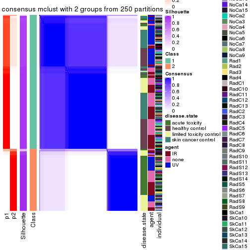</p>

</div>
<div id='tab-ATC-mclust-consensus-heatmap-2'>
<pre><code class="r">consensus_heatmap(res, k = 3)
</code></pre>

<p>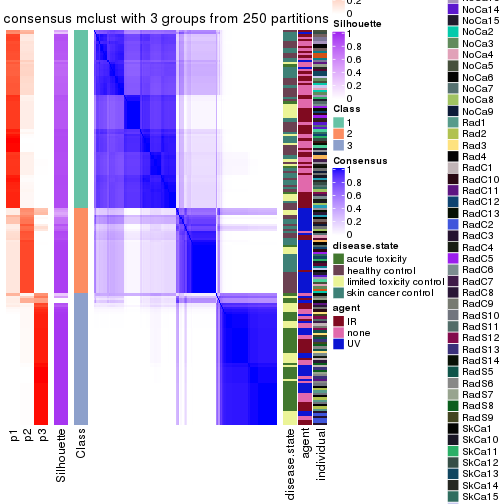</p>

</div>
<div id='tab-ATC-mclust-consensus-heatmap-3'>
<pre><code class="r">consensus_heatmap(res, k = 4)
</code></pre>

<p>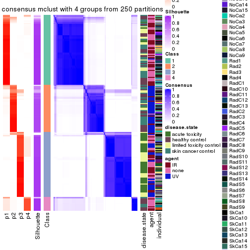</p>

</div>
<div id='tab-ATC-mclust-consensus-heatmap-4'>
<pre><code class="r">consensus_heatmap(res, k = 5)
</code></pre>

<p>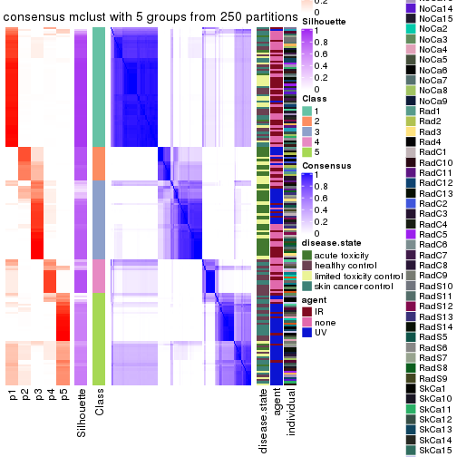</p>

</div>
<div id='tab-ATC-mclust-consensus-heatmap-5'>
<pre><code class="r">consensus_heatmap(res, k = 6)
</code></pre>

<p>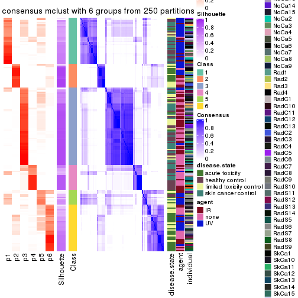</p>

</div>
</div>

Heatmaps for the membership of samples in all partitions to see how consistent they are:


<script>
$( function() {
	$( '#tabs-ATC-mclust-membership-heatmap' ).tabs();
} );
</script>
<div id='tabs-ATC-mclust-membership-heatmap'>
<ul>
<li><a href='#tab-ATC-mclust-membership-heatmap-1'>k = 2</a></li>
<li><a href='#tab-ATC-mclust-membership-heatmap-2'>k = 3</a></li>
<li><a href='#tab-ATC-mclust-membership-heatmap-3'>k = 4</a></li>
<li><a href='#tab-ATC-mclust-membership-heatmap-4'>k = 5</a></li>
<li><a href='#tab-ATC-mclust-membership-heatmap-5'>k = 6</a></li>
</ul>
<div id='tab-ATC-mclust-membership-heatmap-1'>
<pre><code class="r">membership_heatmap(res, k = 2)
</code></pre>

<p>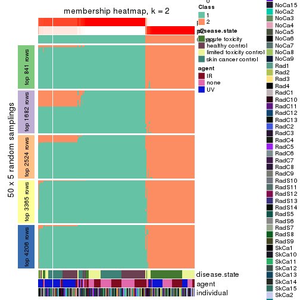</p>

</div>
<div id='tab-ATC-mclust-membership-heatmap-2'>
<pre><code class="r">membership_heatmap(res, k = 3)
</code></pre>

<p>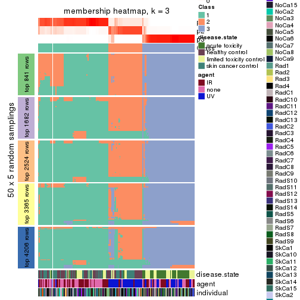</p>

</div>
<div id='tab-ATC-mclust-membership-heatmap-3'>
<pre><code class="r">membership_heatmap(res, k = 4)
</code></pre>

<p>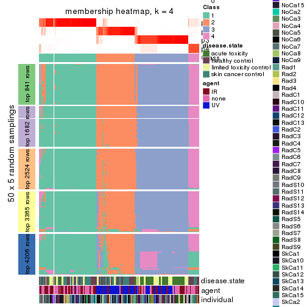</p>

</div>
<div id='tab-ATC-mclust-membership-heatmap-4'>
<pre><code class="r">membership_heatmap(res, k = 5)
</code></pre>

<p>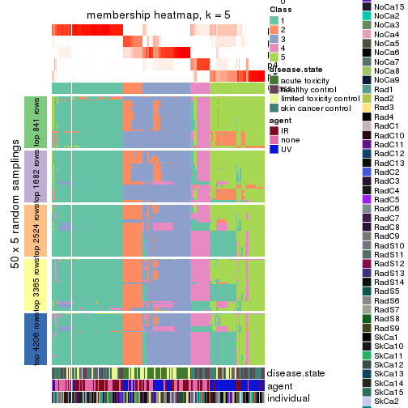</p>

</div>
<div id='tab-ATC-mclust-membership-heatmap-5'>
<pre><code class="r">membership_heatmap(res, k = 6)
</code></pre>

<p>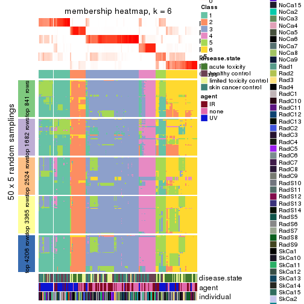</p>

</div>
</div>

As soon as we have had the classes for columns, we can look for signatures
which are significantly different between classes which can be candidate marks
for certain classes. Following are the heatmaps for signatures.


Signature heatmaps where rows are scaled:


<script>
$( function() {
	$( '#tabs-ATC-mclust-get-signatures' ).tabs();
} );
</script>
<div id='tabs-ATC-mclust-get-signatures'>
<ul>
<li><a href='#tab-ATC-mclust-get-signatures-1'>k = 2</a></li>
<li><a href='#tab-ATC-mclust-get-signatures-2'>k = 3</a></li>
<li><a href='#tab-ATC-mclust-get-signatures-3'>k = 4</a></li>
<li><a href='#tab-ATC-mclust-get-signatures-4'>k = 5</a></li>
<li><a href='#tab-ATC-mclust-get-signatures-5'>k = 6</a></li>
</ul>
<div id='tab-ATC-mclust-get-signatures-1'>
<pre><code class="r">get_signatures(res, k = 2)
</code></pre>

<p>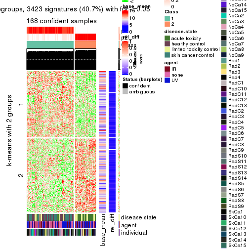</p>

</div>
<div id='tab-ATC-mclust-get-signatures-2'>
<pre><code class="r">get_signatures(res, k = 3)
</code></pre>

<p>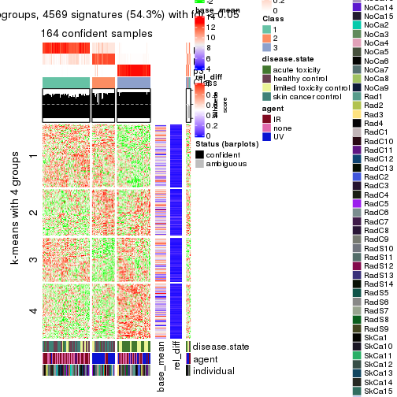</p>

</div>
<div id='tab-ATC-mclust-get-signatures-3'>
<pre><code class="r">get_signatures(res, k = 4)
</code></pre>

<p>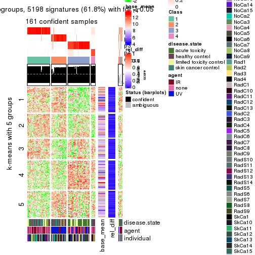</p>

</div>
<div id='tab-ATC-mclust-get-signatures-4'>
<pre><code class="r">get_signatures(res, k = 5)
</code></pre>

<p>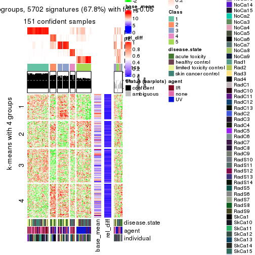</p>

</div>
<div id='tab-ATC-mclust-get-signatures-5'>
<pre><code class="r">get_signatures(res, k = 6)
</code></pre>

<p>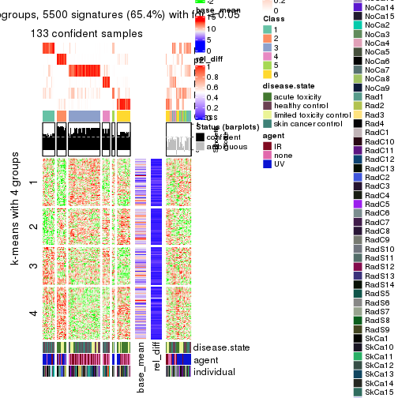</p>

</div>
</div>


Signature heatmaps where rows are not scaled:


<script>
$( function() {
	$( '#tabs-ATC-mclust-get-signatures-no-scale' ).tabs();
} );
</script>
<div id='tabs-ATC-mclust-get-signatures-no-scale'>
<ul>
<li><a href='#tab-ATC-mclust-get-signatures-no-scale-1'>k = 2</a></li>
<li><a href='#tab-ATC-mclust-get-signatures-no-scale-2'>k = 3</a></li>
<li><a href='#tab-ATC-mclust-get-signatures-no-scale-3'>k = 4</a></li>
<li><a href='#tab-ATC-mclust-get-signatures-no-scale-4'>k = 5</a></li>
<li><a href='#tab-ATC-mclust-get-signatures-no-scale-5'>k = 6</a></li>
</ul>
<div id='tab-ATC-mclust-get-signatures-no-scale-1'>
<pre><code class="r">get_signatures(res, k = 2, scale_rows = FALSE)
</code></pre>

<p>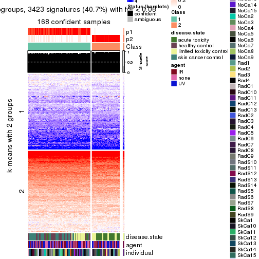</p>

</div>
<div id='tab-ATC-mclust-get-signatures-no-scale-2'>
<pre><code class="r">get_signatures(res, k = 3, scale_rows = FALSE)
</code></pre>

<p>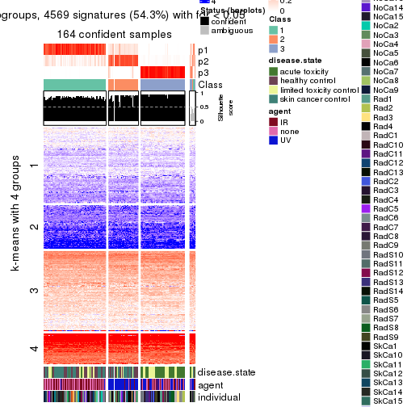</p>

</div>
<div id='tab-ATC-mclust-get-signatures-no-scale-3'>
<pre><code class="r">get_signatures(res, k = 4, scale_rows = FALSE)
</code></pre>

<p>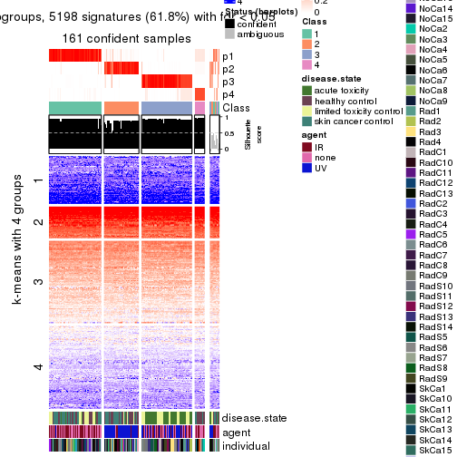</p>

</div>
<div id='tab-ATC-mclust-get-signatures-no-scale-4'>
<pre><code class="r">get_signatures(res, k = 5, scale_rows = FALSE)
</code></pre>

<p>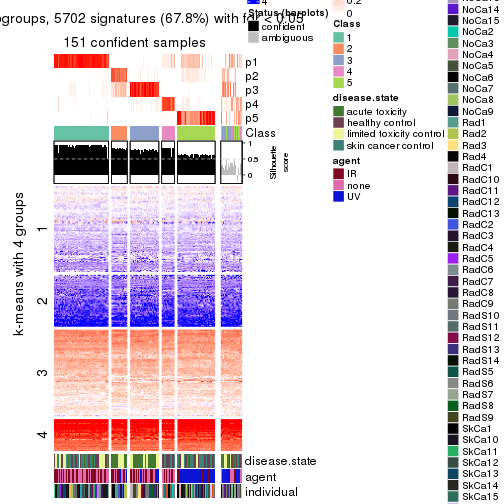</p>

</div>
<div id='tab-ATC-mclust-get-signatures-no-scale-5'>
<pre><code class="r">get_signatures(res, k = 6, scale_rows = FALSE)
</code></pre>

<p>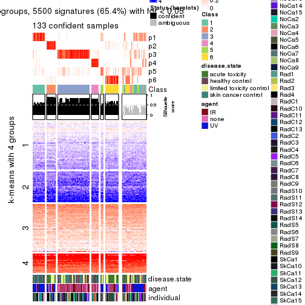</p>

</div>
</div>


Compare the overlap of signatures from different k:

```r
compare_signatures(res)
```

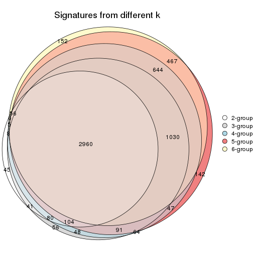

`get_signature()` returns a data frame invisibly. TO get the list of signatures, the function
call should be assigned to a variable explicitly. In following code, if `plot` argument is set
to `FALSE`, no heatmap is plotted while only the differential analysis is performed.

```r
# code only for demonstration
tb = get_signature(res, k = ..., plot = FALSE)
```

An example of the output of `tb` is:

```
#>   which_row         fdr    mean_1    mean_2 scaled_mean_1 scaled_mean_2 km
#> 1        38 0.042760348  8.373488  9.131774    -0.5533452     0.5164555  1
#> 2        40 0.018707592  7.106213  8.469186    -0.6173731     0.5762149  1
#> 3        55 0.019134737 10.221463 11.207825    -0.6159697     0.5749050  1
#> 4        59 0.006059896  5.921854  7.869574    -0.6899429     0.6439467  1
#> 5        60 0.018055526  8.928898 10.211722    -0.6204761     0.5791110  1
#> 6        98 0.009384629 15.714769 14.887706     0.6635654    -0.6193277  2
...
```

The columns in `tb` are:

1. `which_row`: row indices corresponding to the input matrix.
2. `fdr`: FDR for the differential test. 
3. `mean_x`: The mean value in group x.
4. `scaled_mean_x`: The mean value in group x after rows are scaled.
5. `km`: Row groups if k-means clustering is applied to rows.


UMAP plot which shows how samples are separated.


<script>
$( function() {
	$( '#tabs-ATC-mclust-dimension-reduction' ).tabs();
} );
</script>
<div id='tabs-ATC-mclust-dimension-reduction'>
<ul>
<li><a href='#tab-ATC-mclust-dimension-reduction-1'>k = 2</a></li>
<li><a href='#tab-ATC-mclust-dimension-reduction-2'>k = 3</a></li>
<li><a href='#tab-ATC-mclust-dimension-reduction-3'>k = 4</a></li>
<li><a href='#tab-ATC-mclust-dimension-reduction-4'>k = 5</a></li>
<li><a href='#tab-ATC-mclust-dimension-reduction-5'>k = 6</a></li>
</ul>
<div id='tab-ATC-mclust-dimension-reduction-1'>
<pre><code class="r">dimension_reduction(res, k = 2, method = &quot;UMAP&quot;)
</code></pre>

<p>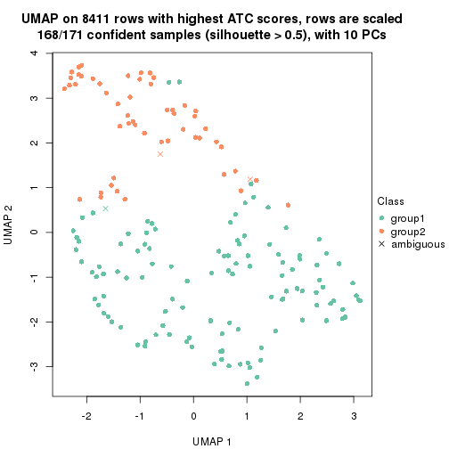</p>

</div>
<div id='tab-ATC-mclust-dimension-reduction-2'>
<pre><code class="r">dimension_reduction(res, k = 3, method = &quot;UMAP&quot;)
</code></pre>

<p>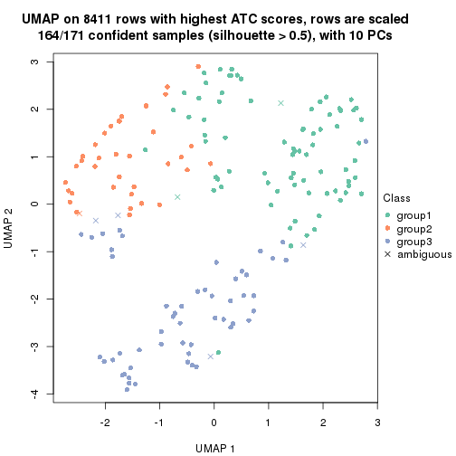</p>

</div>
<div id='tab-ATC-mclust-dimension-reduction-3'>
<pre><code class="r">dimension_reduction(res, k = 4, method = &quot;UMAP&quot;)
</code></pre>

<p>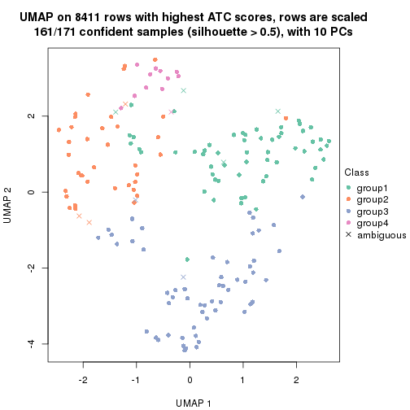</p>

</div>
<div id='tab-ATC-mclust-dimension-reduction-4'>
<pre><code class="r">dimension_reduction(res, k = 5, method = &quot;UMAP&quot;)
</code></pre>

<p>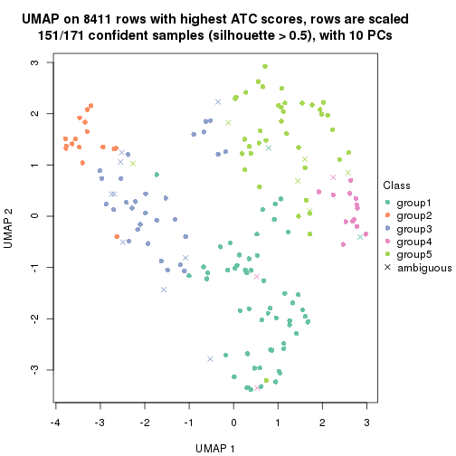</p>

</div>
<div id='tab-ATC-mclust-dimension-reduction-5'>
<pre><code class="r">dimension_reduction(res, k = 6, method = &quot;UMAP&quot;)
</code></pre>

<p>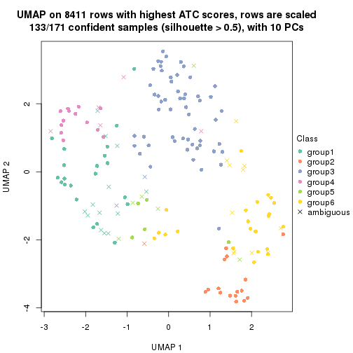</p>

</div>
</div>


Following heatmap shows how subgroups are split when increasing `k`:

```r
collect_classes(res)
```

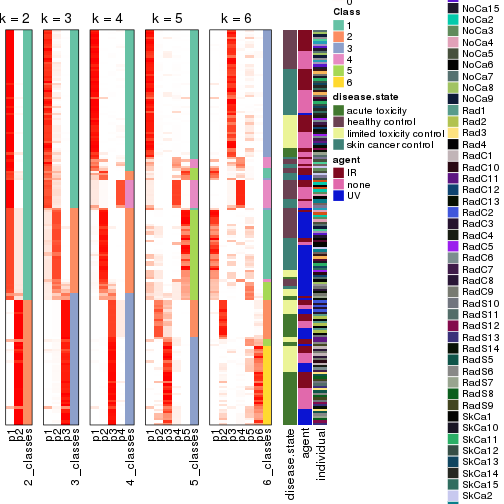


Test correlation between subgroups and known annotations. If the known
annotation is numeric, one-way ANOVA test is applied, and if the known
annotation is discrete, chi-squared contingency table test is applied.

```r
test_to_known_factors(res)
```

```
#>              n disease.state(p) agent(p) individual(p) k
#> ATC:mclust 168         5.13e-21 8.23e-01      3.09e-09 2
#> ATC:mclust 164         5.83e-20 3.31e-17      7.79e-04 3
#> ATC:mclust 161         3.19e-20 1.71e-15      3.89e-06 4
#> ATC:mclust 151         9.77e-15 5.87e-15      1.04e-12 5
#> ATC:mclust 133         1.08e-13 3.26e-09      1.89e-11 6
```


If matrix rows can be associated to genes, consider to use `functional_enrichment(res,
...)` to perform function enrichment for the signature genes. See [this vignette](http://bioconductor.org/packages/devel/bioc/vignettes/cola/inst/doc/functional_enrichment.html) for more detailed explanations.


 

---------------------------------------------------


### ATC:NMF


The object with results only for a single top-value method and a single partition method 
can be extracted as:

```r
res = res_list["ATC", "NMF"]
# you can also extract it by
# res = res_list["ATC:NMF"]
```

A summary of `res` and all the functions that can be applied to it:

```r
res
```

```
#> A 'ConsensusPartition' object with k = 2, 3, 4, 5, 6.
#>   On a matrix with 8411 rows and 171 columns.
#>   Top rows (841, 1682, 2524, 3365, 4206) are extracted by 'ATC' method.
#>   Subgroups are detected by 'NMF' method.
#>   Performed in total 1250 partitions by row resampling.
#>   Best k for subgroups seems to be 2.
#> 
#> Following methods can be applied to this 'ConsensusPartition' object:
#>  [1] "cola_report"             "collect_classes"         "collect_plots"          
#>  [4] "collect_stats"           "colnames"                "compare_signatures"     
#>  [7] "consensus_heatmap"       "dimension_reduction"     "functional_enrichment"  
#> [10] "get_anno_col"            "get_anno"                "get_classes"            
#> [13] "get_consensus"           "get_matrix"              "get_membership"         
#> [16] "get_param"               "get_signatures"          "get_stats"              
#> [19] "is_best_k"               "is_stable_k"             "membership_heatmap"     
#> [22] "ncol"                    "nrow"                    "plot_ecdf"              
#> [25] "rownames"                "select_partition_number" "show"                   
#> [28] "suggest_best_k"          "test_to_known_factors"
```

`collect_plots()` function collects all the plots made from `res` for all `k` (number of partitions)
into one single page to provide an easy and fast comparison between different `k`.

```r
collect_plots(res)
```

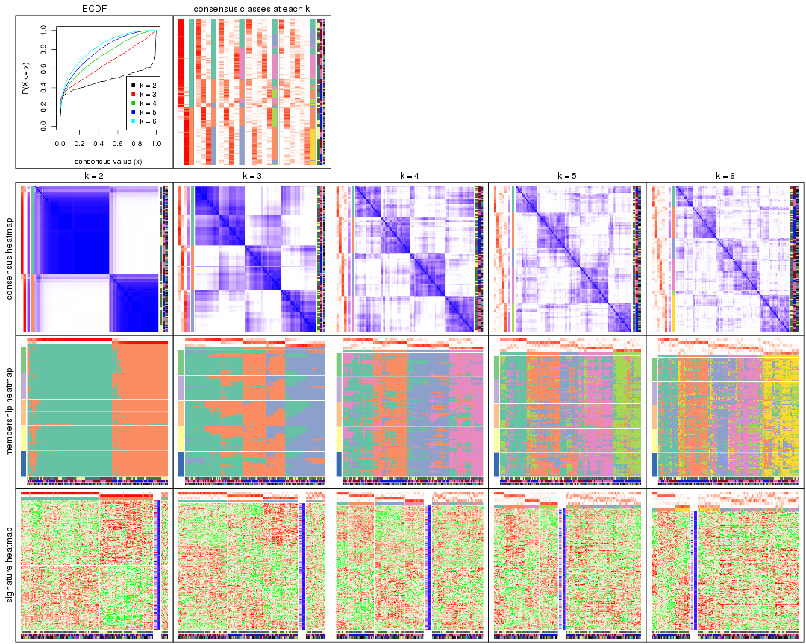

The plots are:

- The first row: a plot of the ECDF (empirical cumulative distribution
  function) curves of the consensus matrix for each `k` and the heatmap of
  predicted classes for each `k`.
- The second row: heatmaps of the consensus matrix for each `k`.
- The third row: heatmaps of the membership matrix for each `k`.
- The fouth row: heatmaps of the signatures for each `k`.

All the plots in panels can be made by individual functions and they are
plotted later in this section.

`select_partition_number()` produces several plots showing different
statistics for choosing "optimized" `k`. There are following statistics:

- ECDF curves of the consensus matrix for each `k`;
- 1-PAC. [The PAC
  score](https://en.wikipedia.org/wiki/Consensus_clustering#Over-interpretation_potential_of_consensus_clustering)
  measures the proportion of the ambiguous subgrouping.
- Mean silhouette score.
- Concordance. The mean probability of fiting the consensus class ids in all
  partitions.
- Area increased. Denote $A_k$ as the area under the ECDF curve for current
  `k`, the area increased is defined as $A_k - A_{k-1}$.
- Rand index. The percent of pairs of samples that are both in a same cluster
  or both are not in a same cluster in the partition of k and k-1.
- Jaccard index. The ratio of pairs of samples are both in a same cluster in
  the partition of k and k-1 and the pairs of samples are both in a same
  cluster in the partition k or k-1.

The detailed explanations of these statistics can be found in [the _cola_
vignette](http://bioconductor.org/packages/devel/bioc/vignettes/cola/inst/doc/cola.html#toc_13).

Generally speaking, lower PAC score, higher mean silhouette score or higher
concordance corresponds to better partition. Rand index and Jaccard index
measure how similar the current partition is compared to partition with `k-1`.
If they are too similar, we won't accept `k` is better than `k-1`.

```r
select_partition_number(res)
```

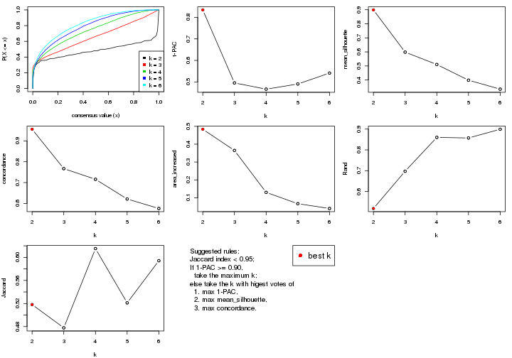

The numeric values for all these statistics can be obtained by `get_stats()`.

```r
get_stats(res)
```

```
#>   k 1-PAC mean_silhouette concordance area_increased  Rand Jaccard
#> 2 2 0.835           0.899       0.956         0.4835 0.518   0.518
#> 3 3 0.495           0.598       0.767         0.3648 0.697   0.478
#> 4 4 0.466           0.510       0.716         0.1299 0.860   0.615
#> 5 5 0.490           0.399       0.621         0.0664 0.857   0.521
#> 6 6 0.541           0.335       0.576         0.0396 0.899   0.594
```

`suggest_best_k()` suggests the best $k$ based on these statistics. The rules are as follows:

- All $k$ with Jaccard index larger than 0.95 are removed because increasing
  $k$ does not provide enough extra information. If all $k$ are removed, it is
  marked as no subgroup is detected.
- For all $k$ with 1-PAC score larger than 0.9, the maximal $k$ is taken as
  the best $k$, and other $k$ are marked as optional $k$.
- If it does not fit the second rule. The $k$ with the maximal vote of the
  highest 1-PAC score, highest mean silhouette, and highest concordance is
  taken as the best $k$.

```r
suggest_best_k(res)
```

```
#> [1] 2
```


Following shows the table of the partitions (You need to click the **show/hide
code output** link to see it). The membership matrix (columns with name `p*`)
is inferred by
[`clue::cl_consensus()`](https://www.rdocumentation.org/link/cl_consensus?package=clue)
function with the `SE` method. Basically the value in the membership matrix
represents the probability to belong to a certain group. The finall class
label for an item is determined with the group with highest probability it
belongs to.

In `get_classes()` function, the entropy is calculated from the membership
matrix and the silhouette score is calculated from the consensus matrix.


<script>
$( function() {
	$( '#tabs-ATC-NMF-get-classes' ).tabs();
} );
</script>
<div id='tabs-ATC-NMF-get-classes'>
<ul>
<li><a href='#tab-ATC-NMF-get-classes-1'>k = 2</a></li>
<li><a href='#tab-ATC-NMF-get-classes-2'>k = 3</a></li>
<li><a href='#tab-ATC-NMF-get-classes-3'>k = 4</a></li>
<li><a href='#tab-ATC-NMF-get-classes-4'>k = 5</a></li>
<li><a href='#tab-ATC-NMF-get-classes-5'>k = 6</a></li>
</ul>

<div id='tab-ATC-NMF-get-classes-1'>
<p><a id='tab-ATC-NMF-get-classes-1-a' style='color:#0366d6' href='#'>show/hide code output</a></p>
<pre><code class="r">cbind(get_classes(res, k = 2), get_membership(res, k = 2))
</code></pre>

<pre><code>#&gt;          class entropy silhouette    p1    p2
#&gt; GSM29783     1  0.0000     0.9532 1.000 0.000
#&gt; GSM29786     1  0.1414     0.9451 0.980 0.020
#&gt; GSM29789     1  0.0938     0.9492 0.988 0.012
#&gt; GSM29792     1  0.0938     0.9492 0.988 0.012
#&gt; GSM29795     1  0.0938     0.9492 0.988 0.012
#&gt; GSM29798     1  0.0000     0.9532 1.000 0.000
#&gt; GSM29801     1  0.0000     0.9532 1.000 0.000
#&gt; GSM29804     1  0.0000     0.9532 1.000 0.000
#&gt; GSM29807     1  0.0000     0.9532 1.000 0.000
#&gt; GSM29816     1  0.0000     0.9532 1.000 0.000
#&gt; GSM29821     1  0.0376     0.9522 0.996 0.004
#&gt; GSM29824     1  0.0000     0.9532 1.000 0.000
#&gt; GSM29827     1  0.0376     0.9522 0.996 0.004
#&gt; GSM29830     1  0.0376     0.9522 0.996 0.004
#&gt; GSM29833     1  0.0376     0.9522 0.996 0.004
#&gt; GSM29784     1  0.8327     0.6388 0.736 0.264
#&gt; GSM29787     1  0.0376     0.9522 0.996 0.004
#&gt; GSM29790     1  0.7674     0.7140 0.776 0.224
#&gt; GSM29793     1  0.1843     0.9396 0.972 0.028
#&gt; GSM29796     1  0.0938     0.9492 0.988 0.012
#&gt; GSM29799     1  0.0376     0.9512 0.996 0.004
#&gt; GSM29802     1  0.0000     0.9532 1.000 0.000
#&gt; GSM29805     1  0.0000     0.9532 1.000 0.000
#&gt; GSM29814     1  0.0000     0.9532 1.000 0.000
#&gt; GSM29817     1  0.0000     0.9532 1.000 0.000
#&gt; GSM29822     1  0.0000     0.9532 1.000 0.000
#&gt; GSM29825     1  0.0000     0.9532 1.000 0.000
#&gt; GSM29828     1  0.0376     0.9522 0.996 0.004
#&gt; GSM29831     1  0.0376     0.9522 0.996 0.004
#&gt; GSM29834     1  0.0000     0.9532 1.000 0.000
#&gt; GSM29785     2  0.9209     0.5014 0.336 0.664
#&gt; GSM29788     2  0.0672     0.9499 0.008 0.992
#&gt; GSM29791     2  0.9608     0.3831 0.384 0.616
#&gt; GSM29794     2  0.8081     0.6765 0.248 0.752
#&gt; GSM29797     2  0.0376     0.9515 0.004 0.996
#&gt; GSM29800     2  0.0000     0.9523 0.000 1.000
#&gt; GSM29803     1  0.5629     0.8383 0.868 0.132
#&gt; GSM29806     1  0.9087     0.5347 0.676 0.324
#&gt; GSM29815     2  0.6973     0.7672 0.188 0.812
#&gt; GSM29819     1  0.3114     0.9123 0.944 0.056
#&gt; GSM29823     1  0.3274     0.9128 0.940 0.060
#&gt; GSM29826     1  0.0376     0.9522 0.996 0.004
#&gt; GSM29829     1  0.0938     0.9492 0.988 0.012
#&gt; GSM29832     1  0.1414     0.9448 0.980 0.020
#&gt; GSM29835     1  0.3114     0.9165 0.944 0.056
#&gt; GSM29836     1  0.9988     0.0844 0.520 0.480
#&gt; GSM29839     1  0.0938     0.9492 0.988 0.012
#&gt; GSM29842     1  0.0000     0.9532 1.000 0.000
#&gt; GSM29845     1  0.0000     0.9532 1.000 0.000
#&gt; GSM29848     1  0.0000     0.9532 1.000 0.000
#&gt; GSM29851     1  0.0000     0.9532 1.000 0.000
#&gt; GSM29854     1  0.0000     0.9532 1.000 0.000
#&gt; GSM29857     1  0.0000     0.9532 1.000 0.000
#&gt; GSM29860     1  0.0938     0.9492 0.988 0.012
#&gt; GSM29863     1  0.0376     0.9522 0.996 0.004
#&gt; GSM29866     1  0.0000     0.9532 1.000 0.000
#&gt; GSM29869     1  0.0000     0.9532 1.000 0.000
#&gt; GSM29872     1  0.0376     0.9522 0.996 0.004
#&gt; GSM29875     1  0.0000     0.9532 1.000 0.000
#&gt; GSM29878     1  0.0376     0.9522 0.996 0.004
#&gt; GSM29837     2  0.0000     0.9523 0.000 1.000
#&gt; GSM29840     1  0.0376     0.9522 0.996 0.004
#&gt; GSM29843     1  0.0000     0.9532 1.000 0.000
#&gt; GSM29846     1  0.0376     0.9512 0.996 0.004
#&gt; GSM29849     1  0.0000     0.9532 1.000 0.000
#&gt; GSM29852     1  0.0000     0.9532 1.000 0.000
#&gt; GSM29855     1  0.0000     0.9532 1.000 0.000
#&gt; GSM29858     1  0.0376     0.9512 0.996 0.004
#&gt; GSM29861     1  0.0376     0.9522 0.996 0.004
#&gt; GSM29864     1  0.0000     0.9532 1.000 0.000
#&gt; GSM29867     1  0.0000     0.9532 1.000 0.000
#&gt; GSM29870     1  0.0000     0.9532 1.000 0.000
#&gt; GSM29873     1  0.0000     0.9532 1.000 0.000
#&gt; GSM29876     1  0.0000     0.9532 1.000 0.000
#&gt; GSM29879     1  0.0000     0.9532 1.000 0.000
#&gt; GSM29838     2  0.0376     0.9515 0.004 0.996
#&gt; GSM29841     2  0.2043     0.9340 0.032 0.968
#&gt; GSM29844     2  0.5294     0.8512 0.120 0.880
#&gt; GSM29847     1  0.7299     0.7450 0.796 0.204
#&gt; GSM29850     1  0.0938     0.9492 0.988 0.012
#&gt; GSM29853     1  0.0672     0.9509 0.992 0.008
#&gt; GSM29856     1  0.9491     0.4311 0.632 0.368
#&gt; GSM29859     2  0.8267     0.6566 0.260 0.740
#&gt; GSM29862     2  0.3431     0.9072 0.064 0.936
#&gt; GSM29865     1  0.9983     0.0995 0.524 0.476
#&gt; GSM29868     1  0.5408     0.8474 0.876 0.124
#&gt; GSM29871     1  0.1843     0.9395 0.972 0.028
#&gt; GSM29874     2  0.9552     0.4043 0.376 0.624
#&gt; GSM29877     1  0.0376     0.9522 0.996 0.004
#&gt; GSM29880     2  0.4939     0.8642 0.108 0.892
#&gt; GSM29881     2  0.0672     0.9520 0.008 0.992
#&gt; GSM29884     2  0.0376     0.9533 0.004 0.996
#&gt; GSM29887     2  0.0376     0.9533 0.004 0.996
#&gt; GSM29890     1  0.0000     0.9532 1.000 0.000
#&gt; GSM29893     1  0.0376     0.9522 0.996 0.004
#&gt; GSM29896     1  0.0000     0.9532 1.000 0.000
#&gt; GSM29899     1  0.0000     0.9532 1.000 0.000
#&gt; GSM29902     1  0.1184     0.9439 0.984 0.016
#&gt; GSM29905     1  0.9323     0.4675 0.652 0.348
#&gt; GSM29908     1  0.0376     0.9522 0.996 0.004
#&gt; GSM29955     2  0.1633     0.9443 0.024 0.976
#&gt; GSM29958     1  0.0376     0.9522 0.996 0.004
#&gt; GSM29961     1  0.0376     0.9522 0.996 0.004
#&gt; GSM29882     2  0.8713     0.6003 0.292 0.708
#&gt; GSM29885     2  0.0376     0.9533 0.004 0.996
#&gt; GSM29888     2  0.0376     0.9533 0.004 0.996
#&gt; GSM29891     1  0.0000     0.9532 1.000 0.000
#&gt; GSM29894     1  0.0000     0.9532 1.000 0.000
#&gt; GSM29897     1  0.0000     0.9532 1.000 0.000
#&gt; GSM29900     1  0.0000     0.9532 1.000 0.000
#&gt; GSM29903     2  0.1633     0.9440 0.024 0.976
#&gt; GSM29906     2  0.2948     0.9237 0.052 0.948
#&gt; GSM29909     2  0.2423     0.9329 0.040 0.960
#&gt; GSM29956     1  0.0000     0.9532 1.000 0.000
#&gt; GSM29959     1  0.0000     0.9532 1.000 0.000
#&gt; GSM29962     1  0.0000     0.9532 1.000 0.000
#&gt; GSM29883     2  0.0376     0.9533 0.004 0.996
#&gt; GSM29886     2  0.0000     0.9523 0.000 1.000
#&gt; GSM29889     2  0.0000     0.9523 0.000 1.000
#&gt; GSM29892     2  0.0376     0.9533 0.004 0.996
#&gt; GSM29895     1  0.2603     0.9268 0.956 0.044
#&gt; GSM29898     2  0.0376     0.9533 0.004 0.996
#&gt; GSM29901     2  0.0376     0.9533 0.004 0.996
#&gt; GSM29904     2  0.6712     0.7856 0.176 0.824
#&gt; GSM29907     2  0.0376     0.9515 0.004 0.996
#&gt; GSM29910     1  0.2778     0.9234 0.952 0.048
#&gt; GSM29957     2  0.0000     0.9523 0.000 1.000
#&gt; GSM29960     1  0.1184     0.9471 0.984 0.016
#&gt; GSM29963     2  0.0376     0.9515 0.004 0.996
#&gt; GSM29964     2  0.0376     0.9533 0.004 0.996
#&gt; GSM29967     2  0.0376     0.9533 0.004 0.996
#&gt; GSM29970     2  0.0938     0.9498 0.012 0.988
#&gt; GSM29973     2  0.0376     0.9533 0.004 0.996
#&gt; GSM29976     2  0.0672     0.9520 0.008 0.992
#&gt; GSM29979     2  0.0376     0.9533 0.004 0.996
#&gt; GSM29982     1  0.9970     0.1161 0.532 0.468
#&gt; GSM29985     2  0.0672     0.9520 0.008 0.992
#&gt; GSM29988     2  0.0672     0.9520 0.008 0.992
#&gt; GSM29991     2  0.0376     0.9533 0.004 0.996
#&gt; GSM29994     2  0.1633     0.9440 0.024 0.976
#&gt; GSM29997     1  0.0000     0.9532 1.000 0.000
#&gt; GSM30000     2  0.0376     0.9533 0.004 0.996
#&gt; GSM30003     1  0.0000     0.9532 1.000 0.000
#&gt; GSM29965     2  0.0376     0.9533 0.004 0.996
#&gt; GSM29968     2  0.0376     0.9533 0.004 0.996
#&gt; GSM29971     1  0.0672     0.9492 0.992 0.008
#&gt; GSM29974     2  0.0000     0.9523 0.000 1.000
#&gt; GSM29977     2  0.1184     0.9484 0.016 0.984
#&gt; GSM29980     2  0.0376     0.9533 0.004 0.996
#&gt; GSM29983     1  0.0000     0.9532 1.000 0.000
#&gt; GSM29986     2  0.0672     0.9520 0.008 0.992
#&gt; GSM29989     2  0.3114     0.9197 0.056 0.944
#&gt; GSM29992     2  0.0672     0.9520 0.008 0.992
#&gt; GSM29995     1  0.0000     0.9532 1.000 0.000
#&gt; GSM29998     1  0.9775     0.2945 0.588 0.412
#&gt; GSM30001     2  0.0376     0.9533 0.004 0.996
#&gt; GSM30004     1  0.5737     0.8232 0.864 0.136
#&gt; GSM29966     2  0.0000     0.9523 0.000 1.000
#&gt; GSM29969     2  0.0000     0.9523 0.000 1.000
#&gt; GSM29972     2  0.0376     0.9533 0.004 0.996
#&gt; GSM29975     2  0.0000     0.9523 0.000 1.000
#&gt; GSM29978     2  0.0376     0.9533 0.004 0.996
#&gt; GSM29981     2  0.0000     0.9523 0.000 1.000
#&gt; GSM29984     2  0.0000     0.9523 0.000 1.000
#&gt; GSM29987     2  0.0376     0.9533 0.004 0.996
#&gt; GSM29990     2  0.0000     0.9523 0.000 1.000
#&gt; GSM29993     2  0.0376     0.9533 0.004 0.996
#&gt; GSM29996     1  0.0672     0.9509 0.992 0.008
#&gt; GSM29999     2  0.0376     0.9533 0.004 0.996
#&gt; GSM30002     2  0.0376     0.9533 0.004 0.996
#&gt; GSM30005     2  0.0376     0.9515 0.004 0.996
</code></pre>

<script>
$('#tab-ATC-NMF-get-classes-1-a').parent().next().next().hide();
$('#tab-ATC-NMF-get-classes-1-a').click(function(){
  $('#tab-ATC-NMF-get-classes-1-a').parent().next().next().toggle();
  return(false);
});
</script>
</div>

<div id='tab-ATC-NMF-get-classes-2'>
<p><a id='tab-ATC-NMF-get-classes-2-a' style='color:#0366d6' href='#'>show/hide code output</a></p>
<pre><code class="r">cbind(get_classes(res, k = 3), get_membership(res, k = 3))
</code></pre>

<pre><code>#&gt;          class entropy silhouette    p1    p2    p3
#&gt; GSM29783     1  0.2486     0.7435 0.932 0.008 0.060
#&gt; GSM29786     1  0.6192     0.0528 0.580 0.420 0.000
#&gt; GSM29789     2  0.5706     0.6431 0.320 0.680 0.000
#&gt; GSM29792     2  0.5397     0.6869 0.280 0.720 0.000
#&gt; GSM29795     2  0.5465     0.6799 0.288 0.712 0.000
#&gt; GSM29798     1  0.4974     0.6478 0.764 0.000 0.236
#&gt; GSM29801     1  0.1289     0.7293 0.968 0.032 0.000
#&gt; GSM29804     1  0.3267     0.7205 0.884 0.000 0.116
#&gt; GSM29807     1  0.1289     0.7419 0.968 0.000 0.032
#&gt; GSM29816     1  0.5397     0.6057 0.720 0.000 0.280
#&gt; GSM29821     1  0.5327     0.4713 0.728 0.272 0.000
#&gt; GSM29824     1  0.1964     0.7203 0.944 0.056 0.000
#&gt; GSM29827     1  0.5591     0.4016 0.696 0.304 0.000
#&gt; GSM29830     1  0.3551     0.6691 0.868 0.132 0.000
#&gt; GSM29833     1  0.5327     0.4714 0.728 0.272 0.000
#&gt; GSM29784     1  0.6154     0.3867 0.592 0.000 0.408
#&gt; GSM29787     1  0.6126     0.1265 0.600 0.400 0.000
#&gt; GSM29790     2  0.5859     0.6020 0.344 0.656 0.000
#&gt; GSM29793     2  0.5678     0.6487 0.316 0.684 0.000
#&gt; GSM29796     2  0.5529     0.6720 0.296 0.704 0.000
#&gt; GSM29799     1  0.6126     0.3945 0.600 0.000 0.400
#&gt; GSM29802     1  0.5327     0.6138 0.728 0.000 0.272
#&gt; GSM29805     1  0.5397     0.6057 0.720 0.000 0.280
#&gt; GSM29814     1  0.5560     0.5816 0.700 0.000 0.300
#&gt; GSM29817     1  0.2796     0.7306 0.908 0.000 0.092
#&gt; GSM29822     1  0.4842     0.6574 0.776 0.000 0.224
#&gt; GSM29825     1  0.2625     0.7331 0.916 0.000 0.084
#&gt; GSM29828     1  0.4750     0.5669 0.784 0.216 0.000
#&gt; GSM29831     1  0.3551     0.6690 0.868 0.132 0.000
#&gt; GSM29834     1  0.2625     0.7054 0.916 0.084 0.000
#&gt; GSM29785     2  0.1989     0.7338 0.048 0.948 0.004
#&gt; GSM29788     2  0.1643     0.6783 0.000 0.956 0.044
#&gt; GSM29791     2  0.2165     0.7403 0.064 0.936 0.000
#&gt; GSM29794     2  0.1753     0.7350 0.048 0.952 0.000
#&gt; GSM29797     2  0.1031     0.6936 0.000 0.976 0.024
#&gt; GSM29800     2  0.5098     0.4103 0.000 0.752 0.248
#&gt; GSM29803     2  0.4887     0.7197 0.228 0.772 0.000
#&gt; GSM29806     2  0.5480     0.6972 0.264 0.732 0.004
#&gt; GSM29815     2  0.3445     0.6557 0.016 0.896 0.088
#&gt; GSM29819     1  0.5269     0.6811 0.784 0.016 0.200
#&gt; GSM29823     2  0.4555     0.7308 0.200 0.800 0.000
#&gt; GSM29826     1  0.5785     0.3328 0.668 0.332 0.000
#&gt; GSM29829     2  0.5431     0.6834 0.284 0.716 0.000
#&gt; GSM29832     2  0.5138     0.7063 0.252 0.748 0.000
#&gt; GSM29835     2  0.4605     0.7293 0.204 0.796 0.000
#&gt; GSM29836     2  0.3340     0.7453 0.120 0.880 0.000
#&gt; GSM29839     2  0.5529     0.6720 0.296 0.704 0.000
#&gt; GSM29842     1  0.3983     0.6612 0.852 0.144 0.004
#&gt; GSM29845     1  0.1643     0.7251 0.956 0.044 0.000
#&gt; GSM29848     1  0.2959     0.6953 0.900 0.100 0.000
#&gt; GSM29851     1  0.2878     0.6979 0.904 0.096 0.000
#&gt; GSM29854     1  0.3116     0.7249 0.892 0.000 0.108
#&gt; GSM29857     1  0.5497     0.5916 0.708 0.000 0.292
#&gt; GSM29860     2  0.5560     0.6676 0.300 0.700 0.000
#&gt; GSM29863     1  0.4974     0.5370 0.764 0.236 0.000
#&gt; GSM29866     1  0.2537     0.7083 0.920 0.080 0.000
#&gt; GSM29869     1  0.1337     0.7384 0.972 0.012 0.016
#&gt; GSM29872     1  0.6079     0.1680 0.612 0.388 0.000
#&gt; GSM29875     1  0.0829     0.7360 0.984 0.012 0.004
#&gt; GSM29878     1  0.4178     0.6261 0.828 0.172 0.000
#&gt; GSM29837     2  0.3752     0.5715 0.000 0.856 0.144
#&gt; GSM29840     2  0.6095     0.5155 0.392 0.608 0.000
#&gt; GSM29843     1  0.5560     0.5816 0.700 0.000 0.300
#&gt; GSM29846     1  0.5650     0.5640 0.688 0.000 0.312
#&gt; GSM29849     1  0.4178     0.6930 0.828 0.000 0.172
#&gt; GSM29852     1  0.4178     0.6930 0.828 0.000 0.172
#&gt; GSM29855     1  0.5431     0.6010 0.716 0.000 0.284
#&gt; GSM29858     1  0.5621     0.5700 0.692 0.000 0.308
#&gt; GSM29861     1  0.6307    -0.2063 0.512 0.488 0.000
#&gt; GSM29864     1  0.1964     0.7417 0.944 0.000 0.056
#&gt; GSM29867     1  0.4346     0.6856 0.816 0.000 0.184
#&gt; GSM29870     1  0.5291     0.6179 0.732 0.000 0.268
#&gt; GSM29873     1  0.1905     0.7365 0.956 0.028 0.016
#&gt; GSM29876     1  0.5363     0.6099 0.724 0.000 0.276
#&gt; GSM29879     1  0.5560     0.5816 0.700 0.000 0.300
#&gt; GSM29838     2  0.2959     0.6245 0.000 0.900 0.100
#&gt; GSM29841     2  0.0592     0.7183 0.012 0.988 0.000
#&gt; GSM29844     2  0.0829     0.7159 0.012 0.984 0.004
#&gt; GSM29847     2  0.4235     0.7368 0.176 0.824 0.000
#&gt; GSM29850     2  0.5397     0.6872 0.280 0.720 0.000
#&gt; GSM29853     2  0.5678     0.6483 0.316 0.684 0.000
#&gt; GSM29856     2  0.3752     0.7423 0.144 0.856 0.000
#&gt; GSM29859     2  0.4094     0.6541 0.028 0.872 0.100
#&gt; GSM29862     2  0.1267     0.7225 0.024 0.972 0.004
#&gt; GSM29865     2  0.3267     0.7456 0.116 0.884 0.000
#&gt; GSM29868     2  0.4555     0.7309 0.200 0.800 0.000
#&gt; GSM29871     2  0.5968     0.5718 0.364 0.636 0.000
#&gt; GSM29874     2  0.1860     0.7365 0.052 0.948 0.000
#&gt; GSM29877     1  0.4931     0.5433 0.768 0.232 0.000
#&gt; GSM29880     2  0.0848     0.7108 0.008 0.984 0.008
#&gt; GSM29881     3  0.3941     0.6444 0.156 0.000 0.844
#&gt; GSM29884     3  0.5363     0.6437 0.000 0.276 0.724
#&gt; GSM29887     3  0.5138     0.6604 0.000 0.252 0.748
#&gt; GSM29890     1  0.4842     0.6572 0.776 0.000 0.224
#&gt; GSM29893     1  0.3686     0.6613 0.860 0.140 0.000
#&gt; GSM29896     1  0.2066     0.7184 0.940 0.060 0.000
#&gt; GSM29899     1  0.4555     0.6750 0.800 0.000 0.200
#&gt; GSM29902     3  0.6305    -0.0710 0.484 0.000 0.516
#&gt; GSM29905     3  0.6026     0.2909 0.376 0.000 0.624
#&gt; GSM29908     1  0.5058     0.5228 0.756 0.244 0.000
#&gt; GSM29955     3  0.3038     0.6855 0.104 0.000 0.896
#&gt; GSM29958     1  0.4974     0.5366 0.764 0.236 0.000
#&gt; GSM29961     1  0.4654     0.5797 0.792 0.208 0.000
#&gt; GSM29882     3  0.5529     0.4677 0.296 0.000 0.704
#&gt; GSM29885     3  0.4452     0.6893 0.000 0.192 0.808
#&gt; GSM29888     3  0.3551     0.7092 0.000 0.132 0.868
#&gt; GSM29891     1  0.5560     0.5816 0.700 0.000 0.300
#&gt; GSM29894     1  0.1163     0.7413 0.972 0.000 0.028
#&gt; GSM29897     1  0.2878     0.6979 0.904 0.096 0.000
#&gt; GSM29900     1  0.5529     0.5865 0.704 0.000 0.296
#&gt; GSM29903     3  0.4974     0.5638 0.236 0.000 0.764
#&gt; GSM29906     3  0.5098     0.5476 0.248 0.000 0.752
#&gt; GSM29909     3  0.5016     0.5587 0.240 0.000 0.760
#&gt; GSM29956     1  0.3038     0.6930 0.896 0.104 0.000
#&gt; GSM29959     1  0.0747     0.7341 0.984 0.016 0.000
#&gt; GSM29962     1  0.0747     0.7345 0.984 0.016 0.000
#&gt; GSM29883     3  0.5138     0.6605 0.000 0.252 0.748
#&gt; GSM29886     2  0.6302    -0.2077 0.000 0.520 0.480
#&gt; GSM29889     2  0.5529     0.3135 0.000 0.704 0.296
#&gt; GSM29892     3  0.3941     0.7027 0.000 0.156 0.844
#&gt; GSM29895     2  0.5291     0.6962 0.268 0.732 0.000
#&gt; GSM29898     3  0.5560     0.6203 0.000 0.300 0.700
#&gt; GSM29901     3  0.1585     0.7234 0.028 0.008 0.964
#&gt; GSM29904     2  0.3039     0.7078 0.036 0.920 0.044
#&gt; GSM29907     2  0.4121     0.5406 0.000 0.832 0.168
#&gt; GSM29910     2  0.4887     0.7193 0.228 0.772 0.000
#&gt; GSM29957     2  0.6274    -0.1379 0.000 0.544 0.456
#&gt; GSM29960     2  0.5291     0.6962 0.268 0.732 0.000
#&gt; GSM29963     2  0.2261     0.6573 0.000 0.932 0.068
#&gt; GSM29964     3  0.2796     0.7172 0.000 0.092 0.908
#&gt; GSM29967     3  0.5431     0.6367 0.000 0.284 0.716
#&gt; GSM29970     3  0.4887     0.5739 0.228 0.000 0.772
#&gt; GSM29973     3  0.5560     0.6203 0.000 0.300 0.700
#&gt; GSM29976     3  0.2066     0.7102 0.060 0.000 0.940
#&gt; GSM29979     3  0.5327     0.6468 0.000 0.272 0.728
#&gt; GSM29982     2  0.9311    -0.0072 0.384 0.452 0.164
#&gt; GSM29985     3  0.2625     0.6977 0.084 0.000 0.916
#&gt; GSM29988     3  0.1860     0.7136 0.052 0.000 0.948
#&gt; GSM29991     3  0.1015     0.7238 0.012 0.008 0.980
#&gt; GSM29994     3  0.4750     0.5871 0.216 0.000 0.784
#&gt; GSM29997     1  0.2711     0.7322 0.912 0.000 0.088
#&gt; GSM30000     3  0.1753     0.7228 0.000 0.048 0.952
#&gt; GSM30003     1  0.5397     0.6057 0.720 0.000 0.280
#&gt; GSM29965     3  0.1031     0.7241 0.000 0.024 0.976
#&gt; GSM29968     3  0.5431     0.6367 0.000 0.284 0.716
#&gt; GSM29971     3  0.6309    -0.1169 0.496 0.000 0.504
#&gt; GSM29974     3  0.5650     0.6070 0.000 0.312 0.688
#&gt; GSM29977     3  0.4887     0.5738 0.228 0.000 0.772
#&gt; GSM29980     3  0.3686     0.7072 0.000 0.140 0.860
#&gt; GSM29983     1  0.3482     0.6733 0.872 0.128 0.000
#&gt; GSM29986     3  0.2878     0.6907 0.096 0.000 0.904
#&gt; GSM29989     3  0.5254     0.5227 0.264 0.000 0.736
#&gt; GSM29992     3  0.2165     0.7083 0.064 0.000 0.936
#&gt; GSM29995     1  0.1529     0.7267 0.960 0.040 0.000
#&gt; GSM29998     3  0.5810     0.3871 0.336 0.000 0.664
#&gt; GSM30001     3  0.1163     0.7239 0.000 0.028 0.972
#&gt; GSM30004     3  0.6008     0.3007 0.372 0.000 0.628
#&gt; GSM29966     3  0.5882     0.5620 0.000 0.348 0.652
#&gt; GSM29969     3  0.5882     0.5616 0.000 0.348 0.652
#&gt; GSM29972     3  0.5327     0.6470 0.000 0.272 0.728
#&gt; GSM29975     3  0.5948     0.5434 0.000 0.360 0.640
#&gt; GSM29978     3  0.4796     0.6774 0.000 0.220 0.780
#&gt; GSM29981     2  0.6045     0.1014 0.000 0.620 0.380
#&gt; GSM29984     3  0.5926     0.5495 0.000 0.356 0.644
#&gt; GSM29987     3  0.4702     0.6810 0.000 0.212 0.788
#&gt; GSM29990     2  0.6225    -0.0511 0.000 0.568 0.432
#&gt; GSM29993     3  0.5291     0.6498 0.000 0.268 0.732
#&gt; GSM29996     2  0.5760     0.6314 0.328 0.672 0.000
#&gt; GSM29999     3  0.1129     0.7231 0.020 0.004 0.976
#&gt; GSM30002     3  0.5431     0.6367 0.000 0.284 0.716
#&gt; GSM30005     2  0.4605     0.4867 0.000 0.796 0.204
</code></pre>

<script>
$('#tab-ATC-NMF-get-classes-2-a').parent().next().next().hide();
$('#tab-ATC-NMF-get-classes-2-a').click(function(){
  $('#tab-ATC-NMF-get-classes-2-a').parent().next().next().toggle();
  return(false);
});
</script>
</div>

<div id='tab-ATC-NMF-get-classes-3'>
<p><a id='tab-ATC-NMF-get-classes-3-a' style='color:#0366d6' href='#'>show/hide code output</a></p>
<pre><code class="r">cbind(get_classes(res, k = 4), get_membership(res, k = 4))
</code></pre>

<pre><code>#&gt;          class entropy silhouette    p1    p2    p3    p4
#&gt; GSM29783     4   0.188     0.6253 0.016 0.016 0.020 0.948
#&gt; GSM29786     4   0.288     0.6196 0.028 0.060 0.008 0.904
#&gt; GSM29789     4   0.772     0.1767 0.228 0.360 0.000 0.412
#&gt; GSM29792     2   0.594     0.5550 0.232 0.676 0.000 0.092
#&gt; GSM29795     2   0.622     0.5233 0.240 0.652 0.000 0.108
#&gt; GSM29798     4   0.222     0.6268 0.036 0.004 0.028 0.932
#&gt; GSM29801     1   0.567     0.0399 0.572 0.028 0.000 0.400
#&gt; GSM29804     1   0.605     0.4307 0.668 0.000 0.100 0.232
#&gt; GSM29807     1   0.436     0.5689 0.816 0.000 0.088 0.096
#&gt; GSM29816     1   0.707     0.4028 0.564 0.000 0.256 0.180
#&gt; GSM29821     4   0.663     0.4461 0.300 0.112 0.000 0.588
#&gt; GSM29824     1   0.321     0.5889 0.884 0.024 0.008 0.084
#&gt; GSM29827     1   0.483     0.4875 0.768 0.176 0.000 0.056
#&gt; GSM29830     1   0.424     0.5315 0.808 0.040 0.000 0.152
#&gt; GSM29833     4   0.692     0.3618 0.340 0.124 0.000 0.536
#&gt; GSM29784     4   0.206     0.5984 0.000 0.016 0.052 0.932
#&gt; GSM29787     4   0.260     0.6128 0.020 0.064 0.004 0.912
#&gt; GSM29790     4   0.298     0.5838 0.000 0.084 0.028 0.888
#&gt; GSM29793     4   0.377     0.5774 0.024 0.120 0.008 0.848
#&gt; GSM29796     4   0.684     0.4123 0.140 0.280 0.000 0.580
#&gt; GSM29799     4   0.300     0.6073 0.044 0.000 0.064 0.892
#&gt; GSM29802     4   0.607     0.3752 0.356 0.000 0.056 0.588
#&gt; GSM29805     4   0.649     0.2261 0.396 0.000 0.076 0.528
#&gt; GSM29814     1   0.742     0.0471 0.424 0.000 0.168 0.408
#&gt; GSM29817     4   0.472     0.5765 0.272 0.008 0.004 0.716
#&gt; GSM29822     4   0.256     0.6310 0.072 0.000 0.020 0.908
#&gt; GSM29825     4   0.541     0.2268 0.492 0.000 0.012 0.496
#&gt; GSM29828     1   0.687    -0.0270 0.504 0.108 0.000 0.388
#&gt; GSM29831     1   0.373     0.5637 0.852 0.056 0.000 0.092
#&gt; GSM29834     4   0.623     0.4186 0.364 0.064 0.000 0.572
#&gt; GSM29785     2   0.496     0.6306 0.056 0.756 0.000 0.188
#&gt; GSM29788     2   0.361     0.6690 0.000 0.844 0.024 0.132
#&gt; GSM29791     2   0.214     0.7237 0.056 0.928 0.000 0.016
#&gt; GSM29794     2   0.168     0.7248 0.040 0.948 0.000 0.012
#&gt; GSM29797     2   0.170     0.7081 0.004 0.952 0.028 0.016
#&gt; GSM29800     4   0.647     0.1111 0.000 0.364 0.080 0.556
#&gt; GSM29803     2   0.405     0.6926 0.124 0.828 0.000 0.048
#&gt; GSM29806     2   0.652     0.5095 0.364 0.560 0.072 0.004
#&gt; GSM29815     2   0.324     0.6792 0.028 0.880 0.088 0.004
#&gt; GSM29819     1   0.603     0.3577 0.656 0.068 0.272 0.004
#&gt; GSM29823     2   0.354     0.7001 0.176 0.820 0.000 0.004
#&gt; GSM29826     1   0.489     0.4622 0.772 0.172 0.052 0.004
#&gt; GSM29829     2   0.541     0.5229 0.376 0.604 0.000 0.020
#&gt; GSM29832     2   0.467     0.6245 0.292 0.700 0.000 0.008
#&gt; GSM29835     2   0.398     0.6866 0.192 0.796 0.000 0.012
#&gt; GSM29836     2   0.267     0.7164 0.072 0.904 0.000 0.024
#&gt; GSM29839     2   0.758     0.1278 0.216 0.468 0.000 0.316
#&gt; GSM29842     4   0.242     0.6285 0.028 0.028 0.016 0.928
#&gt; GSM29845     4   0.401     0.6273 0.156 0.028 0.000 0.816
#&gt; GSM29848     4   0.462     0.6128 0.164 0.052 0.000 0.784
#&gt; GSM29851     1   0.634    -0.1966 0.476 0.060 0.000 0.464
#&gt; GSM29854     1   0.558     0.4996 0.720 0.000 0.096 0.184
#&gt; GSM29857     4   0.599     0.4193 0.336 0.000 0.056 0.608
#&gt; GSM29860     2   0.588     0.5144 0.328 0.620 0.000 0.052
#&gt; GSM29863     1   0.376     0.5710 0.848 0.104 0.000 0.048
#&gt; GSM29866     1   0.573     0.2968 0.640 0.048 0.000 0.312
#&gt; GSM29869     1   0.525     0.1715 0.624 0.016 0.000 0.360
#&gt; GSM29872     1   0.668     0.2644 0.592 0.284 0.000 0.124
#&gt; GSM29875     4   0.541     0.2592 0.480 0.012 0.000 0.508
#&gt; GSM29878     4   0.630     0.4587 0.320 0.080 0.000 0.600
#&gt; GSM29837     2   0.550     0.5290 0.000 0.680 0.048 0.272
#&gt; GSM29840     4   0.628     0.5143 0.164 0.172 0.000 0.664
#&gt; GSM29843     4   0.188     0.6116 0.008 0.008 0.040 0.944
#&gt; GSM29846     4   0.238     0.6134 0.024 0.004 0.048 0.924
#&gt; GSM29849     4   0.233     0.6365 0.072 0.000 0.012 0.916
#&gt; GSM29852     4   0.527     0.5255 0.324 0.004 0.016 0.656
#&gt; GSM29855     4   0.581     0.4744 0.312 0.000 0.052 0.636
#&gt; GSM29858     4   0.582     0.5120 0.224 0.000 0.088 0.688
#&gt; GSM29861     4   0.754     0.3287 0.264 0.244 0.000 0.492
#&gt; GSM29864     4   0.500     0.5870 0.248 0.032 0.000 0.720
#&gt; GSM29867     4   0.526     0.4369 0.392 0.000 0.012 0.596
#&gt; GSM29870     4   0.574     0.4910 0.300 0.000 0.052 0.648
#&gt; GSM29873     4   0.652     0.3124 0.412 0.076 0.000 0.512
#&gt; GSM29876     4   0.482     0.5822 0.216 0.000 0.036 0.748
#&gt; GSM29879     4   0.342     0.6173 0.088 0.000 0.044 0.868
#&gt; GSM29838     2   0.274     0.6831 0.000 0.904 0.060 0.036
#&gt; GSM29841     2   0.151     0.7218 0.020 0.960 0.008 0.012
#&gt; GSM29844     2   0.401     0.6708 0.028 0.816 0.000 0.156
#&gt; GSM29847     2   0.640     0.4918 0.112 0.628 0.000 0.260
#&gt; GSM29850     4   0.719     0.1488 0.140 0.384 0.000 0.476
#&gt; GSM29853     2   0.630     0.4749 0.348 0.580 0.000 0.072
#&gt; GSM29856     2   0.508     0.6593 0.236 0.728 0.032 0.004
#&gt; GSM29859     2   0.502     0.6562 0.096 0.780 0.120 0.004
#&gt; GSM29862     2   0.204     0.7235 0.048 0.936 0.012 0.004
#&gt; GSM29865     2   0.230     0.7261 0.060 0.924 0.008 0.008
#&gt; GSM29868     2   0.419     0.6645 0.244 0.752 0.004 0.000
#&gt; GSM29871     2   0.765     0.1074 0.224 0.448 0.000 0.328
#&gt; GSM29874     2   0.209     0.7250 0.064 0.928 0.004 0.004
#&gt; GSM29877     1   0.580     0.4126 0.696 0.096 0.000 0.208
#&gt; GSM29880     2   0.238     0.7118 0.008 0.920 0.008 0.064
#&gt; GSM29881     3   0.331     0.7014 0.092 0.000 0.872 0.036
#&gt; GSM29884     3   0.647     0.6125 0.000 0.148 0.640 0.212
#&gt; GSM29887     3   0.619     0.6298 0.000 0.144 0.672 0.184
#&gt; GSM29890     1   0.543     0.5159 0.720 0.000 0.208 0.072
#&gt; GSM29893     1   0.258     0.5936 0.916 0.048 0.004 0.032
#&gt; GSM29896     1   0.317     0.5869 0.884 0.028 0.084 0.004
#&gt; GSM29899     1   0.469     0.5241 0.756 0.000 0.212 0.032
#&gt; GSM29902     3   0.697     0.1126 0.392 0.000 0.492 0.116
#&gt; GSM29905     3   0.534     0.4101 0.356 0.000 0.624 0.020
#&gt; GSM29908     1   0.392     0.5575 0.840 0.104 0.000 0.056
#&gt; GSM29955     3   0.358     0.6564 0.180 0.000 0.816 0.004
#&gt; GSM29958     1   0.637     0.2607 0.608 0.092 0.000 0.300
#&gt; GSM29961     1   0.380     0.5739 0.848 0.096 0.000 0.056
#&gt; GSM29882     3   0.593     0.5957 0.172 0.000 0.696 0.132
#&gt; GSM29885     3   0.576     0.6294 0.000 0.064 0.668 0.268
#&gt; GSM29888     3   0.551     0.5677 0.000 0.028 0.620 0.352
#&gt; GSM29891     1   0.715     0.3901 0.548 0.000 0.276 0.176
#&gt; GSM29894     1   0.474     0.4284 0.736 0.000 0.024 0.240
#&gt; GSM29897     1   0.502     0.4502 0.736 0.044 0.000 0.220
#&gt; GSM29900     1   0.699     0.4100 0.568 0.000 0.272 0.160
#&gt; GSM29903     3   0.424     0.6958 0.088 0.000 0.824 0.088
#&gt; GSM29906     3   0.389     0.7043 0.092 0.000 0.844 0.064
#&gt; GSM29909     3   0.588     0.4709 0.040 0.000 0.572 0.388
#&gt; GSM29956     1   0.403     0.5550 0.836 0.072 0.000 0.092
#&gt; GSM29959     4   0.585     0.4317 0.376 0.040 0.000 0.584
#&gt; GSM29962     4   0.517     0.5821 0.248 0.040 0.000 0.712
#&gt; GSM29883     3   0.340     0.6777 0.004 0.164 0.832 0.000
#&gt; GSM29886     2   0.620     0.1697 0.000 0.580 0.356 0.064
#&gt; GSM29889     2   0.557     0.5491 0.000 0.728 0.152 0.120
#&gt; GSM29892     3   0.343     0.7088 0.060 0.060 0.876 0.004
#&gt; GSM29895     2   0.581     0.4989 0.388 0.580 0.028 0.004
#&gt; GSM29898     3   0.472     0.6535 0.032 0.196 0.768 0.004
#&gt; GSM29901     3   0.586     0.3654 0.376 0.032 0.588 0.004
#&gt; GSM29904     2   0.767     0.3848 0.324 0.472 0.200 0.004
#&gt; GSM29907     2   0.763     0.4342 0.272 0.500 0.224 0.004
#&gt; GSM29910     2   0.482     0.6285 0.288 0.700 0.008 0.004
#&gt; GSM29957     2   0.516     0.1066 0.000 0.592 0.400 0.008
#&gt; GSM29960     2   0.513     0.5703 0.344 0.644 0.004 0.008
#&gt; GSM29963     2   0.548     0.6564 0.148 0.744 0.104 0.004
#&gt; GSM29964     3   0.633     0.4777 0.000 0.064 0.532 0.404
#&gt; GSM29967     3   0.605     0.6028 0.000 0.232 0.668 0.100
#&gt; GSM29970     3   0.375     0.6473 0.196 0.000 0.800 0.004
#&gt; GSM29973     3   0.562     0.5526 0.000 0.292 0.660 0.048
#&gt; GSM29976     3   0.274     0.7132 0.060 0.000 0.904 0.036
#&gt; GSM29979     3   0.423     0.6484 0.008 0.212 0.776 0.004
#&gt; GSM29982     1   0.749     0.1104 0.480 0.164 0.352 0.004
#&gt; GSM29985     3   0.297     0.6814 0.144 0.000 0.856 0.000
#&gt; GSM29988     3   0.261     0.7053 0.088 0.000 0.900 0.012
#&gt; GSM29991     3   0.395     0.6969 0.000 0.020 0.812 0.168
#&gt; GSM29994     3   0.365     0.6434 0.204 0.000 0.796 0.000
#&gt; GSM29997     1   0.405     0.5409 0.796 0.000 0.188 0.016
#&gt; GSM30000     3   0.222     0.7182 0.040 0.032 0.928 0.000
#&gt; GSM30003     1   0.735     0.1841 0.472 0.000 0.164 0.364
#&gt; GSM29965     3   0.527     0.5835 0.000 0.020 0.640 0.340
#&gt; GSM29968     3   0.581     0.5864 0.000 0.256 0.672 0.072
#&gt; GSM29971     3   0.666     0.0167 0.440 0.000 0.476 0.084
#&gt; GSM29974     3   0.527     0.5298 0.000 0.320 0.656 0.024
#&gt; GSM29977     3   0.449     0.6875 0.092 0.000 0.808 0.100
#&gt; GSM29980     3   0.292     0.7058 0.000 0.100 0.884 0.016
#&gt; GSM29983     1   0.389     0.5965 0.864 0.032 0.068 0.036
#&gt; GSM29986     3   0.355     0.7104 0.064 0.000 0.864 0.072
#&gt; GSM29989     3   0.440     0.6252 0.212 0.000 0.768 0.020
#&gt; GSM29992     3   0.440     0.6766 0.016 0.000 0.760 0.224
#&gt; GSM29995     1   0.199     0.5997 0.944 0.020 0.012 0.024
#&gt; GSM29998     3   0.510     0.2723 0.432 0.000 0.564 0.004
#&gt; GSM30001     3   0.211     0.7220 0.000 0.024 0.932 0.044
#&gt; GSM30004     3   0.751     0.2012 0.188 0.000 0.452 0.360
#&gt; GSM29966     3   0.644     0.3982 0.000 0.376 0.548 0.076
#&gt; GSM29969     3   0.539     0.4625 0.000 0.368 0.612 0.020
#&gt; GSM29972     3   0.424     0.6924 0.060 0.108 0.828 0.004
#&gt; GSM29975     3   0.572     0.4113 0.000 0.388 0.580 0.032
#&gt; GSM29978     3   0.420     0.6980 0.096 0.068 0.832 0.004
#&gt; GSM29981     2   0.472     0.3792 0.000 0.692 0.300 0.008
#&gt; GSM29984     3   0.487     0.5019 0.000 0.356 0.640 0.004
#&gt; GSM29987     3   0.325     0.6893 0.000 0.140 0.852 0.008
#&gt; GSM29990     3   0.755     0.3534 0.264 0.216 0.516 0.004
#&gt; GSM29993     3   0.512     0.6583 0.000 0.164 0.756 0.080
#&gt; GSM29996     1   0.551     0.0553 0.628 0.348 0.016 0.008
#&gt; GSM29999     3   0.290     0.6959 0.112 0.004 0.880 0.004
#&gt; GSM30002     3   0.391     0.6452 0.000 0.212 0.784 0.004
#&gt; GSM30005     2   0.594     0.5805 0.112 0.704 0.180 0.004
</code></pre>

<script>
$('#tab-ATC-NMF-get-classes-3-a').parent().next().next().hide();
$('#tab-ATC-NMF-get-classes-3-a').click(function(){
  $('#tab-ATC-NMF-get-classes-3-a').parent().next().next().toggle();
  return(false);
});
</script>
</div>

<div id='tab-ATC-NMF-get-classes-4'>
<p><a id='tab-ATC-NMF-get-classes-4-a' style='color:#0366d6' href='#'>show/hide code output</a></p>
<pre><code class="r">cbind(get_classes(res, k = 5), get_membership(res, k = 5))
</code></pre>

<pre><code>#&gt;          class entropy silhouette    p1    p2    p3    p4    p5
#&gt; GSM29783     4   0.530    0.53597 0.036 0.084 0.112 0.752 0.016
#&gt; GSM29786     4   0.498    0.55831 0.032 0.048 0.076 0.788 0.056
#&gt; GSM29789     4   0.830    0.06596 0.308 0.016 0.108 0.400 0.168
#&gt; GSM29792     1   0.724    0.24497 0.512 0.008 0.076 0.096 0.308
#&gt; GSM29795     1   0.665    0.37633 0.588 0.004 0.056 0.096 0.256
#&gt; GSM29798     4   0.239    0.59256 0.020 0.004 0.056 0.912 0.008
#&gt; GSM29801     4   0.645    0.28890 0.288 0.000 0.192 0.516 0.004
#&gt; GSM29804     3   0.680    0.26563 0.292 0.004 0.440 0.264 0.000
#&gt; GSM29807     3   0.599    0.29259 0.364 0.000 0.516 0.120 0.000
#&gt; GSM29816     3   0.580    0.42206 0.112 0.020 0.652 0.216 0.000
#&gt; GSM29821     4   0.555    0.32836 0.344 0.000 0.044 0.592 0.020
#&gt; GSM29824     1   0.663   -0.12935 0.444 0.000 0.360 0.192 0.004
#&gt; GSM29827     1   0.179    0.58997 0.940 0.000 0.016 0.012 0.032
#&gt; GSM29830     1   0.404    0.51773 0.792 0.000 0.080 0.128 0.000
#&gt; GSM29833     1   0.424    0.56757 0.792 0.008 0.044 0.148 0.008
#&gt; GSM29784     4   0.459    0.52806 0.000 0.124 0.088 0.772 0.016
#&gt; GSM29787     4   0.233    0.59229 0.020 0.020 0.004 0.920 0.036
#&gt; GSM29790     4   0.650    0.47347 0.008 0.132 0.116 0.656 0.088
#&gt; GSM29793     4   0.799    0.38345 0.036 0.192 0.152 0.524 0.096
#&gt; GSM29796     4   0.760    0.35574 0.192 0.016 0.104 0.548 0.140
#&gt; GSM29799     4   0.320    0.57302 0.004 0.056 0.080 0.860 0.000
#&gt; GSM29802     4   0.536    0.37481 0.052 0.008 0.336 0.604 0.000
#&gt; GSM29805     4   0.552    0.30719 0.056 0.008 0.368 0.568 0.000
#&gt; GSM29814     3   0.699    0.00112 0.064 0.080 0.460 0.392 0.004
#&gt; GSM29817     4   0.451    0.55300 0.076 0.004 0.148 0.768 0.004
#&gt; GSM29822     4   0.405    0.58642 0.052 0.052 0.060 0.832 0.004
#&gt; GSM29825     4   0.572    0.43493 0.132 0.000 0.260 0.608 0.000
#&gt; GSM29828     1   0.323    0.59460 0.864 0.000 0.036 0.084 0.016
#&gt; GSM29831     1   0.348    0.58735 0.856 0.000 0.060 0.060 0.024
#&gt; GSM29834     1   0.553    0.26375 0.588 0.000 0.072 0.336 0.004
#&gt; GSM29785     5   0.565    0.55556 0.024 0.016 0.052 0.228 0.680
#&gt; GSM29788     5   0.434    0.64361 0.008 0.016 0.036 0.152 0.788
#&gt; GSM29791     5   0.402    0.65081 0.124 0.004 0.032 0.024 0.816
#&gt; GSM29794     5   0.457    0.62215 0.156 0.004 0.048 0.020 0.772
#&gt; GSM29797     5   0.261    0.68574 0.044 0.008 0.024 0.016 0.908
#&gt; GSM29800     4   0.575    0.17664 0.004 0.024 0.036 0.556 0.380
#&gt; GSM29803     5   0.505    0.61848 0.032 0.000 0.060 0.176 0.732
#&gt; GSM29806     5   0.681    0.37321 0.052 0.016 0.316 0.068 0.548
#&gt; GSM29815     5   0.425    0.68402 0.048 0.024 0.068 0.032 0.828
#&gt; GSM29819     3   0.730    0.39912 0.040 0.052 0.592 0.144 0.172
#&gt; GSM29823     5   0.425    0.60584 0.200 0.000 0.028 0.012 0.760
#&gt; GSM29826     3   0.751    0.29210 0.128 0.000 0.512 0.128 0.232
#&gt; GSM29829     1   0.470    0.23106 0.616 0.000 0.024 0.000 0.360
#&gt; GSM29832     1   0.490   -0.06489 0.508 0.000 0.024 0.000 0.468
#&gt; GSM29835     5   0.444    0.12254 0.472 0.000 0.004 0.000 0.524
#&gt; GSM29836     5   0.464    0.63730 0.132 0.004 0.052 0.032 0.780
#&gt; GSM29839     4   0.803    0.00711 0.332 0.004 0.096 0.384 0.184
#&gt; GSM29842     4   0.480    0.55161 0.028 0.052 0.116 0.784 0.020
#&gt; GSM29845     4   0.377    0.58604 0.072 0.004 0.068 0.840 0.016
#&gt; GSM29848     4   0.382    0.57942 0.056 0.000 0.100 0.828 0.016
#&gt; GSM29851     4   0.609    0.34505 0.332 0.000 0.112 0.548 0.008
#&gt; GSM29854     3   0.645    0.31117 0.228 0.000 0.500 0.272 0.000
#&gt; GSM29857     4   0.716    0.06619 0.136 0.052 0.360 0.452 0.000
#&gt; GSM29860     1   0.637    0.25627 0.544 0.004 0.040 0.064 0.348
#&gt; GSM29863     3   0.740    0.12291 0.340 0.000 0.348 0.284 0.028
#&gt; GSM29866     1   0.616    0.16124 0.520 0.000 0.152 0.328 0.000
#&gt; GSM29869     1   0.602    0.24875 0.552 0.000 0.144 0.304 0.000
#&gt; GSM29872     1   0.417    0.58824 0.824 0.004 0.052 0.048 0.072
#&gt; GSM29875     4   0.607    0.36714 0.296 0.000 0.136 0.564 0.004
#&gt; GSM29878     1   0.585    0.50857 0.692 0.040 0.076 0.180 0.012
#&gt; GSM29837     5   0.711    0.49620 0.008 0.120 0.096 0.188 0.588
#&gt; GSM29840     4   0.566    0.50309 0.152 0.000 0.060 0.704 0.084
#&gt; GSM29843     4   0.412    0.54391 0.000 0.112 0.072 0.804 0.012
#&gt; GSM29846     4   0.207    0.58427 0.000 0.044 0.036 0.920 0.000
#&gt; GSM29849     4   0.281    0.58879 0.032 0.000 0.068 0.888 0.012
#&gt; GSM29852     4   0.463    0.52117 0.080 0.000 0.188 0.732 0.000
#&gt; GSM29855     4   0.510    0.38728 0.028 0.016 0.324 0.632 0.000
#&gt; GSM29858     4   0.691    0.30040 0.044 0.124 0.292 0.536 0.004
#&gt; GSM29861     4   0.699    0.33969 0.276 0.004 0.044 0.536 0.140
#&gt; GSM29864     4   0.444    0.54985 0.064 0.000 0.152 0.772 0.012
#&gt; GSM29867     4   0.604    0.45438 0.156 0.012 0.216 0.616 0.000
#&gt; GSM29870     4   0.607    0.40690 0.080 0.032 0.288 0.600 0.000
#&gt; GSM29873     1   0.768    0.09428 0.448 0.036 0.156 0.332 0.028
#&gt; GSM29876     4   0.472    0.52313 0.052 0.016 0.192 0.740 0.000
#&gt; GSM29879     4   0.780    0.21077 0.100 0.316 0.164 0.420 0.000
#&gt; GSM29838     5   0.276    0.68557 0.016 0.024 0.036 0.020 0.904
#&gt; GSM29841     5   0.355    0.66874 0.088 0.004 0.032 0.024 0.852
#&gt; GSM29844     5   0.590    0.59278 0.052 0.016 0.068 0.164 0.700
#&gt; GSM29847     4   0.565   -0.01419 0.028 0.000 0.028 0.480 0.464
#&gt; GSM29850     4   0.549    0.44323 0.040 0.000 0.032 0.640 0.288
#&gt; GSM29853     5   0.729    0.37956 0.156 0.000 0.084 0.232 0.528
#&gt; GSM29856     5   0.364    0.66254 0.068 0.008 0.088 0.000 0.836
#&gt; GSM29859     5   0.499    0.66834 0.068 0.056 0.072 0.020 0.784
#&gt; GSM29862     5   0.252    0.67340 0.104 0.000 0.008 0.004 0.884
#&gt; GSM29865     5   0.449    0.66887 0.028 0.016 0.068 0.080 0.808
#&gt; GSM29868     5   0.357    0.64613 0.152 0.000 0.036 0.000 0.812
#&gt; GSM29871     4   0.829    0.09369 0.116 0.036 0.100 0.396 0.352
#&gt; GSM29874     5   0.313    0.64083 0.168 0.004 0.000 0.004 0.824
#&gt; GSM29877     4   0.716    0.28763 0.192 0.000 0.300 0.472 0.036
#&gt; GSM29880     5   0.580    0.62223 0.112 0.028 0.076 0.056 0.728
#&gt; GSM29881     2   0.495    0.49729 0.012 0.612 0.360 0.012 0.004
#&gt; GSM29884     2   0.471    0.57048 0.004 0.784 0.112 0.048 0.052
#&gt; GSM29887     2   0.452    0.57849 0.004 0.796 0.108 0.044 0.048
#&gt; GSM29890     3   0.590    0.26050 0.404 0.024 0.520 0.052 0.000
#&gt; GSM29893     1   0.565    0.37409 0.664 0.000 0.192 0.132 0.012
#&gt; GSM29896     1   0.447    0.35646 0.712 0.000 0.256 0.024 0.008
#&gt; GSM29899     3   0.551    0.36336 0.332 0.020 0.604 0.044 0.000
#&gt; GSM29902     2   0.747    0.09234 0.196 0.460 0.284 0.060 0.000
#&gt; GSM29905     2   0.667    0.30582 0.260 0.536 0.184 0.020 0.000
#&gt; GSM29908     1   0.207    0.58895 0.928 0.000 0.032 0.028 0.012
#&gt; GSM29955     2   0.603    0.39060 0.256 0.596 0.140 0.008 0.000
#&gt; GSM29958     1   0.227    0.59011 0.904 0.000 0.020 0.076 0.000
#&gt; GSM29961     1   0.262    0.58139 0.900 0.000 0.052 0.036 0.012
#&gt; GSM29882     2   0.664    0.18010 0.016 0.444 0.416 0.120 0.004
#&gt; GSM29885     2   0.357    0.58554 0.000 0.844 0.076 0.068 0.012
#&gt; GSM29888     2   0.479    0.54645 0.000 0.764 0.100 0.112 0.024
#&gt; GSM29891     3   0.704    0.45378 0.172 0.128 0.592 0.104 0.004
#&gt; GSM29894     3   0.695    0.12194 0.332 0.000 0.356 0.308 0.004
#&gt; GSM29897     1   0.377    0.57354 0.828 0.000 0.056 0.104 0.012
#&gt; GSM29900     3   0.585    0.44228 0.116 0.032 0.668 0.184 0.000
#&gt; GSM29903     2   0.454    0.56120 0.028 0.740 0.212 0.020 0.000
#&gt; GSM29906     2   0.499    0.55259 0.044 0.724 0.200 0.032 0.000
#&gt; GSM29909     2   0.584    0.47771 0.048 0.684 0.160 0.108 0.000
#&gt; GSM29956     1   0.345    0.58304 0.860 0.004 0.076 0.040 0.020
#&gt; GSM29959     1   0.515    0.49504 0.708 0.008 0.080 0.200 0.004
#&gt; GSM29962     1   0.736   -0.01830 0.424 0.076 0.104 0.392 0.004
#&gt; GSM29883     2   0.604    0.51520 0.004 0.588 0.156 0.000 0.252
#&gt; GSM29886     5   0.601    0.43818 0.008 0.260 0.084 0.020 0.628
#&gt; GSM29889     5   0.566    0.61373 0.004 0.116 0.092 0.068 0.720
#&gt; GSM29892     2   0.534    0.57432 0.004 0.664 0.236 0.000 0.096
#&gt; GSM29895     5   0.562    0.20023 0.420 0.004 0.064 0.000 0.512
#&gt; GSM29898     2   0.656    0.29387 0.016 0.468 0.132 0.000 0.384
#&gt; GSM29901     3   0.686   -0.00748 0.024 0.280 0.508 0.000 0.188
#&gt; GSM29904     1   0.666    0.01592 0.472 0.044 0.088 0.000 0.396
#&gt; GSM29907     5   0.715    0.33114 0.308 0.080 0.108 0.000 0.504
#&gt; GSM29910     1   0.454    0.05150 0.540 0.000 0.008 0.000 0.452
#&gt; GSM29957     5   0.548    0.08976 0.012 0.412 0.040 0.000 0.536
#&gt; GSM29960     1   0.464    0.21735 0.612 0.000 0.020 0.000 0.368
#&gt; GSM29963     5   0.403    0.65436 0.140 0.036 0.020 0.000 0.804
#&gt; GSM29964     2   0.585    0.49337 0.008 0.692 0.132 0.136 0.032
#&gt; GSM29967     2   0.584    0.49785 0.008 0.624 0.068 0.016 0.284
#&gt; GSM29970     3   0.495   -0.32489 0.008 0.468 0.512 0.004 0.008
#&gt; GSM29973     2   0.535    0.52161 0.008 0.684 0.060 0.012 0.236
#&gt; GSM29976     2   0.368    0.58779 0.004 0.760 0.232 0.004 0.000
#&gt; GSM29979     2   0.638    0.52436 0.020 0.588 0.216 0.000 0.176
#&gt; GSM29982     3   0.852    0.14508 0.156 0.204 0.400 0.012 0.228
#&gt; GSM29985     2   0.483    0.34038 0.000 0.500 0.480 0.000 0.020
#&gt; GSM29988     2   0.441    0.56060 0.012 0.692 0.288 0.004 0.004
#&gt; GSM29991     2   0.237    0.61884 0.000 0.904 0.056 0.040 0.000
#&gt; GSM29994     2   0.503    0.54010 0.048 0.668 0.276 0.008 0.000
#&gt; GSM29997     1   0.480   -0.14943 0.496 0.004 0.488 0.012 0.000
#&gt; GSM30000     2   0.428    0.60421 0.012 0.756 0.204 0.000 0.028
#&gt; GSM30003     3   0.715    0.35484 0.212 0.040 0.500 0.248 0.000
#&gt; GSM29965     2   0.391    0.56859 0.000 0.812 0.084 0.100 0.004
#&gt; GSM29968     2   0.587    0.34334 0.004 0.544 0.048 0.020 0.384
#&gt; GSM29971     3   0.596    0.43316 0.040 0.132 0.680 0.144 0.004
#&gt; GSM29974     2   0.490    0.54838 0.004 0.720 0.048 0.012 0.216
#&gt; GSM29977     2   0.441    0.54334 0.008 0.700 0.276 0.016 0.000
#&gt; GSM29980     2   0.501    0.59412 0.004 0.716 0.168 0.000 0.112
#&gt; GSM29983     3   0.761    0.20573 0.220 0.012 0.444 0.288 0.036
#&gt; GSM29986     2   0.508    0.51643 0.004 0.636 0.324 0.024 0.012
#&gt; GSM29989     3   0.458   -0.24749 0.004 0.464 0.528 0.004 0.000
#&gt; GSM29992     2   0.292    0.61174 0.000 0.872 0.072 0.056 0.000
#&gt; GSM29995     1   0.401    0.54751 0.804 0.000 0.140 0.040 0.016
#&gt; GSM29998     3   0.528   -0.07377 0.056 0.376 0.568 0.000 0.000
#&gt; GSM30001     2   0.327    0.62395 0.000 0.852 0.108 0.008 0.032
#&gt; GSM30004     2   0.727   -0.02527 0.032 0.416 0.340 0.212 0.000
#&gt; GSM29966     2   0.624    0.39148 0.004 0.592 0.096 0.024 0.284
#&gt; GSM29969     5   0.533   -0.06304 0.004 0.456 0.032 0.004 0.504
#&gt; GSM29972     2   0.703    0.31336 0.016 0.416 0.348 0.000 0.220
#&gt; GSM29975     2   0.567    0.13185 0.004 0.488 0.040 0.012 0.456
#&gt; GSM29978     3   0.697   -0.30615 0.016 0.392 0.392 0.000 0.200
#&gt; GSM29981     5   0.444    0.56613 0.012 0.172 0.052 0.000 0.764
#&gt; GSM29984     5   0.588    0.04802 0.008 0.388 0.080 0.000 0.524
#&gt; GSM29987     2   0.572    0.55562 0.004 0.640 0.192 0.000 0.164
#&gt; GSM29990     5   0.740    0.15810 0.052 0.184 0.324 0.000 0.440
#&gt; GSM29993     2   0.257    0.62761 0.000 0.896 0.012 0.016 0.076
#&gt; GSM29996     1   0.499    0.36592 0.668 0.000 0.068 0.000 0.264
#&gt; GSM29999     2   0.533    0.32975 0.004 0.492 0.468 0.004 0.032
#&gt; GSM30002     2   0.571    0.52711 0.004 0.616 0.112 0.000 0.268
#&gt; GSM30005     5   0.509    0.62835 0.040 0.060 0.148 0.004 0.748
</code></pre>

<script>
$('#tab-ATC-NMF-get-classes-4-a').parent().next().next().hide();
$('#tab-ATC-NMF-get-classes-4-a').click(function(){
  $('#tab-ATC-NMF-get-classes-4-a').parent().next().next().toggle();
  return(false);
});
</script>
</div>

<div id='tab-ATC-NMF-get-classes-5'>
<p><a id='tab-ATC-NMF-get-classes-5-a' style='color:#0366d6' href='#'>show/hide code output</a></p>
<pre><code class="r">cbind(get_classes(res, k = 6), get_membership(res, k = 6))
</code></pre>

<pre><code>#&gt;          class entropy silhouette    p1    p2    p3    p4    p5    p6
#&gt; GSM29783     4   0.697   -0.02446 0.040 0.008 0.184 0.484 0.268 0.016
#&gt; GSM29786     4   0.727   -0.06286 0.044 0.024 0.164 0.488 0.260 0.020
#&gt; GSM29789     5   0.842    0.26645 0.268 0.076 0.128 0.224 0.304 0.000
#&gt; GSM29792     1   0.813    0.07969 0.392 0.196 0.144 0.056 0.212 0.000
#&gt; GSM29795     1   0.733    0.23652 0.520 0.104 0.120 0.056 0.200 0.000
#&gt; GSM29798     4   0.442    0.35310 0.016 0.004 0.084 0.768 0.120 0.008
#&gt; GSM29801     3   0.652    0.10138 0.184 0.004 0.404 0.380 0.028 0.000
#&gt; GSM29804     3   0.514    0.39233 0.120 0.000 0.656 0.212 0.004 0.008
#&gt; GSM29807     3   0.493    0.41696 0.148 0.008 0.728 0.088 0.020 0.008
#&gt; GSM29816     3   0.660    0.14016 0.068 0.000 0.484 0.356 0.056 0.036
#&gt; GSM29821     4   0.780   -0.17385 0.252 0.012 0.204 0.356 0.176 0.000
#&gt; GSM29824     3   0.584    0.27918 0.264 0.004 0.564 0.156 0.008 0.004
#&gt; GSM29827     1   0.279    0.54351 0.864 0.024 0.100 0.000 0.012 0.000
#&gt; GSM29830     1   0.576    0.10503 0.476 0.004 0.408 0.096 0.016 0.000
#&gt; GSM29833     1   0.567    0.42896 0.660 0.008 0.152 0.052 0.128 0.000
#&gt; GSM29784     4   0.477    0.02225 0.004 0.004 0.004 0.592 0.364 0.032
#&gt; GSM29787     4   0.417    0.31661 0.000 0.032 0.028 0.760 0.176 0.004
#&gt; GSM29790     5   0.573    0.20629 0.024 0.012 0.012 0.420 0.496 0.036
#&gt; GSM29793     5   0.655    0.34566 0.052 0.040 0.012 0.288 0.556 0.052
#&gt; GSM29796     5   0.751    0.32893 0.268 0.064 0.024 0.296 0.348 0.000
#&gt; GSM29799     4   0.329    0.42185 0.000 0.000 0.040 0.824 0.128 0.008
#&gt; GSM29802     4   0.454    0.38207 0.024 0.000 0.252 0.692 0.028 0.004
#&gt; GSM29805     4   0.501    0.32581 0.028 0.000 0.292 0.636 0.040 0.004
#&gt; GSM29814     4   0.705    0.10541 0.040 0.008 0.360 0.452 0.084 0.056
#&gt; GSM29817     4   0.276    0.47541 0.032 0.000 0.052 0.884 0.028 0.004
#&gt; GSM29822     4   0.360    0.39640 0.036 0.000 0.008 0.808 0.140 0.008
#&gt; GSM29825     4   0.515    0.44386 0.084 0.000 0.148 0.712 0.044 0.012
#&gt; GSM29828     1   0.263    0.52682 0.900 0.016 0.020 0.028 0.032 0.004
#&gt; GSM29831     1   0.237    0.52966 0.912 0.016 0.032 0.024 0.012 0.004
#&gt; GSM29834     1   0.415    0.40902 0.776 0.000 0.028 0.144 0.048 0.004
#&gt; GSM29785     2   0.509    0.54676 0.008 0.680 0.008 0.164 0.140 0.000
#&gt; GSM29788     2   0.447    0.61655 0.000 0.752 0.012 0.108 0.120 0.008
#&gt; GSM29791     2   0.453    0.61806 0.108 0.740 0.008 0.008 0.136 0.000
#&gt; GSM29794     2   0.465    0.60903 0.100 0.732 0.012 0.008 0.148 0.000
#&gt; GSM29797     2   0.351    0.65789 0.036 0.840 0.016 0.008 0.092 0.008
#&gt; GSM29800     4   0.596    0.09526 0.000 0.260 0.020 0.568 0.144 0.008
#&gt; GSM29803     2   0.486    0.61420 0.008 0.724 0.052 0.168 0.048 0.000
#&gt; GSM29806     2   0.701    0.46256 0.012 0.556 0.208 0.120 0.076 0.028
#&gt; GSM29815     2   0.553    0.63769 0.020 0.720 0.112 0.048 0.076 0.024
#&gt; GSM29819     3   0.806    0.09959 0.004 0.252 0.340 0.272 0.084 0.048
#&gt; GSM29823     2   0.544    0.53442 0.232 0.660 0.016 0.016 0.064 0.012
#&gt; GSM29826     3   0.833    0.08182 0.036 0.296 0.312 0.236 0.100 0.020
#&gt; GSM29829     1   0.413    0.15304 0.620 0.364 0.012 0.000 0.004 0.000
#&gt; GSM29832     2   0.412    0.19446 0.472 0.520 0.004 0.000 0.004 0.000
#&gt; GSM29835     1   0.502   -0.09646 0.500 0.440 0.008 0.000 0.052 0.000
#&gt; GSM29836     2   0.623    0.47684 0.088 0.612 0.080 0.020 0.200 0.000
#&gt; GSM29839     5   0.869    0.22825 0.256 0.108 0.152 0.208 0.276 0.000
#&gt; GSM29842     4   0.641   -0.05399 0.036 0.012 0.100 0.516 0.328 0.008
#&gt; GSM29845     4   0.589    0.23329 0.056 0.000 0.228 0.600 0.116 0.000
#&gt; GSM29848     4   0.496    0.36926 0.036 0.000 0.148 0.716 0.096 0.004
#&gt; GSM29851     4   0.688   -0.07037 0.216 0.004 0.340 0.392 0.048 0.000
#&gt; GSM29854     3   0.561    0.39395 0.080 0.008 0.652 0.220 0.012 0.028
#&gt; GSM29857     3   0.556    0.08195 0.028 0.000 0.512 0.408 0.032 0.020
#&gt; GSM29860     1   0.808    0.16698 0.368 0.256 0.188 0.044 0.144 0.000
#&gt; GSM29863     3   0.719    0.29251 0.196 0.020 0.512 0.196 0.064 0.012
#&gt; GSM29866     3   0.646    0.15635 0.320 0.004 0.460 0.188 0.028 0.000
#&gt; GSM29869     3   0.676    0.11279 0.340 0.000 0.412 0.192 0.056 0.000
#&gt; GSM29872     1   0.621    0.27521 0.500 0.056 0.372 0.028 0.044 0.000
#&gt; GSM29875     4   0.653    0.07771 0.204 0.000 0.276 0.476 0.044 0.000
#&gt; GSM29878     1   0.740    0.22752 0.460 0.008 0.240 0.092 0.188 0.012
#&gt; GSM29837     2   0.557    0.39803 0.008 0.552 0.012 0.032 0.368 0.028
#&gt; GSM29840     4   0.725   -0.23741 0.180 0.064 0.028 0.452 0.276 0.000
#&gt; GSM29843     4   0.491    0.03488 0.012 0.000 0.008 0.592 0.356 0.032
#&gt; GSM29846     4   0.296    0.39858 0.008 0.000 0.016 0.836 0.140 0.000
#&gt; GSM29849     4   0.258    0.45394 0.008 0.000 0.052 0.884 0.056 0.000
#&gt; GSM29852     4   0.270    0.48457 0.016 0.000 0.116 0.860 0.008 0.000
#&gt; GSM29855     4   0.407    0.42573 0.008 0.000 0.220 0.736 0.032 0.004
#&gt; GSM29858     4   0.570    0.32253 0.020 0.000 0.268 0.612 0.072 0.028
#&gt; GSM29861     4   0.745   -0.09161 0.248 0.132 0.012 0.432 0.176 0.000
#&gt; GSM29864     4   0.290    0.47372 0.012 0.004 0.080 0.868 0.036 0.000
#&gt; GSM29867     4   0.582    0.38806 0.104 0.000 0.196 0.632 0.064 0.004
#&gt; GSM29870     4   0.597    0.32318 0.060 0.000 0.268 0.596 0.056 0.020
#&gt; GSM29873     1   0.887   -0.04289 0.336 0.036 0.228 0.184 0.160 0.056
#&gt; GSM29876     4   0.394    0.47331 0.032 0.000 0.136 0.788 0.044 0.000
#&gt; GSM29879     5   0.872    0.07761 0.116 0.004 0.132 0.228 0.320 0.200
#&gt; GSM29838     2   0.255    0.65704 0.012 0.880 0.004 0.004 0.096 0.004
#&gt; GSM29841     2   0.335    0.65105 0.044 0.836 0.008 0.008 0.104 0.000
#&gt; GSM29844     2   0.579    0.43300 0.028 0.580 0.012 0.084 0.296 0.000
#&gt; GSM29847     4   0.613    0.08497 0.004 0.316 0.044 0.540 0.092 0.004
#&gt; GSM29850     4   0.529    0.28965 0.004 0.132 0.044 0.700 0.116 0.004
#&gt; GSM29853     2   0.681    0.47960 0.052 0.560 0.060 0.240 0.084 0.004
#&gt; GSM29856     2   0.368    0.65545 0.016 0.848 0.048 0.032 0.036 0.020
#&gt; GSM29859     2   0.574    0.62959 0.028 0.708 0.124 0.036 0.064 0.040
#&gt; GSM29862     2   0.225    0.65831 0.064 0.900 0.000 0.004 0.032 0.000
#&gt; GSM29865     2   0.474    0.64097 0.004 0.768 0.068 0.088 0.056 0.016
#&gt; GSM29868     2   0.302    0.64875 0.108 0.856 0.012 0.008 0.012 0.004
#&gt; GSM29871     2   0.822    0.26743 0.108 0.412 0.080 0.272 0.112 0.016
#&gt; GSM29874     2   0.323    0.64132 0.132 0.828 0.004 0.004 0.032 0.000
#&gt; GSM29877     4   0.671    0.34501 0.072 0.040 0.136 0.620 0.116 0.016
#&gt; GSM29880     2   0.536    0.59432 0.104 0.672 0.016 0.012 0.192 0.004
#&gt; GSM29881     6   0.423    0.47419 0.000 0.000 0.292 0.004 0.032 0.672
#&gt; GSM29884     6   0.502    0.49101 0.000 0.024 0.040 0.000 0.352 0.584
#&gt; GSM29887     6   0.480    0.52185 0.000 0.016 0.044 0.000 0.312 0.628
#&gt; GSM29890     3   0.574    0.33642 0.252 0.000 0.624 0.060 0.040 0.024
#&gt; GSM29893     3   0.568    0.09530 0.364 0.008 0.528 0.084 0.016 0.000
#&gt; GSM29896     1   0.497    0.14879 0.520 0.008 0.432 0.008 0.032 0.000
#&gt; GSM29899     3   0.488    0.41069 0.140 0.000 0.732 0.032 0.012 0.084
#&gt; GSM29902     3   0.695    0.19585 0.084 0.000 0.536 0.036 0.112 0.232
#&gt; GSM29905     6   0.731    0.22536 0.104 0.000 0.348 0.020 0.128 0.400
#&gt; GSM29908     1   0.390    0.47469 0.748 0.008 0.216 0.004 0.024 0.000
#&gt; GSM29955     6   0.717    0.35171 0.160 0.004 0.208 0.004 0.136 0.488
#&gt; GSM29958     1   0.380    0.52130 0.800 0.004 0.136 0.024 0.036 0.000
#&gt; GSM29961     1   0.467    0.36609 0.644 0.004 0.308 0.024 0.020 0.000
#&gt; GSM29882     6   0.769    0.11502 0.024 0.000 0.220 0.252 0.108 0.396
#&gt; GSM29885     6   0.462    0.50101 0.000 0.000 0.024 0.024 0.312 0.640
#&gt; GSM29888     6   0.534    0.38905 0.000 0.000 0.024 0.056 0.400 0.520
#&gt; GSM29891     3   0.809    0.17312 0.152 0.000 0.428 0.200 0.080 0.140
#&gt; GSM29894     3   0.667    0.32285 0.308 0.000 0.428 0.228 0.032 0.004
#&gt; GSM29897     1   0.198    0.53298 0.928 0.004 0.020 0.032 0.012 0.004
#&gt; GSM29900     3   0.681    0.16729 0.072 0.000 0.504 0.312 0.052 0.060
#&gt; GSM29903     6   0.711    0.41223 0.064 0.000 0.156 0.044 0.216 0.520
#&gt; GSM29906     6   0.758    0.35674 0.092 0.000 0.160 0.052 0.228 0.468
#&gt; GSM29909     6   0.747    0.29954 0.080 0.000 0.108 0.060 0.320 0.432
#&gt; GSM29956     1   0.272    0.51220 0.888 0.012 0.060 0.008 0.028 0.004
#&gt; GSM29959     1   0.423    0.44967 0.792 0.000 0.040 0.100 0.056 0.012
#&gt; GSM29962     1   0.707    0.08456 0.520 0.000 0.080 0.176 0.196 0.028
#&gt; GSM29883     6   0.583    0.45320 0.000 0.252 0.044 0.020 0.068 0.616
#&gt; GSM29886     2   0.601    0.29699 0.000 0.512 0.012 0.000 0.264 0.212
#&gt; GSM29889     2   0.454    0.56816 0.004 0.680 0.012 0.004 0.272 0.028
#&gt; GSM29892     6   0.583    0.55170 0.032 0.052 0.152 0.004 0.084 0.676
#&gt; GSM29895     2   0.611    0.38164 0.292 0.560 0.072 0.000 0.068 0.008
#&gt; GSM29898     2   0.565   -0.05785 0.008 0.464 0.040 0.000 0.040 0.448
#&gt; GSM29901     3   0.795   -0.11986 0.020 0.184 0.352 0.012 0.116 0.316
#&gt; GSM29904     2   0.719    0.23334 0.344 0.424 0.140 0.000 0.052 0.040
#&gt; GSM29907     2   0.719    0.50336 0.180 0.556 0.128 0.008 0.060 0.068
#&gt; GSM29910     2   0.472    0.21287 0.448 0.516 0.016 0.000 0.020 0.000
#&gt; GSM29957     2   0.667    0.03233 0.020 0.436 0.028 0.000 0.152 0.364
#&gt; GSM29960     1   0.410    0.18577 0.628 0.356 0.004 0.000 0.012 0.000
#&gt; GSM29963     2   0.383    0.65433 0.068 0.828 0.044 0.000 0.032 0.028
#&gt; GSM29964     6   0.612    0.32133 0.004 0.012 0.072 0.032 0.436 0.444
#&gt; GSM29967     6   0.626    0.52158 0.000 0.112 0.136 0.016 0.112 0.624
#&gt; GSM29970     6   0.517    0.39712 0.004 0.000 0.312 0.008 0.076 0.600
#&gt; GSM29973     6   0.525    0.54780 0.000 0.136 0.016 0.000 0.200 0.648
#&gt; GSM29976     6   0.301    0.58531 0.004 0.000 0.132 0.000 0.028 0.836
#&gt; GSM29979     6   0.586    0.37459 0.004 0.048 0.324 0.000 0.072 0.552
#&gt; GSM29982     3   0.748   -0.12781 0.020 0.088 0.384 0.012 0.124 0.372
#&gt; GSM29985     6   0.504    0.42598 0.000 0.000 0.280 0.008 0.088 0.624
#&gt; GSM29988     6   0.374    0.56067 0.000 0.000 0.208 0.004 0.032 0.756
#&gt; GSM29991     6   0.387    0.58231 0.000 0.000 0.060 0.004 0.168 0.768
#&gt; GSM29994     6   0.516    0.53685 0.012 0.000 0.248 0.004 0.092 0.644
#&gt; GSM29997     3   0.524    0.29637 0.288 0.004 0.632 0.040 0.028 0.008
#&gt; GSM30000     6   0.300    0.57882 0.000 0.008 0.136 0.000 0.020 0.836
#&gt; GSM30003     3   0.578    0.43087 0.084 0.000 0.668 0.160 0.024 0.064
#&gt; GSM29965     6   0.529    0.43539 0.000 0.000 0.032 0.048 0.360 0.560
#&gt; GSM29968     6   0.612    0.37595 0.000 0.300 0.028 0.024 0.092 0.556
#&gt; GSM29971     3   0.776    0.10620 0.012 0.004 0.336 0.304 0.116 0.228
#&gt; GSM29974     6   0.470    0.55037 0.000 0.104 0.000 0.000 0.228 0.668
#&gt; GSM29977     6   0.624    0.47250 0.012 0.000 0.208 0.064 0.120 0.596
#&gt; GSM29980     6   0.292    0.59868 0.000 0.064 0.028 0.020 0.012 0.876
#&gt; GSM29983     4   0.916   -0.00795 0.092 0.064 0.176 0.364 0.160 0.144
#&gt; GSM29986     6   0.477    0.52438 0.000 0.000 0.124 0.080 0.060 0.736
#&gt; GSM29989     6   0.693    0.20473 0.032 0.000 0.364 0.076 0.084 0.444
#&gt; GSM29992     6   0.507    0.54553 0.004 0.000 0.068 0.044 0.188 0.696
#&gt; GSM29995     1   0.336    0.50238 0.844 0.012 0.104 0.016 0.016 0.008
#&gt; GSM29998     3   0.756   -0.15181 0.108 0.000 0.388 0.052 0.096 0.356
#&gt; GSM30001     6   0.254    0.60746 0.000 0.012 0.024 0.012 0.056 0.896
#&gt; GSM30004     4   0.825   -0.05472 0.048 0.000 0.280 0.284 0.136 0.252
#&gt; GSM29966     6   0.615    0.35540 0.000 0.204 0.012 0.000 0.328 0.456
#&gt; GSM29969     6   0.537    0.26402 0.000 0.392 0.016 0.004 0.060 0.528
#&gt; GSM29972     6   0.688    0.31935 0.000 0.276 0.112 0.004 0.124 0.484
#&gt; GSM29975     6   0.594    0.13933 0.000 0.416 0.012 0.000 0.148 0.424
#&gt; GSM29978     6   0.733    0.17611 0.004 0.332 0.108 0.012 0.132 0.412
#&gt; GSM29981     2   0.464    0.43858 0.000 0.684 0.016 0.000 0.056 0.244
#&gt; GSM29984     6   0.581    0.12581 0.000 0.424 0.020 0.004 0.092 0.460
#&gt; GSM29987     6   0.444    0.55264 0.000 0.160 0.040 0.004 0.044 0.752
#&gt; GSM29990     2   0.645    0.50210 0.028 0.596 0.208 0.004 0.052 0.112
#&gt; GSM29993     6   0.383    0.58558 0.000 0.040 0.004 0.004 0.184 0.768
#&gt; GSM29996     1   0.566    0.15551 0.572 0.316 0.072 0.004 0.036 0.000
#&gt; GSM29999     6   0.778    0.23839 0.020 0.104 0.352 0.032 0.104 0.388
#&gt; GSM30002     6   0.407    0.51277 0.000 0.224 0.016 0.000 0.028 0.732
#&gt; GSM30005     2   0.482    0.64124 0.012 0.772 0.096 0.036 0.040 0.044
</code></pre>

<script>
$('#tab-ATC-NMF-get-classes-5-a').parent().next().next().hide();
$('#tab-ATC-NMF-get-classes-5-a').click(function(){
  $('#tab-ATC-NMF-get-classes-5-a').parent().next().next().toggle();
  return(false);
});
</script>
</div>
</div>

Heatmaps for the consensus matrix. It visualizes the probability of two
samples to be in a same group.


<script>
$( function() {
	$( '#tabs-ATC-NMF-consensus-heatmap' ).tabs();
} );
</script>
<div id='tabs-ATC-NMF-consensus-heatmap'>
<ul>
<li><a href='#tab-ATC-NMF-consensus-heatmap-1'>k = 2</a></li>
<li><a href='#tab-ATC-NMF-consensus-heatmap-2'>k = 3</a></li>
<li><a href='#tab-ATC-NMF-consensus-heatmap-3'>k = 4</a></li>
<li><a href='#tab-ATC-NMF-consensus-heatmap-4'>k = 5</a></li>
<li><a href='#tab-ATC-NMF-consensus-heatmap-5'>k = 6</a></li>
</ul>
<div id='tab-ATC-NMF-consensus-heatmap-1'>
<pre><code class="r">consensus_heatmap(res, k = 2)
</code></pre>

<p>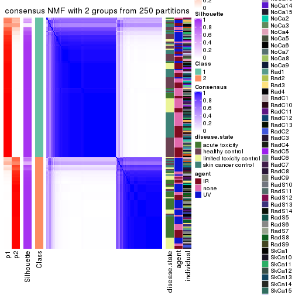</p>

</div>
<div id='tab-ATC-NMF-consensus-heatmap-2'>
<pre><code class="r">consensus_heatmap(res, k = 3)
</code></pre>

<p>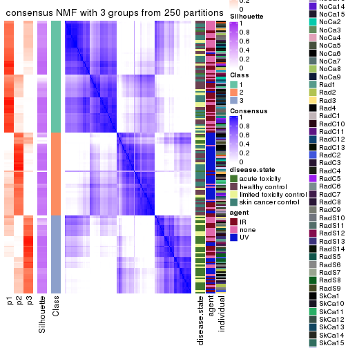</p>

</div>
<div id='tab-ATC-NMF-consensus-heatmap-3'>
<pre><code class="r">consensus_heatmap(res, k = 4)
</code></pre>

<p>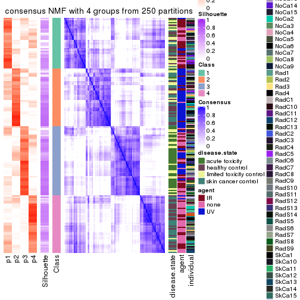</p>

</div>
<div id='tab-ATC-NMF-consensus-heatmap-4'>
<pre><code class="r">consensus_heatmap(res, k = 5)
</code></pre>

<p>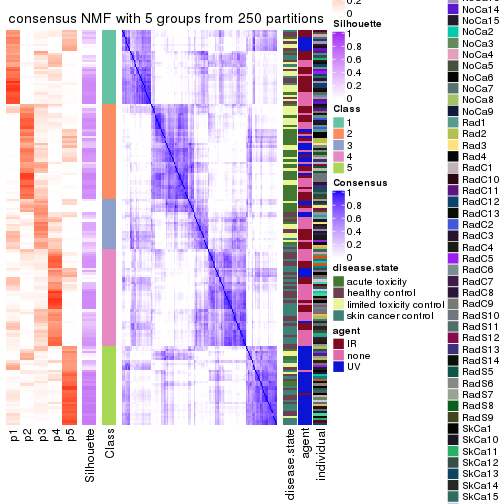</p>

</div>
<div id='tab-ATC-NMF-consensus-heatmap-5'>
<pre><code class="r">consensus_heatmap(res, k = 6)
</code></pre>

<p>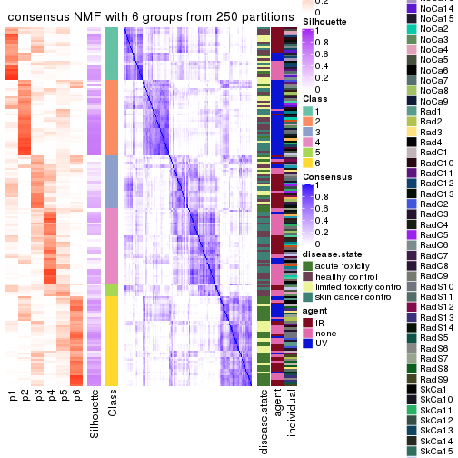</p>

</div>
</div>

Heatmaps for the membership of samples in all partitions to see how consistent they are:


<script>
$( function() {
	$( '#tabs-ATC-NMF-membership-heatmap' ).tabs();
} );
</script>
<div id='tabs-ATC-NMF-membership-heatmap'>
<ul>
<li><a href='#tab-ATC-NMF-membership-heatmap-1'>k = 2</a></li>
<li><a href='#tab-ATC-NMF-membership-heatmap-2'>k = 3</a></li>
<li><a href='#tab-ATC-NMF-membership-heatmap-3'>k = 4</a></li>
<li><a href='#tab-ATC-NMF-membership-heatmap-4'>k = 5</a></li>
<li><a href='#tab-ATC-NMF-membership-heatmap-5'>k = 6</a></li>
</ul>
<div id='tab-ATC-NMF-membership-heatmap-1'>
<pre><code class="r">membership_heatmap(res, k = 2)
</code></pre>

<p>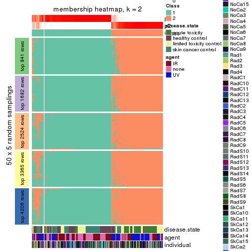</p>

</div>
<div id='tab-ATC-NMF-membership-heatmap-2'>
<pre><code class="r">membership_heatmap(res, k = 3)
</code></pre>

<p>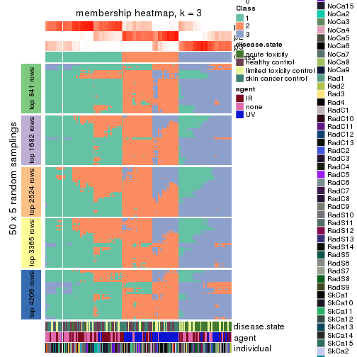</p>

</div>
<div id='tab-ATC-NMF-membership-heatmap-3'>
<pre><code class="r">membership_heatmap(res, k = 4)
</code></pre>

<p>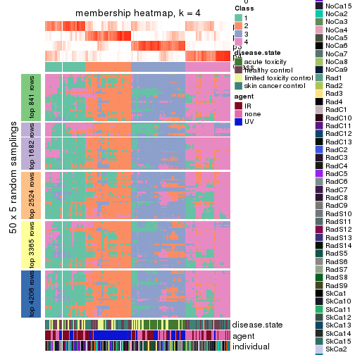</p>

</div>
<div id='tab-ATC-NMF-membership-heatmap-4'>
<pre><code class="r">membership_heatmap(res, k = 5)
</code></pre>

<p>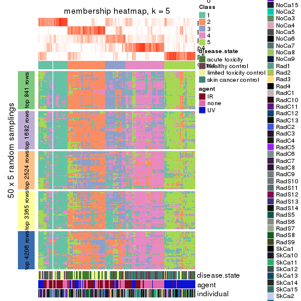</p>

</div>
<div id='tab-ATC-NMF-membership-heatmap-5'>
<pre><code class="r">membership_heatmap(res, k = 6)
</code></pre>

<p>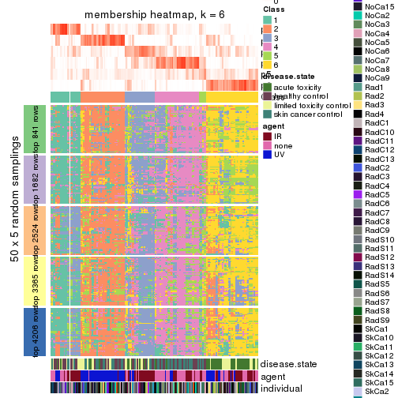</p>

</div>
</div>

As soon as we have had the classes for columns, we can look for signatures
which are significantly different between classes which can be candidate marks
for certain classes. Following are the heatmaps for signatures.


Signature heatmaps where rows are scaled:


<script>
$( function() {
	$( '#tabs-ATC-NMF-get-signatures' ).tabs();
} );
</script>
<div id='tabs-ATC-NMF-get-signatures'>
<ul>
<li><a href='#tab-ATC-NMF-get-signatures-1'>k = 2</a></li>
<li><a href='#tab-ATC-NMF-get-signatures-2'>k = 3</a></li>
<li><a href='#tab-ATC-NMF-get-signatures-3'>k = 4</a></li>
<li><a href='#tab-ATC-NMF-get-signatures-4'>k = 5</a></li>
<li><a href='#tab-ATC-NMF-get-signatures-5'>k = 6</a></li>
</ul>
<div id='tab-ATC-NMF-get-signatures-1'>
<pre><code class="r">get_signatures(res, k = 2)
</code></pre>

<p>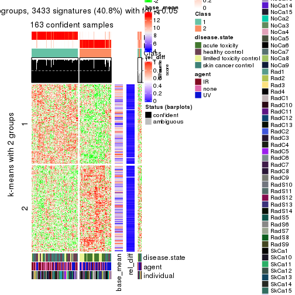</p>

</div>
<div id='tab-ATC-NMF-get-signatures-2'>
<pre><code class="r">get_signatures(res, k = 3)
</code></pre>

<p>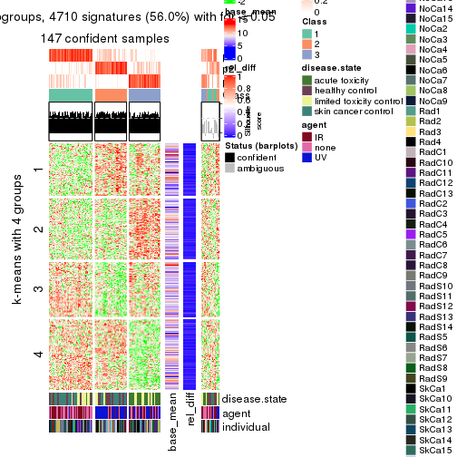</p>

</div>
<div id='tab-ATC-NMF-get-signatures-3'>
<pre><code class="r">get_signatures(res, k = 4)
</code></pre>

<p>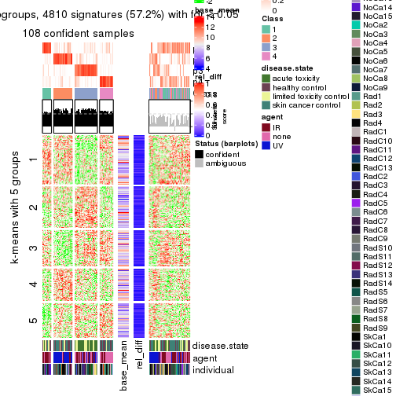</p>

</div>
<div id='tab-ATC-NMF-get-signatures-4'>
<pre><code class="r">get_signatures(res, k = 5)
</code></pre>

<p>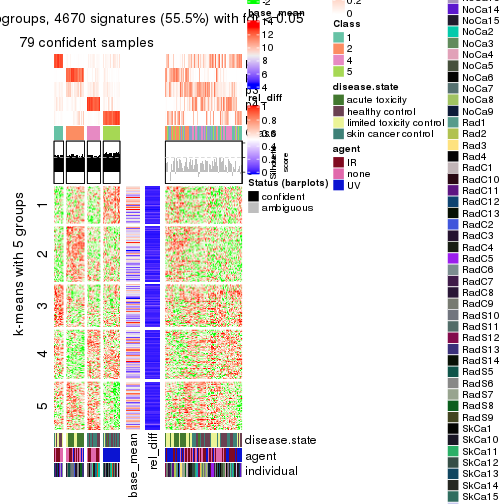</p>

</div>
<div id='tab-ATC-NMF-get-signatures-5'>
<pre><code class="r">get_signatures(res, k = 6)
</code></pre>

<p>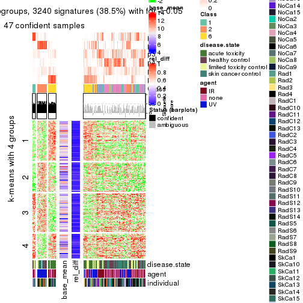</p>

</div>
</div>


Signature heatmaps where rows are not scaled:


<script>
$( function() {
	$( '#tabs-ATC-NMF-get-signatures-no-scale' ).tabs();
} );
</script>
<div id='tabs-ATC-NMF-get-signatures-no-scale'>
<ul>
<li><a href='#tab-ATC-NMF-get-signatures-no-scale-1'>k = 2</a></li>
<li><a href='#tab-ATC-NMF-get-signatures-no-scale-2'>k = 3</a></li>
<li><a href='#tab-ATC-NMF-get-signatures-no-scale-3'>k = 4</a></li>
<li><a href='#tab-ATC-NMF-get-signatures-no-scale-4'>k = 5</a></li>
<li><a href='#tab-ATC-NMF-get-signatures-no-scale-5'>k = 6</a></li>
</ul>
<div id='tab-ATC-NMF-get-signatures-no-scale-1'>
<pre><code class="r">get_signatures(res, k = 2, scale_rows = FALSE)
</code></pre>

<p>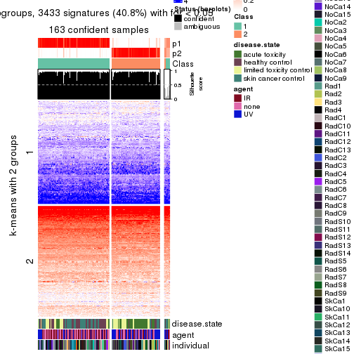</p>

</div>
<div id='tab-ATC-NMF-get-signatures-no-scale-2'>
<pre><code class="r">get_signatures(res, k = 3, scale_rows = FALSE)
</code></pre>

<p>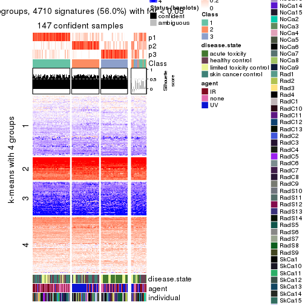</p>

</div>
<div id='tab-ATC-NMF-get-signatures-no-scale-3'>
<pre><code class="r">get_signatures(res, k = 4, scale_rows = FALSE)
</code></pre>

<p>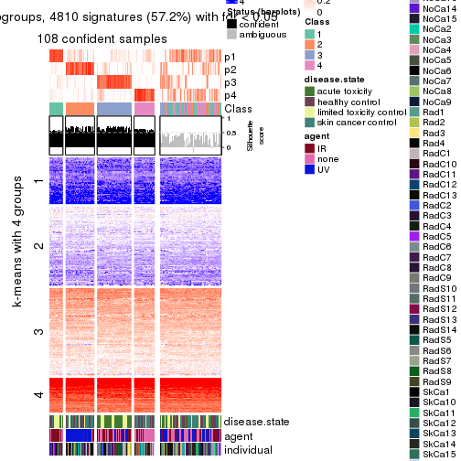</p>

</div>
<div id='tab-ATC-NMF-get-signatures-no-scale-4'>
<pre><code class="r">get_signatures(res, k = 5, scale_rows = FALSE)
</code></pre>

<p>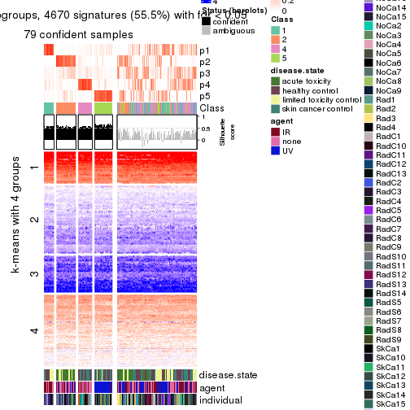</p>

</div>
<div id='tab-ATC-NMF-get-signatures-no-scale-5'>
<pre><code class="r">get_signatures(res, k = 6, scale_rows = FALSE)
</code></pre>

<p>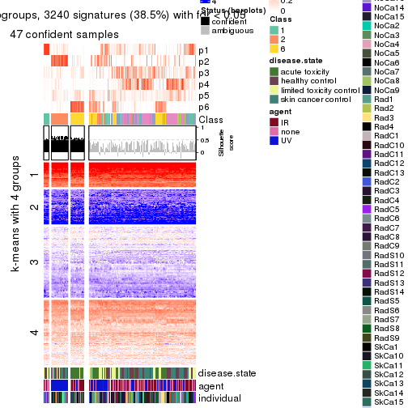</p>

</div>
</div>


Compare the overlap of signatures from different k:

```r
compare_signatures(res)
```

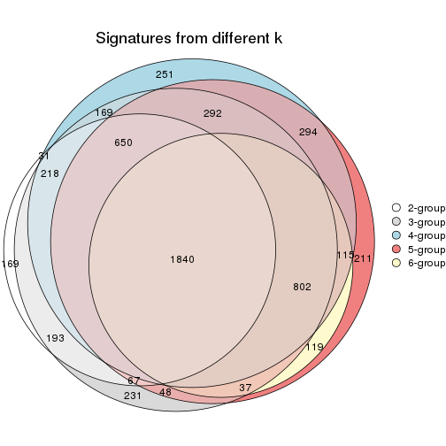

`get_signature()` returns a data frame invisibly. TO get the list of signatures, the function
call should be assigned to a variable explicitly. In following code, if `plot` argument is set
to `FALSE`, no heatmap is plotted while only the differential analysis is performed.

```r
# code only for demonstration
tb = get_signature(res, k = ..., plot = FALSE)
```

An example of the output of `tb` is:

```
#>   which_row         fdr    mean_1    mean_2 scaled_mean_1 scaled_mean_2 km
#> 1        38 0.042760348  8.373488  9.131774    -0.5533452     0.5164555  1
#> 2        40 0.018707592  7.106213  8.469186    -0.6173731     0.5762149  1
#> 3        55 0.019134737 10.221463 11.207825    -0.6159697     0.5749050  1
#> 4        59 0.006059896  5.921854  7.869574    -0.6899429     0.6439467  1
#> 5        60 0.018055526  8.928898 10.211722    -0.6204761     0.5791110  1
#> 6        98 0.009384629 15.714769 14.887706     0.6635654    -0.6193277  2
...
```

The columns in `tb` are:

1. `which_row`: row indices corresponding to the input matrix.
2. `fdr`: FDR for the differential test. 
3. `mean_x`: The mean value in group x.
4. `scaled_mean_x`: The mean value in group x after rows are scaled.
5. `km`: Row groups if k-means clustering is applied to rows.


UMAP plot which shows how samples are separated.


<script>
$( function() {
	$( '#tabs-ATC-NMF-dimension-reduction' ).tabs();
} );
</script>
<div id='tabs-ATC-NMF-dimension-reduction'>
<ul>
<li><a href='#tab-ATC-NMF-dimension-reduction-1'>k = 2</a></li>
<li><a href='#tab-ATC-NMF-dimension-reduction-2'>k = 3</a></li>
<li><a href='#tab-ATC-NMF-dimension-reduction-3'>k = 4</a></li>
<li><a href='#tab-ATC-NMF-dimension-reduction-4'>k = 5</a></li>
<li><a href='#tab-ATC-NMF-dimension-reduction-5'>k = 6</a></li>
</ul>
<div id='tab-ATC-NMF-dimension-reduction-1'>
<pre><code class="r">dimension_reduction(res, k = 2, method = &quot;UMAP&quot;)
</code></pre>

<p>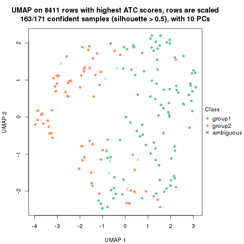</p>

</div>
<div id='tab-ATC-NMF-dimension-reduction-2'>
<pre><code class="r">dimension_reduction(res, k = 3, method = &quot;UMAP&quot;)
</code></pre>

<p>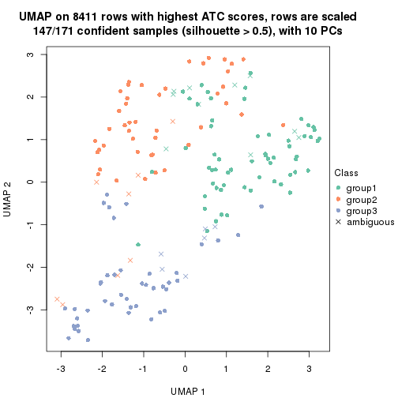</p>

</div>
<div id='tab-ATC-NMF-dimension-reduction-3'>
<pre><code class="r">dimension_reduction(res, k = 4, method = &quot;UMAP&quot;)
</code></pre>

<p>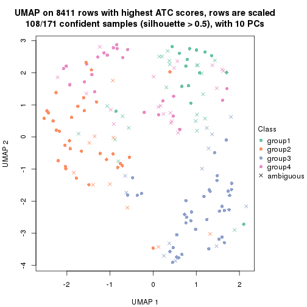</p>

</div>
<div id='tab-ATC-NMF-dimension-reduction-4'>
<pre><code class="r">dimension_reduction(res, k = 5, method = &quot;UMAP&quot;)
</code></pre>

<p>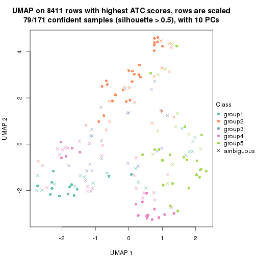</p>

</div>
<div id='tab-ATC-NMF-dimension-reduction-5'>
<pre><code class="r">dimension_reduction(res, k = 6, method = &quot;UMAP&quot;)
</code></pre>

<p>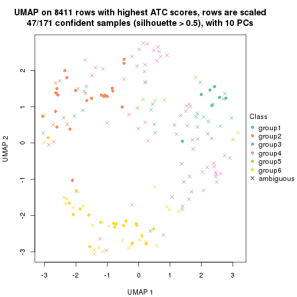</p>

</div>
</div>


Following heatmap shows how subgroups are split when increasing `k`:

```r
collect_classes(res)
```

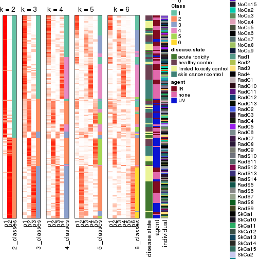


Test correlation between subgroups and known annotations. If the known
annotation is numeric, one-way ANOVA test is applied, and if the known
annotation is discrete, chi-squared contingency table test is applied.

```r
test_to_known_factors(res)
```

```
#>           n disease.state(p) agent(p) individual(p) k
#> ATC:NMF 163         1.06e-11 2.39e-05      0.000229 2
#> ATC:NMF 147         2.06e-17 5.05e-12      0.000149 3
#> ATC:NMF 108         1.46e-14 4.45e-13      0.010165 4
#> ATC:NMF  79         6.99e-10 3.17e-11      0.011481 5
#> ATC:NMF  47         4.12e-06 1.37e-07      0.147228 6
```


If matrix rows can be associated to genes, consider to use `functional_enrichment(res,
...)` to perform function enrichment for the signature genes. See [this vignette](http://bioconductor.org/packages/devel/bioc/vignettes/cola/inst/doc/functional_enrichment.html) for more detailed explanations.


 

## Session info


```r
sessionInfo()
```

```
#> R version 3.6.0 (2019-04-26)
#> Platform: x86_64-pc-linux-gnu (64-bit)
#> Running under: CentOS Linux 7 (Core)
#> 
#> Matrix products: default
#> BLAS:   /usr/lib64/libblas.so.3.4.2
#> LAPACK: /usr/lib64/liblapack.so.3.4.2
#> 
#> locale:
#>  [1] LC_CTYPE=en_GB.UTF-8       LC_NUMERIC=C               LC_TIME=en_GB.UTF-8       
#>  [4] LC_COLLATE=en_GB.UTF-8     LC_MONETARY=en_GB.UTF-8    LC_MESSAGES=en_GB.UTF-8   
#>  [7] LC_PAPER=en_GB.UTF-8       LC_NAME=C                  LC_ADDRESS=C              
#> [10] LC_TELEPHONE=C             LC_MEASUREMENT=en_GB.UTF-8 LC_IDENTIFICATION=C       
#> 
#> attached base packages:
#> [1] grid      stats     graphics  grDevices utils     datasets  methods   base     
#> 
#> other attached packages:
#> [1] genefilter_1.66.0    ComplexHeatmap_2.3.1 markdown_1.1         knitr_1.26          
#> [5] GetoptLong_0.1.7     cola_1.3.2          
#> 
#> loaded via a namespace (and not attached):
#>  [1] circlize_0.4.8       shape_1.4.4          xfun_0.11            slam_0.1-46         
#>  [5] lattice_0.20-38      splines_3.6.0        colorspace_1.4-1     vctrs_0.2.0         
#>  [9] stats4_3.6.0         blob_1.2.0           XML_3.98-1.20        survival_2.44-1.1   
#> [13] rlang_0.4.2          pillar_1.4.2         DBI_1.0.0            BiocGenerics_0.30.0 
#> [17] bit64_0.9-7          RColorBrewer_1.1-2   matrixStats_0.55.0   stringr_1.4.0       
#> [21] GlobalOptions_0.1.1  evaluate_0.14        memoise_1.1.0        Biobase_2.44.0      
#> [25] IRanges_2.18.3       parallel_3.6.0       AnnotationDbi_1.46.1 highr_0.8           
#> [29] Rcpp_1.0.3           xtable_1.8-4         backports_1.1.5      S4Vectors_0.22.1    
#> [33] annotate_1.62.0      skmeans_0.2-11       bit_1.1-14           microbenchmark_1.4-7
#> [37] brew_1.0-6           impute_1.58.0        rjson_0.2.20         png_0.1-7           
#> [41] digest_0.6.23        stringi_1.4.3        polyclip_1.10-0      clue_0.3-57         
#> [45] tools_3.6.0          bitops_1.0-6         magrittr_1.5         eulerr_6.0.0        
#> [49] RCurl_1.95-4.12      RSQLite_2.1.4        tibble_2.1.3         cluster_2.1.0       
#> [53] crayon_1.3.4         pkgconfig_2.0.3      zeallot_0.1.0        Matrix_1.2-17       
#> [57] xml2_1.2.2           httr_1.4.1           R6_2.4.1             mclust_5.4.5        
#> [61] compiler_3.6.0
```


